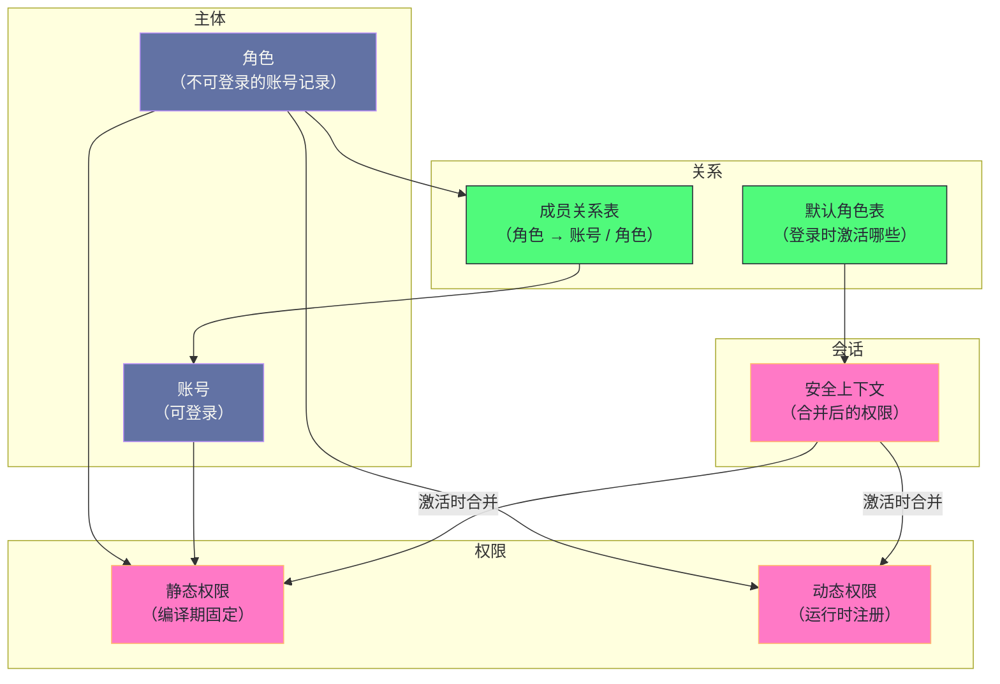

# 18. MySQL 8.0 角色与动态权限：从访问控制到权限管理的现代化转型

**摘要：**

权限系统的上一代形态（第 17 篇）解决的是"**判定如何又快又准**"，而它留下一个管理层面的问题：**权限"直接授予账号"，因此"同一类职责的账号"要"逐个授予同一批权限"**——**而"权限变更"就要"逐个账号改一遍"。** 角色与动态权限分别从两个方向解决了这个问题：**角色把"权限集合"变成"可命名、可复用、可继承的对象"**（因此"改一处即影响所有继承者"），**而动态权限打破了"权限集合编译期固定"的限制**（因此"插件与组件可以注册自己的权限"）。本文按"两种模型的差别 → 角色如何存储 → 如何授予与撤销 → 授予与激活为何分两层 → 激活如何实现 → 动态权限如何注册 → 生产上如何落地"展开。先说明两种模型的差别与三条收益、四处代价；再剖析角色"复用账号表"的实现方式与它的收益代价、成员关系表的结构、授权与撤销的事务化流程。然后重点讲"**授予不等于拥有**"这处关键区分与它背后的三条设计理由、激活机制的权限合并与角色层级的递归、以及激活状态的边界。之后是动态权限的动机、内置清单与注册接口。最后是角色层级设计、迁移策略、共存避坑、演进史与遗留设计。

---

## 第 1 章 权限管理要解决什么

### 1.1 两种模型的差别

**两种权限模型的差别可以用"关系的形状"概括。**

**传统模型是"账号与权限的多对多"**——**也就是说"每个账号各自持有一份权限集合"，而"相同职责的账号各自持有一份内容相同的集合"。**

**角色模型是"三层"**：**账号指向角色、角色指向权限**——**因此"相同职责的账号指向同一个角色"。**

**这处差别的后果集中在"变更"上**：**传统模型下"新增一项权限"要"改所有相关账号"**；**角色模型下"只需改那个角色"。**

**因此"角色的价值"不在"表达力"**（因为"两种模型能表达的权限集合是相同的"），**而在"变更的成本"**——**而"变更成本"在"账号数量多、职责分类稳定"的场景下会显著放大。**

### 1.2 三条收益

**角色带来三条收益。**

**收益一：变更的集中化。** **因为"权限挂在角色上"，所以"调整职责对应的权限"只需要"改一处"。**

**收益二：语义的显式化。** **因为"角色有业务含义的名字"**（例如"只读""备份操作员"），**所以"授权记录'读起来就是职责'"**——**而"这比'一长串权限清单'更可审计"。**

**收益三：最小权限的落地更容易。** **因为"可以先定义角色，再按职责分配"**——**因此"不必为每个账号单独推导权限集合"。**

**三条收益的共同特征是"它们都来自'多了一层抽象'"**——**而"抽象"的收益总是"变更更容易、表达更清晰"。** **这与"软件工程里的抽象"是同一逻辑**：**抽象把"重复的细节"收敛成"一个可命名的概念"。**

### 1.3 四条设计原则

这套机制遵循四条设计原则。

**原则一：复用存储。** **角色"复用账号表的存储"**——**因此"不需要为它设计新的存储结构"。** **这条原则是"兼容性"的来源，也是"账号表膨胀"的来源**（第 2 章展开）。

**原则二：授予与激活分离。** **"拥有角色"与"使用角色权限"是两件事**——**因此"授予之后还需要激活"。** **这条原则是"安全与灵活"的来源，代价是"使用上多一步"**（第 4 章展开）。

**原则三：权限可继承。** **角色可以授予角色**——**因此"可以构造层级"。** **这条原则让"权限的组织"可以"分层"。**

**原则四：权限可扩展。** **动态权限允许"运行时注册新权限"**——**因此"插件与组件也能受权限体系保护"。**

**四条原则的关系是"第一条决定'如何落地'，第二条决定'如何使用'，后两条决定'能表达什么'"**——**而"四者的组合"构成了这套机制的完整形态。**

### 1.4 四处代价

这套机制有四处代价。

**其一：账号表膨胀。** **因为"角色被存储为特殊账号"，所以"账号表里混着'不能登录的账号'"**——**而这会让"账号管理"与"审计"都变复杂。**

**其二：多了一步激活。** **因为"授予不等于拥有"，所以"使用者需要理解'激活'这个概念"**——**而"不理解"会导致"'明明授予了却没权限'"这类困惑。**

**其三：激活状态的一致性问题。** **因为"激活时权限被合并进会话"，所以"角色权限的回收不会影响已激活的角色"**（第 17 篇已展开这类窗口期问题）。

**其四：动态权限的兼容性。** **因为"动态权限是'运行时可变的集合'"，所以"依赖'固定权限清单'的工具可能无法识别它们"。**

**四处代价的共同特征是"它们是'抽象与扩展'的对价"**：**抽象带来"存储的复用与膨胀"，分离带来"多一步操作"，扩展带来"清单的不固定"。** **因此这套机制的优化方向，始终围绕"让抽象的成本更低、让扩展更兼容"。**

### 1.5 一个类比：岗位与工作证

把这套机制类比成"公司岗位"会更容易理解它的结构。

**"给每个人单独列一份工作职责清单"对应"传统模型"**——**而"职责调整时，每个人的清单都要改一遍"。**

**"先定义岗位，再把岗位指派给人"对应"角色模型"**——**而"职责调整时，只改岗位定义"。**

**"被指派了岗位，但还没有'上岗'"对应"授予但未激活"**——**因此"被指派岗位"不等于"已经能行使岗位权力"。**

**"上岗"对应"激活角色"**——**而"可以在一天内'先做普通岗、再做管理岗'"对应"会话内切换角色"。**

**"有些岗位是'全员必须的'"对应"强制角色"**——**而"它们不能被取消"。**

**"新设立的部门可以自己定义'专项权限'"对应"动态权限"**——**而"这些权限与既有权限一样受管理"。**

**这个类比的用处在于"它把四处代价变成了可感知的管理问题"**：**岗位也占编制表（账号表膨胀）、上岗要走流程（多一步激活）、换岗要重新交接（激活状态问题）、新部门权限要纳入统一管理（动态权限兼容性）。**

### 1.6 一个整体的结构图

把角色、动态权限与既有权限体系的关系画在一起，能看清它们在整体中的位置。

**图中最值得注意的是"权限可以挂在账号上，也可以挂在角色上"**：**因为"角色被当作账号"，所以"权限的挂载方式完全相同"。**

**这正是"复用存储"带来的结构简化**：**"权限与主体的关系"只有一种，而"主体'是账号还是角色'"由"字段约定"区分**（第 2.2 节）。

**而"会话上下文"这个节点值得留意**：**它"从静态权限与动态权限两处合并而来"**——**因此"判定时它已经是一份'展开后的权限集合'"，而不需要"再去查角色"。** **这条设计是"激活"存在的技术理由**：**因为"合并一次"比"每次判定都展开角色"更划算。**

---

## 第 2 章 角色的存储

### 2.1 复用账号表

**角色的实现方式是"把它存成一种特殊的账号记录"**——**而不是"设计一张独立的角色表"。**

**这个选择的意义在于"它让'权限的存储'完全复用"**：**因为"角色被当作账号"，所以"给角色授予权限"就是"给账号授予权限"**——**因此"权限存储的所有逻辑都不需要改"。**

**因此"复用"的收益是"极低的改造成本"**——**而"改造成本低"在"权限系统这类'牵一发动全身'的模块上"尤其重要。**

**这与第 17 篇讲的"权限表迁移到事务引擎"、第 16 篇讲的"元数据降级为普通数据"是同一手法**：**"复用已有机制"而不是"新建专用机制"。**

### 2.2 角色记录的特征

**角色记录与普通账号记录的差别体现在三个字段上。**

**第一个是"账户锁定标记"**：**角色被标记为锁定**——**因此"它不能用于登录认证"。**

**第二个是"认证插件为空"**——**因此"它没有认证方式"。**

**第三个是"认证字符串为空"**——**因此"它没有凭据"。**

**三个字段的共同作用是"让'这个记录不能作为登录身份'"**——**而"这正是'角色'与'账号'的语义差别"。**

**因此"区分角色与账号"的判据就是"这三个字段的组合"**——**而"这类'用字段组合表达类型'的做法"是"复用存储"的必然结果。** **它的代价是"类型判断依赖'字段的约定'"，而不依赖'显式的类型字段'"。**

### 2.3 权限记录的位置

**角色的权限记录与账号的权限记录"存在完全相同的位置"**——**也就是"各作用域的权限表"。**

**而"两者的区别"只在于"记录里的主体名是'角色名'还是'账号名'"**——**因此"从存储角度看，两者无法区分"。**

**这条"无法区分"带来一处实践后果**：**"查看某张表的权限记录时，需要'先判断这个名字是角色还是账号'"**——**而"这类判断需要额外的查询"。**

**因此"复用"的代价在"读取侧"体现为"需要额外的类型判断"**——**而"这类代价"是"复用存储"的典型形态**：**写入侧简单（因为"逻辑统一"），读取侧复杂（因为"语义需要推断"）。**

### 2.4 成员关系表

**"谁拥有哪个角色"由一张专门的关系表记录。**

**它的结构是"四个字段的主键"**：**源角色的用户名与来源、目标账号（或目标角色）的用户名与来源。**

**"目标是账号或角色"这一点很重要**：**它让"角色可以授予角色"**——**因此"权限可以分层组织"**（第 5.2 节展开递归激活）。

**而"四个字段都是主键"意味着"同一个'角色到账号'的关系不能重复"**——**因此"重复授予会失败或被视为幂等"。**

**这张表的设计说明一个通用手法**：**"多对多关系"用"关系表加联合主键"表达**——**而"联合主键"同时提供了"唯一性保证"与"查找索引"。**

### 2.5 复用的收益与代价

**把"复用存储"的收益与代价汇总一下，可以看出这类选择的完整图景。**

**收益有三处**：**"改造成本极低"**（不必改动权限存储逻辑）、**"权限判定逻辑完全复用"**（因此"角色权限与账号权限走同一条判定路径"）、**"备份与恢复等运维手段统一"**。

**代价有三处**：**"账号表膨胀"**、**"类型判断需要额外查询"**、**"账号与角色的生命周期管理混在一起"**（例如"删除账号时需要考虑'它是否被当作角色引用'"）。

**三处代价的共同特征是"它们都是'语义混在同一存储里'的后果"**——**而"这类代价"在"复用存储"的方案里不可避免。**

**因此"该不该复用"的判断依据是"改造的收益是否大于'语义混杂'的成本"**——**而在"权限系统这类高风险的模块上"，"低成本落地"的收益通常更大。** **这也是"为什么角色没有使用独立存储"**——**而"演进方向里包含了'角色的独立化'"**（第 8.3 节），**说明这笔成本"在长期看是可以优化的"。**

### 2.6 一条关于"复用"的通用判断

**把"复用存储"这件事的判断方式收敛一下，因为它在整个专栏里反复出现。**

**"复用"的收益总是三处**：**"改造成本低""逻辑统一""运维手段统一"**。**而它的代价总是两处**：**"语义混杂"与"读取侧需要推断"。**

**因此"该不该复用"可以按三个问题回答**：**"被复用对象的语义与目标语义差异有多大"**（差异大则混杂严重）、**"读取侧能否承担推断成本"**（不能则不该复用）、**"新建专用存储的收益是否足够大"**（足够大则值得新建）。

**这三个问题里，"语义差异"是最关键的一个**——**因为"差异的大小"决定了"混杂的严重程度"**：**差异小（例如本机制的"三个字段"）则"混杂可接受"**；**差异大（例如"两类完全不同的对象"）则"复用会把两类语义搅在一起"，**因此**"读取侧的推断会变得脆弱"。**

**因此"复用"有一条隐性的适用边界**：**它适用于"两个对象'大部分属性相同、少部分不同'"的场景**——**而"完全不同"的对象"复用"会带来"难以维护的推断逻辑"。** **这条边界与"继承"的适用边界是同一回事**：**继承适用于"大部分相同"的类，而不适用于"仅表面上相似"的类。**

**本机制的选择是"复用"**——**因为"角色与账号的语义差异'只在三个字段上'"，而"读取侧的推断成本'可以接受'"。** **而"演进方向里包含'独立化'"说明"随着时间推移，这笔账可能重新算"。**

**这条判断的通用价值在于"它把'复用还是新建'变成了可评估的问题"**——**而不是"凭'复用总是好的'这种印象做决定"。**

---

## 第 3 章 授权与撤销

### 3.1 授权的流程

**"把角色授予账号"的流程分五步。**

**第一步：校验两端。** **确认"源是角色"且"目标是账号或角色"**——**因此"不能把账号授予账号"。**

**第二步：开启事务。**

**第三步：写入成员关系表。**

**第四步：提交事务。**

**第五步：增量更新缓存。**

**五步里"第一步的校验"值得留意**：**它保证"关系的方向是'角色到账号'"**——**因此"角色体系是一棵'从角色指向账号'的有向结构"。**

**而"第五步的增量更新"是第 17 篇讲的"增量更新"在这里的应用**——**因此"授权后不需要手动刷新"。**

### 3.2 撤销的流程

**撤销的流程多一步。**

**除了"删除成员关系记录"之外，还需要"删除该角色的默认激活标记"**——**因为"如果'默认角色'里还留着它，那么'下次登录会尝试激活一个已撤销的角色'"。**

**这一步的意义在于"它保证了'两处记录的一致性'"**：**因为"角色的授予状态"分布在"成员关系表"与"默认角色表"两处**——**因此"撤销时必须同时清理"。**

**这类"两处记录需要同时维护"的情况在所有"关系加配置"的模型里都存在**——**而"处置方式"是"让撤销逻辑同时覆盖两处"。**

### 3.3 原子性保障

**授权与撤销都是事务性的**——**因此"若在写入关系记录后、提交前崩溃，整个操作回滚"。**

**这条保障的来源是第 17 篇讲的"权限表迁移到事务引擎"**——**因此"原子性"不是"角色机制自己实现的"，而是"复用存储带来的"。**

**这是"复用存储"的一处典型收益**：**因为"角色关系表也是事务引擎表"，所以"它自动获得了事务性"。** **而"如果为角色设计了独立存储"，那么"这类保障需要单独实现"。**

### 3.4 增量更新与"已激活角色"

**增量更新解决了"缓存的一致性"，但没有解决"会话的一致性"。**

**具体来说**：**"撤销角色后，已激活该角色的会话仍然拥有那些权限"**——**而"这与第 17 篇讲的'权限回收不生效'是同一类问题"。**

**因此"处置方式"也相同**：**需要"重新激活角色"或"重连"。** **而"重新激活"这一步的存在说明"角色激活状态也是'会话级快照'的一种"。**

**这条一致性问题的共同根源是"快照的粒度"**：**"全局权限的快照粒度是'连接'"，而"角色激活的快照粒度是'激活动作'"**——**因此"两者的失效时机不同"。** **而"理解'快照的粒度'"就"理解了'变更何时生效'"。**

### 3.5 一处关于"两处记录"的经验

**"撤销时要同时清理两处记录"这件事值得再展开一层。**

**这类"同一件事分布在两处"的情况在权限模型里有两处**：**"角色的授予关系"（成员关系表）与"默认激活配置"（默认角色表）。**

**而"两处需要同时维护"的后果是"撤销逻辑必须覆盖两处"**——**因为"漏掉任何一处都会留下'悬空引用'"**（例如"默认角色指向一个已撤销的角色"）。

**这类"悬空引用"的表现形态是"下次登录时激活失败"或"权限异常"**——**而"它的根因'在撤销时的那一刻'"，**因此**"排查时容易归错因"。**

**因此一条通用纪律是**：**"当'同一个事实'被记录在两处时，所有'改变这个事实'的操作都必须同时覆盖两处"**——**而"覆盖的完整性"应当通过"不变量检查"来保证**（例如"默认角色必须是已授予的角色"）。

**这条纪律与第 12 篇讲的"多写入点要逐个推演崩溃场景"是同一类**：**"多写入点"是"一致性风险"的常见来源**——**而"处理方式是'明确不变量'并'保证每次修改都维持它'"。**

---

## 第 4 章 授予与激活的两层

### 4.1 一个关键区分

**"授予角色"与"拥有角色权限"是两件事**——**而这是这套机制里最需要理解的一处区分。**

**"授予"是"建立关系"**——**它"记录在成员关系表里"，**因此**"它是持久的"。**

**"激活"是"让权限在当前会话生效"**——**它"把角色的权限合并进会话上下文"，**因此**"它只影响当前会话"。**

**因此"授予但未激活"的账号"看起来有角色，但实际没有权限"**——**而"这处落差"是"授予不等于拥有"这个说法的准确含义。**

### 4.2 默认角色

**默认角色解决"每次登录都要手动激活"这个麻烦。**

**它的机制是"在默认角色表里记录'登录时应当自动激活哪些角色'"**——**因此"登录时自动完成激活"。**

**而"设置默认角色"的方式有三种**：**指定具体角色**、**指定'全部已授予角色'**、**以及"撤销全部默认角色"。**

**三种方式的存在说明"默认激活"是可配置的**——**而"可配置"的意义在于"它适配不同的使用习惯"**（有的团队希望"登录即有全部权限"，有的希望"显式激活"）。

### 4.3 手动激活

**手动激活的四种形式值得列出，因为它们覆盖了"会话内切换权限集合"的全部需求。**

**形式一是"激活指定角色"**——**它让"当前会话获得该角色的权限"。**

**形式二是"激活全部已授予角色"**——**它让"当前会话获得所有已授予的权限"。**

**形式三是"激活除指定角色之外的全部"**——**它让"当前会话获得大部分权限，但排除某个敏感角色"。**

**形式四是"撤销全部激活"**——**它让"当前会话回到'无角色'状态"。**

**四种形式的共同特征是"它们都在'会话内'生效"**——**因此"它们不改变'授予关系'"。** **而"这处区分"正是"授予与激活分离"的价值所在**：**"权限的持久授予"与"权限的临时使用"被分开了。**

### 4.4 强制角色

**强制角色是"所有账号都必须激活的角色"**——**而"它的特殊性在于'不能被撤销'"**。

**它的机制是"在配置里指定角色名"**——**因此"所有账号登录时都会激活它们"。**

**而"不能被撤销"这一点值得留意**：**"撤销全部激活"这个动作"对强制角色无效"**——**因此"强制角色提供的权限'始终存在'"。**

**这条设计的用途是"强制审计与监控"**——**例如"让所有账号都能被审计系统读取元数据"。** **而它的代价是"它削弱了'最小权限'的纯粹性"**——**因为"它给所有账号加了一份统一权限"。**

**因此"使用强制角色"需要"确认'这份统一权限对所有人都合适'"**——**而"不合适的强制权限"会"成为一处普遍的安全敞口"。**

### 4.5 为什么设计两层

**"授予与激活分离"这个设计有三条理由。**

**理由一是"安全"**：**因为"授予后立即生效"会让"正在执行的操作'突然获得新权限'"**——**而"这不符合'权限应当显式使用'的预期"。**

**理由二是"灵活"**：**因为"同一个会话可以切换权限集合"**——**因此"可以在'一次连接'里'先做普通操作、再做管理操作'"。**

**理由三是"兼容"**：**因为"角色是上层抽象，底层仍是账号权限"**——**因此"现有权限模型完全不受影响"。**

**三条理由的共同特征是"它们在'安全性'与'灵活性'之间取了平衡"**——**而"两层的设计"正是这个平衡的载体**：**"授予"提供"持久的权限归属"，"激活"提供"临时的权限使用"。**

**这与第 12 篇讲的"事务与快照的分离"是同一手法**：**"持久的状态"与"会话的视图"分开表达**——**而"分离"让"两者可以各自按需要的节奏变化"。**

---

## 第 5 章 激活机制的实现

### 5.1 权限合并

**激活的实质是"把角色的权限位掩码合并进会话上下文"。**

**具体是"对会话上下文里的全局权限位掩码做'或运算'"**——**因此"激活后的权限是'原有权限加角色权限'的并集"。**

**"并集"这个性质值得留意**：**它意味着"激活角色'只会增加权限，不会减少'"**——**因此"不能用'激活某个角色'来'限制权限'"。**

**这条性质的实践含义是**：**"想'限制权限'只能靠'不授予'，而不能靠'激活一个受限角色'"**——**而"这与'角色的作用是聚合权限'这个定位一致"。**

### 5.2 角色层级与递归

**"角色可以授予角色"带来"层级"，而"激活"需要"递归处理"。**

**具体是"激活一个角色时，还要'递归激活它拥有的角色'"**——**因此"层级的每一层都会被展开"。**

**这条递归的存在让"权限的组织"可以"分层设计"**：**例如"基础只读角色"被"报表角色"继承，而"报表角色"被"报表管理员"继承。**

**而"递归"带来的风险是"层级可能出现循环"**——**因此"建立关系时应当阻止'循环继承'"**（否则"递归会无限展开"）。

**这类"层级加循环检测"的组合在"权限系统"里很常见**——**而"防止循环"的通用方式是"建立关系时检查'是否已经存在反向路径'"。**

### 5.3 已激活角色列表

**激活机制还会"记录'当前会话已激活哪些角色'"**——**而这份记录用于"回答'当前生效的角色是什么'"。**

**这条记录的存在让"权限的来源可追溯"**——**因为"可以对比'已激活角色'与'当前权限'"**，**从而"定位某个权限来自哪里"。**

**而"可追溯"在"权限排查"里很关键**：**因为"权限可能来自'全局权限''角色''强制角色'三处"**——**而"不清楚来源就无法'正确地撤销'"。**

### 5.4 激活状态的边界

**激活状态有三处边界值得说明。**

**边界一：它是"会话级"的**——**因此"断开重连会回到'默认角色'的状态"。**

**边界二：它"不感知后续的角色权限变更"**——**因此"回收角色权限后需要重新激活"。**

**边界三：它"不能被用来减少权限"**——**因为"合并是并集"。**

**三处边界的共同特征是"它们都由'激活是一次性的合并动作'这个实现方式决定"**——**而"理解这个实现方式"，就能"推出这三处边界"。**

**因此"面对这类机制"的正确做法是"先理解它的实现方式，再推出它的行为边界"**——**而"这比'记住每一条行为'更可靠"。**

### 5.5 一处关于"并集"的经验

**"权限合并是并集"这条性质值得再展开一层，因为它体现了一类通用规律。**

**"并集"意味着"权限只能增加，不能减少"**——**因此"激活角色'永远不是'限制手段'"。**

**这条规律在别处也出现**：**"多个角色叠加"的结果是"并集"**；**"直接授予的权限与角色权限叠加"的结果也是"并集"**；**"强制角色的权限'始终存在'"因此它也是"并集"的一部分。**

**三处的共同特征是"它们都源于'权限的表达方式是位掩码'"**——**因为"位掩码的合并天然是'或运算'"**，**因此"结果必然是并集"。**

**这条规律给出一条重要的实践含义**：**"想限制权限，只能'不授予'，而不能'授予一个受限的角色'"**——**而"任何'用角色来限制权限'的想法都是方向错误的"。**

**因此"设计权限时"应当"从最小集合出发逐步添加"，而不是"从大集合出发逐步排除"**——**因为"排除'在并集模型下无法实现"。**

**这条实践含义值得再强调一次，因为它容易被"直觉"误导**：**"给一个宽权限角色再加一个'限制角色'"这个想法看起来很自然**（因为"在很多系统里'拒绝优先于允许'"），**而它在"并集模型"下"完全不起作用"。**

**因此"看到'并集模型'时，应当立刻想到'拒绝规则不存在'"**——**而"这决定了'权限设计的方向只能是'加法'"。** **这条判断的通用性在于"它提醒'模型的代数性质决定了可表达的策略'"**——**而"并集模型"的表达力"只覆盖'允许'，不覆盖'拒绝'"。**

---

## 第 6 章 动态权限

### 6.1 为什么需要它

**静态权限的问题是"它的集合在编译期固定"**——**因此"插件或组件引入新功能时，无法'为这个功能定义一个权限'"。**

**而"没有专门权限"的后果是两处**：**其一，"只能复用某个通用权限"**（从而"权限过大"）；**其二，"只能不加保护"**（从而"任何账号都能用这个功能"）。

**因此动态权限的动机是"让'新功能'也能有'恰好对应的权限'"**——**而"恰好对应"是"最小权限"的前提。**

### 6.2 内置的动态权限

**较新版本内置了一批动态权限，而它们可以归为三类。**

**第一类是"替代旧通用权限的细分权限"**——**例如"连接管理""系统变量管理"等，**而**"它们的出现是为了'拆分过去过于笼统的权限'"。**

**第二类是"特定组件的管理权限"**——**例如"组复制管理""备份锁管理""审计管理"。**

**第三类是"观察与豁免类"**——**例如"观察敏感变量""绕过防火墙"。**

**三类里"第一类最值得留意"**：**因为它说明"动态权限机制不只是'为新功能服务'，还'用于拆分旧权限'"**——**而"拆分"的收益是"可以按需要授予更小的权限集合"。**

**这与第 17 篇讲的"最小权限落地"是同一目标**：**"权限越细，越能'恰好对应职责'"**——**而"细"的前提是"权限体系支持新增权限"。**

### 6.3 注册接口

**动态权限的注册由"一个接口"完成**——**而"插件在初始化时调用它"，**因此**"权限在'插件加载时'被登记"。**

**这条设计的意义在于"它把'权限的定义'交给了'功能的实现者'"**——**因此"权限体系不必'预先知道所有功能'"。**

**而它带来的约束是"权限的存在性依赖'插件的加载状态'"**——**因此"如果插件未加载，那么'依赖它的权限'不存在"。** **这条约束解释了"为什么'给账号授予某个动态权限'可能失败"**（因为"那个权限所属的组件没加载"）。

### 6.4 存储位置

**动态权限的授予记录"存在一张专门的表里"**——**而不是"存在账号表的字段里"。**

**这个选择的原因是"动态权限的数量与名称都是可变的"**——**因此"无法用'固定的字段'表达"。** **而"用'表记录'表达"就能"容纳任意数量的权限"。**

**这与第 3 篇讲的"把'字典自身的属性'也变成表"是同一手法**：**"当'属性集合'本身可变时，用'表'替代'字段'。"** **而"字段改表"这个动作的收益是"扩展不需要改结构"。**

### 6.5 一处关于"扩展点"的经验

**"动态权限"这个扩展点的设计值得再展开一层，因为它体现了一类通用的扩展手法。**

**"扩展点"的作用是"让'功能的实现者'也能'定义权限'"**——**因此"权限体系不必'预先枚举所有功能'"。**

**这类"把'扩展的定义权'交给'实现者'"的手法在别处也出现**：**"存储引擎接口"让"引擎实现者'定义自己的能力标志'"**（第 1 篇）、**"认证插件接口"让"插件'定义自己的认证方式'"**（第 17 篇）。

**三处的共同特征是"它们都'把'变化的部分'外移给'变化的来源'"**——**而"这类设计"的价值在于"核心不必跟着变化"。

**而它们的共同代价是"核心失去了'对全部情况的静态可见性'"**——**例如"权限体系不再能'枚举所有权限'"，**因此**"依赖静态清单的工具需要适配"。**

**因此"设计扩展点时"应当"明确'扩展的注册时机'与'注册的可见性'"**——**因为"这两者决定了'扩展的可靠性'与'可观测性'"。** **本机制的选择是"注册时机是'插件加载'"，而"可见性通过'专用表'提供"**——**而"这两处选择"恰好对应了"动态权限的两处遗留问题"。**

**这条分析的实用价值在于"它把'扩展点'的设计问题变成了两个可回答的问题"**：**"扩展何时注册"与"扩展如何被看见"。** **而"这两个问题的答案"决定了"扩展在'未加载''加载中''加载后'三种状态下的行为"。**

---

## 第 7 章 生产落地

### 7.1 角色层级设计

**角色层级的设计有一条实用原则：按"职责的粒度"分层，而不是按"组织架构"分层。**

**"按职责粒度分层"的含义是**：**底层是"单一能力"的角色**（例如"只读""只写"），**中层是"职责组合"的角色**（例如"报表读者""订单操作员"），**上层是"管理类"角色。**

**而"按组织架构分层"的问题是"组织会变"**——**因此"角色体系需要跟着组织调整"**——**而"这类调整的成本很高"。**

**因此"角色体系应当围绕'稳定的职责分类'建立"**——**而"组织变动"只影响"账号与角色的映射"，不影响"角色本身"。**

**这条原则的通用性在于"它区分了'稳定的抽象'与'易变的关系'"**——**而"把易变的部分放在'映射'上"是"降低变更成本"的通用手段。**

### 7.2 迁移策略

**从"直接授予"迁移到"角色模型"有一个渐进路径。**

**第一步：为"现有账号的典型权限组合"定义角色**——**而"定义依据是'实际权限的聚类'"**（例如"把权限相似的账号归为一类"）。

**第二步：把角色授予这些账号**——**而"这一步不撤销原权限"**，因此**"不影响现有行为"。**

**第三步：逐步撤销"直接授予的权限"**——**而"这一步需要验证'角色是否覆盖了原有权限'"。**

**第四步：新账号"只授予角色"**——**因此"不再产生新的'直接授予'"。**

**四步的共同特征是"它们把'大变更'拆成了'可验证的小步'"**——**而"每步都保持'现有行为不变'"，**因此**"迁移可以在业务不停的情况下推进"。**

**这与第 3 篇讲的"迁移前必须演练"、第 16 篇讲的"渐进过渡"是同一纪律**：**"高风险变更应当'分步且每步可验证'"。**

### 7.3 监控要点

**角色侧可观测的信息有三类。**

**第一类是"角色与账号的数量"**——**而"角色数量异常增长"可能意味着"角色定义过于细碎"。**

**第二类是"角色与权限的映射"**——**它回答"某个角色实际拥有什么"**——**而"这比'看账号权限'更清晰"。**

**第三类是"账号的角色归属"**——**它回答"某个账号拥有哪些角色、其中哪些是默认激活"。**

**三类信息的共同特征是"它们都在'角色这一层'观察权限"**——**而"这正是角色带来的可审计性收益"**：**因为"角色让权限有了'可读的名字'"，**因此**"审计可以'按职责'而不是'按权限清单'进行"。**

### 7.4 共存避坑

**"角色模型与直接授予共存"是迁移期的常态，而它有几处需要留意的地方。**

**第一处是"权限来源的叠加"**：**因为"账号可能同时拥有'直接授予的权限'与'角色带来的权限'"，所以"实际权限是两者的并集"**——**因此"排查'为什么有某个权限'时需要考虑两处来源"。**

**第二处是"默认角色的意外激活"**：**因为"设置了默认角色就会自动激活"，所以"账号的权限可能比'预期的直接授予'更多"。**

**第三处是"强制角色的普遍影响"**：**因为它"给所有账号加权限"**——**因此"它应当尽量小而明确"。**

**三处问题的共同特征是"它们都源于'权限来源的多样性'"**——**而"处置方式"是"明确'权限的唯一来源'"**（也就是"尽量只用一种授予方式"）。

**这与第 17 篇讲的"最小权限的敌人是模糊的用途定义"是同一判断**：**"权限问题"往往"源于'来源或用途的不清晰'"，而不是"技术限制"。**

### 7.5 一次"授予了却没权限"的排查推演

把"授予了角色但账号没有权限"这类问题串成一次推演。

假设现象是"已把某个角色授予账号，但该账号执行相应操作仍被拒绝"。

**第一步，确认"角色是否被激活"。** **因为"授予不等于拥有"**——**因此"检查'当前激活的角色列表'"是第一步。**

**第二步，如果"未激活"，确认"是否设置了默认角色"。** **因为"没设默认角色时，登录不会自动激活"**。

**第三步，如果"已激活但仍无权限"，确认"角色本身是否拥有该权限"。** **因为"角色可能被授予了，但'权限没有授予角色'"**——**而"这一步的检查方向是'角色'，而不是'账号'"。**

**第四步，如果"角色有权限但仍被拒"，确认"权限的作用域是否匹配"。** **因为"库级权限不覆盖其他库"，而"表级权限不覆盖其他表"。**

**第五步，如果"以上都正常"，检查"是否被其他机制限制"**（例如"连接数限制""只读模式"）。

**五步的价值在于"它按'激活、默认角色、角色权限、作用域'的顺序排查"**——**而"这四层恰好是'角色权限生效的必经环节'"。** **因此"理解'授予到生效的链路'"，也就"得到了这类问题的排查框架"。**

---

## 第 8 章 演进史与遗留设计

### 8.1 关键节点

| 版本 | 变化 | 动因 |
|---|---|---|
| 8.0 | 引入角色 | 权限管理的现代化 |
| 8.0 | 权限表迁移到事务引擎 | 为角色提供事务性基础 |
| 8.0.14+ | 引入动态权限 | 支持插件注册权限 |
| 8.0.14+ | 拆分旧的通用权限 | 让权限更细粒度 |
| 8.0.26+ | 认证策略配置 | 多认证方式协同 |

**这条演进线的主线是"从'直接授予'到'按职责管理'"**——**而"动态权限"是"另一个方向上的扩展"**（从"固定集合"到"可扩展集合"）。

**两条方向的共同特征是"它们都在'增加权限体系的表达能力'"**——**而"表达能力"的提升，最终服务于"最小权限的可落地性"。**

### 8.2 四处遗留设计

**第一处：角色复用账号表存储。** **因此"账号表膨胀"，而"类型判断需要额外查询"**（第 2.5 节）。

**第二处：激活状态是会话级的快照。** **因此"角色权限回收后需要重新激活"**（第 3.4 节）。

**第三处：动态权限的存在性依赖插件加载。** **因此"权限的可用性"与"组件状态"耦合**（第 6.3 节）。

**第四处：角色层级可能出现循环。** **因此"建立关系时需要检测"**（第 5.2 节）。

**四处遗留设计的共同特征是"它们是'复用'或'实现方式'的后果"**：**第一处是"复用存储"，后三处是"实现方式带来的边界"。** **而"它们的处置方式通常是'在使用侧规避'"**（例如"重新激活""避免循环继承"）。**

### 8.3 演进方向

**方向一：角色的独立化。** **它试图"把角色从'特殊账号'变成'独立对象'"**——**因此"账号表不再膨胀"。**

**方向二：激活状态的即时同步。** **如果"权限变更能通知到会话"，那么"回收会立即生效"**——**而"这需要'会话间的通知机制'"。**

**方向三：与外部身份体系的集成。** **它试图"让'角色'与'外部系统的身份'对应"**——**因此"权限管理可以'由外部系统统一进行'"。**

**三个方向的共同特征是"它们在'消除复用带来的副作用'或'缩小一致性窗口'"**——**而"这两者恰好是它最受诟病的地方"。**

### 8.4 一条关于"抽象"的经验

**最后把"抽象"这件事的经验收敛一下，因为"角色"本质上就是一层抽象。**

**抽象的收益总是两处**：**"变更集中化"**（改一处影响所有使用方）与**"表达语义化"**（名字替代细节）。

**而抽象的代价也总是两处**：**"多一层间接"**（因此"使用时需要理解这一层"）与**"抽象的粒度难以适配所有场景"**（因此"总有人想要更细或更粗的抽象"）。

**本机制的"多一层间接"体现为"授予与激活两步"**——**而"粒度问题"体现为"角色定义过细会导致角色数量膨胀，过粗则失去意义"。**

**因此"引入抽象"的正确做法是"先明确它要解决'哪一类变更'"，再"按那个目标设计粒度"**——**而"角色的粒度应当按'职责分类的稳定性'确定"**（第 7.1 节）。

**这条经验的价值在于"它把'抽象的粒度'从'感觉问题'变成了'可推导的问题'"**——**因为"粒度的依据是'变更的频率与形态'"，而"这一点可以观察"。**

---

## 第 9 章 与外部身份体系的对比

### 9.1 三个层次的身份模型

**权限模型可以按"身份的来源"分成三个层次。**

**第一个层次是"库内身份"**——**也就是"账号加来源"**，**而"权限完全由库自己管理"。**

**第二个层次是"库内角色加库内账号"**——**也就是本篇讲的模型**，**而"权限的组织被抽象了一层"。**

**第三个层次是"外部身份加库内映射"**——**也就是"身份由外部系统提供"，而"库内只做映射"。**

**三个层次的演进方向是"身份的定义权'从库内移向库外'"**——**而"这个方向"在"云环境与多系统环境"下是自然的选择**（因为"用户已经在'统一身份系统'里了"）。

### 9.2 取舍的依据

**三者的取舍依据是"是否需要'跨系统统一的身份管理'"。**

**如果"系统数量少、身份变动不频繁"**，那么"库内模型足够"**——**而它的优势是"不依赖外部系统"。**

**如果"系统数量多、需要'一处授权、多处生效'"**，那么"外部身份体系更合适"**——**而它的代价是"依赖外部系统的可用性"。

**而"角色的价值"在两种场景下都存在**——**因为"角色是'职责的抽象'"，而"这层抽象与'身份从哪里来'无关"。** **因此"即使接入了外部身份体系，角色仍然有用"**（因为"外部身份提供'你是谁'，而角色提供'你能做什么'"）。

### 9.3 一处常见的误判

**最后纠正一处误判：把"角色"当作"可以直接替代'最小权限原则'"。**

**角色的作用是"让权限的组织更清晰"**——**而"它不会自动'让权限更小'"**：**因为"给角色授予过多权限"与"给账号授予过多权限"是同样的错误**——**只是"错误的位置不同"。**

**因此"引入角色"不等于"实现最小权限"**——**它只是"让最小权限更容易落地"。** **而"是否真的落地"取决于"角色定义时是否按'恰好够用'的原则设计"。**

**这条区分很重要**，因为"引入角色"常被当作"权限治理的完成"，**而实际上它只是"治理的前提"。** **这与第 16 篇讲的"原子 DDL 不等于在线 DDL"是同一类区分**：**"新机制解决的是'它瞄准的那个问题'，而不是'所有相关问题'"。**

### 9.4 一条关于"两个维度"的总结

**把"身份从哪里来"与"权限如何组织"这两个维度整理一下，可以看出"角色与外部身份体系的关系"。**

**"身份从哪里来"回答"你是谁"**——**它的选项是"库内定义""外部系统提供"。**

**"权限如何组织"回答"你能做什么"**——**它的选项是"直接授予""通过角色"。**

**两个维度是独立的**——**因此"外部身份加角色模型"是"一个自然的组合"**（因为"外部系统提供身份，而角色提供职责抽象"）。

**因此"接入外部身份体系"并不"让角色失去意义"**——**反而"让角色更重要"**：**因为"外部身份的数量可能很大，而'按职责组织权限'是唯一可管理的方式"。**

**这条总结的实用价值在于"它把'两个看起来竞争的方向'放到了不同维度上"**——**而"识别'它们其实是两个维度'"能避免"把'互补关系'误当作'替代关系'"。**

---

## 第 10 章 边界与反例

### 10.1 反例一：把"授予角色"当作"拥有权限"

必须激活才能生效（第 4.1 节）。

### 10.2 反例二：以为"激活角色能限制权限"

合并是并集，**因此它只会增加权限**（第 5.1 节）。

### 10.3 反例三：把"撤销角色"当作"立即生效"

已激活的会话需要重新激活或重连（第 3.4 节）。

### 10.4 反例四：把"角色体系"当作"按组织架构设计"

组织会变，而"职责分类"更稳定（第 7.1 节）。

### 10.5 反例五：把"引入角色"当作"实现了最小权限"

它只是"让最小权限更容易落地"（第 9.3 节）。

### 10.6 反例六：把"强制角色"当作"没有代价"

它给所有账号加权限（第 4.4 节）。

### 10.7 反例七：把"动态权限"当作"总是可用"

它的存在性依赖插件加载（第 6.3 节）。

---

## 第 11 章 落点

回到开头：**"权限直接授予账号"留下了什么管理问题？**

**留下的是"变更成本随账号数量放大"**——**而角色用"多一层抽象"解决了它**：**因为"权限挂在角色上"，所以"调整职责只需改一处"。**

**而"角色"与"动态权限"分别从两个方向扩展了权限体系**：**前者让"权限的组织"可以抽象与继承，后者让"权限的集合"可以运行时扩展。** **两者共同服务于同一个目标——让"最小权限"真正可落地。**

**这套机制最值得记住的一条区分是"授予与激活分两层"**：**"授予"是持久的权限归属，"激活"是临时的权限使用。** **而"两层的分离"带来三处收益**：**安全性（不会突然获得权限）、灵活性（会话内可切换）、兼容性（底层模型不变）。**

**最后一条判断值得留下：引入角色不等于实现最小权限。** **角色只是"让权限治理有了合适的工具"**——**而"工具能否发挥作用"取决于"角色定义时是否按'恰好够用'的原则设计"。** **这与本专栏反复出现的"新机制解决的是它瞄准的那个问题"是同一规律**——**而"认识到这一点"，才能避免"把'引入工具'误当作'解决问题'"。**

**而本篇与第 17 篇的关系值得点明：两篇是"同一件事的两个层次"。** **第 17 篇讲"判定如何又快又准"**（作用域、缓存、会话快照），**而本篇讲"权限如何被组织与管理"**（角色、激活、动态权限）。**两者合起来，才是"权限系统"的完整图景。**

**而这层关系也解释了一件事**：**角色的引入"没有改变判定机制"**——**因为"角色在激活时被展开成权限位掩码"，**因此**"判定看到的仍是'权限位'，而不是'角色'"。** **因此"第 17 篇讲的所有判定特性（作用域顺序、缓存、快照）在本篇的模型下依然成立"**——**而"理解这一点"，才能"把两篇的知识拼成一张完整的图"。**

---

## 专栏导航

- 上一篇：[[17. MySQL 权限系统：从 mysql.user 到 ACL 缓存的访问控制链]]。
- 下一篇：[[19. MySQL 集群事务与分布式事务：从 XA 到共识协议的强一致之路]]。
- 返回专栏首页：[[00 专栏导览]]。

---

## 参考资料

1. MySQL 8.0.33 源码：`sql/auth/sql_authorization.cc`、`sql/auth/sql_auth_cache.cc`、`include/mysql/plugin.h`、`sql/auth/role_tables.cc`。
2. MySQL. 官方文档：使用角色（Using Roles）. https://dev.mysql.com/doc/refman/8.0/en/roles.html
3. MySQL. 官方文档：CREATE ROLE、GRANT、SET ROLE、SET DEFAULT ROLE 的语义. https://dev.mysql.com/doc/refman/8.0/en/set-role.html
4. MySQL. 官方文档：mandatory_roles 与 activate_all_roles_on_login. https://dev.mysql.com/doc/refman/8.0/en/server-system-variables.html
5. MySQL. 官方文档：动态权限与 register_dynamic_privilege. https://dev.mysql.com/doc/refman/8.0/en/privileges-provided.html
6. MySQL. 官方文档：mysql.role_edges 与 mysql.default_roles 表结构. https://dev.mysql.com/doc/refman/8.0/en/grant-tables.html
7. MySQL. 官方文档：mysql.global_grants 与动态权限的存储. https://dev.mysql.com/doc/refman/8.0/en/privilege-system.html
8. MySQL. 官方文档：CURRENT_ROLE、SET ROLE 与激活状态查询. https://dev.mysql.com/doc/refman/8.0/en/information-functions.html
9. MySQL. 官方文档：账户锁定与角色记录的字段约定. https://dev.mysql.com/doc/refman/8.0/en/create-role.html
10. MySQL. 官方文档：动态权限的完整清单与引入版本. https://dev.mysql.com/doc/refman/8.0/en/dynamic-privileges.html

---

> [!note] 思考题
> 1. 两种权限模型"能表达的权限集合相同"，那么角色的价值在哪里？
> 2. 角色为什么"复用账号表存储"？这带来了哪三处代价？
> 3. "授予与激活分两层"的三条理由分别是什么？
> 4. 为什么"激活角色"只能增加权限而不能减少？
> 5. "引入角色不等于实现最小权限"——请说明这处区分的含义。
