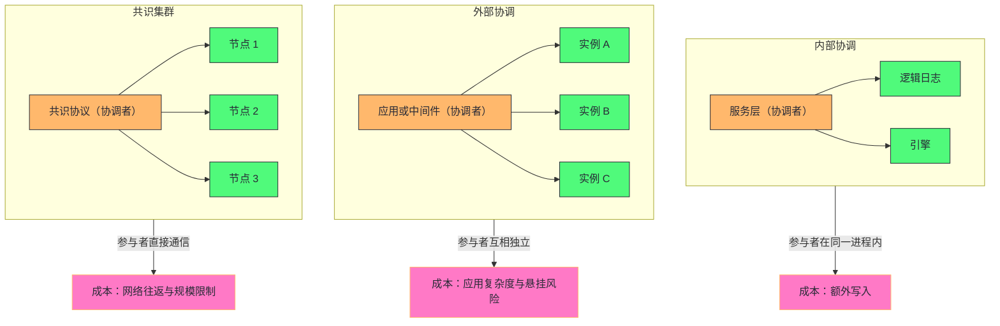

# 19. MySQL 集群事务与分布式事务：从 XA 到共识协议的强一致之路

**摘要：**

单机事务靠"重做日志加撤销日志"（第 7、12 篇），而"分布式事务"靠什么？**这个问题在 MySQL 里有三个不同的答案**，因为它们面对的是三种不同的"分布式"：**第一种是"单机内部的分布式"**（服务层写一种日志、引擎层写另一种日志，**两者必须原子**）；**第二种是"跨实例的分布式"**（多个互相独立的实例，**由应用侧协调**）；**第三种是"集群内部的分布式"**（实例之间直接通信，**由共识协议取代协调者**）。本文按"三种分布式各是什么 → 内部如何协调 → 外部如何协调 → 共识如何取代协调者 → 三条路线如何对比 → 生产上如何选型"展开。先说明三种形态的差别与三条设计哲学、四处代价；再剖析内部协调的"矛盾来源""三种协调器的选择""两阶段流程与崩溃判据"，以及一处历史缺陷的修复。然后讲外部协调的角色模型、事务状态机与三处缺陷（崩溃不安全、隔离级别限制、性能开销）、它的适用场景。之后是共识驱动的集群与"四层架构"、以及三条路线在"一致性来源"上的根本差别。最后是选型决策树、监控、演进史与边界反例，并对整个专栏做一次收束。

---

## 第 1 章 三种"分布式"

### 1.1 为什么单机也有分布式事务

**一个看起来奇怪的事实是：单机数据库内部也存在"分布式事务"问题。**

**原因是"日志与数据分属两层"**：**服务层负责写"逻辑日志"**（用于复制与恢复），**而引擎层负责写"物理日志"**（用于崩溃恢复）。

**这两处写入"必须原子"**——**因为"只写一处"会导致两种后果**：**"逻辑日志写了而数据没提交"会让从库多执行一个事务**；**"数据提交了而逻辑日志没写"会让从库无法同步这个事务。**

**因此"单机内部的分布式事务"要解决的问题是"两个写入点的原子性"**——**而它与第 12 篇讲的"提交路径的两阶段"是同一件事**（本篇从"协调者"的角度重新组织它）。

### 1.2 三种形态

**三种"分布式"的差别可以用"协调者是谁"来概括。**

| 形态 | 协调者 | 参与者 | 解决的问题 |
|---|---|---|---|
| 内部协调 | 服务层 | 逻辑日志与引擎 | 架构分化 |
| 外部协调 | 应用或中间件 | 多个独立实例 | 资源隔离 |
| 共识集群 | 共识协议 | 集群内节点 | 状态复制 |

**三种形态的"协调者"分别是"服务层""应用""协议"**——**而"协调者的位置"决定了"解决方案的形态"**：**协调者在"进程内"则用"两阶段提交"**；**协调者在"应用侧"则用"协议加中间件"**；**协调者在"节点之间"则用"共识协议"。**

**因此"理解这三种形态"的关键是"找到各自的协调者"**——**而"协调者的位置"也决定了"一致性的保证强度"**（第 5.2 节展开）。**而"找到协调者"这个动作本身，就是"理解一个分布式方案"的起点。**

### 1.3 三条设计哲学

三种形态各自遵循一条设计哲学。

**内部协调的哲学是"把另一个写入点当作资源管理器"**——**因此"逻辑日志与引擎被当作'两个独立的参与者'"**，**而"服务层作为协调者"。** **这条哲学的意义是"它把'架构问题'转化成了'标准的两阶段提交问题'"。**

**外部协调的哲学是"库只做参与者"**——**因此"库不承担协调责任"**，**而"协调由应用侧完成"。** **这条哲学的收益是"库保持简单"，代价是"一致性依赖应用的实现质量"。**

**共识集群的哲学是"让库自己成为分布式系统"**——**因此"实例之间直接通信"**，**而"协调由协议完成"。** **这条哲学的收益是"协调逻辑内建"，代价是"库变复杂、规模受限"。**

**三条哲学的关系是"它们把'协调责任'放在了三个不同的位置"**——**而"位置的选择"决定了"使用者需要承担多少复杂度"。**

### 1.4 四处代价

这三种形态合计有四处代价。

**其一：内部协调的额外写入。** **因为"需要两个写入点"，所以"提交要多一次准备与一次确认"**——**而这正是"提交延迟"的组成部分**（第 7 篇已展开）。

**其二：外部协调的缺陷。** **包括"崩溃不安全""隔离级别受限""性能开销大"**（第 3.3 节展开）。

**其三：共识集群的规模与可用性代价。** **因为"需要多数派确认"，所以"节点数受限、分区时少数派不可写"**（第 14 篇已展开）。

**其四：三者的"适用范围"都是有限的。** **因此"选型"本身成为一个需要判断的问题**——**而"选错"的代价是"性能或一致性不达标"。**

**四处代价的共同特征是"它们是'协调需要成本'的必然结果"**：**协调必然带来"额外的通信或写入"**——**而"成本落在哪里"取决于"协调者在哪里"。** 而"成本落在哪里"这个问题，正是本篇后续所有分析的线索。

### 1.5 一个类比：三种"多方签字"

把这三种形态类比成"多方签字"会更容易理解它们的差别。

**"同一个部门内部两个人签字"对应"内部协调"**——**两人在同一间办公室，因此"可以'先都准备好，再一起生效'"**——**而这就是"两阶段提交"的类比形态。**

**"跨公司的合同"对应"外部协调"**——**各方独立，因此"需要一个中间人（律师或平台）来协调"**——**而"中间人崩溃会让合同处于'部分已签'的状态"。**

**"董事会决议"对应"共识集群"**——**过半数同意才生效，**而**"多数派"本身就是"协调机制"。**

**这个类比的用处在于"它把'协调者位置'与'风险'连了起来"**：**内部协调的风险最小（因为双方在同一控制域内）**；**外部协调的风险在"中间人"**；**共识集群的风险在"多数派能否形成"。** **而"这三种风险"恰好对应了"三种形态的典型故障"。**

### 1.6 一处关于"分布式"这个词的提醒

**"分布式事务"这个词容易被误用，因此值得先做一处澄清。**

**"分布式"的判据不是"数据在几台机器上"，而是"参与者是否'互相独立'"**——**也就是说"它们'是否共享控制域'"。**

**按这条判据**：**"同一进程内的两个写入点"算"分布式"**（因为"它们各自维护状态，且互不知晓对方的进度"）；**而"同一台机器上的两个独立实例"也算"分布式"**（因为"它们之间没有共享状态"）。

**因此"分布式事务的难点"不在"网络"，而在"参与者之间的'互不知晓'"**——**而"网络只是'互不知晓'的一种常见形态"。**

**这条澄清的价值在于"它把'分布式事务'从'网络问题'重新定义为'协调问题'"**——**而"协调问题"的核心是"判据的唯一性"（第 5.2 节），**因此**"它与'机器数量'无关"。**

---

## 第 2 章 内部协调：两个写入点

### 2.1 矛盾从哪来

**矛盾的来源是"插件的架构"**：**服务层负责逻辑日志，而引擎负责数据与物理日志**——**而"两者都不知道对方是否成功"。**

**具体来说**：**服务层"不知道引擎是否提交成功"**，**而引擎"不知道逻辑日志是否落盘"。** **因此"如果只做一处写入"，就"无法保证两处一致"。**

**这个矛盾的存在是"插件化"的代价**：**因为"引擎是可替换的"，所以"服务层不能假设引擎的提交细节"**——**因此"它只能把引擎当作一个'需要协调的参与者'"。** **这与第 1 篇讲的"引擎接口必须通用"是同一处代价的具体体现。**

### 2.2 三种协调器

**协调者有三种实现，而它们的选择依据是"有没有逻辑日志、有几个事务引擎"。**

**第一种是"以逻辑日志为协调依据"**——**它"把'逻辑日志里是否记录了该事务'当作提交判据"。** **这是生产环境的默认选择**（因为"逻辑日志通常是开启的"）。

**第二种是"用一个独立的小文件记录事务标识"**——**它适用于"没有逻辑日志但存在多个事务引擎"的场景。** **这类场景很少见**（因为"没有逻辑日志意味着没有复制"）。

**第三种是"空实现"**——**它"不做任何协调"，因为"只有一个参与者"**（也就是"没有事务引擎或只有一个引擎"）。

**三种实现的共同特征是"它们都是'协调判据的载体'"**——**而"判据的载体"决定了"崩溃时从哪里查"。** **因此"选哪种协调器"实际上是在选"提交判据存在哪里"。**

### 2.3 两阶段流程

**两阶段的流程分四步。**

**第一步：判断是否需要两阶段。** **判据是"参与者的数量大于一"**——**因为"只有一个参与者时'原子性'由它自己保证"。**

**第二步：准备阶段。** **让每个参与者"进入准备状态"**——**而"逻辑日志的准备是空操作"**（因为"它的写入本身就是提交点"），**而"引擎的准备是'修改事务状态并持久化'"。**

**第三步：提交阶段。** **让逻辑日志落盘**——**而"这一步是提交点"。**

**第四步：让引擎完成提交。** **包括"释放锁、清理会话视图、写提交记录"。**

**四步里"第二步的空操作"值得留意**：**它说明"两阶段的'参与者'并不对称"**——**逻辑日志"不需要准备"，因为"它的写入是原子的"。**

**这条不对称的解释是**：**"准备"的目的是"让参与者'随时可以提交'"**——**而"逻辑日志的写入'本身就是一次完整的追加'"，**因此**"它天然处于'可提交'状态"。**

### 2.4 崩溃恢复的判据

**崩溃恢复的判据可以按三种场景说明。**

**场景一：有准备记录、而逻辑日志里没有该事务**——**则"回滚"。** **因为"提交点没到"。**

**场景二：有准备记录、而逻辑日志里有该事务**——**则"提交"。** **因为"提交点已过"。**

**场景三：已有提交记录**——**则"已提交"。**

**三种场景的共同特征是"它们只依赖'一个判据'"**——**也就是"逻辑日志里有没有这个事务"。** **因此"恢复是确定性的"**（第 12 篇已展开这条性质的重要性）。

**而"逻辑日志是唯一判据"这一点也解释了"为什么它必须是提交点"**——**因为"如果判据不唯一，恢复就无法确定"。** **因此"提交点的位置"不是"随意选择的"，而是"由'判据的唯一性'决定的"。**

### 2.5 一处历史缺陷

**这里有一处历史缺陷值得说明，因为它是"顺序决定正确性"的典型例子。**

**缺陷是"外部事务的准备阶段'先写逻辑日志、再写准备记录'"**——**而它的后果是"如果写完逻辑日志后崩溃，那么'本地会回滚，而从库已经收到'"，**因此**"主从出现不一致"。**

**修复方式是"调整顺序"**：**先写准备记录，再写逻辑日志。**

**这处缺陷的价值在于"它说明'多写入点之间的顺序'本身就是正确性的一部分"**——**而"看起来只是顺序问题"的改动，实际上决定了"崩溃场景下的数据一致性"**（第 12 篇与第 15 篇已从不同角度展开这条判断）。

**因此"改动提交路径"时的一条纪律是**：**"逐个写入点推演崩溃场景，确认'每个中断点都能得出确定结论'"**——**而"推演的产出"就是"恢复时的判据是否唯一"。**

### 2.6 三种形态的整体关系

把三种形态画在一起，能看清"协调者位置"与"参与者范围"的对应关系。

**图中最值得注意的是"三种形态的协调者都在'参与者之外'，但位置不同"**：**内部协调的协调者"在同一个进程内"**，**外部协调的协调者"在另一个系统里"**，**共识集群的协调者"在参与者之间"。**

**而"协调者的位置"直接决定了"成本落在哪里"**（图中右侧的三个节点）——**这正是本篇的核心判断**：**"协调必然有成本，而成本落在'协调者所在的位置'"。**

**这张图的实用价值在于"它把选型变成了'选成本落在哪里'"**——**而"这是一个'可讨论'的问题"**（因为"团队对不同成本的容忍度不同"），**而"哪个方案更先进"则不是。**

---

## 第 3 章 外部协调：协议与角色

### 3.1 三种角色

**外部协调的模型由三种角色构成。**

**第一种是"应用"**——**它"发起事务"。**

**第二种是"事务管理器"**——**它"协调各个参与者"。**

**第三种是"资源管理器"**——**它"执行并记录本地的那一部分"。**

**而"库在这套模型里扮演'资源管理器'"**——**也就是说"它不承担协调责任"。**

**"库不承担协调责任"这处定位很重要**：**它意味着"一致性的保证'依赖应用侧的实现质量'"**——**因为"协调者由应用实现，**因此**"协调者的缺陷（例如'准备后崩溃不恢复'）会'直接影响一致性'"。**

### 3.2 事务语法与状态机

**外部协调的语法由五个动作构成**：**开始、结束、准备、提交、回滚**——**而"提交"有一个"单阶段"的变体**（用于"只有一个参与者时的优化"）。

**此外还有一个"查看"动作**——**它用于"列出处于准备状态的事务"，**因此**"它是运维处置悬挂事务的入口"。**

**事务的状态机是"四态"**：**活跃 → 空闲 → 已准备 → 已提交或已回滚。**

**"空闲"这个中间态值得留意**：**它表示"语句已执行完但事务尚未准备"**——**因此"它的存在说明'事务的语句执行'与'事务的准备'是两个阶段"。**

### 3.3 三处缺陷

**外部协调有三处缺陷，而它们都值得说清。**

**缺陷一：崩溃不安全。** **较旧版本"在恢复时'不处理处于准备状态的外部事务'"**——**因此"如果协调者在'全部准备成功、尚未提交'时崩溃，那么这些事务会'留在准备状态'"**——**也就是"事务悬挂"：**"锁未释放、数据未提交、且'从外部看不出异常'"。

**缺陷二：隔离级别受限。** **官方建议"外部事务使用最高隔离级别"**——**原因是"多版本机制'无法提供全局快照一致性'"**，**因此"较低隔离级别可能出现'不可重复读'"。**

**缺陷三：性能开销大。** **因为"每条事务至少多两次落盘"，**且**"准备阶段会持有一把全局锁"**（较旧版本更严重）。

**三处缺陷的共同特征是"它们都源于'库不承担协调责任'"**——**因为"协调在外部"，所以"库'无法在恢复时判断该提交还是回滚'"**（因为它"不知道外部的决定"），**因此"只能悬置"。**

**这条因果链很有价值**：**"缺陷一"的根因是"责任划分"**——**而"要修复它"就需要"让库具备'某种外部可见的判据'"**（这也是"内部协调能修复同类问题"的原因，因为"它有唯一判据"）。

### 3.4 适用场景

**外部协调的适用场景有两类。**

**第一类是"短周期、低并发、强一致要求极高"的跨库操作**——**例如"银行核心的跨库转账"**——**因为"这类场景'能接受性能代价'，而'不能接受不一致'"。**

**第二类是"已有成熟中间件的遗留系统"**——**因为"改造的成本可能高于'忍受缺陷'"。**

**而不适用的场景也有两类**：**"高并发的互联网业务"**（性能扛不住）与**"大规模分库分表"**（应当考虑"另一类方案"）。

**这条适用边界的形态与第 14 篇讲的"组复制的定位"是同一类**：**"每种方案都有它'服务的那类需求'"**——**而"选型的依据"是"需求落在哪一类里"。**

### 3.5 一处关于"责任划分"的经验

**"外部协调的缺陷"这件事值得再展开一层，因为它的根因是"责任划分"而非"实现水平"。**

**具体来说**：**因为"库不承担协调责任"，所以"它'无法在恢复时判断该提交还是回滚'"**——**因为"决定在外部，而库看不到外部的状态"。**

**因此"悬挂不是'实现不好'，而是'责任划分的必然结果'"**——**而"要消除它"就需要"让库具备'某种外部可见的判据'"**（例如"让协调者把决定写入库可见的地方"）。

**这条分析的价值在于"它把'缺陷'归因到了'设计选择'上"**——**而"这类归因"能避免"错误地期待'某个版本会修好它'"**（因为"修好它需要'改变责任划分'"）。

**因此"评估一个方案时"应当问"'它的缺陷是'实现水平'还是'设计选择'引起的'"**——**因为"前者会随版本改善，而后者需要'换方案'才能消除"。**

### 3.6 一处关于"协议"的说明

**"两阶段提交"这个协议本身的性质值得说明，因为它解释了"为什么它的成本无法消除"。**

**两阶段提交的"必要往返数"是"由参与者数量与'是否需要准备'决定的"**——**而"在网络场景下，'准备'与'提交'各需要一轮通信"。**

**因此"它至少需要两轮网络往返"**——**而"这个下界无法通过'实现优化'降低"**（因为"两轮是协议的要求"）。

**这条性质解释了"为什么'外部协调'的性能开销无法根治"**：**因为"它是协议的固有成本"，而"不是实现问题"。**

**因此"优化分布式事务性能"的方向只有两条**：**"减少参与者的数量"**（例如"把相关数据收敛到同一个库"）与**"改变一致性要求"**（例如"用最终一致"）。** 而"优化协议实现"能改善的只是"常数项"。**

---

## 第 4 章 共识驱动的集群

### 4.1 从"协调外部"到"自协调"

**共识集群与外部协调的根本差别是"协调者的位置"**。

**外部协调下"实例之间没有通信"**——**因此"协调必须由外部完成"。**

**而共识集群下"实例之间直接通信"**——**因此"协调由协议完成，实例群成为一个自治的整体"。**

**这条差别的后果在两处**：**其一，"一致性不再依赖应用"**（因为"协调逻辑内建"）；**其二，"库的复杂度上升"**（因为"它要维护成员关系、视图、共识状态"）。

**因此"共识集群"的取舍是"用'库的复杂度'换'应用的简单性'"**——**而"这个交换是否划算"取决于"应用侧是否愿意承担协调责任"。**

### 4.2 四层架构

**共识集群的架构分四层，而每层解决一个问题。**

**第一层是"插件层"**：**它"拦截事务提交、做冲突检测、并负责应用"。** **它解决的问题是"如何把'事务'接入集群"。**

**第二层是"通信层"**：**它"负责消息广播、成员管理、视图变更"。** **它解决的问题是"消息如何送达、成员如何变更"。**

**第三层是"代理层"**：**它"负责消息序列化与队列转发"。** **它解决的问题是"不同模块之间如何衔接"。**

**第四层是"共识层"**：**它"实现共识协议与多数派日志复制"。** **它解决的问题是"顺序如何达成一致"。**

**四层的分工是"接入、送达、衔接、定序"**——**而"四者的顺序恰好是'消息从产生到确定顺序'的流程"。** **这与第 14 篇讲的四层划分是一致的**——**而本篇关注的是"它与前两种形态的对比"。**

### 4.3 单主与多主

**共识集群有两种写入模式，而它们的差别在"哪些节点可写"。**

**单主模式下"只有一个节点可写"**——**因此"不存在冲突检测的必要"**（因为"写入天然串行"）。

**多主模式下"所有节点都可写"**——**因此"必须做冲突检测"**（因为"两个节点可能同时改同一行"）。

**两种模式的取舍很清楚**：**单主"简单且无冲突，但写入仍是单点"**；**多主"写入分散，但冲突需要检测与回滚"。**

**而"多主的实际收益有限"**（第 14 篇已展开）：**因为"冲突检测与全局顺序'限制了它的扩展性'"**——**因此"它没有改变'单机架构的上限'"。**

### 4.4 与外部协调的对比

**两者在四个维度上的差别值得并列。**

| 维度 | 外部协调 | 共识集群 |
|---|---|---|
| 协调者位置 | 应用侧 | 节点之间 |
| 一致性依赖 | 应用实现质量 | 协议内建 |
| 崩溃处理 | 可能悬挂（较旧版本） | 协议保证 |
| 规模 | 可跨多个独立实例 | 适合小规模集群 |
| 对应用的侵入 | 需要应用改造 | 基本透明 |

**这张表里最值得留意的是"崩溃处理"这一行**：**共识集群"由协议保证'要么提交要么回滚'"**——**而外部协调在较旧版本上"可能悬挂"。**

**这处差别的根源是"判据的唯一性"**：**共识集群有"多数派确认"这个唯一判据**，**而外部协调"没有本地判据"**（因为"决定在外部"）。** 因此"前者的恢复是确定性的，而后者不是"。**

**这与第 2.4 节讲的"内部协调的判据唯一性"是同一原理**——**因此"判据是否唯一"可以作为"评估任何分布式事务方案"的第一判据。**

### 4.5 一处关于"协调者位置"的规律

**把三种形态放在一起，可以提炼出一条关于"协调者位置"的规律。**

**规律是"协调者越靠近参与者，成本越低但保证越弱"**：**内部协调的协调者"在同一进程内"，因此成本最低（一次额外写入），但"保证只覆盖单机"。**

**而"协调者越远离参与者，成本越高但保证越强"**：**共识集群的协调者"在节点之间"，因此成本最高（一轮网络往返），但"保证覆盖整个集群且不依赖外部"。**

**这条规律给出一条判断方式**：**"需要多强的保证，就付多高的协调成本"**——**而"选型"就是"在保证与成本之间找匹配点"。**

**因此"看到有人问'哪个方案最好'"时，正确的回应是"先明确需要多强的保证"**——**因为"保证的强度决定了成本的量级"，**而**"脱离保证强度谈方案优劣是没有意义的"。**

### 4.6 一处关于"内建与外部"的说明

**"共识内建"与"协调外部"的差别，本质上是一处"复杂度分配"的选择。**

**"协调外部"把复杂度放在"应用侧"**——**因此"库保持简单"，而"应用需要'理解协议并正确实现'"。**

**"共识内建"把复杂度放在"库内部"**——**因此"应用几乎无感"，而"库需要'维护成员、视图、共识状态'"。**

**这处分配的判据是"哪一侧更擅长承担这类复杂度"**：**如果"应用团队有能力实现并维护协调逻辑"，那么"外部协调更灵活"**；**如果"希望'应用不改动'"，那么"内建更省事"。**

**而"实际选择"往往由"非技术因素"决定**：**例如"团队的技术栈""运维能力""对'库改动'的接受度"。** **因此"分布式事务的选型"里，"技术因素"只是其中一部分**——**而"忽略非技术因素"是选型失败的常见原因。**

---

## 第 5 章 三条路线的对比

### 5.1 对比维度

**把三条路线按四个维度并列，可以看出它们的定位。**

| 维度 | 内部协调 | 外部协调 | 共识集群 |
|---|---|---|---|
| 参与者 | 同机两个写入点 | 多个独立实例 | 集群内节点 |
| 协调成本 | 一次准备加一次确认 | 应用侧两阶段 | 一轮网络往返 |
| 一致性强度 | 崩溃一致 | 强一致（依赖应用） | 强一致（多数派） |
| 典型代价 | 提交延迟 | 性能与悬挂风险 | 可用性与规模 |

**这张表里最值得留意的是"一致性强度"这一行**：**三者的强度不同，而"强度的来源也不同"**——**内部协调"只保证单机的崩溃一致"**（它"不涉及跨节点"），**外部协调与共识集群"提供跨节点一致性"，但"来源不同"**（一个是"应用实现"，一个是"协议内建"）。

**因此"比较三者"时应当先明确"需要哪种强度"**——**因为"它们'解决的不是同一个问题'"**：**内部协调解决"架构问题"，后两者解决"跨节点问题"。**

### 5.2 一致性保证的来源

**"一致性从哪来"这个问题值得单独说明，因为它是三条路线最本质的差别。**

**内部协调的一致性来自"唯一判据"**——**也就是"逻辑日志里有没有该事务"。** **因此"它的恢复是确定性的"。**

**外部协调的一致性来自"应用的正确实现"**——**因此"应用有缺陷则一致性受损"。**

**共识集群的一致性来自"多数派交集"**——**也就是"任意两个多数派必有交集"**（第 14 篇已展开这个论证）。**因此"它的事务不会因为单点故障而丢失"。**

**三种来源的共同特征是"它们都是'某个不变量'"**：**唯一判据、应用正确性、多数派交集。** **而"评估一个分布式事务方案"的核心问题就是"它的不变量是什么、是否可靠"。**

**"不变量"这个说法值得再解释一下**：**它指的是"一个在'任何故障场景下都成立的性质'"**——**而"恢复逻辑就建立在这个性质上"。**

**例如"内部协调"的不变量是"逻辑日志里的事务'一旦出现就不会消失'"**——**因此"恢复时可以'以它为准'"**；**而"共识集群"的不变量是"任何两个多数派必有交集"**——**因此"已确认的事务不会被遗忘"。**

**因此"设计分布式事务方案"的关键动作是"先确定不变量，再围绕它设计恢复逻辑"**——**而"如果找不到不变量"，那么"恢复就无法确定"，**因此**"方案就不可靠"。** **这条判断的通用性在于"它把'可靠性'归结为一个'可检验的性质'"。**

### 5.3 取舍依据

**三条路线的取舍依据可以按"问题的形状"回答。**

**如果"问题在单机内部"**（例如"日志与数据的一致性"），那么"内部协调是唯一选择"**——**因为"这不是一个'跨节点'问题"。**

**如果"问题涉及多个互相独立的实例"**，那么"外部协调或共识集群"**——**而"选哪个"取决于"能否接受'应用侧协调'"与"实例数量"。**

**如果"目标是'高可用与自动切换'"**，那么"共识集群"**——**而"如果'只是需要读写分离'"，那么"普通复制加半同步"可能已经足够"**（第 13 篇已展开）。

**因此"选型"的正确起点是"明确问题的形状"**——**而不是"从'哪个方案更先进'出发"。** **这与本专栏反复出现的"选择依据是当前约束条件"是同一条原则。**

### 5.4 一处关于"三条路线能否共存"的说明

**三条路线不是"互相替代"的关系，而是"可以共存于同一套系统"的。**

**因为"它们解决的是不同范围的问题"**：**内部协调"始终存在"**（因为"任何提交都要协调两个写入点"），**而"外部协调与共识集群"是"针对不同范围的补充"。**

**因此"一个实际的系统"可能"同时使用三者"**：**单机内部"用内部协调保证日志与数据一致"**，**集群内部"用共识集群保证节点一致"**，**而"跨集群或跨业务域"用外部协调（或"最终一致方案"）。**

**这条"可共存"的性质很重要**，因为它说明"选型不是'三选一'，而是'在每一层选择合适的机制'"——**而"逐层选择"比"全局选一个"更符合实际。**

---

## 第 6 章 生产落地

### 6.1 选型决策

**分布式事务的选型可以按四步推进。**

**第一步：确认"是否真的需要分布式事务"。** **因为"很多'看起来需要'的场景其实可以'通过设计避免'"**——**例如"把相关数据放在同一个库、或'用最终一致替代强一致'"。**

**第二步：如果"需要"，确认"参与者是'同机'还是'跨机'"**——**因为"同机问题由内部协调自动解决，不需要额外方案"。**

**第三步：如果"跨机"，确认"是否需要'强一致'"**——**如果"可以接受最终一致"，那么"基于消息的补偿方案通常更简单、性能更好"。**

**第四步：如果"需要强一致"，确认"能否接受'应用侧协调'"**——**能则"外部协调"，不能则"共识集群"。**

**四步的共同特征是"它们都在'缩小候选方案的范围'"**——**而"每一步都在排除'不合适的那一类'"，**因此**"最终的候选集合很小"。**

**这条决策路径的实用价值在于"它避免'从技术方案出发反向找问题'"**——**而"反向找问题"是"分布式事务选型"里最常见的错误。**

### 6.2 监控要点

**分布式事务侧可观测的信息有三类。**

**第一类是"处于准备状态的事务"**：**它回答"是否有悬挂的事务"**——**而"它非零"意味着"需要人工处置"。**

**第二类是"提交路径的耗时构成"**：**它回答"延迟花在'准备'还是'确认'上"**。

**第三类是"集群的成员与视图状态"**（共识集群场景）：**它回答"多数派是否存在、成员是否稳定"。**

**三类信息的层次是"从悬挂到延迟到集群健康"**：**先看"有没有卡住的事务"，再看"延迟花在哪"，最后看"集群是否稳定"。**

### 6.3 一次"事务悬挂"的排查推演

把"事务悬挂"这类问题串成一次推演。

假设现象是"某张表上的操作被阻塞，而'看不到明显的事务冲突'"。

**第一步，查看"处于准备状态的事务"。** **因为"悬挂的事务'持有锁但不提交'"，**因此**"它会表现为'无缘无故的阻塞'"。**

**第二步，如果"发现悬挂事务"，确认"它属于哪一类协调"**——**因为"内部协调的悬挂由'判据缺失'导致，而外部协调的悬挂由'协调者崩溃'导致"。**

**第三步，如果是"外部协调的悬挂"，确认"协调者是否还在"**——**如果"协调者已不存在"，那么"这些事务'需要人工决定'：提交还是回滚"。**

**第四步，做决定时"以'业务一致性'为准"**——**也就是说"确认'这个事务的业务语义是否要求全部提交'"。**

**第五步，处置后"检查是否还有残留"**，并"评估'是否需要调整方案'"。

**五步的价值在于"它把'无缘无故的阻塞'定位到了'悬挂事务'"**——**而"这个定位的价值"来自"知道'悬挂事务'这个现象的存在"。** **因此"理解这套机制的缺陷"，比"记住它的语法"更有实用价值。**

### 6.4 一次"分布式事务选型"的推演

把"该选哪种方案"这个问题串成一次推演。

假设场景是"一个订单系统，需要'扣库存'与'记订单'两个操作保持一致"。

**第一步，确认"这两个操作是否在同一个库"。** **如果在同一个库，那么"用本地事务即可"**——**因为"单机事务由内部协调保证"。**

**第二步，如果"在不同库"，确认"是否真的需要强一致"。** **如果"可以接受'最终一致'"，那么"基于消息的补偿方案更合适"**——**因为"它的成本远低于两阶段"。**

**第三步，如果"需要强一致"，确认"能否接受'应用侧协调'"。** **能则"用外部协调"**，**而"需要接受'悬挂风险与性能代价'"。**

**第四步，如果"不能接受应用侧协调"，确认"库的数量是否适合'共识集群'"**——**因为"共识集群适合小规模"。**

**第五步，如果"库的数量很大"，那么"应当考虑'把一致性要求拆解'"**——**例如"把'必须强一致的部分'收敛到一个库里，而'其余部分'用最终一致"。**

**五步的价值在于"它每一步都在'缩小范围或降低要求'"**——**而"降低要求"（从强一致到最终一致）往往是"最有效的一步"。** **因此"分布式事务的选型"里最重要的动作，可能不是"选方案"，而是"重新审视一致性要求"。**

### 6.5 一处关于"分库分表"的提醒

**"分库分表"这个场景值得单独提醒，因为它是"分布式事务需求"的最大来源，而"它本身也可以被重新审视"。**

**分库分表的动机通常是"单库容量或吞吐不足"**——**而"分片之后，'跨分片的事务'就变成了'分布式事务'"**。

**因此"分片设计"里有一条重要原则**：**"让'需要强一致的关联数据'落在同一个分片"**——**而"分片键的选择"决定了"跨分片事务的比例"。

**具体来说**：**如果"分片键选得让'关联数据总是同片'"，那么"大部分事务是本地事务"**；**而"如果分片键与'业务的事务边界不匹配'，那么"跨分片事务会很多"。**

**因此"减少分布式事务"的最有效手段可能是"重新设计分片键"**——**而"这比'引入分布式事务框架'的收益大得多"。** **这条提醒的形态与第 6.4 节讲的"重新审视一致性要求"是同一类**：**"在'选方案'之前，先问'这个问题能否被消除'"。**

**而"能否被消除"这个问题的答案，往往取决于"业务模型是否可以被调整"**：**如果"业务模型是固定的"**（例如"监管要求"），那么"只能接受分布式事务"；**而"如果模型可以调整"**（例如"分片键的选择"），那么"消除问题"是更优的路径。

**因此"分布式事务"的处置顺序应当是"先问'能否消除'，再问'如何实现'"**——**而这个顺序恰好与"软件工程里'先设计、后实现'"是一致的。**

---

## 第 7 章 演进史与遗留设计

### 7.1 关键节点

| 版本 | 变化 | 动因 |
|---|---|---|
| 早期 | 引入内部协调（两阶段提交） | 解决日志与引擎的一致 |
| 早期 | 支持外部协调语法 | 支持跨实例事务 |
| 5.6 | 优化准备阶段的锁竞争 | 降低性能开销 |
| 5.7 | 支持"单阶段提交"优化 | 减少单参与者的开销 |
| 8.0 | 引入共识集群 | 让集群具备强一致与自动切换 |
| 8.0 后期 | 修复外部事务准备阶段的写入顺序 | 消除崩溃场景下的不一致 |
| 8.0 后期 | 改进外部事务的恢复处理 | 减少悬挂 |

**这条演进线可以分成两条**：**"内部协调的持续优化"**（减少锁竞争、减少开销）与**"外部与共识能力的引入与修复"**。

**而"修复写入顺序"与"改进恢复处理"这两步值得留意**：**它们"不增加功能"，只"修复正确性"**——**而"这类修复的价值只在'故障场景'下体现"，**因此**"它们的优先级往往被低估"。**

### 7.2 四处遗留设计

**第一处：内部协调的额外写入无法消除。** **只要"有两个写入点"，就"需要两阶段"**——**因此"提交延迟里始终有这一项"。**

**第二处：外部协调的隔离级别限制。** **因为"全局快照一致性无法由单机多版本提供"**——**因此"它需要更高隔离级别来弥补"。**

**第三处：外部协调的性能开销。** **因为"每个分支都要额外落盘"**——**因此"它不适合高并发"。**

**第四处：共识集群的规模上限。** **因为"每次提交都要组内确认"**——**因此"节点越多越慢"。**

**四处遗留设计的共同特征是"它们是'协调成本'的固有形态"**：**协调必然带来"额外通信或写入"，而"额外成本"无法被消除，只能被"转移或摊薄"。** **因此"分布式事务的优化"始终在"成本与保证之间取平衡"。**

### 7.3 演进方向

**方向一：把协调下沉到存储层。** **如果"存储层能提供'跨节点的一致性原语'"，那么"上层的协调逻辑可以简化"**——**因为"一致性由'共享的存储'保证"。**

**方向二：用"最终一致加补偿"替代"强一致"。** **在"业务允许"的场景下，"基于消息的补偿方案"能"用更低的成本达到'业务可接受的一致性'"。**

**方向三：共识协议的进一步优化。** **包括"更少的往返""更好的批量化""更细的冲突检测"。**

**三个方向的共同特征是"它们在'降低协调成本'或'改变对一致性的要求'"**——**而"这两条恰好是'分布式事务'仅有的两条出路"。**

### 7.4 一条关于"遗留设计"的经验

**最后把"遗留设计"这件事的经验收敛一下，因为它是整个专栏反复出现的主题。**

**"遗留设计"的共同特征是"它们是'某个设计选择的长期后果'"**——**而"它们的处置方式"分三类**：**"等新版本改善"**（如果是"实现水平"问题）、**"用别的机制绕开"**（如果是"结构约束"）、**"换方案"**（如果是"责任划分"问题）。

**因此"面对遗留设计"的第一步是"判断它属于哪一类"**——**而"判断依据"是"它是否可以通过'局部改动'消除"。**

**本专栏里三类都出现过**：**"权限回收不生效"属于"设计选择"**（因此"只能靠终止连接绕开"）、**"页大小不可改"属于"结构约束"**（因此"只能靠重建实例"）、**"外部协调的悬挂"在较新版本有改善**（因此"属于实现水平"。**

**这条分类的价值在于"它给出了'该等还是该换'的判据"**——**而"错误地等待一个'需要换方案才能解决'的问题"，是"技术决策"里最常见的浪费。**

---

## 第 8 章 边界与反例

### 8.1 反例一：把"内部协调"当作"分布式事务"

它是"单机内部的架构问题"，**与"跨节点"无关**（第 1.1 节）。

### 8.2 反例二：把"外部协调"当作"库的责任"

库只做参与者，**协调在应用侧**（第 3.1 节）。

### 8.3 反例三：把"悬挂事务"当作"普通的锁等待"

它"持有锁但不提交"，**因此表现为"无缘无故的阻塞"**（第 6.3 节）。

### 8.4 反例四：把"多主模式"当作"写扩展"

冲突检测与全局顺序限制了它的扩展性（第 4.3 节）。

### 8.5 反例五：把"共识集群"当作"能无限扩展"

每次提交都要组内确认，**因此节点越多越慢**（第 7.2 节）。

### 8.6 反例六：从"技术方案"出发反向找问题

选型应当"从问题的形状出发"（第 5.3 节）。

### 8.7 反例七：把"可以接受最终一致"的场景也用强一致方案

这会让"成本远高于必要"（第 6.1 节）。

---

## 第 9 章 落点

回到开头：**"分布式事务靠什么？"**

**答案是"靠一个可靠的不变量"**——**而三种形态的不变量不同**：**内部协调靠"唯一判据"**（逻辑日志里有没有该事务）、**外部协调靠"应用的正确实现"**、**共识集群靠"多数派交集"。**

**因此"评估一个分布式事务方案"的核心问题是"它的不变量是什么、是否可靠"**——**而这个问题比"它用了什么协议"更根本。** **因为"协议是实现细节，而不变量决定了'它能保证什么'"。**

**而这套机制的取舍可以概括为一句**：**"协调必然有成本，而成本落在'协调者所在的位置'"**——**协调者在进程内则成本是"额外写入"**，**在应用侧则成本是"应用复杂度与悬挂风险"**，**在节点之间则成本是"网络往返与规模限制"。**

**因此"选型"的实质是"选择把成本放在哪里"**——**而"选择依据"是"哪个位置的成本'最容易被接受'"。** **这与本专栏反复出现的"任何优势都有对应代价"是同一规律。**

**还有一条判断值得留下：分布式事务的选型里，最重要的动作可能不是"选方案"，而是"重新审视一致性要求"。** **因为"从强一致降到最终一致"能"一次性消除大部分协调成本"**——**而"这类'降低要求'的动作"往往"比'优化方案'的收益大得多"。**

**而"降低要求"之所以可行，是因为"业务的一致性要求常常被高估"**：**因为"团队倾向于'用最强的一致性以图省心'"**——**而"这份'省心'的代价是'性能与复杂度'"。** **因此"明确'哪些数据真的需要强一致'"是分布式系统设计里价值最高的一步判断。**

---

## 第 10 章 专栏总结

**本篇是这组读书笔记的收束，因此值得回顾一下整条线索。**

**这十九篇覆盖了"从架构到存储到事务到集群"的完整链路**：**第 1 篇讲"架构分界线画在哪里"**，**第 2、3 篇讲"两个跨层机制（协议与字典）"**，**第 4 到第 10 篇讲"内存与存储的组织"**（缓冲池、插入缓冲、自适应哈希、日志、双写、线程、表空间、索引），**第 11 到第 12 篇讲"数据与事务的表示"**，**第 13 到第 19 篇讲"从单机走向集群"**（复制、组复制、恢复、原子 DDL、权限、角色、分布式事务）。

**而这条链路里反复出现的判断方式有六条**，它们比具体机制更值得记住：

**第一条是"找到分界线，并问它换来了什么、付出了什么"**——**它适用于架构层面的所有设计**（第 1 篇、第 4 篇）。

**第二条是"用可计算的映射替代需要维护的映射"**——**它适用于"键与位置"的对应**（第 2 篇、第 4 篇、第 10 篇）。

**第三条是"用预先维护的廉价状态替代临时的昂贵探测"**——**它适用于热路径优化**（第 4 篇、第 5 篇、第 6 篇）。

**第四条是"把'不可回滚的部分'记录成'可回滚的意图'"**——**它适用于跨越可回滚边界的设计**（第 3 篇、第 7 篇、第 16 篇）。

**第五条是"确定性的重放优于需要推断的恢复"**——**它适用于所有恢复与一致性设计**（第 3 篇、第 12 篇、第 15 篇、第 19 篇）。

**第六条是"任何优势都有对应代价，而代价通常表现为'某个窗口期'"**——**它适用于所有取舍判断**（第 8 篇、第 12 篇、第 14 篇、第 17 篇）。

**六条判断方式的价值在于"它们可以跨机制复用"**——**因为"具体机制会随版本变化，而判断方式不会"。** **因此"读这套笔记的目的"，不是"记住十九个机制"，而是"获得一套分析存储系统的判断方式"。**

**而这六条判断方式之间还有一层关系**：**前三条是"优化手法"**（找分界线、用可计算映射、用廉价状态），**后三条是"正确性手法"**（记录意图、确定性重放、识别窗口期）。

**两类手法的分工是"优化手法处理'性能'，正确性手法处理'可靠性'"**——**而"一套成熟的存储系统"必须"两者兼备"。** **因此"评估一个系统"时，也应当"分别看这两方面"**：**"它的性能优化用了哪些手法"与"它的正确性依赖哪些不变量"。**

**最后一句话值得作为这组笔记的收束：这套系统里"几乎没有'纯粹的好设计'，只有'与约束匹配的设计'"**——**因为"每一个机制都在回答'某个具体的约束'"，**而**"约束变了，机制就该变"。** **因此"理解约束"比"记住机制"更接近本质。**

**而"约束"这个词值得再明确一下**：**它包含三类**——**"硬件约束"**（磁盘的原子写单位、内存与磁盘的速度差）、**"语义约束"**（事务的原子性、一致性读的要求）、**"历史约束"**（兼容性、生态升级速度）。

**三类约束的共同特征是"它们都'不随设计者的意愿改变'"**——**因此"设计"的实质是"在约束下找可行解"，而不是"追求理论最优"。** **这解释了"为什么本专栏里那么多设计看起来'不优雅'却长期存在"**——**因为"它们恰好在当时的约束下是可行的"。**

**因此"读一套技术笔记"的正确收获，不是"记住结论"，而是"记住结论背后的约束"**——**因为"结论会过时，而约束的识别能力不会"。**

---

## 专栏导航

- 上一篇：[[18. MySQL 8.0 角色与动态权限：从访问控制到权限管理的现代化转型]]。
- 返回专栏首页：[[00 专栏导览]]。

---

## 参考资料

1. MySQL 8.0.33 源码：`sql/tc_log.cc`、`sql/handler.cc`、`sql/binlog.cc`、`storage/innobase/trx/trx0trx.cc`、`storage/innobase/log/log0recv.cc`。
2. MySQL. 官方文档：XA 事务与分布式事务处理. https://dev.mysql.com/doc/refman/8.0/en/xa.html
3. MySQL. 官方文档：XA 事务的隔离级别限制与语法. https://dev.mysql.com/doc/refman/8.0/en/xa-statements.html
4. MySQL. 官方文档：InnoDB 与二进制日志的两阶段提交. https://dev.mysql.com/doc/refman/8.0/en/innodb-two-phase-commit.html
5. MySQL. 官方文档：组复制与共识协议的架构. https://dev.mysql.com/doc/refman/8.0/en/group-replication.html
6. MySQL. 官方文档：复制与高可用方案的选型对比. https://dev.mysql.com/doc/refman/8.0/en/replication-solutions.html
7. Oracle Blogs. 分布式事务与共识协议在 MySQL 中的落地. https://dev.mysql.com/blog-archive/
8. MySQL. 官方文档：二进制日志与引擎的两阶段提交与恢复判定. https://dev.mysql.com/doc/refman/8.0/en/binary-log.html
9. MySQL. 官方文档：复制与组复制方案的对比与选型建议. https://dev.mysql.com/doc/refman/8.0/en/group-replication-use-cases.html
10. MySQL. 官方文档：XA 事务的限制与已知问题. https://dev.mysql.com/doc/refman/8.0/en/xa-restrictions.html

---

> [!note] 思考题
> 1. 为什么"单机数据库内部也存在分布式事务问题"？这个问题的两个参与者分别是谁？
> 2. 三种形态的"协调者"分别在哪里？这个位置如何决定了"解决方案的形态"？
> 3. 为什么"外部协调"在较旧版本上会出现"事务悬挂"？它的根因是"实现缺陷"还是"责任划分"？
> 4. "一致性从哪来"这个问题，三种形态的答案分别是什么？
> 5. 回顾这十九篇，"用可计算的映射替代需要维护的映射"这条判断在哪些机制里出现过？
