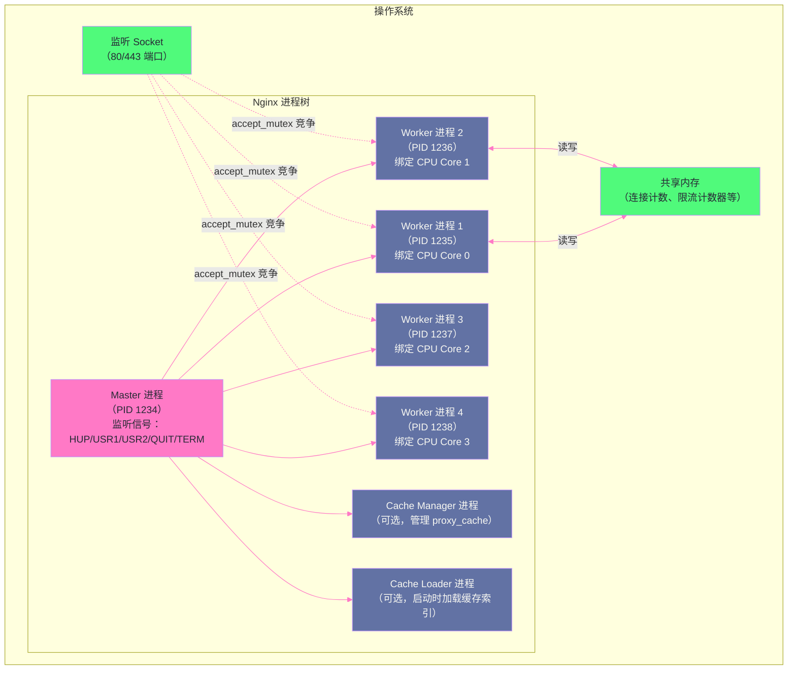

# 01 事件驱动模型：epoll 与 Master-Worker 进程架构

## 摘要

Nginx 能以数个进程处理数十万并发连接，其根本原因不在于硬件性能，而在于它彻底摒弃了"一连接一线程"的传统并发模型，转而采用**事件驱动 + 非阻塞 I/O** 的架构。本文从 Linux I/O 多路复用的演进（select → poll → epoll）讲起，深入剖析 epoll 的边缘触发与水平触发模式、epoll 红黑树与就绪链表的内核数据结构，再到 Nginx Master-Worker 进程模型的设计哲学——为什么要多进程而非多线程、Worker 如何绑定 CPU 核心、Master 进程如何通过信号管理 Worker 的优雅重启。理解这一切，是后续所有 Nginx 调优与故障排查的认知基础。

---

## 第 1 章 并发模型的演进：为什么"一连接一线程"走不远

### 1.1 传统 Web 服务器的并发困境

在 Nginx 诞生之前（2004 年），Apache 是 Web 服务器的绝对统治者。Apache 的默认工作模式是 **Prefork MPM**——每个 HTTP 请求由一个独立的进程（或线程）处理，进程与请求一一对应。

这个模型在互联网流量较小的年代运转良好，但随着并发量攀升，它的问题暴露无遗：

**问题一：内存消耗线性增长**

每个 Apache Prefork 进程需要加载完整的 HTTP 处理代码、mod_php 模块、SSL 上下文等，一个进程的内存占用轻易超过 10MB。当并发连接达到 1 万时，仅进程内存就需要 100GB——这在 2004 年是天文数字。

**问题二：操作系统调度开销**

Linux 内核的进程调度器（[[CFS 调度器]]）在进程数量很少时开销可以忽略。但当进程数量增长到数千时，仅**上下文切换（Context Switch）** 的代价就变得不可忽视：CPU 需要保存当前进程的寄存器状态、刷新 TLB（Translation Lookaside Buffer）、加载新进程的内存映射。在一台 4 核服务器上同时运行 10000 个进程，大部分 CPU 时间都消耗在调度本身，而非真正的业务处理。

**问题三：I/O 等待中的资源浪费**

HTTP 请求的处理过程中，大量时间花在 **I/O 等待**上——等待客户端发送请求数据（网络 I/O）、等待磁盘读取静态文件（磁盘 I/O）、等待后端数据库响应（网络 I/O）。在这些等待期间，进程/线程完全阻塞，CPU 资源被白白浪费。

这三个问题在 2002 年催生了著名的 **"C10K 问题"**（如何用一台服务器同时处理 10000 个并发连接），它成为推动新一代 Web 服务器设计范式变革的导火索。

### 1.2 C10K 问题的本质

理解 C10K 问题的关键是区分两个概念：**并发连接数**和**活跃连接数**。

在互联网场景中，大多数 HTTP 连接在大多数时刻是**空闲的**——客户端已经建立了 TCP 连接，但正在等待用户操作、或者处于 HTTP Keep-Alive 的空闲期、或者正在接收前一个响应的数据。真正在某一毫秒内有数据需要读写的连接，可能只占全部连接的 1%。

这意味着：**用 10000 个进程处理 10000 个并发连接，其中 9900 个进程都在无所事事地阻塞等待**——这是对操作系统资源的极大浪费。

正确的解决思路是：**用少量的进程/线程，同时监控大量的连接，哪个连接有数据了就处理哪个**。这就是 I/O 多路复用（I/O Multiplexing）的核心思想。

---

## 第 2 章 I/O 多路复用的三代演进

### 2.1 第一代：select——功能完整，但有硬性上限

`select` 是 POSIX 标准定义的 I/O 多路复用接口，在 20 世纪 80 年代随 BSD Unix 诞生，Linux 从最早期的版本就支持：

```c
// select 系统调用接口
int select(int nfds,              // 监听的最大 fd 编号 + 1
           fd_set *readfds,       // 监听可读事件的 fd 集合
           fd_set *writefds,      // 监听可写事件的 fd 集合
           fd_set *exceptfds,     // 监听异常事件的 fd 集合
           struct timeval *timeout); // 超时时间（NULL = 永久阻塞）
```

`fd_set` 在内核中是一个**位图（Bitmap）**，每个 bit 代表一个文件描述符（fd）是否在监听集合中。`select` 的工作流程：

1. 应用程序将感兴趣的 fd 设置到 `readfds` / `writefds` 位图中
2. 调用 `select`，**将位图从用户态复制到内核态**
3. 内核遍历位图中的所有 fd，检查是否有就绪事件（**O(n) 遍历**）
4. 有就绪事件时，**将就绪的位图从内核态复制回用户态**
5. 应用程序**再次遍历位图**，找出哪些 fd 就绪（**O(n) 遍历**）

`select` 的致命缺陷有两个：

**缺陷一：fd 数量硬上限**

`fd_set` 位图的大小在编译时由宏 `FD_SETSIZE` 决定，通常为 **1024**。这意味着单个 `select` 调用最多监听 1024 个 fd。这个限制来自于位图的固定大小设计，虽然可以修改 `FD_SETSIZE` 重新编译内核，但实际部署中极少有人这样做。

**缺陷二：O(n) 遍历的双重代价**

每次调用 `select`，都要将整个 fd 集合从用户态复制到内核态（一次内存拷贝），内核遍历所有 fd（O(n)），再将结果复制回用户态（一次内存拷贝）。应用程序收到结果后，还需要再次遍历找出就绪的 fd。当监听的 fd 数量为 N 时，单次 `select` 调用的时间复杂度是 **O(N)**，而在 99% 的时刻只有极少数 fd 就绪——做了大量无效的遍历。

### 2.2 第二代：poll——突破数量限制，但问题本质未变

`poll` 在 1997 年进入 Linux，它用链表替代了位图，突破了 1024 的 fd 数量限制：

```c
struct pollfd {
    int   fd;        // 文件描述符
    short events;    // 感兴趣的事件（POLLIN/POLLOUT/POLLERR）
    short revents;   // 返回的就绪事件（内核填充）
};

int poll(struct pollfd *fds,  // pollfd 数组
         nfds_t nfds,         // 数组长度
         int timeout);        // 超时（毫秒）
```

`poll` 用 `pollfd` 结构体数组替代位图，理论上可以监听任意数量的 fd（受系统 fd 总数限制）。但 `poll` 只解决了 fd 数量的问题，没有解决 **O(n) 遍历** 和 **用户态/内核态数据复制** 的问题——每次调用 `poll` 仍然要将整个 `pollfd` 数组复制到内核，内核仍然要遍历所有 fd 检查就绪状态。

在监听 10000 个连接时，每次 `poll` 调用要复制 10000 个 `pollfd` 结构体，内核要遍历 10000 个 fd，即使只有 10 个 fd 有数据——这 9990 次遍历都是无效的浪费。

### 2.3 第三代：epoll——O(1) 就绪通知，Linux 高并发的基石

`epoll` 在 2002 年随 Linux 2.5.44 内核引入，彻底解决了 `select`/`poll` 的根本问题。它的设计思路转变是革命性的：

**`select`/`poll` 的思路**：每次调用时，应用程序把所有感兴趣的 fd 告诉内核，内核检查一遍，告诉应用程序谁就绪了。

**`epoll` 的思路**：应用程序事先把感兴趣的 fd 注册到内核中，内核维护一个**长期有效的兴趣集合**。当某个 fd 就绪时，内核主动把它放入**就绪链表**。应用程序调用 `epoll_wait` 时，只需从就绪链表取结果——时间复杂度与监听的 fd 总数无关，只与**就绪 fd 的数量**有关。

`epoll` 的三个核心接口：

```c
// 1. 创建 epoll 实例，在内核中分配相关数据结构
//    返回一个 epfd（epoll file descriptor）
int epoll_create1(int flags);  // flags = 0 或 EPOLL_CLOEXEC

// 2. 对 epoll 实例进行操作（增/改/删 监听的 fd）
//    op: EPOLL_CTL_ADD / EPOLL_CTL_MOD / EPOLL_CTL_DEL
//    event: 感兴趣的事件类型
int epoll_ctl(int epfd, int op, int fd, struct epoll_event *event);

// 3. 等待就绪事件
//    events: 用于接收就绪事件的数组（只需足够大，不需要包含全部 fd）
//    maxevents: events 数组的大小
//    timeout: 超时（毫秒），-1 = 永久等待
int epoll_wait(int epfd, struct epoll_event *events, int maxevents, int timeout);
```

`epoll` 的内核数据结构包含两个关键部分：

**红黑树（rb-tree）**：存储所有通过 `epoll_ctl(EPOLL_CTL_ADD)` 注册的 fd。红黑树保证了增删查的时间复杂度为 O(log N)。当应用程序调用 `epoll_ctl` 注册一个新 fd 时，内核将其插入红黑树；删除时从红黑树中移除。

**就绪链表（ready list）**：存储当前已就绪（有事件发生）的 fd。当 fd 上有事件发生时（如网卡驱动收到数据包，调用回调函数），内核将该 fd 对应的节点加入就绪链表。`epoll_wait` 调用时，内核直接将就绪链表中的节点返回给用户态——**时间复杂度 O(1) 相对于就绪 fd 数量，与注册 fd 总数无关**。

> [!info] 核心概念：epoll 为什么快
> `select`/`poll` 每次调用都要重新告诉内核"我关注哪些 fd"（O(n) 复制 + O(n) 遍历）。epoll 的 `epoll_ctl` 是**一次性注册**，内核长期维护兴趣集合；`epoll_wait` 只拿就绪的 fd，没有任何遍历。两者的本质差异在于：前者把"找出就绪 fd"的工作放在每次 `epoll_wait` 调用时，后者在 fd 就绪时由内核**主动通知**（回调驱动），`epoll_wait` 只是取结果。

### 2.4 epoll 的触发模式：LT vs ET

`epoll` 支持两种触发模式，这是 Nginx 工程师必须理解的关键细节：

**水平触发（Level Triggered，LT）**——默认模式

只要 fd 的内核缓冲区中还有数据未被读完，每次调用 `epoll_wait` 都会将该 fd 报告为就绪。形象地说：只要"水位"（缓冲区中的数据量）高于零，就持续触发。

```
场景：服务器收到 1000 字节，应用程序每次只读 200 字节
LT 模式下：
  第 1 次 epoll_wait → 返回 fd 就绪（缓冲区有 1000 字节）
  读 200 字节 → 缓冲区剩 800 字节
  第 2 次 epoll_wait → 仍然返回 fd 就绪（缓冲区有 800 字节）
  读 200 字节 → 缓冲区剩 600 字节
  ... 直到缓冲区清空
```

LT 的优势：编程简单，不会因为读不完而丢失事件；缺点：如果应用程序忘记读数据，下次 `epoll_wait` 仍会返回该 fd，可能导致"忙等"（Busy-wait）。

**边缘触发（Edge Triggered，ET）**——高性能模式（需要设置 `EPOLLET` 标志）

只在 fd 的状态**发生变化时**触发一次——从"无数据"变为"有数据"时触发，之后不再重复报告（无论缓冲区是否还有数据）。形象地说：只在"水位"上涨的那一刻触发。

```
场景：服务器收到 1000 字节，应用程序每次只读 200 字节
ET 模式下：
  第 1 次 epoll_wait → 返回 fd 就绪（状态从无数据变为有数据）
  读 200 字节 → 缓冲区剩 800 字节
  第 2 次 epoll_wait → !! 不再返回该 fd（状态没有变化）!!
  → 剩余 800 字节永远无法被读取 → 连接处于错误状态
```

这意味着：**使用 ET 模式时，应用程序必须在每次触发后循环读取，直到收到 `EAGAIN`（缓冲区已空）**，否则剩余数据会被"遗忘"。

```c
// ET 模式的正确读取姿势：循环读直到 EAGAIN
while (1) {
    ssize_t n = read(fd, buf, sizeof(buf));
    if (n == -1) {
        if (errno == EAGAIN) {
            // 缓冲区已空，正常退出循环
            break;
        }
        // 真正的错误
        handle_error();
        break;
    }
    if (n == 0) {
        // 连接已关闭
        close(fd);
        break;
    }
    // 处理读到的数据
    process(buf, n);
}
```

ET 的优势：内核只需要在状态变化时通知一次，减少了内核和应用层的交互次数，理论上性能更高；缺点：必须配合非阻塞 fd 使用，否则最后一次 `read` 会永久阻塞（缓冲区空了但没有 `EAGAIN`）。

**Nginx 的选择**：Nginx 默认使用 **ET（边缘触发）模式**，并将所有 socket 设置为 **非阻塞（O_NONBLOCK）**，通过事件循环正确处理 `EAGAIN`。

---

## 第 3 章 Nginx 的 Master-Worker 进程模型

### 3.1 为什么是多进程而非多线程

Nginx 选择多进程模型（一个 Master + 多个 Worker），而非多线程模型，这个设计决策在 2004 年颇具争议。理解这个决策，需要理解**进程与线程的本质差异**在 Nginx 场景中的意义。

**线程模型的吸引力**：线程共享进程的地址空间，线程间通信（共享内存变量）比进程间通信（管道、信号、共享内存 IPC）更简单。

**线程模型的致命问题**：Nginx 大量使用了**非线程安全的第三方库**（如 OpenSSL 的早期版本、某些 DNS 解析库）。如果在多线程环境下使用这些库，需要加锁保护，引入了锁竞争的性能开销，以及死锁的风险。更严重的是：**任何一个线程崩溃（如第三方模块的 bug），会导致整个进程崩溃**，影响所有并发连接。

**多进程模型的优势**：
- **隔离性**：每个 Worker 进程独立运行，一个 Worker 崩溃不影响其他 Worker（Master 会自动重启它）
- **无锁**：每个 Worker 独立处理连接，不需要在连接处理的关键路径上加锁（当然某些全局资源如共享内存仍需要锁，但这是少数情况）
- **非线程安全库**：可以安全使用任何库，不需要考虑多线程重入问题

**多进程模型的代价**：进程切换比线程切换代价更大；进程间数据共享需要通过 [[IPC（进程间通信）]] 机制（Nginx 使用共享内存）。但 Nginx 的设计使 Worker 进程极少需要切换（事件驱动减少了阻塞），进程切换代价的影响微乎其微。

### 3.2 Nginx 进程架构全貌



### 3.3 Master 进程的职责

Master 进程是整个 Nginx 的管理者，它**不处理任何客户端请求**，只做以下事情：

**职责一：读取并验证配置文件**

Nginx 启动时，Master 读取 `nginx.conf`，验证配置语法正确性，初始化各模块。这个过程完全在 Master 进程中完成，Worker 进程启动时继承已初始化好的状态。

**职责二：创建和管理 Worker 进程**

Master 使用 `fork()` 系统调用创建 Worker 进程。每个 Worker 进程是 Master 的完整拷贝（fork 时的 Copy-on-Write 语义），继承了监听 socket 的文件描述符（这是 Worker 能够 `accept()` 新连接的基础）。

Master 持续监控所有 Worker 进程的状态（通过 `waitpid()` 和信号）。如果某个 Worker 意外退出（崩溃或被 Kill），Master 立即 `fork()` 一个新的 Worker 替代它。

**职责三：响应管理信号，实现优雅控制**

Master 通过监听 Unix 信号响应管理操作：

| 信号 | 效果 | 使用场景 |
|-----|-----|---------|
| `SIGHUP` | 重新加载配置文件（优雅重载）| `nginx -s reload` 内部发送 |
| `SIGUSR1` | 重新打开日志文件 | 日志切割（logrotate）后通知 Nginx |
| `SIGUSR2` | 热升级 Nginx 可执行文件（第一步）| 升级 Nginx 二进制而不中断服务 |
| `SIGWINCH` | 优雅关闭 Worker 进程（热升级第二步）| 配合 SIGUSR2 完成热升级 |
| `SIGQUIT` | 优雅停止（等待所有请求完成后关闭）| `nginx -s quit` |
| `SIGTERM` | 立即停止（强制）| `nginx -s stop` |

**最重要的是 `SIGHUP`（配置热重载）的执行流程**，这是 Nginx 零停机更新配置的关键机制，值得详细讲解：

```
nginx -s reload 的完整执行流程：

1. nginx 工具进程读取 pid 文件，找到 Master 的 PID
2. 向 Master 发送 SIGHUP 信号
3. Master 收到 SIGHUP：
   a. 重新读取 nginx.conf（新配置）
   b. 验证新配置（如果有语法错误，打印错误日志，不继续）
   c. 用新配置 fork() 一批新的 Worker 进程
      （新 Worker 使用新配置，开始接受新连接）
   d. 向所有旧 Worker 进程发送 SIGQUIT 信号
      （旧 Worker 停止接受新连接，等待当前处理中的请求完成后退出）
4. 旧 Worker 处理完所有进行中的请求后，自然退出
5. Master 通过 waitpid() 收到旧 Worker 退出信号，完成清理

结果：整个过程中，服务没有中断——旧 Worker 继续服务旧连接，
      新 Worker 处理新连接，两者同时存在的时间窗口极短。
```

> [!warning] 生产避坑
> `nginx -s reload` 不会在配置有语法错误时回滚——它只是不应用新配置，仍然使用旧配置继续运行。但如果 `nginx.conf` 中 `include` 了某个文件，而这个文件的内容不是 Nginx 配置语法，而是空文件或乱码，`reload` 会打印 `[emerg]` 错误但**不中断当前服务**。真正危险的是：**在 `nginx.conf` 被写入了合法语法但业务逻辑错误的配置时**（如错误的 `upstream` 地址），`reload` 会成功，新 Worker 会用错误配置处理新连接，此时生产告警才会触发。建议在每次 `reload` 前先用 `nginx -t` 验证配置，即使 `nginx -t` 通过，也应该在低流量时段执行 `reload`，并监控错误率。

### 3.4 Worker 进程的事件循环

Worker 进程是实际处理客户端请求的执行体。每个 Worker 进程运行一个**单线程事件循环**：

```
Worker 进程的伪代码（简化）：

// 初始化 epoll 实例
epfd = epoll_create1(EPOLL_CLOEXEC)

// 将监听 socket 注册到 epoll（等待新连接）
epoll_ctl(epfd, EPOLL_CTL_ADD, listen_fd, {EPOLLIN | EPOLLET})

while (true) {
    // 1. 等待事件（阻塞，直到有事件就绪或超时）
    n_ready = epoll_wait(epfd, events, MAX_EVENTS, timeout_ms)
    
    for (i = 0; i < n_ready; i++) {
        fd = events[i].data.fd
        
        if (fd == listen_fd) {
            // 2a. 新连接到达
            client_fd = accept(listen_fd, ...)
            set_nonblocking(client_fd)
            // 将客户端 fd 注册到 epoll
            epoll_ctl(epfd, EPOLL_CTL_ADD, client_fd, {EPOLLIN | EPOLLET})
            
        } else if (events[i].events & EPOLLIN) {
            // 2b. 已有连接上有数据可读
            read_request(fd)   // 读取 HTTP 请求头/体
            
        } else if (events[i].events & EPOLLOUT) {
            // 2c. 已有连接可写（发送响应）
            write_response(fd)
            
        } else if (events[i].events & (EPOLLHUP | EPOLLERR)) {
            // 2d. 连接关闭或错误
            close(fd)
            epoll_ctl(epfd, EPOLL_CTL_DEL, fd, NULL)
        }
    }
    
    // 3. 处理定时器（检查超时连接）
    process_timers()
    
    // 4. 处理延迟任务（如 post action）
    process_posted_events()
}
```

整个事件循环是**单线程**运行的。这意味着：
- 没有线程切换开销
- 没有数据竞争问题（单线程天然无竞争）
- 但也意味着：**任何阻塞操作都会冻结整个 Worker**

这就是为什么 Nginx 对所有网络 I/O 使用非阻塞模式，对磁盘 I/O 使用特殊的线程池（`aio threads` 指令），以及为什么不能在 Nginx 配置中随意调用会阻塞的操作（如某些第三方模块的同步 DNS 解析）。

### 3.5 Worker 进程数量与 CPU 亲和性

**Worker 进程数量（`worker_processes`）**

最优配置是 `worker_processes auto`——Nginx 会自动检测 CPU 核心数，为每个物理核心创建一个 Worker。这是因为 Nginx Worker 是 CPU 密集型的（TLS 握手、响应压缩、正则匹配都消耗 CPU），Worker 数量超过 CPU 核数会引入不必要的上下文切换开销。

```nginx
worker_processes auto;  # 推荐：等于 CPU 核数
# 等价于（4 核 CPU）：
worker_processes 4;
```

如果 Nginx 主要做反向代理（CPU 轻负载），且后端响应时间较长（Worker 会因等待后端而有短暂的空闲），可以适当设置为 CPU 核数的 2 倍，以提高 CPU 利用率。但这需要结合实际监控数据决定，而非盲目增大。

**CPU 亲和性（`worker_cpu_affinity`）**

```nginx
# 将 Worker 进程绑定到特定 CPU 核心
# 4 核 CPU，4 个 Worker：
worker_cpu_affinity 0001 0010 0100 1000;
# 等价的简化写法（自 Nginx 1.9.0 起支持）：
worker_cpu_affinity auto;
```

将 Worker 绑定到固定 CPU 核心的好处是：**提高 CPU 缓存命中率**。操作系统调度器在没有绑定的情况下，可能将同一个 Worker 进程在不同 CPU 核心之间迁移，导致 L1/L2 缓存失效（因为每个核心有自己的缓存）。绑定后，Worker 始终在同一核心运行，热数据（连接状态、HTTP 解析状态机、频繁访问的内存结构）始终在该核心的缓存中，减少缓存 Miss。

### 3.6 accept_mutex：多 Worker 如何公平接受新连接

当多个 Worker 进程同时监听同一个监听 socket 时（通过 `fork()` 继承），新连接到来时所有 Worker 都会被唤醒（因为监听 socket 就绪），但只有一个 Worker 能成功 `accept()`，其余 Worker 白白被唤醒后立即再次休眠——这就是著名的 **"惊群问题"（Thundering Herd）**。

Nginx 通过两个机制解决这个问题：

**方案一：`accept_mutex`（互斥锁，传统方案，Nginx 默认开启）**

```nginx
accept_mutex on;   # 默认 on（Nginx < 1.11.3 的默认行为）
accept_mutex_delay 500ms;  # 获取锁失败后等待时间
```

`accept_mutex` 是一个基于共享内存的互斥锁，在任一时刻只有一个 Worker 进程持有 accept 锁，只有持锁的 Worker 才会将监听 socket 加入到 epoll 的监听集合中——其他 Worker 的 epoll 不监听监听 socket，自然不会被新连接唤醒。

```
accept_mutex 的工作流程：
1. Worker A 尝试获取 accept_mutex → 成功
2. Worker A 将 listen_fd 加入 epoll
3. 新连接到来 → 只有 Worker A 的 epoll 被唤醒
4. Worker A accept() 新连接
5. Worker A 完成 accept 后，释放 accept_mutex
6. Worker B 尝试获取 accept_mutex → 成功（进入下一轮）
```

**方案二：`SO_REUSEPORT`（内核级负载均衡，Linux 3.9+ 支持的现代方案）**

```nginx
listen 80 reuseport;  # 开启 SO_REUSEPORT
# 同时建议关闭 accept_mutex（reuseport 模式下 accept_mutex 无必要）
accept_mutex off;
```

`SO_REUSEPORT` 允许多个 socket 绑定同一端口。每个 Worker 进程创建**独立的监听 socket** 绑定到 80 端口，内核在接收到新连接时，使用**哈希算法**（基于四元组：源 IP、源端口、目标 IP、目标端口）将连接分配到某一个监听 socket，只唤醒对应的 Worker。

`SO_REUSEPORT` 的优势：
- 完全在内核层面解决惊群问题，无需用户态锁
- 内核负载均衡比 `accept_mutex` 轮流接受更均匀
- 在高并发新连接场景下，性能优于 `accept_mutex`

> [!note] 设计哲学：内核能做的，不交给用户态
> `SO_REUSEPORT` 体现了 Nginx 的进化趋势——将原本在用户态用锁解决的问题，下沉到内核层面解决，换取更低的延迟和更高的吞吐量。但 `SO_REUSEPORT` 要求 Linux 3.9+（2013 年发布），在早于此版本的内核上仍然需要 `accept_mutex`。

---

## 第 4 章 连接处理的完整生命周期

### 4.1 从 TCP 握手到 HTTP 响应

理解了 epoll 和 Master-Worker 架构之后，我们来串联一次完整的 HTTP 请求处理流程：

```
1. TCP 三次握手（操作系统内核完成）
   Client → SYN → Nginx 监听 socket
   Nginx 监听 socket → SYN-ACK → Client
   Client → ACK → Nginx
   完成后，新连接进入监听 socket 的 accept 队列（内核维护）

2. epoll 通知 Worker（listen_fd 可读）
   内核将监听 socket 对应的节点加入 epoll 就绪链表
   Worker 的 epoll_wait() 返回，events 中包含 listen_fd 的 EPOLLIN 事件

3. Worker 调用 accept() 取出新连接
   accept(listen_fd) → 返回客户端 fd（如 fd=7）
   将 fd=7 设置为非阻塞（O_NONBLOCK）
   将 fd=7 注册到 epoll（监听 EPOLLIN | EPOLLET）

4. 读取 HTTP 请求（fd=7 可读时）
   客户端发送 HTTP Request 数据
   内核将 fd=7 加入 epoll 就绪链表
   Worker 的 epoll_wait() 返回，读取请求数据
   HTTP 请求解析（Method、URI、Headers、Body）

5. 处理请求（第 03 篇详细讲解的 11 个 Phase）
   查找匹配的 location
   执行 rewrite 规则
   检查 access 控制
   读取文件 / 转发到 upstream

6. 发送 HTTP 响应
   将响应写入内核发送缓冲区
   如果缓冲区满 → fd=7 不可写 → 注册 EPOLLOUT 事件等待可写
   缓冲区有空间时 → epoll 通知 EPOLLOUT → 继续写

7. 连接关闭 / Keep-Alive
   HTTP/1.1 默认 Keep-Alive → fd=7 保持注册在 epoll 中，等待下一个请求
   连接超时 / 客户端主动关闭 → EPOLLHUP / EPOLLRDHUP 事件 → 关闭 fd
```

### 4.2 定时器：事件驱动下的超时管理

事件驱动模型中，没有"等待 N 秒后做某事"的概念——事件循环是单线程的，不能在某个操作上阻塞 N 秒。Nginx 通过**定时器（Timer）** 机制处理各种超时：

Nginx 的定时器基于**红黑树**实现（与 epoll 的内部红黑树不同，这是 Nginx 用户态维护的定时器红黑树）：
- 树的节点是定时器事件，按过期时间排序
- 事件循环每次调用 `epoll_wait` 时，将 timeout 设为"最近的定时器还有多久过期"
- `epoll_wait` 返回后，检查红黑树中是否有已过期的节点，依次处理

这样，连接超时、`keepalive_timeout`、`proxy_read_timeout` 等所有超时都通过这个定时器树管理，既不需要额外的线程，也不会阻塞事件循环。

---

## 第 5 章 生产配置指南

### 5.1 Worker 相关关键配置

```nginx
# nginx.conf 顶层配置

# Worker 进程数量：等于 CPU 核数（CPU 密集型场景）
worker_processes auto;

# CPU 亲和性：自动绑定（Linux 系统推荐开启）
worker_cpu_affinity auto;

# 每个 Worker 的最大并发连接数
# 受系统 ulimit -n 的文件描述符数量限制
worker_connections 65535;

# Worker 每次事件循环可以接受的最大新连接数
# 防止某个 Worker 在一次 epoll_wait 中接受太多连接，导致其他 Worker 饥饿
multi_accept on;   # on = 一次接受所有排队连接；off = 每次只接受一个

# 使用 epoll 事件驱动（Linux 默认，无需显式配置；其他平台可能是 kqueue/select）
events {
    use epoll;
    worker_connections 65535;
    multi_accept on;
    accept_mutex off;  # 使用 reuseport 时关闭
}

# 监听时使用 reuseport（Linux 3.9+，高并发新连接场景推荐）
http {
    server {
        listen 80 reuseport;
        listen 443 ssl reuseport;
    }
}
```

### 5.2 Worker 进程限制

```nginx
# Worker 进程可打开的最大文件描述符数
# 必须 >= worker_connections * 2（每个连接需要两个 fd：客户端 fd + upstream fd）
worker_rlimit_nofile 131070;  # 通常设为 worker_connections 的 2 倍

# Worker 进程可以使用的最大临时文件大小（影响缓存和临时缓冲区）
worker_rlimit_core unlimited;  # 允许 core dump（生产环境调试时有用）
```

> [!warning] 生产避坑
> `worker_rlimit_nofile` 设置的是每个 Worker 进程的 fd 上限，它不能超过系统级别的 `/proc/sys/fs/file-max`（系统全局 fd 总数限制）。**常见的错误是只修改了 `worker_rlimit_nofile`，但忘记同步修改 `/etc/security/limits.conf` 中 nginx 用户的 `nofile` 限制**，导致实际生效的 fd 上限仍然是系统默认的 1024 或 65536，Nginx 在高并发时报 `too many open files` 错误。完整的配置链路：`/etc/security/limits.conf` → `nginx.conf worker_rlimit_nofile` → `worker_connections`，三者必须协调一致。

---

## 小结

本文从 C10K 问题的本质出发，梳理了 I/O 多路复用的三代演进，深入剖析了 epoll 的红黑树+就绪链表数据结构以及 LT/ET 两种触发模式的本质差异，并详细讲解了 Nginx Master-Worker 进程模型的设计动机：

- **为什么选多进程而非多线程**：隔离性 + 非线程安全库的兼容性 + 无锁关键路径
- **Master 进程的信号管理**：SIGHUP 实现的零停机配置热重载机制
- **Worker 事件循环**：单线程 + epoll ET 模式 + 非阻塞 fd 的组合是高并发的基础
- **惊群问题的两种解法**：传统的 accept_mutex 锁 vs 现代的 SO_REUSEPORT 内核分发
- **定时器管理**：用户态红黑树实现非阻塞的超时管理

第 02 篇进入 Nginx 的配置体系：nginx.conf 的 Block 嵌套结构、指令的继承与覆盖规则、变量的延迟求值机制——理解配置体系是读懂任何 Nginx 配置文件的前提。

---

## 参考资料

- [Nginx 官方文档：连接处理方法](https://nginx.org/en/docs/events.html)
- [Linux man-page: epoll(7)](https://man7.org/linux/man-pages/man7/epoll.7.html)
- [The C10K Problem（原文）](http://www.kegel.com/c10k.html)
- [Nginx 源码分析：事件模块](https://github.com/nginx/nginx/tree/master/src/event)


---

> **下一篇**：[[02 配置体系解析：指令、上下文与继承规则]]

---

> [!note] 思考题
> 1. Nginx 的 Worker 进程使用 epoll 事件循环处理数千并发连接。如果某个请求处理逻辑中有阻塞操作（如访问磁盘上的大文件），Worker 会被阻塞影响该 Worker 上所有其他连接。Nginx 的线程池（`aio threads`）如何解决？在什么场景下你需要启用线程池？
> 2. Nginx 的优雅重启（`nginx -s reload`）中新旧 Worker 同时运行。`SO_REUSEPORT` 如何在多 Worker 之间分配新连接？与传统的 `accept_mutex` 相比，`SO_REUSEPORT` 在连接分发的均匀性和延迟方面有什么改善？
> 3. Nginx 单个 Worker 能处理数万并发连接——远超 Apache 的 per-connection-thread 模型。但 Nginx 不适合 CPU 密集型任务。在什么场景下 Nginx + 后端应用服务器比纯 Nginx Lua 处理更合适？OpenResty 的 `cosocket` 非阻塞模型能否弥补 Nginx 在复杂业务逻辑处理上的不足？
