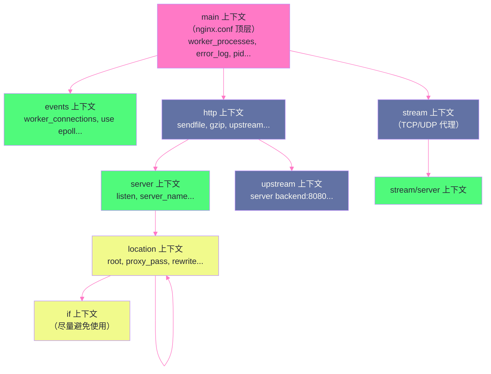

# 02 配置体系解析：指令、上下文与继承规则

## 摘要

nginx.conf 是 Nginx 的核心控制界面，几乎所有的行为调整都通过修改配置文件实现。但很多工程师对配置文件的理解停留在"复制粘贴能用就行"的层面，对指令的**继承与覆盖规则**、**变量的延迟求值机制**、以及`server_name` 匹配的优先级决策树缺乏系统认知，导致遇到配置不生效、变量取值异常、多 server 块冲突时无从下手。本文从 nginx.conf 的文法结构（Block / 上下文嵌套）出发，深入讲解指令的四种合并行为、变量的作用域与懒求值特性、`include` 的加载顺序，以及 `server_name` 的五级匹配优先级。这些是读懂任何 Nginx 配置的基础认知框架。

---

## 第 1 章 nginx.conf 的文法结构

### 1.1 Block 与上下文：配置的组织单元

Nginx 的配置文件由一系列**指令（Directive）**构成，指令分为两类：

**简单指令（Simple Directive）**：单行，以分号结尾，格式为 `指令名 参数1 参数2 ...;`

```nginx
worker_processes auto;
error_log /var/log/nginx/error.log warn;
keepalive_timeout 65;
```

**块指令（Block Directive）**：由 `{` 和 `}` 包裹一组子指令，形成一个**上下文（Context）**：

```nginx
http {          # http 上下文开始
    server {    # server 上下文（嵌套在 http 内）
        listen 80;
        location / {   # location 上下文（嵌套在 server 内）
            root /usr/share/nginx/html;
        }
    }
}
```

Nginx 的上下文有严格的嵌套层级，每条指令只能出现在**特定的上下文**中。违反上下文规则会在 `nginx -t` 验证时报错：

```
# 错误示例：root 指令放到了 events 上下文（不允许）
events {
    root /var/www;  # [emerg] "root" directive is not allowed here
}
```

### 1.2 完整的上下文层级树



理解这个层级的意义在于：**指令的继承与覆盖，只在同一条继承链上发生**。`http` 中的指令向下继承到 `server`，`server` 中的指令向下继承到 `location`；但不同 `server` 块之间、不同 `location` 块之间不存在继承关系。

---

## 第 2 章 指令的继承与覆盖规则

### 2.1 为什么需要继承规则

现实中的 nginx.conf 往往管理着多个虚拟主机（多个 `server` 块），每个虚拟主机下又有多个 `location`。如果每条配置都必须在每个 `location` 中重复声明，配置文件会极度冗余且难以维护。

继承规则的存在是为了**让通用配置只写一次，在父级声明，子级自动继承，需要覆盖时在子级重新声明**。但 Nginx 的继承规则并不是简单的"子覆盖父"——不同类型的指令有不同的合并行为，这是很多工程师被坑的地方。

### 2.2 指令的四种合并行为

Nginx 的指令根据其内部实现，分为四类合并行为：

**行为一：值覆盖（Value Override）**

最常见的合并行为。如果子上下文声明了该指令，使用子上下文的值；否则继承父上下文的值。**子值完全替代父值，没有合并**。

```nginx
http {
    keepalive_timeout 75;    # http 级别：75 秒
    
    server {
        # 没有声明 keepalive_timeout → 继承 http 的 75 秒
        
        location /api/ {
            keepalive_timeout 30;  # 在此 location 内覆盖为 30 秒
        }
        
        location / {
            # 没有声明 → 继承 server（而 server 又继承 http）→ 75 秒
        }
    }
}
```

适用于 `keepalive_timeout`、`client_max_body_size`、`root`、`index` 等绝大多数简单值指令。

**行为二：数组追加（Array Append）**

部分指令是数组类型，子上下文的声明**追加**到父上下文的数组中，而非替换。

```nginx
http {
    add_header X-Frame-Options DENY;     # 所有响应都加这个头
    
    server {
        add_header X-Content-Type-Options nosniff;  # 这个 server 额外加
        # 在此 server 的响应中，两个 add_header 都生效：
        # X-Frame-Options: DENY
        # X-Content-Type-Options: nosniff
        
        location /api/ {
            add_header Content-Type application/json;
            # !! 注意：这里只有这一个 add_header 生效 !!
            # 父级的 X-Frame-Options 和 X-Content-Type-Options 被"屏蔽"了
        }
    }
}
```

> [!warning] 生产避坑：`add_header` 的继承陷阱
> 这是 Nginx 配置中最常见的"坑"之一。`add_header` 指令的继承规则是：**如果当前上下文（location/server）中有任何 `add_header` 声明，则父级的所有 `add_header` 失效，只使用当前上下文的 `add_header`**。
>
> 这意味着：在 `http` 块中声明的全局安全响应头（`X-Frame-Options`、`X-Content-Type-Options`、`Strict-Transport-Security` 等），只要某个 `location` 里新增了任何一个 `add_header`，所有父级的安全头都会消失。
>
> **正确做法**：在需要添加自定义头的 `location` 中，同时重新声明所有父级的安全响应头；或者使用 `headers-more-nginx-module` 的 `more_set_headers` 指令（该指令没有这个"屏蔽"行为）。

同类型的还有 `proxy_set_header`——在 `server` 块中声明的 `proxy_set_header`，会被 `location` 块中任何 `proxy_set_header` 声明屏蔽。这也是为什么很多人发现在 `location` 中加了一个 `proxy_set_header Host $host`，结果之前在 `server` 中配置的 `proxy_set_header X-Real-IP $remote_addr` 消失了。

**行为三：动作追加（Action Append）**

某些"动作类"指令（如 `rewrite`），同时存在于父子上下文时，都会执行。

```nginx
server {
    rewrite ^/old-path /new-path permanent;  # server 级别的 rewrite
    
    location /new-path {
        rewrite ^/new-path/(.*)$ /final/$1 break;  # location 级别的 rewrite
    }
}

# 访问 /old-path 的请求：
# 1. 先执行 server 级别的 rewrite → 重定向到 /new-path（permanent = 301）
# 2. 客户端跟随 301 重定向，再次请求 /new-path
# 3. 进入 location /new-path，执行 location 级别的 rewrite
```

**行为四：不继承（No Inheritance）**

部分指令只在定义它的上下文中有效，不向子上下文继承。典型例子是 `listen` 指令——它只在 `server` 上下文中有效，不会被 `location` 继承（`location` 上下文中根本不能使用 `listen`）。

### 2.3 继承规则实战：`root` vs `alias` 的语义差异

`root` 和 `alias` 都用于指定文件系统路径，但它们的继承语义和路径拼接规则有根本差异，是配置 404 错误的高频原因：

```nginx
server {
    root /var/www/html;    # server 级别的 root

    location /images/ {
        # root 继承自 server，值为 /var/www/html
        # 实际文件路径 = root + URI = /var/www/html + /images/photo.jpg
        # = /var/www/html/images/photo.jpg  ✅ 正确
    }

    location /static/ {
        root /data;
        # 覆盖了继承，实际文件路径 = /data + /static/style.css
        # = /data/static/style.css
    }

    location /downloads/ {
        alias /var/www/files/;
        # alias 的路径拼接规则不同：
        # 实际文件路径 = alias值 + (URI去掉location前缀)
        # = /var/www/files/ + file.zip
        # = /var/www/files/file.zip
        # 而不是 /var/www/files/downloads/file.zip !!
    }
}
```

`root` 与 `alias` 的本质区别：
- `root`：`文件路径 = root值 + URI`（URI 中的 location 前缀保留）
- `alias`：`文件路径 = alias值 + (URI去掉location前缀后的部分)`（相当于把 URI 的 location 前缀替换为 alias 路径）

---

## 第 3 章 变量体系：延迟求值与作用域

### 3.1 变量的本质：延迟求值的惰性计算

Nginx 的配置中大量使用变量（以 `$` 开头），如 `$uri`、`$host`、`$remote_addr`、`$upstream_response_time` 等。理解变量的关键特性是**延迟求值（Lazy Evaluation）**。

在 Nginx 的请求处理管道中，变量不是在**配置加载时**求值的，而是在**请求处理时**、**该变量第一次被实际使用时**才求值（有些变量甚至是每次使用时都重新计算）。

这意味着：

```nginx
# 配置加载时，$uri、$host 等变量"还不存在"——它们绑定到请求上下文
# 只有当具体的 HTTP 请求到来时，$uri 才被赋予该请求的 URI 值

log_format main '$remote_addr - $remote_user [$time_local] '
                '"$request" $status $body_bytes_sent '
                '"$http_referer" "$http_user_agent"';
# 这里的 $remote_addr 等变量，在写日志时才被求值（每个请求写日志时各自计算）
```

### 3.2 变量的分类

Nginx 变量按来源分为四类：

**类型一：核心内置变量**

由 Nginx 核心模块（`ngx_http_core_module`）提供，总是可用：

| 变量 | 含义 | 求值时机 |
|-----|-----|---------|
| `$uri` | 当前请求的 URI（经过 rewrite 后的 URI）| 每次访问时计算 |
| `$request_uri` | 原始请求 URI（含 query string，不经 rewrite）| 请求到达时固定 |
| `$host` | 请求头中的 Host（小写，去掉端口）| 请求到达时固定 |
| `$http_host` | 原始 Host 请求头（含端口，大小写原样）| 请求到达时固定 |
| `$remote_addr` | 客户端 IP 地址 | 连接建立时固定 |
| `$scheme` | 请求协议（http 或 https）| 请求到达时固定 |
| `$args` | 查询字符串（? 后面的部分）| 可被 `set $args` 修改 |
| `$is_args` | 如果有查询字符串则为 `?`，否则为空 | 随 $args 变化 |

**`$host` vs `$http_host` 的安全差异**（第 11 篇安全篇详细讲解）：

这是一个高频的安全隐患。`$http_host` 直接取自客户端发送的 `Host` 请求头，攻击者可以伪造任意值；`$host` 的取值优先级是：`Host 请求头` → `server_name 指令匹配到的值` → `server 块的监听 IP`，更加可靠。在 `proxy_set_header Host` 时，**应始终使用 `$host` 而非 `$http_host`**。

**类型二：模块扩展变量**

由各功能模块提供，只在相应模块启用时才可用：

```nginx
# ngx_http_upstream_module 提供（只在 proxy_pass 场景有值）
$upstream_addr        # 上游服务器地址
$upstream_status      # 上游响应状态码
$upstream_response_time  # 上游响应时间（秒，精确到毫秒）

# ngx_http_ssl_module 提供（只在 HTTPS 请求时有值）
$ssl_protocol         # TLS 协议版本（TLSv1.3）
$ssl_cipher           # 协商的加密套件

# ngx_http_gzip_module 提供
$gzip_ratio           # 压缩比（原始/压缩 大小比值）
```

**类型三：用户自定义变量（`set` 指令）**

```nginx
location /api/ {
    set $backend_host "api.example.com";
    set $retry_times 3;
    
    # 基于条件动态设置变量
    set $log_level "info";
    if ($status >= 500) {
        set $log_level "error";
    }
    
    proxy_pass http://$backend_host;
}
```

`set` 创建的变量作用域是**当前请求**（不跨请求），在 `location` 中 `set` 的变量对该请求的后续处理阶段可见（如 `proxy_pass`、`log_format` 中引用）。

**类型四：`map` 模块变量（延迟计算的映射变量）**

```nginx
http {
    # map 指令定义一个变量映射关系
    # $uri → $is_static_file 的映射
    map $uri $is_static_file {
        ~*\.(jpg|png|gif|css|js)$  1;  # 静态文件扩展名 → 值为 1
        default                    0;
    }
    
    server {
        location / {
            # $is_static_file 在此处被"引用"时才触发 map 计算
            if ($is_static_file) {
                expires 30d;
            }
        }
    }
}
```

`map` 变量是 Nginx 变量延迟求值的典型应用——`map` 块只是定义了映射规则，当且仅当 `$is_static_file` 在某次请求中被实际引用时，才会触发对 `$uri` 的匹配计算。如果某个请求的处理路径从未引用 `$is_static_file`，这个 map 计算一次也不会发生，节省了 CPU。

### 3.3 内部变量与请求上下文

每个 HTTP 请求在 Nginx 内部对应一个 `ngx_http_request_t` 结构体（C 语言结构），请求相关的所有状态（URI、Method、Headers、变量值等）都存储在这个结构体中。Nginx 的变量就是这个结构体中各字段的访问封装。

这意味着：**Nginx 变量天然是请求级别的作用域**——每个请求的 `$uri`、`$remote_addr`、自定义 `$backend_host` 等，都存在于各自的 `ngx_http_request_t` 中，互不干扰。没有全局共享变量（除了使用 `ngx_shared_dict` 的 Lua 模块，这是 OpenResty 的功能，第 12 篇讲）。

---

## 第 4 章 server_name 的五级匹配优先级

### 4.1 为什么需要了解 server_name 的匹配规则

一台 Nginx 服务器上通常运行多个虚拟主机（多个 `server` 块），Nginx 根据请求的 `Host` 头决定将请求路由到哪个 `server` 块处理。当多个 `server` 块的 `server_name` 都能匹配同一个 Host 时，Nginx 遵循严格的优先级规则决定使用哪个。

```nginx
server {
    listen 80;
    server_name example.com www.example.com;
}

server {
    listen 80;
    server_name *.example.com;
}

server {
    listen 80;
    server_name ~^(www|api)\.example\.com$;
}

# 请求 Host: api.example.com
# 哪个 server 处理它？
```

### 4.2 五级优先级规则

Nginx 的 `server_name` 匹配按以下优先级从高到低进行（匹配到即停止）：

**优先级 1：精确匹配**

`server_name` 的值与 `Host` 头完全相同（字符串精确匹配）：

```nginx
server_name example.com www.example.com;
# 精确匹配 Host: example.com 或 Host: www.example.com
```

**优先级 2：前缀通配符（`*.example.com`）**

以 `*` 开头的通配符，`*` 只能出现在最左边（紧跟 `.`）：

```nginx
server_name *.example.com;
# 匹配 Host: any.example.com, sub.example.com 等
# 不匹配 Host: example.com（没有子域名前缀）
# 不匹配 Host: a.b.example.com（通配符只匹配一级）
```

**优先级 3：后缀通配符（`www.*`）**

以 `*` 结尾的通配符，`*` 只能出现在最右边（左边紧跟 `.`）：

```nginx
server_name www.*;
# 匹配 Host: www.example.com, www.google.com 等
# 使用场景较少，通常用于处理多域名的同一服务
```

**优先级 4：正则匹配（`~^...`）**

以 `~` 开头表示正则表达式匹配（区分大小写），以 `~*` 开头表示不区分大小写：

```nginx
server_name ~^(www|api|admin)\.example\.com$;
# 匹配 Host: www.example.com, api.example.com, admin.example.com
# 正则中可以使用捕获组，如 ~^(?<subdomain>.+)\.example\.com$
# 捕获的值存入 $subdomain 变量
```

**优先级 5：默认 server（`default_server`）**

当所有上述匹配都失败时，使用标记了 `default_server` 的 server 块（或在同一 `listen` 端口中第一个出现的 server 块）：

```nginx
server {
    listen 80 default_server;
    server_name _;  # _ 是一个不可能匹配任何真实域名的占位符
    return 444;     # 对未知 Host 直接关闭连接（444 是 Nginx 特有的"无响应关闭"状态码）
}
```

### 4.3 性能考量：Nginx 的 server_name Hash Table

精确匹配和通配符匹配使用**哈希表**存储，查找时间复杂度为 O(1)；正则匹配需要**线性遍历**所有 `~` 开头的 server_name，按配置文件中出现的顺序逐一尝试匹配，直到命中。

当 Nginx 管理大量虚拟主机（如共享主机场景，数百个域名）时，应尽量使用精确匹配或通配符，减少正则 server_name 的数量，避免线性扫描带来的性能开销。

相关配置项：

```nginx
http {
    # server_name 哈希表的桶大小（影响哈希冲突率）
    # 如果域名较长，需要增大此值（默认 512，遇到 "server_names_hash_bucket_size" 错误时增大）
    server_names_hash_bucket_size 128;
    
    # server_name 哈希表的最大大小（影响内存使用）
    server_names_hash_max_size 4096;
}
```

---

## 第 5 章 include 指令与配置组织

### 5.1 include 的语义

`include` 将外部文件的内容插入到当前位置，等价于直接将文件内容写到 `include` 所在处。支持 glob 通配符：

```nginx
http {
    # 加载所有 /etc/nginx/conf.d/ 下的 .conf 文件
    include /etc/nginx/conf.d/*.conf;
    
    # 加载指定文件
    include /etc/nginx/mime.types;
}
```

`include /etc/nginx/conf.d/*.conf` 加载文件的顺序是**按文件名字典序排列**（依赖操作系统的文件系统实现），通常与 `ls -1` 的输出顺序一致。如果多个文件中有同名指令，后加载的文件会覆盖先加载的（符合值覆盖规则）。

### 5.2 生产环境的配置文件组织最佳实践

```
/etc/nginx/
├── nginx.conf                 # 主配置，只包含全局设置和 include
├── mime.types                 # MIME 类型映射
├── conf.d/                    # 各虚拟主机配置（一个域名一个文件）
│   ├── example.com.conf
│   ├── api.example.com.conf
│   └── default.conf           # 默认 server（兜底）
├── snippets/                  # 可复用的配置片段
│   ├── ssl-params.conf        # SSL/TLS 通用配置
│   ├── security-headers.conf  # 安全响应头（add_header 集合）
│   └── proxy-params.conf      # upstream 代理通用配置（proxy_set_header 集合）
└── sites-enabled/             # 软链接（Debian/Ubuntu 风格）
    └── example.com -> /etc/nginx/sites-available/example.com
```

**snippets 模式的价值**：将通用配置提取到 snippet 文件，在需要的 server/location 中 `include` 引用，避免重复代码。以安全响应头为例：

```nginx
# /etc/nginx/snippets/security-headers.conf
add_header X-Frame-Options "SAMEORIGIN" always;
add_header X-Content-Type-Options "nosniff" always;
add_header X-XSS-Protection "1; mode=block" always;
add_header Referrer-Policy "strict-origin-when-cross-origin" always;
add_header Strict-Transport-Security "max-age=31536000; includeSubDomains" always;

# 在各 server 块中引用：
server {
    include snippets/security-headers.conf;
    
    location /api/ {
        include snippets/security-headers.conf;  # 在 location 中也要重新 include
        # 原因：参见第 2.2 节 add_header 的继承陷阱
        add_header Content-Type application/json;
    }
}
```

---

## 第 6 章 if 指令的陷阱与正确用法

### 6.1 if is Evil：为什么要避免 if

Nginx 官方 Wiki 中有一篇著名文章叫 **"If Is Evil"**，强烈建议工程师避免在 `location` 内部使用 `if` 指令。这不是强迫症，而是有充分的工程理由。

`if` 在 Nginx 配置中的语义非常特殊：**它不是编程语言中的条件分支，而是创建了一个隐式的 `location`**。当 `if` 条件成立时，请求实际上被路由到 `if` 内部的"隐式 location"处理；条件不成立时，继续在原 `location` 中处理。

这个语义导致了一系列反直觉的行为：

```nginx
# 危险示例 1：if 内的 proxy_pass 不继承外部的 proxy_set_header
location /api/ {
    proxy_set_header X-Real-IP $remote_addr;
    
    if ($request_method = POST) {
        proxy_pass http://backend-write;
        # !! proxy_set_header X-Real-IP $remote_addr 在这里不生效 !!
        # if 创建了新的隐式 location，不继承外部 location 的 proxy_set_header
    }
}

# 危险示例 2：多个 if 块只有最后一个生效
location / {
    if ($host = "old.example.com") {
        return 301 https://new.example.com$request_uri;
    }
    
    if ($request_method = POST) {
        proxy_pass http://backend;
        # 如果两个 if 同时成立（几乎不可能，但语义本身就是错误的）
        # 实际上 Nginx 只会进入最后一个匹配的 if
    }
}
```

### 6.2 if 的正确使用场景（有限）

尽管危险，`if` 在以下场景中使用是安全的（仅包含 `return` 或 `rewrite`）：

```nginx
# 安全的 if 用法：仅用于 return 和 rewrite
server {
    # 将 HTTP 重定向到 HTTPS（安全）
    if ($scheme = http) {
        return 301 https://$host$request_uri;
    }
    
    # 基于 User-Agent 的重定向（安全）
    if ($http_user_agent ~* "Googlebot") {
        return 200 "OK, bot";
    }
}
```

**替代 `if` 的正确方式**：大多数需要 `if` 的场景，都可以用 `map` + 多 `location` 的组合替代：

```nginx
# 不好的写法（if）：
location / {
    if ($request_method = POST) {
        proxy_pass http://write-backend;
    }
    proxy_pass http://read-backend;
}

# 好的写法（map + location）：
map $request_method $backend {
    POST    http://write-backend;
    default http://read-backend;
}

location / {
    proxy_pass $backend;
}
```

---

## 小结

nginx.conf 的配置体系以"上下文嵌套 + 指令继承"为核心设计范式：

- **上下文层级**：`main` → `events`/`http`/`stream` → `server` → `location`，每个上下文有自己允许的指令集
- **四种继承行为**：值覆盖（最常见）、数组追加（`add_header`/`proxy_set_header` 的继承陷阱）、动作追加（`rewrite`）、不继承
- **变量延迟求值**：Nginx 变量绑定到请求上下文，在被使用时才计算；`map` 是延迟求值的典型应用
- **`server_name` 五级优先级**：精确 > 前缀通配符 > 后缀通配符 > 正则 > default_server，正则匹配是线性扫描，应减少使用
- **`if` 的陷阱**：`if` 创建隐式 location 导致继承关系破裂，除 `return`/`rewrite` 外尽量用 `map` 替代

第 03 篇深入 HTTP 请求处理的核心：Nginx 的 11 个 Phase 阶段，每个 Phase 的职责与执行顺序，`rewrite`、`access`、`content` 三大核心 Phase 的语义边界，以及内部跳转（`internal redirect`）的完整流程。

---

## 参考资料

- [Nginx 官方文档：指令参考](https://nginx.org/en/docs/dirindex.html)
- [Nginx Wiki：If Is Evil](https://www.nginx.com/resources/wiki/start/topics/depth/ifisevil/)
- [Nginx 变量完整列表](https://nginx.org/en/docs/varindex.html)


---

> **下一篇**：[[03 HTTP 请求处理管道：11 个阶段全解]]

---

> [!note] 思考题
> 1. Nginx 的 `server` 块匹配顺序（精确→通配符前缀→通配符后缀→正则→默认）容易出错。如果请求的 Host 不匹配任何 `server_name`，会匹配 `default_server`。在安全角度，未配置 `default_server` 时第一个 `server` 块成为默认——可能暴露不应公开的服务。你如何设计一个'兜底'的 default_server 来拦截未知请求？
> 2. `location` 匹配的优先级（`=` > `^~` > `~`/`~*` > 普通前缀）经常导致配置错误。`location = /api` 和 `location /api` 和 `location ~ ^/api` 在处理 `/api/v1/users` 时行为完全不同。你能准确描述每种情况的匹配结果吗？
> 3. Nginx 配置继承中 `proxy_set_header` 在子上下文重新定义后会覆盖父上下文的所有同类指令（全量覆盖而非追加）。这导致常见 bug：在 location 中设置一个新 header 后丢失了 server 块中设置的其他 header。你如何避免这个陷阱？
