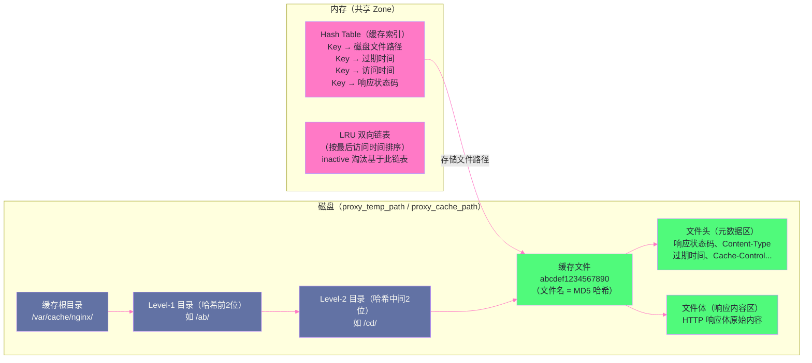

# 05 缓存机制：proxy_cache 的物理结构与失效策略

## 摘要

`proxy_cache` 是 Nginx 最强大但也最容易用错的功能之一。它将后端响应缓存在本地磁盘上，让后续相同请求直接从磁盘读取，大幅降低后端压力和响应延迟。但"缓存"这个词掩盖了很多复杂性：缓存 Key 是如何从 URI 映射到磁盘上具体文件路径的？内存中的 Zone 和磁盘上的文件如何协作？`inactive`、`max_size`、`proxy_cache_valid` 三个看似相关的配置各自控制什么？Stale-While-Revalidate 如何在缓存过期时避免请求阻塞？本文从缓存的物理存储模型出发，深入讲解这些问题的答案，帮助工程师在生产中正确配置和调优 Nginx 缓存。

---

## 第 1 章 为什么需要 Nginx 层面的缓存

### 1.1 缓存的价值与位置选择

在典型的 Web 架构中，缓存可以部署在多个位置：

```
浏览器缓存（客户端）
    ↓
CDN 缓存（边缘节点）
    ↓
Nginx proxy_cache（接入层）
    ↓
应用缓存（Redis/Memcached，应用层）
    ↓
数据库查询缓存（DB 层）
```

每一层缓存都有其优势。**Nginx proxy_cache 的核心价值**在于：

**价值一：对后端完全透明**

后端服务不需要做任何修改，只需要在 Nginx 配置里添加几行 `proxy_cache` 指令，就能为整个后端服务加上缓存。对于遗留系统或无法修改的第三方服务，这是最简单的加速方案。

**价值二：保护后端免受流量突刺**

热点事件（如电商大促、新闻爆发）时，相同 URL 的并发请求量可能从正常的每秒 100 次飙升到每秒 10 万次。没有 Nginx 缓存，这 10 万次请求全部打到后端；有了 Nginx 缓存，绝大多数请求直接从内存/磁盘读取，后端只需处理少量的缓存 Miss 请求（或缓存刷新请求）。

**价值三：降低跨网络延迟**

Nginx 部署在 IDC 内网，距离后端服务的网络延迟通常是 1-5ms；而浏览器到 CDN 的距离是几十毫秒。**Nginx 缓存命中时，响应来自本机磁盘（微秒级）或内存（纳秒级），比任何一次网络 RTT 都快**。

### 1.2 proxy_cache 与应用层 Redis 缓存的分工

| 维度 | Nginx proxy_cache | Redis 缓存 |
|-----|-----------------|-----------|
| 缓存粒度 | HTTP 响应（含响应头）| 任意数据结构 |
| 缓存 Key | URI + 可选 Header/Body | 任意字符串 |
| 访问延迟 | 磁盘：几十微秒；内存命中（OS Page Cache）：纳秒 | 网络 RTT + Redis 处理：1-5ms |
| 失效控制 | HTTP Cache-Control / 手动 purge | 应用代码控制 |
| 适用内容 | 完整 HTTP 响应（静态页面、API 响应）| 细粒度数据（数据库查询结果、Session）|
| 缓存更新 | 过期后重新向后端获取 | 应用主动更新 |

两者不是竞争关系，而是互补：Nginx 缓存整个 HTTP 响应（粗粒度），Redis 缓存数据层的细粒度内容。典型的组合是：Nginx 缓存 HTML 页面/API 列表响应（命中率高，稳定变化），Redis 缓存频繁更新的细粒度数据（如用户 Session、商品库存）。

---

## 第 2 章 proxy_cache 的物理存储模型

### 2.1 两级存储架构：内存索引 + 磁盘文件

`proxy_cache` 使用**两级存储**：内存中的共享内存 Zone（存储缓存索引和元数据）+ 磁盘上的文件系统（存储响应内容）。



**内存 Zone 的职责**：
- 存储缓存 Key → 磁盘路径的映射（哈希表）
- 存储每个缓存条目的元数据（过期时间、最后访问时间、响应状态）
- 维护 LRU 链表（用于 `inactive` 淘汰和 `max_size` 驱逐）
- Nginx 的所有 Worker 进程共享同一个 Zone（共享内存）

**磁盘文件的职责**：
- 持久化存储 HTTP 响应内容（响应头 + 响应体）
- 文件名是缓存 Key 的 MD5 哈希值
- 按目录层级组织（避免单个目录文件过多导致性能下降）

### 2.2 缓存 Key 到磁盘路径的映射过程

**Step 1：计算缓存 Key**

```nginx
proxy_cache_key "$scheme$request_method$host$request_uri";
# 默认的缓存 Key 由 scheme（http/https）、方法、Host 和 URI 组成
```

缓存 Key 是一个字符串，由配置的变量拼接而成。例如：
```
scheme=https, method=GET, host=example.com, uri=/api/users?page=1
→ Key = "httpsGETexample.com/api/users?page=1"
```

**Step 2：计算 MD5 哈希**

对 Key 字符串计算 [[MD5]] 哈希，得到一个 32 字符的十六进制字符串：
```
MD5("httpsGETexample.com/api/users?page=1") = "ab3cd5ef78901234..."
```

**Step 3：映射到文件系统路径**

根据 `proxy_cache_path` 中的 `levels` 参数，将 MD5 哈希映射到多级目录：

```nginx
proxy_cache_path /var/cache/nginx
                 levels=1:2          # 第一级目录取1位，第二级取2位
                 keys_zone=my_cache:10m
                 max_size=10g
                 inactive=60m
                 use_temp_path=off;
```

`levels=1:2` 的意思：
```
MD5 = "ab3cd5ef78901234..."

文件路径 = cache_root / 最后1位 / 倒数第2-3位 / 完整MD5
         = /var/cache/nginx / b / ef / ab3cd5ef78901234...
         = /var/cache/nginx/b/ef/ab3cd5ef78901234...

（注意：levels 是从 MD5 的末尾开始取，不是开头）
```

**为什么要多级目录**：

如果所有缓存文件都放在同一个目录下，当缓存文件数量达到几十万甚至上百万时，目录列表操作（`readdir`）的性能会急剧下降——Linux 的目录本质上是一个存储文件名→inode 映射的 B 树（ext4 的 htree 实现），单目录下文件过多时，查找文件的 B 树深度增加，I/O 次数增多。

`levels=1:2` 将文件分散到 `16 × 256 = 4096` 个目录中，每个目录下的文件数量降低到原来的 1/4096，大幅提升目录查找性能。

> [!info] 核心概念：use_temp_path=off 为什么重要
> 默认情况下（`use_temp_path` 未设置或为 `on`），Nginx 先将后端响应写入临时文件（`proxy_temp_path`），写完后再移动（`rename`）到缓存目录。如果临时目录和缓存目录不在同一个文件系统分区，`rename` 会退化为"先复制再删除"，产生额外的磁盘 I/O。
>
> 设置 `use_temp_path=off` 后，Nginx 直接在缓存目录中写临时文件，`rename` 操作是同一文件系统内的原子操作（只修改目录项，不移动数据），代价极低。**生产环境中应始终设置 `use_temp_path=off`**。

---

## 第 3 章 三种失效机制的精确语义

### 3.1 proxy_cache_valid：基于状态码的 TTL

`proxy_cache_valid` 控制**不同 HTTP 状态码的缓存存活时间（TTL）**：

```nginx
location /api/ {
    proxy_cache my_cache;
    
    proxy_cache_valid 200 302  10m;  # 200 和 302 响应缓存 10 分钟
    proxy_cache_valid 404      1m;   # 404 响应缓存 1 分钟（防止频繁查询不存在的资源）
    proxy_cache_valid any      5m;   # 其他所有状态码缓存 5 分钟
}
```

**TTL 的优先级**：Nginx 在决定缓存时间时，遵循以下优先级（高优先级的设置覆盖低优先级）：

1. **`X-Accel-Expires` 响应头**（最高优先级）：后端在响应头中用 `X-Accel-Expires: 3600` 指定缓存秒数，Nginx 遵从
2. **`Expires` 响应头**：标准 HTTP 缓存头，指定缓存过期的绝对时间
3. **`Cache-Control: max-age=N` 响应头**：标准 HTTP 缓存头，相对时间
4. **`proxy_cache_valid` 指令**（最低优先级）：只在后端没有设置任何缓存相关响应头时生效

这个优先级设计的理念是：**后端服务最了解自己的数据，应该优先遵从后端的缓存指令**；`proxy_cache_valid` 是兜底设置，用于处理后端没有设置缓存头的情况。

### 3.2 inactive：基于最后访问时间的淘汰

`inactive` 是容易与 TTL（`proxy_cache_valid`）混淆的参数，但两者控制的是完全不同的维度：

- **`proxy_cache_valid`**：控制缓存内容的**有效性**——过了 TTL，缓存条目被标记为"已过期"（stale），但**不一定立即删除**，可以继续保留在磁盘上
- **`inactive`**：控制缓存条目的**存活性**——如果一个缓存条目在 `inactive` 时间内没有被任何请求访问过，则**被删除**（即使 TTL 还没到期）

```nginx
proxy_cache_path /var/cache/nginx
                 levels=1:2
                 keys_zone=my_cache:10m
                 inactive=60m;    # 60 分钟内没有被访问的缓存条目删除

# 场景分析：
proxy_cache_valid 200 1d;  # 200 响应 TTL = 1天

# 某个 URL 缓存了一个 200 响应：
# - 如果在 60 分钟内有新请求命中这个缓存 → inactive 计时重置，继续保留
# - 如果 60 分钟内没有任何请求访问这个缓存
#   → inactive 触发，条目被删除（即使 TTL 还剩 23 小时！）
# - 被删除后，下次请求这个 URL 会重新向后端获取
```

**`inactive` 的工程价值**：磁盘空间是有限的，`inactive` 确保磁盘不被"冷门内容"占满。没有 `inactive`，一个只被访问过一次的页面会一直占用磁盘空间直到 TTL 过期；有了 `inactive=60m`，60 分钟内没有再次访问的内容会被自动清理。

### 3.3 max_size：基于磁盘容量的 LRU 驱逐

```nginx
proxy_cache_path /var/cache/nginx
                 levels=1:2
                 keys_zone=my_cache:10m
                 max_size=10g;    # 缓存目录最大占用 10GB 磁盘空间
```

当缓存目录的总大小超过 `max_size` 时，Nginx 的 **Cache Manager 进程**（第 01 篇提到的后台进程）启动 LRU 驱逐：删除最近最少访问的缓存文件，直到总大小降到 `max_size` 的 90% 以下。

**Cache Manager 进程的工作节奏**：Cache Manager 不是实时监控，而是**定期扫描**（默认每 5 秒一次）。这意味着在两次扫描之间，磁盘使用量可能短暂超过 `max_size`。`max_size` 是一个**软上限**，不是硬性限制。

**三种失效机制的关系总结**：

```
一个缓存条目的生命周期：

创建：后端响应被缓存到磁盘
         ↓
存活：每次被请求命中 → inactive 计时重置
         ↓
过期（不删除）：TTL 到期（proxy_cache_valid 超时）→ 标记为 stale，可继续服务（见下文）
         ↓
删除（三种路径之一）：
  路径1：inactive 到期（长时间无访问）
  路径2：max_size 触发 LRU 驱逐
  路径3：手动 purge（ngx_cache_purge 模块）
```

---

## 第 4 章 缓存过期后的处理策略

### 4.1 标准行为：过期后向后端重新验证

默认情况下，当缓存 TTL 过期时，Nginx 向后端发起新请求，获取新鲜的响应，并更新缓存。在向后端请求期间，**当前请求等待**后端响应——这会导致过期时刻的请求延迟突然升高（从缓存命中的微秒级，升高到后端响应时间的毫秒级）。

对于高流量场景，TTL 过期瞬间可能有大量并发请求同时发现缓存过期，全部涌向后端——这就是著名的**缓存雪崩（Cache Stampede）** 或**缓存击穿（Thundering Herd）** 问题。

### 4.2 proxy_cache_lock：防止缓存击穿

```nginx
location /api/ {
    proxy_cache my_cache;
    proxy_cache_valid 200 10m;
    
    # 开启缓存锁：同时只允许一个请求去后端获取新内容
    proxy_cache_lock on;
    # 其他并发请求等待锁的最长时间（超时后也向后端发请求）
    proxy_cache_lock_timeout 5s;
    # 锁等待时间（超过此值的等待请求转为直接向后端请求，不再等锁）
    proxy_cache_lock_age 5s;
}
```

`proxy_cache_lock on` 的工作原理：

当多个并发请求同时发现缓存过期时，只有**第一个请求**获得锁，去后端获取新内容；其他请求在 Nginx 内部**等待这个锁**。当第一个请求获取到新响应并更新缓存后，等待中的请求直接从新缓存中读取，无需再次向后端发请求。

这将"N 个请求同时打到后端"降低为"1 个请求打到后端，N-1 个请求等待"，有效防止缓存击穿。

### 4.3 proxy_cache_use_stale：用过期缓存兜底

```nginx
location /api/ {
    proxy_cache my_cache;
    proxy_cache_valid 200 10m;
    
    # 在以下情况下，允许使用已过期（stale）的缓存内容：
    proxy_cache_use_stale error timeout updating http_500 http_502 http_503 http_504;
    # error：后端连接失败时，用 stale 缓存
    # timeout：后端响应超时时，用 stale 缓存
    # updating：缓存正在更新（另一个请求正在向后端获取新内容）时，用 stale 缓存
    # http_5xx：后端返回 5xx 错误时，用 stale 缓存
}
```

**`updating` 标志的关键意义**：

`proxy_cache_use_stale updating` 配合 `proxy_cache_lock` 是解决缓存击穿的最佳组合：

```
场景：缓存刚过期，多个并发请求同时到达

配置了 proxy_cache_lock + proxy_cache_use_stale updating 时：
  请求 1：发现缓存过期，获取锁，向后端发起请求
  请求 2-100：发现缓存过期（updating 状态），但因为 use_stale updating，
               直接返回过期的缓存内容（stale 响应）——延迟极低！
  请求 1 完成：更新缓存，锁释放
  此后新请求：从新鲜缓存中读取

对比没有 use_stale updating 时：
  请求 1：向后端发起请求
  请求 2-100：等待 proxy_cache_lock，等待时间 = 后端响应时间（可能几百毫秒）
```

这就是 **Stale-While-Revalidate** 模式的 Nginx 实现——在缓存更新期间，用稍微过期的内容服务请求，换取极低的响应延迟。

### 4.4 proxy_cache_background_update：后台异步更新

```nginx
location /api/ {
    proxy_cache my_cache;
    proxy_cache_valid 200 10m;
    proxy_cache_use_stale updating;
    
    # 在缓存接近过期时，主动在后台发起更新请求（不等用户触发过期）
    proxy_cache_background_update on;
}
```

`proxy_cache_background_update on` 让 Nginx 在缓存即将过期时**主动后台更新**，而不是等到第一个用户请求触发更新。这进一步降低了用户感知到的缓存过期延迟——因为缓存在过期前就已经刷新了，用户几乎不会遇到 stale 响应。

---

## 第 5 章 缓存控制的精细化配置

### 5.1 哪些请求不应该被缓存

并非所有请求都应该缓存。常见的不应该缓存的场景：

```nginx
# 方法级别：只缓存 GET 和 HEAD 请求
proxy_cache_methods GET HEAD;   # 默认值（POST/PUT/DELETE 不缓存）

# 基于请求头：有 Cookie 的请求通常含用户状态，不应缓存
location /api/ {
    # 如果请求包含 Cookie 或 Authorization 头，不使用缓存（直接向后端请求）
    proxy_cache_bypass $cookie_session_id $http_authorization;
    # proxy_no_cache：在此情况下不将响应存入缓存
    proxy_no_cache $cookie_session_id $http_authorization;
    # 两者配合：既不读缓存，也不写缓存（完全绕过缓存）
    
    proxy_cache my_cache;
    proxy_cache_valid 200 10m;
}
```

**`proxy_cache_bypass` vs `proxy_no_cache`**：

- `proxy_cache_bypass`：控制**读缓存**——当条件成立时，不从缓存读取，向后端发请求（但响应仍可能被写入缓存）
- `proxy_no_cache`：控制**写缓存**——当条件成立时，不将后端响应写入缓存

通常两者配合使用（如上例），确保特定请求完全绕过缓存。

### 5.2 忽略后端的缓存控制头

后端服务有时会在响应中添加 `Cache-Control: no-store` 或 `Cache-Control: private`，阻止 Nginx 缓存。但某些情况下，工程师希望强制 Nginx 缓存这些响应（如后端设置了不合理的 no-cache 头但内容实际上是可缓存的）：

```nginx
location /api/ {
    proxy_cache my_cache;
    
    # 忽略后端响应中的 Cache-Control: no-cache 和 no-store（强制缓存）
    proxy_ignore_headers Cache-Control Expires;
    
    proxy_cache_valid 200 10m;  # 强制使用这个 TTL，无视后端的缓存头
}
```

> [!warning] 生产避坑
> `proxy_ignore_headers Cache-Control` 是一个危险配置。它会强制缓存后端认为不应该被缓存的内容（如个人化数据、动态令牌等）。使用前必须仔细审查被缓存的内容是否真的是公共的、非个人化的。如果不确定，不要使用这个配置。

### 5.3 缓存分区：多个 keys_zone 的使用场景

对于不同类型的内容（静态资源 vs API 响应），可以定义多个缓存 Zone，分别配置不同的 TTL 和磁盘空间：

```nginx
http {
    # 静态资源缓存：大容量，长 TTL
    proxy_cache_path /var/cache/nginx/static
                     levels=1:2
                     keys_zone=static_cache:50m
                     max_size=50g
                     inactive=7d
                     use_temp_path=off;

    # API 响应缓存：小容量，短 TTL
    proxy_cache_path /var/cache/nginx/api
                     levels=1:2
                     keys_zone=api_cache:10m
                     max_size=2g
                     inactive=10m
                     use_temp_path=off;

    server {
        location /static/ {
            proxy_cache static_cache;
            proxy_cache_valid 200 7d;
            # 静态资源内容不变，可以长期缓存
        }
        
        location /api/ {
            proxy_cache api_cache;
            proxy_cache_valid 200 60s;
            # API 响应变化较快，短 TTL
        }
    }
}
```

---

## 第 6 章 缓存调试与监控

### 6.1 $upstream_cache_status 变量

Nginx 提供 `$upstream_cache_status` 变量，记录每次请求的缓存状态，是诊断缓存命中率的核心手段：

| 取值 | 含义 |
|-----|-----|
| `HIT` | 缓存命中，直接从缓存返回 |
| `MISS` | 缓存未命中，从后端获取（并存入缓存）|
| `EXPIRED` | 缓存条目存在但已过期，从后端获取 |
| `STALE` | 使用了过期缓存（`proxy_cache_use_stale` 生效）|
| `UPDATING` | 缓存正在更新中，使用旧缓存（`use_stale updating` 生效）|
| `REVALIDATED` | 使用条件请求（`If-Modified-Since`）验证，后端返回 304，缓存仍有效 |
| `BYPASS` | 请求绕过了缓存（`proxy_cache_bypass` 条件成立）|

```nginx
# 在 log_format 中加入缓存状态
log_format cache_log '$remote_addr - [$time_local] '
                     '"$request" $status '
                     'cache_status=$upstream_cache_status '
                     'upstream=$upstream_addr '
                     'rt=$request_time urt=$upstream_response_time';

access_log /var/log/nginx/access.log cache_log;

# 在响应头中暴露缓存状态（便于客户端/开发调试）
add_header X-Cache-Status $upstream_cache_status;
```

### 6.2 缓存命中率的计算与告警

```bash
# 从 access_log 分析缓存命中率（过去1小时）
awk '/cache_status=HIT/{hit++} /cache_status=/{total++} END{printf "命中率: %.2f%% (%d/%d)\n", hit/total*100, hit, total}' \
    <(grep "$(date '+%d/%b/%Y:%H' --date='1 hour ago')" /var/log/nginx/access.log)
```

生产中缓存命中率的健康标准：
- **静态资源**（JS/CSS/图片）：命中率应 > 95%
- **API 响应**：命中率应 > 80%（取决于 TTL 和请求分布）
- **命中率 < 50%**：通常说明 Cache Key 设计不合理（包含了会变化的变量），或 TTL 过短

### 6.3 手动清除缓存（Cache Purge）

Nginx 开源版本不内置缓存清除功能，需要安装 `ngx_cache_purge` 模块（第三方模块）：

```nginx
# 安装 ngx_cache_purge 模块后的配置
location ~ /purge(/.*) {
    allow 127.0.0.1;
    allow 10.0.0.0/8;    # 只允许内网访问 purge 接口
    deny all;
    
    proxy_cache_purge my_cache "$scheme$request_method$host$1";
}

# 清除指定 URL 的缓存：
# curl -X PURGE http://nginx-host/purge/api/users?page=1
```

不使用第三方模块时，可以通过以下方式手动清除：

```bash
# 方法1：删除对应的缓存文件（需要知道 Key 对应的 MD5 哈希）
# 方法2：清空整个缓存目录（谨慎：会清空所有缓存）
rm -rf /var/cache/nginx/api/*
nginx -s reload  # reload 后 Cache Manager 进程重建内存索引
```

---

## 小结

`proxy_cache` 的物理存储模型和失效策略是深度理解 Nginx 缓存的关键：

- **两级存储**：内存 Zone（哈希表 + LRU 链表）索引元数据，磁盘文件存储内容；缓存 Key 经 MD5 哈希后通过多级目录映射到具体文件
- **三种失效维度**：`proxy_cache_valid`（TTL，按状态码控制有效期）、`inactive`（按最后访问时间淘汰）、`max_size`（按磁盘容量 LRU 驱逐）——三者相互独立，配合工作
- **缓存击穿防护**：`proxy_cache_lock` 确保只有一个请求重建缓存；`proxy_cache_use_stale updating` 在缓存更新期间用 stale 内容服务其他请求；`proxy_cache_background_update` 提前异步刷新
- **`$upstream_cache_status`**：HIT/MISS/EXPIRED/STALE 等值是诊断缓存行为的核心指标，应始终写入访问日志并监控命中率
- **`use_temp_path=off`**：消除跨文件系统的 `rename` 开销，生产必配

第 06 篇深入 SSL/TLS 卸载：TLS 1.3 握手的 1-RTT 与 0-RTT、Session Ticket 与 Session Cache 的原理差异、OCSP Stapling 的工作机制，以及 `ssl_buffer_size` 与连接复用的调优方法。

---

## 参考资料

- [Nginx 官方文档：ngx_http_proxy_cache](https://nginx.org/en/docs/http/ngx_http_proxy_module.html#proxy_cache)
- [Nginx 官方文档：proxy_cache_path](https://nginx.org/en/docs/http/ngx_http_proxy_module.html#proxy_cache_path)
- [ngx_cache_purge 模块](https://github.com/FRiCKLE/ngx_cache_purge)


---

> **下一篇**：[[06 SSL-TLS 卸载：HTTPS 握手流程与性能优化]]

---

> [!note] 思考题
> 1. 缓存键设计过细降低命中率，过粗导致不同用户看到相同缓存。在一个多语言网站中，`Accept-Language` 应该加入缓存键吗？如果加入，缓存空间翻倍——你如何评估这个权衡？`Vary` 头与 `proxy_cache_key` 的关系是什么？
> 2. `proxy_cache_use_stale updating error timeout` 在后端不可用或更新缓存期间返回过期缓存。这种'陈旧缓存优先于错误'的策略在什么场景下是正确的（如静态内容、商品列表）？在什么场景下危险（如金融数据、库存信息）？
> 3. Nginx 缓存 purge 需要第三方模块。在 CDN 场景中要求'秒级缓存失效'——用户发布新内容后立即看到更新。除了 purge API，'缓存版本化'（URL 中包含版本号或 hash）是否是更可靠的方案？两种方案各适合什么场景？
