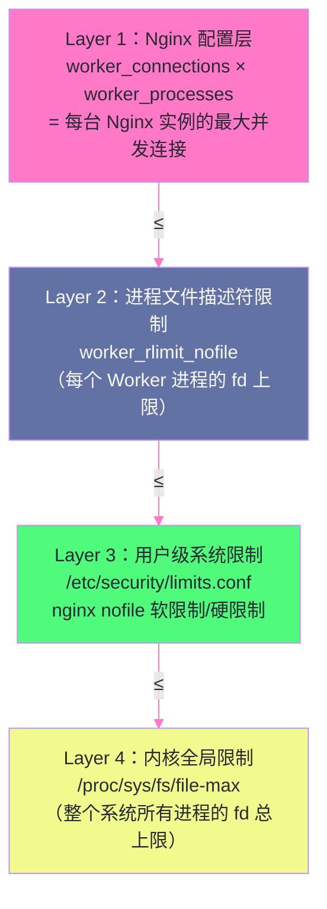

# 10 性能调优全攻略：worker 进程、连接数与内核参数

## 摘要

Nginx 的默认配置已经相当合理，但在面向高并发、大流量的生产场景时，需要从三个维度进行系统性调优：**Nginx 进程与连接配置**（worker 数量、CPU 亲和性、连接数上限）、**传输层优化**（`sendfile`/`tcp_nopush`/`tcp_nodelay` 在协议栈层面的工作原理）、以及**操作系统内核参数**（文件描述符上限、TCP 连接队列、TIME_WAIT 回收）。这三层优化环环相扣，任何一层的瓶颈都可能使其他层面的优化失效。本文从"为什么这样配"的角度深度推导每一个参数的底层原理，而非罗列配置清单——理解原理才能在具体场景中做出正确的调整，而不是盲目照搬"最佳实践"。

---

## 第 1 章 Worker 进程调优的底层逻辑

### 1.1 Worker 数量：等于 CPU 核数的数学依据

在第 01 篇《事件驱动模型》中已经介绍过 `worker_processes`，这里从性能调优的角度做更深入的推导。

**为什么 Worker 数量等于 CPU 核数是最优解？**

Nginx Worker 进程是**计算密集型**的——每次请求处理需要执行：
- HTTP 请求解析（状态机）
- TLS 加解密（ECDSA/RSA 非对称运算 + AES-GCM 对称运算）
- 正则匹配（PCRE）
- 响应压缩（gzip/brotli）
- 文件 I/O（静态文件服务时）

这些操作都需要 CPU 时间。当 Worker 数量等于 CPU 核数时，每个 Worker 独占一个 CPU 核心运行，不需要等待 CPU 调度——**零上下文切换**。

如果 Worker 数量 > CPU 核数（假设 4 核 8 Worker）：
```
4 个 CPU 核心，8 个 Worker 进程竞争 CPU 时间
内核调度器需要在 8 个进程之间进行时间片切换
每次切换：
  1. 保存当前进程的寄存器状态到内核栈
  2. 刷新 CPU 的 L1/L2 TLB（Translation Lookaside Buffer）
  3. 加载新进程的寄存器状态
  4. 新进程的 L1 Cache 几乎全部失效（冷缓存）

在高 QPS 场景，上下文切换频率极高，每次切换约 1-10μs
额外的上下文切换 CPU 开销 = 切换次数 × 切换时间
可能占据 5-15% 的额外 CPU 消耗
```

**例外情况**：如果 Nginx 主要作为反向代理（CPU 很轻，大部分时间在等待后端响应），Worker 会经常处于 "等待网络 I/O" 状态而非真正消耗 CPU。此时设置 Worker 数量为 CPU 核数的 2 倍，可以让 CPU 在一个 Worker 等待 I/O 时切换到另一个 Worker 处理新请求，提高 CPU 利用率。但这需要实测验证，不是通用建议。

```nginx
# 推荐配置（大多数场景）
worker_processes auto;  # 等于 CPU 核数

# 等价的显式写法（假设 8 核 CPU）
worker_processes 8;
```

### 1.2 CPU 亲和性（worker_cpu_affinity）的深层原理

**CPU 亲和性（CPU Affinity）** 是将某个进程绑定到特定 CPU 核心的机制，底层通过 Linux 的 `sched_setaffinity()` 系统调用实现。

**为什么 CPU 亲和性能提升性能？**

答案在于 [[CPU 缓存]]（L1/L2 Cache）的工作方式：

每个 CPU 核心有独立的 L1 Cache（通常 32KB，4 周期延迟）和 L2 Cache（通常 256KB，12 周期延迟），多核共享 L3 Cache（通常 8-32MB，30-40 周期延迟）。从 L1 Cache 读数据比从 L3 读快 10 倍，比从内存（RAM）读快 100-300 倍。

当一个 Worker 进程在不同 CPU 核心之间迁移时（没有亲和性绑定）：
```
Worker W1 运行在 CPU Core 0：
  W1 的工作数据（连接状态表、HTTP 解析缓冲、TLS 上下文）被加载进 Core 0 的 L1/L2 Cache

内核调度器将 W1 迁移到 CPU Core 1：
  Core 1 的 L1/L2 Cache 中没有 W1 的任何数据（冷缓存）
  W1 重新开始的每次内存访问都要从 L3 或 RAM 读取

  对于一个处理中的 HTTP 请求（连接状态 ~4KB），
  冷 L1 Cache 意味着前 ~100 次内存操作都要付出 100-300 倍的延迟
```

绑定 CPU 亲和性后，Worker 始终在同一核心运行，其工作数据始终在该核心的 L1/L2 Cache 中，Cache 命中率接近 100%。

```nginx
# 4 核 CPU，4 个 Worker，每个绑定一个核
worker_cpu_affinity 0001 0010 0100 1000;
# 二进制位图：第 n 位为 1 表示绑定到第 n 个 CPU 核心

# 自动亲和性（Nginx 1.9.0+，推荐）
worker_cpu_affinity auto;
# 自动将 N 个 Worker 均匀分配到 N 个 CPU 核心

# NUMA 多处理器节点的亲和性（避免跨 NUMA 节点的内存访问）
# 假设 2 个 NUMA 节点，每节点 4 核（共 8 核，8 个 Worker）
worker_cpu_affinity 00000001 00000010 00000100 00001000
                    00010000 00100000 01000000 10000000;
```

> [!info] 核心概念：NUMA 与 CPU 亲和性
> 在多处理器服务器（如 Intel Xeon 双路系统）上，内存分为多个 [[NUMA（Non-Uniform Memory Access）]] 节点，每个处理器优先访问本地内存（延迟约 70ns），跨节点访问远端内存延迟更高（约 130ns）。
>
> 如果 Nginx Worker 绑定在 NUMA Node 0 的 CPU 核心，但其连接状态数据被分配在 NUMA Node 1 的内存上，每次内存访问都会产生 NUMA 远端访问惩罚。
>
> 解决方案：配置 `worker_cpu_affinity` 将前半数 Worker 绑定到 Node 0 的核心，后半数绑定到 Node 1；同时使用 `numactl` 工具启动 Nginx，让内存分配遵循本地优先原则。

### 1.3 worker_priority：Worker 进程的调度优先级

```nginx
# 设置 Worker 进程的 nice 值（-20 到 20，越低优先级越高）
# 默认 0，设为 -10 使 Nginx Worker 比普通进程更优先获得 CPU
worker_priority -10;
```

Linux 进程调度（[[CFS 调度器]]）基于 `nice` 值分配 CPU 时间片。`nice=-10` 使 Worker 获得约普通进程 2 倍的 CPU 时间。在 Nginx 与其他应用共享同一台服务器时（如运行了 Logstash、监控 Agent 等），提高 Nginx 的调度优先级可以减少因 CPU 竞争带来的抖动。

---

## 第 2 章 连接数配置：从用户态到内核态的完整链路

### 2.1 连接数的四层限制

Nginx 能同时处理的并发连接数，受到四个独立层面的限制，每一层都必须协调一致，否则任意一层成为瓶颈都会限制实际并发能力：



**Layer 1：`worker_connections`**

```nginx
events {
    worker_connections 65535;  # 每个 Worker 进程的最大并发连接数
}
```

总并发连接数 = `worker_connections × worker_processes`。注意：这里的"连接"指的是所有类型的连接——来自客户端的连接、到 upstream 的连接、以及 Nginx 内部的 pipe 连接。在反向代理场景，每个客户端请求需要 2 个 fd（客户端→Nginx + Nginx→后端），所以实际能服务的客户端并发数 ≈ `worker_connections / 2`。

**Layer 2：`worker_rlimit_nofile`**

```nginx
worker_rlimit_nofile 131070;  # 每个 Worker 进程的文件描述符上限
# 建议 = worker_connections × 2（每个连接需要 2 个 fd）
```

`worker_rlimit_nofile` 通过 `setrlimit(RLIMIT_NOFILE)` 系统调用设置每个 Worker 的 fd 上限。这个值必须 ≥ `worker_connections`，否则 Worker 在达到 `worker_rlimit_nofile` 时会报 "too many open files" 错误，而不是 `worker_connections` 限制先触发。

**Layer 3：`/etc/security/limits.conf`**

```bash
# /etc/security/limits.conf
nginx   soft   nofile   65535    # 软限制（进程可自行调高到硬限制）
nginx   hard   nofile   131070   # 硬限制（不可超过此值，除非 root）

# 对所有用户（包括 nginx）
*       soft   nofile   65535
*       hard   nofile   131070
```

`worker_rlimit_nofile` 设置的值不能超过 `/etc/security/limits.conf` 中的硬限制（hard limit）。如果 `worker_rlimit_nofile 131070` 但 `limits.conf` 的 hard limit 只有 65535，Nginx 启动时 `setrlimit()` 调用会失败，或静默地使用 65535 作为上限。

**Layer 4：`/proc/sys/fs/file-max`**

```bash
# 查看当前系统 fd 总上限
cat /proc/sys/fs/file-max
# 输出：9999999（或其他值）

# 永久修改（写入 /etc/sysctl.conf）
fs.file-max = 9999999
sysctl -p  # 生效
```

这是整个系统（所有进程合计）的 fd 上限。如果 Nginx 的所有 Worker 的 fd 合计接近这个值，内核会拒绝创建新的 fd，影响整个系统的运行。

**正确的配置顺序**：从内核到应用，由外向内配置：

```bash
# 步骤 1：内核层（/etc/sysctl.conf）
fs.file-max = 9999999

# 步骤 2：用户层（/etc/security/limits.conf）
nginx   hard   nofile   1048576

# 步骤 3：Nginx 配置（nginx.conf）
worker_rlimit_nofile 1048576;
events {
    worker_connections 65535;  # 4 Worker × 65535 = 262140 总连接数
}
```

---

## 第 3 章 传输层三剑客：sendfile、tcp_nopush、tcp_nodelay

### 3.1 sendfile：零拷贝文件传输

**问题背景**：传统的文件传输流程（read + write）需要四次数据拷贝：

```
传统文件传输（read + write）：

1. Nginx 调用 read(file_fd, buf, size)
   → 内核从磁盘读文件，DMA 拷贝到内核 Page Cache（拷贝 1）
   → 内核将 Page Cache 中的数据拷贝到用户态缓冲区 buf（拷贝 2）
   → 用户态切换（系统调用）

2. Nginx 调用 write(socket_fd, buf, size)
   → 内核将 buf 数据拷贝到 Socket 发送缓冲区（拷贝 3）
   → 内核将 Socket 发送缓冲区数据通过 DMA 发送到网卡（拷贝 4）
   → 用户态切换（系统调用）

合计：4 次拷贝，2 次系统调用，2 次用户态/内核态切换
数据流：磁盘 → Page Cache → 用户 buf → Socket 缓冲区 → 网卡
```

**sendfile 的零拷贝机制**：

```
sendfile 文件传输（Linux 2.4+）：

Nginx 调用 sendfile(out_fd, in_fd, offset, size)
  → 内核从磁盘读文件到 Page Cache（DMA 拷贝 1）
  → 内核直接将 Page Cache 中的数据引用（文件描述符 + 偏移）传递给网卡 DMA
    （不经过用户态缓冲区，不需要将数据拷贝到 Socket 缓冲区）
  → 网卡 DMA 直接从 Page Cache 读取数据发送（拷贝 2，DMA to NIC）

合计：2 次 DMA 拷贝，0 次 CPU 拷贝，1 次系统调用，1 次用户态/内核态切换
数据流：磁盘 → Page Cache → 网卡（跳过用户态）
```

> [!info] 核心概念：为什么叫"零拷贝"
> "零拷贝"指的是 **CPU 参与的数据拷贝次数为零**——数据移动完全由 DMA（Direct Memory Access）硬件完成，CPU 只需要传递内存地址和长度，不需要亲自搬运每个字节。这使 CPU 可以在数据传输期间处理其他任务，大幅提升 I/O 密集型场景的吞吐。

```nginx
http {
    sendfile on;   # 开启 sendfile（默认 off，建议始终开启）
    
    # sendfile_max_chunk：每次 sendfile 调用发送的最大数据量
    # 防止单个大文件独占 Worker 的事件循环（发送 1GB 文件时不阻塞其他请求）
    sendfile_max_chunk 512k;
}
```

**`sendfile` 的适用限制**：`sendfile` 只适用于**从磁盘文件向 socket 发送**的场景（即静态文件服务）。对于动态响应（proxy_pass、FastCGI 等），响应内容在内存中生成，不是从磁盘文件读取，`sendfile` 不起作用。

### 3.2 tcp_nopush：减少小数据包，提升大文件传输效率

`tcp_nopush` 对应 Linux TCP Socket 的 `TCP_CORK` 选项（Windows 上对应 `TCP_NOPUSH`）。

**`TCP_CORK` 的工作原理**：

设置 `TCP_CORK` 后，TCP 协议栈**积累数据**，不立即发送小数据包，等到数据量达到 MSS（最大分段大小，通常 1460 字节）或取消 `TCP_CORK` 时，才发送积累的数据。

**为什么这对 sendfile 很重要？**

`sendfile` 在发送响应时，通常会先发送 HTTP 响应头（几百字节），然后发送文件内容（可能几 MB）。没有 `TCP_CORK` 时：

```
HTTP 响应头发送（假设 300 字节）：
  → 立即发送，产生一个 300 字节的 TCP 数据包（小包！）
  → 等待 ACK（半 RTT）

文件内容发送（1MB）：
  → 发送多个 1460 字节的满载 TCP 包
```

问题：HTTP 头单独发送一个小数据包，然后 TCP 还需要等待这个小包的 ACK 才能继续发后续数据（Nagle 算法的影响，下文详述）。

有了 `TCP_CORK`（`tcp_nopush on`）：

```
设置 TCP_CORK
HTTP 响应头（300 字节）先被积累（不立即发送）
文件内容开始写入（第一个 1460 字节的文件块）
积累量达到 MSS → 发送第一个满载包（含响应头 + 文件内容开头）
取消 TCP_CORK → 发送剩余缓冲区中的数据
```

`tcp_nopush` 将 HTTP 头和文件内容**合并到第一个满载 TCP 包**中发送，减少了小包数量，提升了大文件传输的吞吐量。

```nginx
http {
    sendfile    on;
    tcp_nopush  on;   # 必须 sendfile on 才有效
}
```

> [!note] 设计哲学：tcp_nopush 与 sendfile 的协作
> `tcp_nopush` 只有在 `sendfile on` 时才生效——因为 `tcp_nopush` 对应的 `TCP_CORK` 是在调用 `sendfile()` 之前设置，`sendfile()` 执行期间数据被 "corked"（塞住），发送完后取消 cork。如果不使用 `sendfile`（动态响应），Nginx 仍然可能设置 `TCP_CORK`，但效果不如静态文件场景明显。

### 3.3 tcp_nodelay：实时数据优先，禁用 Nagle 算法

**Nagle 算法**是 TCP 的一个经典优化，由 John Nagle 在 1984 年提出，用于减少网络上的小数据包数量（解决"小包问题"）：

```
Nagle 算法规则：
如果连接上有未 ACK 的数据（上一个包还没有收到确认），
则新来的小数据（< MSS 字节）不立即发送，而是等待：
  等待条件 1：上一个包收到 ACK → 发送积累的数据
  等待条件 2：积累的数据达到 MSS → 发送

效果：将多个小包合并成大包发送，减少数据包数量
典型场景：SSH 的每次按键，没有 Nagle 时每个按键产生 1 个 TCP 包
         有 Nagle 时，多次按键合并成 1 个包
```

**Nagle 算法的负面影响（HTTP Keep-Alive 场景）**：

在 HTTP/1.1 的 Keep-Alive 长连接场景中，Nagle 算法会引入人为的延迟：

```
场景：客户端通过 Keep-Alive 连接发送两个相邻的 HTTP 请求

Request 1 发送完成，等待 Response 1（上一个请求还没 ACK）
此时 Request 2 发送 → 只有几百字节（< MSS）
Nagle 算法：连接上有未 ACK 数据（Response 1 还没来）→ 不立即发送 Request 2！
等待 Response 1 到来（收到 ACK）→ 才发送 Request 2

额外等待时间 = Response 1 的 RTT（几毫秒到几十毫秒）
```

这在 HTTP pipelining（请求流水线）场景中尤为严重——后续请求会因为 Nagle 算法被人为延迟。

**`tcp_nodelay on`** 通过设置 TCP Socket 的 `TCP_NODELAY` 选项，**禁用 Nagle 算法**，使数据立即发送（无论大小）：

```nginx
http {
    tcp_nodelay on;  # 禁用 Nagle 算法（默认 on，Keep-Alive 连接上生效）
    keepalive_timeout 75;  # tcp_nodelay 只在 Keep-Alive 连接上生效
}
```

### 3.4 tcp_nopush 与 tcp_nodelay 的协作关系

`tcp_nopush`（`TCP_CORK`）和 `tcp_nodelay`（禁用 Nagle）乍看是矛盾的：前者"积累数据后再发"，后者"立即发数据"。但两者的适用场景不同，Nginx 巧妙地协调了它们：

- **`tcp_nopush on`**：在 `sendfile` 发送文件**期间**启用，将 HTTP 头与文件内容合并发送
- **`tcp_nodelay on`**：在**请求-响应之间**（Keep-Alive 空闲期）启用，防止 Nagle 算法延迟后续请求

Nginx 的实现：
1. 新请求到来时，设置 `TCP_CORK`（启用 cork）
2. 调用 `sendfile` 发送文件内容
3. 文件发送完毕，取消 `TCP_CORK`（flush 缓冲区中的剩余数据）
4. 设置 `TCP_NODELAY`（禁用 Nagle，为下一个请求做准备）

```
同时配置 tcp_nopush on + tcp_nodelay on（推荐）：

大文件传输阶段（sendfile）：
  TCP_CORK 启用 → HTTP 头 + 文件内容合并为大包发送（高吞吐）

Keep-Alive 空闲/请求头发送阶段：
  TCP_NODELAY 启用 → 小数据立即发送（低延迟）

两者在不同时间段交替生效，各司其职
```

---

## 第 4 章 open_file_cache：消除重复 stat() 调用

### 4.1 每次静态文件请求的系统调用开销

当 Nginx 服务静态文件时，每次请求需要执行以下系统调用序列：

```
1. stat("/var/www/html/image.jpg")  → 检查文件是否存在、大小、修改时间
2. open("/var/www/html/image.jpg")  → 打开文件，获取文件描述符
3. sendfile(socket_fd, file_fd)     → 发送文件内容
4. close(file_fd)                  → 关闭文件描述符

其中 stat() 和 open() 都涉及：
  1. 系统调用（用户态↔内核态切换）
  2. 路径解析（逐级 dentry 查找：/var → www → html → image.jpg）
  3. inode 查找（找到文件的元数据）

对于频繁访问的热点文件（如网站 logo、CSS 框架文件），
每次请求都重复执行这些操作，是纯粹的浪费
```

### 4.2 open_file_cache 的工作原理

`open_file_cache` 在 Nginx 进程内存中缓存以下三类信息：

1. **打开的文件描述符（fd）**：缓存文件的 fd，避免每次请求都 `open()`/`close()`
2. **文件元数据（stat 结果）**：文件大小、修改时间（用于条件请求 `If-Modified-Since`）
3. **目录查找结果**：路径解析的 dentry 缓存（避免重复的目录遍历）
4. **文件未找到的缓存**：如果文件不存在（404），也可以缓存这个"不存在"的结果，避免每次都执行 `stat()` 后失败

```nginx
http {
    # open_file_cache：缓存最多 2000 个文件信息，60 秒内不活跃则淘汰
    open_file_cache max=2000 inactive=20s;
    
    # open_file_cache_valid：每隔多少秒重新验证缓存的文件信息
    # （防止文件被修改后 Nginx 还返回旧版本）
    open_file_cache_valid 30s;
    
    # open_file_cache_min_uses：文件在 inactive 时间内被访问多少次才进入缓存
    # （过滤低频文件，避免缓存污染）
    open_file_cache_min_uses 2;
    
    # open_file_cache_errors：是否缓存文件不存在的错误（避免反复 stat 不存在的文件）
    open_file_cache_errors on;
}
```

**缓存验证机制（open_file_cache_valid）**：

文件缓存后，如果文件被更新（如部署新版本），Nginx 需要感知变化。`open_file_cache_valid 30s` 表示每 30 秒重新 `stat()` 验证文件的修改时间（`mtime`）。如果 mtime 变化，缓存失效，下次请求重新 `open()` 文件。

```
缓存 image.jpg 的生命周期：

第 1 次请求 /image.jpg：
  stat() + open() → 缓存 fd、size、mtime
  sendfile()

第 2-N 次请求（30s 内）：
  命中缓存，直接使用缓存的 fd
  sendfile()（无 stat()，无 open()）

30s 后（open_file_cache_valid 到期）：
  重新 stat() 验证 mtime
  mtime 未变 → 缓存继续有效
  mtime 已变 → 缓存失效，close() 旧 fd，重新 open() 新文件
```

> [!warning] 生产避坑：open_file_cache 与文件更新
> 开启 `open_file_cache` 后，文件更新后不会立即生效，要等到 `open_file_cache_valid` 指定的时间（默认 60s）后才重新验证。
>
> 在持续部署（CI/CD）场景中，如果经常需要快速更新静态资源（如每次构建后部署新的 CSS/JS），`open_file_cache_valid` 的值应该设置较小（如 5s-10s）；如果静态资源几乎不变（使用 hash 文件名，永久缓存），可以设置较大值（60s-300s）。
>
> 特别注意：对于用 [[inotify]] 监听文件变化并热更新的系统，`open_file_cache` 会导致 Nginx 对文件变化不敏感，可能需要在更新后执行 `nginx -s reload` 强制刷新缓存。

---

## 第 5 章 操作系统内核参数调优

### 5.1 TCP 连接队列：accept 失败的根本原因

当大量客户端同时向 Nginx 建立 TCP 连接时，内核维护两个队列：

**SYN 半连接队列（SYN Queue）**：

存储收到 SYN 但还没有完成三次握手的半连接（SYN_RECV 状态）。队列满时，新的 SYN 包被丢弃（客户端会超时重传）。

```bash
# 半连接队列大小 = min(backlog, net.ipv4.tcp_max_syn_backlog)
sysctl -w net.ipv4.tcp_max_syn_backlog=65536
```

**全连接队列（Accept Queue）**：

存储已完成三次握手但还没有被 `accept()` 取走的全连接（ESTABLISHED 状态）。队列满时，新的 ACK 包被丢弃（导致客户端认为连接超时，重传 SYN）。

```bash
# 全连接队列大小 = min(backlog, net.core.somaxconn)
sysctl -w net.core.somaxconn=65535

# Nginx 的 listen 指令中也需要设置 backlog
```

```nginx
server {
    listen 80 backlog=65535;   # 全连接队列大小（受 somaxconn 限制）
    listen 443 ssl backlog=65535;
}
```

**队列溢出的诊断方法**：

```bash
# 查看全连接队列溢出次数（ListenOverflows 增长说明队列满）
netstat -s | grep -i listen
# 输出：30 times the listen queue of a socket overflowed

# 或使用 ss 命令查看 backlog 使用情况
ss -lnt
# State  Recv-Q  Send-Q  Local Address:Port
# LISTEN  128     65535   0.0.0.0:80
# Recv-Q = 当前全连接队列中等待 accept() 的连接数
# Send-Q = 该 socket 配置的全连接队列最大值
```

### 5.2 TIME_WAIT 状态的优化

**TIME_WAIT 状态**是 TCP 主动关闭连接一方在发送最后一个 ACK 后需要等待的状态，持续时间为 **2×MSL（最大段生命周期，通常 60 秒）**。

**为什么需要 TIME_WAIT**：确保延迟的数据包不会被误认为是新连接的数据包（防止"幽灵数据包"污染新连接）。

**TIME_WAIT 的问题**：高并发短连接场景下，每秒大量连接被关闭，每条关闭的连接都进入 TIME_WAIT 状态，持续 60 秒。服务器上可能积累数万甚至数十万个 TIME_WAIT 连接，占用内存，并可能耗尽本地端口（Nginx 作为 upstream 客户端时）。

**优化方案一：tcp_tw_reuse（推荐）**

```bash
# 允许在 TIME_WAIT 时间内，将旧的 TIME_WAIT 连接的端口复用给新连接
# （只适用于外出连接，即 Nginx 作为客户端连接后端的场景）
sysctl -w net.ipv4.tcp_tw_reuse=1
```

`tcp_tw_reuse` 在 TIME_WAIT 连接的端口上允许创建新连接，前提是新连接的序列号比 TIME_WAIT 连接更新（使用 TCP Timestamps 机制确认），安全性有保障。这对 Nginx 到 upstream 的连接（大量短连接）有显著效果。

**优化方案二：tcp_fin_timeout（减少 FIN_WAIT_2 时间）**

```bash
# 主动关闭方等待 FIN_WAIT_2 状态的超时时间（默认 60s）
# 减小这个值可以更快清理半关闭连接
sysctl -w net.ipv4.tcp_fin_timeout=30
```

> [!warning] 生产避坑：不要开启 tcp_tw_recycle
> `net.ipv4.tcp_tw_recycle=1` 是一个危险的参数，在 Linux 4.12 以后已被完全移除。它会导致 NAT 环境下（如负载均衡器后的多个客户端共享同一出口 IP）的连接被错误地拒绝，造成间歇性的连接失败，非常难以排查。**永远不要开启这个参数。**

### 5.3 完整的内核参数调优配置

```bash
# /etc/sysctl.conf（或 /etc/sysctl.d/nginx.conf）

# ====== 文件描述符 ======
fs.file-max = 9999999             # 系统全局 fd 上限

# ====== TCP 连接队列 ======
net.core.somaxconn = 65535        # 全连接队列最大值
net.ipv4.tcp_max_syn_backlog = 65536  # 半连接队列最大值

# ====== TCP TIME_WAIT 优化 ======
net.ipv4.tcp_tw_reuse = 1         # 允许复用 TIME_WAIT 端口（安全）
net.ipv4.tcp_fin_timeout = 30     # FIN_WAIT_2 超时时间（秒）
net.ipv4.tcp_max_tw_buckets = 262144  # 系统允许的最大 TIME_WAIT 数量

# ====== TCP 缓冲区 ======
net.core.rmem_max = 16777216      # Socket 接收缓冲区最大值（16MB）
net.core.wmem_max = 16777216      # Socket 发送缓冲区最大值（16MB）
net.ipv4.tcp_rmem = 4096 87380 16777216  # TCP 接收缓冲区（最小/默认/最大）
net.ipv4.tcp_wmem = 4096 65536 16777216  # TCP 发送缓冲区（最小/默认/最大）

# ====== 网络队列 ======
net.core.netdev_max_backlog = 65535   # 网卡接收队列最大长度
net.core.netdev_budget = 600          # NAPI 轮询每次处理的最大包数

# ====== TCP Keep-Alive ======
net.ipv4.tcp_keepalive_time = 600     # 开始探测前的空闲时间（秒）
net.ipv4.tcp_keepalive_intvl = 30     # 探测间隔（秒）
net.ipv4.tcp_keepalive_probes = 3     # 探测失败次数（超过则认为连接断开）

# 生效命令
# sysctl -p /etc/sysctl.d/nginx.conf
```

---

## 第 6 章 完整性能调优配置模板

```nginx
# /etc/nginx/nginx.conf（高并发生产配置模板）

# Worker 进程配置
worker_processes auto;              # 等于 CPU 核数
worker_cpu_affinity auto;           # 绑定 CPU 核心
worker_rlimit_nofile 1048576;       # 每 Worker 最大 fd 数
worker_priority -10;                # 提高调度优先级（可选）

events {
    use epoll;                      # Linux 使用 epoll（通常自动选择）
    worker_connections 65535;       # 每 Worker 最大连接数
    multi_accept on;                # 一次接受所有排队的新连接
    accept_mutex off;               # 配合 reuseport 使用时关闭
}

http {
    # ====== 传输层优化 ======
    sendfile            on;         # 零拷贝文件传输
    sendfile_max_chunk  512k;       # 每次 sendfile 最大发送量（防止阻塞）
    tcp_nopush          on;         # 合并 HTTP 头与文件内容（配合 sendfile）
    tcp_nodelay         on;         # 禁用 Nagle 算法（Keep-Alive 场景）

    # ====== 文件缓存 ======
    open_file_cache max=2000 inactive=20s;
    open_file_cache_valid 30s;
    open_file_cache_min_uses 2;
    open_file_cache_errors on;

    # ====== 超时配置 ======
    keepalive_timeout       75s;    # Keep-Alive 连接空闲超时
    keepalive_requests      1000;   # 单条 Keep-Alive 连接最大请求数
    client_header_timeout   15s;    # 等待客户端发送请求头的超时
    client_body_timeout     60s;    # 等待客户端发送请求体的超时
    send_timeout            60s;    # 向客户端发送响应的超时
    reset_timedout_connection on;   # 超时后发送 RST 关闭连接（而非等 FIN 流程）

    # ====== 请求大小限制 ======
    client_max_body_size    100m;
    client_body_buffer_size 128k;
    client_header_buffer_size 4k;
    large_client_header_buffers 4 16k;

    # ====== Gzip 压缩 ======
    gzip                on;
    gzip_vary           on;
    gzip_min_length     1024;       # 只压缩 >1KB 的响应（小文件压缩收益不大）
    gzip_comp_level     4;          # 压缩级别（1=快/低压缩比，9=慢/高压缩比，4=平衡）
    gzip_proxied        any;        # 对代理请求的响应也压缩
    gzip_types text/plain text/css application/json application/javascript
               text/xml application/xml application/xml+rss text/javascript
               image/svg+xml;

    # ====== 连接优化 ======
    server_tokens       off;        # 隐藏 Nginx 版本号（安全）
    types_hash_max_size 2048;
    
    server {
        listen 80 reuseport backlog=65535;
        listen 443 ssl http2 reuseport backlog=65535;
    }
}
```

---

## 小结

Nginx 性能调优涉及三个互相关联的层面，缺少任何一层都可能形成瓶颈：

**进程与连接层**：
- `worker_processes auto` + `worker_cpu_affinity auto`：确保每核一个 Worker，L1/L2 Cache 复用率最高
- 连接数四层限制（`worker_connections` → `worker_rlimit_nofile` → `limits.conf` → `fs.file-max`）必须协调一致

**传输层三剑客**：
- `sendfile on`：CPU 零拷贝，数据通路从 4 步变 2 步，纯静态文件服务的核心优化
- `tcp_nopush on`：在 sendfile 期间设置 `TCP_CORK`，将 HTTP 头与文件内容合并为满载 TCP 包
- `tcp_nodelay on`：禁用 Nagle 算法，在 Keep-Alive 连接的非传输期确保响应立即发出

**文件缓存层**：
- `open_file_cache`：缓存 fd + stat 结果 + dentry，消除热点静态文件的重复系统调用
- `open_file_cache_valid`：控制验证周期，在"缓存命中率"和"文件更新感知速度"之间平衡

**内核参数层**：
- `net.core.somaxconn` + `listen backlog`：协调全连接队列大小，防止高并发时队列溢出
- `tcp_tw_reuse=1`：安全地复用 TIME_WAIT 端口，降低短连接场景的端口耗尽风险

第 11 篇转入安全加固：常见 HTTP 攻击向量的防御原理（Host Header 注入、Clickjacking、MIME Sniffing），`$host` vs `$http_host` 的安全语义差异，以及目录遍历防御配置。

---

## 参考资料

- [Nginx 官方文档：性能调优指南](https://www.nginx.com/blog/tuning-nginx/)
- [Linux TCP 优化参考（Red Hat）](https://access.redhat.com/documentation/en-us/red_hat_enterprise_linux/7/html/performance_tuning_guide/network-performance-tuning)
- [sendfile(2) Linux man page](https://man7.org/linux/man-pages/man2/sendfile.2.html)
- [tcp(7) Linux man page - TCP_CORK / TCP_NODELAY](https://man7.org/linux/man-pages/man7/tcp.7.html)


---

> **下一篇**：[[11 安全加固：常见攻击向量与防御配置]]

---

> [!note] 思考题
> 1. 支持 10 万并发连接：`worker_processes 8; worker_connections 16384`（8×16384÷2=65536 反向代理连接）。操作系统需要 `ulimit -n 131072` 和调优 `net.core.somaxconn`。在这个规模下，Nginx 的内存占用大约是多少？每个连接占用的内存如何计算？
> 2. `proxy_buffering off` 关闭后端响应缓冲——直接流式转发。这对 SSE 和 WebSocket 代理是必要的。但关闭缓冲意味着 Nginx 不能'吸收'后端的突发响应——如果后端快速返回但客户端下载慢，后端连接会被长时间占用。你如何针对不同的 location 分别配置缓冲策略？
> 3. upstream `keepalive 64` 保持与后端的长连接。在 Kubernetes Pod 频繁扩缩容时，长连接可能连向已销毁的 Pod。`keepalive_timeout 60s` 控制空闲连接的最大存活时间——但 Pod 可能在 timeout 前被删除。你如何通过健康检查和 `proxy_next_upstream` 配合处理连接到已失效后端的请求？
