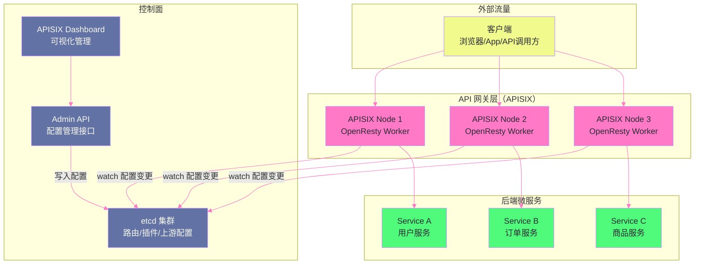

# 14 APISIX 架构：etcd 配置中心与插件体系

## 摘要

[[APISIX]] 是一款基于 OpenResty 构建的云原生 API 网关，是目前 Apache 软件基金会旗下最活跃的 API 管理项目之一。与传统 API 网关（如 Kong、Nginx Plus）相比，APISIX 的设计哲学是**配置中心与数据面分离**——所有路由规则、插件配置通过 [[etcd]] 动态下发，数据面（OpenResty Worker）无需重启即可实时生效。本文从 APISIX 的系统架构出发，深入解析三个核心机制：**etcd 的 watch-and-sync 模型如何保证配置的实时一致性**（以及在 etcd 不可用时的降级行为）、**radixtree 路由匹配引擎如何在毫秒内完成数万条路由规则的精确匹配**、**插件执行的优先级体系和生命周期钩子**。理解这些机制，是在生产中正确运维和扩展 APISIX 的基础。

---

## 第 1 章 为什么需要专门的 API 网关

### 1.1 Nginx + OpenResty 与 APISIX 的关系

在前几篇中，我们构建了一个完整的知识链路：

```
原生 Nginx：高性能 HTTP 服务器，配置驱动，重载需要 reload
     ↓ 嵌入 LuaJIT + cosocket
OpenResty：可编程 Web 平台，动态处理能力，仍然需要修改 lua 文件后 reload
     ↓ 抽象为插件体系 + etcd 配置中心
APISIX：云原生 API 网关，完全动态，毫秒级配置生效，插件热加载
```

APISIX 站在 OpenResty 的肩膀上，解决了以下 OpenResty 手写方案的痛点：

**痛点一：配置变更需要修改代码**

手写 OpenResty 网关时，添加一条新的路由规则需要修改 Lua 文件 + `nginx -s reload`。在 K8s 环境中，路由规则每分钟可能变化数百次（Service 扩缩容、发布上线、灰度切换），频繁 reload 既慢（秒级）又有极短暂的连接 drop 风险。

APISIX 通过 etcd 存储配置，Worker 进程 watch etcd 变更，**配置推送到 etcd 后毫秒内在所有 Worker 生效，无需任何 reload**。

**痛点二：功能复用困难**

每个团队写的 OpenResty 网关有各自的 JWT 验证、限流、日志、链路追踪实现，代码难以复用，质量参差不齐。

APISIX 将这些通用能力封装为**标准化插件**（目前有 80+ 个官方插件），任何路由都可以通过 API 动态开启/关闭插件，无需编写代码。

**痛点三：运维和可观测性缺失**

手写方案通常没有标准的管理 API、Dashboard、Prometheus 指标等。APISIX 提供了完整的 Admin API（RESTful）、Web UI（APISIX Dashboard）以及与 Prometheus、SkyWalking、Zipkin 的开箱即用集成。

### 1.2 APISIX 在云原生架构中的位置



**数据面与控制面分离的本质**：

- **控制面（etcd + Admin API）**：负责配置的读写和存储，是配置的 source of truth
- **数据面（APISIX Worker）**：负责实际的流量转发，从 etcd 读取配置，但**不依赖控制面来处理实时流量**

这个分离带来一个关键属性：**控制面故障（etcd 挂掉）不影响已生效的数据面规则**。APISIX Worker 在内存中缓存了最新的配置，etcd 故障时，Worker 继续使用缓存配置处理流量，只是无法接收新的配置变更。

---

## 第 2 章 etcd 作为配置中心的核心机制

### 2.1 etcd 的 Watch 机制：推而非拉

传统配置中心（如 Apollo、Nacos 的旧版本）使用**轮询（Polling）**：客户端每隔一段时间向服务端查询配置是否有更新，时间间隔越短，配置生效越快，但服务端的轮询压力越大。

[[etcd]] 使用**基于 gRPC 长连接的 Watch 机制**：客户端向 etcd 注册一个 watch（指定监听的 key 前缀），etcd 在被监听的 key 发生变化时**主动推送变更事件**给客户端。客户端无需轮询，etcd 也无需处理频繁的无效查询。

```
Watch 机制的工作流程：

1. APISIX Worker 启动时：
   向 etcd 建立 gRPC 流式连接（Bidirectional Streaming）
   注册 watch：监听 /apisix/routes/、/apisix/upstreams/、/apisix/plugins/ 等前缀

2. 运维人员通过 Admin API 添加路由：
   Admin API 将新路由写入 etcd：PUT /apisix/routes/1234 → {...}

3. etcd 检测到 /apisix/routes/1234 的变更：
   通过已建立的 gRPC 流推送 WatchEvent 给所有 APISIX Worker

4. APISIX Worker 收到 WatchEvent：
   解析变更内容（新增/修改/删除哪条路由）
   更新本地内存中的路由表（radixtree 重建或增量更新）

5. 后续请求：
   使用更新后的路由表进行匹配，新路由立即生效
   整个过程约 10-100ms（取决于网络延迟）
```

### 2.2 etcd 版本号与增量同步

etcd 为每次写入操作维护一个全局单调递增的**修订版本号（Revision）**。每次写入都会产生一个新的 Revision（即使 Key 相同）。

```
etcd 修订版本号示例：
  Revision 100: PUT /apisix/routes/1 → {route1 config}
  Revision 101: PUT /apisix/routes/2 → {route2 config}
  Revision 102: DELETE /apisix/routes/1
  Revision 103: PUT /apisix/upstreams/1 → {upstream config}
```

**APISIX 的全量同步 + 增量同步**：

```
APISIX Worker 首次启动：
  1. 全量获取：GET /apisix/routes/ → 获取所有现有路由（带 Revision = X）
  2. 建立初始路由表
  3. 开始 Watch：watch /apisix/routes/ 从 Revision X+1 开始
     （不错过任何首次启动后的变更）

Worker 运行期间（增量同步）：
  每个 WatchEvent 包含：
  - Key：变更的 etcd key（如 /apisix/routes/1234）
  - Type：PUT（新增/修改）或 DELETE（删除）
  - Value：新的配置内容（DELETE 时为空）
  - ModRevision：本次变更的 Revision

Worker 根据 Type 对内存中的路由表做增量更新
```

**断线重连的一致性保证**：

如果 APISIX Worker 与 etcd 的 gRPC 连接中断（网络抖动），重连后 Worker 需要补齐断线期间的变更：

```lua
-- APISIX 的重连逻辑（简化伪代码）
local last_revision = get_last_known_revision()

-- 重连后，从断线前的 Revision 开始 Watch
-- etcd 会推送断线期间所有 Revision > last_revision 的变更
etcd:watch(key_prefix, { start_revision = last_revision + 1 })

-- etcd 默认保留 2 小时的历史变更（可配置）
-- 如果断线超过 etcd 的历史保留窗口，需要重新全量同步
```

### 2.3 etcd 不可用时的降级行为

APISIX 在 etcd 不可用时采用**内存缓存降级**策略：

**正常运行时**：所有从 etcd 读取的配置（路由、插件、上游）都缓存在 Worker 进程的内存中（`ngx.shared.DICT`）。

**etcd 故障时**：
1. Watch 连接断开，Worker 停止接收新的配置变更
2. **已缓存的配置继续生效**，Worker 正常处理流量
3. Worker 定期重试 etcd 连接（指数退避）
4. etcd 恢复后，Worker 重新建立 Watch 并同步断线期间的变更

```
关键设计决策：etcd 故障 ≠ 流量中断
  传统方案：网关依赖配置中心来处理每次请求（每次都查询配置）
           → 配置中心故障 = 网关故障 = 全站不可用
  
  APISIX 方案：配置拉取是异步的，请求处理使用本地缓存
              → etcd 故障 = 无法更新配置，但已有规则继续生效
              → 只有需要"实时生效新配置"的场景才受影响
```

> [!note] 设计哲学：本地缓存的可靠性权衡
> APISIX 选择将配置缓存在 Worker 内存中（而非每次请求都查 etcd），是典型的"可用性优先于强一致性"的设计（CAP 定理中选 AP）。这意味着：
>
> - **优势**：故障隔离（etcd 挂了不影响流量）；极低延迟（内存查找 vs 网络查询）
> - **代价**：配置变更有短暂的不一致窗口（10-100ms 的传播延迟）；极端情况下不同 Worker 可能短暂使用不同版本的配置

---

## 第 3 章 radixtree：高性能路由匹配引擎

### 3.1 API 网关路由匹配的挑战

API 网关需要根据 HTTP 请求的各种属性（Host、URI、Method、Header、Query Param）匹配到正确的路由规则。在生产环境中，路由数量可能是数万条，而且规则之间可能有复杂的优先级关系（精确匹配优先于前缀匹配，前缀匹配优先于通配符）。

**朴素方案：逐一遍历**

最简单的实现：将所有路由规则放在一个列表里，每次请求遍历列表，用正则依次匹配。

```
问题：
  10000 条路由 × 每条正则匹配约 1μs = 10ms/request 纯花在路由匹配上
  10ms 对于 P99 延迟 < 10ms 的目标来说是不可接受的
```

**优化方案：前缀树（Trie）**

将 URI 按字符构建前缀树，查找时沿树路径匹配，O(m) 时间（m = URI 长度），与路由数量 n 无关。

```
普通 Trie 的问题：
  前缀树的节点数等于所有路由 URI 的总字符数
  10000 条路由，平均每条 20 字符 = 200000 个节点
  内存占用大，且每次字符匹配都是一次 O(1) 的指针跳转，缓存命中率低
```

### 3.2 Radix Tree（压缩前缀树）的原理

**Radix Tree** 是前缀树的压缩版本：将只有一个子节点的连续节点合并，把一段连续的公共前缀存储在单个节点中，大幅减少节点数量：

```
普通 Trie（存储 /api/users 和 /api/orders）：
  /
  └── a
      └── p
          └── i
              └── /
                  ├── u
                  │   └── s
                  │       └── e
                  │           └── r
                  │               └── s  [路由A]
                  └── o
                      └── r
                          └── d
                              └── e
                                  └── r
                                      └── s  [路由B]

Radix Tree（同样的路由）：
  /api/
  ├── users  [路由A]
  └── orders  [路由B]

节点数从 16 个压缩到 3 个！
```

APISIX 使用 `lua-resty-radixtree` 库（GitHub: api7/lua-resty-radixtree），这是一个针对 HTTP 路由场景深度优化的 Radix Tree 实现：

**关键特性一：参数化路由**

```
路由定义：/api/users/:id/orders/:order_id
  → Radix Tree 中的结构：
    /api/users/        （固定前缀节点）
    :id                （参数节点，匹配任意字符串直到下一个 /）
    /orders/           （固定前缀节点）
    :order_id          （参数节点）

请求 /api/users/12345/orders/67890 匹配时：
  → params.id = "12345"
  → params.order_id = "67890"
  整个匹配过程 O(m)，m = URI 长度
```

**关键特性二：多维度路由（Host + URI + Method + Header）**

APISIX 的路由不仅基于 URI，还可以基于多个维度：

```json
{
  "uri": "/api/v2/*",
  "host": "api.example.com",
  "methods": ["GET", "POST"],
  "vars": [["http_x_user_type", "==", "vip"]],
  "upstream_id": "vip_backend"
}
```

`lua-resty-radixtree` 将 URI 作为第一级索引（用 Radix Tree），其他维度（Host、Method、Header）作为每个 URI 节点下的附加过滤条件。匹配时先用 URI Radix Tree 找到候选路由集合，再逐一验证其他条件：

```
路由匹配流程（多维度）：

Step 1：URI 匹配（Radix Tree，O(m)）
  请求 URI = "/api/v2/users"
  → 匹配前缀 "/api/v2/*"
  → 候选路由集合：[route-A, route-B, route-C]（都匹配此 URI 前缀）

Step 2：Host 过滤（字符串比较）
  请求 Host = "api.example.com"
  → route-A: host="api.example.com" ✓
  → route-B: host="other.example.com" ✗（过滤掉）
  → route-C: host=nil（无 host 限制）✓

Step 3：Method 过滤
  请求 Method = "GET"
  → route-A: methods=["GET","POST"] ✓
  → route-C: methods=["DELETE"] ✗

Step 4：vars（自定义变量）过滤
  请求 X-User-Type: "vip"
  → route-A: vars=[["http_x_user_type", "==", "vip"]] ✓

最终：route-A 命中
```

**关键特性三：优先级（Priority）**

当多条路由都能匹配同一请求时，APISIX 根据路由配置中的 `priority` 字段（数字越大越优先）选择最高优先级的路由：

```json
[
  {"uri": "/api/*", "priority": 0, "upstream": "default"},
  {"uri": "/api/admin/*", "priority": 10, "upstream": "admin"},
  {"uri": "/api/admin/users", "priority": 20, "upstream": "admin_users"}
]
```

对于请求 `/api/admin/users`：三条路由都能匹配，但优先级 20 > 10 > 0，最终使用 `admin_users` upstream。

---

## 第 4 章 插件体系：生命周期与执行链

### 4.1 插件的三种类型

APISIX 的插件按照功能分为三类，分别挂载在不同的阶段：

| 插件类型 | 执行时机 | 典型示例 |
|---------|---------|---------|
| **全局插件（Global Plugins）** | 对所有路由的所有请求生效 | 链路追踪（skywalking）、访问日志 |
| **路由级插件** | 只对绑定该路由的请求生效 | JWT 认证、限流（limit-req）、跨域（cors）|
| **Consumer 插件** | 对特定消费者（API 调用方）生效 | Key Auth、HMAC Auth、基于消费者的限流 |

### 4.2 插件的生命周期钩子

每个 APISIX 插件都可以实现以下生命周期方法（Lua 函数），对应 Nginx/OpenResty 的不同 Phase：

```lua
local plugin_name = "my-plugin"

local _M = {
    version = 0.1,
    priority = 2000,  -- 插件优先级（数字越大越先执行）
    name = plugin_name,
    schema = {        -- 插件配置的 JSON Schema 验证
        type = "object",
        properties = {
            timeout = { type = "number", default = 3 }
        }
    }
}

-- 1. rewrite 阶段（对应 Nginx REWRITE Phase）
function _M.rewrite(conf, ctx)
    -- 修改请求：URI 重写、请求头添加/删除等
    ngx.req.set_header("X-Plugin-Header", "my-value")
end

-- 2. access 阶段（对应 Nginx ACCESS Phase）
function _M.access(conf, ctx)
    -- 访问控制：鉴权、黑白名单、限流等
    -- 返回 nil 表示放行，返回错误码表示拒绝
    local token = ngx.req.get_headers()["Authorization"]
    if not token then
        return 401, { message = "missing authorization" }
    end
end

-- 3. before_proxy 阶段（APISIX 特有，在转发前最后执行）
function _M.before_proxy(conf, ctx)
    -- 在请求转发到后端之前的最后机会修改请求
end

-- 4. header_filter 阶段（对应 Nginx header_filter_by_lua）
function _M.header_filter(conf, ctx)
    -- 修改响应头
    ngx.header["X-Response-Plugin"] = "processed"
end

-- 5. body_filter 阶段（对应 Nginx body_filter_by_lua）
function _M.body_filter(conf, ctx)
    -- 修改响应体（谨慎使用，可能影响性能）
end

-- 6. log 阶段（对应 Nginx log_by_lua）
function _M.log(conf, ctx)
    -- 记录日志、上报指标（不影响响应延迟）
    local latency = ctx.var.request_time
    prometheus:observe(latency)
end

return _M
```

### 4.3 插件优先级（Priority）的设计逻辑

APISIX 中的每个插件都有一个 `priority` 数值（0-10000），数值越大，执行越靠前。官方插件的 priority 设计是有意义的：

```
高优先级（> 2000）：基础设施类
  real-ip（2931）：获取真实客户端 IP（需要最先执行，后续插件依赖它）
  
中高优先级（1000-2000）：认证类
  jwt-auth（2510）：JWT 验证（认证必须在鉴权前完成）
  key-auth（2500）：API Key 验证
  hmac-auth（2530）：HMAC 签名验证
  
中等优先级（500-1000）：鉴权类
  authz-casbin（600）：Casbin 权限控制（依赖认证结果）
  
中低优先级（100-500）：流量控制类
  limit-req（1001）：限流（在鉴权通过后才限流，避免浪费）
  limit-count（1002）：请求计数限流
  
低优先级（< 100）：功能增强类
  cors（4）：跨域处理（在响应阶段生效）
  response-rewrite（899）：响应内容改写
```

**为什么认证插件要高于限流插件？**

如果限流在认证之前执行，攻击者可以用无效的 Token 消耗合法用户的限流配额——发送大量无效请求触发限流，导致合法用户被拒绝。认证先于限流确保：只有通过认证的请求才计入限流计数，无效的认证请求直接 401，不消耗配额。

### 4.4 APISIX 的核心路由模型

APISIX 的配置模型比 Nginx 更加抽象，引入了几个核心概念：

```
核心概念关系：
  Route（路由）：匹配规则 + 关联的 Upstream + 插件列表
  Upstream（上游）：后端服务集合 + 负载均衡策略 + 健康检查
  Service（服务）：路由的模板（多个路由可以复用同一个 Service 的配置）
  Consumer（消费者）：API 调用方的身份 + 认证凭据 + 消费者级插件
  Plugin（插件）：可以绑定在 Route/Service/Consumer/Global 上
```

```json
// 一个完整的 APISIX 路由配置示例（Admin API 格式）
{
  "id": "route-001",
  "uri": "/api/orders/*",
  "host": "api.example.com",
  "methods": ["GET", "POST"],
  "priority": 0,
  "plugins": {
    "jwt-auth": {},
    "limit-req": {
      "rate": 100,
      "burst": 50,
      "key": "consumer_name",
      "rejected_code": 429
    },
    "proxy-rewrite": {
      "uri": "/v2/orders/$1"
    }
  },
  "upstream_id": "upstream-001"
}

// 关联的 Upstream 配置
{
  "id": "upstream-001",
  "type": "roundrobin",
  "nodes": {
    "10.0.0.1:8080": 1,
    "10.0.0.2:8080": 2
  },
  "checks": {
    "active": {
      "http_path": "/healthz",
      "interval": 1,
      "timeout": 1,
      "unhealthy": {
        "interval": 1,
        "http_failures": 3
      }
    }
  }
}
```

---

## 第 5 章 APISIX 的主动健康检查

### 5.1 APISIX 健康检查 vs Nginx 被动健康检查

第 04 篇介绍了 Nginx 开源版本只有**被动健康检查**（通过真实流量发现故障）。APISIX 在 OpenResty 的基础上，通过 `lua-resty-upstream-healthcheck` 库实现了**主动健康检查**：

```
被动健康检查（Nginx 原生）：
  发现方式：真实请求失败 → 计数 → 标记不可用
  代价：需要真实用户请求失败后才能发现故障
  恢复方式：等待 fail_timeout 后自动探测

主动健康检查（APISIX）：
  发现方式：后台定时器发送探测请求（HTTP GET /healthz）
  代价：额外的探测流量（通常很小）
  恢复方式：探测成功后立即标记可用，无需等待
```

**APISIX 主动健康检查的工作模型**：

APISIX 每个 Worker 都运行一个定时器（`init_worker_by_lua` 中启动），定期向 upstream 的每个节点发送探测请求（cosocket 实现，完全非阻塞）：

```lua
-- APISIX 健康检查核心逻辑（简化）
local timer_interval = 1  -- 每 1 秒检查一次

ngx.timer.every(timer_interval, function()
    for _, node in ipairs(upstream.nodes) do
        -- 向每个节点发送 HTTP 探测请求（cosocket，非阻塞）
        local http = require "resty.http"
        local httpc = http.new()
        local ok, err = httpc:connect(node.host, node.port)
        
        if ok then
            local res, err = httpc:request({
                method = "GET",
                path = upstream.checks.active.http_path or "/healthz",
            })
            if res and res.status == 200 then
                mark_node_healthy(node)  -- 写入 ngx.shared.DICT
            else
                mark_node_unhealthy(node)
            end
        else
            mark_node_unhealthy(node)
        end
    end
end)
```

**主动健康检查的探测间隔设计**：

```json
"checks": {
  "active": {
    "type": "http",
    "http_path": "/healthz",
    "healthy": {
      "interval": 5,           // 对健康节点每 5 秒探测一次
      "successes": 2           // 连续 2 次成功才标记为健康
    },
    "unhealthy": {
      "interval": 1,           // 对不健康节点每 1 秒探测一次（快速恢复）
      "http_failures": 3,      // 连续 3 次 HTTP 失败标记为不健康
      "tcp_failures": 2        // 连续 2 次 TCP 失败标记为不健康
    }
  }
}
```

---

## 第 6 章 APISIX 的扩展能力：自定义插件开发

### 6.1 完整的 APISIX 插件开发示例

```lua
-- /usr/local/apisix/plugins/my-rate-limit.lua

local core = require("apisix.core")
local limit_local_new = require("apisix.plugins.limit-req").new  -- 复用官方模块

local plugin_name = "my-rate-limit"

local schema = {
    type = "object",
    properties = {
        rate = {
            type = "number",
            exclusiveMinimum = 0,
            description = "每秒允许的请求数（稳定速率）"
        },
        burst = {
            type = "number",
            minimum = 0,
            description = "允许突发的额外请求数"
        },
        key = {
            type = "string",
            default = "remote_addr",
            description = "限流 Key（remote_addr, consumer_name, etc.）"
        }
    },
    required = {"rate", "burst"},
}

local _M = {
    version = 0.1,
    priority = 1003,  -- 略高于官方 limit-req（1001），先于它执行
    name = plugin_name,
    schema = schema,
}

-- schema 验证（APISIX 在配置写入 etcd 时自动验证）
function _M.check_schema(conf)
    return core.schema.check(schema, conf)
end

-- access 阶段执行限流
function _M.access(conf, ctx)
    local key
    if conf.key == "consumer_name" then
        key = ctx.consumer_name  -- 基于消费者名称限流
    else
        key = ctx.var.remote_addr  -- 基于 IP 限流
    end
    
    -- 使用 ngx.shared.DICT 存储限流计数
    local lim, err = limit_local_new("plugin-my-rate-limit", conf.rate, conf.burst)
    if not lim then
        core.log.error("failed to create rate limiter: ", err)
        return 500
    end
    
    local delay, err = lim:incoming(key, true)
    if not delay then
        if err == "rejected" then
            return conf.rejected_code or 429,
                   { error_msg = "rate limit exceeded" }
        end
        core.log.error("failed to check rate limit: ", err)
        return 500
    end
    
    if delay > 0 then
        ngx.sleep(delay)  -- 漏桶队列延迟（如果配置了 burst）
    end
end

return _M
```

**注册插件到 APISIX 配置文件**：

```yaml
# /usr/local/apisix/conf/config.yaml
plugins:
  - jwt-auth
  - limit-req
  - my-rate-limit  # 加入自定义插件
```

---

## 第 7 章 APISIX 与 OpenResty 的职责边界

### 7.1 应该用 APISIX 还是手写 OpenResty

这是实际工程选型中的常见问题。以下是决策框架：

| 场景 | 推荐 | 理由 |
|-----|-----|-----|
| 标准 API 网关需求（认证/限流/路由/监控）| APISIX | 开箱即用，无需重复造轮子 |
| 需要动态配置，频繁更改路由规则 | APISIX | etcd 动态推送，无 reload 代价 |
| 超复杂业务逻辑（深度定制协议转换、特殊缓存策略）| OpenResty | 完全控制，无框架约束 |
| 资源受限（低内存、嵌入式）| 原生 Nginx | 最轻量 |
| 已有 APISIX 但需要标准插件无法覆盖的逻辑 | APISIX 自定义插件 | 在框架内扩展 |

### 7.2 APISIX 自身的内存结构

APISIX Worker 的内存布局（简化）：

```
Worker 进程内存：
  ├── LuaJIT 堆（每 Worker 独立）
  │   ├── 加载的 Lua 模块（require 缓存）
  │   ├── lrucache（L1 配置缓存）
  │   └── 路由引擎实例（radixtree 对象）
  │
  └── 共享内存（所有 Worker 共享）
      ├── apisix-shm-events（配置变更事件通道）：1MB
      ├── apisix-shm-healthcheck（健康检查状态）：10MB
      ├── plugin-limit-req（限流计数器）：10MB
      ├── plugin-limit-count（请求计数限流）：10MB
      └── ...（其他插件的共享状态）
```

**etcd 配置到 Worker 内存的同步路径**：

```
etcd 变更事件
    ↓ gRPC Watch（一个专门的 timer 协程）
ngx.shared.apisix-shm-events（共享内存广播）
    ↓ 其他 Worker 定期检查 events
所有 Worker 更新本地 radixtree（lrucache L1）
```

---

## 小结

APISIX 的高性能、动态配置能力建立在三个关键机制上：

**etcd watch-and-sync 模型**：
- gRPC 流式连接 + etcd Watch 实现毫秒级配置推送
- 全量同步（启动时）+ 增量同步（Revision 差量）保证一致性
- etcd 故障时，Worker 使用内存缓存继续服务（可用性优先于强一致）

**radixtree 路由引擎**：
- 压缩前缀树将路由匹配从 O(n) 降到 O(m)（m=URI 长度），与路由数量无关
- 多维度过滤（Host/Method/Header/vars）在 URI 匹配后逐层过滤
- Priority 字段解决多路由同时匹配时的优先级问题

**插件体系**：
- 6 个生命周期钩子对应 Nginx 的不同 Phase
- priority 数值决定同一 Phase 中插件的执行顺序（认证 > 限流 > 功能增强）
- 自定义插件只需实现标准接口，APISIX 框架自动管理执行链
- 主动健康检查（cosocket 定时探测）弥补了 Nginx 被动健康检查的滞后性

第 15 篇作为专栏收尾篇，将以一个完整的生产实战案例串联全专栏内容：从流量入口（Nginx TLS 终止）到动态网关（APISIX 路由与插件）到 OpenResty 自定义逻辑（灰度染色），展示完整的 Nginx 生态在大型系统中的协同工作方式，并总结专栏的核心知识体系。

---

## 参考资料

- [APISIX 官方文档](https://apisix.apache.org/docs/apisix/getting-started/)
- [lua-resty-radixtree GitHub](https://github.com/api7/lua-resty-radixtree)
- [etcd Watch API 文档](https://etcd.io/docs/v3.5/learning/api/#watch-api)
- [APISIX 插件开发指南](https://apisix.apache.org/docs/apisix/plugin-develop/)
- [APISIX GitHub 仓库](https://github.com/apache/apisix)


---

> **下一篇**：[[15 生产实战：完整流量链路与专栏知识体系总结]]

---

> [!note] 思考题
> 1. 选型维度：性能（Nginx/APISIX 更快）、插件生态（Kong 最丰富）、K8s 集成（Envoy Gateway 最深）、运维复杂度（APISIX 依赖 etcd，Kong 依赖 PostgreSQL）。在一个中小型团队（5-10 人）中，你最优先考虑什么维度？
> 2. Kubernetes Gateway API 是 Ingress 的演进——提供了更丰富的路由规则和角色分离。但 Gateway API 仍在快速发展——API 版本可能变化。现在就迁移到 Gateway API 是否过早？还是继续使用成熟的 Ingress + Annotations？
> 3. 从单体到微服务迁移中，API 网关的演进路线：Nginx → Kong/APISIX → Envoy + Istio。你如何规划网关演进以避免中途推倒重来？在什么节点需要'升级'网关（如服务数量超过 50？需要灰度发布？需要服务网格）？
