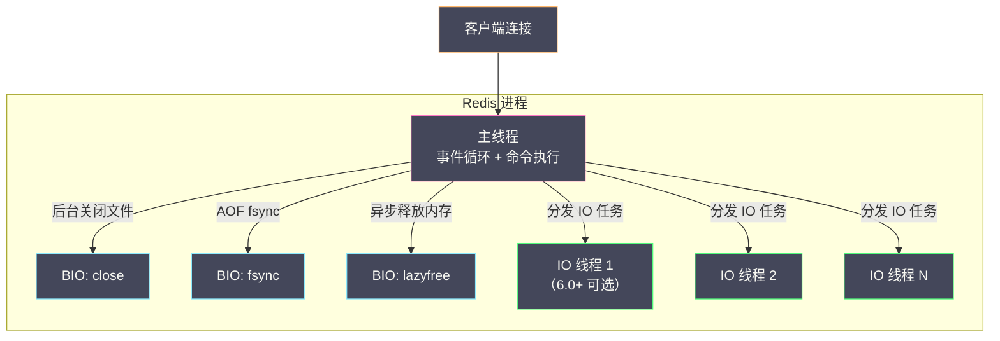
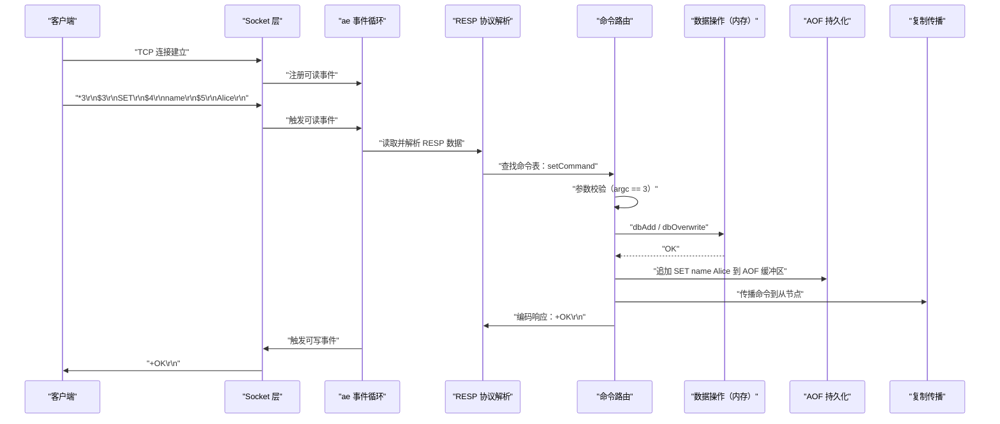
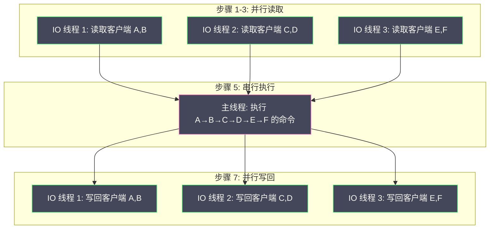

# 01 Redis 全局架构——一次请求的完整生命周期

**摘要：**

理解 Redis 的内部架构，最好的方式是追踪一次完整的客户端请求——从 TCP 连接建立到命令执行再到响应返回，穿越 Redis 的每一个核心模块。这个过程涉及网络 IO 层（Socket 监听与连接管理）、协议解析层（RESP 协议的编码与解码）、命令路由层（命令表查找与参数校验）、数据操作层（内存中的数据结构读写）、持久化层（AOF 写入与 RDB 触发判断）以及复制层（命令传播到从节点）。Redis 之所以能用单线程模型实现 10 万+ QPS 的极致性能，关键在于其精心设计的**事件驱动架构（ae 库）**——基于操作系统的 IO 多路复用（[[epoll]]/kqueue）实现非阻塞 IO，用一个线程高效地处理数万个并发连接。本文将以一次 `SET name Alice` 命令的完整生命周期为主线，串联 Redis 的全局架构和核心模块。

---

## 第 1 章 Redis 的进程模型

### 1.1 不止是"单线程"

"Redis 是单线程的"——这句话被广泛引用，但并不完全准确。准确地说，**Redis 的命令处理是单线程的**——所有客户端的命令在同一个线程中串行执行，不存在多线程之间的锁竞争和上下文切换。但 Redis 进程中实际存在多个线程：

| 线程 | 职责 | 版本 |
| :--- | :--- | :--- |
| **主线程（Main Thread）** | 事件循环、命令处理、客户端管理 | 全版本 |
| **BIO 线程（Background IO）** | 后台关闭文件（close）、AOF fsync、lazyfree 内存释放 | 2.4+ |
| **IO 线程（Threaded IO）** | 多线程读取客户端请求和写回响应 | 6.0+（可选）|
| **jemalloc 后台线程** | 内存分配器的后台整理 | 依赖 jemalloc |

**BIO 线程**是 Redis 2.4 引入的——将耗时的 IO 操作（如 AOF 的 fsync 和大 Key 的内存释放）放到后台线程执行，避免阻塞主线程。Redis 启动时创建 3 个 BIO 线程，分别负责 close、fsync 和 lazyfree。

**IO 线程**是 Redis 6.0 引入的多线程 IO 优化——在高并发场景下，主线程的瓶颈往往不在命令执行（内存操作极快），而在网络 IO（Socket 读写和协议解析/序列化）。IO 线程将**读取请求**和**写回响应**的网络 IO 操作分摊到多个线程——但**命令执行仍然在主线程中串行完成**。这个设计保留了单线程模型的简单性（无锁），同时突破了网络 IO 的瓶颈。



### 1.2 为什么单线程就够了

Redis 的数据全部在内存中——一次 GET/SET 操作只涉及内存的读写和哈希表的查找，耗时在**纳秒到微秒级别**。单线程每秒可以处理数十万次这样的操作。真正的瓶颈不在 CPU 计算，而在：

1. **网络 IO**：Socket 读写、协议解析——这是 Redis 6.0 引入 IO 线程的原因
2. **大 Key 操作**：对一个 100MB 的 ZSet 执行 DEL 需要释放大量内存——这是引入 lazyfree 后台线程的原因
3. **磁盘 IO**：AOF fsync 写盘——这是引入 BIO fsync 线程的原因

单线程的核心优势是**简单**——不需要锁、不需要 CAS、不需要处理并发数据结构的正确性问题。Redis 的所有数据结构（[[03 字典与渐进式 Rehash|字典]]、[[04 跳跃表 压缩列表与 Listpack|跳跃表]]、quicklist 等）都不需要考虑线程安全——因为永远只有一个线程在操作它们。这使得这些数据结构的实现可以做到极致的高效——没有任何同步开销。

---

## 第 2 章 一次请求的完整生命周期

以客户端执行 `SET name Alice` 为例，追踪请求从发出到响应返回的完整路径。

### 2.1 全景流程



接下来逐阶段深入。

---

## 第 3 章 阶段一：TCP 连接建立

### 3.1 监听与 Accept

Redis 启动时调用 `listenToPort()` 在配置的端口（默认 6379）上创建监听 Socket，并通过 ae 事件库向事件循环注册一个**文件事件**——当有新的客户端连接到达时，触发 `acceptTcpHandler` 回调函数。

`acceptTcpHandler` 的核心逻辑：

1. 调用系统的 `accept()` 接受新连接——获得一个客户端 Socket 的文件描述符（fd）
2. 创建一个 `client` 结构体——Redis 用这个结构体追踪每个客户端的所有状态
3. 将客户端 Socket 设置为**非阻塞模式**——这是事件驱动模型的基础
4. 为客户端 fd 注册可读事件——当客户端发送数据时触发 `readQueryFromClient` 回调

### 3.2 client 结构体

`client` 是 Redis 中最核心的结构体之一——它代表一个客户端连接的所有状态：

```c
typedef struct client {
    int fd;                     // 客户端 Socket 文件描述符
    int db;                     // 当前选择的数据库编号（SELECT 命令切换）
    sds querybuf;               // 输入缓冲区——存放客户端发送的原始数据
    int argc;                   // 当前命令的参数数量
    robj **argv;                // 当前命令的参数数组（Redis 对象）
    struct redisCommand *cmd;   // 当前要执行的命令的函数指针
    list *reply;                // 输出缓冲区（链表）——待发送给客户端的响应
    char buf[16384];            // 输出缓冲区（固定，16KB）——小响应直接用这个
    size_t bufpos;              // 固定缓冲区的当前写入位置
    int flags;                  // 客户端标志位（MASTER/SLAVE/MONITOR 等）
    time_t lastinteraction;     // 上次交互时间（用于超时检测）
    // ... 更多字段
} client;
```

每个客户端连接对应一个 `client` 结构体——Redis 主线程在事件循环中通过 fd 找到对应的 client，读取数据、解析命令、执行命令、写回响应。

---

## 第 4 章 阶段二：RESP 协议解析

### 4.1 RESP 协议

Redis 使用 **RESP（REdis Serialization Protocol）** 协议进行客户端-服务端通信。RESP 是一个简单的文本协议——人类可读、解析高效。

RESP 的数据类型：

| 前缀 | 类型 | 示例 | 说明 |
| :--- | :--- | :--- | :--- |
| `+` | Simple String | `+OK\r\n` | 简单字符串响应 |
| `-` | Error | `-ERR unknown command\r\n` | 错误响应 |
| `:` | Integer | `:1000\r\n` | 整数响应 |
| `$` | Bulk String | `$5\r\nAlice\r\n` | 二进制安全的字符串（长度前缀）|
| `*` | Array | `*3\r\n$3\r\nSET\r\n$4\r\nname\r\n$5\r\nAlice\r\n` | 数组 |

客户端发送的每条命令都是一个 RESP 数组——上面的 `SET name Alice` 编码为：

```
*3\r\n          # 数组，3 个元素
$3\r\nSET\r\n   # 第 1 个元素：Bulk String，长度 3，内容 "SET"
$4\r\nname\r\n  # 第 2 个元素：Bulk String，长度 4，内容 "name"
$5\r\nAlice\r\n # 第 3 个元素：Bulk String，长度 5，内容 "Alice"
```

### 4.2 为什么选择 RESP

RESP 的设计哲学是**简单高效**：

- **文本协议**：可以用 telnet 直接与 Redis 交互（调试友好）
- **长度前缀**：Bulk String 用 `$长度` 前缀——解析时不需要扫描内容查找分隔符，直接按长度读取，O(1) 复杂度
- **二进制安全**：Bulk String 的内容可以包含任意字节（包括 `\r\n` 和 `\0`）——因为解析靠长度而非分隔符
- **流水线友好**：多条命令可以连续发送——解析器按 RESP 格式逐条解析，天然支持 [[08 Redis Pipeline 与客户端性能优化|Pipeline]]

### 4.3 RESP3（Redis 6.0+）

Redis 6.0 引入了 RESP3——在 RESP2 的基础上增加了更多数据类型：

| 前缀 | 类型 | 说明 |
| :--- | :--- | :--- |
| `_` | Null | 空值（替代 RESP2 中 `$-1\r\n` 和 `*-1\r\n`）|
| `,` | Double | 浮点数 |
| `#` | Boolean | 布尔值（`#t\r\n` / `#f\r\n`）|
| `=` | Verbatim String | 带格式的字符串（如 markdown/txt）|
| `%` | Map | 键值对映射 |
| `~` | Set | 无序集合 |
| `>` | Push | 服务端主动推送（用于 Pub/Sub、Client Tracking）|

RESP3 的核心价值是**类型信息更丰富**——客户端不需要猜测返回值的语义（RESP2 中，HGETALL 返回一个 Array，客户端需要自己按奇偶位置组装为 Map；RESP3 直接返回 Map 类型）。

### 4.4 解析过程

当客户端 Socket 可读时，事件循环触发 `readQueryFromClient`：

1. 从 Socket 中读取数据到 `client->querybuf`（输入缓冲区）
2. 调用 `processInputBuffer` 解析缓冲区中的 RESP 数据
3. 解析出一条完整的命令后，设置 `client->argc` 和 `client->argv`
4. 调用 `processCommand` 执行命令

如果缓冲区中的数据不完整（如只收到了 `*3\r\n$3\r\nSET` 但还没收到后续参数），解析器不会阻塞——它记录当前的解析状态，等待下一次可读事件触发时继续解析。这就是非阻塞 IO 的典型模式——**永远不等待，有多少处理多少**。

---

## 第 5 章 阶段三：命令路由与执行

### 5.1 命令表

Redis 在启动时构建了一个**命令表（Command Table）**——一个哈希表，key 是命令名（如 "set"），value 是 `redisCommand` 结构体：

```c
struct redisCommand {
    char *name;                 // 命令名（"set"）
    redisCommandProc *proc;     // 命令处理函数（setCommand）
    int arity;                  // 参数数量（-3 表示 >= 3）
    char *sflags;               // 标志字符串（"write denyoom"）
    int flags;                  // 标志位
    long long microseconds;     // 累计执行时间（微秒）
    long long calls;            // 累计调用次数
    // ...
};
```

`processCommand` 的流程：

1. 在命令表中查找 `argv[0]`（命令名，如 "SET"）——找到 `setCommand`
2. **参数数量校验**：检查 argc 是否满足 arity 要求
3. **权限校验**：ACL 检查客户端是否有执行此命令的权限
4. **内存检查**：如果命令带有 `denyoom` 标志（如 SET），且内存已达 maxmemory——尝试淘汰 key 腾出空间；如果淘汰后仍然不够，返回 OOM 错误
5. **集群重定向**：如果是 Cluster 模式且 key 不在当前节点——返回 MOVED/ASK 重定向
6. **调用命令处理函数**：`cmd->proc(client)` —— 对 SET 命令就是调用 `setCommand(client)`

### 5.2 SET 命令的执行

`setCommand` 的核心逻辑（简化版）：

1. 解析可选参数（EX/PX/NX/XX/KEEPTTL 等）
2. 调用 `setGenericCommand`：
   - 如果指定了 NX 且 key 已存在 → 返回 nil
   - 如果指定了 XX 且 key 不存在 → 返回 nil
   - 调用 `setKey(db, key, val, flags)` 写入数据
3. `setKey` 的内部：
   - 在 `db->dict`（数据库字典）中查找 key
   - 如果 key 存在：`dbOverwrite`——替换 value
   - 如果 key 不存在：`dbAdd`——插入新的键值对
   - 如果指定了 EX/PX：在 `db->expires`（过期字典）中设置过期时间
4. 返回 `+OK\r\n`

### 5.3 数据库结构

Redis 的数据存储在一个 `redisDb` 结构体数组中——每个元素对应一个逻辑数据库（默认 16 个，编号 0-15）：

```c
typedef struct redisDb {
    dict *dict;                 // 键空间——存储所有 key-value 对
    dict *expires;              // 过期字典——存储有过期时间的 key 及其过期时间戳
    dict *blocking_keys;        // 正在阻塞等待的 key（BRPOP 等）
    dict *watched_keys;         // 被 WATCH 的 key
    int id;                     // 数据库编号（0-15）
    // ...
} redisDb;
```

**`dict`（键空间）** 是一个[[03 字典与渐进式 Rehash|哈希表]]——key 是 [[02 SDS 与 Redis 对象系统|SDS]] 字符串，value 是 `robj`（Redis 对象）。每次 GET/SET/DEL 操作的核心就是对这个哈希表的查找、插入和删除。

**`expires`（过期字典）** 也是一个哈希表——key 同样是 SDS 字符串（与 dict 中共享指针，不占额外内存），value 是 `long long` 类型的过期时间戳（毫秒级 Unix 时间戳）。

> [!note] 为什么过期信息单独存储
> 将过期信息存储在独立的字典中而非嵌入到 key-value 结构中，有两个好处：(1) 大多数 key 没有设置过期时间——独立存储避免了为所有 key 增加过期时间字段的内存浪费；(2) 过期检查需要高效地遍历有过期时间的 key——独立字典使得遍历范围缩小到只有设置了过期时间的 key。

---

## 第 6 章 阶段四：持久化与复制

### 6.1 AOF 追加

如果开启了 [[08 AOF 持久化与混合持久化|AOF]]，命令执行成功后 Redis 会将命令追加到 **AOF 缓冲区**（`server.aof_buf`）：

```
// AOF 缓冲区中追加的内容（RESP 格式）
*3\r\n$3\r\nSET\r\n$4\r\nname\r\n$5\r\nAlice\r\n
```

注意：此时命令只是写入了内存缓冲区，还没有写入磁盘。真正的落盘操作发生在事件循环的 `beforeSleep` 或 `serverCron` 中——根据 `appendfsync` 配置决定何时调用 `fsync()`：

| appendfsync | 行为 | 性能 | 安全性 |
| :--- | :--- | :--- | :--- |
| **always** | 每条命令后都 fsync | 最慢 | 最安全（不丢数据）|
| **everysec** | 每秒 fsync 一次（BIO 线程执行）| 折中 | 最多丢 1 秒数据 |
| **no** | 不主动 fsync，由 OS 决定刷盘时机 | 最快 | 可能丢数分钟数据 |

### 6.2 命令传播

如果存在[[09 主从复制与 Sentinel 高可用|从节点]]，命令执行成功后还会通过 `propagate()` 将命令传播到所有从节点——从节点接收到命令后在本地重放，保持数据一致。

传播的内容同样是 RESP 格式的命令——与 AOF 追加的内容一致。实际上，Redis 的 AOF 和复制共享同一套命令传播机制——`propagate()` 同时负责 AOF 追加和复制传播。

### 6.3 RDB 触发检查

每次命令执行后，Redis 会检查是否满足 `save` 配置的触发条件——如果最近 N 秒内有 M 次数据变更，触发 [[07 RDB 持久化——快照的 fork 与 COW 机制|BGSAVE]]。这个检查发生在 `serverCron` 定时任务中（默认每 100ms 执行一次），而非每次命令执行后。

---

## 第 7 章 阶段五：响应返回

### 7.1 响应写入

命令执行完成后，响应数据被写入 `client` 的输出缓冲区：

- **小响应**（< 16KB）：写入 `client->buf`（固定缓冲区）——避免链表节点的内存分配
- **大响应**：写入 `client->reply`（链表缓冲区）——动态扩展

然后将客户端 fd 注册为**可写事件**——事件循环在下一次迭代时触发 `sendReplyToClient`，将缓冲区的数据通过 Socket 发送给客户端。

### 7.2 为什么不直接 write

为什么不在命令执行完后直接 `write()` 发送响应，而是要注册可写事件等待下一次事件循环？

原因是 Socket 的发送缓冲区可能已满——如果客户端的接收速度跟不上发送速度，内核的 Socket 发送缓冲区会被填满，`write()` 会返回 `EAGAIN`（非阻塞模式下）。通过注册可写事件，事件循环会在 Socket 缓冲区有空间时自动通知——Redis 此时再发送数据，避免了忙等。

在 Redis 6.0+ 的多线程 IO 模式下，响应的写回操作可以由 IO 线程并行完成——主线程将待写回的客户端分配给各 IO 线程，IO 线程并行地将响应数据写入各自的 Socket。

---

## 第 8 章 ae 事件库——Redis 的心脏

### 8.1 ae 的设计

ae（A simple event library）是 Redis 自己实现的事件驱动库——仅约 700 行 C 代码，但支撑了 Redis 的整个网络模型。ae 封装了操作系统的 IO 多路复用 API：

| 操作系统 | API | ae 封装 |
| :--- | :--- | :--- |
| Linux | [[epoll]] | ae_epoll.c |
| macOS/BSD | kqueue | ae_kqueue.c |
| Solaris | evport | ae_evport.c |
| 通用 | select | ae_select.c（fallback）|

ae 在编译时自动选择当前系统最优的 API——Linux 上使用 epoll，macOS 上使用 kqueue。

### 8.2 两种事件

ae 处理两种事件：

**文件事件（File Event）**：与 Socket IO 相关——当某个 fd 可读或可写时触发。Redis 的客户端连接接受、请求读取、响应写回都通过文件事件驱动。

**时间事件（Time Event）**：定时任务——如 `serverCron`（每 100ms 执行一次），负责过期 key 清理、RDB/AOF 触发检查、复制心跳、集群维护、INFO 统计等后台任务。

### 8.3 事件循环的核心流程

```c
void aeMain(aeEventLoop *eventLoop) {
    eventLoop->stop = 0;
    while (!eventLoop->stop) {
        // 1. 执行 beforeSleep：处理 AOF 刷盘、将待回复的客户端注册写事件等
        aeProcessEvents(eventLoop, AE_ALL_EVENTS | AE_CALL_BEFORE_SLEEP);
    }
}
```

`aeProcessEvents` 的核心逻辑：

1. 计算最近的时间事件还有多久触发——作为 `epoll_wait` / `kevent` 的超时时间
2. 调用 `aeApiPoll`（epoll_wait / kevent）——阻塞等待文件事件或超时
3. 处理所有就绪的文件事件——依次调用可读/可写回调
4. 处理到期的时间事件——调用 `serverCron` 等回调

**关键设计**：epoll_wait 的超时时间由最近的时间事件决定——这确保了时间事件不会因为没有文件事件而被延迟。如果没有文件事件，epoll_wait 最多阻塞到时间事件触发；如果有文件事件，epoll_wait 立即返回处理。

### 8.4 为什么 Redis 不用 libevent/libuv

Redis 选择自己实现 ae 库而非使用成熟的第三方库（如 libevent、libuv），原因是：

- **极致简单**：ae 只有约 700 行代码——没有复杂的抽象层和回调链，性能极致
- **零依赖**：不引入外部依赖——编译和部署更简单
- **定制化**：ae 的 API 完全按 Redis 的需求设计——不需要通用事件库的很多功能（如信号处理、DNS 解析等）

这体现了 Redis 的一贯设计哲学：**如果标准库或第三方库不能完美满足需求，就自己写一个最小化的实现。**

---

## 第 9 章 Redis 6.0 多线程 IO

### 9.1 多线程 IO 的工作模型

Redis 6.0 的多线程 IO 并非简单地"让多个线程同时执行命令"——命令执行仍然是单线程的。多线程只负责**网络 IO 的读写**。

工作流程：

```
1. 主线程通过 epoll_wait 获取所有可读的客户端 fd
2. 主线程将这些客户端均匀分配给 N 个 IO 线程
3. IO 线程并行地从各自的客户端 Socket 中读取数据并解析 RESP
4. 主线程等待所有 IO 线程读取完成
5. 主线程串行执行所有客户端的命令
6. 主线程将待写回的客户端分配给 IO 线程
7. IO 线程并行地将响应数据写回各自的客户端 Socket
8. 主线程等待所有 IO 线程写回完成
9. 回到步骤 1
```



### 9.2 配置与效果

```bash
# 开启多线程 IO（默认关闭）
io-threads 4                  # IO 线程数（包含主线程）——建议设为 CPU 核数的一半
io-threads-do-reads yes       # 开启多线程读（默认只开多线程写）
```

在高并发场景（数万连接、大量小命令）下，多线程 IO 可以将吞吐量提升 **50%-100%**。但如果瓶颈在命令执行（如大 Key 操作、Lua 脚本），多线程 IO 无法改善——因为命令执行仍然是单线程的。

---

## 第 10 章 总结

本文以一次 `SET name Alice` 命令的完整生命周期为主线，串联了 Redis 的全局架构：

- **TCP 连接建立**：accept → 创建 client 结构体 → 注册可读事件
- **RESP 协议解析**：从 Socket 读取数据 → 按 RESP 格式解析出命令和参数
- **命令路由与执行**：命令表查找 → 参数校验 → 权限检查 → 内存检查 → 调用命令处理函数 → 操作内存数据结构
- **持久化与复制**：AOF 缓冲区追加 → fsync 策略 → 命令传播到从节点
- **响应返回**：写入输出缓冲区 → 注册可写事件 → Socket 发送响应
- **ae 事件库**：封装 epoll/kqueue → 文件事件（IO）+ 时间事件（定时任务）→ 事件循环驱动一切
- **多线程 IO（6.0+）**：IO 线程并行读写 → 主线程串行执行命令 → 保持单线程模型的简单性

**核心设计哲学**：Redis 的架构始终围绕"简单"和"高效"——单线程避免锁、内存操作避免磁盘 IO、事件驱动避免线程阻塞、RESP 协议避免复杂解析。每一层的设计都在追求**最小化开销**。

下一篇 [[02 SDS 与 Redis 对象系统]] 将深入 Redis 最基础的数据结构——SDS（Simple Dynamic String）的内存布局和 RedisObject 的类型系统设计。

---

## 参考资料

1. Redis Source Code：https://github.com/redis/redis/tree/unstable/src
2. Redis Internals - Event Library (ae)：https://redis.io/docs/reference/internals/
3. Redis 6.0 Threaded IO：https://redis.io/topics/threads
4. RESP Protocol Specification：https://redis.io/docs/reference/protocol-spec/
5. 黄健宏 - 《Redis 设计与实现》（第二版）

---

> [!note] 思考题
> 1. SDS 的空间预分配策略（长度<1MB 时翻倍，>1MB 时每次多分配 1MB）减少了频繁 append 操作的内存分配次数。但这种策略在什么场景下导致显著的内存浪费（如大量短字符串 append 一次后不再修改）？`sds` 的惰性空间释放（free 后不立即归还内存）对内存碎片率有什么影响？
> 2. Redis 的 Sorted Set 使用跳表而非红黑树——Antirez 的理由是实现简单、范围查询友好。但跳表的空间开销（每个节点平均 1.33 个指针层级）比红黑树（固定 2 个子指针）更大。在百万级元素的 Sorted Set 中，跳表比红黑树多占用多少内存？这个差异在实际场景中是否重要？
> 3. Redis 7.0 的 Listpack 替代了 Ziplist。Ziplist 的'级联更新'问题——修改一个节点可能导致后续所有节点的 `prevlen` 字段变化。最坏情况下一次 O(n²) 的连锁更新。Listpack 通过不存储前一个节点的长度来消除这个问题——但这意味着 Listpack 不支持反向遍历？Redis 如何处理？
