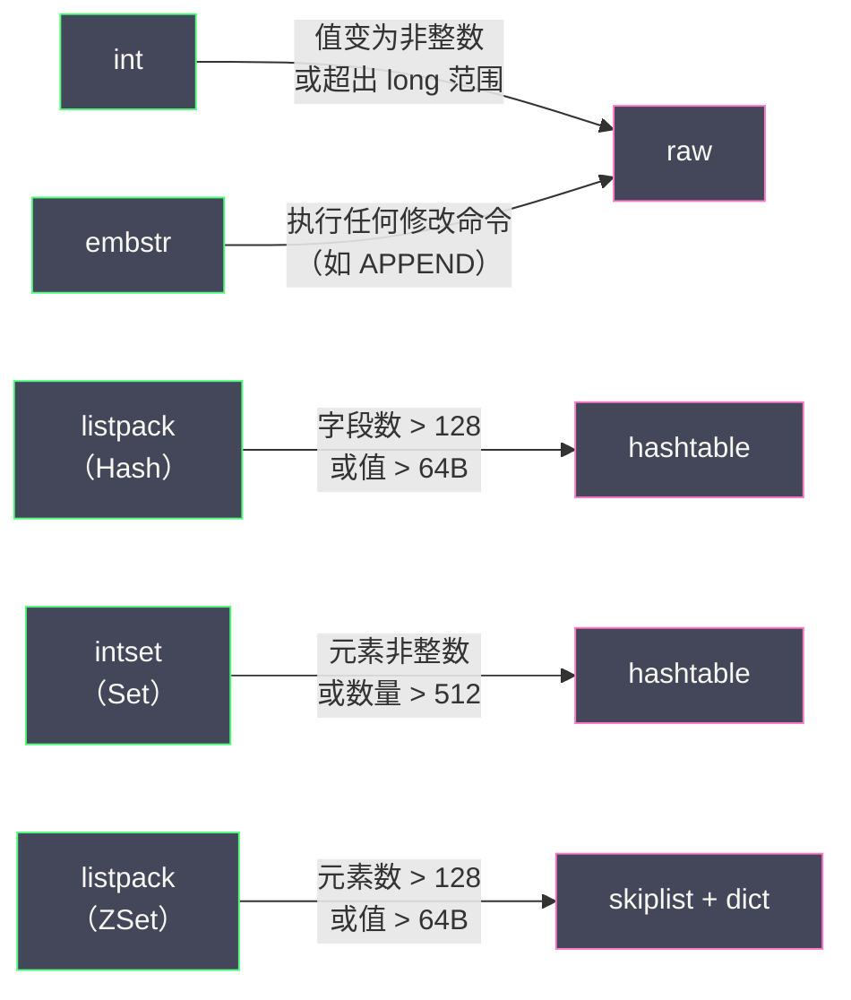

# 02 SDS 与 Redis 对象系统

**摘要：**

Redis 是用 C 语言编写的，但它没有直接使用 C 语言原生的 `char*` 字符串——而是自己实现了一套字符串类型 **SDS（Simple Dynamic String）**。这个看似简单的决策背后有深刻的工程考量：C 字符串以 `\0` 作为结束标记，无法存储包含 `\0` 的二进制数据（如图片、序列化对象）；获取 C 字符串长度需要遍历整个字符串（O(N)）；C 字符串不记录已分配的空间，每次拼接都需要重新分配内存。SDS 通过在字符串头部嵌入长度和容量信息，一举解决了这些问题，同时还引入了**空间预分配**和**惰性释放**两种优化策略减少内存重分配的次数。在 SDS 之上，Redis 构建了一套统一的**对象系统（RedisObject）**——用 type + encoding 两个字段将五种外部数据类型（String/List/Hash/Set/ZSet）与多种内部编码实现（int/embstr/raw/quicklist/ziplist/listpack/skiplist/hashtable/intset）解耦。同一种数据类型可以根据数据特征自动选择最优的底层编码——小数据用紧凑编码节省内存，大数据用高效编码保证性能。本文从 SDS 的内存布局出发，深入 RedisObject 的类型系统、编码转换机制和内存优化设计。

---

## 第 1 章 为什么不用 C 字符串

### 1.1 C 字符串的五大缺陷

C 语言用 `char*` 表示字符串——以 `\0`（空字符）作为结束标记。这个设计在系统编程中工作得很好，但在 Redis 的场景下有五个致命缺陷：

**缺陷一：获取长度 O(N)**

C 字符串不记录自身长度——要获取长度必须从头遍历到 `\0`，时间复杂度 O(N)。Redis 中 `STRLEN` 命令要求 O(1) 返回字符串长度——如果用 C 字符串，每次调用 STRLEN 都要遍历整个字符串，在存储大字符串（如几十 KB 的 JSON）时性能不可接受。

**缺陷二：不是二进制安全的**

C 字符串以 `\0` 判断结尾——如果字符串内容本身包含 `\0`（如序列化的 Protobuf 数据、图片的字节流），C 字符串会在第一个 `\0` 处截断。Redis 作为通用的键值存储，必须能存储任意二进制数据——这要求字符串的结束不能依赖内容中的特殊字符。

**缺陷三：缓冲区溢出风险**

C 标准库的 `strcat` 函数在拼接字符串前不检查目标缓冲区是否有足够空间——如果空间不足就直接写入，导致**缓冲区溢出**——这是 C 程序中最常见的安全漏洞之一。Redis 需要一种自动管理缓冲区大小的字符串类型。

**缺陷四：每次修改都需要内存重分配**

C 字符串的长度和底层数组的长度之间存在 N+1 的关联——每次增长或缩短字符串都需要 `realloc`。内存重分配涉及系统调用（`brk`/`mmap`）、可能的内存复制——在 Redis 这种高频修改字符串的场景下（如 APPEND、INCR 等命令），频繁的重分配会严重影响性能。

**缺陷五：不能复用 C 字符串函数库**

这一条反过来——SDS 在设计上刻意保持了与 C 字符串的兼容性（末尾仍然有 `\0`），使得 SDS 可以直接复用 C 标准库中的只读字符串函数（如 `printf`、`strcmp`）。

### 1.2 SDS 如何解决这些问题

| C 字符串缺陷 | SDS 的解决方案 |
| :--- | :--- |
| 获取长度 O(N) | 头部存储 `len` 字段——O(1) |
| 不是二进制安全 | 用 `len` 判断结尾，不依赖 `\0` |
| 缓冲区溢出 | 修改前自动检查并扩容 |
| 每次修改都重分配 | 空间预分配 + 惰性释放 |
| 不能复用 C 库函数 | 末尾仍保留 `\0`——兼容 C 字符串函数 |

---

## 第 2 章 SDS 的内存布局

### 2.1 SDS 的结构定义

Redis 3.2 之前，SDS 只有一种头部结构（`sdshdr`）。Redis 3.2 对 SDS 进行了重大优化——引入了**5 种不同大小的头部类型**，根据字符串长度选择最小的头部，节省内存：

```c
// sds.h

// 类型标志（存储在 flags 字段的低 3 位）
#define SDS_TYPE_5  0       // 未使用（长度直接存在 flags 的高 5 位）
#define SDS_TYPE_8  1       // 长度 < 256 字节
#define SDS_TYPE_16 2       // 长度 < 65536 字节
#define SDS_TYPE_32 3       // 长度 < 4GB
#define SDS_TYPE_64 4       // 长度 < 2^64 字节

struct __attribute__ ((__packed__)) sdshdr8 {
    uint8_t len;            // 已使用长度（1 字节，最大 255）
    uint8_t alloc;          // 总分配长度（不含头部和 \0）
    unsigned char flags;    // 低 3 位存类型，高 5 位未使用
    char buf[];             // 柔性数组——字符串内容
};

struct __attribute__ ((__packed__)) sdshdr16 {
    uint16_t len;           // 已使用长度（2 字节，最大 65535）
    uint16_t alloc;         // 总分配长度
    unsigned char flags;
    char buf[];
};

struct __attribute__ ((__packed__)) sdshdr32 {
    uint32_t len;           // 已使用长度（4 字节）
    uint32_t alloc;         // 总分配长度
    unsigned char flags;
    char buf[];
};

struct __attribute__ ((__packed__)) sdshdr64 {
    uint64_t len;           // 已使用长度（8 字节）
    uint64_t alloc;         // 总分配长度
    unsigned char flags;
    char buf[];
};
```

**`__attribute__ ((__packed__))`** 告诉编译器不要对结构体进行内存对齐——紧凑排列每个字段。不加这个属性，`sdshdr16` 中的 `uint16_t len` 和 `uint16_t alloc` 之间可能会被填充 padding 字节以满足对齐要求——浪费内存。Redis 存储数百万甚至数千万个字符串，每个字符串节省几个字节累计起来非常可观。

### 2.2 内存布局图

以 `sdshdr8` 存储 "Alice"（5 字节）为例：

```
         sdshdr8 头部（3字节）            buf（柔性数组）
    ┌────────┬────────┬───────┬────┬────┬────┬────┬────┬────┐
    │ len=5  │alloc=5 │flags=1│ 'A'│ 'l'│ 'i'│ 'c'│ 'e'│ \0 │
    └────────┴────────┴───────┴────┴────┴────┴────┴────┴────┘
    ↑                         ↑
    sdshdr8 结构体起始地址       sds 指针指向这里（buf 的地址）
```

**关键设计**：`sds` 类型在代码中的定义是 `typedef char *sds`——它指向 `buf` 的起始地址，而非结构体的起始地址。这意味着 `sds` 指针可以直接传给 C 标准库函数（如 `printf("%s", sds_str)`）——因为从 `buf` 开始就是标准的以 `\0` 结尾的 C 字符串。

要访问头部字段（len/alloc/flags），只需将 `sds` 指针向前偏移：

```c
// 获取 flags 字段（sds 指针前 1 字节）
#define SDS_TYPE(s) (s[-1] & 7)

// 获取 sdshdr8 的头部指针
#define SDS_HDR(T,s) ((struct sdshdr##T *)((s) - sizeof(struct sdshdr##T)))

// 获取字符串长度
static inline size_t sdslen(const sds s) {
    unsigned char flags = s[-1];
    switch(flags & 7) {
        case SDS_TYPE_8:
            return SDS_HDR(8,s)->len;
        case SDS_TYPE_16:
            return SDS_HDR(16,s)->len;
        // ...
    }
}
```

### 2.3 五种头部类型的选择策略

| 头部类型 | 头部大小 | 最大字符串长度 | 适用场景 |
| :--- | :--- | :--- | :--- |
| **sdshdr5** | 1 字节 | 31 字节 | 实际未使用（Redis 创建时最小用 sdshdr8）|
| **sdshdr8** | 3 字节 | 255 字节 | 绝大多数短字符串（key 名、小 value）|
| **sdshdr16** | 5 字节 | 64KB | 中等长度字符串 |
| **sdshdr32** | 9 字节 | 4GB | 大字符串 |
| **sdshdr64** | 17 字节 | 2^64 字节 | 理论上极大字符串（实际罕见）|

**为什么不统一用 sdshdr32 或 sdshdr64？** 因为 Redis 中绝大多数字符串都很短——key 名通常十几到几十字节，value 也大多在几百字节以内。如果统一用 sdshdr32（头部 9 字节），每个短字符串多浪费 6 字节；乘以数千万个 key，就是数百 MB 的浪费。sdshdr8 的头部只有 3 字节——对于短字符串是最优选择。

---

## 第 3 章 SDS 的核心机制

### 3.1 空间预分配

当 SDS 需要扩容时（如 APPEND 操作），Redis 不仅分配刚好够用的空间——还额外预分配一部分空间，为将来的增长做准备：

```c
sds sdsMakeRoomFor(sds s, size_t addlen) {
    size_t avail = sdsavail(s);  // 当前可用空间 = alloc - len
    if (avail >= addlen) return s; // 空间够用，不需要扩容

    size_t newlen = sdslen(s) + addlen;

    // 预分配策略：
    if (newlen < 1024 * 1024) {
        // 小于 1MB：翻倍
        newlen *= 2;
    } else {
        // 大于等于 1MB：每次多分配 1MB
        newlen += 1024 * 1024;
    }

    // 重新分配内存
    // ...
}
```

**预分配策略**：
- **新长度 < 1MB**：分配 `新长度 × 2` 的空间——翻倍策略，减少小字符串频繁扩容
- **新长度 ≥ 1MB**：分配 `新长度 + 1MB` 的空间——避免大字符串翻倍导致内存浪费

**效果**：假设对一个空字符串连续 APPEND 1000 次，每次追加 10 字节。没有预分配需要 1000 次 realloc；有了预分配，只需要约 **log₂(10000) ≈ 14 次** realloc（翻倍策略下）——内存重分配次数从 O(N) 降到 O(log N)。

### 3.2 惰性空间释放

当 SDS 缩短时（如 SETRANGE 缩短字符串、TRIM 操作），Redis 不会立即 realloc 释放多余的空间——而是**仅更新 len 字段**，保留多余空间在 alloc 中：

```c
void sdsclear(sds s) {
    // 只是将长度设为 0，不释放内存
    sdssetlen(s, 0);
    s[0] = '\0';
}
```

**好处**：如果后续又需要增长（如先 TRIM 再 APPEND），可以直接使用预留空间而不需要重新分配。

**代价**：内存不会被立即归还——如果大量字符串被缩短但不再增长，预留空间就浪费了。Redis 提供了 `sdsRemoveFreeSpace` 函数手动释放——在某些场景下（如 RDB 加载完成后）Redis 会主动调用它来回收多余空间。

### 3.3 二进制安全

SDS 使用 `len` 字段判断字符串的实际长度——不依赖内容中的 `\0`。这意味着 SDS 可以安全地存储任意二进制数据：

```
SDS 存储包含 \0 的数据：
len = 10, buf = "Hello\0World\0"
                     ↑ 这个 \0 不会被误判为结尾
                     sdslen() 返回 10，完整读取所有字节
```

同时，SDS 在 buf 末尾仍然保留一个额外的 `\0`——这使得存储文本数据的 SDS 可以直接传给 C 字符串函数（如 `printf`、`strcmp`）——兼容性极好。

---

## 第 4 章 Redis 对象系统（RedisObject）

### 4.1 为什么需要对象系统

Redis 支持五种外部数据类型（String、List、Hash、Set、ZSet），每种类型可以有多种底层编码实现。如果直接用裸的数据结构指针表示数据，Redis 的命令处理函数就需要为每种编码写不同的代码——代码量爆炸且难以维护。

**RedisObject** 是 Redis 的统一抽象层——它在数据结构之上包装了类型信息、编码信息和引用计数，使得命令处理函数可以通过统一的接口操作不同编码的数据：

```c
typedef struct redisObject {
    unsigned type:4;        // 数据类型（4 位）：STRING/LIST/HASH/SET/ZSET
    unsigned encoding:4;    // 底层编码（4 位）：int/embstr/raw/quicklist/...
    unsigned lru:24;        // LRU 时间或 LFU 频率（24 位）
    int refcount;           // 引用计数（4 字节）
    void *ptr;              // 指向底层数据结构的指针（8 字节，64 位系统）
} robj;
```

**总大小**：4 位 + 4 位 + 24 位 + 4 字节 + 8 字节 = **16 字节**。

### 4.2 type——五种数据类型

| type 值 | 宏定义 | 对应命令 |
| :--- | :--- | :--- |
| 0 | OBJ_STRING | GET/SET/INCR/APPEND |
| 1 | OBJ_LIST | LPUSH/RPOP/LRANGE |
| 2 | OBJ_SET | SADD/SMEMBERS/SINTER |
| 3 | OBJ_ZSET | ZADD/ZRANGE/ZSCORE |
| 4 | OBJ_HASH | HSET/HGET/HGETALL |

Redis 在执行命令前会检查 key 的 type 是否与命令期望的类型匹配——如果对 String 类型的 key 执行 LPUSH，返回 `WRONGTYPE` 错误。这就是 RedisObject 的 type 字段的作用。

### 4.3 encoding——多种底层编码

同一种数据类型可以有多种底层编码——Redis 根据数据的大小和特征自动选择最优编码：

| type | encoding | 底层数据结构 | 适用条件 |
| :--- | :--- | :--- | :--- |
| STRING | OBJ_ENCODING_INT | long | 值是整数且在 long 范围内 |
| STRING | OBJ_ENCODING_EMBSTR | SDS（嵌入式）| 值长度 ≤ 44 字节 |
| STRING | OBJ_ENCODING_RAW | SDS | 值长度 > 44 字节 |
| LIST | OBJ_ENCODING_LISTPACK | listpack | 元素数 ≤ 128 且每个元素 ≤ 64 字节 |
| LIST | OBJ_ENCODING_QUICKLIST | quicklist | 超过 listpack 阈值 |
| HASH | OBJ_ENCODING_LISTPACK | listpack | 字段数 ≤ 128 且每个值 ≤ 64 字节 |
| HASH | OBJ_ENCODING_HT | dict（哈希表） | 超过 listpack 阈值 |
| SET | OBJ_ENCODING_INTSET | intset | 所有元素都是整数且数量 ≤ 512 |
| SET | OBJ_ENCODING_LISTPACK | listpack | 元素数 ≤ 128 且每个元素 ≤ 64 字节 |
| SET | OBJ_ENCODING_HT | dict | 超过 intset/listpack 阈值 |
| ZSET | OBJ_ENCODING_LISTPACK | listpack | 元素数 ≤ 128 且每个元素 ≤ 64 字节 |
| ZSET | OBJ_ENCODING_SKIPLIST | skiplist + dict | 超过 listpack 阈值 |

> [!note] 编码阈值是可配置的
> 上表中的阈值（128、64、512 等）对应 Redis 的配置参数：
> - `hash-max-listpack-entries 128`
> - `hash-max-listpack-value 64`
> - `set-max-intset-entries 512`
> - `set-max-listpack-entries 128`
> - `zset-max-listpack-entries 128`
> - `zset-max-listpack-value 64`
>
> 增大这些阈值可以让更多的数据使用紧凑编码（节省内存），但紧凑编码在数据量大时查找效率下降（O(N) vs O(1)）。需要根据业务场景权衡。

### 4.4 编码转换

编码转换是**单向的**——从紧凑编码到高效编码，不可逆。一旦数据量超过阈值触发转换（如 listpack → dict），即使后续数据量减少也不会转换回去。



---

## 第 5 章 String 的三种编码

### 5.1 int 编码

当 String 的值是一个整数（如 `SET counter 42`），且在 `long` 的范围内（64 位系统：-2^63 ~ 2^63-1），Redis 不使用 SDS 存储——而是直接将整数值存在 RedisObject 的 `ptr` 字段中（指针本身是 8 字节，足以存放一个 long）：

```
RedisObject (16 字节):
  type     = OBJ_STRING
  encoding = OBJ_ENCODING_INT
  lru      = ...
  refcount = 1
  ptr      = 42 (直接存储整数值，不是指针)
```

**好处**：零额外内存——不需要 SDS 头部和字符串缓冲区，只需要 16 字节的 RedisObject。

### 5.2 embstr 编码

当 String 的值是一个 ≤ 44 字节的短字符串时，Redis 使用 **embstr（embedded string）** 编码——将 RedisObject 和 SDS 分配在**一块连续的内存**中：

```
一次 malloc 分配的连续内存（64 字节）:
┌──────────────────────┬───────────────────────────────────────┐
│   RedisObject (16B)  │         sdshdr8 (3B) + buf (44B+1B)  │
│ type=STRING          │ len=5, alloc=44, flags=1              │
│ encoding=EMBSTR      │ buf = "Alice\0"                       │
│ ptr ─────────────────┼→                                      │
└──────────────────────┴───────────────────────────────────────┘
```

**为什么是 44 字节？** jemalloc 的内存分配粒度——64 字节是 jemalloc 的一个 size class。RedisObject 16 字节 + sdshdr8 头部 3 字节 + `\0` 结尾 1 字节 = 20 字节。64 - 20 = 44 字节——这就是 embstr 能存储的最大字符串长度。

**embstr vs raw 的区别**：

| 维度 | embstr | raw |
| :--- | :--- | :--- |
| **内存分配次数** | 1 次（RedisObject + SDS 连续分配）| 2 次（RedisObject 和 SDS 分别分配）|
| **内存释放次数** | 1 次 | 2 次 |
| **缓存友好性** | 好（连续内存，一次 CPU cache line 加载）| 差（两块不连续内存，可能两次 cache miss）|
| **修改** | 只读——任何修改都转为 raw | 可直接修改 |

**embstr 为什么是只读的？** 因为 embstr 的 RedisObject 和 SDS 在一块连续内存中——如果修改 SDS 导致需要扩容，整块内存需要 realloc，RedisObject 的地址也会变——这会导致所有引用这个 RedisObject 的指针失效。为了避免这个复杂性，Redis 将 embstr 设计为只读——任何修改操作（如 APPEND、SETRANGE）会先将 embstr 转为 raw，然后在 raw 上修改。

### 5.3 raw 编码

当字符串长度 > 44 字节时，使用 raw 编码——RedisObject 和 SDS 分别独立分配：

```
RedisObject (16 字节):           SDS (单独分配):
┌────────────────────┐           ┌────────────────────────┐
│ type=STRING        │           │ sdshdr16/32/64 头部     │
│ encoding=RAW       │           │ buf = "很长的字符串..."  │
│ ptr ───────────────┼──────────→│                        │
└────────────────────┘           └────────────────────────┘
```

raw 编码支持就地修改——APPEND 操作直接在 SDS 上追加（可能触发 SDS 的空间预分配扩容），不需要重新创建 RedisObject。

---

## 第 6 章 引用计数与对象共享

### 6.1 引用计数

RedisObject 使用**引用计数**管理内存——`refcount` 记录有多少个指针引用这个对象：

```c
void incrRefCount(robj *o) {
    o->refcount++;               // 增加引用
}

void decrRefCount(robj *o) {
    if (o->refcount == 1) {
        // 最后一个引用——释放对象
        switch(o->type) {
            case OBJ_STRING: freeStringObject(o); break;
            case OBJ_LIST:   freeListObject(o);   break;
            // ...
        }
        zfree(o);                // 释放 RedisObject 本身
    } else {
        o->refcount--;           // 减少引用
    }
}
```

当 `refcount` 降为 0 时，对象被释放。这比手动管理内存更安全——不会出现内存泄漏（忘记释放）或 use-after-free（释放后使用）。

### 6.2 共享整数对象池

Redis 在启动时预创建了 **0-9999 的整数 RedisObject**——称为**共享对象池**。当需要创建值为 0-9999 的 String 对象时，直接引用共享对象（refcount++），不需要新建 RedisObject。

```c
#define OBJ_SHARED_INTEGERS 10000

// 启动时创建共享对象
void createSharedObjects(void) {
    for (int j = 0; j < OBJ_SHARED_INTEGERS; j++) {
        shared.integers[j] = makeObjectShared(createObject(OBJ_STRING, (void*)(long)j));
    }
}
```

**效果**：如果 Redis 中有 100 万个 key 的 value 是 1（如计数器初始值、标志位），这 100 万个 key 共享同一个 RedisObject——节省了约 16 字节 × 100 万 ≈ 16MB 内存。

> [!note] 为什么只共享 0-9999
> 共享对象池的范围越大，启动时占用的内存越多。0-9999 这 1 万个整数覆盖了绝大多数业务场景中的常见整数值（计数器、ID、状态码等）。如果需要更大的范围，可以修改 `OBJ_SHARED_INTEGERS` 常量重新编译——但收益递减。

> [!warning] maxmemory-policy 为 LRU/LFU 时共享对象池的行为
> 共享对象的 `lru` 字段被所有引用者共享——如果一个引用者访问了共享对象导致 LRU 时间更新，会影响其他引用者的淘汰判断。但由于共享对象池中的整数通常是高频访问的值，这在实践中不是问题。

### 6.3 lru 字段——淘汰策略的数据基础

RedisObject 的 `lru` 字段（24 位）存储了对象的最近访问信息——具体含义取决于 `maxmemory-policy` 配置：

| 淘汰策略 | lru 字段含义 |
| :--- | :--- |
| **LRU 系列** | 最近一次访问的 Unix 时间戳（秒级，截断为 24 位）|
| **LFU 系列** | 高 16 位：最近一次衰减的时间戳；低 8 位：访问频率的对数计数 |

LFU 的 8 位频率计数使用了一个**概率递增**算法——访问频率越高，计数递增的概率越低。这使得 8 位（最大值 255）就能有效区分访问频率相差数个数量级的对象。详见 [[06 内存管理与过期淘汰策略]]。

---

## 第 7 章 OBJECT 命令——运行时观察对象

Redis 提供了 `OBJECT` 命令来查看 key 对应的 RedisObject 信息：

```bash
SET name Alice
OBJECT ENCODING name          # "embstr"
OBJECT REFCOUNT name          # 1
OBJECT IDLETIME name          # 空闲秒数（LRU 模式）
OBJECT FREQ name              # 访问频率（LFU 模式）
OBJECT HELP                   # 帮助信息

SET counter 42
OBJECT ENCODING counter       # "int"

SET longstr "这是一个超过44字节的很长很长很长很长很长很长很长很长很长很长的字符串"
OBJECT ENCODING longstr       # "raw"

HSET user:1 name Alice age 30
OBJECT ENCODING user:1        # "listpack"（字段数少，值短）

# 添加超过 128 个字段后
OBJECT ENCODING user:1        # "hashtable"
```

`OBJECT ENCODING` 是排查性能问题时的利器——如果一个 Hash 的编码意外地变成了 hashtable（本应是 listpack），说明某个字段超过了阈值——需要检查数据设计。

---

## 第 8 章 总结

本文深入分析了 Redis 最底层的两个数据结构——SDS 和 RedisObject：

- **SDS**：Redis 自研的动态字符串——解决了 C 字符串的五大缺陷（O(N) 长度/二进制不安全/缓冲区溢出/频繁重分配/不兼容 C 库）；5 种头部类型按需选择最小头部节省内存；空间预分配（< 1MB 翻倍，≥ 1MB 加 1MB）和惰性释放减少 realloc 次数
- **RedisObject**：统一的对象抽象——16 字节的头部包含 type（数据类型）、encoding（底层编码）、lru（淘汰信息）、refcount（引用计数）和 ptr（数据指针）；同一数据类型根据数据特征自动选择最优编码（int/embstr/raw、listpack/hashtable、intset/skiplist 等）
- **String 三种编码**：int（整数直接存在 ptr 中）、embstr（≤ 44 字节，RedisObject + SDS 连续分配，只读）、raw（> 44 字节，独立分配，可修改）
- **共享整数对象池**：0-9999 的整数预创建并共享——大量相同整数值的 key 共享一个 RedisObject
- **编码转换单向性**：紧凑编码 → 高效编码，不可逆

下一篇 [[03 字典与渐进式 Rehash]] 将深入 Redis 的核心数据结构——字典（dict）的哈希表实现，以及为什么 Redis 要设计"渐进式 Rehash"这种看似复杂的扩容机制。

---

## 参考资料

1. Redis Source Code - sds.h / sds.c：https://github.com/redis/redis/blob/unstable/src/sds.h
2. Redis Source Code - server.h（redisObject 定义）：https://github.com/redis/redis/blob/unstable/src/server.h
3. 黄健宏 - 《Redis 设计与实现》（第二版）- 第 2 章 SDS / 第 8 章 对象
4. antirez - Redis 内部数据结构解析：http://antirez.com/
5. jemalloc Size Classes：http://jemalloc.net/

---

> [!note] 思考题
> 1. Hash 在元素少于 128 个且值小于 64 字节时使用 Listpack 编码，超过后转换为 HashTable。Listpack 编码的 Hash 比 HashTable 节省多少内存（通常 5-10 倍）？`hash-max-listpack-entries` 和 `hash-max-listpack-value` 的默认值是否适合你的应用？在什么场景下你会调大这些阈值？
> 2. Redis 预创建整数 0-9999 为共享对象。如果你的应用大量使用整数 Score（如排行榜分数 0-10000），共享对象节省的内存有多可观？但共享对象只适用于整数——字符串为什么不共享（O(n) 比较开销 vs O(1) 整数比较）？
> 3. `memory usage <key> [SAMPLES count]` 精确计算 Key 的内存占用。对于包含 100 万元素的 Sorted Set，`SAMPLES 0`（精确计算）和 `SAMPLES 5`（采样估算）的结果差异通常有多大？在什么场景下采样估算足够准确？
