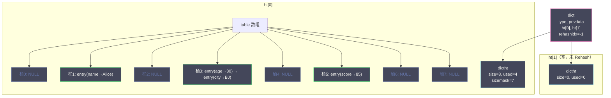
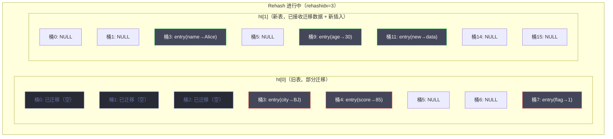

# 03 字典与渐进式 Rehash

**摘要：**

字典（dict）是 Redis 中使用最广泛的底层数据结构——它不仅是 Hash 类型的底层实现之一，更是 Redis **整个键空间**（所有 key-value 对）的存储载体。每一次 GET/SET/DEL 操作的核心，都是对字典的查找、插入和删除。Redis 的字典基于**哈希表**实现，使用 **MurmurHash2** 算法计算哈希值，用**链地址法**解决哈希冲突。当哈希表的负载因子过高（元素太多，冲突链太长）或过低（元素太少，空间浪费）时，需要对哈希表进行扩容或缩容——即 **Rehash**。传统的 Rehash 需要一次性将所有键值对从旧表迁移到新表——如果字典包含数百万个键值对，这次迁移会阻塞 Redis 主线程数秒。Redis 为此设计了**渐进式 Rehash**——将迁移工作分摊到后续的每一次字典操作中，每次只迁移一小部分，避免长时间阻塞。这个设计是 Redis 单线程模型下保证低延迟的关键手段之一。本文从哈希表的基础原理出发，深入 Redis 字典的数据结构、哈希算法、冲突处理、Rehash 触发条件和渐进式 Rehash 的完整机制。

---

## 第 1 章 哈希表基础

### 1.1 为什么需要哈希表

Redis 是一个键值存储——最核心的操作是"给定一个 key，找到对应的 value"。要高效地实现这个操作，需要一个支持 O(1) 查找的数据结构——这就是**哈希表（Hash Table）**。

哈希表的基本思想：通过一个**哈希函数**将 key 映射为一个整数（哈希值），再对哈希表的大小取模得到一个**索引**（桶号），将键值对存储在该索引对应的桶中。查找时，用同样的方式计算索引，直接定位到桶——平均时间复杂度 O(1)。

```
哈希表（大小 8）：
  key "name" → hash("name") = 1234567 → 1234567 % 8 = 7 → 存入桶 7
  key "age"  → hash("age")  = 2345678 → 2345678 % 8 = 6 → 存入桶 6

  查找 "name"：hash("name") % 8 = 7 → 直接到桶 7 → 找到 value
```

### 1.2 哈希冲突

哈希函数将无限的 key 空间映射到有限的桶空间——必然存在不同的 key 映射到同一个桶的情况，这就是**哈希冲突**。解决冲突的常见方法有两种：

**开放寻址法（Open Addressing）**：冲突时，按照某种探测序列（线性探测、二次探测、双重哈希）寻找下一个空桶。Python 的 dict 和 Go 的 map 使用这种方法。

**链地址法（Separate Chaining）**：每个桶维护一个链表——冲突的键值对追加到链表尾部。Java 的 HashMap 和 Redis 的 dict 使用这种方法。

Redis 选择链地址法的原因：

- **实现简单**：插入操作直接在链表头部追加（O(1)），不需要复杂的探测逻辑
- **删除简单**：直接从链表中摘除节点——开放寻址法的删除需要标记"墓碑"（tombstone），逻辑更复杂
- **负载因子容忍度高**：链地址法在负载因子 > 1 时仍能工作（只是链表变长），开放寻址法在负载因子接近 1 时性能急剧下降

**代价**：每个节点需要额外的指针（next 字段）——比开放寻址法多消耗一些内存。但 Redis 的单线程模型对简单性的要求远高于对内存的极致优化——链地址法是更合适的选择。

---

## 第 2 章 Redis 字典的数据结构

### 2.1 三层结构

Redis 的字典由三层结构组成：`dict` → `dictht`（哈希表）→ `dictEntry`（哈希节点）。

```c
// 哈希节点——链表中的一个节点
typedef struct dictEntry {
    void *key;                  // key 指针
    union {
        void *val;              // value 指针
        uint64_t u64;           // 无符号整数
        int64_t s64;            // 有符号整数
        double d;               // 浮点数
    } v;                        // value（联合体，节省内存）
    struct dictEntry *next;     // 下一个节点（链地址法的链表指针）
} dictEntry;

// 哈希表
typedef struct dictht {
    dictEntry **table;          // 哈希表数组——每个元素是一个链表头指针
    unsigned long size;         // 哈希表大小（桶数，总是 2 的幂）
    unsigned long sizemask;     // 大小掩码 = size - 1（用于取模：hash & sizemask）
    unsigned long used;         // 已使用的节点数（键值对数量）
} dictht;

// 字典
typedef struct dict {
    dictType *type;             // 类型特定函数（哈希函数、key 比较函数等）
    void *privdata;             // 私有数据（传给类型特定函数）
    dictht ht[2];               // 两个哈希表——ht[0] 是正常使用的，ht[1] 用于 Rehash
    long rehashidx;             // Rehash 进度（-1 表示未在 Rehash）
    int16_t pauserehash;        // Rehash 暂停计数（> 0 时暂停 Rehash）
} dict;
```

### 2.2 内存布局



**关键设计——两个哈希表**：`dict` 结构体中包含 `ht[2]`——两个哈希表。正常情况下只使用 `ht[0]`，`ht[1]` 为空。当 Rehash 开始时，`ht[1]` 被分配为新大小的哈希表，数据从 `ht[0]` 逐步迁移到 `ht[1]`。迁移完成后，`ht[0]` 指向 `ht[1]` 的数据，`ht[1]` 重新置空。

### 2.3 dictType——类型特定函数

Redis 的字典是**泛型的**——不同用途的字典使用不同的哈希函数和比较函数。`dictType` 结构体定义了这些类型特定的操作：

```c
typedef struct dictType {
    uint64_t (*hashFunction)(const void *key);      // 哈希函数
    void *(*keyDup)(void *privdata, const void *key); // key 复制函数
    void *(*valDup)(void *privdata, const void *obj); // value 复制函数
    int (*keyCompare)(void *privdata, const void *key1, const void *key2); // key 比较函数
    void (*keyDestructor)(void *privdata, void *key);  // key 析构函数
    void (*valDestructor)(void *privdata, void *obj);  // value 析构函数
} dictType;
```

Redis 为不同的字典场景定义了不同的 dictType——键空间字典使用 [[02 SDS 与 Redis 对象系统|SDS]] 的比较和哈希函数，集群的节点字典使用 IP:Port 字符串的比较函数，等等。这种**策略模式**使得同一套字典代码可以适配多种场景。

---

## 第 3 章 哈希算法

### 3.1 MurmurHash2

Redis 使用 **MurmurHash2** 算法计算字符串 key 的哈希值。MurmurHash 是 Austin Appleby 在 2008 年设计的一族非加密哈希函数——它的设计目标是**快速且分布均匀**，而非密码学安全。

MurmurHash2 的核心特性：

- **速度**：每次处理 4 字节（32 位版本）或 8 字节（64 位版本），在现代 CPU 上非常高效
- **分布均匀**：即使输入 key 高度相似（如 "user:1001"、"user:1002"），输出的哈希值也均匀分散——减少哈希冲突
- **雪崩效应**：输入改变 1 bit，输出平均改变 50% 的 bit

**为什么不用 CRC32 或 MD5？**

- CRC32 的分布均匀性不如 MurmurHash——在某些输入模式下冲突率更高
- MD5/SHA 是密码学哈希函数——计算速度比 MurmurHash 慢 10-100 倍，且哈希表不需要密码学安全性

### 3.2 哈希值到桶索引的映射

得到哈希值后，需要将其映射到哈希表的桶索引。传统做法是取模运算 `hash % size`——但除法运算在 CPU 上比较慢。Redis 的哈希表大小**总是 2 的幂**——可以用**位与运算**替代取模：

```c
index = hash & sizemask;    // sizemask = size - 1
// 等价于：index = hash % size（当 size 是 2 的幂时）
```

位与运算比除法快数倍——在每秒数十万次的哈希表操作中，这个微优化的累积效果非常显著。

**2 的幂大小的代价**：如果哈希函数的低位分布不够均匀，2 的幂取模会导致冲突集中在某些桶——但 MurmurHash2 的分布均匀性足以消除这个隐患。

---

## 第 4 章 哈希冲突处理

### 4.1 链地址法的实现

当两个 key 的哈希值映射到同一个桶时，新节点被插入到链表的**头部**：

```c
// 插入新节点（简化版）
dictEntry *dictAddRaw(dict *d, void *key, dictEntry **existing) {
    // 计算哈希值和桶索引
    uint64_t h = dictHashKey(d, key);
    long index = h & d->ht[htidx].sizemask;

    // 检查 key 是否已存在（遍历链表）
    dictEntry *he = d->ht[htidx].table[index];
    while (he) {
        if (dictCompareKeys(d, key, he->key)) {
            if (existing) *existing = he;
            return NULL;    // key 已存在
        }
        he = he->next;
    }

    // 创建新节点，插入链表头部
    dictEntry *entry = zmalloc(sizeof(*entry));
    entry->next = d->ht[htidx].table[index];
    d->ht[htidx].table[index] = entry;
    d->ht[htidx].used++;

    return entry;
}
```

**头插法（而非尾插法）的原因**：头插法是 O(1)——直接将新节点的 next 指向原链表头，再更新桶的指针即可。尾插法需要遍历到链表尾部——O(N)。Redis 作为高性能数据库，每个操作都追求最小化的时间复杂度。

### 4.2 链表长度与性能

在理想情况下（哈希函数完美均匀），负载因子 = 1 时（元素数 = 桶数），每个桶的平均链表长度为 1——查找复杂度 O(1)。但实际中总会有一些桶的链表较长——统计上，负载因子为 1 时最长链表长度约为 O(log N / log log N)。

当负载因子远大于 1 时（如 5 或 10），很多桶的链表长度显著增加——每次查找需要遍历更长的链表。这就是需要 Rehash 扩容的根本原因——**通过增加桶数来降低平均链表长度，维持 O(1) 的查找性能**。

---

## 第 5 章 Rehash 触发条件

### 5.1 负载因子

**负载因子（Load Factor）** = `ht[0].used / ht[0].size`——已使用节点数 / 哈希表大小。

Redis 的 Rehash 触发条件分为**扩容**和**缩容**：

**扩容条件**（满足任一）：
1. 负载因子 ≥ 1 **且** 当前没有在执行 BGSAVE 或 BGREWRITEAOF
2. 负载因子 ≥ 5（无论是否在执行后台任务——强制扩容）

**缩容条件**：
- 负载因子 < 0.1（即已使用节点数不足哈希表大小的 10%）

### 5.2 为什么 BGSAVE 期间提高扩容阈值

BGSAVE（[[07 RDB 持久化——快照的 fork 与 COW 机制|RDB 持久化]]）通过 `fork()` 创建子进程——子进程与父进程共享内存页，通过 **Copy-On-Write（COW）** 机制实现写时复制。如果父进程在 BGSAVE 期间进行 Rehash，会大量写入哈希表——触发大量的 COW 页复制，导致内存使用量暴涨。

因此，Redis 在 BGSAVE/BGREWRITEAOF 期间将扩容阈值从 1 提高到 5——尽量避免在后台任务期间触发 Rehash，减少 COW 的内存开销。但如果负载因子已经达到 5（冲突非常严重），即使在 BGSAVE 期间也必须扩容——否则查找性能会退化到不可接受的水平。

### 5.3 扩容和缩容的目标大小

- **扩容**：新大小 = 第一个 ≥ `ht[0].used * 2` 的 2 的幂
  - 例：used = 500，第一个 ≥ 1000 的 2 的幂 = 1024
- **缩容**：新大小 = 第一个 ≥ `ht[0].used` 的 2 的幂
  - 例：used = 50，第一个 ≥ 50 的 2 的幂 = 64

---

## 第 6 章 渐进式 Rehash

### 6.1 为什么需要渐进式

传统的 Rehash 方式是**一次性完成**——分配新哈希表，遍历旧表的所有节点，逐个重新计算哈希值并插入新表，最后释放旧表。

如果字典包含 100 万个键值对，一次性 Rehash 需要：
1. 分配新哈希表数组（数百万字节）
2. 遍历 100 万个节点，每个节点重新计算哈希值 + 插入新表
3. 释放旧哈希表数组

整个过程可能需要**数百毫秒甚至数秒**——在此期间 Redis 的主线程被完全阻塞，无法处理任何客户端请求。对于 Redis 这种对延迟极度敏感的内存数据库来说，这是不可接受的。

**渐进式 Rehash** 的核心思想：**不要一次性搬完，每次只搬一点**——将迁移工作分摊到后续的每一次字典操作（查找、插入、删除）中，以及定时任务中。每次操作只迁移一个桶（或几个桶）的节点——单次迁移的耗时在微秒级，对客户端完全透明。

### 6.2 渐进式 Rehash 的完整流程

**阶段一：Rehash 开始**

```c
int dictRehash(dict *d, int n) {
    // 1. 为 ht[1] 分配新大小的哈希表
    d->ht[1].table = zcalloc(newsize * sizeof(dictEntry*));
    d->ht[1].size = newsize;
    d->ht[1].sizemask = newsize - 1;
    d->ht[1].used = 0;

    // 2. 设置 rehashidx = 0，标记 Rehash 开始
    d->rehashidx = 0;
}
```

`rehashidx` 是渐进式 Rehash 的关键——它记录了**当前迁移到了 ht[0] 的哪个桶**。初始值 0 表示从第 0 个桶开始迁移；值为 -1 表示没有在进行 Rehash。

**阶段二：逐步迁移**

每次对字典执行增删改查操作时，Redis 会"顺便"迁移一个桶：

```c
// 每次操作时调用——迁移 n 个桶
static void _dictRehashStep(dict *d) {
    if (d->pauserehash == 0) dictRehash(d, 1);
}

int dictRehash(dict *d, int n) {
    int empty_visits = n * 10;  // 最多访问的空桶数（避免全是空桶时耗时太长）

    while (n-- && d->ht[0].used != 0) {
        dictEntry *de, *nextde;

        // 跳过空桶（但有上限，防止长时间阻塞）
        while (d->ht[0].table[d->rehashidx] == NULL) {
            d->rehashidx++;
            if (--empty_visits == 0) return 1;
        }

        // 迁移当前桶的所有节点到 ht[1]
        de = d->ht[0].table[d->rehashidx];
        while (de) {
            nextde = de->next;

            // 重新计算在新表中的桶索引
            uint64_t h = dictHashKey(d, de->key) & d->ht[1].sizemask;

            // 插入新表的链表头部
            de->next = d->ht[1].table[h];
            d->ht[1].table[h] = de;

            d->ht[0].used--;
            d->ht[1].used++;
            de = nextde;
        }

        // 清空旧表的这个桶
        d->ht[0].table[d->rehashidx] = NULL;
        d->rehashidx++;
    }

    // 检查是否迁移完成
    if (d->ht[0].used == 0) {
        zfree(d->ht[0].table);
        d->ht[0] = d->ht[1];          // ht[0] 指向新表
        _dictReset(&d->ht[1]);          // ht[1] 重置为空
        d->rehashidx = -1;              // 标记 Rehash 结束
        return 0;                        // 完成
    }
    return 1;                            // 未完成
}
```

**核心逻辑**：每次调用 `dictRehash(d, 1)` 迁移 1 个桶——将 `ht[0].table[rehashidx]` 上的整条链表节点逐个重新哈希并插入 `ht[1]`，然后 `rehashidx++` 前进到下一个桶。

**空桶跳过优化**：如果当前桶是空的（没有节点），直接跳过。但为了防止哈希表非常稀疏时（大量空桶）一次跳过太多桶导致单次操作耗时过长，引入了 `empty_visits` 上限——最多跳过 `n * 10` 个空桶就暂停。

**阶段三：Rehash 完成**

当 `ht[0].used == 0`（旧表的所有节点都迁移完了），释放旧表，将 `ht[0]` 指向新表 `ht[1]`，重置 `ht[1]`，设置 `rehashidx = -1`。

### 6.3 Rehash 期间的操作

在 Rehash 进行中，`ht[0]` 和 `ht[1]` **同时存在数据**——字典操作需要同时考虑两个表：

**查找（dictFind）**：先在 `ht[0]` 中查找，如果没找到且正在 Rehash，再在 `ht[1]` 中查找。

**插入（dictAdd）**：新插入的键值对**只插入 ht[1]**——保证 `ht[0]` 的节点数只减不增，Rehash 最终一定能完成。

**删除（dictDelete）**：在 `ht[0]` 和 `ht[1]` 中都尝试删除。

**遍历（dictScan）**：需要同时遍历两个表——这是 SCAN 命令在 Rehash 期间正确工作的基础。



### 6.4 serverCron 中的定时迁移

仅靠用户操作触发的迁移可能不够快——如果 Redis 在 Rehash 期间请求量很低，迁移进度会非常慢。Redis 的定时任务 `serverCron`（默认每 100ms 执行一次）中也会主动进行迁移：

```c
// server.c - databasesCron()
// 每次执行 100 步（100 个桶）的 Rehash，最多耗时 1ms
int dictRehashMilliseconds(dict *d, int ms) {
    long long start = timeInMilliseconds();
    int rehashes = 0;

    while (dictRehash(d, 100)) {
        rehashes += 100;
        if (timeInMilliseconds() - start > ms) break;
    }
    return rehashes;
}
```

`dictRehashMilliseconds` 在 1 毫秒的时间预算内尽可能多地迁移桶——每次 100 个桶，超时就停。这保证了即使没有用户请求，Rehash 也会稳步推进，同时不会占用太多主线程时间。

### 6.5 Rehash 暂停机制

某些场景下需要暂停 Rehash——例如 `dictScan`（SCAN 命令）遍历字典时，如果同时进行 Rehash 可能导致遍历结果不一致。Redis 使用 `pauserehash` 计数器：

```c
// 暂停 Rehash
void dictPauseRehashing(dict *d) {
    d->pauserehash++;
}

// 恢复 Rehash
void dictResumeRehashing(dict *d) {
    d->pauserehash--;
}
```

使用计数器而非布尔值的原因：可能存在多层嵌套的暂停需求——外层暂停后内层也暂停，内层恢复后外层仍然暂停。计数器确保所有暂停都恢复后才真正恢复 Rehash。

---

## 第 7 章 SCAN 命令与 Rehash 的交互

### 7.1 SCAN 的难题

`SCAN cursor COUNT 100` 命令用于增量遍历字典——每次调用返回一部分 key 和一个新的 cursor，客户端用新 cursor 继续遍历。SCAN 的设计目标：

1. 遍历所有 key（不遗漏）
2. 可以在遍历期间安全地 Rehash
3. 不会无限循环

难题在于：SCAN 遍历的过程中，字典可能正在 Rehash——哈希表的大小在变化，key 的桶位置也在变化。如果简单地用线性游标（0, 1, 2, 3...）遍历桶，Rehash 导致桶数翻倍后，某些 key 可能被遗漏或重复返回。

### 7.2 反向二进制迭代

Redis 使用了一种精巧的 **反向二进制迭代（Reverse Binary Iteration）** 算法来解决这个问题。cursor 不是简单地递增，而是按照**高位加 1 进位**的方式递增：

```c
// dictScan 中的 cursor 更新逻辑
v |= ~m0;              // 将 cursor 的高位（超出当前表大小的部分）全部置 1
v = rev(v);             // 反转 bit 顺序
v++;                    // 加 1
v = rev(v);             // 再反转回来
```

这种迭代方式保证了：即使在遍历过程中哈希表扩容（桶数翻倍）或缩容（桶数减半），已经遍历过的桶在新表中的对应位置不会被再次遍历，未遍历的桶也不会被遗漏。

**代价**：可能存在少量 key 被重复返回——SCAN 的文档明确说明了这一点：

> SCAN guarantees that all elements that are present from the start to the end of a full iteration are returned. However, it is possible for an element to be returned multiple times.

客户端需要自行去重——但不会遗漏。

---

## 第 8 章 字典在 Redis 中的应用

### 8.1 键空间

Redis 的每个数据库（`redisDb`）使用一个字典作为**键空间**（`db->dict`）——存储所有的 key-value 对。每次 GET/SET/DEL 操作的核心就是对这个字典的操作。

另一个字典 `db->expires` 存储所有设置了过期时间的 key——key 与 `db->dict` 中共享指针（不额外分配内存），value 是过期时间戳。

### 8.2 Hash 类型

当 Hash 类型的数据量超过 listpack 阈值时，底层编码从 listpack 转为 hashtable——即使用 dict 作为底层数据结构。

### 8.3 Set 类型

当 Set 类型的数据不全是整数或超过 intset/listpack 阈值时，底层编码转为 hashtable——dict 的 key 存储集合元素，value 为 NULL。

### 8.4 ZSet 类型

ZSet 的 hashtable 编码实际上同时使用 dict 和 skiplist——dict 用于 O(1) 按 member 查找 score，skiplist 用于 O(log N) 按 score 范围查询。两者共享 member 和 score 的指针（不额外分配内存）。

### 8.5 其他内部用途

- **命令表**：命令名到 `redisCommand` 的映射
- **Pub/Sub 频道订阅**：频道名到订阅者列表的映射
- **Cluster 节点表**：节点 ID 到节点信息的映射
- **Watched keys**：被 WATCH 的 key 到客户端列表的映射

字典是 Redis 中复用最广泛的数据结构——几乎所有需要"按 key 查找"的场景都使用字典。

---

## 第 9 章 Redis 7.x 的字典重构

### 9.1 dictEntry 的内存优化

在 Redis 7.x 中，字典的实现经历了一些重要的优化。其中之一是对小 dictEntry 的内存优化——对于 Set 类型（value 为 NULL）和某些内部字典，Redis 引入了**无 value 的 dictEntry** 变体，省去了 union v 字段的 8 字节——在存储大量 Set 元素时节省可观的内存。

### 9.2 嵌入式 key

另一个优化是将较短的 key 直接嵌入 dictEntry 结构体中（类似于 embstr 对 SDS 的优化）——减少一次内存分配和一次指针解引用。这对于大量短 key 的场景（如 "user:1001"、"order:2001"）内存节省显著。

---

## 第 10 章 总结

本文深入分析了 Redis 字典的设计与实现：

- **哈希表基础**：O(1) 查找；链地址法解决冲突（实现简单、删除简单、容忍高负载因子）
- **三层结构**：`dict` → `dictht[2]`（两个哈希表）→ `dictEntry`（链表节点）；两个哈希表为渐进式 Rehash 服务
- **哈希算法**：MurmurHash2（快速+均匀）；2 的幂大小 + 位与取模（比除法快数倍）
- **Rehash 触发**：扩容（负载因子 ≥ 1 或 ≥ 5）；缩容（负载因子 < 0.1）；BGSAVE 期间提高扩容阈值减少 COW 开销
- **渐进式 Rehash**：`rehashidx` 记录迁移进度；每次字典操作迁移 1 个桶；serverCron 定时迁移（1ms 预算）；新插入只进 ht[1]；查找/删除查两个表
- **SCAN 与 Rehash**：反向二进制迭代算法保证遍历不遗漏（可能重复）
- **字典的广泛应用**：键空间、expires、Hash/Set/ZSet 的底层实现、命令表、Pub/Sub、Cluster 节点表

**核心设计哲学**：渐进式 Rehash 是 Redis 单线程模型下的必然选择——不能有任何操作长时间阻塞主线程。将大的 Rehash 工作分摊到无数次小操作中，每次只做一点——这种"化整为零"的思想贯穿了 Redis 的整个设计。

下一篇 [[04 跳跃表 压缩列表与 Listpack]] 将深入 Redis 的有序数据结构——跳跃表（skiplist）的概率平衡机制，以及压缩列表（ziplist）被 listpack 替代的演进历史。

---

## 参考资料

1. Redis Source Code - dict.h / dict.c：https://github.com/redis/redis/blob/unstable/src/dict.h
2. MurmurHash - Austin Appleby：https://github.com/aappleby/smhasher
3. 黄健宏 - 《Redis 设计与实现》（第二版）- 第 4 章 字典
4. antirez - Redis Rehash 设计笔记：http://antirez.com/
5. Redis SCAN cursor 算法分析：https://engineering.redis.com/

---

> [!note] 思考题
> 1. RDB 的 fork() 在 Redis 占用 64GB 内存时可能需要数百毫秒到数秒的暂停。`jemalloc` 的 Transparent Huge Pages 会放大 COW 的内存开销——Redis 官方建议关闭 THP。具体原因是什么？THP 的 2MB 页在 COW 时即使只修改 1 字节也会复制整个 2MB——这种'写放大'如何影响 fork 期间的内存使用？
> 2. AOF 的 `appendfsync everysec` 由后台线程执行 fsync。如果 fsync 耗时超过 2 秒，Redis 主线程会阻塞等待——这就是'AOF 阻塞'。在什么磁盘条件下容易触发（如 HDD、IO 密集的混合负载）？`aof-no-fsync-on-rewrite yes` 在 AOF 重写期间跳过 fsync——可能丢失多少数据？
> 3. Redis 7.0 的 Multi-Part AOF 将 AOF 拆分为 Base RDB + Incremental AOF。与旧版 AOF Rewrite（fork 子进程重写整个 AOF）相比，Multi-Part AOF 在内存使用和恢复速度方面有什么改善？增量 AOF 文件的管理策略是什么？
