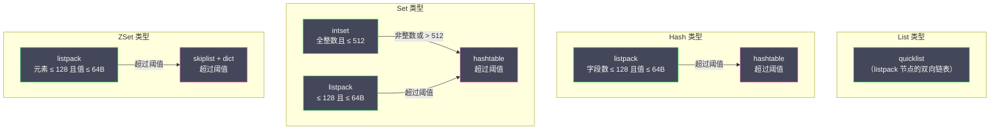

# 04 跳跃表 压缩列表与 Listpack

**摘要：**

Redis 的有序数据类型（ZSet、List、Hash、Set 在小数据量时）需要在内存效率和查找性能之间做出精妙的平衡。本文深入分析三种关键的底层数据结构：**跳跃表（skiplist）** 是 ZSet 在大数据量时的核心引擎——它用概率化的多层索引实现了 O(log N) 的查找、插入和范围查询，是平衡树的一种更简单的替代方案；**压缩列表（ziplist）** 是 Redis 早期为小数据量场景设计的紧凑编码——将所有元素连续存储在一块内存中，极致节省内存但存在**连锁更新（cascade update）** 这一严重的性能缺陷；**listpack** 是 Redis 7.0 引入的 ziplist 替代者——保留了紧凑连续存储的优点，同时彻底消除了连锁更新问题。此外，**quicklist**（List 类型的底层实现）将 listpack 作为节点的双向链表——兼顾了连续存储的内存效率和链表的灵活性。

---

## 第 1 章 跳跃表——概率平衡的有序结构

### 1.1 从链表到跳跃表

有序链表支持 O(1) 的插入（已知位置）和 O(N) 的遍历，但查找某个元素需要从头遍历——O(N)。二叉搜索树将查找优化到 O(log N)，但需要复杂的平衡维护（如 AVL 树的旋转、红黑树的变色）。

William Pugh 在 1990 年提出了**跳跃表（Skip List）**——一种基于**概率**的有序数据结构。核心思想是在有序链表的基础上增加多层"快速通道"——高层的链表跳过更多节点，实现类似于二分查找的加速效果。

```
Level 4:  HEAD ─────────────────────────────────────────→ 50 ───→ NULL
Level 3:  HEAD ──────────→ 20 ──────────────────────────→ 50 ───→ NULL
Level 2:  HEAD ──→ 10 ──→ 20 ──────────→ 40 ──────────→ 50 ───→ NULL
Level 1:  HEAD ──→ 10 ──→ 20 ──→ 30 ──→ 40 ──→ 45 ──→ 50 ───→ NULL
```

查找元素 45 的过程：
1. 从最高层（Level 4）开始：HEAD → 50（50 > 45，降到 Level 3）
2. Level 3：HEAD → 20（20 < 45，前进）→ 50（50 > 45，降到 Level 2）
3. Level 2：20 → 40（40 < 45，前进）→ 50（50 > 45，降到 Level 1）
4. Level 1：40 → 45（找到！）

总共比较了 4 次——而遍历整个链表需要比较 6 次。在大规模数据中（N = 100 万），跳跃表的查找次数约为 log₂(N) ≈ 20 次，而链表遍历需要 100 万次。

### 1.2 随机层数——概率的魔力

跳跃表每个节点的层数不是固定的——是在插入时通过**随机函数**决定的：

```c
// Redis 中的随机层数生成
#define ZSKIPLIST_MAXLEVEL 32    // 最大层数
#define ZSKIPLIST_P 0.25          // 晋升概率

int zslRandomLevel(void) {
    int level = 1;
    // 每次有 25% 的概率升一层
    while ((random() & 0xFFFF) < (ZSKIPLIST_P * 0xFFFF))
        level += 1;
    return (level < ZSKIPLIST_MAXLEVEL) ? level : ZSKIPLIST_MAXLEVEL;
}
```

**概率分布**：
- Level 1 的概率：1（所有节点都在 Level 1）
- Level 2 的概率：0.25
- Level 3 的概率：0.25² = 0.0625
- Level N 的概率：0.25^(N-1)

平均每个节点的层数 = 1/(1-p) = 1/0.75 ≈ 1.33——即平均每个节点只需要 1.33 个前向指针，空间开销非常低。

**为什么 Redis 选择 p = 0.25 而非经典的 p = 0.5？** p = 0.5 时每个节点平均 2 个指针，查找效率最高（与二分查找等价）；p = 0.25 时每个节点平均 1.33 个指针，内存更省，但查找路径稍长。Redis 选择 p = 0.25 是**内存优先**——在百万级元素的 ZSet 中，减少每个节点 0.67 个指针意味着节省数 MB 的内存。查找效率的下降是常数因子级别的（约慢 50%），对于 O(log N) 级别的操作来说完全可以接受。

### 1.3 为什么不用平衡树

antirez 在 Redis 的设计文档中解释了选择跳跃表而非平衡树（如红黑树、AVL 树）的原因：

**原因一：范围查询更自然**。ZSet 的 ZRANGEBYSCORE 需要按 score 范围遍历——跳跃表找到范围起点后，沿 Level 1 链表顺序遍历即可。平衡树需要中序遍历，实现更复杂。

**原因二：实现简单**。跳跃表的插入和删除只需要调整前向指针——代码量约为红黑树的 1/3。Redis 的设计哲学是**简单优先**——在性能差异不大的情况下，选择更简单的实现。

**原因三：并发友好**（虽然 Redis 是单线程，但这是跳跃表的一般优势）。跳跃表的插入和删除只需要修改局部几个指针——如果将来 Redis 需要多线程数据结构，跳跃表更容易加锁或实现无锁版本。平衡树的旋转操作涉及更多节点的修改——并发控制更困难。

### 1.4 Redis 跳跃表的数据结构

```c
// 跳跃表节点
typedef struct zskiplistNode {
    sds ele;                        // 成员（SDS 字符串）
    double score;                   // 分数
    struct zskiplistNode *backward; // 后退指针（只有 Level 1 有）
    struct zskiplistLevel {
        struct zskiplistNode *forward; // 前进指针
        unsigned long span;            // 跨度（到下一个节点之间跳过的节点数）
    } level[];                      // 柔性数组——层数在创建时确定
} zskiplistNode;

// 跳跃表
typedef struct zskiplist {
    struct zskiplistNode *header, *tail; // 头尾节点
    unsigned long length;               // 节点总数（不含头节点）
    int level;                          // 当前最高层数
} zskiplist;
```

**span（跨度）字段的作用**：span 记录了当前节点到同层下一个节点之间跳过了多少个 Level 1 节点——这使得 ZRANK 命令（查询元素的排名）可以 O(log N) 完成：沿查找路径将经过的所有 span 累加即可得到排名。

**backward（后退指针）**：只有 Level 1 有后退指针——用于 ZREVRANGE 等逆序遍历。不在更高层设置后退指针是为了节省内存——逆序遍历从 tail 开始沿 Level 1 的 backward 走即可。

### 1.5 ZSet 的双结构

ZSet 在大数据量（skiplist 编码）时同时使用**跳跃表 + 字典**：

| 操作 | 使用的结构 | 时间复杂度 |
| :--- | :--- | :--- |
| ZSCORE member | 字典 | O(1) |
| ZRANK member | 跳跃表（累加 span）| O(log N) |
| ZRANGEBYSCORE min max | 跳跃表（范围遍历）| O(log N + M) |
| ZADD member score | 字典 + 跳跃表 | O(log N) |
| ZREM member | 字典 + 跳跃表 | O(log N) |

字典和跳跃表**共享** member（SDS 指针）和 score——不会额外分配内存。字典的 key 指向 SDS，value 指向 score 的地址；跳跃表节点的 ele 指向同一个 SDS。

---

## 第 2 章 压缩列表——紧凑存储的极限

### 2.1 ziplist 的设计目标

**压缩列表（ziplist）** 是 Redis 为小数据量场景设计的紧凑数据结构——将所有元素**连续存储在一块内存**中，没有任何指针开销。

为什么要设计这种结构？考虑一个只有 3 个字段的 Hash（如 `{name: "Alice", age: "30", city: "BJ"}`）。如果用 [[03 字典与渐进式 Rehash|dict]]（哈希表），每个 dictEntry 需要 key 指针 + value 指针 + next 指针 = 24 字节，加上 dictEntry 本身的内存分配开销和 dict 的元数据——3 个字段的总开销可能超过 200 字节。而数据本身只有几十字节——**元数据的开销远超数据本身**。

ziplist 的解决方案：将所有字段和值紧密排列在一块连续内存中——没有指针、没有独立的内存分配，元数据开销降到最低。

### 2.2 ziplist 的内存布局

```
ziplist 整体布局：
┌──────────┬──────────┬────────┬────────┬────────┬─────┬──────────┐
│ zlbytes  │ zltail   │ zllen  │ entry1 │ entry2 │ ... │ zlend    │
│ (4字节)  │ (4字节)  │(2字节) │        │        │     │ (1字节)  │
└──────────┴──────────┴────────┴────────┴────────┴─────┴──────────┘

每个 entry 的布局：
┌──────────────────┬──────────┬─────────┐
│ prevlen          │ encoding │ content │
│ (1或5字节)       │ (变长)   │ (变长)  │
└──────────────────┴──────────┴─────────┘
```

**头部字段**：
- **zlbytes**（4 字节）：整个 ziplist 占用的字节数
- **zltail**（4 字节）：尾部 entry 距离 ziplist 起始地址的偏移——用于 O(1) 定位尾部
- **zllen**（2 字节）：entry 数量（≤ 65534 时精确；= 65535 时需要遍历计数）

**entry 字段**：
- **prevlen**：前一个 entry 的长度——用于**从后向前遍历**
  - 前一个 entry < 254 字节：prevlen 占 1 字节
  - 前一个 entry ≥ 254 字节：prevlen 占 5 字节（首字节 0xFE + 4 字节长度）
- **encoding**：当前 entry 的数据类型和长度编码
- **content**：实际数据

### 2.3 连锁更新——ziplist 的致命缺陷

prevlen 字段的**变长编码**导致了一个严重的问题——**连锁更新（Cascade Update）**。

假设一个 ziplist 中有 N 个连续的 entry，每个 entry 的长度恰好是 253 字节（prevlen 用 1 字节编码）。现在在最前面插入一个 254 字节的 entry：

```
插入前：
entry1(253B, prevlen=1B) → entry2(253B, prevlen=1B) → ... → entryN(253B, prevlen=1B)

插入后：
new_entry(254B) → entry1 的 prevlen 需要从 1B 扩展到 5B（因为 new_entry ≥ 254B）
→ entry1 总长度从 253B 变成 257B
→ entry2 的 prevlen 需要从 1B 扩展到 5B（因为 entry1 现在 ≥ 254B）
→ entry2 总长度从 253B 变成 257B
→ entry3 的 prevlen 需要从 1B 扩展到 5B
→ ...
→ 连锁反应一直传播到 entryN！
```

每次 prevlen 扩展都可能导致当前 entry 的总长度越过 254 字节的阈值——进而触发下一个 entry 的 prevlen 扩展。最坏情况下，一次插入操作导致 N 个 entry 都需要重新分配和移动——时间复杂度退化到 O(N²)。

虽然这种最坏情况在实际中很少出现（需要大量 entry 的长度恰好卡在 253-254 的边界），但它的存在使得 ziplist 在理论上不是一个可靠的 O(1) 追加数据结构——这是 Redis 最终决定用 listpack 替代 ziplist 的根本原因。

---

## 第 3 章 Listpack——ziplist 的终极替代者

### 3.1 设计动机

**listpack** 由 antirez 和 Oran Agra 设计，首次在 Redis 5.0 的 Stream 类型中使用，Redis 7.0 开始全面替代 ziplist——用于 Hash、ZSet、Set 和 List（通过 quicklist）的小数据量编码。

listpack 的设计目标：**保留 ziplist 的紧凑连续存储优点，彻底消除连锁更新问题**。

### 3.2 listpack 的内存布局

```
listpack 整体布局：
┌──────────┬────────┬────────┬─────┬──────────┐
│ total_bytes │ entry1 │ entry2 │ ... │ LP_EOF   │
│ (4字节)     │        │        │     │ (1字节)  │
└──────────┴────────┴────────┴─────┴──────────┘

每个 entry 的布局：
┌──────────┬─────────┬──────────────────┐
│ encoding │ content │ backlen          │
│ (变长)   │ (变长)  │ (变长，1-5字节)  │
└──────────┴─────────┴──────────────────┘
```

**关键区别**：listpack 的 entry **没有 prevlen 字段**——取而代之的是 **backlen（当前 entry 自身的长度）**，放在 entry 的**末尾**。

**为什么这就能消除连锁更新？**

ziplist 的连锁更新根源是：每个 entry 存储**前一个 entry 的长度**——当前一个 entry 长度变化时，当前 entry 的 prevlen 字段也可能需要变化，进而影响下一个 entry。

listpack 的每个 entry 只存储**自身的长度**——不关心前一个 entry 的长度。当某个 entry 被修改导致长度变化时，只需要更新自身的 backlen——不会影响任何其他 entry。连锁更新的传播链被彻底切断。

### 3.3 反向遍历

ziplist 通过 prevlen 从后向前遍历——知道前一个 entry 的长度就能跳到它的起始位置。

listpack 通过 backlen 从后向前遍历——backlen 在 entry 的末尾，记录的是当前 entry 的总长度。反向遍历时：

1. 从当前 entry 的起始位置向前读取 backlen（变长编码，1-5 字节）
2. 向前跳过 backlen 指示的字节数——到达前一个 entry 的末尾（即前一个 entry 的 backlen 字段）
3. 再读取前一个 entry 的 backlen——继续向前

**backlen 的变长编码**：使用 1-5 字节表示长度，最高位标记是否有更多字节——类似于 Protocol Buffers 的 varint 编码。这样即使从后向前读取，也能正确解析出 backlen 的值（通过检查最高位确定编码长度）。

### 3.4 ziplist vs listpack

| 维度 | ziplist | listpack |
| :--- | :--- | :--- |
| **连续存储** | ✅ | ✅ |
| **内存效率** | 极高 | 极高（与 ziplist 相当）|
| **连锁更新** | ❌ 存在（最坏 O(N²)）| ✅ 不存在 |
| **反向遍历** | 通过 prevlen（前一个 entry 长度）| 通过 backlen（自身长度）|
| **entry 开销** | prevlen(1-5B) + encoding + content | encoding + content + backlen(1-5B) |
| **使用状态** | Redis 7.0 前的默认编码 | Redis 7.0+ 全面替代 ziplist |

---

## 第 4 章 Quicklist——链表与 Listpack 的混合体

### 4.1 List 类型的底层演进

| Redis 版本 | List 底层实现 |
| :--- | :--- |
| 3.2 之前 | 小数据量：ziplist；大数据量：双向链表（linkedlist）|
| 3.2 - 6.x | quicklist（ziplist 节点的双向链表）|
| 7.0+ | quicklist（listpack 节点的双向链表）|

**为什么不直接用 listpack？** listpack（和 ziplist）是连续内存——在中间位置插入或删除元素需要移动后续所有元素的内存（O(N)）。对于 List 类型的 LPUSH/RPUSH/LINSERT 操作，如果 List 包含数万个元素全部存在一个 listpack 中，每次操作都要移动大量内存——性能不可接受。

**为什么不直接用双向链表？** 双向链表的每个节点需要前指针 + 后指针 = 16 字节，加上节点本身的内存分配开销——存储小元素时指针和元数据的开销远超数据本身。

**quicklist 的折中方案**：将多个 listpack 用双向链表串联——每个 listpack 存储一批连续元素（默认最多存储大小不超过 8KB 的数据），listpack 之间用指针连接。既保留了 listpack 的内存效率（连续存储、无指针开销），又避免了在单个超大 listpack 中插入/删除的高成本。

### 4.2 quicklist 的数据结构

```c
typedef struct quicklist {
    quicklistNode *head;        // 链表头
    quicklistNode *tail;        // 链表尾
    unsigned long count;        // 所有 listpack 中的元素总数
    unsigned long len;          // quicklistNode 节点数
    signed int fill : QL_FILL_BITS;  // 每个节点的最大容量配置
    unsigned int compress : QL_COMP_BITS; // LZF 压缩深度
    // ...
} quicklist;

typedef struct quicklistNode {
    struct quicklistNode *prev;  // 前一个节点
    struct quicklistNode *next;  // 后一个节点
    unsigned char *entry;        // listpack 指针（或压缩后的数据）
    size_t sz;                   // listpack 的字节大小
    unsigned int count : 16;     // listpack 中的元素数量
    unsigned int encoding : 2;   // 编码（RAW=1 原始 listpack，LZF=2 压缩）
    // ...
} quicklistNode;
```

### 4.3 fill 参数

`list-max-listpack-size` 配置（对应 `fill` 字段）控制每个 quicklistNode 中 listpack 的最大容量：

| 值 | 含义 |
| :--- | :--- |
| **正数** | 每个 listpack 最多包含这么多个元素 |
| **-1** | 每个 listpack 最大 4KB |
| **-2**（默认）| 每个 listpack 最大 8KB |
| **-3** | 每个 listpack 最大 16KB |
| **-4** | 每个 listpack 最大 32KB |
| **-5** | 每个 listpack 最大 64KB |

**默认 -2（8KB）的权衡**：8KB 可以存储几十到几百个小元素——每个 listpack 内部的操作（插入/删除导致的内存移动）耗时在微秒级；listpack 之间通过指针连接——LPUSH/RPUSH 只操作头/尾节点的 listpack，O(1)。

### 4.4 LZF 压缩

quicklist 支持对**中间节点**的 listpack 进行 **LZF 压缩**——`list-compress-depth` 配置控制：

| 值 | 含义 |
| :--- | :--- |
| **0**（默认）| 不压缩 |
| **1** | 头尾各 1 个节点不压缩，中间节点压缩 |
| **2** | 头尾各 2 个节点不压缩，中间节点压缩 |
| **N** | 头尾各 N 个节点不压缩 |

**为什么只压缩中间节点？** List 的操作通常集中在头部（LPUSH/LPOP）和尾部（RPUSH/RPOP）——中间节点被访问的频率很低。压缩中间节点可以节省内存，解压的 CPU 开销只在中间节点被访问时才产生（如 LINDEX 访问中间位置）。

---

## 第 5 章 intset——整数集合的紧凑编码

### 5.1 intset 的设计

当 Set 类型的所有元素都是整数且数量不超过 `set-max-intset-entries`（默认 512）时，Redis 使用 **intset** 作为底层编码。intset 将整数元素**有序排列**在一个连续的整数数组中——支持 O(log N) 的二分查找。

```c
typedef struct intset {
    uint32_t encoding;      // 编码类型（int16_t / int32_t / int64_t）
    uint32_t length;        // 元素数量
    int8_t contents[];      // 柔性数组——存储有序的整数
} intset;
```

**自适应编码**：intset 根据元素的最大值自动选择最小的整数类型——如果所有元素都在 [-32768, 32767] 范围内，使用 int16_t（每个元素 2 字节）；如果有一个元素超出了 int16_t 范围，**整个数组升级为 int32_t**（每个元素 4 字节）。这种升级是**不可逆的**。

### 5.2 编码升级

```
假设 intset 当前用 int16_t 编码，存储 [1, 5, 10, 20]：
contents = [01 00 | 05 00 | 0A 00 | 14 00]  （每个元素 2 字节）

现在插入 70000（超出 int16_t 范围，需要 int32_t）：
1. 将 encoding 从 INTSET_ENC_INT16 改为 INTSET_ENC_INT32
2. 按新编码重新分配内存（5 个元素 × 4 字节 = 20 字节）
3. 从后往前逐个扩展已有元素到新编码宽度
4. 在正确位置插入新元素（保持有序）

升级后 contents = [01 00 00 00 | 05 00 00 00 | 0A 00 00 00 | 14 00 00 00 | 70 11 01 00]
```

**从后往前扩展**的原因：避免覆盖尚未处理的元素。如果从前往后扩展，第一个元素从 2 字节扩展到 4 字节后会覆盖第二个元素的空间。

**为什么不降级？** 与 [[02 SDS 与 Redis 对象系统|RedisObject 的编码转换]] 一样——降级的复杂性和频率不值得。如果某个大元素被删除后所有剩余元素都可以用更小的编码，理论上可以降级——但遍历所有元素检查最大值的成本、以及降级后又插入大元素再升级的风险，使得降级在实践中弊大于利。

---

## 第 6 章 编码选择与转换全景



**设计哲学**：小数据量用紧凑编码（listpack/intset）节省内存——虽然查找是 O(N)，但 N 很小时 O(N) 和 O(1) 的实际耗时差异可以忽略。大数据量用高效编码（hashtable/skiplist）保证性能——虽然内存开销更大，但保证了操作的时间复杂度不退化。Redis 在两者之间的阈值处自动转换——对用户完全透明。

---

## 第 7 章 总结

本文深入分析了 Redis 的四种底层有序/紧凑数据结构：

- **跳跃表（skiplist）**：概率化多层索引——O(log N) 查找/插入/范围查询；p = 0.25 平均 1.33 个指针/节点（内存优先）；span 字段支持 O(log N) 排名查询；ZSet 大数据量时与 dict 配合使用
- **压缩列表（ziplist）**：连续内存存储——极致内存效率但存在连锁更新缺陷（prevlen 变长编码导致）；Redis 7.0 前的默认紧凑编码
- **listpack**：ziplist 的替代者——用 backlen（自身长度）替代 prevlen（前一个 entry 长度），彻底消除连锁更新；Redis 7.0+ 全面使用
- **quicklist**：listpack 节点的双向链表——兼顾连续存储的内存效率和链表的灵活性；支持 LZF 压缩中间节点进一步节省内存
- **intset**：有序整数数组——int16/int32/int64 自适应编码，支持 O(log N) 二分查找；升级不可逆

**核心设计原则**：Redis 的数据结构设计始终围绕**空间-时间权衡**——小数据量时牺牲少量查找性能换取极致的内存效率，大数据量时牺牲少量内存换取稳定的操作性能。编码转换机制让这个权衡对用户完全透明。

下一篇 [[05 单线程模型与事件驱动架构]] 将深入 Redis 的核心运行模型——ae 事件循环的设计、epoll/kqueue 的 IO 多路复用、以及 Redis 6.0 多线程 IO 的实现细节。

---

## 参考资料

1. William Pugh - Skip Lists: A Probabilistic Alternative to Balanced Trees (1990)
2. Redis Source Code - t_zset.c / zskiplist：https://github.com/redis/redis/blob/unstable/src/t_zset.c
3. Redis Source Code - listpack.c：https://github.com/redis/redis/blob/unstable/src/listpack.c
4. Redis Source Code - quicklist.c：https://github.com/redis/redis/blob/unstable/src/quicklist.c
5. antirez - listpack 设计文档：https://github.com/antirez/listpack
6. 黄健宏 - 《Redis 设计与实现》（第二版）- 第 5/6/7 章

---

> [!note] 思考题
> 1. Redis 6.0 的多线程 IO（`io-threads 4`）将网络读写并行化。在 100K+ QPS 的场景中，单线程 IO 可能成为瓶颈——多线程 IO 的 QPS 提升通常在 50-100%。但命令执行仍然是单线程——在什么类型的命令中（如计算密集的 Lua 脚本、大 Key 操作），多线程 IO 的收益被单线程执行瓶颈抵消？
> 2. `KEYS *` 是 O(n) 操作，在百万 Key 的实例上可能阻塞数秒。`SCAN` 使用游标增量遍历——但 `SCAN` 可能返回重复 Key 或遗漏 Key（在遍历期间数据变化时）。在什么一致性要求下 `SCAN` 的这种'最终一致'遍历是可接受的？
> 3. 在 16 核 64GB 服务器上运行多个 Redis 实例——每个实例绑定一个 CPU 核、分配 8-10GB 内存。实例之间用 Redis Cluster 分片。与单个大实例相比，多实例的优势是什么（如利用多核、更小的 RDB/AOF、更快的 fork）？劣势呢（如运维复杂度、Cluster 的跨 Slot 限制）？
