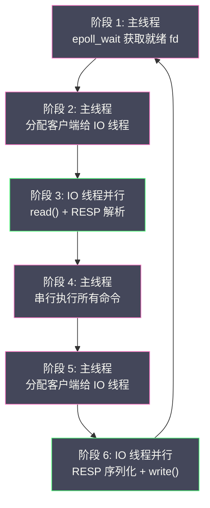

# 05 单线程模型与事件驱动架构

**摘要：**

Redis 能够用单个线程处理每秒数十万次的命令请求——这在直觉上似乎不可能，因为我们习惯了"并发 = 多线程"的思维模式。但 Redis 的性能瓶颈不在 CPU 计算——一次 GET/SET 操作的 CPU 耗时只有几十纳秒——而在**网络 IO 和内存访问**。单线程模型通过彻底消除锁竞争、上下文切换和缓存行失效（cache line invalidation）的开销，将每次操作的固定成本降到最低。而**事件驱动架构**通过操作系统的 IO 多路复用机制（Linux 的 [[epoll]]、macOS 的 kqueue），让单个线程能够同时监控数万个 Socket 连接——哪个连接有数据到达就处理哪个，没有数据的连接不消耗任何 CPU。本文从操作系统的 IO 模型演进出发，深入 Redis 自研的 ae 事件库的实现细节，分析 serverCron 定时任务的职责划分，最后详解 Redis 6.0 多线程 IO 的分阶段执行模型。

---

## 第 1 章 IO 模型的演进

### 1.1 阻塞 IO——最简单也最低效

在最原始的网络编程模型中，每个客户端连接由一个专用线程处理。线程调用 `read()` 从 Socket 读取数据时，如果数据尚未到达，线程会**阻塞等待**——操作系统将线程挂起，直到数据到达后唤醒。

```
线程 1: accept() → read() [阻塞等待客户端 A 的数据]
线程 2: accept() → read() [阻塞等待客户端 B 的数据]
线程 3: accept() → read() [阻塞等待客户端 C 的数据]
...
```

**问题**：每个连接需要一个线程——如果有 1 万个并发连接，就需要 1 万个线程。每个线程的栈空间默认 8MB（Linux），1 万个线程仅栈空间就需要 80GB。更严重的是，大量线程的上下文切换开销（保存/恢复寄存器、刷新 TLB、切换内核栈）会消耗大量 CPU——线程越多，切换越频繁，真正用于业务处理的 CPU 时间反而越少。这就是经典的 **C10K 问题**。

### 1.2 非阻塞 IO + 轮询——能用但浪费

将 Socket 设置为非阻塞模式后，`read()` 在没有数据时立即返回 `EAGAIN` 错误而非阻塞。应用程序可以用一个线程循环轮询所有连接：

```c
while (true) {
    for (fd in all_fds) {
        ret = read(fd, buf, sizeof(buf));  // 非阻塞
        if (ret > 0) {
            process(buf);  // 有数据，处理
        }
        // ret == EAGAIN: 没有数据，继续下一个 fd
    }
}
```

**问题**：即使没有任何连接有数据到达，线程也在不停地循环检查——**忙轮询（busy polling）**。CPU 100% 占用但大部分是无效工作。而且每次循环都要检查所有 fd——O(N) 的扫描开销。

### 1.3 IO 多路复用——事件驱动的基石

**IO 多路复用**解决了上述两个问题——让操作系统帮我们监控所有 fd，当某个 fd 有数据到达时通知应用程序。应用程序只处理有事件的 fd——没有事件时线程休眠，不消耗 CPU。

Linux 上的 IO 多路复用经历了三代演进：

| 机制 | 特点 | 性能 |
| :--- | :--- | :--- |
| **select** | fd 集合用 bitmap 表示，最多 1024 个 fd | 每次调用 O(N) 扫描 |
| **poll** | fd 集合用数组表示，无数量限制 | 每次调用 O(N) 扫描 |
| **epoll** | 内核维护就绪列表，只返回有事件的 fd | 就绪事件 O(1) 返回 |

### 1.4 epoll 的工作原理

epoll 由三个系统调用组成：

```c
// 1. 创建 epoll 实例
int epfd = epoll_create(1);

// 2. 注册要监控的 fd 和感兴趣的事件
struct epoll_event ev;
ev.events = EPOLLIN;          // 监控可读事件
ev.data.fd = client_fd;
epoll_ctl(epfd, EPOLL_CTL_ADD, client_fd, &ev);

// 3. 等待事件——阻塞直到有事件或超时
struct epoll_event events[MAX_EVENTS];
int nfds = epoll_wait(epfd, events, MAX_EVENTS, timeout_ms);

// 只处理有事件的 fd
for (int i = 0; i < nfds; i++) {
    if (events[i].events & EPOLLIN) {
        read(events[i].data.fd, buf, sizeof(buf));
        process(buf);
    }
}
```

**epoll 的核心优势**：

- **O(1) 事件通知**：epoll 在内核中维护一个**红黑树**存储所有监控的 fd，和一个**就绪链表**存储有事件的 fd。当网卡收到数据触发中断时，内核的中断处理程序将对应的 fd 加入就绪链表。`epoll_wait` 只需要检查就绪链表是否为空——非空时直接返回有事件的 fd 列表，不需要遍历所有 fd。
- **事件注册只做一次**：`epoll_ctl` 将 fd 加入监控后，后续的 `epoll_wait` 不需要再传递 fd 集合——与 select/poll 每次调用都要传递完整 fd 集合形成鲜明对比。
- **无 fd 数量限制**：epoll 监控的 fd 数量只受系统文件描述符上限限制（通常可达数十万）。

### 1.5 kqueue——macOS/BSD 的等价物

macOS 和 BSD 系统使用 **kqueue** 替代 epoll——功能等价，API 略有不同。kqueue 通过 `kqueue()` 创建实例，`kevent()` 同时负责注册事件和等待事件。Redis 的 ae 库在 macOS 上自动使用 kqueue。

---

## 第 2 章 ae 事件库的实现

### 2.1 ae 的定位

ae（A simple event library）是 Redis 自研的事件驱动库——整个实现只有约 700 行 C 代码。它的设计目标是**最小化**——只提供 Redis 需要的功能，不做任何通用化的抽象。

ae 封装了底层 IO 多路复用 API 的差异，向上提供统一的事件注册和处理接口。Redis 的网络通信、定时任务、后台任务调度全部构建在 ae 之上。

### 2.2 核心数据结构

```c
// 文件事件结构
typedef struct aeFileEvent {
    int mask;                       // 事件类型（AE_READABLE | AE_WRITABLE）
    aeFileProc *rfileProc;          // 可读事件回调
    aeFileProc *wfileProc;          // 可写事件回调
    void *clientData;               // 回调函数的参数（通常是 client 指针）
} aeFileEvent;

// 就绪事件结构（epoll_wait 返回后填充）
typedef struct aeFiredEvent {
    int fd;                         // 就绪的文件描述符
    int mask;                       // 就绪的事件类型
} aeFiredEvent;

// 时间事件结构（链表节点）
typedef struct aeTimeEvent {
    long long id;                   // 唯一 ID
    monotime when;                  // 触发时间（单调时钟）
    aeTimeProc *timeProc;           // 回调函数
    aeEventFinalizerProc *finalizerProc; // 清理函数
    void *clientData;               // 回调参数
    struct aeTimeEvent *prev;       // 前一个时间事件
    struct aeTimeEvent *next;       // 后一个时间事件
} aeTimeEvent;

// 事件循环主结构
typedef struct aeEventLoop {
    int maxfd;                      // 当前最大的文件描述符
    int setsize;                    // 可监控的最大 fd 数
    aeFileEvent *events;            // 已注册的文件事件数组（下标 = fd）
    aeFiredEvent *fired;            // 就绪事件数组
    aeTimeEvent *timeEventHead;     // 时间事件链表头
    int stop;                       // 停止标志
    void *apidata;                  // 底层 IO 多路复用的私有数据（epoll fd 等）
    aeBeforeSleepProc *beforesleep; // 每次事件循环迭代前的回调
    aeBeforeSleepProc *aftersleep;  // epoll_wait 返回后的回调
} aeEventLoop;
```

**events 数组的设计**：文件事件存储在一个**以 fd 为下标的数组**中——`events[fd]` 就是 fd 对应的文件事件。查找 O(1)，比哈希表更快（数组的缓存局部性更好）。数组大小 = `setsize`（默认 = maxclients + 128）。

### 2.3 事件循环的核心流程

```c
void aeMain(aeEventLoop *eventLoop) {
    eventLoop->stop = 0;
    while (!eventLoop->stop) {
        aeProcessEvents(eventLoop, AE_ALL_EVENTS | AE_CALL_BEFORE_SLEEP | AE_CALL_AFTER_SLEEP);
    }
}

int aeProcessEvents(aeEventLoop *eventLoop, int flags) {
    int processed = 0;

    // 1. 计算最近的时间事件还有多久触发
    struct timeval *tvp = NULL;
    if (flags & AE_TIME_EVENTS) {
        aeTimeEvent *shortest = aeSearchNearestTimer(eventLoop);
        if (shortest) {
            // 用最近时间事件的剩余时间作为 epoll_wait 的超时
            tvp = &tv;  // tv 设置为剩余时间
        }
    }

    // 2. beforesleep 回调
    if (eventLoop->beforesleep)
        eventLoop->beforesleep(eventLoop);

    // 3. 调用底层 IO 多路复用——等待文件事件或超时
    int numevents = aeApiPoll(eventLoop, tvp);

    // 4. aftersleep 回调
    if (eventLoop->aftersleep)
        eventLoop->aftersleep(eventLoop);

    // 5. 处理所有就绪的文件事件
    for (int j = 0; j < numevents; j++) {
        int fd = eventLoop->fired[j].fd;
        int mask = eventLoop->fired[j].mask;
        aeFileEvent *fe = &eventLoop->events[fd];

        // 先处理可读事件，再处理可写事件
        if (mask & AE_READABLE) fe->rfileProc(eventLoop, fd, fe->clientData, mask);
        if (mask & AE_WRITABLE) fe->wfileProc(eventLoop, fd, fe->clientData, mask);
        processed++;
    }

    // 6. 处理到期的时间事件
    if (flags & AE_TIME_EVENTS)
        processed += processTimeEvents(eventLoop);

    return processed;
}
```

**关键设计点**：

- **epoll_wait 的超时时间**由最近的时间事件决定——确保时间事件不会因为没有文件事件而被延迟。如果有一个时间事件应该在 50ms 后触发，epoll_wait 最多阻塞 50ms 就返回。
- **beforesleep 回调**在每次事件循环迭代的最开始执行——Redis 在这里处理很多关键任务：将 AOF 缓冲区写入文件、处理被阻塞的客户端（BRPOP 等待的 key 有了新数据）、发送待回复的数据等。
- **先处理可读后处理可写**：如果一个 fd 同时可读可写，先读取新请求并执行，再写回响应——确保响应中包含最新的命令结果。

### 2.4 ae 的底层适配层

ae 通过编译时宏选择最优的 IO 多路复用实现：

```c
// ae.c
#ifdef HAVE_EVPORT
#include "ae_evport.c"       // Solaris evport
#elif defined(HAVE_EPOLL)
#include "ae_epoll.c"        // Linux epoll
#elif defined(HAVE_KQUEUE)
#include "ae_kqueue.c"       // macOS/BSD kqueue
#else
#include "ae_select.c"       // 通用 fallback
#endif
```

每个适配层实现四个函数：
- `aeApiCreate`：创建底层实例（epoll_create / kqueue）
- `aeApiAddEvent`：注册事件（epoll_ctl ADD）
- `aeApiDelEvent`：删除事件（epoll_ctl DEL）
- `aeApiPoll`：等待事件（epoll_wait / kevent）

以 ae_epoll.c 为例，`aeApiPoll` 的实现非常简洁：

```c
static int aeApiPoll(aeEventLoop *eventLoop, struct timeval *tvp) {
    aeApiState *state = eventLoop->apidata;
    int retval;

    retval = epoll_wait(state->epfd, state->events, eventLoop->setsize,
                        tvp ? (tvp->tv_sec*1000 + (tvp->tv_usec + 999)/1000) : -1);

    if (retval > 0) {
        for (int j = 0; j < retval; j++) {
            struct epoll_event *e = state->events + j;
            int mask = 0;
            if (e->events & EPOLLIN)  mask |= AE_READABLE;
            if (e->events & EPOLLOUT) mask |= AE_WRITABLE;
            if (e->events & EPOLLERR) mask |= AE_WRITABLE | AE_READABLE;
            if (e->events & EPOLLHUP) mask |= AE_WRITABLE | AE_READABLE;
            eventLoop->fired[j].fd = e->data.fd;
            eventLoop->fired[j].mask = mask;
        }
    }
    return retval;
}
```

---

## 第 3 章 文件事件——网络通信的驱动

### 3.1 监听 Socket 的可读事件

Redis 启动时在监听 Socket 上注册可读事件——当有新的客户端连接到达时触发 `acceptTcpHandler`：

```
事件注册：aeCreateFileEvent(el, listen_fd, AE_READABLE, acceptTcpHandler, NULL)
触发条件：有新的 TCP 连接到达
回调操作：accept() → 创建 client → 注册客户端 fd 的可读事件
```

### 3.2 客户端 Socket 的可读事件

每个客户端连接的 fd 注册可读事件——当客户端发送命令数据时触发 `readQueryFromClient`：

```
事件注册：aeCreateFileEvent(el, client_fd, AE_READABLE, readQueryFromClient, client)
触发条件：客户端 Socket 有数据到达
回调操作：read() → 解析 RESP → 执行命令 → 将响应写入输出缓冲区
```

### 3.3 客户端 Socket 的可写事件

命令执行完成后，响应数据在 client 的输出缓冲区中。Redis 在 `beforesleep` 中检查哪些 client 有待发送的响应——对这些 client 的 fd 注册可写事件：

```
事件注册：aeCreateFileEvent(el, client_fd, AE_WRITABLE, sendReplyToClient, client)
触发条件：客户端 Socket 的发送缓冲区有空间
回调操作：write() → 将输出缓冲区的数据发送给客户端
发送完成后：aeDeleteFileEvent(el, client_fd, AE_WRITABLE)  // 取消可写事件注册
```

**取消可写事件的原因**：如果不取消，每次事件循环都会触发可写事件（Socket 的发送缓冲区通常都有空间）——导致无意义的空回调，浪费 CPU。只在有数据需要发送时才注册，发送完毕后立即取消。

---

## 第 4 章 时间事件——后台任务的调度

### 4.1 serverCron——Redis 的心跳

`serverCron` 是 Redis 最重要的时间事件——默认每 **100ms** 执行一次（由 `hz` 配置控制，默认 10，即每秒 10 次）。它负责 Redis 绝大多数的后台维护任务：

| 任务 | 频率 | 说明 |
| :--- | :--- | :--- |
| **过期 key 采样删除** | 每次 | 随机采样一批有过期时间的 key，删除已过期的 |
| **Rehash 推进** | 每次 | 对正在 [[03 字典与渐进式 Rehash\|Rehash]] 的字典执行 1ms 的渐进式迁移 |
| **客户端超时检查** | 每次 | 关闭超过 `timeout` 秒未活动的客户端 |
| **内存使用检查** | 每次 | 更新内存统计信息（used_memory 等）|
| **RDB/AOF 触发检查** | 每次 | 检查是否满足 save 配置的条件，决定是否 BGSAVE |
| **BGSAVE/AOF 重写结果检查** | 每次 | 检查子进程是否完成，处理结果 |
| **复制心跳** | 每秒 | 向从节点发送 PING，维持复制连接 |
| **Cluster 心跳** | 每秒 | Gossip 协议的节点通信 |
| **AOF 缓冲区刷盘** | 每秒 | `appendfsync everysec` 模式下触发 BIO 线程 fsync |
| **Sentinel 检查** | 每秒（Sentinel 模式）| 检查主节点是否存活 |

### 4.2 hz 参数的权衡

`hz` 控制 serverCron 的执行频率——值越大，后台任务执行越频繁：

- **hz = 10**（默认）：每 100ms 执行一次——过期 key 的清理有最多 100ms 的延迟
- **hz = 100**：每 10ms 执行一次——过期 key 清理更及时，但 CPU 开销增加
- **hz = 500**（最大）：每 2ms 执行一次——适用于对延迟极度敏感的场景

> [!warning] hz 不宜设置过高
> hz 越高，serverCron 占用的 CPU 时间越多——留给命令处理的时间越少。对于大多数场景，默认的 hz = 10 就够了。Redis 4.0 引入了 `dynamic-hz`（默认开启）——在客户端连接数多、命令处理繁忙时自动降低 serverCron 的执行频率，减少与命令处理的 CPU 争抢。

### 4.3 beforesleep——每次迭代的预处理

`beforesleep` 在每次事件循环迭代的 `aeApiPoll` 之前执行——它处理的任务比 serverCron 更紧急、频率更高：

| 任务 | 说明 |
| :--- | :--- |
| **处理被阻塞的客户端** | BRPOP 等待的 key 有了新数据——唤醒阻塞的客户端 |
| **将 AOF 缓冲区写入文件** | `write()` 到 AOF 文件（不是 fsync，只是内核缓冲区）|
| **处理待发送的响应** | 尝试直接 write() 发送响应——小响应可以在这里直接发送完，无需注册可写事件 |
| **处理 Client Tracking 失效通知** | 向开启 Tracking 的客户端发送 INVALIDATE 消息 |
| **处理集群消息** | 发送 Cluster Gossip 消息 |

beforesleep 中的"尝试直接发送响应"是一个重要的优化——对于大多数简单命令（如 GET/SET 返回 +OK），响应很小（几十字节），直接 write() 就能发送完毕。只有当 Socket 发送缓冲区满（write 返回 EAGAIN）时，才注册可写事件等待下一次事件循环。这避免了为每个简单响应都走一遍"注册可写事件 → epoll_wait → 可写回调"的完整流程——减少了系统调用次数。

---

## 第 5 章 Redis 6.0 多线程 IO 的深入分析

### 5.1 瓶颈在哪里

在 Redis 6.0 之前，主线程的事件循环负责所有工作——包括网络 IO（read/write）和命令执行。性能分析表明，在高并发（数万连接、小命令）场景下：

- **命令执行**（内存操作）只占主线程 CPU 时间的 **~30%**
- **网络 IO**（read/write 系统调用 + RESP 解析/序列化）占 **~70%**

网络 IO 成为了单线程的瓶颈——即使命令执行极快，主线程的大部分时间都花在了 Socket 读写上。

### 5.2 多线程 IO 的分阶段模型

Redis 6.0 的多线程 IO 将事件循环拆分为**6 个阶段**，其中 IO 阶段由多线程并行执行，命令执行阶段仍然单线程串行：



**阶段 1**：主线程调用 `aeApiPoll`（epoll_wait）获取所有有数据到达的客户端 fd。

**阶段 2**：主线程将这些客户端**轮询分配**到 IO 线程的待处理队列中——每个 IO 线程分到一批客户端。

**阶段 3**：所有 IO 线程**并行地**从各自的客户端 Socket 中 `read()` 数据并解析 RESP 协议——将原始字节流解析为 `client->argc` 和 `client->argv`。主线程也参与读取（它也是一个"IO 线程"）。

**主线程等待**：主线程通过**忙轮询（busy wait）** 等待所有 IO 线程完成读取——不使用锁或条件变量，而是循环检查一个原子计数器。忙等的原因是 IO 线程的读取操作非常快（微秒级），使用锁反而引入更大的开销。

**阶段 4**：主线程**串行地**执行所有客户端的命令——保持了单线程模型的简单性。在这个阶段没有任何并发——所有数据结构操作都是安全的。

**阶段 5**：命令执行完成后，主线程将有待发送响应的客户端分配给 IO 线程。

**阶段 6**：IO 线程并行地将响应数据序列化（RESP 编码）并 `write()` 到各自的客户端 Socket。

### 5.3 线程间同步机制

多线程 IO 的同步非常轻量——没有使用互斥锁（mutex）或条件变量（condition variable）：

- **任务分配**：主线程将客户端指针写入 IO 线程的队列（一个简单的列表）——只有主线程写，IO 线程只读——无需锁
- **完成通知**：每个 IO 线程处理完自己的客户端后，原子地将一个计数器减 1——主线程忙轮询检查计数器是否归零
- **内存屏障**：使用原子操作（`atomicSet` / `atomicGet`）确保内存可见性

这种无锁设计的延迟极低——IO 线程从启动到完成的整个周期在微秒级，远快于线程间使用 mutex + condition variable 的唤醒延迟（通常数十微秒）。

### 5.4 配置与调优

```bash
# 开启多线程 IO（默认关闭）
io-threads 4

# 开启多线程读（默认只开多线程写）
io-threads-do-reads yes
```

**io-threads 的推荐值**：通常设置为 **CPU 核数的一半**，且不超过 8。原因：

1. IO 线程只负责网络 IO——不需要太多线程
2. 主线程的命令执行是串行的——IO 线程再多也不能加速命令执行
3. 线程过多会增加调度开销和缓存污染

**效果**：在大量小命令（GET/SET）、高并发（数万连接）的 benchmark 中，4 个 IO 线程可以将吞吐量从单线程的 ~15 万 QPS 提升到 ~25 万 QPS——约 **60-70%** 的提升。

---

## 第 6 章 单线程模型的深层优势

### 6.1 无锁数据结构

Redis 的所有数据结构——[[03 字典与渐进式 Rehash|dict]]、[[04 跳跃表 压缩列表与 Listpack|skiplist]]、quicklist、listpack——都不需要考虑线程安全。没有锁意味着：

- **零锁开销**：每次 mutex lock/unlock 在 Linux 上约 25ns——在每秒百万次操作的场景下，累计数百毫秒
- **零死锁风险**：多线程数据库（如 MySQL InnoDB）需要复杂的死锁检测机制
- **无 false sharing**：多线程环境下，不同线程修改同一 cache line 的不同字段会导致 cache line 在核间反复失效（ping-pong）——单线程完全不存在这个问题

### 6.2 原子性保证

Redis 的每条命令天然具有**原子性**——因为命令在单线程中串行执行，不存在并发修改。这使得 INCR（读-改-写）、GETSET（获取旧值-设置新值）等复合操作天然是原子的——不需要额外的锁或事务。

### 6.3 顺序一致性

所有客户端的命令在单线程中按到达顺序执行——天然满足**线性一致性（Linearizability）**。如果客户端 A 先执行了 SET，客户端 B 后执行 GET，B 一定能看到 A 的写入结果。在多线程数据库中，这种保证需要复杂的并发控制机制。

---

## 第 7 章 总结

本文深入分析了 Redis 的单线程模型和事件驱动架构：

- **IO 模型演进**：阻塞 IO（一连接一线程，C10K 问题）→ 非阻塞 IO + 轮询（忙等浪费 CPU）→ IO 多路复用（epoll/kqueue，事件驱动）
- **ae 事件库**：~700 行代码；编译时自动选择 epoll/kqueue/select；文件事件（Socket IO）+ 时间事件（定时任务）；events 数组以 fd 为下标 O(1) 查找
- **事件循环**：beforesleep（AOF 写入/响应发送/阻塞客户端唤醒）→ aeApiPoll（等待事件）→ 处理文件事件 → 处理时间事件
- **serverCron**：每 100ms（hz=10）执行一次；过期采样删除、Rehash 推进、RDB/AOF 触发、复制心跳、Cluster Gossip
- **多线程 IO（6.0+）**：6 阶段模型——IO 线程并行 read/write，主线程串行执行命令；无锁同步（原子计数器 + 忙轮询）；吞吐量提升 60-70%
- **单线程优势**：无锁数据结构、天然原子性、线性一致性、零上下文切换

下一篇 [[06 内存管理与过期淘汰策略]] 将深入 Redis 的内存管理机制——jemalloc 分配器、过期 key 的惰性删除与定期采样删除、以及八种 maxmemory 淘汰策略的实现原理。

---

## 参考资料

1. Redis Source Code - ae.c / ae.h / ae_epoll.c：https://github.com/redis/redis/blob/unstable/src/ae.c
2. Redis Source Code - networking.c（多线程 IO）：https://github.com/redis/redis/blob/unstable/src/networking.c
3. Redis 6.0 Threaded IO 设计文档：https://redis.io/topics/threads
4. epoll(7) - Linux manual page：https://man7.org/linux/man-pages/man7/epoll.7.html
5. Dan Kegel - The C10K Problem：http://www.kegel.com/c10k.html
6. 黄健宏 - 《Redis 设计与实现》（第二版）- 第 12 章 事件
