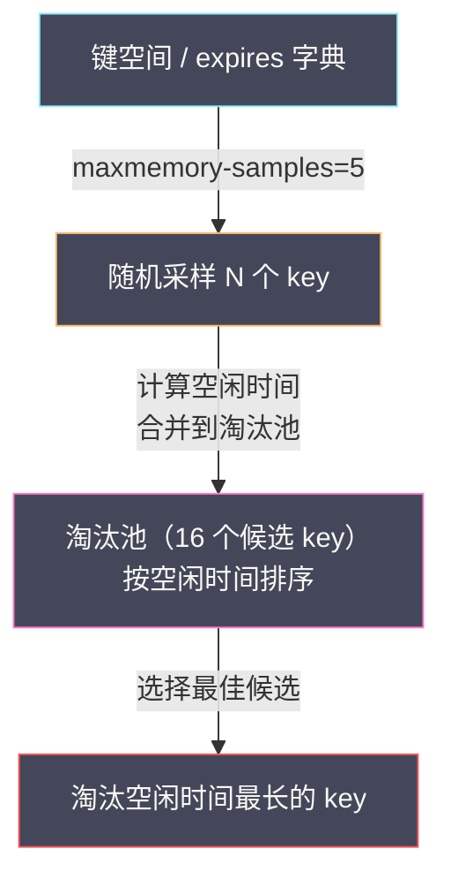

# 06 内存管理与过期淘汰策略

**摘要：**

内存是 Redis 最核心也最稀缺的资源——Redis 的所有数据都驻留在内存中，内存的使用效率直接决定了 Redis 能存储多少数据、能承受多大的并发。Redis 的内存管理涉及三个层面：**分配器层面**，Redis 选择 jemalloc 作为默认内存分配器，它通过 size class 分级、thread cache 和 arena 机制在减少碎片和提升并发性能之间取得平衡；**过期删除层面**，Redis 使用**惰性删除 + 定期采样删除**的组合策略清理已过期的 key——惰性删除在访问时检查并删除，定期删除在 serverCron 中随机采样一批 key 检查过期；**内存淘汰层面**，当内存达到 maxmemory 上限时，Redis 根据配置的淘汰策略（noeviction/allkeys-lru/volatile-lfu 等八种策略）主动驱逐 key 腾出空间。本文从 jemalloc 的内存分配原理出发，深入 Redis 过期删除的双重机制，最后详解八种淘汰策略的实现原理和选型建议。

---

## 第 1 章 jemalloc——Redis 的内存分配器

### 1.1 为什么不用 glibc malloc

C 语言的标准库提供了 `malloc`/`free` 进行内存分配——Linux 上默认由 glibc 的 ptmalloc2 实现。ptmalloc2 在通用场景下表现不错，但在 Redis 的特定负载模式下存在明显的短板：

**碎片问题**：Redis 的内存分配模式是"大量小对象 + 频繁的分配/释放"——[[02 SDS 与 Redis 对象系统|RedisObject]]（16 字节）、SDS（几十字节）、dictEntry（数十字节）不断地创建和销毁。ptmalloc2 在这种模式下容易产生**外部碎片**——已释放的小块内存散落在各处，无法合并成大块供新的分配使用。随着 Redis 运行时间增长，`used_memory_rss`（操作系统分配的物理内存）远大于 `used_memory`（Redis 数据实际使用的内存）——碎片率 `mem_fragmentation_ratio` 持续升高。

**多线程锁竞争**：ptmalloc2 使用 arena（分配区域）来减少多线程竞争——但 arena 的数量与 CPU 核数相关（默认 `8 × CPU 核数`），在 Redis 6.0 多线程 IO 模式下，多个 IO 线程同时分配/释放内存可能产生锁竞争。

**jemalloc**（je = Jason Evans）是 FreeBSD 的默认内存分配器，专门为高并发、低碎片场景设计。Redis 从 2.4 版本开始默认使用 jemalloc。

### 1.2 jemalloc 的核心机制

**Size Class 分级**：jemalloc 将内存分配请求按大小分为多个 **size class**——常见的有 8、16、32、48、64、80、96、112、128、160、192、224、256...字节。当请求分配 N 字节时，jemalloc 向上取整到最近的 size class——例如请求 20 字节分配 32 字节，请求 50 字节分配 64 字节。

**浪费 vs 碎片的权衡**：向上取整意味着每次分配可能有少量**内部碎片**（分配了 32 字节但只用了 20 字节）。但 size class 的粒度足够细——相邻 size class 之间的差距通常不超过 25%——内部碎片率可控。换来的好处是**极低的外部碎片**——相同 size class 的块大小一致，释放后可以完美地被同 size class 的新分配复用。

**Thread Cache（tcache）**：每个线程维护一个本地缓存——最近释放的小内存块缓存在 tcache 中，下次分配时先从 tcache 取，避免访问全局的 arena——零锁竞争。tcache 大小有限——超出后归还给 arena。

**Arena**：jemalloc 维护多个 arena——每个线程绑定到一个 arena。arena 内部按 size class 管理内存页。多个 arena 减少了线程间的竞争。

### 1.3 Redis 中的内存分配封装

Redis 在 `zmalloc.c` 中封装了内存分配——所有的 `zmalloc`/`zfree` 调用最终转发给 jemalloc，同时维护一个全局计数器 `used_memory` 追踪当前的内存使用量：

```c
void *zmalloc(size_t size) {
    void *ptr = malloc(size);  // 实际调用 jemalloc 的 malloc
    // 更新全局内存计数（原子操作）
    update_zmalloc_stat_alloc(zmalloc_size(ptr));
    return ptr;
}

void zfree(void *ptr) {
    update_zmalloc_stat_free(zmalloc_size(ptr));
    free(ptr);  // 实际调用 jemalloc 的 free
}
```

`zmalloc_size(ptr)` 调用 jemalloc 的 `je_malloc_usable_size`——返回该指针实际分配的字节数（可能大于请求的大小，因为 size class 向上取整）。`used_memory` 追踪的是 jemalloc 实际分配的总字节数——与 `INFO memory` 中的 `used_memory` 字段一致。

### 1.4 内存碎片率

```
mem_fragmentation_ratio = used_memory_rss / used_memory
```

- **> 1.0**：正常——RSS 大于 used_memory 是因为内存碎片和操作系统的开销
- **1.0 - 1.5**：健康范围
- **> 1.5**：碎片较高——考虑开启 Active Defragmentation
- **> 2.0**：碎片严重——大量内存被浪费
- **< 1.0**：危险——used_memory 超过了物理内存，操作系统将部分内存页交换到了 [[磁盘 Swap]]，性能急剧下降

### 1.5 Active Defragmentation

Redis 4.0 引入了**主动碎片整理（Active Defragmentation）**——利用 jemalloc 的 `je_malloc_stats_print` 和 `je_malloc_ctl` API 识别碎片化严重的内存页，将数据搬移到新的连续内存块中，然后释放旧的碎片化内存页。

```bash
# 开启主动碎片整理
activedefrag yes

# 碎片率超过 10% 时开始整理
active-defrag-threshold-lower 10

# 碎片率超过 100% 时使用最大 CPU 努力整理
active-defrag-threshold-upper 100

# 整理使用的最小/最大 CPU 百分比
active-defrag-cycle-min 1
active-defrag-cycle-max 25
```

碎片整理在主线程的 serverCron 中执行——每次只处理少量数据，避免长时间阻塞。整理的核心操作是"分配新内存 → 复制数据 → 更新指针 → 释放旧内存"——由于 Redis 是单线程，不需要担心并发问题。

---

## 第 2 章 过期删除机制

### 2.1 过期时间的存储

当用户执行 `SET key value EX 60`（60 秒过期）或 `EXPIRE key 60` 时，Redis 将过期时间存储在数据库的 **expires 字典**中——key 是 SDS 字符串（与键空间字典共享指针），value 是过期时间的**绝对时间戳**（毫秒级 Unix 时间戳）。

```c
// 设置过期时间
void setExpire(client *c, redisDb *db, robj *key, long long when) {
    dictEntry *kde = dictFind(db->dict, key->ptr);     // 在键空间中找到 key
    dictEntry *de = dictAddOrFind(db->expires, dictGetKey(kde)); // 在 expires 字典中设置
    dictSetSignedIntegerVal(de, when);                   // 存储绝对时间戳
}
```

**为什么存储绝对时间戳而非相对时间？** 相对时间（如"还剩 60 秒"）需要持续递减——每秒都要更新。绝对时间戳只在设置时计算一次（`当前时间 + TTL`），检查时只需要比较 `当前时间 > 过期时间戳` 即可——简单高效。

### 2.2 惰性删除（Lazy Expiration）

**惰性删除**是 Redis 过期删除的第一道防线——在每次访问 key 时检查它是否已过期：

```c
// 每次访问 key 时调用
int expireIfNeeded(redisDb *db, robj *key, int flags) {
    if (!keyIsExpired(db, key)) return 0;  // 未过期，正常返回

    // 如果是从节点——不主动删除（由主节点的 DEL 命令同步删除）
    if (server.masterhost != NULL) return 1;

    // 删除过期 key
    if (flags & EXPIRE_FORCE_DELETE_EXPIRED || server.lazyfree_lazy_expire) {
        dbAsyncDelete(db, key);   // 异步删除（lazyfree）
    } else {
        dbSyncDelete(db, key);    // 同步删除
    }

    // 发送 DEL 命令到从节点和 AOF
    propagateExpire(db, key, server.lazyfree_lazy_expire);
    return 1;
}
```

**惰性删除的优点**：对 CPU 友好——只在访问 key 时才检查，不浪费 CPU 在未被访问的 key 上。

**惰性删除的致命缺陷**：如果一个 key 过期后**再也没有被访问**，它会永远留在内存中——成为"僵尸 key"。如果有大量这样的 key（例如电商活动结束后，数百万活动相关的 key 过期但不再被访问），内存可能被大量僵尸 key 占据。

### 2.3 定期删除（Active Expiration）

**定期删除**弥补了惰性删除的缺陷——在 [[05 单线程模型与事件驱动架构|serverCron]] 中定期**随机采样**一批有过期时间的 key，删除其中已过期的。

核心算法（`activeExpireCycle`）：

```
每次 serverCron 触发时：
  对每个数据库（默认 16 个）：
    循环：
      1. 从 expires 字典中随机取 20 个 key
      2. 删除其中已过期的 key
      3. 如果过期 key 的比例 > 25%（即 20 个中有 5 个以上过期）
         → 继续循环（说明过期 key 密度高，需要更积极地清理）
      4. 如果过期 key 的比例 ≤ 25%
         → 停止当前数据库的清理（说明过期 key 密度低，不值得继续）
      5. 如果已用时间超过 CRON_DBS_PER_CALL 的时间限制
         → 停止所有清理（防止阻塞主线程太久）
```

**时间限制**：定期删除有严格的时间预算——默认每次 serverCron 的过期清理不超过 **25ms**（1000ms / hz=10 的 25%）。超时就停止，等下一次 serverCron 继续。这保证了过期清理不会长时间阻塞主线程。

**25% 阈值的设计**：如果随机采样 20 个 key 中过期的少于 25%（< 5 个），说明 expires 字典中过期 key 的密度很低——继续采样的边际收益递减，不如把 CPU 留给命令处理。如果过期的超过 25%——说明过期 key 密度高，需要继续采样清理。

> [!note] 两种删除策略的互补
> 惰性删除保证了被访问的过期 key 一定会被及时清理——**精确但被动**。定期删除保证了未被访问的过期 key 也会被逐步清理——**主动但有延迟**（最坏情况下一个过期 key 可能在过期后存活数秒到数十秒才被清理）。两者互补形成了完整的过期清理机制。

### 2.4 从节点的过期处理

从节点**不主动删除过期 key**——即使从节点检测到 key 已过期，也不会自己删除。过期 key 的删除由**主节点驱动**——主节点删除过期 key 后，通过复制机制向从节点发送 `DEL` 命令。

**为什么这样设计？** 保证主从数据一致性。如果从节点自主删除过期 key，可能出现主从之间的数据不一致——因为主从的时钟可能有差异，同一个 key 在主节点认为未过期、在从节点认为已过期。

**Redis 3.2 的改进**：从节点在读取已过期的 key 时，虽然不删除但会返回空（就好像 key 不存在）——避免客户端从从节点读到已过期的数据。

---

## 第 3 章 maxmemory 与淘汰策略

### 3.1 maxmemory 的作用

`maxmemory` 配置限制了 Redis 实例使用的最大内存——当 `used_memory` 达到 maxmemory 时，Redis 根据 `maxmemory-policy` 决定如何处理新的写入请求：

- 如果策略是 `noeviction`——拒绝写入，返回 OOM 错误
- 如果策略是其他淘汰策略——尝试驱逐一些 key 腾出空间，然后执行写入

```c
// 每次执行写命令前检查
int performEvictions(void) {
    while (mem_used > server.maxmemory) {
        // 根据策略选择要淘汰的 key
        if (server.maxmemory_policy == MAXMEMORY_NO_EVICTION) {
            return EVICT_FAIL;  // 拒绝写入
        }

        // 选择并删除一个 key
        bestkey = evictionPoolPopBestKey(...);
        if (bestkey) {
            dbAsyncDelete(db, bestkey);  // 异步删除
            // 传播 DEL 到 AOF 和从节点
        }
    }
    return EVICT_OK;
}
```

### 3.2 八种淘汰策略

Redis 提供了八种 maxmemory-policy：

| 策略 | 范围 | 算法 | 说明 |
| :--- | :--- | :--- | :--- |
| **noeviction** | — | — | 不淘汰，写入返回 OOM 错误 |
| **allkeys-lru** | 所有 key | 近似 LRU | 淘汰最近最少使用的 key |
| **volatile-lru** | 有过期时间的 key | 近似 LRU | 在有 TTL 的 key 中淘汰最久未使用的 |
| **allkeys-lfu** | 所有 key | 近似 LFU | 淘汰使用频率最低的 key |
| **volatile-lfu** | 有过期时间的 key | 近似 LFU | 在有 TTL 的 key 中淘汰频率最低的 |
| **allkeys-random** | 所有 key | 随机 | 随机淘汰任意 key |
| **volatile-random** | 有过期时间的 key | 随机 | 随机淘汰有 TTL 的 key |
| **volatile-ttl** | 有过期时间的 key | TTL 最短优先 | 淘汰即将过期的 key |

### 3.3 近似 LRU 的实现

经典的 LRU（Least Recently Used）算法需要维护一个全局的双向链表——每次访问 key 时将其移到链表头部，淘汰时删除链表尾部。这在 Redis 中不可行——维护一个覆盖所有 key 的双向链表会消耗大量内存（每个节点两个指针 = 16 字节），且每次访问都需要移动链表节点。

Redis 使用**近似 LRU**——不维护全局链表，而是利用 [[02 SDS 与 Redis 对象系统|RedisObject]] 的 `lru` 字段（24 位）记录每个对象最近一次被访问的时间戳（秒级，截断为 24 位，约 194 天循环一次）。

淘汰时，Redis 使用**随机采样 + 淘汰池**的方式选择淘汰对象：

```
1. 从目标字典（allkeys 或 volatile）中随机采样 N 个 key
   （N = maxmemory-samples，默认 5）
2. 计算每个 key 的空闲时间 = 当前时间 - key 的 lru 字段
3. 将这些 key 与淘汰池（eviction pool）中已有的候选 key 合并
4. 淘汰池保留空闲时间最长的 16 个 key
5. 从淘汰池中选择空闲时间最长的 key 进行淘汰
```

**淘汰池（Eviction Pool）** 的设计是 Redis 近似 LRU 的精华——它累积了多次采样的结果，相当于扩大了采样范围。antirez 的测试表明，`maxmemory-samples = 10` 时近似 LRU 的效果已经非常接近精确 LRU——淘汰的 key 几乎都是真正最久未使用的。



### 3.4 LFU 的实现

LFU（Least Frequently Used）淘汰**使用频率最低**的 key——相比 LRU 更适合区分"偶尔被访问一次的冷数据"和"持续被高频访问的热数据"。

LFU 复用了 RedisObject 的 `lru` 字段（24 位），但含义不同：

```
lru 字段（24 位）在 LFU 模式下的布局：
┌──────────────────┬──────────┐
│ ldt (16 位)      │ logc (8位)│
│ 最近衰减时间戳    │ 对数计数器 │
└──────────────────┴──────────┘
```

**logc（Logarithmic Counter，8 位）**：访问频率的对数计数——不是简单的访问次数计数器，而是使用**概率递增**：

```c
uint8_t LFULogIncr(uint8_t counter) {
    if (counter == 255) return 255;         // 已满，不再递增
    double r = (double)rand() / RAND_MAX;   // 0-1 的随机数
    double baseval = counter - LFU_INIT_VAL; // LFU_INIT_VAL = 5
    if (baseval < 0) baseval = 0;
    double p = 1.0 / (baseval * server.lfu_log_factor + 1); // 递增概率
    if (r < p) counter++;
    return counter;
}
```

**递增概率随计数器值指数下降**：counter = 5 时每次访问大约 100% 递增；counter = 10 时约 10%；counter = 20 时约 1%。这使得 8 位计数器（最大 255）能够有效区分访问次数从 1 次到数百万次的 key。

**ldt（16 位）**：最近一次**衰减**的时间戳（分钟级）。Redis 在每次访问 key 时检查 ldt 与当前时间的差值——如果超过了 `lfu-decay-time`（默认 1 分钟），counter 减 1。这实现了访问频率的**时间衰减**——长时间不被访问的 key，其 counter 会逐渐下降，最终被淘汰。

```c
unsigned long LFUDecrAndReturn(robj *o) {
    unsigned long ldt = o->lru >> 8;       // 取高 16 位
    unsigned long counter = o->lru & 255;  // 取低 8 位
    unsigned long num_periods = server.lfu_decay_time ?
        LFUTimeElapsed(ldt) / server.lfu_decay_time : 0;
    if (num_periods) counter = (num_periods > counter) ? 0 : counter - num_periods;
    return counter;
}
```

### 3.5 LRU vs LFU 的选型

| 场景 | 推荐策略 | 原因 |
| :--- | :--- | :--- |
| 通用缓存（大多数场景）| **allkeys-lru** | 简单有效，最近使用的数据大概率还会被使用 |
| 访问频率差异大的场景 | **allkeys-lfu** | 区分热数据和偶尔访问的数据——热数据不会被偶发的冷数据扫描挤出 |
| 有明确的过期时间设计 | **volatile-lru/lfu** | 只淘汰有 TTL 的 key，保护没有 TTL 的永久数据 |
| 所有 key 同等重要 | **allkeys-random** | 不需要维护 lru 字段，CPU 开销最低 |
| 缓存数据有明确的生命周期 | **volatile-ttl** | 优先淘汰即将过期的 key——与业务的 TTL 设计对齐 |
| 数据不允许丢失 | **noeviction** | 拒绝写入而非丢数据——适合用 Redis 做主存储的场景 |

> [!warning] volatile 策略的陷阱
> 如果配置了 volatile-lru/lfu/random/ttl 策略，但 Redis 中没有任何 key 设置了过期时间——那么 Redis 在内存满时**无法淘汰任何 key**，行为等同于 noeviction。这是一个常见的配置错误——用了 volatile 策略但忘记给 key 设置 TTL。

---

## 第 4 章 内存使用的精细分析

### 4.1 MEMORY USAGE 命令

```bash
MEMORY USAGE key [SAMPLES count]
```

返回一个 key 占用的**总内存字节数**——包括 key 本身（SDS）、value（RedisObject + 底层数据结构）、过期时间（如果有）、以及 jemalloc 的分配开销。

```bash
SET name "Alice"
MEMORY USAGE name
# (integer) 56
# 分解：RedisObject(16) + SDS embstr(3+5+1=9) = 25 → jemalloc 对齐到 32
#       + dictEntry(key SDS + 指针) ≈ 56 字节总计
```

### 4.2 MEMORY DOCTOR

```bash
MEMORY DOCTOR
```

Redis 内置的内存诊断工具——自动检查常见的内存问题并给出建议：

- 碎片率过高——建议开启 Active Defragmentation
- 存在大量已过期但未清理的 key——建议增大 hz
- peak memory 远大于当前 used_memory——可能之前有大量临时数据

### 4.3 MEMORY STATS

```bash
MEMORY STATS
```

返回详细的内存使用分布——包括各数据库的键空间开销、overhead（元数据开销）、dataset（纯数据占用）、Lua 缓存、客户端缓冲区等。

---

## 第 5 章 maxmemory 的设置原则

### 5.1 不要设满物理内存

maxmemory 不应该设置为物理内存的 100%——需要为以下开销预留空间：

| 预留项 | 预留量 | 原因 |
| :--- | :--- | :--- |
| **BGSAVE/AOF 重写的 fork COW** | 20-30% | fork 子进程后父进程写入数据触发 COW 页复制 |
| **内存碎片** | 10-20% | jemalloc 的内部碎片和外部碎片 |
| **客户端缓冲区** | 5-10% | 输入/输出缓冲区、Pub/Sub 缓冲区 |
| **操作系统** | 5% | 内核缓存、页表、进程元数据 |

**经验公式**：`maxmemory = 物理内存 × 60-70%`

### 5.2 单实例不要太大

建议单个 Redis 实例的 maxmemory 不超过 **10-15GB**——原因：

- **fork 耗时**：BGSAVE 的 fork 操作耗时与内存大小正相关——10GB 实例的 fork 约 100-200ms，30GB 可能达到秒级
- **RDB/AOF 体积**：持久化文件过大导致恢复时间过长
- **主从同步**：全量同步传输大 RDB 文件耗时久，期间从节点不可用

如果需要更大的存储容量，使用 [[10 Redis Cluster 分布式架构|Redis Cluster]] 分片——每个分片控制在 10GB 以内。

---

## 第 6 章 总结

本文深入分析了 Redis 的内存管理和过期淘汰机制：

- **jemalloc**：Redis 的默认内存分配器——size class 分级减少碎片、tcache 减少锁竞争、arena 隔离多线程。Redis 通过 zmalloc 封装追踪 used_memory
- **过期删除**：惰性删除（访问时检查）+ 定期采样删除（serverCron 中随机采样 20 个 key，过期比例 > 25% 继续）。从节点不主动删除——由主节点的 DEL 同步
- **内存碎片**：mem_fragmentation_ratio > 1.5 需关注；Active Defragmentation 在 serverCron 中渐进式整理碎片
- **淘汰策略**：八种策略覆盖 allkeys/volatile × lru/lfu/random/ttl + noeviction。近似 LRU 使用随机采样 + 淘汰池（maxmemory-samples=5 默认，10 接近精确 LRU）。LFU 使用 8 位对数计数器 + 时间衰减
- **maxmemory 设置**：物理内存的 60-70%；单实例 ≤ 10-15GB

下一篇 [[07 RDB 持久化——快照的 fork 与 COW 机制]] 将深入 Redis 的 RDB 持久化——fork 系统调用的工作原理、Copy-On-Write 的内存行为、以及 RDB 文件的格式和加载过程。

---

## 参考资料

1. Redis Source Code - evict.c：https://github.com/redis/redis/blob/unstable/src/evict.c
2. Redis Source Code - expire.c：https://github.com/redis/redis/blob/unstable/src/expire.c
3. Redis Source Code - zmalloc.c：https://github.com/redis/redis/blob/unstable/src/zmalloc.c
4. jemalloc Documentation：https://jemalloc.net/
5. antirez - Redis LFU 设计：http://antirez.com/news/109
6. 黄健宏 - 《Redis 设计与实现》（第二版）- 第 9 章 过期 / 第 24 章 淘汰策略
