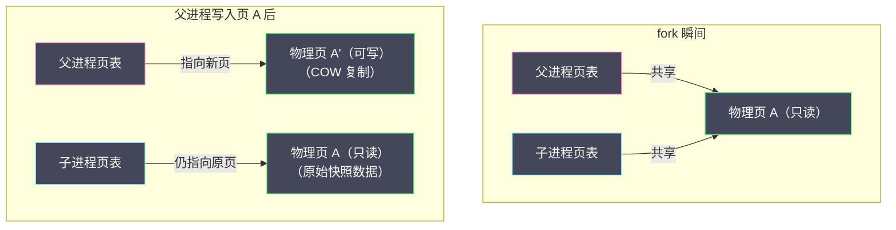
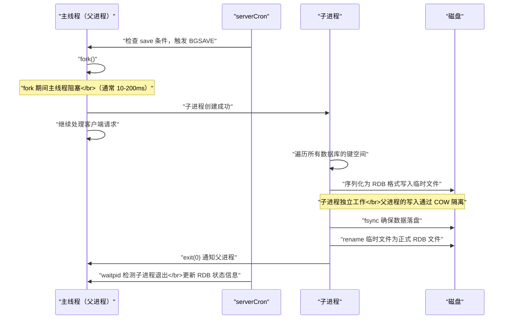

# 07 RDB 持久化——快照的 fork 与 COW 机制

**摘要：**

Redis 的数据全部驻留在内存中——一旦进程退出或服务器宕机，内存中的数据将全部丢失。**RDB（Redis Database）持久化**通过将内存中的全量数据序列化为一个紧凑的二进制文件（RDB 文件），实现了数据的磁盘快照。恢复时只需加载 RDB 文件即可将 Redis 还原到快照时刻的状态。RDB 持久化的核心技术挑战是：**如何在不阻塞主线程的情况下对一个持续变化的内存数据集做一致性快照？** Redis 的解决方案是 `fork()` 系统调用——创建一个子进程，子进程继承了父进程的完整内存映像（快照时刻的数据），子进程负责将数据写入磁盘，父进程继续处理客户端请求。操作系统的 **Copy-On-Write（COW）** 机制保证了 fork 瞬间不需要复制内存——父子进程共享同一份物理内存页，只有当父进程修改某个页时才复制该页。本文从 fork 的操作系统原理出发，深入 RDB 的触发机制、序列化过程、文件格式，以及 fork + COW 在生产环境中的内存行为和优化策略。

---

## 第 1 章 fork 系统调用

### 1.1 fork 的工作原理

`fork()` 是 Unix/Linux 的一个系统调用——它创建当前进程的一个**副本**（子进程）。子进程几乎完全复制了父进程的所有状态：

- **虚拟内存空间**：页表（虚拟地址到物理地址的映射）被复制
- **打开的文件描述符**：父子进程共享同一组打开的文件
- **程序计数器**：子进程从 fork 返回处继续执行
- **信号处理器**：继承父进程的信号处理设置

fork 之后，父进程和子进程拥有**独立的虚拟地址空间**，但在 fork 的瞬间它们的虚拟地址映射到**相同的物理内存页**——这就是 Copy-On-Write 的基础。

```c
pid_t pid = fork();
if (pid == 0) {
    // 子进程——执行 RDB 序列化
    rdbSave(filename);
    exit(0);
} else if (pid > 0) {
    // 父进程——继续处理客户端请求
    // pid 是子进程的进程 ID
} else {
    // fork 失败
}
```

### 1.2 Copy-On-Write（COW）

如果 fork 真的要复制父进程的所有内存——一个 10GB 的 Redis 实例做 fork 就需要额外 10GB 内存和数秒的复制时间——这显然不可接受。

**COW（Copy-On-Write，写时复制）** 是操作系统的内存优化机制——fork 时不复制物理内存页，而是让父子进程的页表指向**同一组物理页**，并将这些页标记为**只读**。当任何一方尝试**写入**某一页时，CPU 触发**缺页中断（Page Fault）**，操作系统的中断处理程序：

1. 分配一个新的物理页
2. 将原页的内容复制到新页
3. 更新写入方的页表指向新页
4. 将新页标记为可读写
5. 重新执行写入操作

这样，只有被修改的页才会被复制——未被修改的页始终共享。



**对 Redis 的意义**：fork 后子进程拥有了父进程的完整内存快照——但没有任何物理内存复制。子进程可以安全地遍历所有数据并序列化到磁盘——因为即使父进程在修改数据，子进程看到的仍然是 fork 时刻的数据（COW 保证了子进程的页不会被修改）。

### 1.3 fork 的耗时

虽然 COW 避免了物理内存复制，但 fork 仍然需要**复制页表**——页表记录了所有虚拟页到物理页的映射。一个 10GB 的进程（假设 4KB 页大小）有约 260 万个页表项——复制这些页表项需要一定的时间和 CPU。

**实测数据**（Linux，现代硬件）：

| Redis 实例大小 | fork 耗时 |
| :--- | :--- |
| 1GB | ~10ms |
| 5GB | ~50ms |
| 10GB | ~100-200ms |
| 20GB | ~200-500ms |

fork 的耗时是线性的——与进程的虚拟内存大小（页表大小）成正比。在 fork 期间，**Redis 的主线程完全阻塞**——无法处理任何客户端请求。这就是为什么 Redis 建议单实例 maxmemory 不超过 10-15GB——更大的实例 fork 耗时更长，延迟毛刺更严重。

> [!warning] Transparent Huge Pages 对 fork 的影响
> Linux 的 **THP（Transparent Huge Pages）** 使用 2MB 的大页替代 4KB 的小页——减少页表项数量和 TLB miss。但在 Redis 的 BGSAVE 场景下，THP 是有害的：COW 的粒度变成了 2MB——即使父进程只修改了一个字节，也需要复制整个 2MB 的页。这会导致 BGSAVE 期间的内存使用量暴涨。Redis 官方强烈建议关闭 THP：
> ```bash
> echo never > /sys/kernel/mm/transparent_hugepage/enabled
> ```

---

## 第 2 章 BGSAVE 的完整流程

### 2.1 触发方式

RDB 持久化有三种触发方式：

**手动触发**：
- `SAVE`——在主线程中同步执行 RDB 序列化——**阻塞所有客户端请求**直到完成。仅在维护窗口或调试时使用。
- `BGSAVE`——fork 子进程在后台执行 RDB 序列化——主线程不阻塞（除了 fork 瞬间）。

**自动触发**（serverCron 检查）：
- `save` 配置项：`save 900 1`（900 秒内有 1 次修改）、`save 300 10`（300 秒内有 10 次修改）、`save 60 10000`（60 秒内有 10000 次修改）。满足任一条件时自动执行 BGSAVE。

**其他触发场景**：
- 主从复制的全量同步——主节点自动执行 BGSAVE 生成 RDB 发送给从节点
- `SHUTDOWN` 命令——如果没有开启 AOF，执行 RDB 保存后再退出
- `DEBUG RELOAD`——重载 RDB 文件

### 2.2 BGSAVE 的执行步骤



**关键细节**：

1. **fork 前检查**：如果已有 BGSAVE 子进程在运行——拒绝新的 BGSAVE 请求
2. **临时文件**：子进程先写入 `temp-<pid>.rdb` 临时文件——写入完成后 `rename` 为正式的 `dump.rdb`。这保证了 RDB 文件的原子性——如果子进程中途崩溃，不会损坏已有的 RDB 文件
3. **exit 后清理**：父进程在 serverCron 中通过 `waitpid` 非阻塞地检测子进程是否退出——退出后更新 `server.rdb_last_save_time`、`server.rdb_last_bgsave_status` 等统计信息

### 2.3 COW 期间的内存行为

fork 后父进程继续处理写命令——每次写命令修改的数据页会触发 COW 复制。BGSAVE 期间的额外内存开销取决于**写入量**：

| 写入比例（BGSAVE 期间被修改的页占比）| 额外内存 |
| :--- | :--- |
| 0%（只读负载）| 几乎为 0 |
| 10% | ~10% × 数据大小 |
| 50% | ~50% × 数据大小 |
| 100%（全量写入）| ~100% × 数据大小（极端情况）|

**生产建议**：在写入负载较重的场景下，BGSAVE 期间的内存峰值可能远超 maxmemory——需要确保物理内存有足够的余量。`INFO persistence` 的 `rdb_last_cow_size` 字段记录了上次 BGSAVE 期间的 COW 内存使用量——可以作为容量规划的参考。

---

## 第 3 章 RDB 文件格式

### 3.1 整体结构

RDB 文件是一个紧凑的二进制文件——不是人类可读的文本格式：

```
┌──────────┬─────────┬───────────┬──────┬──────┬─────┬──────────┬──────────┐
│ REDIS    │ RDB版本 │ 辅助字段  │ DB 0 │ DB 1 │ ... │ EOF      │ CRC64    │
│ (5字节)  │ (4字节) │ (键值对)  │      │      │     │ (1字节)  │ (8字节)  │
└──────────┴─────────┴───────────┴──────┴──────┴─────┴──────────┴──────────┘
```

**Magic Number**：文件以 "REDIS" 5 个 ASCII 字符开头——用于识别文件类型。

**RDB 版本号**：4 个 ASCII 数字——如 "0011" 表示 RDB 版本 11。不同版本的 RDB 格式有差异——新版本 Redis 可以加载旧版本的 RDB 文件，反之不一定。

**辅助字段（Auxiliary Fields）**：以 `FA` 标记开头的键值对——存储 Redis 版本、创建时间、used_memory 等元信息。

**数据库数据**：以 `FE` + 数据库编号标记开头——后跟该数据库的所有键值对。每个键值对包含：
- 过期时间（如果有）：`FC` + 毫秒时间戳 或 `FD` + 秒时间戳
- 值类型标记：指示底层编码（string/list/set/zset/hash 及其各种编码）
- key（长度前缀的字符串）
- value（根据类型标记以特定格式序列化）

**EOF 标记**：`FF` 字节——标志数据结束。

**CRC64 校验和**：文件末尾 8 字节的 CRC64 校验和——加载 RDB 时验证文件完整性。

### 3.2 值的编码优化

RDB 在序列化值时会进行多种压缩优化：

**整数编码**：小整数（0-255 用 1 字节，256-65535 用 2 字节，更大的用 4 字节）——而非存储字符串形式的数字。

**LZF 压缩**：长度超过 20 字节的字符串会尝试 LZF 压缩——如果压缩后更小则存储压缩版本。

**长度前缀编码**：使用变长编码表示长度——小长度用 1 字节，大长度用 2 或 5 字节——减少元数据开销。

**紧凑编码保留**：如果数据的底层编码已经是紧凑格式（如 listpack、intset），RDB 直接将其二进制内容写入文件——加载时直接恢复为原始的紧凑编码，不需要逐元素重建。

### 3.3 RDB 的加载过程

Redis 启动时，如果存在 RDB 文件（且未开启 AOF），会自动加载 RDB 文件恢复数据：

1. 读取 Magic Number 和版本号——验证文件有效性
2. 读取辅助字段——获取元信息
3. 逐个数据库读取键值对——对每个键值对：
   - 读取过期时间（如果有）——如果已过期则跳过
   - 读取值类型和编码
   - 反序列化 key 和 value——创建 RedisObject 并插入键空间字典
4. 验证 CRC64 校验和——不匹配则报错
5. 加载完成后的后处理——如需要则触发 [[03 字典与渐进式 Rehash|Rehash]]

**加载速度**：RDB 加载是 Redis 启动最耗时的阶段——10GB 的 RDB 文件在 SSD 上的加载时间约 20-60 秒。加载期间 Redis 不响应客户端请求。

---

## 第 4 章 RDB 的优缺点

### 4.1 优点

- **恢复速度快**：RDB 是紧凑的二进制格式——加载比 AOF 的逐条命令重放快得多
- **文件紧凑**：压缩后的 RDB 文件通常只有内存数据的 30-60%——适合备份和传输
- **对性能影响小**：BGSAVE 由子进程完成——父进程只在 fork 瞬间短暂阻塞
- **适合灾备**：定时生成 RDB 快照 + 异地备份——可以恢复到任意快照时间点

### 4.2 缺点

- **数据丢失**：两次快照之间的数据可能丢失——如果 save 配置为 `save 900 1`，最多可能丢失 15 分钟的数据
- **fork 阻塞**：大实例的 fork 耗时可能达到数百毫秒——对延迟敏感的服务是风险
- **COW 内存开销**：写入密集时 BGSAVE 的 COW 可能消耗大量额外内存
- **不适合实时持久化**：RDB 是全量快照——无法做到秒级 RPO（Recovery Point Objective）

---

## 第 5 章 生产优化

### 5.1 save 配置的调优

默认的 save 配置：
```
save 900 1      # 15 分钟内至少 1 次写入
save 300 10     # 5 分钟内至少 10 次写入
save 60 10000   # 1 分钟内至少 10000 次写入
```

**高写入场景**：缩短触发间隔——`save 60 1000`——更频繁地生成快照，减少数据丢失窗口。但更频繁的 BGSAVE 意味着更多的 fork 和 COW 开销。

**纯缓存场景**：如果 Redis 只作为缓存（数据可以从后端重建），可以关闭 RDB 持久化——`save ""`——减少 fork 对性能的影响。

### 5.2 overcommit_memory

Linux 的 `overcommit_memory` 参数影响 fork 的行为：

| 值 | 行为 | 对 Redis 的影响 |
| :--- | :--- | :--- |
| **0**（默认）| 启发式判断是否允许分配 | 可能因为"内存不足"拒绝 fork——即使 COW 实际不需要那么多内存 |
| **1** | 总是允许分配 | **Redis 推荐**——fork 不会因为虚拟内存"看起来不够"而失败 |
| **2** | 只允许分配不超过物理内存 + swap 的虚拟内存 | 最保守——大实例可能无法 fork |

```bash
echo 1 > /proc/sys/vm/overcommit_memory
```

> [!warning] overcommit_memory = 0 的陷阱
> 当 overcommit_memory = 0 时，fork 会检查子进程的虚拟内存需求是否超过可用内存——子进程继承了父进程的完整虚拟地址空间。一个 10GB 的 Redis 实例 fork 后，系统看到需要额外 10GB 虚拟内存——即使 COW 实际只会复制几百 MB。如果系统可用内存不足 10GB，fork 被拒绝，BGSAVE 失败。设置为 1 可以避免这个问题——让操作系统信任 COW 不会真正使用那么多内存。

### 5.3 BGSAVE 期间避免 Rehash

[[03 字典与渐进式 Rehash|渐进式 Rehash]] 在 BGSAVE 期间会被限制——Redis 将字典扩容的负载因子阈值从 1 提高到 5。原因是 Rehash 涉及大量的内存写入（移动节点、修改指针）——这些写入会触发 COW 页复制，增加 BGSAVE 的内存开销。

但 Rehash 的**定时推进**（serverCron 中的 `dictRehashMilliseconds`）不受影响——因为这些写入已经是渐进式的，每次只迁移少量数据，COW 的增量可以接受。

---

## 第 6 章 RDB 相关命令与监控

### 6.1 关键命令

```bash
BGSAVE                    # 后台执行 RDB 快照
SAVE                      # 前台同步执行 RDB 快照（阻塞）
LASTSAVE                  # 上次成功 RDB 的 Unix 时间戳
DEBUG RELOAD              # 保存 RDB 后重新加载
CONFIG SET save ""        # 关闭自动 RDB
CONFIG SET save "60 1000" # 修改 save 触发条件
```

### 6.2 关键监控指标

```bash
INFO persistence
# rdb_last_save_time:1709424000    上次 RDB 成功的时间戳
# rdb_changes_since_last_save:5000 自上次 RDB 以来的变更数
# rdb_bgsave_in_progress:0         是否正在 BGSAVE
# rdb_last_bgsave_status:ok        上次 BGSAVE 的结果
# rdb_last_bgsave_time_sec:2       上次 BGSAVE 耗时（秒）
# rdb_last_cow_size:5242880        上次 BGSAVE 的 COW 内存使用（5MB）
# latest_fork_usec:150000          最近一次 fork 的耗时（150ms）
```

**告警建议**：
- `rdb_last_bgsave_status != ok`——BGSAVE 失败，需要排查（磁盘空间？fork 失败？）
- `latest_fork_usec > 500000`（500ms）——fork 耗时过长，考虑缩小实例
- `rdb_last_cow_size` 接近可用内存——BGSAVE 期间可能 OOM

---

## 第 7 章 总结

本文深入分析了 Redis RDB 持久化的核心机制：

- **fork 系统调用**：创建子进程继承父进程的完整内存映像——子进程负责序列化，父进程继续处理请求。fork 耗时与内存大小线性相关（10GB ~100-200ms），期间主线程阻塞
- **Copy-On-Write**：fork 不复制物理内存——父子共享同一组物理页（标记只读）；写入时触发缺页中断复制单个页。只有被修改的页才会被复制——写入少时额外内存开销极低
- **BGSAVE 流程**：fork → 子进程遍历键空间序列化为 RDB → 写入临时文件 → rename 为正式文件 → exit 通知父进程
- **RDB 文件格式**：Magic + 版本 + 辅助字段 + 数据库数据（类型+key+value）+ EOF + CRC64。整数编码、LZF 压缩、紧凑编码直接保存等优化
- **生产优化**：overcommit_memory = 1、关闭 THP、单实例 ≤ 10-15GB、BGSAVE 期间抑制 Rehash 扩容

下一篇 [[08 AOF 持久化与混合持久化]] 将深入 AOF 的命令追加机制、三种 fsync 策略、AOF 重写的实现，以及 Redis 4.0 混合持久化如何兼顾 RDB 的恢复速度和 AOF 的数据安全性。

---

## 参考资料

1. Redis Source Code - rdb.c：https://github.com/redis/redis/blob/unstable/src/rdb.c
2. fork(2) - Linux manual page：https://man7.org/linux/man-pages/man2/fork.2.html
3. Redis Documentation - Persistence：https://redis.io/docs/management/persistence/
4. Linux Documentation - overcommit：https://www.kernel.org/doc/Documentation/vm/overcommit-accounting
5. 黄健宏 - 《Redis 设计与实现》（第二版）- 第 10 章 RDB 持久化

---

> [!note] 思考题
> 1. `down-after-milliseconds` 设为 5 秒（快速检测）还是 30 秒（避免误判）取决于网络质量。在一个跨可用区部署（AZ 间延迟 1-2ms，偶尔抖动到 100ms）的环境中，这个值应该设为多少？如果 Sentinel 自身也部署在不同 AZ——Sentinel 之间的通信延迟如何影响故障判定？
> 2. Sentinel 选举新主节点时优先选择复制偏移量最大的从节点（数据最新）。但在跨机房场景中，你可能希望新主节点在特定机房。`replica-priority` 为 0 的从节点永远不会被选为主节点——你如何利用这个特性实现'指定机房优先'的故障转移策略？
> 3. Spring Boot 的 `spring.redis.sentinel.master` 配置自动发现主节点。客户端库通过订阅 Sentinel 的 `+switch-master` 频道感知主从切换。但从发现切换到重新连接有延迟——在这个窗口内的请求可能失败。你如何在应用层处理这个瞬间的连接中断？
