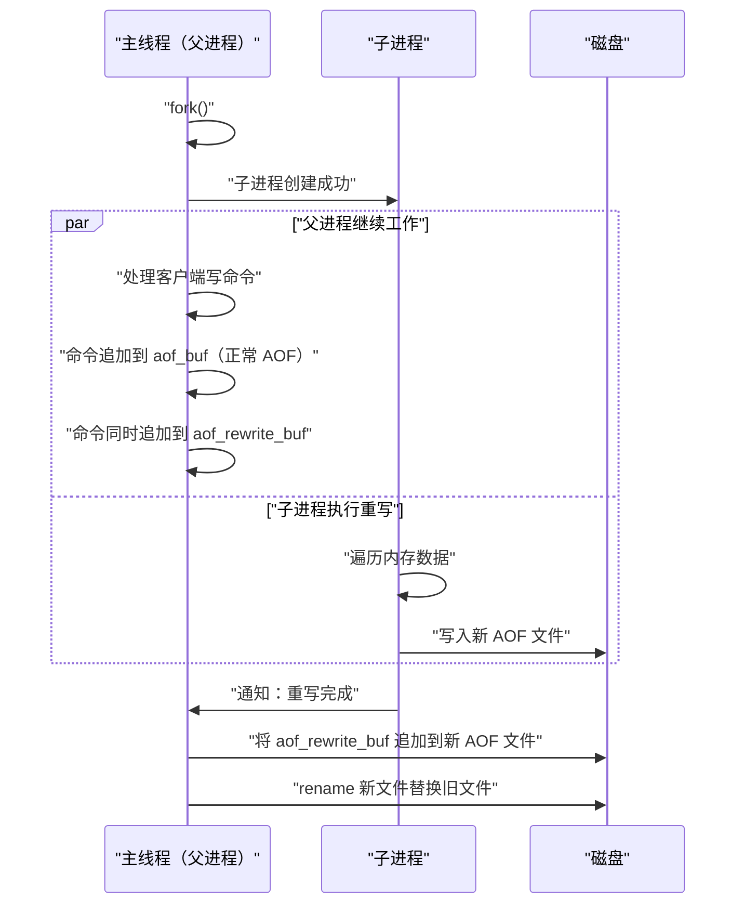

# 08 AOF 持久化与混合持久化

**摘要：**

[[07 RDB 持久化——快照的 fork 与 COW 机制|RDB 持久化]]通过全量快照实现数据恢复——但两次快照之间的数据变更会丢失。**AOF（Append Only File）持久化**采用完全不同的策略——它记录的不是数据本身，而是**产生数据的命令**。每次写命令执行成功后，Redis 将该命令追加到 AOF 缓冲区，再根据 fsync 策略将缓冲区内容写入磁盘文件。恢复时，Redis 按顺序重放 AOF 文件中的所有命令——就像重新执行了一遍所有历史操作，数据自然恢复到最新状态。AOF 的数据安全性远高于 RDB——`appendfsync everysec` 最多丢失 1 秒数据，`appendfsync always` 理论上不丢数据。但 AOF 文件会持续膨胀（同一个 key 被修改 1000 次就会有 1000 条记录），因此需要 **AOF 重写**机制压缩文件体积。Redis 4.0 引入了**混合持久化**——AOF 重写时文件的前半部分是 RDB 格式（全量数据），后半部分是 AOF 格式（增量命令），兼顾了 RDB 的恢复速度和 AOF 的数据安全性。

---

## 第 1 章 AOF 的核心原理

### 1.1 命令追加（Append）

AOF 的基本思想极其简单——**记录所有改变数据的命令**。每次写命令（SET/DEL/LPUSH/ZADD 等）执行成功后，Redis 调用 `propagate()` 将命令以 RESP 协议格式追加到 `server.aof_buf`（AOF 缓冲区）：

```
# AOF 文件内容示例
*3\r\n$3\r\nSET\r\n$4\r\nname\r\n$5\r\nAlice\r\n
*3\r\n$3\r\nSET\r\n$3\r\nage\r\n$2\r\n30\r\n
*2\r\n$6\r\nINCRBY\r\n$3\r\nage\r\n$1\r\n1\r\n
*2\r\n$3\r\nDEL\r\n$4\r\nname\r\n
```

这就是 AOF 文件的全部内容——一连串的 RESP 格式命令。任何人用文本编辑器打开 AOF 文件都能看懂每条命令在做什么——这是 AOF 相比 RDB（二进制格式）的一个优势：**可读性和可审计性**。

**为什么记录命令而非数据？** 因为命令是增量的——每次只追加一条命令（几十到几百字节），而数据是全量的——每次写入都要序列化整个数据集。对于写入密集的场景，追加命令的 IO 开销远小于全量快照。

### 1.2 写入的两个阶段

AOF 的写入分为两个阶段——**write** 和 **fsync**——理解这两个阶段对于理解 AOF 的数据安全性至关重要。

**write（写入内核缓冲区）**：调用 `write()` 系统调用将 `aof_buf` 的内容写入 AOF 文件的文件描述符。但 `write()` 只是将数据从用户空间复制到内核的**页缓存（[[Page Cache]]）**——数据还没有到达磁盘。如果此时操作系统崩溃（断电、内核 panic），页缓存中尚未刷盘的数据会丢失。

**fsync（同步到磁盘）**：调用 `fsync()` 系统调用强制将文件描述符关联的所有脏页从页缓存刷写到物理磁盘——只有 fsync 完成后，数据才真正安全。但 fsync 是一个**昂贵的操作**——SSD 上约 0.1-1ms，HDD 上可能数毫秒到数十毫秒。


### 1.3 三种 fsync 策略

Redis 通过 `appendfsync` 配置控制 fsync 的频率——在性能和数据安全之间做出权衡：

| 策略 | 行为 | 数据安全 | 性能影响 |
| :--- | :--- | :--- | :--- |
| **always** | 每条写命令后都 fsync | 最安全——理论上不丢数据 | 最慢——每条命令等 fsync |
| **everysec**（默认）| 每秒 fsync 一次（BIO 线程执行）| 最多丢 1 秒数据 | 折中——对吞吐量几乎无影响 |
| **no** | 不主动 fsync——由 OS 决定刷盘时机 | 可能丢数分钟数据 | 最快 |

**everysec 的实现细节**：主线程在 `beforesleep` 中调用 `write()` 将 aof_buf 写入 Page Cache——这个操作很快（微秒级）。fsync 由 BIO（Background IO）线程每秒执行一次——不阻塞主线程。但如果 BIO 线程发现上一次 fsync 还没完成（磁盘 IO 繁忙），它会**延迟当前的 fsync**——这意味着 everysec 模式下实际的 fsync 间隔可能超过 1 秒。

> [!warning] always 模式的性能陷阱
> `appendfsync always` 并不是在每条命令后同步调用 fsync——Redis 的实际行为是在 `beforesleep` 中先 write 再 fsync。如果一次事件循环迭代处理了 100 条命令，这 100 条命令的 AOF 数据会在一次 write + 一次 fsync 中批量写入——而非 100 次 fsync。但即便如此，always 模式的吞吐量仍然受限于磁盘的 fsync 速度——SSD 上约每秒 1000-5000 次 fsync，HDD 上约 100-200 次。

### 1.4 write 与 fsync 的阻塞风险

在 everysec 模式下，主线程只执行 `write()`——理论上不应该阻塞。但有一个隐藏的风险：如果 Page Cache 已满（内核的写缓冲区被大量脏页占据），`write()` 会阻塞等待 Page Cache 释放空间——此时主线程被阻塞。

Redis 的应对策略：在执行 `write()` 前检查上一次 fsync 的状态——如果 BIO 线程正在执行 fsync（说明磁盘 IO 繁忙），Redis 会**跳过当前的 write**，将数据继续积累在 aof_buf 中——等 fsync 完成后再 write。这避免了 write 因为 Page Cache 满而阻塞主线程。

---

## 第 2 章 AOF 重写

### 2.1 为什么需要重写

AOF 文件记录了所有历史命令——一个 key 被修改 1000 次就会有 1000 条记录。但恢复数据时只需要最后一次修改的结果——前 999 条命令是冗余的。随着时间推移，AOF 文件会持续膨胀：

```
SET counter 1       # 第 1 次
INCR counter        # 第 2 次
INCR counter        # 第 3 次
...                 # 重复 997 次
INCR counter        # 第 1000 次
```

这 1000 条命令的等效结果只是 `SET counter 1000`——一条命令就够了。

**AOF 重写**的目标：生成一个**等效但更紧凑**的新 AOF 文件——对于每个 key，只记录它当前的最终状态（一条 SET/RPUSH/HSET 等命令），而非所有历史变更。

### 2.2 重写的触发条件

**手动触发**：`BGREWRITEAOF` 命令。

**自动触发**（serverCron 检查）：

```
auto-aof-rewrite-percentage 100    # AOF 文件大小比上次重写后增长 100% 时触发
auto-aof-rewrite-min-size 64mb     # AOF 文件至少达到 64MB 才触发
```

两个条件同时满足时自动触发 BGREWRITEAOF。

### 2.3 重写的实现——不是重写旧文件

AOF 重写**不是读取旧 AOF 文件然后优化**——而是**遍历当前内存中的数据**，为每个 key 生成一条等效的写入命令。这种"基于数据状态而非历史命令"的方式可以将任意长的命令历史压缩为最小的等效命令集。

重写由 `fork()` 的子进程完成——与 [[07 RDB 持久化——快照的 fork 与 COW 机制|BGSAVE]] 类似，子进程继承父进程的内存快照，在后台完成序列化，不阻塞主线程。

### 2.4 重写期间的增量数据

重写子进程 fork 后，父进程继续处理写命令——这些新命令修改了数据，但子进程的快照中没有这些数据。如果不处理这个差异，重写后的 AOF 文件会丢失 fork 之后的数据。

Redis 的解决方案——**AOF 重写缓冲区（aof_rewrite_buf）**：



**完整流程**：

1. 父进程 fork 子进程
2. 子进程遍历内存数据，生成新的 AOF 文件（基于 fork 时刻的快照）
3. 父进程在 fork 后，每执行一条写命令，**同时**追加到两个地方：
   - `aof_buf`——正常的 AOF 缓冲区（保证当前 AOF 文件的持续更新）
   - `aof_rewrite_buf`——重写缓冲区（记录 fork 后的增量命令）
4. 子进程完成重写后通知父进程（通过管道）
5. 父进程将 `aof_rewrite_buf` 的内容追加到子进程生成的新 AOF 文件末尾——**这一步在主线程中执行**
6. 用新 AOF 文件 `rename` 替换旧 AOF 文件

> [!warning] 步骤 5 的阻塞风险
> 步骤 5 中父进程将 aof_rewrite_buf 写入新文件是在主线程中完成的——如果 fork 后到重写完成之间积累了大量增量命令，这个写入可能耗时较长（数十到数百毫秒），阻塞主线程。Redis 7.0 通过**管道（pipe）机制**优化了这个问题——在子进程重写期间，父进程通过管道持续地将增量命令发送给子进程，子进程在写完主体数据后直接追加增量命令。这样步骤 5 中父进程只需要追加最后一小段增量——大大减少了阻塞时间。

### 2.5 大 key 的拆分写入

重写时，如果一个 key 包含大量元素（如一个有 10 万个成员的 Set），Redis 不会用一条 `SADD key member1 member2 ... member100000` 命令——因为这条命令太长，恢复时一次性执行可能导致阻塞。

Redis 会将大 key 的元素拆分为多条命令——每条命令最多包含 64 个元素：

```
SADD myset member1 member2 ... member64
SADD myset member65 member66 ... member128
...
```

---

## 第 3 章 混合持久化

### 3.1 RDB 和 AOF 的困境

| 维度 | RDB | AOF |
| :--- | :--- | :--- |
| **数据安全** | 可能丢失数分钟数据 | 最多丢 1 秒数据 |
| **恢复速度** | 快（直接加载二进制）| 慢（逐条重放命令）|
| **文件大小** | 小（紧凑二进制 + 压缩）| 大（文本命令）|
| **写入开销** | 低（只在 BGSAVE 时）| 高（每条命令都追加）|

用户面临两难选择——用 RDB 就要接受数据丢失的风险，用 AOF 就要接受恢复速度慢的问题。

### 3.2 混合持久化的方案

Redis 4.0 引入了**混合持久化（Hybrid Persistence）**——在 AOF 重写时，不再生成纯 AOF 格式的文件，而是：

1. **前半部分**：RDB 格式——将 fork 时刻的全量数据以 RDB 二进制格式写入
2. **后半部分**：AOF 格式——fork 后的增量命令以 RESP 文本格式追加

```
混合 AOF 文件结构：
┌──────────────────────────┬─────────────────────────────┐
│     RDB 格式（全量数据）    │    AOF 格式（增量命令）      │
│  （fork 时刻的快照）       │  （fork 后到重写完成的命令）   │
└──────────────────────────┴─────────────────────────────┘
```

**恢复时**：先加载 RDB 部分（快速恢复大部分数据），再重放 AOF 部分（追回增量数据）——兼顾了 RDB 的恢复速度和 AOF 的数据完整性。

```bash
# 开启混合持久化（Redis 4.0+ 默认开启）
aof-use-rdb-preamble yes
```

### 3.3 Redis 7.0 的 Multi-Part AOF

Redis 7.0 对 AOF 机制进行了重大重构——引入了 **Multi-Part AOF**：

**旧方案**（7.0 之前）：只有一个 AOF 文件，重写时用新文件 rename 替换旧文件——rename 期间如果崩溃可能导致 AOF 文件损坏。

**新方案**（7.0+）：AOF 被拆分为多个部分文件，由一个 `manifest` 文件管理：

```
appendonlydir/
├── appendonly.aof.1.base.rdb       # 基线文件（RDB 格式，来自最近一次重写）
├── appendonly.aof.1.incr.aof       # 增量文件 1（AOF 格式）
├── appendonly.aof.2.incr.aof       # 增量文件 2（AOF 格式，重写后的新增量）
└── appendonly.aof.manifest         # 清单文件——记录所有部分文件的顺序
```

**优势**：
- **原子性更好**：重写完成后只需更新 manifest 文件——不需要 rename 大文件
- **恢复更安全**：即使重写过程中崩溃，旧的 base + incr 文件仍然完整可用
- **增量文件可以单独管理**：定期清理过期的增量文件

---

## 第 4 章 AOF 文件修复

### 4.1 AOF 文件损坏的场景

AOF 文件可能在以下场景下损坏：

- **写入中途断电**：最后一条命令只写了一半——文件尾部是不完整的 RESP 数据
- **磁盘写满**：写入 AOF 时磁盘空间不足——文件被截断
- **文件系统错误**：极端情况下文件系统的 bug 导致数据损坏

### 4.2 redis-check-aof 工具

```bash
# 检查 AOF 文件
redis-check-aof appendonly.aof

# 修复 AOF 文件（截断损坏的尾部）
redis-check-aof --fix appendonly.aof

# Redis 7.0+ 的 Multi-Part AOF
redis-check-aof --fix appendonlydir/appendonly.aof.manifest
```

`--fix` 选项会截断 AOF 文件中最后一条不完整的命令——这意味着会丢失这条命令（以及之后可能存在的数据），但保证了文件的可加载性。

### 4.3 aof-load-truncated 配置

```bash
aof-load-truncated yes    # 默认。加载 AOF 时如果尾部不完整，截断后继续加载
aof-load-truncated no     # 加载 AOF 时如果尾部不完整，拒绝启动
```

默认开启——因为断电导致的尾部截断是常见场景，自动截断后继续启动比拒绝启动更实用。

---

## 第 5 章 AOF 的性能分析

### 5.1 写入放大

AOF 的一个隐含成本是**写入放大**——同一条命令可能被写入多次：

1. `write()` 到 AOF 文件（写入 Page Cache）
2. `fsync()` 刷到磁盘
3. AOF 重写时，子进程写入新 AOF 文件
4. 父进程将增量缓冲区写入新 AOF 文件

在 SSD 上，写入放大会加速磁盘寿命消耗——需要关注 SSD 的 DWPD（Drive Writes Per Day）指标。

### 5.2 各策略的吞吐量对比

| 策略 | 相对吞吐量 | 备注 |
| :--- | :--- | :--- |
| 无持久化 | 100% | 基准 |
| RDB only | ~98% | 只在 BGSAVE 时有少量 fork 开销 |
| AOF no | ~95% | write 系统调用的开销 |
| AOF everysec | ~90-95% | write + 后台 fsync |
| AOF always | ~50-70% | 每次事件循环都 fsync |

**推荐配置**：`appendfsync everysec` + `aof-use-rdb-preamble yes`——性能损失可控（5-10%），数据最多丢 1 秒，恢复速度接近纯 RDB。

---

## 第 6 章 持久化方案选型

### 6.1 四种组合

| 方案 | 数据安全 | 恢复速度 | 磁盘开销 | 适用场景 |
| :--- | :--- | :--- | :--- | :--- |
| **无持久化** | 无 | 无数据 | 无 | 纯缓存（数据可从后端重建）|
| **仅 RDB** | 低（可能丢数分钟）| 快 | 低 | 可容忍一定数据丢失的缓存 |
| **仅 AOF** | 高（最多丢 1 秒）| 慢 | 高 | 数据安全要求高但可接受慢恢复 |
| **RDB + AOF（混合）** | 高 | 快 | 中 | **生产推荐** |

### 6.2 生产推荐配置

```bash
# 开启 AOF
appendonly yes
appendfsync everysec

# 开启混合持久化
aof-use-rdb-preamble yes

# AOF 重写阈值
auto-aof-rewrite-percentage 100
auto-aof-rewrite-min-size 64mb

# 同时保留 RDB 作为备份
save 900 1
save 300 10
save 60 10000

# 定期将 RDB 文件异地备份
# （Cron 脚本 rsync/scp 到远程存储）
```

---

## 第 7 章 总结

本文深入分析了 Redis AOF 持久化和混合持久化的设计与实现：

- **AOF 核心原理**：每条写命令以 RESP 格式追加到 aof_buf → write 到 Page Cache → fsync 到磁盘。三种 fsync 策略：always（不丢数据/最慢）、everysec（丢 1 秒/折中）、no（OS 决定/最快）
- **write 与 fsync 的分离**：write 在主线程 beforesleep 中执行（微秒级），fsync 在 BIO 线程中执行（毫秒级）。everysec 模式下如果 fsync 繁忙会跳过 write 防止主线程阻塞
- **AOF 重写**：fork 子进程遍历内存数据生成新 AOF；aof_rewrite_buf 记录 fork 后的增量命令；子进程完成后父进程追加增量并 rename 替换旧文件。大 key 拆分为 64 元素/条的多条命令
- **混合持久化**（4.0+）：AOF 重写文件 = RDB 前缀（全量快照）+ AOF 后缀（增量命令）——恢复速度接近 RDB，数据安全性等同 AOF
- **Multi-Part AOF**（7.0+）：base.rdb + incr.aof + manifest 的多文件架构——原子性更好、恢复更安全

下一篇 [[09 主从复制与 Sentinel 高可用]] 将深入 Redis 的复制机制——全量同步与增量同步的切换条件、复制积压缓冲区的设计、Sentinel 的故障检测与自动 failover 流程。

---

## 参考资料

1. Redis Source Code - aof.c：https://github.com/redis/redis/blob/unstable/src/aof.c
2. Redis Documentation - Persistence：https://redis.io/docs/management/persistence/
3. Redis 7.0 Multi-Part AOF 设计：https://github.com/redis/redis/pull/9788
4. fsync(2) - Linux manual page：https://man7.org/linux/man-pages/man2/fsync.2.html
5. 黄健宏 - 《Redis 设计与实现》（第二版）- 第 11 章 AOF 持久化

---

> [!note] 思考题
> 1. Redis Cluster 的 Slot 迁移期间，客户端可能收到 `ASK` 重定向。`MOVED` 表示永久迁移（客户端应更新 Slot 映射），`ASK` 表示临时迁移（只对当前请求跟随重定向）。Smart Client 如何区分处理这两种重定向？在迁移期间的读写性能下降有多大？
> 2. 100 节点 Cluster 中 Gossip 的网络开销：每个节点每秒与 `cluster-node-timeout / 10` 个节点交换消息。默认 `cluster-node-timeout=15s`，每秒约与 1-2 个节点通信，每条消息包含所有节点的状态（约 100 × 几百字节）。在什么集群规模下 Gossip 的带宽开销需要关注？
> 3. Hash Tag `{user}:profile` 和 `{user}:orders` 强制路由到同一 Slot——支持跨 Key 的事务（MULTI/EXEC）和 Lua 脚本。但如果大量 Key 使用相同 Hash Tag（如所有 Key 都以 `{app}` 为前缀），所有数据集中在一个 Slot——形成热点。如何设计 Hash Tag 策略以兼顾'相关 Key 共存'和'负载均衡'？
