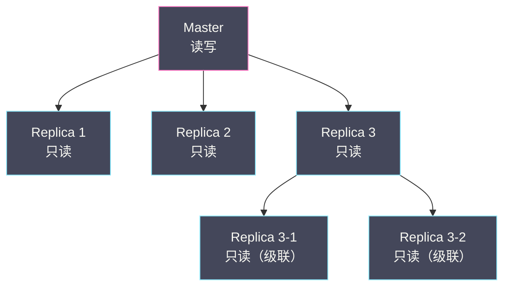
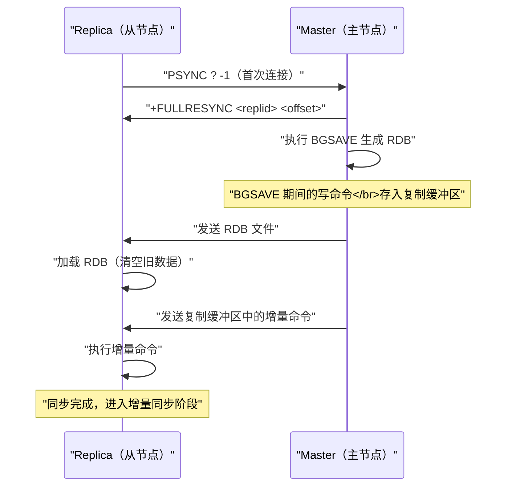
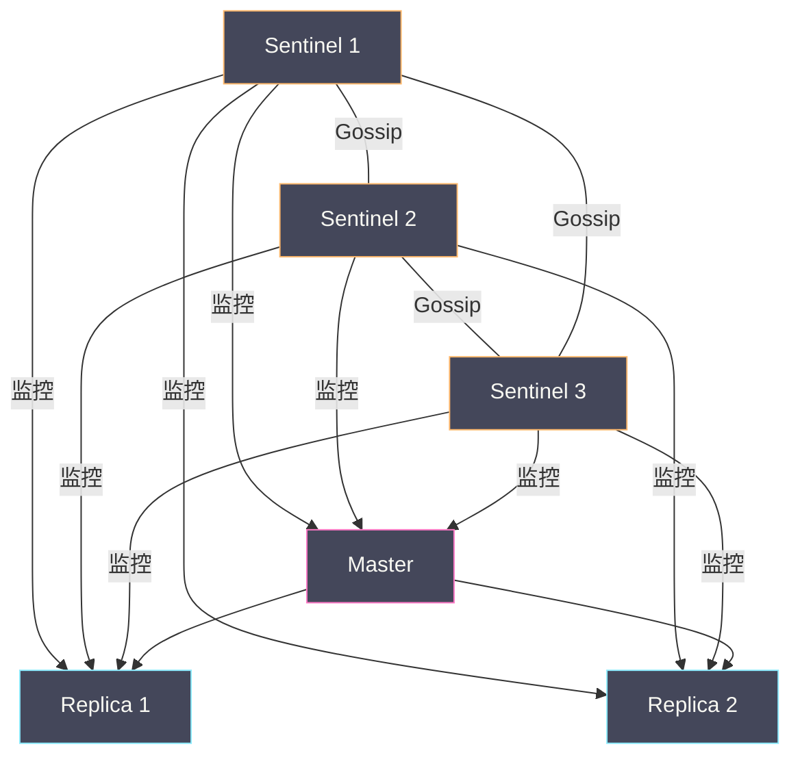
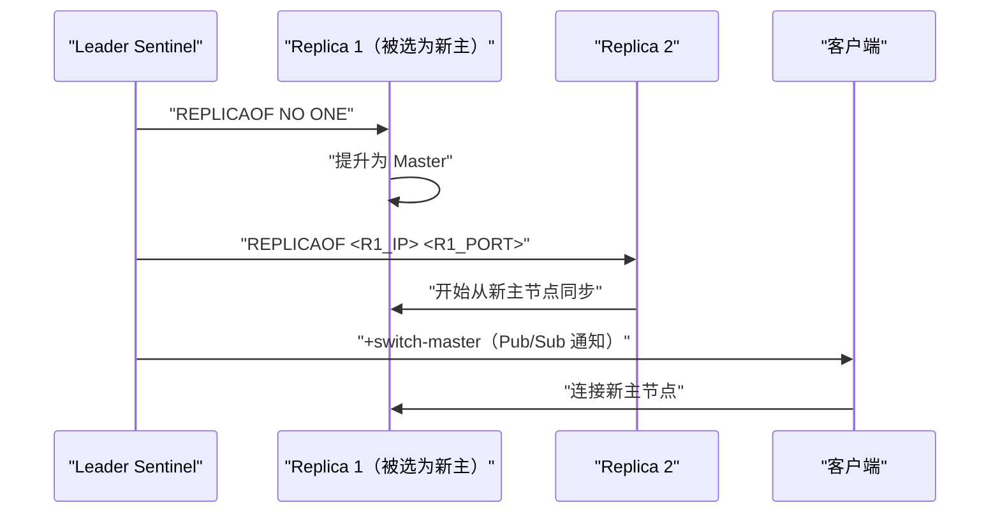

# 09 主从复制与 Sentinel 高可用

**摘要：**

单节点 Redis 面临两个核心风险：**数据冗余**——单点故障导致数据完全不可用；**读性能瓶颈**——所有读写请求集中在一个节点上。**主从复制（Replication）** 解决了第一个问题——主节点将数据实时同步到一个或多个从节点，从节点可以承担读请求，主节点故障时从节点保有完整的数据副本。但主从复制本身不具备自动故障转移能力——主节点宕机后需要人工介入将从节点提升为新主节点。**Sentinel（哨兵）** 在主从架构之上增加了自动化的高可用机制——一组 Sentinel 进程持续监控主从节点的健康状态，当主节点不可达时自动完成故障检测、选举新主、通知客户端切换。本文从 PSYNC 协议的全量同步与增量同步出发，深入复制积压缓冲区的设计、复制偏移量的一致性保证，然后系统分析 Sentinel 的三大核心流程：主观下线判定、客观下线投票、Leader 选举与自动 failover。

---

## 第 1 章 主从复制的基本原理

### 1.1 复制的拓扑结构

Redis 支持**一主多从**的复制拓扑——一个主节点（Master）可以有多个从节点（Replica/Slave），从节点还可以作为其他从节点的主节点（级联复制）：



**级联复制的价值**：减轻主节点的复制负担。如果主节点直接连接 10 个从节点，每个从节点的全量同步都需要主节点执行 BGSAVE 并传输 RDB——10 个同时全量同步可能压垮主节点。级联复制让部分从节点从其他从节点同步——分散了同步压力。

### 1.2 建立复制关系

```bash
# 在从节点上执行（Redis 5.0+）
REPLICAOF 10.0.1.1 6379

# 旧版命令（仍然支持）
SLAVEOF 10.0.1.1 6379

# 或在配置文件中指定
replicaof 10.0.1.1 6379
```

从节点执行 `REPLICAOF` 后，会与主节点建立 TCP 连接，然后执行 PSYNC 协议进行数据同步。

### 1.3 从节点的只读性

从节点默认是**只读的**——客户端对从节点执行写命令会收到错误：

```
(error) READONLY You can't write against a read only replica.
```

这是通过 `replica-read-only yes`（默认）配置控制的。虽然可以关闭只读限制让从节点接受写入，但强烈不建议——因为从节点的写入不会同步到主节点，会导致主从数据不一致。

---

## 第 2 章 PSYNC 协议

### 2.1 PSYNC 的演进

| 版本 | 协议 | 特点 |
| :--- | :--- | :--- |
| Redis 2.8 之前 | SYNC | 每次重连都全量同步——即使只断开了几秒 |
| Redis 2.8+ | PSYNC v1 | 支持增量同步——断线重连后只同步断开期间的增量数据 |
| Redis 4.0+ | PSYNC v2 | 支持 failover 后的增量同步——从节点提升为主节点后，其他从节点可以增量同步 |

### 2.2 全量同步（Full Resync）

当从节点**首次连接**主节点，或者增量同步的条件不满足时，执行全量同步：



**关键步骤**：

1. 从节点发送 `PSYNC ? -1`——`?` 表示不知道主节点的 replid（首次连接），`-1` 表示没有复制偏移量
2. 主节点回复 `+FULLRESYNC <replid> <offset>`——告知从节点主节点的复制 ID 和当前偏移量
3. 主节点执行 [[07 RDB 持久化——快照的 fork 与 COW 机制|BGSAVE]] 生成 RDB 文件——如果已有 BGSAVE 在进行（其他从节点触发的），直接复用
4. BGSAVE 期间主节点继续处理写命令——这些命令被缓存在**复制缓冲区**中
5. RDB 生成完毕后发送给从节点——从节点清空本地数据并加载 RDB
6. 主节点将复制缓冲区中的命令发送给从节点——从节点执行这些命令追上主节点
7. 进入**增量同步**阶段——后续的每条写命令实时传播给从节点

### 2.3 增量同步（Partial Resync）

当从节点与主节点的连接**短暂断开后重连**，如果条件满足，可以只同步断开期间的增量数据——避免昂贵的全量同步：

```
从节点：PSYNC <replid> <offset>
  replid = 上次连接的主节点复制 ID
  offset = 从节点当前的复制偏移量

主节点检查：
  1. replid 是否匹配当前主节点的复制 ID？
  2. offset 是否还在复制积压缓冲区的范围内？

如果都满足：
  主节点回复 +CONTINUE
  发送 offset 之后的所有命令
  从节点执行这些命令——同步完成

如果不满足：
  主节点回复 +FULLRESYNC
  执行全量同步
```

### 2.4 复制积压缓冲区（Replication Backlog）

**复制积压缓冲区**是增量同步的关键数据结构——它是一个固定大小的**环形缓冲区**（FIFO），主节点将每条传播给从节点的命令同时写入这个缓冲区。

```
复制积压缓冲区（环形，默认 1MB）：
┌──────────────────────────────────────────────────┐
│ ... CMD_100 CMD_101 CMD_102 ... CMD_200 CMD_201  │
│     ↑                                    ↑       │
│   offset_start                    offset_end     │
└──────────────────────────────────────────────────┘

从节点断线重连时携带 offset = 150：
  → 150 在 [offset_start, offset_end] 范围内
  → 从 150 开始发送后续命令（增量同步）

如果 offset = 50：
  → 50 < offset_start（已被覆盖）
  → 无法增量同步 → 全量同步
```

**缓冲区大小的重要性**：缓冲区越大，能容纳的历史命令越多——从节点断线更长时间后仍能增量同步。默认 1MB 在高写入场景下可能只能容纳几秒的命令——如果从节点断线超过几秒就必须全量同步。

**建议大小**：`repl-backlog-size = 主节点每秒写入量 × 预期最大断线时长 × 2`。例如主节点每秒写入 2MB，预期从节点最长断线 60 秒：`2MB × 60 × 2 = 240MB`。建议至少 **256MB**。

### 2.5 复制 ID（Replication ID）

每个 Redis 实例有两个复制 ID：

- **replid**：当前的复制 ID——标识当前的复制数据流
- **replid2**：上一个复制 ID——用于 PSYNC v2 的 failover 场景

**为什么需要两个 ID？** 当从节点被提升为新主节点（failover）时，它会生成一个新的 replid——但它的数据实际上是从旧主节点复制来的。其他从节点用旧主节点的 replid 尝试增量同步时，新主节点可以通过 replid2 识别出它们是同一条复制数据流——允许增量同步而非全量同步。

---

## 第 3 章 复制的细节与问题

### 3.1 复制延迟

主从复制是**异步的**——主节点执行写命令后立即返回客户端，不等待从节点确认。这意味着从节点的数据可能**落后于主节点**。

```bash
INFO replication
# master_repl_offset:1000000     主节点的复制偏移量
# slave0:ip=10.0.1.2,port=6379,state=online,offset=999900,lag=0
#   offset 差 100 字节——从节点略微落后
#   lag=0 表示从节点 1 秒内有过 ACK
```

**lag 字段**：从节点每秒向主节点发送 `REPLCONF ACK <offset>`——主节点记录收到 ACK 的时间。lag = 当前时间 - 上次 ACK 时间（秒）。lag > 10 需要告警——可能是网络问题或从节点负载过高。

### 3.2 min-replicas 配置

Redis 提供了有限的"同步复制"保证：

```bash
min-replicas-to-write 1       # 至少 1 个从节点在线且延迟不超过阈值
min-replicas-max-lag 10        # 从节点的最大延迟（秒）
```

如果在线且延迟合格的从节点数 < `min-replicas-to-write`，主节点**拒绝写入**。这提供了一种防止"脑裂写入丢失"的保护——如果主节点与所有从节点断开（可能是主节点被网络隔离），它不会继续接受写入（因为没有合格的从节点），避免了脑裂场景下两个"主节点"同时写入导致的数据冲突。

### 3.3 无盘复制（Diskless Replication）

传统的全量同步流程：主节点 BGSAVE → RDB 写入磁盘 → 从磁盘读取 RDB → 通过 Socket 发送给从节点。这涉及两次磁盘 IO（写 + 读）。

**无盘复制**（`repl-diskless-sync yes`）跳过了磁盘环节——BGSAVE 的子进程直接将 RDB 数据流通过 Socket 发送给从节点，不写入磁盘文件。

**适用场景**：磁盘速度慢（HDD）但网络速度快的环境——避免磁盘成为全量同步的瓶颈。

**注意**：无盘复制时如果同时有多个从节点请求全量同步，主节点会等待 `repl-diskless-sync-delay`（默认 5 秒）后一次性向所有从节点发送——避免为每个从节点单独 fork + 生成 RDB。

### 3.4 复制期间的过期 key 处理

从节点不主动删除过期 key——由主节点在删除过期 key 后通过复制机制发送 DEL 命令。但 Redis 3.2+ 做了一个优化：从节点在读取已过期的 key 时会返回空（好像 key 不存在），即使 key 实际上还在从节点的内存中。这避免了客户端从从节点读到已过期数据的问题。

---

## 第 4 章 Sentinel 高可用

### 4.1 为什么需要 Sentinel

主从复制解决了数据冗余和读扩展的问题，但**不解决故障自动恢复**：

- 主节点宕机后，从节点不会自动提升为新主节点
- 客户端不知道主节点已经变更——仍然连接旧主节点的地址
- 需要人工干预：手动 `REPLICAOF NO ONE` 将某个从节点提升，手动修改客户端配置

Sentinel 是 Redis 官方的高可用解决方案——一组独立的 Sentinel 进程（通常 3 个或 5 个）监控 Redis 的主从集群，自动完成：

1. **故障检测**：判定主节点是否不可达
2. **自动 failover**：选择一个从节点提升为新主节点
3. **通知客户端**：告知客户端新主节点的地址
4. **配置同步**：让其他从节点 REPLICAOF 新主节点

### 4.2 Sentinel 的部署架构



**为什么至少需要 3 个 Sentinel？** Sentinel 通过投票决定主节点是否真正下线和选举 Leader——需要多数派（quorum）的共识。2 个 Sentinel 中如果 1 个宕机，剩下 1 个无法达到多数派；3 个 Sentinel 允许 1 个宕机后仍有 2 个组成多数派。

### 4.3 主观下线（SDOWN）与客观下线（ODOWN）

**主观下线（Subjectively Down）**：单个 Sentinel 认为主节点不可达——Sentinel 每秒向主节点发送 PING，如果连续 `down-after-milliseconds`（默认 30 秒）没有收到有效回复，该 Sentinel 将主节点标记为 SDOWN。

**客观下线（Objectively Down）**：多数 Sentinel 都认为主节点不可达——标记 SDOWN 的 Sentinel 向其他 Sentinel 发送 `SENTINEL is-master-down-by-addr` 查询，如果有 ≥ quorum 个 Sentinel 同意主节点已下线，则标记为 ODOWN。

```
Sentinel 1: PING master → 超时 → SDOWN
Sentinel 1: 询问 Sentinel 2: "master 下线了吗？"
Sentinel 2: "是的，我也 PING 不通"
Sentinel 1: 询问 Sentinel 3: "master 下线了吗？"
Sentinel 3: "是的"
→ 3 个中有 3 个同意 ≥ quorum(2) → ODOWN
→ 开始 failover
```

**两级判定的设计**：避免因为单个 Sentinel 的网络问题导致误判——如果只有一个 Sentinel 无法连接主节点（可能是 Sentinel 自身的网络故障），其他 Sentinel 仍能正常通信，就不会触发 failover。只有多数 Sentinel 都无法连接时才认定主节点真正下线。

### 4.4 Leader 选举

确定 ODOWN 后，需要选举一个 Sentinel 作为 **Leader** 来执行 failover——不能所有 Sentinel 同时执行，否则会冲突。

选举使用 **Raft 协议的简化版本**：

1. 发现 ODOWN 的 Sentinel 将自己的 `current_epoch` 加 1，向其他 Sentinel 发送投票请求
2. 每个 Sentinel 在同一个 epoch 中只能投一票——先到先得
3. 获得 **多数票（> N/2）** 的 Sentinel 成为 Leader
4. 如果没有 Sentinel 获得多数票——等待随机时间后重新发起选举（避免活锁）

```
Sentinel 1: "epoch=5, 请投我为 Leader"
Sentinel 2: "我投 Sentinel 1"（epoch=5 的第一个请求）
Sentinel 3: "我投 Sentinel 1"
→ Sentinel 1 获得 3/3 票 > 多数 → 成为 Leader
```

### 4.5 自动 Failover 流程

Leader Sentinel 执行以下步骤：

**步骤 1：选择新主节点**

从所有从节点中选择最优的一个——选择算法：

1. **排除不健康的从节点**：与主节点断开超过 `down-after-milliseconds × 10` 的排除
2. **按 replica-priority 排序**：优先级数值越小越优先（0 表示永远不被选为主节点）
3. **按复制偏移量排序**：偏移量越大说明数据越新——优先选择数据最新的从节点
4. **按 Run ID 排序**：如果以上都相同，选择 Run ID 字典序最小的（确定性选择）

**步骤 2：提升新主节点**

向选中的从节点发送 `REPLICAOF NO ONE`——该从节点停止复制，变为独立的主节点。

**步骤 3：重新配置其他从节点**

向其他从节点发送 `REPLICAOF <新主节点IP> <新主节点端口>`——让它们从新主节点同步数据。

**步骤 4：更新旧主节点配置**

将旧主节点标记为新主节点的从节点——如果旧主节点恢复上线，会自动作为从节点加入新主节点。

**步骤 5：通知客户端**

Sentinel 通过 Pub/Sub 频道 `+switch-master` 通知订阅的客户端——客户端收到通知后切换连接到新主节点。



### 4.6 客户端如何感知 failover

客户端连接 Sentinel 而非直接连接 Redis——Sentinel 充当**服务发现**的角色：

```python
# Python 示例（redis-py）
from redis.sentinel import Sentinel

sentinel = Sentinel([
    ('sentinel-1', 26379),
    ('sentinel-2', 26379),
    ('sentinel-3', 26379),
], socket_timeout=0.5)

# 获取主节点连接
master = sentinel.master_for('mymaster', socket_timeout=0.5)
master.set('name', 'Alice')

# 获取从节点连接（用于读）
slave = sentinel.slave_for('mymaster', socket_timeout=0.5)
slave.get('name')
```

客户端库内部的工作机制：
1. 连接任意一个 Sentinel，执行 `SENTINEL get-master-addr-by-name mymaster` 获取当前主节点地址
2. 连接主节点，验证其角色确实是 master（`INFO replication` 的 role 字段）
3. 订阅 Sentinel 的 `+switch-master` 频道——收到 failover 通知后自动重新获取新主节点地址并切换连接

---

## 第 5 章 Sentinel 的配置与运维

### 5.1 Sentinel 配置文件

```bash
# sentinel.conf
port 26379
sentinel monitor mymaster 10.0.1.1 6379 2    # 监控主节点，quorum=2
sentinel down-after-milliseconds mymaster 30000  # 30 秒无响应判定 SDOWN
sentinel parallel-syncs mymaster 1            # failover 后同时进行同步的从节点数
sentinel failover-timeout mymaster 180000     # failover 超时时间 180 秒
sentinel auth-pass mymaster <password>        # 主节点密码
```

**parallel-syncs**：failover 后有多个从节点需要从新主节点全量同步——如果同时同步会给新主节点造成压力。`parallel-syncs = 1` 表示每次只让 1 个从节点同步——其他从节点等待前一个完成后再开始。

### 5.2 Sentinel 的自动发现

Sentinel 之间不需要手动配置彼此的地址——它们通过主节点的 **Pub/Sub** 频道自动发现：

1. 每个 Sentinel 连接到主节点后，在 `__sentinel__:hello` 频道发布自己的地址和配置
2. 其他 Sentinel 订阅了这个频道——收到消息后记录新 Sentinel 的存在
3. Sentinel 还通过这个频道获知其他 Sentinel 监控的从节点列表

### 5.3 Sentinel vs Redis Cluster

| 维度 | Sentinel | Redis Cluster |
| :--- | :--- | :--- |
| **定位** | 高可用（自动 failover）| 高可用 + 分布式（自动分片 + failover）|
| **数据分片** | ❌ 不支持 | ✅ 16384 个 slot |
| **存储容量** | 受限于单节点内存 | 可横向扩展 |
| **failover** | Sentinel 进程负责 | 集群节点内置 |
| **客户端** | 需要 Sentinel 感知的客户端 | 需要 Cluster 感知的客户端 |
| **适用场景** | 数据量 ≤ 单节点内存、需要简单高可用 | 数据量大、需要水平扩展 |

---

## 第 6 章 总结

本文深入分析了 Redis 主从复制和 Sentinel 高可用机制：

- **主从复制**：一主多从拓扑、级联复制分散同步压力；从节点默认只读
- **PSYNC 协议**：全量同步（BGSAVE + RDB 传输 + 增量补偿）和增量同步（复制积压缓冲区中的增量命令）。PSYNC v2 支持 failover 后的增量同步（双 replid 机制）
- **复制积压缓冲区**：固定大小环形缓冲区——建议 ≥ 256MB；从节点断线后 offset 仍在缓冲区范围内则增量同步，否则全量同步
- **复制延迟**：异步复制——从节点数据可能落后；min-replicas 配置提供有限的同步写保证
- **Sentinel 故障检测**：SDOWN（单个 Sentinel 判定）→ ODOWN（quorum 个 Sentinel 确认）→ 两级判定避免误判
- **Leader 选举**：Raft 简化版——epoch 递增、先到先得、多数票当选
- **自动 failover**：选择最优从节点（优先级 → 偏移量 → Run ID）→ REPLICAOF NO ONE 提升 → 重新配置其他从节点 → Pub/Sub 通知客户端

下一篇 [[10 Redis Cluster 分布式架构]] 将深入 Redis Cluster 的分片设计——16384 个 slot 的分配与迁移、Gossip 协议的节点通信、以及 Cluster 模式下的 failover 机制。

---

## 参考资料

1. Redis Source Code - replication.c：https://github.com/redis/redis/blob/unstable/src/replication.c
2. Redis Source Code - sentinel.c：https://github.com/redis/redis/blob/unstable/src/sentinel.c
3. Redis Documentation - Replication：https://redis.io/docs/management/replication/
4. Redis Documentation - Sentinel：https://redis.io/docs/management/sentinel/
5. Raft Consensus Algorithm：https://raft.github.io/
6. 黄健宏 - 《Redis 设计与实现》（第二版）- 第 15/16 章

---

> [!note] 思考题
> 1. Redis 的近似 LRU（`maxmemory-samples 5`，随机采样 5 个 Key 选最旧的）与精确 LRU 有 5-10% 的差距。`maxmemory-samples` 设为 10 时差距缩小到 <3%——但增加了每次淘汰的 CPU 开销。Redis 4.0 引入了 LFU（Least Frequently Used）——`allkeys-lfu` 在什么访问模式下优于 LRU（如热点 Key 周期性访问）？
> 2. 内存碎片率 >1.5 时开启 `activedefrag yes`。在线碎片整理通过移动数据减少碎片——但消耗 CPU（`active-defrag-cycle-min/max` 控制 CPU 占比）。在延迟敏感的场景中，碎片整理的 CPU 开销是否会导致请求延迟增加？你如何在低峰期执行碎片整理？
> 3. Big Key 检测：`redis-cli --bigkeys` 使用 SCAN 遍历所有 Key——在亿级 Key 的实例上可能需要数十分钟。`MEMORY USAGE` 可以检查单个 Key 但需要知道 Key 名。在不影响生产的前提下如何系统性地检测 Big Key？RDB 分析工具（如 `rdb-tools`）离线分析是否更合适？
