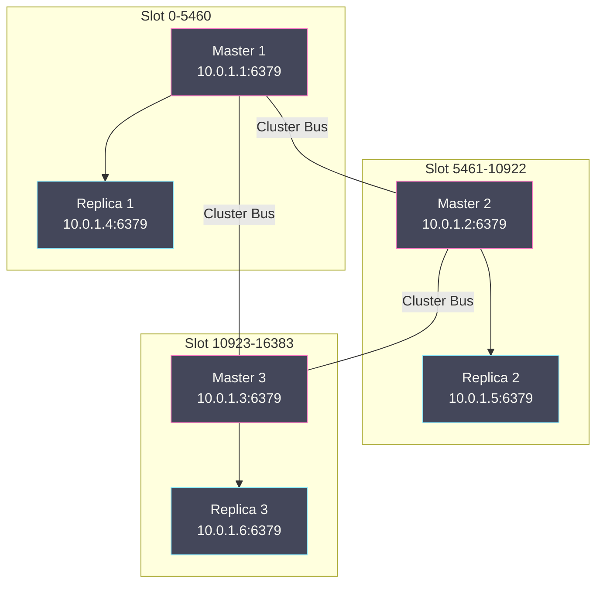

# 10 Redis Cluster 分布式架构

**摘要：**

[[09 主从复制与 Sentinel 高可用|Sentinel]] 解决了单节点 Redis 的高可用问题——自动 failover 保证了服务的连续性。但 Sentinel 架构的本质仍然是"一主多从"——所有数据存储在一个主节点中，受限于单节点的内存上限。当数据量增长到数十 GB 甚至 TB 级别时，单节点无法承载。**Redis Cluster** 是 Redis 官方的分布式解决方案——它将数据分散存储在多个节点上（**分片/Sharding**），每个节点只负责一部分数据，从而突破单节点的内存和吞吐量上限。Cluster 的核心设计包括：**16384 个哈希槽（Hash Slot）** 的分片模型——key 通过 CRC16 算法映射到某个 slot，slot 分配给不同的节点；**Gossip 协议**的去中心化节点通信——每个节点维护集群的全局视图，不依赖中心化的协调者；**内置的 failover 机制**——当某个主节点不可达时，其从节点自动提升为新主节点，无需额外的 Sentinel 进程。本文从分片模型的设计哲学出发，深入 Gossip 协议的消息交换机制、slot 迁移的原子性保证、Cluster 模式下的 failover 流程，以及客户端的 MOVED/ASK 重定向机制。

---

## 第 1 章 为什么需要 Redis Cluster

### 1.1 单节点的天花板

一个 Redis 实例的容量受限于单台服务器的物理内存——通常 64-256GB。考虑到 [[07 RDB 持久化——快照的 fork 与 COW 机制|BGSAVE 的 fork 开销]]和 COW 的内存放大，单实例的实际可用内存通常不超过 **10-15GB**。当业务需要缓存 100GB 甚至 1TB 的数据时，单节点完全无法满足。

吞吐量同样存在天花板——[[05 单线程模型与事件驱动架构|单线程模型]]的命令处理能力约 10-30 万 QPS（取决于命令复杂度和数据大小）。即使开启了 Redis 6.0 的多线程 IO，单节点的吞吐量上限也不会超过 50 万 QPS。当业务需要百万级 QPS 时，必须将请求分散到多个节点。

### 1.2 分片方案的演进

| 方案 | 分片方式 | 优点 | 缺点 |
| :--- | :--- | :--- | :--- |
| **客户端分片** | 客户端计算 key → 节点的映射 | 简单、无额外组件 | 扩缩容需改代码、无自动 failover |
| **代理分片（Twemproxy/Codis）** | 代理层转发请求 | 客户端无感知 | 额外延迟、代理本身是瓶颈、运维复杂 |
| **Redis Cluster** | 内置分片 + failover | 去中心化、自动 failover、官方原生 | 客户端需支持 Cluster 协议、部分命令受限 |

Redis Cluster 是 Redis 3.0（2015 年）引入的官方分布式方案——经过多年迭代，已经成为生产环境中最主流的 Redis 分布式架构。

---

## 第 2 章 哈希槽分片模型

### 2.1 16384 个哈希槽

Redis Cluster 将整个数据空间划分为 **16384（2^14）个哈希槽（Hash Slot）**，编号 0-16383。每个 key 通过以下公式映射到一个 slot：

```
SLOT = CRC16(key) mod 16384
```

**CRC16** 是一种快速的循环冗余校验算法——计算 key 的 16 位校验值，然后对 16384 取模得到 slot 编号。

每个 Cluster 节点（主节点）负责一部分 slot。例如一个 3 主节点的 Cluster：

```
Node A: slot 0 - 5460      (5461 个 slot)
Node B: slot 5461 - 10922  (5462 个 slot)
Node C: slot 10923 - 16383 (5461 个 slot)
```

客户端执行 `SET name Alice` 时：
1. 计算 `CRC16("name") mod 16384 = 5798`
2. slot 5798 属于 Node B
3. 将命令发送到 Node B

### 2.2 为什么是 16384

antirez 在设计 Redis Cluster 时选择了 16384 作为 slot 数量——这个数字的选择有深刻的工程考量：

**Gossip 消息大小**：Cluster 节点间通过 Gossip 协议交换心跳消息——每条消息包含一个 **bitmap**，标记该节点负责哪些 slot。16384 个 slot 的 bitmap = 16384 / 8 = **2KB**。如果 slot 数量是 65536（2^16），bitmap 就是 8KB——在几百个节点的 Cluster 中，频繁交换 8KB 的心跳消息会显著增加网络带宽消耗。

**节点数量上限**：Redis Cluster 推荐的最大节点数约 **1000 个**。16384 个 slot 分配给 1000 个节点，平均每个节点约 16 个 slot——粒度足够细，可以灵活地调整数据分布。

**内存开销**：每个节点维护一个 16384 长度的数组记录每个 slot 的归属——16384 × 8 字节（指针）= 128KB，可以接受。

### 2.3 Hash Tag——控制 key 的 slot 分配

默认情况下，CRC16 基于整个 key 计算 slot——同一个业务实体的多个 key（如 `user:1001:name`、`user:1001:age`）可能分散在不同的 slot 中。这导致涉及多个 key 的命令（如 MGET、事务、Lua 脚本）无法在 Cluster 模式下执行——因为这些 key 可能在不同的节点上。

**Hash Tag** 解决了这个问题——如果 key 中包含 `{...}` 花括号，CRC16 只计算花括号内的部分：

```
{user:1001}:name → CRC16("user:1001") → slot X
{user:1001}:age  → CRC16("user:1001") → slot X  （同一个 slot！）

user:{1001}:name → CRC16("1001") → slot Y
user:{1001}:age  → CRC16("1001") → slot Y  （同一个 slot！）
```

通过 Hash Tag，同一个业务实体的所有 key 被映射到同一个 slot——可以安全地在这些 key 上执行 MGET、事务和 Lua 脚本。

> [!warning] Hash Tag 的数据倾斜风险
> 如果大量 key 使用相同的 Hash Tag（如 `{hot_user}:xxx`），这些 key 全部集中在一个 slot（一个节点）中——导致该节点的内存和请求量远大于其他节点。使用 Hash Tag 时需要确保 tag 的值分布足够均匀。

---

## 第 3 章 Gossip 协议

### 3.1 去中心化的设计

Redis Cluster 采用**去中心化（Decentralized）** 的架构——没有中心化的协调者（如 ZooKeeper）。每个节点都维护集群的**全局视图**——包括所有节点的地址、负责的 slot、健康状态。节点之间通过 **Gossip 协议**交换信息，最终达成一致的全局视图。

**去中心化的优势**：
- **无单点故障**：不依赖中心化组件——中心化组件宕机会导致整个集群不可用
- **水平扩展**：节点数量增加不会给中心化组件带来瓶颈
- **运维简单**：不需要额外部署和维护 ZooKeeper 等组件

**代价**：信息传播有延迟——新信息需要多轮 Gossip 才能传播到所有节点。在大型 Cluster（数百节点）中，一个节点的状态变更可能需要数秒才能被所有节点感知。

### 3.2 Cluster Bus

Redis Cluster 的节点间通信使用一个独立的 **Cluster Bus** 端口——默认是**数据端口 + 10000**（如数据端口 6379，Bus 端口 16379）。Cluster Bus 承载所有的节点间通信：

- **PING/PONG**：心跳探测——每个节点每秒随机向一部分节点发送 PING
- **MEET**：新节点加入集群——已有节点向新节点发送 MEET 消息
- **FAIL**：故障广播——某个节点被判定故障后广播给所有节点
- **PUBLISH**：Pub/Sub 消息在集群中的传播
- **UPDATE**：配置更新——slot 分配变更的传播

### 3.3 PING/PONG 消息的内容

每条 PING/PONG 消息包含：

1. **发送节点的信息**：节点 ID、IP、端口、负责的 slot bitmap（2KB）、配置纪元（config epoch）
2. **随机携带的其他节点信息**：发送节点随机选择集群中 **1/10** 的节点，将它们的状态信息附带在消息中

这个"随机携带"的设计是 Gossip 的精髓——每条消息不仅传播发送者自己的信息，还传播它所知道的其他节点的信息。经过多轮交换，每个节点都会获得集群中所有节点的信息。

**传播速度**：在 N 个节点的集群中，一条新信息平均需要 **O(log N)** 轮 Gossip 传播到所有节点。100 个节点约需 7 轮（每秒至少 1 轮）——即约 7 秒。

### 3.4 故障检测

Cluster 的故障检测与 [[09 主从复制与 Sentinel 高可用|Sentinel]] 类似——也采用两级判定：

**PFAIL（Probable Fail）**：单个节点的主观判定——节点 A 向节点 B 发送 PING 后，在 `cluster-node-timeout`（默认 15 秒）内没有收到 PONG 回复，A 将 B 标记为 PFAIL。

**FAIL**：集群多数派的共识——当一个主节点被**超过半数的主节点**标记为 PFAIL 时，其中一个节点将其标记为 FAIL 并向集群广播 FAIL 消息。收到 FAIL 消息的所有节点立即将该节点标记为 FAIL。

```
Node A: PING Node X → 超时 → A 标记 X 为 PFAIL
Node B: 通过 Gossip 收到 A 的信息 → B 也标记 X 为 PFAIL
Node C: 通过 Gossip 收到 A、B 的信息 → C 也标记 X 为 PFAIL
→ 3/5 的主节点标记 X 为 PFAIL → 超过半数
→ 某个节点将 X 标记为 FAIL 并广播
```

---

## 第 4 章 Cluster Failover

### 4.1 从节点的自动提升

当一个主节点被标记为 FAIL 时，它的从节点开始 failover 流程——与 Sentinel 类似但实现在 Cluster 内部，不需要外部进程：

**步骤 1：资格检查**

从节点检查自己是否有资格发起 failover：
- 自己的主节点确实是 FAIL 状态
- 自己与主节点的最后通信时间不超过 `cluster-node-timeout × cluster-replica-validity-factor`——太久没通信的从节点数据可能太旧
- 等待一个**延迟时间**——数据最新的从节点（复制偏移量最大）等待时间最短——确保数据最新的从节点优先发起选举

**步骤 2：发起选举**

从节点将自己的 `currentEpoch` 加 1，向集群中所有主节点发送 `FAILOVER_AUTH_REQUEST` 消息请求投票。

**步骤 3：投票**

每个主节点在同一个 epoch 中只能投一票——收到第一个合法的投票请求后投票给该从节点。

**步骤 4：提升**

获得**超过半数主节点投票**的从节点赢得选举——它将自己提升为新主节点：
1. 设置自己的角色为 master
2. 接管原主节点的所有 slot
3. 广播新的配置（包含新的 slot 分配）给集群所有节点
4. 其他从节点自动 REPLICAOF 新主节点

### 4.2 配置纪元（Config Epoch）

每个主节点有一个**配置纪元（config epoch）**——它是一个**单调递增**的整数，标识 slot 分配的版本。当 failover 发生时，新主节点的 config epoch 比旧主节点更大——集群中的其他节点通过比较 config epoch 确定**最新的 slot 分配**。

如果一个节点收到两条矛盾的 slot 分配信息（slot X 同时被 Node A 和 Node B 声称拥有），它会采信 config epoch 更大的那条——这保证了集群最终收敛到一致的状态。

### 4.3 手动 Failover

Redis Cluster 支持在从节点上执行 `CLUSTER FAILOVER` 命令发起**手动 failover**——用于计划内的维护（如升级主节点的 Redis 版本）：

```bash
# 在从节点上执行
CLUSTER FAILOVER
```

手动 failover 与自动 failover 的区别：手动 failover 会先确保从节点的数据与主节点完全一致（等待复制追平），然后主节点停止接受写入，从节点安全地提升——**零数据丢失**。自动 failover 由于主节点已宕机，无法确保数据完全一致——可能有少量异步复制的数据丢失。

---

## 第 5 章 客户端重定向

### 5.1 MOVED 重定向

Cluster 模式下，客户端可以连接集群中的任意节点发送命令。如果 key 所在的 slot 不在当前节点，节点返回 **MOVED 重定向**：

```
客户端 → Node A: SET name Alice
Node A: MOVED 5798 10.0.1.2:6379
  （"slot 5798 永久属于 10.0.1.2:6379"）
客户端 → Node B (10.0.1.2:6379): SET name Alice
Node B: OK
```

**MOVED 是永久重定向**——客户端应该更新本地的 slot → 节点映射缓存，后续访问 slot 5798 的 key 直接发送到 Node B。

**智能客户端**：成熟的 Redis Cluster 客户端（如 Jedis、Lettuce、redis-py）在启动时执行 `CLUSTER SLOTS` 或 `CLUSTER SHARDS` 获取完整的 slot 分配表——缓存在本地。后续命令直接根据本地缓存路由到正确的节点——大多数命令不需要重定向。只有当 slot 分配发生变化（如 failover 或 slot 迁移）时才会遇到 MOVED——触发客户端刷新本地缓存。

### 5.2 ASK 重定向

**ASK 重定向**发生在 **slot 迁移进行中**——当一个 slot 正在从 Node A 迁移到 Node B 时，该 slot 中的部分 key 已经在 Node B，部分还在 Node A。

```
slot 5798 正在从 Node A 迁移到 Node B：

客户端 → Node A: GET name
  情况 1: name 还在 Node A → 直接返回结果
  情况 2: name 已迁移到 Node B → ASK 5798 10.0.1.2:6379

客户端 → Node B: ASKING  （告知 Node B "我是被 ASK 重定向来的"）
客户端 → Node B: GET name
Node B: 返回结果
```

**ASK 是临时重定向**——客户端**不应该**更新本地缓存（因为迁移还没完成，slot 的永久归属还没变）。下次访问同一个 slot 仍然先尝试 Node A。只有迁移完成后 Node A 返回 MOVED——客户端才更新缓存。

**ASKING 命令**：Node B 默认拒绝访问不属于自己的 slot（返回 MOVED）。`ASKING` 命令是一个一次性标志——告诉 Node B "下一条命令请处理，即使这个 slot 还没正式分配给你"。

---

## 第 6 章 Slot 迁移

### 6.1 迁移的触发场景

| 场景 | 说明 |
| :--- | :--- |
| **扩容** | 新增节点后，将部分 slot 从已有节点迁移到新节点 |
| **缩容** | 移除节点前，将其 slot 全部迁移到其他节点 |
| **负载均衡** | 某些节点的 slot 过多导致负载不均——手动或自动调整 |

### 6.2 迁移的流程

slot 迁移是**逐个 key** 进行的——Redis 不支持一次性迁移整个 slot（那会导致长时间阻塞）。

```bash
# 在目标节点（Node B）上设置 slot 5798 为 IMPORTING 状态
CLUSTER SETSLOT 5798 IMPORTING <Node_A_ID>

# 在源节点（Node A）上设置 slot 5798 为 MIGRATING 状态
CLUSTER SETSLOT 5798 MIGRATING <Node_B_ID>

# 循环迁移 key
while true:
    # 获取 slot 5798 中的一批 key（最多 count 个）
    keys = CLUSTER GETKEYSINSLOT 5798 100

    if keys is empty:
        break

    # 逐个迁移 key 到 Node B
    for key in keys:
        MIGRATE <Node_B_IP> <Node_B_Port> key 0 5000

# 迁移完成后，通知所有节点 slot 5798 归属 Node B
CLUSTER SETSLOT 5798 NODE <Node_B_ID>
```

**MIGRATE 命令的原子性**：`MIGRATE` 将 key 的数据序列化后通过 Socket 发送到目标节点——目标节点加载后回复 OK——源节点收到 OK 后删除本地的 key。整个过程对于单个 key 是原子的——要么迁移成功（目标有数据，源删除），要么迁移失败（两边状态不变）。

> [!note] MIGRATE 的阻塞特性
> MIGRATE 命令在源节点是**阻塞的**——迁移单个 key 期间源节点不处理其他命令。对于大 key（如包含百万元素的 Set），单次 MIGRATE 可能阻塞数百毫秒。Redis 3.0.6+ 支持 `MIGRATE ... KEYS key1 key2 ...` 批量迁移——减少网络往返次数，但不改变阻塞的本质。生产环境中应避免在集群中存储过大的 key——迁移时的阻塞会严重影响服务延迟。

### 6.3 MIGRATING 和 IMPORTING 状态的行为

| 状态 | 节点行为 |
| :--- | :--- |
| **MIGRATING（源节点）** | key 存在 → 正常处理；key 不存在 → 返回 ASK 重定向到目标节点 |
| **IMPORTING（目标节点）** | 收到 ASKING 后接受该 slot 的命令；否则返回 MOVED 重定向到源节点 |

这两个状态保证了迁移过程中 key 不会丢失——无论 key 当前在源还是目标，客户端最终都能找到它。

---

## 第 7 章 Cluster 的限制与最佳实践

### 7.1 命令限制

Cluster 模式下，涉及多个 key 的命令有严格限制——**所有涉及的 key 必须在同一个 slot 中**：

| 命令 | 限制 |
| :--- | :--- |
| **MGET/MSET** | 所有 key 必须在同一个 slot |
| **事务（MULTI/EXEC）** | 事务中的所有 key 必须在同一个 slot |
| **Lua 脚本** | 脚本中访问的所有 key 必须在同一个 slot |
| **SUNION/SINTER** | 所有 key 必须在同一个 slot |
| **RENAME** | 源和目标 key 必须在同一个 slot |

**解决方案**：使用 **Hash Tag** 将相关的 key 映射到同一个 slot——如 `{user:1001}:name` 和 `{user:1001}:age`。

### 7.2 集群规模建议

- **主节点数量**：3-100 个。超过 100 个主节点时 Gossip 的网络开销显著增加
- **每个主节点的从节点**：1-2 个。至少 1 个从节点保证 failover
- **单节点内存**：≤ 10-15GB。过大的节点导致 fork 和全量同步耗时过长
- **cluster-node-timeout**：默认 15 秒。适当调低（如 5-10 秒）可以加快故障检测速度，但增加了误判风险

### 7.3 集群拓扑示例

一个典型的 6 节点 Cluster（3 主 3 从）：



> [!warning] 跨机房/可用区部署
> 主节点和对应的从节点应部署在**不同的机房/可用区**——如果主从在同一机房，机房故障会同时丢失主从，导致该 slot 范围不可用。3 主 3 从的集群建议分布在至少 3 个可用区。

---

## 第 8 章 cluster-require-full-coverage

```bash
cluster-require-full-coverage yes    # 默认。只要有任一 slot 没有负责的节点，集群拒绝所有写入
cluster-require-full-coverage no     # 即使部分 slot 不可用，仍接受可用 slot 的读写
```

**默认 yes 的原因**：保证数据的完整性——如果某个 slot 范围不可用，访问这些 slot 中 key 的命令会返回错误而非误导性的"key 不存在"。

**设置 no 的场景**：可用性优先——即使部分节点故障导致某些 slot 不可用，仍然允许访问其他 slot 的数据。适合于缓存场景——部分数据不可用可以降级为从后端数据库读取。

---

## 第 9 章 Cluster 相关命令

```bash
# 集群信息
CLUSTER INFO                        # 集群状态概览
CLUSTER NODES                       # 所有节点信息（ID、IP、角色、slot）
CLUSTER SLOTS                       # slot 分配表
CLUSTER SHARDS                      # slot 分配（Redis 7.0+，替代 CLUSTER SLOTS）

# 节点管理
CLUSTER MEET <ip> <port>            # 将新节点加入集群
CLUSTER FORGET <node-id>            # 从集群中移除节点
CLUSTER REPLICATE <node-id>         # 将当前节点设为指定节点的从节点

# Slot 管理
CLUSTER ADDSLOTS 0 1 2 ... 5460    # 将 slot 分配给当前节点
CLUSTER DELSLOTS 0 1 2              # 移除当前节点的 slot
CLUSTER SETSLOT <slot> NODE <id>    # 将 slot 分配给指定节点
CLUSTER SETSLOT <slot> MIGRATING <id>  # 设置 slot 为迁出状态
CLUSTER SETSLOT <slot> IMPORTING <id>  # 设置 slot 为迁入状态

# 故障转移
CLUSTER FAILOVER                    # 手动 failover（在从节点上执行）
CLUSTER FAILOVER FORCE              # 强制 failover（不等复制追平）
CLUSTER RESET HARD                  # 重置节点的集群状态
```

---

## 第 10 章 总结

本文深入分析了 Redis Cluster 的分布式架构设计：

- **哈希槽分片**：16384 个 slot——CRC16(key) mod 16384 映射 key 到 slot；slot 分配给不同主节点。16384 的选择平衡了 Gossip 消息大小（2KB bitmap）和分片粒度。Hash Tag 控制多 key 落入同一 slot
- **Gossip 协议**：去中心化节点通信——PING/PONG 心跳携带 slot bitmap + 随机节点信息；O(log N) 轮传播达成全局一致。Cluster Bus 端口 = 数据端口 + 10000
- **故障检测与 Failover**：PFAIL（单节点主观）→ FAIL（多数主节点共识）→ 从节点选举（epoch 投票，半数以上）→ 提升为新主节点。手动 failover 保证零数据丢失
- **客户端重定向**：MOVED（永久重定向——更新本地缓存）和 ASK（临时重定向——slot 迁移中）。智能客户端缓存 slot 分配表减少重定向
- **Slot 迁移**：MIGRATING + IMPORTING 状态；MIGRATE 命令逐 key 原子迁移；大 key 迁移阻塞需关注
- **限制**：多 key 命令要求同一 slot；建议主节点 3-100 个、单节点 ≤ 10-15GB

至此，**Redis 设计与实现** 专栏全部 10 篇文章已完成。从底层的 [[02 SDS 与 Redis 对象系统|SDS 和对象系统]]、[[03 字典与渐进式 Rehash|字典]]、[[04 跳跃表 压缩列表与 Listpack|跳跃表和 listpack]]，到运行时的 [[05 单线程模型与事件驱动架构|事件驱动架构]]、[[06 内存管理与过期淘汰策略|内存管理]]，再到持久化的 [[07 RDB 持久化——快照的 fork 与 COW 机制|RDB]] 和 [[08 AOF 持久化与混合持久化|AOF]]，最后到分布式的 [[09 主从复制与 Sentinel 高可用|主从复制/Sentinel]] 和本文的 Cluster——希望这个系列能帮助你建立对 Redis 内部机制的系统性认知。

---

## 参考资料

1. Redis Source Code - cluster.c / cluster.h：https://github.com/redis/redis/blob/unstable/src/cluster.c
2. Redis Documentation - Cluster Tutorial：https://redis.io/docs/management/scaling/
3. Redis Documentation - Cluster Specification：https://redis.io/docs/reference/cluster-spec/
4. antirez - Redis Cluster 设计笔记：http://antirez.com/news/79
5. 黄健宏 - 《Redis 设计与实现》（第二版）- 第 17 章 集群
