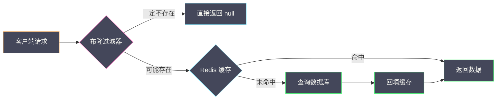
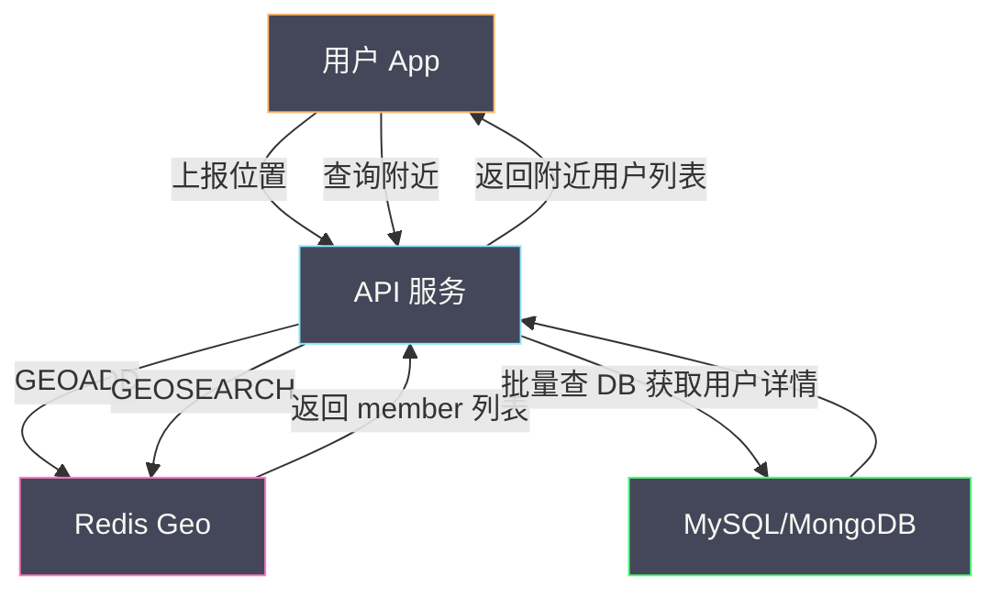
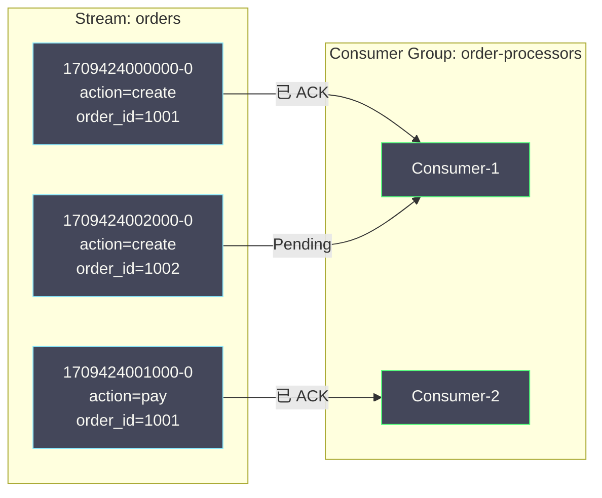

# 02 高级数据类型——HyperLogLog Bitmap Geo Stream

**摘要：**

Redis 的五大基础类型（String、List、Hash、Set、ZSet）覆盖了绝大多数业务场景，但有些特定需求用基础类型要么内存浪费严重，要么根本无法实现。统计一个拥有 1 亿用户的产品的日活（UV），如果用 Set 存储每个用户 ID，需要数 GB 内存——而 HyperLogLog 只需要 12KB 就能完成，代价是 0.81% 的标准误差。记录 1 亿用户的签到状态，每个用户一个 key 需要数十 GB——而 Bitmap 只需要 12.5MB。查找"附近 3 公里内的餐厅"，传统方案需要在数据库中对经纬度做范围查询加排序——而 Geo 基于 GeoHash 编码在 ZSet 上实现了 O(log N + M) 的空间查询。需要一个支持消费者组、消息确认、消息回溯的轻量级消息队列——Stream 提供了类似 Kafka 的语义而无需部署额外组件。本文逐一剖析这四种高级数据类型的原理、适用场景和工程实践。

---

## 第 1 章 HyperLogLog——概率基数统计

### 1.1 问题：如何高效统计 UV

**基数（Cardinality）** 指的是一个集合中不重复元素的数量。"日活用户数（DAU）"就是一个典型的基数统计问题——统计一天内访问系统的**不重复**用户数。

最直观的方案是用 Set：每次用户访问时 `SADD dau:2026-03-03 <user_id>`，最后 `SCARD dau:2026-03-03` 获取基数。问题在于内存——假设 user_id 是 8 字节的长整数，1 亿用户的 Set 需要约 1.6GB 内存（每个元素包含 dictEntry + SDS 等开销，约 56 字节/元素）。每天一个 Set，一周就是 11.2GB——仅用于统计一个数字。

**HyperLogLog（HLL）** 是一种概率数据结构——它用极小的固定内存（12KB）估算集合的基数，标准误差仅 0.81%。这意味着真实 UV 为 1 亿时，HLL 给出的估算值在 99,190,000 到 100,810,000 之间——对于 UV 统计这种精度要求不高的场景完全足够。

### 1.2 HyperLogLog 的核心原理

HyperLogLog 的数学基础是**概率论中的最大似然估计**。核心思想可以用一个直觉来理解：

假设你不断抛硬币，记录连续出现正面的最大次数 k。如果 k = 10（连续 10 次正面），你可以合理推断大约抛了 2^10 = 1024 次——因为连续 10 次正面的概率是 1/1024，平均需要抛 1024 次才能出现一次。

HyperLogLog 将这个思想应用到哈希值上：
1. 对每个输入元素计算哈希值（64 位）
2. 观察哈希值的二进制表示中，**从低位开始连续 0 的最大个数**（等价于"连续正面"）
3. 如果最大连续 0 的个数是 k，则基数的估计值约为 2^k

但单个估计值的方差很大。HyperLogLog 的关键改进是**分桶（Register）**——将哈希值的前 14 位作为桶编号（共 2^14 = 16384 个桶），剩余 50 位用于计算连续 0 的个数。每个桶独立记录自己见过的"最大连续 0 个数"，最终取所有桶的**调和平均数**作为最终估计——大幅降低了方差。

```
输入元素 → Hash(element) = 64 位哈希值
                            ├── 前 14 位 → 桶编号（0 ~ 16383）
                            └── 后 50 位 → 计算前导零个数 → 更新桶的最大值
```

**16384 个桶，每个桶存储一个 6 位的计数值（最大 63），总内存 = 16384 × 6 / 8 = 12288 字节 = 12KB。**

> [!note] 稀疏编码优化
> 当 HLL 中的元素很少时（大多数桶的值为 0），Redis 使用**稀疏编码**——只记录非零桶的位置和值，实际内存远小于 12KB。随着元素增多，自动切换为**密集编码**（固定 12KB）。稀疏编码的阈值由 `hll-sparse-max-bytes`（默认 3000 字节）控制。

### 1.3 HyperLogLog 命令

```bash
# 添加元素
PFADD dau:2026-03-03 "user:1001" "user:1002" "user:1003"
PFADD dau:2026-03-03 "user:1001"    # 重复元素不影响基数

# 获取基数估计值
PFCOUNT dau:2026-03-03               # 返回 3

# 合并多个 HLL（计算周活/月活）
PFMERGE dau:week dau:2026-03-01 dau:2026-03-02 dau:2026-03-03
PFCOUNT dau:week                      # 返回一周内的不重复用户数
```

**PFMERGE 的工程价值**：日活（DAU）用每天一个 HLL 统计，周活（WAU）通过 PFMERGE 合并 7 天的 HLL 得到，月活（MAU）合并 30 天——无需重新计算，只需合并已有的 HLL。合并操作只是对每个桶取最大值，时间复杂度 O(桶数) = O(16384)，几乎是常数时间。

### 1.4 精度与适用边界

| 指标 | 值 |
| :--- | :--- |
| 标准误差 | 0.81% |
| 固定内存 | 12KB（密集编码）|
| 最大可估算基数 | 约 2^64 |

**适用场景**：UV 统计、独立 IP 数、独立搜索词数——对精确度要求不高（误差 < 1%）但数据量巨大的基数统计。

**不适用场景**：需要精确计数的场景（如账户余额、库存数量）；需要判断"某个元素是否存在"的场景（HLL 不支持 `PFCONTAINS` 查询）——这种场景应使用布隆过滤器。

### 1.5 HyperLogLog vs Set vs Bitmap

| 维度 | Set | Bitmap | HyperLogLog |
| :--- | :--- | :--- | :--- |
| **精度** | 精确 | 精确 | 0.81% 误差 |
| **内存（1 亿元素）** | ~1.6GB | ~12.5MB（如果 ID 连续）| 12KB |
| **是否可查询单个元素** | ✅ SISMEMBER | ✅ GETBIT | ❌ |
| **是否可合并** | ✅ SUNION | ✅ BITOP OR | ✅ PFMERGE |
| **适用范围** | 任意元素 | 整数 ID（连续分布）| 任意元素 |

---

## 第 2 章 Bitmap——位运算的极致压缩

### 2.1 Bitmap 的本质

Redis 的 Bitmap **不是一个独立的数据类型**——它是 String 类型的位操作视图。一个 String 最大 512MB = 2^32 位，每一位可以独立设置为 0 或 1。通过 `SETBIT`/`GETBIT` 命令，可以将这个巨大的位数组当作一个高效的布尔状态存储。

```bash
SETBIT online:2026-03-03 1001 1     # 用户 1001 今天在线
SETBIT online:2026-03-03 1002 1     # 用户 1002 今天在线
GETBIT online:2026-03-03 1001       # 返回 1（在线）
GETBIT online:2026-03-03 9999       # 返回 0（未设置，默认离线）
```

**内存计算**：如果用户 ID 的最大值是 1 亿（10^8），Bitmap 需要 10^8 / 8 = 12.5MB。而用 Set 存储 1 亿个在线用户需要约 1.6GB——Bitmap 节省了 99% 以上的内存。

> [!warning] Bitmap 的内存陷阱
> Bitmap 的内存分配取决于**最大偏移量**（offset），而不是实际设置为 1 的位数。如果只有一个用户 ID 为 999,999,999，`SETBIT key 999999999 1` 会立即分配约 125MB 内存——即使只存储了一个用户。因此 Bitmap 适用于**ID 连续且密集分布**的场景。如果 ID 稀疏，应使用 Set 或 HyperLogLog。

### 2.2 用户签到系统

每个用户每月一个 Bitmap，每一位对应一天（第 1 位 = 1 号，第 31 位 = 31 号）：

```bash
# 用户 1001 在 3 月 3 日签到
SETBIT sign:1001:2026-03 3 1

# 查看用户 1001 在 3 月 3 日是否签到
GETBIT sign:1001:2026-03 3           # 返回 1

# 统计本月签到天数
BITCOUNT sign:1001:2026-03           # 返回签到天数

# 查找本月第一次签到的日期
BITPOS sign:1001:2026-03 1           # 返回第一个为 1 的位的偏移量
```

**内存分析**：每个用户每月只需要 4 字节（31 位 < 32 位 = 4 字节）。1 亿用户一年的签到数据 = 1 亿 × 12 × 4 字节 = 4.8GB——如果用 Hash 或 String 存储每天的签到记录，内存消耗会高出数十倍。

### 2.3 BITOP——位运算

`BITOP` 支持 AND、OR、XOR、NOT 四种位运算——可以在多个 Bitmap 之间进行集合运算：

```bash
# 连续 7 天都签到的用户（AND 运算）
BITOP AND sign:week:active sign:2026-03-01 sign:2026-03-02 sign:2026-03-03 sign:2026-03-04 sign:2026-03-05 sign:2026-03-06 sign:2026-03-07

# 7 天内任意一天签到的用户（OR 运算）
BITOP OR sign:week:any sign:2026-03-01 sign:2026-03-02 ... sign:2026-03-07

# 统计结果
BITCOUNT sign:week:active    # 连续 7 天签到的用户数
BITCOUNT sign:week:any       # 7 天内活跃的用户数
```

**BITOP 的时间复杂度**是 O(N)，N 是最长 Bitmap 的字节数。对于 1 亿用户的 Bitmap（12.5MB），BITOP 约需 10-20ms——在生产环境中应在从节点执行或在低峰期执行。

### 2.4 BITFIELD——多位操作

`BITFIELD` 允许在 Bitmap 上进行**任意位宽**的读写操作——不限于单个位，可以读写 1-64 位的有符号或无符号整数：

```bash
# 在 Bitmap 中存储多个小整数（如游戏角色属性）
# 偏移 0 处存储 8 位无符号整数（生命值，0-255）
BITFIELD hero:1001 SET u8 0 200
# 偏移 8 处存储 4 位无符号整数（等级，0-15）
BITFIELD hero:1001 SET u4 8 12
# 偏移 12 处存储 4 位无符号整数（攻击力倍数，0-15）
BITFIELD hero:1001 SET u4 12 8

# 批量读取
BITFIELD hero:1001 GET u8 0 GET u4 8 GET u4 12
# [200, 12, 8]

# 原子递增（生命值 +10，溢出策略：WRAP/SAT/FAIL）
BITFIELD hero:1001 INCRBY u8 0 10 OVERFLOW SAT
# SAT = 饱和溢出，到达 255 后不再增加
```

BITFIELD 在极端内存优化场景下非常有用——将多个小范围的数值字段打包到一个 String 的连续位中，比使用多个独立 key 节省数十倍内存。

### 2.5 布隆过滤器

**布隆过滤器（Bloom Filter）** 是一种概率数据结构——可以判断"某个元素**一定不存在**"或"某个元素**可能存在**"，不存在误判为不存在（无假阴性），但存在可能误判为存在（有假阳性）。

Redis 原生不支持布隆过滤器，但可以通过 **RedisBloom 模块**（Redis Stack 内置）或**手动用 Bitmap + 多个哈希函数**实现。

**RedisBloom 模块**：

```bash
# 创建布隆过滤器（预期元素数 100万，误判率 0.01%）
BF.RESERVE user:filter 0.0001 1000000

# 添加元素
BF.ADD user:filter "user:1001"
BF.MADD user:filter "user:1002" "user:1003"

# 查询元素是否存在
BF.EXISTS user:filter "user:1001"   # 返回 1（存在或可能存在）
BF.EXISTS user:filter "user:9999"   # 返回 0（一定不存在）
```

**典型应用——缓存穿透防护**：

在缓存层前加一个布隆过滤器，记录所有合法的 key。查询时先检查布隆过滤器——如果返回"不存在"，直接拒绝请求，不查缓存也不查数据库。这样即使攻击者用大量不存在的 key 发起查询，也不会穿透到数据库。



---

## 第 3 章 Geo——地理位置查询

### 3.1 GeoHash 编码原理

Redis 的 Geo 类型底层使用 **ZSet**——将经纬度通过 **GeoHash** 算法编码为一个 52 位整数，作为 ZSet 的 score 存储。

GeoHash 的编码过程：
1. 将地球表面看作一个平面矩形（经度 -180~180，纬度 -90~90）
2. 交替对经度和纬度进行**二分**——落在左半区记 0，右半区记 1
3. 重复多轮后得到一个二进制串——这个串就是 GeoHash 编码

关键特性：**GeoHash 值越接近的两个点，在地理空间上也越接近**（但反过来不一定——存在边界问题）。这使得范围查询可以转化为 ZSet 的 score 范围查询，利用跳跃表的 O(log N) 性能。

### 3.2 Geo 命令

```bash
# 添加地理位置
GEOADD restaurants 116.403963 39.915119 "全聚德-前门店"
GEOADD restaurants 116.417 39.9289 "海底捞-王府井店"
GEOADD restaurants 116.461 39.9199 "西贝-国贸店"

# 查询两点之间的距离
GEODIST restaurants "全聚德-前门店" "海底捞-王府井店" km
# 返回距离（公里）

# 查询某点附近的成员（6.2+ 推荐 GEOSEARCH）
GEOSEARCH restaurants FROMLONLAT 116.41 39.92 BYRADIUS 3 km ASC COUNT 10
# 返回 3 公里内最近的 10 个餐厅

# 按矩形范围查询
GEOSEARCH restaurants FROMLONLAT 116.41 39.92 BYBOX 5 5 km ASC

# 获取成员的经纬度
GEOPOS restaurants "全聚德-前门店"

# 获取成员的 GeoHash 字符串
GEOHASH restaurants "全聚德-前门店"
```

### 3.3 GEOSEARCH vs 已废弃的 GEORADIUS

Redis 6.2 引入了 `GEOSEARCH`/`GEOSEARCHSTORE` 替代了 `GEORADIUS`/`GEORADIUSBYMEMBER`。主要改进：

| 维度 | GEORADIUS（旧） | GEOSEARCH（新） |
| :--- | :--- | :--- |
| **搜索形状** | 仅圆形 | 圆形（BYRADIUS）+ 矩形（BYBOX）|
| **中心点** | FROMLONLAT 或 FROMMEMBER | 同上，语义更清晰 |
| **结果存储** | GEORADIUSBYMEMBER ... STORE | GEOSEARCHSTORE（独立命令）|
| **状态** | 已废弃 | 推荐使用 |

### 3.4 Geo 的精度与局限

- **精度**：Redis 使用 52 位 GeoHash，精度约 0.6 米——对于"附近的人"、"附近的餐厅"等场景完全足够
- **距离计算**：使用 Haversine 公式（球面三角）——地球视为球体，最大误差约 0.5%（地球实际是椭球体）
- **内存**：每个位置成员占用一个 ZSet 元素（dictEntry + skiplistNode ≈ 100 字节）——10 万个位置约 10MB
- **范围查询复杂度**：O(N + log M)，N 是结果数，M 是 ZSet 总元素数

**局限**：
- Geo 不支持多边形查询（如"在某个行政区内"）——只支持圆形和矩形
- 不支持三维空间（海拔）
- 不支持路径规划——Geo 只做空间索引，路径规划需要图数据库
- [[10 Redis Cluster 分布式架构|Redis Cluster]] 中，一个 Geo key（本质是 ZSet）只能在一个分片上——超大量位置数据可能导致分片不均衡

### 3.5 "附近的人"实战架构



**设计要点**：
- Geo key 只存储 user_id 和位置——用户详情（头像、昵称）存在数据库中
- 用户位置定期上报（如每 30 秒），设置 key 过期时间清理离线用户
- 大流量场景下可按城市/区域分 key（如 `geo:nearby:beijing`）减小单个 ZSet 的大小

---

## 第 4 章 Stream——Redis 的消息队列

### 4.1 为什么需要 Stream

Redis 在 Stream 之前已有两种消息方案，但都有明显缺陷：

| 方案 | 模型 | 缺陷 |
| :--- | :--- | :--- |
| **List（LPUSH/BRPOP）** | 点对点 | 消息弹出即消费——消费者崩溃则消息丢失；不支持多消费者组 |
| **Pub/Sub** | 广播 | 消息不持久化——订阅者离线期间的消息全部丢失；无消息确认机制 |

**Stream**（Redis 5.0 引入）是 Redis 第一个真正意义上的消息队列数据类型——它解决了上述两种方案的所有核心缺陷：

- **消息持久化**：消息存储在 Stream 数据结构中，不会因为消费就消失
- **消费者组**：多个消费者组成一个 Group，消息在组内只被一个消费者消费（负载均衡）
- **消息确认（ACK）**：消费者处理完成后显式 ACK——未 ACK 的消息可以被重新消费
- **消息回溯**：可以从任意位置重新读取历史消息
- **消息 ID**：每条消息有唯一的自增 ID（时间戳-序列号）

### 4.2 Stream 的数据模型



每条 Stream 消息包含：
- **消息 ID**：`<毫秒时间戳>-<序列号>`，如 `1709424000000-0`。由 Redis 自动生成，保证严格递增
- **消息体**：一个 field-value 对的集合（类似 Hash）——如 `action create order_id 1001`

### 4.3 生产者命令

```bash
# 追加消息（* 表示自动生成 ID）
XADD orders * action create order_id 1001 user_id 2001
# 返回：1709424000000-0

XADD orders * action pay order_id 1001 amount 99.9
# 返回：1709424001000-0

# 指定最大长度（近似裁剪，防止 Stream 无限增长）
XADD orders MAXLEN ~ 100000 * action ship order_id 1001

# 查看 Stream 信息
XLEN orders                    # 消息总数
XINFO STREAM orders            # Stream 详细信息
```

`MAXLEN ~ 100000` 中的 `~` 表示近似裁剪——Redis 不会精确维护长度为 100000，而是在 Stream 的内部节点边界处裁剪，性能更好。精确裁剪用 `MAXLEN 100000`（不带 `~`）。

### 4.4 消费者组

**消费者组（Consumer Group）** 是 Stream 最核心的概念——它实现了消息在多个消费者之间的**负载均衡分发**。

```bash
# 创建消费者组（从 Stream 的起始位置开始消费）
XGROUP CREATE orders order-processors 0

# 创建消费者组（只消费创建后的新消息）
XGROUP CREATE orders order-processors $ MKSTREAM

# 消费者读取消息（阻塞等待，最多 5 秒）
XREADGROUP GROUP order-processors consumer-1 COUNT 10 BLOCK 5000 STREAMS orders >
# > 表示读取未被分发给任何消费者的新消息

# 返回格式：
# orders:
#   1709424002000-0: [action, create, order_id, 1002]
```

**消费者组的消息分发规则**：同一个消费者组内，每条消息只会被分发给**一个**消费者。多个消费者组可以独立消费同一个 Stream 的全部消息（类似 Kafka 的消费者组概念）。

### 4.5 消息确认与 Pending 列表

消费者通过 `XREADGROUP` 读取到消息后，消息进入该消费者的 **Pending 列表**（PEL, Pending Entries List）——表示"已分发但未确认"。消费者处理完成后必须显式 `XACK`：

```bash
# 确认消息
XACK orders order-processors 1709424002000-0

# 查看 Pending 列表
XPENDING orders order-processors
# 返回：待确认消息数、最小 ID、最大 ID、各消费者的待确认数

# 详细查看某个消费者的 Pending 消息
XPENDING orders order-processors - + 10 consumer-1
```

**如果消费者崩溃怎么办？** Pending 列表中的消息不会丢失——它们一直在那里等待确认。可以通过 `XCLAIM` 将超时未 ACK 的消息转移给其他消费者：

```bash
# 将超过 30 秒未 ACK 的消息转移给 consumer-2
XCLAIM orders order-processors consumer-2 30000 1709424002000-0

# 或使用 XAUTOCLAIM（6.2+）自动扫描并转移超时消息
XAUTOCLAIM orders order-processors consumer-2 30000 0-0 COUNT 10
```

这就是 Stream 的**消息可靠性保证**：消息从生产到消费到确认，每一步都有明确的状态——不像 List 的 BRPOP 弹出即消失，也不像 Pub/Sub 的"发后即忘"。

### 4.6 消息回溯与范围查询

```bash
# 读取指定 ID 范围的消息
XRANGE orders 1709424000000-0 1709424002000-0

# 读取最近 10 条消息
XREVRANGE orders + - COUNT 10

# 从指定 ID 之后读取（不使用消费者组，适合回放/补数据）
XREAD COUNT 10 STREAMS orders 1709424000000-0
```

### 4.7 Stream vs Kafka 选型

| 维度 | Redis Stream | Apache Kafka |
| :--- | :--- | :--- |
| **定位** | 轻量级消息队列 | 分布式事件流平台 |
| **持久化** | 内存 + RDB/AOF | 磁盘（顺序写，高吞吐）|
| **吞吐量** | 万级~十万级 TPS | 百万级 TPS |
| **消息保留** | 基于数量/内存裁剪 | 基于时间/大小保留 |
| **消费者组** | ✅ | ✅ |
| **消息确认** | ✅ XACK | ✅ Offset Commit |
| **消息回溯** | ✅ | ✅ |
| **分区/分片** | 单 Stream 不分区 | Topic 多 Partition |
| **高可用** | 依赖 Redis 主从/Cluster | 原生多副本 ISR |
| **部署复杂度** | 低（已有 Redis 实例即可）| 高（需要 ZooKeeper/KRaft）|

**选型建议**：
- **已有 Redis 实例、消息量不大（万级 TPS）、不想增加运维组件**：用 Stream
- **消息量大（十万级以上）、需要长期消息保留、多消费者高吞吐**：用 Kafka
- **需要复杂路由和延迟队列**：用 RabbitMQ

---

## 第 5 章 四种类型的对比与选型

| 类型 | 本质 | 核心能力 | 内存效率 | 精度 |
| :--- | :--- | :--- | :--- | :--- |
| **HyperLogLog** | 概率计数器 | 基数统计（UV/DAU） | 极高（12KB/key）| 0.81% 误差 |
| **Bitmap** | String 的位视图 | 布尔状态存储、位运算 | 高（1 bit/用户）| 精确 |
| **Geo** | ZSet + GeoHash | 地理位置查询 | 中（~100B/位置）| 0.6 米 |
| **Stream** | 独立类型 | 消息队列 | 中 | 精确 |

---

## 第 6 章 总结

本文深入剖析了 Redis 的四种高级数据类型：

- **HyperLogLog**：用 12KB 内存估算任意规模的集合基数（标准误差 0.81%）——基于分桶 + 调和平均的概率算法，PFMERGE 实现跨时间窗口的基数合并，适合 UV/DAU/MAU 统计
- **Bitmap**：String 的位操作视图——SETBIT/GETBIT 实现 O(1) 的布尔状态读写，BITCOUNT 统计、BITOP 位运算实现集合操作，配合 BITFIELD 可存储多位宽的紧凑数值，适合签到/在线状态/布隆过滤器
- **Geo**：基于 GeoHash 编码的 ZSet——将经纬度编码为 52 位整数作为 score，GEOSEARCH 支持圆形和矩形范围查询，适合"附近的人/店/车"场景
- **Stream**：Redis 的完整消息队列——消费者组实现负载均衡分发，Pending 列表 + XACK 保证消息可靠性，XCLAIM/XAUTOCLAIM 处理消费者崩溃，适合轻量级事件驱动架构

下一篇 [[03 Redis 事务 Lua 脚本与原子性保证]] 将探讨如何在 Redis 中实现复杂的原子操作——从 MULTI/EXEC 的乐观锁到 Lua 脚本的原子性保证。

---

## 参考资料

1. Redis Documentation - HyperLogLog：https://redis.io/docs/data-types/hyperloglogs/
2. Redis Documentation - Bitmaps：https://redis.io/docs/data-types/bitmaps/
3. Redis Documentation - Geospatial：https://redis.io/docs/data-types/geospatial/
4. Redis Documentation - Streams：https://redis.io/docs/data-types/streams/
5. Flajolet, P., et al. "HyperLogLog: the analysis of a near-optimal cardinality estimation algorithm." (2007)
6. Redis Documentation - Redis Stack / RedisBloom：https://redis.io/docs/stack/bloom/

---

> [!note] 思考题
> 1. Redisson 的 Watchdog 默认每 10 秒续期一次（锁 TTL 的 1/3）。如果 Watchdog 线程因 GC 暂停或 CPU 饥饿而无法及时续期——锁可能过期被其他客户端获取。在什么 JVM 配置下（如大堆 + Full GC）这个风险最高？你如何监控 Watchdog 的续期行为？
> 2. Martin Kleppmann 对 Redlock 的批评核心是：分布式系统中不能依赖时钟来保证安全性——GC 暂停或时钟跳变可能导致客户端认为自己持有锁但实际已过期。Kleppmann 建议使用 fencing token（递增的锁版本号）——即使锁过期，持有旧 token 的请求会被资源端拒绝。Redis 的锁机制能否原生支持 fencing token？
> 3. 分布式锁的替代方案：数据库行锁（`SELECT ... FOR UPDATE`）在事务内提供锁——与分布式锁相比不需要额外基础设施。消息队列串行化——将需要串行执行的操作发到同一 Partition。在什么场景下分布式锁是不可替代的（如跨数据库操作、跨服务协调）？
