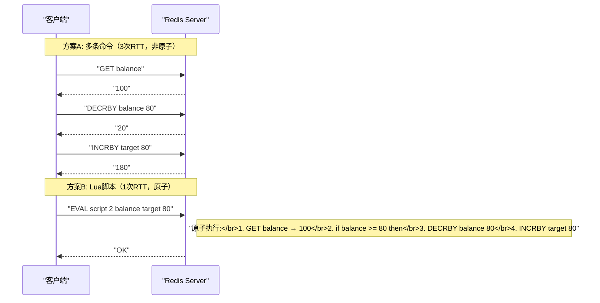

# 03 Redis 事务 Lua 脚本与原子性保证

**摘要：**

Redis 的单条命令天然是原子的——[[05 单线程模型与事件驱动架构|单线程模型]]保证了命令之间不会交错执行。但很多业务操作需要**多条命令组合**才能完成：先读余额再扣款、先检查库存再扣减、先获取锁再设置过期时间……如果这些命令之间不是原子的，并发场景下就会出现竞态条件（Race Condition）——两个客户端同时读到余额 100，各扣 80，最终余额变成 20 而不是报错。Redis 提供了两种机制来实现多命令的原子操作：**事务（MULTI/EXEC）** 和 **Lua 脚本（EVAL）**。事务通过命令排队 + 批量执行保证了隔离性，配合 WATCH 实现乐观锁；Lua 脚本在 Redis 内部作为一个整体执行，天然原子——不会被其他命令打断。Redis 7.0 进一步引入了 **Redis Function**，作为 Lua 脚本的增强替代。本文从事务的语义和局限出发，深入 Lua 脚本的执行模型、编写规范和典型实战模式，最后介绍 Redis Function 的设计理念。

---

## 第 1 章 Redis 事务——MULTI/EXEC

### 1.1 事务的基本模型

Redis 事务由三个命令构成：

```bash
MULTI                          # 开始事务
SET account:A 80               # 命令入队（不立即执行）
SET account:B 120              # 命令入队
EXEC                           # 批量执行所有入队命令
```

`MULTI` 之后的所有命令不会立即执行——它们被放入一个**命令队列**，直到 `EXEC` 时才一次性按顺序执行。在 EXEC 执行期间，Redis 的单线程模型保证不会有其他客户端的命令插入——这就是事务的**隔离性**。

如果在 MULTI 之后、EXEC 之前想放弃事务，使用 `DISCARD`——清空命令队列，回到正常模式。

### 1.2 Redis 事务 vs 数据库事务

Redis 事务和关系型数据库（如 [[01 MySQL 全局架构——一条 SQL 的完整生命周期|MySQL]]）的事务有**本质区别**——理解这些区别对正确使用 Redis 事务至关重要：

| 特性 | MySQL 事务 | Redis 事务 |
| :--- | :--- | :--- |
| **原子性（Atomicity）** | ✅ 要么全部成功，要么全部回滚 | ⚠️ 命令全部执行，但**不支持回滚** |
| **一致性（Consistency）** | ✅ 约束保证 | ⚠️ 弱保证 |
| **隔离性（Isolation）** | ✅ 多级别隔离 | ✅ 单线程串行执行 |
| **持久性（Durability）** | ✅ redo log | ⚠️ 取决于持久化配置 |
| **回滚能力** | ✅ ROLLBACK | ❌ 不支持 |
| **条件执行** | ✅ WHERE 子句 | ❌ 事务内无法 if/else |

**Redis 事务不支持回滚**——这是最容易被误解的点。如果事务中的第 3 条命令执行失败（如对 String 类型执行 LPUSH），前两条命令的结果**不会被撤销**。Redis 的作者 antirez 对此的解释是：Redis 命令失败只有两种情况——(1) 语法错误（MULTI 阶段就能检测到，整个事务会被拒绝）；(2) 对错误类型的 key 执行命令——这是编程错误，不应该靠回滚来解决。不支持回滚使得 Redis 事务的实现极其简单高效，不需要 undo log。

### 1.3 事务的错误处理

**入队阶段的语法错误**——整个事务被拒绝：

```bash
MULTI
SET key1 "value1"
SETX key2 "value2"            # 不存在的命令 → 语法错误
EXEC
# 返回错误，key1 也不会被设置
```

**执行阶段的类型错误**——错误命令失败，其他命令正常执行：

```bash
SET key1 "hello"               # String 类型
MULTI
LPUSH key1 "world"             # 对 String 执行 List 命令 → 类型错误
SET key2 "value2"
EXEC
# 返回：
# 1) ERR WRONGTYPE Operation against a key holding the wrong kind of value
# 2) OK
# key2 被成功设置，key1 的 LPUSH 失败但不影响 key2
```

### 1.4 WATCH——乐观锁

事务的命令队列在 EXEC 时才执行——但 MULTI 到 EXEC 之间的时间窗口内，被操作的 key 可能已经被其他客户端修改了。`WATCH` 提供了**乐观锁**机制来解决这个问题：

```bash
WATCH account:A                # 监视 key
balance = GET account:A        # 读取当前余额（假设 100）

# 如果余额足够，发起扣款
MULTI
SET account:A 20               # 100 - 80 = 20
SET account:B 180              # 100 + 80 = 180
EXEC
# 如果在 WATCH 之后、EXEC 之前，account:A 被其他客户端修改了：
# EXEC 返回 nil（事务被取消）
# 客户端需要重试整个流程
```

**WATCH 的语义**：在 EXEC 时检查被 WATCH 的 key 是否在 WATCH 之后被修改过（任何修改，包括 SET/DEL/EXPIRE 等）。如果被修改过，EXEC 返回 nil——事务被取消，所有入队的命令都不会执行。这就是经典的 **CAS（Compare-And-Swap）乐观锁模式**——类似于数据库的乐观锁 `UPDATE ... WHERE version = ?`。

**WATCH 的局限**：

- 每次失败都需要**重试整个流程**（WATCH → GET → MULTI → SET → EXEC）——高竞争场景下重试次数可能很多
- WATCH 只能监视 key 级别——无法监视 Hash 的某个字段或 List 的某个元素
- 事务内无法根据读取结果做条件判断——因为命令在入队时还没执行

### 1.5 事务的适用场景与局限

**适用**：
- 需要批量执行一组命令且保证隔离性（不被其他命令插入）
- 配合 WATCH 实现简单的 CAS 操作

**局限**：
- 不支持回滚——不适合需要"全部成功或全部撤销"的场景
- 事务内无法做条件判断——不能 "如果 A > 0 则 DECR A"
- WATCH + MULTI/EXEC 在高竞争下重试开销大

这些局限正是 **Lua 脚本**诞生的原因。

---

## 第 2 章 Lua 脚本——真正的原子操作

### 2.1 为什么 Lua 脚本能解决事务的局限

Lua 脚本在 Redis 中的执行具有以下特性：

1. **原子性**：整个脚本作为一个命令执行——执行期间不会有任何其他命令被处理（[[05 单线程模型与事件驱动架构|单线程]]保证）
2. **条件逻辑**：Lua 是一门完整的编程语言——可以在脚本内做 if/else、循环、字符串操作等
3. **读写一体**：脚本内可以先读取数据、基于结果做判断、然后写入——整个过程原子且无竞态
4. **减少网络往返**：多条命令合并为一次脚本调用——一次 RTT 完成所有操作



### 2.2 EVAL 命令

```bash
EVAL "脚本内容" numkeys key1 key2 ... arg1 arg2 ...
```

- **脚本内容**：Lua 5.1 代码（Redis 内嵌了 Lua 5.1 解释器）
- **numkeys**：后续参数中 key 的数量
- **key1, key2, ...**：脚本操作的 Redis key——在脚本内通过 `KEYS[1]`, `KEYS[2]` 访问
- **arg1, arg2, ...**：脚本的额外参数——在脚本内通过 `ARGV[1]`, `ARGV[2]` 访问

**为什么要区分 KEYS 和 ARGV？** 在 [[10 Redis Cluster 分布式架构|Redis Cluster]] 中，Redis 需要知道脚本操作的所有 key 以确定它们是否在同一个哈希槽——KEYS 参数就是为此设计的。如果脚本中动态拼接 key（如 `redis.call('GET', 'user:' .. ARGV[1])`），Redis Cluster 无法正确路由——这是一个常见的错误。

### 2.3 redis.call vs redis.pcall

在 Lua 脚本内部，通过 `redis.call()` 或 `redis.pcall()` 调用 Redis 命令：

```lua
-- redis.call(): 命令出错时脚本立即终止，错误返回给客户端
local val = redis.call('GET', KEYS[1])

-- redis.pcall(): 命令出错时不终止脚本，返回错误对象
local ok, err = pcall(redis.call, 'GET', KEYS[1])
if not ok then
    -- 错误处理
end
```

**最佳实践**：大多数情况使用 `redis.call()`——让错误尽早暴露。只在需要对特定命令做错误处理时使用 `redis.pcall()`。

### 2.4 EVALSHA 与脚本缓存

每次 `EVAL` 都要传输完整的脚本内容——对于较长的脚本这是浪费带宽。Redis 对每个脚本计算 SHA1 哈希值并缓存——后续可以用 `EVALSHA` 只传 SHA1 值：

```bash
# 第一次执行：Redis 缓存脚本并返回 SHA1
EVAL "return redis.call('GET', KEYS[1])" 1 mykey
# Redis 内部计算 SHA1 = "a42059b356c875f0717db19a51f6aaa9161571a2"

# 后续执行：只传 SHA1
EVALSHA "a42059b356c875f0717db19a51f6aaa9161571a2" 1 mykey

# 预加载脚本（不执行，只缓存）
SCRIPT LOAD "return redis.call('GET', KEYS[1])"
# 返回 SHA1

# 检查脚本是否已缓存
SCRIPT EXISTS "a42059b356c875f0717db19a51f6aaa9161571a2"

# 清空脚本缓存
SCRIPT FLUSH
```

**生产实践**：大多数 Redis 客户端库（Jedis、Lettuce、redis-py、ioredis）都内置了 EVALSHA 优化——先尝试 EVALSHA，如果返回 NOSCRIPT 错误则自动 fallback 到 EVAL。开发者无需手动管理 SHA1。

### 2.5 Lua 脚本的沙箱限制

为了安全性和确定性，Redis 对 Lua 脚本施加了严格的沙箱限制：

| 限制 | 原因 |
| :--- | :--- |
| **禁止访问文件系统** | 安全性——脚本不能读写服务器文件 |
| **禁止网络操作** | 安全性——脚本不能发起外部请求 |
| **禁止 os 模块** | 安全性——脚本不能执行系统命令 |
| **禁止全局变量** | 确定性——脚本执行结果必须只取决于输入参数和 Redis 数据 |
| **随机命令排序** | 确定性——SMEMBERS 等返回无序结果的命令会被自动排序（Redis 7.0 前）|
| **超时保护** | `lua-time-limit`（默认 5 秒）——超时后不终止脚本，但开始接受 SCRIPT KILL 命令 |

> [!warning] Lua 脚本超时的危险
> `lua-time-limit` 只是一个"软限制"——超时后 Redis 不会主动终止脚本，而是开始接受 `SCRIPT KILL` 或 `SHUTDOWN NOSAVE` 命令。如果脚本已经执行了写操作，`SCRIPT KILL` 会失败（因为无法回滚已写入的数据）——此时只能 `SHUTDOWN NOSAVE` 强制关闭 Redis（丢失未持久化的数据）。因此 Lua 脚本**必须保持简短高效**——避免在脚本中做复杂循环或处理大量数据。

---

## 第 3 章 Lua 脚本实战模式

### 3.1 库存扣减——"检查并扣减"原子操作

这是最经典的 Lua 脚本场景——先检查库存是否充足，再原子扣减：

```lua
-- 库存扣减脚本
-- KEYS[1]: 库存 key（如 inventory:sku:2001）
-- ARGV[1]: 扣减数量

local stock = tonumber(redis.call('GET', KEYS[1]))
if stock == nil then
    return -1                        -- key 不存在
end

local amount = tonumber(ARGV[1])
if stock >= amount then
    redis.call('DECRBY', KEYS[1], amount)
    return stock - amount            -- 返回剩余库存
else
    return -2                        -- 库存不足
end
```

```bash
# 调用
EVAL "上述脚本" 1 inventory:sku:2001 1
# 返回剩余库存，或 -1（key不存在），或 -2（库存不足）
```

**为什么不用 WATCH + MULTI？** WATCH 方案在高并发下（如秒杀场景）大量事务会因为 WATCH 冲突而失败重试——重试风暴可能压垮客户端。Lua 脚本没有这个问题——直接原子执行，无需重试。

### 3.2 滑动窗口限流

```lua
-- 滑动窗口限流脚本
-- KEYS[1]: 限流 key（如 rate:limit:user:1001）
-- ARGV[1]: 当前时间戳（毫秒）
-- ARGV[2]: 窗口大小（毫秒）
-- ARGV[3]: 最大请求数
-- ARGV[4]: 唯一请求 ID

local key = KEYS[1]
local now = tonumber(ARGV[1])
local window = tonumber(ARGV[2])
local limit = tonumber(ARGV[3])
local member = ARGV[4]

-- 移除窗口外的旧请求
redis.call('ZREMRANGEBYSCORE', key, 0, now - window)

-- 计算当前窗口内的请求数
local count = redis.call('ZCARD', key)

if count < limit then
    -- 允许请求：添加到 ZSet 并设置过期时间
    redis.call('ZADD', key, now, member)
    redis.call('PEXPIRE', key, window)
    return 1                         -- 允许
else
    return 0                         -- 拒绝
end
```

### 3.3 分布式锁的安全释放

[[06 Redis 分布式锁——从 SETNX 到 Redlock 的争议|分布式锁]]的释放必须是原子的——先检查锁的持有者是否是自己，再删除。如果分成两步（GET + DEL），可能在 GET 之后、DEL 之前锁已过期并被其他客户端获取，导致误删别人的锁。

```lua
-- 安全释放锁
-- KEYS[1]: 锁的 key
-- ARGV[1]: 锁的持有者标识（UUID）

if redis.call('GET', KEYS[1]) == ARGV[1] then
    return redis.call('DEL', KEYS[1])    -- 是自己的锁，删除
else
    return 0                              -- 不是自己的锁，不操作
end
```

### 3.4 令牌桶限流

令牌桶算法比滑动窗口更适合需要**允许突发流量**的场景——桶中有令牌就允许请求，令牌以固定速率补充：

```lua
-- 令牌桶限流
-- KEYS[1]: 桶 key
-- KEYS[2]: 上次填充时间 key
-- ARGV[1]: 桶容量
-- ARGV[2]: 填充速率（每秒令牌数）
-- ARGV[3]: 当前时间戳（秒，浮点数）
-- ARGV[4]: 本次请求需要的令牌数

local capacity = tonumber(ARGV[1])
local rate = tonumber(ARGV[2])
local now = tonumber(ARGV[3])
local requested = tonumber(ARGV[4])

-- 获取当前桶中的令牌数和上次填充时间
local tokens = tonumber(redis.call('GET', KEYS[1]))
local last_time = tonumber(redis.call('GET', KEYS[2]))

if tokens == nil then
    tokens = capacity                    -- 初始化：桶满
    last_time = now
end

-- 计算自上次以来应该补充的令牌数
local elapsed = math.max(0, now - last_time)
local new_tokens = math.min(capacity, tokens + elapsed * rate)

if new_tokens >= requested then
    -- 令牌充足，扣减并允许
    new_tokens = new_tokens - requested
    redis.call('SET', KEYS[1], tostring(new_tokens))
    redis.call('SET', KEYS[2], tostring(now))
    return 1                             -- 允许
else
    -- 令牌不足，拒绝（不扣减）
    redis.call('SET', KEYS[1], tostring(new_tokens))
    redis.call('SET', KEYS[2], tostring(now))
    return 0                             -- 拒绝
end
```

### 3.5 批量操作与 Pipeline 结合

Lua 脚本本身是一次网络请求完成所有操作——但如果需要对**多个不相关的 key 组**分别执行脚本，可以将多次 EVALSHA 调用放入 [[08 Redis Pipeline 与客户端性能优化|Pipeline]] 中，进一步减少 RTT：

```python
# Python 示例（redis-py）
pipe = redis_client.pipeline()
for user_id in user_ids:
    pipe.evalsha(sha1, 1, f"rate:limit:{user_id}", now, window, limit, uuid4())
results = pipe.execute()
```

---

## 第 4 章 Lua 脚本编写规范

### 4.1 所有 key 必须通过 KEYS 参数传入

```lua
-- ❌ 错误：动态拼接 key
local val = redis.call('GET', 'user:' .. ARGV[1])

-- ✅ 正确：通过 KEYS 传入
local val = redis.call('GET', KEYS[1])
```

在 Redis Cluster 中，Redis 需要通过 KEYS 参数计算哈希槽来确定命令路由。动态拼接 key 会导致 Cluster 无法正确路由，脚本可能报错或行为异常。即使在单机 Redis 中，也应遵循这一规范——为将来迁移到 Cluster 做准备。

### 4.2 保持脚本简短

Lua 脚本在执行期间会阻塞 Redis 的所有其他操作——脚本执行 10ms，所有其他客户端就等待 10ms。脚本应该只包含必要的 Redis 操作和简单的条件逻辑——复杂的计算应在客户端完成。

**经验法则**：如果脚本的 Redis 命令超过 10 个或执行时间超过 1ms，需要审视是否可以优化或拆分。

### 4.3 幂等性设计

网络超时时客户端不确定脚本是否执行成功——可能会重试。脚本应设计为**幂等的**——重复执行不会产生错误结果。

```lua
-- ❌ 非幂等：重复执行会多次扣减
redis.call('DECRBY', KEYS[1], ARGV[1])

-- ✅ 幂等：通过唯一 ID 去重
local done = redis.call('SISMEMBER', KEYS[2], ARGV[2])
if done == 1 then
    return -3                            -- 已处理过
end
redis.call('DECRBY', KEYS[1], ARGV[1])
redis.call('SADD', KEYS[2], ARGV[2])    -- 记录已处理的请求 ID
```

### 4.4 返回值类型映射

Lua 和 Redis 之间的类型转换：

| Lua 类型 | Redis 返回类型 |
| :--- | :--- |
| number（整数） | Integer |
| string | Bulk String |
| table（数组） | Array |
| boolean true | Integer 1 |
| boolean false | Nil |
| nil | Nil |

> [!warning] Lua 数字精度
> Lua 5.1 的 number 类型是双精度浮点数——当 Redis 返回大整数（如 INCR 返回 2^53 以上的值）时，Lua 中可能丢失精度。处理大整数时应使用字符串传递。

---

## 第 5 章 Redis Function（7.0+）

### 5.1 Lua 脚本的痛点

Lua 脚本虽然强大，但存在一些管理上的痛点：

- **脚本管理混乱**：脚本存储在客户端代码中——不同项目/语言可能各自维护一份脚本副本
- **无命名空间**：只有 SHA1 标识——无法直观地知道某个 SHA1 对应什么业务逻辑
- **无版本管理**：更新脚本需要客户端重新加载——无法在 Redis 侧直接升级
- **缓存易失**：`SCRIPT FLUSH` 或 Redis 重启后脚本缓存丢失——需要重新加载

### 5.2 Redis Function 的设计

Redis 7.0 引入了 **Redis Function** 来解决这些问题——Function 是服务器端持久化的命名函数，存储在 Redis 中并随 RDB/AOF 持久化：

```bash
# 注册一个 Function Library（包含一个或多个函数）
FUNCTION LOAD "#!lua name=mylib
redis.register_function('my_decrby_if_enough', function(keys, args)
    local stock = tonumber(redis.call('GET', keys[1]))
    if stock == nil then return -1 end
    local amount = tonumber(args[1])
    if stock >= amount then
        redis.call('DECRBY', keys[1], amount)
        return stock - amount
    else
        return -2
    end
end)
"

# 调用函数
FCALL my_decrby_if_enough 1 inventory:sku:2001 1

# 查看所有已注册的函数
FUNCTION LIST

# 删除 Library
FUNCTION DELETE mylib

# 导出所有 Function（用于迁移）
FUNCTION DUMP
FUNCTION RESTORE <serialized-data>
```

### 5.3 Function vs Lua 脚本

| 维度 | Lua 脚本（EVAL/EVALSHA） | Redis Function（FCALL） |
| :--- | :--- | :--- |
| **标识** | SHA1 哈希 | 命名函数 |
| **持久化** | ❌ 仅缓存，重启后丢失 | ✅ 随 RDB/AOF 持久化 |
| **管理** | 客户端管理脚本内容 | 服务端管理，FUNCTION LIST/DELETE |
| **复制** | ✅ 命令传播 | ✅ 命令传播 |
| **组织** | 独立脚本 | Library 中可包含多个函数 |
| **最低版本** | Redis 2.6 | Redis 7.0 |

**建议**：Redis 7.0+ 的新项目优先使用 Function；兼容老版本或简单场景继续使用 EVAL/EVALSHA。

---

## 第 6 章 事务 vs Lua 脚本选型

| 维度 | MULTI/EXEC 事务 | Lua 脚本 |
| :--- | :--- | :--- |
| **原子性** | 命令批量执行，不被打断 | 脚本整体执行，不被打断 |
| **条件逻辑** | ❌ 不支持（入队时命令未执行） | ✅ 支持 if/else/loop |
| **读后写** | ❌ 事务内无法基于读取结果做判断 | ✅ 可以先读再判断再写 |
| **乐观锁** | ✅ WATCH | 不需要——脚本本身就是原子的 |
| **高竞争场景** | ❌ WATCH 失败重试多 | ✅ 无竞争——直接原子执行 |
| **回滚** | ❌ | ❌ |
| **复杂度** | 低 | 中（需要学习 Lua） |
| **调试** | 容易 | 较难（需要 redis-cli --eval）|

**选型建议**：

- **简单的批量写入**（不需要条件判断）：MULTI/EXEC 足够——简单直接
- **需要"先读后写"的原子操作**（库存扣减、限流、锁释放）：必须用 Lua 脚本
- **高竞争场景的原子操作**（秒杀、计数器）：Lua 脚本——避免 WATCH 重试风暴
- **Redis 7.0+ 的持久化脚本管理**：Redis Function

---

## 第 7 章 总结

本文系统分析了 Redis 中实现多命令原子操作的三种机制：

- **MULTI/EXEC 事务**：命令入队 + 批量执行保证隔离性，但不支持回滚、不支持条件逻辑；配合 WATCH 实现 CAS 乐观锁，但高竞争下重试开销大
- **Lua 脚本**：真正的原子操作——脚本在 Redis 内部作为整体执行，支持条件判断和读后写，是实现库存扣减、限流、锁释放等复杂原子操作的首选；需注意保持脚本简短、所有 key 通过 KEYS 传入、设计幂等性
- **Redis Function**（7.0+）：Lua 脚本的增强替代——命名函数、服务端持久化、Library 组织，解决了脚本管理和缓存易失的痛点

核心原则：**单条命令天然原子；多条命令的原子操作优先用 Lua 脚本；只有简单的批量写入才用 MULTI/EXEC。**

下一篇 [[04 缓存设计模式与一致性问题]] 将深入分析 Redis 作为缓存的架构设计——四种缓存模式的对比、穿透/击穿/雪崩的防御方案，以及最棘手的数据库与缓存双写一致性问题。

---

## 参考资料

1. Redis Documentation - Transactions：https://redis.io/docs/interact/transactions/
2. Redis Documentation - Scripting with Lua：https://redis.io/docs/interact/programmability/lua-api/
3. Redis Documentation - Redis Functions：https://redis.io/docs/interact/programmability/functions-intro/
4. Antirez - Redis Transactions：http://antirez.com/news/
5. Redis Source Code - scripting.c / multi.c：https://github.com/redis/redis/tree/unstable/src

---

> [!note] 思考题
> 1. Sorted Set 延迟队列的'获取并删除'操作需要原子性。`ZPOPMIN`（Redis 5.0+）原子弹出分数最小的元素——但无法加条件（如只弹出分数 ≤ 当前时间的元素）。Lua 脚本 `ZRANGEBYSCORE + ZREM` 保证原子性。在多消费者场景中如何避免同一消息被多个消费者获取？
> 2. 消息可靠性：消费者获取消息后崩溃导致消息丢失。'处理中队列'模式——消息从延迟队列移到'processing' Sorted Set（score 为超时时间），处理完后删除；超时未删除的消息重新入队。这与 Redis Stream 的 `XPENDING` + `XCLAIM` 机制有什么相似？你是否应该直接使用 Redis Stream 替代 Sorted Set 延迟队列？
> 3. Redis 延迟队列在什么数据量下适用——如果每天有千万级延迟任务，Redis 的内存占用和 CPU 开销是否可控？与 RocketMQ 的延迟消息（支持 18 个固定延迟级别）和 RabbitMQ 的 Dead Letter Queue（通过 TTL + DLX 实现任意延迟）相比，Redis 方案的灵活性和可靠性如何？
