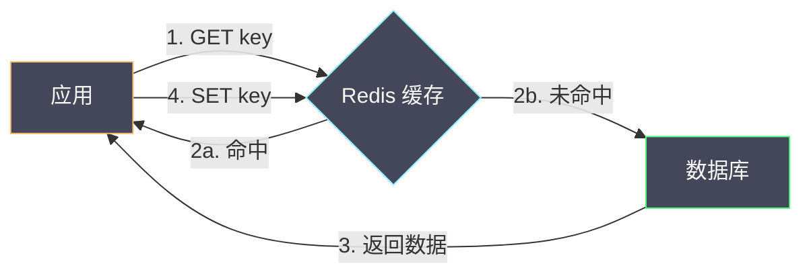
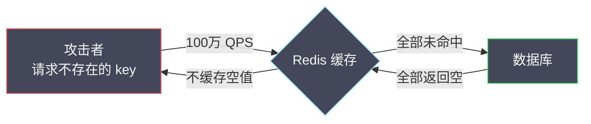
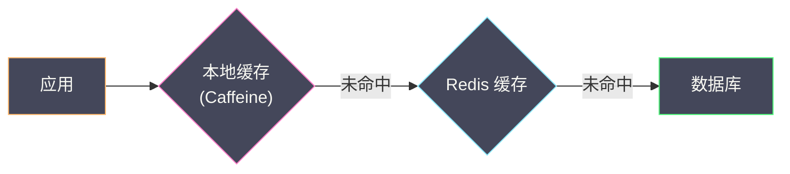
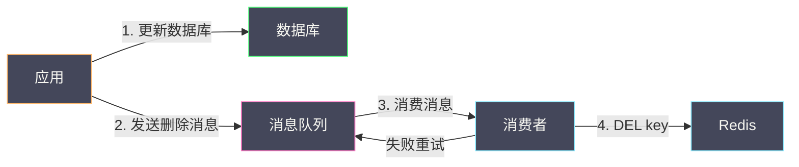

# 04 缓存设计模式与一致性问题

**摘要：**

在 Redis 的所有应用场景中，**缓存**是最普遍也是最容易出问题的。表面上看缓存很简单——查缓存，有就返回，没有就查数据库再写回缓存。但工程实践中，几乎每一步都暗藏陷阱：缓存和数据库谁先更新？先更新数据库再删缓存的窗口期内读到旧数据怎么办？数百万个不存在的 key 被恶意请求打穿缓存直达数据库（缓存穿透）怎么防？热点 key 在过期的瞬间被数千个并发请求同时打到数据库（缓存击穿）怎么处理？大量 key 在同一时刻集中过期导致数据库瞬间承受雪崩压力怎么化解？本文从缓存的四种经典设计模式（Cache Aside、Read Through、Write Through、Write Behind）出发，逐一剖析穿透、击穿、雪崩三大问题的成因和防御方案，最后深入讨论数据库与缓存双写一致性这个最棘手的工程难题。

---

## 第 1 章 缓存的本质与代价

### 1.1 为什么需要缓存

数据库（如 [[01 MySQL 全局架构——一条 SQL 的完整生命周期|MySQL]]）的数据存储在磁盘上——即使有 [[02 InnoDB Buffer Pool——内存与磁盘之间的桥梁|Buffer Pool]] 的缓存加持，一次复杂查询的延迟也在毫秒级，而单机 MySQL 的 QPS 上限通常在数千到万级。对于互联网应用来说，一个商品详情页、一个用户信息接口可能每秒被请求数万次——数据库扛不住。

缓存的本质是**用更快的存储介质（内存）来缓解更慢的存储介质（磁盘）的压力**。Redis 的单机读写性能在 10 万+ QPS，延迟在亚毫秒级——比 MySQL 快 1-2 个数量级。在数据库前加一层 Redis 缓存后，绝大多数读请求（通常 90%-99%）在缓存层就能满足，只有缓存未命中的少量请求才会穿透到数据库。

### 1.2 缓存引入的代价

缓存不是免费的午餐——它引入了两个根本性的复杂度：

**数据一致性问题**：数据库和缓存是两个独立的存储——它们之间没有事务保证。当数据更新时，数据库和缓存可能在短暂的时间窗口内保持不同的值。这个不一致窗口有多长、是否可以接受，是缓存架构设计的核心权衡。

**可用性风险**：如果缓存整体不可用（Redis 宕机），所有请求瞬间打到数据库——数据库大概率会被压垮（缓存雪崩的极端形态）。缓存从"加速器"变成了"单点依赖"。

---

## 第 2 章 四种缓存设计模式

### 2.1 Cache Aside（旁路缓存）

**Cache Aside** 是最经典、最常用的缓存模式——应用程序同时管理缓存和数据库，缓存不直接与数据库交互。

**读流程**：



1. 应用先查缓存
2. 缓存命中：直接返回
3. 缓存未命中：查数据库
4. 将数据库结果写入缓存（设置 TTL）

**写流程**：

1. **先更新数据库**
2. **再删除缓存**（注意：是"删除"而不是"更新"）

**为什么是"删除缓存"而不是"更新缓存"？** 假设两个并发写请求 A 和 B 同时更新同一条数据：

- A 更新数据库为值 1
- B 更新数据库为值 2
- B 更新缓存为值 2
- A 更新缓存为值 1

最终数据库中是值 2（正确），缓存中是值 1（错误）——缓存和数据库不一致。"更新缓存"在并发写场景下存在覆盖问题。而"删除缓存"的语义是"让下一次读去重新加载"——避免了并发写的覆盖问题。

此外，如果缓存的值是通过复杂计算得到的（如多表关联查询的结果），每次写入时重新计算缓存值是浪费——不如删除缓存，等下次读时再计算（lazy loading）。

### 2.2 Read Through（读穿透）

**Read Through** 与 Cache Aside 的读流程类似，但关键区别在于**缓存层负责从数据库加载数据**——应用只与缓存交互，不直接访问数据库。

```
应用 → 缓存层（命中则返回；未命中则自动查数据库、写缓存、返回）
```

**优点**：应用代码更简洁——不需要手动写"查缓存 → 查数据库 → 回填缓存"的逻辑。
**缺点**：缓存层需要内置数据库访问能力——增加了缓存层的复杂度。

Redis 原生不支持 Read Through——需要在应用层或中间件层实现。一些缓存框架（如 Spring Cache 的 `@Cacheable` 注解）本质上实现了 Read Through 的语义。

### 2.3 Write Through（写穿透）

**Write Through** 在写操作时，缓存层负责**同步**地将数据写入数据库：

```
应用写缓存 → 缓存层同步写数据库 → 两者都成功后返回
```

**优点**：数据一致性强——缓存和数据库始终同步。
**缺点**：写延迟高——每次写操作都要等待数据库写入完成。

Write Through 通常与 Read Through 搭配使用——形成一个完整的缓存代理层，应用只与缓存交互。

### 2.4 Write Behind（异步写回）

**Write Behind**（也叫 Write Back）在写操作时，缓存层只更新缓存并立即返回——**异步**地将数据批量写入数据库：

```
应用写缓存 → 立即返回成功 → 缓存层异步/批量写数据库
```

**优点**：写延迟极低（只写内存）；可以合并多次写入为一次数据库操作（减少 I/O）。
**缺点**：数据可能丢失——缓存宕机时未刷入数据库的数据会丢失；数据一致性窗口较大。

Write Behind 适合对写性能要求极高、允许少量数据丢失的场景（如计数器、用户行为日志）。

### 2.5 四种模式对比

| 维度 | Cache Aside | Read Through | Write Through | Write Behind |
| :--- | :--- | :--- | :--- | :--- |
| **读流程** | 应用管理 | 缓存层自动加载 | 缓存层自动加载 | 缓存层自动加载 |
| **写流程** | 应用先写 DB 再删缓存 | 应用写缓存 | 缓存层同步写 DB | 缓存层异步写 DB |
| **一致性** | 最终一致（短暂不一致）| 最终一致 | 强一致 | 弱一致（可能丢数据）|
| **写延迟** | 数据库写入延迟 | 数据库写入延迟 | 数据库写入延迟 | 极低（只写内存）|
| **实现复杂度** | 低 | 中 | 中 | 高 |
| **适用场景** | 通用 | 缓存代理层 | 强一致需求 | 高写入吞吐 |

> [!note] 生产中的主流选择
> **Cache Aside 是绝大多数互联网应用的默认选择**——实现简单、行为可控、一致性窗口短（毫秒级）。除非有特殊需求（如缓存代理层、极致写性能），否则优先使用 Cache Aside。

---

## 第 3 章 缓存穿透

### 3.1 问题定义

**缓存穿透**指的是查询一个**数据库中不存在的数据**——缓存中自然也没有。每次请求都穿过缓存直达数据库，缓存层完全失去了保护作用。

正常情况下这不是问题——偶尔查询不存在的数据不会有太大影响。但如果是**恶意攻击**——攻击者构造大量不存在的 key（如随机 UUID）发起高频请求，所有请求都会打到数据库——数据库可能被压垮。



### 3.2 防御方案一：缓存空值

最简单的方案——当数据库返回空结果时，在缓存中写入一个空值（如空字符串或特殊标记），设置较短的 TTL：

```bash
# 查数据库，结果为空
# 在缓存中写入空值，TTL 60 秒
SET user:999999 "" EX 60
```

**优点**：实现极简。
**缺点**：如果攻击者每次用不同的 key（如随机 UUID），缓存中会积累大量空值——浪费内存且对新的 key 无防护效果。

**适用场景**：key 的空间有限且可枚举的场景（如用户 ID 查询——用户 ID 的范围是确定的）。

### 3.3 防御方案二：布隆过滤器

在缓存层前加一个[[02 高级数据类型——HyperLogLog Bitmap Geo Stream|布隆过滤器]]——将所有合法的 key（数据库中存在的 key）提前加载到布隆过滤器中。查询时先检查布隆过滤器：

- **返回"不存在"**：直接拒绝请求——一定不存在
- **返回"可能存在"**：继续查缓存和数据库

```bash
# 启动时或定期从数据库加载所有合法 key
BF.MADD valid:keys "user:1001" "user:1002" ... "user:9999999"

# 查询时先检查布隆过滤器
BF.EXISTS valid:keys "user:random-uuid"
# 返回 0 → 直接拒绝
```

**优点**：对任意 key 都有防护效果——即使每次 key 不同，布隆过滤器也能过滤绝大多数非法请求。
**缺点**：布隆过滤器有误判率（默认约 1%——可以调低但会增加内存）；新增数据需要同步到布隆过滤器；布隆过滤器不支持删除（需要用 Cuckoo Filter 或定期重建）。

### 3.4 防御方案三：请求合法性校验

在缓存之前增加**参数校验**——例如用户 ID 必须是正整数且在合理范围内、商品 ID 符合特定格式等。非法请求直接在入口层拒绝，根本不需要查缓存。

这是最基础的防线——但只能防御格式明显异常的请求，对于格式合法但数据不存在的请求无能为力。

**最佳实践**：三种方案组合使用——参数校验（入口层）→ 布隆过滤器（缓存前）→ 缓存空值（兜底）。

---

## 第 4 章 缓存击穿

### 4.1 问题定义

**缓存击穿**指的是一个**热点 key 在过期的瞬间**，大量并发请求同时到达——缓存中没有数据（刚过期），所有请求同时穿透到数据库。

与缓存穿透不同，击穿涉及的是**真实存在的热点数据**——它在缓存中存在了很久，但因为 TTL 到期被删除了。在它被重新加载到缓存的短暂间隙（几十毫秒），可能有数千个请求同时查询数据库。

### 4.2 防御方案一：互斥锁（Mutex Lock）

当缓存未命中时，不是所有请求都去查数据库——而是只允许**一个请求**去查数据库并回填缓存，其他请求等待或重试：

```lua
-- Lua 脚本：获取数据或等待缓存重建
-- KEYS[1]: 数据 key
-- KEYS[2]: 锁 key

-- 1. 尝试获取缓存
local value = redis.call('GET', KEYS[1])
if value then
    return value                          -- 缓存命中
end

-- 2. 缓存未命中，尝试获取锁
local locked = redis.call('SET', KEYS[2], '1', 'NX', 'EX', '10')
if locked then
    return nil                            -- 获取锁成功，返回 nil 告诉客户端去查数据库
else
    return '__WAIT__'                     -- 锁被占用，告诉客户端稍后重试
end
```

客户端逻辑：

```
1. 调用脚本
2. 返回数据 → 直接使用
3. 返回 nil → 查数据库，写缓存，删除锁
4. 返回 __WAIT__ → sleep 50ms 后重试（回到步骤 1）
```

**优点**：严格保证只有一个请求查数据库——数据库压力最小。
**缺点**：其他请求需要等待——增加了整体延迟；锁的管理增加了复杂度。

### 4.3 防御方案二：逻辑过期

不设置 Redis key 的 TTL——让 key 永不自动过期。在缓存值中嵌入一个**逻辑过期时间**字段，由应用程序判断是否过期：

```json
{
  "data": {"id": 1001, "name": "商品A", "price": 99.9},
  "expire_at": 1709424000
}
```

查询时：
1. 读取缓存（一定命中——key 不会自动过期）
2. 检查 `expire_at`——如果未过期，直接返回
3. 如果已过期：
   - **返回旧数据**（允许短暂不一致）
   - 异步触发一个后台任务去查数据库并更新缓存
   - 后台任务用互斥锁保证只有一个线程执行更新

**优点**：读请求永远不会阻塞——即使缓存逻辑过期，也返回旧数据；后台异步更新不影响用户体验。
**缺点**：允许了短暂的数据不一致——在后台更新完成前，所有请求读到的都是旧数据。

### 4.4 防御方案三：永不过期 + 主动更新

对于极端热点的数据（如首页推荐、热门商品），完全不设置过期时间——通过**数据变更时主动更新缓存**来保持数据新鲜：

```
数据库更新 → 发送 MQ 消息 → 消费者更新缓存
```

**优点**：缓存永远存在——不存在击穿问题。
**缺点**：需要可靠的更新机制——如果 MQ 消息丢失或消费失败，缓存会变成"永久旧数据"。

### 4.5 三种方案对比

| 维度 | 互斥锁 | 逻辑过期 | 永不过期 + 主动更新 |
| :--- | :--- | :--- | :--- |
| **一致性** | 强（等待最新数据）| 弱（暂时返回旧数据）| 依赖更新机制 |
| **读延迟** | 部分请求需等待 | 无等待 | 无等待 |
| **数据库压力** | 最小（一个请求）| 最小（异步一个请求）| 无（不查数据库）|
| **实现复杂度** | 中 | 中 | 高（需要 MQ）|
| **适用场景** | 对一致性要求高 | 对可用性要求高 | 极端热点 |

---

## 第 5 章 缓存雪崩

### 5.1 问题定义

**缓存雪崩**指的是**大量 key 在同一时刻集中过期**或**缓存层整体不可用**——导致海量请求瞬间涌入数据库。

两种成因：
- **集中过期**：比如活动开始时批量加载了 10 万个商品缓存，TTL 统一设置为 1 小时——1 小时后 10 万个 key 同时过期
- **Redis 宕机**：缓存层整体不可用，所有请求直接打到数据库

### 5.2 防御：随机过期时间

对集中过期场景，最简单有效的方案是在 TTL 上加一个**随机偏移量**——打散过期时间：

```python
base_ttl = 3600                           # 基础 TTL: 1 小时
random_offset = random.randint(0, 600)    # 随机偏移: 0-10 分钟
ttl = base_ttl + random_offset
redis_client.set(key, value, ex=ttl)
```

10 万个 key 的过期时间从原来的"同一秒过期"变成了"在 10 分钟内均匀分布过期"——数据库的瞬时压力降低了 600 倍。

### 5.3 防御：多级缓存

在 Redis 前再加一层**本地缓存**（如 Caffeine / Guava Cache）——即使 Redis 不可用，本地缓存仍能挡住一部分流量：



**本地缓存的 TTL 应短于 Redis 缓存的 TTL**——避免本地缓存数据过于陈旧。

### 5.4 防御：熔断降级

当检测到数据库压力异常时，触发熔断——直接返回默认值或错误提示，不再查询数据库：

```
if 数据库错误率 > 50% or 响应时间 > 2秒:
    触发熔断 → 返回降级数据（缓存的旧值 / 默认值 / 友好提示）
else:
    正常查询数据库
```

### 5.5 防御：Redis 高可用

对于 Redis 宕机导致的雪崩，根本解决方案是保证 Redis 的高可用——[[09 主从复制与 Sentinel 高可用|Sentinel]] 或 [[10 Redis Cluster 分布式架构|Redis Cluster]]，确保 Redis 不会整体不可用。

---

## 第 6 章 数据库与缓存双写一致性

### 6.1 问题的本质

数据库和缓存是两个独立的存储系统——不存在分布式事务来保证它们的原子更新。无论采用何种更新策略，在并发场景下都可能出现短暂的不一致。

问题的核心在于：**更新数据库和操作缓存是两个独立的步骤，它们之间存在时间窗口——这个窗口内其他请求可能读到不一致的数据。**

### 6.2 策略一：先更新数据库，再删除缓存（推荐）

这是 Cache Aside 的标准写流程，也是**业界最推荐的方案**。

**可能的不一致场景**：

```
时刻1: 请求 A 更新数据库（值从 V1 改为 V2）
时刻2: 请求 B 读缓存（命中，返回 V1——旧值）
时刻3: 请求 A 删除缓存
时刻4: 请求 C 读缓存（未命中，查数据库得到 V2，写缓存 V2）
```

在时刻 2 和时刻 3 之间，请求 B 读到了旧值 V1——不一致窗口是"更新数据库"到"删除缓存"之间的时间（通常是毫秒级的网络延迟）。

**更极端的不一致场景（概率极低）**：

```
时刻1: 请求 A 查缓存（未命中）
时刻2: 请求 A 查数据库（得到 V1）
时刻3: 请求 B 更新数据库（V1 → V2）
时刻4: 请求 B 删除缓存
时刻5: 请求 A 将 V1 写入缓存（旧值被写入缓存！）
```

这个场景要求：请求 A 的"查数据库"在请求 B 的"更新数据库"之前，但请求 A 的"写缓存"在请求 B 的"删缓存"之后。这要求请求 A 的数据库读操作耗时极长（长到跨越了请求 B 的整个"更新数据库 + 删除缓存"流程）——在实际中概率极低。因为数据库读通常比写快得多——读操作几乎不可能比一次写操作+一次 Redis 删除还慢。

### 6.3 策略二：先删除缓存，再更新数据库（不推荐）

**严重的不一致场景（概率很高）**：

```
时刻1: 请求 A 删除缓存
时刻2: 请求 B 读缓存（未命中）
时刻3: 请求 B 查数据库（得到 V1——旧值，因为 A 还没更新数据库）
时刻4: 请求 B 将 V1 写入缓存
时刻5: 请求 A 更新数据库（V1 → V2）
```

最终：数据库是 V2，缓存是 V1——不一致。而且这个旧值会一直存在于缓存中直到 TTL 过期——不一致窗口可能是分钟甚至小时级别。

**结论**：先删缓存再更新数据库的不一致概率远高于先更新数据库再删缓存——**不推荐使用**。

### 6.4 延迟双删

**延迟双删**是对"先删缓存再更新数据库"方案的补救——在更新数据库后，等待一小段时间再第二次删除缓存：

```
1. 删除缓存
2. 更新数据库
3. sleep(500ms)          // 等待读请求完成
4. 再次删除缓存           // 清理在步骤 2-3 之间可能被回填的旧值
```

**问题**：sleep 的时间难以确定——太短可能不够，太长增加不一致窗口。而且 sleep 本身阻塞了写请求的线程。这个方案在工程上不够优雅——**不如直接用"先更新数据库再删缓存"**。

### 6.5 删除缓存失败怎么办？

无论采用哪种策略，"删除缓存"这一步都可能失败（网络超时、Redis 不可用等）。如果删除失败，缓存中残留旧数据——不一致持续到 TTL 过期。

**方案一：重试机制**

将"删除缓存"操作放入消息队列——失败后自动重试：



**方案二：订阅数据库变更日志（Binlog）**

通过 Canal（阿里开源）或 Debezium 订阅 MySQL 的 [[10 Binlog 与主从复制——数据同步的底层传动链|Binlog]]——当检测到数据变更时，自动删除对应的缓存 key：


**Binlog 方案的优势**：
- 应用代码无需关心缓存删除——完全解耦
- 即使应用忘记删除缓存，Binlog 订阅也会兜底
- 支持所有修改数据库的路径（应用写入、DBA 手动修改、数据迁移脚本等）

**缺点**：引入了 Canal/Debezium + MQ 的额外组件——运维复杂度增加。

### 6.6 最终一致性的工程哲学

**没有完美的一致性方案**——在不使用分布式事务的前提下，数据库和缓存之间的不一致是不可避免的。工程上能做的是：

1. **缩短不一致窗口**：先更新数据库再删缓存——窗口在毫秒级
2. **设置合理的 TTL 作为兜底**：即使删除缓存失败，TTL 过期后数据也会自动更新
3. **建立可靠的重试/补偿机制**：MQ 重试或 Binlog 订阅保证缓存最终被更新
4. **接受"短暂不一致"的事实**：大多数业务场景（商品详情、用户信息）可以容忍秒级的不一致

> [!note] 什么场景不能容忍不一致？
> 金融余额、库存数量等涉及"钱"和"数量"的场景不应使用缓存——或者使用时必须配合[[06 Redis 分布式锁——从 SETNX 到 Redlock 的争议|分布式锁]]或[[03 Redis 事务 Lua 脚本与原子性保证|Lua 脚本]]保证原子性。这些场景的"缓存"通常是 Redis 中的实时数据（如库存值），而不是数据库的"副本"。

---

## 第 7 章 总结

本文系统分析了 Redis 缓存设计的核心问题：

- **四种缓存模式**：Cache Aside（应用管理，最常用）、Read Through（缓存层自动加载）、Write Through（缓存层同步写 DB）、Write Behind（缓存层异步写 DB）——生产环境默认选择 Cache Aside
- **缓存穿透**：查询不存在的数据导致请求打穿缓存——防御组合：参数校验 + 布隆过滤器 + 缓存空值
- **缓存击穿**：热点 key 过期瞬间的并发冲击——防御：互斥锁（强一致）、逻辑过期（高可用）、永不过期+主动更新（极端热点）
- **缓存雪崩**：大量 key 集中过期或缓存层不可用——防御：随机 TTL 偏移、多级缓存、熔断降级、Redis 高可用
- **双写一致性**：先更新数据库再删缓存是最佳实践；删除失败通过 MQ 重试或 Binlog 订阅补偿；设置 TTL 作为最终兜底

**核心原则**：缓存是数据库的"加速器"而不是"替代品"——接受最终一致性，用 TTL 兜底，用重试补偿，在性能和一致性之间找到业务可接受的平衡点。

下一篇 [[05 热 Key 大 Key 治理与容量规划]] 将深入分析 Redis 在生产中最常见的两类性能杀手——热 Key 和大 Key 的检测、治理和预防。

---

## 参考资料

1. Cache Aside Pattern - Microsoft Azure Architecture：https://learn.microsoft.com/en-us/azure/architecture/patterns/cache-aside
2. Facebook - Scaling Memcache at Facebook：https://www.usenix.org/system/files/conference/nsdi13/nsdi13-final170_update.pdf
3. Redis Documentation - Client-side caching：https://redis.io/docs/manual/client-side-caching/
4. Canal - 阿里巴巴 MySQL binlog 增量订阅：https://github.com/alibaba/canal
5. Martin Fowler - Patterns of Enterprise Application Architecture (Cache Pattern)
