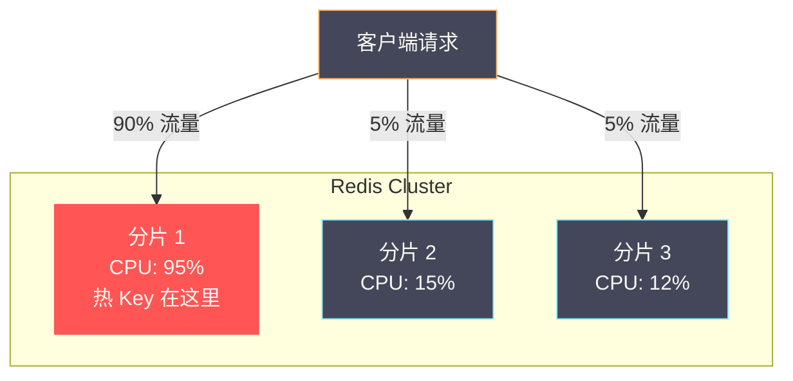

# 05 热 Key 大 Key 治理与容量规划

**摘要：**

Redis 的性能事故中，热 Key 和大 Key 是出现频率最高的两类"慢性杀手"。热 Key 的危害在于流量倾斜——在 [[10 Redis Cluster 分布式架构|Redis Cluster]] 中，一个 key 无论多热门都只存在于一个分片上，如果某个 key 的 QPS 达到数万甚至数十万，该分片的 CPU 被打满而其他分片闲置，集群的整体吞吐量被单个分片的瓶颈锁死。大 Key 的危害更加隐蔽——一个 100MB 的 Hash 看起来无害，但 HGETALL 会阻塞 [[05 单线程模型与事件驱动架构|Redis 单线程]]数百毫秒，DEL 会触发同步释放导致所有客户端卡顿，主从同步时大 Key 的传输会撑爆网络缓冲区。更关键的是，这些问题往往在开发测试阶段不会暴露——只有在生产环境的流量规模下才会显现。本文从大 Key 和热 Key 的精确定义出发，系统介绍检测手段、治理方案和预防策略，最后讨论 Redis 的内存碎片治理和容量规划方法论。

---

## 第 1 章 大 Key——隐形的性能炸弹

### 1.1 什么是大 Key

"大 Key"并没有一个官方的精确定义——它是一个相对概念，取决于业务场景和 Redis 配置。业界通用的经验阈值：

| 数据类型 | 大 Key 阈值 | 说明 |
| :--- | :--- | :--- |
| **String** | 值 > 10KB | 单个值过大 |
| **Hash** | 字段数 > 5000 或总大小 > 10MB | 字段过多或值过大 |
| **List** | 元素数 > 5000 或总大小 > 10MB | 元素过多 |
| **Set** | 元素数 > 5000 或总大小 > 10MB | 元素过多 |
| **ZSet** | 元素数 > 5000 或总大小 > 10MB | 元素过多 |

这些阈值不是绝对的——一个 50KB 的 String 在大多数场景下没有问题，但如果它是一个每秒被读取 10 万次的热点 key，50KB × 100000 = 5GB/s 的网络出带宽就会成为瓶颈。判断是否是大 Key 需要结合**数据大小**和**访问频率**两个维度。

### 1.2 大 Key 的四大危害

**危害一：阻塞单线程**

Redis 是[[05 单线程模型与事件驱动架构|单线程]]执行命令的。对大 Key 执行任何命令——无论是读取（HGETALL 一个 10 万字段的 Hash）还是删除（DEL 一个 100MB 的 ZSet），都可能耗时数十甚至数百毫秒。在这段时间内，所有其他客户端的命令都在排队等待——整个 Redis 实例对外表现为"卡顿"。

典型案例：一个 Hash 存储了某个商品的 10 万条评论（每条评论是一个 field），运营需要定期 `HGETALL` 导出数据——每次执行阻塞 Redis 200ms，导致业务监控报警延迟飙升。

**危害二：网络带宽打满**

假设一个 String key 存储了 5MB 的 JSON 数据，被 100 个客户端并发读取——瞬间产生 500MB 的网络出流量。Redis 的默认网络缓冲区可能被撑满，导致连接被断开或响应延迟急剧增加。

**危害三：主从同步延迟**

Redis 主从复制时，大 Key 的变更会产生大量的[[09 主从复制与 Sentinel 高可用|复制积压缓冲区]]数据。如果大 Key 被频繁修改，可能导致从节点的复制延迟增大，甚至触发全量同步。

**危害四：内存不均衡**

在 Redis Cluster 中，大 Key 会导致分片之间的内存使用严重不均——某个分片因为一个大 Key 而内存使用率 90%，其他分片只用了 30%。这使得集群扩容策略难以规划。

### 1.3 大 Key 的检测方法

**方法一：redis-cli --bigkeys**

Redis 自带的大 Key 扫描工具——基于 SCAN 命令遍历所有 key，找出每种类型中最大的 key：

```bash
redis-cli --bigkeys -i 0.1
# -i 0.1: 每次 SCAN 间隔 0.1 秒，避免对线上造成压力
```

输出示例：
```
[00.00%] Biggest string found so far 'session:abc123' with 52428 bytes
[23.05%] Biggest hash   found so far 'product:reviews:1001' with 103847 members
[45.12%] Biggest zset   found so far 'leaderboard:global' with 2847103 members

-------- summary -------
Biggest string found 'session:abc123' has 52428 bytes
Biggest hash   found 'product:reviews:1001' has 103847 members
Biggest zset   found 'leaderboard:global' has 2847103 members
```

**局限**：只能找到每种类型中**最大的一个** key——如果有多个大 Key，只能看到最大的那个。此外，它只统计元素数量（Hash 的 field 数、List 的长度），不统计内存占用——一个只有 100 个 field 的 Hash，如果每个 field 的 value 是 1MB，也是大 Key，但 `--bigkeys` 可能漏掉它。

**方法二：redis-cli --memkeys（Redis 7.0+）**

Redis 7.0 引入的 `--memkeys` 工具——基于 `MEMORY USAGE` 命令扫描，直接按**内存占用**排序：

```bash
redis-cli --memkeys --memkeys-samples 0
```

**方法三：MEMORY USAGE 命令**

对已知可疑的 key，精确查询内存占用：

```bash
MEMORY USAGE product:reviews:1001 SAMPLES 5
# 返回该 key 占用的精确字节数
# SAMPLES 5: 对复合类型采样 5 个元素估算（0 = 精确计算，但更慢）
```

**方法四：RDB 离线分析**

使用第三方工具（如 `redis-rdb-tools`、`rdb` CLI）分析 RDB 快照文件——完全离线，不影响线上 Redis：

```bash
# 使用 rdb 工具分析
rdb -c memory dump.rdb --bytes 10240 -f memory.csv
# 输出所有 > 10KB 的 key 及其内存占用
```

这是最安全、最全面的方案——可以在凌晨低峰期触发 BGSAVE 生成 RDB，然后在离线机器上分析。

### 1.4 大 Key 的治理方案

**方案一：拆分**

将一个大 Key 拆分为多个小 Key——这是最根本的解决方案。

**Hash 拆分**：一个 10 万 field 的 Hash 拆分为 100 个 Hash，每个 1000 个 field：

```
原始：product:reviews:1001 → 10 万个 field
拆分：product:reviews:1001:0 → field 0-999
      product:reviews:1001:1 → field 1000-1999
      ...
      product:reviews:1001:99 → field 99000-99999

路由：bucket = hash(field_name) % 100
      实际 key = "product:reviews:1001:" + bucket
```

**List 拆分**：按时间或序号分段——如最近 1000 条评论存在 `reviews:1001:latest`，历史评论按月存储 `reviews:1001:2026-01`。

**String 拆分**：如果 String 存储的是大 JSON，考虑改用 Hash 存储各字段，或使用 [[09 Redis 与搜索——RediSearch 与 RedisJSON|RedisJSON]] 模块支持部分读写。

**方案二：异步删除（UNLINK）**

删除大 Key 时不要用 `DEL`——DEL 是同步操作，删除一个 100MB 的 ZSet 可能阻塞 Redis 数秒。使用 `UNLINK`（Redis 4.0+）：

```bash
UNLINK product:reviews:1001
# UNLINK 立即将 key 从 key 空间移除（O(1)）
# 实际内存释放在后台线程异步完成——不阻塞主线程
```

> [!warning] lazyfree 配置
> Redis 4.0+ 支持 `lazyfree-lazy-expire`、`lazyfree-lazy-server-del`、`lazyfree-lazy-user-del` 等配置——开启后，即使使用 DEL 命令或 key 过期/被驱逐，也会在后台线程异步释放内存。生产环境强烈建议开启所有 lazyfree 选项：
> ```
> lazyfree-lazy-expire yes
> lazyfree-lazy-server-del yes
> lazyfree-lazy-user-del yes
> lazyfree-lazy-user-flush yes
> ```

**方案三：渐进式删除**

对于无法使用 UNLINK 的场景（如 Redis 4.0 以前），可以手动渐进式删除：

```bash
# 渐进式删除 Hash
HSCAN bigkey cursor COUNT 100   # 每次扫描 100 个 field
HDEL bigkey field1 field2 ...    # 删除扫描到的 field
# 重复直到 Hash 为空
DEL bigkey                        # 最后删除空 key
```

**方案四：压缩**

如果大 Key 存储的是文本数据（JSON、XML），可以在写入前使用 gzip/snappy/lz4 压缩——在客户端压缩后存入 Redis，读取时解压。压缩比通常在 3-10 倍——5MB 的 JSON 压缩后可能只有 500KB。

代价是 CPU——压缩和解压需要客户端额外的 CPU 时间。对于读多写少的场景（写入时压缩一次，读取时解压多次），这个代价是值得的。

---

## 第 2 章 热 Key——流量倾斜的根源

### 2.1 什么是热 Key

**热 Key** 指的是在短时间内被大量请求访问的 key——其 QPS 远高于其他 key。典型场景：

- 电商秒杀：秒杀商品的库存 key
- 热门新闻：某条刷屏新闻的内容缓存
- 明星微博：某明星发布新动态后的粉丝列表
- 直播间：热门直播间的在线用户数

在单机 Redis 中，热 Key 的问题不严重——只要总 QPS 不超过 Redis 的处理能力（通常 10 万+ QPS）。但在 Redis Cluster 中，热 Key 的问题被放大——因为一个 key 只能存在于一个分片上，所有访问都集中在这个分片，其他分片被浪费。



### 2.2 热 Key 的检测方法

**方法一：redis-cli --hotkeys**

Redis 4.0+ 自带的热点 Key 检测——需要先将 `maxmemory-policy` 设置为 `allkeys-lfu` 或 `volatile-lfu`（LFU 策略会记录每个 key 的访问频率）：

```bash
redis-cli --hotkeys
```

输出每个 key 的访问频率计数——频率最高的就是热 Key。

**局限**：需要开启 LFU 策略——如果线上使用的是 LRU 策略，需要先切换（`CONFIG SET maxmemory-policy allkeys-lfu`），这在生产环境可能不方便。

**方法二：MONITOR 命令（慎用）**

`MONITOR` 实时输出 Redis 接收到的所有命令——可以统计每个 key 的访问频率：

```bash
redis-cli MONITOR | head -10000 > monitor.log
# 分析日志中每个 key 的出现频率
awk '{print $4}' monitor.log | sort | uniq -c | sort -rn | head 20
```

> [!warning] MONITOR 的性能开销
> MONITOR 会将每条命令发送给监控客户端——在高 QPS 场景下，MONITOR 本身可能消耗 Redis 50% 以上的处理能力。**严禁在高峰期长时间运行 MONITOR**——只用于短时间采样。

**方法三：Proxy 层统计**

如果使用了 Redis 代理层（如 Twemproxy、Codis、Redis Cluster Proxy），代理层可以在转发请求时统计每个 key 的 QPS——无需 Redis 做额外工作。这是大规模集群中最推荐的方案。

**方法四：客户端埋点**

在 Redis 客户端 SDK 中增加统计逻辑——每次操作记录 key 名和时间戳，定期聚合上报到监控系统。这种方案可以精确统计每个 key 的 QPS、延迟、数据大小等信息。

### 2.3 热 Key 的治理方案

**方案一：本地缓存（L1 Cache）**

在应用进程内增加一层本地缓存（如 Java 的 Caffeine、Go 的 bigcache）——热 Key 的数据在本地缓存中命中，不需要访问 Redis：

```
应用 → 本地缓存（Caffeine，TTL 1秒）→ Redis → 数据库
```

**设计要点**：
- 本地缓存的 TTL 必须很短（1-5 秒）——否则数据更新后不同机器的本地缓存不一致
- 本地缓存的容量必须有限——只缓存 Top N 的热 Key，避免占用太多 JVM 内存
- 需要一种机制发现哪些 key 是热 Key——可以基于 LFU 统计或提前配置

**优点**：对 Redis 零压力——本地缓存命中后完全不访问 Redis。
**缺点**：多实例之间的本地缓存不一致；增加了一层缓存管理的复杂度。

**方案二：读写分离**

将热 Key 的读请求分散到多个从节点——主节点负责写，多个从节点负责读：

```bash
# 读操作路由到从节点（需要客户端支持 READONLY 模式）
READONLY
GET hot:key
```

**优点**：不需要修改数据结构——只需要增加从节点。
**缺点**：从节点有复制延迟——读到旧数据的概率增加；写操作仍然集中在主节点。

**方案三：Key 分片（多副本）**

将一个热 Key 复制为多个副本——在 key 名后加随机后缀，读取时随机选择一个副本：

```
写入时：同时写入 hot:key:0, hot:key:1, hot:key:2, ..., hot:key:N
读取时：随机选择一个副本读取，如 hot:key:{random(0, N)}
```

如果 N = 10，一个热 Key 的流量被分散到 10 个不同的分片上——每个分片只承受 1/10 的流量。

**优点**：流量被有效分散。
**缺点**：写入需要写 N 次（写放大）；N 个副本之间可能短暂不一致。

### 2.4 热 Key 的预防

- **设计阶段**：避免将大量数据聚合在一个 key 中——按用户/区域/时间分 key
- **Hash Tag 慎用**：Redis Cluster 中 `{tag}` 强制同分片——如果 tag 选择不当可能加剧热点
- **监控告警**：对 Redis 各分片的 QPS/CPU 使用率设置告警——当某个分片的 QPS 明显高于平均值时触发告警

---

## 第 3 章 内存碎片治理

### 3.1 碎片的成因

Redis 使用 [[06 内存管理与过期淘汰策略|jemalloc]] 作为默认内存分配器。jemalloc 按固定大小的内存类（size class）分配内存——如果申请 20 字节，jemalloc 实际分配 32 字节（最近的 size class），多出的 12 字节就是**内部碎片**。

此外，Redis 频繁地创建和删除 key 后，内存空间变得不连续——jemalloc 无法将小的空闲块合并为大的连续块，这就是**外部碎片**。

**碎片率**：

```bash
INFO memory
# used_memory: Redis 数据实际使用的内存
# used_memory_rss: 操作系统分配给 Redis 进程的物理内存
# mem_fragmentation_ratio: used_memory_rss / used_memory
```

| 碎片率范围 | 状态 | 建议 |
| :--- | :--- | :--- |
| 1.0 ~ 1.5 | 正常 | 无需处理 |
| 1.5 ~ 2.0 | 偏高 | 考虑碎片整理 |
| > 2.0 | 严重 | 需要立即碎片整理 |
| < 1.0 | 有内存被交换到 swap | 严重！需要增加内存或减少数据 |

碎片率 1.5 意味着 Redis 实际数据占 1GB，但操作系统分配了 1.5GB——0.5GB 是碎片浪费。

### 3.2 碎片整理（Active Defragmentation）

Redis 4.0+ 支持**在线碎片整理**——在 Redis 运行过程中后台整理内存碎片，无需重启：

```bash
# 开启碎片整理
CONFIG SET activedefrag yes

# 碎片整理参数
CONFIG SET active-defrag-enabled yes
CONFIG SET active-defrag-ignore-bytes 100mb        # 碎片 < 100MB 时不触发
CONFIG SET active-defrag-threshold-lower 10        # 碎片率 < 10% 时不触发
CONFIG SET active-defrag-threshold-upper 100       # 碎片率 > 100% 时全力整理
CONFIG SET active-defrag-cycle-min 1               # 最小 CPU 占比 1%
CONFIG SET active-defrag-cycle-max 25              # 最大 CPU 占比 25%
```

碎片整理的原理是**重新分配内存**——将数据从碎片化的内存位置复制到连续的新位置，然后释放旧位置。这个过程会消耗 CPU，因此通过 `active-defrag-cycle-min/max` 控制 CPU 占比——在低峰期自动加速，高峰期自动减速。

### 3.3 其他碎片缓解手段

- **重启 Redis**：最简单粗暴——重启后 Redis 从 RDB/AOF 重新加载数据，内存布局重新整理。适合维护窗口期
- **选择合适的内存分配器**：jemalloc 是默认且最推荐的选择——它的碎片率优于 glibc malloc 和 tcmalloc
- **避免频繁修改 key 的大小**：频繁的 APPEND、SETRANGE 操作会导致 SDS 多次重新分配——尽量一次性写入最终值

---

## 第 4 章 内存容量规划

### 4.1 单个 Key 的内存估算

Redis 中一个 key 的实际内存占用远大于"数据本身的大小"——因为有大量的元数据开销：

| 组成部分 | 大小 | 说明 |
| :--- | :--- | :--- |
| **dictEntry** | 24 字节 | key 在字典中的节点（next 指针 + key 指针 + value 指针）|
| **RedisObject** | 16 字节 | type + encoding + lru/lfu + refcount + ptr |
| **SDS（key 名）** | 3-17 字节头 + key 长度 + 1 | SDS 头（sdshdr8/16/32/64）+ 字符串内容 + '\0' |
| **SDS（value）** | 同上（String 类型）| |
| **jemalloc 对齐** | 可变 | 向上对齐到最近的 size class |

一个 key 名 10 字节、value 10 字节的 String key，实际内存约 **80-100 字节**——数据本身只有 20 字节，开销是数据的 4-5 倍。

**这就是为什么小 key 用 Hash 存储更省内存**——如果把 100 个小 String key 合并到一个 Hash 中，100 个 dictEntry + RedisObject 的开销被节省，只需要一份 Hash 的元数据 + ziplist 编码的紧凑数据。

### 4.2 容量规划公式

```
总内存需求 = 数据内存 + 元数据开销 + 碎片预留 + 系统预留

其中：
  数据内存 ≈ 数据量 × 单 key 平均大小
  元数据开销 ≈ key 数量 × 80 字节（经验值）
  碎片预留 = (数据内存 + 元数据开销) × 30%
  系统预留 = max(1GB, 总内存 × 10%)  // AOF rewrite / RDB fork 的 COW 开销
```

**生产经验**：
- 实际内存使用控制在 `maxmemory` 的 **70%** 以下——预留 30% 给碎片、COW、缓冲区
- 单实例 `maxmemory` 建议不超过 **10-20GB**——太大会导致 RDB/AOF 操作的 fork COW 内存翻倍风险增加、主从全量同步时间过长
- 如果需要更大的容量，优先横向扩展（增加分片数）而非纵向扩展（增加单实例内存）

### 4.3 MEMORY DOCTOR

Redis 4.0+ 提供了 `MEMORY DOCTOR` 命令——自动诊断内存使用问题并给出建议：

```bash
MEMORY DOCTOR
# 可能的输出：
# "Sam, I have a few concerns:
#  * Peak memory: In the past this instance used more than 150% of its current memory...
#  * High allocator fragmentation: This instance has an allocator external fragmentation..."
```

### 4.4 内存优化 Checklist

| 优化项 | 操作 | 预期收益 |
| :--- | :--- | :--- |
| **小 key 合并到 Hash** | 将多个小 String key 合并到 Hash（ziplist 编码）| 节省 50%-80% 内存 |
| **调整编码阈值** | 增大 `hash-max-ziplist-entries` 等参数 | ziplist 覆盖更多场景 |
| **压缩 value** | 大 JSON 使用 gzip/snappy 压缩后存储 | 节省 60%-90% |
| **整数 key 用 intset** | Set 中只存整数——自动使用 intset 编码 | 显著节省内存 |
| **设置合理 TTL** | 避免数据无限堆积 | 控制内存增长 |
| **开启 lazyfree** | 大 Key 删除不阻塞主线程 | 避免延迟毛刺 |
| **开启碎片整理** | `activedefrag yes` | 减少 10%-30% 碎片浪费 |
| **使用共享对象池** | 0-9999 的整数自动共享 | 减少重复整数的 RedisObject |

---

## 第 5 章 总结

本文系统分析了 Redis 生产中最常见的两类性能问题以及内存管理策略：

- **大 Key**：定义取决于数据大小 × 访问频率；四大危害（阻塞单线程/网络带宽/主从延迟/内存不均衡）；检测手段（--bigkeys/--memkeys/MEMORY USAGE/RDB 离线分析）；治理方案（拆分/UNLINK 异步删除/渐进删除/压缩）
- **热 Key**：流量集中在单个分片导致集群性能瓶颈；检测手段（--hotkeys/MONITOR/Proxy 统计/客户端埋点）；治理方案（本地缓存/读写分离/Key 多副本分片）
- **内存碎片**：碎片率 > 1.5 需要关注；Active Defragmentation 在线碎片整理；lazyfree 配置避免大 Key 删除阻塞
- **容量规划**：单 key 的元数据开销约 80 字节；实际内存使用控制在 maxmemory 的 70%；单实例建议不超过 10-20GB

下一篇 [[06 Redis 分布式锁——从 SETNX 到 Redlock 的争议]] 将深入分析 Redis 分布式锁的实现原理、Redlock 算法的设计以及围绕它的学术争议。

---

## 参考资料

1. Redis Documentation - MEMORY USAGE / MEMORY DOCTOR：https://redis.io/commands/memory-usage/
2. Redis Documentation - Active Defragmentation：https://redis.io/docs/management/optimization/memory-optimization/
3. Redis Documentation - Latency analysis：https://redis.io/docs/management/optimization/latency/
4. redis-rdb-tools：https://github.com/sripathikrishnan/redis-rdb-tools
5. Alibaba Cloud - Redis 大 Key 治理最佳实践：https://help.aliyun.com/document_detail/353223.html

---

> [!note] 思考题
> 1. 布隆过滤器的误判率与位数组大小和 Hash 函数数量有关。RedisBloom 的 `BF.RESERVE key 0.01 1000000` 创建一个容量 100 万、误判率 1% 的过滤器——需要约 1.2MB 内存。如果实际元素数量超过预设容量——误判率如何增长？Scaling Bloom Filter（自动扩容）如何缓解？
> 2. HyperLogLog 用 12KB 内存估算基数，标准误差 0.81%。在 1 亿用户的 UV 统计中，HLL 的误差约 81 万——这在什么业务场景下可接受？精确计数用 Set 存储 1 亿个 64 位 ID 需要约 800MB——HLL 节省了 99.998% 的内存。如果需要 0.1% 以内的精度，有什么中间方案？
> 3. Bitmap 用于签到场景——`SETBIT user:1001:202401 15 1` 记录 1 月 15 日签到。31 天的签到只需 4 字节。但如果 user_id 不连续（如从 10 亿开始），Bitmap 的偏移量很大——浪费大量空间。在什么 user_id 分布下 Bitmap 不适用？Roaring Bitmap 是否是更好的选择？
