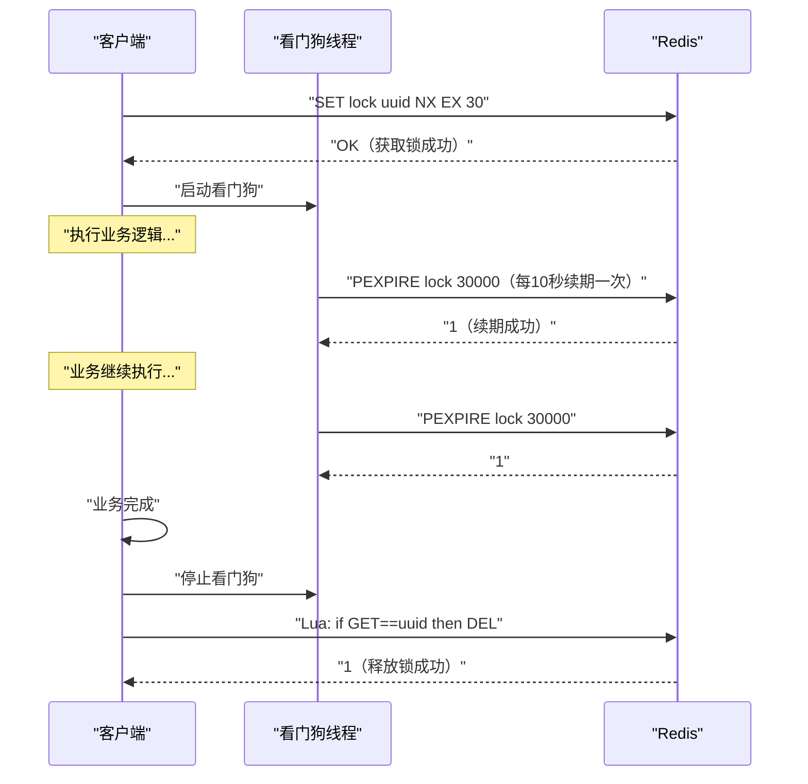
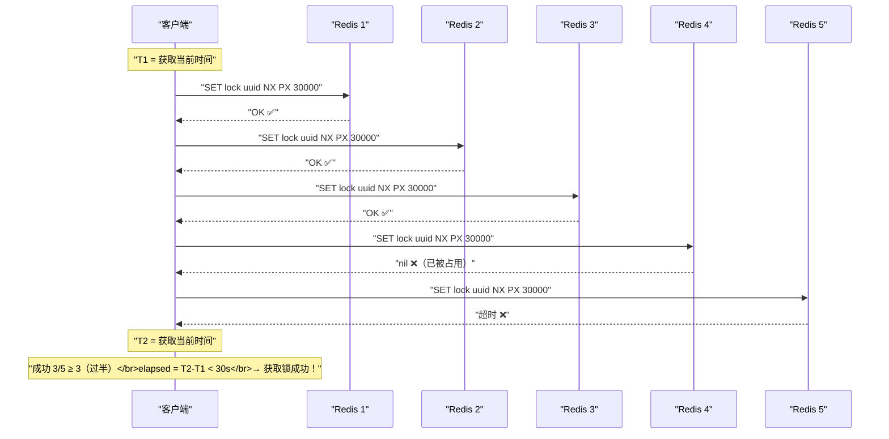
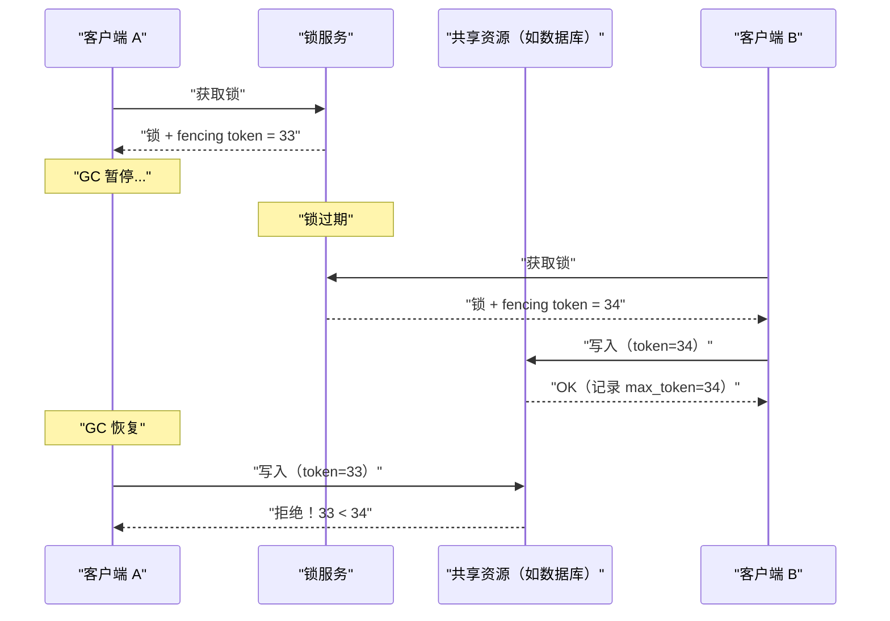

# 06 Redis 分布式锁——从 SETNX 到 Redlock 的争议

**摘要：**

分布式锁是分布式系统中最常见的协调原语之一——它保证在多个进程/节点并发执行时，同一时刻只有一个执行者能进入临界区。Redis 凭借其高性能和简单的 API，成为分布式锁最流行的实现载体。最基础的 `SET key value NX EX` 一条命令就能实现一把锁——但这把锁有诸多工程陷阱：锁过期了但业务没执行完（锁提前释放）、客户端释放了别人的锁（锁误删）、Redis 主节点宕机导致锁丢失（主从切换安全性）。为了解决单节点的可靠性问题，Redis 作者 antirez 提出了 **Redlock 算法**——在 N 个独立的 Redis 节点上同时加锁，半数以上成功才算获取锁。然而，分布式系统领域的知名学者 Martin Kleppmann 对 Redlock 发起了尖锐的批判——认为它在异步系统模型下无法保证正确性。这场 antirez vs Kleppmann 的论战成为了分布式系统领域的经典案例。本文从单节点锁的实现和陷阱出发，逐步深入到 Redlock 算法、Kleppmann 的批判、Redisson 的工程实现，最后与 ZooKeeper 和 etcd 的锁方案进行多维度对比。

---

## 第 1 章 为什么需要分布式锁

### 1.1 从单机锁到分布式锁

在单机程序中，线程同步使用语言级别的锁即可——Java 的 `synchronized`/`ReentrantLock`、Go 的 `sync.Mutex`、Python 的 `threading.Lock`。这些锁依赖于操作系统的原子指令（如 CAS）和内核调度器，在单个进程内工作良好。

但在分布式系统中，业务逻辑分布在多个进程、多台机器上——进程级别的锁无法跨机器生效。一个典型场景：电商系统的订单服务部署了 10 个实例，每个实例都可能处理同一个商品的下单请求。如果不加分布式锁，10 个实例可能同时读到库存为 1，各自扣减——最终超卖。

**分布式锁的核心需求**：

1. **互斥性（Mutual Exclusion）**：同一时刻只有一个客户端能持有锁
2. **无死锁（Deadlock Freedom）**：即使持有锁的客户端崩溃，锁最终也能被释放
3. **容错性（Fault Tolerance）**：部分节点故障时锁服务仍然可用

### 1.2 分布式锁的两种用途

Martin Kleppmann 在他的批判文章中明确区分了分布式锁的两种用途——这个区分对理解后续的争议至关重要：

**用途一：效率（Efficiency）**

锁用于避免不必要的重复工作——比如防止两个 Cron Job 同时处理同一批数据。如果锁偶尔失效（两个客户端同时进入临界区），后果只是做了一些重复工作——不会造成数据损坏。对于这种场景，Redis 单节点锁完全够用——即使 Redis 宕机导致锁丢失，影响也不大。

**用途二：正确性（Correctness）**

锁用于保护关键的数据一致性——比如两个客户端不能同时修改同一个银行账户余额。如果锁失效，可能导致数据损坏或资金丢失。对于这种场景，需要更强的锁保证——Kleppmann 认为 Redis 无法提供这种保证（包括 Redlock），应该使用基于共识算法的系统（如 ZooKeeper/etcd）。

---

## 第 2 章 单节点 Redis 锁

### 2.1 基本实现

Redis 分布式锁的最基本形式——一条 `SET` 命令：

```bash
SET lock:order:1001 "owner:uuid-abc-123" NX EX 30
```

- **lock:order:1001**：锁的 key——不同的业务资源用不同的 key
- **"owner:uuid-abc-123"**：锁的持有者标识——一个全局唯一的值（通常是 UUID），用于安全释放
- **NX**：仅当 key 不存在时才设置——保证互斥性
- **EX 30**：过期时间 30 秒——保证无死锁（持有者崩溃后锁自动释放）

返回 OK 表示获取锁成功；返回 nil 表示锁已被其他客户端持有。

### 2.2 安全释放——Lua 脚本

释放锁时必须**验证持有者身份**——否则可能误删其他客户端的锁。这个"检查 + 删除"操作必须是原子的——用 [[03 Redis 事务 Lua 脚本与原子性保证|Lua 脚本]]实现：

```lua
-- 安全释放锁
-- KEYS[1]: 锁的 key
-- ARGV[1]: 锁的持有者标识（UUID）

if redis.call('GET', KEYS[1]) == ARGV[1] then
    return redis.call('DEL', KEYS[1])
else
    return 0
end
```

**为什么不能用 GET + DEL 两条命令？**

```
时刻1: 客户端 A 执行 GET lock → 返回 "uuid-A"（是自己的锁）
时刻2: 锁过期自动删除
时刻3: 客户端 B 执行 SET lock "uuid-B" NX EX 30 → 获取锁成功
时刻4: 客户端 A 执行 DEL lock → 删除了客户端 B 的锁！
```

在时刻 1 和时刻 4 之间，锁的持有者已经从 A 变成了 B——但 A 不知道，盲目删除了 B 的锁。Lua 脚本将 GET 和 DEL 合并为一个原子操作，避免了这个竞态条件。

### 2.3 陷阱一：锁过期但业务未完成

这是 Redis 分布式锁最根本的问题——**锁的过期时间是一个固定值，但业务的执行时间是不确定的**。

```
时刻0: 客户端 A 获取锁（TTL 30秒）
时刻0-29: 客户端 A 处理业务（正常应该 5 秒内完成）
时刻25: 客户端 A 遇到长 GC 暂停（[[JVM GC]] Full GC 耗时 10 秒）
时刻30: 锁过期自动删除
时刻31: 客户端 B 获取锁
时刻35: 客户端 A 从 GC 暂停中恢复，继续执行临界区代码——此时 A 和 B 同时在临界区！
```

问题根源：Redis 的过期时间依赖于**物理时钟**——但分布式系统中的进程可能因为 GC 暂停、网络延迟、CPU 调度等原因"暂停"任意长时间。在暂停期间，进程无法感知锁已经过期。

### 2.4 陷阱二：主从切换导致锁丢失

Redis 的[[09 主从复制与 Sentinel 高可用|主从复制]]是**异步的**——主节点写入后立即返回成功，数据异步复制到从节点。如果主节点在复制完成前宕机：

```
时刻1: 客户端 A 在主节点获取锁 → 成功
时刻2: 主节点宕机（锁数据未复制到从节点）
时刻3: Sentinel 将从节点提升为新主节点（新主节点上没有这把锁）
时刻4: 客户端 B 在新主节点获取锁 → 成功（锁丢失！A 和 B 同时持有锁）
```

这个问题在单节点 Redis（包括主从模式）中是无解的——这正是 Redlock 算法试图解决的问题。

---

## 第 3 章 锁续期与看门狗机制

### 3.1 问题：如何设置合理的过期时间

过期时间设置太短：业务还没执行完锁就过期了——互斥性被破坏。
过期时间设置太长：持有者崩溃后锁要等很久才自动释放——可用性受损。

**看门狗（Watchdog）机制**解决了这个矛盾——不设置一个"最终"的过期时间，而是设置一个较短的初始过期时间（如 30 秒），然后在后台线程中**定期续期**——只要持有者还活着且业务还在执行，就不断延长锁的过期时间。

### 3.2 看门狗的工作原理



**关键设计**：
- 初始过期时间（leaseTime）：30 秒
- 续期间隔：leaseTime / 3 = 10 秒
- 续期操作：重置过期时间为 30 秒
- 停止条件：业务完成后显式停止看门狗；如果客户端进程崩溃，看门狗线程也随之消亡——锁在 30 秒后自动过期

### 3.3 看门狗的局限

看门狗解决了"业务执行时间不确定"的问题，但**没有解决 GC 暂停导致的安全性问题**。如果客户端进程发生长时间 GC 暂停：

1. 看门狗线程也被暂停（GC 暂停的是整个进程，包括所有线程）
2. 锁可能在暂停期间过期
3. 其他客户端获取锁
4. 原客户端从暂停中恢复，继续执行临界区——两个客户端同时在临界区

这个问题是 Redis 分布式锁的根本局限——后面讨论 Kleppmann 的批判时会详细展开。

---

## 第 4 章 可重入锁

### 4.1 什么是可重入锁

**可重入锁（Reentrant Lock）** 允许同一个持有者多次获取同一把锁——每获取一次计数 +1，每释放一次计数 -1，计数归零时真正释放锁。

为什么需要可重入？假设一个业务方法 A 获取了锁，A 内部调用了方法 B，B 也需要获取同一把锁——如果锁不可重入，B 会被自己持有的锁阻塞（死锁）。

### 4.2 Redis 可重入锁实现

使用 Hash 替代 String——field 存储持有者标识，value 存储重入计数：

```lua
-- 获取可重入锁
-- KEYS[1]: 锁 key
-- ARGV[1]: 过期时间（毫秒）
-- ARGV[2]: 持有者标识（UUID:threadId）

-- 锁不存在：获取锁，计数 = 1
if redis.call('EXISTS', KEYS[1]) == 0 then
    redis.call('HSET', KEYS[1], ARGV[2], 1)
    redis.call('PEXPIRE', KEYS[1], ARGV[1])
    return nil
end

-- 锁存在且是自己持有：重入，计数 +1
if redis.call('HEXISTS', KEYS[1], ARGV[2]) == 1 then
    redis.call('HINCRBY', KEYS[1], ARGV[2], 1)
    redis.call('PEXPIRE', KEYS[1], ARGV[1])
    return nil
end

-- 锁被其他人持有：返回锁的剩余 TTL
return redis.call('PTTL', KEYS[1])
```

```lua
-- 释放可重入锁
-- KEYS[1]: 锁 key
-- ARGV[1]: 持有者标识

-- 不是自己的锁
if redis.call('HEXISTS', KEYS[1], ARGV[1]) == 0 then
    return nil
end

-- 计数 -1
local count = redis.call('HINCRBY', KEYS[1], ARGV[1], -1)

if count > 0 then
    -- 还有重入，刷新过期时间
    redis.call('PEXPIRE', KEYS[1], ARGV[2])
    return 0
else
    -- 计数归零，真正释放锁
    redis.call('DEL', KEYS[1])
    return 1
end
```

---

## 第 5 章 Redlock 算法

### 5.1 设计动机

单节点 Redis 锁的根本缺陷在于——Redis 主从复制是异步的，主节点宕机可能导致锁丢失。antirez 提出 Redlock 的目标是：在不依赖单个 Redis 节点的情况下实现一个"更安全"的分布式锁。

### 5.2 算法描述

假设有 **N 个独立的 Redis 主节点**（不是主从结构，是 N 个完全独立的实例），推荐 N = 5。

**加锁流程**：

1. 获取当前时间戳 T1（毫秒）
2. **依次**在 N 个节点上执行 `SET lock uuid NX PX 30000`——每个节点设置一个较短的超时时间（如 5-50ms），避免某个节点不可用时阻塞太久
3. 获取当前时间戳 T2
4. 计算加锁耗时：elapsed = T2 - T1
5. **判断是否获取锁成功**：
   - 成功获取锁的节点数 ≥ N/2 + 1（过半数）
   - 且 elapsed < 锁的过期时间（即锁在加锁过程中没有过期）
6. 如果获取锁成功，锁的**有效时间** = 初始过期时间 - elapsed
7. 如果获取锁失败，在**所有节点**上执行释放锁（即使某些节点没有成功加锁——因为有可能 SET 成功了但响应丢失）

**释放锁**：在所有 N 个节点上执行释放锁的 Lua 脚本。



### 5.3 Redlock 的安全性论证

antirez 认为 Redlock 的安全性建立在以下假设上：

- **N 个节点是独立的**——不共享任何状态，一个节点的故障不影响其他节点
- **时钟漂移有限**——各节点的时钟速率大致相同（不要求时钟同步，只要求漂移速率在合理范围内）
- **过半数投票**——即使少数节点（< N/2）故障或被篡改，锁的安全性仍然成立

这个模型类似于 Paxos/Raft 等共识算法的多数派投票——但 Redlock **没有使用共识算法**，它的"投票"只是独立地在各节点上加锁。

---

## 第 6 章 Martin Kleppmann 的批判

### 6.1 批判的核心论点

2016 年，剑桥大学的 Martin Kleppmann 发表了一篇文章 "How to do distributed locking"，对 Redlock 提出了系统性的批判。核心论点可以归结为两个：

### 6.2 论点一：GC 暂停摧毁安全性

Kleppmann 构造了一个经典的反例：

```
时刻0:   客户端 A 在 3/5 节点上获取 Redlock（锁有效期 30 秒）
时刻0-28: 客户端 A 开始处理业务
时刻28:  客户端 A 进入 GC 暂停（Full GC）
时刻30:  锁在所有节点上过期
时刻31:  客户端 B 在 3/5 节点上获取 Redlock
时刻31-35: 客户端 B 处理业务，修改共享资源
时刻38:  客户端 A 从 GC 暂停中恢复——它不知道锁已过期！
时刻38:  客户端 A 继续修改共享资源——A 和 B 同时在临界区
```

这个问题的本质是：**客户端无法可靠地判断自己是否仍持有锁**。客户端在获取锁后的任何时刻都可能被暂停（GC、page fault、CPU 调度），而在暂停期间无法感知锁的过期。

Kleppmann 指出，这个问题并非 Redlock 独有——**任何基于过期时间的锁都有这个问题**，包括单节点 Redis 锁。Redlock 声称比单节点锁更安全，但在这个场景下同样不安全。

### 6.3 论点二：Fencing Token（栅栏令牌）

Kleppmann 提出了真正安全的分布式锁方案——**Fencing Token**：



**Fencing Token 的原理**：
1. 锁服务每次分配锁时生成一个**单调递增的 token**（如 33, 34, 35...）
2. 客户端在操作共享资源时**携带 token**
3. 共享资源（如数据库）验证 token——**拒绝任何 token 小于当前最大 token 的操作**
4. 即使旧的锁持有者在暂停后恢复并尝试操作，它的 token 已经过时——被拒绝

Kleppmann 的核心观点：**如果你使用 fencing token，那你根本不需要 Redlock——单节点 Redis 锁就够了，因为安全性由 fencing token 保证而非锁本身。如果你不使用 fencing token，那 Redlock 也无法保证安全性。**

### 6.4 论点三：时钟假设不可靠

Redlock 的安全性依赖于各节点时钟的漂移速率在合理范围内。但 Kleppmann 指出：

- **NTP 时钟跳变**：服务器的时钟通过 NTP 同步——NTP 可能导致时钟向前或向后跳变数秒
- **VM 时钟不可靠**：虚拟机的时钟可能因为宿主机的 CPU 调度而出现大幅偏差
- **闰秒**：闰秒调整可能导致时钟回退

如果某个 Redis 节点的时钟突然向前跳变，该节点上的锁提前过期——其他客户端可以在这个节点上获取锁，打破了过半数的安全假设。

### 6.5 antirez 的回应

antirez 在博文 "Is Redlock safe?" 中回应了 Kleppmann 的批判：

- **关于 GC 暂停**：antirez 认为这个问题可以通过在操作共享资源前**检查锁的剩余有效时间**来缓解——如果剩余时间不足以完成操作，放弃执行。但 Kleppmann 反驳说：检查和操作之间仍然可能发生 GC 暂停。
- **关于时钟假设**：antirez 认为现代服务器的时钟漂移率通常很低（ppm 级别），Redlock 的时钟假设在实践中是合理的。
- **关于 fencing token**：antirez 认为不是所有共享资源都支持 fencing token——比如向磁盘写文件、发送网络请求等。在这些场景下 Redlock 仍然是有价值的。

### 6.6 这场争论的结论

这场争论没有一个"谁赢了"的明确结论。但它揭示了一个重要的工程认知：

> [!note] 分布式锁的安全性取决于你的需求
> - **效率场景**（防止重复工作）：Redis 单节点锁就够了——简单、快速、可用性高。即使偶尔失效，影响有限。
> - **正确性场景**（保护数据一致性）：如果共享资源支持 fencing token，用 Redis 锁 + fencing token。如果不支持 fencing token 且需要最强的安全保证——用 ZooKeeper/etcd 等基于共识算法的锁。
> - **Redlock 的定位**：比单节点锁更可靠（容忍少数节点故障），但不如 ZooKeeper/etcd 安全（受时钟和暂停影响）。

---

## 第 7 章 Redisson——生产级 Redis 锁实现

### 7.1 Redisson 概述

**Redisson** 是 Java 生态中最成熟的 Redis 客户端框架——它在 Redis 之上封装了丰富的分布式数据结构和服务，其中分布式锁是最常用的功能。Redisson 的锁实现包含了前文讨论的所有工程细节：原子加锁/释放、看门狗续期、可重入、公平锁、读写锁、联锁、红锁等。

### 7.2 Redisson 锁的核心特性

| 特性 | 说明 |
| :--- | :--- |
| **原子加锁/释放** | 全部使用 Lua 脚本实现 |
| **看门狗续期** | 默认 leaseTime 30 秒，每 10 秒续期一次 |
| **可重入** | 基于 Hash 结构实现计数 |
| **阻塞等待** | 获取锁失败时可阻塞等待，通过 Redis 的 Pub/Sub 机制接收锁释放通知——避免轮询 |
| **公平锁** | `getFairLock()`——按请求顺序排队获取锁 |
| **读写锁** | `getReadWriteLock()`——读读不互斥，读写/写写互斥 |
| **联锁（MultiLock）** | 在多个资源上同时加锁——全部成功才算成功 |
| **红锁（RedLock）** | Redlock 算法的实现（已标记为 Deprecated） |

### 7.3 Redisson 锁的使用

```java
// 基本使用
RLock lock = redisson.getLock("lock:order:1001");
try {
    // 尝试获取锁，等待最多 10 秒，锁自动释放时间 30 秒
    // 如果不指定 leaseTime（传 -1），启用看门狗自动续期
    boolean acquired = lock.tryLock(10, -1, TimeUnit.SECONDS);
    if (acquired) {
        // 执行业务逻辑
        processOrder();
    }
} finally {
    if (lock.isHeldByCurrentThread()) {
        lock.unlock();
    }
}
```

> [!warning] Redisson RedLock 已废弃
> Redisson 在较新版本中已将 `RedissonRedLock` 标记为 **Deprecated**——Redisson 的维护者认为 Redlock 算法的争议太大，不建议在生产中使用。推荐使用普通的 `RLock`（依赖 Redis 主从/Cluster 的高可用）或 `RFencedLock`（带 fencing token 的锁）。

### 7.4 RFencedLock——带 Fencing Token 的锁

Redisson 3.15+ 提供了 `RFencedLock`——每次获取锁时返回一个单调递增的 fencing token：

```java
RFencedLock lock = redisson.getFencedLock("lock:resource");
Long token = lock.lockAndGetToken();
try {
    // 使用 token 操作共享资源
    database.update("UPDATE ... WHERE fencing_token < ?", token);
} finally {
    lock.unlock();
}
```

这正是 Kleppmann 推荐的方案——锁的安全性由 fencing token 保证。

---

## 第 8 章 分布式锁方案对比

### 8.1 Redis vs ZooKeeper vs etcd

| 维度 | Redis 锁 | ZooKeeper 锁 | etcd 锁 |
| :--- | :--- | :--- | :--- |
| **实现原理** | SET NX EX + Lua | 临时有序节点 + Watch | Lease + Revision |
| **互斥性保证** | 过期时间（可能失效）| 临时节点（会话绑定）| Lease TTL + KeepAlive |
| **一致性模型** | 异步复制（弱一致）| ZAB 共识（强一致）| Raft 共识（强一致）|
| **Fencing Token** | Redisson RFencedLock | 节点版本号（天然有序）| Revision（天然有序）|
| **性能** | 极高（10万+ TPS）| 中（万级 TPS）| 中高（数万 TPS）|
| **节点故障恢复** | 主从切换可能丢锁 | 会话超时后锁自动释放 | Lease 到期后锁释放 |
| **运维复杂度** | 低 | 高（ZK 集群维护复杂）| 中 |
| **客户端生态** | 丰富（Redisson/Lettuce）| Curator | go.etcd.io/etcd/client |

### 8.2 ZooKeeper 锁的原理

ZooKeeper 的分布式锁基于**临时有序节点**：

1. 客户端在 `/locks/resource` 下创建临时有序节点 `/locks/resource/lock-000001`
2. 获取 `/locks/resource` 下所有子节点并排序
3. 如果自己是序号最小的节点——获取锁成功
4. 否则，Watch 前一个节点的删除事件——等待通知
5. 当前一个节点被删除（持有者释放锁或会话超时），收到通知后重新检查是否是最小节点

**ZooKeeper 锁的优势**：
- **会话语义**：临时节点与客户端会话绑定——客户端崩溃后会话超时，临时节点自动删除（锁自动释放），无需依赖时钟
- **顺序保证**：有序节点天然实现了公平锁
- **ZAB 共识**：节点的创建和删除通过共识算法保证——不会因为主从切换而丢失

**ZooKeeper 锁的劣势**：
- 性能低于 Redis——ZAB 共识需要多数派确认，写延迟更高
- 运维复杂——ZK 集群的维护和调优门槛高
- 会话超时时间（默认 30 秒）较长——持有者崩溃后锁释放较慢

### 8.3 etcd 锁的原理

etcd 的分布式锁基于 **Lease + Revision**：

1. 创建一个 Lease（带 TTL），通过 KeepAlive 定期续约
2. 使用 Lease 绑定一个 key（如 `/locks/resource/client-uuid`）
3. 获取 key 的 Revision（全局递增的事务 ID）
4. 检查 `/locks/resource/` 前缀下 Revision 最小的 key 是否是自己
5. 如果是——获取锁成功；否则 Watch Revision 比自己小的 key 的删除事件

etcd 锁的 Revision 天然就是 fencing token——每个 key 操作都有全局唯一的递增 Revision。

### 8.4 选型建议

- **已有 Redis 基础设施、性能要求高、对偶发的锁失效可以容忍**（效率场景）：Redis 锁
- **已有 Redis 基础设施、正确性要求高**：Redis 锁 + fencing token（RFencedLock）
- **已有 ZooKeeper 基础设施（如 Hadoop/Kafka 生态）**：ZooKeeper 锁（Curator InterProcessMutex）
- **云原生/Kubernetes 环境、已有 etcd**：etcd 锁
- **对锁的安全性有极端要求且不能使用 fencing token**：ZooKeeper 或 etcd

---

## 第 9 章 总结

本文系统分析了 Redis 分布式锁的实现、陷阱和争议：

- **单节点锁**：`SET key uuid NX EX` + Lua 脚本释放——简单高效，但存在锁过期/主从切换两大安全隐患
- **看门狗续期**：后台线程定期 PEXPIRE 续期——解决过期时间不确定的问题，但无法抵御 GC 暂停
- **可重入锁**：基于 Hash 的计数实现——同一持有者可多次获取同一把锁
- **Redlock 算法**：在 N 个独立节点上过半数加锁——比单节点更可靠，但 Kleppmann 证明在异步系统中仍不安全
- **Kleppmann 的批判**：GC 暂停可打破任何基于过期时间的锁；Fencing Token 才是正确的安全保障；Redlock 的时钟假设不可靠
- **Redisson**：生产级实现——看门狗、可重入、公平锁、RFencedLock（推荐）；RedLock 已 Deprecated
- **方案对比**：Redis 锁（高性能/弱一致）vs ZooKeeper 锁（强一致/临时节点）vs etcd 锁（强一致/Revision fencing）

**核心结论**：分布式锁的选型取决于你的安全性需求——效率场景用 Redis 锁，正确性场景用 Redis 锁 + fencing token 或 ZooKeeper/etcd 锁。没有一种方案是完美的——理解每种方案的边界条件比选择"最好的"方案更重要。

下一篇 [[07 Redis 消息队列——从 PubSub 到 Stream]] 将深入分析 Redis 作为轻量级消息队列的三种方案——List、Pub/Sub、Stream 的语义差异和适用场景。

---

## 参考资料

1. Redis Documentation - Distributed Locks with Redis：https://redis.io/docs/manual/patterns/distributed-locks/
2. Martin Kleppmann - How to do distributed locking (2016)：https://martin.kleppmann.com/2016/02/08/how-to-do-distributed-locking.html
3. antirez - Is Redlock safe? (2016)：http://antirez.com/news/101
4. Redisson Documentation：https://github.com/redisson/redisson/wiki/8.-Distributed-locks-and-synchronizers
5. Apache Curator - InterProcessMutex：https://curator.apache.org/docs/recipes-locks/
6. etcd Documentation - Distributed Locks：https://etcd.io/docs/v3.5/dev-guide/api_concurrency_reference/
