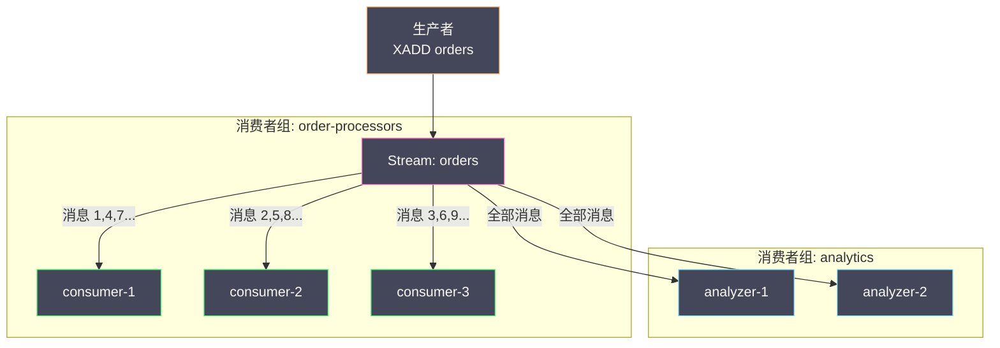

# 07 Redis 消息队列——从 PubSub 到 Stream

**摘要：**

消息队列是分布式系统中最基础的解耦手段——生产者将消息投递到队列，消费者异步消费。Redis 在其演进历程中先后提供了三种消息方案：最早的 **List**（LPUSH/BRPOP）实现了最简单的点对点队列；随后的 **Pub/Sub** 提供了发布/订阅的广播模型；Redis 5.0 引入的 **Stream** 则是一个完整的消息队列数据类型，具备消费者组、消息确认、消息回溯和持久化等专业消息队列的核心能力。每种方案都有其适用的场景边界和不可忽视的局限——List 的消息弹出即消失没有 ACK 保障，Pub/Sub 的消息不持久化丢了就没了，Stream 虽然功能完备但吞吐量和消息保留能力无法与 Kafka 等专业系统相比。本文从消息队列的核心需求出发，逐一深入三种方案的工作原理、命令操作和工程实践，最后给出与 Kafka、RabbitMQ 的选型对比。

---

## 第 1 章 消息队列的核心需求

### 1.1 为什么需要消息队列

在一个典型的电商系统中，用户下单后需要触发一系列后续动作——扣减库存、生成物流单、发送短信通知、更新搜索索引、计算营销积分。如果这些操作都放在下单接口中同步执行，一次下单请求的耗时可能从 50ms 飙升到 2 秒——用户体验极差，系统吞吐量也被拖垮。

消息队列的作用是**异步解耦**——下单接口只负责核心操作（创建订单 + 扣减库存），其他操作通过消息队列异步触发。下单接口的耗时回到 50ms，后续操作由各自的消费者独立处理——互不影响、独立扩展。

### 1.2 消息队列的核心能力

一个合格的消息队列需要具备以下核心能力：

| 能力 | 含义 | 不具备会怎样 |
| :--- | :--- | :--- |
| **消息持久化** | 消息写入后不会因为服务重启而丢失 | 重启后未消费的消息全部丢失 |
| **消费确认（ACK）** | 消费者处理完成后显式确认——未确认的消息可以重新投递 | 消费者崩溃时消息丢失 |
| **消费者组** | 同一组内多个消费者负载均衡消费——每条消息只被组内一个消费者处理 | 无法水平扩展消费能力 |
| **消息回溯** | 可以从历史任意位置重新消费 | 消息只能消费一次，补数据困难 |
| **消息顺序** | 至少保证分区/key 级别的消息顺序 | 依赖顺序的业务逻辑出错 |
| **死信处理** | 反复消费失败的消息被转移到死信队列 | 有毒消息反复重试阻塞队列 |

接下来逐一审视 Redis 的三种方案在这些能力上的表现。

---

## 第 2 章 List——最简单的消息队列

### 2.1 基本模型

List 天然具有 FIFO（先进先出）的特性——生产者 LPUSH 推入消息，消费者 RPOP/BRPOP 弹出消息：

```bash
# 生产者
LPUSH queue:orders '{"order_id": 1001, "action": "create"}'
LPUSH queue:orders '{"order_id": 1002, "action": "create"}'

# 消费者（阻塞等待，最多 30 秒）
BRPOP queue:orders 30
# 返回：["queue:orders", '{"order_id": 1001, "action": "create"}']
```

`BRPOP` 是阻塞版本的 RPOP——当 List 为空时，客户端不会立即返回 nil，而是**阻塞等待**直到有新消息或超时。与轮询（每隔 100ms RPOP 一次）相比，BRPOP 零延迟（消息到达立即消费）且零空转（等待期间不消耗 CPU 和网络）。

### 2.2 可靠传递——LMOVE

BRPOP 的核心缺陷是**消息弹出即消失**——如果消费者在处理消息的过程中崩溃，消息就永久丢失了。

`LMOVE`（Redis 6.2+，替代 RPOPLPUSH）提供了一种"可靠传递"的变通方案——弹出消息的同时原子地推入一个"处理中"列表（备份）：

```bash
# 消费者：从 queue:orders 弹出消息，同时推入 queue:orders:processing
LMOVE queue:orders queue:orders:processing RIGHT LEFT

# 消费者处理完成后，从 processing 列表中删除
LREM queue:orders:processing 1 '{"order_id": 1001, "action": "create"}'

# 如果消费者崩溃，processing 列表中的消息不会丢失
# 后台任务定期扫描 processing 列表中"超时"的消息，重新推回 queue:orders
```

这个方案虽然实现了基本的可靠性，但相当繁琐——需要维护额外的 processing 列表和超时检查逻辑。

### 2.3 List 消息队列的能力评估

| 能力 | List 支持情况 | 说明 |
| :--- | :--- | :--- |
| **消息持久化** | ✅ 随 RDB/AOF | 消息在 List 中持久化 |
| **消费确认（ACK）** | ⚠️ LMOVE 变通 | 需要手动维护 processing 列表 |
| **消费者组** | ❌ | 不支持——多个消费者 BRPOP 同一个 List 可以实现负载均衡，但无法让多个消费者组独立消费 |
| **消息回溯** | ❌ | 消息弹出后即消失 |
| **消息顺序** | ✅ FIFO | List 天然有序 |
| **死信处理** | ❌ | 需要手动实现 |

**适用场景**：简单的任务队列——消息量不大、不需要消费者组、允许丢失少量消息（或用 LMOVE 变通保证可靠性）。

---

## 第 3 章 Pub/Sub——发布/订阅模型

### 3.1 Pub/Sub 的工作原理

Pub/Sub 是一种**广播模型**——发布者将消息发送到一个"频道"（Channel），所有订阅该频道的客户端都会收到消息。

```bash
# 订阅者 1（阻塞等待消息）
SUBSCRIBE channel:orders

# 订阅者 2（阻塞等待消息）
SUBSCRIBE channel:orders

# 发布者
PUBLISH channel:orders '{"order_id": 1001}'
# 返回 2（表示有 2 个订阅者收到了消息）
```

与 List 的**点对点**模型不同，Pub/Sub 是**一对多**——同一条消息会被所有订阅者收到。这适合需要广播的场景，如配置变更通知、缓存失效通知等。

### 3.2 模式订阅

除了精确频道名订阅，Pub/Sub 还支持**通配符模式订阅**：

```bash
# 订阅所有 channel:orders: 开头的频道
PSUBSCRIBE channel:orders:*

# 以下发布都会被收到
PUBLISH channel:orders:create '...'
PUBLISH channel:orders:pay '...'
PUBLISH channel:orders:cancel '...'
```

### 3.3 Pub/Sub 的致命缺陷

**缺陷一：消息不持久化**

Pub/Sub 的消息是"发后即忘"——Redis 不存储任何消息。如果发布时没有订阅者在线，消息直接丢失。如果订阅者断开连接后重新连接，断连期间的消息全部丢失。

这是 Pub/Sub 与真正消息队列的根本区别——消息队列将消息持久化存储，消费者可以按需消费；Pub/Sub 只是一个实时通知机制，没有消息存储和回溯能力。

**缺陷二：无消费确认**

发布者执行 PUBLISH 后，Redis 将消息推送给所有订阅者——但无法确认订阅者是否成功处理了消息。如果订阅者收到消息后处理失败或崩溃，消息就丢失了。

**缺陷三：背压问题**

如果订阅者处理速度跟不上发布速度，消息会在 Redis 的输出缓冲区中堆积。当缓冲区超过 `client-output-buffer-limit pubsub` 的限制时，Redis 会**断开订阅者的连接**——断连期间的消息全部丢失。

```
# 默认配置
client-output-buffer-limit pubsub 32mb 8mb 60
# 含义：如果 pubsub 客户端的输出缓冲区超过 32MB，
# 或持续 60 秒超过 8MB，断开连接
```

**缺陷四：不支持消费者组**

所有订阅者都收到全量消息——无法在多个订阅者之间分担消费负载。如果需要负载均衡消费，只能回到 List 方案。

### 3.4 Pub/Sub 的能力评估

| 能力 | Pub/Sub 支持情况 | 说明 |
| :--- | :--- | :--- |
| **消息持久化** | ❌ | 不存储消息 |
| **消费确认（ACK）** | ❌ | 无 |
| **消费者组** | ❌ | 所有订阅者收到全量消息 |
| **消息回溯** | ❌ | 无 |
| **消息顺序** | ✅ | 单频道内有序 |
| **死信处理** | ❌ | 无 |

**适用场景**：实时通知/广播——如配置变更通知、缓存失效通知、即时聊天的在线消息推送。消息丢失可以接受，或有其他补偿机制。

> [!warning] Pub/Sub 在 Redis Cluster 中的行为
> 在 [[10 Redis Cluster 分布式架构|Redis Cluster]] 中，Pub/Sub 消息会被**广播到集群的所有节点**——即使某个节点上没有订阅者。这意味着 Pub/Sub 在大集群中会产生大量的集群内部网络流量。Redis 7.0 引入了 **Sharded Pub/Sub**（SSUBSCRIBE/SPUBLISH）——消息只路由到拥有对应 slot 的节点，大幅减少了广播开销。

---

## 第 4 章 Stream——Redis 的完整消息队列

### 4.1 Stream 的设计目标

Redis 5.0 引入的 Stream 是 Redis 第一个专门设计的消息队列数据类型。它的设计目标是在 Redis 内部提供一个**类似 Kafka 的消息队列语义**——消息持久化、消费者组、消息确认、消息回溯，同时保持 Redis 的简单性和高性能。

Stream 解决了 List 和 Pub/Sub 的所有核心缺陷：

| 能力 | List | Pub/Sub | Stream |
| :--- | :--- | :--- | :--- |
| **消息持久化** | ✅ | ❌ | ✅ |
| **消费确认（ACK）** | ⚠️ 变通 | ❌ | ✅ XACK |
| **消费者组** | ❌ | ❌ | ✅ XGROUP |
| **消息回溯** | ❌ | ❌ | ✅ XRANGE |
| **消息顺序** | ✅ | ✅ | ✅ |
| **死信处理** | ❌ | ❌ | ✅ XCLAIM/XAUTOCLAIM |

### 4.2 Stream 的数据模型

Stream 是一个**只追加（append-only）的有序日志**——每条消息有一个唯一的自增 ID（时间戳-序列号），消息体是一组 field-value 对。

```
Stream "orders":
  1709424000000-0: {action: "create", order_id: "1001", user_id: "2001"}
  1709424001000-0: {action: "pay",    order_id: "1001", amount: "99.9"}
  1709424002000-0: {action: "create", order_id: "1002", user_id: "2002"}
  1709424003000-0: {action: "ship",   order_id: "1001"}
```

**消息 ID 的格式**：`<毫秒时间戳>-<序列号>`
- 时间戳：消息写入时的 Redis 服务器时间
- 序列号：同一毫秒内的消息递增编号（从 0 开始）
- 保证全局严格递增——即使时钟回退，ID 也不会回退

### 4.3 生产者操作

```bash
# 追加消息（* 表示自动生成 ID）
XADD orders * action create order_id 1001 user_id 2001
# 返回："1709424000000-0"

# 指定最大长度（近似裁剪，~避免精确裁剪的性能开销）
XADD orders MAXLEN ~ 100000 * action pay order_id 1001 amount 99.9

# 基于最小 ID 裁剪（6.2+，保留最近 7 天的消息）
XADD orders MINID ~ 1709337600000-0 * action ship order_id 1001

# 查看 Stream 信息
XLEN orders                    # 消息总数
XINFO STREAM orders            # Stream 详细信息（包括第一条/最后一条消息）
XINFO STREAM orders FULL       # 完整信息（包括消费者组详情）
```

**MAXLEN vs MINID**：MAXLEN 基于消息数量裁剪——"最多保留 10 万条"；MINID 基于消息 ID 裁剪——"保留 ID > 某个时间戳的消息"。两者都用 `~` 修饰表示近似裁剪——Redis 会在 Stream 内部的 Radix Tree 节点边界处裁剪，避免频繁的节点拆分。

### 4.4 独立消费（不使用消费者组）

不使用消费者组时，可以直接用 `XREAD` 读取消息——适合简单的消费场景或消息回放：

```bash
# 从头读取所有消息
XRANGE orders - +

# 从指定 ID 之后读取
XRANGE orders 1709424001000-0 +

# 阻塞等待新消息（类似 BRPOP）
XREAD COUNT 10 BLOCK 5000 STREAMS orders $
# $: 只读取新到达的消息（调用时刻之后的）
# 0: 从头开始读取

# 读取最近 5 条消息
XREVRANGE orders + - COUNT 5
```

### 4.5 消费者组——核心机制

消费者组是 Stream 最核心的概念——它实现了消息在多个消费者之间的**负载均衡分发和可靠消费**。

**创建消费者组**：

```bash
# 从 Stream 起始位置开始消费
XGROUP CREATE orders order-processors 0

# 只消费创建后的新消息
XGROUP CREATE orders order-processors $ MKSTREAM
# MKSTREAM: 如果 Stream 不存在则自动创建
```

**消费者读取消息**：

```bash
# consumer-1 读取消息（> 表示读取分配给自己的新消息）
XREADGROUP GROUP order-processors consumer-1 COUNT 10 BLOCK 5000 STREAMS orders >

# 返回格式：
# orders:
#   1709424002000-0: [action, create, order_id, 1002]
```

**消费者组的分发规则**：当多个消费者在同一个消费者组中调用 XREADGROUP 时，Redis 将未分发的消息**轮询分配**给各消费者——每条消息只会被分发给组内的一个消费者。这就是负载均衡。



**多消费者组独立消费**：不同的消费者组拥有各自独立的消费进度（last-delivered-id）——`order-processors` 组消费到哪条消息不影响 `analytics` 组。这类似于 Kafka 的消费者组概念。

### 4.6 消息确认——XACK

消费者通过 XREADGROUP 读取消息后，消息进入该消费者的 **Pending Entries List（PEL）**——"已分发但未确认"。消费者处理完成后必须 `XACK`：

```bash
# 消费者确认消息
XACK orders order-processors 1709424002000-0

# 查看组的 Pending 概况
XPENDING orders order-processors
# 输出：待确认总数、最小 ID、最大 ID、各消费者的待确认数

# 查看某个消费者的 Pending 详情
XPENDING orders order-processors - + 10 consumer-1
# 输出每条 Pending 消息的 ID、消费者、空闲时间（ms）、投递次数
```

**为什么需要 ACK？** 没有 ACK 机制的消息队列（如 List 的 BRPOP），消费者崩溃就意味着消息丢失。有了 ACK，消费者崩溃时其 PEL 中的消息仍然存在——可以被其他消费者"认领"（Claim）重新处理。

### 4.7 消费者崩溃处理——XCLAIM 与 XAUTOCLAIM

当消费者崩溃后，它的 PEL 中的消息需要被转移给其他活跃的消费者：

**XCLAIM——手动认领**：

```bash
# 将 consumer-1 的 PEL 中超过 30 秒未 ACK 的消息转移给 consumer-2
XCLAIM orders order-processors consumer-2 30000 1709424002000-0
# 30000: 最小空闲时间（毫秒）——只认领空闲超过 30 秒的消息
```

**XAUTOCLAIM——自动认领**（Redis 6.2+，更方便）：

```bash
# 自动扫描并认领超过 30 秒未 ACK 的消息，转移给 consumer-2
XAUTOCLAIM orders order-processors consumer-2 30000 0-0 COUNT 10
# 0-0: 扫描起始 ID
# COUNT 10: 最多认领 10 条
# 返回：[下一个扫描起始 ID, [被认领的消息列表], [已不存在的消息 ID]]
```

> [!note] XAUTOCLAIM 的工程价值
> XAUTOCLAIM 取代了之前需要手动组合 XPENDING + XCLAIM 的两步操作——一条命令完成"扫描超时消息 + 认领"。在生产中，通常会有一个后台 Cron 任务定期执行 XAUTOCLAIM——相当于"死信巡检"。

### 4.8 死信处理

反复消费失败的消息（"有毒消息"）不应该无限重试——它会阻塞消费者的正常处理。通过 `XPENDING` 可以检查每条消息的**投递次数**：

```bash
XPENDING orders order-processors - + 100
# 每条消息的输出包括：ID、消费者、空闲时间、投递次数（delivery count）
```

当投递次数超过阈值（如 5 次），将消息转移到**死信 Stream**：

```bash
# 伪代码：死信处理逻辑
pending = XPENDING orders order-processors - + 100
for msg in pending:
    if msg.delivery_count > 5:
        # 转移到死信 Stream
        XADD orders:dead * original_id msg.id ...msg.fields
        # 确认原消息（从 PEL 中移除）
        XACK orders order-processors msg.id
```

### 4.9 Stream 的内存管理

Stream 的消息存储在内存中——如果不裁剪，消息会无限增长直到耗尽内存。Redis 提供了两种裁剪方式：

**方式一：XADD 时裁剪**（推荐——写入时自动维护）：

```bash
XADD orders MAXLEN ~ 100000 * action create order_id 1003
# 写入新消息的同时，保持 Stream 长度约为 100000
```

**方式二：XTRIM 手动裁剪**：

```bash
# 按长度裁剪
XTRIM orders MAXLEN ~ 100000

# 按 ID 裁剪（保留最近 7 天）
XTRIM orders MINID ~ <7天前的时间戳毫秒>-0
```

> [!warning] 裁剪不会删除 PEL 中的消息引用
> 如果一条消息已经被 XTRIM 删除，但它仍在某个消费者的 PEL 中（未 ACK），XACK 该消息不会报错——只是从 PEL 中移除引用。但 XCLAIM 尝试认领一个已删除的消息会返回空。因此裁剪策略应保留足够的消息量——确保 PEL 中的消息不会被过早裁剪。

---

## 第 5 章 Stream 的生产实践

### 5.1 消费者设计模式

一个健壮的 Stream 消费者应该包含以下逻辑：

```
while true:
    1. XREADGROUP ... BLOCK 5000 STREAMS orders >   // 阻塞读取新消息
    2. for each message:
       a. 处理业务逻辑
       b. XACK orders group message_id              // 确认消息
    3. 每隔 N 秒：XAUTOCLAIM ... 30000 0-0          // 认领超时消息
    4. 对 delivery_count > 5 的消息转移到死信队列
```

### 5.2 消费者组的扩缩容

**扩容**：直接启动新的消费者实例，使用相同的 group name 和新的 consumer name 调用 XREADGROUP——Redis 自动将新消息分发给新消费者。

**缩容**：停止消费者实例——其 PEL 中的消息会被 XAUTOCLAIM 转移给其他消费者。可以用 `XGROUP DELCONSUMER` 清理已停止的消费者。

```bash
# 删除消费者（会同时删除其 PEL——确保先处理完 PEL 中的消息！）
XGROUP DELCONSUMER orders order-processors consumer-3
```

### 5.3 消息幂等性

由于消息可能被重复消费（消费者崩溃后消息被重新认领），消费者的处理逻辑必须是**幂等的**——重复处理同一条消息不会产生错误结果。

常见的幂等策略：
- **唯一约束**：数据库层面对业务唯一键加约束——重复插入会失败
- **去重表**：消费者维护一个已处理消息 ID 的集合——处理前检查是否已处理过
- **版本号/CAS**：更新操作带上版本号——只有版本匹配才执行

### 5.4 Stream 在 Redis Cluster 中的行为

一个 Stream key 只能存在于 [[10 Redis Cluster 分布式架构|Redis Cluster]] 的一个分片上——这意味着单个 Stream 的吞吐量受限于单分片的处理能力。如果需要更高的吞吐量，可以创建多个 Stream（如 `orders:0`, `orders:1`, ..., `orders:9`），在生产者端按某种策略（如 order_id 的 hash）路由到不同的 Stream——类似于 Kafka 的 Partition。

---

## 第 6 章 三种方案的全面对比

| 维度 | List | Pub/Sub | Stream |
| :--- | :--- | :--- | :--- |
| **模型** | 点对点 | 广播 | 消费者组 + 广播 |
| **消息持久化** | ✅ | ❌ | ✅ |
| **消费确认** | ❌（LMOVE 变通）| ❌ | ✅ XACK |
| **消费者组** | ❌ | ❌ | ✅ |
| **消息回溯** | ❌ | ❌ | ✅ |
| **顺序保证** | ✅ FIFO | ✅ | ✅ |
| **阻塞消费** | ✅ BRPOP | ✅ SUBSCRIBE | ✅ XREADGROUP BLOCK |
| **死信处理** | ❌ | ❌ | ✅ XCLAIM + delivery count |
| **内存管理** | 手动 LTRIM | 无（不存储）| MAXLEN / MINID |
| **适用场景** | 简单任务队列 | 实时通知/广播 | 完整消息队列 |

---

## 第 7 章 Redis Stream vs 专业消息队列

### 7.1 Stream vs Kafka

| 维度 | Redis Stream | Apache Kafka |
| :--- | :--- | :--- |
| **存储** | 内存（受限于 maxmemory）| 磁盘（顺序写，TB 级别）|
| **吞吐量** | 万级~十万级 TPS | 百万级 TPS |
| **消息保留** | 受内存限制（MAXLEN/MINID 裁剪）| 按时间/大小保留（可保留数天/数周）|
| **消费者组** | ✅ | ✅ |
| **分区** | 单 Stream 不分区（需手动分流）| Topic 多 Partition |
| **多副本** | 依赖 Redis 主从（异步复制）| 原生 ISR 多副本（同步/异步）|
| **消息回溯** | ✅ | ✅ |
| **消息确认** | XACK | Offset Commit |
| **Exactly Once** | ❌ At Least Once | ✅（幂等生产者 + 事务）|
| **生态** | Redis 客户端 | Kafka Streams / Connect / Schema Registry |
| **运维** | 低（已有 Redis）| 高（ZooKeeper/KRaft + Broker 集群）|

**选型建议**：
- **消息量小（万级 TPS）、已有 Redis、不想增加运维组件**：Stream
- **消息量大（十万级以上）、需要长期保留、多消费者高吞吐**：Kafka
- **需要 Exactly Once 语义**：Kafka

### 7.2 Stream vs RabbitMQ

| 维度 | Redis Stream | RabbitMQ |
| :--- | :--- | :--- |
| **协议** | Redis 协议 | AMQP 0-9-1 |
| **路由** | 无（按 key 路由）| Exchange + Binding（灵活路由）|
| **延迟队列** | 需要 ZSet 变通 | 原生插件支持 |
| **死信队列** | 需手动实现 | 原生 DLX 支持 |
| **消息优先级** | ❌ | ✅ |
| **事务消息** | ❌ | ✅ |
| **运维** | 低 | 中 |

**选型建议**：
- **需要复杂路由（Topic Exchange、Header Exchange）和原生延迟/死信/优先级**：RabbitMQ
- **简单的生产-消费模型、已有 Redis**：Stream

---

## 第 8 章 总结

本文系统分析了 Redis 的三种消息队列方案：

- **List**：最简单的 FIFO 队列——LPUSH/BRPOP 实现生产-消费；消息弹出即消失（无 ACK），LMOVE 可变通实现可靠传递；不支持消费者组和消息回溯；适合轻量级任务队列
- **Pub/Sub**：发布/订阅广播模型——消息不持久化、不支持 ACK、不支持消费者组；存在背压导致连接断开的风险；适合实时通知和广播场景
- **Stream**：Redis 的完整消息队列——消费者组实现负载均衡、XACK 实现消息确认、PEL + XCLAIM/XAUTOCLAIM 实现崩溃恢复、XRANGE 实现消息回溯、MAXLEN/MINID 实现内存管理；适合已有 Redis 基础设施的中等规模消息场景

**选型原则**：能力需求和规模决定选型——简单任务队列用 List，实时通知用 Pub/Sub，需要可靠消费用 Stream，大规模/高吞吐/长期保留用 Kafka，复杂路由用 RabbitMQ。

下一篇 [[08 Redis Pipeline 与客户端性能优化]] 将深入分析 Redis 客户端的性能优化——从 Pipeline 的批量发送到连接池设计，从代理层架构到慢查询诊断。

---

## 参考资料

1. Redis Documentation - Streams：https://redis.io/docs/data-types/streams/
2. Redis Documentation - Pub/Sub：https://redis.io/docs/interact/pubsub/
3. Redis Documentation - Lists as queues：https://redis.io/docs/data-types/lists/
4. antirez - Streams: a new general purpose data structure in Redis：http://antirez.com/news/114
5. Redis Documentation - Sharded Pub/Sub (7.0)：https://redis.io/docs/interact/pubsub/#sharded-pubsub
