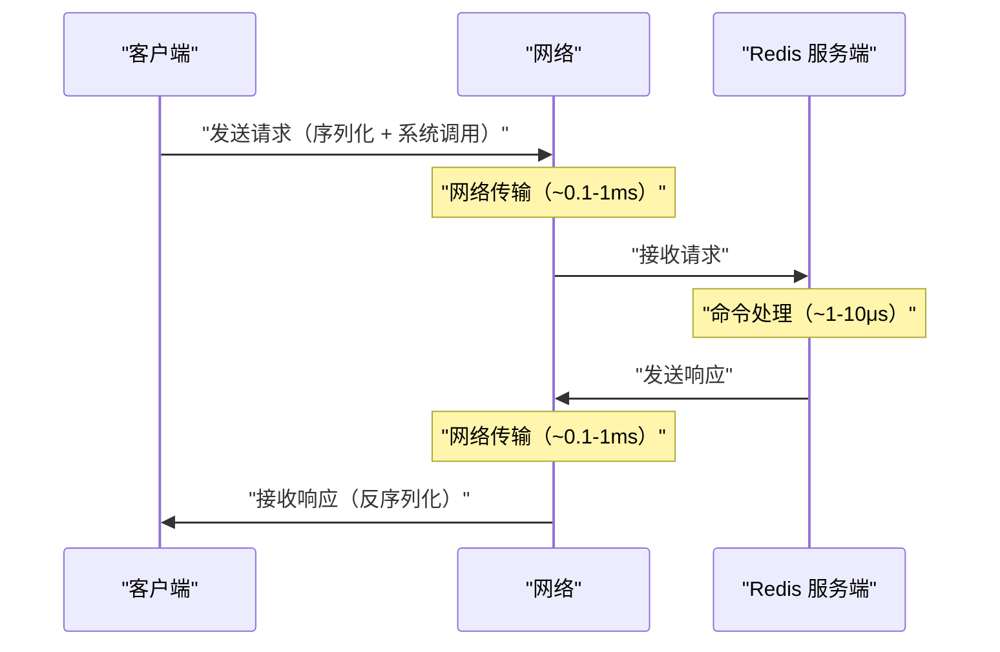
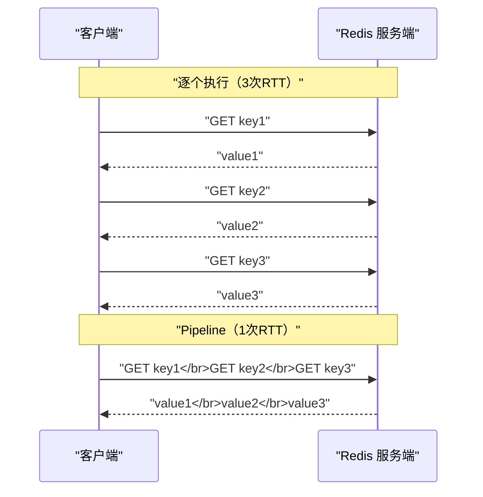
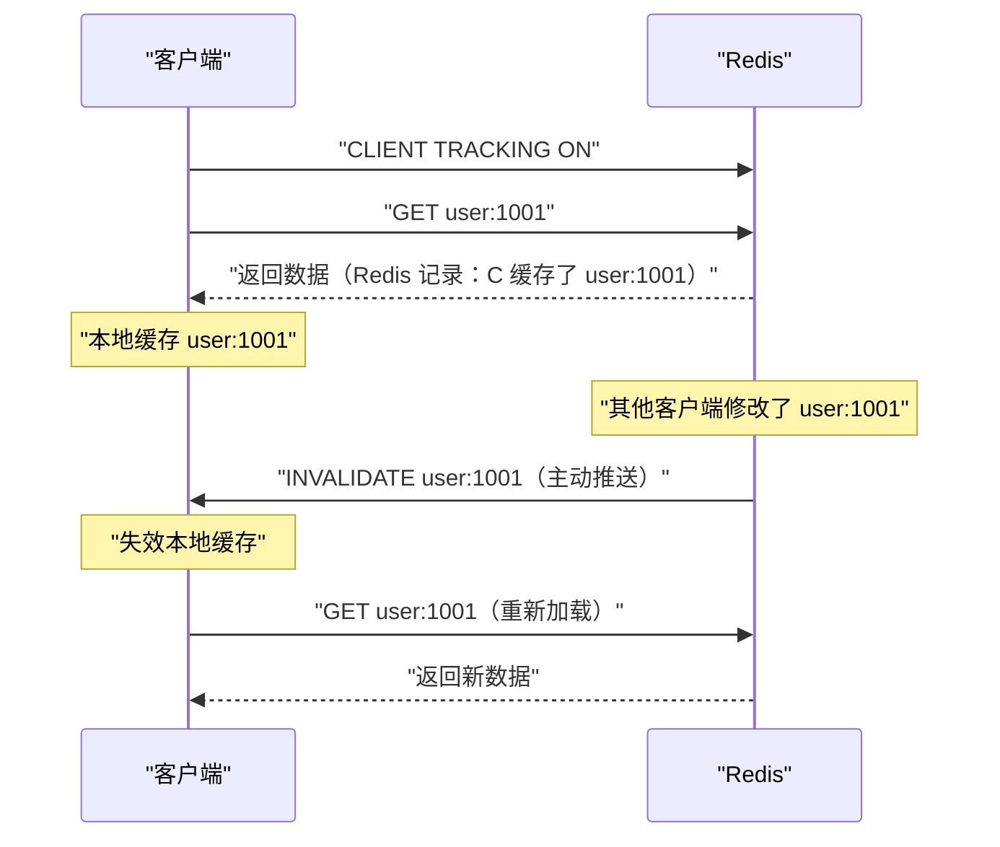

# 08 Redis Pipeline 与客户端性能优化

**摘要：**

Redis 服务端的命令处理速度极快——一条简单的 GET/SET 命令在服务端的执行时间通常只有几微秒。但在实际应用中，客户端感知到的延迟往往在毫秒级——多出来的时间几乎全部花在了**网络往返（RTT, Round Trip Time）** 上。一次 GET 命令的完整流程是：客户端发送请求 → 网络传输 → 服务端处理 → 网络传输 → 客户端收到响应。如果 RTT 是 0.5ms，一次 GET 的总延迟约 0.5ms + 几微秒 ≈ 0.5ms；但如果需要执行 1000 次 GET，逐个执行的总延迟是 1000 × 0.5ms = 500ms——而 Pipeline 可以将 1000 次请求打包成一次网络传输，总延迟降到约 1ms。Pipeline 是 Redis 客户端性能优化中最重要也最容易被忽视的技术。本文从 RTT 的瓶颈分析出发，深入 Pipeline 的原理和使用规范，然后系统讨论连接池设计、客户端库选型、代理层架构和慢查询诊断。

---

## 第 1 章 RTT——被忽视的性能瓶颈

### 1.1 一次 Redis 命令的延迟构成



一次命令的延迟 = **客户端序列化** + **网络传输（去）** + **服务端处理** + **网络传输（回）** + **客户端反序列化**

在同机房内（RTT ~0.2ms），服务端处理时间（~5μs）只占总延迟的 2.5%——**97.5% 的时间花在了网络传输上**。

### 1.2 逐个执行的性能瓶颈

假设需要从 Redis 中读取 100 个用户的信息：

```
逐个执行：100 次 GET × 0.2ms RTT = 20ms
```

20ms 在低频场景下可以接受，但在高频调用的接口中——如果每个请求都需要读取 100 个 key，QPS 1000 时意味着每秒 10 万次 Redis 命令，每个请求增加 20ms 延迟。

**问题的本质**：逐个执行时，客户端必须**等待上一条命令的响应返回后才能发送下一条命令**——这被称为"停-等"（Stop-and-Wait）模式。网络的带宽远未被利用——绝大部分时间客户端和服务端都在等待对方。

---

## 第 2 章 Pipeline——批量发送的艺术

### 2.1 Pipeline 的原理

Pipeline 的核心思想极其简单——**不等待上一条命令的响应，连续发送多条命令，最后一次性接收所有响应**。



Pipeline 将 N 条命令的 N 次 RTT 压缩为 **1 次 RTT**——延迟从 `N × RTT` 降为 `1 × RTT + N × 服务端处理时间`。对于 100 条命令：

```
逐个执行：100 × 0.2ms = 20ms
Pipeline：0.2ms + 100 × 5μs = 0.7ms
```

性能提升约 **30 倍**。

### 2.2 Pipeline 不是原子操作

一个常见的误解是把 Pipeline 和事务混淆。Pipeline 仅仅是一种**网络优化手段**——它将多条命令打包发送以减少 RTT，但这些命令**不是原子执行的**。在 Pipeline 的命令执行期间，其他客户端的命令可能会插入其中。

```
Pipeline 内的命令执行顺序：
  客户端 A Pipeline: SET key1 "a1" | SET key2 "a2" | SET key3 "a3"
  客户端 B 单条命令: SET key2 "b2"

  实际执行顺序可能是：
  SET key1 "a1" → SET key2 "b2" → SET key2 "a2" → SET key3 "a3"
```

如果需要原子性，应使用 [[03 Redis 事务 Lua 脚本与原子性保证|MULTI/EXEC 事务]] 或 **Lua 脚本**。事务也可以放在 Pipeline 中发送——Pipeline 内嵌事务是合法的，且常见。

### 2.3 Pipeline 的使用

**Python（redis-py）**：

```python
import redis

r = redis.Redis(host='localhost', port=6379)

# 创建 Pipeline
pipe = r.pipeline(transaction=False)  # transaction=False: 纯 Pipeline，不使用事务

# 批量添加命令（此时不发送）
for i in range(1000):
    pipe.set(f'key:{i}', f'value:{i}')

# 一次性发送并接收所有响应
results = pipe.execute()
# results 是一个列表，包含每条命令的返回值
```

**Java（Jedis）**：

```java
try (Jedis jedis = jedisPool.getResource()) {
    Pipeline pipeline = jedis.pipelined();
    for (int i = 0; i < 1000; i++) {
        pipeline.set("key:" + i, "value:" + i);
    }
    List<Object> results = pipeline.syncAndReturnAll();
}
```

**Java（Lettuce——基于 Netty 的异步客户端）**：

```java
// Lettuce 默认启用自动 Pipeline（auto-flushing）
// 手动控制 flush 可以进一步优化
StatefulRedisConnection<String, String> connection = client.connect();
connection.setAutoFlushCommands(false);
RedisAsyncCommands<String, String> commands = connection.async();

List<RedisFuture<String>> futures = new ArrayList<>();
for (int i = 0; i < 1000; i++) {
    futures.add(commands.set("key:" + i, "value:" + i));
}
connection.flushCommands();  // 一次性发送
// 等待所有响应
LettuceFutures.awaitAll(Duration.ofSeconds(5), futures.toArray(new RedisFuture[0]));
```

### 2.4 Pipeline 的注意事项

**批次大小控制**：不要在一个 Pipeline 中塞入太多命令——Redis 需要在内存中缓存所有响应直到客户端读取。如果 Pipeline 包含 100 万条命令，Redis 的输出缓冲区可能达到数百 MB。建议单个 Pipeline 的命令数控制在 **1000-10000** 条之间，超过的部分分多个 Pipeline 批次发送。

**错误处理**：Pipeline 中的每条命令独立执行——某条命令失败不影响其他命令。`pipe.execute()` 返回的结果列表中，失败的命令对应位置是一个异常对象。

**Redis Cluster 中的 Pipeline**：在 [[10 Redis Cluster 分布式架构|Redis Cluster]] 中，Pipeline 的命令可能涉及不同的分片——客户端需要将命令按分片分组，分别发送到对应的节点。大多数客户端库（Jedis、Lettuce、redis-py）已自动处理这个逻辑。

### 2.5 Pipeline vs MGET/MSET

MGET/MSET 也是"一次请求多个操作"——它们与 Pipeline 的区别是什么？

| 维度 | Pipeline | MGET/MSET |
| :--- | :--- | :--- |
| **命令类型** | 任意命令的组合 | 仅限 GET/SET 类操作 |
| **原子性** | ❌（命令可能被其他客户端插入）| ✅（单条命令，原子执行）|
| **Cluster 限制** | 客户端自动分片路由 | 所有 key 必须在同一个 slot |
| **适用场景** | 任意批量操作 | 批量读/写同类型数据 |

**选型建议**：
- 批量读取/写入相同类型的数据且 key 在同一 slot：优先用 MGET/MSET（更简单，原子性）
- 批量执行不同类型的命令、或 key 分布在不同 slot：用 Pipeline

---

## 第 3 章 连接池设计

### 3.1 为什么需要连接池

Redis 使用 TCP 协议通信——每次建立连接需要 TCP 三次握手（~1ms 同机房），如果启用了 TLS 还需要额外的握手开销（~5-10ms）。如果每次 Redis 操作都新建连接再关闭，连接建立的开销比命令执行的开销大两个数量级。

连接池维护一组**预建立的长连接**——应用线程从池中借用连接，使用完毕后归还——避免了反复建立和销毁连接的开销。

### 3.2 连接池参数调优

以 Java 的 JedisPool（基于 Apache Commons Pool 2）为例：

| 参数 | 默认值 | 建议值 | 说明 |
| :--- | :--- | :--- | :--- |
| **maxTotal** | 8 | 业务并发数 × 1.2 | 最大连接数——太小导致线程等待，太大浪费 Redis 连接资源 |
| **maxIdle** | 8 | 与 maxTotal 相同 | 最大空闲连接数——避免频繁创建销毁 |
| **minIdle** | 0 | 业务最低并发数 | 最小空闲连接数——保持一定的"预热"连接 |
| **maxWaitMillis** | -1（无限）| 200-1000ms | 获取连接的最大等待时间——超时抛异常比无限等待好 |
| **testOnBorrow** | false | false | 借用时检测连接有效性——开启会增加一次 PING 的 RTT |
| **testWhileIdle** | false | true | 空闲时定期检测——清理失效连接 |
| **timeBetweenEvictionRunsMillis** | -1 | 30000 | 空闲检测间隔（毫秒）|

**maxTotal 的估算公式**：

```
maxTotal = 业务峰值 QPS × 单次操作平均耗时（秒）× 安全系数

例如：QPS = 5000，平均耗时 = 2ms = 0.002s，安全系数 = 1.5
maxTotal = 5000 × 0.002 × 1.5 = 15
```

> [!warning] Redis 的最大连接数限制
> Redis 的 `maxclients` 配置（默认 10000）限制了同时连接的客户端数。如果应用有 100 个实例，每个实例的连接池 maxTotal = 50，总连接数 = 5000——接近 maxclients 限制。需要根据应用实例数和 Redis 连接限制统筹规划。

### 3.3 Jedis vs Lettuce vs Redisson

| 维度 | Jedis | Lettuce | Redisson |
| :--- | :--- | :--- | :--- |
| **IO 模型** | BIO（阻塞 IO）| NIO（Netty）| NIO（Netty）|
| **线程安全** | ❌（需连接池）| ✅（单连接多线程复用）| ✅ |
| **连接管理** | JedisPool 手动管理 | 自动管理，单连接复用 | 自动管理 |
| **Pipeline** | 手动创建 Pipeline 对象 | 默认自动 Pipeline | 支持 |
| **Cluster 支持** | JedisCluster | RedisClusterClient | 内置 |
| **Sentinel 支持** | JedisSentinelPool | RedisSentinelClient | 内置 |
| **分布式数据结构** | ❌ | ❌ | ✅（Lock、Map、Queue 等）|
| **Spring 集成** | Spring Data Redis 默认 | Spring Data Redis 默认（Boot 2.0+）| 独立框架 |
| **适用场景** | 简单应用 | 高性能/响应式 | 需要分布式锁/数据结构 |

**Lettuce 的单连接复用**：Lettuce 基于 Netty 的 NIO 模型——多个线程可以共享一个 TCP 连接。命令通过 Pipeline 的方式异步发送，Netty 的 EventLoop 负责 IO 多路复用。这意味着 Lettuce 不需要连接池——一个连接就可以支撑极高的并发。

```
Jedis: 每个线程需要一个独立的连接 → 需要连接池
Lettuce: 多个线程共享一个连接 → 不需要连接池（但可以配置多连接以提升吞吐）
```

**选型建议**：
- **Spring Boot 2.0+**：默认使用 Lettuce——无需额外配置
- **需要分布式锁/信号量/队列**：Redisson
- **简单场景/老项目**：Jedis

---

## 第 4 章 代理层架构

### 4.1 为什么需要代理层

在大规模 Redis 部署中，直接让应用连接 Redis 存在几个问题：

- **连接数爆炸**：100 个应用实例 × 50 连接/实例 × 10 个 Redis 分片 = 50000 个连接
- **客户端复杂度**：Redis Cluster 的 MOVED/ASK 重定向、分片感知、连接池管理等逻辑分散在每个应用中
- **运维困难**：Redis 扩缩容时需要通知所有应用重新发现拓扑

**代理层**（Proxy）在应用和 Redis 之间增加了一个中间层——应用只连接代理，代理负责路由、连接复用和拓扑管理。

### 4.2 主流代理方案

| 代理 | 作者 | 特点 |
| :--- | :--- | :--- |
| **Twemproxy** | Twitter | 最早的 Redis 代理，一致性哈希分片，不支持在线扩缩容 |
| **Codis** | 豌豆荚 | 支持在线扩缩容，Dashboard 管理，基于 slot 分片 |
| **Redis Cluster Proxy** | Redis 官方（实验性）| 为 Redis Cluster 提供统一入口 |
| **Envoy** | CNCF | 通用 L7 代理，支持 Redis 协议过滤器 |
| **Predixy** | 开源 | 高性能，支持 Sentinel 和 Cluster |

### 4.3 代理 vs 客户端直连

| 维度 | 客户端直连 | 代理层 |
| :--- | :--- | :--- |
| **延迟** | 更低（少一跳）| 略高（多一跳代理转发）|
| **连接数** | 高（应用 × 分片）| 低（代理复用连接）|
| **客户端复杂度** | 高（需要 Cluster 感知）| 低（代理透明处理）|
| **运维** | 每个应用独立管理连接 | 统一在代理层管理 |
| **适用规模** | 中小规模 | 大规模（数百应用实例）|

---

## 第 5 章 慢查询诊断

### 5.1 慢查询日志

Redis 内置了慢查询日志——记录执行时间超过阈值的命令：

```bash
# 配置慢查询阈值（微秒，默认 10000 = 10ms）
CONFIG SET slowlog-log-slower-than 5000    # 5ms

# 配置慢查询日志的最大长度
CONFIG SET slowlog-max-len 1000

# 查看慢查询日志
SLOWLOG GET 10                              # 最近 10 条慢查询
SLOWLOG LEN                                 # 当前日志条数
SLOWLOG RESET                               # 清空日志
```

慢查询日志的每条记录包含：
- **ID**：唯一递增标识
- **时间戳**：命令执行的 Unix 时间戳
- **耗时**：命令执行时间（微秒）——注意：不包括网络传输和排队等待时间
- **命令及参数**：完整的命令内容

### 5.2 常见的慢查询原因

| 原因 | 典型命令 | 解决方案 |
| :--- | :--- | :--- |
| **大 Key 操作** | HGETALL（10 万 field）、DEL（100MB ZSet）| 拆分大 Key、使用 HSCAN/UNLINK |
| **全量遍历** | KEYS \*、SMEMBERS（大 Set）| 改用 SCAN/SSCAN |
| **复杂度高的命令** | SORT、ZUNIONSTORE（大集合）| 减少集合大小、在从节点执行 |
| **Lua 脚本过长** | 包含大量 Redis 调用或复杂计算的 Lua | 精简脚本、拆分逻辑到客户端 |
| **AOF 刷盘** | appendfsync always 导致每条命令都等 fsync | 改为 everysec |
| **内存不足触发淘汰** | maxmemory-policy 驱逐大 Key | 增加内存、优化 Key 设计 |

### 5.3 延迟监控——LATENCY

Redis 2.8.13+ 提供了 LATENCY 监控框架——自动记录各类延迟事件：

```bash
# 开启延迟监控（阈值 5ms）
CONFIG SET latency-monitor-threshold 5

# 查看所有延迟事件
LATENCY LATEST

# 查看特定事件的历史记录
LATENCY HISTORY command

# 查看延迟诊断建议
LATENCY DOCTOR

# 重置延迟数据
LATENCY RESET
```

LATENCY DOCTOR 会给出具体的诊断建议——如"检查是否有大 Key"、"检查 AOF 配置"、"检查是否有 fork 操作"等。

### 5.4 客户端超时设计

合理的超时设置是防止 Redis 延迟拖垮整个应用的最后一道防线：

| 超时参数 | 建议值 | 说明 |
| :--- | :--- | :--- |
| **连接超时** | 200-500ms | TCP 建连超时——超过说明网络异常或 Redis 不可达 |
| **读写超时** | 200-500ms | 单次命令的等待超时——超过说明 Redis 繁忙或命令耗时长 |
| **连接池等待超时** | 200-1000ms | 从连接池获取连接的等待时间——超过说明连接不够用 |
| **重试次数** | 2-3 次 | 超时后的重试——注意幂等性 |

> [!warning] 超时太长比太短更危险
> 如果读写超时设置为 30 秒，当 Redis 出现慢查询导致响应变慢时，应用线程会被阻塞 30 秒——在高并发下，大量线程被阻塞会迅速耗尽线程池，导致整个应用不可用（线程池打满 → 请求堆积 → 级联故障）。**宁可快速失败（200ms 超时 + 重试）也不要长时间等待。**

---

## 第 6 章 Client-Side Caching（客户端缓存）

### 6.1 Redis 6.0 的 Tracking 模式

Redis 6.0 引入了**服务端辅助的客户端缓存**——Redis 服务端主动通知客户端"某个 key 的值已变更"，客户端据此失效本地缓存。



**两种 Tracking 模式**：

- **默认模式**：Redis 精确记录每个客户端缓存了哪些 key——key 变更时只通知缓存了该 key 的客户端。精确但需要更多服务端内存。
- **广播模式**（Broadcasting）：客户端订阅 key 前缀——Redis 不记录谁缓存了什么，只是将匹配前缀的所有变更广播给订阅者。内存开销小但通知范围大（可能收到不相关的失效通知）。

### 6.2 工程价值

Client-Side Caching 解决了[[04 缓存设计模式与一致性问题|多级缓存]]中本地缓存与 Redis 之间的一致性问题——Redis 变更时主动通知客户端失效本地缓存，而不是依赖 TTL 过期。本地缓存的命中率可以更高（TTL 可以设更长，因为有主动失效机制），且一致性更好。

---

## 第 7 章 总结

本文系统分析了 Redis 客户端性能优化的关键技术：

- **Pipeline**：将 N 次 RTT 压缩为 1 次——性能提升 10-100 倍；非原子操作，不要与事务混淆；单个 Pipeline 建议 1000-10000 条命令
- **连接池**：预建立长连接避免 TCP 握手开销；maxTotal 根据 QPS × 平均耗时估算；Jedis 需要连接池，Lettuce 单连接复用不需要
- **客户端库选型**：Lettuce（NIO，高性能，Spring Boot 默认）> Jedis（BIO，简单）；需要分布式数据结构用 Redisson
- **代理层**：大规模部署时减少连接数、简化客户端——Codis/Twemproxy/Predixy
- **慢查询诊断**：SLOWLOG 定位慢命令、LATENCY DOCTOR 自动诊断、避免 KEYS/HGETALL 等全量操作
- **超时设计**：读写超时 200-500ms，快速失败优于长时间等待
- **Client-Side Caching**：Redis 6.0 的 Tracking 模式——服务端主动推送失效通知，提升本地缓存一致性

下一篇 [[09 Redis 与搜索——RediSearch 与 RedisJSON]] 将探讨 Redis 在搜索场景的扩展能力——RedisJSON 的文档存储和 RediSearch 的全文索引与向量搜索。

---

## 参考资料

1. Redis Documentation - Pipelining：https://redis.io/docs/manual/pipelining/
2. Redis Documentation - Client-side caching：https://redis.io/docs/manual/client-side-caching/
3. Redis Documentation - SLOWLOG：https://redis.io/commands/slowlog-get/
4. Redis Documentation - LATENCY：https://redis.io/commands/latency-doctor/
5. Lettuce Documentation：https://lettuce.io/core/release/reference/
6. Redisson Documentation：https://github.com/redisson/redisson/wiki
7. Jedis Documentation：https://github.com/redis/jedis

---

> [!note] 思考题
> 1. 分布式 Session 存储在 Redis 中——每个请求都读写 Session。如果 Session 数据较大（如包含用户权限列表、购物车），每次序列化/反序列化的开销在高并发下是否成为瓶颈？JWT Token（无状态、不需要存储）vs Redis Session（有状态、可以主动失效）——在什么安全需求下你会选择 Redis Session？
> 2. 滑动窗口限流用 Sorted Set 实现——`ZADD key <timestamp> <request_id>`，过滤窗口外的旧记录后 `ZCARD` 计数。每个请求产生一条 Sorted Set 记录——在 10 万 QPS 下每秒产生 10 万条记录。Sorted Set 的内存占用和清理开销如何？令牌桶算法（Lua 脚本实现）在内存效率方面是否更优？
> 3. 多服务共享 Redis 的'多租户'问题——Key 命名冲突、资源竞争、故障扩散。命名空间前缀（`service_a:key`）简单但不完全隔离。独立 Redis 实例彻底隔离但成本高。Redis 7.0 的 ACL 基于 Key Pattern 的权限控制能否提供足够的隔离？
