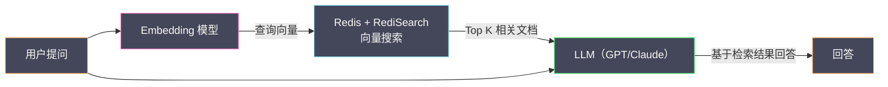

# 09 Redis 与搜索——RediSearch 与 RedisJSON

**摘要：**

传统认知中，Redis 是一个键值存储——通过 key 精确查找 value。但现实业务中的查询需求远比"按 key 查找"复杂：按商品名称模糊搜索、按价格范围筛选、按地理位置排序、按文本相关性排名……这些查询在关系型数据库中通过 SQL 的 WHERE/LIKE/ORDER BY 实现，在搜索引擎中通过倒排索引实现，但在原生 Redis 中几乎无法直接完成。Redis Stack（原 RedisJSON + RediSearch + RedisBloom 等模块的集合）改变了这一局面——**RedisJSON** 让 Redis 原生支持 JSON 文档的存储和部分读写，**RediSearch** 在 Redis 数据之上构建了全文索引、数值索引、Tag 索引和向量索引，将 Redis 从纯粹的键值缓存扩展为一个具备实时搜索能力的数据平台。本文从 Redis 作为二级索引的传统方案出发，逐步深入 RedisJSON 的文档模型和 RediSearch 的索引机制，最后探讨向量搜索在 AI 时代的应用场景。

---

## 第 1 章 Redis 的搜索困境

### 1.1 原生 Redis 的查询局限

原生 Redis 只支持**按 key 精确查找**——`GET user:1001` 可以瞬间返回用户 1001 的数据，但以下查询在原生 Redis 中无法直接完成：

- "查找所有名字包含'张'的用户"——Redis 没有全文索引
- "查找价格在 100-500 之间的商品"——Redis 没有范围索引（ZSet 可以按 score 范围查，但只有一个维度）
- "查找北京地区、年龄 25-35 岁、VIP 等级 3 以上的用户"——Redis 没有多条件组合查询

`KEYS pattern` 和 `SCAN MATCH pattern` 支持通配符匹配——但它们只能匹配 **key 名**，不能匹配 value 内容。而且 KEYS 会阻塞 Redis，SCAN 是全量遍历——在百万级 key 的场景下延迟不可接受。

### 1.2 传统方案：手动构建二级索引

在 RediSearch 出现之前，开发者通过 Redis 的基础数据类型手动构建"二级索引"：

**按字段值查找——Set 索引**：

```bash
# 为城市字段建立索引
SADD idx:city:beijing "user:1001" "user:1003" "user:1007"
SADD idx:city:shanghai "user:1002" "user:1005"

# 查找北京的用户
SMEMBERS idx:city:beijing
```

**按数值范围查找——ZSet 索引**：

```bash
# 为年龄字段建立索引（score = 年龄，member = user_id）
ZADD idx:age 25 "user:1001"
ZADD idx:age 30 "user:1002"
ZADD idx:age 28 "user:1003"

# 查找年龄 25-30 的用户
ZRANGEBYSCORE idx:age 25 30
```

**多条件组合查询——Set 交集**：

```bash
# 北京 AND 年龄 25-30
# 1. 先用 ZSet 取出年龄 25-30 的用户 → 存入临时 Set
ZRANGESTORE tmp:age idx:age 25 30 BYSCORE
# 2. 与城市索引取交集
SINTERSTORE tmp:result idx:city:beijing tmp:age
# 3. 读取结果
SMEMBERS tmp:result
# 4. 清理临时 key
DEL tmp:age tmp:result
```

**这种手动索引方案的痛点**：

- **维护成本极高**：每次数据变更（增删改）都需要同步更新所有相关索引——代码复杂、容易出 bug
- **一致性风险**：数据和索引的更新不是原子的——如果中间失败，索引与数据不一致
- **功能有限**：无法实现全文搜索（分词、相关性排序）、模糊匹配、多字段排序等高级功能
- **内存开销大**：每个索引都是一个独立的 Set/ZSet——大量索引消耗可观的内存

---

## 第 2 章 RedisJSON——文档存储

### 2.1 为什么需要 RedisJSON

在原生 Redis 中存储 JSON 数据有两种方式：

**方式 A：String 序列化**——将 JSON 序列化为字符串存储：

```bash
SET user:1001 '{"name":"Alice","age":30,"city":"Beijing","tags":["vip","active"]}'
```

问题：每次只想读取或修改一个字段（如 age），都必须 GET 整个 JSON → 客户端反序列化 → 修改字段 → 序列化 → SET 回去。对于大 JSON（几十 KB），这个"读-改-写"过程非常低效。

**方式 B：Hash 结构化**——将 JSON 的顶层字段映射为 Hash 的 field：

```bash
HSET user:1001 name "Alice" age 30 city "Beijing"
```

问题：Hash 的 field 只支持字符串值——无法存储嵌套对象和数组。`tags: ["vip", "active"]` 只能序列化为字符串存在一个 field 中——失去了结构化查询的能力。

**RedisJSON** 解决了这两个问题——它在 Redis 内核中原生支持 JSON 数据类型，可以**按路径（JSONPath）读写 JSON 的任意部分**，且支持嵌套对象和数组。

### 2.2 RedisJSON 基本操作

```bash
# 存储 JSON 文档
JSON.SET user:1001 $ '{"name":"Alice","age":30,"city":"Beijing","address":{"district":"Haidian","zip":"100080"},"tags":["vip","active"],"score":85.5}'

# 按路径读取
JSON.GET user:1001 $.name                    # '"Alice"'
JSON.GET user:1001 $.address.district        # '"Haidian"'
JSON.GET user:1001 $.tags                    # '["vip","active"]'
JSON.GET user:1001 $.tags[0]                 # '"vip"'

# 按路径修改（原子操作）
JSON.SET user:1001 $.age 31                  # 修改年龄
JSON.SET user:1001 $.address.zip "100081"    # 修改嵌套字段

# 数值操作（原子递增）
JSON.NUMINCRBY user:1001 $.age 1            # 年龄 +1
JSON.NUMINCRBY user:1001 $.score 2.5        # 分数 +2.5

# 数组操作
JSON.ARRAPPEND user:1001 $.tags '"gold"'     # 追加元素
JSON.ARRLEN user:1001 $.tags                 # 数组长度
JSON.ARRINDEX user:1001 $.tags '"vip"'       # 查找元素索引
JSON.ARRPOP user:1001 $.tags                 # 弹出最后一个元素

# 删除字段
JSON.DEL user:1001 $.address.zip

# 获取 JSON 类型
JSON.TYPE user:1001 $.age                    # "integer"
JSON.TYPE user:1001 $.tags                   # "array"
```

### 2.3 RedisJSON 的 JSONPath 语法

RedisJSON 支持 **JSONPath** 语法（类似于 XPath 之于 XML）：

| 语法 | 含义 | 示例 |
| :--- | :--- | :--- |
| `$` | 根节点 | `$.name` |
| `.field` | 子字段 | `$.address.city` |
| `[index]` | 数组元素 | `$.tags[0]` |
| `[start:end]` | 数组切片 | `$.tags[0:2]` |
| `..field` | 递归搜索 | `$..name`（所有层级的 name 字段）|
| `[?(@.field > value)]` | 条件过滤 | `$.items[?(@.price > 100)]` |

### 2.4 RedisJSON vs String vs Hash

| 维度 | String（JSON 序列化） | Hash | RedisJSON |
| :--- | :--- | :--- | :--- |
| **部分读取** | ❌ 需要 GET 全部 | ✅ HGET 单字段 | ✅ JSON.GET 按路径 |
| **部分写入** | ❌ 需要读-改-写 | ✅ HSET 单字段 | ✅ JSON.SET 按路径 |
| **嵌套结构** | ✅（但只能整体操作） | ❌ | ✅ |
| **数组操作** | ❌ | ❌ | ✅ ARRAPPEND/ARRPOP |
| **原子数值操作** | ❌ | ✅ HINCRBY | ✅ JSON.NUMINCRBY |
| **内存效率** | 中 | 高（ziplist 编码）| 中 |
| **搜索能力** | ❌ | ❌ | ✅（配合 RediSearch）|

**选型建议**：
- 简单的扁平结构（无嵌套、无数组）且字段数少：**Hash**（内存最优）
- 复杂嵌套 JSON 且需要部分读写：**RedisJSON**
- 只需要整体存取的小 JSON：**String**（最简单）

---

## 第 3 章 RediSearch——实时搜索引擎

### 3.1 RediSearch 是什么

**RediSearch** 是 Redis 的搜索和查询引擎模块——它在 Redis 的 Hash 或 JSON 数据之上自动构建索引，支持：

- **全文搜索**：中英文分词、模糊匹配、前缀搜索、语义搜索
- **数值范围查询**：价格在 100-500 之间
- **Tag 过滤**：类别为"电子产品"且品牌为"Apple"
- **地理位置查询**：距离某点 5 公里内
- **向量搜索**：基于向量相似度的语义搜索（KNN / 范围搜索）
- **聚合（Aggregation）**：分组、计数、求和、排序——类似 SQL 的 GROUP BY
- **多条件组合**：AND / OR / NOT 组合查询
- **结果排序**：按字段值或相关性排序
- **高亮**：搜索结果中高亮匹配的关键词

### 3.2 创建索引

RediSearch 的索引定义了哪些字段需要被索引以及索引类型：

```bash
# 在 Hash 类型的 key 上创建索引（key 前缀为 product:）
FT.CREATE idx:products
  ON HASH                                    # 数据源类型（HASH 或 JSON）
  PREFIX 1 "product:"                        # 监控的 key 前缀
  SCHEMA
    name TEXT WEIGHT 5.0                     # 全文索引，权重 5（提升搜索相关性）
    description TEXT WEIGHT 1.0              # 全文索引，权重 1
    category TAG SEPARATOR ","               # Tag 索引（逗号分隔多标签）
    price NUMERIC SORTABLE                   # 数值索引，可排序
    brand TAG                                # Tag 索引
    location GEO                             # 地理位置索引
    embedding VECTOR FLAT 6                  # 向量索引（后面详述）
      TYPE FLOAT32
      DIM 768
      DISTANCE_METRIC COSINE
```

**索引创建后自动生效**——RediSearch 会自动索引所有匹配前缀的已有 key，并且在后续的 HSET/JSON.SET 操作时**自动更新索引**。开发者不需要手动维护索引——这是 RediSearch 相比手动二级索引方案的最大优势。

### 3.3 写入数据

数据以普通的 Hash 或 JSON 方式写入——RediSearch 自动索引：

```bash
# 写入商品数据（Hash 方式）
HSET product:1001 name "iPhone 15 Pro" description "Apple latest smartphone with A17 chip" category "手机,电子产品" price 7999 brand "Apple" location "116.403963,39.915119"

HSET product:1002 name "MacBook Air M3" description "Ultra thin laptop with Apple silicon" category "笔记本,电子产品" price 8999 brand "Apple" location "116.417,39.928"

HSET product:1003 name "Galaxy S24 Ultra" description "Samsung flagship phone with AI features" category "手机,电子产品" price 6999 brand "Samsung" location "116.461,39.919"
```

### 3.4 全文搜索

```bash
# 搜索包含 "iPhone" 的商品
FT.SEARCH idx:products "iPhone"

# 搜索 name 字段包含 "Apple" 的商品
FT.SEARCH idx:products "@name:Apple"

# 模糊搜索（Fuzzy，允许 1 个字符的编辑距离）
FT.SEARCH idx:products "%%iPhon%%"

# 前缀搜索
FT.SEARCH idx:products "Mac*"

# 搜索结果高亮
FT.SEARCH idx:products "iPhone" HIGHLIGHT FIELDS 1 name TAGS "<b>" "</b>"
```

### 3.5 多条件组合查询

RediSearch 的查询语法支持丰富的条件组合：

```bash
# 品牌为 Apple 且价格 5000-9000
FT.SEARCH idx:products "@brand:{Apple} @price:[5000 9000]"

# 类别包含"手机"且品牌为 Apple 或 Samsung
FT.SEARCH idx:products "@category:{手机} (@brand:{Apple} | @brand:{Samsung})"

# 全文搜索 "phone" 且价格低于 8000，按价格升序排列
FT.SEARCH idx:products "@description:phone @price:[-inf 8000]" SORTBY price ASC

# 地理位置查询：距离 (116.41, 39.92) 5 公里内
FT.SEARCH idx:products "@location:[116.41 39.92 5 km]"

# 排除某个品牌
FT.SEARCH idx:products "-@brand:{Samsung} @category:{手机}"
```

### 3.6 聚合查询

`FT.AGGREGATE` 提供了类似 SQL GROUP BY 的聚合能力：

```bash
# 按品牌分组，统计商品数量和平均价格
FT.AGGREGATE idx:products "*"
  GROUPBY 1 @brand
  REDUCE COUNT 0 AS count
  REDUCE AVG 1 @price AS avg_price
  SORTBY 2 @count DESC

# 按价格区间分组
FT.AGGREGATE idx:products "*"
  APPLY "floor(@price/1000)*1000" AS price_range
  GROUPBY 1 @price_range
  REDUCE COUNT 0 AS count
  SORTBY 2 @price_range ASC
```

### 3.7 RediSearch 的索引类型

| 索引类型 | 字段声明 | 查询语法 | 适用场景 |
| :--- | :--- | :--- | :--- |
| **TEXT** | `name TEXT` | `@name:keyword` | 全文搜索（分词、模糊、前缀）|
| **TAG** | `brand TAG` | `@brand:{Apple}` | 精确匹配、多值标签 |
| **NUMERIC** | `price NUMERIC` | `@price:[100 500]` | 数值范围查询 |
| **GEO** | `location GEO` | `@location:[lon lat radius unit]` | 地理位置范围查询 |
| **VECTOR** | `embedding VECTOR ...` | `KNN` / `RADIUS` | 向量相似度搜索 |

### 3.8 RediSearch 在 JSON 数据上的使用

RediSearch 可以直接在 RedisJSON 的数据上建立索引——通过 JSONPath 指定索引字段：

```bash
# 在 JSON 数据上创建索引
FT.CREATE idx:users
  ON JSON
  PREFIX 1 "user:"
  SCHEMA
    $.name AS name TEXT
    $.age AS age NUMERIC SORTABLE
    $.city AS city TAG
    $.address.district AS district TAG
    $.tags AS tags TAG
    $.score AS score NUMERIC SORTABLE

# 写入 JSON 数据
JSON.SET user:1001 $ '{"name":"Alice","age":30,"city":"Beijing","address":{"district":"Haidian"},"tags":["vip","active"],"score":85.5}'

# 搜索
FT.SEARCH idx:users "@city:{Beijing} @age:[25 35]"
```

---

## 第 4 章 向量搜索——AI 时代的新能力

### 4.1 什么是向量搜索

在 AI 和大语言模型（[[LLM]]）的时代，数据不再只是结构化的文本和数字——它可以被转化为**高维向量（Embedding）**。一张图片、一段文本、一个商品都可以通过 Embedding 模型编码为一个固定长度的浮点数组（如 768 维或 1536 维），语义相近的数据在向量空间中距离也相近。

**向量搜索（Vector Search）** 就是在这些向量中查找与给定查询向量最相似的 N 个向量——典型应用包括：

- **语义搜索**：用户输入"轻薄笔记本"，找到描述为"超薄商务本"的商品——即使关键词不匹配
- **推荐系统**：找到与用户历史行为向量最相似的商品向量
- **RAG（检索增强生成）**：LLM 回答问题前，先从知识库中检索最相关的文档片段
- **图像搜索**：上传一张图片，找到视觉相似的图片

### 4.2 RediSearch 的向量索引

RediSearch 支持两种向量索引算法：

| 算法 | 声明 | 特点 |
| :--- | :--- | :--- |
| **FLAT** | `VECTOR FLAT` | 暴力搜索——精确但慢，适合小数据量（< 10 万） |
| **HNSW** | `VECTOR HNSW` | 近似最近邻（ANN）——极快但近似，适合大数据量 |

**HNSW（Hierarchical Navigable Small World）** 是目前最流行的 ANN 算法——它构建一个多层的"小世界网络"图，查询时从顶层开始快速定位到目标附近，然后逐层细化。查询复杂度 O(log N)，召回率通常 > 95%。

```bash
# 创建带向量索引的 Schema
FT.CREATE idx:docs
  ON HASH
  PREFIX 1 "doc:"
  SCHEMA
    title TEXT
    content TEXT
    embedding VECTOR HNSW 6
      TYPE FLOAT32
      DIM 1536               # OpenAI text-embedding-ada-002 的维度
      DISTANCE_METRIC COSINE  # 余弦相似度
      M 16                    # 每个节点的最大连接数
      EF_CONSTRUCTION 200     # 构建时的搜索宽度
```

### 4.3 向量搜索查询

```bash
# KNN 搜索：找到与查询向量最相似的 5 个文档
FT.SEARCH idx:docs "*=>[KNN 5 @embedding $query_vec AS score]"
  PARAMS 2 query_vec "\x00\x00\x80\x3f..."   # 二进制向量数据
  SORTBY score
  RETURN 3 title content score
  DIALECT 2

# 混合查询：在"技术"类别中做向量搜索
FT.SEARCH idx:docs "(@category:{技术})=>[KNN 5 @embedding $query_vec AS score]"
  PARAMS 2 query_vec "\x00\x00\x80\x3f..."
  SORTBY score
  DIALECT 2

# 范围搜索：找到距离 < 0.3 的所有文档
FT.SEARCH idx:docs "@embedding:[VECTOR_RANGE 0.3 $query_vec]"
  PARAMS 2 query_vec "\x00\x00\x80\x3f..."
  DIALECT 2
```

### 4.4 RAG 架构中的 Redis

在 RAG（Retrieval-Augmented Generation）架构中，Redis 作为**向量数据库**存储知识库的 Embedding：



**Redis 作为向量数据库的优势**：
- **低延迟**：向量搜索在内存中完成——亚毫秒级响应
- **混合查询**：向量搜索可以与全文搜索、Tag 过滤、数值范围组合——一次查询完成"语义相似 + 结构化过滤"
- **已有基础设施**：无需部署额外的向量数据库（如 Pinecone、Milvus、Weaviate）

**Redis 作为向量数据库的局限**：
- **内存限制**：向量存储在内存中——1 亿条 1536 维 float32 向量需要约 600GB 内存
- **无持久化优化**：不像专用向量数据库有磁盘索引和量化压缩
- **功能有限**：不支持向量的在线更新（需要删除重建）、不支持 IVF 等更高级的索引算法

### 4.5 Redis 向量搜索 vs 专用向量数据库

| 维度 | Redis + RediSearch | Milvus | Pinecone |
| :--- | :--- | :--- | :--- |
| **存储** | 内存 | 内存 + 磁盘 | 云托管 |
| **最大规模** | 数百万向量（受内存限制）| 数十亿 | 数十亿 |
| **索引算法** | FLAT / HNSW | IVF / HNSW / DiskANN | 专有 |
| **混合查询** | ✅（全文 + 数值 + Tag + 向量）| ✅（有限）| ✅（有限）|
| **延迟** | 亚毫秒 | 毫秒级 | 毫秒级 |
| **运维** | 低（已有 Redis）| 中 | 零（托管）|

**选型建议**：向量规模 < 百万且已有 Redis → RediSearch；向量规模 > 千万或需要磁盘索引 → Milvus/Qdrant；不想运维 → Pinecone。

---

## 第 5 章 Redis Stack 模块生态

### 5.1 Redis Stack 概览

**Redis Stack** 是 Redis 官方推出的扩展发行版——在 Redis 核心之上集成了多个模块：

| 模块 | 功能 |
| :--- | :--- |
| **RediSearch** | 全文搜索、数值/Tag/Geo/向量索引、聚合 |
| **RedisJSON** | JSON 文档存储、JSONPath 读写 |
| **RedisBloom** | 布隆过滤器、Cuckoo 过滤器、Count-Min Sketch、Top-K |
| **RedisTimeSeries** | 时序数据存储、降采样、聚合 |
| **RedisGraph**（已停止维护） | 图数据库 |

### 5.2 安装与使用

```bash
# Docker 方式启动 Redis Stack
docker run -d --name redis-stack -p 6379:6379 -p 8001:8001 redis/redis-stack:latest
# 8001 端口是 RedisInsight Web UI

# 验证模块加载
redis-cli MODULE LIST
# 应包含 search, ReJSON, bf, timeseries 等
```

### 5.3 RediSearch vs Elasticsearch

| 维度 | RediSearch | Elasticsearch |
| :--- | :--- | :--- |
| **存储** | 内存 | 磁盘（Lucene）|
| **数据规模** | 百万级（受内存限制）| 十亿级 |
| **写入延迟** | 实时索引（微秒级）| 近实时（默认 1 秒 refresh）|
| **查询延迟** | 亚毫秒~毫秒 | 毫秒~十毫秒 |
| **全文搜索** | ✅ | ✅（更强大）|
| **分词器** | 内置多语言 + 自定义 | 丰富插件生态 |
| **向量搜索** | ✅ | ✅（8.0+）|
| **聚合** | ✅（FT.AGGREGATE）| ✅（更强大）|
| **分布式** | Redis Cluster | 原生分片 + 副本 |
| **运维复杂度** | 低（已有 Redis）| 高（JVM + 集群管理）|
| **适用场景** | 实时搜索、小数据量 | 大规模日志/搜索 |

**选型建议**：
- **数据量小（百万级）、已有 Redis、需要极低延迟**：RediSearch
- **数据量大（亿级）、需要复杂分析聚合、日志搜索**：Elasticsearch

---

## 第 6 章 总结

本文系统介绍了 Redis 在搜索和文档存储领域的扩展能力：

- **原生 Redis 的搜索困境**：只支持按 key 精确查找；手动构建二级索引维护成本高、功能有限
- **RedisJSON**：原生 JSON 文档类型——按 JSONPath 部分读写、嵌套对象和数组操作、原子数值递增；适合复杂嵌套结构的存储
- **RediSearch**：全功能搜索引擎——自动索引维护、全文搜索（分词/模糊/前缀）、数值范围/Tag 过滤/Geo 查询、聚合统计、向量搜索（FLAT/HNSW）；查询语法支持 AND/OR/NOT 多条件组合
- **向量搜索**：HNSW 近似最近邻算法——在 RAG/推荐/语义搜索场景中提供亚毫秒级的向量检索；混合查询（向量 + 结构化过滤）是 Redis 的独特优势
- **Redis Stack**：官方扩展发行版——集成 RediSearch、RedisJSON、RedisBloom、RedisTimeSeries 等模块

下一篇 [[10 Redis 生产运维——监控 告警与故障排查]] 将深入分析 Redis 生产环境的运维实践——INFO 指标解读、Prometheus 监控体系、常见故障的 SOP 排查流程。

---

## 参考资料

1. Redis Documentation - RediSearch：https://redis.io/docs/stack/search/
2. Redis Documentation - RedisJSON：https://redis.io/docs/stack/json/
3. Redis Documentation - Vector Similarity Search：https://redis.io/docs/stack/search/reference/vectors/
4. Redis Stack Overview：https://redis.io/docs/stack/
5. HNSW Paper - Malkov & Yashunin (2018)：https://arxiv.org/abs/1603.09320

---

> [!note] 思考题
> 1. Redis Function 持久化存储——不再需要每次 `EVAL` 发送脚本内容。Function 支持 `FUNCTION LOAD` 加载和 `FUNCTION DUMP/RESTORE` 在 Cluster 节点间同步。与 `EVALSHA` 相比（需要先 `SCRIPT LOAD`，且 Redis 重启后丢失），Function 的管理优势在哪里？
> 2. ACL 的 Key Pattern 权限——`~cache:*` 只允许访问 `cache:` 前缀的 Key。在多租户 Redis 中，每个租户的 Key 使用独立前缀（`tenant_a:*`、`tenant_b:*`），ACL 限制每个租户只能访问自己的前缀。这种隔离在安全性方面是否足够？如果 ACL 规则配置错误导致越权——你如何审计？
> 3. Client Eviction（`maxmemory-clients`）防止单个客户端的大缓冲区耗尽内存。Pub/Sub 的慢消费者——如果消费速度跟不上发布速度，输出缓冲区持续增长。在没有 Client Eviction 之前，`client-output-buffer-limit` 如何处理？Client Eviction 与 `client-output-buffer-limit` 的关系是什么？
