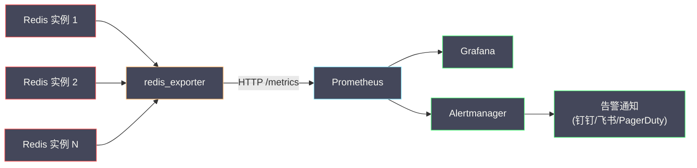

# 10 Redis 生产运维——监控 告警与故障排查

**摘要：**

Redis 在生产环境中的稳定性直接决定了业务系统的可用性——一个缓存层的抖动可能导致数据库被打垮，一个慢查询可能阻塞整个实例数秒，一次未预料到的内存溢出可能触发大规模的 key 淘汰。与开发阶段不同，生产运维的核心不是"如何使用 Redis"，而是"如何确保 Redis 始终健康运行"以及"出了问题如何快速定位和恢复"。本文从 Redis 的核心监控指标出发，系统介绍 INFO 命令的关键 section 解读、Prometheus + Grafana 的监控体系搭建、告警阈值的设定原则，以及生产中最常见的故障场景（延迟毛刺、内存暴涨、连接数打满、主从断开、Cluster 分片异常）的 SOP 排查流程。

---

## 第 1 章 INFO 命令——Redis 的健康体检报告

### 1.1 INFO 命令概览

`INFO` 是 Redis 运维最重要的命令——它返回 Redis 实例的完整运行时状态，涵盖服务器信息、客户端连接、内存使用、持久化状态、复制状态、CPU 使用、集群状态、慢查询等多个维度。

```bash
INFO                          # 返回所有 section
INFO server                   # 只返回 server section
INFO memory                   # 只返回 memory section
INFO clients replication      # 返回多个 section
```

### 1.2 Server Section——基础信息

```
redis_version:7.2.4           # Redis 版本
redis_mode:standalone         # 运行模式（standalone/sentinel/cluster）
uptime_in_seconds:8640000     # 运行时间（秒）
uptime_in_days:100            # 运行时间（天）
hz:10                         # 后台任务频率（默认 10，即每秒执行 10 次过期检查等）
config_file:/etc/redis.conf   # 配置文件路径
```

**关注点**：`uptime_in_days` 突然归零说明 Redis 被重启过——结合日志排查重启原因。

### 1.3 Clients Section——连接状态

```
connected_clients:1024        # 当前连接的客户端数
blocked_clients:3             # 被 BRPOP/BLPOP 等命令阻塞的客户端数
tracking_clients:0            # 开启 Client-Side Caching 追踪的客户端数
maxclients:10000              # 最大客户端连接数
```

**核心指标**：
- **connected_clients**：当前活跃连接数。如果接近 `maxclients`，新连接会被拒绝——需要排查是否有连接泄漏（客户端用完连接没有归还连接池）或连接池配置过大
- **blocked_clients**：正在阻塞等待的客户端。少量是正常的（如 BRPOP 消费者），大量可能说明队列消费不及时

> [!warning] 连接泄漏排查
> 如果 `connected_clients` 持续增长且不回落，使用 `CLIENT LIST` 查看所有连接的详细信息——特别关注 `idle` 字段（空闲时间）和 `cmd` 字段（最后执行的命令）。大量长时间空闲的连接可能是连接泄漏。`CLIENT NO-EVICT ON` 可以保护重要连接不被淘汰。

### 1.4 Memory Section——内存状态

这是运维中最重要的 section——Redis 是内存数据库，内存是最稀缺的资源。

```
used_memory:2147483648        # Redis 数据占用的内存（字节）= 2GB
used_memory_human:2.00G       # 人类可读格式
used_memory_rss:3221225472    # 操作系统分配的物理内存（含碎片）= 3GB
used_memory_peak:2684354560   # 历史内存峰值 = 2.5GB
used_memory_peak_human:2.50G
maxmemory:4294967296          # maxmemory 配置 = 4GB
maxmemory_human:4.00G
maxmemory_policy:allkeys-lru  # 淘汰策略
mem_fragmentation_ratio:1.50  # 碎片率 = RSS / used = 3GB / 2GB = 1.5
mem_allocator:jemalloc-5.3.0  # 内存分配器
```

**核心指标及告警阈值**：

| 指标 | 含义 | 告警阈值 |
| :--- | :--- | :--- |
| **used_memory / maxmemory** | 内存使用率 | > 80% 警告，> 90% 严重 |
| **mem_fragmentation_ratio** | 碎片率 | > 1.5 关注，> 2.0 告警，< 1.0 严重（swap） |
| **used_memory_peak** | 历史峰值 | 接近 maxmemory 时需要扩容规划 |
| **evicted_keys**（在 Stats Section）| 被淘汰的 key 数 | > 0 告警——说明内存不足已触发淘汰 |

> [!warning] mem_fragmentation_ratio < 1.0 的严重性
> 碎片率小于 1 意味着 `used_memory > used_memory_rss`——Redis 使用的逻辑内存超过了物理内存，操作系统将部分内存页交换到了 [[磁盘 Swap]]。Redis 是内存数据库，任何 swap 都会导致延迟从微秒级暴涨到毫秒甚至秒级——这是**最严重的性能事故之一**。需要立即增加物理内存或减少数据量。

### 1.5 Stats Section——命令统计

```
total_connections_received:1000000   # 历史总连接数（含已断开的）
total_commands_processed:500000000   # 历史总命令处理数
instantaneous_ops_per_sec:45000      # 当前 QPS
keyspace_hits:400000000              # 缓存命中次数
keyspace_misses:50000000             # 缓存未命中次数
evicted_keys:0                       # 被淘汰的 key 总数
expired_keys:10000000                # 过期删除的 key 总数
```

**核心指标**：
- **instantaneous_ops_per_sec**：实时 QPS——监控 QPS 的变化趋势，突然飙升可能是[[05 热 Key 大 Key 治理与容量规划|热 Key]]或异常流量
- **keyspace_hits / (keyspace_hits + keyspace_misses)**：**缓存命中率**——这是衡量缓存效果的核心指标。命中率 < 90% 需要排查：key 的 TTL 是否太短？是否存在[[04 缓存设计模式与一致性问题|缓存穿透]]？
- **evicted_keys**：被淘汰的 key 数——如果这个值 > 0 且持续增长，说明内存不足，Redis 正在主动驱逐 key 来腾出空间。需要扩容或优化数据

### 1.6 Persistence Section——持久化状态

```
rdb_last_save_time:1709424000        # 上次 RDB 保存的 Unix 时间戳
rdb_changes_since_last_save:5000     # 自上次 RDB 以来的数据变更次数
rdb_last_bgsave_status:ok            # 上次 BGSAVE 的结果
rdb_last_bgsave_time_sec:2           # 上次 BGSAVE 耗时（秒）
aof_enabled:1                        # AOF 是否开启
aof_last_rewrite_time_sec:5          # 上次 AOF 重写耗时
aof_last_bgrewrite_status:ok         # 上次 AOF 重写结果
aof_buffer_length:0                  # AOF 缓冲区大小
```

**关注点**：
- `rdb_last_bgsave_status` / `aof_last_bgrewrite_status` 不是 `ok`——说明持久化失败，需要检查磁盘空间和 fork 是否成功
- `rdb_last_bgsave_time_sec` 过长——说明数据量大或磁盘慢，fork + 写盘耗时过长
- `rdb_changes_since_last_save` 持续增长——说明 BGSAVE 频率不够或一直失败

### 1.7 Replication Section——复制状态

```
role:master                          # 角色（master/slave）
connected_slaves:2                   # 连接的从节点数
slave0:ip=10.0.1.2,port=6379,state=online,offset=1000000,lag=0
slave1:ip=10.0.1.3,port=6379,state=online,offset=999990,lag=1
master_repl_offset:1000000           # 主节点的复制偏移量
repl_backlog_active:1                # 复制积压缓冲区是否启用
repl_backlog_size:67108864           # 复制积压缓冲区大小（64MB）
```

**核心指标**：
- **lag**：从节点的复制延迟（秒）——lag > 10 秒需要告警
- **master_repl_offset - slave_offset**：复制偏移量差——差值越大说明从节点落后越多
- **connected_slaves**：连接的从节点数——如果突然减少说明从节点断开

---

## 第 2 章 Prometheus + Grafana 监控体系

### 2.1 监控架构



**redis_exporter**（oliver006/redis_exporter）是最常用的 Redis Prometheus Exporter——它连接 Redis 实例，定期执行 INFO 命令并将指标转换为 Prometheus 格式暴露在 HTTP 端点上。

### 2.2 核心告警规则

```yaml
groups:
  - name: redis_alerts
    rules:
      # 内存使用率 > 80%
      - alert: RedisMemoryUsageHigh
        expr: redis_memory_used_bytes / redis_memory_max_bytes > 0.8
        for: 5m
        labels:
          severity: warning
        annotations:
          summary: "Redis 内存使用率超过 80%"

      # 内存使用率 > 90%
      - alert: RedisMemoryUsageCritical
        expr: redis_memory_used_bytes / redis_memory_max_bytes > 0.9
        for: 2m
        labels:
          severity: critical

      # 存在 key 淘汰
      - alert: RedisEvictedKeys
        expr: increase(redis_evicted_keys_total[5m]) > 0
        labels:
          severity: warning
        annotations:
          summary: "Redis 出现 key 淘汰"

      # 缓存命中率低于 90%
      - alert: RedisCacheHitRateLow
        expr: redis_keyspace_hits_total / (redis_keyspace_hits_total + redis_keyspace_misses_total) < 0.9
        for: 10m
        labels:
          severity: warning

      # 连接数接近上限
      - alert: RedisConnectionsHigh
        expr: redis_connected_clients / redis_config_maxclients > 0.8
        for: 5m
        labels:
          severity: warning

      # 主从复制延迟 > 10 秒
      - alert: RedisReplicationLagHigh
        expr: redis_connected_slave_lag_seconds > 10
        for: 2m
        labels:
          severity: critical

      # 碎片率异常
      - alert: RedisFragmentationHigh
        expr: redis_mem_fragmentation_ratio > 2.0
        for: 10m
        labels:
          severity: warning

      # Redis 实例宕机
      - alert: RedisDown
        expr: redis_up == 0
        for: 1m
        labels:
          severity: critical
```

### 2.3 Grafana Dashboard

推荐使用 Grafana 社区维护的 Redis Dashboard（ID: 763 或 11835）——开箱即用，包含以下面板：

- **总览**：QPS、连接数、内存使用、命中率、key 数量
- **内存**：used_memory 趋势、碎片率、淘汰 key 速率、各 DB 的 key 数
- **客户端**：连接数趋势、阻塞客户端数、输入/输出缓冲区
- **持久化**：RDB/AOF 状态、最近保存时间、fork 耗时
- **复制**：主从偏移量差、从节点 lag、复制积压缓冲区使用率
- **命令统计**：各命令的 QPS 分布、延迟百分位

---

## 第 3 章 常见故障排查 SOP

### 3.1 故障一：延迟毛刺

**现象**：Redis 响应时间偶发性飙升到几十甚至几百毫秒。

**排查流程**：

1. **检查慢查询日志**：`SLOWLOG GET 20`——是否有大 Key 操作（HGETALL 大 Hash、DEL 大 ZSet）或 KEYS 命令
2. **检查 LATENCY**：`LATENCY LATEST`——查看各类延迟事件的峰值
3. **检查 AOF 配置**：`CONFIG GET appendfsync`——如果是 `always` 模式，每条命令都等 fsync，磁盘 IO 慢时延迟飙升
4. **检查 fork 操作**：`INFO persistence` 的 `latest_fork_usec`——BGSAVE/BGREWRITEAOF 的 fork 会导致主线程短暂阻塞
5. **检查 Swap**：`INFO memory` 的 `mem_fragmentation_ratio`——如果 < 1.0 说明有 Swap
6. **检查内核参数**：`/proc/sys/vm/overcommit_memory` 应设为 1，`transparent_hugepage` 应设为 `never`

**常见原因及解决**：

| 原因 | 解决方案 |
| :--- | :--- |
| 大 Key 操作 | 拆分大 Key、使用 UNLINK 替代 DEL |
| KEYS 命令 | 禁用 KEYS，改用 SCAN |
| AOF always | 改为 `appendfsync everysec` |
| fork 耗时长 | 减小实例数据量（< 10GB）、使用更大内存的机器 |
| Swap | 增加物理内存、降低 maxmemory |
| 透明大页 | `echo never > /sys/kernel/mm/transparent_hugepage/enabled` |

### 3.2 故障二：内存暴涨

**现象**：`used_memory` 短时间内快速增长，触发淘汰或 OOM。

**排查流程**：

1. **检查 key 数量变化**：`INFO keyspace`——哪个 DB 的 key 数量在增长
2. **检查是否有大 Key 写入**：`redis-cli --bigkeys` 或 RDB 离线分析
3. **检查客户端缓冲区**：`INFO clients` 的 `client_recent_max_output_buffer` 和 `client_recent_max_input_buffer`——Pub/Sub 订阅者消费不及时可能导致输出缓冲区膨胀
4. **检查复制缓冲区**：`INFO replication` 的 `repl_backlog_size`——从节点断开后重连可能触发全量同步
5. **检查 Lua 脚本内存**：`MEMORY STATS` 的 `lua.caches`——大量 Lua 脚本缓存也会占内存

**紧急处理**：
- 如果有明确的无用 key 可以批量删除：用 SCAN + UNLINK 渐进删除
- 临时增大 maxmemory 防止 OOM（如果物理内存允许）
- 开启淘汰策略作为兜底

### 3.3 故障三：连接数打满

**现象**：新的客户端连接被拒绝，报错 `max number of clients reached`。

**排查流程**：

1. **查看当前连接**：`CLIENT LIST`——统计各 IP 的连接数
2. **查看连接池配置**：检查所有应用的连接池 maxTotal 之和是否超过 Redis 的 maxclients
3. **检查连接泄漏**：`CLIENT LIST` 中是否有大量 `idle` 很大的连接——说明连接用完没有归还
4. **检查 Pub/Sub 连接**：Pub/Sub 的订阅连接不能复用——每个订阅需要一个独立连接

**解决方案**：
- 调整应用连接池配置——减小 maxTotal 或增大 Redis 的 maxclients
- 修复连接泄漏——确保 finally 中归还连接
- 设置 `timeout` 配置（如 300 秒）——自动关闭长时间空闲的连接
- 使用 Lettuce 替代 Jedis——Lettuce 单连接复用，大幅减少连接数

### 3.4 故障四：主从复制断开

**现象**：从节点频繁断开重连，触发全量同步（Full Resync）。

**排查流程**：

1. **检查从节点日志**：是否有 `MASTER timeout` 或 `Connection reset` 错误
2. **检查网络**：主从之间的网络延迟和丢包率
3. **检查复制积压缓冲区**：`INFO replication` 的 `repl_backlog_size`——如果缓冲区太小，从节点短暂断开后偏移量已不在缓冲区范围内，只能全量同步
4. **检查主节点 QPS**：写入量过大可能导致从节点跟不上
5. **检查从节点的输出缓冲区**：`client-output-buffer-limit slave` 配置——如果全量同步的 RDB 传输太慢，缓冲区超限导致从节点被断开

**解决方案**：
- 增大 `repl-backlog-size`（建议至少 256MB）——容纳更长时间的增量数据
- 增大 `client-output-buffer-limit slave`——防止全量同步时缓冲区溢出
- 确保主从之间的网络质量——同机房部署，避免跨机房复制
- 控制单实例数据量——过大的实例全量同步耗时更长

### 3.5 故障五：Redis Cluster 分片异常

**现象**：部分 key 的操作返回 `CLUSTERDOWN` 或 `MOVED` 重定向异常。

**排查流程**：

1. **检查集群状态**：`CLUSTER INFO`——`cluster_state` 是否为 `ok`，`cluster_slots_ok` 是否等于 16384
2. **检查节点状态**：`CLUSTER NODES`——是否有节点标记为 `fail` 或 `pfail`
3. **检查 slot 覆盖**：`CLUSTER SLOTS`——是否有 slot 范围没有被分配（slot 覆盖不完整会导致 CLUSTERDOWN）
4. **检查 Gossip 通信**：节点之间的 Gossip 端口（默认 16379）是否畅通

**解决方案**：
- 节点故障：如果有从节点，等待自动 failover；否则手动 `CLUSTER FAILOVER` 或替换节点
- Slot 未覆盖：`CLUSTER ADDSLOTS` 手动分配缺失的 slot，或 `redis-cli --cluster fix` 自动修复
- 节点间网络问题：检查防火墙规则——确保 Gossip 端口（Redis 端口 + 10000）开放

---

## 第 4 章 生产配置最佳实践

### 4.1 关键配置清单

| 配置项 | 建议值 | 说明 |
| :--- | :--- | :--- |
| **maxmemory** | 物理内存的 70% | 预留 30% 给 fork COW、缓冲区、碎片 |
| **maxmemory-policy** | allkeys-lru | 通用缓存场景；有过期时间的用 volatile-lru |
| **appendfsync** | everysec | 性能和安全的平衡——最多丢失 1 秒数据 |
| **maxclients** | 10000 | 根据应用实例数和连接池配置调整 |
| **timeout** | 300 | 自动关闭 300 秒空闲连接 |
| **tcp-keepalive** | 60 | TCP 保活检测间隔 |
| **hz** | 10 | 后台任务频率——增大可加快过期 key 清理 |
| **lazyfree-lazy-expire** | yes | 过期 key 异步释放 |
| **lazyfree-lazy-server-del** | yes | 隐式删除（如 RENAME 覆盖）异步释放 |
| **lazyfree-lazy-user-del** | yes | DEL 命令异步释放（等同于 UNLINK）|
| **repl-backlog-size** | 256mb | 复制积压缓冲区——防止短暂断开触发全量同步 |
| **slowlog-log-slower-than** | 5000 | 慢查询阈值 5ms |
| **slowlog-max-len** | 1000 | 慢查询日志最大条数 |
| **latency-monitor-threshold** | 5 | 延迟监控阈值 5ms |

### 4.2 内核参数优化

```bash
# 允许内存超量分配（防止 fork 时 OOM）
echo 1 > /proc/sys/vm/overcommit_memory

# 关闭透明大页（避免 fork COW 时的延迟毛刺）
echo never > /sys/kernel/mm/transparent_hugepage/enabled

# 提高 TCP 连接队列
echo 511 > /proc/sys/net/core/somaxconn

# 提高文件描述符限制
ulimit -n 65536
```

### 4.3 安全配置

```bash
# 绑定内网 IP（禁止公网访问）
bind 10.0.1.1

# 启用密码认证
requirepass <strong-password>

# 禁用危险命令
rename-command KEYS ""
rename-command FLUSHALL ""
rename-command FLUSHDB ""
rename-command CONFIG "CONFIG_8f3a2b"     # 重命名而非禁用——运维需要

# 启用 ACL（Redis 6.0+）
user admin on >admin-password ~* +@all
user app on >app-password ~app:* +get +set +del -@admin
```

---

## 第 5 章 备份与恢复

### 5.1 备份策略

| 策略 | 方式 | 优点 | 缺点 |
| :--- | :--- | :--- | :--- |
| **RDB 定时快照** | `save 900 1` 或 Cron BGSAVE | 恢复速度快（直接加载 RDB）| 丢失最后一次快照后的数据 |
| **AOF 持续写入** | `appendfsync everysec` | 最多丢 1 秒数据 | 文件大、恢复慢 |
| **混合持久化** | `aof-use-rdb-preamble yes` | 兼顾恢复速度和数据安全 | Redis 4.0+ |
| **RDB 异地备份** | Cron 脚本将 RDB 拷贝到远程存储 | 防止单机磁盘故障 | 需要额外存储 |

**推荐组合**：开启 AOF（everysec）+ 混合持久化 + 定期 RDB 异地备份。

### 5.2 恢复流程

```bash
# 从 RDB 恢复
1. 停止 Redis
2. 将 RDB 文件拷贝到 dir 目录（CONFIG GET dir），命名为 dbfilename（CONFIG GET dbfilename）
3. 启动 Redis

# 从 AOF 恢复
1. 停止 Redis
2. 将 AOF 文件拷贝到 dir 目录
3. 确保 redis.conf 中 appendonly=yes
4. 启动 Redis（自动加载 AOF）

# AOF 文件损坏时修复
redis-check-aof --fix appendonly.aof
```

---

## 第 6 章 总结

本文系统介绍了 Redis 生产运维的核心实践：

- **INFO 命令**：Redis 的健康体检报告——重点关注 Memory（内存使用率/碎片率/淘汰数）、Stats（QPS/命中率）、Clients（连接数）、Replication（复制延迟）、Persistence（持久化状态）
- **Prometheus + Grafana 监控**：redis_exporter 采集指标 → Prometheus 存储 → Grafana 可视化 → Alertmanager 告警通知；核心告警：内存 > 80%、碎片率 > 2.0、淘汰 key > 0、命中率 < 90%、复制延迟 > 10s
- **故障排查 SOP**：延迟毛刺（慢查询/fork/AOF/Swap）→ 内存暴涨（大 Key/缓冲区/Lua 缓存）→ 连接打满（泄漏/池配置）→ 主从断开（缓冲区/网络）→ Cluster 异常（slot 覆盖/节点故障）
- **生产配置**：maxmemory 70%、lazyfree 全开、repl-backlog 256MB、超时 300s、慢查询阈值 5ms
- **备份恢复**：AOF everysec + 混合持久化 + RDB 异地备份

Redis 进阶教程专栏至此完结。如果你对 Redis 的底层实现原理感兴趣——[[02 SDS 与 Redis 对象系统|SDS 字符串]]的内存布局、[[03 字典与渐进式 Rehash|字典]]的渐进式 Rehash、[[05 单线程模型与事件驱动架构|单线程事件循环]]的设计哲学——请继续阅读 [[00 专栏导览|Redis 设计与实现]] 专栏。

---

## 参考资料

1. Redis Documentation - INFO command：https://redis.io/commands/info/
2. Redis Documentation - Latency monitoring：https://redis.io/docs/management/optimization/latency/
3. redis_exporter（Prometheus Exporter）：https://github.com/oliver006/redis_exporter
4. Grafana Redis Dashboard：https://grafana.com/grafana/dashboards/763
5. Redis Documentation - Administration：https://redis.io/docs/management/
6. Redis Documentation - Security：https://redis.io/docs/management/security/

---

> [!note] 思考题
> 1. `info memory` 中 `used_memory` vs `used_memory_rss`——后者包含内存碎片和 OS 分配的额外内存。碎片率 `mem_fragmentation_ratio` >1.5 需要关注。`latest_fork_usec` 记录最近 fork 耗时——超过 500ms 在延迟敏感场景中需要告警。你如何构建 Prometheus + Grafana 的 Redis 监控面板？最应该设置告警的指标有哪些？
> 2. 在从节点执行 BGSAVE 避免影响主节点——但从节点可能承担读请求。fork 导致的 COW 内存增长和 CPU 开销是否影响从节点的读性能？在什么时间点执行 BGSAVE 最安全（如业务低峰期）？
> 3. 跨区域灾备——主在北京、灾备在上海。异步复制可能丢失数据。`min-replicas-to-write 1` + `min-replicas-max-lag 10` 保证至少一个从节点在 10 秒内有同步。如果北京→上海的网络延迟 20ms 但偶尔抖动到 5 秒——这个配置是否合理？网络分区时主节点拒绝写入是否可接受？
