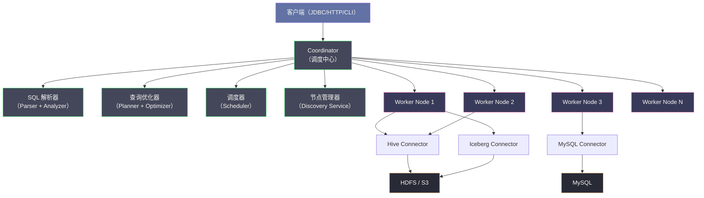
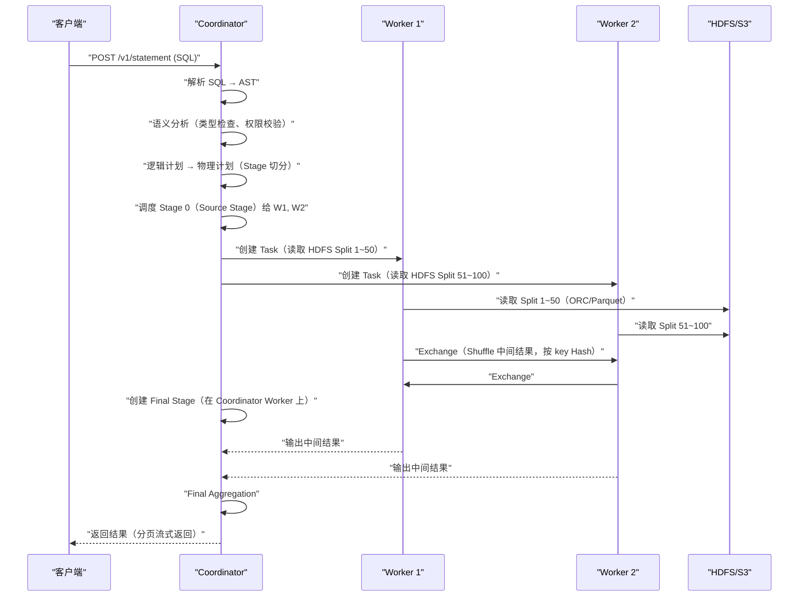

# Trino 全局架构——Coordinator Worker 与 MPP 执行

## 摘要

Trino（原名 Presto，2020 年更名）是 Facebook 于 2012 年内部研发、2013 年开源的**分布式 SQL 查询引擎**，专为大规模数据的交互式分析设计——秒级到分钟级响应，而非 MapReduce 式的批处理（小时级）。Trino 的核心设计哲学是**计算与存储彻底分离**：它本身不存储任何数据，而是通过**插件化的 Connector 体系**连接各种外部存储（Hive、Iceberg、MySQL、Kafka、Elasticsearch 等），实现真正的**联邦查询（Federation Query）**。本文从 Trino 产生的历史背景和业务驱动力出发，系统解析其 Coordinator-Worker 的主从架构、MPP（大规模并行处理）的执行模型、流水线化的算子执行框架，以及与 Apache Spark、Impala、ClickHouse 等同类系统的定位差异，帮助读者建立对 Trino 全局设计的清晰认知。

---

## 第 1 章 为什么需要 Trino——Hive 的局限与交互式分析的需求

### 1.1 Hive 的核心瓶颈

在 Trino 诞生之前，Hadoop 生态中的 **Hive** 是大数据分析的主流工具。Hive 将 SQL 翻译为 **MapReduce 任务**在 HDFS 上执行，解决了 TB/PB 级数据的批量分析问题，但其执行模型有一个根本性的延迟瓶颈：

**MapReduce 的物化（Materialization）机制**：MapReduce 的每个 Stage 必须等前一个 Stage 完全结束并将中间结果写入磁盘，才能启动下一个 Stage。一个有 5 个 Join 的复杂 SQL，可能被翻译为 10 个以上的 MapReduce Stage，每个 Stage 之间都有磁盘 IO 和任务调度开销，总延迟动辄十分钟以上。

对于 Facebook 的数据分析师来说，这意味着每次修改查询条件、调整 JOIN 关系，都需要等待 10~30 分钟才能看到结果——这完全无法支持交互式的数据探索（ad-hoc analysis）。2012 年，Facebook 工程师 Martin Traverso、Dain Sundstrom、David Phillips、Eric Hwang 等人开始研发 Presto（后来的 Trino），目标是在保持 Hive 的数据规模处理能力的同时，将交互式查询的延迟降低到秒级。

### 1.2 Trino 的设计目标与定位

Trino 的设计目标极为明确：
- **交互式分析（Interactive Analytics）**：P95 查询延迟 < 30 秒，支持数据分析师的实时探索
- **大规模数据**：单个查询能处理 TB 级数据，集群总数据量支持 PB 级
- **SQL 标准兼容**：支持标准 ANSI SQL（包括窗口函数、复杂 JOIN、子查询），降低学习成本
- **存储无关**：不绑定特定存储系统，通过 Connector 接入任意数据源

Trino **不适合**的场景：
- **OLTP 事务处理**：Trino 是无状态的查询引擎，没有事务管理
- **超长时间批处理**（小时级+）：内存中流水线执行对极长查询不友好，Spark 更适合
- **高 QPS 点查**（毫秒级延迟）：Trino 的 Coordinator 调度开销约 50~200ms，不适合高频小查询

### 1.3 Presto vs Trino——名称分裂的历史

2018 年，Facebook 决定将内部 Presto 开发与 PrestoSQL 开源社区分离管理，导致了命名混乱：Facebook 保留了 "Presto" 商标，原开源社区核心开发者于 2019 年 fork 出 **PrestoSQL**，并于 2020 年更名为 **Trino**，以避免商标纠纷。

目前存在两个相关项目：
- **Trino**：原 PrestoSQL，由原 Presto 核心开发团队维护，功能更活跃，是本专栏的讨论对象
- **PrestoDB**：Facebook 内部 Presto 的开源版本，由 Meta 及 Linux Foundation 下的 Presto Foundation 维护

两者源自同一代码库，API 基本兼容，但已逐渐分叉。**Trino 社区更活跃，商业支持（Starburst）更完善，是新项目的首选**。

---

## 第 2 章 Trino 的整体架构

### 2.1 架构概览

Trino 采用经典的**主从架构（Master-Worker）**：



**核心组件说明**：

- **Coordinator**：整个集群只有一个 Coordinator（可以配置高可用备节点），负责 SQL 解析、查询计划生成、任务调度与监控。Coordinator 本身不执行数据处理，只做调度和协调。
- **Worker Node**：执行实际数据处理的节点，数量从数台到数千台不等。Worker 通过 Connector 读取外部存储的数据，在内存中执行算子（过滤、聚合、Join 等），通过网络交换中间结果。
- **Connector**：插件化的存储适配器，每种存储系统（Hive、Iceberg、MySQL、Kafka 等）有对应的 Connector 实现，封装了元数据访问和数据读取的细节。

### 2.2 Coordinator 的职责

Coordinator 是 Trino 集群的"大脑"，其核心工作分为四个阶段，每条 SQL 查询都经历这四个阶段：

**阶段一：SQL 解析与语义分析**
- SQL 文本 → 抽象语法树（AST）
- 类型检查、名称解析（表名→ Catalog/Schema/Table、列名→类型）
- 权限校验

**阶段二：逻辑计划生成与优化**
- AST → 关系代数树（Logical Plan）
- 应用优化规则：谓词下推、Join 重排序、公共子表达式消除等
- 生成分布式物理执行计划（Physical Plan）：将逻辑计划切分为多个 Stage，确定 Stage 间的数据交换方式

**阶段三：任务调度**
- 将每个 Stage 的执行任务（Task）分发给合适的 Worker Node
- 监控任务执行状态，处理任务失败和重试

**阶段四：结果汇聚**
- 收集最终 Stage 的执行结果（Root Stage 总是在 Coordinator 或指定 Worker 上执行）
- 以流式方式返回查询结果给客户端

> [!warning] 生产避坑
> Coordinator 是单点，其故障会导致集群所有正在执行的查询失败（正在运行中的查询状态在内存中，Coordinator 重启后丢失）。生产环境必须为 Coordinator 配置**高可用（Active-Standby 模式）**，通过共享状态存储（如数据库或 ZooKeeper）实现快速故障切换。Trino 的 Coordinator HA 配置在 version 400+ 之后有官方支持。

### 2.3 Worker Node 的职责

Worker Node 是真正执行计算的节点，其核心功能：

**读取数据（Data Source Access）**：通过 Connector 的 API 从外部存储读取数据分片（Split）。例如，Hive Connector 会将一个 HDFS 文件按 128MB 分割为多个 Split，每个 Split 由一个 Worker 的 Task 读取。

**执行算子（Operator Execution）**：在内存中以**流水线（Pipeline）方式**执行算子链——Filter、Project、Aggregation、HashJoin、Sort 等算子按顺序串联，每个算子处理完一个数据页（Page，通常 1MB）后立即传给下一个算子，不等待整个数据集处理完毕。

**网络数据交换（Exchange）**：某些操作（如 Repartition Aggregation、Distributed Join 中的 Build 侧）需要将数据按特定 key 重新分发到不同 Worker（Shuffle）。Trino 使用**基于 HTTP 的 Exchange 服务**在 Worker 之间传输数据页，而不是通过共享文件系统。

---

## 第 3 章 MPP 执行模型——为什么 Trino 比 Hive 快

### 3.1 MPP 的本质：流水线 vs 物化

**MPP（Massively Parallel Processing，大规模并行处理）** 是 Trino 实现低延迟的根本机制，其核心与 Hive/MapReduce 的区别在于：**中间结果在内存中流式传递，而非落盘物化**。

以一个典型的 `SELECT a, sum(b) FROM t GROUP BY a` 查询为例：

**Hive/MapReduce 的执行方式**：
```
Step 1（Map 阶段）：
  从 HDFS 读取数据 → 按 a 做 Partial Aggregation → 写入本地磁盘（Spill）

Step 2（Shuffle 阶段）：
  从各 Mapper 的本地磁盘读取数据 → 通过网络按 a 的 Hash 分发到 Reducer → 写入各 Reducer 的本地磁盘

Step 3（Reduce 阶段）：
  各 Reducer 从本地磁盘读取数据 → 做 Final Aggregation → 写入 HDFS

总磁盘 IO：读源数据 + 写 Mapper 本地磁盘 + 读 Mapper 磁盘 + 写 Reducer 磁盘 + 写 HDFS
          ≈ 源数据大小 × 4~6 倍
```

**Trino 的 MPP 执行方式**：
```
所有 Worker 同时启动，各自读取 HDFS Split → 在内存中做 Partial Aggregation →
通过 HTTP 将中间结果按 a 的 Hash 直接流式传输到目标 Worker →
目标 Worker 接收到数据后立即做 Final Aggregation →
最终结果直接从内存返回给 Coordinator

总磁盘 IO：仅读源数据（约 1 倍，偶尔有 Spill 到磁盘）
```

Trino 的磁盘 IO 是 Hive 的 1/4~1/6，加上所有 Stage 并发执行（不需要等前一 Stage 写完才启动下一 Stage），总延迟大幅降低。

### 3.2 数据流动模型：Page 与 Block

Trino 的所有数据处理以 **Page** 为单位（类似 [[Apache Arrow]] 的批量列存格式）：

- **Page**：一批行数据，默认大小约 1MB（最多约 1 万行）
- **Block**：Page 中一列的数据，列存格式（所有行的同一列数据连续存储）

列存格式的优势：
1. **SIMD 向量化执行**：对一列数据做连续操作（如加法、比较），CPU 的 SIMD 指令可以同时处理 4~16 个值，吞吐量提升数倍
2. **压缩友好**：同类型数据连续存储，压缩率远高于行存
3. **投影消除**：只读取查询需要的列，不读取无关列，减少 IO

**Page 的流动路径**：

```
HDFS Split → PageSource（列存读取器，如 ORC/Parquet Reader）
  → 一个 Page（1MB）
  → FilterOperator（谓词下推的列过滤）
  → ProjectOperator（列投影和表达式计算）
  → PartialAggregationOperator（本地聚合）
  → LocalExchangeOperator（本地 Partition 重分布）
  → ExchangeClient（HTTP 传输到目标 Worker）
  → ExchangeOperator（目标 Worker 接收）
  → FinalAggregationOperator（全局聚合）
  → 结果 Page 返回
```

每个 Page 在算子链中**流水线式传递**：FilterOperator 产出一个 Page 后，不等待所有数据处理完，立即将该 Page 传给 ProjectOperator，ProjectOperator 处理完立即传给下一个，多个算子并发执行。这是 Trino 实现低延迟的关键机制——**数据在系统中的停留时间（Latency）与处理总时间（Throughput）被解耦**。

### 3.3 Push vs Pull——算子间的数据传递协议

Trino 的算子链采用 **Pull 模型**（与某些流处理系统的 Push 模型相对）：下游算子主动从上游算子拉取数据页。

```
调用链示意：

ResultDriver.process():
  → FinalAggregationOperator.getOutput()
      → ExchangeOperator.getOutput()
          → ExchangeClient.pollPage()    ← 从 HTTP 接收队列取 Page
```

Pull 模型的优势是**背压（Backpressure）天然内置**：若下游算子处理不过来（如内存不足），只需不调用 `getOutput()`，上游自然停止生产，不需要额外的背压机制。这防止了慢算子导致内存无限积压。

当某个算子的输入队列已满（上游 Page 来得太快），`addInput()` 方法会阻塞，上游算子无法继续产出，自然减速。这整个 Pull + 阻塞机制构成了 Trino 的流控基础。

---

## 第 4 章 查询生命周期——从 SQL 到结果

### 4.1 完整的查询生命周期

一条 SQL 在 Trino 中的完整生命周期：



**客户端与 Coordinator 的交互协议**：Trino 使用 HTTP REST API（非长连接，而是客户端轮询）：
1. 客户端 POST SQL 到 `/v1/statement`，获取查询 ID 和 `nextUri`
2. 客户端 GET `nextUri`，获取部分结果（若查询未完成，再次返回新的 `nextUri`）
3. 客户端循环 GET，直到结果全部返回或查询失败

这种轮询设计使得客户端崩溃不影响查询执行（服务端查询仍在运行），且支持超大结果集的流式返回（不需要把所有结果缓存在 Coordinator 内存中）。

### 4.2 Stage 的类型与数据交换

物理执行计划被切分为多个 **Stage**，每个 Stage 代表一个可以并行执行的计算单元。Stage 之间的数据交换方式决定了数据如何在 Worker 间流动：

| Stage 类型 | 触发时机 | 数据交换方式 |
|-----------|---------|------------|
| **Single Stage** | 最终聚合、全局 ORDER BY | 所有 Worker 的数据汇聚到一个 Worker |
| **Fixed Stage** | Hash Aggregation、Hash Join Build 侧 | 按 key 的 Hash 分发到固定数量的 Worker |
| **Source Stage** | 读取数据源（HDFS Split） | 无上游 Stage，直接从存储读取 |
| **Scaled Stage** | 数据量较小，不需要固定分区数 | 动态决定 Worker 数量 |

一个典型的带 JOIN 的 SQL 的 Stage 划分：

```sql
SELECT c.name, sum(o.amount)
FROM customers c
JOIN orders o ON c.id = o.customer_id
WHERE o.date > '2024-01-01'
GROUP BY c.name
```

```
Stage 3（Single）：Final Aggregation → 返回结果
    ↑ (Single Exchange)
Stage 2（Fixed）：Repartition Aggregation（按 name 分组）
    ↑ (Hash Exchange, key=name)
Stage 1（Fixed）：Hash Join（Probe 侧，以 o.customer_id 分区）
    ↑ (Hash Exchange, key=customer_id)        ↑ (Broadcast/Hash Exchange)
Stage 0a（Source）：                      Stage 0b（Source）：
扫描 orders，过滤 date > '2024-01-01'    扫描 customers，构建 Hash Table
```

---

## 第 5 章 节点发现与集群管理

### 5.1 Discovery Service——Worker 注册机制

Trino 的 Worker 节点通过内置的 **Discovery Service** 向 Coordinator 注册自己的存在：

- Worker 启动时，向 Coordinator 上的 Discovery Service 发送 HTTP POST 注册请求，包含自己的 IP 和端口
- Worker 定期（默认每 5 秒）发送心跳（HTTP PUT），Coordinator 维护一个活跃 Worker 列表
- 若某个 Worker 超过 `node-manager.expire-interval`（默认 30 秒）未发送心跳，Coordinator 将其标记为不活跃，停止向其分发新 Task

Worker 注册时还上报自己的属性（通过 `etc/node.properties`），Coordinator 可以基于这些属性实现**机架感知调度**（优先将读取同一 HDFS 文件的 Task 分配给与 DataNode 同机架的 Worker，减少跨机架网络流量）。

### 5.2 负载感知调度

Coordinator 的调度器在为 Task 选择 Worker 时，会考虑当前 Worker 的负载：

- **Task 排队长度**：每个 Worker 维护一个 Task 队列，Coordinator 优先将新 Task 分配给队列最短的 Worker
- **内存压力**：若某个 Worker 的内存使用率过高（接近 `query.max-memory-per-node` 阈值），Coordinator 暂停向其分发新 Task

这种**动态负载均衡**避免了某些 Worker 过载而其他 Worker 空闲的情况，是 Trino 在 skew（数据倾斜）场景下保持稳定性的基础之一。

---

## 第 6 章 Trino 与同类系统的对比

### 6.1 Trino vs Apache Spark

| 维度 | Trino | Apache Spark |
|------|-------|-------------|
| **设计定位** | 交互式 OLAP 查询（秒~分钟） | 批量数据处理（分钟~小时） |
| **执行模型** | MPP，流水线内存执行，不落盘 | DAG 执行，Stage 间可落盘（Spark SQL 也支持流水线） |
| **延迟** | 低（秒级启动） | 中（分钟级启动，含 JVM 和 Driver 初始化） |
| **吞吐量** | 中（受内存限制） | 高（可 Spill 到磁盘，处理超内存数据集） |
| **容错** | 有限（Stage 失败重试，但无检查点） | 完善（RDD Lineage，可重算任意 Stage） |
| **生态** | SQL 中心，BI 工具友好 | 宽（SQL/ML/Streaming/Python/R） |
| **适用场景** | BI 报表、ad-hoc 分析、数据探索 | ETL、机器学习、大规模数据变换 |

**选型建议**：若查询以 SQL 为主、对响应时间敏感（< 5 分钟）、用户为分析师→ 选 Trino；若需要 Python/Scala 编程、有 ML 需求、或单个任务数据量超过可用内存→ 选 Spark。

### 6.2 Trino vs ClickHouse

| 维度 | Trino | ClickHouse |
|------|-------|-----------|
| **架构** | 无共享存储，连接外部系统 | 内置存储（MergeTree 引擎），数据必须导入 |
| **查询性能** | 中（受网络和外部存储 IO 限制） | 极高（本地 SSD，列存，SIMD 优化） |
| **数据新鲜度** | 实时（直接查询源系统） | 依赖写入管道的延迟（通常分钟级） |
| **联邦查询** | 核心能力（可跨多个数据源 JOIN） | 弱（主要查询自身存储，外部表有限） |
| **适用场景** | 跨系统联邦分析、湖仓数据探索 | 单系统超高并发实时查询（如日志分析、监控） |

**选型建议**：若需要跨多个系统（Hive + MySQL + Kafka）做 JOIN 分析→ Trino；若场景是高并发查询单一大宽表（如用户行为日志，QPS > 100）→ ClickHouse。

### 6.3 Trino vs Impala

Impala 是 Cloudera 开发的类似系统，两者在设计上非常接近（都是 MPP、无共享存储、低延迟 SQL）。主要区别：

- **Impala** 更紧密地集成 Hadoop 生态（HDFS + Hive Metastore），在 Cloudera CDP 中表现更好
- **Trino** Connector 生态更丰富，联邦查询能力更强，社区更活跃
- 在性能上两者接近，Trino 的 CBO（基于代价的优化器）在复杂查询上更优

---

## 第 7 章 Trino 的发展与版本现状

### 7.1 关键版本特性

| 版本区间 | 关键特性 |
|---------|---------|
| Presto 0.1~0.100（2013~2015） | 基础 MPP 执行，Hive/MySQL Connector |
| Presto 0.200+（2018~2019） | 基于代价的优化器（CBO），动态过滤（Dynamic Filtering） |
| Trino 350（2021） | 更名为 Trino，Fault-tolerant execution（容错执行）初步支持 |
| Trino 400+（2022） | Fault-tolerant execution 正式稳定，支持大规模批量查询 |
| Trino 420+（2023） | Project Tardigrade（原生文件格式 ORC/Parquet 写入），Native Worker（C++ 向量化引擎） |
| Trino 440+（2024） | Native Worker 进入生产可用阶段，性能提升 2~5 倍 |

### 7.2 Native Worker——C++ 向量化引擎

Trino 社区（以及 Meta 的 Velox 项目）正在将 Worker 的核心算子（Filter、Aggregation、Join、Sort）用 C++ 重写，替代原有的 Java 实现，称为 **Native Worker**（或 Trino on Velox）。

**为什么 C++ 比 Java 快？**
- Java 的 JIT 编译虽然能优化热点代码，但内存布局受 GC 影响（对象头、引用寻址开销），对缓存不友好
- C++ 直接操作内存，可以使用 SIMD（如 AVX-512）指令对列存 Block 做向量化计算，批量处理性能远超 Java
- 无 GC Pause 问题（Java 的 GC 可能导致查询延迟 P99 偶发性飙升）

**[[Velox]]** 是 Meta 开源的 C++ 向量化执行引擎，被 Trino Native Worker、Spark Gluten、Presto Native Worker 等多个项目复用。Velox 统一了这些系统的底层算子实现，形成了向量化执行引擎的事实标准。

---

## 第 8 章 小结

### 8.1 架构设计的核心价值

Trino 的架构设计体现了以下核心价值取向：

- **内存流水线替代磁盘物化**：这是 Trino 比 Hive 快 10~100 倍的根本原因，代价是内存消耗更大，超内存时需要 Spill
- **存储计算分离与 Connector 体系**：使 Trino 成为真正意义上的"联邦查询引擎"，而非绑定特定存储的计算引擎
- **主从架构的简洁性**：Coordinator 只做调度不做计算，Worker 只做计算不做调度，职责清晰，且 Worker 完全无状态（故障后直接替换）

### 8.2 后续章节导引

- **[[02 查询执行引擎——Stage、Task 与 Pipeline]]**：深入查询的执行计划切分机制，解析 Stage/Task/Split/Pipeline/Driver/Operator 六层执行层次，理解流水线算子是如何在代码层面实现的
- **[[03 Connector 体系——Hive、Iceberg 与联邦查询]]**：解析 Connector SPI 的设计，深入 Hive Connector 的元数据访问和数据分片机制，以及 Iceberg Connector 对表格式（Table Format）的支持
