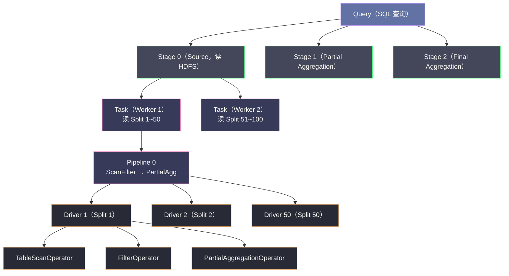
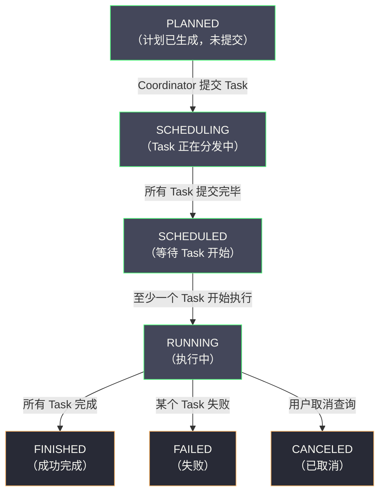

# 查询执行引擎——Stage、Task 与 Pipeline

## 摘要

Trino 的查询执行引擎是其低延迟特性的核心实现，其架构从宏观到微观形成了严格的六层执行层次：**Query → Stage → Task → Split → Pipeline → Driver → Operator**。每一层都对应着特定的调度粒度和执行语义。理解这六层结构，是解析"为什么 Trino 比 Hive 快"、"数据倾斜为什么会导致慢查询"、"内存如何在 Operator 层面被管理"等核心问题的前提。本文深度解析每一层的设计动机与实现细节：Stage 如何被切分与调度，Task 如何在 Worker 上并发执行，Pipeline 的流水线化执行如何消除阶段间等待，Operator 的 Pull 驱动模型如何实现背压，以及 LocalExchange 如何在 Worker 内部实现高效的数据重分布，避免不必要的网络传输。

---

## 第 1 章 执行层次总览——六层结构的设计逻辑

### 1.1 为什么需要六层抽象

在 [[01 Trino 全局架构——Coordinator Worker 与 MPP 执行]] 中提到，Trino 的查询执行分为 Coordinator 调度和 Worker 执行两大块。然而仅仅说"Worker 执行计算"过于粗粒度——一个复杂的 SQL 可能有数百 GB 数据、上百个 Worker、数千个并发执行的计算单元，如何组织这些计算单元、如何在它们之间传递数据、如何调度和监控每一个计算单元，需要一套清晰的层次抽象。

Trino 的六层执行层次，从高到低分别是：

```
Query（一条 SQL 查询）
  └── Stage（查询计划的一个并行阶段，对应一组 Task）
        └── Task（某个 Stage 在某个 Worker 上的执行单元）
              └── Split（数据分片，如一个 HDFS 文件块）
                    └── Pipeline（Task 内部的算子链，一条数据流水线）
                          └── Driver（Pipeline 的一个并发执行实例，通常对应一个 Split）
                                └── Operator（单个算子，如 Filter/Join/Aggregation）
```

每一层的设计动机：
- **Query → Stage**：一个复杂查询需要多轮数据交换（Shuffle），Stage 是两次 Shuffle 之间的计算单元，Stage 之间可以流水线并发执行
- **Stage → Task**：同一个 Stage 在不同 Worker 上并行执行，每个 Worker 上的执行单元是一个 Task
- **Task → Split**：数据源被分割为 Split，Task 读取多个 Split，每个 Split 的处理是独立的
- **Split → Pipeline**：Task 内部可能有多条数据流（如 HashJoin 有 Probe 流和 Build 流），每条流是一个 Pipeline
- **Pipeline → Driver**：Pipeline 的多个 Split 并发处理，每个 Split 对应一个 Driver 实例
- **Driver → Operator**：一个 Driver 执行一系列串联的 Operator，数据在 Operator 间流式传递

### 1.2 六层结构的全局视图



---

## 第 2 章 Stage——查询计划的切分单元

### 2.1 什么是 Stage，为什么要切分

**Stage** 是查询物理执行计划中的一个并行执行段，对应从数据源（或上游 Stage 的输出）到数据交换（Exchange）之间的一段计算。Stage 是调度的最高粒度——Coordinator 以 Stage 为单位决定执行顺序和 Worker 分配。

切分 Stage 的触发条件是**数据需要 Shuffle（重新分区）**——当一个算子需要对所有节点的数据做全局操作（如按某个 key 分组的 Hash Aggregation，需要将相同 key 的数据汇聚到同一个 Worker），就必须在此处插入一个 Exchange 算子，将当前 Stage 的输出按 key 分发到下一个 Stage 的各个 Worker。Exchange 的边界即 Stage 的边界。

**Stage 切分的具体规则**（Trino 的 PlanFragmenter 负责切分）：

1. **Remote Exchange（跨节点数据交换）** → 必须切分 Stage（上下游在不同 Worker 上执行）
2. **Local Exchange（同 Worker 内数据重分布）** → 不切分 Stage（同一个 Task 内完成）
3. **Limit + Sort** → 可能触发 Single Distribution Stage（聚合到一个 Worker 做全局排序）

### 2.2 Stage 的执行状态机



**Stage 之间的依赖与并发**：Trino 不是等所有 Stage 依次顺序执行，而是尽可能**并发执行多个 Stage**——下游 Stage 可以在上游 Stage 完成约 1% 的数据后就开始启动（流水线式），不需要等上游 Stage 全部完成。这大幅减少了端到端延迟（即使总数据量很大，部分结果能提前返回）。

### 2.3 Stage 的数据分布类型

Coordinator 在切分 Stage 时，会为每个 Stage 分配一种**数据分布类型（Distribution Type）**，决定 Stage 的 Task 数量和数据路由方式：

| 分布类型 | Task 数量 | 数据路由方式 | 典型触发场景 |
|---------|---------|------------|------------|
| **SINGLE** | 1 个 | 所有上游数据发到同一个 Worker | ORDER BY（全局排序）、LIMIT |
| **FIXED** | 等于 Worker 数 | 按 key Hash 路由到对应 Task | Hash Aggregation、Hash Join |
| **SOURCE** | 等于 Split 数量 | 每个 Task 读取一个或多个 Split | 数据源扫描 Stage |
| **BROADCAST** | 等于 Worker 数 | 上游数据广播到所有 Worker | 小表广播 Join（Broadcast Join） |

---

## 第 3 章 Task——Worker 上的执行单元

### 3.1 Task 的结构与生命周期

**Task** 是 Coordinator 调度到某个 Worker 上的执行单元，是 Worker 视角的最高调度粒度。一个 Stage 的所有 Task 并发执行，共同完成该 Stage 的计算。

Task 的关键属性：
- **TaskId**：全局唯一，格式为 `queryId.stageId.taskId`（如 `20240301_001.1.2`）
- **Split 列表**：该 Task 负责处理的数据分片（Split）列表，Source Stage 的 Task 通过 Split 读取外部数据
- **Pipeline 定义**：该 Task 内部的 Pipeline 结构（算子链的定义），由 Coordinator 下发
- **Output Buffer**：Task 的输出缓冲区，下游 Task 通过 HTTP 拉取该 Task 的输出

**Task 的执行方式**：Task 在 Worker 上以**多线程并发执行**，每个 Pipeline 有一个线程池（`TaskExecutor`），线程数由 `task.concurrency`（默认等于 CPU 核数）决定。每个线程在某一时刻执行一个 Driver 实例，Driver 产出一个 Page 后释放线程（让出给其他 Driver），而不是持续占用线程直到 Split 处理完毕。这是 Trino 实现高并发的关键：**Driver 不独占线程，而是与其他 Driver 轮流使用线程池**，避免大量线程的创建和上下文切换开销。

### 3.2 Task 的输入：Split 分发机制

**Split** 是数据源的最小读取单元——对于 Hive Connector，一个 Split 通常对应一个 HDFS 文件块（128MB）；对于 MySQL Connector，一个 Split 可能对应一个表的一段主键范围；对于 Kafka Connector，一个 Split 对应一个 Topic Partition 的一段 Offset 范围。

Coordinator 将所有 Split 按照以下策略分发给 Task：

**数据本地性优化（Data Locality）**：Coordinator 从 Connector 获取每个 Split 的"首选节点"（Preferred Node）——即哪些 Worker 与该 Split 的数据在同一机架或同一主机，优先将 Split 分配给首选节点上的 Task，减少跨机架数据传输。

**动态 Split 分发（Lazy Split Distribution）**：Source Stage 的 Split 不是一次性全部分发，而是分批分发——Coordinator 先发少量 Split 给 Task，任务开始执行后，随着 Task 消费完 Split，Coordinator 持续补充新的 Split。这避免了 Split 数量极多时（如数十万个小文件）在 Coordinator 内存中积压所有 Split 元数据，同时也允许调度器根据 Task 的实时执行速度动态调整负载。

### 3.3 Task 的输出：Output Buffer 机制

每个 Task 有一个 **Output Buffer（输出缓冲区）**，存放该 Task 产出的 Page，等待下游 Task 来拉取。Output Buffer 是一个分区化的队列（每个下游 Task 对应一个分区），不同下游 Task 独立消费各自的分区，互不干扰。

**为什么用 Pull（拉取）而不是 Push（推送）？**

若 Task 主动向下游推送数据（Push），当下游处理速度慢时，上游需要感知下游的压力，实现复杂。Pull 模型天然实现了背压：下游只在自己有空间接收数据时才拉取，若下游 Buffer 已满则暂停拉取，上游的 Output Buffer 积满后自动停止产出（通过 `isBlocked()` 信号通知 Driver 暂停），整个链路自然平衡。

Output Buffer 的大小由 `sink.max-buffer-size`（默认 32MB）控制。当 Output Buffer 积满时，对应的 Driver 会进入 BLOCKED 状态，暂停执行，等待下游拉走数据。

---

## 第 4 章 Pipeline——Task 内的算子流水线

### 4.1 Pipeline 的概念与拆分

**Pipeline** 是 Task 内部的一条数据流水线，由一系列串联的 Operator 组成，数据从第一个 Operator 流入，经过每个 Operator 的变换，从最后一个 Operator 流出。

一个 Task 中可能有多条 Pipeline，常见的多 Pipeline 场景是 **Hash Join**：
- **Pipeline 0（Build Pipeline）**：从右侧小表读取数据，构建 Hash Table（存储在内存中），不输出 Page，只负责把 Hash Table 建好
- **Pipeline 1（Probe Pipeline）**：从左侧大表读取数据，与已建好的 Hash Table 做匹配，输出 Join 结果

Build Pipeline 必须在 Probe Pipeline 开始之前完成（因为 Probe 需要 Hash Table 已就绪）。Pipeline 之间通过 **LocalExchange** 同步状态（Hash Table 建好后通知 Probe Pipeline 开始）。

### 4.2 Driver——Pipeline 的并发实例

**Driver** 是 Pipeline 的一个并发执行实例，每个 Driver 对应一个 Split 的处理过程。若一个 Task 有 50 个 Split，Pipeline 0 就有 50 个 Driver 实例，它们共享同一套 Operator 定义（Pipeline 的算子链），但各自有独立的状态（每个 Driver 维护自己的 Operator 实例和数据缓冲区）。

**Driver 的调度模型**：Trino 的 `TaskExecutor` 是一个基于令牌（Quantum）的调度器，每个 Driver 每次执行不超过 `task.driver-timeout`（默认 1 秒）就必须让出线程：

```java
// 简化的 Driver 执行逻辑
public class Driver {
    public ListenableFuture<Void> processFor(Duration duration) {
        long start = System.nanoTime();
        while (!isFinished() && !isBlocked()) {
            // 执行一次 process()，从 Source Operator 拉取一个 Page，
            // 经过算子链处理，输出到 Sink Operator
            process();
            
            // 检查是否超过时间配额（1 秒），是则让出线程
            if (System.nanoTime() - start >= duration.toNanos()) {
                break;
            }
        }
        return isBlocked() ? blockedFuture : immediateVoidFuture();
    }
}
```

这种基于时间片的调度保证了：
1. **公平性**：每个 Driver 都能周期性获得执行机会，不会有 Driver 因 Split 数据量大而长时间占用线程
2. **快速响应**：新提交的 Task 能迅速获得线程，不需要等待其他长时间运行的 Driver 完成
3. **背压感知**：若某个 Driver 的 Sink Operator 阻塞（Output Buffer 满），Driver 进入 BLOCKED 状态，让出线程，不浪费 CPU

---

## 第 5 章 Operator——算子的设计与实现

### 5.1 Operator 接口的设计哲学

Trino 所有的计算逻辑都封装在 **Operator** 中，每个 Operator 实现以下核心接口：

```java
public interface Operator {
    // 是否可以接收更多输入（若输入 Buffer 满则返回阻塞 Future）
    ListenableFuture<Void> isBlocked();
    
    // 是否还需要更多输入（Source Operator 返回 false 表示数据已读完）
    boolean needsInput();
    
    // 向 Operator 输入一个 Page（由上游 Driver 调用）
    void addInput(Page page);
    
    // 从 Operator 输出一个 Page（由下游 Driver 调用）
    Page getOutput();
    
    // 通知 Operator 不再有更多输入（用于触发 Aggregation 的最终输出）
    void finish();
    
    // 是否已完成（不再产出任何 Page）
    boolean isFinished();
}
```

这个接口的核心是 **Pull 驱动 + 非阻塞**：
- 上层 Driver 通过 `getOutput()` 拉取数据，不是 Operator 主动 Push
- `isBlocked()` 返回 Future，若非就绪则 Driver 等待该 Future 完成后再调用 `getOutput()`，不用忙等（busy wait）

**为什么不用 Iterator 模式（逐行处理）？** Iterator 的 `next()` 返回单行，每行处理都有方法调用开销（Java 虚函数调用），且无法利用 CPU 的 SIMD 指令做批量计算。Trino 的 Page（约 1 万行 × N 列）允许对整个 Page 做批量向量化操作（如 Block 上的批量比较、批量 Hash 计算），大幅提升吞吐量。

### 5.2 常见 Operator 的实现原理

**TableScanOperator（表扫描算子）**：
- 从 Connector 的 `RecordCursor` 或 `PageSource` 读取 Split 的数据
- 对列存文件（ORC/Parquet），使用 `ConnectorPageSource` 直接产出列存 Page，避免行存到列存的转换开销
- 支持**下推过滤（Predicate Pushdown）**：将简单的过滤条件（如 `date > '2024-01-01'`）下推到文件读取层，使得 ORC/Parquet Reader 在读取 Row Group 时就过滤掉不满足条件的行，减少 IO 和内存占用

**FilterOperator（过滤算子）**：
- 接收 Page，对每一行的每列数据做布尔条件计算
- 使用 Block 级别的批量计算：对一整列数据做批量比较（`if date_col > constant_val`），利用 CPU 分支预测和 SIMD 优化
- 输出一个新 Page，只包含满足条件的行（通过 PositionsAppender 重建 Block）

**HashAggregationOperator（Hash 聚合算子）**：
- 维护一个内存 Hash Table，key 为分组字段（GROUP BY 的列），value 为聚合中间状态（如 `SUM` 的累加值、`COUNT` 的计数器）
- 接收 Page 时，对每行计算 key 的 Hash，在 Hash Table 中找到对应槽，更新聚合状态
- `finish()` 被调用时（上游数据全部处理完），将 Hash Table 中的所有 (key, aggregation_result) 对作为 Page 输出
- 内存管理：若 Hash Table 超过内存限制（`operator.aggregation-operator-unspill-memory-limit`），触发 Spill 到磁盘

**HashJoinOperator（Hash Join 算子）**：
Hash Join 分为两个 Operator：
- **HashBuilderOperator（Build 侧）**：消费右侧小表的 Page，构建内存 Hash Table（key 为 Join 条件列）。这个 Operator 没有 `getOutput()`——它只接收输入，不产出输出，只是把 Hash Table 建好放在内存中
- **HashProbeOperator（Probe 侧）**：消费左侧大表的 Page，对每行查询 Hash Table，找到 Join 匹配的右侧行，输出 Join 后的行

两个 Operator 通过 **LookupSourceFactory** 共享 Hash Table——Build 完成后，Factory 将 Hash Table 提供给所有 Probe Operator 使用（多个 Probe Driver 并发读取同一个 Hash Table，只读不写，无需加锁）。

### 5.3 ExchangeOperator——跨节点数据传输

**ExchangeOperator** 是负责接收来自上游 Stage（其他 Worker）的数据的 Operator。它本身不做计算，只是一个数据接收缓冲区：

```
上游 Worker（Stage N 的 Task）
    → 通过 HTTP PUT 发送 Page 到 Output Buffer
    
当前 Worker（Stage N+1 的 Task）的 ExchangeClient
    → 定期 HTTP GET 轮询上游 Task 的 Output Buffer
    → 将 Page 放入 ExchangeOperator 的输入队列
    → Driver 调用 ExchangeOperator.getOutput() 取走 Page
```

**ExchangeOperator 的核心设计——HTTP 传输而非 TCP 直连**：Trino 使用 HTTP/1.1 作为节点间 Page 传输协议，而不是自定义的 TCP 协议或 Netty。HTTP 的选择是工程上的权衡：
- **简单**：HTTP 的连接复用（HTTP KeepAlive）、超时处理、错误重试机制都有成熟的库支持
- **可观测**：HTTP 请求可以通过 Nginx/LB 日志、Prometheus HTTP 指标轻松监控
- **代价**：HTTP Header 的开销（通常几百字节/请求），以及 HTTP/1.1 的队头阻塞问题

Trino 通过 **批量 Page 传输**（每个 HTTP 响应包含多个 Page 的序列化数据）降低 HTTP 开销，实测的网络传输效率接近于 TCP 直连。

---

## 第 6 章 LocalExchange——Worker 内的高效数据重分布

### 6.1 为什么需要 LocalExchange

在 Trino 中，某些算子需要对数据做 Partition 操作（如 Hash Aggregation 需要按 key 分组，Local 阶段先做 Partial Aggregation 后，最终的 Final Aggregation 需要相同 key 的数据在同一个 Driver 上）。

若每次 Partition 都走网络 Exchange（通过 HTTP 发到其他 Worker），开销极大。**LocalExchange** 是在同一个 Task 内部（同一个 Worker 进程内）的数据重分布机制，通过共享内存（直接传递 Page 指针，无序列化/反序列化）实现极高效的本地 Partition。

### 6.2 LocalExchange 的三种模式

**GATHER（汇聚）**：多个上游 Driver 的输出汇聚到一个下游 Driver，适用于局部有序合并（如 ORDER BY 的多个排序流归并）。

**FIXED_HASH（固定 Hash 分区）**：上游 Driver 的每个 Page 按 key 的 Hash 值路由到对应的下游 Driver，适用于 Hash Aggregation 的本地 Partition（同 key 的数据进入同一个 Aggregation Driver）。

**PASSTHROUGH（直通）**：数据不做任何重分布，直接从一个 Pipeline 传递到下一个 Pipeline，无开销。

**LocalExchange 的内存传输**：LocalExchange 不复制 Page 数据，而是传递 Page 的引用（Java 对象引用）。同一个 Page 对象被不同 Driver 共享读取（只读，无竞争），极大降低了内存拷贝开销。与跨节点 Exchange（需要序列化 → 网络传输 → 反序列化）相比，LocalExchange 的开销约低 2 个数量级。

---

## 第 7 章 Spill——当内存不够时的应对

### 7.1 Trino 为什么需要 Spill

Trino 的设计是"尽量在内存中完成所有计算"，但对于以下场景，内存可能不足：

- **Hash Aggregation**：当 GROUP BY 的分组数量巨大（如按 user_id 分组，用户数有亿级），Hash Table 无法全部放入内存
- **Hash Join**：Build 侧的小表如果实际上不小（如几十 GB），Hash Table 超出 Worker 内存限制
- **ORDER BY + LIMIT 大量数据**：需要全量数据排序

若不支持 Spill，这些查询会因 OOM 直接失败。Trino 通过**将 Operator 的中间状态溢出（Spill）到本地磁盘**来处理超内存情况。

### 7.2 Hash Aggregation 的 Spill 机制

```
Hash Aggregation Spill 流程：

1. 正常执行：接收 Page，向内存 Hash Table 插入/更新
2. 内存压力触发（超过 query.max-memory-per-node 阈值的一定比例）：
   a. 将当前 Hash Table 按 key 的 Hash 值分桶（如 256 个桶）
   b. 将每个桶的数据序列化，写入本地磁盘（临时文件）
   c. 清空内存 Hash Table，继续接收新的 Page
3. 收到 finish() 信号（所有输入处理完毕）：
   a. 将剩余内存 Hash Table 也 Spill 到磁盘
   b. 逐个桶从磁盘读取，做桶内 Final Aggregation（同桶的 key 相同，可以合并）
   c. 输出最终聚合结果
```

Spill 的代价是额外的磁盘 IO（写 + 读），但好过 OOM 导致查询失败。Spill 需要本地 SSD（或至少 HDD），通过 `spill-path` 配置 Spill 目录。

> [!warning] 生产避坑
> Spill 是"保命"机制，不是"性能优化"机制。若 Spill 频繁发生（通过 `spilled_bytes` 指标可以监控），说明 Worker 内存配置不足，应该增加 Worker 内存（`query.max-memory-per-node`）或增加 Worker 数量，而不是依赖 Spill 来勉强运行。Spill 会使查询延迟增加 3~10 倍，且会消耗本地磁盘 IO，影响同 Worker 上其他查询。

---

## 第 8 章 容错执行（Fault-Tolerant Execution）

### 8.1 标准执行模式的容错局限

在标准的 Trino 执行模式（Eager Execution）中，若某个 Task 失败（Worker OOM、节点宕机、网络超时），整个查询会直接失败——因为查询的中间状态完全存在内存中，Task 失败后中间状态丢失，无法恢复。

这对于运行时间较短的交互式查询（< 5 分钟）是可以接受的：失败后重新提交查询，等待几分钟即可。但对于运行时间较长的批量查询（30 分钟以上），失败后重试的代价过高。

### 8.2 Fault-Tolerant Execution Mode

Trino 400+ 引入了 **Fault-Tolerant Execution（FTE，容错执行）模式**，核心思想是：**将 Stage 的输出物化到对象存储（S3/HDFS）作为检查点（Checkpoint）**，若 Task 失败，只需重新执行该 Task，不需要重新执行整个查询。

**FTE 与标准模式的关键区别**：

| 维度 | 标准模式（Eager） | 容错模式（FTE） |
|------|----------------|---------------|
| **中间结果** | 存在 Worker 内存 | 物化到 Exchange 存储（S3/文件系统） |
| **Task 失败处理** | 整个查询失败 | 重新执行失败的 Task（从上游物化结果恢复） |
| **适用查询类型** | 交互式（< 5 分钟） | 批量查询（5 分钟 ~ 数小时） |
| **延迟影响** | 最低（内存传输） | 略高（需要写读 Exchange 存储） |
| **内存需求** | 高（中间结果在内存） | 低（中间结果落盘，内存可复用） |

**FTE 的激活**：
```sql
-- 在查询级别激活 FTE
SET SESSION fault_tolerant_execution_enabled = true;

-- 或在集群级别默认开启（coordinator 配置）
fault-tolerant-execution-enabled=true
exchange.deduplication-buffer-size=32MB
```

FTE 模式下，Trino 的行为从"内存流水线的 OLAP 引擎"变为"具有检查点容错的分布式计算引擎"，使 Trino 能胜任更大规模的 ETL 任务，填补了与 Spark 之间的场景空白。

---

## 第 9 章 小结

### 9.1 六层执行架构的设计总结

Trino 的六层执行架构（Query → Stage → Task → Split → Pipeline → Driver → Operator）是一个精心设计的层次结构，每一层解决不同粒度的问题：

- **Stage** 解决了"如何切分分布式执行计划，Stage 间如何流水线"的问题
- **Task** 解决了"如何在 Worker 上调度和管理一个计算单元"的问题
- **Split** 解决了"如何将数据源分割为可并行的读取单元"的问题
- **Pipeline/Driver** 解决了"如何在单个 Task 内并发处理多个 Split"的问题
- **Operator** 解决了"单个算子如何高效处理列存 Page 数据"的问题

每一层的设计都遵循 **Pull 驱动 + 非阻塞** 的基本原则，配合 `isBlocked()` 机制实现了自然的背压和流控，使得整个系统在不同负载下都能稳定运行。

### 9.2 后续章节导引

- **[[03 Connector 体系——Hive、Iceberg 与联邦查询]]**：Trino 的 Connector SPI 如何抽象不同存储系统，Hive Connector 的元数据访问和 Split 生成机制，以及 Iceberg 格式相对于传统 Hive 表格式的改进
- **[[04 内存管理与资源调度]]**：深入 Trino 的分级内存管理（Query/Task/Operator 三级配额），以及资源组（Resource Group）如何在多租户场景下实现查询隔离和优先级调度

---

> [!note] 思考题
> 1. Trino 将查询拆分为多个 Stage，每个 Stage 包含多个 Task（在不同 Worker 上并行执行）。Stage 之间通过 Exchange 传输数据。在一个多 JOIN 的复杂查询中，Stage 的数量如何影响查询延迟？Exchange 的数据序列化和网络传输开销在什么场景下成为瓶颈？
> 2. Trino 的 Pipeline 执行模型——数据以 Page（列式内存格式）为单位在算子之间流动，不需要等前一个算子处理完所有数据。这种流水线式的执行对查询延迟有什么好处？与 Spark 的 Stage 之间的 Shuffle Barrier 相比有什么区别？
> 3. Trino 的动态过滤（Dynamic Filtering）在 JOIN 执行时，Build 端生成过滤器推送到 Probe 端——减少 Probe 端的数据扫描量。在 Hive 分区表的 JOIN 场景中，动态过滤可以实现分区裁剪——将扫描的数据量减少数十倍。动态过滤在什么条件下无法生效？
