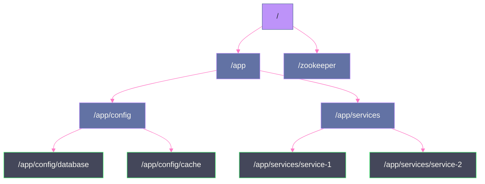
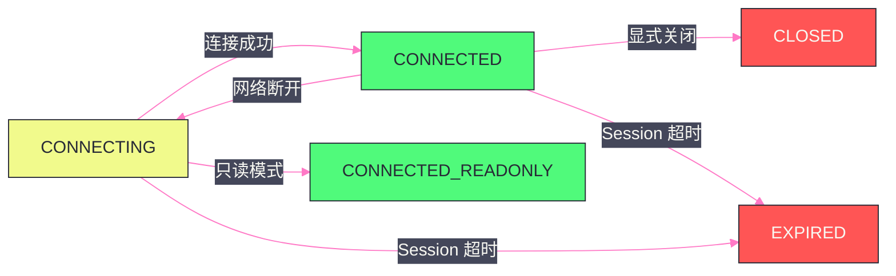
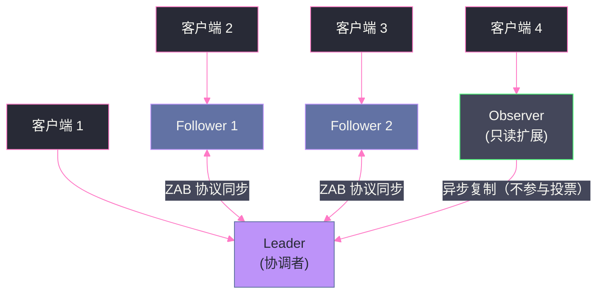

# 01 ZooKeeper 全局架构——数据模型与会话机制

## 摘要

ZooKeeper 是分布式系统领域中最重要的协调服务之一，它为 [[Kafka]]、[[Dubbo]]、HDFS、HBase 等众多分布式系统提供了协调基础。然而，ZooKeeper 本身并不复杂——它的核心只有四个概念：**ZNode 树形数据模型**、**Watcher 通知机制**、**Session 会话管理**、以及 **ACL 权限控制**。

理解这四个概念，是理解 ZooKeeper 所有高级特性（分布式锁、配置中心、服务发现）的前提。本文从"ZooKeeper 为什么要设计成这样"的角度出发，深入剖析每个设计决策背后的工程动机，而非简单罗列 API 和特性。

---

## 第 1 章 为什么分布式系统需要协调服务

### 1.1 分布式系统的协调难题

在分布式系统中，多个进程需要协同完成某项任务，这要求它们能够：

- **共享配置**：某个配置项变更后，所有节点需要及时感知并更新；
- **选主**：在多个候选节点中，选出唯一的 Leader 来负责协调工作；
- **分布式锁**：确保同一时刻只有一个进程执行某段关键操作；
- **服务发现**：消费方需要知道服务提供方当前在哪些地址提供服务。

这些需求看起来不难，但在分布式环境中有一个根本性的挑战：**网络是不可靠的**。进程可能宕机、网络可能分区、消息可能延迟——你无法区分"一个节点很慢"和"一个节点已经宕机"。

最朴素的做法是用一个专用的共享存储（比如数据库）来存放这些协调数据。但数据库本身就是一个单点，且数据库对"变更通知"的支持（轮询）效率很低，无法实现毫秒级的状态变更感知。

ZooKeeper 的价值在于：它提供了一个**高可用的、强一致的、支持变更通知**的分布式协调原语——客户端可以在上面构建出分布式锁、配置中心、服务发现等高级机制，而不需要自己处理底层的一致性保证。

### 1.2 ZooKeeper 的设计定位

ZooKeeper 不是一个通用的分布式数据库，它有几个明确的设计边界：

- **数据量小**：ZooKeeper 的数据全部存在内存中（仅用磁盘做持久化日志），因此每个 ZNode 的数据量限制在 1MB 以内（默认），实际使用中通常只存储几 KB 的元数据；
- **读多写少**：ZooKeeper 的一致性模型对写操作有较高开销（需要 quorum 确认），适合配置数据（少量写，大量读）；
- **强一致性（顺序一致性）**：所有写操作通过 Leader 串行化，所有客户端看到的更新顺序完全一致；
- **专注协调原语**：ZooKeeper 提供的是构建分布式协调机制的"积木"，而不是一个完整的应用框架。

> [!note] 设计哲学
> ZooKeeper 的论文题目是《ZooKeeper: Wait-free coordination for Internet-scale systems》。"Wait-free"意味着它的 API（读操作）不会阻塞等待其他操作完成，只有写操作需要经过 ZAB 协议的多数派确认。这种设计使得 ZooKeeper 的读吞吐量可以通过增加 Observer 节点水平扩展，而不受写操作的限制。

---

## 第 2 章 ZNode：ZooKeeper 的核心数据模型

### 2.1 树形命名空间

ZooKeeper 的数据组织为一棵**树形命名空间**，类似于 Linux 文件系统：根节点为 `/`，每个节点称为 **ZNode**，通过路径（如 `/app/config/database`）唯一标识。



与文件系统不同的是：**ZNode 既是目录又是文件**——每个 ZNode 可以同时存储数据（最多 1MB）并拥有子节点。

### 2.2 四种 ZNode 类型

ZNode 有四种类型，类型在创建时指定，之后不能修改：

**持久节点（Persistent）**

最普通的类型：创建后永久存在，直到被显式删除。适合存储需要长期保存的配置数据（如数据库连接地址、功能开关等）。

**临时节点（Ephemeral）**

**临时节点与创建它的客户端 Session 绑定**。当客户端 Session 超时或断开连接时，ZooKeeper 服务端会自动删除该客户端创建的所有临时节点。

这是 ZooKeeper 最强大的特性之一：临时节点的存在与否，天然反映了创建它的客户端是否"在线"。这使得以下功能得以优雅实现：
- **服务健康检测**：服务启动时创建临时节点注册自己，宕机后临时节点自动消失，其他服务可以监听到这一变化；
- **分布式锁**：获得锁的客户端创建临时节点，即使客户端宕机（未主动释放锁），锁也会因 Session 超时自动释放，避免死锁。

> [!warning] 生产避坑
> **临时节点不能有子节点**。这是一个常见的 ZooKeeper 使用误区——临时节点设计上就是"叶节点"，不允许在它下面创建子节点。如果需要在服务注册节点（临时）下面存储额外信息，应该将信息序列化到节点的数据中，而不是创建子节点。

**有序节点（Sequential）**

在节点路径后面自动追加一个单调递增的 10 位十进制序号。例如：
```
create /locks/lock- → /locks/lock-0000000001
create /locks/lock- → /locks/lock-0000000002
create /locks/lock- → /locks/lock-0000000003
```

序号由 ZooKeeper 服务端维护，保证在同一父节点下全局单调递增（即使并发创建也不会冲突）。这是实现分布式锁和 Leader 选举的基础原语。

**临时有序节点（Ephemeral + Sequential）**

结合了临时和有序的特性：客户端断开后节点自动删除，且路径带有递增序号。这是实现**公平分布式锁**（锁的获取顺序与请求顺序一致）的最佳方式，见第 3 篇文章的详细介绍。

### 2.3 ZNode 的元数据（Stat 结构）

每个 ZNode 除了数据内容外，还维护了一组**元数据（Stat）**：

| 字段 | 含义 |
|:---|:---|
| `czxid` | 创建该节点的事务 ID（ZXID） |
| `mzxid` | 最后一次修改该节点的事务 ID |
| `ctime` | 节点创建时间（毫秒时间戳） |
| `mtime` | 节点最后修改时间 |
| `version` | 数据版本号（每次写入递增） |
| `cversion` | 子节点列表版本号（子节点增删时递增） |
| `aversion` | ACL 版本号 |
| `ephemeralOwner` | 临时节点的 Session ID（持久节点为 0） |
| `dataLength` | 数据内容的字节长度 |
| `numChildren` | 子节点数量 |
| `pzxid` | 最后一次修改子节点列表的事务 ID |

**version 字段是实现乐观锁的关键。** ZooKeeper 的 `setData` 和 `delete` 操作支持条件版本参数：

```
setData(path, data, version=-1)  // version=-1 表示不做版本检查，直接写入
setData(path, data, version=3)   // 只有当前节点的 version 恰好为 3 时才允许写入
```

多个客户端同时读取同一 ZNode 后，都尝试用 `setData(path, newData, version=读取时的version)` 写入——只有一个能成功（其他的会收到 `BadVersionException`），实现了**乐观并发控制（Optimistic Concurrency Control）**，避免了加锁的开销。

### 2.4 ZXID：ZooKeeper 的全局事务 ID

**ZXID（ZooKeeper Transaction ID）** 是 ZooKeeper 中每个写操作的全局唯一递增标识符。它是一个 64 位整数，高 32 位是**Epoch（纪元号）**，低 32 位是**计数器**：

```
ZXID = (epoch << 32) | counter
```

Epoch 在每次 Leader 选举后递增（类似于 [[ETCD|Raft]] 的 Term），确保新 Leader 产生的 ZXID 总是大于旧 Leader 的。每次写操作，低 32 位计数器递增。

ZXID 的用途：
1. **ZAB 协议的日志复制**：Follower 通过比较 ZXID 来判断自己与 Leader 的数据差距，决定需要同步哪些事务（详见第 2 篇）；
2. **顺序一致性保证**：客户端通过比较 ZXID，可以确认自己读到的是否是"最新"的状态；
3. **ZNode 的版本追溯**：`czxid`、`mzxid` 等字段记录了节点历史变更的事务 ID，可用于审计和故障排查。

---

## 第 3 章 Watcher：分布式事件通知机制

### 3.1 轮询 vs 推送：Watcher 的存在意义

在没有 Watcher 的世界里，如果你想感知某个配置节点是否发生变化，只能**轮询**：每隔一段时间调用 `getData(path)` 读取节点数据，与上次读取的值做比较。

轮询的问题显而易见：
- **实时性差**：变更到感知之间有固定延迟（轮询间隔）；
- **资源浪费**：绝大多数轮询都是"没有变化"的无效请求，消耗网络带宽和 ZooKeeper 服务端的 CPU；
- **无法区分变更类型**：轮询只能告诉你"数据不同了"，但无法区分是节点数据修改、子节点新增还是节点被删除。

Watcher 机制解决了这个问题：**客户端在读取操作（`getData`、`getChildren`、`exists`）时，同时注册一个监听器（Watcher）。当被监听的 ZNode 发生变更时，ZooKeeper 服务端主动推送通知给客户端**，客户端再去读取最新数据。

### 3.2 Watcher 的一次性语义

这是 ZooKeeper Watcher 最容易被忽视的特性：**Watcher 是一次性的（One-Time Trigger）**。

每个注册的 Watcher，触发一次通知后即自动失效，不会持续监听。如果客户端还需要继续监听，必须在收到通知、处理完变更后，重新注册 Watcher。

**为什么要设计成一次性？**

ZooKeeper 服务端对每个注册了 Watcher 的连接维护一个 Watcher 列表。如果 Watcher 是持久的，当某个高频变更的节点有大量客户端监听时，服务端需要维护海量的 Watcher 对象，内存压力极大。一次性 Watcher 将 Watcher 的生命周期限制为"一次事件"，显著降低了服务端的内存开销。

**一次性 Watcher 的陷阱**：

在收到通知后、重新注册 Watcher 之前，这段时间内发生的变更会被**遗漏**。

```
时间线：
t=0: 客户端注册 Watcher，读取数据 v1
t=1: 数据变更为 v2，Watcher 触发通知
t=2: 客户端收到通知，开始处理
t=3: 数据变更为 v3（在客户端重新注册 Watcher 之前！）
t=4: 客户端重新注册 Watcher，读取数据 v3
```

在 t=3 发生的变更（v2 → v3）被完全遗漏。应对策略：**在重新注册 Watcher 时，始终先读取最新数据**，而不是假设"上次通知以来只发生了一次变更"。这个模式可以用以下伪代码表达：

```java
void watchNode(String path) {
    // 注册 Watcher 并同时读取当前数据（原子操作）
    byte[] data = zk.getData(path, event -> {
        // 收到通知后，递归调用 watchNode 重新注册，并处理最新数据
        watchNode(path);
        handleDataChange(path);
    }, stat);
    // 处理当前读取到的数据
    processData(data);
}
```

### 3.3 Watcher 可以监听哪些事件

不同的读操作注册的 Watcher，触发的事件类型不同：

| 操作 | 触发 Watcher 的事件 |
|:---|:---|
| `getData(path)` | 节点数据变更（`NodeDataChanged`）、节点被删除（`NodeDeleted`） |
| `exists(path)` | 节点被创建（`NodeCreated`）、数据变更（`NodeDataChanged`）、节点被删除（`NodeDeleted`） |
| `getChildren(path)` | 子节点列表变更（`NodeChildrenChanged`）、父节点被删除（`NodeDeleted`） |

`exists` 的特殊性在于：它可以监听一个**尚不存在**的节点。这使得服务发现变得简单——客户端可以在服务注册节点不存在时就注册 Watcher，一旦服务启动并创建节点，立即收到通知，而不需要轮询等待。

### 3.4 Watcher 通知的保证

ZooKeeper 对 Watcher 通知提供以下保证：

1. **顺序性**：同一客户端，ZooKeeper 保证先发生的变更先触发通知（FIFO 顺序）；
2. **可靠性**：在 Session 未超时的情况下，所有变更都会触发对应的通知（不会丢失）；
3. **最终一致性**：通知本身只告诉客户端"有变更发生"，不包含变更的内容。客户端收到通知后，需要重新读取节点以获取最新数据——此时读到的可能已经是更新后的 N 个版本（不一定是触发通知的那个版本）。

> [!note] 设计哲学
> ZooKeeper 的 Watcher 通知刻意设计为"轻量级通知"（不携带数据），而不是"携带完整变更数据的事件流"。这使得服务端不需要存储变更历史，通知推送的开销极低（只需发送一个小型通知消息）。代价是客户端必须在收到通知后主动读取最新数据。这种"push-to-pull"的组合模式，在 ZooKeeper、[[ETCD]] 的 Watch 机制以及很多配置中心中被广泛采用。

---

## 第 4 章 Session：会话机制与心跳管理

### 4.1 Session 的生命周期

客户端与 ZooKeeper 的连接不是普通的 TCP 连接，而是一个有状态的 **Session**。Session 有以下几个核心属性：

- **SessionID**：全局唯一的 64 位标识符，由 Leader 分配；
- **SessionTimeout**：Session 超时时间，客户端在创建连接时提议，服务端在 `[minSessionTimeout, maxSessionTimeout]` 范围内协商确定；
- **Ephemeral Nodes**：该 Session 创建的所有临时节点的列表。

Session 的状态转换：



### 4.2 心跳机制：Session 存活的维系

ZooKeeper 客户端通过**定期发送心跳（PING）**来维持 Session。心跳发送间隔通常设置为 `SessionTimeout / 3`——在超时时间内，客户端至少发送 3 次心跳，即使有 2 次超时，第 3 次也能维持 Session。

**服务端对 Session 的管理：**

服务端维护每个 Session 的最后一次活跃时间（收到心跳或任何请求）。后台有一个定时任务，周期性地扫描所有 Session，将超过 `SessionTimeout` 没有活跃的 Session 标记为过期：
1. 广播 Session 过期事件给集群内所有节点；
2. 删除该 Session 创建的所有临时节点；
3. 触发监听了这些临时节点的 Watcher 通知。

### 4.3 Session 重连与透明迁移

当客户端与某个 ZooKeeper 节点的连接断开（网络抖动、节点重启），客户端会**自动尝试重连**到 ZooKeeper 集群中的其他节点，使用**相同的 Session ID**。

关键问题：这次重连发生在 Session 超时前还是超时后？

- **超时前重连成功**：Session 继续有效，所有临时节点保留，之前注册的 Watcher（在服务端的记录）仍然有效；客户端收到 `Disconnected` 事件，然后收到 `SyncConnected` 事件，可以继续正常操作。
- **超时后才重连**：Session 已过期，所有临时节点已被删除。重连时，ZooKeeper 返回 `SessionExpired` 事件——客户端应当将此视为"严重错误"，需要重新创建 Session，重新创建所有临时节点，重新注册所有 Watcher。

**客户端代码必须正确处理 `SessionExpired` 事件**，否则：
- 原本由该客户端持有的分布式锁临时节点已消失，锁已被释放，但客户端误以为自己还持有锁，继续操作被保护的资源，造成并发安全问题；
- 原本由该客户端注册的服务发现节点已消失，但客户端不知情，仍然继续工作，导致其他服务端发现不了它（幽灵节点问题的反面——幽灵下线）。

> [!warning] 生产避坑
> **`SessionExpired` 是 ZooKeeper 客户端最危险的状态**，必须做专门处理。常见的错误是只处理了 `Disconnected` 而忽视了 `SessionExpired`。正确的做法是：收到 `SessionExpired` 后，重启整个 ZooKeeper 客户端（和依赖 ZooKeeper 的业务逻辑），而不是简单地重连。Apache Curator 框架（ZooKeeper 的高级封装库）提供了完善的 Session 过期处理机制，生产中强烈建议使用 Curator 而不是原生 ZooKeeper API。

### 4.4 SessionTimeout 的配置与权衡

SessionTimeout 的设置需要在两个方向做权衡：

**SessionTimeout 过小**（如 2000ms）：
- 优点：临时节点能更快被删除，故障感知更及时（如服务健康检测延迟更低）；
- 缺点：网络抖动容易导致 Session 超时，临时节点被误删（服务实际还在运行，但被误判为下线）。

**SessionTimeout 过大**（如 30000ms）：
- 优点：对短暂网络抖动更宽容，不容易误删临时节点；
- 缺点：真正的节点故障，需要等待更长时间才能感知（临时节点延迟删除），影响故障转移速度。

**实践建议**：生产环境中，SessionTimeout 通常设置为 **10~30 秒**。对于需要快速故障感知的场景（如 Kafka Controller 选举），可以适当降低到 **6~10 秒**；对于网络质量较差的跨数据中心场景，适当增大到 **30~60 秒**。

默认的 `minSessionTimeout = 2 × tickTime`，`maxSessionTimeout = 20 × tickTime`（tickTime 默认 2000ms，即最小 4 秒，最大 40 秒）。

---

## 第 5 章 ACL：访问控制模型

### 5.1 ZooKeeper 的权限模型

ZooKeeper 通过 **ACL（Access Control List）** 控制对 ZNode 的访问权限。每个 ZNode 都有一个 ACL 列表，每个 ACL 条目由三部分组成：`(scheme:id, permissions)`。

**权限（Permissions）**由以下标志位组合：

| 权限 | 含义 |
|:---|:---|
| `READ` | 读取节点数据和子节点列表 |
| `WRITE` | 修改节点数据 |
| `CREATE` | 创建子节点 |
| `DELETE` | 删除子节点 |
| `ADMIN` | 修改 ACL 配置 |

**认证方案（Scheme）** 决定了身份标识的格式：

| Scheme | 含义 | 适用场景 |
|:---|:---|:---|
| `world` | 所有人（`anyone`） | 完全公开的节点 |
| `auth` | 当前已认证的用户 | 简单的用户名/密码认证 |
| `digest` | `username:SHA1(password)` 哈希 | 用户名密码认证（推荐） |
| `ip` | IP 地址或 CIDR 段 | 基于网络地址的访问控制 |
| `sasl` | Kerberos 等 SASL 机制 | 企业级安全认证 |

**默认 ACL（重要！）：** 节点创建时如果不指定 ACL，默认使用 `world:anyone:CDRWA`——所有人拥有所有权限。这在内网受控环境中通常可以接受，但在多租户或需要安全隔离的环境中，必须显式配置 ACL。

### 5.2 ACL 的局限性

ZooKeeper 的 ACL 有一个重要的限制：**ACL 不是递归的**。父节点的 ACL 不会自动继承给子节点——每个 ZNode 的 ACL 都是独立的。

这意味着：如果你保护 `/app/config` 节点，但没有保护 `/app/config/database`，任何人仍然可以直接访问 `/app/config/database`。在实践中，需要在创建每个节点时显式指定 ACL，或者通过应用层框架（如 Curator）封装统一的 ACL 策略。

另一个限制：**ZooKeeper 的 ACL 只控制数据访问，不控制树形结构遍历**。即使某节点被 ACL 保护，任何人仍然可以通过 `getChildren` 列出其父节点的子节点列表，知道该节点的存在。

---

## 第 6 章 ZooKeeper 集群的整体架构

### 6.1 角色架构

ZooKeeper 集群由以下角色组成：



**Leader**：集群中唯一处理写请求的节点。所有写操作，无论发送到哪个节点，都会被转发给 Leader。Leader 通过 ZAB 协议将写操作广播给所有 Follower，获得多数 Follower 确认后才提交。

**Follower**：参与 ZAB 协议投票（quorum 计算的成员），可以直接处理读请求（从本地数据提供服务），写请求转发给 Leader。Follower 可以参与 Leader 选举。

**Observer**：Observer 是 ZooKeeper 3.3+ 引入的扩展角色，与 Follower 类似，但**不参与 ZAB 协议的投票**。Observer 通过异步方式从 Leader 接收状态更新，用于**扩展 ZooKeeper 的读吞吐量**——增加 Observer 不会影响写性能（不增加 quorum 要求），但可以承载更多的读请求。

### 6.2 读写请求的路由

**写请求**：无论客户端连接到哪个节点（Leader/Follower/Observer），写请求都会被路由到 Leader 执行，经过 ZAB 协议多数确认后，返回给客户端。

**读请求**：可以在任意节点上直接执行（包括 Leader、Follower、Observer），从节点本地的内存数据中返回结果。这使得读操作的延迟非常低（无需网络往返 Leader），但代价是：**读可能读到稍旧的数据**——Follower/Observer 的数据可能比 Leader 落后几个事务。

**`sync()` 操作**：如果客户端需要读到最新的数据，可以在读操作前调用 `sync(path)`，这会等待服务端将最新的事务同步到当前连接的节点后再返回。之后的读操作就能看到最新数据。`sync()` 用于需要"读自己最新写"（Read-Your-Writes）语义的场景。

---

## 小结

本文梳理了 ZooKeeper 的四个核心概念：

- **ZNode** 是 ZooKeeper 的基本数据单元，四种类型（持久/临时/有序/临时有序）是构建所有高级协调机制的原语；**临时节点**和**有序节点**是最重要的两个特性；
- **Watcher** 实现了分布式变更通知，其一次性语义要求客户端每次处理完通知后重新注册，且必须先读取最新数据；
- **Session** 将客户端连接与临时节点的生命周期绑定，`SessionExpired` 是最需要特别处理的异常状态；
- **ACL** 提供了基本的访问控制，但不支持递归继承，需要在应用层封装策略。

下一篇文章将深入 ZooKeeper 最核心的底层机制：**ZAB 协议**——Leader 选举、崩溃恢复与消息广播。

---

> [!note] 思考题
> 1. ZooKeeper 使用 ZAB（ZooKeeper Atomic Broadcast）协议保证数据一致性——所有写操作由 Leader 处理并广播到 Follower。与 Raft 协议相比，ZAB 在 Leader 选举和日志复制方面有什么异同？为什么 etcd 选择了 Raft 而非 ZAB？
> 2. ZooKeeper 的数据模型是树形命名空间（类似文件系统）。每个 ZNode 可以存储数据（最大 1MB）并拥有子节点。ZNode 有两种类型：持久节点和临时节点（Session 断开后自动删除）。临时节点是分布式锁和服务注册的基础——如果客户端与 ZooKeeper 的 Session 超时（如网络分区），临时节点被删除可能导致锁释放或服务注销。Session 超时时间应该设为多长？
> 3. ZooKeeper 集群推荐奇数节点（3、5、7）——因为容忍 f 个节点故障需要 2f+1 个节点。3 节点容忍 1 个故障，5 节点容忍 2 个。在什么场景下你需要 5 节点而非 3 节点？7 节点的额外成本（写性能下降，因为需要更多节点确认）是否值得？
