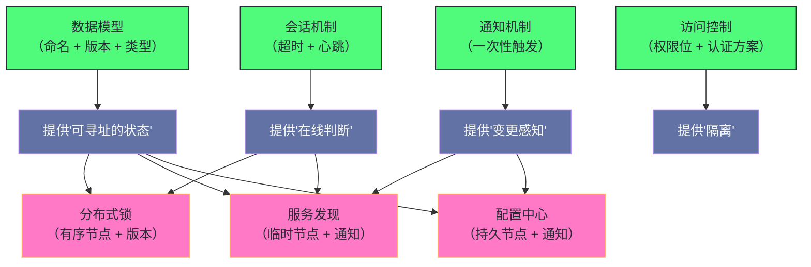

# 01 ZooKeeper 全局架构——数据模型与会话机制

**摘要：**

ZooKeeper 的复杂之处不在它的功能，而在它的**四个核心概念之间如何配合**：**树形数据模型**（提供命名与版本）、**通知机制**（提供变更感知）、**会话机制**（把连接与节点生命周期绑定）、**访问控制**（提供基本隔离）。而它们最值得理解的地方是"**每个设计决策都在回应一个具体的分布式难题**"：**"临时节点"回应"如何判断一个进程是否在线"**、**"一次性通知"回应"如何避免服务端维护海量监听器"**、**"会话超时"回应"网络分区下如何界定生死"**。本文按"为什么需要协调服务 → 数据模型 → 通知机制 → 会话机制 → 访问控制 → 集群架构"展开。先说明四类协调需求与"网络不可靠"这个根本挑战、四条设计边界；再剖析树形模型、四种节点类型、元数据与版本号（乐观并发）、全局事务标识（纪元加计数器）。然后讲轮询的问题、通知的一次性语义与它带来的"变更遗漏窗口"、三类可监听事件与三处保证。之后是会话的生命周期与状态机、心跳间隔的取值依据、重连的两种结果（超时前与超时后）与"会话过期是最危险状态"、超时时间的双向权衡。接着是权限模型与"不递归"这处局限、三种集群角色与读写路由的差异、以及"读可能读到稍旧数据"这处取舍。最后是边界反例与落点。

---

## 第 1 章 为什么需要协调服务

### 1.1 四类协调需求

**分布式系统里有四类反复出现的协调需求。**

**第一类是"共享配置"**：**某个配置项变更后'所有节点需要及时感知'**。

**第二类是"选主"**：**在多个候选节点中'选出唯一的协调者'**。

**第三类是"分布式锁"**：**确保'同一时刻只有一个进程'执行某段关键操作**。

**第四类是"服务发现"**：**消费方需要知道'提供方当前在哪些地址'**。

**四类需求的共同特征是"它们都需要'一个全局的、可被多方读取的状态'"**——**而"这个状态的'变更'还需要'被及时传播'"。** **因此"协调服务要提供的是'一个可靠的共享状态加变更通知'"。**

### 1.2 根本挑战

**这四类需求看起来不难，但在分布式环境里有一个根本挑战：网络不可靠。**

**具体的表现是**：**"进程可能宕机、网络可能分区、消息可能延迟'"**——**而"你'无法区分'一个节点很慢'和'一个节点已经宕机'"。

**这条"无法区分"的性质是本篇所有机制的出发点**：**因为"无法区分"，所以"任何'判断生死'的机制'都只能是'基于超时的近似'"**——**而"所有基于超时的判断'都必须接受'误判的可能性'"。

**因此"理解这套系统"的关键是"理解它'如何界定生死'"**——**而"这处界定'贯穿了会话、临时节点、选举三处机制"。

### 1.3 四条设计边界

**这套系统有四条明确的设计边界，而它们"解释了'为什么它不是一个通用数据库'"。**

**边界一：数据量小。** **因为"数据全部放在内存里'（磁盘只做持久化日志）"，**所以"单个节点的数据量'有上限'"**——**而"实际使用中'通常只存几 KB 的元数据'"。

**边界二：读多写少。** **因为"写操作'需要多数派确认'"**——**因此"它的写开销'远高于读'"**——**而"它适合'少量写、大量读'的配置类数据"。

**边界三：强一致（顺序一致）。** **因为"所有写操作'通过协调者串行化'"**——**因此"所有客户端看到的更新顺序'完全一致'"。

**边界四：只提供协调原语。** **它提供的是"构建协调机制的积木"，而不是"一个完整的应用框架"**——**因此"分布式锁、配置中心'都需要'在它之上构建'"。

**四条边界的共同特征是"它们都在'限制适用范围'"**——**而"这类'明确的边界'是'系统可预期的前提'"。** **因此"评估一个系统时'应当先看它'明确划了哪些边界'"**——**因为"边界之外的用法'必然出问题'"。

### 1.4 一个类比：公告栏与签到表

**把这套系统类比成"办公楼的公告栏与签到表"会更容易理解它的结构。**

**"公告栏上贴着各部门的通知"对应"树形数据模型"**——**而"每个通知'有固定的位置（路径）'"**。

**"通知被更换后'关注的人会收到提醒"对应"通知机制"**——**而"提醒'只说'有更新了'，不说'更新了什么'"**——**这正是"轻量通知"的类比形态。

**"每个员工每天签到，下班后签退"对应"会话与临时节点"**——**而"如果某天没签到'就被认为不在岗'"**——**这正是"临时节点反映在线状态"的类比。

**"签到表'由前台统一保管，且只有一份'"对应"由协调者串行化写操作"**。

**"公告栏有几份副本，但'副本更新有先后'"对应"读可能读到稍旧数据"**。

**"如果某人只是暂时离开（网络抖动）就被判定不在岗"对应"会话超时误判"**——**而"这处误判'正是超时时间需要权衡的原因'"。

**这个类比的用处在于"它把四条设计边界变成了可感知的约束"**：公告栏只能贴摘要（数据量小）、更换公告比查看费事（读多写少）、所有人看到的顺序一致（顺序一致）、公告栏不是办公系统（只提供原语）。**

### 1.5 一条贯穿全篇的判断

**有一条判断贯穿全篇，而它值得先提出来。**

**这条判断是"所有基于超时的判断，都必须在'感知速度'与'误判概率'之间取舍"。**

**它的第一处体现是"会话超时"**：**超时短则"故障感知快"但"网络抖动容易误判"**；**超时长则"误判少"但"故障感知慢"**。

**它的第二处体现是"心跳间隔"**：**间隔短则"能更快维持会话"但"开销更大"**。

**它的第三处体现是"临时节点的删除时机"**：**它"完全由会话超时决定"**——**因此"临时节点'既是一处优雅的机制，也是一处风险来源'"。

**三处体现的共同特征是"它们都是'同一个取舍的不同侧面'"**——**而"理解这处取舍'能让'超时参数'从'凭感觉'变成'有依据'"。

**这条判断的实用价值在于"它给出了'超时配置的提问方式'"**：**"这处超时'误判的后果是什么'，而'它要保护的场景'有多紧急'"**——**而"能回答这两个问题的配置'才是可评估的配置"。** **这与第 7 篇讲的"治理参数在保护范围与误伤范围之间取舍"是同一类。** 一处关于"协调服务"的观察

**而"这处取舍在本篇里出现了三次"**：**会话超时、心跳间隔、临时节点删除时机**——**而"它们本质上是同一个参数的三处体现"。** **因此"调整其中一个时应当同时考虑另外两个"。**

### 1.6 一处关于"协调服务"的观察

**"为什么需要一个专门的协调服务"这个问题值得展开，因为它常被简化为"用数据库不就行了吗"。**

**用通用存储（例如数据库）来存放协调数据的代价有三处**：**"它本身是单点'"**、**"它对变更通知的支持'只能靠轮询'"**、**"它的写操作'无法提供'协调所需的顺序保证'"**。

**三处代价里"第二处最致命"**：**因为"协调场景'恰恰是'变更少但要求及时感知'的'"**——**而"轮询'在'变更少'时'绝大多数请求都是无效的'"**——**因此"它'既浪费资源，又'感知不及时'"。

**因此"协调服务的核心价值'是'把'变更通知'做成一等公民'"**——**而"数据模型与会话机制'都是'为这处通知服务的'"**（因为"通知需要'有意义的命名'与'可靠的在线判断'"）。

**这条观察的通用性在于"它把'协调服务'与'通用存储'的差别'归结到一处能力上'"**——**而"这处能力'是'通用存储难以补足的'"（因为"轮询的固有缺陷'无法通过优化消除"）。

### 1.7 一处关于"读多写少"的观察

**"读多写少"这处定位值得说明，因为它"解释了整套设计的大部分取舍"。**

**这处定位的直接推论有三处**：**"读要尽量便宜'"**（因此"读可以在任意节点执行"）、**"写可以相对昂贵'"**（因此"写要经过多数派确认"）、**"读可以容忍轻微滞后'"**（因此"不要求'读总是最新'"）。

**三处推论的共同特征是"它们都在'优化读、容忍写的成本与滞后'"**——**而"这与'写多读少'的系统'恰好相反'"**。

**因此"判断一个系统是否适合这套机制"的判据是"它的读写比例"**——**而"如果'写占主导'，那么'这套机制的每一步都在拖慢你'"。

**这条观察的通用性在于"它说明'架构选择应当匹配负载特征'"**——**而"把'为读优化的系统'用于'写密集场景'是'常见的误用'"。** **这与第 4 篇讲的"接口级模型在大规模下反转"是同一类**：**"设计的有效性'依赖负载假设'"。

---

## 第 2 章 数据模型

### 2.1 树形命名空间

**数据组织为一棵树，而"每个节点'既能存数据又能有子节点'"。**

**这处设计与文件系统不同**：**"文件系统里'目录和文件是两类对象'"**，**而"这里'所有节点都是同一类'"**——**因此"一个节点'既是'目录'又是'文件'"。

**这处统一带来的收益是"结构更简单"**——**因为"不需要区分两种对象的行为"**——**而"代价是'不能通过类型表达意图'"**（例如"无法通过类型区分'这是个配置项'还是'这是个分组'"）。

**因此"使用这套模型时'需要通过'命名约定'来表达意图"**——**例如"用'config'前缀表示配置节点'"**。** 这类"用约定替代类型"的做法在本专栏里反复出现**（第 2 篇讲的"用结构表达角色"）。

### 2.2 一处关于"有序节点"的观察

**"有序节点"这处原语值得单独说明，因为它是"把'并发请求'变成'有序序列'"的关键。**

**它的机制是"服务端'为每个创建请求'分配一个单调递增的序号'"**——**因此"并发创建'会得到不同的、可比较的序号'"。

**这处机制的收益是"它让'并发变成了可排序'"**——**而"一旦有了顺序'，就可以'用顺序表达'优先级、先来后到、以及唯一性'"。

**三处用途值得列出**：**"序号最小者获得锁'（公平锁）"**、**"序号最小者成为协调者'（选主）"**、**"序号唯一'（因此可用于'去重或唯一命名'"）。

**因此"有序节点'是'三处高级机制的共同基础'"**——**而"这处设计的高明之处在于'它把'并发控制'转化成了'对序号的比较'"**——**而"比较序号'是纯本地的操作，不需要额外协调'"。

**这条观察的通用性在于"它体现了'用全局序号简化并发问题'的手法"**——**而"这类手法在别处也出现"**（例如"用事务标识判断先后"）。** **这与第 12 篇讲的"用事务标识与快照判断可见性"是同一思路**：**"用'单调序号'替代'复杂的并发协调'"。

### 2.3 四种节点类型

**节点有四种类型，而"类型在创建时指定、之后不能修改"。**

**第一种是"持久节点"**：**它"创建后永久存在'直到被显式删除'"**——**适合"长期保存的配置数据"。

**第二种是"临时节点"**：**它"与创建它的会话绑定'"**——**因此"会话超时或断开时'它会被自动删除'"。

**第三种是"有序节点"**：**它"在路径后自动追加一个单调递增的序号'"**——**而"序号由服务端维护，保证'同一父节点下全局递增'"。

**第四种是"临时有序节点"**：**它"结合了后两种的特性"**——**而"它是实现'公平锁'的最佳原语'"（第 3 篇展开）。

**四种类型的共同特征是"它们的差别只在'生命周期'与'命名'两处"**——**而"这两处恰好覆盖了'分布式协调的两类需求'"**：**"生命周期'用于表达'在线状态'"，"命名'用于表达'请求顺序'"。

**一处重要的限制值得强调**：**"临时节点'不能有子节点'"**——**因此"它'在结构上就是叶节点'"**。** 这条限制的实践含义是"如果需要'在服务注册节点下存额外信息'，应当'把信息序列化到节点的数据里'，而不是'创建子节点'"**——**而"违反这条限制'会直接报错'"。

### 2.4 元数据结构

**每个节点除数据外还维护一组元数据，而它们"可以分成四类"。**

**第一类是"事务标识"**：**包括"创建该节点的事务标识"与"最后一次修改它的事务标识"**——**而"它们'用于追溯变更历史'"。

**第二类是"时间戳"**：**包括"创建时间"与"最后修改时间"**。

**第三类是"版本号"**：**包括"数据版本""子节点列表版本""权限版本"**——**而"它们是'乐观并发控制的基础'"（第 2.4 节）。

**第四类是"结构与归属"**：**包括"临时节点的所属会话标识""数据长度""子节点数量"**。

**四类元数据的共同特征是"它们'都是'关于'这个节点的状态'"**——**而"其中'版本号'的用途最特殊"**（因为"它参与'写入的准入判断'"）。

**一处细节值得留意**：**"临时节点的所属会话标识'在持久节点上为零'"**——**因此"可以通过它'判断一个节点是否临时'"。** **这类"用零值表示'不适用'"的做法很常见**——**而它的代价是"需要知道这个约定才能正确解读"。

### 2.5 一处关于"数据量上限"的观察

**"单节点数据量有上限"这处约束值得展开，因为它"解释了整套设计为何围绕'小数据'展开"。**

**约束的来源是"数据全量放在内存里'"**——**因此"总容量'受'单机内存'限制'"**——**而"单个节点的数据量'还有额外上限'"。

**这处约束的直接后果是"它不能当作'通用存储'使用"**——**因为"通用存储'的容量'由磁盘决定'"**——**而"内存容量'比磁盘小几个数量级'"。

**而"全内存"这处选择的收益是"读极快且延迟稳定"**——**因为"读'不需要访问磁盘'"**——**因此"读延迟'只受网络与内存访问限制'"。

**因此"这处取舍是'用容量换延迟的确定性'"**——**而"它'适合'元数据类的小数据'"**（因为"元数据的价值'在于'读取频繁且要求低延迟'，而非'容量大'"）。

**这条观察的通用性在于"它说明'存储选型应当匹配数据的访问特征'"**——**而"把'大容量低延迟要求'的数据放进'全内存系统'是'常见的误用'"。** **这与第 4 篇讲的"全量缓存只适用于小数据量"是同一判断**：**"全内存'的适用前提'是'数据量小'"。

### 2.6 版本号与乐观并发

**"版本号参与写入准入"这处设计值得单独说明，因为它是"无锁并发控制"的落地方式。**

**机制是"写入操作'可以携带一个期望版本'"**——**而"只有'当前版本恰好等于期望值'时才允许写入'"**——**否则"返回版本不匹配的错误"。

**这处机制的效果是"多个客户端可以'先读后写'，而'只有一个能成功'"**——**因为"其他客户端的期望版本'已经过期'"。

**因此"它实现了乐观并发控制"**——**而"它的收益是'避免了加锁的开销'"**：**因为"没有真正的锁，所以'没有锁的获取、释放、以及死锁问题'"。

**而它的代价是"失败方需要重试"**：**因为"乐观控制'在冲突时'是'直接失败'而非'等待'"**——**因此"使用方'必须实现'重试逻辑'"。

**这条机制的通用性在于"它体现了'乐观与悲观的取舍'"**：**"乐观'适合'冲突少'的场景'"**（因为"冲突少则重试少"），**"悲观'适合'冲突多'的场景"**。** 这与第 12 篇讲的"多版本并发控制"是同一类取舍**：**"用'检测冲突'替代'预防冲突'"。

### 2.7 全局事务标识

**全局事务标识是"每个写操作的全局唯一递增编号"，而它的结构值得说明。**

**结构是"高位是纪元号，低位是计数器"**——**而"两者的分工是'纪元表达'选举轮次'，计数器表达'轮次内的顺序'"。

**"纪元号在每次选举后递增"**这处设计很关键：**它"确保'新协调者产生的编号'总是大于'旧协调者的'"**——**因此"不会出现'新旧协调者的编号冲突'"。

**这处设计与共识协议里的"任期"是同一手法**——**而"它的通用性在于'用'单调递增的轮次号'区分'不同时期的决策'"。** **因此"看到'纪元或任期'这类概念时，应当想到'它解决的是新旧决策的区分问题'"。

**而"低位计数器"的作用是"同一轮次内的全序"**——**因此"任意两个写操作'都可以比较先后'"**——**而"这个全序'正是'顺序一致性的基础'"。

---

## 第 3 章 通知机制

### 3.1 轮询的问题

**"在没有通知机制的世界里，感知变更只能靠轮询"，而轮询有三处问题。**

**第一处是"实时性差"**：**因为"变更到感知之间'有固定的延迟'"**——**而"延迟等于轮询间隔'"。

**第二处是"资源浪费"**：**因为"绝大多数轮询'都是'没有变化'的无效请求'"**——**因此"它们'消耗带宽与服务端处理能力'"。

**第三处是"无法区分变更类型"**：**因为"轮询'只能告诉你'数据不同了'"**——**而"无法区分'是数据被改、子节点新增、还是节点被删除'"。

**三处问题的共同特征是"它们都源于'主动查询的低效'"**——**而"解法只能是'让服务端主动通知'"。

### 3.2 一次性语义

**通知机制最关键的一处设计是"监听器是一次性的"。**

**含义是"每个注册的监听器'触发一次后即自动失效'"**——**因此"如果还需要继续监听'必须在收到通知后重新注册'"。

**"为什么要设计成一次性"这个问题的答案与内存有关**：**因为"服务端'为每个连接维护一个监听器列表'"**——**因此"如果监听器是持久的'，那么'某个高频变更的节点'有大量客户端监听时，服务端要维护海量对象'"——**而"内存压力极大"。

**因此"一次性语义的实质是'把监听器的生命周期限制为一次事件'"**——**而"它的收益是'服务端的内存开销与监听时长无关'"。

**这处取舍的形态值得留意**：**"它用'客户端的重新注册负担'换'服务端的内存可控'"**——**而"这类'把成本从服务端转移到客户端'的做法在分布式系统里很常见"**（因为"客户端数量多但每个负担小，服务端只有一个但负担集中"）。

### 3.3 一次性语义的陷阱

**一次性语义带来一处"变更遗漏窗口"，而它值得算清楚。**

**窗口的形态是**：**"在'收到通知'与'重新注册完成'之间'发生的变更'会被遗漏'"。

**具体的时间线是**：**"注册并读取 → 数据变更为第二版、通知触发 → 客户端处理 → 数据变更为第三版（此时尚未重新注册）→ 客户端重新注册并读取"**——**而"第二版到第三版之间的变更'完全被遗漏'"。

**因此"应对策略是'在重新注册时'始终先读取最新数据'"**——**而不是"假设'上次通知以来只发生了一次变更'"。

**这条策略的实践含义是"处理通知的代码'必须'是'读取最新值并全量处理'，而不是'增量处理'"**——**因为"增量处理'依赖'不漏事件的假设'，而这个假设不成立'"。

**这条陷阱的通用性在于"它揭示了'通知类机制的共同约束'"**：**"只要'通知不携带内容'，就必然存在'遗漏窗口'"**——**而"处置方式'只能是'让处理逻辑'幂等且基于全量状态'"。** **这与第 4 篇讲的"用客户端重试兜底最终一致"是同一类**：**"接受不完美，用兜底补足"。

### 3.4 能监听哪些事件

**不同读操作注册的监听器"触发的事件类型不同"，而这张对应关系值得记清。**

| 操作 | 可触发的事件 |
|---|---|
| 读取数据 | 数据变更、节点被删除 |
| 判断存在 | 节点被创建、数据变更、节点被删除 |
| 读取子节点 | 子节点列表变更、父节点被删除 |

**这张表里最值得留意的是"判断存在'能监听'节点被创建'"**——**因为"这是'监听一个尚不存在的节点'的能力'"。

**这处能力的用途很具体**：**"客户端可以在'服务注册节点不存在时'就注册监听'"**——**因此"一旦服务启动并创建节点'立即收到通知'"**——**而"不需要'轮询等待'"。

**因此"这处能力'是'服务发现能做得优雅'的前提之一"**——**而"它体现了'设计时考虑'时序上的两种可能'"**（"先有节点"与"先有监听者"）。** **这与第 3 篇讲的"订阅与注册的顺序无关"是同一处设计。

### 3.5 三处保证

**通知机制提供三处保证，而它们"界定了它的能力边界"。**

**第一处是"顺序性"**：**同一个客户端'先发生的变更'先触发通知'"**——**因此"通知的顺序'是可靠的'"。

**第二处是"可靠性"**：**在会话未超时的前提下'所有变更都会触发通知'"**——**因此"通知'不会丢失'"。

**第三处是"轻量性"**：**通知"只告诉'有变更发生'，不包含'变更内容'"**——**因此"客户端必须'重新读取'"。

**三处保证的共同特征是"它们把'通知'定位为'触发信号'而不是'数据载体'"**——**而"这处定位'换来的是'服务端不需要存储变更历史'"**——**而"代价是'客户端多一次读取'"。

**因此"这处设计的取舍是'用客户端的读取'换服务端的无状态'"**——**而"这类取舍在'通知类机制'里是标准做法"**（第 8 篇讲的"发现模型"也是同一形态）。---

### 3.6 一处关于"通知与顺序一致"的观察

**"通知的顺序保证"与"读的一致性"之间存在一处容易被误解的关系。**

**具体来说**：**"同一客户端的通知'按变更顺序触发'"**——**但"通知触发后'客户端去读时'读到的可能是'更晚的版本'"**——**因此"通知顺序可靠'不代表'读到的状态与通知一一对应'"。

**这处错位的原因有两处**：**"通知不携带内容'"**（因此"读与通知'是两个独立操作'"）、**"读可能落在'与通知不同的节点上'"。

**因此"正确处理方式是'把通知当作'触发信号'，把'读到的状态'当作'唯一依据'"**——**而不是"试图'用通知推导状态变化'"。

**这条区分的实践含义是"处理逻辑'应当是'幂等的、基于全量的'"**——**因为"它'可能'因为'多次触发'或'读到更新版本'而'重复执行'"。

**这条观察的通用性在于"它说明'通知类机制'必须配套'幂等的处理逻辑'"**——**而"这两者是'不可分割的一对'"。** **这与第 13 篇讲的"重试必须配套幂等"是同一类**：**"任何'可能重复或乱序'的机制'都要求处理逻辑幂等'"。

### 3.7 四个概念的配合关系

把四个核心概念的关系画在一起，能看清"它们各自承担哪一部分"。

**图中最值得注意的是"三个高级机制都依赖'数据模型'"**——**因此"它是'最底层的能力'"**——**而"通知与会话'分别被不同的机制使用'"**。

**具体来说**：**"分布式锁'依赖'有序节点与版本号'"**（因为"它需要'顺序'与'写入准入'"）；**"服务发现'依赖'临时节点与通知'"**（因为"它需要'在线判断'与'变更感知'"）；**"配置中心'依赖'持久节点与通知'"**（因为"它只需要'长期存储'与'变更感知'"）。

**这张图的实用价值在于"它给出了'设计一个新协调机制时的取材方式'"**——**即"先明确需要哪几类能力'，再'从四个概念里挑选对应的原语'"**。** 例如"需要一个'只运行一个实例的任务调度器'"**——**那么"它需要'在线判断'与'唯一性'"**——**因此"用'临时节点加选主'即可'"。

## 第 4 章 会话机制

### 4.1 生命周期与状态机

**会话不是普通的连接，而是"一个有状态的、有生命周期的实体"。**

**它的三个核心属性是**：**"全局唯一的会话标识（由协调者分配）"**、**"会话超时时间（由客户端提议、服务端协商确定）"**、**"该会话创建的所有临时节点列表"**。

**而它的状态转换有五条边**：**"连接中 → 已连接"**、**"已连接 → 只读模式"**、**"已连接 → 连接中（网络断开后重连）"**、**"已连接 → 已关闭（显式关闭）"**、**"已连接或连接中 → 已过期（超时）"。

**五条边的分工说明"会话有两个终结方式"**：**"显式关闭'是主动的、干净的'"**，**"过期'是被动的、危险的'"**——**而"两者的处置方式完全不同"（第 4.3 节）。

### 4.2 心跳机制

**会话的存活靠"客户端定期发送心跳"来维持。**

**心跳间隔的取值依据值得说明**：**"间隔通常设为'超时时间的三分之一'"**——**因此"在超时窗口内'客户端至少发送三次心跳'"**——**而"即使有两次丢失，第三次也能维持会话'"。

**这处"三倍余量"的设计意图是"容忍心跳的偶发丢失"**——**而"它是'基于超时的判断'必须留的余量'"。** **这与第 5 篇讲的"心跳超时阈值应当留出余量"是同一原则**：**"控制面的判断'不能'刚好卡在临界值上'"。

**服务端侧的处置分三步**：**"维护每个会话的最后活跃时间"**、**"周期性扫描并标记过期会话"**、**"广播过期事件、删除该会话的临时节点、触发相关通知"。

**三步的顺序有意义**：**"必须先删除临时节点再触发通知'"**——**因为"通知的内容是'节点消失了'"**——**而"如果顺序颠倒'，监听者去读时'可能还读到旧节点'"。

### 4.3 重连与两种结果

**连接断开后客户端会"自动重连到集群中的其他节点，并使用相同的会话标识"**——**而"重连的结果取决于'它发生在超时之前还是之后'"。

**"超时前重连成功"的结果是"会话继续有效"**——**因此"所有临时节点保留、之前注册的监听器（在服务端的记录）仍然有效'"**——**而"客户端会先收到'断开'事件，再收到'重新同步完成'事件"。

**"超时后才重连"的结果是"会话已过期"**——**因此"所有临时节点已被删除'"**——**而"客户端会收到'会话过期'事件"。

**两种结果的差别在于"是否需要重建全部状态"**：**前者"什么都不用做'"**，**后者"需要重新创建会话、重新创建所有临时节点、重新注册所有监听器'"。

**因此"会话过期'是最需要特别处理的状态"**——**而"忽视它的后果很严重"**：**"客户端可能'以为自己还持有锁'（因为'它不知道节点已被删除'）"，**而**"继续操作'被保护的资源'"——**因此"造成'并发安全问题'"。

**一条实践建议是"收到会话过期后'应当重启整个客户端及其依赖的业务逻辑'，而不是'简单重连'"**——**因为"重连'只恢复了连接，而'业务状态'（例如'我以为我持有锁'）已经错了"。

### 4.4 超时时间的双向权衡

**超时时间的设置存在一处"双向权衡"，而两个方向各有代价。**

**"设得太短"的收益是"临时节点更快被删除，故障感知更及时"**——**而代价是"网络抖动容易导致会话超时，临时节点被误删"**——**因此"服务实际还在运行，但被误判为下线"。

**"设得太长"的收益是"对短暂抖动更宽容，不容易误删临时节点"**——**而代价是"真正的故障需要更长时间才能感知"**——**因此"故障转移速度变慢"。

**两处代价的共同特征是"它们是'同一个取舍的两端'"**——**而"这类参数'没有'普遍最优值'"**——**只能"按场景选择"。

**一处实践参考是"常规场景取十到三十秒，需要快速感知的场景取下限，跨数据中心等网络质量较差的场景取上限"**——**而"这些取值的依据'是'误判代价与感知需求的相对权重'"**。

**一处容易忽略的约束是"服务端会对客户端提议的超时做范围限制"**——**因此"客户端提议的值'可能被裁剪'"**——**而"这解释了'为什么设置了某个值但实际生效的是另一个值'"**。** 这类"配置被静默裁剪"的问题'只能靠'核对实际生效值'发现'"**（第 3 篇已展开"看合并后的结果"）。

### 4.5 一处关于"会话与会话标识"的观察

**"会话标识由协调者分配"这处设计值得说明，因为它关系到"重连后的身份延续"。**

**分配方式的意义在于"标识的权威性'来自'单一来源'"**——**因此"不会出现'两个客户端拿到同一个标识'"**——**而"这处唯一性'是'会话语义成立的前提'"。

**而"重连时使用相同标识"这处设计的效果是"身份可以跨连接延续"**——**因此"临时节点'不会因为'换了连接'而消失'"**——**而"这处延续性'正是'临时节点能反映进程而非连接'的原因"。

**这处区分的意义很大**：**"临时节点反映的是'会话的存活'，而不是'某条连接的存活'"**——**因此"网络抖动导致换连接'不会触发节点删除'"**（只要"会话未超时"）。

**因此"理解'会话'与'连接'的区别"是'正确使用临时节点的前提'"**——**而"把两者混为一谈'会让人'误以为'网络抖动会导致节点消失'"——**而"实际的行为'取决于'抖动是否超过会话超时'"。

**这条观察的通用性在于"它区分了'逻辑身份'与'物理连接'两件事"**——**而"这类区分'在'需要跨连接保持状态的系统里'是必需的'"。** **这与第 5 篇讲的"请求标识与连接解耦"是同一思路**：**"逻辑标识'应当'独立于物理连接'"。

### 4.6 一处关于"状态一致性"的观察

**"客户端状态与服务端状态可能不一致"这处问题值得展开，因为它是"会话机制最大的风险点"。**

**不一致的形态是"客户端以为的状态"与"服务端的实际状态"不同**——**例如"客户端以为自己持有锁'，而'服务端已经删除了那个临时节点'"。

**造成不一致的原因有两处**：**"会话过期后客户端未及时感知'"**、**"客户端感知到了但'未正确重置业务状态'"。

**两处原因的处置方式不同**：**前者"靠'正确处理过期事件'解决'"**，**后者"靠'把业务状态的初始化'纳入'过期处理流程'"解决"。

**因此"一条实践纪律是'会话过期时应当重启整个客户端及其依赖的业务逻辑'"**——**而不是"只重连'"——****因为"重连'只修复了连接，而'业务状态'需要重建'"。

**这条观察的通用性在于"它揭示了'分布式系统里状态不一致的危险性'"**——**"它不会立即报错，而是'在某个时刻造成数据错误'"**——**因此"这类问题的排查'远比'立即失败的场景'困难"。** **这与第 4 篇讲的"临时节点只能感知会话级存活"是同一类边界**：**"任何基于连接的判断'都不等于'服务真的可用'"。

---

## 第 5 章 访问控制

### 5.1 权限模型

**权限模型由"权限位"与"认证方案"两部分组成。**

**权限位有五种**：**读、写、创建子节点、删除子节点、修改权限**。

**认证方案有五种**：**"所有人""已认证用户""摘要式用户名密码""网络地址段""企业级安全机制"**。

**而两者组合成"一条权限规则"**——**而"一个节点持有一组权限规则'"。

**一处重要的默认值值得强调**：**"节点创建时'如果不指定权限，默认是'所有人拥有所有权限'"**——**因此"在内网受控环境中'这通常可以接受'"**——**但在"多租户或需要隔离的环境里'必须显式配置'"。

**这条默认值的风险在于"它的默认是'最宽松'而非'最严格'"**——**而"这类'宽松默认'在'安全配置'里是常见隐患"**——**因为"未配置'看起来'没有任何问题'"，**直到"某次审计或事故"才发现。** **这与第 17 篇讲的"宽松配置的后果在使用时才显现"是同一类。

### 5.2 两处局限

**权限模型有两处局限，而它们"必须在应用层补足"。**

**局限一：权限不递归。** **父节点的权限'不会自动继承给子节点'"**——**因此"保护了父节点'不代表'子节点也受保护'"。

**这条局限的后果很具体**：**"如果你保护了某个目录'但没有保护它下面的具体节点'，那么'任何人仍然可以直接访问那个具体节点'"**。

**因此"实践中的做法是'创建每个节点时显式指定权限'"**——**或者"通过封装库'统一施加权限策略'"**。

**局限二：权限只控制数据访问，不控制结构遍历。** **也就是说"即使某个节点被保护'，任何人仍然可以'列出其父节点的子节点列表'"**——**因此"知道'该节点的存在'"。

**这条局限的意义在于"它区分了'读取内容'与'感知存在'两件事"**——**而"很多'看起来安全'的设计'会在这处泄露信息"**（例如"通过节点名暴露服务名或版本"）。

**两处局限的共同特征是"它们都源于'权限模型的粒度'"**——**而"补足方式'只能是'在应用层统一封装'"。** **这与第 17 篇讲的"最小权限需要在应用层落地"是同一判断**：**"基础机制'提供的是'能力'，而'策略'需要在应用层定义'"。

### 5.3 一处关于"隔离层次"的观察

**"隔离应当放在哪一层"这处问题值得说明，因为权限模型只覆盖了最基础的一层。**

**隔离可以分三层**：**"网络层（谁能连上服务）"**、**"认证层（连接者是谁）"**、**"数据层（能读写哪些节点）"。

**权限模型覆盖的是"第三层"**——**而"前两层'由部署与运维决定'"**——**因此"只在数据层做隔离'是不够的'"。

**三层的关系是"越靠前越粗但越可靠"**：**"网络层'能直接挡住'外部访问'"**，**而"数据层'只能'在'连接之后'做判断'"。

**因此"完整的隔离方案'应当'三层都做"**——**而"只做数据层'会让'攻击面'停留在'网络与认证'两处"。

**这条观察的实践含义是"评估安全方案时'应当'按三层分别检查'"**——**而"只检查'权限配置'会漏掉'网络暴露'这类更基础的问题"。** **这与第 17 篇讲的"认证与授权是两个独立环节"是同一判断**：**"分层检查'比'只查最显眼的一层'更可靠"。

---

## 第 6 章 集群架构

### 6.1 三种角色

**集群由三种角色组成，而它们"在共识协议中的参与程度不同"。**

**第一种是"协调者"**：**它是"集群中唯一处理写请求的节点'"**——**因此"所有写操作'无论发到哪个节点'都会被转发给它'"。

**第二种是"跟随者"**：**它"参与共识投票'"**——**因此"它是'多数派计算的一部分'"**——**而"它可以直接处理读请求'"。

**第三种是"观察者"**：**它"与跟随者类似'但不参与投票'"**——**因此"它通过异步方式从协调者接收更新'"。

**三种角色的分工说明"它们覆盖了'两种扩展方向'"**：**"跟随者'扩展的是'容错能力'"**（因为"更多节点意味着能容忍更多故障"），**"观察者'扩展的是'读吞吐'"**（因为"它不增加多数派要求，因此不影响写性能"）。

**这处"用观察者扩展读"的设计值得留意**：**它"把'容错'与'读扩展'两件事分开'"**——**因为"增加跟随者'会同时增加两者'"**，**而"增加观察者'只增加后者'"。** **因此"当'读压力大但容错要求已满足'时，加观察者是更划算的选择"。

### 6.2 一处关于"节点数量"的观察

**"集群该配几个节点"这处问题值得说明，因为它是"容错与性能的直接取舍"。**

**取舍的机制是"容忍若干节点故障'需要'相应数量的多数派'"**——**因此"三节点容忍一个故障，五节点容忍两个"**——**而"代价是'每次写需要更多确认'"。

**因此"节点数与写性能'是反相关'"**——**而"与容错能力'是正相关'"**——**而"这处反相关'是'多数派机制的直接后果'"。

**一处容易被忽略的推论是"偶数节点没有额外收益"**：**因为"四节点的多数派是三'，而'三节点的多数派是二'"**——**因此"四节点'容错能力与三节点相同'"**——**而"代价却更高"**。** 这解释了"为什么推荐奇数节点'"。

**这条观察的实践含义是"节点数的选择'应当'按'需要的容错级别'确定'"**——**而"跨机架或跨机房部署'还需要'考虑'故障域的划分'"**（因为"同一故障域内的多个节点'会同时失效'"）。

**这条观察的通用性在于"它说明'多数派机制的收益与成本都随节点数变化'"**——**而"选择节点数'实际上是'选择'容错与写延迟的平衡点'"。** **这与第 14 篇讲的"组复制的规模上限"是同一类**：**"共识机制的成本'随参与者数量增长'"。

### 6.3 读写路由的差异

**读与写的路由方式不同，而这处差异"决定了两者的延迟特征"。**

**写请求"无论客户端连接到哪个节点，都会被路由到协调者执行"**——**因此"写延迟'包含'转发到协调者加多数派确认'两段'"。

**读请求"可以在任意节点上直接执行"**——**因此"读延迟'很低'"**（因为"不需要网络往返协调者"）。

**这处差异的代价是"读可能读到稍旧的数据"**：**因为"跟随者或观察者的数据'可能比协调者落后几个事务'"。

**因此"读的取舍是'用'可能读到旧数据'换'低延迟与高吞吐'"**——**而"这处取舍'与'读多写少'这处定位是配套的'"**（因为"如果'读要求强一致'，那么'读多'就变成'成本很高'）。

### 6.4 "读自己最新写"的补足

**"读可能读到旧数据"这处性质带来一个问题：如何保证"读到自己的最新写入"。**

**解法是"在读操作前'先做一次同步操作'"**——**而"这个操作'会等待服务端将最新事务同步到当前连接的节点'"**——**因此"之后的读'就能看到最新数据'"。

**这处解法的代价是"一次额外的往返"**——**因此"它'不应当'被无条件使用'"**——**而"只应当'在'确实需要读到最新值'的场景下使用'"。

**这条机制的通用性在于"它体现了'按需加强一致性'的手法"**：**"默认弱一致（低延迟）'，需要时'显式要求强一致（付额外延迟）'"。** **这与第 19 篇讲的"降低一致性要求是最有效的优化"是同一判断的两面**：**"默认低要求，按需提升"。

---

**一处补充是"三类机制的共同风险"**：**它们"都依赖'超时判断'"**——**因此"任何'超时误判'都会'同时影响三者'"。** **因此"调优超时参数时'应当'同时评估它对三处的影响'"。**

## 第 7 章 边界与反例

### 7.1 反例一：把"会话超时"当作"能准确判断宕机"

它"只能基于超时做近似判断"，**而"网络抖动会导致误判"**（第 4.4 节）。

### 7.2 反例二：把"临时节点"当作"可以有子节点"

临时节点"在结构上就是叶节点"，**违反会直接报错**（第 2.2 节）。

### 7.3 反例三：把"一次性通知"当作"能捕捉所有变更"

"收到通知到重新注册之间存在遗漏窗口"（第 3.3 节）。

### 7.4 反例四：把"通知"当作"携带变更内容"

它"只是触发信号"，**因此"处理逻辑必须基于全量状态"**（第 3.5 节）。

### 7.5 反例五：把"会话过期"当作"可以简单重连"

"业务状态已经错了"，**必须重启客户端及其依赖逻辑**（第 4.3 节）。

### 7.6 反例六：把"权限"当作"会自动继承"

权限"不递归"，**每个节点都是独立的**（第 5.2 节）。

### 7.7 反例七：把"读"当作"一定能读到最新值"

读可能落后几个事务，**需要显式同步**（第 6.2 节）。

### 7.8 反例八：把"增加节点"当作"只提升容错"

增加跟随者"同时提升容错与读能力但降低写性能"，**增加观察者只提升读**（第 6.1 节）。

---

## 第 8 章 落点

回到开头：**四个核心概念之间如何配合？**

**数据模型提供"命名与版本"**（因此"写入可以做乐观并发控制"），**通知机制提供"变更感知"**（因此"多方可以及时获知变化"），**会话机制"把连接与节点生命周期绑定"**（因此"在线状态可以被自动表达"），**访问控制提供"基本隔离"**（因此"多租户场景可以共存"）。

**而它们最值得记住的一处配合是"会话与临时节点"**：**"会话超时'触发'临时节点删除'，而'删除'又'触发通知'"**——**因此"一条超时判断'被放大成了'一个可被多方感知的事件'"。** **这处配合'是'服务发现、分布式锁、选主'三类机制的共同基础'"。

**而"这处配合也带来了本篇最大的风险点"**：**因为"节点删除由超时触发"**，**所以"任何超时误判都会直接变成一次状态变更事件"**——**而"这类误判在高负载或网络抖动时会集中出现"。** **因此"理解超时与误判的关系，是用好这套机制的前提"。**

**因此"选择超时时间时，应当同时评估它在这三处的影响"。**

**而这套机制最需要警惕的一处是"会话过期"**：**它"让客户端持有的'外部状态'（例如'我持有锁'）与服务端的实际状态不一致'"**——**而"这类'状态不一致'是分布式系统里最危险的问题类型'"**（因为"它不会立即报错，而是'在某个时刻造成数据错误'"）。

**最后一条判断值得留下：这套系统里"所有基于超时的判断都是近似"。** **"会话超时"、"心跳超时"、"选举超时"都是"用'等待时间'替代'准确的死亡检测'"**——**而"这处替代是'分布式系统的固有代价'"**（因为"网络不可靠"这处根本挑战无法消除）。** 因此"设计这类机制时'应当'先明确'误判的后果'"**——**而"能承受误判的场景'才能用'短超时'"。

**还有一处判断值得留下：这套系统的优雅来自它把三件事绑定在一起**——**连接的存活、节点的存活、进程的存活**——**而这处绑定让在线判断变得自然、不需要额外机制。** **而它的风险也正来自这处绑定**——**因为任何一次超时误判都会直接变成一次状态变更。** **因此"理解这处绑定'是'理解临时节点全部行为'的钥匙"。**
**而本篇与前后篇的关系值得点明**：**第 1 篇讲四个核心概念如何配合，第 2 篇讲它们如何在多节点间保持一致，而第 3 篇讲如何用这些原语构建分布式锁与选主。** **三者合起来，才是从原语到应用的完整链路。** **而"这处链路'也是'本专栏后续几篇的展开顺序"。** **而"这处链路'也是'本专栏后续几篇的展开顺序"。** **因此"读完后几篇时'可以'回看本篇的四个概念'，观察'它们各自被用在哪里'"。** **因此"这一篇是整条链路的地基"，它给出的四个概念，会在后续每一篇里反复出现，值得反复回看。**

---
## 专栏导航

- 下一篇：[[02 ZAB 协议——Leader 选举、崩溃恢复与消息广播]]。
- 返回专栏首页：[[00 专栏导览]]。

---

## 参考资料

1. Apache ZooKeeper 源码：`zookeeper-server/src/main/java/org/apache/zookeeper/server/`、`.../server/DataTree.java`、`.../server/SessionTrackerImpl.java`、`.../server/ZooKeeperServer.java`。
2. Apache ZooKeeper. 官方文档：ZooKeeper 概览与数据模型. https://zookeeper.apache.org/doc/current/zookeeperOver.html
3. Apache ZooKeeper. 官方文档：编程指南（ZNode 类型、Watcher、ACL）. https://zookeeper.apache.org/doc/current/zookeeperProgrammers.html
4. Apache ZooKeeper. 官方文档：会话与超时参数. https://zookeeper.apache.org/doc/current/zookeeperAdmin.html
5. Apache Curator. 官方文档：会话管理与连接策略. https://curator.apache.org/docs/
6. Hunt P, Konar M, Junqueira F P, et al. ZooKeeper: Wait-free coordination for Internet-scale systems. USENIX ATC 2010.
7. Apache ZooKeeper. GitHub 仓库与发布说明. https://github.com/apache/zookeeper

---

> [!note] 思考题
> 1. 为什么"临时节点不能有子节点"？这条限制与"节点既是目录又是文件"这处设计是否矛盾？
> 2. 一次性通知带来的"变更遗漏窗口"，为什么只能靠"基于全量状态的处理逻辑"来应对？
> 3. 会话过期为什么是"最危险的状态"？它与"会话超时误判"是同一类问题吗？
> 4. 观察者角色为什么能"扩展读而不影响写"？它适合什么场景？
> 5. 为什么说"所有基于超时的判断都是近似"？设计这类机制时应当先明确什么？
