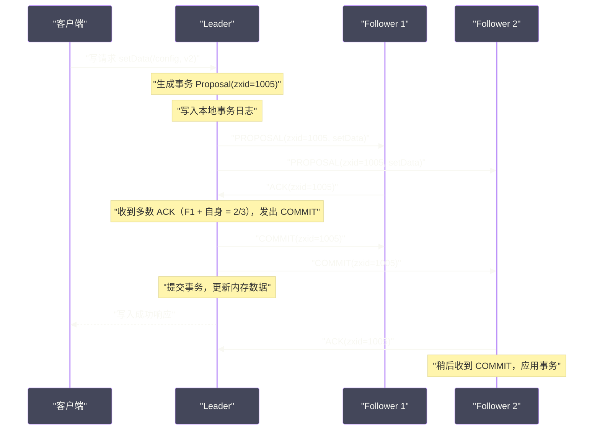

# 02 ZAB 协议——Leader 选举、崩溃恢复与消息广播

## 摘要

ZAB（ZooKeeper Atomic Broadcast，ZooKeeper 原子广播）是 ZooKeeper 的核心一致性协议，也是理解 ZooKeeper 可靠性与一致性保证的关键。ZAB 不是 [[ETCD|Paxos]] 的直接实现，它是 Yahoo 研究团队专门为 ZooKeeper 场景设计的协议，融合了 Paxos 的思想和 2PC（两阶段提交）的实现风格。

本文深入剖析 ZAB 的三个阶段：**Leader 选举**（Fast Leader Election 算法）、**崩溃恢复**（Leader 与 Follower 之间的数据同步）、**消息广播**（事务的两阶段提交）。理解 ZAB，是理解 ZooKeeper 为什么能提供顺序一致性、为什么 Leader 选举期间集群不可写、以及为什么在某些极端情况下 ZooKeeper 会丢失数据的关键。

---

## 第 1 章 ZAB 的背景：为什么不用 Paxos

### 1.1 Paxos 的问题所在

Paxos 是分布式一致性算法的鼻祖，由 Lamport 在 1989 年提出（论文直到 1998 年才发表）。Paxos 解决的问题是：在 N 个节点中，如何对**一个值**达成共识（允许 < N/2 个节点故障）。

但 ZooKeeper 需要的不是对单个值的共识，而是对**一系列操作**（即事务日志）达成有序的共识——"第 1001 次操作是 setData(/config, v1)，第 1002 次操作是 delete(/lock)"，这个操作序列的顺序必须在所有节点上完全一致。

将 Paxos 扩展为多值共识（Multi-Paxos）在理论上是可行的，但实现极为复杂。更重要的是，Paxos 原始论文只解决了"达成共识"的问题，对 Leader 宕机后的崩溃恢复、新 Leader 如何继承旧 Leader 的未完成事务等工程细节，几乎没有涉及。

Yahoo 的研究团队在实现 ZooKeeper 时，选择了设计一个新的协议——ZAB，专门为以下特性优化：
1. **有序广播**：事务必须按全局顺序广播给所有节点；
2. **主备模式**：通过单 Leader 串行化写入，避免多写冲突；
3. **崩溃恢复**：Leader 宕机后，新 Leader 能正确处理旧 Leader 遗留的未完成事务（提交或丢弃）。

### 1.2 ZAB vs Raft 的异同

ZAB 和 [[ETCD|Raft]] 都是专为工程实现设计的分布式共识协议，两者有高度的相似性（都是强 Leader 模型、都有 Term/Epoch 机制），主要区别如下：

| 维度 | ZAB | Raft |
|:---|:---|:---|
| **设计时间** | 2007（ZooKeeper 研发期间） | 2013（Ongaro 博士论文） |
| **Leader 选举** | Fast Leader Election（投票 + 最大 ZXID 优先） | Randomized Election Timeout + 日志完整性检查 |
| **日志复制** | 两阶段提交（PROPOSE + COMMIT） | 单阶段 AppendEntries（Majority ACK 后 commit） |
| **崩溃恢复** | 显式的数据同步阶段（DIFF/SNAP/TRUNC） | 新 Leader 通过 AppendEntries 隐式修复 Follower |
| **读一致性** | 允许读到旧数据（线性读需要 sync()） | 允许读到旧数据（线性读需要额外机制） |

两者在工程本质上非常相似，Raft 的可读性更高，ZAB 更贴近 ZooKeeper 的具体实现需求。

---

## 第 2 章 Fast Leader Election：选出最优的 Leader

### 2.1 选举的触发时机

ZAB 在以下情况下触发 Leader 选举：
1. 集群启动时，所有节点都没有 Leader；
2. Leader 节点崩溃或与超过半数 Follower 失去联系；
3. Follower 节点在 `initLimit × tickTime` 时间内没有收到 Leader 的心跳或任何消息（`initLimit` 默认 10，`tickTime` 默认 2000ms，即 20 秒超时进入选举）。

### 2.2 选票的数据结构

每张选票由以下字段组成：

```
Vote = (myid, zxid, epoch)
```

- **myid**：投票节点自身的唯一 ID（`zoo.cfg` 中配置的 `server.N` 中的 N）；
- **zxid**：投票节点已提交的最大事务 ID（即节点数据的"新鲜程度"）；
- **epoch**：当前选举轮次（类似于 Raft 的 Term，每轮选举递增）。

### 2.3 选举算法：最大 ZXID 优先

**Fast Leader Election** 的核心规则是：**在候选节点中，选择 ZXID 最大的节点当选 Leader**（ZXID 最大 = 数据最新 = 最有资格当 Leader）。如果 ZXID 相同，则选 myid 最大的。

选举流程：

```
1. 每个节点进入 LOOKING 状态，初始投票投给自己：Vote(myid=自己, zxid=自己当前最大ZXID, epoch=1)

2. 将自己的选票广播给所有其他节点

3. 收到其他节点的选票后，做"PK"比较：
   - 先比较 epoch：epoch 大的赢（保证投票在同一轮次）
   - epoch 相同，再比较 zxid：zxid 大的赢（数据更新的优先）
   - zxid 也相同，比较 myid：myid 大的赢（打破平局）
   
4. 如果对方的选票赢了自己，更新自己的选票为对方推荐的候选人，重新广播

5. 当某个候选节点获得超过半数（quorum）的选票后，当选为 Leader
```

**示例（3节点集群：node1, node2, node3）：**

假设 node3 当前 ZXID 最大（数据最新）：

```
初始选票：
  node1: Vote(1, zxid=100, epoch=1)  // 投自己
  node2: Vote(2, zxid=105, epoch=1)  // 投自己
  node3: Vote(3, zxid=110, epoch=1)  // 投自己

node1 收到 node2 的选票：zxid(105) > zxid(100)，更新为 Vote(2, 105, 1) 并广播
node1 收到 node3 的选票：zxid(110) > zxid(105)，更新为 Vote(3, 110, 1) 并广播
node2 收到 node3 的选票：zxid(110) > zxid(105)，更新为 Vote(3, 110, 1) 并广播

统计选票：
  node3 被投票数 = 3（node1, node2, node3都投了node3）→ 超过半数，node3 当选 Leader
```

### 2.4 为什么 ZXID 最大的节点当 Leader

这个规则保证了一个关键性质：**新 Leader 拥有集群中最完整的事务日志**。

在旧 Leader 崩溃之前，它可能已经将某些事务广播给了部分 Follower，但还未来得及提交。这些"已广播但未提交"的事务，在不同 Follower 上的存在状态可能不一致（有些 Follower 收到了，有些没收到）。

新 Leader 必须决定这些事务的命运：
- **如果事务已被半数以上节点接收**（即在旧 Leader 眼中应该提交的事务）：新 Leader 应该提交它，保证数据不丢失；
- **如果事务只被少数节点接收**（旧 Leader 还来不及提交就崩溃了）：新 Leader 应该丢弃它，保证集群一致性。

选 ZXID 最大的节点当 Leader，确保了新 Leader 包含了所有"应该被提交"的事务（因为这些事务已被半数以上节点接收，ZXID 最大的节点必然是其中之一），从而在崩溃恢复阶段能正确地提交或丢弃旧事务。

---

## 第 3 章 崩溃恢复：让集群重新达成一致

### 3.1 崩溃恢复阶段的目标

新 Leader 当选后，在开始处理新的写请求之前，必须先完成**崩溃恢复（Crash Recovery）**：让所有 Follower 与自己的数据完全一致。

崩溃恢复需要处理以下几种 Follower 状态：

1. **Follower 落后 Leader 若干个事务**：Follower 在 Leader 崩溃前没有收到某些事务，需要补同步（DIFF）；
2. **Follower 比 Leader 多出一些事务**：这发生在旧 Leader 向某些 Follower 发送了事务但还没提交就崩溃了，新 Leader 判定这些事务应该丢弃，需要让 Follower 截断（TRUNC）；
3. **Follower 与 Leader 差距太大**（落后太多事务，超出了 Leader 的事务日志范围）：全量快照同步（SNAP）。

### 3.2 三种数据同步模式

**DIFF（增量同步）**

最常见的情况。Follower 向 Leader 汇报自己的最大 ZXID，Leader 找出 Follower 缺少的事务，逐一发送给 Follower 重放。

```
Leader 日志：[1001, 1002, 1003, 1004, 1005]（已提交）
Follower A 日志：[1001, 1002, 1003]（缺少 1004, 1005）

Leader 向 Follower A 发送：DIFF(1004), DIFF(1005)
Follower A 重放事务，数据追上 Leader
```

**TRUNC（截断）**

Follower 持有比 Leader 更新的事务（这些是旧 Leader 未提交的事务），需要截断。

```
旧 Leader（已崩溃）日志：[1001, 1002, 1003, 1004*]（*表示未提交事务）
新 Leader（从 Follower 选出）日志：[1001, 1002, 1003]（未收到 1004）
Follower B 日志：[1001, 1002, 1003, 1004]（收到了旧 Leader 的 1004，但旧 Leader 未提交）

新 Leader 向 Follower B 发送：TRUNC(1004)
Follower B 删除 1004，回退到与 Leader 一致
```

**SNAP（快照同步）**

Follower 数据差距过大（ZXID 太旧），Leader 已经没有对应的差量日志，只能全量发送当前内存数据的快照。

```
新 Leader 当前数据快照 + ZXID=10000
Follower C 的 ZXID=5000（差距 5000 个事务，Leader 只保留最近 2000 个事务日志）

Leader 向 Follower C 发送完整内存快照
Follower C 清空数据，应用快照，从 ZXID=10000 开始
```

### 3.3 崩溃恢复完成的标志

当超过半数的 Follower 完成了与 Leader 的数据同步，Leader 才正式宣布"崩溃恢复完成"，开始接受新的写请求。这个半数限制确保了：即使此后 Leader 再次崩溃，下一任 Leader 仍然能从已同步的 Follower 中获取完整数据。

> [!note] 设计哲学
> 崩溃恢复阶段，集群是**不可写**的（Leader 选举期间也不可写）。这是 ZAB 为了保证强一致性而付出的代价——牺牲了短暂的可用性（AP vs CP 中偏向 CP）。生产中，Leader 选举 + 崩溃恢复通常需要 1~3 秒，极端情况（大量数据需要 SNAP 同步）可能需要数十秒甚至更长。

---

## 第 4 章 消息广播：正常运行时的事务处理

### 4.1 两阶段提交模型

崩溃恢复完成后，ZAB 进入正常运行模式——**消息广播（Message Broadcast）**。所有写操作通过以下两阶段提交流程处理：



**Phase 1 - PROPOSAL（提案）**：
1. Leader 为写请求分配全局唯一的 ZXID；
2. 将事务写入本地事务日志（WAL，类似于 Translog）；
3. 将 PROPOSAL 广播给所有 Follower；
4. Follower 接收 PROPOSAL，写入本地事务日志，返回 ACK 给 Leader。

**Phase 2 - COMMIT（提交）**：
1. Leader 收到**超过半数**（包括自身）的 ACK 后，将事务应用到本地内存，数据正式更新；
2. 广播 COMMIT 消息给所有 Follower；
3. Follower 收到 COMMIT 后，将对应事务应用到本地内存。

关键观察：**Leader 在收到半数 ACK 后就向客户端返回成功，不等待所有 Follower 的 COMMIT 确认**。这意味着在客户端收到成功响应的那一刻，可能仍有部分 Follower 还未应用这个事务——如果客户端随后连接到这些"落后"的 Follower 上读取数据，可能读到旧值。这就是 ZooKeeper **顺序一致性**（不是线性一致性）的来源。

### 4.2 FIFO 队列保证事务顺序

Leader 与每个 Follower 之间维护一个**独立的 FIFO 消息队列**，所有 PROPOSAL 和 COMMIT 消息都通过这个队列有序发送。

这保证了：
- 在同一个连接（Leader-Follower 队列）上，PROPOSAL 和 COMMIT 的顺序永远一致；
- Follower 不会收到"COMMIT(1005)"但还没收到"PROPOSAL(1005)"的情况；
- 事务的提交顺序在所有节点上完全一致（即使不同节点接收到 COMMIT 的时间略有差异）。

### 4.3 Leader 与 Follower 的心跳机制

正常广播阶段，Leader 定期向所有 Follower 发送 **PING**（心跳），Follower 回复 PONG。如果 Leader 在 `syncLimit × tickTime` 时间内（`syncLimit` 默认 5，`tickTime` 默认 2000ms，即 10 秒）没有收到某个 Follower 的任何响应，会将该 Follower 从 quorum 中移除。

反之，Follower 如果在 `syncLimit × tickTime` 内没有收到 Leader 的任何消息（PROPOSAL、COMMIT 或 PING），会认为 Leader 已崩溃，进入 LOOKING 状态，触发新一轮选举。

---

## 第 5 章 ZAB 的一致性保证与边界

### 5.1 ZooKeeper 提供的一致性级别

ZooKeeper 明确承诺**顺序一致性（Sequential Consistency）**，而不是更强的**线性一致性（Linearizability）**：

- **顺序一致性**：所有客户端看到的写操作顺序完全一致（全局顺序由 ZXID 确定），且每个客户端看到的自己的操作是有序的；
- **线性一致性**：在写操作完成后，任何后续读操作（无论来自哪个客户端、连接到哪个节点）都能立即看到最新值。

ZooKeeper **不提供线性一致性**——从 Follower 读可能读到稍旧的数据（在 COMMIT 消息到达之前）。如果需要线性读，需要在读前调用 `sync()`。

**ZooKeeper 承诺的完整一致性属性：**

| 属性 | 含义 |
|:---|:---|
| **顺序一致性** | 客户端的操作按发送顺序执行 |
| **原子性** | 操作要么成功要么失败，不存在部分成功 |
| **单一视图** | 客户端连接到任意节点，看到的数据版本不会"倒退" |
| **可靠性** | 已提交的事务不会丢失（除非超过半数节点同时故障） |
| **实时性（弱）** | Leader 最终会将已提交的事务同步给所有 Follower |

### 5.2 ZAB 无法防止的数据丢失场景

**场景：Leader 提交但 COMMIT 未传达**

Leader 提交了事务（已收到半数 ACK），向客户端返回成功，然后**在发送 COMMIT 给 Follower 之前崩溃**。

此时：
- 客户端认为写入成功；
- 只有 Leader 本身（和发送 ACK 的那些 Follower）应用了这个事务；
- 新 Leader 选举后，由于旧 Leader 已提交的事务 ZXID 最大，新 Leader 也是旧 Leader 本身（或持有该 ZXID 的 Follower）；
- 新 Leader 在崩溃恢复阶段会重新提交这个事务，数据不丢失。✅

**但是：**

如果旧 Leader 崩溃了，且持有该 ZXID 的所有节点都崩溃（超过半数节点同时故障），则选出的新 Leader 没有这个事务，数据丢失。这是 ZooKeeper（以及所有基于多数派的共识协议）的理论下界——超过半数节点同时故障，数据无法保证不丢失。

**场景：客户端的"幽灵读"**

在 Leader 选举期间，某个 Follower 成为新 Leader，它可能还没有旧 Leader 的最新写入。如果客户端在此期间连接到这个 Follower（新 Leader），可能会读到旧数据。这是 ZooKeeper **非线性一致性**的一个具体体现，使用 `sync()` 可以避免。

### 5.3 Observer 对一致性的影响

Observer 不参与 ZAB 协议的投票（不计入 quorum），因此：
- 写操作**不需要等待 Observer 的 ACK**，Observer 的存在对写延迟和写吞吐没有任何影响；
- Observer 的数据可能比 Leader 更落后（异步复制）；
- 如果客户端连接到 Observer 上读数据，可能读到更旧的值，甚至比从 Follower 读更旧。

在对数据新鲜度要求极高的场景（如分布式锁的状态检查），应该避免连接到 Observer 节点，或者在读前调用 `sync()`。

---

## 第 6 章 ZAB 的性能特性与生产调优

### 6.1 写入延迟分析

ZAB 的写入延迟由以下部分组成：

```
写入延迟 = 网络延迟(Leader→Follower PROPOSAL) 
         + Follower 磁盘 fsync 延迟（写事务日志）
         + 网络延迟(Follower→Leader ACK)
         + Leader 磁盘 fsync 延迟（写事务日志）
         + 处理时间
```

其中 **Follower 的磁盘 fsync 延迟**是最大的瓶颈。ZooKeeper 默认在每个 PROPOSAL 都要 fsync 事务日志（`forceSync=yes`），这确保了持久性，但也是写入延迟最大的来源。

**优化方案：**

- 将事务日志（dataLogDir）放在**专用 SSD** 上，避免与快照文件（dataDir）或 OS 竞争 IO；
- 使用 **RAID 1 SSD**（写延迟低 + 冗余）；
- 在对数据丢失容忍度较高的场景，可以关闭每次 fsync（`forceSync=no`，改为批量 fsync），写入吞吐可提升 10 倍，代价是节点宕机可能丢失最近几条事务。

### 6.2 tickTime 与超时配置

ZooKeeper 的所有超时时间都是 `tickTime` 的整数倍，`tickTime` 是 ZooKeeper 的基本时间单位（默认 2000ms）：

| 参数 | 默认值 | 含义 |
|:---|:---|:---|
| `tickTime` | 2000ms | 基本时间单位 |
| `initLimit` | 10 | Follower 启动时连接 Leader 并完成数据同步的超时（10 × tickTime = 20s） |
| `syncLimit` | 5 | 运行时 Leader-Follower 同步超时（5 × tickTime = 10s） |
| Session Timeout | client 协商 | 客户端 Session 超时，范围 [2×tickTime, 20×tickTime] = [4s, 40s] |

**跨数据中心部署的调优**：跨机房网络延迟通常在 10~50ms，需要相应增大 `tickTime`（如 5000ms）或 `initLimit`/`syncLimit`，避免正常的网络抖动触发不必要的 Leader 重选举。

### 6.3 集群规模：奇数节点的必要性

ZooKeeper 的 quorum 要求**超过半数**的节点存活。因此：

| 节点数 | quorum | 最大可容忍故障数 |
|:---:|:---:|:---:|
| 3 | 2 | 1 |
| 4 | 3 | 1 |
| 5 | 3 | 2 |
| 6 | 4 | 2 |

4 节点集群（quorum=3）和 3 节点集群（quorum=2）的容错能力相同（都只能容忍 1 个节点故障），但 4 节点需要额外的机器和网络开销。因此：**ZooKeeper 集群应使用奇数节点**。

大规模生产集群通常使用 **5 节点**（容忍 2 个故障，且在 Leader 选举期间只需 3 个节点存活即可完成选举）。对于更高的可用性需求，可以通过 Observer 扩展读能力，而不是增加 quorum 成员数（增加 quorum 成员数会使写入需要更多 ACK，降低写性能）。

---

## 小结

本文深入解析了 ZAB 协议的三个阶段：

- **Fast Leader Election**：选出 ZXID 最大的节点作为 Leader，确保新 Leader 拥有最完整的事务日志，是崩溃恢复正确性的基础；
- **崩溃恢复**：通过 DIFF/TRUNC/SNAP 三种同步模式，让所有 Follower 与新 Leader 达到数据一致，期间集群不可写；
- **消息广播**：两阶段提交（PROPOSAL + COMMIT），收到半数 ACK 后即可向客户端返回成功，FIFO 队列保证全局顺序。

ZooKeeper 提供的是**顺序一致性**而非线性一致性——读 Follower 可能读到旧数据，需要 `sync()` 来保证线性读。超过半数节点同时故障是 ZAB（以及所有多数派协议）的数据安全下界。

下一篇文章将在 ZAB 的基础上，介绍 ZooKeeper 最常见的工程应用场景：分布式锁、Leader 选举与服务发现。
