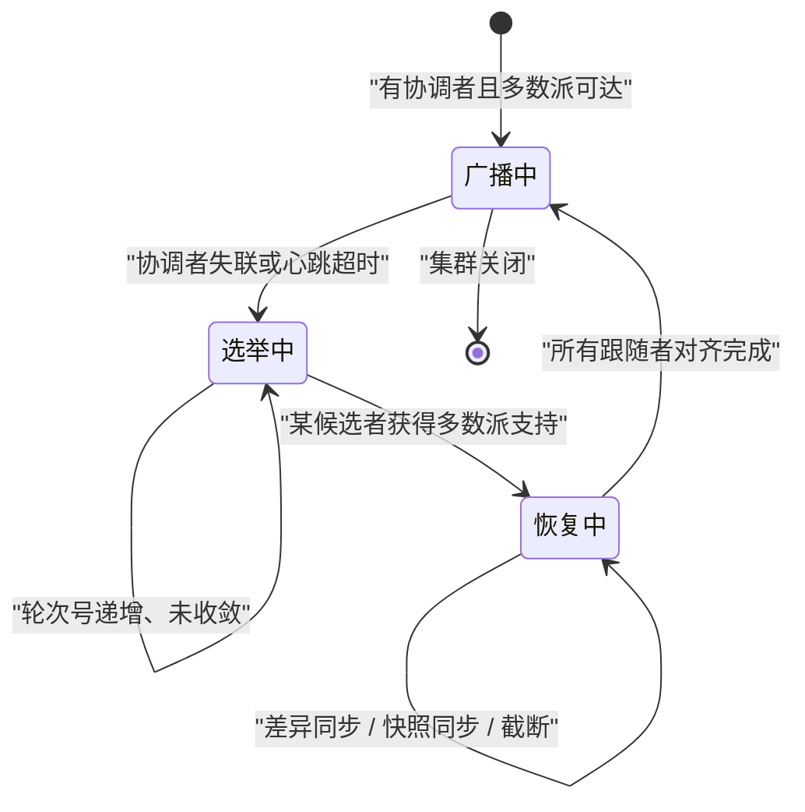

# 02 ZAB 协议——Leader 选举、崩溃恢复与消息广播

**摘要：**

ZAB 要解决的问题比"对单个值达成共识"更难：**它要对"一系列操作"达成有序的共识**——也就是"所有节点必须以完全相同的顺序执行同一批操作"。而它没有直接套用现成的共识算法，原因是"**现成算法只解决了'达成共识'，而对'协调者宕机后如何恢复'几乎没有涉及**"。因此它专门为三处工程需求做了设计：**有序广播**（全局顺序）、**单写者模式**（避免多写冲突）、**显式崩溃恢复**（新协调者如何处置旧协调者遗留的未完成事务）。本文按"为什么不用现成算法 → 选举 → 崩溃恢复 → 消息广播 → 顺序一致性"展开。先说明"需要的是有序共识而非单值共识"、现成算法的三处缺口、ZAB 的三条优化目标与它和 Raft 的异同。然后剖析选举的三个触发时机、选票的组成、选举规则与"数据最新者优先"这处判据的由来、以及"选举期间不可写"的原因。之后是崩溃恢复的三种数据同步方式与判断依据、消息广播的两阶段提交与"提交点位置"的选择。接着是顺序一致性的含义与它的两处边界。最后是边界反例与落点。

---

## 第 1 章 为什么不用现成的共识算法

### 1.1 需要的是什么

**这里需要的不是"对单个值达成共识"，而是"对一系列操作达成有序的共识"。**

**两者的差别值得说清**：**"单值共识'只需决定'某个值是什么'"**，**而"有序共识'还要决定'多个操作的先后顺序'"**——**而"顺序'恰恰是'状态机复制的关键'"**（因为"相同顺序'才能得到'相同状态'"）。

**因此"这里的核心要求是'全序'"**——**而"全序'意味着'任意两个操作都可以比较先后'"**——**而"这处全序'由'协调者的串行化写入'提供'"。

**一处补充是"全序的强度"**：**它"要求'任意两个操作都能比较先后'"**——**而"这比'局部有序'强得多'"**——**因此"实现成本也更高'"。** **但"它是'状态机复制'的最低要求'"**——**因为"只要有一对操作顺序不确定'，状态就可能分叉'"。**

**这条区分的实践含义是"理解这套协议'应当从'它要保证什么顺序'入手'"**——**而不是"从'它用了什么算法'入手"。** **这与第 14 篇讲的"共识只需保证顺序"是同一判断**：**"顺序一致'就足以保证'状态一致'"。

### 1.2 一处关于"协议与实现"的观察

**一处补充是"顺序与确定性的关系"**：**"全序'只是'必要条件'"**——**而"还需要'执行的确定性'"**——**也就是"相同输入与相同顺序'必然得到相同输出'"。** **因此"状态机复制'是'两处条件的组合'"**——**而"缺少任一条'都会'让副本分叉'"。**

**"协议规范与工程实现之间的距离"这处问题值得说明。**

**距离体现在三处**：**"规范描述了'正确性条件'，而实现要'满足这些条件'"**、**"规范不涉及'性能优化'，而实现必须优化"**、**"规范不涉及'运维接口'，而实现必须提供"**。

**三处距离的共同特征是"它们都是'从理论到可用'必须跨越的'"**——**而"跨越的方式'往往是'增加机制'"**——**例如"流水线、批量确认、快照"。

**因此"评估一个共识实现时'应当'同时看'它是否满足规范'与'它额外加了哪些机制'"**——**因为"后者'决定了'它在真实负载下的表现'"。** **这与第 15 篇讲的"机制与实现的区分"是同一判断**：**"规范给出边界，实现给出行为"。

### 1.3 现成算法的三处缺口

**现成的共识算法有三处缺口，而它们"恰好是本场景最需要的能力"。**

**缺口一：多值扩展复杂。** **把单值共识扩展为"多值共识'在理论上可行'"**——**但"实现极为复杂'"**——**而"复杂性'会直接转化为'缺陷风险'"。

**缺口二：崩溃恢复的工程细节缺失。** **原始论文"只解决了'达成共识'"，**而**"对'协调者宕机后'的处理'几乎没有涉及'"**——**例如"新协调者'如何处置'旧协调者遗留的未完成事务'"。

**缺口三：主备模式的语义未定义。** **"通过单写者串行化'避免多写冲突'"**这处模式"需要'明确的语义定义'"——**例如"写操作'何时算提交'"。

**三处缺口的共同特征是"它们都是'工程落地'层面的问题"**——**而"这类问题'在理论论文里'往往被忽略'"。** **因此"自己设计一个协议'是合理的工程选择'"。

### 1.4 ZAB 的三条优化目标

**ZAB 专门为三处需求做了设计。**

**第一处是"有序广播"**：**事务"必须按全局顺序广播给所有节点"**——**而"顺序由'协调者分配的事务标识'表达'"。

**第二处是"单写者模式"**：**通过"单协调者串行化写入'避免多写冲突'"**——**因此"它'不需要处理'并发写的冲突检测'"。

**第三处是"显式崩溃恢复"**：**"协调者宕机后'新协调者'能正确处理'旧协调者遗留的未完成事务'"**——**包括"提交或丢弃'"。

**三处目标的共同特征是"它们都在'简化实现'"**：**"单写者'消除了并发冲突"，**"显式恢复'把恢复逻辑集中在一处"**。** **因此"这套协议的设计哲学是'用'集中的写者'换取'实现的简单与可预测'"。** **这与第 19 篇讲的"用共识替代协调者"是相反方向的选择**：**"那里把协调交给协议，这里把协调集中到单一节点"。

### 1.5 与同类协议的异同

**它与另一套广泛使用的共识协议高度相似，而差别集中在四处。**

| 维度 | ZAB | 另一套协议 |
|---|---|---|
| 选举依据 | 投票加"数据最新者优先" | 随机超时加"日志完整性检查" |
| 日志复制 | 两阶段提交 | 单阶段追加（多数确认后提交） |
| 崩溃恢复 | 显式的数据同步阶段 | 通过追加隐式修复 |
| 读一致性 | 允许读到旧数据 | 允许读到旧数据 |

**这张表里最值得留意的是"日志复制"与"崩溃恢复"两行**：**"两阶段提交'比'单阶段追加'多一次往返'"**——**而"显式同步'比'隐式修复'更直接但需要额外逻辑"。

**而两者的共同点更多**：**"都是强协调者模型'"**、**"都有轮次号（纪元或任期）'"**、**"都需要多数派确认"**——**因此"理解其中一个'能大幅降低理解另一个的成本'"。

**这条对照的实用价值在于"它说明'共识协议的差异'往往在'工程细节'而非'理论本质'"**——**而"这些细节'恰恰决定了'系统的实际行为'"。

### 1.6 一个类比：会议纪要与发言人

**把这套协议类比成"会议记录流程"会更容易理解它的结构。**

**"同一时间只有一位发言人"对应"单写者模式"**——**因此"不需要'处理多人同时说话'"**——**而"这处简化的代价是'发言速度受限于一个人'"。

**"每句话都被编号并记录在案"对应"有序广播与全局事务标识"**——**因此"任何人回看记录'都能得到相同的顺序'"。

**"多数与会者确认听到后'才算正式记录'"对应"多数派确认"**。

**"发言人中途离场，需要重新推选"对应"选举"**——**而"推选规则是'最了解会议进展的人优先'"**——**这正是"数据最新者优先"的类比形态**。

**"新发言人上任后'要先核对'前任未完成的记录'"对应"崩溃恢复"**——**而"核对的结果'可能是'补记'或'作废'"。

**这个类比的用处在于"它把三处设计目标变成了可感知的流程约束"**：只能一人发言（单写者）、每句都要编号（全序）、换人时要核对记录（显式恢复）。**

---
## 第 2 章 选举

### 2.1 三个触发时机

**选举在三种情况下触发。**

**第一种是"集群启动时"**——**因为"此时所有节点都没有协调者'"。

**第二种是"协调者崩溃，或它与超过半数的跟随者失去联系"**——**因为"失去多数派联系'意味着'它无法再获得确认'"**——**因此"它'不能再安全地推进事务'"。

**第三种是"跟随者在规定时间内没有收到协调者的心跳或任何消息"**——**而"这处超时的取值'由'初始化时限与时间单位'共同决定'"**。

**三种触发时机的共同特征是"它们都表达'当前没有可用的协调者'"**——**而"这类'没有协调者'的状态'必须被尽快结束'"**——**因为"在此期间'集群不可写'"（第 2.5 节）。

### 2.2 选票的组成

**一张选票的核心内容是"推荐谁"与"推荐者的资历"。**

**具体包含三类信息**：**"推荐的候选者标识'"**、**"推荐者见过的最大事务标识'"**、**"推荐者所处的轮次号'"。

**"携带最大事务标识"这处设计很关键**：**因为"它让'接收方可以比较'谁的数据更新'"**——**而"比较的依据'是'事务标识而非'节点编号'"**。

**因此"选举规则'是'先比轮次，再比事务标识，最后比节点编号'"**——**而"这三层比较'保证了'选举结果是确定的'"**（也就是"所有节点'会得出同一个结论'"）。

**一处补充是"第三层比较的意义"**：**它"在'轮次与标识都相同时'用节点编号打破平局'"**——**因此"保证了'结论的完全确定性'"。** **而"这处兜底'虽然很少用到'"**——**但"缺少它'会让'极端情况下无法收敛'"。**

**这条"多层比较"的设计值得留意**：**"它用'逐层比较'替代了'复杂的协商'"**——**因此"每个节点'独立计算'就能得到相同结果'"。** **这与第 5 篇讲的"按优先级顺序匹配"是同一手法**：**"把复杂的决策'分解成'有序的比较'"。

### 2.3 一处关于"选举收敛"的观察

**"选举何时能收敛"这处问题值得说明，因为它决定了"不可写窗口的长度"。**

**收敛的条件是"某个候选者获得多数派支持'"**——**而"由于比较规则是确定的'"**，**所以"所有节点'会逐渐收敛到同一个候选者'"。

**收敛的速度取决于两处**：**"网络往返次数'"**（因为"每轮投票需要一次往返"）、**"初始分歧程度'"**（因为"分歧大则需要更多轮"）。

**而"轮次号的存在'保证了'分歧不会无限持续'"**：**因为"每轮选举'都会提升轮次号'"**——**而"轮次号更高的推荐'会覆盖更低的'"**——**因此"新一轮'必然打破上一轮的僵局'"。

**这处设计的通用性在于"它用'单调递增的轮次号'打破了'可能无限持续的协商'"**——**而"这类'用单调量打破僵局'的手法在共识协议里是标准做法'"。** **这与第 19 篇讲的"用多数派交集保证不丢数据"是同一层次的机制设计。

### 2.4 一处关于"多数派"的观察

**"多数派"这处概念值得展开，因为它同时承担了三处作用。**

**第一处作用是"确认写入"**：**"多数派确认'意味着'事务已提交'"。

**第二处作用是"保证不丢"**：**"任意两个多数派必有交集'"**——**因此"新协调者'必然见过'已提交的事务'"。

**第三处作用是"界定可用性"**：**"失去多数派联系'意味着'不能再安全写入'"**——**因此"少数派分区'会自动停止写入'"。

**三处作用的共同特征是"它们都由'同一个数量关系'推出"**——**而"这个数量关系'就是'多数派的定义'"。** **因此"理解多数派'就理解了'共识协议的可用性与正确性边界'"。

**这条观察的通用性在于"它说明'共识协议的三处性质'可以'从一处定义推出'"**——**而"这类'从单一定义推出多处性质'的设计'往往最稳固'"。** **这与第 14 篇讲的"多数派交集"是同一论证**：**"一个简单的不变量'支撑了整条正确性链'"。

### 2.5 "数据最新者优先"这处判据

**"数据最新者优先"这处规则值得单独说明，因为它是"不丢数据"的保障。**

**它的含义是"推荐'事务标识最大'的节点作为协调者"**——**因此"数据最全的节点'会当选'"。

**这处规则的意义在于"它保证了'新协调者'不会丢失'旧协调者已提交的事务'"**：**因为"已提交的事务'意味着'它被多数派接受过'"**——**而"多数派中'必然有节点'见过这个事务'"**——**因此"这些节点'会推荐'事务标识更大的候选者'"**——**而"最终当选者'必然'包含'这个事务'"。

**这条推理的关键在于"多数派交集"**：**"任意两个多数派'必然有交集'"**——**因此"新当选者的数据'必然覆盖'已提交事务'"**。** **这与第 14 篇讲的"多数派交集保证不丢数据"是同一论证。

### 2.6 一处关于"选举与心跳"的观察

### 2.7 一处关于"投票与推荐"的观察

**"投票"与"推荐"这两个动作的差别值得说明。**

**"推荐"是"节点'表达自己支持谁'"**——**而"它'携带了推荐者的资历信息'"。

**"投票"是"节点'认可某个候选者'"**——**而"它'是对'最终结论的确认'"。

**两者的关系是"推荐'是'信息交换'，投票'是'结论形成'"**——**而"多轮推荐'才'收敛出'投票结果'"。

**因此"选举过程'实际上是'一轮轮的'信息交换'"**——**而"每一轮'都让'各节点的认知更接近'"——**而"当'多数派的认知一致'时'选举完成'"。

**这条观察的通用性在于"它把'选举'理解为'分布式共识的一处特例'"**——**而"共识的本质'就是'让各方认知收敛'"。** **这与第 19 篇讲的"共识只需保证顺序"是同一层次的抽象**：**"共识机制'都可以'归结为'认知收敛'"。

**"选举超时"与"心跳间隔"这两处参数存在一处配合关系。**

**配合关系是"选举超时'必须显著大于'心跳间隔'"**——**否则"正常的心跳间隔'就会被'误判为失联'"**——**而"后果是'频繁误触发选举'"。

**因此"两者之间存在一个倍数关系'"**——**而"这处倍数'是'容忍心跳丢失的余量'"。

**这条配合关系与第 1 篇讲的"心跳间隔应小于对端超时阈值"是同一原则**：**"控制面参数之间'必须有明确的倍数关系'"。

**一条实践含义是"调优这两处参数时'应当同时调整'"**——**因为"只改一个'会破坏'它们之间的倍数关系'"——**而"这类'参数配合被破坏'的问题'表现为'选举频繁或故障感知迟钝'"。** **因此"参数调优应当成组进行'"**（第 6 篇已展开"相关参数必须成组配置"）。

**因此"这条规则的通用性在于'它把'不丢数据'转化成了'一条选举偏好'"**——**而"这处转化'让'正确性'由'选举机制'自动保证'"——**而"不需要'额外的数据校验'"。** **这类"把正确性内建到流程里"的设计，比"事后校验"更可靠。

**一处补充是"这处偏好的强度"**：**它"不保证'当选者的数据最全'"**——**而只保证"它'至少包含'所有已提交事务'"**——**因此"当选者'可能'还缺少'某些未提交事务'"——**而"这些'会在恢复阶段被补齐或丢弃'"。** **这处区分'是'理解恢复阶段必要性的前提'"。**

**一处补充是"轮次号与事务标识的关系"**：**两者都是单调递增的**——**但轮次号由选举产生，事务标识由协调者分配**——**因此前者表达"谁在主持"，后者表达"事务顺序"。** **两处单调量共同支撑了整套协议的确定性。**

### 2.8 选举期间为什么不可写

**"选举期间集群不可写"这处性质值得说明，因为它容易被当作"缺陷"。**

**原因在于"此时没有'能获得多数派确认的协调者'"**——**而"写操作'必须经过多数派确认'"**——**因此"没有协调者'就无法完成写'"。

**而"为什么必须等选举完成"的答案是"只有选出协调者'才能确定'事务的全局顺序'"**——**因为"顺序由协调者分配'"**——**因此"没有协调者'就没有顺序'"。

**因此"这处不可写'不是缺陷，而是'单写者模式的必然结果'"**——**而"它的代价'是'选举期间的服务中断'"。** **这处取舍与第 14 篇讲的"多数派确认的可用性代价"是同一类**：**"共识机制'必然在'分区或选举时'牺牲可用性"。

**一处补充是"不可写窗口的长短由两处决定"**：**"选举收敛的轮数"**与**"恢复同步的数据量"**——**而"两处的优化方向不同'"（第 3.6 节）。** **因此"缩短不可写窗口'应当'先量化这两处各占多少'"。**

**一条实践含义是"选举超时'应当'按'能容忍的中断时长'设置'"**——**因为"它直接决定'故障后的不可写时长'"**。** 而"设置过短'会导致'频繁误触发选举'"（因为"网络抖动'会让节点误以为协调者失联"）。

### 2.9 一处关于"选举风暴"的观察

**"频繁选举"这处问题值得说明，因为它"会让集群长期不可用"。**

**问题的来源是"选举超时设得过短，或'各节点的超时相同'"**——**因此"网络抖动'会让'多个节点同时认为协调者失联'"**——**而"它们'同时发起选举'"——**而"选举本身'又产生额外的网络流量'"——**因此"加剧抖动'并触发更多选举"。

**这处正反馈的形态与第 6 篇讲的"重试放大加剧故障"是同一类**：**"恢复动作本身'可能加剧问题'"。

**因此"缓解方式有两处"**：**"适当增大选举超时'"**、**"让各节点的超时'带有随机性'"**（因此"避免同时触发"）。

**这条观察的通用性在于"它说明'基于超时的机制'需要'防同时触发'"**——**而"加入随机性是'最简单有效的去同步手段'"。** **这与第 5 篇讲的"心跳间隔应留出余量"是同一类**：**"超时参数'需要'考虑集群层面的相互作用'"。

---

**一处补充是"两种同步的恢复时长差异"**：**逐条补发的时长与落后量成正比**，**而快照传输的时长与快照大小成正比**。** 因此"落后量很大时，快照的时长与落后量无关"**——**而"这处与量无关的性质，正是快照在大落后场景下更优的原因"。**

## 第 3 章 崩溃恢复

### 3.1 三种数据同步方式

**新协调者上任后要与跟随者做数据同步，而同步有三种方式。**

**第一种是"差异同步"**：**它"只发送'跟随者缺失的那部分事务'"**——**因此"它'适用于'跟随者只落后少量事务'的情况'"。

**第二种是"快照同步"**：**它"发送'整个数据快照'"**——**因此"它'适用于'跟随者落后太多、逐条补发不划算'的情况'"。

**第三种是"截断"**：**它"要求'跟随者丢弃'它多出来的、未被提交的事务'"**——**因此"它'适用于'跟随者包含了'旧协调者未提交的事务'的情况'"。

**三种方式的共同特征是"它们都在'把跟随者对齐到协调者的状态'"**——**而"差别在'从哪个起点对齐'与'是否需要对端丢弃数据'"。

### 3.2 如何判断用哪种

**判断的依据是"跟随者与协调者的事务标识之间的关系"。**

**具体判断逻辑是**：**"如果跟随者的最后一个标识'小于协调者已提交的最大标识'"**，**那么"用差异同步或快照同步补上'"**；**"如果跟随者的最后一个标识'大于协调者的已提交标识'"**，**那么"它包含了'未提交的事务'"**——**因此"必须截断"。

**这处判断的关键是"区分'已提交'与'未提交'"**——**因为"未提交的事务'可能'被新协调者提交'，也可能'被丢弃'"**——**而"截断'就是'丢弃'的处理方式'"。

**因此"判断的依据'不是'谁的数据多'，而是'谁的数据包含了已提交的部分'"**——**而"这处区分'正是'显式崩溃恢复'的核心'"。** **这与第 15 篇讲的"恢复需要唯一判据"是同一判断**：**"只有'能确定提交状态'才能决定'保留还是丢弃'"。

### 3.3 一处关于"快照同步"的观察

### 3.4 一处关于"同步期间的可见性"的观察

**"同步期间节点能否服务读请求"这处问题值得说明。**

**答案取决于"同步的进度"**：**"尚未对齐的节点'不能'提供读服务'"**——**因为"它的数据'可能与全局不一致'"**——**因此"它'会被'暂时排除在服务之外'"。

**因此"恢复期间'集群的可用读容量'会下降'"**——**而"这处下降'与'落后节点的数量'成正比'"。

**一条实践含义是"恢复期间'读延迟可能上升'"**——**因为"剩余节点'要承担'原本由落后节点承担的读流量'"——**而"这处连锁'容易被误判为'独立的性能问题'"。** **因此"排查'恢复期间的性能抖动'时'应当'先确认'是否有节点正在同步'"。

**这条观察的通用性在于"它说明'故障恢复本身'也是一处'负载变化源'"**——**而"这类'由恢复引起的抖动'需要'被识别而非被优化'"。** **这与第 4 篇讲的"预热期间负载不均"是同一类**：**"系统的状态变化'会带来'负载分布的临时变化'"。

**"快照同步"这处方式值得单独说明，因为它涉及"数据量与网络开销的权衡"。**

**它的形态是"发送整个数据快照，而不是逐条补发事务'"**——**而"选择的依据是'逐条补发的开销'与'快照传输的开销'哪个更小'"。

**因此"判断的临界点是'落后的事务数量'"**：**"落后少量'则逐条补发更省'"**，**"落后大量'则快照更省'"。

**一处补充是"快照同步的额外收益"**：**它"顺带'压缩了'日志的历史'"**——**因此"同步完成后'该节点的日志'也从'很长的历史'变成'从快照之后开始'"。** **这处收益'让'快照同步'不只是'恢复手段'，也是'空间回收手段'"。**

**这处权衡的通用性在于"它体现了'增量与全量之间的经典取舍'"**：**"增量'省带宽但需要'追踪差异'"**，**"全量'简单但开销大'"。** **这与第 4 篇讲的"全量重建优于增量更新"是同一类取舍**：**"在'差异大'的场景下，全量反而更划算"。

**一处实践含义是"快照同步期间'节点仍然落后'"**——**因此"它的时长'直接影响'故障恢复的总时长'"**——**而"这处时长'取决于'快照大小与网络带宽'"。** **因此"快照的大小'是'恢复时间的关键因素'"**（第 4 篇会展开快照的生成与压缩）。

### 3.5 一处关于"截断"的观察

**"截断"这处操作值得单独说明，因为它是"唯一会主动丢弃数据的操作"。**

**它的形态是"要求跟随者'删除'它多出来的事务'"**——**而"这些事务'是'旧协调者广播了但未提交的'"。

**这处操作的必要性在于"它们'没有被多数派确认'"**——**因此"它们'在一致性上不存在'"**——**而"保留它们'会让'该节点与全局状态不一致'"。

**因此"截断不是'丢失数据'，而是'丢弃从未生效的操作'"**——**而"这处区分很重要"**：**因为"把'未提交操作的丢弃'当作'数据丢失'"会'让人对一致性产生错误的担忧'"。

**这条观察的通用性在于"它区分了'已提交'与'已广播'两种状态"**——**而"只有'已提交'才'具有一致性意义'"。** **这与第 12 篇讲的"只有提交点之后的状态才是确定的"是同一判断**：**"提交点'是'状态确定性的分界'"。

### 3.6 为什么必须显式恢复

**"为什么必须有显式的恢复阶段"这个问题值得回答。**

**原因是"旧协调者'可能'在广播途中宕机'"**——**因此"部分节点'收到了事务'，部分没有'"——**而"这些事务'处于'已广播但未提交'的中间状态'"。

**而"如果不做显式恢复，这些中间状态'会被如何处理'是未定义的'"**——**因此"不同节点'可能得出不同结论'"——**而"这'会破坏'一致性'"。

**因此"显式恢复的作用是'用一个明确的规则'决定'中间状态事务的最终归属'"**——**而"这处规则'保证了'所有节点得出相同结论'"。

**一处补充是"这处规则的具体形式"**：**它"比较跟随者与协调者的事务标识"**——**而"标识更大的一方'掌握'更新的信息'"——**因此"决策方向'由'标识比较'唯一确定'"。** **这类"用比较替代协商"的做法'让恢复变成'纯本地计算'"。**

**这条必要性的通用性在于"它说明'分布式协议的恢复必须有唯一判据'"**——**而"没有唯一判据的恢复'只能靠猜测'"。** **这与第 15 篇讲的"崩溃恢复的判据唯一性"是同一原则**：**"恢复的正确性'依赖'判据的唯一性'"。

### 3.7 一处关于"恢复时间"的观察

**"恢复时间由什么决定"这处问题值得量化，因为它"直接影响不可用时长"。**

**决定因素有三处**：**"选举收敛的轮数'"**、**"同步的数据量'"**、**"网络带宽"**——**而"三者的量级不同"**：**"选举通常在毫秒到秒级"，"同步'可能到分钟级（快照很大时）'"。

**因此"恢复时间的主要构成'往往是'同步阶段'"**——**而"这解释了'为什么减小快照'比'调优选举超时'对恢复时间的收益更大'"。

**一处补充是"这处判断的验证方式"**：**"在恢复过程中'分别记录'选举耗时与同步耗时'"**——**而"两处的量级差异'通常很明显'"。** **因此"优化前先测量'能避免'优化了占比小的部分'"。**

**一条实践含义是"排查'恢复慢'时'应当先看'快照大小与传输耗时'"**——**而不是"先怀疑选举参数"**——**因为"后者的量级通常小得多'"。

**这条观察的通用性在于"它强调'先量化各阶段耗时，再决定优化方向'"**——**而"凭直觉优化'往往'优化了占比小的部分'"。** **这与第 4 篇讲的"瓶颈会随优化转移"是同一判断**：**"先定位瓶颈，再优化"。

---

**一处补充是"流水线的深度"**：**它受"内存与对端处理能力"限制**——**因此不能无限加深。** **而深度的选择是"吞吐与资源占用"的取舍。**

## 第 4 章 消息广播

### 4.1 两阶段提交

**消息广播采用两阶段方式，而两阶段"分别解决'提议'与'提交'"。**

**第一阶段是"提议"**：**协调者"把事务广播给所有跟随者'"**——**而"跟随者'把它写入本地日志并回复确认'"。

**第二阶段是"提交"**：**当"收到多数派确认后'，协调者'广播提交指令'"**——**而"跟随者'收到后'才真正应用这个事务'"。

**两阶段的共同特征是"它们都在'推进事务的最终状态'"**——**而"差别在'第一阶段的产出是'已持久化但未生效''，第二阶段的产出是'已生效'"。

**这处两阶段的结构与第 12 篇讲的"内部两阶段提交"形态相同但用途不同**：**"那里的参与者是'日志与引擎'"，"这里的参与者是'多个节点'"。

### 4.2 提交点的位置

**"提交点在哪一步"这处选择值得说明，因为它决定了"何时算成功"。**

**提交点是"多数派确认之后"**——**也就是说"协调者在收到多数派确认时'就可以认为事务已提交'"**——**而"提交指令的广播'只是'让跟随者应用它'"。

**这处选择的收益是"提交的延迟'只需一次多数派往返'"**——**而"不需要'等提交指令也确认一轮'"。

**因此"提交点的位置'决定了'写延迟的下界'"**——**而"把它放在'多数派确认'处'是'延迟与安全性的平衡点'"。

**这条设计的通用性在于"它体现了'提交点决定延迟下界'"**——**而"调整提交点'是'共识协议优化延迟的常见手段'"。** **这与第 19 篇讲的"两阶段提交的必要往返数"是同一类**：**"提交协议的结构'决定了'延迟的下限'"。

### 4.3 一处关于"批量与延迟"的观察

**"批量提交"这处优化值得说明，因为它是"吞吐与延迟取舍"的典型。**

**它的形态是"把'多个事务打包'一起广播与确认'"**——**因此"每次往返'推进多个事务'"**——**而"吞吐提升'。

**而它的代价是"延迟增加"**：**因为"一个事务'可能需要'等待同批其他事务就绪'"**——**因此"它'被'批次的等待时间'延迟'"。

**因此"批量的取舍是'用'单事务延迟'换'整体吞吐'"**——**而"批大小的选择'取决于'负载特征'"**：**"请求稀疏'则批量收益小"，"请求密集'则批量收益大"。

**这条取舍与第 7 篇讲的"组提交摊薄固定成本"是同一手法**：**"把'固定的往返成本'摊到'多个请求'上'"。** **而"两者的代价也一致"**：**"都是'用延迟换吞吐'"。

### 4.4 一处关于"顺序保证"的观察

**"顺序如何保证"这处问题值得展开。**

**保证方式有两处**：**"协调者'为每个事务分配递增标识'"**（因此"全序'由分配顺序决定"）、**"跟随者'严格按标识顺序应用事务'"**（因此"本地应用顺序'与'全局顺序'一致"）。

**两处保证的配合效果是"所有节点'以相同顺序应用相同事务'"**——**因此"最终状态'必然相同'"。

**而"如果跟随者'乱序应用'"**，**后果是"本地状态'与全局状态不一致'"**——**而"这类不一致'在'后续依赖前序状态的操作'上会放大'"。** **因此"顺序的应用'不是优化，而是正确性要求'"。

**这条观察的通用性在于"它把'状态机复制'归结为'顺序一致加确定性执行'"**——**而"两者缺一不可'"。** **这与第 14 篇讲的"状态机复制的两条哲学"是同一处。

---

**一处补充是"提交点的另一处含义"**：**它"同时是'恢复时的分界'"**——**因为"只有'提交点之后的状态'才是确定的'"**——**因此"恢复'只需要'从提交点开始推理'"。** **这处双重含义'让'提交点成为整套协议里最关键的单一概念'"。**

**一处补充是"确认与提交的时序关系"**：**确认'先于'提交'"**——**而"提交指令'可能'与后续事务的确认并行'"。** **这处并行'正是'流水线的基础'"**——**因此"分离不仅让提交点灵活，还让'流水线成为可能'"。**

## 第 5 章 顺序一致性

### 5.1 它的含义

**"顺序一致性"的含义是"所有客户端'看到的所有更新'顺序相同"。**

**它的准确含义值得说明**：**它"不要求'所有客户端同时看到更新'"**——**而"只要求'它们看到的顺序一致'"。

**因此"它允许'读落后'"**——**也就是"某个客户端'可能还没看到最新更新'"**——**但"它'不会看到'顺序错乱的更新'"。

**这条性质与第 1 篇讲的"读可能读到稍旧数据"是配套的**：**"读落后'是可接受的"，**"顺序错乱'是不可接受的'"。

### 5.2 两处边界

**顺序一致性有两处边界值得说明。**

**边界一：它不提供"实时性"**——**因此"读到旧数据'是正常的'"**——**而"需要'读到最新'时必须'显式同步'"（第 1 篇已展开）。

**边界二：它不提供"跨客户端的因果顺序"**——**也就是说"一个客户端'基于自己读到的值'做出的写入'"**——**而"另一个客户端'可能先看到'这个写入'，后看到'它依赖的那个值'"。

**因此"如果业务需要'因果顺序'，必须在应用层'显式建立依赖'"**——**例如"把'依赖的值'也写进'同一个事务'"。

**两处边界的共同特征是"它们都源于'顺序一致性弱于线性一致性'"**——**而"理解这处强弱关系'能避免'对一致性的过度期待'"。** **这与第 12 篇讲的"隔离级别的边界"是同一类**：**"不同的一致性级别'覆盖不同的保证范围'"。

### 5.3 一处关于"客户端视角"的观察

**"客户端如何观察顺序一致性"这处问题值得说明。**

**观察方式是"通过事务标识'"**——**因为"每个更新'都对应一个递增的标识'"**——**因此"客户端'可以通过比较标识'判断'自己读到的状态有多新'"。

**这处能力的用途是"判断'读是否落后'"**——**而"如果'需要读到最新'，可以'先同步再读'"**（第 1 篇已展开）。

**因此"事务标识'既服务于'协议内部的一致性'"**——**也服务于"客户端'判断自己的读新鲜度'"**——**而"这类'一个标识服务两处用途'的设计'在长期演进的系统里很常见'"。** **这与第 3 篇讲的"启动时间戳既用于注册也用于预热"是同一形态**。

### 5.4 一处关于"一致性保证的层次"的观察

**"一致性保证有几个层次"这处问题值得梳理，因为它"界定了系统的能力边界"。**

**第一层是"顺序一致"**：**"所有客户端看到的更新顺序相同'"。

**第二层是"读自己写"**：**"客户端能读到'自己刚写入的值'"**——**而"这处保证'需要'显式同步'才能获得'"。

**第三层是"线性一致"**：**"读能读到'最新的已提交值'"**——**而"这处保证'这套机制不提供'"。

**三层的关系是"逐层增强'"**——**而"每增强一层'都需要'额外的成本'"**。

**因此"选择哪一层'取决于'业务的实际需求'"**——**而"默认只提供第一层'，是因为'它成本最低且覆盖多数场景'"。** **这与第 19 篇讲的"一致性方案的选择应当回到业务容忍度"是同一判断**：**"默认低要求、按需提升'是最经济的设计'"。

---

---

**一处补充是"两层保证的配合"**：**顺序一致'保证'状态不分叉'"**——**而"读自己写'保证'用户的直觉不被打破'"。** **两者覆盖的是'不同的主体'"**——**"前者面向'副本之间'，后者面向'单个客户端'"。** **因此"它们不能互相替代'"。**

## 第 6 章 生产落地

### 6.1 可观测的信息

**与这套协议相关的可观测信息有四类。**

**第一类是"角色与轮次"**：**它回答"当前谁是协调者、处于第几个轮次'"**——**而"轮次频繁变化'意味着'选举频繁触发'"。

**第二类是"多数派的连通性"**：**它回答"协调者能否联系到足够多的跟随者'"**——**而"这处信息'能提前预警'可用性风险'"。

**第三类是"同步进度"**：**它回答"是否有节点正在追赶、落后多少'"**——**而"它'能解释'恢复期间的性能变化'"。

**第四类是"延迟构成"**：**它回答"提交延迟中'网络与排队各占多少'"**——**而"它'能区分'拓扑问题'与'负载问题'"。

**四类信息的层次是"从状态到连通性到进度到延迟"**——**而"按这个顺序看'能从'集群是否正常'逐步定位到'具体瓶颈在哪'"。

**一处补充是"四类信息的告警价值"**：**"多数派连通性'最适合做'提前预警'"**——**因为"它在真正不可用之前就会下降"。** **因此"把连通性纳入核心告警项'能'把故障发现提前"。**

**一处补充是"四类信息的采集成本不同"**：**"角色与轮次'最易采集'"**，**"延迟构成'最需要额外埋点'"。** **因此"应当'从成本低的信息开始建立观测'"**——**而"不要'一开始就追求完整的延迟分解'"。**

### 6.2 一次"集群频繁选举"的排查推演

把"集群频繁选举"这类问题串成一次推演。

假设现象是"集群'每隔几分钟就出现一次不可写窗口'，而'节点本身都很健康'"。

**第一步，确认"选举超时与心跳间隔的倍数关系"。** **因为"倍数不足'会让'正常心跳延迟'被误判为失联'"**——**因此"先核对这两个参数是否成组配置"。

**第二步，确认"是否存在'网络抖动或垃圾回收停顿'"。** **因为"长停顿'会让节点'错过心跳'"**——**而"这类停顿'在日志或监控里'通常有痕迹'"。

**第三步，确认"多数派是否跨了高延迟的网络域"。** **因为"跨域延迟'会让'心跳往返时间'接近'选举超时'"**——**因此"容错余量被压缩"。

**第四步，确认"是否有节点'负载过高导致处理心跳变慢'"。** **因为"心跳处理'与其他请求'共享资源'"**——**而"过载'会让'心跳响应延迟'"（第 5 篇已展开这处耦合）。

**第五步，确认"各节点的选举超时是否'完全相同'"。** **因为"完全相同'会让'多个节点同时发起选举'"**——**而"这'会放大抖动'"（第 2.5 节）。

**五步的价值在于"它把'频繁选举'分解成'参数倍数、网络停顿、跨域延迟、节点负载、去同步'五处"**——**而"这五处恰好是'影响心跳及时性'的各个环节'"。** **因此"理解'心跳的完整路径'，也就得到了这类问题的排查框架'"。

### 6.3 一处关于"部署拓扑"的经验

**"部署拓扑"这处决策值得单独说明，因为它"同时影响写延迟与容灾范围"。**

**决策的核心是"多数派落在哪里"**：**"全部在同一机房'则写延迟最低，但'该机房故障时集群不可用'"**；**"跨机房分布'则容灾范围更大，但'写延迟显著上升'"。

**因此"这处决策'是'延迟与容灾的直接取舍'"**——**而"它'没有折中方案'"（因为"多数派必须集中在低延迟域内才能有好的写性能"）。

**一处补充是"折中的可能形式"**：**"把多数派放在'同城两个低延迟机房'"**——**因此"它'既能容忍'单机房故障'，又'保持较低延迟'"。** **而"这处折中的代价'是'容灾范围仍受限于同城'"**——**因此"跨城容灾'只能'通过应用层的多集群方案实现'"。**

**一条实用的判断方式是"先明确'能接受的写延迟上限'与'必须容忍的故障范围'"**——**而"两者往往不能同时满足'"——**因此"需要'在两者之间做明确的取舍，而不是'试图兼顾'"。

**这条经验的通用性在于"它揭示了'共识系统的物理约束'"**——**而"这类约束'由'光速与多数派定义'共同决定'"**——**因此"它'无法通过软件优化消除'"。** **这与第 14 篇讲的"组复制的网络拓扑影响"是同一判断**：**"共识的延迟下界'由物理距离决定'"。

### 6.4 一处关于"参数调优"的经验

**"参数调优"这处工作值得收敛一下，因为它是"最容易造成次生问题"的一类操作。**

**调优的三条纪律**：**"成组调整'"**（因为"相关参数必须保持倍数关系"）、**"小步调整'"**（因为"效果是统计性的"）、**"调整后观测'"**（因为"没有观测就无法验证"）。

**三条纪律的共同特征是"它们都在'降低调优的风险'"**——**而"违反任一条'都会'把调优变成引入故障'"。

**而"共识协议的参数'尤其敏感"**：**因为"它们'直接影响'选举与心跳'"**——**而"这两处'一旦出问题'会让'整个集群不可写'"**。

**因此"共识协议的参数调优'应当在'测试环境充分验证后'再上生产'"**——**而"验证的内容'应当包括'故障注入'"**（第 1.7 节）。

**这条经验的通用性在于"它把'参数调优'从'经验操作'变成了'有纪律的流程'"**——**而"这类'高风险操作'都应当'有明确的流程约束'"。** **这与第 7 篇讲的"治理配置变更后应当验证"是同一类**：**"高风险配置的变更'必须有验证环节'"。

---

**一处补充是"读落后的量级"**：**它"通常只有'几个事务'"**——**而"这处量级'让'读落后在多数场景下可忽略'"。** **因此"默认不提供实时一致性'是'经济的选择'"**——**而"只有'确实需要'时才付'同步的代价'"。**

## 第 7 章 边界与反例

### 7.1 反例一：把"选举期间不可写"当作"缺陷"

它是"单写者模式的必然结果"（第 2.4 节）。

### 7.2 反例二：把"选举超时"当作"越短越好"

过短会导致"选举风暴"（第 2.5 节）。

### 7.3 反例三：把"数据多的节点"当作"一定当选"

判据是"事务标识"而非"数据量"，**而"包含未提交事务的节点会被截断"**（第 3.2 节）。

### 7.4 反例四：把"崩溃恢复"当作"可以省略"

"没有唯一判据的恢复只能靠猜测"（第 3.3 节）。

### 7.5 反例五：把"提交指令"当作"提交点"

提交点是"多数派确认"，**提交指令只是"让跟随者应用"**（第 4.2 节）。

### 7.6 反例六：把"顺序一致性"当作"线性一致性"

它"不提供实时性"，**读落后是正常的**（第 5.2 节）。

### 7.7 反例七：把"跟随者乱序应用"当作"只是慢一点"

"乱序会破坏本地状态与全局状态的一致性"（第 4.3 节）。

---

**一处补充是"三个阶段的衔接关系"**：**"选举的产出是'一个协调者'"**，**"恢复的产出是'所有节点对齐'"**，**"而广播'在两者都完成之后'才开始'"。** **因此"三个阶段的顺序'是由'各自的前提条件'决定的'"**——**而"颠倒顺序'会让'后续阶段缺少必要的前提'"。**

## 第 8 章 落点

回到开头：**为什么不用现成的共识算法？**

**因为"需要的是有序共识，而现成算法只解决了单值共识"**——**且"它在'崩溃恢复的工程细节'上留了缺口"**——**因此"自己设计一个'为工程落地优化'的协议是合理的"。

**而这套协议最值得记住的一条设计是"数据最新者优先"**：**它"把'不丢数据'这处正确性要求'转化成'一条选举偏好'"**——**而"正确性'由'多数派交集'自动保证'"——**而"不需要'额外的校验机制'"。** **这类"把正确性内建到流程里"的手法，比"事后校验"更可靠。**

**另一条判断是"显式恢复必须有唯一判据"**：**"旧协调者可能留下'已广播但未提交'的中间状态'"**——**而"处理它'只能靠'一个明确的规则'"**——**而"没有规则'就只能靠猜测'"。** **因此"设计恢复逻辑时'第一步是'确定判据'"。

**最后一条判断值得留下：这套协议里"不可写窗口"是"单写者模式的必然代价"。** **"选举期间'没有协调者'就没有全局顺序'"**——**而"没有顺序'就无法安全地写'"**——**因此"这处不可写'不是可以消除的缺陷，而是'必须被接受的代价'"。** **而"降低它的方式'只能是'调优选举超时'，而不是'取消单写者'"。

### 8.1 协议三阶段的整体关系

把选举、恢复、广播三阶段的关系画在一起，能看清"它们如何覆盖'从故障到恢复'的全过程"。

**图中最值得注意的是"选举中有一个自循环"**——**它表示"选举可能经历多轮才收敛'"**——**而"每一轮'都会提升轮次号'"**——**因此"自循环'必然终止'"。

**另一处值得注意的是"恢复完成才回到广播中"**：**因此"不可写窗口'等于'选举加恢复的总时长'"**——**而"这处时长'是'故障恢复能力的直接度量'"。

**这张图的实用价值在于"它把'故障恢复'分解成'两个阶段'"**——**而"两个阶段的优化方向不同"**：**"选举'靠'调优超时与去同步'"**，**"恢复'靠'减小快照与提升带宽'"。** **因此"排查'恢复慢'时'应当先判断'慢在哪一阶段'"。

---

**还有一处判断值得留下：这套协议的"确定性"来自"两处单调量"**：**"轮次号"保证"新旧协调者的决策可区分"**，**"事务标识"保证"事务的全序可比较"**——**而"两处单调量'共同支撑了'恢复的唯一判据"。** **因此"设计共识协议时'应当'先确定'哪些量需要单调递增'"**——**因为"它们是'确定性的基础'"。**

**最后一条判断值得留下：这套协议里"不可写窗口"是"单写者模式的必然代价"。** **"选举期间没有协调者就没有全局顺序"**——**而"没有顺序就无法安全地写"**——**因此"这处不可写不是可以消除的缺陷，而是必须被接受的代价"。**

## 专栏导航

- 上一篇：[[01 ZooKeeper 全局架构——数据模型与会话机制]]。
- 下一篇：[[03 分布式锁与 Leader 选举的工程实现]]。
- 返回专栏首页：[[00 专栏导览]]。

---

## 参考资料

1. Apache ZooKeeper 源码：`zookeeper-server/src/main/java/org/apache/zookeeper/server/quorum/`、`.../quorum/FastLeaderElection.java`、`.../quorum/Leader.java`、`.../quorum/Follower.java`、`.../quorum/LearnerHandler.java`。
2. Apache ZooKeeper. 官方文档：ZAB 协议与一致性保证. https://zookeeper.apache.org/doc/current/zookeeperInternals.html
3. Junqueira F P, Reed B C, Serafini M. Zab: High-performance broadcast for primary-backup systems. DSN 2011.
4. Ongaro D, Ousterhout J. In search of an understandable consensus algorithm (Raft). USENIX ATC 2014.
5. Lamport L. The part-time parliament (Paxos). ACM TOCS 1998.
6. Apache ZooKeeper. 官方文档：集群配置与选举参数（initLimit/syncLimit/tickTime）. https://zookeeper.apache.org/doc/current/zookeeperAdmin.html
7. Apache ZooKeeper. GitHub 仓库与发布说明. https://github.com/apache/zookeeper

---

> [!note] 思考题
> 1. "对一系列操作达成有序共识"比"对单个值达成共识"多了哪一处要求？为什么这处要求是状态机复制的关键？
> 2. "数据最新者优先"这处选举规则，为什么能保证不丢已提交的数据？它的推理依赖什么？
> 3. 崩溃恢复的三种方式分别适用于什么情况？判断依据为什么是"事务标识"而不是"数据量"？
> 4. 提交点为什么放在"多数派确认"处而不是"提交指令也确认一轮"？这处选择决定了什么？
> 5. 顺序一致性与线性一致性的差别是什么？为什么读落后是可接受的？
