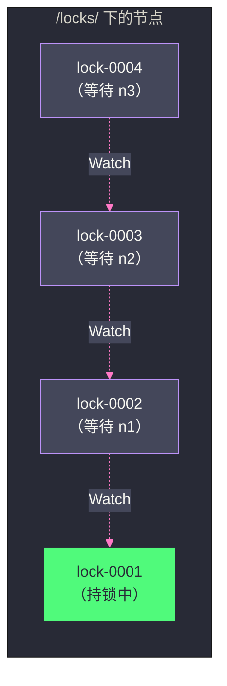

# 03 分布式锁与 Leader 选举的工程实现

## 摘要

ZooKeeper 的临时节点、有序节点和 Watcher 机制，是构建分布式协调原语的"乐高积木"。本文深入拆解三个最核心的工程应用：**分布式锁**（如何用临时有序节点实现公平锁、如何避免"羊群效应"）、**Leader 选举**（如何确保任意时刻只有一个 Leader）、**服务注册与发现**（如何实现动态服务列表维护）。每个实现都从"朴素方案的问题"出发，逐步推导出正确的设计，最后给出生产级别的 Curator 框架实现。

---

## 第 1 章 分布式锁：从朴素方案到公平锁

### 1.1 为什么需要分布式锁

在单机环境中，Java 的 `synchronized`、`ReentrantLock` 等机制可以保证同一 JVM 内的线程互斥访问共享资源。但在分布式环境中，多个节点（JVM 进程）可能同时尝试修改同一个共享资源（数据库记录、文件、外部 API 配额），单机锁完全无效。

分布式锁的要求：
1. **互斥性**：任意时刻，只有一个节点持有锁；
2. **不死锁**：持锁节点宕机后，锁必须能被其他节点获取（不能永远等待）；
3. **可重入性**（可选）：同一节点可以多次获取同一把锁；
4. **公平性**（可选）：锁的获取顺序与请求顺序一致（先来先得）。

### 1.2 朴素方案：用临时节点实现互斥

最直觉的分布式锁实现：

```java
// 加锁：尝试创建临时节点 /locks/my-lock
try {
    zk.create("/locks/my-lock", data, ACL, CreateMode.EPHEMERAL);
    // 创建成功 = 获得锁
} catch (KeeperException.NodeExistsException e) {
    // 节点已存在 = 锁被其他节点持有，等待
}

// 释放锁：删除临时节点
zk.delete("/locks/my-lock", -1);
```

临时节点的存在天然保证了"不死锁"——持锁节点宕机后，其 Session 超时，临时节点自动删除，锁被释放。

但这个方案有一个严重问题：**羊群效应（Herd Effect）**。

假设有 100 个节点都在等待锁，当锁被释放（临时节点删除）时，所有 100 个节点同时收到 Watcher 通知，同时尝试创建 `/locks/my-lock`。ZooKeeper 服务端承受 100 个并发创建请求的冲击，但最终只有 1 个成功，其余 99 个失败并重新注册 Watcher……然后下次释放时又是 99 个并发冲击。

这种雪崩式的并发竞争就是"羊群效应"——大量等待者被同一个事件同时唤醒，绝大多数的唤醒都是无效的，白白消耗了 ZooKeeper 的资源。

### 1.3 公平锁：用临时有序节点消除羊群效应

正确的分布式锁实现利用**临时有序节点**：

**加锁流程：**

```
1. 在 /locks/ 下创建临时有序节点：/locks/lock-0000000001, /locks/lock-0000000002...
   （每个竞争者都能成功创建，序号递增）

2. 查询 /locks/ 下的所有子节点，排序

3. 如果自己创建的节点序号最小 → 获得锁

4. 如果不是最小 → 找到比自己序号小的"前一个"节点，对它注册 Watcher
   （只监听前一个节点，而非监听锁节点本身）

5. 等待 Watcher 通知（前一个节点被删除）

6. 收到通知后，回到步骤 2 重新检查
```

**释放锁：**

```
删除自己创建的临时有序节点
```

**关键创新：每个等待者只监听序号比自己小一位的节点**，而不是监听同一个"锁节点"。

效果：当某个节点释放锁（删除自己的节点），ZooKeeper 只触发一个 Watcher 通知——序号紧随其后的那个等待者。这个等待者检查自己是否成为序号最小的节点，如果是则获得锁。整个过程中，没有"同时唤醒所有等待者"的情况，彻底消除了羊群效应。



**这同时实现了公平性**：锁的获取顺序严格按照节点创建顺序（序号顺序），即等待时间最长的节点优先获得锁。

### 1.4 一个边界情况：序号乱序问题

上面的方案有一个微妙的边界情况需要处理。

步骤 4 中，"找到比自己序号小一位的前一个节点"，如果这个前一个节点在你注册 Watcher 之前已经被删除了怎么办？

这种情况完全可能发生：
- 你调用 `getChildren` 获取子节点列表，看到前一个节点 `lock-0002` 存在；
- 在你调用 `exists("/locks/lock-0002", watcher)` 之前，`lock-0002` 已被删除；
- 你对 `lock-0002` 注册的 Watcher 会收到 `NodeCreated` → `NodeDeleted` 事件... 不对，`exists` 对于已删除的节点会返回 `null`（节点不存在），而不是注册一个等待节点被删除的 Watcher。

正确处理：

```java
// 对前一个节点调用 exists，注册 Watcher
Stat stat = zk.exists("/locks/lock-0002", myWatcher);
if (stat == null) {
    // 前一个节点不存在（已被删除），重新检查所有节点
    // 重新 getChildren，可能自己已经是最小节点了
    recheckLockOwnership();
} else {
    // 正常等待 Watcher 通知
    waitForNotification();
}
```

这个"发现前一个节点已消失，重新检查"的逻辑，确保了在任何并发情况下都能正确工作。

### 1.5 Curator 的 InterProcessMutex

生产中，强烈建议使用 **Apache Curator** 框架提供的 `InterProcessMutex`，而不是手写上述逻辑。Curator 已经处理了所有边界情况（Session 过期重建、节点乱序、Watcher 丢失等）：

```java
CuratorFramework client = CuratorFrameworkFactory.newClient(
    "zk-host:2181",
    new ExponentialBackoffRetry(1000, 3)
);
client.start();

InterProcessMutex lock = new InterProcessMutex(client, "/locks/my-resource");

try {
    // 尝试获取锁，超时 10 秒
    if (lock.acquire(10, TimeUnit.SECONDS)) {
        try {
            // 执行被保护的业务逻辑
            doProtectedWork();
        } finally {
            lock.release();
        }
    } else {
        // 超时，未获得锁
        handleLockTimeout();
    }
} catch (Exception e) {
    handleError(e);
}
```

Curator 的 `InterProcessMutex` 内部使用的正是临时有序节点 + 监听前一节点的方案，同时支持：
- **可重入**：同一线程/进程可以多次 `acquire`，内部维护重入计数器；
- **公平性**：按请求顺序排队；
- **自动清理**：Session 过期后临时节点自动删除，不会死锁。

> [!warning] 生产避坑
> **分布式锁的 `acquire` 超时不等于锁不存在**。当网络发生抖动，`acquire` 调用超时返回 `false`，但实际上创建临时有序节点的操作可能已经成功（服务端已创建，只是 ACK 未到达客户端）。此时客户端认为没有获得锁而放弃，但 ZooKeeper 中已经存在该节点，会阻塞真正的锁持有者。
>
> Curator 通过在节点数据中写入"创建者标识"来解决这个问题——在 `acquire` 成功后，通过读取节点数据验证自己是否是创建者。如果发现 ZooKeeper 中已有自己之前创建的节点，视为获锁成功。

---

## 第 2 章 Leader 选举：确保唯一主节点

### 2.1 Leader 选举的本质

很多分布式系统需要一个"主节点"（Leader/Master）来做中央协调：[[Kafka]] 的 Controller、HDFS 的 NameNode HA、分布式任务调度器的 Master。这些系统的共同需求：

- **唯一性**：任意时刻只有一个节点是 Leader；
- **高可用**：Leader 宕机后，其他节点能快速感知并选出新 Leader；
- **一致性**：所有节点对"谁是当前 Leader"有统一认知。

Leader 选举本质上是一种特殊的分布式锁——持有"Leader 锁"的节点就是 Leader。

### 2.2 基于临时节点的简单选举

**方案一：抢占式选举（非公平，适合快速 HA 场景）**

```
所有候选节点尝试创建 /election/leader 临时节点：
- 创建成功 → 当选 Leader
- 创建失败（节点已存在）→ 成为 Follower，对 /election/leader 注册 Watcher
- Leader 宕机 → 临时节点消失 → 所有 Follower 同时收到通知，重新抢占
```

问题：这是羊群效应的另一个版本——Leader 宕机时所有 Follower 同时抢占。

**方案二：基于临时有序节点的公平选举**

与分布式锁完全类似：所有候选节点在 `/election/` 下创建临时有序节点，序号最小的当选 Leader，其他节点监听比自己序号小一位的节点。

```
/election/candidate-0000000001 → Leader
/election/candidate-0000000002 → 监听 candidate-0000000001
/election/candidate-0000000003 → 监听 candidate-0000000002
```

当 Leader 宕机（临时节点消失），只有 `candidate-0000000002` 收到通知，`candidate-0000000002` 检查自己是序号最小的节点，当选新 Leader。整个过程只需 1 个节点响应，无羊群效应。

### 2.3 Leader 宕机后的脑裂风险

Leader 选举存在一个微妙的时间窗口问题：

1. 旧 Leader 与 ZooKeeper 的网络暂时断开（但旧 Leader 本身未宕机，仍在处理请求）；
2. ZooKeeper Session 超时，旧 Leader 的临时节点被删除；
3. 新 Leader 当选，开始接受请求；
4. 旧 Leader 的网络恢复，它以为自己还是 Leader，继续处理请求。

此时出现了**两个 Leader 同时运行**的局面——分布式系统中的"脑裂"（Split-Brain）。

**解决方案：Fencing（隔离）**

旧 Leader 在执行任何操作前，必须验证自己仍然是 Leader（通过读取 ZooKeeper 的 Leader 节点数据，确认自己的标识还在）。但由于网络问题刚恢复，这个验证本身可能存在延迟。

更可靠的做法是**Epoch 机制**：Leader 在选举时，在 ZooKeeper 节点数据中写入自己的 Epoch（递增的版本号）。所有操作都附带当前 Epoch。当一个节点检测到收到的请求 Epoch 小于当前 Epoch，直接拒绝该请求（说明发出请求的是旧 Leader）。

Kafka 的 Controller 选举正是采用了这种机制——Controller Epoch 存储在 ZooKeeper 中，每次 Controller 重新选举时递增。所有 Broker 拒绝来自旧 Controller Epoch 的请求，确保即使旧 Controller"僵尸复活"，其指令也会被忽略。

### 2.4 Curator 的 LeaderSelector

Curator 提供了 `LeaderSelector`，封装了 Leader 选举的完整逻辑：

```java
LeaderSelector selector = new LeaderSelector(client, "/leader-election", new LeaderSelectorListenerAdapter() {
    @Override
    public void takeLeadership(CuratorFramework client) throws Exception {
        // 这个方法被调用时，当前节点已成为 Leader
        System.out.println("我是 Leader，开始工作...");
        
        try {
            // 执行 Leader 的工作，这个方法返回时会自动放弃 Leader 身份
            doLeaderWork();
        } catch (InterruptedException e) {
            Thread.currentThread().interrupt();
        }
        // 方法返回后，Curator 会将 Leader 身份交给下一个候选节点
    }
});

// 自动重新参与选举（方法返回后重新排队）
selector.autoRequeue();
selector.start();
```

`LeaderSelector` 的语义是：`takeLeadership()` 方法运行期间，当前节点是 Leader。方法返回后，自动放弃 Leader 身份，等待下一次轮到自己。

---

## 第 3 章 服务注册与发现

### 3.1 ZooKeeper 作为注册中心

ZooKeeper 的临时节点 + Watcher 机制天然支持服务注册与发现：

- **服务提供方**：启动时在 ZooKeeper 特定路径下创建临时节点，将自己的地址写入节点数据；宕机后 Session 超时，临时节点自动删除（自动注销）；
- **服务消费方**：通过 `getChildren` 获取服务提供方列表，注册 Watcher 监听子节点列表变化（`NodeChildrenChanged`）；收到通知后重新获取服务列表，更新本地缓存的可用地址列表。

```
/services/
  /services/user-service/
    /services/user-service/192.168.1.1:8080   ← 临时节点（server A）
    /services/user-service/192.168.1.2:8080   ← 临时节点（server B）
  /services/order-service/
    /services/order-service/192.168.1.3:8080  ← 临时节点（server C）
```

### 3.2 服务发现的完整实现

```java
public class ServiceRegistry {
    private final CuratorFramework client;
    private final String basePath;

    // 服务注册：创建临时节点
    public void register(String serviceName, String address) throws Exception {
        String path = basePath + "/" + serviceName + "/" + address;
        // EPHEMERAL 节点：进程退出时自动删除
        client.create()
              .creatingParentsIfNeeded()
              .withMode(CreateMode.EPHEMERAL)
              .forPath(path, address.getBytes());
    }

    // 服务发现：获取服务列表并监听变化
    public List<String> discover(String serviceName) throws Exception {
        String path = basePath + "/" + serviceName;
        
        List<String> addresses = client.getChildren()
            .usingWatcher((CuratorWatcher) event -> {
                if (event.getType() == EventType.NodeChildrenChanged) {
                    // 重新获取服务列表（递归调用或通知上层）
                    updateServiceList(serviceName);
                }
            })
            .forPath(path);
        
        return addresses;
    }
}
```

### 3.3 服务发现的挑战：短暂不一致窗口

ZooKeeper 的 Watcher 是一次性的，且通知不携带数据——服务消费方收到"服务列表变化"通知后，必须重新调用 `getChildren` 获取最新列表。

在"通知到达"到"重新 `getChildren`"之间，可能又发生了新的变化。例如：

```
t=0: 消费方缓存：[Server A, Server B]
t=1: Server B 下线，Watcher 触发通知
t=2: Server C 上线
t=3: 消费方收到通知，调用 getChildren，得到 [Server A, Server C]
```

这个逻辑是正确的——消费方最终看到了最新的列表 `[Server A, Server C]`。但在 t=1 到 t=3 之间，消费方的缓存 `[Server A, Server B]` 是过时的，可能将请求路由到已经下线的 Server B。

这个"短暂不一致窗口"在工程中通常通过以下方式缓解：
1. **客户端重试**：当请求发送到某地址失败时，从服务列表中移除该地址并重试；
2. **心跳探活**：消费方定期主动探活服务列表中的地址，不仅依赖 ZooKeeper 的通知；
3. **优雅下线**：服务在停止前，先从 ZooKeeper 注销（删除临时节点），等待一段时间（让所有消费方更新缓存）后再停止接受请求。

### 3.4 Dubbo 对 ZooKeeper 的使用

[[Dubbo]] 是 ZooKeeper 在中国互联网领域最广泛的使用场景之一。Dubbo 使用 ZooKeeper 作为注册中心，其路径结构为：

```
/dubbo
  /com.example.UserService              ← 接口名
    /providers                           ← 提供者目录
      /dubbo://192.168.1.1:20880/...    ← 临时节点（服务提供者地址 + 配置）
    /consumers                           ← 消费者目录
      /consumer://192.168.1.5/.../...   ← 临时节点（消费者地址）
    /configurators                       ← 配置覆盖目录
    /routers                             ← 路由规则目录
```

Dubbo Consumer 在启动时：
1. 在 `/providers` 路径下注册 Watcher，监听服务提供方列表变化；
2. 调用 `getChildren("/providers")` 获取所有提供者地址，构建本地服务列表；
3. 将自己注册到 `/consumers` 路径（可选，用于运维监控）。

当某个 Provider 宕机，其 Session 超时，对应的临时节点消失，Consumer 收到 `NodeChildrenChanged` 通知，自动刷新服务列表，剔除宕机的 Provider。整个过程完全自动化，无需人工干预。

---

## 第 4 章 配置中心的实现

### 4.1 基于 ZooKeeper 的配置中心

配置中心是 ZooKeeper 最经典的应用场景之一。核心需求：
- 配置在 ZooKeeper 中集中存储；
- 配置变更后，所有订阅的应用节点能在秒级感知并更新本地配置，无需重启。

实现模式：

```
持久节点 /config/app-a/database.url = "jdbc:mysql://..."
持久节点 /config/app-a/feature.new_ui = "true"
```

应用启动时：
1. 读取 `/config/app-a/` 下的所有配置（通过 `getChildren` 获取 key 列表，再逐一 `getData` 读取 value）；
2. 对每个配置节点注册 `getData` Watcher；
3. 收到 `NodeDataChanged` 通知后，重新读取对应配置，更新本地配置缓存。

### 4.2 配置热更新的原子性问题

当一次配置变更涉及多个节点时（如同时修改数据库 host 和 port），ZooKeeper 的写操作是单节点的，无法原子更新两个节点。

**解决方案一：将相关配置合并为一个节点**

将 `database.host` 和 `database.port` 合并为 `database.config`（JSON 格式），单次 `setData` 原子更新，消费方收到一次通知，读取新的 JSON 解析出所有配置。

**解决方案二：使用版本号协调**

使用一个专门的"版本节点" `/config/app-a/version`，每次配置变更后，先更新所有子配置节点，最后更新版本号节点。消费方只监听版本号节点，收到通知后批量读取所有配置——此时所有子配置已经更新完毕。

### 4.3 ZooKeeper 配置中心 vs 专业配置中心

ZooKeeper 作为配置中心虽然可行，但与专业配置中心（如 Apollo、Nacos、[[ETCD]]）相比有明显差距：

| 维度 | ZooKeeper | Apollo/Nacos | ETCD |
|:---|:---|:---|:---|
| **配置版本管理** | 需自己实现 | ✅ 内置版本历史 | 有限支持 |
| **灰度发布** | ❌ 不支持 | ✅ 原生支持 | ❌ 不支持 |
| **配置回滚** | 需自己实现 | ✅ 一键回滚 | 需自己实现 |
| **Web 管理界面** | 第三方 | ✅ 内置 | ✅ 内置（etcdkeeper） |
| **高级权限控制** | 基础 ACL | 细粒度权限 | 基于 RBAC |
| **写入吞吐** | 低（所有写经 Leader）| 中等 | 高 |

ZooKeeper 更适合作为**其他分布式系统内部**的协调服务（如 Kafka 集群内部的 Controller 选举），而不是作为面向应用开发者的通用配置中心。后者建议使用专业工具。

---

## 第 5 章 Curator 框架：生产级 ZooKeeper 客户端

### 5.1 原生 ZooKeeper API 的痛点

原生 ZooKeeper Java 客户端（`org.apache.zookeeper.ZooKeeper`）有很多工程痛点：

1. **Session 过期处理复杂**：需要手动处理 `SessionExpiredException`，重建 Session 后需要重新创建所有临时节点、重新注册所有 Watcher；
2. **Watcher 是一次性的**：每次收到通知后必须手动重新注册，容易遗漏；
3. **异步 API 回调嵌套**：原生 API 的异步调用容易形成回调地狱；
4. **没有重试机制**：网络抖动导致的操作失败需要自己实现重试逻辑；
5. **没有高级原语**：分布式锁、Leader 选举等需要从头实现，且正确性难以保证。

### 5.2 Curator 的架构分层

Curator 由 Netflix 开源，后来成为 Apache 顶级项目，分层架构如下：

```
┌─────────────────────────────────────────┐
│   curator-recipes（高级食谱）            │
│   InterProcessMutex, LeaderSelector,    │
│   PathChildrenCache, NodeCache...       │
├─────────────────────────────────────────┤
│   curator-framework（ZooKeeper 封装）    │
│   自动重连, 重试策略, 命名空间...          │
├─────────────────────────────────────────┤
│   curator-client（原生客户端封装）        │
│   连接管理, 事件处理...                  │
├─────────────────────────────────────────┤
│   ZooKeeper 原生客户端                   │
└─────────────────────────────────────────┘
```

### 5.3 Curator 的核心 Recipes

**NodeCache：持续监听单个节点变化**

```java
NodeCache cache = new NodeCache(client, "/config/database.url");
cache.getListenable().addListener(() -> {
    ChildData data = cache.getCurrentData();
    if (data != null) {
        String newConfig = new String(data.getData());
        updateDatabaseConfig(newConfig);
    }
});
cache.start(true); // true = 立即加载初始数据
```

`NodeCache` 内部自动处理 Watcher 的重新注册和 Session 重建后的节点重新监听，屏蔽了原生 API 的复杂性。

**PathChildrenCache：监听子节点列表变化**

```java
PathChildrenCache cache = new PathChildrenCache(client, "/services/user-service", true);
cache.getListenable().addListener((curatorClient, event) -> {
    switch (event.getType()) {
        case CHILD_ADDED:
            onServiceAdded(new String(event.getData().getData()));
            break;
        case CHILD_REMOVED:
            onServiceRemoved(new String(event.getData().getData()));
            break;
        case CHILD_UPDATED:
            onServiceUpdated(new String(event.getData().getData()));
            break;
    }
});
cache.start(StartMode.BUILD_INITIAL_CACHE); // 预加载所有子节点数据
```

`PathChildrenCache` 将"监听子节点"这个复杂操作封装为简洁的事件监听模型，内部维护子节点数据的本地缓存，消费方无需手动调用 `getChildren` 和 `getData`。

**TreeCache：监听整棵子树的变化**

`TreeCache` 是 `PathChildrenCache` 的递归版本，监听某路径下**所有后代节点**的变化。适合配置中心场景（监听某应用的所有配置变化）。

---

## 第 6 章 ZooKeeper 的局限性与替代方案

### 6.1 ZooKeeper 的固有局限

随着云原生时代的到来，ZooKeeper 的一些固有限制变得越来越明显：

**写吞吐有上限**：所有写请求经过 Leader 串行化，典型写入吞吐在 **10,000~30,000 ops/s**，无法水平扩展写能力。对于高频写入的场景（如百万级 Kubernetes Pod 的状态更新），ZooKeeper 会成为瓶颈。

**Java 实现的运维复杂性**：ZooKeeper 是 Java 应用，依赖 JVM，GC Pause 可能导致 ZooKeeper 心跳超时，触发不必要的 Leader 重选举。在容器化（Docker/Kubernetes）环境中，JVM 的内存管理与容器的 cgroup 限制之间的交互也是常见坑点。

**数据量受限于内存**：ZooKeeper 的数据全量保存在内存中，节点数量和数据大小受限于可用内存。在 Kubernetes 场景中，数以万计的资源对象（Pod、Service、ConfigMap）无法全部存入 ZooKeeper。

**Kubernetes 转向 ETCD**：Kubernetes 选择 [[ETCD]] 而非 ZooKeeper 作为其控制面存储，主要原因：ETCD 是 Go 实现（无 GC Pause 问题）、gRPC Watch 机制比 ZooKeeper Watcher 更高效、ETCD 的数据模型更适合 Kubernetes 的 API 对象存储。

### 6.2 什么时候仍然应该使用 ZooKeeper

尽管 ETCD 在很多新场景取代了 ZooKeeper，以下情况 ZooKeeper 仍然是更好的选择：

- **已有依赖 ZooKeeper 的生态系统**：Kafka（尽管新版 KRaft 正在去 ZooKeeper 化）、HBase、HDFS 的 NameNode HA 等大数据组件深度依赖 ZooKeeper，如果你的技术栈以这些组件为主，ZooKeeper 是最自然的选择；
- **Java 生态友好**：Curator 框架成熟度极高，与 Spring 生态集成完善；
- **成熟的运维经验**：ZooKeeper 已有超过 15 年的生产验证，故障模式和调优方法论极为成熟。

---

## 小结

本文梳理了 ZooKeeper 最核心的三类工程应用：

- **分布式锁**：临时有序节点 + 监听前一节点，彻底消除羊群效应，实现公平无死锁的分布式锁；Curator 的 `InterProcessMutex` 是生产级实现；
- **Leader 选举**：与分布式锁同构，序号最小的节点持有 Leader 身份；需要配合 Epoch 机制防止脑裂；Curator 的 `LeaderSelector` 封装了完整逻辑；
- **服务发现**：临时节点注册 + `PathChildrenCache` 监听子节点变化，实现动态服务列表；短暂不一致窗口通过客户端重试和心跳探活缓解。

Curator 框架解决了原生 ZooKeeper API 在工程使用中的主要痛点（Session 重建、Watcher 重注册、重试等），是生产中的标配。

下一篇文章将深入 ZooKeeper 的数据持久化机制——事务日志（WAL）与快照（Snapshot）的格式与恢复流程。

---

> [!note] 思考题
> 1. ZooKeeper 的 Watch 是一次性的——触发后需要重新注册。在重新注册期间可能错过事件。Curator（ZooKeeper 的高级客户端库）的 TreeCache 和 PathChildrenCache 自动处理 Watch 的重新注册——但仍有极小的窗口可能错过事件。这种'事件丢失'在什么场景下会导致问题？如何设计应用逻辑来容忍偶尔的事件丢失？
> 2. ZooKeeper 的 Watch 通知只告诉客户端'数据变了'而不告诉'变成了什么'——客户端收到通知后需要再读取一次获取新值。这种设计减少了通知的数据量但增加了一次往返。与 etcd 的 Watch（直接推送新值）相比，哪种设计更高效？
> 3. 在一个有 1000 个客户端同时 Watch 某个 ZNode 的场景中，ZNode 更新时需要通知所有客户端——这种'扇出'的网络开销可能导致 ZooKeeper 服务器压力大增。如何减少 Watch 的数量？是否应该使用'事件总线'模式（少数客户端 Watch ZooKeeper，然后通过消息队列扇出给其他客户端）？
