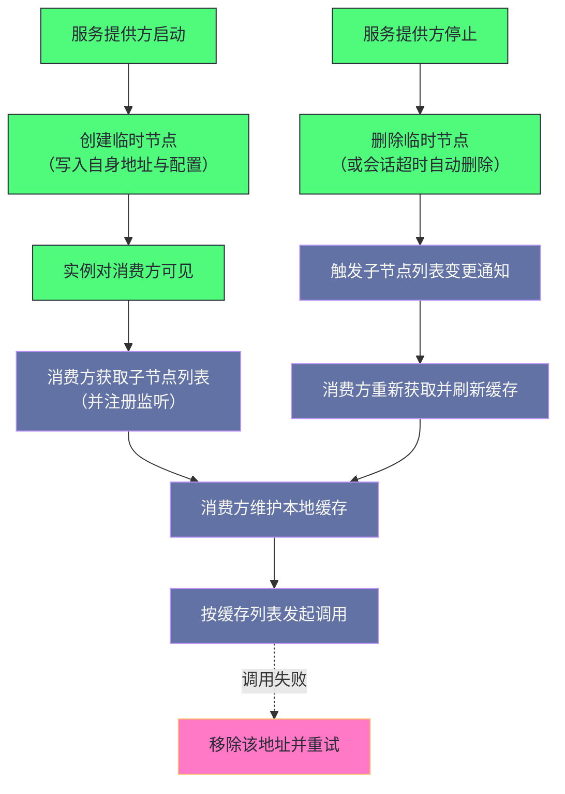

# 03 分布式锁与 Leader 选举的工程实现

**摘要：**

前两篇讲的四个核心概念是"积木"，而本篇讲"如何用它们搭出三样东西"：**分布式锁、选主、服务发现**。而这三样东西的推导过程有一条共同的线索：**"朴素方案总会在规模下暴露同一个问题——羊群效应"**，而解法也总是一样的——**"把'所有人都监听同一个节点'改成'每个人只监听自己的前驱'"**。这条改动同时解决了三件事：**消除了并发冲击、实现了公平性、并把通知数量从"一次变更唤醒所有人"降到"一次变更唤醒一个人"。** 本文按"分布式锁 → 选主 → 服务注册与发现 → 配置中心 → 生产级客户端 → 局限与替代"展开。先说明分布式锁的四个要求、朴素方案的羊群效应、公平锁的解法与"前驱已消失"这处边界。然后讲选主的两种方案、脑裂风险与纪元机制。之后是服务注册发现的机制与"短暂不一致窗口"的三处缓解、以及一个真实框架的用法。接着是配置中心的两处原子性问题与它和专业方案的差距、生产级客户端解决的五类痛点。最后是固有局限、边界反例与落点。

---

## 第 1 章 分布式锁

### 1.1 四个要求

**分布式锁有四个要求，而"前两个是必需的，后两个是加分项"。**

**要求一：互斥性。** **任意时刻'只有一个节点持有锁'"**。

**要求二：不死锁。** **持锁节点宕机后'锁必须能被其他节点获取'"**——**因为"不能永远等待'"。

**要求三：可重入性（可选）。** **同一节点'可以多次获取同一把锁'"。

**要求四：公平性（可选）。** **锁的获取顺序'与请求顺序一致'"**——**也就是"先来先得'"。

**四个要求的共同特征是"它们都在'定义一个'可靠的互斥机制'"**——**而"前两个要求'恰好对应了'临时节点的两处性质'"**：**"互斥性'来自'节点唯一'"**，**"不死锁'来自'节点随会话失效'"。** **因此"临时节点'天然满足前两个要求'"。

### 1.2 朴素方案与羊群效应

**最直觉的方案是"用一个临时节点代表锁"。**

**加锁是"尝试创建这个临时节点'"**——**"创建成功即获得锁'"**，**"节点已存在则等待'"**。** 释放是"删除这个节点'"。

**这处方案的"不死锁"是自动的**：**因为"持锁节点宕机后'会话超时'，节点自动删除'"**——**而"锁被释放'"。

**而它有一处严重问题：羊群效应。**

**问题的形态是**：**"假设有一百个节点在等待锁'"**——**"当锁被释放时'所有一百个节点同时收到通知'"**——**"它们同时尝试创建节点'"**——**而"只有一个成功，其余九十九个失败并重新注册'"**——**而"下次释放时'又是九十九个并发冲击'"。

**因此"羊群效应'让'每一次释放'都'引发一次并发风暴'"**——**而"绝大多数唤醒都是无效的'"——**而"它们'白白消耗了服务端的处理能力'"。

### 1.3 公平锁的解法

**正确的解法是"用临时有序节点，并让每个等待者只监听自己的前驱"。**

**加锁流程分六步**：**"创建临时有序节点"**、**"查询所有子节点并排序'"**、**"如果自己序号最小则获得锁'"**、**"否则'找到比自己序号小一位的前驱'"**、**"对前驱注册监听'"**、**"收到通知后'回到第二步重新检查'"**。

**"只监听前驱"这处改动是关键**：**它"把'监听同一个节点'改成'监听各自的前驱'"**——**因此"一次释放'只唤醒一个等待者'"**。

**这处改动同时带来三处收益**：

**第一处是"消除并发冲击"**：**因为"每次释放只唤醒一个节点'"**——**因此"没有并发风暴'"。

**第二处是"实现公平性"**：**因为"序号顺序就是请求顺序'"**——**因此"等待最久的节点优先获得锁'"。

**第三处是"降低通知量"**：**因为"通知数'从'等待者总数'降到'一次一个'"**。

**三处收益的共同特征是"它们都来自'同一处改动'"**——**而"这处改动的实质是'把'全局竞争'转化成'局部排队'"。** **这与第 2 篇讲的"有序节点把并发变成可排序"是同一处设计的应用。

### 1.4 一处边界：前驱已消失

**"前驱已消失"这处边界情况值得说明，因为它"在并发下必然发生"。**

**问题的形态是**：**"你查询子节点列表时'看到前驱存在'"**——**但在"你对前驱注册监听之前'它已被删除'"。

**因此"注册监听时'会得到'节点不存在'的结果'"**——**而"如果'把这当作错误'，那么'锁永远拿不到'"。

**正确的处理是"发现前驱不存在时'立即重新检查'"**——**也就是"回到'查询并排序'这一步'"**——**而"此时'你可能已经成为序号最小的'"。

**这条处理的必要性在于"它把'竞态'变成了'可自愈的状态'"**：**因为"无论并发如何'重试总能收敛'"。** **这与第 15 篇讲的"恢复必须可重复执行"是同一思路**：**"用'可重试'替代'必须一次成功'"。

### 1.5 生产级实现

**生产环境应当使用成熟的封装库，而不是手写上述逻辑。**

**它已经处理了全部边界情况**：**包括"会话过期重建'"**、**"前驱消失'"**、**"监听丢失'"**——**而"它还提供了'可重入'与'公平性'"。

**它的用法很简单**：**"创建锁对象'"**、**"带超时地获取'"**、**"在保护的业务逻辑外'用 finally 释放'"。

**一处语义细节值得留意**：**"获取超时'不等于'锁不存在'"**——**因为"网络抖动下'创建操作可能已经成功，只是确认未到达客户端'"**——**因此"客户端以为失败并放弃'，而'服务端已存在该节点'"**——**而"后果是'它会阻塞真正的锁持有者'"。

**因此"成熟的实现会'在节点数据里写入创建者标识'"**——**而"获取后'读取节点数据验证'自己是否是创建者'"**——**因此"即使'确认丢失'，也能'正确判断自己是否已持锁'"。

**这条细节的通用性在于"它说明'网络超时下'操作的成功与否是未知的'"**——**而"处置方式'只能是'用可验证的标识确认状态'"。** **这与第 5 篇讲的"超时不能区分三种情况"是同一判断**：**"超时是'信息不足时的保守判断'"。

### 1.6 一处关于"锁与超时"的辨析

**"锁是否应当带超时"这处问题值得辨析，因为它关系到"安全性"。**

**带超时的收益是"避免'持锁者卡住导致永久阻塞'"**——**而代价是"可能出现'锁被提前释放'，从而'两个节点同时进入临界区'"。

**因此"带超时的锁'是'用安全性换可用性'"**——**而"在不带超时的方案里，安全性由'会话超时'保证'"（因为"持锁者宕机后'节点会自动消失'"）。

**这处辨析的实践含义是"如果必须用超时，那么'临界区的操作'应当'能容忍并发或可回滚'"**——**因为"超时释放'意味着'可能并发'"。

**这条辨析的通用性在于"它说明'任何超时机制都在安全性上留了缺口'"**——**而"补足方式'只能是'让被保护的操作用其他机制保证正确性'"（例如"幂等或版本校验"）。** **这与第 7 篇讲的"保护范围与误伤范围的取舍"是同一类。**### 1.7 一处关于"羊群效应"的观察### 1.9 一处关于"重入性"的观察

**"可重入"这处要求值得说明，因为它的实现方式"揭示了一处通用手法"。**

**实现方式是"在节点数据里记录'持有者的标识与重入计数'"**——**而"同一持有者再次获取时'只增加计数，不创建新节点'"**。

**这处实现的收益是"同一进程内的多次获取'不会自阻塞'"**——**因为"如果每次都创建新节点'，那么'第二次获取会等待第一次释放'，**而**'第一次的释放要等第二次完成'"——**因此"形成自死锁'"。

**因此"可重入性的实质是'把'进程内的互斥'交给'进程内的锁'处理'"**——**而"分布式锁'只负责'跨进程的互斥'"。** **这类"分层处理'不同范围的互斥'"的手法'在别处也出现**（例如"线程锁与进程锁的组合"）。

**一处实践提醒是"重入计数'必须随'节点删除'一起消失'"**——**因为"如果'计数保存在客户端内存里'，那么'进程重启后计数丢失'"——**而"后果是'释放次数与获取次数不匹配'"。** **因此"计数'应当保存在'节点数据里'，而不是'客户端内存里'"。

**"羊群效应"这处问题值得再展开一层，因为它是"分布式协调里最典型的规模问题"。**

**它的本质是"唤醒范围与需要响应的人数不匹配"**：**"一次变更'唤醒了所有人'"**——**但"只有一个人'能继续前进'"。

**因此"羊群效应的代价'可以量化为'唤醒数的浪费比'"**：**"等待者越多'浪费比越高'"**——**而"在'一百个等待者'的场景下'浪费比达到百分之九十九'"。

**而"只监听前驱"这处改动'把浪费比降到零'"**——**因为"每次唤醒'恰好对应'一个可以前进的人'"。

**因此"这处改动的通用价值在于'它让'唤醒范围'与'实际需要的人数'对齐'"**——**而"这类'让代价与需要匹配'的优化'是最彻底的优化"**。** 这与第 4 篇讲的"推送风暴的共同根源"是同一类问题**：**"规模问题'往往源于'某个数量被乘进了开销'"。

### 1.8 一处关于"锁粒度"的观察

**"锁的粒度"这处问题值得说明，因为它"直接决定了并发能力"。**

**粒度的含义是"一把锁保护多大的范围"**：**"锁一个全局资源'则'所有操作串行'"**；**"锁一个分片'则'不同分片可以并发'"。

**因此"粒度越细'并发越高'"**——**而"代价是'需要更多锁对象、以及'可能出现跨分片的操作'"。

**一处实践含义是"分布式锁'应当'按'最小可独立操作的单元'设置粒度'"**——**例如"按用户标识分片'，而不是'锁整张表'"。

**而"跨分片操作'是粒度细化的代价"**：**因为"它需要'同时持有多把锁'"**——**而"这'引入了死锁的可能'"（因为"加锁顺序可能不一致"）。** **因此"跨分片操作'必须'约定统一的加锁顺序'"。

**这条观察的通用性在于"它说明'锁粒度是并发与复杂度的取舍'"**——**而"细化粒度'几乎总能提升并发，但'会引入死锁与一致性风险'"。** **这与第 6 篇讲的"分片键的选择决定跨分片事务比例"是同一类判断。
---

## 第 2 章 选主

### 2.1 选主的本质

**选主本质上是一种特殊的分布式锁**——**"持有'主节点锁'的节点就是主节点'"。

**它比普通锁多出三处要求**：

**第一处是"唯一性"**：**任意时刻'只有一个主节点'"**——**而"这处要求'与普通锁相同'"。

**第二处是"高可用"**：**主节点宕机后'其他节点能快速感知并选出新主节点'"**——**而"这处要求'比普通锁更强'"（因为"普通锁的等待者可以慢慢等，而主节点'空缺会直接影响服务'"）。

**第三处是"一致性认知"**：**所有节点'对'谁是当前主节点'有统一认知'"**——**而"这处要求'是选主特有的'"（因为"普通锁的持有者'不需要被所有节点知道'"）。

**三处要求的共同特征是"它们把'互斥'升级成了'互斥加共识'"**——**而"这处升级'正是'脑裂问题'的来源"（第 2.3 节）。

### 2.2 两种方案

**方案一：抢占式。** **所有候选节点"尝试创建同一个临时节点'"**——**"成功者当选'"**，**"失败者监听该节点'"**——**而"主节点宕机后'所有等待者同时收到通知并重新抢占'"。

**它的优点是"实现简单'"**——**而缺点是"羊群效应的另一个版本'"**（因为"主节点宕机时'所有跟随者同时抢占'"）。

**方案二：基于有序节点的公平选举。** **与分布式锁完全同构**——**"序号最小者当选'"**，**"其余节点监听各自的前驱'"。

**它的优点是"主节点宕机时只需一个节点响应'"**——**因此"没有羊群效应'"。

**两种方案的差别说明"同一个问题在不同场景下的解法可以复用'"**——**因为"选主与锁'共享同一套原语'"。** **因此"理解了锁'就理解了选主'"——而"差别只在'对一致性的要求更高'"。

### 2.3 脑裂与隔离

**选主存在一处微妙的时间窗口，而它会导致"两个主节点同时运行"。**

**时间线的形态是**：**"旧主节点与协调服务'网络暂时断开（但进程未死，仍在处理请求）'"**——**"会话超时'，其临时节点被删除'"**——**"新主节点当选'并开始接受请求'"**——**"旧主节点的网络恢复'，它以为自己还是主节点'，继续处理请求'"。

**这处局面的名字是"脑裂"**——**而它的危险在于"两个主节点'可能做出冲突的决策'"。

**解法之一是"隔离"**：**"主节点在执行任何操作前'必须验证自己仍然是主节点'"**——**但"由于网络刚恢复'，这个验证本身可能有延迟'"**——**因此"它不够可靠'"。

**因此"更可靠的解法是'纪元机制'"（第 2.4 节）**——**因为"它把'判断权'从主节点自己'转移到了'接收方'"。

### 2.4 纪元机制

**纪元机制的做法是"主节点在当选时'写入一个递增的版本号'"**——**而"所有操作'都附带当前版本号'"。

**而"接收方'在收到请求时'比较版本号'"**——**"如果请求的版本号小于当前版本号'，则直接拒绝'"。

**这处设计的巧妙之处在于"它把判断权交给了接收方"**：**因为"接收方'总是知道最新的版本号'"**——**因此"即使旧主节点'自己以为还是主节点'，它的请求'也会被拒绝'"。

**因此"纪元机制'让'脑裂变得无害'"**——**因为"旧主节点的指令'会被忽略'"。** **这与第 2 篇讲的"用轮次号区分新旧决策"是同一手法**：**"用单调递增的编号'让'过期决策可被识别'"。

**一处实践含义是"所有需要与主节点交互的组件'都应当校验版本号'"**——**而"只在一处校验'会留下缺口'"（因为"绕过校验的路径'仍然会被旧主节点的指令影响"）。

### 2.5 生产级实现

**成熟的封装库提供了选主原语，而它的语义值得说明。**

**它的语义是"回调方法运行期间'当前节点是主节点'"**——**而"方法返回后'自动放弃主节点身份'"**——**因此"等待下一次轮到自己'"。

**这处语义的设计意图是"把'主节点身份'与'一段执行区间'绑定'"**：**因为"如果'主节点身份是长期的'，那么'代码里需要'显式地'在结束时放弃'"**——**而"忘记放弃'会导致'主节点永久空占'"。

**因此"这处语义'用'回调返回'作为'自动放弃'的触发点'"**——**而"它把'容易忘记的动作'变成了'自动发生的动作'"。** **这与第 2 篇讲的"装饰器自动叠加防止遗漏"是同一手法**：**"用框架的自动动作'替代使用者的自觉'"。### 2.6 一处关于"主节点职责"的观察

**"主节点应当承担什么"这处问题值得说明，因为它"决定了脑裂的危害程度"。**

**主节点的职责可以分成两类**：**"决策类"（例如"分配任务、决定分片归属"）与"执行类"（例如"真正写入数据"）。

**而"脑裂的危害'取决于'主节点承担哪一类职责'"**：**"如果只是决策类'，那么'旧主节点的决策被忽略即可'"**；**而"如果包含执行类'，那么'两个主节点可能同时写同一份数据'"**——**因此"后果严重得多'"。

**因此"设计选主方案时'应当'尽量让主节点只做决策'，而'把执行交给被决策者'"**——**因为"决策可以靠纪元机制丢弃，而执行无法撤销'"。

**这条观察的通用性在于"它把'脑裂的危害'归结为'职责类型'"**——**而"这类'通过职责划分降低风险'的手法'比'事后隔离更可靠'"。** **这与第 19 篇讲的"把协调责任放在哪一侧"是同一类判断**：**"职责划分'决定了'风险的类型与大小'"。

### 2.7 一处关于"选举频率"的观察

**"选举频率"这处指标值得说明，因为它"是集群健康度的直接体现"。**

**频率的正常值应当是"接近于零"**——**因为"主节点'应当稳定运行'"**——**因此"频繁选举'必然意味着'某处有问题'"。

**而"可能的原因有三处"**：**"主节点进程不稳定（例如频繁重启或长停顿）'"**、**"网络不稳定（导致心跳丢失）'"**、**"选举超时设置过短（导致误判）'"。

**三处原因的排查方向不同**：**"第一处'查应用日志与资源'"**，**"第二处'查网络与延迟'"**，**"第三处'查参数配置'"。

**因此"选举频率'是一处'高价值指标'"**——**因为"它'一次指向三个可能的方向'"**——**而"按这三处排查'能快速收敛'"。

**这条观察的通用性在于"它说明'异常指标的价值在于'它能缩小排查范围'"**——**而"能一次指向多个方向的指标'尤其有价值'"。** **这与第 4 篇讲的"多数派连通性适合做提前预警"是同一类。

**一处实践提醒是"回调方法'应当'长时间运行'"**——**因为"它返回就意味着放弃主节点身份'"**——**而"如果回调'很快就返回'，那么'主节点身份会频繁切换'"。

---

## 第 3 章 服务注册与发现

### 3.1 机制

**服务注册与发现"直接建立在临时节点与通知机制之上"。**

**注册的机制是"服务提供方启动时'在特定路径下创建临时节点'"**——**"把自己的地址写入节点数据'"**——**而"宕机后'会话超时，节点自动删除'"**——**因此"自动注销'"。

**发现的机制是"消费方'获取子节点列表'"**——**"注册监听'子节点列表变化'"**——**而"收到通知后'重新获取并更新本地缓存'"。

**两处机制的共同特征是"它们都在'用节点表达服务实例'"**——**而"这处表达'让'实例的上下线'自动映射成'节点的增删'"。** **因此"整套服务发现'不需要'额外的健康检查机制'"**（因为"节点存活'就等于'实例存活'"）。

### 3.2 短暂不一致窗口

**"通知到达"与"重新获取列表"之间存在一处窗口，而它值得算清楚。**

**窗口的形态是**：**"消费方缓存着'服务器甲与乙'"**——**"乙下线'，通知触发'"**——**"此时'丙上线'"**——**"消费方收到通知并重新获取'，得到'甲与丙'"。

**这处逻辑是"正确的"**（因为"消费方最终看到了最新列表"）——**但"在'通知到达'到'重新获取'之间'，缓存是过时的'"**——**而"这段时间内'请求可能被路由到已下线的乙'"。

**因此"这处窗口'是'不可避免的'"**——**而"缓解方式有三处"**：

**第一处是"客户端重试"**：**"请求失败时'从列表中移除该地址并重试'"**。

**第二处是"主动探活"**：**"不单纯依赖通知'，而是'定期主动探测列表中的地址'"。

**第三处是"优雅下线"**：**"服务停止前'先注销'，等一段时间让消费方更新缓存'，再停止接受请求'"。

**三处缓解的共同特征是"它们都在'补足通知机制的滞后性'"**——**而"这与第 1 篇讲的'最终一致加容错兜底'是同一策略'"。### 3.5 一处关于"注册时机"的观察

**"何时注册"这处时机值得说明，因为它"直接影响'请求是否会被路由到未就绪的实例'"。**

**正确的时机是"服务'完全就绪后'才注册'"**——**因为"注册意味着'对外宣告可用'"**——**而"如果'依赖尚未初始化完'就注册'"——**那么"请求会被路由过来'但处理失败'"。

**因此"注册时机'与第 3 篇讲的'导出时机'是同一条原则"**：**"不要在真正可用之前宣告可用'"。

**而"对应的下线时机'是'先注销、再等待、最后停止'"**——**因为"停止'会让'已经到达的请求失败'"。

**两处时机的共同特征是"它们都在'让'对外状态'与'实际状态'保持一致'"**——**而"这类'状态一致性'是'服务发现能可靠工作的前提'"。** **这与第 3 篇讲的"先启动服务端再注册"是同一顺序要求**：**"发布顺序'本身就是正确性的一部分"。

### 3.6 一处关于"实例标识"的观察

**"用地址还是用唯一标识作为节点名"这处选择值得说明。**

**用地址的优点是"直观且便于人工排查'"**——**而缺点是"地址可能被复用'"**——**因此"重启后的实例'会覆盖'旧节点'"——**而"这'掩盖了'一次下线加一次上线'"。

**用唯一标识（例如"启动时生成的一次性标识"）的优点是"新旧实例的节点'不会互相覆盖'"**——**而缺点是"排查时'需要额外查询才能知道地址'"。

**因此"两者各有适用场景"**：**"变更不频繁的场景'用地址更直观'"**；**"重启频繁的场景'用唯一标识更安全'"。

**这条观察的通用性在于"它说明'标识的设计'取决于'标识是否会被复用'"**——**而"会复用的标识'会让'两次不同的事件'看起来像一次'"。** **这与第 4 篇讲的"地址被复用导致重试打到错误服务"是同一类风险。

### 3.3 一个真实框架的用法

**一个广泛使用的 RPC 框架是这类机制最典型的应用场景之一**——**而它的路径结构值得说明。**

**结构是"根路径'之下'按接口名分层'"**——**而"每个接口下'有四类目录"**：**"提供方、消费方、动态配置、路由规则"**。

**而"提供方目录下'每个实例一个临时节点'"**——**节点内容"是'该实例的完整配置'"**（第 1 篇已展开"统一数据载体"）。

**消费方在启动时的动作是"注册监听'提供方目录的变化'"**——**"获取当前列表'并构建本地服务列表'"**——**而"把自己也登记到消费方目录'（用于运维监控）"。

**因此"当某个提供方宕机时'其临时节点消失'"**——**而"消费方收到通知'并自动刷新列表'"**——**"整个过程无需人工干预'"。

**这处用法值得留意的原因是"它把'四个核心概念'全部用上了"**：**"数据模型'提供路径与配置承载'"**，**"临时节点'提供在线判断'"**，**"通知机制'提供变更感知'"**，**"而'会话超时'决定了'下线感知的延迟'"。### 3.4 三处机制的整体关系

把注册、发现、下线三处机制的关系画在一起，能看清"它们如何构成一个自动闭环"。

**图中最值得注意的是"下线路径经过'会话超时'这一环"**：**因此"感知延迟'由'会话超时'决定'"**——**而"这处延迟'正是第 1 篇讲的'超时取舍'在服务发现场景下的体现'"。

**另一处值得注意的是"调用失败回到缓存的那条虚线边"**：**它说明"容错兜底'与'缓存刷新'是两条独立的路径'"**——**而"前者'覆盖'后者尚未完成时的窗口'"。

**这张图的实用价值在于"它把'服务发现的完整闭环'标出来了"**——**而"排查'服务不可用'类问题时'可以'沿着这条闭环逐环检查'"**（"注册是否成功、可见是否及时、缓存是否刷新、兜底是否生效"）。

---

## 第 4 章 配置中心

### 4.1 机制

**配置中心的机制是"用持久节点存配置，用通知机制做热更新"。**

**存储方式是"每个配置项一个持久节点'"**——**而"路径表达'应用与配置名'"**。

**应用启动时的动作是"读取该应用下的所有配置'"**——**"对每个配置节点注册监听'"**——**而"收到变更通知后'重新读取并更新本地缓存'"。

**因此"配置变更'能在秒级被所有订阅的应用感知'"**——**而"不需要重启'"。

### 4.2 两处原子性问题

**配置中心有一处"原子性"问题，而它有两种解法。**

**问题的形态是**：**"一次变更涉及多个节点时'（例如同时改地址与端口）'"**——**而"写操作是单节点的'"**——**因此"无法原子更新两个节点'"。

**因此"消费方可能在中间状态读到'新地址加旧端口'"**——**而"这处中间状态'可能导致连接失败'"。

**解法一是"合并节点"**：**"把相关配置合并成一个节点'（用结构化格式）"**——**因此"单次写入'就是原子的'"**——**而"消费方'只需一次通知与一次读取'"。

**解法二是"版本号协调"**：**"用一个专门的版本节点'"**——**"变更时'先更新所有子配置'，最后更新版本号'"**——**而"消费方'只监听版本号'"**——**因此"收到通知时'所有子配置已经更新完毕'"。

**两种解法的共同特征是"它们都在'把多次写入的可见性'收敛到一次'"**——**而"这类'用一次可见的变更'替代'多次可见的变更'的手法"在别处也出现**（第 8 篇讲的"版本标识"也是同一形态）。

### 4.3 与专业方案的差距

**作为配置中心，这套机制与专业方案存在几处明显差距。**

**差距一：缺少版本管理。** **它"只保留当前值'"**——**因此"历史版本与回滚'需要自己实现'"。

**差距二：缺少灰度发布。** **它"不支持'按比例或按标签下发不同配置'"**。

**差距三：缺少细粒度权限。** **它的权限模型"只到节点级'"**——**而"专业方案'支持'按配置项与按环境'"。

**差距四：写入吞吐低。** **因为"所有写都经过协调者'"**——**因此"高频写入场景'会成为瓶颈'"。

**四处差距的共同特征是"它们都源于'这套机制只提供原语'"**（第 1 篇已展开这条设计边界）——**而"专业方案'在原语之上'补齐了管理能力'"。

**因此"选择依据是'是否需要那些管理能力'"**：**"如果'配置变更频率低、参与方少'，那么用这套机制足够"**；**而"如果需要'灰度、回滚、审计'，那么专业方案更合适"。** **这与第 7 篇讲的"是否需要引入治理组件"是同一判断。### 4.4 一处关于"配置与注册中心"的观察

**"配置中心与服务发现能否共用一套存储"这处问题值得说明。**

**共用的收益是"运维只需要维护一套基础设施"**——**而"代价是'两类信息的变更'会互相影响通知'"（第 1 篇已展开这处代价）。

**而"两类信息的关键差异在'变更频率与可见范围'"**：**"配置'变更少但影响所有订阅者'"**；**"实例信息'变更频繁但只影响'该服务的消费方'"。

**因此"共用时的风险是'高频的实例变更'挤占'低频的配置变更'的资源'"**——**而"这处风险的后果是'配置更新延迟'"。

**一条实践建议是"如果共用'，应当'为两类信息设置不同的路径前缀与不同的监听方式'"**——**而"如果'变更量很大'，那么'分离部署更稳妥'"。

**这条观察的通用性在于"它说明'共用基础设施'的前提是'两类负载的特征兼容'"**——**而"这类判断'应当基于'变更频率与影响范围'的量化比较'"。** **这与第 4 篇讲的"接口级模型的规模假设"是同一类判断。

---

## 第 5 章 生产级客户端

### 5.1 原生接口的五类痛点

**原生客户端在工程使用中有五类痛点。**

**第一类：会话过期处理复杂。** **需要"手动处理过期事件'"**——**而"重建会话后'需要重新创建所有临时节点、重新注册所有监听器'"。

**第二类：监听器是一次性的。** **每次收到通知后"必须手动重新注册'"**——**而"容易遗漏'"。

**第三类：异步回调嵌套。** **原生接口的异步调用"容易形成回调地狱'"**。

**第四类：没有重试机制。** **网络抖动导致的操作失败"需要自己实现重试'"。

**第五类：没有高级原语。** **分布式锁、选主等"需要从头实现'"**——**而"正确性难以保证'"。

**五类痛点的共同特征是"它们都是'把正确性责任交给使用者'"**——**而"成熟封装库的价值'正是'把这些责任接过去'"。** **因此"使用封装库'不是'偷懒'，而是'把容易出错的部分交给经过验证的实现'"。

### 5.2 分层架构

**成熟封装库采用分层设计，而每层解决一类问题。**

**最底层是"原生客户端封装"**：**它解决"连接管理与事件处理'"。

**第二层是"框架层"**：**它解决"自动重连、重试策略、命名空间'"**——**而"命名空间'这处能力值得一提"（因为"它让'同一个物理集群'可以'按应用隔离路径'"）。

**第三层是"高级原语层"**：**它提供"分布式锁、选主、各类缓存'"。

**三层分工的共同特征是"越往上'越接近业务语义'"**——**而"越往下'越接近网络与协议'"。** **这与第 1 篇讲的"分层按变化原因划分"是同一思路**：**"每层对应一类变化"。### 5.4 一处关于"命名空间"的观察

**"命名空间"这处能力值得单独说明，因为它是"多应用共用一套集群"的关键。**

**它的机制是"客户端'在本地为所有路径加一个前缀'"**——**因此"应用代码'只看到'自己命名空间内的路径'"。

**这处机制的收益是"多个应用'可以在同一个物理集群上'互不干扰'"**——**因为"它们的路径'在逻辑上被隔离了'"。

**而"这处隔离是'逻辑隔离'而非'物理隔离'"**——**因此"它'不提供'性能隔离与故障隔离'"**——**也就是说"一个应用的高频写入'仍然会影响其他应用'"。

**因此"命名空间的定位是'解决路径冲突'，而不是'解决资源争用'"**——**而"需要资源隔离时'只能靠'独立部署'"。

**这条观察的通用性在于"它区分了'逻辑隔离'与'物理隔离'两件事"**——**而"把前者当作后者'会导致'对隔离效果的过度期待'"。** **这与第 17 篇讲的"隔离的三个层次"是同一类判断**：**"不同层次的隔离'覆盖不同的风险'"。

### 5.5 一处关于"客户端选型"的观察

**"客户端选型"这处决策值得说明，因为"它决定了后续的维护成本"。**

**决策的核心是"用原生接口还是成熟封装"**——**而"两者的差别在'正确性责任的归属'"**：**"原生接口'把责任交给使用者'"**；**"成熟封装'把责任接过去'"。

**而"这类决策容易被'性能顾虑'影响"**——**因为"封装'多了一层抽象'"**——**但"这层抽象的开销'与'网络往返'相比'可以忽略'"**。

**因此"性能顾虑'通常不构成'不用封装'的理由"**——**而"正确性风险'才是决定性的"**（因为"手写实现'在并发与异常场景下的缺陷'极难被发现'"）。

**这条观察的通用性在于"它把'选型'归结为'风险与开销的比较'"**——**而"当'风险远大于开销'时'应当选择更安全的方案'"。** **这与第 6 篇讲的"引入方案要考虑运维成本"是同一判断**：**"能维护、少出错'比'理论开销更低'更重要"。

### 5.3 三处核心能力

**封装库的三处核心能力值得说明。**

**第一处是"单节点缓存"**：**它"持续监听某个节点'"**——**而"内部自动处理'监听器重注册与会话重建后的重新监听'"**——**因此"使用者'只需关心'数据变化时做什么'"。

**第二处是"子节点缓存"**：**它"监听子节点列表'"**——**而"内部维护'子节点数据的本地缓存'"**——**因此"使用者'不需要'手动调用获取列表与获取数据'"**。

**第三处是"子树缓存"**：**它是前者的递归版本**——**因此"适合'配置中心'这类'需要监听整棵子树'的场景'"。

**三处能力的共同特征是"它们都在'把'监听器管理'这类易错逻辑'封装起来'"**——**而"这处封装的价值'在于'把'一次性的监听器'变成了'持续的缓存视图'"。** **因此"使用者的代码'从'事件处理'变成了'状态订阅'"——而"后者更符合直觉且更不容易出错"。

---

## 第 6 章 局限与替代

### 6.1 四处固有局限

**这套机制有四处固有局限，而它们"随着云原生时代的到来变得更明显"。**

**局限一：写吞吐有上限。** **因为"所有写请求经过协调者串行化'"**——**因此"典型写入吞吐在万级每秒'"**——**而"无法水平扩展写能力'"。

**局限二：运行时的停顿影响心跳。** **因为"它是托管运行时上的应用'"**——**因此"垃圾回收停顿'可能导致'心跳超时'"**——**而"后果是'不必要的重新选举'"。

**局限三：数据量受限于内存。** **因为"数据全量在内存中'"**（第 1 篇已展开）——**因此"数以万计的资源对象'无法全部存入'"。

**局限四：运维复杂度。** **因为"它依赖运行时环境'"**——**因此"容器化环境下的内存管理与资源限制之间的交互'是常见坑点'"。

**四处局限的共同特征是"它们都源于'单写者加全内存'这处设计"**——**而"这处设计'正是'它提供强顺序一致与低读延迟'的原因'"。** **因此"这些局限'不是'实现缺陷'，而是'设计取舍的另一面'"。

### 6.2 一处替代的对比

**另一套协调方案在多处设计上与它不同，而这些差异"解释了替代的发生"。**

| 维度 | 本机制 | 替代方案 |
|---|---|---|
| 运行时 | 托管运行时（有停顿） | 原生编译（无全局停顿） |
| 监听机制 | 一次性通知，不含内容 | 流式监听，可含内容 |
| 数据模型 | 树形节点 | 扁平键值 |
| 写吞吐 | 受单写者限制 | 同样受单写者限制 |

**这张表里最值得留意的是"前两行"**：**它们"恰好解释了'为什么在需要'大量对象存储与高频监听'的场景下会发生替代'"**。

**而"第三行与第四行"说明"两者的根本约束相同'"**——**因为"它们'都基于单写者共识'"**——**因此"替代'不是'因为共识机制更强'，而是'因为运行时与监听机制的差异'"。

**这条对照的实用价值在于"它说明'技术替代往往不是全面的'"**——**而"通常只是'某些维度的差异'在'特定场景下'变成了关键因素'"。

### 6.3 什么时候仍应使用它

**四处场景下它仍然是更合适的选择。**

**第一处是"已有依赖它的生态"**：**"很多大数据组件'深度依赖它'"**——**因此"如果技术栈以这些组件为主'，它是最自然的选择'"。

**第二处是"托管运行时生态友好"**：**"对应的客户端库'成熟度极高'"**——**而"与主流框架的集成完善'"。

**第三处是"运维经验成熟"**：**它"已有十余年的生产验证'"**——**而"故障模式与调优方法论'极为成熟'"。

**第四处是"写频率低而读要求强一致"**：**因为"这正是它被优化的场景"**——**因此"在这类场景下'它的表现优于替代方案'"。

**四处场景的共同特征是"它们都落在'它被设计的边界之内'"**——**而"这与第 1 篇讲的'评估系统先看边界'是同一判断"**：**"在边界内使用'才能得到预期表现'"。### 6.4 一处关于"替代节奏"的观察

**"技术替代的节奏"这处问题值得说明，因为它"决定了迁移的紧迫性"。**

**替代通常"不是'一次性切换'，而是'新场景用新的、旧场景维持现状'"**——**因此"同一个组织里'可能长期并存两套协调方案'"。

**这处并存是合理的**：**因为"迁移成本'往往高于'并存成本'"**——**而"旧系统'已经稳定运行多年'"——**因此"没有充分理由'就不应当动它'"。

**而"触发迁移的通常是一次'具体的痛点'"**：**例如"某个场景下'写吞吐成为瓶颈'"**、**或"某次故障'暴露了'运行时停顿的影响'"。

**因此"迁移决策'应当'由具体痛点驱动，而不是由技术趋势驱动'"**——**而"这类判断与第 7 篇讲的'是否需要引入治理组件'是同一框架"**：**"先确认'是否真的遇到'，再决定'是否迁移'"。

**这条观察的通用性在于"它把'技术替代'从'趋势问题'变成了'痛点问题'"**——**而"以痛点为依据的决策'更容易被验证，也更容易被追溯'"。 **而"这条框架'也适用于'对'任何基础设施组件'的替换决策'"**——**因为"替换的成本'总是'在迁移期与维护期持续支付'"。** **而"以痛点为依据的决策'更容易被验证，也更容易被追溯'"**——**而"这类决策的可解释性'在'团队协作'中尤为重要'"。** **因此"迁移决策'应当'先写下具体痛点，再评估方案是否解决它'"。**

**因此"迁移决策'应当'由具体痛点驱动，而不是由技术趋势驱动'"**——**而"这类判断与第 7 篇讲的'是否需要引入治理组件'是同一框架"**：**"先确认'是否真的遇到'，再决定'是否迁移'"。** **而"以痛点为依据的决策'更容易被验证，也更容易被追溯'"。**
---

## 第 7 章 生产落地

### 7.1 一次"锁没生效"的排查推演

把"分布式锁没生效"这类问题串成一次推演。

假设现象是"两个节点同时进入了'本该互斥的临界区'"。

**第一步，确认"两边的'获取锁'是否都返回了成功"。** **因为"如果'一边是超时放弃后继续执行'"**——**那么"互斥从未成立'"**——**而"这类'超时后不检查状态就继续'的写法是常见错误"。

**第二步，确认"是否存在'锁被提前释放'"。** **因为"如果用了带超时的锁'，而'临界区执行时间超过超时'"**——**那么"锁会在执行中途被释放'"**。

**第三步，确认"节点是否发生了'会话过期后重建'"。** **因为"会话过期'会让'临时节点消失'"**——**而"如果'客户端重建会话后'没有重新获取锁就继续工作'"——**那么"它会'在没有锁的情况下执行'"。

**第四步，确认"两边的'锁路径是否一致"。** **因为"路径不同'就是'两把不同的锁'"**——**而"这类问题'在多环境或多命名空间下容易出现'"。

**第五步，确认"是否存在'多个集群'"。** **因为"锁的有效性'只在'同一个协调集群内'"**——**而"如果'两边的客户端连的是不同集群'，那么'锁不生效'"。

**五步的价值在于"它把'锁没生效'分解成'获取状态、超时、会话重建、路径、集群'五处"**——**而"前三处是'客户端逻辑问题'，后两处是'配置问题'"。** **因此"按这五处检查'能快速区分'是代码错还是配置错'"。

### 7.2 一次"服务发现延迟"的排查推演

把"服务下线后消费方仍在调用"这类问题串成一次推演。

假设现象是"某实例已停止'，但'消费方持续向它发请求数十秒'"。

**第一步，确认"实例是'优雅下线'还是'异常退出'"。** **因为"优雅下线'会主动删除节点'"**——**因此"感知延迟'取决于'传播速度'"；**而"异常退出'只能靠'会话超时'"——**因此"延迟'取决于'超时配置'"。

**第二步，确认"会话超时的配置"。** **因为"它'直接决定'异常退出时的感知延迟'"**。

**第三步，确认"消费方的缓存是否刷新"。** **因为"通知到达后'还需要'重新获取列表'"**——**而"如果'通知丢失或刷新失败'，缓存会保持过时'"。

**第四步，确认"是否存在'扇出过大导致通知延迟'"。** **因为"订阅者很多时'通知的传播会变慢'"**（第 1 篇已展开这处代价）。

**第五步，确认"客户端的容错是否生效"。** **因为"重试'能兜住'缓存尚未刷新时的窗口'"**——**因此"如果'重试被关闭'，那么'窗口内的失败会直接暴露'"。

**五步的价值在于"它把'感知延迟'分解成'下线方式、超时配置、缓存刷新、扇出、容错'五处"**——**而"这五处恰好是'从下线到感知'的完整链路'"。** **因此"理解这条链路'，也就得到了这类问题的排查框架'"。

### 7.3 一处关于"参数配置"的经验

**这三类机制涉及的关键参数值得汇总，因为"它们互相牵连"。**

**第一处是"会话超时"**：**它"同时影响'锁的释放延迟'与'下线感知延迟'"**——**因此"缩短它'能提升两者的及时性'，但'增加误判风险'"。

**第二处是"获取锁的超时"**：**它"只影响'等待者的耐心'"**——**因此"它'不影响正确性'，只影响'用户体验'"。

**第三处是"重试策略"**：**它"影响'操作失败后的自愈能力'"**——**而"它与'会话超时'配合'决定'故障恢复的总时长'"。

**三处参数的共同特征是"它们'没有独立的推荐值'"**——**而"取值'应当'按'业务对及时性与误判的容忍度'确定'"。** **因此"参数配置'应当'与业务需求一起讨论，而不是'照抄默认值'"。
---

## 第 8 章 边界与反例

### 8.1 反例一：把"获取锁超时"当作"一定没拿到锁"

"创建操作可能已成功，只是确认未到达"（第 1.5 节）。

### 8.2 反例二：把"锁超时释放"当作"没有代价"

"它可能让两个节点同时进入临界区"（第 1.6 节）。

### 8.3 反例三：把"监听锁节点"当作"够用了"

"那是羊群效应，等待者越多浪费比越高"（第 1.7 节）。

### 8.4 反例四：把"粒度细化"当作"只有好处"

"跨分片操作会引入死锁风险"（第 1.8 节）。

### 8.5 反例五：把"主节点身份"当作"没有风险"

"脑裂的危害取决于主节点是否承担执行类职责"（第 2.6 节）。

### 8.6 反例六：把"选举频率"当作"无需关注"

"它一次指向三个排查方向"（第 2.7 节）。

### 8.7 反例七：把"命名空间"当作"物理隔离"

"它只解决路径冲突，不解决资源争用"（第 5.4 节）。

### 8.8 反例八：把"手写实现"当作"更可控"

"手写实现的风险远大于那层抽象的开销"（第 5.5 节）。

### 8.9 反例九：把"配置与服务发现共用"当作"没有代价"

"高频的实例变更会挤占配置更新的资源"（第 4.4 节）。

---

## 第 9 章 落点

回到开头：**这三样东西的推导线索是什么？**

**线索是"朴素方案在规模下暴露羊群效应，而解法是'让每个人只监听自己的前驱'"**——**这处改动同时带来"消除并发冲击、实现公平性、降低通知量"三处收益。** **而"三处收益来自同一处改动"这处事实说明"找到正确的抽象，能一次解决多个问题"**。

**而这套机制最值得记住的一条手法是"把'全局竞争'转化成'局部排队'"**：**"有序节点'提供了排序的能力'"**——**而"排序'让'竞争'变成了'队列'"——**而"队列里'每个人只需要关心'自己的前驱'"。** **这条手法在本专栏里出现了两次**（锁与选主），**而"两次的实现完全相同'"——因为"它们共享同一套原语"。

**另一条判断是"任何超时机制都在安全性上留了缺口"**：**"锁超时'可能让两个节点同时进入临界区'"**——**而"会话超时'可能让节点被误判为下线'"。** **因此"补足方式'只能是'让被保护的操作用其他机制保证正确性'"**（例如"幂等或版本校验"）。

**最后一条判断值得留下：服务发现的"短暂不一致窗口"是不可避免的，只能缓解。** **"重试'兜住窗口内的失败"，"主动探活'补足通知的滞后"，"优雅下线'缩小窗口本身"**——**而"三处合起来'才构成完整的方案"。** **这与第 4 篇讲的"最终一致加容错兜底"是同一策略**：**"接受不完美，用兜底补足"。

**最后，本篇与前后篇的关系值得点明**：**第 1 篇讲"四个核心概念"，第 2 篇讲"它们如何在多节点间保持一致"，而本篇讲"如何用这些原语搭出实际可用的机制"。** **三者合起来，才是从原语到应用的完整链路**——**而"下一篇讲的数据持久化，则是'这套机制在崩溃后仍能恢复'的基础"。**

---

## 专栏导航

- 上一篇：[[02 ZAB 协议——Leader 选举、崩溃恢复与消息广播]]。
- 下一篇：[[04 数据持久化——事务日志与快照]]。
- 返回专栏首页：[[00 专栏导览]]。

---

## 参考资料

1. Apache ZooKeeper 源码：`zookeeper-recipes/`、`zookeeper-server/src/main/java/org/apache/zookeeper/`。
2. Apache Curator. 官方文档：InterProcessMutex 与 LeaderSelector. https://curator.apache.org/docs/recipes.html
3. Apache Curator. 官方文档：NodeCache、PathChildrenCache 与 TreeCache. https://curator.apache.org/docs/utilities.html
4. Apache ZooKeeper. 官方文档：编程指南（临时节点与通知）. https://zookeeper.apache.org/doc/current/zookeeperProgrammers.html
5. Apache ZooKeeper. 官方文档：一致性保证与顺序保证. https://zookeeper.apache.org/doc/current/zookeeperProgrammers.html#ch_zkGuarantees
6. Apache Kafka. 官方文档：Controller Epoch 与脑裂防护. https://kafka.apache.org/documentation/
7. Apache ZooKeeper. GitHub 仓库与发布说明. https://github.com/apache/zookeeper

---

> [!note] 思考题
> 1. "只监听前驱"这处改动同时解决了哪三件事？为什么它们能由同一处改动解决？
> 2. "获取锁超时"为什么不等于"没拿到锁"？成熟的实现如何解决这处不确定性？
> 3. 脑裂的危害为什么"取决于主节点承担哪一类职责"？这给设计选主方案什么启示？
> 4. 服务发现的"短暂不一致窗口"为什么不可避免？三处缓解各自补足哪一部分？
> 5. 为什么"手写实现"的风险通常远大于封装库那层抽象的开销？
