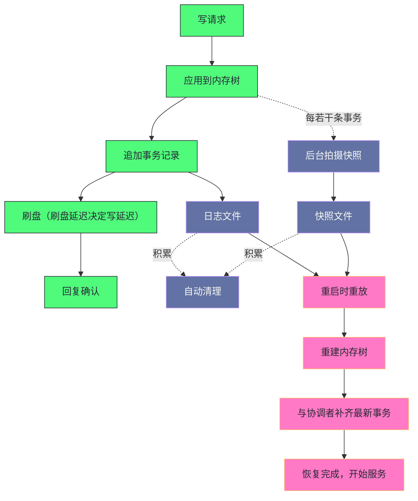

# 04 数据持久化——事务日志与快照

**摘要：**

这套系统的"全内存"设计带来了极低的读延迟，但内存是易失的——**因此它需要"两套机制"来保证持久性**：**事务日志**（追加写，保证"零丢失"）与**快照**（定期全量序列化，保证"恢复够快"）。而这两套机制的配合方式里，有一处设计特别精巧：**快照是"模糊"的**（它可能在事务提交过程中拍摄，因此不是某个精确时刻的一致性镜像）——**而"模糊快照"之所以可行，是因为"事务是幂等的"**。** 这处设计把"保证快照的一致性"这处难题，转化成了"保证事务幂等"这处更简单的要求，从而让快照可以在不暂停服务的情况下异步进行。本文按"内存数据模型 → 事务日志 → 快照 → 重启恢复 → 磁盘空间管理"展开。先说明内存模型与持久化的必要性；再剖析事务日志的写入时机、文件格式、预分配策略与刷盘性能。然后讲快照的作用、触发时机的随机化、模糊快照与幂等性的关系、文件格式与压缩。之后是重启恢复的完整五步与"为什么从更早的位置重放"、快照损坏时的降级。接着是文件积累这处最常见的运维故障与自动清理配置。最后是生产落地、边界反例与落点。

---

## 第 1 章 内存数据模型

### 1.1 它是什么

**服务端在内存中维护一棵树，而它就是"节点树"的内存表示。**

**它的核心结构有三部分**：**"路径到节点数据的映射'"**、**"会话标识到该会话创建的临时节点列表的索引'"**、**"路径到注册了该路径监听器的连接集合'"。

**而"每个节点"存储三类内容**：**"数据内容'"**、**"元数据'"**、**"子节点名称集合'"。

**"子节点存的是名称而不是路径"这处细节值得留意**：**因为"路径'可以由父路径加名称推出'"**——**因此"存名称'更省空间'"——**而"这处优化'在'节点数量大'时有明显收益"。

**整套结构"完全在进程堆内存中"**——**而"这是读延迟极低的根本原因"**（因为"读数据就是一次映射查找，不涉及任何磁盘操作"）。

### 1.2 持久化的必要性

**全内存带来一处代价：进程崩溃或节点宕机后，内存数据全部消失。**

**如果没有本地持久化**，重启时"只能从其他节点同步完整数据'"**——**而"这处全量同步'可能很慢'"（因为"要传输并反序列化全部数据"）。

**因此"本地持久化的价值是'让节点能从本地恢复大部分数据'"**——**而"只需从协调者同步'少量最新事务'"**——**因此"大幅缩短重启恢复时间"。

**一处补充是"本地恢复的边界"**：**本地恢复只能恢复到"本节点最后持久化的状态"**——**而"此后的事务必须从协调者同步"。** **因此"本地恢复的价值在于缩短同步量，而不是替代同步"**——**而"这处边界决定了恢复仍需网络参与"。**

**这处设计的通用性在于"它把'恢复'分解成了'本地恢复加快量同步'两段"**——**而"两段的分工是'本地恢复覆盖历史，同步覆盖最近'"。** **这与第 2 篇讲的"快照同步与差异同步"是同一分工**：**"用本地已有数据减少需要传输的量"。### 1.3 一处关于"全内存"的观察

**"全内存"这处选择值得再展开一层，因为"它解释了整套持久化方案的形态"。**

**如果数据本来就在磁盘上**（例如"通用数据库"）——**那么"持久化"是天然的**——**而"性能优化'要围绕'如何减少磁盘访问'"。

**而"全内存"把问题反过来了**：**"性能是天然的'"**——**而"持久化'成为需要额外解决的问题'"。

**因此"两套机制的存在'正是'全内存这处选择的必然配套'"**——**而"如果没有全内存'，就不需要'把持久化拆成'日志加快照'两套'"。

**这条观察的通用性在于"它说明'一处设计的优势'总是'由另一处机制来补足其代价'"**——**而"理解这一点'能避免'把配套机制当作'独立设计'"。** **这与第 1 篇讲的"临时节点的优雅与风险同源"是同一类。

### 1.4 一处关于"内存布局"的观察

**"内存中的数据结构如何组织"这处问题值得说明，因为"它直接影响'全量序列化的效率'"。**

**组织方式有三处优化**：**"用并发映射'避免全局锁'"**、**"用'会话到临时节点的索引'避免全表扫描'"**、**"用'子节点名称集合'避免重复路径前缀'"。

**三处优化的共同特征是"它们都在'为高频操作减少遍历范围'"**——**而"其中第二处'直接服务于'会话过期时的节点清理'"**（因为"清理需要'快速找到该会话的所有临时节点'"）。

**因此"内存布局的设计'是'按访问模式确定的'"**——**而"这处设计与持久化'关系不大'"（因为"序列化是低频操作"）。** **这类"高频路径优先"的设计取向'在存储系统里很常见**。

**一处补充是"序列化顺序的影响"**：**快照的序列化顺序决定了文件的可读性**——**而"按路径字典序序列化时，人工查看更直观"。** **而"按内存遍历顺序时，实现更简单但文件难以人工阅读"**——**而"这处取舍与可调试性相关"。**

**一处补充是"序列化顺序的影响"**：**"快照的序列化顺序'决定了'文件的可读性"**——**而"如果'按路径字典序序列化'，那么'人工查看时更直观"。** **而"如果'按内存遍历顺序'，那么'实现更简单但文件难以人工阅读"。** **这处取舍'与'可调试性'相关。**

---

## 第 2 章 事务日志

### 2.1 写入时机

**每当处理一个写请求，都会把它序列化成一条事务记录并追加写入日志。**

**关键点是"写入发生在提交之前"**——**也就是说"参与者'先把事务写入本地日志并刷盘，然后才回复确认'"。

**这处顺序保证的是"确认之后即使宕机，也能通过重放日志恢复这条事务"**——**而"如果顺序颠倒（先确认后写日志）'"——**那么"确认后宕机'会让这条事务永久丢失'"。

**因此"这条顺序'是'不丢已提交数据的直接保障'"。** **这与第 2 篇讲的"日志先于数据"是同一原则**：**"先持久化记录，再宣告完成"。

**一处补充是"刷盘失败的处置"**：**如果"刷盘失败"，那么"事务必须被视为未提交"**——**而"节点应当停止服务或退出集群"。** **因为"继续服务会让它认为已提交，而实际未持久化"**——**而"这处失败即退出的处置，是保证正确性的必要条件"。**

### 2.2 文件格式

**日志文件以"首条记录的事务标识"命名**——**而"这处命名方式让'按标识范围查找文件'变得直接'"。

**文件由"头部加记录序列"构成**：

**头部包含"魔数、版本、数据库标识"**——**而"魔数'用于快速识别文件类型'"。

**每条记录包含七类字段**：**"校验和'"**、**"记录长度'"**、**"客户端会话标识'"**、**"客户端本地事务序号'"**、**"全局事务标识'"**、**"时间戳'"**、**"事务类型与内容'"。

**七类字段的分工可以归为三组**：**"定位组（长度）'"**、**"归属组（会话、本地序号、全局标识）'"**、**"内容组（类型与负载）'"**。

**"同时记录'本地序号'与'全局标识'"这处设计值得留意**：**因为"前者'用于'按会话排序'"**，**而"后者'用于'全局排序'"**——**而"两处排序'分别服务于'不同的恢复判断'"。

### 2.3 预分配策略

**日志文件采用"预分配"策略，而它解决的是"频繁扩展文件的开销"。**

**问题的形态是**：**"每次追加写入'都可能需要扩展文件'"**——**而"扩展'需要更新文件系统的元数据'"**——**因此"在高频写入下'这处开销会累积'"。

**预分配的做法是"一次性分配一大块空间'"**——**因此"后续写入'只更新内容，不涉及元数据变更'"。

**而它的副作用是"文件末尾有大量填充'"**——**因此"文件大小通常是分配单位的整数倍，而不是实际数据量'"。** **这条副作用的实践含义是"不能通过文件大小判断数据量'"**——**而"这类'物理大小与实际内容不一致'的情况在'预分配类存储'里很常见'"。

**一处细节值得留意**：**触发新日志文件的阈值"带有随机偏移'"**——**而"随机化的目的是'错开集群内各节点的切换时机'"**——**因此"避免'所有节点同时切换并同时触发快照'"。** **这与第 2 篇讲的"选举超时应当带随机性"是同一手法**：**"用随机化避免集群层面的同步动作"。### 2.5 一处关于"日志与快照分工"的观察

**"日志与快照"的分工值得再展开一层，因为它"体现了'增量与全量'的经典配合"。**

**分工是"日志记录增量，快照记录全量"**——**而"两者的配合方式是'用全量作起点，用增量追赶'"。

**这处配合的收益是"恢复时间'与'全量大小加增量大小'成正比"**——**而"如果没有快照'，恢复时间就与'全部历史增量'成正比'"——**因此"快照的作用'是把'与历史长度成正比'变成'与最近增量成正比'"。

**一处补充是"快照与日志的相互依赖"**：**"日志的起点由快照决定，而快照的完整性由日志校验补充"**——**因此"两者不能独立理解"。** **这处相互依赖说明"持久化方案是一个整体，而不是两套独立机制"。**

**因此"这处配合的通用性在于'它把'随时间增长的成本'变成了'有界的成本'"**——**而"这类'定期做一次全量来截断历史'的手法"在别处也出现**（例如"日志的定期归档"）。

**一处补充是"快照频率的经验取值"**：**它"通常按'日志记录数'触发，而不是按时间"**——**因为"记录数'与实际数据变化量更相关"，而"按时间触发'会让'空闲期的快照'变得多余"。** **这处"按量而非按时"的触发方式，也出现在别处的维护操作里。**

**一处实践含义是"快照频率'是在'恢复时间'与'快照开销'之间取舍"**：**"频繁快照'则恢复快但开销大'"**；**"稀疏快照'则开销小但恢复慢'"。

### 2.6 一处关于"校验和"的观察

**"每条记录都带校验和"这处设计值得说明，因为它"解决了'如何发现损坏'"。**

**它的作用是"检测'写入过程中的数据损坏'"**——**因为"磁盘或传输可能引入错误'"**——**而"没有校验'就无法区分'正确的数据'与'碰巧能解析的损坏数据'"。

**而"校验和的位置'在记录头部"**——**因此"读取时'先校验再解析'"**——**而"如果'校验失败'，则'可以判断出'这个文件在何处损坏'"。

**因此"校验和'让'损坏变得可检测且可定位'"**——**而"这处能力'是'降级恢复的前提'"（因为"只有'能定位损坏位置'，才能'从别处补足'"）。** **这与第 8 篇讲的"用摘要校验内容"是同一手法**：**"用短摘要'检测'长内容是否被改动'"。 **而"这处手法在本专栏里反复出现"**——**因为"检测损坏"与"判断变更"都需要短摘要。** **因此"短摘要'是'数据完整性领域的通用工具"**——**而"理解它就理解了一类校验机制的设计思路"**——**而"这类机制在存储、传输、恢复三处都会用到"。**

**一处补充是"校验和的计算范围"**：**它覆盖整条记录的内容，因此任何一处改动都会被检出**——**而"头部与记录分别校验的设计，让损坏可以被定位到具体的记录"**——**而"这处可定位性，正是分级恢复能工作的基础"。**

**一处补充是"校验失败的处理策略"**：**它通常是"丢弃整个文件"，而不是"尽力恢复"**——**因为"部分恢复的文件会引入难以察觉的不一致"。** **这处"宁可丢弃也不冒险"的策略，在数据恢复领域是常见原则**——**而"它的依据是'一致性的价值高于完整性'"。**

### 2.4 刷盘策略与性能

**每个事务写入后默认执行刷盘，而"这处延迟直接决定了写延迟"。**

**刷盘延迟取决于存储设备**：**"机械盘在毫秒级'"**、**"固态盘在亚毫秒级'"**、**"更快的设备可以到微秒级'"。

**因为"协议要求参与者刷盘后才回复确认'"**——**因此"写入延迟'直接受限于刷盘延迟'"。

**因此"写性能的第一优化项是'把日志目录单独挂到低延迟设备上'"**——**而"这处优化的收益'是所有调优项里最大的'"。

**而"为什么必须单独挂载"这处问题值得回答**：**因为"日志是'顺序写加高频刷盘'，对延迟极度敏感'"**——**而"快照是'低频大块写'，对延迟不敏感'"**——**因此"混用磁盘时'快照写入会干扰日志的刷盘延迟'"**——**而"后果是'写入抖动'"。

**这条分析的通用性在于"它说明'不同访问模式的数据应当分开存放'"**——**而"判断依据是'访问模式（顺序与随机、高频与低频）'"。** **这与第 7 篇讲的"日志与数据分开存放"是同一原则**：**"把'延迟敏感'与'吞吐敏感'的负载隔离"。### 2.7 一处关于"顺序写"的观察

**"顺序写"这处特性值得说明，因为它是"日志类结构性能优势的来源"。**

**优势的来源是"顺序写'避免了磁头寻道'"**——**因此"在机械盘上'顺序写的吞吐'远高于随机写'"——**而"在固态盘上'优势缩小但仍存在'"（因为"闪存也有'擦除块'与'写放大'的问题"）。

**因此"日志类结构'天然适合'高频追加'"**——**而"这也是'把持久化设计成日志'的原因之一'"。

**一处实践含义是"日志文件'应当放在'连续的空间上'"**——**而"如果'日志目录与其他高频随机写的负载共用磁盘'，顺序性会被破坏'"——**而"后果是'写延迟上升'"。** **这与第 2.4 节讲的"单独挂载"是同一处的延伸**：**"隔离负载'是为了'保护访问模式的纯粹性'"。

### 2.8 一处关于"批量刷盘"的观察

**"能否批量刷盘"这处问题值得说明，因为"它直接决定写吞吐"。**

**批量刷盘的收益是"多个事务'共享一次刷盘开销'"**——**因为"刷盘的固定开销'可以被摊薄'"。

**而"实现批量'需要'在延迟与吞吐之间取舍'"**：**"等待更久'能凑更大批次'"**——**而"代价是'单个事务的延迟上升'"。

**因此"批量大小的选择'取决于'负载特征'"**：**"请求密集'则批量收益大'"**；**"请求稀疏'则'等待时间占比高，收益小'"。

**这条取舍与第 7 篇讲的"组提交摊薄固定成本"是同一手法**：**"把固定开销摊到多个请求上'"。** **而"两者的代价也一致"**：**"都是'用延迟换吞吐'"。

---

## 第 3 章 快照

### 3.1 它的作用

**如果只有事务日志，重启时需要"从第一条日志开始逐条重放"。**

**而"集群运行很久后'日志可能有数百万条'"**——**因此"重放可能需要数分钟'"**——**而"这是不可接受的'"。

**快照解决的正是这处问题**：**"周期性把内存树的完整状态序列化到磁盘'"**——**因此"重启时'只需加载快照加重放少量日志'"。

**因此"快照的定位是'缩短恢复时间'，而不是'保证持久性'"**——**因为"持久性'由事务日志保证'"。** **这条分工很重要**：**"两者缺一不可，但职责不同'"**——**而"把两者混为一谈'会导致'对恢复时间的错误预期'"。

### 3.2 触发时机与随机化

**快照在"后台线程中异步执行"，不阻塞事务处理。**

**触发条件是"日志记录数达到一个带随机偏移的阈值'"**——**而"每个节点独立决策'，不需要协调者协调'"。

**"独立决策加随机偏移"这处组合值得留意**：**因为"如果所有节点同时触发快照'"**——**那么"磁盘写入会出现峰值'"**——**因此"随机化'把峰值摊开了'"。

**这处设计的意义在于"它用'随机化'替代了'集中协调'"**——**而"这类'用局部随机达到全局错开'的手法'在分布式系统里很常见'"**（因为"它避免了额外的协调开销"）。

### 3.3 模糊快照与幂等性

**"模糊快照"这处设计值得单独说明，因为它是"整套持久化方案里最精巧的一处"。**

**它的含义是"快照是在'正常运行期间'拍摄的，而'拍摄期间新事务仍在提交'"**——**因此"快照可能包含'部分事务的效果'"**——**也就是说"它不是某个精确时刻的一致性镜像'"。

**乍看之下"这似乎有问题"**（因为"如果快照反映中间状态，重放日志时会不会出错"）——**而"答案是不会"**。

**不会出错的理由是"事务是幂等的"**：**"对同一个写操作'无论执行多少次，结果都相同'"**——**因此"即使快照已包含某些事务的效果，重放时再次执行它们'也不会产生错误'"。

**因此"这处设计把'保证快照一致性'这处难题，转化成了'保证事务幂等'这处更简单的要求"**——**而"这处转化'让快照可以在不暂停服务的情况下异步进行"。

**这条手法的通用性极强**：**"当'保证某个中间产物的一致性'很困难时，可以问'能否让后续步骤容忍这个中间产物'"**——**而"如果后续步骤是幂等的'，那么'中间产物就可以不必精确一致'"。** **这与第 15 篇讲的"恢复必须可重复执行"是同一思路**：**"幂等性'能消除'对精确状态的需求'"。### 3.5 一处关于"幂等性来源"的观察### 3.7 一处关于"快照与内存"的观察

**"拍摄快照时的内存行为"这处问题值得说明。**

**关键点是"快照需要'在某个瞬间取得一致的内存视图'"**——**而"如果'直接遍历内存树'，那么'遍历过程中数据可能变化'"。

**因此"实现方式有两类"**：**"加锁快照'"**（"暂停写入，取得一致视图"）与**"模糊快照'"**（"不加锁，允许中间状态"）。

**前者"实现简单但暂停服务'"**；**后者"不暂停但需要幂等性配合'"**。

**因此"选择依据是'能否接受暂停'"**——**而"本机制选择了后者'，因为'暂停写入对协调服务的影响太大'"。

**这条观察的通用性在于"它把'快照实现'归结为'一致性视图的获取方式'"**——**而"当'暂停的代价高'时，就'需要'用幂等性来容忍不一致的视图'"。** **这与第 12 篇讲的"多版本读不需要加锁"是同一思路**：**"用'额外的容忍机制'替代'加锁'"。

### 3.8 一处关于"快照与日志切换"的观察

**"快照与日志切换的先后关系"这处细节值得说明。**

**正确的顺序是"先创建新日志文件'，再拍摄快照'"**——**因为"如果顺序颠倒'，那么'快照期间产生的事务'会'落在旧日志文件里'"——**而"旧日志文件'可能'在快照完成前被清理'"。

**因此"这处顺序'保证了'快照期间的日志'不会被误删'"。

**一处补充是"切换的原子性"**：**创建新日志文件与切换写入目标这两步之间也有窗口**——**因此"实现上需要用一个显式的状态标记，来保证切换期间的事务不会丢失"**——**而"这类多步维护操作需要显式状态标记的做法，在别处也出现"。**

**这处细节的通用性在于"它说明'涉及多步的维护操作'必须'明确各步的先后'"**——**而"顺序错误'的后果'往往在'很久之后'才显现'"。** **这与第 2 篇讲的"多写入点的顺序是正确性的一部分"是同一类。

**"事务为什么是幂等的"这处问题值得回答，因为它"不是天然的"。**

**幂等性的来源是"事务的内容'表达的是目标状态，而不是增量'"**：**例如"设置某个节点的数据为某个值'"**——**而"无论执行多少次'结果都是那个值'"。

**而"如果事务表达的是增量'"**（例如"把计数器加一"）——**那么"重复执行就会出错'"**——**因此"整套模糊快照的方案'就'不成立'"。

**因此"这处设计的可行性'依赖'事务语义的选择'"**——**而"这类'把状态表达成'绝对值'而不是'增量'的做法，是'实现幂等的最常用手段'"。** **这与第 13 篇讲的"幂等实现用业务唯一键去重"是同一类**：**"幂等性'需要'在语义层面设计'，而不是'在实现层面补救'"。

**一处补充是"幂等性的边界"**：**并非所有操作都天然幂等**——**例如"创建节点"重复执行会报"已存在"，而"删除节点"重复执行会报"不存在"。** **因此"重放时'需要'把这些'已存在或不存在'的错误视为成功'"**——**而"这处宽容处理'是'幂等性落地的一部分"。**

### 3.6 一处关于"快照影响"的观察

**"快照对正常运行的影响"这处问题值得说明。**

**影响有三处**：**"磁盘带宽占用'"**（因为"快照要写入大量数据"）、**"内存占用'"**（因为"序列化过程可能需要额外缓冲"）、**"处理能力占用'"**（因为"序列化本身消耗计算资源"）。

**三处影响的共同特征是"它们都'与数据量成正比'"**——**而"这解释了'为什么数据量大时快照的代价明显'"。

**因此"控制快照影响的手段有三处"**：**"限制数据量'"**、**"错开各节点的快照时机'"**、**"开启压缩（如果计算能力充足）'"。

**一条实践含义是"快照期间的性能波动'应当被识别而非被优化'"**——**因为"它'是'预期内的开销'"——**而"把'预期内的波动'当作'故障'会'导致不必要的排查'"。** **这与第 2 篇讲的"恢复期间的性能抖动"是同一类**：**"系统的状态变化'会带来'负载的临时变化'"。

### 3.4 文件格式与压缩

**快照文件以"最后一条已提交事务的标识"命名**——**因此"可以从文件名直接判断'这个快照包含到哪个位置'"。

**文件内容包含"头部、会话数据、节点数据、结束标记、校验和"**——**而"会话数据'也随快照持久化'"**（因为"会话的存活状态'需要跨重启延续"）。

**"结束标记"这处设计值得留意**：**它"用一个不可能作为节点路径的值'表示序列化结束'"**——**因此"读取时'遇到它就停止'"**——**而"这处设计'让'读取不需要预先知道节点数量'"。

**较新版本支持快照压缩**——**而"压缩的取舍是'用处理时间换存储空间'"**——**因此"它适合'存储紧张而处理能力充足'的场景'"。** **这类'以计算换存储'的取舍在别处也出现**（第 10 篇会展开日志压缩）。

---

## 第 4 章 重启恢复

### 4.1 完整流程

**重启恢复分五步。**

**第一步：扫描快照目录，按标识降序排列。** **因此"最新快照排在第一个'"。

**第二步：加载最新快照。** **它"反序列化出节点树与会话数据'"**——**而"同时校验完整性'"**——**"损坏则尝试次新快照'"。

**第三步：定位需要重放的日志范围。** **也就是"标识大于等于快照标识的日志文件'"。

**第四步：重放事务日志。** **它"从'快照标识之前的某个位置'开始'"**——**而"跳过'标识小于快照标识的记录'"**——**"对之后的记录逐条应用'"。

**第五步：与协调者同步。** **因为"本地恢复后'可能仍缺少'最新的事务'"**——**因此"需要通过协议'补齐'。

**五步的分工是"定位、加载、定位、重放、补齐"**——**而"前三步是本地操作，后两步涉及网络'"。** **因此"恢复时间'由'本地部分与网络部分'共同决定'"**（第 2 篇已展开这处量化）。

### 4.2 为什么从更早的位置重放

**"为什么从'快照标识之前'开始重放"这处问题值得回答，而它的答案与模糊快照直接相关。**

**因为"快照是模糊的"**——**因此"它可能包含'标识在某个区间内'的部分事务效果，但不是全部'"**——**因此"如果'只重放'标识大于快照标识的事务'，那么'那个区间内未被包含的事务'就'永远不会被应用'"。

**而"从更早的位置开始重放'能保证'那个区间的所有事务都被应用'"**——**而"重复应用已在快照中的事务'不会出错'"（因为幂等）。

**因此"这处'多往前重放一段'的设计，正是'模糊快照'的配套要求"**——**而"两者必须同时存在'，缺一不可'"。

**这条推理的通用性在于"它说明'一处设计的放宽'必然需要'另一处设计的补足'"**——**而"两者是配套的，不能单独理解"。** **这与第 5 篇讲的"复用与心跳配套"是同一结构**：**"放宽一处'就要在别处补回来"。

### 4.3 损坏时的降级

**恢复代码有容错机制，而它"逐级降级"。**

**第一级是"校验失败时尝试次新快照"**——**因此"单点损坏'不会导致恢复失败'"。

**第二级是"如果所有快照都损坏'，只能从最早的日志开始重放"**——**而"这处降级'的代价是'恢复时间大幅延长'"。

**因此"预防措施有两处"**：**"定期验证快照完整性'"**、**"把快照备份到外部存储'"**。

**两处措施的共同特征是"它们都在'为最坏情况做准备'"**——**而"这类准备'的价值'只在'真正发生时'体现"**——**因此"它们容易被忽略'"。** **这与第 7 篇讲的"只在异常路径生效的机制需要主动验证"是同一类。### 4.4 一处关于"恢复顺序"的观察

**"先加载快照、再重放日志"这处顺序值得说明，因为它"不能颠倒"。**

**不能颠倒的理由是"日志的起点'由快照的标识决定'"**——**因此"没有加载快照'就无法确定'从哪里开始重放'"。

**而"如果'先重放日志'，那么'需要从最早的日志开始'"**——**因此"快照的价值'就'完全丧失了'"。

**因此"这处顺序'由'两者的依赖关系'决定"**——**而"这类'顺序必然性'在本专栏里反复出现"**（第 3 篇的"注册前必须先就绪"、第 2 篇的"先对齐再服务"）。

**一处补充是"恢复流程的幂等性"**：**"重复执行'加载快照加重放日志'会得到相同结果"**——**因为"加载快照是覆盖式的，而重放是幂等的"。** **因此"恢复过程中再次崩溃'不会'让状态变得更糟"。** **这处性质'是'恢复可以安全重试'的前提"。**

**这条观察的实用价值在于"它给出了'排查恢复问题时的检查顺序'"**——**即"先确认快照是否正常加载'，再检查'日志重放的起点是否正确'"。** **这与第 3 篇讲的"按链路顺序排查"是同一方法。

### 4.5 一处关于"恢复与备份"的观察

**"恢复机制与备份"的关系值得说明，因为"它们容易被混淆"。**

**恢复机制解决的是"本节点重启后如何重建内存状态"**——**因此"它的输入是'本地的日志与快照'"。

**而备份解决的是"本地存储全部损坏时如何重建"**——**因此"它的输入是'异地的副本'"。

**两者的差别在于"故障范围"**：**"恢复机制'覆盖'进程级故障'"**；**"备份'覆盖'存储级故障'"。

**因此"有恢复机制'不代表'不需要备份"**——**因为"磁盘损坏时'本地文件全部不可用'"——**而"此时'只能靠异地副本'"。

**这条观察的通用性在于"它说明'容灾设计应当按故障范围分层'"**——**而"每层覆盖一类故障，缺一层就留下一类无法恢复的场景"。** **这与第 4 篇讲的"三级容灾各覆盖一个阶段"是同一结构**：**"分层覆盖'才能拼出完整的容灾能力"。
---

## 第 5 章 磁盘空间管理

### 5.1 文件积累

**默认情况下，旧日志与旧快照"不会自动清理"。**

**因此"如果不配置清理策略'，这些文件会持续积累'"**——**而"最终'耗尽磁盘空间'"**——**而"后果是'无法写入日志，服务停止'"。

**这处故障的形态值得留意**：**它是"渐进式的"**（"从'磁盘使用率上升'到'磁盘满'需要一段时间"）——**而"在'磁盘使用率上升'的阶段'服务一切正常'"**——**因此"它容易被忽略'"。

**因此"这处故障是'这套系统最常见的运维问题之一'"**——**而"它的根因'不是'代码缺陷'，而是'默认配置假设了运维会主动清理'"。** **这类"默认假设运维会做某件事"的设计'在基础设施组件里很常见'"**——**而"补足方式'只能是'把清理纳入部署清单'"。

**一处补充是"清理失败的连锁"**：**当磁盘写满时，"清理任务本身也可能失败"**——**因为"它需要读取目录并删除文件，而这些操作也可能因为磁盘状态异常而失败"。** **因此"磁盘写满往往需要人工介入才能恢复"**——**而"这处特点让它比一般的资源问题更麻烦"。**

**一处补充是"清理失败的连锁"**：**当磁盘写满时"清理任务本身也可能失败"**——**因为"它需要'读取目录并删除文件'，而这些操作也可能因为磁盘状态异常而失败"。** **因此"磁盘写满'往往需要'人工介入才能恢复"，这处特点让它比一般的资源问题更麻烦。**

### 5.2 自动清理

**较新版本提供了内置的自动清理机制，而它的配置项值得说明。**

**第一处是"保留的文件数量"**——**它"决定'保留多少个最新的日志与快照文件'"。

**第二处是"清理的时间间隔"**——**它"决定'多久执行一次清理'"。

**第三处是"保留的时间长度"**——**它"从时间维度'限制保留范围'"。

**三处配置的共同特征是"它们都在'限制保留范围'"**——**而"保留范围'应当'按'恢复需求与备份策略'确定'"**：**"如果'需要从很久之前的快照恢复'，那么'保留范围要足够大'"。

**一处实践提醒是"清理与备份'是两个不同的需求'"**——**因为"清理只删除本地文件，而备份需要把文件复制到别处'"**——**因此"不能'用'保留更多本地文件'替代'备份'"**。** 这与第 4 篇讲的"快照不能替代备份"是同一判断**：**"本地保留'不等于'异地备份'"。### 5.3 一处关于"清理策略"的观察

**"保留多少历史"这处策略值得说明，因为它"同时影响'磁盘占用'与'恢复能力'"。**

**保留越多'则"磁盘占用越高'，但"可恢复的时间范围越广'"**——**而"保留越少'则相反'"。

**因此"这处策略'是'存储成本与恢复能力之间的取舍'"**——**而"取值的依据是'业务对'最长恢复窗口'的要求'"。

**一处补充是"保留策略的量化方式"**：**应当"按'最坏情况下的写入速率乘以要求的保留时长'计算需要的空间"**——**而不是"按'当前的目录大小'判断是否够用"。** **因为"后者'是'结果'，而'前者'才是'约束"。**

**一处容易被忽略的约束是"恢复窗口'还受'协调者日志'限制"**——**因为"如果'本地快照太旧'，那么'需要从协调者同步的事务量会很大'"**——**而"协调者的日志可能已经清理'"——**因此"此时'只能做全量同步'"。

**因此"保留策略'应当'与'协调者的日志保留'一起考虑'"**——**而"只调整一侧'可能让'另一侧成为瓶颈'"。** **这与第 4 篇讲的"窗口与最小请求数需要一起设置"是同一类**：**"相关参数必须成组配置"。

### 5.4 一处关于"压缩取舍"的观察

**"快照压缩"这处开关值得说明，因为它"体现了'计算换存储'的经典取舍"。**

**开启压缩的收益是"存储占用大幅下降'"**——**而"对'结构化文本'类数据'压缩率通常很高'"。

**而它的代价有两处**：**"压缩与解压消耗处理能力'"**、**"恢复时需要先解压'，因此'恢复时间可能变长'"。

**因此"这处取舍的判断依据是'哪一侧是瓶颈'"**：**"存储紧张'则开启'"**；**"恢复时间紧张'则关闭'"。

**一处补充是"压缩与恢复时间的矛盾"**：**开启压缩减少了存储，但解压需要时间**——**而"解压时间计入恢复时间"。** **因此"如果恢复时间本来就接近上限，那么开启压缩可能让它超标"**——**而"这类优化一处却恶化另一处的情况，需要在决策前量化"。**

**一处补充是"压缩与恢复时间的矛盾"**：**开启压缩'减少了存储，但'解压需要时间'"**——**而"解压时间'计入'恢复时间"。** **因此"如果'恢复时间本来就接近上限'，那么'开启压缩可能让'它超标"。** **这类"优化一处却恶化另一处"的情况'需要在决策前量化。**

**而"如果两侧都紧张'，那么'需要从别处解决'"**（例如"减少数据量"）——**因为"压缩'只能把成本从一侧转移到另一侧'"。** **这与第 6 篇讲的"任何优势都有对应代价"是同一判断**：**"取舍'意味着'成本转移'，而不是'成本消除'"。

---

## 第 6 章 生产落地

### 6.1 可观测的信息

**与持久化相关的可观测信息有四类。**

**第一类是"日志写入延迟"**：**它回答"刷盘是否成为瓶颈'"**——**而"它'直接决定'写延迟'"。

**第二类是"日志与快照的目录占用"**：**它回答"是否接近磁盘上限'"**——**而"它的趋势'能提前预警'"。

**第三类是"快照的耗时与大小"**：**它回答"快照是否影响正常运行'"**——**而"它'也决定'恢复时间'"。

**第四类是"恢复耗时"**：**它回答"从重启到可服务需要多久'"**——**而"它'是'故障恢复能力的直接度量'"。

**四类信息的层次是"从写入到存储到恢复"**——**而"按这个顺序看'能覆盖'持久化的完整链路'"。

### 6.2 一次"磁盘写满"的排查推演

把"磁盘写满导致服务停止"这类问题串成一次推演。

假设现象是"某节点'突然无法写入，日志报磁盘空间不足'"。

**第一步，确认"是日志目录还是快照目录"。** **因为"两者的清理配置是独立的'"**——**因此"先定位'是哪一处满了'"。

**第二步，确认"自动清理是否启用"。** **因为"默认不清理'"**——**而"如果'从未配置'，那么'文件积累是必然的'"。

**第三步，确认"文件数量与保留配置是否匹配"。** **因为"配置可能被覆盖或未生效'"**——**因此"应当'核对实际生效值'"。

**第四步，确认"是否有异常的大量写入"。** **因为"如果'写入量突然增大'，那么'文件积累速度会远超预期'"。

**第五步，确认"清理是否被阻塞"。** **因为"清理本身'也需要磁盘操作'"**——**而"在'磁盘已满'的情况下'清理可能无法进行'"——**因此"可能需要'手工删除部分旧文件'"才能恢复。

**五步的价值在于"它把'磁盘写满'分解成'目录、配置、生效值、写入量、清理阻塞'五处"**——**而"前三处是配置问题，后两处是运行状态问题'"。** **因此"按这五处检查'能快速定位'是配置漏了还是异常写入'"。

### 6.3 一处关于"恢复时间"的经验

**"恢复时间"这处指标值得单独说明，因为它"是故障恢复能力的综合体现"。**

**它的构成有三处**：**"加载快照的时间'"**（"与快照大小相关"）、**"重放日志的时间'"**（"与快照之后的日志量相关"）、**"与协调者同步的时间'"**（"与落后量相关"）。

**三处的量级差异明显**：**"加载快照'通常是大头'"**——**因此"减小快照'对恢复时间的收益最大'"。

**而"减小快照的方式有两处"**：**"降低总数据量'"**、**"开启压缩'"。

**因此"一条实践建议是'把恢复时间纳入容量规划'"**——**因为"它'决定了'故障后的不可用时长'"**——**而"这类时长'应当'被显式评估，而不是'等出问题时才发现'"。** **这与第 2 篇讲的"恢复时间的主要构成往往是同步阶段"是同一判断**：**"先量化各阶段，再决定优化方向"。### 6.4 持久化链路的整体关系### 6.5 一处关于"容量规划"的经验

**一处补充是"三段链路的隔离设计"**：**"写入段依赖低延迟设备"**，**"持久化段依赖大容量"**，**"恢复段依赖快速读取"**——**而"三者的设备需求不同"，因此"可以分别优化"。** **这处"按段隔离"的设计'正是'把日志与快照分开挂载的深层理由"。**

**"持久化的容量规划"这处工作值得说明，因为它"常被当作'不需要规划'"。**

**规划的输入有三个**：**"写入速率'"**（决定"日志增长的速度"）、**"数据总量'"**（决定"快照的大小"）、**"保留范围'"**（决定"总占用的上界"）。

**三者的关系是"总占用'约等于'日志速率乘以保留时长，加快照大小乘以保留份数'"**——**因此"规划的第一步是'量化这三个数'"。

**而"实践中容易出问题的是'日志速率被低估'"**：**因为"日志速率'与'写入请求数'成正比'"**——**而"很多系统的写入量'会随业务增长而上升'"——**因此"按初期速率规划的容量'会在某个时间点被突破'"。

**因此"容量规划'应当'留出增长余量，并设置'占用率的提前告警'"**——**因为"告警'能在'真正写满之前'给出干预时间'"。

**这条经验的通用性在于"它把'容量规划'归结为'三个可量化的输入加一个余量'"**——**而"这类'先量化再规划'的方法'比'凭经验留余量'更可靠'"。** **这与第 4 篇讲的"注册中心容量按最坏情况规划"是同一类。

### 6.6 一处关于"故障演练"的经验

**"恢复流程是否需要演练"这处问题值得回答。**

**答案是"需要"，因为"恢复流程'只在'真正故障时'才被执行'"**——**而"如果'从未演练'，那么'其中任何一处问题'都会'在'最需要它的时候'暴露'"。

**演练的内容应当包括三处**：**"单节点重启后的恢复时间'"**、**"快照损坏时的降级路径'"**、**"从备份恢复的完整流程'"。

**三处内容的共同特征是"它们覆盖'不同严重程度的故障'"**——**而"逐级演练'能'逐级验证容灾能力'"。

**因此"演练'应当'纳入常规运维计划'"**——**而不是"只在'换人或变更后'临时做一次'"。** **这与第 7 篇讲的"只在异常路径生效的机制需要主动验证"是同一判断**：**"保护机制的可靠性'只能通过'主动演练'确认'"。

把写入、持久化、恢复三段的链路画在一起，能看清"数据在各段之间的流向"。

**图中最值得注意的是"刷盘'位于确认之前"这条边**：**它说明"确认的含义是'已持久化'"**——**因此"写延迟的下界'就是刷盘延迟'"。

**另一处值得注意的是"快照是一条虚线分支"**：**它"不参与写入路径'"**——**因此"快照的开销'不会直接加到写延迟上'"**（虽然"它会通过磁盘争用间接影响"）。

**这张图的实用价值在于"它把'三段链路'与'三段各自的关键指标'对应起来了"**——**"写入段的关键指标是刷盘延迟"**、**"持久化段的是磁盘占用"**、**"恢复段的是恢复耗时'"。** **因此"排查时'可以按段定位'，而不是'笼统地看整体性能'"。

---

## 第 7 章 边界与反例

### 7.1 反例一：把"快照"当作"保证持久性的机制"

持久性由事务日志保证，**快照的作用是缩短恢复时间**（第 3.1 节）。

### 7.2 反例二：把"模糊快照"当作"有缺陷"

它依赖"事务幂等"，**而"从更早位置重放"是它的配套要求**（第 3.3、4.2 节）。

### 7.3 反例三：把"文件大小"当作"数据量"

预分配会让文件末尾有大量填充（第 2.3 节）。

### 7.4 反例四：把"日志与快照放同一磁盘"当作"没问题"

"快照写入会干扰日志的刷盘延迟，造成写入抖动"（第 2.4 节）。

### 7.5 反例五：把"自动清理"当作"默认开启"

默认不清理，**而"文件积累是常见的运维故障"**（第 5.1 节）。

### 7.6 反例六：把"保留更多本地文件"当作"备份"

本地保留不等于异地备份（第 5.2 节）。

### 7.7 反例七：把"恢复时间"当作"不用规划"

它决定了故障后的不可用时长，**应当纳入容量规划**（第 6.3 节）。

### 7.8 反例八：把"快照损坏"当作"不可能"

"应当定期验证完整性并异地备份"（第 4.3 节）。

---

**一处补充是"恢复与备份的分工边界"**：**恢复机制覆盖进程级故障，备份覆盖存储级故障**——**而"两者的输入不同：前者读本地文件，后者读异地副本"。** **因此"任何'只有本地持久化'的方案，都在存储级故障上留了缺口"**——**而"这处缺口只能靠异地备份补足"**——**而"这也是'为什么'有恢复机制'不等于'不需要备份'"的原因"。**

**一处补充是"两套机制的演进方向"**：**日志方向的优化集中在"降低刷盘延迟"**（例如"更快的设备、批量刷盘"）——**而"快照方向的优化集中在'减小体积与影响'"**（例如"压缩、异步拍摄、错开时机"）。** **两条方向的分工，恰好对应"它们各自的关键指标"。**

## 第 8 章 落点

回到开头：**两套机制如何配合？**

**事务日志保证"零丢失"**（因为"写入发生在提交之前"），**快照保证"恢复够快"**（因为"它让重启只需重放少量日志"）——**而"两者的职责不同，缺一不可'"。

**而这套方案里最值得记住的一处设计是"模糊快照加幂等事务"**：**它把"保证快照一致性"这处难题，转化成了"保证事务幂等"这处更简单的要求**——**因此"快照可以在不暂停服务的情况下异步进行'"。

**这条手法的通用性极强**：**"当'保证某个中间产物的一致性'很困难时，可以问'能否让后续步骤容忍这个中间产物'"**——**而"幂等性'是最常用的'容忍手段'"。** **这与第 15 篇讲的"恢复必须可重复执行"、第 13 篇讲的"重试必须配套幂等"是同一思路**：**"幂等性'能消除'对精确状态的需求'"。

**另一条判断是"一处设计的放宽必然需要另一处设计的补足"**：**"模糊快照'放宽了'快照的一致性'"**——**而"从更早位置重放'补足了'这个缺口'"。** **因此"理解任何设计时'应当'同时找'它的配套要求'"**——**因为"单独看一处设计'会得出'它不严谨'的错误结论'"。

**最后一条判断值得留下：恢复时间是"日常运维质量的度量"，而不是"恢复参数的结果"。** **"它由'快照大小'与'日志量'决定'"**——**而"两者都取决于'平时的数据量与刷盘健康度'"。** **因此"缩短恢复时间'最有效的手段'是'减少数据量与控制快照大小'，而不是'调整恢复参数'"。

---

**最后，本篇与前后篇的关系值得点明**：**第 1 篇讲"四个核心概念"，第 2 篇讲"它们如何在多节点间保持一致"，第 3 篇讲"如何用它们搭出机制"，而本篇讲"这些机制在崩溃后如何恢复"。** **四者合起来，才是从原语到一致性到应用到可靠性的完整链路**——**而"下一篇讲的生产运维，则是'让这条链路在真实环境里稳定运行'的实践总结"**——**而"再下一篇讲的与另一套方案的对比，则是'这套设计在更大技术图景中的位置'"。**

---

## 专栏导航

- 上一篇：[[03 分布式锁与 Leader 选举的工程实现]]。
- 下一篇：[[05 生产运维——部署、监控与故障处理]]。
- 返回专栏首页：[[00 专栏导览]]。

---

## 参考资料

1. Apache ZooKeeper 源码：`zookeeper-server/src/main/java/org/apache/zookeeper/server/persistence/`、`.../persistence/FileTxnLog.java`、`.../persistence/FileSnap.java`、`.../persistence/FileTxnSnapLog.java`、`.../DataTree.java`。
2. Apache ZooKeeper. 官方文档：事务日志与快照的文件格式. https://zookeeper.apache.org/doc/current/zookeeperInternals.html
3. Apache ZooKeeper. 官方文档：dataDir、dataLogDir 与 snapCount 配置. https://zookeeper.apache.org/doc/current/zookeeperAdmin.html
4. Apache ZooKeeper. 官方文档：自动清理（autopurge）与快照压缩. https://zookeeper.apache.org/doc/current/zookeeperAdmin.html#sc_maintenance
5. Apache ZooKeeper. 官方文档：SnapshotFormatter 与日志分析工具. https://zookeeper.apache.org/doc/current/zookeeperTools.html
6. Apache ZooKeeper. GitHub 仓库与发布说明. https://github.com/apache/zookeeper

---

> [!note] 思考题
> 1. 事务日志与快照的职责分别是什么？为什么"把两者混为一谈"会导致对恢复时间的错误预期？
> 2. "模糊快照"为什么不会导致重放出错？它依赖什么性质？
> 3. 为什么恢复要从"快照标识之前"开始重放？这处设计与模糊快照如何配套？
> 4. 为什么日志目录与快照目录应当分开挂载？判断依据是什么？
> 5. 为什么说"恢复时间是日常运维质量的度量，而不是恢复参数的结果"？
