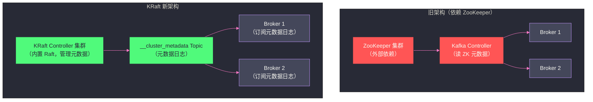

# 06 ZooKeeper vs ETCD——架构对比与去 ZooKeeper 化趋势

## 摘要

ZooKeeper 统治分布式协调服务领域超过 15 年，为 Hadoop 生态、[[Kafka]]、[[Dubbo]] 等系统提供了坚实的协调基础。然而，随着云原生时代的到来，[[ETCD]] 逐渐成为新一代分布式协调的首选——Kubernetes 以 ETCD 作为控制面存储，Kafka 在 3.x 版本推出了不依赖 ZooKeeper 的 KRaft 模式。

本文从架构、协议、数据模型、性能、运维复杂度五个维度对比 ZooKeeper 与 ETCD，深入分析 Kafka 去 ZooKeeper 化的动机与 KRaft 的实现思路，最终给出技术选型的判断框架。

---

## 第 1 章 架构与协议对比

### 1.1 共识协议：ZAB vs Raft

ZooKeeper 使用 **ZAB**（ZooKeeper Atomic Broadcast），ETCD 使用 **Raft**。两者都是强 Leader 模型的分布式共识协议，但在工程实现上有若干重要差异：

| 维度 | ZAB（ZooKeeper） | Raft（ETCD） |
|:---|:---|:---|
| **Leader 选举** | Fast Leader Election（最大 ZXID 优先） | Randomized Election Timeout（随机超时先发起） |
| **日志复制** | 两阶段（PROPOSAL + COMMIT） | 单次 AppendEntries（Majority ACK 后 commit） |
| **崩溃恢复** | 显式同步阶段（DIFF/SNAP/TRUNC） | 新 Leader 通过 AppendEntries 隐式修复 |
| **成员变更** | 需要滚动重启 | 支持在线成员变更（`etcdctl member add`） |
| **可读性** | 论文较难理解，工程细节多 | 论文设计目标即"易于理解"，更清晰 |
| **Watch 机制** | 一次性 Watcher，需手动重注册 | 持久 Watch（revision 对齐，不会遗漏事件） |

**关键差异：Watch 机制的设计哲学不同**

ZooKeeper 的 Watcher 是一次性的——每次触发后自动失效，客户端必须重新注册。优点是服务端不需要维护持久状态，内存压力小；缺点是客户端在"通知到达 → 重新注册"之间可能遗漏事件（尽管可以通过"收到通知后重新读取最新状态"来缓解）。

ETCD 的 Watch 基于 **Revision（全局递增版本号）**——客户端请求 Watch 时可以指定从某个 Revision 开始监听，服务端保证把从该 Revision 之后的所有变更事件全部推送给客户端，一个都不遗漏。即使客户端断线重连，只需告知服务端上次处理的 Revision，就能收到中间所有遗漏的事件。这使得 ETCD 的 Watch 在语义上更强，特别适合 Kubernetes 的 List-Watch 机制（Controller 需要感知资源对象的每一次变更）。

### 1.2 数据模型对比

| 维度 | ZooKeeper | ETCD |
|:---|:---|:---|
| **数据结构** | 树形命名空间（ZNode 树） | 扁平 KV（键空间，前缀组织层次） |
| **数据大小** | 每个节点 ≤ 1MB | 每个值 ≤ 1.5MB（默认），总数据库 ≤ 8GB（默认可调） |
| **节点类型** | 持久/临时/有序/临时有序 | 只有 KV，通过 TTL 和 Lease 实现"临时"语义 |
| **事务** | 单操作原子（无跨节点事务） | 支持 mini-transaction（Compare-And-Swap 风格的条件事务） |
| **版本管理** | 每个节点独立的 `version` | 全局 `Revision`，每次任何 KV 变更都递增 |
| **历史查询** | 不支持（只有当前状态） | 支持（可以查询任意历史 Revision 的状态，受 compaction 限制） |

**ETCD 的 Lease 机制 vs ZooKeeper 的 Session**

ZooKeeper 的临时节点与 Session 绑定，Session 超时则所有临时节点自动删除。ETCD 将这个概念解耦：

- **Lease**：一个独立的 TTL 租约对象，客户端定期续约（KeepAlive）；
- KV 可以关联到 Lease，Lease 过期时关联的所有 KV 自动删除；
- 一个 Lease 可以关联多个 KV（类似 ZooKeeper Session 的临时节点组）；
- 不同 KV 可以关联不同的 Lease（ZooKeeper 中所有临时节点必须属于同一 Session）。

ETCD 的 Lease 比 ZooKeeper 的 Session 更灵活——你可以让不同的服务实例共享同一个 Lease（方便统一管理），也可以为不同类型的键设置不同的 TTL。

### 1.3 语言实现对比

| 维度 | ZooKeeper | ETCD |
|:---|:---|:---|
| **实现语言** | Java | Go |
| **GC 影响** | JVM GC Pause 会导致心跳超时，触发 Leader 选举 | Go 的 GC Pause 通常 < 1ms，对心跳几乎无影响 |
| **内存占用** | JVM 开销大（空 ZooKeeper 消耗 ~500MB） | Go 运行时开销小（空 ETCD 消耗 ~100MB） |
| **容器化友好度** | 较差（JVM 内存与 cgroup 限制交互复杂） | 好（Go 程序原生友好于容器资源限制） |
| **部署依赖** | 需要 JDK，启动慢 | 单二进制文件，秒级启动 |

---

## 第 2 章 性能对比

### 2.1 读性能

ZooKeeper 的读请求在本地 Follower 上直接从内存 HashMap 返回，延迟极低（通常 < 1ms）。但这是以**可能读到旧数据**为代价的（Follower 的数据可能落后 Leader）。

ETCD 默认的读操作是**序列化读（Serializable Read）**，也是从本地 Follower 内存读取（类似 ZooKeeper），可能读到旧数据；但 ETCD 提供了**线性化读（Linearizable Read）**，通过将读请求路由到 Leader 并等待 ReadIndex 确认，保证读到最新数据（代价是每次读需要一次网络往返 Leader）。

ZooKeeper 的 `sync()` + 读操作可以实现类似的线性读效果，但 API 更繁琐。

### 2.2 写性能

两者的写吞吐上限都取决于 Leader 处理能力和磁盘 fsync 延迟。典型数据：

| 场景 | ZooKeeper（SSD） | ETCD（SSD） |
|:---|:---|:---|
| 纯写（小数据，3 节点） | ~30,000 ops/s | ~10,000~50,000 ops/s |
| 混合读写 | ~30,000 ops/s | ~30,000~60,000 ops/s |
| 大 Value（1KB+） | 性能下降显著 | 较稳定（BoltDB 对大 Value 友好） |

> [!note] 设计哲学
> 这里的数据是量级估计，实际取决于硬件、网络、数据大小和访问模式。通常认为 ZooKeeper 和 ETCD 的写吞吐在同一数量级（万级/秒），差异不是选型的决定因素。真正的差异在于：**ETCD 在大 Value 和大量 KV 场景（如 Kubernetes 的数万 Pod 状态）下表现更稳定，而 ZooKeeper 在超低延迟读取（< 1ms）场景更有优势。**

### 2.3 存储容量

ZooKeeper 将所有数据保存在 JVM Heap 中，内存是硬限制：
- 100 万个 ZNode × 平均 1KB 数据 = ~1GB Heap，这已经接近 ZooKeeper 的实际上限；
- ZooKeeper 不适合存储大量数据，官方推荐 ZNode 数量不超过几十万个。

ETCD 使用 **BoltDB**（嵌入式键值存储，基于 B+ Tree）持久化数据，数据可以大于内存（BoltDB 会利用 mmap）。默认的数据库大小限制是 2GB（可调至 8GB）。虽然 ETCD 也不适合存储海量数据，但其容量上限比 ZooKeeper 大得多，足以支撑 Kubernetes 的数万个资源对象。

---

## 第 3 章 Kafka 的去 ZooKeeper 化：KRaft

### 3.1 Kafka 依赖 ZooKeeper 做什么

在 Kafka 2.x 及之前版本，ZooKeeper 在 Kafka 集群中承担以下职责：

- **Broker 注册与发现**：每个 Broker 启动时在 ZooKeeper 注册临时节点，其他 Broker 和 Consumer 通过监听此路径发现集群成员；
- **Controller 选举**：Kafka 的 Controller（负责 Partition Leader 选举和 ISR 管理）通过 ZooKeeper 的临时节点选举；
- **Topic 和 Partition 元数据**：Topic 配置、Partition 分配信息存储在 ZooKeeper 的持久节点；
- **Consumer Group 信息**（旧版）：Consumer 的 offset、Group 成员信息（Kafka 0.9 前存在 ZooKeeper，后迁移到内置 `__consumer_offsets` Topic）。

### 3.2 ZooKeeper 成为 Kafka 的扩展瓶颈

随着 Kafka 集群规模扩大（数千个 Partition，数十万个 ISR 变更），ZooKeeper 的局限性越来越明显：

**问题一：Controller 切换时间过长**

当 Kafka Controller 宕机需要重新选举时，新 Controller 必须从 ZooKeeper 中读取所有 Topic/Partition 的元数据（可能是 GB 级的数据），加载到内存。这个过程在大规模集群中可能需要 **几十秒甚至几分钟**，期间集群无法进行 Partition Leader 选举，部分 Partition 不可用。

**问题二：元数据操作的双写开销**

Kafka Controller 在更新元数据时，需要先写 ZooKeeper，再将变更广播给所有 Broker。这种"双写"架构不仅增加了延迟，还引入了 ZooKeeper 和 Kafka 内部元数据不一致的风险（如果 ZooKeeper 写成功但 Broker 广播失败，或反之）。

**问题三：ZooKeeper 成为独立运维负担**

每个 Kafka 集群都需要配套一个独立的 ZooKeeper 集群（通常 3~5 节点），这增加了部署复杂度、运维成本和故障模式（ZooKeeper 问题会直接影响 Kafka 可用性）。

### 3.3 KRaft：Kafka 内置的 Raft 共识

**KRaft（Kafka Raft）**是 Kafka 3.x 引入的新架构（KIP-500），用 Kafka 自身实现的 Raft 共识协议替代外部 ZooKeeper，将集群元数据作为一个特殊的 Kafka Topic（`__cluster_metadata`）来管理。

**核心架构变化：**

**KRaft 的关键改进：**

1. **快速 Controller 故障切换**：新 Controller 已经通过 Raft 日志同步持有了完整的元数据，不需要从外部存储加载——故障切换时间从"几十秒"缩短到"数秒"；

2. **元数据流式传播**：所有 Broker 通过订阅 `__cluster_metadata` Topic 实时接收元数据变更，而不是通过 Controller 广播——Broker 的元数据更新更及时，且 Controller 无需维护"推送给每个 Broker"的状态；

3. **消除外部依赖**：不再需要单独部署 ZooKeeper 集群，Kafka 成为完全自包含的系统，部署大幅简化；

4. **支持超大规模**：理论上可以支持数百万个 Partition（ZooKeeper 模式的实际上限约为数万个 Partition）。

### 3.4 KRaft 的迁移路径

Kafka 3.0+ 提供了 ZooKeeper 模式和 KRaft 模式的并存支持，可以在线迁移：

- **Kafka 3.0~3.2**：KRaft 处于预览阶段，不建议生产使用；
- **Kafka 3.3+**：KRaft 标记为 Production Ready（部分功能，如 ACL 管理仍需 ZooKeeper）；
- **Kafka 3.5+**：ZooKeeper 模式被标记为 Deprecated；
- **Kafka 4.0**：彻底移除 ZooKeeper 支持，KRaft 是唯一选择。

---

## 第 4 章 技术选型的判断框架

### 4.1 什么时候选 ZooKeeper

**选 ZooKeeper 的理由：**

- **生态兼容**：你的技术栈中已有 Kafka（旧版）、HBase、HDFS HA、老版 Dubbo 等强依赖 ZooKeeper 的组件，选 ZooKeeper 是天然的选择，无需引入额外的协调服务；
- **超低读取延迟**：需要 < 1ms 的读取延迟，ZooKeeper 的内存 HashMap 访问无法被 ETCD 的 BoltDB 匹配；
- **成熟的 Java 生态**：团队以 Java 为主，Apache Curator 框架提供了丰富的高级原语（分布式锁、Leader 选举等），开发效率高；
- **稳定的操作场景**：集群节点数量相对固定，不需要频繁在线扩缩容（ZooKeeper 的成员变更需要滚动重启）。

### 4.2 什么时候选 ETCD

**选 ETCD 的理由：**

- **Kubernetes 生态**：你在使用或构建 Kubernetes 生态系统，ETCD 是标配；
- **Go 生态**：团队以 Go 为主，ETCD 的 Go SDK（`go.etcd.io/etcd/client/v3`）与 Go 语言原生集成，简洁高效；
- **持久 Watch 语义**：需要基于 Revision 的持久 Watch，确保不遗漏任何事件（如构建事件驱动的 Controller 系统）；
- **在线成员变更**：集群需要动态扩缩容，不能接受重启停机；
- **更大的数据容量**：需要存储的 KV 数据超过 ZooKeeper 的内存限制（如存储大量配置对象）；
- **云原生部署**：容器化（Docker/Kubernetes）部署场景，ETCD 的单二进制、无 JVM 依赖更友好。

### 4.3 两者都不适合的场景

ZooKeeper 和 ETCD 都是**协调服务**，不是通用数据库：

- **高写入吞吐**（> 100,000 writes/s）：选 [[Kafka]]（消息队列）或 [[Redis]]（内存 KV）；
- **大量数据存储**（GB~TB 级）：选 [[Clickhouse]]、[[Doris]]（分析型）或关系型数据库；
- **复杂查询**（全文搜索、聚合分析）：选 [[Elasticsearch]]。

---

## 第 5 章 ZooKeeper 的未来展望

### 5.1 去 ZooKeeper 化的趋势

大数据与分布式系统领域的"去 ZooKeeper 化"趋势已经明确：

- **Kafka**：4.0 完全移除 ZooKeeper，KRaft 已 Production Ready；
- **Dubbo 3.x**：新版注册中心支持 Nacos、ETCD 等，不再强依赖 ZooKeeper；
- **HBase 3.x**：持续探索将 ZooKeeper 依赖内化；
- **HDFS**：NameNode HA 的 ZooKeeper 依赖短期内较难去除，仍在演进中。

### 5.2 ZooKeeper 不会消失的理由

尽管"去 ZooKeeper 化"是趋势，但 ZooKeeper 在未来相当长的时间内仍将广泛存在：

- **存量系统**：全球有海量使用 ZooKeeper 2.x/3.x 的 Kafka、HBase 集群，迁移成本极高；
- **ZooKeeper 本身的演进**：Apache ZooKeeper 项目仍然活跃（3.8+ 版本持续迭代），安全性、性能在持续改进；
- **特定场景的不可替代性**：ZooKeeper 在需要极低读延迟且数据量不大的协调场景，仍然是最优选择。

### 5.3 学习 ZooKeeper 的价值

即使未来大量新系统选择 ETCD，深入理解 ZooKeeper 的价值依然存在：

1. **ZAB 协议与 Raft 协议的对比学习**，加深对分布式共识的理解；
2. **分布式协调模式**（临时节点 + Watcher 的设计范式）是所有协调系统的共同基础，理解了 ZooKeeper，ETCD 的 Watch 机制也自然清晰；
3. **排查大数据系统问题**（Kafka、HBase 的故障往往与 ZooKeeper 有关）的能力，是当前数据基础设施 SRE 的核心技能。

---

## 小结

本文从多个维度对比了 ZooKeeper 与 ETCD，并深入分析了 Kafka 去 ZooKeeper 化的背景：

- **协议层**：ZAB vs Raft 高度相似，但 ETCD 的持久 Watch（基于 Revision）比 ZooKeeper 的一次性 Watcher 语义更强；
- **数据模型**：ZooKeeper 的树形命名空间更直观，ETCD 的扁平 KV + Lease 更灵活；
- **运维**：ETCD 的 Go 实现无 JVM GC 问题、支持在线成员变更，在云原生场景更友好；
- **KRaft**：Kafka 通过将元数据管理内化（Raft 协议 + 内置 Topic），解决了 ZooKeeper 模式下的扩展瓶颈和运维复杂度，是 Kafka 4.0 后的唯一模式；
- **选型**：生态兼容优先用 ZooKeeper；云原生、Kubernetes、Go 生态优先用 ETCD；两者都不适合高写入吞吐或大数据量场景。

至此，ZooKeeper 专栏全部 6 篇文章完成，从数据模型与会话机制（01），到 ZAB 协议（02），到分布式锁与选举的工程实现（03），到数据持久化（04），到生产运维（05），最后到架构演进与去 ZooKeeper 化趋势（06），构建了完整的 ZooKeeper 知识体系。
