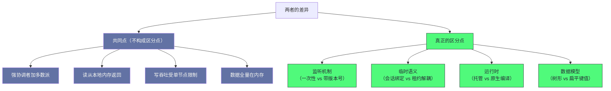

# 06 ZooKeeper vs ETCD——架构对比与去 ZooKeeper 化趋势

**摘要：**

这两套协调方案的对比，最值得看的是**"同一类需求下的不同取舍"**——它们都是"强协调者加多数派"的共识系统，因此"写吞吐的上限相同"；而**差异集中在四处**：**"监听机制"**（一次性通知 vs 带版本号的持久监听）、**"临时语义的实现"**（与会话绑定 vs 独立租约）、**"运行时"**（托管运行时 vs 原生编译）、**"数据模型"**（树形 vs 扁平键值）。而"去依赖化"这处趋势的动机，也主要来自后两处——**因为"运行时的停顿会影响心跳"、"而树形模型不适合存放大量同类对象"。** 本文按"架构与协议对比 → 性能对比 → 运维复杂度 → 去依赖化的动机与代价 → 选型框架"展开。先说明共识协议、监听机制、数据模型、临时语义、运行时五处差异；再对比读性能、写性能与规模边界。然后是运维复杂度的差异、以及"去掉外部协调依赖"这处趋势的动机、实现思路与代价。最后是选型框架、边界反例与整个专栏的总结。

---

## 第 1 章 架构与协议对比

### 1.1 共识协议的差异

**两套方案使用不同的共识协议，而它们的差异集中在四处。**

| 维度 | 本方案 | 替代方案 |
|---|---|---|
| 选举依据 | 最大事务标识优先 | 随机超时先发起 |
| 日志复制 | 两阶段（提议加提交） | 单阶段追加（多数确认后提交） |
| 崩溃恢复 | 显式同步阶段 | 通过追加隐式修复 |
| 成员变更 | 通常需要滚动重启 | 支持在线成员变更 |

**这张表里最值得留意的是"后两行"**：**它们"决定了'运维的便利程度'"**——**因为"在线成员变更'让'扩缩容不需要停机'"**——**而"显式恢复阶段'让'恢复逻辑更直接但更复杂'"。

**而"前两行的差异'对使用者的影响较小"**：**因为"它们'都是'多数派确认的强协调者模型'"**——**因此"从'可用性与正确性'的角度看'两者等价'"。

**这条对照的实践含义是"选择时'应当重点看'运维相关的差异'"**——**因为"共识层面的差异'对使用者基本不可见'"。** **这与第 2 篇讲的"共识协议的差异往往在工程细节"是同一判断。

### 1.2 监听机制的设计哲学

**监听机制的差异是两者最本质的差异，而它值得展开。**

**本方案的设计是"一次性通知且不携带内容"**——**因此"客户端收到通知后'必须重新读取'"**——**而"在'通知到达'与'重新读取'之间'存在变更遗漏窗口'"。

**替代方案的设计是"带版本号的持久监听"**——**因此"客户端可以'指定从某个版本开始监听'"**——**而"服务端'保证'把该版本之后的全部变更事件'按顺序推送'"。

**因此"替代方案的监听在语义上更强"**：**因为"它'不会遗漏事件'"**——**而"即使客户端断线重连'，只需告知上次处理的版本号'，就能'收到中间的全部事件'"。

**这处差异的代价落在两侧**：**"本方案'用'服务端不保存变更历史'换'内存可控'"**；**"替代方案'需要'保存一段变更历史'，因此'需要'定期压缩'"（因为"历史会无限增长"）。

**因此"两者的取舍是'客户端复杂度'与'服务端存储'之间的交换"**——**而"这处交换的结果'取决于'使用场景'"**：**"如果'消费方需要感知每一次变更'"（例如"控制器需要感知对象的每一次变化"）——**那么"带版本号的监听'更合适'"；**"如果'只需要'最终状态'"——**那么"一次性通知加重新读取'已经足够'"。

### 1.3 数据模型对比

**数据模型的差异可以按五个维度并列。**

| 维度 | 本方案 | 替代方案 |
|---|---|---|
| 结构 | 树形命名空间 | 扁平键值（用前缀组织层次） |
| 单值大小 | 有限制 | 有限制（通常更宽松） |
| 类型 | 四种节点类型 | 只有键值，用租约实现临时语义 |
| 事务 | 单操作原子 | 支持条件事务（比较并交换） |
| 版本 | 每个节点独立版本 | 全局递增版本 |

**这张表里最值得留意的是"事务"与"版本"两行**：**"条件事务'让'多个键的原子更新'成为可能'"**——**而"全局版本'让'跨键的一致快照读'成为可能'"。** **这两处能力"是'树形加单操作原子'的模型所不具备的'"。

**而"单值大小'与'类型'两行的差异'对使用者的影响较小'"**——**因为"两者都限制单值大小'，而'临时语义'两者都能表达'"。

**因此"数据模型的差异'集中在'多键操作'与'一致快照'两处能力上'"**——**而"这两处能力'正是'存储大量同类对象的场景'所需要的'"（第 4 章展开这处联系）。### 1.6 一处关于"API 语义"的观察

**"两者的 API 语义差异"值得说明，因为它"决定了迁移的成本"。**

**差异集中在三处**：**"监听的注册方式'"**（"一次性注册 vs 带版本号的持续监听"）、**"临时语义的表达'"**（"会话加临时节点 vs 租约加关联键值"）、**"多键操作的表达'"**（"无 vs 条件事务"）。

**三处差异的共同特征是"它们都'改变使用者的编程模型'"**——**因此"迁移'需要'重写相关代码'，而不是'只换客户端库'"。

**因此"迁移成本的估算'应当'按'这三处的使用广度'评估'"**——**而"如果'应用中大量使用一次性监听'，那么'迁移的改动面会很大'"。

**这条观察的通用性在于"它说明'迁移成本取决于语义差异的覆盖面'"**——**而"语义差异'比'接口差异'更难适配'"（因为"接口可以包装，而语义需要重写逻辑"）。** **这与第 4 篇讲的"迁移必须有退出条件"是同一判断。### 1.8 一处关于"一致性选项"的观察

**"两者的一致性选项"值得说明，因为"它影响'读路径的设计'"。**

**两者的共同点是"默认读可能落后'"**——**而"都提供'获取最新读'的方式'"。

**差异在于"获取方式的语义"**：**本方案'用'一次显式的同步操作'"**——**而"替代方案'用'带确认的读请求'"。

**这处差异的实践含义是"迁移时'需要'重写'获取最新读'的代码'"**——**而"这类'语义相近但接口不同'的部分'是迁移中最容易出错的地方'"（因为"它看起来相似，实际语义有细微差别"）。

**因此"迁移清单里'应当'单独列出'所有涉及一致性的调用点'"**——**而"这类'看起来相似的部分'需要'逐个确认语义'"。** **这与第 3 篇讲的"迁移必须按语义确认"是同一类。

### 1.9 一处关于"版本语义"的观察

**"版本语义的差异"值得说明，因为"它影响'并发控制的设计'"。**

**本方案的版本是"每个节点独立递增'"**——**因此"它只能用于'单个节点的乐观并发控制'"。

**替代方案的版本是"全局递增'"**——**因此"它'既能用于'单键的条件更新'"**，**也能"用于'跨键的一致快照读'"。

**这处差异的意义在于"全局版本'让'快照读的实现更简单'"**——**因为"只需'记录一个版本号'"**——**而"本方案的'跨节点一致快照'需要'额外的机制'"。

**因此"在'需要跨键一致读'的场景下'替代方案更有优势'"**——**而"这类场景'正是'存储大量关联对象的场景'"。** **这与第 1.3 节讲的"数据模型差异集中在多键操作与一致快照"是同一处。

### 1.7 一处关于"生态集成"的观察

**"生态集成"这处维度值得说明，因为它"往往是决定性的"。**

**具体表现是"某些组件'深度依赖某一套协调方案'"**——**而"替换它'需要'该组件自身支持替换'"**——**而"如果'组件不支持'，那么'迁移就无从谈起'"。

**因此"生态集成'是一处'硬约束'"**——**而"它'不受'技术优劣的影响'"。

**而"这也解释了'为什么替代过程是渐进的'"**：**因为"每个组件'的替换进度'取决于'它自身是否支持'"**——**因此"整体替代'需要'逐个组件推进'"。

**这条观察的通用性在于"它说明'技术替换的节奏由生态决定'"**——**而"单个组件的优劣'不决定'替换速度'"。** **这与第 8 篇讲的"客户端升级缓慢是硬约束"是同一判断。

### 1.4 临时语义的实现差异

**"临时语义"的实现方式不同，而它体现了"耦合与解耦的取舍"。**

**本方案的做法是"把临时节点与会话绑定"**——**因此"同一会话的所有临时节点'在会话超时时'一起消失'"。

**替代方案的做法是"把租约与键值解耦"**：**"租约是独立对象'，而'键值可以关联到租约'"——**因此"一个租约'可以关联多个键值'"**，**"而'不同键值可以关联不同租约'"。

**这处解耦带来的灵活性有三处**：**"不同键值可以有不同的存活策略'"**、**"多个实例可以共享一个租约'"**、**"租约的续约与键值的读写可以独立进行'"。

**而它的代价是"多了一层概念"**：**因为"使用者需要理解'租约与键值的关系'"**——**而"本方案的'会话加临时节点'更直观"。

**因此"这处取舍是'灵活性'与'概念简单性'之间的交换"**——**而"它体现了'解耦往往带来灵活性但也带来概念负担'这处通用规律"。 **而"这处规律在别处也出现"**——**例如"接口与实现的分离"同样"带来灵活性，但增加了理解成本"。**

### 1.5 运行时实现的影响

**运行时的差异是三处，而它们"都指向同一处风险"。**

**第一处是"停顿的表现不同"**：**托管运行时的停顿'可能达到数百毫秒甚至数秒'"**——**而"原生编译运行时的停顿'通常在毫秒级以内'"。

**第二处是"内存开销不同"**：**托管运行时'本身占用较多内存'"**——**因此"相同功能下'它的内存占用更高'"。

**第三处是"容器化友好度不同"**：**托管运行时'与容器的内存限制交互复杂'"**——**而"原生编译程序'对容器资源限制的适配更自然'"。

**三处差异的共同特征是"它们都指向'停顿对心跳的影响'"**——**因为"停顿会让'心跳延迟'，而'心跳延迟'会'触发不必要的重新选举'"（第 5 篇已展开这处链条）。** **因此"运行时的差异'最终体现为'集群稳定性上的差异'"。

**这条分析的实践含义是"评估运行时影响时'应当'看'停顿是否可能超过超时参数'"**——**而不是"看'平均停顿'"**——**因为"决定稳定性的是'最坏情况的停顿'"。
---

## 第 2 章 性能对比

### 2.1 读性能

**两者的读路径都"从本地内存返回"，因此延迟都极低。**

**而差异在于"一致性选项"**：**本方案"允许读落后，且提供显式同步来获得最新读'"**；**替代方案"默认允许落后，同时提供'线性化读'选项'"——**而"线性化读'通过'把请求路由到协调者并确认读位置'来保证最新'"。

**因此"两者的读能力等价，差别在'获取最新读的方式'"**：**"本方案'用'一次显式同步'"**；**"替代方案'用'一次带确认的读'"。

**一处实践含义是"两者都需要'为强一致读付额外往返'"**——**因此"在设计上'应当'尽量让读容忍轻微滞后'"**——**因为"强一致读的成本'是'一次网络往返'"。** **这与第 1 篇讲的"默认低要求、按需提升"是同一策略。

### 2.2 写性能

**两者的写性能上限"由同一处结构决定"。**

**共同的结构是"所有写经过协调者串行化'"**——**因此"写吞吐的上限'由'单节点的处理能力'决定'"——**而"增加节点'只会增加写延迟'"。

**因此"两者在写吞吐上没有本质差异"**——**而"差异在'细节优化'"**：**例如"两阶段与单阶段'的往返次数差异'"**、**"批量提交的实现差异'"。

**这条对照的实践含义是"写性能'不应当作为'两者选型的主要依据'"**——**因为"它们在这一点上'受同一处约束'"。** **因此"如果'写吞吐是瓶颈'"——**那么"换方案'解决不了问题，只能'优化单节点'"。### 2.7 一处关于"负载特征"的观察

### 2.8 一处关于"批量策略"的观察

**"批量策略对两者都有效"这处事实值得说明。**

**因为"两者的写延迟都包含一次多数派往返"**——**因此"把多个写请求打包'能让这次往返被多个请求共享"**。

**这处共享的收益"与批大小成正比"**——**而"代价是'单个请求的等待时间增加"**。

**因此"批量策略的调优'与具体方案无关，而与负载特征相关"**——**而"这处结论说明'有些优化是跨方案通用的"**。

**这条观察的通用性在于"它提醒'先找共同的可优化点，再考虑换方案"**——**因为"换方案解决不了共性问题"。**

**"负载特征如何影响两者表现"这处问题值得说明。**

**关键特征是"读写比例与请求大小'"**：**"读多写少'则两者的差异'主要体现为'监听机制'"**；**"写密集'则'两者都受单节点限制'"**；**"大请求'则'两者都受单值上限限制'"。

**因此"负载特征'决定了'哪处差异会显现'"**——**而"在'不同的负载下'同一个差异的重要性完全不同'"。

**这处观察的实践含义是"性能对比'必须'在自己的负载特征下进行'"**——**因为"基准测试的负载特征'通常与'实际负载'不同'"。

**这条观察的通用性在于"它说明'性能结论必须绑定负载条件'"**——**而"脱离负载的性能对比'没有决策价值'"。** **这与第 4 篇讲的"设计的有效性依赖规模假设"是同一判断。

### 3.7 一处关于"客户端生态"的观察

**"客户端生态"这处维度值得说明，因为它"影响接入成本"。**

**具体表现是"客户端库的成熟度与语言覆盖'"**——**而"这决定了'接入时的改造成本'"。

**两者的共同点是"都有'主流语言的客户端'"**——**而差异在"某些语言或框架的集成完善度'"。

**因此"评估时'应当'看'自己所用语言与框架的支持情况'"**——**而"这类'具体的生态细节'往往比'宏观的能力对比'更影响接入成本'"。

**这条观察的通用性在于"它提醒'评估要落到自己的技术栈上'"**——**而"泛化的对比'会掩盖'具体技术栈上的差异'"。** **这与第 5 篇讲的"评估要按目标规模进行"是同一判断。

### 2.3 规模边界

**两者的规模边界"由同一处约束决定，但宽松度不同"。**

**共同约束是"数据全量在内存中"**——**因此"总容量'受单机内存限制'"。

**而差异在"单值大小与总容量上限"**：**替代方案的'单值上限更宽松'，且'总容量有明确的可调上限'"**——**而"本方案'单值上限更紧'，且'总容量没有显式配置'"（"实际受堆大小限制"）。

**因此"在'需要存储大量对象'的场景下'替代方案更有优势'"**——**因为"它'对单值与总容量都有更明确的支持'"。

**一处重要提醒是"两者都不适合'存储大对象'"**——**因为"它们的定位都是'协调原语'"**（第 1 篇已展开这条设计边界）。** 因此"需要'存大对象'时'应当用对象存储或数据库'，而不是'协调服务'"。### 2.4 一处关于"性能对比"的观察

**"性能对比"这处做法本身值得说明，因为它"容易被误用"。**

**误用的形态是"拿'厂商或社区的基准测试数字'直接比较"**——**而"这些数字'来自特定配置与负载'"**——**因此"它们'只说明'那个场景下的相对关系'"。

**因此"性能对比的正确做法是'在自己的负载下实测'"**——**而"实测时'应当'关注'最坏情况的延迟'，而不是'吞吐峰值'"。

**"关注最坏情况"这处取向值得强调**：**因为"协调服务的价值在于'提供可靠的一致性'"**——**而"它的性能问题'通常表现为'偶发的长延迟'"——**因此"平均吞吐'对它的评估价值有限'"。

**这条观察的通用性在于"它说明'基准测试必须与使用场景匹配'"**——**而"用'别人的数字'做决策'会'引入未知的偏差'"。** **这与第 5 篇讲的"选型指标必须与被优化的路径匹配"是同一判断。

### 2.5 一处关于"资源效率"的观察

**"资源效率"这处维度值得说明，因为它"在规模化部署时被放大"。**

**差异的形态是"基础内存占用不同"**——**而"在'单实例'场景下'这点差异可以忽略'"——**但"在'成百上千个实例'的场景下'差异会累积成显著的成本'"。

**因此"资源效率的重要性'与部署规模成正比'"**——**而"这类'单点差异小、规模放大后显著'的因素'容易被单实例评估忽略'"。

**这条观察的通用性在于"它提醒'评估要按目标规模进行'"**——**而"单实例测试'得不出'规模化的结论'"。** **这与第 4 篇讲的"设计的有效性依赖规模假设"是同一判断。

---

## 第 3 章 运维复杂度

### 3.1 部署与依赖

**部署复杂度有三处差异。**

**第一处是"运行时依赖"**：**本方案'需要'外部运行时环境'"**——**而"替代方案'是单一可执行文件'"。

**第二处是"启动速度"**：**本方案'启动较慢'"**（因为"需要初始化运行时"）——**而"替代方案'秒级启动'"。

**第三处是"资源开销"**：**本方案'基础内存占用更高'"**——**而"替代方案'更轻量'"。

**三处差异的共同特征是"它们都源于'运行时的差异'"**——**而"这类差异'在'容器化与快速扩缩容'的场景下'被放大'"。** **因此"云原生环境'更倾向'替代方案'，这是'运行时的差异'在'部署效率'上的体现'"。

### 3.2 日常运维

**日常运维的差异集中在三处。**

**第一处是"成员变更"**：**替代方案'支持在线成员变更'"**——**而"本方案'通常需要滚动重启'"。

**第二处是"空间管理"**：**两者都'需要配置清理策略'"**——**而"替代方案'多了一处'历史版本压缩'"。

**第三处是"观测能力"**：**两者都'提供内置的诊断接口与指标'"**——**而"具体能力'各有侧重'"。

**三处差异的共同特征是"它们都在'运维便利性'的维度上"**——**而"这类差异'会'随时间累积'"（因为"运维操作会反复发生"）。** **因此"评估时'应当把'运维频率'作为权重'"——**因为"高频操作的便利性差异'会被放大'"。

### 3.3 排障难度

**排障难度的差异值得说明，因为它"不体现在文档里"。**

**本方案的排障难点在于"停顿的影响"**：**因为"停顿会'表现为'心跳超时与选举'"——**因此"排查时'需要'把停顿与网络问题区分开'"——**而这需要"回收日志"。

**替代方案的排障难点在于"压缩与历史"**：**因为"历史版本'会'被定期压缩'"——**因此"排查时'需要'注意'可查询的历史范围'"——**而"压缩策略不当'会让'某些历史无法查询'"。

**两者的共同特征是"它们的排障难点'都源于各自的核心设计'"**——**而"这类'由设计带来的排障特点'不会因为'实现优化'而消失'"。** **因此"熟悉'自己所用方案的核心设计'，是'排障效率的前提'"。### 3.4 一处关于"监控差异"的观察

### 3.8 一处关于"知识传递"的观察

**"运维知识的可传递性"这处维度值得说明。**

**两者都"需要'对核心设计的理解'才能高效运维"**（第 3.3 节）——**因此"知识传递的成本'与'设计的复杂度'相关"**。

**而"设计复杂度'又'与'概念数量'相关"**：**本方案的核心概念是四个**——**而"替代方案的核心概念'包括键值、租约、版本、压缩等"**。

**因此"概念数量多的方案'学习成本更高，但也提供更多能力"**——**而"这处取舍与第 1.4 节讲的'灵活性 vs 概念简单性'是同一处"**。

**而这处取舍与团队的技术储备直接相关**——**因此"它应当作为选型的一处输入，而不是被忽略的细节"。** **因此"团队能力是选型的硬约束，而不是可以事后补足的条件"。**

**而这处取舍与团队的技术储备直接相关**——**因此"它应当作为选型的一处输入，而不是被忽略的细节"。**

**"两者的监控能力差异"值得说明。**

**共同点是"都提供'内置诊断接口与指标导出'"**——**因此"基础的观测能力'两者都具备'"。

**而差异在"指标的侧重"**：**本方案'更侧重'停顿与集群状态'"**——**而"替代方案'更侧重'版本与压缩'"。

**这处差异的根源是"两者的核心风险不同"**（第 3.3 节）——**因此"监控的侧重'恰好反映了'各自最需要观察的部分'"。

**因此"评估监控能力时'应当'看'它是否覆盖了该方案的核心风险'"**——**而不是"看'指标数量'"。** **这与第 5 篇讲的"告警应当指向具体方向"是同一判断。### 2.6 一处关于"延迟构成"的观察

**"延迟构成"这处问题值得说明，因为它"决定了两者的可优化空间"。**

**写延迟的构成是三段**：**"客户端到协调者的网络往返'"**、**"协调者的处理'"**、**"多数派确认的往返'"。

**三段里"网络与确认两段'是主要构成"**——**而"处理段'占比较小'"。** **因此"写延迟的优化空间'主要在'网络拓扑与批量提交'"**——**而"不在'单机处理能力'"。

**这处分析的意义在于"它说明'换方案无法改善写延迟'"**——**因为"两套方案'的三段构成相同'"。** **因此"写延迟问题'只能通过'部署拓扑与批量策略'解决'"。

**这条观察的通用性在于"它把'延迟优化'指向了'网络与批量'两处"**——**而"这类'从构成出发的优化'比'换组件'更有效'"。** **这与第 5 篇讲的"写延迟由网络拓扑决定"是同一判断。

### 3.6 一处关于"升级路径"的观察

**"升级路径"这处问题值得说明，因为它"影响长期维护成本"。**

**本方案的升级'通常需要'滚动重启'"**——**因此"升级期间'有可用性影响'"。

**替代方案的升级'支持'滚动重启且成员变更在线'"**——**因此"升级对可用性的影响更小'"。

**这处差异的意义在于"它让'升级频率'成为一处考量"**——**因为"如果'升级频繁'，那么'影响较小的方案'更合适'"。

**因此"评估升级路径时'应当'结合'预期升级频率'"**——**而"这类'频率乘以单次影响'的评估方式'适用于所有'运维操作'"。** **这与第 5 篇讲的"运维便利性差异会被高频操作放大"是同一判断。

### 4.6 一处关于"适用场景"的观察

**"内建协调的适用场景"值得再明确一次。**

**适用的是"协调数据量大、变更频繁、且对停顿敏感"的场景**——**例如"需要'存储大量资源对象并监听其变化'的场景'"。

**而"不适用的是'低频协调'的场景"**——**例如"分布式锁与选主'"——**因为"这类场景下'协调操作本身频率低'"——**因此"外部依赖的代价小'，而'内建协调的复杂度是持续的'"。

**因此"判断依据可以归纳为'协调操作的频率乘以数据规模'"**——**而"这个乘积越大'，内建协调越有优势'"。

**一处补充是"这处判据的边界"**：**它假设外部协调服务的代价与协调操作的频率相关。** **而在协调操作频率极低的场景下，这处代价确实很小**——**因此判据的结论是可靠的。**

**一处补充是"这处判据的边界"**：**它假设"外部协调服务的代价'与'协调操作的频率'相关"。** **而在"协调操作频率极低"的场景下，这处代价确实很小"**——**因此"判据的结论是可靠的"。**

**一处补充是"这处判据的另一面"**：**如果"协调操作的频率与数据规模都很小"，那么"外部协调服务的代价可以忽略"。** **而"此时'引入内建协调'只会带来'不必要的复杂度"。** **这处"小规模下外置更划算"的结论，与"大厂内建"的表面印象相反，值得留意。**

**这条观察的通用性在于"它给出了'内建还是外置'的量化判据"**——**而"量化判据'比'定性描述'更利于决策'"。** **这与第 5 篇讲的"容量规划应当先量化三个输入"是同一方法。

### 3.5 一处关于"备份与恢复"的观察

**"两者的备份方式差异"值得说明。**

**本方案的备份是"复制快照与日志文件'"**——**而"恢复是'加载快照加重放日志'"（第 4 篇已展开）。

**替代方案的备份是"创建快照并复制'"**——**而"恢复是'从快照重建加追赶增量'"。

**两者的共同特征是"它们都'需要'在'数据量、恢复时间、一致性'之间取舍"**——**而"这类取舍'与'持久化机制的设计'直接相关'"。

**因此"备份方案的设计'应当'基于对'持久化机制的理解'"**——**而不是"照搬'通用备份工具的做法'"。** **这与第 4 篇讲的"快照不能替代备份"是同一判断。

### 4.5 一处关于"内建协调"的观察

**"内建协调的具体形态"值得说明。**

**形态是"把'协调所需的能力'拆成两部分"**：**"共识能力'由'组件内部的共识模块'提供'"**——**而"协调语义'由'组件自己的业务逻辑'实现'"。

**这处拆分的收益是"共识部分'可以复用成熟的实现'"**——**而"协调语义'可以'按组件需求定制'"。

**而"这处拆分的风险是'两部分的边界'容易被模糊"**——**例如"业务逻辑'可能'依赖共识层的内部细节'"——**因此"升级共识层'会'牵连业务逻辑'"。

**因此"内建协调的关键是'保持两部分的清晰边界'"**——**而"这处边界'与'独立服务中'服务端与客户端'的边界是同一性质'"。** **这与第 1 篇讲的"架构分界线画在哪里"是同一问题。
**一处补充是"边界模糊的典型表现"**：**业务代码直接读取共识层的内部状态，或依赖共识层的实现细节做判断。** **这类代码在共识层升级时最容易出问题**——**而它也是内建协调方案里最常见的隐性债务。**

**一处补充是"这处边界与第 1 篇讲的隔离层次同源"**：**共识层与业务层的边界，和"逻辑隔离与物理隔离"的边界一样，都是"职责划分问题"。** **而"划分清楚，升级才不会牵连"**——**而"这类边界意识，是内建方案能否长期维护的关键"。**

**一处补充是"边界模糊的典型表现"**：**业务代码"直接读取共识层的内部状态"，或"依赖共识层的实现细节做判断"。** **这类代码"在共识层升级时最容易出问题"**——**而"它也是内建协调方案里最常见的隐性债务"。**

---

## 第 4 章 去依赖化的动机与代价

### 4.1 三处动机

**"去掉外部协调依赖"这处趋势有三处动机。**

**第一处是"减少组件数量"。** **因为"每个外部依赖'都意味着'一套需要运维的基础设施'"**——**因此"去掉它'能'降低运维复杂度'"。

**第二处是"避免运行时停顿的影响"。** **因为"外部协调服务'的停顿会'传导为'被协调系统的抖动'"**——**因此"把协调逻辑'内建到'原生编译的组件里'，能'消除这处传导'"。

**第三处是"适应数据模型的差异"。** **因为"某些场景'需要'存储大量同类对象'"**——**而"树形模型'在这种场景下'不够自然'"**——**因此"把协调内建'可以'选用更合适的数据模型'"。

**三处动机的共同特征是"它们都在'减少外部约束'"**——**而"这类动机'在'系统规模变大后'会变得更强烈'"（因为"外部依赖的代价'会随规模放大"）。

### 4.2 实现思路

**"内建协调"的实现思路有三处共性。**

**第一处是"复用已有的共识逻辑"。** **因为"内建协调'仍然需要'共识'"**——**因此"实现上'通常是'把共识协议'嵌入到'组件内部'"。

**第二处是"复用已有的数据存储"。** **因为"协调数据'需要持久化'"**——**因此"实现上'通常是'把协调数据'存到'组件自己的日志里'"。

**第三处是"保留对外的兼容接口"。** **因为"客户端'已经习惯了'原有的交互方式'"**——**因此"实现上'通常提供'与外部协调服务语义相近的接口'"。

**三处共性的共同特征是"它们都在'复用而非重写'"**——**而"这类'复用已有机制'的做法'在本专栏里反复出现'"（第 1 篇的"降级为普通数据"、第 3 篇的"复用封装库"）。

### 4.3 代价

**"内建协调"有三处代价。**

**第一处是"组件复杂度上升"。** **因为"组件'要同时承担'业务功能与协调功能'"**——**因此"它的代码量与测试面都增加'"。

**第二处是"升级耦合"。** **因为"协调逻辑'与'业务逻辑'在同一个组件里'"**——**因此"升级协调逻辑'需要'升级整个组件'"。

**第三处是"复用性下降"。** **因为"内建协调'只服务于'这一个组件'"**——**因此"其他组件'无法复用它'"**——**而"这'与'独立协调服务能被多方复用'形成对比'"。

**三处代价的共同特征是"它们都在'从'共享'走向'独享'"**——**而"这处转变的取舍是'减少外部依赖'与'增加内部复杂度'"。** **因此"该不该内建'取决于'哪一侧的代价更大'"**——**而"这处判断'与'是否需要独立协调服务'是同一问题的两面'"。

### 4.4 一处关于"趋势"的观察

**"去依赖化"这处趋势的适用边界值得说明，因为"趋势容易被过度推广"。**

**趋势的适用范围是"需要'高频协调且对停顿敏感'的场景"**——**例如"需要'存储大量同类对象并监听其变化'的场景'"。

**而"它不适用于'低频协调'的场景"**：**因为"这类场景下'外部依赖的代价很小'"**——**而"内建协调'带来的复杂度'却是持续的'"。

**因此"判断依据是'协调操作的频率与对停顿的敏感度'"**——**而不是"趋势本身'"。

**一处补充是"敏感度的判断方式"**：**它取决于被协调系统自身的延迟要求。** **而"如果被协调系统本身就有秒级延迟，那么停顿的影响可以忽略"**——**因此"敏感度必须结合被协调系统评估"。**

**一处补充是"敏感度的判断方式"**：**它取决于"被协调系统'自身的延迟要求"。** **而"如果'被协调系统'本身就有秒级延迟，那么停顿的影响可以忽略"**——**因此"敏感度'必须'结合被协调系统评估"。**

**这条观察的通用性在于"它把'技术趋势'还原为'具体场景的取舍'"**——**而"以场景为依据的判断'比'跟随趋势'更可靠'"。** **这与第 7 篇讲的"迁移应当由痛点驱动"是同一判断。
---

## 第 5 章 选型框架

### 5.1 四问

**选型可以按四个问题推进。**

**第一问是"协调操作的频率有多高"。** **因为"低频场景下'外部依赖的代价很小'"**——**因此"不必为了低频协调'引入内建方案'"。

**第二问是"是否对停顿敏感"。** **因为"停顿会'传导为'被协调系统的抖动'"**——**因此"如果'被协调系统'本身对延迟敏感'，那么'停顿的影响会被放大'"。

**第三问是"数据模型是否匹配"。** **因为"需要'存储大量同类对象'时'树形模型不够自然'"**——**因此"这类场景'更倾向'扁平键值加全局版本'"。

**第四问是"团队是否有能力维护它"。** **因为"这个组件'对运行环境敏感'"**（第 5 篇已展开）——**因此"维护能力'是选型的硬约束'"。

**四问的共同特征是"它们按'场景需求、技术匹配、团队能力'的顺序排列"**——**而"前两问决定'是否需要替代'，后两问决定'能否用好替代'"。

### 5.2 三处常见误判

**选型有三处常见误判。**

**误判一：把"趋势"当作"依据"。** **因为"趋势'是'多个场景结论的汇总'"**——**而"它不回答'当前场景是否适用'"。

**误判二：把"写性能"当作"选择依据"。** **因为"两者在这一点上'受同一处约束'"**（第 2.2 节）——**因此"写性能'不构成区分点'"。

**误判三：把"功能清单"当作"选择依据"。** **因为"两者的功能'高度重叠'"**——**而"差异在'实现细节与运维特性'"。

**三处误判的共同特征是"它们都在'用不构成区分点的因素做决策'"**——**而"这类误判'会让选型变成'偏好之争'"。** **因此"选型的第一步是'找出真正的区分点'"**——**而"本对比里的区分点'集中在'监听机制、临时语义、运行时、数据模型'四处'"。### 5.4 两者差异的整体视图

**一处补充是"区分点会随场景变化"**：**在需要感知每一次变更的场景下，监听机制是首要区分点**——**而在需要大量对象存储的场景下，数据模型与容量上限成为首要区分点。**

**一处补充是"排除共同点的具体做法"**：**先把两者的共同点列出来并划掉**——**而"剩下的才进入讨论"。** **这处做法能在讨论开始前就把范围缩小一半。**

**一处补充是"排除共同点的具体做法"**：**先把两者的共同点列出来并划掉**——**而"剩下的才进入讨论"。** **这处做法'能'在讨论开始前就把范围缩小一半"。**

**一处补充是"区分点会随场景变化"**：**在"需要'感知每一次变更'的场景下，监听机制是首要区分点"**——**而在"需要'大量对象存储'的场景下，数据模型与容量上限成为首要区分点"。** **因此"区分点不是固定的清单，而是随场景重新排序的列表"。**

把两者的差异按"是否构成区分点"归类，能看清"哪些差异值得关注"。

**图中最值得注意的是"共同点占了四处"**——**而"这四处恰好是'共识系统的固有性质'"**——**因此"它们'不能作为区分依据'"。

**而"真正的区分点集中在四处"**——**而"它们分别对应'编程模型、语义表达、运行时行为、数据组织'"——**因此"选型讨论'应当围绕这四处展开'"。

**一处补充是"四处的相互关系"**：**运行时影响稳定性，数据模型影响能力边界，监听机制影响编程模型，而临时语义影响使用方式。** **因此"四处的权重应当按场景最在意什么排序，而不是平均对待"。**

**而"这处排序本身就是选型讨论的核心工作"**——**因为"排序依据来自对自身场景的理解，而不是对方案的了解"。** **因此"选型讨论的第一步，应当是把场景特征写清楚"。**

**这张图的实用价值在于"它给出了一份'选型讨论的议题清单'"**——**而"按这份清单讨论'能'避免'在共同点上争论'"。

### 5.5 一处关于"迁移成本"的观察

**"迁移成本"这处问题值得说明，因为它"常被低估"。**

**成本的构成有三处**：**"代码改动'"**（"重写监听与临时语义相关逻辑"）、**"运维改造'"**（"重建监控、备份、演练流程"）、**"知识更新'"**（"团队重新学习一套机制"）。

**三处成本的共同特征是"它们都'不体现在'功能清单的对比里'"**——**因此"只对比功能的选型'会'严重低估迁移成本'"。

**因此"迁移决策'应当'把这三处成本显式列出'"**——**而"这类'把隐性成本显性化'的做法'是'决策质量的前提'"。** **这与第 6 篇讲的"引入方案要考虑运维成本"是同一判断。

### 5.3 一处关于"共存"的观察

**"两者能否共存"这处问题值得说明，因为它"在现实中很常见"。**

**共存的形态是"不同场景用不同的方案"**——**例如"需要'大量对象存储与监听'的场景用替代方案'"**——**而"需要'与既有大数据生态集成'的场景用本方案'"。

**共存是合理的**：**因为"两者的定位'在不同场景下各有优势'"**——**而"强行统一'会让'某些场景'承受不必要的不匹配'"。

**而"共存的代价是'两套运维知识'"**——**因此"它'与'团队规模'相关'"：**"团队大'则'能承担两套知识'"；**"团队小'则'统一到一套更划算'"。

**因此"共存决策的实质是'场景匹配度'与'运维成本'的比较"**——**而"这处比较'与第 5 篇讲的'多集群决策'是同一框架'"。** **这与第 19 篇讲的"三种分布式事务路线可以共存"是同一判断**：**"逐场景选择'比'全局统一'更符合实际'"。

**一处补充是"共存的过渡形态"**：**实践中常见"新场景用新方案，旧场景维持现状"，而"不主动迁移旧场景"。** **这处"不主动迁移"的选择是合理的**——**因为"旧场景的迁移成本往往高于它带来的收益"。**

---

## 第 6 章 边界与反例

### 6.1 反例一：把"共识协议的差异"当作"选型依据"

两者在可用性与正确性上等价，**差异主要在工程细节**（第 1.1 节）。

### 6.2 反例二：把"一次性通知"当作"有缺陷"

它"用服务端不保存历史换内存可控"，是明确的取舍（第 1.2 节）。

### 6.3 反例三：把"租约解耦"当作"只是更灵活"

它"多了一层概念"，增加了理解成本（第 1.4 节）。

### 6.4 反例四：把"平均停顿"当作"评估依据"

决定稳定性的是最坏情况的停顿（第 1.5 节）。

### 6.5 反例五：把"写性能"当作"两者的区分点"

两者写吞吐受同一处约束（第 2.2 节）。

### 6.6 反例六：把"趋势"当作"选型依据"

趋势是多个场景结论的汇总，**不回答当前场景是否适用**（第 4.4 节）。

### 6.7 反例七：把"功能清单"当作"区分点"

两者功能高度重叠，**差异在实现与运维特性**（第 5.2 节）。

### 6.8 反例八：把"内建协调"当作"只有好处"

它带来"组件复杂度、升级耦合、复用性下降"三处代价（第 4.3 节）。

---

## 第 7 章 落点与专栏总结

### 7.1 本篇的落点

**回到开头：两者的对比最值得看什么？**

**值得看的是"同一类需求下的不同取舍"**——**它们的共同点是"强协调者加多数派"，因此"写吞吐上限相同"**；**而差异集中在"监听机制、临时语义、运行时、数据模型"四处**——**而"这四处差异'恰好解释了'去依赖化趋势的发生原因'"。

**而本篇最值得记住的一条判断是"共识层面的差异对使用者基本不可见"**：**因此"选型应当重点看运维相关的差异"**——**例如"成员变更是否在线"、"停顿的影响是否可接受"、"数据模型是否匹配"。

**另一条判断是"趋势不是依据"**：**"去依赖化'适用于'高频协调且对停顿敏感'的场景"**——**而"低频场景下'外部依赖的代价很小'，而'内建协调的复杂度却是持续的'"。** **因此"判断依据是场景的协调频率与敏感度，而不是趋势本身'"。

**最后一条判断值得留下：选型的第一步是找出真正的区分点。** **"用不构成区分点的因素做决策'，会让选型变成偏好之争"**——**而"找出区分点'需要'先把两者的共同点排除掉'"。** **这条方法'适用于所有技术选型'"。### 6.9 一处关于"对比方法"的观察

**"如何做技术对比"这处方法值得说明，因为"它决定了结论的质量"。**

**方法有三步**：**"先列出共同点并排除'"**、**"再从差异里找出真正的区分点'"**、**"最后按场景评估区分点的权重'"。

**三步的共同特征是"它们都在'缩小讨论范围'"**——**而"排除共同点'能'避免'在'不构成区分点的因素上争论'"。

**而"第三步最容易出错"**：**因为"区分点的权重'取决于场景'"**——**而"不同场景下'同一个区分点的重要性'可能相差很大'"。

**因此"对比结论'应当'附带'适用场景的限定'"**——**而不是"给出'一个方案更好的笼统结论'"。** **这与第 1 篇讲的"评估系统先看边界"是同一判断。

### 6.10 一处关于"长期演进"的观察

**"两者的长期演进方向"值得说明，因为它"影响长期选择"。**

**本方案的演进方向'偏向'稳定与兼容'"**——**因为"它的生态'以既有大数据组件为主'"——**因此"破坏性变更'会影响大量下游'"。

**替代方案的演进方向'偏向'功能扩展与云原生适配'"**——**因为"它的生态'以新组件为主'"——**因此"演进的自由度更大'"。

**这处差异的意义在于"它让'选择'带有'时间维度的考虑'"**——**即"选择不只是'当前哪个更合适'，还涉及'未来哪条演进线更符合自己的方向'"。

**因此"选型'应当'把'演进方向'作为一处输入'"**——**而"这类'时间维度'的考虑'在'长周期的基础设施选择里'尤为重要'"。** **这与第 6 篇讲的"迁移应当由痛点驱动"是互补的**：**"痛点决定'何时迁移'，演进方向决定'迁往哪里'"。

### 7.2 专栏总结

**本篇是这组笔记的收束，因此值得回顾整条线索。**

**这六篇覆盖了"从数据模型到一致性到应用到可靠性到运维到对比"的完整链路**：**第 1 篇讲"四个核心概念"**（数据模型、通知、会话、访问控制），**第 2 篇讲"它们如何在多节点间保持一致"**（共识协议），**第 3 篇讲"如何用它们搭出实际机制"**（锁、选主、服务发现、配置中心），**第 4 篇讲"崩溃后如何恢复"**（日志与快照），**第 5 篇讲"如何在真实环境里稳定运行"**（部署、监控、故障处理），**而第 6 篇讲"它在更大技术图景中的位置"**（与替代方案的对比）。

**而这条链路里反复出现的判断方式有六条**，它们比具体机制更值得记住：

**第一条是"所有基于超时的判断都是近似"**——**它适用于"会话超时、心跳超时、选举超时"三处**——**而"设计这类机制时应当先明确误判的后果"。

**第二条是"把全局竞争转化成局部排队"**——**它适用于"分布式锁与选主"两处**——**而"这处转化的工具是'有序节点'"。

**第三条是"用随机化替代集中协调"**——**它适用于"选举超时与快照触发"两处**——**而"这类手法避免了额外的协调开销"。

**第四条是"幂等性能消除对精确状态的需求"**——**它适用于"模糊快照、恢复重放、重试"三处**——**而"这处性质是'系统能容忍不精确'的基础"。

**第五条是"一处设计的放宽必然需要另一处设计的补足"**——**它适用于"模糊快照与更早位置重放"、"复用与心跳"两处**——**而"理解任何设计时应当同时找它的配套要求"。

**第六条是"容灾能力必须被演练验证，否则只能算假设"**——**它适用于"恢复流程、备份、降级"三处**——**而"这类机制的验证必须主动触发"。

**六条判断方式的价值在于"它们可以跨机制复用"**——**因为"具体机制会随版本变化，而判断方式不会"。** **因此"读这套笔记的目的"，不是"记住六个机制"，而是"获得一套分析分布式协调系统的判断方式"。

**最后一句话值得作为这组笔记的收束：这套系统里"几乎没有纯粹的好设计，只有与约束匹配的设计"**——**因为"每个机制都在回答某个具体的约束"，而"约束变了，机制就该变"。** **因此"理解约束"比"记住机制"更接近本质**——**而"这也解释了'为什么会出现替代方案'：不是原来的设计变差了，而是约束变了"。

---

## 专栏导航

- 上一篇：[[05 生产运维——部署、监控与故障处理]]。
- 返回专栏首页：[[00 专栏导览]]。

---

## 参考资料

1. Apache ZooKeeper. 官方文档：概览、编程指南与管理员指南. https://zookeeper.apache.org/doc/current/
2. ETCD. 官方文档：架构、API 与运维. https://etcd.io/docs/
3. Ongaro D, Ousterhout J. In search of an understandable consensus algorithm (Raft). USENIX ATC 2014.
4. Junqueira F P, Reed B C, Serafini M. Zab: High-performance broadcast for primary-backup systems. DSN 2011.
5. Apache Kafka. 官方文档：KRaft 模式与去 ZooKeeper 化. https://kafka.apache.org/documentation/
6. Kubernetes. 官方文档：控制面与 ETCD 的角色. https://kubernetes.io/docs/concepts/overview/components/
7. Apache ZooKeeper. GitHub 仓库与发布说明. https://github.com/apache/zookeeper
8. ETCD. GitHub 仓库与发布说明. https://github.com/etcd-io/etcd

---

> [!note] 思考题
> 1. 两者的写吞吐为什么"受同一处约束"？这处约束是什么？
> 2. 带版本号的持久监听比一次性通知强在哪？它的代价落在哪一侧？
> 3. "租约解耦"带来的灵活性与概念负担分别是什么？
> 4. 为什么"平均停顿"不能作为评估依据？决定稳定性的是什么？
> 5. "趋势不是依据"——那么判断"是否该去依赖化"的依据是什么？
