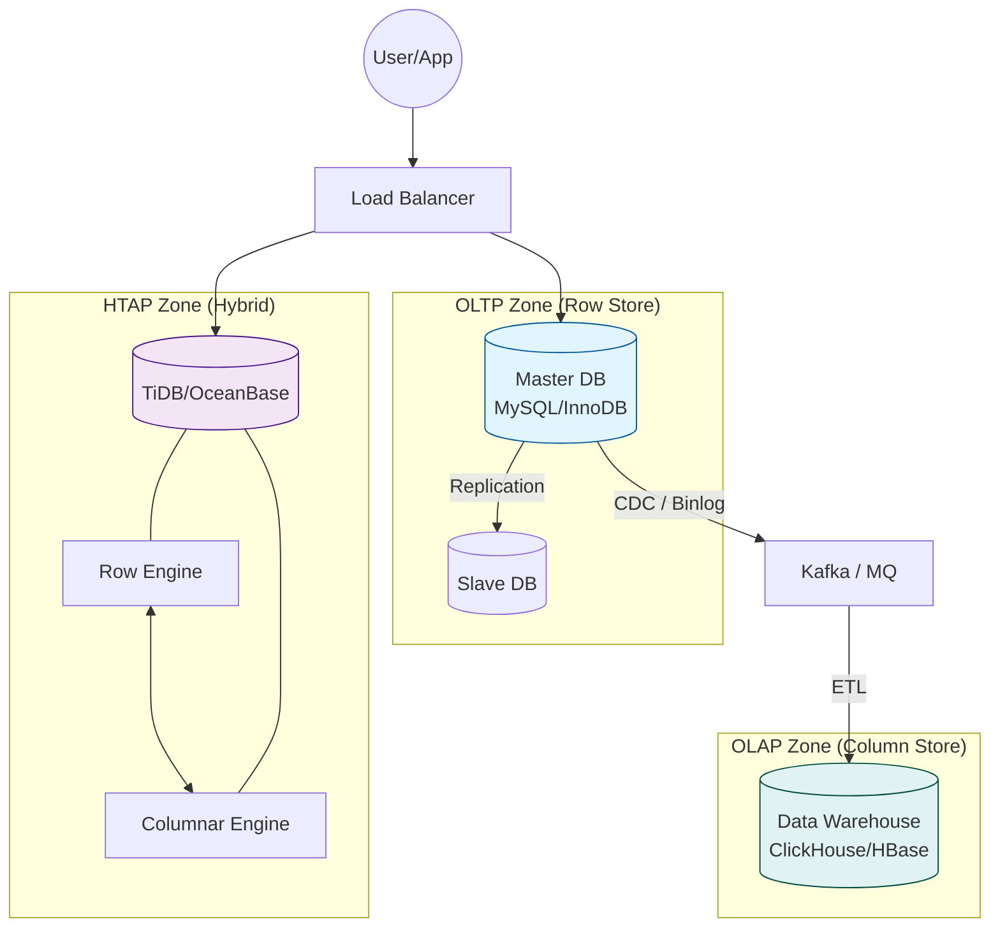
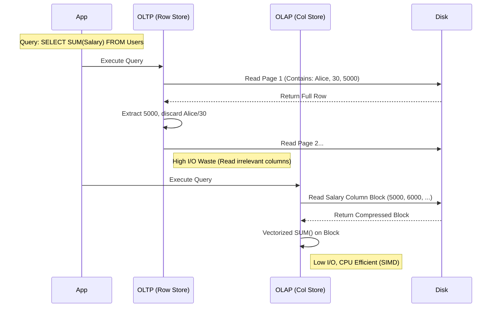

### 摘要

如果在系统设计中存在“银弹”，那一定是在做梦。存储系统的演进史，就是一部在**时延（Latency）**、**吞吐（Throughput）与**一致性（Consistency）**之间艰难走钢丝的历史。本文将剥离具体的数据库产品外衣，从底层的数据组织形式（Row-based vs Column-based）出发，深度解析 OLTP（在线事务处理）与 OLAP（在线分析处理）的本质对立，并探讨 HTAP（混合事务分析处理）是如何试图跨越这道“叹息之墙”的。我们将从磁盘布局的微观差异，一路推演到生产环境的架构选型。

---

## 第一部分：核心概念与底层图景 (The Context)

### 1.1 定义与隐喻：收银员、会计与超级经理

要理解这三种系统，我们可以把一家大型超市作为隐喻：

- **OLTP (On-Line Transaction Processing) 是“收银员”**：
    - **职责**：处理每一笔具体的交易。
    - **特点**：动作极其迅速（毫秒级），并发极高（千人排队），决不能出错（ACID 强一致性），每次只关心眼前这一位顾客（单行记录）。
    - **代表**：MySQL, PostgreSQL, Redis。
- **OLAP (On-Line Analytical Processing) 是“会计”**：
    - **职责**：每天关门后，统计今天的总销售额、哪个货架卖得最好。
    - **特点**：动作慢（秒级甚至小时级），吞吐量大（一次处理几百万条记录），只关心宏观趋势，不在乎单笔细节。
    - **代表**：ClickHouse, HBase, Hive.
- **HTAP (Hybrid Transaction/Analytical Processing) 是“超级经理”**：
    - **职责**：既能站柜台收银，脑子里还能实时通过刚才卖出的货计算出明天的进货策略。
    - **特点**：试图在同一套系统中同时满足高并发交易和实时分析。
    - **代表**：TiDB, OceanBase, CockroachDB.

### 1.2 架构全景图

下面的架构图展示了在一个现代数据栈中，这三者通常所处的位置及数据流向。



---

## 第二部分：机制原理深度剖析 (The Mechanism)

### 2.1 根本矛盾：行存储 vs 列存储

OLTP 和 OLAP 的核心区别，不在于 SQL 语法，而在于**磁盘上的数据物理布局**。这是存储引擎设计的原点。

- **行存储 (Row-based, NSM)**：将一行数据的所有列（Name, Age, Salary）连续存储。
    - **优势**：写入快（一次磁盘 Seek 就能写完一行），读取整行快。
    - **劣势**：做聚合分析（如 `SUM(Salary)`）时，必须把整行读入内存，浪费 I/O 带宽读取不需要的 Name 和 Age。
- **列存储 (Column-based, DSM)**：将同一列的数据（Salary, Salary, Salary）连续存储。
    - **优势**：只读取需要的列，极大节省 I/O；同类数据在一起，压缩率极高（Run-Length Encoding 等算法）。
    - **劣势**：写入慢（插入一行数据需要修改多个物理位置），读取整行慢（需要多次 Seek 拼凑）。

### 2.2 原理可视化：查询路径对比



### 2.3 深度分析：HTAP 的双核引擎

HTAP 试图解决的问题是：**避免 ETL 过程的数据延迟**。 典型的 HTAP 实现（如 TiDB 的 TiFlash）实际上是在内部维护了两套副本：

1. **行存副本**：服务于 OLTP，通过 Raft 协议保证强一致性。
2. **列存副本**：服务于 OLAP，通过 Raft Learner 机制异步（或同步）复制行存数据，并实时转换为列存格式。 **为什么这么设计？** 因为物理定律限制，你无法在一个物理结构上同时把“读整行”和“读单列”都做到极致。HTAP 的本质是用**空间（双副本）换时间（实时分析）**。

---

## 第三部分：架构/伪代码级实现 (The Code)

这里我们用伪代码来展示 OLTP 和 OLAP 引擎在处理相同数据时的结构差异。

### 3.1 关键数据结构定义

```go
// OLTP (Row-Oriented) - 类似 MySQL InnoDB Page
type RowPage struct {
    PageHeader  Header
    // 数据按行连续存储
    // [Header][Row1_ID, Name, Salary][Row2_ID, Name, Salary]...
    Body        []byte
}

// OLAP (Column-Oriented) - 类似 Parquet / ClickHouse
type ColumnChunk struct {
    ColumnName  string
    CompressionType string // e.g., LZ4, RLE
    // 数据按列连续存储
    // [Header][Salary1, Salary2, Salary3, ...]
    Body        []byte
    Min         interface{} // 用于 Data Skipping
    Max         interface{}
}
```

### 3.2 核心流程：扫描逻辑对比

```python
# 场景：计算所有员工的平均薪资

# OLTP 引擎的扫描逻辑 (慢)
def scan_oltp(table):
    total_salary = 0
    count = 0
    # 必须加载整个 Page 到内存（包含大量无用数据如 Name, Address）
    for page in table.pages:
        rows = parse_rows(page)
        for row in rows:
            total_salary += row.salary
            count += 1
    return total_salary / count

# OLAP 引擎的扫描逻辑 (快)
def scan_olap(table):
    total_salary = 0
    count = 0
    # 只加载 Salary 列的数据块
    salary_chunk = table.get_column("salary")

    # 1. 解压 (Decompress)
    data = decompress(salary_chunk)

    # 2. 向量化计算 (Vectorized Execution)
    # 利用 CPU SIMD 指令一次处理一批数据
    total_salary = simd_sum(data)
    count = len(data)

    return total_salary / count
```

> [!NOTE] 字段级注释解析
> 
> - `Min/Max` in `ColumnChunk`: 这是 OLAP 引擎性能的关键。如果查询 `WHERE Salary > 10000`，引擎会先检查 Chunk 的 Header，如果 `Max < 10000`，直接跳过整个块（Block Skipping），完全不产生 I/O。OLTP 的 B+ 树虽然也有索引，但在做全表聚合时往往回表开销巨大。

---

## 第四部分：生产落地与 SRE 实战 (The Practice)

### 4.1 场景化案例：电商大促

- **交易下单 (OLTP)**：用户点击“支付”。
    - **需求**：锁定库存，扣减余额，生成订单。必须 ACID。
    - **选型**：MySQL / TiDB (Row mode)。
    - **关键指标**：TPS (Transactions Per Second), P99 Latency。
- **实时大屏 (OLAP)**：CEO 办公室的屏幕，显示“当前 GMV”。
    - **需求**：聚合过去 1 小时数亿条订单金额。允许 1-5 秒延迟，不允许从主库直接查（会把交易库查挂）。
    - **选型**：ClickHouse / TiDB (TiFlash)。
    - **关键指标**：QPS (Queries Per Second) - 这里的 QPS 通常很低，但单次 Query 扫描数据量极大。

### 4.2 性能调优建议

- **OLTP 调优**：
    - **Buffer Pool**：内存尽可能大，缓存热点**行**。
    - **SSD**：随机 I/O 能力决定上限（IOPS 是瓶颈）。
- **OLAP 调优**：
    - **Compaction**：后台合并小文件，列存最怕小文件碎片（导致随机 I/O 增加）。
    - **Concurrency**：限制并发查询数。OLAP 查询极其消耗 CPU 和内存，一个大查询可能吃掉 100% 资源，不要像 OLTP 那样开几千个并发。

### 4.3 故障排查思维导图

```mermaid
mindmap
  root((数据库变慢了?))
    判定类型
      OLTP场景
        检查锁等待(Row Lock)
        检查索引(Explain)
        检查 Buffer Pool 命中率
        IOPS 是否打满?
      OLAP场景
        是否进行了全表扫描?
        是否没有利用到 Data Skipping (Min/Max)?
        CPU 是否 100%? (解压/计算消耗)
        内存是否 OOM? (大宽表 Join)
      HTAP场景
        分析请求是否路由到了错误的引擎?
        (本该去列存的分析查询跑到了行存节点)
```

---

## 第五部分：时代变了 (Critical Update - 2026 视角)

> [!DANGER] 过时预警 PDF 中提到的 **"ETL (Extract, Transform, Load)"** 流程正在发生剧变。传统的“T+1”报表（今天看昨天的数据）在 2024-2026 年已无法满足业务需求。

### 5.1 未来趋势：Zero-ETL 与 Serverless

1. **Zero-ETL**：亚马逊 AWS 和 Google Cloud 都在推行 Zero-ETL。OLTP 数据库（如 Aurora）到底层数仓（Redshift）之间的数据同步完全自动化、毫秒级，不需要工程师再写复杂的 Airflow 脚本或 Kafka 管道。
2. **Serverless Storage**：存储引擎将进一步与计算分离。未来的数据库可能不再区分“这台机器是 OLTP 还是 OLAP”，而是数据都在 S3/EBS 上，计算节点根据 SQL 的类型，动态挂载为行存处理节点或列存计算节点。
3. **eBPF 可观测性**：不再依赖慢查询日志。通过 eBPF 直接在内核层观测存储引擎的 I/O 调度和锁争用，让性能分析像做“核磁共振”一样透明。

---

**下一篇预告**：我们将深入 **Topic 02：索引数据结构的算法之美**，去拆解 B+ 树、跳表和 LSM Tree 背后的数学原理。