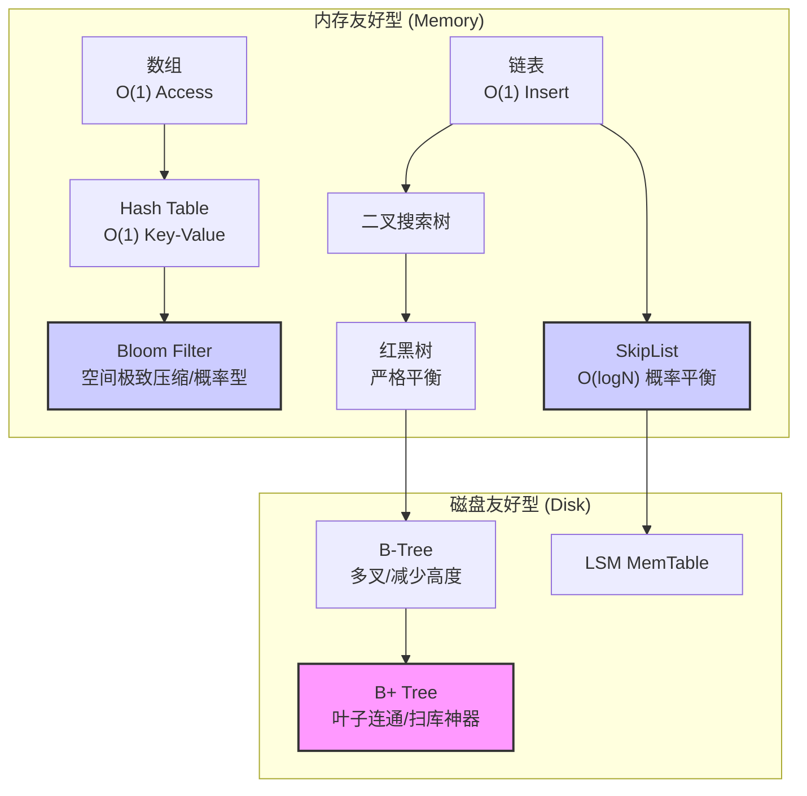
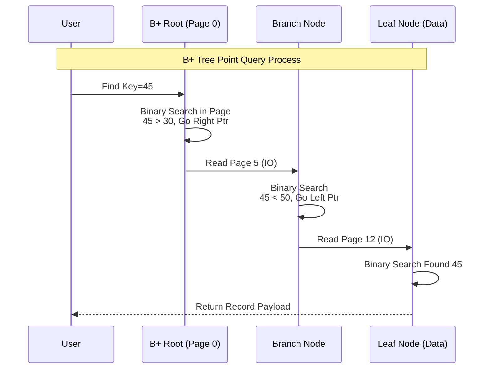
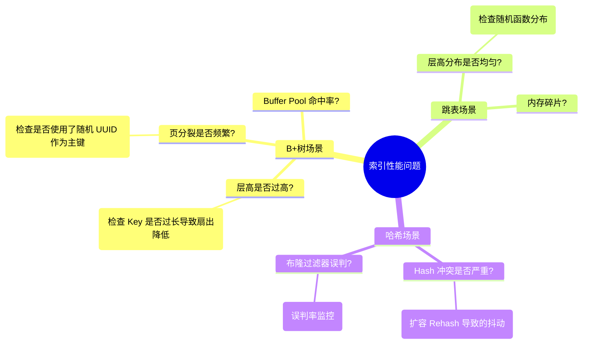

### 摘要

在存储引擎的世界里，**索引**是连接“数据持久化”与“高效检索”的唯一桥梁。如果说数据是宝藏，索引就是藏宝图。本技术文档将跨越《深入浅出存储引擎》第二章的核心内容，从最基础的**数组与链表**出发，深入剖析**哈希体系**（Hash/Bloom Filter）的点查询优势，再到**树形体系**（Red-Black Tree/SkipList/B+ Tree）在范围查询与磁盘 I/O 上的终极博弈。我们将揭示为何数据库最终选择了 B+ 树，而大数据组件偏爱 LSM Tree（基于 SkipList）的数学本质。

---

## 第一部分：核心概念与底层图景 (The Context)

### 1.1 定义与隐喻：数据结构的进化论

所有的复杂索引，本质上都是对**数组（Array）**和**链表（Linked List）**的魔改：

- **数组**是“军队方阵”：下标访问神速（O(1)），但插入删除极慢（牵一发而动全身）。
- **链表**是“特工接头”：增删极快（改个指针即可），但查找只能顺藤摸瓜（O(N)）。

存储引擎的设计哲学，就是在这两者之间寻找平衡点：

1. **哈希表 (Hash)**：给数组加了“传送门”，极致的点查询，但那是无序的混沌。
2. **跳表 (SkipList)**：给链表加了“多级高速公路”，以空间换时间实现二分查找。
3. **B+ 树 (B+ Tree)**：为了适配磁盘块（Page）而生的“矮胖型”多叉树，是文件系统的绝对统治者。

### 1.2 索引演进全景图

下图展示了从内存数据结构到磁盘数据结构的演进逻辑。



---

## 第二部分：机制原理深度剖析 (The Mechanism)

### 2.1 哈希系的极致与妥协：布隆过滤器 (Bloom Filter)

哈希表虽然快，但太吃内存。在海量数据场景（如判断 10 亿个 Key 是否存在），我们需要**布隆过滤器**。

- **原理**：不存储数据本身，只存储数据映射后的“指纹”（BitMap 中的几个位）。
- **代价**：存在**误判率（False Positive）**。它说“不存在”一定不存在，但它说“存在”可能是误报。
- **公式推导**：误判率 $P$ 与位数组大小 $m$、元素数量 $n$、Hash 函数个数 $k$ 相关。最优 Hash 函数个数 $k = (m/n) * ln2$。

### 2.2 树系的巅峰对决：跳表 vs B+ 树

为什么 Redis 和 LevelDB 选了跳表，而 MySQL 选了 B+ 树？

#### **跳表 (SkipList)：概率的胜利**

跳表放弃了红黑树那样复杂的旋转平衡操作，通过**随机生成层高**（Random Level）来模拟二分查找结构。

- **查找路径**：从最高层索引链表开始，向右滑动，遇到大于目标的节点则下潜一层。
- **优势**：实现简单（无锁并发容易实现），内存利用率高。

#### **B+ 树：为磁盘而生**

磁盘 I/O 是系统瓶颈，B+ 树的核心目标是**降低树的高度**（减少 I/O 次数）。

- **扇出 (Fanout)**：B+ 树一个节点可以存上千个指针，树高通常只有 3 层就能存 2000w+ 数据。
- **聚集 (Clustering)**：数据全在叶子节点，且叶子节点通过指针串联，天生适合范围查询（Range Scan）。

### 2.3 原理可视化：B+ 树的分裂与跳表的查找



---

## 第三部分：内核/源码级实现 (The Code)

### 3.1 跳表核心结构 (Go 伪代码)

跳表的精髓在于 `next` 指针是一个数组（层级），而非单个指针。

```go
// SkipListNode 代表跳表中的一个节点
type SkipListNode struct {
    key   []byte
    value []byte
    // 核心设计：多层索引指针
    // next 是最底层链表，next[i] 是第 i 层的“跳跃”指针
    next  []*SkipListNode
}

// SkipList 结构
type SkipList struct {
    head       *SkipListNode
    maxLevel   int
    levelCount int // 当前最大层级
}

// 随机层高生成算法 (这也是 LevelDB/Redis 的做法)
// 就像抛硬币，正面向上就层数+1，直到反面
func randomLevel() int {
    level := 1
    for rand.Float64() < 0.25 && level < MAX_LEVEL {
        level++
    }
    return level
}
```

### 3.2 B+ 树 Page 结构 (C++ 伪代码)

B+ 树在磁盘上是以 **Page (页)** 为单位存储的。注意 Internal 节点和 Leaf 节点的区别。

```c++
// 典型的 InnoDB 风格 Page 结构
struct Page {
    PageHeader header;  // 存页号、上一页/下一页指针 (FIL_PAGE_PREV/NEXT)

    // 记录体：可以是分支节点记录，也可以是叶子节点数据
    // 在 BoltDB 中，通过 flags 区分 branchPageElement 和 leafPageElement
    byte body[];

    // 页尾，通常包含 Checksum
    PageTrailer trailer;
};

// 分支节点元素 (只存索引)
struct BranchElement {
    Key key;
    PageID child_page_id; // 指向子页面的指针
};

// 叶子节点元素 (存真实数据)
struct LeafElement {
    Key key;
    Value value; // 或者是指向 overflow page 的指针
};
```

> [!NOTE] 源码细节 在 BoltDB 的实现中（PDF 第 6 章将详述），`branchPageElement` 和 `leafPageElement` 是紧凑排列的，为了利用 CPU 缓存行（Cache Line），通常会尽量让 Key 变短。

---

## 第四部分：生产落地与 SRE 实战 (The Practice)

### 4.1 场景化选型指南

- **Redis (ZSet)**: 使用 **SkipList**。因为 Redis 是纯内存操作，SkipList 代码简单，且在更新时只需调整局部指针，比红黑树的染色旋转要快，且支持范围查找。
- **MySQL (InnoDB)**: 使用 **B+ 树**。数据在磁盘，必须减少 I/O。利用 B+ 树的高扇出特性，将 3 次 I/O 就能定位百万级数据。叶子节点双向链表通过 `read-ahead` (预读) 机制极大地优化了全表扫描性能。
- **HBase / Cassandra / LevelDB**: 使用 **LSM Tree (MemTable 是 SkipList)**。写多读少场景。内存中用 SkipList 快速排序，然后 Dump 到磁盘成 SSTable。

### 4.2 性能调优：布隆过滤器的陷阱

在 SRE 实战中，布隆过滤器常用于解决**缓存穿透**问题。

- **参数调节**：不要为了追求极致的空间（位数组小）而导致误判率过高。
- **无法删除**：标准的布隆过滤器不支持删除元素（因为位是共享的）。如果你的业务有大量删除逻辑（如电商下架商品），**不要直接用布隆过滤器**，或者使用支持计数的 Counting Bloom Filter，否则会导致“假阳性”随着时间推移越来越高。

### 4.3 故障排查思维导图



---

## 第五部分：时代变了 (Critical Update - 2026 视角)

> [!DANGER] 过时预警 PDF 中对 **Hash 索引** 的描述主要集中在传统的静态 Hash 或简单的动态 Hash。

### 5.1 未来趋势：Learned Indexes (学习型索引)

2026 年的视角来看，Google 提出的 **Learned Index** 正在挑战 B+ 树的地位。

- **核心思想**：索引本质上是一个模型（Model），输入 Key，输出 Position。既然是模型，就可以用神经网络来训练。
- **优势**：在数据分布有规律（如时间戳）的场景下，学习型索引比 B+ 树快 3 倍，且空间节省一个数量级。
- **现状**：虽然还未完全替代通用数据库中的 B+ 树，但在只读的分析型数据库（OLAP）中已开始落地。

### 5.2 无锁数据结构 (Lock-Free)

随着 CPU 核数越来越多，传统 B+ 树的 Latch（锁）竞争成为瓶颈。

- **Bw-Tree**：微软提出的无锁 B 树，通过 CAS (Compare And Swap) 和 Mapping Table 来避免修改物理页，极大地提升了多核并发性能。这是现代存储引擎（如 Hekaton）的演进方向。

---

**下一篇预告**：我们将进入物理世界的深水区 —— **Topic 03：硬核基座：内存管理与磁盘 I/O 机制**，去探讨 Page Cache、零拷贝与 SSD 的物理特性。