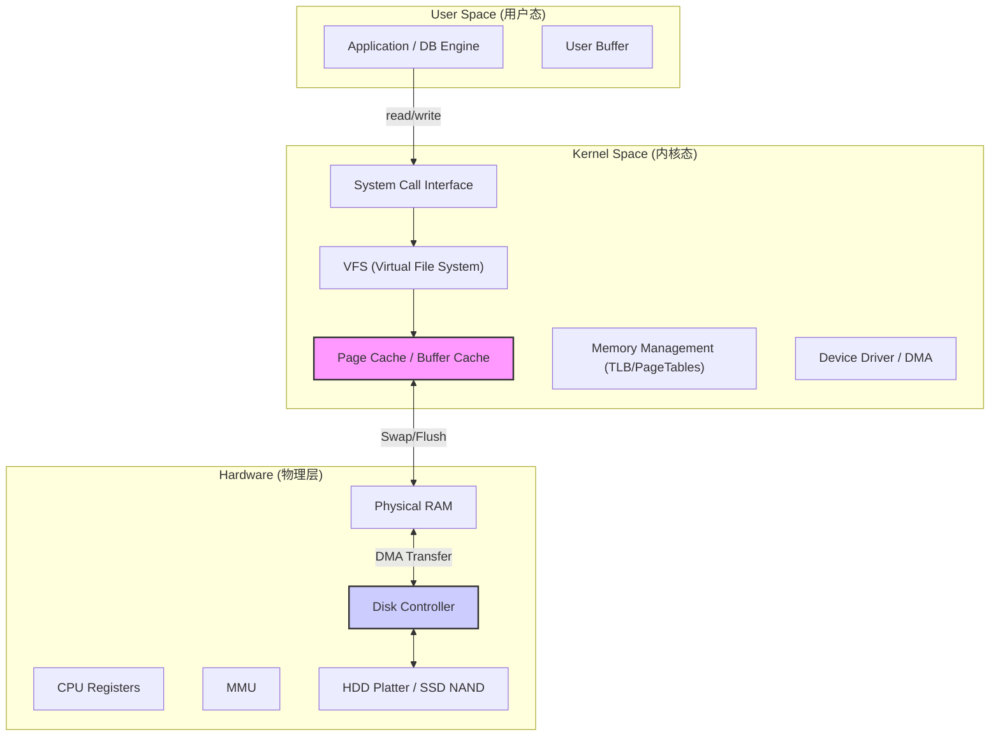
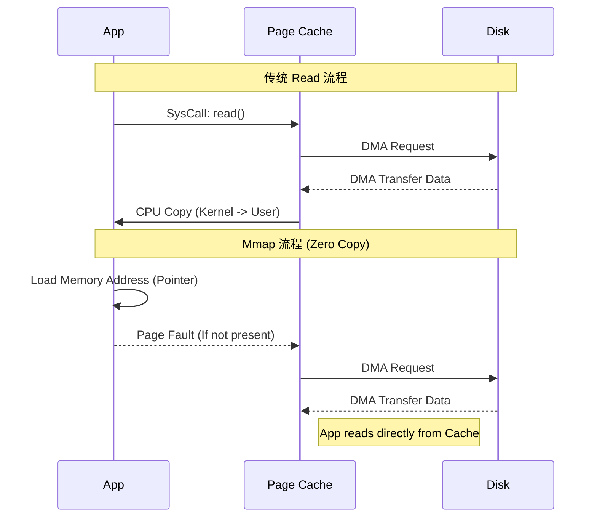
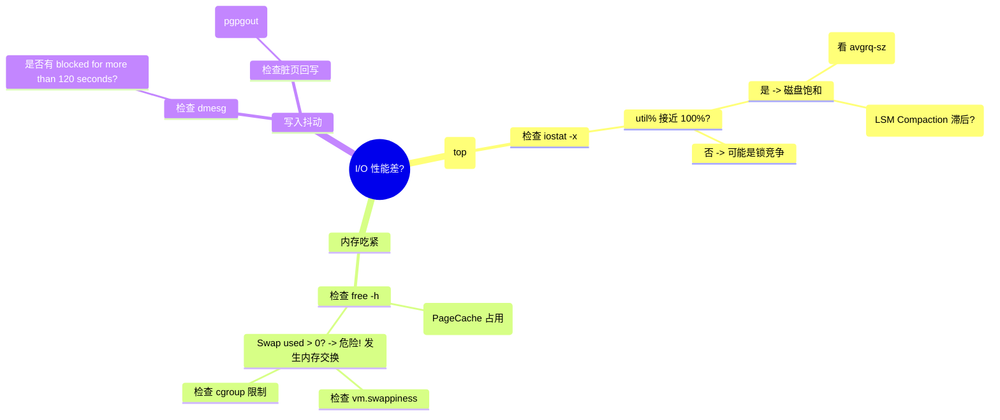

### 摘要

如果在存储引擎的战争中，数据结构是“战术”，那么**内存与 I/O 机制**就是决定生死的“后勤补给线”。无论上层索引设计得多么精妙，一旦撞上物理磁盘的机械臂寻道延迟或内存缺页中断（Page Fault），性能都会瞬间坍塌。本文将依据《深入浅出存储引擎》第三章的核心内容，深入解构操作系统如何通过虚拟内存、Page Cache 和 DMA 编织出数据流转的高速公路，并揭示 BoltDB、RocketMQ 等系统利用 **mmap** 实现“零拷贝”吞吐爆炸的底层密码。

---

## 第一部分：核心概念与底层图景 (The Context)

### 1.1 定义与隐喻：车间与仓库的物流学

存储引擎的 I/O 本质是数据在不同介质间的搬运：

- **CPU 寄存器**是“工匠的手”：纳秒级操作，但容量极小。
- **内存 (DRAM)** 是“车间工作台”：存放当前正在加工的数据，速度快（几十纳秒），但断电即失。
- **磁盘 (Disk/SSD)** 是“远程仓库”：容量无限但距离遥远。
    - **HDD**：机械臂寻找数据就像“在图书馆走动找书”，寻道时间（Seek Time）是最大的敌人。
    - **SSD**：虽然没有机械臂，但存在“闪存翻译层 (FTL)”和“擦写寿命”的物理特性。

### 1.2 存储层次架构全景图

下图展示了数据从磁盘到 CPU 的漫长旅程，以及内核机制在其中的卡位。



---

## 第二部分：机制原理深度剖析 (The Mechanism)

### 2.1 虚拟内存与缺页中断：存储引擎的隐形杀手

操作系统通过**虚拟内存（Virtual Memory）**欺骗了进程，让每个进程都以为自己拥有连续的内存空间。

- **机制**：CPU 发出虚拟地址 -> MMU 查 TLB/页表 -> 物理地址。
- **缺页 (Page Fault)**：当程序访问的数据不在物理内存（页表状态位=0）时，CPU 触发中断，挂起进程，操作系统负责从磁盘加载数据到内存。
- **影响**：对于存储引擎，频繁的缺页中断会导致严重的尾延迟（P99 Latency Spike）。

### 2.2 I/O 加速黑科技：DMA 与 Mmap

为什么传统 I/O 慢？因为数据在“内核态”和“用户态”之间来回拷贝。

- **DMA (Direct Memory Access)**：解放 CPU。磁盘控制器直接把数据搬运到内存，传输完成后才给 CPU 发一个中断信号。
- **Mmap (Memory Mapped File)**：零拷贝的终极武器。
    - **原理**：将文件直接映射到进程的虚拟地址空间。进程像读写内存数组一样读写文件，操作系统在后台负责 Page Cache 的加载和回写。
    - **优势**：省去了 `read()` 系统调用引起的用户态/内核态切换，以及数据从内核缓冲区（Page Cache）到用户缓冲区的 CPU 拷贝。

### 2.3 原理可视化：传统 I/O vs Mmap



---

## 第三部分：内核/源码级实现 (The Code)

### 3.1 关键数据结构：页表项 (Page Table Entry)

在内核层面，内存是以**页 (Page)** 为单位管理的。理解页表项有助于理解 mmap 的权限控制和脏页追踪。

```go
// 简化的 x86_64 页表项结构伪代码
struct PageTableEntry {
    uint64_t present : 1;    // P位：1表示在内存中，0表示在磁盘(引发缺页)
    uint64_t read_write : 1; // R/W位：1表示可写，0表示只读 (Copy-On-Write基石)
    uint64_t user_supervisor : 1;
    uint64_t accessed : 1;   // A位：被访问过？(用于LRU算法)
    uint64_t dirty : 1;      // D位：被修改过？(刷盘时判断是否需要回写)
    uint64_t physical_address : 40; // 物理页帧号
    // ... 其他控制位
};
```

> [!NOTE] 源码细节：脏页追踪 存储引擎（如 BoltDB）利用 mmap 写入数据时，OS 会自动将对应的 PTE 中的 `dirty` 位置 1。后台线程（pdflush/flush）扫描这些脏页，将其异步刷回磁盘。

### 3.2 磁盘调度算法伪代码

磁盘性能的瓶颈在于**寻道时间**。操作系统通过调度算法试图将随机 I/O 整理为顺序 I/O。

```python
# 电梯算法 (SCAN) 简化逻辑
# 类似于现实生活中的电梯，不再忽上忽下，而是单向移动到底再掉头
def scan_scheduler(requests, current_track, direction):
    # requests: 待处理的磁道请求列表
    # current_track: 当前磁头位置 40
    # direction: 移动方向 (UP/DOWN)

    sorted_reqs = sort(requests)
    next_stops = []

    if direction == UP:
        # 只处理比当前磁道大的请求
        next_stops = [r for r in sorted_reqs if r >= current_track]
    else:
        # 只处理比当前磁道小的请求，并反序
        next_stops = [r for r in sorted_reqs if r < current_track].reverse()

    return next_stops
```

---

## 第四部分：生产落地与 SRE 实战 (The Practice)

### 4.1 场景化案例：为什么 Kafka/RocketMQ 这么快？

- **场景**：消息队列需要处理海量日志的追加写入和读取。
- **机制**：
    1. **顺序写 (Sequential Write)**：利用 HDD/SSD 顺序写性能远超随机写的特性（见 PDF 4.1 节结论：磁盘顺序 I/O ≈ 内存随机 I/O）。
    2. **Mmap + PageCache**：Broker 接收消息写入 Mmap 区域，直接落入 Page Cache，由 OS 异步刷盘。消费者读取时，直接利用 `sendfile` (零拷贝) 将 Page Cache 数据推送到网卡。
    3. **预读 (Readahead)**：利用 OS 的预读机制，提前将后续的 CommitLog 加载到内存。

### 4.2 性能调优：参数决定生死

- `vm.swappiness`：**设置为 0 或 1**。对于数据库应用，尽量避免 swap，因为磁盘 I/O 会导致严重的延迟抖动。
- `vm.dirty_ratio` & `vm.dirty_background_ratio`：控制脏页刷盘的时机。对于高吞吐写场景（如 LSM Tree 的 WAL 写入），适当调大可以减少频繁刷盘，但会增加崩溃丢失数据的风险（见 PDF 5.2 节异常处理分析）。

### 4.3 故障排查：I/O 问题诊断树



---

## 第五部分：时代变了 (Critical Update - 2026 视角)

> [!DANGER] 过时预警 PDF 中花费大量篇幅介绍 **HDD 的机械结构（磁道/扇区/电梯调度算法）**-。在 2026 年，除了极低成本的冷存储，**NVMe SSD** 已成为数据库的主流标配。SSD 内部并发通道极多，传统的“电梯调度”在 SSD 上往往是多余甚至有害的（Linux 现在默认对 SSD 使用 `none` 或 `kyber` 调度器）。

### 5.1 未来趋势：绕过内核的诱惑

1. **Kernel Bypass (SPDK/DPDK)**：既然系统调用（Context Switch）有开销，未来的高性能存储引擎（如 ScyllaDB, modern Redis）倾向于使用 SPDK 直接在用户态操作 NVMe 驱动，完全绕过 Page Cache 和 VFS。
2. **io_uring**：PDF 中提到的 BIO/NIO 模型正在被 Linux 的 `io_uring` 取代。它实现了真正的异步 I/O，提交请求和获取结果都不需要系统调用，性能逼近 SPDK 但保留了内核功能。
3. **CXL (Compute Express Link)**：内存与存储的界限进一步模糊。CXL 允许 CPU 像访问内存一样访问远端的 SSD 池，"Page Cache" 的概念将延伸到机架级。

---

**下一篇预告**：我们将进入 **Topic 04：B+树引擎：宏观架构与磁盘布局**，看看 InnoDB 和 BoltDB 是如何将一棵树“种”在这些物理页上的。