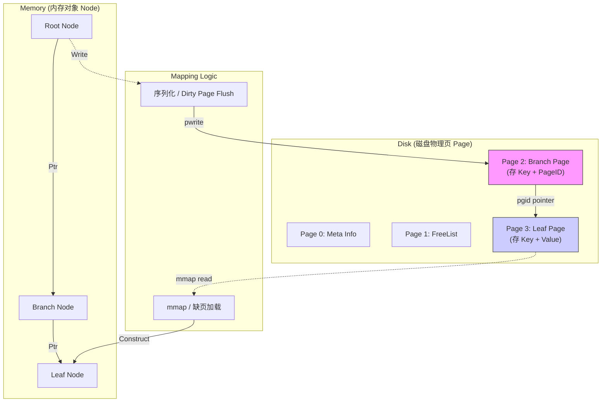
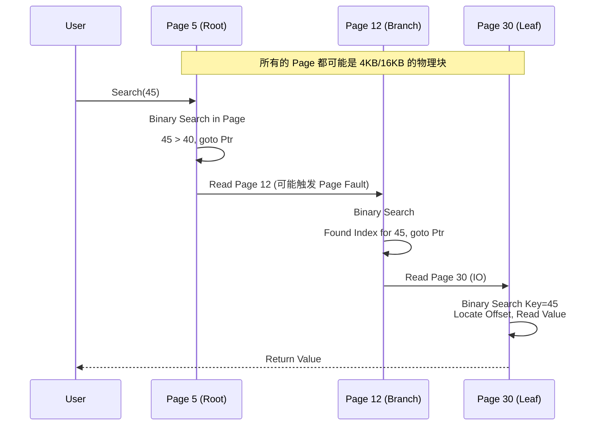
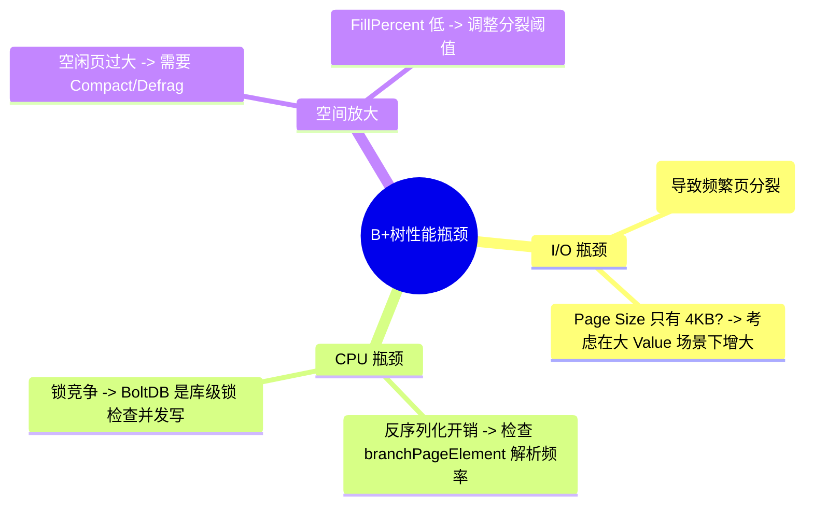

### 摘要

在 OLTP（在线事务处理）的战场上，**B+ 树** 是当之无愧的“陆军之王”。它并不是一种单纯的内存数据结构，而是一套严丝合缝的**磁盘数据组织协议**。为什么 MySQL、Oracle 和 BoltDB 不约而同地选择了它？答案在于它对磁盘物理特性的极致利用——通过“矮胖”的树高极小化磁盘 I/O，通过“有序”的叶子节点极大化顺序扫描性能。本文将依据《深入浅出存储引擎》第四章与第六章的核心内容，从宏观的**磁盘布局（Layout）到微观的Page 结构**，解构这棵“种”在硬盘上的参天大树。

---

## 第一部分：核心概念与底层图景 (The Context)

### 1.1 定义与隐喻：企业层级与档案管理

B+ 树不仅仅是树，它更像是一个**高度科层制的企业组织**：

- **根节点 (Root Page)** 是“CEO”：他掌握着通往各个部门的最高索引，但他不干具体活（不存数据）。
- **分支节点 (Branch Page)** 是“部门经理”：他们负责分流，告诉你“找财务去左边，找技术去右边”，依然不存具体数据。
- **叶子节点 (Leaf Page)** 是“一线员工”：所有的**真实数据（KV Pair）**都存储在这里。而且，所有员工手拉手（双向链表），方便进行全员广播（全表扫描）。

这种设计的核心意图是：**让管理者（索引）尽可能精简，以便能全部塞进内存（Cache）；让员工（数据）井然有序，以便磁盘磁头能一次性批量读取。**

### 1.2 架构全景图：从内存 Node 到磁盘 Page

在 BoltDB 这类引擎中，内存中的对象（Node）与磁盘上的块（Page）是一一对应的映射关系。



---

## 第二部分：机制原理深度剖析 (The Mechanism)

### 2.1 为什么是 B+ 树？演进的必然

书中（4.2 节）精彩地推演了数据结构的选型逻辑，这是一场针对**磁盘 I/O** 的博弈：

1. **数组/链表**：查找 $O(N)$，磁盘读写太慢，Pass。
2. **哈希表**：$O(1)$ 虽快，但无法支持**范围查询**（Range Scan），数据库最常用的就是 `WHERE id > 100`，Pass。
3. **红黑树/AVL 树**：二叉树太“高”了。对于 1000 万数据，树高可能达到 20+ 层。意味着查一条数据要 20 次随机磁盘 I/O，耗时几百毫秒，不可接受。
4. **B 树**：每个节点存数据。缺点是分支节点因为存了 Value，导致能存的索引变少，树变高；且叶子节点不连通，范围查询要反复回溯。
5. **B+ 树（最终胜出）**：
    - **矮胖**：分支节点只存 Key，扇出（Fanout）极大。一个 4KB 的页能存几百个 Key，3 层树高就能存 2000 万+ 数据。
    - **聚集**：所有数据都在叶子，叶子之间用指针串联，范围查询变成了**顺序读**。

### 2.2 原理可视化：磁盘上的查找路径

当执行 `Get(Key=45)` 时，引擎是如何在磁盘页之间跳跃的？



---

## 第三部分：内核/源码级实现 (The Code)

为了具体化理解，我们参考 BoltDB（书中第 6 章核心源码）的实现。BoltDB 是 Go 语言实现的纯粹的 B+ 树引擎，其 Page 结构非常经典。

### 3.1 关键数据结构：Page 与 Element

在磁盘上，一个 Page 是一段连续的字节数组。但在代码中，它被重新解释（Reinterpret Cast）为以下结构：

```go
// 对应源码：bolt/page.go

type pgid uint64

// 磁盘页的头部信息 (固定长度)
type page struct {
    id       pgid   // 页号，比如第 3 号页
    flags    uint16 // 页类型：branch(分支), leaf(叶子), meta(元数据), freelist
    count    uint16 // 这一页里存了多少个元素 (inode)
    overflow uint32 // 如果数据太长，是否有溢出页
    ptr      uintptr // 真正的数据起始位置（柔性数组的起点）
}

// 分支节点存储的元素 (只存索引)
// 结构：| pos | ksize | pgid | ... key_bytes ... |
type branchPageElement struct {
    pos   uint32 // key 距离本结构体起始位置的偏移量
    ksize uint32 // key 的长度
    pgid  pgid   // 指向子页面的页号 (重点！)
}

// 叶子节点存储的元素 (存真实数据)
// 结构：| flags | pos | ksize | vsize | ... key ... value ... |
type leafPageElement struct {
    flags uint32 // 可能是普通数据，也可能是子 bucket
    pos   uint32 // key 距离本结构体的偏移量
    ksize uint32
    vsize uint32 // value 的长度
}
```

> [!NOTE] 内存布局技巧 BoltDB 采用了 **"slotted page"（槽页）** 的变体设计。 `ptr` 之后紧接着是 `count` 个 `branchPageElement` 或 `leafPageElement` 数组（元数据区），而真正的 Key/Value 字节数据是从页面的尾部或者元数据区之后填充的。`pos` 字段就是用来定位元数据到真实字节数据的“指针”。这种设计保证了元数据紧凑排列，利于 CPU 缓存命中。

### 3.2 核心流程伪代码：节点分裂 (Split)

B+ 树最复杂的逻辑在于写入导致页满时的**分裂**。

```go
// 对应源码：bolt/node.go -> split()

func (n *node) split(pageSize int) []*node {
    // 1. 检查是否需要分裂
    // 如果当前节点大小 < pageSize，直接返回
    if n.size() < pageSize {
        return []*node{n}
    }

    // 2. 寻找分裂点 (Split Point)
    // 通常选择中间位置，或者基于填充率 (FillPercent)
    splitIndex := n.calculateSplitIndex()

    // 3. 创建新节点 (Next Node)
    next := &node{isLeaf: n.isLeaf}

    // 4. 数据迁移
    // 将原节点 n 右半部分的数据 (inodes) 移动到 next 节点
    next.inodes = n.inodes[splitIndex:]
    n.inodes = n.inodes[:splitIndex]

    // 5. 递归处理父节点
    // 将新节点 next 的 key 插入到父节点中
    // 如果父节点也满了，父节点也会递归触发 split
    n.parent.put(next.key, next.pgid)

    return []*node{n, next}
}
```

---

## 第四部分：生产落地与 SRE 实战 (The Practice)

### 4.1 场景化案例：Etcd 与 BoltDB

Kubernetes 的大脑 **Etcd** 底层使用的就是 BoltDB（现在是 bbolt）。

- **场景**：K8s 集群中 Pod 的状态频繁更新。
- **影响**：每次写操作（Put）都会触发从 Root 到 Leaf 的查找，修改 Leaf 后，由于 B+ 树的 COW（Copy-On-Write）特性，路径上所有的 Page（Leaf -> Branch -> Root）都会变成“脏页”并分配新的 Page ID。
- **SRE 关注点**：这就解释了为什么 Etcd 对磁盘 IOPS 和 fsync 延迟极其敏感。如果磁盘慢，脏页刷盘（Commit）就会阻塞写请求，导致 K8s 集群心跳超时，引发故障级联。

### 4.2 性能调优：Page Size 的权衡

在初始化数据库时，Page Size 是个关键参数（BoltDB 默认对齐 OS Page，通常 4KB）。

- **4KB (Default)**：适合随机读写的小对象场景。
- **16KB / 32KB (MySQL InnoDB 默认 16KB)**：
    - **优势**：对于 B+ 树，更大的 Page 意味着更大的**扇出 (Fanout)**。树的高度会更低，范围查询时一次 I/O 能读更多数据。
    - **劣势**：如果写入很离散，修改一行数据就要重写 16KB 的整页，导致**写放大 (Write Amplification)** 严重。

### 4.3 故障排查：B+ 树“碎片”

B+ 树经过大量随机写和删除后，会出现**碎片 (Fragmentation)**。

- **现象**：DB 文件体积很大，但实际数据量很小。
- **排查**：使用 `bolt check` 或类似工具查看 `Fill Percent`（页填充率）。
- **解决**：
    - **Compact/Defrag**：在线或离线重写数据库（如 `etcdctl defrag`），将稀疏的页合并，释放空闲页回操作系统。



---

## 第五部分：时代变了 (Critical Update - 2026 视角)

> [!DANGER] 过时预警：机械硬盘的假设 PDF（第 4 章）中大量讨论了基于 **HDD 机械臂调度** 的优化。在 NVMe SSD 普及的今天，"顺序写"依然重要（为了写放大和寿命），但"随机读"的性能惩罚已经大幅降低。

### 5.1 未来趋势：BW-Tree 与 NVMe 优化

1. **Bw-Tree (Lock-Free B-Tree)**：现代数据库（如 SQL Server Hekaton）开始采用无锁 B 树。通过 **Mapping Table** 和 **Delta Record**（增量记录）技术，避免了修改节点时对整个 Page 的重写，极大提升了多核 CPU 下的并发性能。
2. **CSB+ Tree (Cache Sensitive)**：为了适应 CPU L2/L3 缓存，取消了子节点指针，改为将子节点存储在连续内存块中，进一步压缩节点大小，提升内存中的二分查找速度。
3. **IO_Uring & SPDK**：B+ 树引擎开始直接管理磁盘（Raw Device），绕过 Kernel 的 Page Cache，直接通过用户态驱动读写 NVMe，将 I/O 延迟压榨到微秒级。

---

**下一篇预告**：我们将进入 **Topic 05：B+树引擎：微观细节与事务并发**，深入探讨 WAL（预写日志）、Crash Recovery 以及 BoltDB 如何通过 COW 实现无锁读事务（MVCC 的一种形态）。