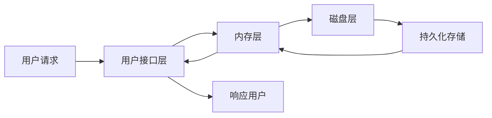
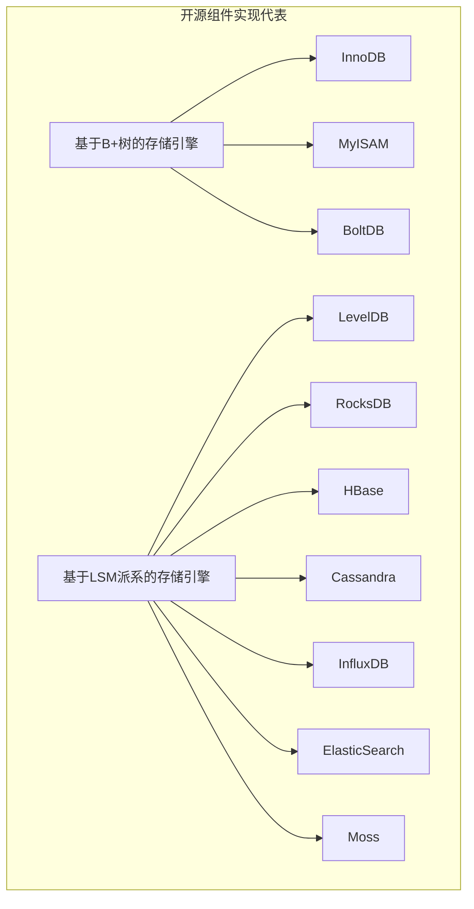

# 第 1 章 存储引擎概述

本章对数据存储体系、存储引擎的整体框架、存储引擎的分类进行概述，以便让读者对存储引擎有一个基本的认识。

## 1.1 数据存储体系

不同的存储场景需要选择不同的数据库，不同的设计目标也使得每个数据库背后的方案选型、面临的问题不尽相同。例如有些组件设计之初就定位为关系数据库，而有些组件则定位为 NoSQL 数据库，随着技术的发展又诞生了 NewSQL 数据库。本节将对互联网中涉及存储数据的常用存储组件进行分类，并介绍它们的适用场景和设计目标。

### 1.1.1 OLTP、OLAP 与 HTAP

**OLTP（在线事务处理）** 数据库的主要功能是处理用户的在线实时请求，直接为用户提供服务。因此，这类数据库通常对处理请求的时延要求比较高，正常情况下绝大部分请求会在毫秒级完成。OLTP 数据库很多，除了大家最熟悉的关系数据库（如 MySQL、Oracle）外，还有 Redis、MongoDB 等非关系数据库。

**OLAP（在线分析处理）** 数据库的主要功能是对数据或者任务进行离线处理，不直接为用户提供服务。OLAP 系统对请求的处理通常比 OLTP 慢得多，一般为秒级、分钟级甚至小时级，通常在数据统计、报表分析、数据聚合分析等场景使用。这类数据库的典型代表有 HBase、Teradata、Hive、Presto、Druid、ClickHouse 等。互联网企业往往都需要使用 OLTP 和 OLAP，因此为了满足这两类需求，通常结合多个系统一起开发使用。这样的做法当然是可行的，而且多数企业采用的也是这种方式。

随着互联网技术的发展，需要存储的数据量呈爆炸式增长，这种模式带来的存储成本问题成为新的矛盾点，人们开始探索是否有一种数据库能将 OLTP 和 OLAP 这两类应用合二为一。于是，一种新的解决方案出现了，那就是下面要介绍的 **HTAP（混合事务分析处理）** 数据库。

HTAP 在设计时就充分考虑了对 OLTP 和 OLAP 两种场景的需求，通过在系统内部实现上进行更好的兼容，为上层应用程序使用提供了统一的服务。在处理上述两种场景时，底层可以使用同一套数据库来完成。这类数据库既可以处理在线事务，又可以进行在线分析。可以认为 HTAP = OLTP + OLAP。HTAP 的主要代表有 TiDB、OceanBase、CockroachDB 等。

HTAP 数据库有它的优点，但是也间接带来了很大的挑战。只使用 HTAP 数据库就可以完成在线事务处理和在线分析处理这两类需求，这对用户而言无疑是一种好的选择，因为底层采用同一套系统存储数据，在存储资源和成本上有很大的优势。但随之而来的是系统复杂性的增加，这类数据库的复杂度相比纯 OLTP 数据库和纯 OLAP 数据库高很多，软件开发难度也大很多。

OLTP、OLAP 与 HTAP 之间不同维度的对比见表 1-1。

**表 1-1 OLTP、OLAP 与 HTAP 之间不同维度的对比**

| 维度 | OLTP | OLAP | HTAP |
|------|------|------|------|
| 系统功能 | 日常交易处理（在线事务处理） | 统计、分析、报表（在线分析处理） | 同时支持在线事务处理和在线分析处理 |
| 设计目标 | 面向实时交易类应用 | 面向统计分析类应用 | 服务于 OLTP 和 OLAP 两种场景 |
| 数据处理 | 当前的、最新的 | 历史的、聚集的 | 既支持最新数据处理，也支持历史数据聚合分析 |
| 实时性 | 实时性读/写要求高 | 实时性读/写要求低 | 实时性要求高 |
| 事务 | 强事务 | 弱事务 | 强事务 |
| 分析要求 | 低、简单 | 高、复杂 | 高 |
| 典型代表 | MySQL、Oracle、Redis、MongoDB | HBase、Teradata、Hive、Presto、Druid、ClickHouse | CockroachDB、OceanBase、TiDB |

### 1.1.2 关系数据库、NoSQL 数据库与 NewSQL 数据库

关系数据库、NoSQL 数据库、NewSQL 数据库这三者是现如今讨论很多的一组概念，其实要搞明白它们之间的区别，就不得不回到数据库的发展历程上来审视它们产生的背景和动机。数据库的发展历程如图 1-1 所示。

> [!note] 图 1-1 数据库的发展历程（时间线）
> - **20 世纪 70 年代**：由 IBM 研发的世界上第一个关系数据库 System R 面世。
> - **20 世纪 80 年代至 90 年代**：市面上涌现出大量关系数据库产品，垂直领域逐渐开始分化。代表产品有 Oracle、DB2、SQL Server、PostgreSQL、MySQL 等。
> - **2000 年左右**：传统关系数据库的功能越来越丰富，一些重要的组件出现，比如 MySQL InnoDB、Oracle RAC。与此同时，满足海量数据存储需求的 NoSQL 数据库也出现了，比如 MongoDB、Cassandra、HBase。
> - **2010 年左右**：得益于硬件的发展，内存的容量和网络的带宽与延迟得到了很大的提升，数据库架构迎来变革。内存数据库和分布式数据库大规模投入生产。代表产品有 Google Spanner、SAP HANA、SQL Server Hekaton、Amazon Aurora。
> - **21 世纪 10 年代以后**：延续了 21 世纪 10 年代初期的辉煌，各种 NewSQL 数据库出现，可以承载更加复杂的负载。代表产品有 CockroachDB、TiDB、VoltDB、Azure Cosmos DB。

#### 1. 关系数据库

关系数据库也称为 SQL 数据库（为描述方便，后面简称为 SQL 数据库）。最早的数据库可以追溯至 20 世纪 70 年代 IBM 研发的第一个 SQL 数据库 System R，这也是最早的 SQL 数据库。再后来，20 世纪 80 年代至 90 年代涌现出大量的 SQL 数据库产品，例如 Oracle、DB2、SQL Server、PostgreSQL、MySQL 等。

SQL 数据库按照以“行”为单位的二维表格存储数据，这种方式最符合现实世界中的实体，同时通过事务的支持为数据的一致性提供了非常好的保证。这既是 SQL 数据库的优势，也是它的缺陷。在面对海量数据存储、高并发访问的场景下，SQL 数据库的扩展性和性能会受到限制。随着互联网的飞速发展，到 2000 年左右，存储海量数据、高并发处理读/写的需求变得非常强烈，这对 SQL 数据库提出了巨大的挑战。为了解决这个问题，出现了支持数据可扩展性、最终一致性的 NoSQL 数据库。因此，NoSQL 数据库可以看作基于 SQL 数据库的缺陷而诞生的一种新产品。

#### 2. NoSQL 数据库

NoSQL 组件普遍选择牺牲复杂 SQL 的支持及 ACID 事务功能，以换取弹性扩展能力和更高的读/写性能。这类系统主要存储半结构化或非结构化数据。根据存储的数据种类，NoSQL 数据库主要分为文档数据库（Document-based Database）、键值数据库（Key Value Database）、图数据库（Graph-based Database）、时序数据库（Time Series Database）、列式存储（Column-based Store）及多模数据库（Multi-model Database）。

##### （1）文档数据库

文档数据库以文档作为基本的单元进行操作。这里的文档并不是传统意义上的“文档”，它所指的是一条数据记录，类似关系数据库中的一行数据。这个记录是可以进行自我描述的，主要的形式有 JSON、XML、HTML 等，文档数据库中存储的每个文档可以具有完全不同的结构。从广义上来看，文档数据库也是一种 KV 数据库，只不过它和键值数据库的区别在于它的值是文档。此外，文档数据库还可以通过文档内容构建复杂索引。这类数据库除了 MongoDB 外，还有 CouchDB、OrientDB 等。这类数据库通常很容易和关系数据库进行数据转换。文档数据库非常适用于爬虫、物流、游戏、物联网等场景，存储一些数据模型无法确定的数据。

##### （2）键值数据库

键值数据库也就是一般意义上的 KV 数据库，它提供的功能和数据结构中的哈希（Hash）表类似。通常添加或更新数据时调用 Put(k,v) 接口，而在检索和删除时都只需要传入 k 即可。一般用 Get(k) 接口来获取数据，用 Delete(k) 接口来删除数据。这类数据库最为常用的是 Redis，此外还有 Riak、Amazon DynamoDB 等。这类数据库的主要特点是读/写性能超高，系统内部可以支持弹性扩展，主要适用于对性能要求比较高的单点读/写场景，例如推荐系统，用于存储用户或物品特征、用户对内容的互动信息（点赞数、收藏数）等。

##### （3）图数据库

图数据库是一种使用图数据结构进行语义查询的数据库。图是一组点和边的集合，“点”表示实体，“边”表示实体间的关系，图数据库通过点和边来存储数据。鉴于它采用独特的图数据结构组织数据，类似于现实世界中的人际关系、交通网络，因此这类数据库比较适用于社交网络、数据挖掘等场景。这类数据库的主要代表有 Neo4j、Dgraph、TigerGraph 等。

##### （4）时序数据库

时序数据库又称为时间序列数据库，它是用来存储和管理时间序列数据的专业数据库，具备写多读少、海量数据持续高并发写入、数据冷热分离等特点。此外，这类数据库可以基于时间区间进行数据聚合分析和灵活检索。它被广泛应用在物联网、金融、工业制造、软硬件兼容系统等高频度、高密度、动态实时采集场景下。时序数据库的热门产品有 InfluxDB、KDB+、Amazon Timestream 和 TimescaleDB 等。

##### （5）列式存储

列式存储一般也指宽列式数据库，这类数据库一般采用列族数据模型存储数据。和关系数据库类似，列式存储也由多行数据构成，每行数据包含多个列族，每个列族又会对应多列。不同的行可以具有不同数量的列族。同一列族的数据存储在一起。简单来看这类数据库和关系数据库差不多，但实际上在数据存储上存在很大的差别。

传统的关系数据库中数据是按照行来组织的，多个列构成的一行数据在存储时会按照特定的行格式进行扁平化组织，然后写入文件中。当检索一行中的某列数据时需要读取整行数据，再返回该列的数据。这对每次总是使用整行中的多列信息的场景来说非常高效。

而在一些统计分析场景中，往往需要对海量数据中的某列或者某几列数据进行频繁的读取和聚合。在这样的模式下，关系数据库的处理方式就变得不太高效了，而列式存储的优势可以得到充分发挥。列式存储中的数据按照列组织后，同一类型的稀疏数据有时候可以采用一些手段（例如位图编码）进行压缩以节约空间。列式存储主要适用于 OLAP 场景，典型的产品有 HBase、ClickHouse、Cassandra、BigTable 等。

##### （6）多模数据库

多模数据库是下一代新型数据库，它与传统的支持单一数据模型的数据库不同。这类数据库是在一套系统内支持多种不同数据模型的数据库。这些数据模型可包括传统的关系模型、NoSQL 数据模型（文档模型、键值模型、图模型等）。多模数据库的主要特性之一是通常支持一种或者多种查询语言，可以以灵活的方式访问多种不同的数据模型，甚至跨越模型进行 join 等操作。这类数据库使得对数据的存储、组织、查询变得比以往的数据库更加灵活和便捷。目前有些关系数据库和 NoSQL 数据库正在通过扩展对其他数据模型的支持来转变为多模数据库。多模数据库的典型代表有 MongoDB（支持文档、图等模型）、Oracle（支持关系表、XML、文档等模型）、OrientDB（支持文档、图、键值等模型）、ArangoDB（支持文档、图、键值等模型）等。

目前，不同的多模数据库通过不同的底层架构来实现多模型数据的管理。多模数据库的总体实现有两种方式：一种方式是在原生存储引擎存储主数据模型，然后扩展实现其他数据模型，例如某些产品用文档来实现主存储，然后使用文档之间的关系实现图模型；另一种方式是在所有数据模型上层增加一个中间层来集成所有操作，这样每种数据模型都需要有对应的处理模块。

结合上述对各种 NoSQL 数据库的介绍，将它们对应存储的数据结构进行汇总，如图 1-2 所示。

> [!note] 图 1-2 NoSQL 数据存储类型（分类与典型例子）
> - **文档数据库**：文档数据采用继承类树结构的 JSON 或者 XML 对象存储。典型例子：MongoDB。使用场景：内容管理、爬虫、物流等。优点：可扩展性强、易用性好。
> - **键值数据库**：键值数据通常按照键值对的方式进行存储。典型例子：Redis。使用场景：电商购物车、信息流、社交关系等。优点：可扩展性强、性能高。
> - **图数据库**：图数据中点存储数据实体，边存储实体之间的关系。典型例子：Neo4j。使用场景：社交、推荐、数据挖掘等。优点：可以形象地表示实体之间的关系，可扩展性强。
> - **时序数据库**：通常按照时间维度收集、统计一些数据和事件。典型例子：InfluxDB。使用场景：物联网、服务监控、实时采样等。优点：非常适用于实时采集数据大量写的场景，写性能较好。
> - **列式存储**：数据按照列族划分存储，支持非常灵活的结构定义。典型例子：HBase。使用场景：大数据分析、OLAP 等。优点：可扩展性强、性能较好。

虽然 NoSQL 数据库克服了关系数据库存储的缺陷，但它无法完全代替关系数据库。在 NoSQL 数据库出现后的一段时间内，互联网软件的构建基本上都是结合二者来提供服务的，在不同的场景下选择不同的数据库进行数据存储。虽然这样的合作方式很好，但是在这种模式下，一个用户可能会因为场景的不同而存储多份相同的数据到不同的数据库中，在用户量级和存储数据量很小的情况下没什么问题，一旦量级发生变化就会引发新的问题。

#### 3. NewSQL 数据库

随着存储数据量的不断增加，资源的浪费和成本的上升不容忽视，工业界和学术界都在寻找更好的解决方案。直到 2010 年左右，诞生了 NewSQL 数据库（也称为分布式数据库）。它的出发点是结合关系数据库的事务一致性，又具备 NoSQL 数据库的扩展性及访问性能。这无疑给系统的设计及实现带来了更大的挑战，NewSQL 数据库不仅要考虑单机环境下高效存储的问题，还需要考虑多机情况下数据复制、一致性、容灾、分布式事务等问题。目前，NewSQL 数据库的典型代表有 TiDB、OceanBase、CockroachDB 等。

从数据库的发展历程可以看到，每种类型数据库的产生都是为了解决特定场景下的问题，这也是计算机软件发展的一个永恒不变的规律。SQL 数据库、NoSQL 数据库、NewSQL 数据库不同维度的对比见表 1-2。

**表 1-2 SQL 数据库、NoSQL 数据库、NewSQL 数据库对比**

| 维度 | SQL 数据库 | NoSQL 数据库 | NewSQL 数据库 |
|------|-------------|---------------|----------------|
| 关系属性 | 强，关系数据库主要遵循关系模型 | 弱，不遵循关系模型。设计理念和 SQL 数据库完全不同 | 强，上层支持关系模型 |
| ACID 事务属性 | 支持，ACID 事务属性是其应用的基础 | 绝大部分不支持，这类系统提供 CAP 支持 | 支持，ACID 事务属性原生支持 |
| SQL | 支持 SQL | 绝大部分不支持 SQL | 对旧 SQL 有适当的支持，甚至增强了功能 |
| OLTP | 支持 OLTP，关系数据库效率一般 | 部分支持，但不是最适合的 | 支持 OLTP 数据库的功能，效率很高 |
| 扩展性 | 支持垂直扩展 | 支持水平扩展 | 支持水平扩展 |
| 查询处理 | 可以轻松地处理简单的查询，当查询的性质变得复杂时就会失败 | 在处理复杂的查询时比 SQL 更好 | 在处理复杂查询和小型查询时效率很高 |

如果以组件的类型是关系数据库还是非关系数据库，并结合服务的场景是 OLTP 还是 OLAP 来对业界的各种存储组件进行划分的话，可以得到图 1-3 所示的结果。关系数据库中既有为 OLTP 设计的，也有为 OLAP 设计的，同时还有新兴发展起来兼容二者的 HTAP 数据库。这些系统都有各自适用的业务场景，在实际方案选型时需要结合具体场景灵活选择合适的数据库。

> [!note] 图 1-3 存储组件的分类（略：二维矩阵图，横轴为关系/非关系，纵轴为 OLTP/OLAP，包含 HTAP 区域）

### 1.1.3 内存型存储组件与磁盘型存储组件

在计算机发展的几十年里，计算机的整体结构依然没有太大的变化，计算机中充当存储介质的主要有内存、磁盘两类。内存的访问速度要比磁盘快几个量级，但是内存的容量比磁盘要小很多。一般对磁盘进行访问时，首先会从磁盘文件加载数据到内存中，然后响应用户。内存和磁盘的各维度对比如图 1-4 所示。

> [!info] 图 1-4 内存和磁盘对比
> | 维度 | > [!info] 图 1-4 内存和磁盘对比
> | 维度 | 内存 | 磁盘（硬盘） |
> |------|------|--------------|
> | 成本 | 高 | 低 |
> | 容量（单机） | 小 | 大 |
> | 访问速度 | 快 | 慢（顺序 I/O > 随机 I/O） |
> | 存储特性 | 易失性存储，断电丢数据 | 非易失性存储，断电不丢数据 |

结合前面的介绍，在大部分系统设计时，通常会选择一种主要存储介质来存储数据，另一种存储介质则作为辅助使用。在目前的各种存储组件中，根据每个存储组件存储数据的主要介质，可将其分为两类：内存型组件和磁盘型组件。

#### 1. 内存型组件

内存型组件的典型特点是读/写性能高、访问速度快。其缺点在于，保存的数据量受限于当前机器的内存容量，并且当机器宕机或发生突发情况断电后，保存在内存中的数据会全部丢失。例如，Redis 是大家较熟悉也较常用的一个内存型存储组件。Redis 主要采用内存存储数据，而磁盘则用于做辅助的持久化存储。RabbitMQ 也主要采用内存存储消息，同时支持将消息持久化到磁盘。

对采用内存存储数据的方案而言，难点之一在于如何在不降低访问效率的情况下，充分利用有限的内存空间来存储尽可能多的数据。这个过程少不了对数据结构的选型、优化，以及对数据过期、数据淘汰等方案的选择。同时，绝大多数的内存型组件在保证单机功能完备的情况下，都会优先考虑对存储的数据进行分片，并构建集群系统对外提供服务，以解决单机内存容量这一限制。另一个难点在于，内存型组件如何保证在机器发生故障的情况下，数据尽可能少丢失。针对这类问题，业界经典的解决方案是**快照 + 广泛意义的 WAL（Write Ahead Log）日志**，其典型代表有很多，比如 Redis。

#### 2. 磁盘型组件

和内存型组件不同，磁盘型组件的特点是单机磁盘存储的数据量非常大，要远大于内存型组件。同时，在机器宕机或者发生突发情况断电的情况下不会出现数据丢失（排除极端情况）。然而，磁盘型组件，尤其是典型的 HDD（机械磁盘），由于先天性的磁盘结构，其访问数据的速度比内存慢得多。同时，在相同的磁盘结构下，对磁盘的访问方式决定了磁盘访问的耗时。磁盘顺序访问要远远快于磁盘随机访问。磁盘型组件有关系数据库、NoSQL 数据库等，例如 MySQL、Oracle、MongoDB 等数据库主要采用磁盘组织数据，以合理利用内存提升性能。而像 RocketMQ、Kafka、Pulsar 消息队列，也是主要将数据存储在磁盘，通过内存来提升系统的性能。

对采用磁盘存储数据的方案而言，难点之一在于如何根据系统要解决的特定场景进行合理的磁盘布局。在读多写少的情况下，采用 B+ 树方式存储数据；在写多读少的情况下，采用 LSM 这类方案处理。另一个难点在于如何减少对磁盘的频繁访问。有几种解决思路：①采用 Mmap 进行内存映射，提升读性能；②采用缓存机制缓存经常访问的数据；③采用巧妙的数据结构布局，充分利用磁盘预读特性，以保证系统性能。

总的来说，针对写磁盘的优化，可采用顺序写提升性能，或采用异步写提升性能（异步写磁盘时需要结合 WAL 日志保证数据的持久化，事实上 WAL 日志也主要采用顺序写磁盘的特性）。针对读磁盘的优化，一方面是缓存经常访问的热点数据或者尽可能利用磁盘预读能力来降低访问磁盘的开销，另一方面是采用操作系统提供的 Mmap 内存映射等功能来加快读的过程。

上述存储方案上的权衡在关系数据库、NoSQL 数据库和 NewSQL 数据库中都可以看到。抛开数据库不谈，这些存储方案的选择对于消息队列等中间件选型也是通用的。

### 1.1.4 读多写少组件、写多读少组件和读多写多组件

互联网的存储组件可以根据读请求和写请求的比例分为三类：读多写少组件、写多读少组件和读多写多组件。读少写少的场景基本上属于小型系统，业务量低、数据量少，任何一种存储组件都可以用于这类场景，此处不进行讨论。本小节重点讨论读多写少和写多读少这两类组件。

如何理解此处的读和写的比例呢？这里给出一个定性描述，虽然不太严谨但容易理解：读多写少还是写多读少的主要判定条件首先是针对同一个系统而言，这样讨论读/写请求的量级才是有意义的。此外，还有一个前提，这类系统往往是磁盘型组件，因为对内存型组件而言，所有操作都是在内存中进行的，内存的读/写都很快，读/写操作基本上性能差距不是很大。例如，关系数据库 MySQL 就属于读多写少组件；而 HBase、Cassandra 这类组件则可以处理海量数据的写入，属于写多读少。

### 1.1.5 数据存储与检索

《数据密集型应用系统设计》中有一句话，即从最基本的层面看，存储组件只做两件事情：向它插入数据时，它就保存数据；之后查询时，它就应该返回之前写入的那些数据。

不管是单机系统还是分布式系统，它们都作为一个统一的系统对外提供服务。它们对外暴露给用户使用的接口不尽相同，有些是 HTTP 接口，有些则是 SQL 语言，有些甚至是可直接调用的 SDK 接口。但这些组件回归到单机节点上时，本质上都逃不出数据的读/写。数据的读/写又称为数据的检索与存储，而数据的检索与存储有一个专业的名词——**存储引擎**。这也是本书要阐述的核心内容。

本书重点讲解单机节点上基于磁盘型存储组件的存储引擎的设计原理。掌握了基于磁盘的存储引擎的设计原理后，内存型存储引擎也就不在话下了。因为对内存型存储引擎而言，只不过是去掉了磁盘这一层，存储引擎的其他内容是可以复用的。同时，在掌握了单机存储引擎的内部原理和设计思想后，上层可以构建各种各样的单机存储组件（关系数据库、NoSQL 数据库、NewSQL 数据库、消息队列等）。在此基础上，再结合分布式系统的数据复制、分区、共识等技术，即可构建各式各样的分布式存储组件。

下一节将讲述存储引擎的整体架构和内部的一些通用技术。限于篇幅，本书不涉及分布式系统的相关技术，对分布式技术感兴趣的读者可以自行查阅其他资料。

## 1.2 数据存储的核心：存储引擎

本节介绍的主要内容属于通用性内容，不仅适用于磁盘型存储引擎的设计，也适用于内存型存储引擎的设计。这部分内容是理解存储引擎内部工作原理的基础，认真学习这部分内容将会对理解 B+ 树存储引擎和 LSM Tree 存储引擎有很大的帮助。读者在掌握了这部分内容后，完全可以尝试自己动手实现一个内存型的本地缓存组件或者简易版的磁盘型存储引擎组件。

### 1.2.1 存储引擎整体架构

广义上的存储引擎在现实中有哪些用处呢？日常工作中通常会用到本地缓存组件（如 Go 中的 BigCache、FreeCache，Java 中的 Caffeine 等）、远程缓存组件 Redis、关系数据库 MySQL 中的 InnoDB、嵌入式数据库 BoltDB 和 RocksDB 等。这些组件都支持数据的存储和读取，并且暴露的接口基本相似（如 Set、Get、Delete 等）。它们之间有一个差异是数据是否需要落盘及是否实时落盘。数据落盘这种能力被称为数据的持久化。上述共性能力就是一个最基本的存储引擎要具备的功能。

在开始本小节的内容前，先对后面要介绍的存储引擎做一个限定和抽象。本小节所讨论的存储引擎是指对上层应用程序提供最基本的增删改查操作并且支持数据持久化能力的通用数据存储组件。通常会根据不同的使用场景来选择将持久化能力作为一个可选项还是必选项。例如，本地缓存类的组件会缓存数据到内存以提升系统的读性能，但往往不考虑数据的持久化。又如，单机的 Redis 数据库主要缓存数据到内存，但实际上也有一项暴露给上层用户开启异步持久化的功能（RDB、AOF 两种），只不过是异步非实时持久化的。本小节介绍的存储引擎指具备持久化能力，并且默认可实时同步（至少是 WAL）存储一份数据到磁盘。

为了接口的通用性，假定存储引擎提供的接口中，接收参数 key（下文简称 k）和 value（下文简称 v）的数据类型全部为 byte（二进制数据）。该存储引擎对于上层应用程序暴露的基本接口主要有以下几个。

# 存储引擎概述

为了接口的通用性，假定存储引擎提供的接口中，接收参数 key（下文简称 k）和 value（下文简称 v）的数据类型全部为 byte（二进制数据）。该存储引擎对于上层应用程序暴露的基本接口主要有以下几个。

- **Set(k, v)**：将一组 k-v 键值对添加到该存储引擎中。如果 k 已经存在，则更新其值 v。
- **Get(k)**：从存储引擎中查询 k 对应的 v。
- **Del(k)**：从存储引擎中删除 k 对应的数据。

上述定义的存储引擎可以服务于任何单机节点下需要数据持久化的场景，包括关系数据库、NoSQL 数据库、NewSQL 数据库、消息队列等。一次用户请求进来后，按不同存储介质的存储阶段划分，存储引擎可以分为用户接口层、内存层和磁盘层。整体结构如图 1-5 所示。



> [!INFO] 图 1-5 存储引擎处理用户请求的过程  
> 用户请求先后经过用户接口层、内存层，最终由磁盘层持久化存储数据，读请求则反向返回数据。

### （1）用户接口层

用户接口层为上层应用程序提供可以使用的各种接口，例如添加数据、查询数据、更新数据、删除数据等。这一层是离用户最近的地方，存储引擎的这些接口一般都是支持并发读/写访问的（排除个例）。对并发读/写访问而言，不同类型的存储引擎在设计实现上可能会有所差异。

以一些本地缓存类的存储引擎（如 BigCache、FreeCache）为例，它们内部绝大部分是通过不同语言提供的读写锁（RWLock）来保证的，这类锁可以保证读读不互斥，读写、写读、写写互斥，主要用于读多写少的场景中。如果整个组件只有一个全局锁，则明显锁的粒度很大，导致锁很“重”，会成为系统访问的瓶颈。所以绝大部分组件一般会对存储的数据进行分片，每个分片维护一个读写锁，这样就减小了锁的粒度，以保证系统的访问性能。

数据分片策略最常用的就是哈希分片。常规的做法是：缓存组件内部会维护一个大小为 n（分片数）的分片数组 shards；在初始化该组件时，会预先创建好 n 个数据分片对象存入 shards 中；后续在处理数据读/写时，首先根据传入的 k 值计算其对应的 Hash 值，然后用 Hash 值对分片数 n 取余（m = hash(k) % n），取余后的数值 m 即该数据对应的分片在分片数组 shards 中的下标，也就是说，shards[m] 为存储数据 k 对应的分片；接着在该分片内部加锁，然后执行对应的操作即可。

再比如，一些存储引擎（如 InnoDB、LevelDB、RocksDB 等）则是通过保留一份数据的多个版本，不同请求访问不同版本的内容，来解决读/写并发问题的，即采用 MVCC（Multi-version Concurrency Control，多版本并发控制）技术。多版本并发控制内部比较复杂，后面章节会介绍这部分内容。

### （2）内存层

由用户接口层接收的内容会首先传递到内存中，也就是到达内存层，那内存层一般会做什么工作呢？

在回答这个问题前，读者先将保存数据的内存空间想象成一个非常大的连续区域（假设为 buffer，buffer 为空间无限大的 byte 数组）。通过接口传递进来的 k 和 v 数据最终会存储到 buffer 中，后面查询时会从 buffer 中获取对应的内容。而 k 和 v 都是 byte 类型，而且长度是不固定的，所以首先面临的一个问题就是数据以何种格式进行组织，也就是常说的数据编码。数据编码可以抽象成一个方法，它的入参是要存储的 k 和 v，而返回值则是编码好的 byte（二进制）数据。和编码对应的过程是解码，解码的工作是将传入的 byte 数据解析还原成原先写入的 k 和 v。数据存储时需要编码，而数据读取时则需要解码。当 k 和 v 数据编码完成后就可以写入 buffer 中了。

接着来看写入 buffer 后的数据后面应该如何读取。先来思考一下如何从数组 buffer 中读取数据。数组中访问元素都是通过下标来实现的，因此要读取之前存入的数据，就必须知道两个要素：待读取数据的起始位置（start）、待读取数据的结束位置（end）。有了这两个要素就知道 buffer 中的 [start, end] 区域对应的就是之前写入的内容了，而 end-start 就是写入数据的长度（length）。仔细思考可以发现，<start, end, length> 这三个要素中只要知道了其中两个要素就可完成数据读取的工作了。简单来说就是，用户将长度为 length 的数据写入数组 buffer 中，起始位置为 start。那问题来了，这两个要素何时可以知道呢？自然是在写入数据的时候就知道了。因此在数据写入 buffer 时只要记录下 <start, length>，后面读取 buffer 中 [start, start+length] 的数据即可。类似 <start, length> 这种前置信息称为索引。

### （3）磁盘层

内存层要做的主要工作是数据编码和索引存储。磁盘层主要负责数据的持久化，即将内存中存储的数据写入磁盘文件中，当节点宕机或者系统重启后，可以从磁盘中恢复数据，以保证数据的持久性。此处的磁盘是一种泛指，具体的磁盘介质可能有很多，例如 HDD（Hard Disk Drive，机械磁盘）、SSD（Solid State Drive，固态硬盘）、HHD（Hybrid Hard Drive，混合硬盘）等。

数据有落盘的存储引擎，在写入时会实时写入一份数据到磁盘，部分系统通过 WAL 日志数据落盘来保证，而在数据读取时一般都会先从内存已缓存的数据中检索待查找的数据是否存在，如果缓存中不存在则从磁盘加载数据，然后返回给上层应用程序。返回后需根据具体的缓存策略将该数据缓存一份到内存中。

## 存储引擎的共性问题

通过前面的介绍可以发现，数据如何编码、索引如何存储这两个问题是共性问题，不管是何种存储引擎还是何种存储组件都无法避免。

数据的编码经常采用 TLV 格式。而索引的存储主要是选择恰当的数据结构来维护索引信息。关于数据结构的详细内容将在第 2 章介绍。

存储介质可以分为两类：易失性存储和非易失性存储。寄存器、CPU 缓存、内存都属于易失性存储，而 PMEM、SSD、HDD 属于非易失性存储。非易失性存储 PMEM 既具备和内存访问差不多的速度，同时容量比内存大且支持持久化存储。关于存储介质将在第 3 章进行详细介绍。

## 存储引擎的分类

实际上，存储引擎已经有了几种成熟的可选方案，单机环境内部的存储引擎绝大部分是基于这些成熟的方案进行构建的，所以本节对目前业界主流的存储引擎进行介绍。

业界主流的存储引擎可以根据其适用的场景分为下面两大类。

- **基于 B+ 树的存储引擎**：B+ 树存储引擎主要适用于读多写少的场景，最典型的实现就是关系数据库 MySQL、Oracle 等内部使用的存储引擎，例如 InnoDB、MyISAM 等。这类存储引擎主要采用 B+ 树这类数据结构维护数据和索引信息。
- **基于 LSM 派系的存储引擎**：LSM 派系存储引擎属于一大类存储引擎，这类存储引擎主要为大量写而设计，适用于写多读少的场景。LSM 派系存储引擎中最典型的就是 LSM Tree 存储引擎，此外还有 LSM Hash、LSM Array 等存储引擎。

B+ 树存储引擎和 LSM 派系存储引擎开源组件的实现代表如图 1-6 所示。后续章节会重点介绍二者的设计过程、原理，并配合具体的开源项目源码进行分析。



> [!INFO] 图 1-6 两大类存储引擎开源组件的实现代表

### 读多写少：基于 B+ 树的存储引擎

顾名思义，B+ 树存储引擎内部采用 B+ 树这种数据结构来存储数据。B+ 树的特点主要有三个：一是它属于多叉树，一个节点内部可以存储多个孩子节点；二是内部存储的数据是有序的，支持顺序遍历维护的数据；三是根据不同类型的节点，内部保存的数据有所不同，根节点、分支节点保存的是数据的索引信息，而叶子节点则保存的是原始数据。第三个特性是其他一般的数据结构所不具备的。

这里只需要记住它的特性即可，这样设计的目的主要是数据读取快，原因会在第 4 章详细分析。

B+ 树存储引擎目前的实现主要分为以下两种。

- **类 InnoDB**：泛指关系数据库中的各种存储引擎实现。
- **类 BoltDB**：泛指嵌入式场景中的 KV 类存储引擎实现。

这两类实现的区别主要在于采用 B+ 树维护的数据是否实时/同步刷盘。在类 InnoDB 存储引擎内部，B+ 树维护的数据不是实时刷盘的。换言之，其内部 B+ 树中的数据是异步刷盘的。这么做是为了保证读/写效率，因为实时落盘的开销是很大的。那它是如何保证数据持久化的呢？答案是在这类异步刷盘的实现中，都是采用预写 WAL 日志来保证的。

异步刷盘这类组件处理写请求的具体逻辑为：在一次写操作进来后，首先调用 WAL 模块将数据写入日志文件中存储起来，以保证数据的持久性，当机器宕机或者重启后可以用该日志来恢复数据。当 WAL 日志写成功后，会更新内存 B+ 树中的数据。

上述操作完成后，就表示一次写入请求完成了，然后就可以响应客户端结果了（此处暂不考虑主从数据之间的同步过程）。而后台会有单独的线程负责异步刷盘逻辑，它会按照一定的策略将内存中暂存的、已经修改完的脏页数据异步地写入磁盘中。当脏页数据写入磁盘后，对应的 WAL 日志通常也就没有用处了，此时就可以清理掉了。

通过上述过程可以看到，异步刷盘这类 B+ 树存储引擎的实现过程非常复杂，需要考虑的边界条件非常多，稍有不慎就会导致新的问题。但其带来的好处是系统的写性能会有所提高。这在早期使用机械磁盘存储数据的时代是一种非常主流的设计思路，各大系统也验证了这种做法是可行的。

另外，同步刷盘虽然听上去比较“粗糙”，但是在一些嵌入式的基于 B+ 树的存储引擎上有所应用。BoltDB 项目就是这么做的，优点是实现简单、易维护。它在一些请求量不是很大的场景下非常实用，比如用作分布式系统中的 WAL 日志模块的底层实现或者一些一致性系统的磁盘状态机实现等。它处理写请求的逻辑如下：一个写请求进来后，从磁盘上加载对应节点的数据到内存中，然后开始修改该节点对应的数据。修改完成后就开始将内存中的脏页数据写入磁盘，最后响应上层用户。通常，这种方式会结合 Mmap 对磁盘文件进行内存映射，以加速访问。注意：这种组件往往配置批量接口进行写操作，这样性能会更佳。

对于 B+ 树存储引擎，会在后面详细解读其原理。

### 写多读少：基于 LSM 派系的存储引擎

大部分读者或多或少都会听过 LevelDB 或者 RocksDB 这两个非常著名的项目，这两个项目就是基于 LSM Tree 存储引擎构建的。那为什么本小节的标题不是 LSM Tree 存储引擎而是 LSM 派系存储引擎呢？接下来为读者解答这个问题。

其实 LSM 这类组件是为了解决互联网中大量的写场景而出现的，其中最著名的莫过于 LSM 树了。之所以说 LSM 是一类组件，主要原因是它的目标是提升大量写场景下的写性能。早期磁盘的随机读/写性能非常低，但是对于需要存储大量数据，并且对数据安全要求非常高的场景，又不得不选择 HDD 来存储数据，这就出现了难题。选择用磁盘存储就会面临性能问题，而不用磁盘存储又解决不了实际问题。在这样的背景下，人们最终还是选择了用磁盘存储数据。机械磁盘的随机读/写速度确实慢，这一点毋庸置疑，但顺序读/写的性能要远远好于随机读/写。于是人们开始朝着顺序读/写这个方向前进，最终一种新的技术方案就出现了，即 L从 LSM 在内存层中维护的数据是否实时落盘，LSM 派系的存储引擎分为以下两类。

- **数据同步落盘类**：原生满足数据持久性。
- **数据异步落盘类**：数据持久性通过预写 WAL 日志来保证。

这两类各自有一些项目在使用。数据同步落盘类的 LSM 存储引擎以 LSM Hash 模型为主，这种模型的实现中以 Bitcask 最为出名。Bitcask 是 NoSQL 数据库 Riak 内部的存储引擎。而数据异步落盘类组件最经典的是 LSM Tree 模型和 LSM Array 模型。LSM Tree 的典型实现有 Google 研发的 LevelDB，以及 Facebook 基于 LevelDB 改进的 RocksDB，还有大数据领域的 HBase、Cassandra、InfluxDB、ElasticSearch 等知名项目。而 LSM Array 实现的组件有开源项目 Moss 等。LSM Tree 和 LSM Array 的区别在于，它们在内存中存储数据的数据结构是树类（跳表、红黑树、B 树等）结构还是数组结构。

与同步落盘相比，异步落盘模型虽然复杂一些，但它能为系统提供更强大的功能。例如通过异步落盘可在内存中将数据排好序再落盘，这样原生的数据存储就是有序的，这在有序查询的场景下更为通用。而同步落盘则只能简单地追加写数据，数据的有序访问只能依靠它维护的索引来实现，灵活性相对低一些。

LSM 派系的存储引擎的共同点都是充分利用顺序写磁盘进而处理大量写操作的场景，只是 LSM Tree 在业界用得最为广泛。下面以 LSM Tree 为例介绍它的基本原理。典型的 LSM Tree 架构如图 1-7 所示。

```mermaid
graph TD
    subgraph 用户接口层
        Open()
        Get(k)
        Set(k,v)
        Del(k)
    end
    subgraph 内存层
        Write
        MemTable
        ImmuMemTable
    end
    subgraph 磁盘层
        WAL日志
        level0[SSTable level 0]
        level1[SSTable level 1]
        levelN[SSTable level N,...]
    end
    WAL日志 --> MemTable
    MemTable -->|Flush & Minor Compact| level0
    ImmuMemTable -->|Flush & Minor Compact| level0
    level0 -->|Major Compact| level1
    level1 -->|Major Compact| levelN
    Get(k) -->|1.从MemTable读| MemTable
    Get(k) -->|2.从ImmuMemTable读| ImmuMemTable
    Get(k) -->|3.从SSTable读| level0
    level0 --> level1
    level1 --> levelN
    用户接口层 --> 内存层
    内存层 --> 磁盘层
```

> [!INFO] 图 1-7 LSM Tree 架构

以经典的三层架构来介绍 LSM Tree。

在内存层中，LSM Tree 主要由 MemTable 和 ImmuMemTable 构成。二者的区别在于，当 MemTable 中数据写满（达到设定的最大阈值）后，它就会将当前的 MemTable 设置成只读，该 MemTable 就变成了 ImmuMemTable。之后重新创建一个新的 MemTable 来继续处理新的写请求。MemTable 是内存中实现的一个有序的数据结构，通常采用红黑树、B 树、跳表等数据结构来实现。

磁盘层由多层 SSTable（Sorted String Table）文件构成。这些 SSTable 文件有些是由内存中的 ImmuMemTable 定期落盘形成的，有些则是在后续过程中压缩数据后生成的。存储在磁盘上的 SSTable 会定期进行数据的合并，以减少 SSTable 的数目，提升空间利用率和读性能。有些系统把数据的合并称为数据压缩，本质上是通过合并相同 k 的数据以减少重复的数据条目。最主要的压缩策略有分层压缩和分级压缩。以分层压缩为例，层数越大，存储的数据越多，数据越旧，层数小的合并后的数据会迁移到下一层级。下面简单介绍一下 LSM Tree 存储引擎的读/写过程。

对于 LSM Tree 而言，它处理写操作的主要过程如下：当存储引擎接收到写请求时，首先会将数据记录一份到 WAL 日志文件中以保证数据的持久性，写完 WAL 日志后，紧接着它会将该条数据写入内存的 MemTable 模块中，当数据写入 MemTable 完成后这一次写操作就完成了，可以响应给客户端了。

对于读请求而言，LSM Tree 在处理时的流程如下：在接收到一个读请求后，LSM Tree 会首先从内存的 MemTable 中读取数据，如果没读到再从 ImmuMemTable 中读取数据，如果还没读取到则会从磁盘的 SSTable 文件中读取，依次从低层级向高层级读取。一旦读取到数据就停止读取过程，然后返回给客户端。从本质上来说，LSM Tree 由于是追加写数据的，因此读取时只需要逆序读取最新的数据即可，也就是说，它的数据读取过程是一个倒序读取的逻辑。把握了这一点就比较好理解了。

此外，LSM Tree 系统后台有专门的线程完成一些异步任务。例如，内存层只读的 ImmuMemTable 中维护的数据会定期被后台线程写入磁盘中形成 SSTable 文件，这个过程为 Minor Compact。再比如，每一层的 SSTable 数目一般都是有限制的，当超过限制后异步线程会进行层与层之间的数据压缩，这个过程称为 Major Compact。压缩是 LSM Tree 的重点内容，后面会有专门的章节进行详细介绍，此处不再赘述。

本节只是说明 LSM Tree 是什么以及做什么的，关于 LSM Tree 为什么由 MemTable、ImmuMemTable、SSTable 这几部分构成，为什么这样设计，以及压缩方式等核心内容，会在后面详细介绍。

## 小结

本章主要介绍了数据存储体系、存储引擎的整体架构和存储引擎的核心内容（数据编码、索引存储）及存储引擎的分类。

首先，从存储组件所属的领域、所属的类别、存储数据的主要介质、处理读/写请求的场景维度对业界主流的存储组件进行了分类，并介绍了存储组件和存储引擎之间的关系。

其次，抽象了存储引擎的整体架构，并在此基础上详细推导了存储引擎中最核心、最通用的内容，即数据编码格式和数据索引信息。

最后，简单介绍了处理读多写少场景的 B+ 树存储引擎、处理写多读少场景的 LSM 派系存储引擎。

阅读完本章，读者可以对互联网场景中各类耳熟能详的存储组件有一个基本的认识，并弄清它们和存储引擎之间的关系。