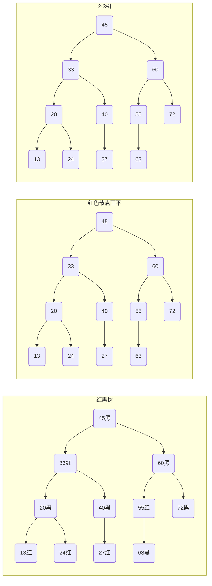
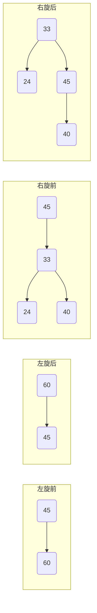
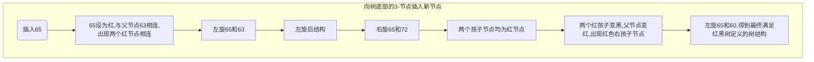
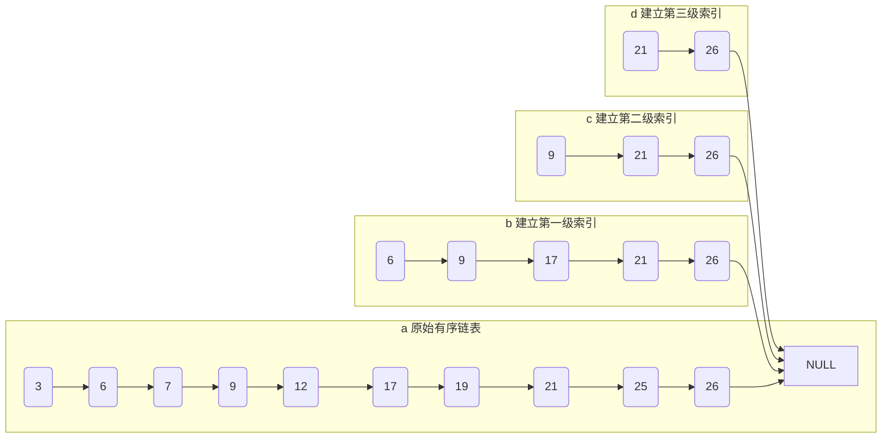
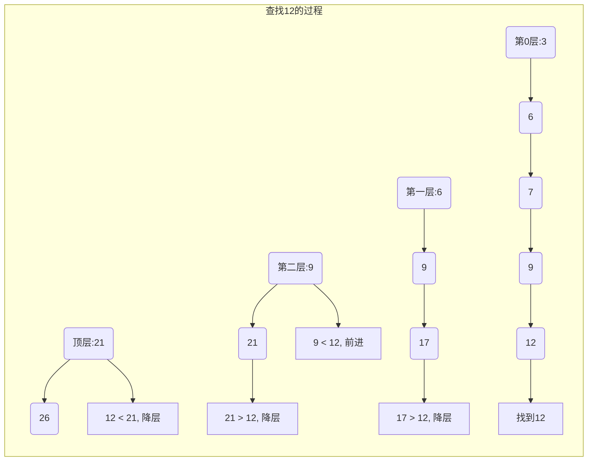
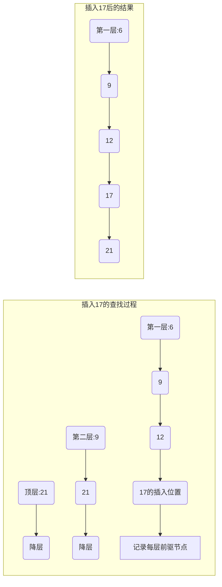

# 第2章 索引数据结构

每种数据结构都是为了解决现实中的各种问题而产生的，这也决定了每种数据结构都有其适用的场景。本章除了尽可能详细地讲解每种数据结构的原理、特点和适用场景外，还尝试回答每种数据结构产生的动机，以让读者更好地掌握索引数据结构。

## 2.1 基础数据结构

数组和链表的特性是互补的，其他数据结构基本上都是由数组和链表至少一种构成的。比如，[[Hash表]]底层就是采用数组来实现的，当Hash表中存储的元素发生Hash冲突时，根据不同的处理策略又会结合为不同的数据结构。当采用开放地址法解决Hash冲突时，Hash表内部仍然只采用数组存储数据；而当采用链地址法时，Hash表会将发生Hash冲突的元素用链表连接在一起，结合数组和链表来解决Hash冲突问题。再如，[[二叉树]]、[[红黑树]]可以看作具有两个指针的链表结构，这种结构是链表的一种进化版。[[跳表]]也是在链表基础上构建的一种高阶数据结构。[[B树]]、[[B+树]]则是包含多个链表指针的数据结构，在内部实现时通常将数组和链表二者结合使用。

综上，数组和链表在存储引擎甚至整个计算机中的重要性毋庸置疑。为方便后续内容的学习，本节将快速回顾一下数组和链表的核心内容。

### 2.1.1 数组

数组是大家平常接触最多也最熟悉的一种数据结构了，目前主流的编程语言基本上都提供数组直接使用。本小节从数组的基本特性、数组操作的时间复杂度、存储引擎中数组的适用场景进行分析。

#### 1. 数组的基本特性

数组是指在计算机内存中开辟一块指定大小的连续区域来存储相同类型的元素，其中内存起始地址为数组首地址。由于数组元素连续存储且类型相同，假设数组首地址为A，存储的元素大小为M字节，则数组中存储的第i个元素对应的地址为A + i×M，这意味着可以通过数组的下标在常数时间内访问数组中的任意一个元素，数组的这种特性称为**顺序存储随机访问**。此外，数组在使用上也比较简单。数组的简单示意如图2-1所示。

> [!NOTE] 图2-1 数组的简单示意
> 一个包含6个元素的数组：下标0~5，元素值分别为3,0,2,1,5,2,7,3,4,4,1,5（原文图例显示为数组下标和元素值，此处用文字描述：数组元素：3,0,2,1,5,2,7,3,4,4,1,5；数组下标：0,1,2,3,4,5. 实际图为一个数组的直观表示，因缺失图像，保留文字说明）

数组的缺点主要有以下几个。

- **大小固定**：数组在使用前初始化时需要分配空间，因此需要指定大小。如果存储的元素个数明确，则大小比较好确定；如果存储的元素是动态变化的，则比较难确定分配空间的大小，设置得太大容易造成空间浪费，设置得太小又会导致存储不下所有元素。鉴于原生的数组有这样的特点，一些编程语言对数组进行了封装，提供了动态数组的特性。比如Java语言中的`ArrayList`、C++中的`vector`等。在实际编程时会根据应用的实际情况动态地对数组的大小进行调整。

- **连续分配**：数组分配的空间是连续的，当数组规模太大并且连续的内存空间不够时会出现分配失败的情况。此外，连续分配的方式会使内存空间的利用率降低。

- **插入/删除慢**：在数组中，元素都是紧凑排列的。这也意味着，要在数组中插入或删除一个元素，操作的元素在数组中的位置就很重要。以插入元素为例，如果要在数组尾部插入一个元素，只需要给数组末尾的位置赋值即可。但如果要在数组的其他位置插入一个元素，则需要分为两个步骤：第一步，将插入位置及之后的数组元素依次往后移动一位，以便将当前待插入的数组位置空出来；第二步，对数组中待插入的位置进行赋值操作。尤其是在数组头部插入一个元素时，需要移动数组中的所有元素，这种情况下的开销还是比较大的。删除元素的过程和插入过程相反，当删除某个位置的元素时，需要将该位置之后的元素依次往前移动。

#### 2. 数组操作的时间复杂度

对于数据结构而言，主要功能体现在对数据结构的操作上，数组也不例外。下面将依次分析在数组中插入、删除、查找指定下标的元素对应的时间复杂度。

在数组中插入、删除元素的主要开销在于移动数组元素，不同位置移动的元素个数不同。通常数组的插入、删除的平均时间复杂度为O(N)，其中N为数组中元素的个数，而根据数组下标获取某个位置元素的时间复杂度则为O(1)。

接下来思考一个问题：如果要查找某个元素是否存在于数组中，平均时间复杂度是多少呢？

要在一个数组中查找某个指定的元素，最直接的方式就是遍历一遍数组，然后逐个对比数组中的元素是否和查找的元素相等。在这个过程中，如果待查找的元素是数组中的第一个元素，则只需要遍历数组的第一个元素即可结束；而如果待查找的元素是数组中的最后一个元素或者数组中根本就不存在指定的元素，那么就需要遍历完数组中的所有元素后才能确定结果。所以查找的平均时间复杂度为O(N)，其中N为数组中元素的个数。

上述查找操作其实是一般意义上的查找，未考虑数组是否有序。对于一个有序的数组，在查找某个指定的元素时可以采用**折半的思想**进行优化。为了方便叙述，假设当前数组为Arr，数组长度为N，待查找元素为Target。具体过程为：首先根据数组大小计算出数组中间元素的下标 `mid = N/2`，然后比较当前查找元素Target和数组中间元素Arr[mid]，比较结果有如下三种可能。

- **Target = Arr[mid]**：表示已经找到了待查找的元素Target，结束查找即可。
- **Target < Arr[mid]**：表示当前查找的元素Target比数组中间的元素小，如果Target在数组中存在，则只可能位于数组`[0, mid)`这个下标区间内，故只需要在该区间继续进行递归查找。
- **Target > Arr[mid]**：表示待查找的元素Target比当前数组中间元素Arr[mid]大，如果Target存在于数组中，只可能位于数组`[mid + 1, N)`这个下标区间内，故只需要在该区间按照上述过程进行递归查找。

综上，在有序数组中查找某个指定元素时，可以采用不断缩小数组查找区间的方式加快查找过程。由于每次比较都可以将数组的区间一分为二（缩小一半），因此该方法称为**二分查找法**或者**折半查找法**。这种查找方法查找的平均时间复杂度为O(log N)。

#### 3. 数组的适用场景

基于下标访问数组元素和有序数组的二分查找的时间复杂度都比较低，所以存储引擎使用数组时主要利用这两种方法。以B+树存储引擎为例，在B+树存储引擎中一个节点的多个孩子节点通过数组存储，在操作时始终保持该数组有序，同时叶子节点采用固定大小的数组来保存原始数据。当查找、更新、删除某个元素时，会按照根节点→分支节点→叶子节点的顺序查找，并利用有序数组的二分查找加快查找过程。当查找到达叶子节点时，表示已经定位到了待查询的数据信息。该信息中至少记录了当前待查找的数据在叶子节点的起始位置与长度。获取待查询的原始数据时，通常是通过数组的下标来得到的。

### 2.1.2 链表

数组会占用连续的内存空间，所以系统长时间运行后会使得内存空间的利用率降低，产生内存碎片，于是就有了链表。和数组一样，链表也是一种基础的数据结构。下面将从链表的基本特性、链表操作的时间复杂度、存储引擎中链表的适用场景几方面展开介绍。

#### 1. 链表的基本特性

链表不同于数组，在使用时既不需要指定大小，也不要求元素之间连续存储。链表以**节点**作为单位，一个链表通常由多个节点链接而成。链表中的每个节点内部除了维护存储的元素外，还需要额外维护指向下一个节点的指针结构。链表的示意如图2-2所示。

> [!NOTE] 图2-2 链表的示意
> 一个单链表：表头节点指向值为3的节点，3的节点指向值为8的节点，8指向值为10的节点，10指向值为6的节点，6指向NULL（空）。示意图展示了链式结构。

链表根据包含指针的个数不同，可以分为单链表和双链表。顾名思义，单链表只包含一个指针，它只能向后遍历。而双链表包含两个指针，所以可以向前和向后遍历。例如Java语言中的`LinkedList`、C++中的`list`等都属于双链表数据结构。

#### 2. 链表操作的时间复杂度

链表是链式存储、顺序访问，这也决定了链表操作的时间复杂度和数组截然不同。下面分析在链表中插入、删除、查找元素的时间复杂度。假设链表的元素个数为N。

如果插入和删除操作的元素位置是在链表的头部，则链表只需要重新设置指针指向即可，而不需要移动其他节点，因此时间复杂度为O(1)。而如果是在链表尾部进行插入或删除操作则需要分两步：第一步，当链表只保存了头节点时，则需要先遍历到链表尾部，时间复杂度为O(N)；第二步，当到达链表尾部后，进行真正的插入和删除操作，此时只需重新设置指针指向即可。在这种情况下，通常也可以通过额外保存一个链表的尾节点来避免遍历带来的开销。在保存头、尾节点的情况下，在尾部插入和删除的时间复杂度均为O(1)。

在计算机中有一种针对有序链表进行优化的数据结构，它可以做到按照二分查找的思路查找元素，这种数据结构即为跳表，具体内容请参见2.3.3节。

#### 3. 链表的适用场景

链表不仅可以非常方便地在头部/尾部插入或删除元素，而且不要求所有元素连续存储，因此能更好地利用碎片内存空间。基于这些特性，链表在存储引擎中发挥着重要作用。

以B+树存储引擎[[InnoDB]]为例，其内部就大量采用了链表结构，如采用链表对频繁插入或者删除的空闲页、脏页等进行管理。同时，InnoDB的叶子节点也采用了链表的方式，以方便进行数据的全表扫描。此外，部分场景还会通过链表来构建环形队列或者缓冲区等高阶的数据结构来存储数据。总之，只要对元素或数据进行频繁插入、删除的场景都可以优先考虑使用链表，因为它的效率极高。

基于数组下标访问元素比较快，但在空间上要求元素连续存储；而链表对元素的增删比较方便，同时不要求元素连续存储。可以说，数组和链表在很多特性上是相反的，二者是互补的关系。表2-1 总结了数组和链表的几种操作的时间复杂度。

**表2-1 数组和链表的几种操作的时间复杂度对比**

| 操作 | 链表 | 静态数组 | 动态数组 |
|------|------|----------|----------|
| 按照下标访问 | O(N) 定位O(N) | O(1) | O(1) |
| 在头部插入/删除 | O(1) | O(N) 定位O(1)、执行O(N) | O(N) 定位O(1)、执行O(N) |
| 在尾部插入/删除 | O(N) 定位O(N)、执行O(1) | O(1) | O(1) |
| 在中间插入/删除 | O(N) 定位O(N)、执行O(1) | O(N) 定位O(1)、执行O(N) | O(N) 定位O(1)、执行O(N) |

## 2.2 Hash 类数据结构

在一些场景中，要求元素读和写的平均时间复杂度为O(1)。仅使用数组或者链表是无法满足要求的，那是否有办法将二者结合使用以满足这样的要求呢？

答案就是采用[[Hash表]]、[[位图]]和[[布隆过滤器]]。这些数据结构均通过Hash算法来映射存储的元素，所以称为**Hash类数据结构**。Hash类数据结构基本上都是构建在数组之上，同时在一些实现中结合使用链表。Hash类数据结构在存储引擎中使用得非常频繁，理解其原理非常有必要。

### 2.2.1 Hash表

Hash表（也称为哈希表、散列表）是一种用来实现数据存储及快速检索的数据结构，在计算机中有着非常重要的作用。现如今很多主流的编程语言都提供了对Hash表的实现，比如Go中内置的`map`类型、Java集合包中的`HashMap`、C++ STL中的`unordered_map`等。

Hash表存储的元素包含两部分：一部分是关键字信息，另一部分是值信息。该数据结构通常是将关键字和值关联在一起，所有对值的操作都是通过关键字来完成的。Hash表中的关键字可以是各种基本数据类型，值可以是任意类型。因此从这个角度来说，数组其实可以看作一种特殊的Hash表，它的关键字信息即数组的下标，必须是整数类型。

#### 1. Hash表基础

Hash表底层通常采用数组来存储数据，而采用数组时一般都是通过数组下标（整数类型）来设置元素的值。因为传入Hash表的关键字不一定是整数类型，所以当关键字类型不是整数时，无法直接存储到数组中，此时就出现了矛盾。一种办法是在关键字和数组下标之间建立一层转换关系，比如通过**Hash函数**将关键字转换成数组下标，然后将值存储到数组中对应的下标位置上。这样就解决了这个矛盾，Hash表确实也是这么做的。

对Hash表而言，通常对值的操作是通过传入的关键字完成的，内部通过Hash函数计算出关键字映射后的Hash值，然后将该Hash值作为数组下标访问元素，获取到的数组元素即为值。

在上面的分析中有几个问题需要解决，这几个问题是：如何选择Hash函数，即Hash函数应该满足什么要求？如果是两个不同的关键字，通过Hash函数计算出来的Hash值是否会相同？Hash值相同的情况一般称为[[Hash冲突]]，当发生Hash冲突时，关键字对应的值应该如何处理？下面将分别解决上述问题。

##### （1）常用的Hash函数

理想情况下，Hash函数应该将可能存在的关键字映射到数组中唯一的下标，然而在实践中这往往很难实现。一个好的Hash函数应该在满足简单、快速计算Hash值的同时，最大限度地减少Hash冲突，并尽可能使存储在Hash表中的元素均匀分布。在实践中采用的Hash函数主要有直接寻址法、折叠法、平方取中法、除留余数法等几种。

- **直接寻址法**。直接寻址法是指以关键字或者关键字的某个线性函数的结果作为Hash值。这种Hash函数也称为自身函数。具体的计算公式为`hashKey = key` 或者 `hashKey = a×key + b`。

- **折叠法**。折叠法的基本过程是把关键字的数字分成几组，然后几个组相加，最后取这几个组的叠加和（超过Hash表的长度时取余）为Hash值。一个组拥有几个数字是和数组容量相对应的，例如当Hash表的长度为1000时，每组包含3个数字。

- **平方取中法**。平方取中法是指先对关键字进行平方计算，然后将得到的结果的中间几位作为Hash值。如果关键字是非数值类型，则需要预先进行处理（比如使用折叠法等）以变成数字。这种Hash函数的优点在于，Hash值的计算过程中整个关键字都会参与地址的生成，因此为不同关键字生成不同的Hash值提供了更大的可能性。举个例子，假设关键字为434，则对该关键字进行平方计算后得到的值为188356。因此对底层数组大小为100的Hash表而言，该关键字的Hash值为83。83为434²的中间部分。在实际应用中，为了更有效地通过这种方法提取Hash值，往往会对关键字进行平方计算后将其结果按照二进制方式表示，并提取中间部分的二进制数作为Hash值，因为这样可以利用掩码和移位操作快速提取Hash值。

- **除留余数法**。Hash函数的主要作用是将关键字通过某种方法映射为Hash表底层数组的下标，那最简单、最直接的办法就是对关键字和Hash表底层数组长度进行取模运算，除留余数法就是源于这种想法。更一般的意义上而言，可以以关键字对某个数p（p的值小于Hash表底层数组长度m）取模后的值作为Hash值，即`hashKey = key MOD p, p ≤ m`。p的选择很重要，一般选择素数或者m，如果p选得不好，很容易发生Hash冲突。另外要注意，这种方法中不仅可对关键字直接取模，也可以在折叠法或者平方取中法等运算后取模。

##### （2）Hash冲突的解决方法

根据发生冲突时是否在Hash表中直接存储元素信息，可以将解决Hash冲突的方法分为**直接链接法**和**开放定址法**两类。

1. **直接链接法**。直接链接法通常是数组结合链表实现的，也称为[[链地址法]]。主要思想是当多条记录映射到Hash表中的相同位置时，这些记录具有相同的Hash值，将它们通过一个链表进行链接。其中Hash表内部的数组中存储每个链表的头节点。直接链接法示意如图2-3所示。

> [!NOTE] 图2-3 直接链接法示意
> 一个大小为10的Hash表（下标0-9）。依次插入关键字：A2、A5、A7、B9、C9、B5、B2、C2。插入后分布示例：
> - 下标0: 空
> - 下标1: 空
> - 下标2: A2 -> B2 -> C2 （链表）
> - 下标3: 空
> - 下标4: 空
> - 下标5: A5 -> B5 （链表）
> - 下标6: 空
> - 下标7: A7 （链表）
> - 下标8: 空
> - 下标9: B9 -> C9 （链表）
> （注：原图给出了具体的插入序列，此描述尽量还原冲突情况）

因为链表可以无限扩展，所以无论存储多少元素，Hash表都不会产生溢出。然而，这种方法解决了Hash冲突后又有可能引入新的问题。新的问题主要在于链表，因为某个链表中维护的元素很多（Hash冲突比较严重）时，当根据关键字检索某个值时需要遍历该链表，Hash表查找的时间复杂度就会上升为O(N)。尤其是当查找一个不存在的关键字时，需要遍历完整个链表才能知道结果。鉴于此，一种优化思路是将链表替换成其他数据结构（比如红黑树、二叉树等）以改善检索性能。

2. **开放定址法**。和直接链接法的思路不同，开放定址法是将所有的元素都存储在Hash表数组自身中，当某个关键字和其他关键字发生Hash冲突时，通过探测的方式重新在Hash表数组中找到其他可用的位置存储。假设Hash表数组长度为hSize，Hash函数为h，通过Hash函数计算得到的位置为h(key)，则发生Hash冲突后探测新位置的计算方法如下：

```
norm(h(key) + p(1)), norm(h(key) + p(2)), ..., norm(h(key) + p(i)), ...
```

其中，函数p表示探测函数；i表示探测指针；norm表示一个规范化函数，通常用于对Hash表数组大小取模，该函数意味着当探测到Hash表最后一个位置后会循环到Hash表第一个位置继续进行探测。当重复探测到原来的位置时，表示Hash表已满。根据所选择的探测函数不同，可以将开放定址法分为线性探测法、二次探测法、双重散列探测法。

①**线性探测法**。线性探测法选择的探测函数为p(i) = i。因此再次进行Hash操作（rehash）的函数如下：

```
rehash(key) = (h(key) + i) % hSize
```

这个探测函数将探测间隔固定为1，从通过Hash函数计算得到的h(key)这个位置开始依次探测，直到找到一个可用的位置为止。当探测到Hash表数组结尾时，如果还没找到可用位置，则会循环到Hash表数组头部，然后从头开始继续探测。这个方法虽然解决了Hash冲突，但是随着Hash表存储的元素越来越多，可能会使得Hash表中出现一组连续被占据的位置，即元素在Hash表中集中存储，这种现象称为**聚集**。聚集会导致探测变慢，从而降低Hash表的整体效率。因此，目前的核心矛盾就在于如何避免数据块的形成。可以通过选择探测函数p来解决。

②**二次探测法**。二次探测法选择的探测函数为p(i) = i²，再次进行Hash操作的函数如下：

```
rehash(key) = (h(key) + i²) % hSize
```

线性探测法产生的聚集问题可以通过该方法解决。该探测的间隔为i²。同理，如果有必要，在探测到Hash表最后一个位置后可以循环到Hash表的第一个位置继续探测。二次探测法通过调整探测的间隔可以避免聚集，但还是存在出现聚集的可能。聚集由多个关键字映射得到同一个Hash值引起，所以这些关键字相关的探测序列随着重复冲突的出现而延长。这种方法产生的聚集称为**“二次聚集”**。

③**双重散列探测法**。双重散列探测法是指采用两个Hash（散列）函数，Hash函数h决定关键字在Hash表数组中的位置，而p则用第二个Hash函数来表示，它用来解决冲突。这种方式中探测间隔由Hash函数p来计算生成。该方法可以解决二次聚集问题。再次进行Hash操作的函数如下：

```
rehash(key) = (h(key) + i×p(key)) % hSize, i ≥ 0
```

算法首次计算得到的位置为h(key)，当该位置已经被占据后，继续探测的位置为h(key) + p(key), h(key) + 2×p(key), …

三种开放定址法的对比见表2-2。

**表2-2 三种开放定址法的对比**

| 对比项 | 线性探测法 | 二次探测法 | 双重散列探测法 |
|--------|------------|------------|----------------|
| 实现 | 最快 | 最容易实现和应用 | 实现相对复杂 |
| 探测 | 使用少量探测 | 使用额外的内存来保存链接，并不探测表中所有的位置 | 使用少量探测序列，但是需要花费更多的时间 |
| 数据聚集 | 存在数据聚集问题 | 存在二次聚集问题 | 能更有效地利用内存 |
| 探测间隔 | 探测间隔通常固定为1 | 探测间隔的增加和Hash值成正比 | 探测间隔由专门的Hash函数计算确定 |

#### 2. Hash表的特性

总体来说，在各种数据结构中对Hash表读/写的平均时间复杂度是最低的。此外，Hash表还有一大特点，就是它内部存储的所有元素是无序的，因此遍历Hash表无法得到元素的有序列表。

**（1）读/写时间复杂度低**

对于一个良好的Hash表而言，读/写的平均时间复杂度为O(1)，读/写操作均需要先通过Hash函数计算关键字对应的Hash值，然后以该Hash值作为Hash表底层数组中的下标获取或者操作关键字对应的值。当多个关键字通过Hash函数映射到同一个数组位置发生Hash冲突时，如何保证O(1)的时间复杂度呢？通常采用**负载因子**来解决该问题。负载因子通常是一个比较小的常数（例如10或者20等），它会确保Hash表中的每块平均存储元素的最大数量小于负载因子，在这种情况下就确保了时间复杂度为O(1)。

如果某块中的平均元素数目大于负载因子，则需要对Hash表进行扩容，扩容后将维护的所有元素重新进行Hash操作分散到Hash表中，在这个过程中确保每块的元素数目小于负载因子，通常情况下在检索操作大于插入/删除操作时，会采用Hash表。

**（2）元素无序性**

Hash表虽然可以支持O(1)的平均时间复杂度进行读/写，然而通过Hash表存储的元素是无法保证整体有序的，因为元素关键字之间的顺序和通过Hash函数映射后的Hash值之间的顺序往往是不相干的。在一些场景中，Hash表最多只能维持具有相同Hash值的元素内部有序排列（例如链表可以替换成红黑树等有序数据结构）。因此，如果要求存储的元素整体有序或者按照全局有序的方式访问，那么Hash表将无法满足该要求，需要借助其他数据结构解决该问题。

#### 3. Hash表的适用场景

存储引擎中主要借助Hash表高效的检索能力来提供查询功能。MySQL专门有一类Hash索引，其底层就是用Hash表来实现的。Hash索引在提供点对点的查询中非常方便和高效。除了关系数据库外，在一些存储键值对为主的数据库中，Hash表更是发挥了巨大的作用，最典型的代表就是Redis。Redis基本上是以Hash表为核心，在此基础之上扩展出来其他丰富的数据结构对外提供。

此外，采用Hash表存储索引来实现存储和缓存的组件有很多，例如Bitcask、FreeCache、BigCache等。在这些组件中数据读/写时先从Hash表获取索引，然后根据索引访问对应的原始数据，通过Hash表来保证较高的读/写性能。

Hash表还可以用于数据去重。很多编程语言更是借助Hash表实现了一种专门去重的数据结构——**集合**。基于Hash表的位图和布隆过滤器，在很多去重和判重的场景中发挥着重要的作用。

### 2.2.2 位图

在使用Hash表时通常会将待处理的全量数据集都映射到Hash表中，再处理其他的逻辑。如今处理海量数据是很常见的场景，而当映射到Hash表的数据集过大时，要将其进行映射存储，通常需要很大的存储空间，甚至在一些极端情况下存储空间根本容纳不下这些数据。然而，在一些场景中存储全量的数据只是为了判定数据的某些状态，从本质上来说，如果有办法达到这样的目的，其实完全可以不用存储这些数据。此时，采用**位图**是比较合适的。

#### 1. 位图的基本原理

从严格意义上来说，位图并不算是一种数据结构，它只是一种特殊的Hash表。位图的核心在于“位”，指通过用计算机中的一个位（bit）来标记某个元素对应的值，位图的关键字就是该元素本身。在位图中，底层存储元素的数组称为**位数组**。

一个int类型的整数通常占据4字节（Byte, B），而1B包含8位（bit, b）。这也就意味着，如果要将一个int类型的整数转化为二进制的形式，会包含32b。按照位图的定义，用1b来标识1个元素的话，它可以标识0～31范围内的32个数字。同理，在计算机中char类型和byte类型均占1B，即8b，因此它们可以标识0～7范围内的8个数字。由于采用位来标识元素，因此占据的空间比较小。一个包含8位的位图如图2-4所示。

> [!NOTE] 图2-4 位图示意
> 一个包含8位的位数组，位下标从0到7，每个位置显示为0（未设置）。表示为8个方格，全部为0。这是初始化后的状态。

位图中一个位只有0或者1两种状态，因此位图处理主要包含初始化位图、某位置1、某位置0、查询某位状态这四个操作。

**（1）初始化位图**

在使用位图时需要先对位图进行初始化，简单来说就是需要开辟多大的位数组空间。在初始化时，一般需要传递待处理数据中的最大值N，然后内部根据N来计算所需要的位数组空间，一般可以采用char数组或者int数组来表示位数组bits。这里以int类型的位数组为例，需要的位数组空间大小size应为N/32 + 1（1个int类型的整数为32位，加1是为了兼容N不是32的整数倍的情况）。开辟空间后将所有位都置为0即可。

初始化位图后，后续的置1、置0、查询等操作均需要对指定的关键字key进行**定位**。所谓定位，是指确定当前要操作的关键字key对应的位在bits数组中的位置。该位置可以通过数组下标（index）和比特位（pos）来确定。index和pos的计算公式为：`index = key/32`，`pos = key%32`。当得到index和pos的信息后，再针对不同的操作进行具体处理。

**（2）某位置1**

在置1操作时，首先将1左移pos位，然后和bits[index]进行或（|）运算。具体表达式为`bits[index] = bits[index] | (1<<pos)`。为了便于理解，假设bits[index] = 110010110（二进制），pos = 3，那么置1操作如图2-5所示。

> [!NOTE] 图2-5 置1操作示意
> 将bits[index] 110010110 与 1<<3=000001000 进行或运算，得到110011110。原图缺失，此描述示意。

**（3）某位置0**

在置0操作时，需要将bits[index]对应的数中的pos位设置为0，此时的流程为先将1左移pos位，然后进行取反，最后将得到的结果和bits[index]进行与（&）运算。具体表达式为`bits[index] = bits[index] & (~(1<<pos))`。为方便理解，同样假设bits[index] = 110010110，pos = 4，则置0操作如图2-6所示。

> [!NOTE] 图2-6 置0操作示意
> 将bits[index] 110010110 与 ~(1<<4)=11101111 进行与运算，得到110000110。原图缺失，此描述示意。

**（4）查询某位状态**

查询某位的数据时，只需要将1左移pos位，然后将得到的结果和bits[index]进行与（&）运算即可。具体表达式为`res = bits[index] & (1<<pos)`。如果res > 0，则表示该关键字对应位的值为1，否则为0。

#### 2. 位图的适用场景

通常在需要以下几种功能时优先考虑使用位图。

- **快速查找**：给定一个海量的数据集，要求快速查找某个数据是否存在于该集合中。
- **排序**：给定一批无序且无重复的整数集合，要求对集合中的元素进行排序。
- **去重**：给定一批包含重复元素的整数集合，要求去除其中重复的元素。

位图也存在局限性：一方面，位图只能处理整型数据，其他类型的数据无法直接使用位图来解决问题；另一方面，如果用1位来存储元素的状态，只能有0和1两种结果，无法适用于元素状态超过两种的情景，比如，统计元素在集合中的状态有不存在、存在一次、存在两次、存在多次几种，此时可以考虑用2位或者几位来表示一个元素的状态。

## 2.2.3 布隆过滤器

位图只能用于映射整数类型的数据，无法用于字符串或者其他类型的数据。为了处理非整数类型数据的场景，就出现了一种新的数据结构—**[[布隆过滤器]]**。

### 1. 布隆过滤器的原理

布隆过滤器是1970 年由布隆提出来的一种比较巧妙的、紧凑型的概率性数据结构。布隆过滤器本质上还是一种位图，底层通过位数组来实现。它的核心思想与[[Hash 表]]类似，也是借助 [[Hash 函数]]对需要映射的关键字进行转换，其输出结果为整型的 Hash 值，之后用该 Hash 值设置位数组的对应位。在通过 Hash 函数映射时同样会出现 [[Hash 冲突]]，因此布隆过滤器通常选择多个 Hash 函数来映射关键字。经计算会得到多个 Hash 值，然后依次将这些 Hash 值设置为对应的比特位的值。通过采用多个 Hash 函数的方式可以有效地降低 Hash 冲突。

> [!INFO] 图2-5 与图2-6 为位图置1与置0操作示例（原始文本中图2-5与图2-6为位图操作示意，此处保留描述但不再复现图像）

（1）布隆过滤器的基本原理

布隆过滤器一般由一个大小为 `m` 的位数组 `bits` 和 `k (k > 1)` 个 Hash 函数组成。通常会将 `n` 个元素的数据集存储到布隆过滤器中，然后用作后续逻辑处理。向布隆过滤器中添加元素的过程如下：假设将元素 `n_i` 添加到 `m = 8`, `k = 3` 的布隆过滤器中，用 `k` 个 Hash 函数计算得到 `k` 个 Hash 值 `hash1, hash2, …, hashk`，然后依次将 `bits` 中下标为 `hash1, hash2, …, hashk` 的值置1。布隆过滤器添加元素的过程如图2-7 所示。

> [!TIP] **图2-7** 布隆过滤器添加元素的过程：对关键字 `k` 采用多个不同的 Hash 函数计算 Hash 值，然后将对应的多个位置1。

（2）布隆过滤器的误判

需要注意的是，和位图一样，布隆过滤器存储的不是元素的值，因此无法从中获取元素的数据，但是可以借助它来判断元素的状态，例如判断某个元素在海量数据集合中是否存在。判断的方法是用 `k` 个 Hash 函数计算待判断元素的 Hash 值，然后判断这 `k` 个 Hash 值对应的比特位的值是否都为1，如果都为1 表示该元素**可能存在**，如果其中有一位为0 则表示该元素**一定不存在**。

在利用布隆过滤器判断元素是否存在时一定要注意可能出现的误判情况，即“**假阳性**”。在图2-8 所示的示例中，可以看到加入布隆过滤器（`m = 16, k = 3`）的数据集 `{X, Y}`，其中将 `X(hash1 = 1, hash2 = 3, hash3 = 6)` 和 `Y(hash1 = 7, hash2 = 10, hash3 = 13)` 加入后，布隆过滤器中的6 个位已置成了1。假设此时判断 `Z(hash1 = 6, hash2 = 10, hash3 = 13)`，就会发现集合中未添加过 `Z`，但根据布隆过滤器返回的结果却判断 `Z` 存在，因此就出现了误判。

> [!WARNING] **图2-8** 布隆过滤器误判示意：`X` 与 `Y` 的位被置1，导致 `Z` 的 hash 值恰好命中所有位，产生假阳性。

虽然布隆过滤器的空间利用率很高，但是它有一定的误判率，即便误判率很低。布隆过滤器的误判率和它自身的几个参数（位数组大小 `m`、Hash 函数个数 `k`）及映射的数据集大小 `n` 有关系：位数组越大，采用的 Hash 函数越多，映射的数据越少，发生误判的概率越低，反之则误判率越高。

此外，在布隆过滤器中**无法进行删除操作**，因为删除一个元素对应的多个比特位的值后会影响其他元素的状态，所以布隆过滤器只支持插入和查询操作，不支持删除操作。

（3）布隆过滤器相关公式推导

接下来介绍布隆过滤器相关的公式推导及证明[^1]。这部分内容是扩展内容，不感兴趣的读者可以直接跳过，继续往下阅读。

在进行公式推导之前，提前做一些设定。假设布隆过滤器由 `k` 个 Hash 函数和空间大小为 `m` 的位数组构成，插入的元素个数为 `n`。

**1）误判率推导。**

假设 Hash 函数相互之间是无关的并且等概率选择比特位，当向布隆过滤器中插入一个元素时，它的第一个 Hash 函数会将其中的某个比特位置为1，位数组中任何一个比特位被置为1 的概率为 $\frac{1}{m}$，因此某一位未被置为1 的概率为 $1 - \frac{1}{m}$。执行一次元素插入操作，布隆过滤器需要执行 `k` 个 Hash 函数，因此插入一个元素后该比特位仍然没有被置为1 的概率为 $\left(1 - \frac{1}{m}\right)^k$。插入第二个元素后，该比特位依然没有被置为1 的概率为 $\left(1 - \frac{1}{m}\right)^{2k}$。同理，当 `n` 个元素都插入到布隆过滤器后，该比特位还没有置为1 的概率为 $\left(1 - \frac{1}{m}\right)^{kn}$。反过来，插入 `n` 个元素后，某个比特位被置为1 的概率则为 $1 - \left(1 - \frac{1}{m}\right)^{kn}$。

当从布隆过滤器中检索一个元素是否存在于该集合中时，判断依据是 `k` 个 Hash 函数计算后的 Hash 值对应的比特位是否都为1，该方法可能会错误地认为原本不在集合中的元素是存在的，因此就导致了误判。发生误判的概率为

$$
p = \left[1 - \left(1 - \frac{1}{m}\right)^{kn}\right]^k \approx \left(1 - e^{-\frac{kn}{m}}\right)^k
$$

式中采用 `≈` 是因为使用了公式 $\lim_{x \to \infty} \left(1 - \frac{1}{x}\right)^{-x} = e$。

根据上式可以得知，位数组大小 `m` 越大，误判率 `p` 越小，如果元素数量 `n` 增大，则误判率 `p` 也随之增大。

**2）最优 Hash 函数个数推导。**

从前面误判率的公式可以看出，误判率 `p` 与 Hash 函数个数 `k` 也有很大的关系。那么，当 `k` 取何值时，误判率可以最小呢？

令 $f(k) = \left(1 - e^{-\frac{kn}{m}}\right)^k$ 且令 $b = e^{\frac{n}{m}}$，则上式可简化为

$$
f(k) = (1 - b^{-k})^k
$$

对上式两边取对数后可得

$$
\ln f(k) = k \ln(1 - b^{-k})
$$

再对两边求导可得

$$
\frac{f'(k)}{f(k)} = \ln(1 - b^{-k}) + \frac{k b^{-k} \ln b}{1 - b^{-k}}
$$

若要使 $f(k)$ 取极值，则需 $f'(k) = 0$，故

$$
\ln(1 - b^{-k}) + \frac{k b^{-k} \ln b}{1 - b^{-k}} = 0
$$

$$
\Rightarrow (1 - b^{-k})\ln(1 - b^{-k}) = -k b^{-k} \ln b
$$

$$
\Rightarrow (1 - b^{-k})\ln(1 - b^{-k}) = b^{-k} \ln(b^{-k})
$$

令 $b^{-k} = \frac{1}{2}$，则 $1 - b^{-k} = \frac{1}{2}$，代入上式左边 $= \frac{1}{2} \ln \frac{1}{2} = -\frac{1}{2} \ln 2$，右边 $= \frac{1}{2} \ln \frac{1}{2} = -\frac{1}{2} \ln 2$，等式成立。因此极值条件为 $b^{-k} = \frac{1}{2}$，即 $e^{-\frac{kn}{m}} = \frac{1}{2}$，解得

$$
k = \frac{m}{n} \ln 2 \approx 0.7 \frac{m}{n}
$$

因此，当 $k \approx 0.7 \frac{m}{n}$ 时误判率最低，且此时的 `k` 为最佳的 Hash 函数个数，对应的误判率为

$$
p_{\min} = f(k) = \left(1 - e^{-\frac{kn}{m}}\right)^k = \left(1 - \frac{1}{2}\right)^{\frac{m}{n} \ln 2} = \left(\frac{1}{2}\right)^{\frac{m}{n} \ln 2} = 2^{-\frac{m}{n} \ln 2} \approx (0.6185)^{\frac{m}{n}}
$$

**3）内存空间占用推导。**

在实际应用中，通常插入元素的个数 `n` 和期望的误判率 `p` 是已知的，因此根据 $p = 2^{-\ln 2 \cdot \frac{m}{n}}$ 及 `n`、`p` 这两个参数可以计算得到布隆过滤器占用的位数组大小：

$$
m = -\frac{n \ln p}{(\ln 2)^2}
$$

> [!NOTE] 期望的误判率 `p` 就是最低的误判率（最大上限），因此计算出来的 `m` 是位数组的最小值，即所需的最小位数组空间。最后根据 `m`、`n` 可以求得 Hash 函数个数：
> $$
> k = \frac{m}{n} \ln 2
> $$

### 2. 布隆过滤器的适用场景

布隆过滤器是一种非常特殊的数据结构，相比于其他数据结构它有以下几个优点。

- **时间复杂度低**：布隆过滤器插入和查询的时间复杂度均为 $O(k)$，是一个常数数量级。选择的多个 Hash 函数之间没有关系，在硬件层面可以实现并行计算。
- **占用空间少**：当需要处理的数据量非常庞大时，因布隆过滤器所需的存储空间非常少，所以采用该数据结构可以表示全集，而其他任何数据结构都不行。
- **不存储元素本身**：在布隆过滤器中存储的数据是元素通过 Hash 函数映射后的几个位状态，它并不存储元素本身的信息，因此非常适用于某些对保密性要求非常严格的场景。

尽管布隆过滤器的设计非常巧妙，但不代表它是完美的，它具有以下缺点。

- **存在误判**：在布隆过滤器中对元素的判存或者判重这类操作都存在一定的误判率，尤其随着存入元素的增加，误判率会增加。同时，如果布隆过滤器的几个核心参数设计不好的话，也会对误判率产生很大的影响。因此，在要求“0 误判”的场景中，布隆过滤器将无法很好地适配。
- **无法删除**：一般情况下不能从布隆过滤器中删除元素，因为布隆过滤器底层本身是采用位数组来实现的。虽然可以通过将位数组变成整数数组，每次插入元素时相应的计数器加1 这种方式来支持删除操作（删除时计数器减1），但是要保证安全删除元素并不容易，在删除时必须保证该元素之前已经被加入布隆过滤器中了，然而由于布隆过滤器会误判，所以无法保证满足这个要求。此外，采用计数器还会存在回绕等问题。

总之，布隆过滤器非常适用于对内存空间要求高、高效检索元素状态、数据去重等场景。例如 [[LevelDB]]、[[RocksDB]] 在检索数据时，内部就采用了布隆过滤器来快速拦截掉不存在的元素，以提高元素检索的效率。再如，推荐系统每次向用户推荐内容时会保留用户信息，用于在后续推荐过程中去重。在缓存场景中针对访问元素不存在而造成的[[缓存穿透]]这种问题，也可以借助布隆过滤器来提前校验一次以保证缓存系统的可用性。除了上述场景，布隆过滤器还可以应用于垃圾邮件过滤、爬虫去重等场景。

---

## 2.3 二叉树类数据结构

在读多写少并且要求元素有序的场景，[[有序数组]]可以勉强支持，而一旦面临写多的场景，有序数组的效率就比较低了，因此需要新的数据结构来解决这个问题。本节将介绍元素读/写时间复杂度均为 $O(\log N)$ 的三种数据结构：[[二叉搜索树]]、[[红黑树]]、[[跳表]]。其中，二叉搜索树、红黑树都属于二叉树类数据结构，而跳表属于改进的链表类数据结构。虽然它们的结构有所不同，但提供的功能基本上是相同的。

### 2.3.1 二叉搜索树

二叉搜索树尽管是一种有序的数据结构，但从结构上来看属于特殊的[[二叉树]]（因为普通的二叉树的元素是不要求有序的）。所以二叉搜索树具有二叉树的所有特性。本小节首先将简单介绍下二叉树的基础知识，这部分内容对二叉搜索树也适用，然后介绍二叉搜索树的相关内容。

#### 1. 二叉树基础

二叉树是一种类似于链表的非线性结构，由 `n` 个节点构成的有限集合，每个节点最多可以指向两个节点。二叉树本身是一种递归结构。一棵二叉树一般由根节点和两个互不相交的左子树和右子树构成。图2-9 所示就是一棵二叉树。

> [!INFO] **图2-9** 二叉树：一个根节点 A，左子树 B（下含 D、E、G、H、I），右子树 C（下含 F）。

**（1）二叉树的特点**

- 二叉树中每个节点最多有两个孩子节点，即一个节点有以下4 种情况：没有孩子节点、只有一个左孩子节点、只有一个右孩子节点、既有左孩子节点又有右孩子节点。
- 在子树中，左孩子和右孩子是有顺序的，次序不能随便颠倒。
- 在二叉树中，如果每个节点都只有左孩子或者都只有右孩子，则二叉树就会退化成之前介绍过的单链表结构。

**（2）二叉树的遍历**

在二叉树中非常常见的一种操作就是对二叉树进行遍历（见图2-10），而二叉树采用了一种非线性结构，针对不同的需要可以对二叉树进行不同方式的遍历，主要有[[深度优先遍历]]、[[广度优先遍历]]这两种。

> [!TIP] **图2-10** 二叉树的遍历方式：
> - a) 前序遍历
> - b) 中序遍历
> - c) 后序遍历
> - d) 广度优先遍历

1）**深度优先遍历**。深度优先遍历会尽可能沿着树的深度执行，一般会借助递归来实现，因为二叉树本身就是递归的。如果不借助递归，往往会采用栈这种数据结构来完成深度优先遍历。根据遍历父节点先后次序的不同可分为[[前序遍历]]、[[中序遍历]]和[[后序遍历]]。

- **前序遍历**。先遍历当前节点，再递归遍历该节点的左子树节点，最后递归遍历该节点的右子树节点，直到遍历完所有节点。因此，前序遍历可以总结为“**根左右**”。前序遍历过程如图2-10a 所示。
- **中序遍历**。先遍历递归当前节点的左子树节点，然后遍历当前节点，最后递归遍历当前节点的右子树节点。中序遍历的规律可以总结为“**左根右**”。中序遍历的过程如图2-10b 所示。
- **后序遍历**。先递归遍历当前节点的左子树节点，然后递归遍历当前节点的右子树节点，最后遍历当前节点，直到所有节点都遍历完结束。当前节点是在其左右子树都遍历完后才遍历。后序遍历的过程可以总结为“**左右根**”。后序遍历过程如图2-10c 所示。

2）**广度优先遍历**。通常从二叉树的根节点开始，依次向下遍历逐层访问每个节点。在每一层上按照从左到右的方式访问每个节点。一般广度优先遍历会借助[[队列来实现。广度优先遍历的过程如图2-10d 所示。

**（3）特殊二叉树**

在二叉树中存在一些特殊的二叉树，下面介绍几个比较典型的特殊二叉树。

1）**满二叉树**。如果一个二叉树中的每个节点恰好有两个孩子节点，并且叶子节点都在同一层，这样的二叉树称为满二叉树。满二叉树结构如图2-11a 所示。在同样深度的二叉树中，满二叉树的节点总数最多，同时叶子数也最多。

2）**完全二叉树**。一个具有 `n` 个节点的二叉树按照层序编号，如果编号为 `i (1 ≤ i ≤ n)` 的节点与同样深度的满二叉树中编号为 `i` 的节点在二叉树中的位置完全相同，则称该树为完全二叉树。完全二叉树如图2-11b 所示。根据定义，满二叉树一定是一棵完全二叉树，但完全二叉树不一定是满二叉树。

3）**斜树**。顾名思义，斜树一定是倾斜的，所有节点中只有左子树的二叉树称为**左斜树**，所有节点中只有右子树的二叉树称为**右斜树**。这二者统称为**斜树**。斜树如图2-11c 所示。斜树比较明显的特点是每一层只有一个节点，并且所有节点都只有左子树或者都只有右子树，节点个数与二叉树的深度相同。斜树其实就是树退化成了链表结构。

> [!INFO] **图2-11** 特殊二叉树
> - a) 满二叉树
> - b) 完全二叉树
> - c) 斜树（包括左斜树和右斜树）

#### 2. 二叉搜索树基础

**（1）二叉搜索树的特点**

**二叉搜索树**（Binary Search Tree，BST）又称为**二叉排序树**，它除了具备普通二叉树的特点外，还有一个特点是它内部存储的元素是有序的。二叉搜索树具有以下特点。

- 如果当前节点存在左子树，则当前节点的值**均大于**左子树中所有节点的值。
- 如果当前节点存在右子树，则当前节点的值**均小于**右子树中所有节点的值。
- 当前节点的左、右子树也均为二叉搜索树。

根据上述二叉搜索树的特点可知，二叉搜索树中左子树的节点值一定比它的父节点的值小，同时右子树的节点值一定大于它的父节点的值。以整数集构成的二叉搜索树如图2-12 所示。

> [!INFO] **图2-12** 二叉搜索树示例：根节点45，左子树18-27-34-39，右子树55-57-58-60-62。

二叉搜索树可以跟有序数组一样，对待查找元素进行二分查找。在查找某个元素时，如果该元素的值等于当前节点的值，则说明找到了，直接结束查找即可；如果该元素的值比当前节点的值小，则只需要在当前节点的左子树中查找即可，反之只需要在当前节点的右子树中查找。通过每次查找，平均可以筛选掉二叉搜索树中一半的元素，因此二叉搜索树中平均查找的时间复杂度为 $O(\log N)$。

然而之所以会出现二叉搜索树，并不仅是为了排序查找，还因为在有序数组中插入和删除元素效率比较低，而二叉搜索树则恰好弥补了有序数组的这个缺点，可以支持在有序集合中高效地进行插入和删除。具体而言，在二叉搜索树中执行插入、删除操作时需要先定位到待插入或者待删除元素的位置。定位完成后只需要进行有限数量的指针的设置即可完成操作，而不需要像有序数组一样，进行大量元素的复制和移动，因此二叉搜索树在支持高效查找的同时，又可以支持高效的插入和删除操作。同理，在二叉搜索树中插入、删除的平均时间复杂度为 $O(\log N)$。不过在二叉搜索树中删除元素的操作比较复杂，需要考虑删除的元素是叶子节点还是非叶子节点（有一个孩子节点还是两个孩子节点）。限于篇幅，读者可以自行查阅其他数据结构的书籍。

**（2）二叉搜索树的缺点**

二叉搜索树本身也是二叉树，而在介绍二叉树的时候提到过一种特殊的二叉树——**斜树**。因此对于二叉搜索树而言它的形状取决于构建的数据集，当构建二叉搜索树的数据集本身就是有序集合时构建出来的二叉搜索树就是斜树，数据集升序时对应的是**右斜树**，数据集降序时对应的是**左斜树**。具体示例如图2-13 所示。在这种情况下，二叉搜索树本身退化成了一条有序的链表，其查找的平均时间复杂度为 $O(N)$。

> [!WARNING] **图2-13** 二叉搜索树和斜树
> - a) 二叉搜索树（平衡）
> - b) 右斜树（退化为链表，升序数据构建）
> - c) 左斜树（退化为链表，降序数据构建）

之所以出现上述的情况是因为构建出来的二叉搜索树不平衡，一个平衡的二叉搜索树的深度与完全二叉树相同，均为 $\lfloor \log_2 n \rfloor + 1$，其查找的时间复杂度为 $O(\log N)$，类似于二分查找。为了解决二叉搜索树不平衡的问题，可以在插入、删除元素时进行节点的旋转，使其保持平衡。**平衡二叉树**（Adelson-Velsky and Landis Tree，AVL 树）就具有这种特点。

[[AVL 树]]是一种带平衡条件的二叉搜索树，它规定每个节点的左子树和右子树的高度差绝对值不超过1。AVL 树通过**平衡因子**来判定树是否平衡，当树不平衡时通过旋转节点来达到平衡。AVL 树是一种严格的平衡二叉树，插入与删除操作都必须满足平衡条件，一旦条件不满足就需要进行旋转。频繁的旋转比较耗时，在AVL 树中维护这种高度平衡付出的代价比其带来的收益要大得多，因此在写多读少的实际应用中用得较少。

为了支持写多的场景，同时降低保持树平衡而付出的开销，又产生了支持弱平衡的排序树，比如**红黑树**与**跳表**。

### 2.3.2 红黑树

二叉搜索树的结构严重依赖于构建该树的数据集本身，当数据集无序随机分布时，构建的二叉搜索树比较理想，而当数据集接近有序或者本身已排好序时，构建出来的二叉排序树则不太理想，尤其排序好的数据集构建出的二叉排序树会退化为链表结构，导致其读/写的时间复杂度从 $O(\log N)$ 变为 $O(N)$。而平衡二叉树因其严格的平衡条件，导致在写多读少的场景下为了保证树的平衡付出的开销远大于带来的收益。因此开始尝试放宽平衡条件，从严格平衡向弱平衡过渡，在这样的改进下出现了一系列弱平衡的树结构。本小节将重点介绍其中一种弱平衡的树结构——**红黑树**。

红黑树不是凭空产生的，虽然其结构类似于二叉树，但严格来说它是在 **2-3 树** 的基础上进化而来，因此为了讲清楚红黑树的原理，首先简单介绍一下2-3 树。

#### 1. 2-3 树的原理

在普通二叉排序树中每个节点只包含一个值，同时最多包含两个孩子节点，左孩子节点的值均小于当前节点的值，右孩子节点的值均大于当前节点的值。而2-3 树是普通二叉排序树演变而来的一种树结构。2-3 树规定一个节点最多包含2 个值（假设两个值分别为 $a_1$ 和 $a_2$，并且 $a_1 < a_2$），同时这两个值可以将数据划分为 $(-\infty, a_1)$、$(a_1, a_2)$、$(a_2, +\infty)$ 三个区间，即每个节点最多可以包含3 个孩子节点。

**（1）2-3 树的特点**

如果将原先的二叉排序树的节点称为 **2-节点**，则2-3 树和二叉排序树相比，2-3 树在原先二叉排序树的基础上新增了 **3-节点**。下面给出2-3 树的定义，一棵2-3 树是一棵排序树，它或者为一棵空树，或者由以下节点构成。

## 第2章 索引数据结构

### 2.3.2 2-3树与红黑树

当前节点的值，右孩子节点的值均大于当前节点的值。而2-3树是普通二叉排序树演变而来的一种树结构。2-3树规定一个节点最多包含2个值（假设两个值分别为a1和a2，并且a1<a2），同时这两个值可以将数据划分为（–∞, a1）、（a1, a2）、（a2, +∞）三个区间，即每个节点最多可以包含3个孩子节点。

#### （1）2-3树的特点

如果将原先的二叉排序树的节点称为2-节点，则2-3树和二叉排序树相比，2-3树在原先二叉排序树的基础上新增了3-节点。下面给出2-3树的定义，一棵2-3树是一棵排序树，它或者为一棵空树，或者由以下节点构成。

- **2-节点**：2-节点包含1个值a，同时最多包含2个孩子节点（或者2条边），左孩子节点中的值均小于a，右孩子节点的值均大于a。
- **3-节点**：3-节点包含2个值a1和a2（a1<a2），同时最多包含3个孩子节点（或者3条边），左孩子节点的值均小于a1，中间孩子节点的值介于a1和a2之间，右孩子节点的值均大于a2。

一棵普通的2-3树结构如图2-14所示。一棵平衡的2-3树的所有叶子节点到根节点的距离应该是相同的。

```mermaid
graph TD
    subgraph 2-3树示例
        A(45) --> B(27)
        A --> C(60)
        B --> D(20)
        B --> E(33)
        C --> F(55)
        C --> G(72)
        D --> H(13)
        D --> I(24)
        E --> J(40)
        F --> K(63)
        G --> L(45)???
    end
```

> [!NOTE] 图2-14 2-3树示例  
> 图中展示了根节点45，左孩子27，右孩子60；27下左20右33；20下左13右24；33下右40；60下左55右72；55下左63；72下左45？实际上原图显示的是：45-27-20-13,24; 45-27-33-40; 45-60-55-63; 45-60-72。上图仅为示意，具体节点值请参考原始图示。

#### （2）构建2-3树

在2-3树中插入一个元素主要分为两步：第一步定位到元素要插入的位置；第二步执行插入逻辑。其实在2-3树中，定位的过程就是查找的过程，且查找过程与二叉排序树的类似。首先将根节点的值和待查找元素的值对比，如果它和其中任意一个值相等，则表示找到，否则就根据比较的结果找到对应区间的孩子节点，然后在该孩子节点指向的子树中递归查找，当找到叶子节点并且值不相等时，表示查找未命中。按照上述流程一直查找，最终未找到时所在的位置即为该元素插入的位置。

下面介绍具体的插入逻辑。在2-3树中存在两种节点，因此在插入元素时需要区分不同的情况进行考虑，下面逐一介绍。

**情况1**：向2-节点中插入新节点。当待插入的元素定位到的位置是一个2-节点时，只需要将待插入的元素加入该节点，使其从2-节点变为3-节点。这种情况是最简单的，只需要进行节点转换即可。其处理过程如图2-15a所示。而当待插入的元素定位到的位置是一个3-节点时情况比较复杂，需要考虑结合这个3-节点的父节点进行讨论。

**情况2**：向只含有一个3-节点的2-3树插入新节点。当该3-节点无父节点时，此时如果在该3-节点中加入一个元素，该节点就会变成4-节点，该节点内部包含3个值及4个孩子节点。这显然是不符合2-3树的定义的。所以需要将该4-节点进行调整，使其符合2-3树的条件。这种调整也称为分裂。具体做法为：将该4-节点中的中间值抽取出来，形成一个新的2-节点，然后剩余的两个值分别作为该2-节点的左、右孩子节点，左、右孩子节点也均为2-节点。这样原先树的高度为0，在分裂后将变为高度为1的2-3树，3个节点均为2-节点。其处理过程如图2-15b所示。

**情况3**：向一个父节点为2-节点的3-节点中插入新节点。若当前3-节点的父节点为2-节点时，同样将待插入的元素加入3-节点后形成临时的4-节点，而该4-节点同样需要分裂，按照分裂原则，一个4-节点会分裂成3个2-节点（1个父节点、2个孩子节点）。但是由于当前节点的父节点为2-节点，还有空位可以容纳一个值，因此分裂后只需要将3个2-节点中的父节点和当前的父节点合并，即将两个为2-节点的父节点合并形成1个为3-节点的父节点。这样分裂后树的高度并未发生改变，只需要调整当前节点和其父节点。其处理过程如图2-15c所示。

**情况4**：向一个父节点为3-节点的3-节点中插入新节点。如果当前3-节点的父节点也是3-节点，则与情况3类似，只不过当父节点为3-节点时，将当前的3-父节点和分裂后的2-父节点合并后形成的节点依然是4-节点，此时还需要继续对该父节点进行递归分裂，直到后面遇到父节点为2-节点的情况结束。如果一直没遇到2-节点的父节点，则会一直递归到根节点（仍为3-节点），继续对根节点进行分裂，这里的处理和情况2相同。其详细处理过程如图2-15d所示。

```mermaid
graph TD
    subgraph a) 向2-节点中插入新节点
        A1(插入35) --> A2[查找结束于2-节点]
        A2 --> A3[将2-节点替换为3-节点]
    end
    subgraph b) 向只含有一个3-节点的树中插入新节点
        B1(插入23) --> B2[3-节点无空间]
        B2 --> B3[变为4-节点]
        B3 --> B4[分裂为3个2-节点]
    end
    subgraph c) 向父节点为2-节点的3-节点插入新节点
        C1(插入65) --> C2[3-节点变为临时4-节点]
        C2 --> C3[分裂,中键上移]
        C3 --> C4[父节点变为3-节点]
    end
    subgraph d) 向父节点为3-节点的3-节点插入新节点
        D1(插入18) --> D2[3-节点变为临时4-节点]
        D2 --> D3[分裂,中键上移]
        D3 --> D4[父节点变为临时4-节点]
        D4 --> D5[继续递归分裂]
    end
```

> [!NOTE] 图2-15 2-3树插入过程示意  
> 详细描述了四种情况下的节点变化。具体节点值请参照原始图示。

通过上面的介绍应对2-3树有了一定的认识。2-3树的构建过程和二叉搜索树的构建过程不同，2-3树是自下而上的。当插入一个元素而引起树的结构发生变化后，它会自下而上地进行节点的分裂调整，直到最终满足2-3树的结构为止。因此在最坏情况下，和二叉查找树相比，2-3树具有比较好的读/写性能。

理论上的2-3树非常好理解，但距离工程实现还有一段距离。虽然可以用不同的节点类型来标识2-节点和3-节点并实现各种变换逻辑，但通过这种方式实现大多数的操作并不是很容易，要考虑的边界条件非常多。例如，在实现过程中需要维护两种不同类型的节点，可能需要将节点从一种类型转换为另一种类型，将节点和其他信息从一个节点复制到另外一个节点等。然而2-3树的核心出发点是，在对该树执行一些操作（插入、删除等）引起树结构变化后，它内部会通过分裂、合并等方式来维持树结构的平衡，以此来消除二叉搜索树中出现的最坏情况。而为了实现该目标，则希望这种实现所带来的代码可读性尽可能强、产生的额外开销尽可能可控。在数据结构中有一种满足上述要求的2-3树的实现，它就是接下来要介绍的红黑树。

### 2. 红黑树的原理

从本质上来说，红黑树是2-3树基于标准的二叉搜索树扩展而来的。二叉搜索树的每个节点都可以看作2-3树中的2-节点。而2-3树中除了2-节点外，还有3-节点，那红黑树是如何描述2-3树中的3-节点的呢？

#### （1）红黑树的特点

红黑树有两种表示方式：一种是通过树中链接的颜色来表示，另一种是通过节点的颜色来表示。本书以节点颜色（虚线红色节点，实线黑色节点）来表示。红黑树通过给每个节点新增一个颜色标识字段来实现区分2-3树中的2-节点和3-节点。其中黑色节点表示2-节点，而红色节点和其相连接的左孩子节点构成了3-节点。这样则可以直接使用二叉搜索树的查找方法，而无须做任何的修改。还有一些额外的工作，即在红黑树中插入、删除元素时，需要对节点进行转换以保证符合红黑树的定义。

下面再给出一个和2-3树一一对应的红黑树的定义。一个二叉搜索树中包含红、黑两种节点，并且满足以下条件，其则可以称为红黑树。

- 红色节点均为左孩子节点。
- 没有任何一个节点同时和两个红色节点相连。
- 该树上任意叶子节点到根节点的路径上包含的黑色节点数量是相同的，即该树是完美黑色平衡的。

满足上述条件的红黑树是可以和2-3树进行相互转化的。红黑树和2-3树相互之间的转换对应关系如图2-16所示。



> [!NOTE] 图2-16 红黑树和2-3树的对应关系  
> 展示了红黑树通过将红色节点画平转换为2-3树的过程。红黑树中红色节点均为左孩子节点，两个红色节点不相连，黑色平衡。

#### （2）插入

既然红黑树可以和2-3树相互转化，那下面仍然借助2-3树的插入过程来理解在红黑树中插入节点的处理过程。在插入新节点的过程中，可能会出现红色节点是右孩子节点或者出现连续两个红色节点相连的情况。此时，插入可能会导致树结构不满足定义。所以，需要在插入操作完成前将这些情况进行修复，修复的主要操作是对节点进行旋转，对节点进行旋转后会改变节点之间的父子关系。根据节点旋转方向的不同可分为左旋和右旋。节点的旋转过程如图2-17所示。

左旋会将当前节点及当前节点的右孩子节点的关系进行转变，旋转后右孩子节点称为父节点，而当前节点则称为右孩子节点的左孩子节点。左旋实际上是将父节点-右孩子节点转变成左孩子节点-父节点的过程。对照图2-17a旋转前后辅助理解。同理，右旋是将左孩子节点-父节点变成父节点-右孩子节点的过程。通过旋转操作可以保证红黑树的有序性和平衡性。下面介绍在节点插入红黑树的不同情况下如何利用左旋、右旋来保证红黑树其他的性质（即不存在连续的两个红节点、不存在红色的右孩子节点）。



> [!NOTE] 图2-17 节点的旋转过程  
> 左旋：45和60左旋后，60成为父节点，45成为左孩子。右旋：33和45右旋后，33成为父节点，45成为右孩子。

在执行插入操作时同样需要先定位到元素待插入的位置（插入后的父节点）。下面根据定位后的插入位置来分场景讨论。

**1）场景1**：向2-节点（黑色节点）插入新节点。当待插入元素定位到的其父节点为黑色节点时，且待插入元素的值小于父节点的值，则该元素为父节点的左孩子节点，此时直接新增一个红色节点即可；否则，为父节点的右孩子节点，此时如果只是简单新增一个红色的右孩子节点，则会违背前面红黑树的定义，因此需要通过左旋来修复这种情况。左旋后红色的右孩子节点变为父节点，节点颜色为父节点之前的颜色，而原先的父节点则变为左孩子节点同时颜色为红色。当一棵红黑树只包含一个黑色节点时，处理情况和上述一致。向2-节点（黑色节点）插入新节点的过程如图2-18所示。

```mermaid
graph LR
    subgraph a) 向单个2-节点中插入
        A(根节点45) --> B1[向左插入33]
        A --> B2[向右插入60]
        B1 --> C[33红左]
        B2 --> D[左旋后得到3-节点]
    end
    subgraph b) 向树底部的2-节点中插入
        E(60) --> F(55)
        E --> G(72)
        F --> H1[插入58]
        G --> H2[插入63]
        H1 --> I[左旋后得到3-节点]
    end
```

> [!NOTE] 图2-18 向2-节点（黑色节点）插入新节点  
> 向黑色节点插入时，如果插入为右孩子，则需左旋修复。

**2）场景2**：向一个3-节点（红色节点）插入新节点。首先分析最简单的情况，即如果当前的红黑树只有两个节点，此时如果再插入一个新的元素，总共会有以下三种情况。

**情况1**：待插入节点值最大。当待插入节点的值最大时，此时待插入的节点位于父节点的右孩子节点，并且颜色是红色。此时树是平衡的，根节点的左右两个孩子节点均为红色节点，所以只需要将两个孩子节点的颜色变为黑色即可。处理后得到的红黑树是一个由三个节点构成的2-3树。这种情况最为简单，后续的两种情况最终也会转化为这种情况。这种情况的转换过程如图2-19a所示。

**情况2**：待插入节点值最小。此时只需要在当前节点的左孩子节点下方新增一个红色左孩子节点。这样插入后就出现了两个连续的红色节点相连，违背了红黑树的定义，因此需要进行修复。此时只需要将父节点右旋即可，旋转后得到的树结构就和情况1相同了，接着按照情况1调整节点颜色即可。这种情况的转换过程如图2-19b所示。

**情况3**：待插入节点值介于二者之间。这种情况是最复杂的，待插入的元素会插入为当前节点的左孩子节点的右孩子节点。插入后同样出现了连续的两个红色节点相连，需要进行修复。首先处理红色节点为右孩子节点，只需要进行一次左旋即可修复，修复完后得到了情况2的树结构。然后按照情况2再进行处理即可。这种情况的转换过程如图2-19c所示。

```mermaid
graph LR
    subgraph a) 待插入节点值最大(插入60)
        A(45黑) --> B(33红)
        A --> C(插入60红)
        C --> D[两个红节点变为黑节点]
    end
    subgraph b) 待插入节点值最小(插入30)
        E(45黑) --> F(33红)
        F --> G(插入30红)
        G --> H[右旋33和45]
        H --> I[两个红节点变为黑节点]
    end
    subgraph c) 待插入节点值介于二者之间(插入35)
        J(45黑) --> K(33红)
        K --> L(插入35红)
        L --> M[左旋33和35]
        M --> N[右旋35和45]
        N --> O[两个红节点变为黑节点]
    end
```

> [!NOTE] 图2-19 向一个3-节点（红色节点）插入新节点  
> 展示了三种情况及其修复步骤。

**3）场景3**：向树底部的3-节点（红色节点）插入新节点。接着来看往红色节点插入新节点时的一种复杂情况。当待插入元素定位到的插入位置在树的底部，并且其父节点为红色节点时，场景2中介绍到的三种插入情况都有可能出现。插入节点为右孩子节点时只需要调整颜色；插入节点为左孩子节点时先进行右旋，然后转换颜色；插入节点为中间节点时先左旋插入节点及父节点，然后右旋父节点及父节点的父节点，最后再转换颜色。通过上述处理后中间节点颜色会变为红色，这实际上相当于将中间节点插入到父节点中了，这样插入后可能会引起新的树结构不平衡，因此可以继续采用相同的方法来进行解决。至此可以看出，这种插入过程其实是自底向上的，通过这种方式红色节点会一直向上传递，直到遇到2-节点或者根节点结束。这种场景的转换过程如图2-20所示。



> [!NOTE] 图2-20 向树底部的3-节点（红色节点）插入新节点  
> 按照插入值65的步骤展示了连续修复过程：先左旋再右旋，最后颜色转换和左旋。

#### （3）删除

在红黑树中进行删除操作要比执行插入操作复杂得多，下面大致介绍删除操作的原理。在红黑树中执行删除操作时，当定位到待删除的节点后，接着查找离当前待删节点最近的叶子节点来作为代替节点。一般该节点选择以当前节点为根节点的左子树中的最右节点，或者右子树的最左节点。按照这样的方式找到替换节点后可以保证替换后仍然满足红黑树中元素的有序性。找到替换节点后替换掉当前被删节点，然后删除该替代叶子节点，并从替代的叶子节点向上递归修复，以保证满足红黑树的结构。

如果替代节点为红色节点，即该叶子节点为3-节点，此时可以直接删除该叶子节点。如果替代节点为黑色节点，即2-节点，意味着删除该替代节点后所在的子树高度降低一层，此时需要分以下三种情况考虑。

**情况1**：替代节点的兄弟节点为红色节点，即3-节点，即兄弟节点的左孩子节点为红色节点，此时删除该节点后，通过旋转树结构并修正颜色，以保证树平衡。

**情况2**：替代节点的父节点是红色节点，即3-节点，此时将父节点变为黑色节点，并通过旋转树结构保证树平衡。

**情况3**：如果父节点和兄弟节点均为黑色节点，将子树高度降低一层后将父节点作为替代节点，然后递归向上修复。

需要说明的是，红黑树的删除过程非常复杂，由于篇幅有限关于红黑树的内容就介绍到此，如果读者感兴趣的话可以进一步参考其他数据结构的书籍进行阅读。此外，本小节介绍的红黑树是以2-3树的角度来理解的，可以看作特殊的红黑树。其实2-3-4树也可以通过红黑树来表达，和2-3-4树对应的红黑树属于广泛意义的红黑树，相应的对红黑树的所满足的条件也更加宽松，比如，这种红黑树中没有红色节点必须是左孩子节点这一限制等。

#### 3. 红黑树的应用场景

红黑树作为一种弱平衡的数据结构，在保持高效查找性能的同时还保证了极高的插入、删除性能。因此在实际环境中用得非常多。Linux的内存管理及网络编程Epoll的实现就用到了红黑树。另外，其他编程语言，比如Java中的HashMap和C++ STL中的map等均有采用红黑树实现的结构。当存储引擎对读/写操作的性能要求都很高时，可以直接通过红黑树来实现。一般红黑树会在内存型组件中使用，用来存储数据或者保存索引信息。

虽然红黑树是结合了2-3树和二叉搜索树的优点实现的，但其实现上的复杂度仍然不可小觑，在实际编程时存在非常多的边界条件。这在一定程度上也可以算作红黑树的一大缺点。下一小节将介绍另外一种跟红黑树表现一样优异，但实现相对简单并且非常巧妙的数据结构—跳表（Skip Lists）。

### 2.3.3 跳表

虽然红黑树尽量减少了维护树平衡所花的开销，但简化后的红黑树在工程上实现的复杂度仍然很高。在这样的背景下出现了一种新的、可替代红黑树的数据结构—跳表。跳表在保证了与红黑树近似的读/写性能的同时，在实现上比红黑树要简单得多。这也为跳表的广泛应用奠定了基础。

跳表是由William Pugh在1989年发明的，全称是跳跃列表，简称跳表。跳表是一种概率性数据结构。William Pugh对跳表的评价是：跳表在很多应用中有可能替代平衡树作为实现方法的一种数据结构。跳表的算法有同平衡树一样渐进的预期时间边界，并且更简单、更快速，也使用更少的空间。下面将从跳表的基本原理、查找过程、插入和删除过程、应用场景这几个方面对跳表展开讲解。

#### 1. 跳表的基本原理

跳表的本质是有序链表。为什么这么说呢？根据2.1节中对数组和链表的介绍，链表属于链式存储结构，在链表中查找一个元素时需要顺序遍历，无论链表是否有序。而有序数组则可以采用二分方式加速查找过程。之所以有序数组能采用二分方式查找，是因为数组的索引其实就是数组的下标。数组的下标井然有序，当数组有序时便可以根据数组下标来二分加速查找元素。而有序链表则没有下标这一概念，因此在不做额外的扩展时无法利用其有序这个特性。

一个直接的想法就是可以针对有序链表建立索引。具体的建立过程为：首先创建一个新的链表，该链表存储原链表的索引信息。这样可以将原链表按照某种策略进行分段，比如每隔几个节点抽取一个节点，然后将抽取的节点作为索引节点添加到索引链表中。执行完一遍建立索引的过程后，将得到原链表对应的索引链表。该索引链表包含原链表中的一部分节点。如果每隔一个节点就抽取一个节点作为索引节点，即间隔设为1，则索引链表包含1/2个节点。在查找时先遍历索引链表，当通过索引链表定位到待查找元素的位置后，再在原始链表中查找该元素即可。如果索引节点恰好是待查找节点，则直接返回即可。

当原链表存储的节点非常多时，索引节点也会比较大，这时可以在索引链表之上再建立索引，按照这种思路可以不断建立多层索引，最终得到的结构其实是一条原始链表和多条索引链表。这种复合的数据结构就是跳表的原型，其中总的链表条数称为跳表的高度。

在上述介绍中假设了一个前提：每次建立索引时抽取的间隔是固定的。而固定间隔在实际中处理时会有一系列问题，比如当某个链表节点删除时其对应的间隔就会被破坏，此时如果为了保证间隔，则需要做额外的工作来更新索引信息。在实际的跳表中并没有采用固定间隔的这种方式，而是采用一个随机数产生器来决定某个节点的层数，即通过随机的方式决定是否将该节点抽取为索引节点，以及抽取为几级索引节点。也就是说，采用随机概率的方式来解决固定间隔所带来的问题。从局部来看可能随机概率抽取索引节点的方式并不是很均匀，但是从全局来看这种方式还是非常不错的，整体上能够达到不错的效果。

图2-21所示为链表的基本结构，操作a到操作d展示了一个有序链表如何逐步通过建立索引得到高度为4的跳表的过程。



> [!NOTE] 图2-21 链表的基本结构  
> 从原始链表开始，每隔一个节点提取索引，逐步建立多层索引，最终形成高度为4的跳表。

在跳表中每个元素以节点的形式存在，每个节点被抽取为索引节点的级数也称为层数（level），层数是在该节点插入时随机生成的，后续不会再发生改变。假设某个节点的level为i，则该节点包含i个前向指针，索引从1～i。通常节点的level会控制在一个适当的范围内。跳表的level为所有节点中最大的level。

了解了跳表的基本原理后，接下来介绍如何在跳表中进行增删改查操作，对跳表中的节点的增加、更新、删除等操作均离不开节点的查找定位功能，因此先介绍在跳表中的查找过程，然后再介绍插入和删除。

#### 2. 跳表的查找过程

下面仍以上述建立的跳表为例来介绍如何在该跳表中查找值为12的节点。查找的过程如图2-22所示。



> [!NOTE] 图2-22 跳表的查找过程  
> 从最高层开始，逐层下降，直到找到目标节点12。

在跳表中查找时，总共有以下三种情况。

1. 如果跳表中当前节点的值等于要查找的值，则直接返回，结束查找即可。
2. 如果跳表中当前节点的值小于查找的值，则说明待查找的值在该节点所在的位置后面，因此在该层取出下一个节点继续比较。
3. 如果跳表中当前节点的值大于查找的值，则说明待查找的值在该节点及该节点的前驱节点范围内，因此需要进一步缩小查找范围。下面需要分两种情况讨论：
   - **层高不为0**：意味着还可以降低层高。因此具体的操作是降低层高，并从该节点的前驱节点开始，重新查找低一层中的节点信息。
   - **层高为0**：表示当前层已经是跳表的最后一层，即第0层。此时只需要返回当前节点的前驱节点，返回值返回的是当前节点的插入位置。

总的来说，跳表中的查找分为两层遍历：外层遍历主要控制层，而内层遍历则控制层内节点的比较。此外，跳表的核心出发点是利用稀疏的高层节点，快速定位到待查找元素的大致位置，然后利用密集的低层节点比较具体节点的内容。这点和后面将要介绍的B树/B+树很类似。

#### 3. 跳表的插入和删除

在跳表中插入或者删除时首先需要定位到当前节点的位置或者待插入的位置，使用前面介绍的查找方法即可得到待插入的位置。不过和单独的查找过程相比较，插入和删除还需要在定位到元素后进行一系列节点信息的更新。

下面先介绍插入过程，插入的过程可以总结为以下三步。

1. **定位**：定位待插入元素的插入位置。当每一层结束层内查找时，需要记录当前结束节点的前驱节点，即图2-23中圆圈表示的节点。

2. **定层**：定位后，为待插入的元素生成层高（采用随机数来完成）。

3. **插入**：有了前两步记录的定位信息和层高后，创建一个新节点，然后为该节点依次设置每层的链接指向（将当前节点指向的下一节点设置为前驱节点的下一节点，然后将前驱节点的下一节点指向当前节点），将该新节点加入每一层中，即可完成插入。



> [!NOTE] 图2-23 插入过程  
> 查找过程中记录每层的前驱节点（圆圈表示），然后生成层高并链接。

跳表中的删除过程和插入过程类似，在定位待删除元素时记录每一层的定位信息，在删除时只需要遍历定位信息，然后依次按照链表的删除方式（前驱节点的下一节点指向当前节点的下一节点）删除该节点，最后释放当前节点即可。

跳表中的更新操作更加简单，一种便捷的实现方式是直接将当前节点进行删除，然后执行插入操作即可完成更新。

#### 4. 跳表的应用场景

跳表的特点是简单、平均读/写时间复杂度为O(logN)，这也直接决定了跳表的应用场景。在对读/写要求比较高的场景中均可以使用跳表这种数据结构。比如Redis中的Zset底层实现就采用的是跳表。再如，LevelDB、RocksDB也均在内存中采用跳表来高效存储元素并维护元素的有序性。

如前所述，跳表的产生就是为了成为平衡树的一种可替代方案。如今的方案选型和调研中经常会将红黑树和跳表相提并论，主要的原因在于二者在读/写性能方面表现得差不多，但是跳表除了比红黑树简单外，还有一个比较大的特点—可以更好地支持范围查询，查询时只要定位到起点或者终点位置，并按顺序遍历即可，这是红黑树无法比拟的。因此，如果是点对点的查询，则二者均可；而如果可能面临范围查询时，跳表是更好的选择。

由于跳表内部采用随机算子来生成节点的层高，因此在全局来看是比较优的，而在局部来看有可能不一定最优的，而红黑树则由于每次操作都会保证树的平衡，因此不存在这种情况。

### 2.4 多叉树类数据结构

红黑树在绝大部分情况下已经表现得非常不错了，树的高度要比二叉搜索树低得多，因为在元素插入和删除时红黑树内部会对节点进行微调以保证树的平衡。而如果当红黑树中存储的元素数量非常多时，红黑树的层级依然会很高，即树的高度很高。树的高度会影响什么呢？这个问题留到第4章来解答，现在先假设存在这种需求，然后来进行进一步分析。

其实红黑树也会出现这个问题的根本原因在于红黑树仍然属于二叉树，它的节点最多也只能有两个孩子节点。因此要想在存储的数据集不变的条件下降低树的高度，一种最有效的方法就是增加每个节点内部的孩子节点的个数。比如可以支持每个节点最多有3, 4, 5, …, n个孩子节点。这种每个节点最多可以有n(n≥3)个孩子节点的树就称为多叉树。前面介绍的2-3树其实就是一种特殊的多叉树，它允许一个节点最多有3个孩子节点。除了2-3树外常见的多叉树还有2-3-4树、B树、B+树、Trie树等。2-3-4树和2-3树类似（和2-3树唯一的区别在于它可以允许每个节点最多有4个孩子节点而已），B树和B+树由于其数据结构本身的独特性，使得其在数据库领域的索引中用得非常多，Trie树在搜索引擎、数据压缩等方面有广泛的应用。本节将专门介绍这些多叉树数据结构的内部原理。

# 第2章 索引数据结构

## 2.4.1 B 树

B 树和B+ 树的原理非常类似，但B+ 树本身结构又比B 树复杂，所以先来介绍B 树的相关内容，理解了B 树后再理解B+ 树就相对容易了。下面将从B 树的基本概念、查找、插入、删除、应用场景这几个方面对B 树展开介绍。

### 1. B 树的基本原理

B 树是一种多路平衡查找树，假设它的每个节点内部最多可以存储 $m$ 个节点，则 $m$ 称为B 树的阶（$m$ 是所有节点中孩子个数的最大值）。一个 $m$ 阶的B 树可以是一棵空树，倘若不是空树则一定是满足以下条件的 $m$ 叉树。

- ❑ 树中的每个节点最多有 $m$ 个子树，该节点内部最多有 $m-1$ 个关键字。
- ❑ 如果根节点不是叶子节点，则至少有两棵子树。
- ❑ 每个非根的分支节点都有 $k$ 个关键字和 $k+1$ 个子树，每个叶子节点都有 $k$ 个关键字，其中 $\lceil \frac{m}{2} \rceil - 1 \le k \le m - 1$。分支节点的结构如图2-24所示。其中，$K_i (i = 1, 2, 3, \dots, k)$ 为节点内部存储的关键字，并且内部的关键字是有序存储的，即 $K_1 < K_2 < K_3 < \dots < K_k$。$P_i (i = 0, 1, 2, 3, \dots, k)$ 为指向子树根节点的指针，并且指针 $P_{i-1}$ 所指的子树中所有节点存储的关键字均小于 $K_i$，指针 $P_i$ 所指的子树中所有节点存储的关键字的值均大于 $K_i$。$k$ 为节点中存储的关键字的个数。

   

- ❑ 所有的叶子节点都出现在同一层。

根据B 树的定义可以知道，B 树至少是一个半满的、层数较少的，而且完全平衡的多叉树。2-3 树实际上就是一个阶数为3 的B 树。图2-25所示的则为一个5 阶的B 树。


假设B 树的阶数为 $m$，存储的元素个数为 $n$，则可以根据B 树的定义计算出B 树的高度 $h$ 的范围。下面分别进行讨论。

1) 当B 树中的分支节点和叶子节点存储的关键字最少（此时子树个数 $k = \lceil \frac{m}{2} \rceil$），根节点只有一个关键字时，B 树的高度最高。第一层有1个关键字，第二层有 $2(k-1)$ 个关键字，第三层有 $2k(k-1)$ 关键字，第四层有 $2k^2(k-1)$ 个关键字，以此类推，第 $h$ 层则有 $2k^{h-2}(k-1)$ 个关键字。因此，B 树中总共有

$$
1 + 2(k-1) + 2k(k-1) + 2k^2(k-1) + \dots + 2k^{h-2}(k-1) = 1 + 2(k-1)\sum_{i=0}^{h-2} k^i
$$

前 $n$ 项的几何级数求和公式为 $\displaystyle\sum_{i=0}^{n} k^i = \frac{k^{n+1} - 1}{k-1}$。

因此，在这种情况下B 树中的元素个数可以表示为

$$
1 + 2(k-1) \cdot \frac{k^{h-1} - 1}{k-1} = 2k^{h-1} - 1
$$

上式计算出来的元素个数为B 树中存储的元素个数的最小值，即

$$
n \ge 2k^{h-1} - 1
$$

化简上述不等式可以得到

$$
h \le \log_k \left(\frac{n+1}{2}\right) + 1
$$

利用上述公式求出来的是高度的最大值。假设 $m = 200$，$n = 2000000$，则计算出来的 $h \le 4$。这意味着如果B 树的阶数 $m$ 设置得足够大时，即便存储在B 树中的元素数目很大，但树的高度依然很小。

2) 当B 树中每个节点达到最多的子树（即每个节点有 $k = m$ 个子树），内部存储的关键字个数为 $k-1$（即 $m-1$）时，B 树的高度最低。此时第1层元素个数为 $m-1$，第2层元素个数为 $m(m-1)$，第3层元素个数为 $m^2(m-1)$，以此类推，最后一层的元素个数为 $m^{h-1}(m-1)$。此时，高度为 $h$ 的 $m$ 阶B 树内部存储的元素个数应满足下式

$$
n \le (m-1) + m(m-1) + m^2(m-1) + \dots + m^{h-1}(m-1) = m^h - 1
$$

化简上述不等式可得到

$$
h \ge \log_m (n+1)
$$

通过对上述两种情况的分析可以得到存储 $n$ 个元素的 $m$ 阶B 树的高度范围。同理，设 $m = 200$，$n = 2000000$，则计算出来 $h \ge 2.7$。

### 2. B 树的查找

在B 树中查找和在普通的二叉树中查找并无太大差别，唯一的区别在于，在二叉树中查找时每次都是对当前节点的值和待查找的值进行比较后按照二分方式进行搜索，而在B 树中，由于一个节点内部会存储多个关键字的值（这些值有序存储），因此对应的划分并不是简单的二分，而是需要继续在有序的多个值中再次进行二分查找，最终定位到待查找的值所属的范围，然后在对应范围的子树继续查找。综上，在B 树中的查找可以分为以下两步。

1) 在B 树中定位待查找的值可能所在的子树对应的节点。
2) 在节点内定位待查找的值，如果在节点内恰好找到该值，则直接返回，结束查找；否则，可以定位到当前待查找的值可能所在的子树节点，继续按照第1)步进行查找。

下面以在图2-25中查找27和58为例分别进行详细讲解。

- **示例1：查找27。** 首先在根节点进行判断，$27 < 50$，因此27如果存在，则一定会在关键字50的左子树中。继续在50的左子树中查找，50的左子树根节点中存储了3个值（10, 15, 20），在该节点内依次比较后，可知27比三者都大，因此如果27存在，则一定在关键字20对应的右子树中。继续在20的右子树中查找，20的右子树根节点中存储了4个值（21, 25, 27, 29），在该节点内依次进行比较可知27位于第三个，找到了27。查找成功，返回结果结束查找过程。

- **示例2：查找58。** 首先在根节点中判断，根节点中就存储了50这一个值，$58 > 50$，因此58如果存在，则一定位于50的右子树中。继续在50的右子树根节点中查找，该节点内部存储了2个值（70, 80）。通过比较可知，58比二者都小，因此如果58存在则一定位于70的左子树中。继续在70的左子树根节点中查找，该节点内部存储了2个值（54, 56），通过在节点内部比较发现58比二者都大，而此时该节点已经是叶子节点，因此58在该B 树中不存在。查找失败，返回结果结束查找过程。

### 3. B 树的插入

在B 树中插入元素时，首先需要根据前面介绍的查找方法定位插入的位置，当定位结束时定位的位置为B 树的叶子节点。根据前面对B 树的介绍可知，B 树的每个节点内部存储的关键字个数有一个范围。当要插入的关键字所定位的该叶子节点内部有空余空间（叶子节点未满）时，只需要保证将该关键字有序地插入到该节点中即可；而当该节点内部没有空余空间（叶子节点已满）时，强行插入该关键字会引起该叶子节点溢出，通常的处理方法是首先插入该关键字，然后紧接着创建一个新的叶子节点，并将当前叶子节点存储的关键字集合一分为二对这些关键字进行重新分配，分配完成后并将新的叶子节点中的一个关键字移动到当前节点的父节点中，移动完成后即可完成插入操作。如果此时父节点已经满了，没有空余空间可供插入，则继续重复上述过程。如果根节点也满了，则需要创建一个新的根节点。上述当节点已满时创建新节点并重新分配关键字的过程也称为节点的**分裂过程**。至此，整个插入的过程就介绍完了。下面以5阶的B 树为例，具体说明插入过程。

- **情况1：叶子节点有空余空间，直接插入。** 当定位到的待插入元素的叶子节点有空余空间时，对应的情况如图2-26所示。当插入元素7时，叶子节点有空余空间，此时只需要保证叶子节点中关键字的顺序，然后按序插入即可。示例中7大于5且小于8，因此只需将8后移1位，然后在空出来的位置将7插入。

   

- **情况2：叶子节点没有空余空间，对节点分裂后插入。** 示例场景如图2-27a所示，定位到插入元素6的节点为12对应的左叶子节点，该叶子节点已经满了，没有空余空间用来存储6，此时强行插入6会导致该节点溢出，因此需要创建一个新节点。将原先的节点中的关键字一分为二，拆分后一半存储到新节点中，分裂完成后将要插入的6添加到新节点中（见图2-27b），然后将新节点加入B 树中。新节点加入B 树中比较简单，只需两步：第一步，将该节点的第一个元素添加到原叶子节点的父节点中，本例中是将6添加到上一层的父节点中；第二步，在父节点中设置一个指针指向该新节点。最后插入完成后的结果如图2-27c所示。

   

- **情况3：插入元素后，B 树递归分裂，重新生成根节点。** 这种情况在B 树中并不常见，但是并不意味着它不存在，图2-28描述了这种情况。在图2-28a中，B 树的根节点已经是满的，同时它的叶子节点也是满的。当插入元素15时，定位到根节点12的右节点。在插入15时会先按照前面介绍的情况2进行分裂插入，该过程如图2-28b所示。当插入15后新节点需要添加到B 树中，但B 树根节点已经满了没有空余空间，因此继续对B 树的根节点分裂，将其一分为二，如图2-28c所示。分裂完成后，现在需要将两个分裂的B 树合并成一个，此时就需要重新创建一个新的根节点，并将原根节点的中间的关键字15移动到新的根节点中，并在新的根节点中设置两个指针分别指向这两个B 树，使其合并在一起，该过程如图2-28d所示，最终完成了元素的插入。在这种情况下可以发现，生成新的根节点是唯一会引起B 树高度增加的一个场景。

   

### 4. B 树的删除

B 树的删除操作基本上是插入操作的逆过程。删除操作同样需要首先定位到待删除关键字所在的节点，然后执行删除操作。在删除时需要考虑删除后节点可能会出现不满足B 树定义的情况。这种情况主要是指由于删除操作而引起的节点中存储的关键字个数小于 $\lceil \frac{m}{2} \rceil - 1$ 的情形。针对这种情况的处理通常是进行节点合并。

对删除操作而言，主要可以分为从叶子节点中删除和从非叶子节点中删除这两类场景。而从非叶子节点中删除时，处理过程和二叉搜索树一样，可以利用当前待删除的关键字 $p$ 的前驱或者后继的关键字 $p'$ 来替代 $p$。完成替代后，在对应的叶子节点中删除该前驱或后继关键字 $p'$ 即可。下面同样以5阶B 树为例，具体分析各种删除场景。

#### (1) 从叶子节点中删除关键字 $p$

从叶子节点中删除关键字时需要考虑是否可以直接删除、是否需要进行节点合并等问题。

1) **直接删除关键字**：如果该叶子节点中存储的关键字个数 $\ge \lceil \frac{m}{2} \rceil$，从该节点中删除关键字后，该叶子节点仍然是满足B 树定义的，因此可以直接删除关键字 $p$，删除时只有大于 $p$ 的关键字才需要向左移动以填补空位。这种情况是插入操作中的情况1的逆操作，详细过程如图2-29a和2-29b所示。

2) **不能直接删除关键字**：如果该叶子节点中存储的关键字个数 $= \lceil \frac{m}{2} \rceil - 1$，则删除关键字后，叶子节点内部的关键字个数将 $< \lceil \frac{m}{2} \rceil - 1$，此时该节点存储的关键字个数过少，不满足B 树的定义，因此需要通过额外的方式修正。这种情况也称为**节点下溢**。这种情况下可能会选择从兄弟节点借一些关键字过来，也可能出现兄弟节点内部的关键字个数不多，无法借出的情况，需要选择相邻节点进行合并。

   ① **兄弟节点存储的关键字足够多，可以借出**：当该叶子节点的兄弟节点内部的关键字数目大于B 树关键字个数下限 $\lceil \frac{m}{2} \rceil - 1$ 时，说明兄弟节点可以借出适当的关键字给当前节点。那么该叶子节点和兄弟节点中的所有关键字将在这两个叶子节点中重新分配。在重新分配的过程中会将父节点中划分这两个叶节点的关键字也迁移到所有的关键字中，重新分配后从中选择中间的关键字再加入父节点中。这种情况如图2-29c所示。

   ② **兄弟节点存储的关键字不够多，无法借出**：如果该叶子节点的兄弟节点内部的关键字数目等于B 树关键字个数下限 $\lceil \frac{m}{2} \rceil - 1$ 时，说明该兄弟节点无法借出其内部的关键字给当前节点，这种情况下需要将当前的叶子节点和兄弟节点进行合并。合并的逻辑是将这两个节点内部的所有关键字及父节点中划分这两个叶子节点的关键字一起放进该叶子节点中，然后删除其兄弟节点。如果父节点中划分的关键字移掉后出现空位，则需要移动父节点中的关键字补齐空位。该过程如图2-29d所示。如果父节点也出现了下溢，则会引发一系列操作，这时只需要将父节点当作叶子节点，重复上述步骤，一直到可以执行上一步骤或者只有一个关键字的根节点为止。这种情况其实就是前文介绍的插入的情况2的逆操作。

   ③ **特殊情况**：当父节点是一个只有一个关键的根节点时，有可能会出现一种特殊的情景，即合并该根节点的两个孩子节点时，两个孩子节点的所有关键字及该根节点的唯一关键字会一起放在一个新的节点中组成一个新的根节点，并删除原根节点和其其兄弟节点。这种情况下树的高度会减1，这是插入情景3的逆操作。该过程如图2-29e所示。

#### (2) 从非叶子节点中删除关键字 $p$

从非叶子节点中删除关键字可能会引起树结构的重新组合，因此这种情况可以转化成用待删除关键字 $p$ 的前驱节点或者后继节点 $p'$ 来替换 $p$。$p$ 的前驱关键字或者后继关键字是指按照升序排序后的位置，该关键字一定会出现在叶子节点中。替换后再从叶子节点中删除 $p'$ 关键字，此时转化为第一种删除情况。该处理过程如图2-29f所示。

> [!TIP]
> 在B 树中对某个关键字而言，查找其前驱关键字的逻辑是：首先找到它的左子树，然后在左子树中一直递归地找最右子树，直至叶子节点，最后叶子节点内部最大的关键字即为当前关键字的前驱关键字。同理，后继关键字是在其右子树中，一直递归地找左子树，直至叶子节点，叶子节点内部的最小关键字即为当前关键字的后继关键字。

### 5. B 树的应用场景

B 树在单点查询上的性能非常高，平均时间复杂度在 $\log(N)$。此外，B 树不仅可以非常方便地在内存中实现，而且也很容易在磁盘结构上维护。这就造就了B 树在存储引擎、数据库、文件系统中都有广泛的应用。B 树通常用来维护索引，高效地支持读/写访问。然而如果想通过B 树来支持范围查询、获取全量数据这类需求，则需要按照中序的方式遍历B 树。这对内存中维护的B 树而言是非常容易做到的，但如果是在磁盘上组织的B 树，则通常会导致访问的耗时开销比较大。针对后面的这类需求，可由它的伙伴B+ 树来解决。

## 2.4.2 B+ 树

B 树在范围查询、全量数据查询时需要按照中序的方式来完成，这对于数据存储在磁盘上的B 树而言实现是非常低效的。B+ 树的产生就是为了高效地解决这类问题。B+ 树在B 树的基础上进行了树结构的改进，它属于B 树的一种变形树。下面也从B+ 树的基本概念、查找、插入、删除、应用场景这几个方面对B+ 树进行展开介绍。

### 1. B+ 树的基本原理

B+ 树也是一棵多叉树，它的所有节点中孩子个数的最大值称为B+ 树的阶。对一个 $m$ 阶的B+ 树而言，它的节点需要满足以下几个条件。

1) **非叶子节点**（即根节点、分支节点）需要满足以下3个条件。
   ① 每个节点最多可以有 $m$ 个孩子节点或子树，最少含有 $\lceil \frac{m}{2} \rceil$ 个孩子节点或子树。非叶的根节点至少包含两个孩子节点。
   ② 每个节点内部存储的关键字个数和孩子节点个数相等。
   ③ 每个节点内部仅包含它的各个孩子节点中关键字的最大值（或最小值），以及指向孩子节点的指针。

2) **叶子节点**有以下两个特点。
   ① 每个叶子节点内部包含所有的关键字及相应记录的数据或者指针。叶子节点内部的关键字有序排列。
   ② 每个叶子节点之间也有序链接在一起。

图2-30所示就是一个4阶、高度为3的B+ 树的例子。实际上，B+ 树中叶子节点保存了所有的关键字的记录，而非叶子节点则充当叶子节点的稀疏索引。


从B+ 树的定义来看，有些约束和B 树类似，但也有些规定是B 树没有的。对 $m$ 阶B+ 树和 $m$ 阶B 树做比较，二者主要的差异有以下两点。

1) **关键字个数和子树个数不同**。在B 树中，如果一个节点内包含 $k$ 个关键字，则它一定有 $k+1$ 个子树。同时，B 树中非根节点的关键字个数范围是 $\lceil \frac{m}{2} \rceil - 1 \le k \le m-1$，根节点关键字个数范围是 $1 \le k \le m-1$。而在B+ 树中，如果一个节点内包含 $k$ 个关键字，则它有 $k$ 个子树。同时，它的非根节点的关键字个数范围是 $\lceil \frac{m}{2} \rceil \le k \le m$，根节点的关键字个数范围是 $1 \le k \le m$。

2) **叶子节点和非叶子节点的作用不同**。在B 树中，叶子节点和非叶子节点的功能一样，都存储关键字的记录，且叶子节点和非叶子节点中存储的关键字是不重复的；而在B+ 树中，叶子节点存储着所有的关键字的记录，非叶子节点则存储着叶子节点的索引，它并不存储关键字的记录，并且叶子节点和非叶子节点中存储的值是会重复的。

### 2. B+ 树的查找

在B+ 树中进行查找的过程和B 树的查找过程基本类似，也是分为两步：第一步是定位节点；第二步是在节点内查找。具体的查找过程可以参考第2.4.1小节中B 树的查找部分。下面以图2-31所示的4阶B+ 树为例，详细说明查找关键字13和16的过程。

在图2-31中查找13时，首先从根节点开始，根节点包含2个关键字19、80，$13<19$，所以13可能存在于关键字19所指的子树中；接着在19的子树中查找，该子树中包含2个关键字11、19，而13介于11和19之间，因此继续在19所指的子树中查找；此时19所指的节点已经是叶子节点了，在该叶子节点中内部包含3个关键字，即13、15、19，其中包含待查找的13；此时返回查找成功，结束查找过程。

查找关键字16的过程和13的类似。在根节点下一层的子树节点内定位时，16介于11和19之间，所以还是继续在19所指的叶子节点中查找，而该叶子节点中包含13、15、19这3个关键字，通过二分查找发现16并不存在于该叶子节点中，因此返回查找失败，结束查找过程。


### 3. B+ 树的插入

B+ 树的插入操作和B 树的插入操作也类似。在插入关键字时，首先需要通过前面介绍的查找方法定位到该关键字待插入的叶子节点。确定插入的叶子节点后需要分情况考虑。

- 如果要插入的叶子节点中本身有空余空间，则可以直接插入，此时只要保证插入后叶子节点中所有的关键字仍然有序即可。在这种情况下，如果插入的关键字不是该叶子节点内的最大值或者最小值，则不需要更新索引信息，受影响的仅是叶子节点；否则，就需要同步更新父节点中的索引信息。该情况的插入过程如图2-32b所示。

- 如果插入的叶子节点已经满了，没有空余空间了，则插入关键字后会引起节点溢出，此时需要通过分裂该叶子节点来解决溢出问题。分裂后，一个叶子节点变成两个叶子节点，同时将内部所有的关键字平均分配给两个新的节点。完成分裂后还需要将新的叶子节点加入B+ 树中。具体操作就是在原叶子节点的父节点内部的关键字集合中添加新节点的最大关键字或者最小关键字并保证有序，同时在父节点中新增一个指针指向该节点。该情况的详细插入过程如图2-32c所示。


如果父节点此时也是满的，则继续向上分裂父节点，分裂的过程和上述过程类似。最终直到遇到有空余节点可以存储或者到达根节点为止。

### 4. B+ 树的删除

B+ 树的删除过程也跟B 树的类似，在执行删除操作时同样首先需要通过查找定位当前待删除的关键字存储在B+ 树中的哪个叶子节点上，确定叶子节点后下一步就需要分情况考虑了。

- 如果在叶子节点内部删除该关键字后不会引起节点下溢，则只需要直接从该叶子节点中删除该关键字并保证剩余关键字有序即可。绝大部分情况下，删除操作只影响当前叶子节点，而不需要更新索引信息和其他节点，这种情况是最简单的。需要注意的是，这种场景有一个特殊情况，如果删除的关键字恰好是叶子节点内所有关键字中的最大值或者最小值，此时该值会被作为索引维护在其父节点中，那么这时需要将父节点中记录的该关键字用当前叶子节点中最新的最值进行更新，如图2-33b所示。

- 当从叶子节点中删除该关键字后发生了节点下溢，此时有两种处理方式：一种是将该叶子节点和其同级的兄弟节点中的所有关键字重新在这两个节点中分配；另一种是将该叶子节点和其同级的兄弟节点进行节点合并，然后删除多余的一个叶子节点，并同步更新父节点中的索引。图2-33c展示了合并的这种场景，当关键字10删除后，该叶子节点中只有1个关键字11，发生了下溢。因此将其和同级相邻的兄弟节点进行合并，合并后将多余的叶子节点删除并同时在父节点中移除该节点对应的索引和指针。需要注意的是，删除操作也可能会导致父节点发生合并操作，甚至极端情况下会发生级联合并，最终直到根节点或者遇到未发生溢出的节点结束。


### 5. B+ 树的应用场景

B+ 树和B 树均属于平衡多叉树，尤其B+ 树通过对B 树结构调整以后，不仅可以支持高效单点的查询功能，而且还能灵活高效地支持范围查询、全量数据有序遍历等，这也使得B+ 树成为MySQL、Oracle等关系数据库的存储引擎索引结构选择的不二之选。耳熟能详的MySQL中的InnoDB、MYISAM等存储引擎均采用B+ 树来存储数据，支持高效的读/写访问。除此之外，还有部分嵌入式数据库，比如SQLite、单机KV数据库BoltDB等均采用B+ 树来构建索引。除了数据库以外，在操作系统中的文件系统、内存管理中，B+ 树也有着广泛的应用。

> [!INFO]
> 本小节介绍了数据结构中B+ 树原生的结构，在内存中实现B+ 树比较方便，但在磁盘上如何实现B+ 树呢？需要做哪些改造和映射？这部分内容将在第4章详细介绍。

## 2.4.3 其他多叉树

其实多叉树不仅只有B 树和B+ 树，还有B* 树、前缀B+ 树、k-d B 树、R 树、FD 树、BW 树等诸多多叉树。这些树都是针对某些场景演变得到的。由于篇幅有限，本书不对这些数据结构进行介绍，感兴趣的读者可以查找相关资料进行深入阅读和了解。

## 2.5 小结

本章重点介绍了存储引擎中索引存储选型上通常会涉及的各种数据结构。从最基础的数组和链表开始介绍，按照每种数据结构的平均读/写时间复杂度从低到高的顺序进行了归类阐述。

### 图片与插图

以下为本书原始 PDF 中的图片占位符以及基于视觉模型提取的内容说明（部分图片无法加载或识别）。

- [Image 1548 on Page 30]
- [Image 1602 on Page 31]
- [Image 1660 on Page 32]
- [Image 1724 on Page 33]
- [Image 1796 on Page 34]
- [Image 1850 on Page 35]
- [Image 1905 on Page 36]
- [Image 1959 on Page 37]
- [Image 2034 on Page 38]
- [Image 2104 on Page 39]
- [Image 2105 on Page 39]
- [Image 2106 on Page 39]
- [Image 2170 on Page 40]
- [Image 2171 on Page 40]
- [Image 2246 on Page 41]
- [Image 2308 on Page 42]
- [Image 2385 on Page 43]
- [Image 2456 on Page 44]
- [Image 2457 on Page 44]
- [Image 2458 on Page 44]
- [Image 2530 on Page 45]
- [Image 2598 on Page 46]
- [Image 2659 on Page 47]
- [Image 2730 on Page 48]
- [Image 2775 on Page 49]
- [Image 2833 on Page 50]
- [Image 2906 on Page 51]
- [Image 2952 on Page 52]
- [Image 3003 on Page 53]
- [Image 3054 on Page 54]
- [Image 3098 on Page 55]
- [Image 3149 on Page 56]
- [Image 3213 on Page 57]
- [Image 3214 on Page 57]
- [Image 3215 on Page 57]
- [Image 3281 on Page 58]
- [Image 3282 on Page 58]
- [Image 3352 on Page 59]
- [Image 3423 on Page 60]
- [Image 3495 on Page 61]
- [Image 3563 on Page 62]
- [Image 3615 on Page 63]
- [Image 3659 on Page 64]
- [Image 3740 on Page 65]
- [Image 3809 on Page 66]
- [Image 3810 on Page 66]
- [Image 3855 on Page 67]
- [Image 3923 on Page 68]
- [Image 4014 on Page 69]
- [Image 4061 on Page 70]
- [Image 4113 on Page 71]
- [Image 4174 on Page 72]

### 图片内容分析

> [!ABSTRACT] **Page 39, Image 1**
> 图片展示了数组的存储结构示意图，强调数组元素在内存中连续存放的特点。数组通过下标直接访问元素，随机访问时间复杂度为O(1)。数组插入和删除操作需要移动大量元素，时间复杂度为O(n)。该图有助于理解数组作为基础数据结构在存储引擎中的应用。

> [!WARNING] **Page 39, Image 2**
> 无法获取图片内容。

> [!WARNING] **Page 40, Image 1**
> 图片内容不可见，无法分析。

> [!WARNING] **Page 44, Image 1**
> 图片无法加载，无法分析其内容。

> [!ABSTRACT] **Page 44, Image 2**
> 图片展示了数组和链表的基本结构：数组为连续内存空间，每个元素地址相邻；链表由节点组成，每个节点包含数据和指向下一节点的指针。

> [!WARNING] **Page 57, Image 1**
> 图片内容无法识别，请重新提供图片。

> [!WARNING] **Page 57, Image 2**
> 图片内容缺失，无法进行分析。

> [!WARNING] **Page 58, Image 1**
> 图片无法加载，内容为空或格式不支持，无法进行分析。