# 第3 章 数据存储介质

第1.2.2 小节中仅简单介绍了有哪些存储介质及每种存储介质的特点，而并未介绍每种存储介质的工作原理。本章将详细介绍每种存储介质的读/ 写机制。

主流存储介质在存储容量、性能维度方面的比较如图3-1 所示。

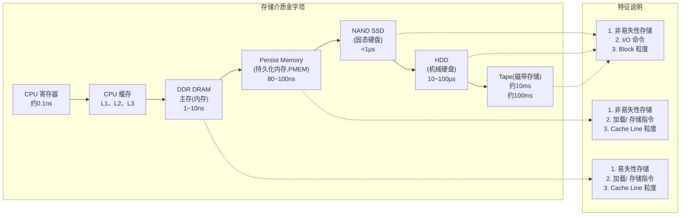

图3-1 主流存储介质在存储容量、性能维度方面的比较

> [!INFO] 图注
> - 纵轴：延时（自底向上递减）、成本（元/GB，自底向上递增）、容量（自底向上递减）
> - 特性标签：非易失性存储与易失性存储的区别，以及访问方式（I/O 命令 vs 加载/存储指令，Block 粒度 vs Cache Line 粒度）

## 3.1 内存

现在操作系统已经对内存的封装和管理达到了非常不错的效果。对工程师而言，在不太深入了解内存工作原理的情况下，也可以编写出符合逻辑且正常运行的程序。然而，掌握了内存的工作原理可以在编程开发时写出更优秀、更高性能的软件，也能有明确的性能优化方向。本节内容主要围绕内存是如何工作这个话题展开，主要内容包括内存的基本内容、内存管理机制和虚拟内存管理机制三部分。

### 3.1.1 内存的基本内容

本小节首先介绍内存的概念，包括内存是什么、内存的内部构成等内容。其次，介绍内存在计算机中所处的位置，它是如何和CPU 一起配合工作的。最后，通过两个示例介绍如何访问内存。

#### 1. 内存的概念

日常在提及内存时，通常将内存、RAM、易失性存储等这几个概念混用，其实它们之间还是有一些区别的。下面来介绍这几个概念之间的关系。

易失性存储经常和非易失性存储一起对比，这二者之间的主要区别在于，系统断电后数据能否永久保留。非易失性存储在断电后数据仍然能够保存，其代表有闪存存储（如NAND 闪存、固态硬盘等）、只读存储器（ROM）、大多数类型的磁性计算机存储设备（例如磁盘驱动器、软盘、磁带等）、光盘，以及早期的计算机存储介质（如纸胶带和打孔卡）。而易失性存储需要持续供电才能保留存储数据，断电后数据就会丢失。易失性存储通常也称为**RAM（Random-access Memory，随机访问存储器）**，它在任何时候都可以读/ 写，因此有时也把RAM 称为可变存储器。最常见的易失性存储就是各种RAM 存储器。

RAM 根据其内部存储构件的不同，可以进一步分为**SRAM（静态RAM）**和**DRAM（动态RAM）**两大类。SRAM 将每位存储在一个双稳态的存储器单元里，每个存储单元用一个六晶体管电路实现。基于存储器单元的双稳态特性，只要有电就可以永久保存它的值，即便有干扰，当干扰消失后电路可以恢复到稳定值。DRAM 则是采用电容来存储数据的，它将每位存储为对一个电容充电。通常DRAM 每个单元由一个电容和一个访问晶体管构成，并且由于采用电容构成，因此可以制造得非常密集。DRAM 对干扰非常敏感，当电容的电压被干扰后就很难恢复了。SRAM 和DRAM 二者的内部存储构件不同决定了它们的应用场景也不同。SRAM 单元和DRAM 单元相比，需要使用更多的晶体管来构建，同时其密集度更低、价格更贵、功耗更大。通常，SRAM 用作CPU 的高速缓存存储器；而DRAM 则用作计算机的主存，也就是常说的内存，因此内存等同于DRAM。

> [!SUMMARY] 核心概念
> 日常生活中经常提及的**内存**指的是**DRAM**，属于**易失性存储**。这也是内存断电后数据会丢失的原因。

#### 2. 内存在计算机中的位置

鉴于内存的上述特点，内存在计算机中主要充当数据暂存的角色，它往往是CPU 访问磁盘存储数据的一个中间介质。那CPU 和内存之间是如何交互的呢？图3-2 所示为CPU 和内存之间的总线连接结构。

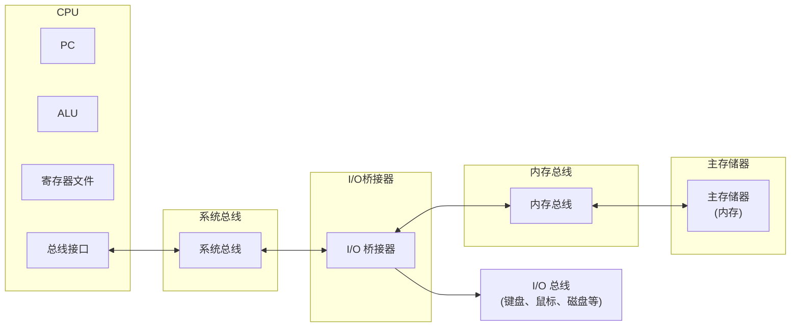

图3-2 CPU 和内存之间的总线连接结构

CPU 和内存并不是直接相连的，而是通过一个中间结构—**I/O 桥接器**进行连接的。CPU 和I/O 桥接器通过**系统总线**连接，内存和I/O 桥接器通过**内存总线（Memory Bus）**连接。I/O 桥接器可以将系统总线和内存总线上传输的数据进行翻译转换。注意：I/O 桥接器也将系统总线和内存总线连接到I/O 总线，连接例如键盘、鼠标、磁盘等这些I/O 设备，以共享I/O 总线。这里主要将关注点集中到内存总线上。

在CPU 和内存之间传输的数据流是通过这些总线的共享电子电路来回传递的。一般，CPU 和内存之间的数据传输往往是通过一系列步骤来完成的，这些步骤通常也称为**总线事务（Bus Transaction）**。其中，从主存传输数据到CPU 的过程称为**读事务（Read Transaction）**，而数据从CPU 传输到内存的过程称为**写事务（Write Transaction）**。

#### 3. 如何访问内存

下面从宏观的角度介绍CPU 访问内存的过程。为方便介绍内存的读/ 写过程，下面分别以CPU 读取内存数据和写入数据到内存为例进行说明。

##### （1）从内存读取数据

汇编指令 `movq A,%rax` 表达的含义是将地址 `A` 的内容加载到寄存器 `%rax` 中。读取数据的流程如下。

首先，CPU 将待读取数据的地址 `A` 发到系统总线上，地址信号会经过I/O 桥接器传递到内存总线上；内存感知到内存总线上的地址信号并读取到地址，然后从内存对应的地址中获取数据，并将获取到的数据写回到内存总线；接着，I/O 桥接器将内存总线信号翻译成系统总线信号，信号沿着系统总线传递；最后，CPU 感知到系统总线上的数据后从系统总线上读取数据，并将数据复制到目标寄存器 `%rax` 中。

这里是以寄存器为例，在实际过程中，目标地址既可能是寄存器，也可能是应用程序对应的缓冲区，比如网络编程中的Socket 的输入缓冲区等。读取内存数据的全过程如图3-3 所示。

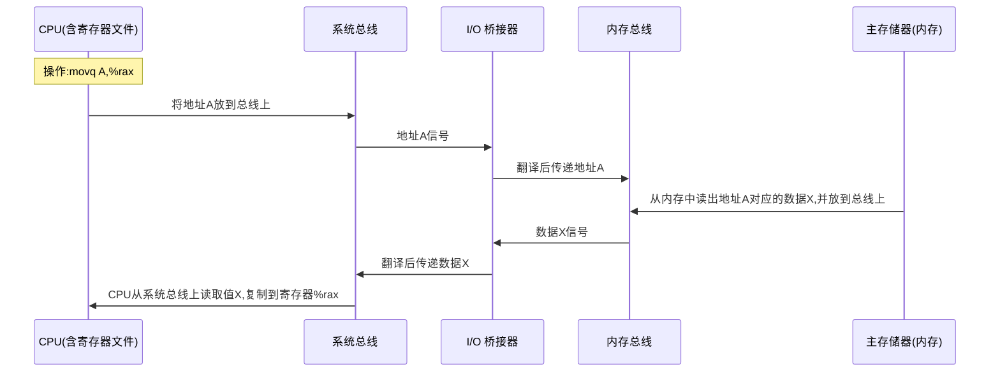

图3-3 movq A,%rax 从内存加载数据的过程

##### （2）写数据到内存

写数据到内存的过程和上述读取内存数据的过程恰恰相反，下面仍以寄存器为例。`movq %rax,A` 这条汇编指令表达的含义是将寄存器 `%rax` 中的数据写到内存中地址 `A` 中。整个写入数据的流程如下。

首先，CPU 会将待写入数据的内存地址 `A` 发往系统总线上，该地址信号被I/O 桥接器翻译后传递到内存总线上，内存读取到地址信息后等待数据到达；接下来，CPU 将待写入的数据 `y` 从寄存器复制到系统总线上，数据 `y` 经过I/O 桥接器传递到内存总线上，内存感知到数据到来了后从内存总线上读取数据 `y` 并将其存放到前面读取的内存地址 `A` 中。经过上述环节，一次写入内存的操作就完成了。在实际场景中，这里的寄存器也可能是应用程序对应的输出缓存区。数据写入内存的全过程如图3-4 所示。

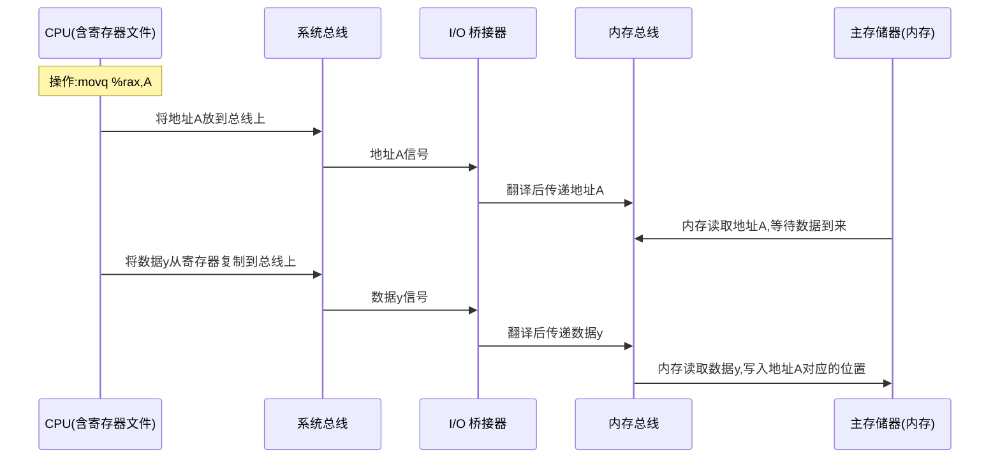

图3-4 movq %rax,A 数据写入内存的过程

> [!WARNING] 注意
> 上述两个例子为了方便读者直观理解访问内存的过程，中间省去了CPU 高速缓存这个环节，在实际访问过程中数据会优先从高速缓存中查找，如果数据在高速缓存中查不到后，才会对内存进行访问。

上述两个示例直观地展示了访问内存这一过程，其实，在实际中针对内存的访问还存在诸多细节。操作系统为了更好地使用内存，通常会对内存进行合理的协调分配，即对内存进行管理。内存的管理分为两部分：一部分是对物理内存的管理；另一部分是对虚拟内存的管理。后边两小节将分别介绍操作系统如何管理物理内存和虚拟内存。

### 3.1.2 内存管理机制

本小节介绍操作系统对物理内存的管理机制。一个用户程序被装入内存时，操作系统需要给该程序分配一定大小的内存空间。根据对进程分配的内存是否连续，可以将内存分配方式分为**连续内存分配**和**离散内存分配**两大类。

#### 1. 连续内存分配

连续内存分配，顾名思义，内存分配给每个进程的内存空间是连续的。举个例子，如果一个进程需要1GB 的内存空间，则在连续内存分配的方式下，操作系统会给该进程分配一块连续的1GB 的空间。采用连续内存分配方式的话，程序的代码或者数据的逻辑地址是相邻的，并且内存空间的物理地址也是相邻的。根据分配方式的不同，连续内存分配可以分为三类：**单一连续分配**、**固定分区分配**、**动态分区分配**。

##### （1）单一连续分配

单一连续分配主要在单道程序环境下使用。通常内存空间会分为**系统区**和**用户区**两部分。系统区一般在低地址部分，供操作系统使用。而用户区则是除去系统区的剩余内存空间。用户区中仅装有一道程序在运行，整个用户空间被该进程独占，所以这种分配方式被称为单一连续分配。这种分配方式最大的优点是简单，同时无内存碎片。其缺点也很明显，就是只能运行单道程序，多个进程无法共享内存空间，内存利用率低。

##### （2）固定分区分配

为了能运行多道程序就产生了固定分区分配方式。固定分区分配方式也很简单，就是把内存空间划分成固定大小的区，每个进程装入进来时，分配到不同的内存分区。根据划分内存分区的策略不同，固定分区分配分为**分区大小相等**、**分区大小不等**两种。分区大小相等意味着内存按照指定大小划分。这种方式适合于用一台计算机控制多个相同对象的场合，而该方式最大的问题就在于缺乏灵活性。当运行的程序太小时，空间浪费严重；当运行的程序太大时，一个分区又不能完全装下，导致无法运行。针对其缺点就出现了按照分区大小不等的方式来划分内存。这种做法通常是将内存划分成若干不同大小的区。为了维护每个分区的信息，方便分配空间，往往会建立一张**分区表**。分区表中记录了每个分区的起始地址、大小、是否已分配等状态信息。在分配内存时首先在该表中检索可用的分区，如果找到了可用分区则分配给进程，如果没有找到合适的分区，则拒绝给进程分配空间。

虽然固定分区分配方式支持多道程序的运行，但它存在两个问题：第一，当一个程序太大时，无法放到分区中运行；第二，进程所需的空间小于固定分区大小时，也占用一个完整的分区，导致分区内部存在一些剩余空间，造成**内部内存碎片**，内存利用率低。由于固定分区分配存在这些问题，从而产生了动态分区分配方式。

##### （3）动态分区分配

动态分区分配最核心的原则是**按需分配**，即一个程序需要多少内存空间，操作系统就给它分配指定大小的内存空间。这样就解决了固定分区分配中内部内存碎片的问题。动态分区分配方式在一开始工作得很好，但是随着时间的推移，也会产生很多内存碎片。这种内存碎片和固定分区产生的内部内存碎片恰恰相反，因此被称为**外部内存碎片**。可以通过**紧凑压缩**的方法来消除外部内存碎片。但紧凑压缩内存碎片需要CPU 来完成，还需要重定位寄存器的配合，压缩过程相对耗时。

为了实现动态分区分配，操作系统内部要维护一个**空闲分区链表**。当分配空间时遍历该链表。根据分配策略的不同，分配算法主要有以下四种。

- **首次适应（First Fit）算法**：该算法要求空闲分区链表维护的分区是地址递增有序的。在分配时顺序遍历链表找到第一个满足要求的内存分区，然后将其分配给进程。
- **邻近适应（Next Fit）算法**：该算法又称为循环首次适应算法。它由首次适应算法改进而来，它单独维护了一个变量，用于记录上次分配空间遍历到的位置，在下次分配时从该变量记录的上次分配结束的位置开始继续往后遍历分配。
- **最佳适应（Best Fit）算法**：该算法的核心出发点是“按需分配”。空闲分区链表中的元素按照容量递增排列，分配时找到第一个满足条件的可用空闲分区，即可完成分配。这种算法和首次适应算法的区别在于，首次适应算法是空闲分区按照地址递增排列，而最佳适应算法是按照空闲分区的容量递增排列。最佳适应算法和固定分区分配类似，同样存在内部内存碎片的问题。
- **最坏适应（Worst Fit）算法**：该算法和最佳适应算法相反，它要求空闲分区链表按照容量递减排列，在分配时找到第一个满足条件的分区，该分区是可用空间中容量最大的分区，然后从中切割一部分内存空间分配给进程。因此将其称为最坏适应算法。

> [!INFO] 补充说明
> 上述分配算法有一个共同点，它们都是基于空闲分链表进行顺序遍历而得名的算法。除了上述顺序遍历的分配算法外，还有一些基于索引搜索的动态分区分配算法，比如快速适应算法、伙伴系统、Hash 算法等。限于篇幅，不再对这些算法进行展开介绍，感兴趣的读者可以自行查阅相关资料。

对连续内存分配的三种管理方式进行总结，见表3-1。

| 维度 | 单一连续分配 | 固定分区分配 | 动态分区分配 |
|------|--------------|--------------|--------------|
| 运行作业道数 | 单道程序 | 多道程序 | 多道程序 |
| 内存碎片 | 无 | 产生内部内存碎片 | 产生外部内存碎片 |
| 硬件 | 界地址寄存器、越界检查机构 | 上下界地址寄存器、越界检查机构 | 基地址寄存器、长度寄存器、地址转换机构 |
| 解决碎片办法 | — | — | 紧凑压缩 |
| 可用区管理 | — | 链表 | 数组或链表 |

表3-1 三种连续内存分配方式的对比

#### 2. 离散内存分配

连续内存分配三种方式的最大特点是，一个进程的所有数据都是连续存放在分配的内存空间中的。然而随着系统长时间的运行，这会导致内存分配过程中产生的碎片越来越多。虽然碎片可以通过“紧凑压缩”的方式让操作系统进行整理，但是这个过程极其费时，带来的开销也比较大。那么换个角度思考，如果不强迫将一个进程的所有数据都连续存放在一起，可不可行呢？换言之，是否可以将一个进程的数据分散存放在内存的多个空间中呢？答案是可以的。基于此就产生了**离散内存分配**方式，又称为**非连续内存分配**。在离散内存分配方式中根据其分配内存空间单位的不同，又可以划分为以下三类。

- **分页内存管理**：在分页内存管理方式下，系统将用户程序划分成若干个固定大小的块，块也称为**页**。同时物理内存也被划分为相同大小的物理块，一般称其为**页框（Frame）**。通过划分后可以将用户程序的任何一页放入到页框中，做到离散存储。

- **分段内存管理**：分段内存管理方式是站在软件开发人员角度考虑的，为满足用户需求而提出来的一种内存管理方式。该方式将应用程序划分为若干个大小不等的**段**，每个段包含有完整的信息，在内存分配空间时以段为单位。这些段在物理内存中存放时也是不要求连续的，因此也实现了离散存储。

- **段页结合内存管理**：顾名思义，该方式是将分段内存管理和分页内存管理结合起来，先将应用程序进行分段，每个段在分配内存时又是以页为单位分配的。该种方式同时具有分页内存管理和分段内存管理两者的优点。

> [!INFO] 段页结合是目前应用最为广泛的一种内存管理方式，而理解分页内存管理、分段内存管理是理解段页结合内存管理的基础。

下面来详细介绍上述三种离散内存分配管理方式。

##### （1）分页内存管理

下面从分页的基本概念（分页系统中逻辑地址构成、页表结构）、分页内存管理中逻辑地址如何转换成物理地址、地址转换过程中出现的问题（效率低、占空间）等几个方面展开介绍分页内存管理。这部分内容是按照循序渐进、环环相扣的方式展开的，读者在阅读时要重点关注前一部分和后一部分之间的核心矛盾，以便更加深入地理解这部分内容。

###### 1）分页的基本概念

分页内存管理中应用程序和内存都按照固定大小的区域块进行划分，划分的块不同的场景叫法各不相同，在进程维度称为**页**，而在物理内存中则称为**页框**，在外存（比如磁盘）中又称为**块**，但它们本质上都是一样的，都指的是固定大小的区域块。以页为单位划分后，在对进程进行分配空间时，会以页为单位进行分配。

分页的好处是给一个进程分配的内存空间可以不连续，但划分后进程的最后一页往往很难保证恰好是一页大小，因此导致在内存空间的使用上产生一些内部内存碎片。内存碎片与页大小的选择有关，选择合适的页大小会使内存碎片大大降低。分页内存管理产生内存碎片的原因和固定大小分区分配比较类似，而二者的区别主要在于分页内存管理中页的大小要比分区的大小小得多，所以产生的碎片相对进程而言是很小的。据统计，平均一个进程产生的内部碎片大概是半个页大小。

下面来看看分页后进程地址是如何组织的。以32 位寻址系统为例，图3-5 所示为分页内存管理中逻辑地址的结构。

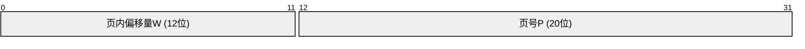

图3-5 分页内存管理中逻辑地址的结构

分页内存管理中逻辑地址由**页号P** 和**页内偏移量W** 两部分构成。页内偏移量由页大小来限定，给定页的大小即可确定页内偏移量的范围。整个地址空间共占32 位，页大小为4K（2^12）B 的情况下需要用12 位来存储，从低地址开始算起，需要用0～11 位来记录页内偏移量W，W 的取值范围为0～4K（0～2^12）B。剩余的12～31 位用来记录页号P 的信息，P 的取值范围为0～2^20。

按照页划分后，进程中相邻的区域可以分配到不相邻的物理块上。通过这样的方式来实现对一个进程离散地分配空间。但是如何知道进程中某一页存放到内存中哪个页上呢？在分页内存管理系统中是通过**页表**这个中间结构来保存映射关系的。每个进程有自己独立的页表，页表中的每一项称为**页表项**，页表项记录了该进程内部的某一页存放在物理内存中的哪一页上。页表维护的是进程中页号到物理页号的映射关系。进程、页表及物理空间之间的映射关系如图3-6 所示。

```mermaid
graph TB
    subgraph 应用程序(逻辑空间)
        direction LR
        LP0["0页"]
        LP1["1页"]
        LP2["2页"]
        LP3["3页"]
        LP4["4页"]
        LP5["5页"]
        LPdots["..."]
    end
    subgraph 页表
        direction LR
        PT0["0 -> 2"]
        PT1["1 -> 3"]
        PT2["2 -> 5"]
        PT3["3 -> 7"]
        PT4["4 -> 8"]
        PT5["5 -> 4"]
        PTdots["..."]
    end
    subgraph 物理内存(物理空间)
        direction LR
        PF0["0"]
        PF1["1"]
        PF2["2"]
        PF3["3"]
        PF4["4"]
        PF5["5"]
        PF6["6"]
        PF7["7"]
        PF8["8"]
        PFdots["..."]
    end

    LP0 --> PT0 --> PF2
    LP1 --> PT1 --> PF3
    LP2 --> PT2 --> PF5
    LP3 --> PT3 --> PF7
    LP4 --> PT4 --> PF8
    LP5 --> PT5 --> PF4
```

图3-6 分页内存管理中的页表映射

那么，页的大小选择多少合适呢？

首先可以定性分析一下如果页的大小取得比较大，则相应的进程和物理内存空间划分出来的页的个数就比较少，进而需要存储映射关系的页表中维护的页表项个数也就越少，页表占用的空间越少，但缺点是进程内的内存碎片就越大；而如果页的大小取得比较小，虽然进程内的内存碎片得到了减少，但带来的问题是同样大小的进程划分出来的页个数增加了，这间接导致了页表中页表项的数目增多，页表所占空间增大。由此来看，页大小的选择其实是一个折中的选择。通常为方便处理，页的大小一般会取1～8KB 范围中2 的n 次幂。

###### 2）逻辑地址和物理地址转换

在程序访问数据的时候，传递的是**逻辑地址**，而实际上数据是存储在内存空间的**物理地址**上。因此，需要对逻辑地址和物理地址进行转换。由于程序中每一页都是和物理内存上的页一一对应的，因此页内的偏移量是相同的，无须再进行转换。所以逻辑地址到物理地址的转换只需要将逻辑地址中的页号转换为物理地址中的页号即可。而根据前面介绍的内容可知，二者的映射关系是维护在页表中的，故逻辑地址到物理地址的转换需要借助页表来完成。

在进程运行期间，每次数据的访问都需要进行地址的转换，执行频率非常高，所以需要通过**硬件**来实现。理论上，页表是由一组寄存器组成的，其中每个页表项对应一个寄存器。可以通过访问速度较高的寄存器来提升地址转换的速度。然而，现在计算机的页表通常很大，维护的页表项很多，总数可以达到几万甚至几十万个，同时寄存器的成本较高，在这样的现状下，每个页表项对应一个寄存器几乎是无法实现的。目前，普遍的做法是将页表存放到内存中，然后专门设置一对**页表寄存器（Page Table Register，PTR）**用来存放页表的起始地址F 和页表长度M。在程序未运行时页表的起始地址和页表长度记录在进程的PCB（Process Control Block，进程控制块）中，只有当该进程开始运行后才会将二者加载到页表寄存器中。

为了方便介绍逻辑地址到物理地址的转换过程，先做一些设定：假设程序中页大小为L，某次数据访问的逻辑地址为A，其中页号为P、页内偏移量为W，页表寄存器中存放的页表起始地址为F、页表长度为M，页表项长度为N，页号P 在页表中对应的物理页号为b，转换后的物理地址为E。图3-7 展示了逻辑地址转换为物理地址的过程。

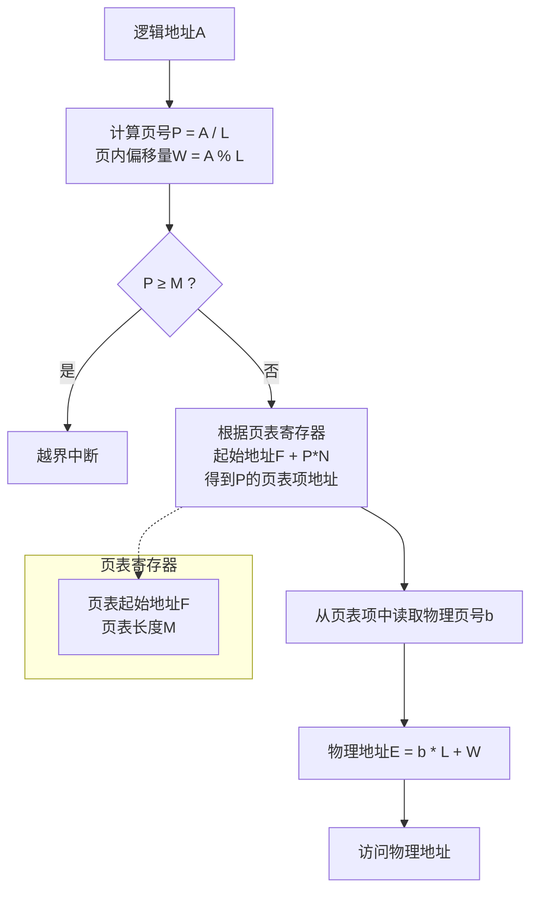

图3-7 分页内存管理地址转换过程

第1 步：根据页大小L 和逻辑地址A，计算出页号P = A/L，页内偏移量W = A%L。

第2 步：将页号P 跟页表寄存器中的页表长度M 进行比较，做安全性校验，如果P ≥ M 则意味着非法访问，数据产生了越界，系统会产生越界中断。

第3 步：在P < M 的情况下，接下来根据页表寄存器中的页表起始地址F、当前页号P 和页表项长度N 计算P 对应的页表项地址，即P 的页表项地址= F + P*N。根据计算出的P 的页表项地址可以进一步得到页号P 对应的物理页号b。

第4 步：由于进程的页大小和物理内存页大小相等都是L，所以可以得出逻辑地址A 对应的物理地址E = b*L + W。

至此，就完成了一次逻辑地址到物理地址的转换。由于页表内容是存放在内存中的，因此一次数据访问需要访问两次内存：第一次是根据逻辑地址中的页号查找内存中的页表得到物理页号；第二次是根据拼接好的物理地址查询内存获取到对应的数据。这也就意味着在这种方式下CPU 的处理效率下降了一半。为了解决这个问题产生了一种加速地址转换方案—引入快表。

###### 3）快表加速地址转换

为了解决普通地址转换过程中两次访问内存的问题，提升地址转换的效率，很多系统在地址转换中引入了一个新的组件—**快表**。快表是一种具有并行查找能力的高速缓冲寄存器，部分系统也将快表称为**相联寄存器（Associative Memory）**。快表缓存了频繁访问的若干页表项，因此可通过它来加速地址转换。引入快表后的地址转换过程如图3-8 所示。还是以前面逻辑地址A 到物理地址E 转换的过程来说明引入快表后地址转换的过程。

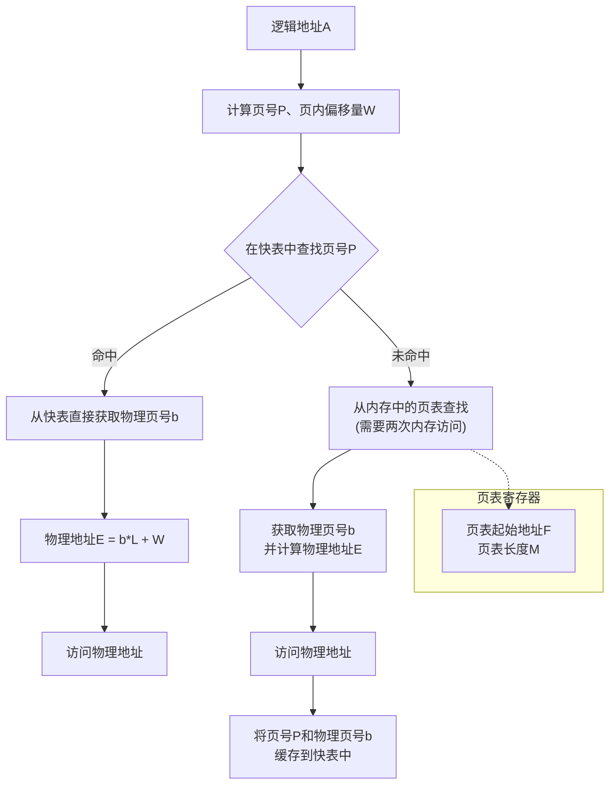

图3-8 分页内存管理结合快表的地址转换过程
注：①表示命中快表的地址转换过程；②表示未命中快表的转换过程。

第1 步：由CPU 给出用户程序的逻辑地址后，解析出来对应的页号P 和页内偏移量W，然后将页号P 送入到快表中进行查找，看页号P 对应的页表项是否有缓存。

第2 步：如果表中有缓存页号P 对应的页表项，则直接获取到该页表项，然后根据物理页号b 和页内偏移量W 计算得到实际的物理地址，这样访问数据只需要一次访问内存即可。

第3 步：如果在快表中没有找到页号P 对应的页表项，那么就需要按照之前的逻辑在内存中的页表中查找页号P 对应的页表项，找到后再和页内偏移量W 计算得到物理地址再访问数据。同时，将页号P 的页表项缓存一份到快表中（在加入时还需要考虑是否有足够的空间，如果在快表空间不够的情况下，还需要考虑淘汰其中的一项缓存项释放空间，以便缓存新的待缓存的页表项），以便下次进行相同地址转换时能在快表中直接找到。可以看到，在没有在快表中直接找到时，还是按之前介绍的普通地址转换的逻辑执行的。

> [!WARNING] 注意
> 上述过程有两点需要注意：
> - 在部分系统中是快表和页表同时并行查找的，当在快表中找到后则中止页表的查找。
> - 本质上快表其实是内存页表的一份数据缓存，通过缓存的手段来加速地址转换过程。由于快表是通过硬件制作的，考虑到成本通常不会制作得很大。对于中小型程序而言，一般足够将所需的页表项全部缓存到快表中；而对于大型应用程序而言却无法做到。但由于程序的访问通常遵循**局部性原理**，因此据统计，一般的快表命中率可以达到90% 以上，这样通过分页进行内存管理带来的速度上的损失基本上可以降低到10% 以下，绝大部分系统可以接受这种方案。

快表的引入直接提升了分页内存管理系统地址转换的性能。目前，很多系统都支持非常大的逻辑地址空间（2^32～2^64）。以32 位寻址系统为例，假设页面大小为4K（2^12）B，则每个进程的页表项最多可达1M（1M=2^32/4K=2^32/2^12=2^20），即大约100 万个，每个页表项占4B，这就意味着对于运行中的每个进程需要分配4MB 连续的内存空间用来存放页表。毫无疑问，这是很难做到的。针对这个问题解决方案有两个。

# 3. 数据存储介质

## 分页内存管理（续）

❑ 对于所需要的页表空间，采用离散的方式分配空间，以解决无法分配连续空间的问题。

❑ 只将当前进程运行所需要的部分页表项调入内存空间，其他页表项需要的时候再按需调入。

离散分配页表空间的实现意味着需要对一个大的页表进行分页，分成多个小的页表，然后通过一个索引表来维护映射关系。依据这种思路就产生了二级页表和多级页表。而按需调入页表项涉及了虚拟内存的实现，在下一小节介绍。下面来介绍二级页表和多级页表的相关内容。

### 4）二级页表和多级页表

在无法找到连续的内存空间用来存放页表时，可以采用对页表也按照页的大小进行拆分，将一段连续的页表内存空间拆分成多个页面。拆分后的页表页面从0开始编号。拆分完成后，每个页表页面可以在物理内存空间找到空闲的页进行关联。在这个过程中，同样需要通过一个外层页表记录映射关系。该页表记录的是某个页表页面存放在内存空间的物理页号。

下面仍然以前文介绍的32位寻址空间、4KB页大小的例子来说明。在只有一级页表的情况下，页内偏移量占12位，剩余20位存放页号，页号最大上限为1MB。而如果采用二级页表，每页包含2^10（1024）个页表项的话，则1M的页表项可以分为2^10（1024）页。这样拆分后的逻辑地址结构如图3-9所示。一级页号占10位，二级页号也占10位，页内偏移占12位。

图3-9 二级页表逻辑地址结构

> **说明**：图3-9显示了32位逻辑地址的划分：高10位为一级页号（P1），中间10位为二级页号（P2），低12位为页内偏移量（W）。

根据上面的分析，二级页表其实是在一级页表的基础上多增加了一层外围页表。二级页表的结构如图3-10所示。

图3-10 二级页表的结构

> **说明**：图3-10展示了二级页表的映射关系：一级页表（外层页表）的每个表项指向一个二级页表页面（如0号页表、1号页表、…、n号页表），二级页表的每个表项指向物理内存空间中的物理页框。图中示例：一级页表项[0]指向二级页表0号页表，该页表的第2项指向物理页框234等。

#### 二级页表地址转换的过程如下

- **第1步**：首先根据CPU给出的逻辑地址计算出一级页号、二级页号和页内偏移量。然后，根据一级页号在一级页表中查找页表项，该页表项记录了二级页表页面的起始地址。
- **第2步**：得到二级页表页面的起始地址后，就可以在二级页表中根据二级页号查找对应的物理内存的页号。
- **第3步**：找到物理页号后和页内偏移量进行拼接，从而形成物理地址，然后访问数据。

值得注意的是，上述分页方式的二级页表只解决了离散存放页表的问题，即仍然是全部页表都存放到内存中的情况。可以想到，如果内存中离散的内存空间仍然不能够存放下某个进程的页表，那该进程还是无法加载到内存中运行。也就意味着，这种方式并未解决用较少内存存放页表的问题。解决该问题的方案是按需存放程序运行的页表，而不需要把全部页表都加载到内存，这部分内容在后面虚拟内存的实现时再进行讨论。

二级页表针对32位的系统已经足够，但是对于64位的系统而言却无法很好地解决。下面来分析，64位系统中，页的大小仍然为4K（2^12）B，则页内偏移占据12位，剩下的52位中，按照二级页表分页的话，二级页表的页号占据10位，一级页表还有42位来存放。42位的一级页号可以存储4096G（2^42）个页表项，每个页表项占4B的情况下则需要16384GB空间存储。这显然是不可行的。因此，很多系统则采取对一级页表再进行分页的方案继续拆分，即按照多级页表进行管理内存。

此外，当系统的寻址空间很大时，分页内存管理中需要给每个进程分配至少一个页表，统计下来进程数比较多的情况下页表占用的内存空间还是比较大的。因此，部分系统采用倒置页表或者反置页表的方案来进行优化。反置页表是全局的一个页表，它给每个物理页分配一个页表项，页表项中的内容记录了逻辑页号和所属进程的标识符。不过，在这种方案中反置页表只维护了已经存在的页表项信息，对于不存在的页则还需要通过给每个进程维护一个单独的页表，该页表记录了每个页在物理外存中的位置，当在反置页表中找不到该页时需要读取该页表加载对应的页。关于反置页表的内容限于篇幅就不展开介绍了，感兴趣的读者请自行查阅相关资料。

## 分段内存管理

分段内存管理是离散内存分配的另一种方式，它和分页内存管理不同的是，分页内存管理是以计算机的视角出发考虑的，而分段内存管理更多的是为了方便编程和使用而设计的。下面将从分段的基本概念（分段逻辑地址构成、段表结构）、分段地址转换这两个方面介绍分段内存管理的主要内容。

### 1）分段的基本概念

分段内存管理中显式地将用户程序地址空间划分为若干个大小不等的段，每个段包含一组逻辑信息，比如主程序段、数据段、堆段、栈段等。在分配内存空间时是以段为单位进行分配的。每段起始地址都以0开始。同样以32位寻址系统为例，分段的逻辑地址结构如图3-11所示。其中，高16位存放段号S，低16位存放段内偏移量W。由此可知段号的范围是0～65536（2^16），段内偏移量的范围也是0～65536（2^16）。

图3-11 分段内存管理的逻辑地址结构

> **说明**：图3-11展示了32位分段逻辑地址的划分：高16位为段号S，低16位为段内偏移量W。

进程申请空间时会以段为单位，段内连续段间非连续，这也是离散内存分配的一种体现。和分页内存管理一样，分段内存管理同样需要一个维护进程段空间和物理内存空间映射关系的结构，该结构称为段表。段表中每一项记录的是当前段（段号标识）存放在内存中的哪一段空间上。由于段的长度是不固定的，因此段表项中记录段空间映射关系时通过起始地址和该段的长度两部分来描述。段表项的结构如图3-12所示。

图3-12 段表项的结构

> **说明**：图3-12中段表项包含三个字段：段号、该段在内存中的起始地址、段长。

有了段表以后，在数据访问的过程中就可以将逻辑地址通过段表中的映射关系进行转换。分段内存管理的进程空间、段表、内存空间之间的映射关系如图3-13所示。

图3-13 分段内存管理的段表映射

> **说明**：图3-13显示了一个示例：进程空间有4个段（主程序段=0，数据段=1，堆段=2，子程序段=3）。段表中的每一项记录段起始地址和段长（如段0起始地址10KB，段长30KB；段1起始地址40KB，段长15KB；段2起始地址70KB，段长25KB；段3起始地址95KB，段长10KB）。这些段被映射到物理内存空间中不同位置（如段0在物理内存10KB~40KB，段1在40KB~55KB等）。

### 2）分段逻辑地址到物理地址的转换

进程的段表和页表一样，为了加速地址转换的过程，理论上可以通过寄存器实现。但实际上，考虑到成本的原因往往还是将段表存放到内存中。系统中通常采用一个段表寄存器来存放段表的起始地址F和段表长度M。在了解了分段内存管理的基本原理后，下面来介绍分段内存管理中逻辑地址到物理地址的转换过程。先来做一些假设，假设程序某次访问的逻辑地址为A，其中段号为S、段内偏移量为W，转换后的物理地址为E。分段逻辑地址A到物理地址E的转换过程如图3-14所示。

图3-14 分段内存管理的地址转换过程

> **说明**：图3-14展示了地址转换的流程：段表寄存器提供段表起始地址F和段表长度M。逻辑地址A中的段号S与M比较，若S≥M则产生越界中断；否则从段表中查找到对应段表项，得到段起始地址d和段长C；再比较段内偏移量W与C，若W≥C则产生越界中断；否则物理地址E = d + W。

分段逻辑地址到物理地址的转换过程如下：

- **第1步**：CPU给出一个逻辑地址A，根据逻辑地址构成从逻辑地址中解析出段号S和段内偏移量W。
- **第2步**：将段号S和段表寄存器中的段表长度M进行比较，判断段号S是否有效。如果S≥M则说明段号越界，系统会产生一个越界中断。
- **第3步**：当S < M时，将段号S送入段表中查找是否有对应的段表项。如图3-14所示，段号S在段表中找到对应的段表项，段的起始地址为d、段长为C。
- **第4步**：检索到段表项后，接着对段内偏移量进行合法性校验。如果段内偏移量W≥C，说明段内偏移量越界，系统会产生一个越界中断。
- **第5步**：W < C表明合法，将段起始地址d和段内偏移量W拼接在一起即可得到物理地址，即E = d + W。然后就可以用得到的物理地址访问内存中的数据了。

至此，分段内存管理中的逻辑地址到物理地址的转换完成。上述过程和分页内存管理一样，也面临着访问内存次数的增加进而影响CPU处理效率的问题。解决方案也是类似的，通过增加一个TLB快表结构来缓存频繁访问的段表项，以此加速地址转换效率。值得注意的是，由于段表中段表项的个数要远远小于分页内存管理中页表项的个数，所以分段内存管理需要的TLB也相对较小。在引入TLB后可以显著减少数据存取的时间。

## 段页结合内存管理

根据前面介绍的内容可知，分页内存管理方式中以页为单位进行内存分配，可以尽可能地提升内存空间的利用率，而分段内存管理方式则以段为单位进行内存分配，它可以方便数据共享，满足用户多方面的需要，二者各有优势。将二者结合起来就形成了段页结合的内存管理方式。

在段页结合的内存管理方式中，用户程序地址空间仍然是先按照逻辑段进行划分，每个段有自己的编号，每段在分配内存时以页为单位进行分配，每个段有自己对应的页表。分段信息通过段表来描述，段表项中记录当前段号、页表长度，以及该分段对应的页表的起始地址。页表中仍然维护的是逻辑地址中段内页号到物理内存中页号的映射关系。

### 离散内存分配管理的三种方式对比

表3-2 离散内存分配管理的三种方式对比

| 维度 | 分页内存管理 | 分段内存管理 | 段页结合内存管理 |
|------|--------------|--------------|------------------|
| 内存分配单位 | 大小固定的页 | 大小不固定的段 | 大小不固定的段 + 大小固定的页 |
| 优点 | 提升内存的利用率 | 更容易实现信息共享、动态增长 | 结合了分页内存管理和分段内存管理的优点 |
| 地址空间维度 | 一维空间，只需要一个页号就可以表示一个页的地址，采用页表维护信息 | 二维空间，表示一个段的地址时需要段号和段内偏移量，采用段表维护信息 | 一维空间 + 二维空间，采用段表 + 页表两种结构维护信息 |
| 出发点 | 为计算机方便管理内存设计的，对用户透明不可见 | 为满足用户的多方面需要设计，对用户可见 | 结合二者的特点 |

## 3.1.3 虚拟内存管理机制

虚拟内存是操作系统中对内存管理引入的一项非常重要的技术，它是操作系统提升对内存管理的核心。

### 1. 虚拟内存概述

在介绍虚拟内存之前，先来讲一讲为什么操作系统要引入虚拟内存这个概念。前面介绍操作系统对内存的管理方式时，实际上做了一个假设，即假设操作系统给进程分配内存时给该进程全部所需的空间，将进程所有的数据都加载到内存中然后进程才开始运行。这样的方式就面临两个难题。

第一个难题是如果一个进程所需要的空间很大，剩余空闲的内存空间无法满足，那么该进程是无法装载到内存中运行的。这个问题再极端点就是如果一个进程本身需要的内存空间就超过了当前计算机的物理内存空间，则该进程将永远无法在该计算机上运行。

第二个难题是一台计算机上有很多进程需要运行，而操作系统的内存空间无法容纳所有进程，此时就只能让一部分进程运行，另外一部分程序等待，直到有其他进程退出释放空间后再将等待的进程加载到系统中让其运行。

这两个难题其实本质上就是计算机的内存容量不够大，如果一台计算机的物理内存空间足够大，则上述问题将不复存在。针对这种状况的解决方法也很简单，就是对计算机的内存容量进行扩容。然而实际上，很多情况下出于成本和机器本身的限制，这种方案无法很好地适用于任何场景。于是计算机的设计人员开始朝着其他解决这个问题的方向探索，一种新的具有普适性的解决方案出现了，它就是本节要介绍的虚拟内存。

虚拟内存出现的最根本原因是为了解决计算机内存容量不够大的问题。在计算机的世界中有一个很普遍的原理，一个进程在运行过程中，往往符合局部性原理。虚拟内存思想的产生也得益于该原理。局部性原理主要体现在时间和空间两个维度。

- **时间局部性**：时间局部性是指，对于指令而言，如果某条指令被执行，在执行后不久仍然有可能再次被执行；对于数据而言，如果某条数据被访问过，则在不久的将来该条数据极有可能被再次访问。时间局部性产生的主要原因是程序中普遍存在着循环结构。
- **空间局部性**：空间局部性是指，某条指令执行完后，它附近的指令也会有很大概率被执行；对于数据而言同样如此，一条数据被访问过后，它邻近的数据也很有可能在一定的范围内被访问。空间局部性主要的根源在于程序是按照顺序执行的。

基于局部性原理可知，一个进程在执行时可以只将其当前执行需要的指令和数据加载到内存中，而无须将该进程所有的数据都加载到内存。这样，一个进程在运行时就可以分配当前它需要的很少的一部分内存空间让其先运行起来，而不需要分配它所需的全部空间。这种方式乍一看好像很有道理，但仔细一想会发现一个很明显的问题：如果一个进程在运行期间发现需要执行的指令或数据并未加载到内存中，又该如何处理呢？

当一个程序在执行过程中发现它所需要的数据不存在，此时就需要告知操作系统将缺失的数据加载到内存中，从告知操作系统到加载数据到内存中这段时间该进程需要短暂等待。操作系统将这个过程交由专门的中断进行处理。数据加载的过程一般称为数据的迁入或者换入。

假如操作系统在加载数据到内存的过程中，出现了没有剩余空闲空间可用的情况，又该如何处理呢？一种简单的处理办法是通知进程加载数据失败，此时该进程会一直处于等待状态而无法运行。这种方式很直观却不是人们能接受的。理由有二：其一，这种方式从进程层面来看它会导致部分进程一直挂起等待，造成用户体验的不友好，同时让系统的多道程序执行的吞吐量降低；其二，这种方式随着系统的长时间运行会是一个无法避免的问题。为了让系统更好地提供服务，这种处理方式不可行。那么，另外一种解决方案则是当加载数据到内存失败时，可以选择淘汰一部分暂时无用的数据，让其占用的空间空闲出来，存放当前要加载的数据。这种方式中数据淘汰的过程一般称为数据迁出或者换出。这就涉及用什么样的策略来选择要换出的数据。这种策略一般称为置换策略或者置换算法。

至此，关于虚拟内存的基本原理已经介绍完了。虚拟内存主要是基于局部性原理，将一个进程原先运行时需要分配全部内存空间才能启动运行的过程，转变为分配当前所需的部分内存空间，将当前所需的数据先加载进来，然后就让进程运行起来。后面运行过程中遇到未加载的数据再按需载入。

> [!NOTE] **虚拟内存的定义**
> 所谓的虚拟内存其实是指具备数据换入和置换功能，能从逻辑上扩充内存容量的存储器管理系统。

当通过虚拟内存扩充了内存容量后，用户进程就可以运行在内存空间远远小于它的计算机系统上了。当用户程序正常运行时，给用户的感觉是系统的内存容量比实际内存容量大，而用户看到的这种大容量其实是假象，是虚拟的，所以这也是虚拟内存名称的由来。

### 虚拟内存的特点

虚拟内存和前一小节介绍的传统内存管理相比有以下两个特点。

- **多次载入**：传统内存管理中，不管是连续内存分配还是离散内存分配都是一次性将数据载入内存中。而虚拟内存管理则是允许一个进程的指令和数据可以分多次按需载入。
- **数据置换**：在传统内存管理中，一个进程的数据加载到内存中后，除非该进程退出了，否则它的数据会长期驻留在内存中一直占用内存空间。而虚拟内存则引入了数据置换功能，即一个进程中暂时无用或者等待进程的数据可以换出，以便腾出空间供其他运行的程序载入数据，或者将空间分配给其他需要运行的进程。当数据被换出的进程在运行期间需要这部分数据时再按照数据换入流程正常加载即可。

### 虚拟内存的实现方式

根据虚拟内存原理可知，虚拟内存能实现的前提是必须能对内存进行离散分配。一般来说，虚拟内存的实现主要有三种方式：请求分页内存管理、请求分段内存管理、请求段页式内存管理。

同时在此基础上，再将以下几个问题解决后，虚拟内存就得以实现了。

- 如何处理数据换入。
- 通过何种置换算法腾出空闲空间。
- 如何处理数据换出。

## 2. 请求分页内存管理

请求分页内存管理是在分页内存管理的基础上演变而来的，它在分页内存管理的基础上增加了页面换入、页面置换、页面换出的功能，从而形成了虚拟分页存储系统。请求分页内存管理允许一个进程将当前运行所需的一部分页面载入内存中，然后启动运行。在后续运行过程中遇到页面缺失时，可以通过页面换入功能换入所需的页面，并通过一定的置换算法将部分暂时无用的页面选出来并换出到外存中，置换是以页为单位的。

> [!NOTE] **注意**
> 页面换入和页面置换需要请求分页的页表机制、缺页中断机制、地址转换机制等软/硬件的同时支持。

### （1）页表结构

请求分页内存管理中的页表的主要功能也是记录逻辑页号到物理页号之间的映射关系的。和前一小节介绍的分页内存管理的页表不同的是，它在原先页表项的基础上新增了几个字段。其页表项结构如图3-15所示。

图3-15 请求分页内存管理的页表项结构

> **说明**：图3-15展示了请求分页内存管理的页表项结构，包含以下字段：页号、物理页号、状态位（存在位）、访问字段、修改位、外存地址。

各个字段的含义如下：

- **页号**：指逻辑地址中的页编号。
- **物理页号**：指逻辑地址中的页号在物理内存空间中的物理页编号。
- **状态位**：该字段用来表示当前页号对应的内容是否已经在内存空间中存在。值为1表示存在，值为0表示不存在，在地址转换时需要请求换入对应的页面到内存。
- **访问字段**：该字段用来记录访问次数等信息。当页面被访问时需要更新该字段。该字段用来在页面置换时供置换算法使用。
- **修改位**：该字段用来表示该页面在内存中是否被修改过。如果页面被修改过，则换出时需要将其写回外存以保持一致性；若未被修改，则换出时可以直接丢弃，减少磁盘I/O开销。
- **外存地址**：该字段记录页面在外存（如磁盘）中的存放位置，当页面不在内存中时，可以根据该地址从外存中换入页面。

# 3. 数据存储介质

## 3.1 内存（续）

### 请求分页内存管理（续）

#### 请求分页内存管理的页表项结构（续）

- **修改位**：该字段标识该页面是否被修改，当页面发生写操作时需要更新。该字段主要用来在页面换出时使用。如果该页面没有被修改，则页面换出时可以直接换出；否则，需要将当前页面回写到外存才可以换出。
- **外存地址**：该字段用来记录当前逻辑页号对应的内容存放在外存空间中的地址，在页面换入时需要根据该字段读取外存数据到内存空间。

从上述几个字段的含义可以看出，新增的几个字段都是为了方便实现页面换入/换出功能而添加的。页表本身的功能没有发生改变，仍然是用作逻辑地址到物理地址的转换。下面来介绍请求分页内存管理中地址是如何转换的。

#### 地址转换过程

请求分页内存管理的地址转换过程同样是从基本的内存分页管理的地址转换过程中改进而来的。在最初的内存分页管理中由于给一个进程分配了其所需要的全部内存空间，所以它运行时全部数据都已载入内存中了，不存在页面缺失的情况。而现在请求分页内存管理中可能会出现当查询页表时遇到部分页缺失的情况。所以，在页缺失时需要有专门的一套机制来换入页面。图3-16所示为请求分页内存管理的地址转换过程。

当程序请求访问某一页时，首先从逻辑地址中解析出逻辑页号和页内偏移量。然后将该逻辑页号与页表长度进行比较，页号超过页表长度时抛出越界中断，否则接下来先将页号送入快表中检索，快表中页表项存在时可以直接结束流程，去访问数据，当快表未命中时，再从页表中查找，此时分为两种情况。

**第一种情况**，当前页号对应的页表项中状态位为1，说明该页已经在内存中了，此时可以从页表项中得到物理页号然后拼接页内偏移量形成物理地址访问数据。同时，需要更新访问位和修改位（写操作时更新）并将该页表项缓存一份到快表中。这种情况和普通的分页内存管理的逻辑是一致的，只不过需要同步更新页表项中的其他字段。

**第二种情况**，当前页号对应的页表项中状态位为0，表明当前页号对应的数据不在内存中，系统会产生一个缺页中断。对于缺页中断程序而言，则是根据当前页表项中的外存地址发送一次I/O操作，去外存中读取缺少的页。同时，系统会检测目前该进程的内存空间是否已满（此处涉及页面分配策略，后文会详细介绍），如果页面还有剩余空间则不需要执行换出处理，如果页面已满的话就需要通过某种页面置换算法选择出一个页面进行换出（此时选择的置换算法可能会用到页表项中的访问位）。在页面换出的同时还需要结合页表项中的修改位来判断该页面是否被修改过，如果修改位为1，则表示该页面修改过因此需要在换出时回写该页面存储的数据，如果修改位值为0表示该页面未被修改过可以直接换出。换出这一步的操作是给即将要换入的页面腾出足够的空间。换出操作完成后，操作系统让CPU读取缺失的页数据，之后将该页数据装入内存。

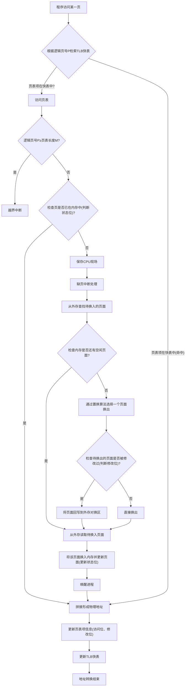

> [!NOTE] 缺页中断的特殊性
> 缺页中断和其他中断一样，同样要经历保护CPU现场、分析中断原因、转入缺页中断处理程序、恢复CPU现场环境等过程。但它又是一种特殊的中断，和其他中断有以下区别：
> - 其他中断是在指令执行完成后处理中断，而缺页中断则是在指令执行期间产生和处理中断程序；
> - 缺页中断可能在执行期间多次产生中断。

#### 页面换入策略

前面详细介绍了页面换入的过程。下面再从换入页面的时机、换入页面的存储空间两个方面做进一步的补充。

##### 何时换入页面

页面换入的时机可以根据换页的动作划分为两种方式：**预换页**（主动预加载页）和**请求换页**（应用程序主动请求换页）。

- **预换页**：如果一个进程的许多页是连续存放在外存空间中的，一次性批量换入多个页比换入单个页的性能要好很多。但是这里有一些值得商讨的点，批量换入的这些页都是占用内存空间的，如果这些页后面访问频率很低，则会出现内存空间利用率降低的情况。常见的思路是通过预测（预测将来哪些页可能被使用）的方式来结合预换页，但目前预测的准确率不高。预换页有它独特的高效换页优势，常在一些采用“工作集”的系统中使用，用来在程序初次启动时候加载工作集中的所有页。
- **应用程序主动请求换页**：是目前很多系统主要采用的换页方式。主要过程是当程序运行过程中发现访问的页在内存中不存在，然后系统就会触发缺页中断加载所缺失的页面。这种方式的优点是换入的页面肯定会被访问，同时容易实现；而弊端则是每次请求换页仅换入一页数据，如果频繁发生换页的话，系统换页开销比较大。

##### 从何处换入页面

一般来说，请求分页的系统外存会划分为**对换区**和**文件区**两部分。其中，对换区是采用连续分配的方式得到的一段连续空间，而文件区则是离散分配的空间。对换区在数据读取时采用磁盘I/O顺序访问的方式效率要比文件区高。而实际应用程序的数据通常是以二进制文件形式存放在文件区，因此需要按照以下三种情况进行区分讨论。

1. **系统拥有足够的对换区空间**：应用程序的数据可以全部从对换区换入，以提升换页的效率。要想实现这种效果，需要在程序启动前将所有的数据复制一份到对换区空间中，以保证对换区中有应用程序的数据。
2. **系统缺少足够的对换区空间**：需要对换入的页面做区分。如果是未修改的页面，则直接可以从文件区换入，换出时由于页面未被修改所以不需要回写到磁盘，直接换出即可。而对于修改的页面则在首次换入时从文件区换入，以后换出时回写到对换区空间，而再次换入时也从对换区空间换入。
3. **UNIX方式**：UNIX系统中应用程序数据全部放在文件区，因此未运行的页面首次都需要从文件区换入，曾经访问过但被换出的页面，会被放入到对换区。下次换入时优先从对换区换入。此外，UNIX系统允许页面共享，因此某个进程访问的页面有可能已经被其他进程换入，此时则无须再从对换区换入。

#### 页面分配策略

一个进程在运行前，操作系统要给该进程分配一定数量的内存页面。给一个进程分配的页面数目越多，进程的缺页率就会下降，但系统能允许运行的进程数量就越少了。如果分配给进程的页面越少，则进程在运行中缺页率就会增加，从而降低进程执行的速度。因此，为了让进程能有效运行，需要分配合适数量的页面。在请求分页内存管理中，内存分配策略有两种，即**固定**和**动态可变**，而页面置换策略也有两种，即**局部置换**和**全局置换**。将二者结合在一起就产生了**固定分配局部置换**、**动态分配全局置换**、**动态分配局部置换**这三种页面分配策略（不存在固定分配全局置换这种）。

##### 固定分配局部置换

固定分配局部置换是指一个进程启动执行前，为它分配固定数量的物理内存页，之后该进程在运行过程中不会再调整内存页。当一个进程运行过程中发生缺页的情况下，且页面已满，则只能从该进程已分配的页面中选出一页进行换出，所以称为固定分配局部置换。通常这种策略下给进程分配的内存页面数是根据程序类型和开发人员的建议确定的，往往很难分配恰当的页面给每个进程。

##### 动态分配全局置换

动态分配全局置换这种策略是指给一个进程一开始分配一定数量的内存页面。操作系统全局也维护一个空闲页面链表，当后面该进程运行过程中出现了缺页且进程页面已满，此时需要考虑换出，则从操作系统全局的空闲页面列表中选择一个页面分配给该进程。在这种情况下，一个进程所拥有的页面数目是动态变化的，所以称为动态分配全局置换。随着运行，进程所拥有的页面数目会不断变化。如果有进程发生缺页，而系统中可用的空间页面全部用尽后，则会从内存中选择任意一个进程的一个页面进行换出，被换出页面的进程页面数目也就减少了。

##### 动态分配局部置换

在动态分配全局置换中，当系统中内存不够用频繁发生缺页时，会导致运行在该系统上的多个进程之间相互干扰。为了避免这种问题的发生，就出现了动态分配局部置换。这种策略和动态分配局部置换类似，只不过它的置换策略有所不同。进程一开始启动时也是分配一定数目的页面，让其正常运行。在运行过程中如果该进程频繁发生缺页现象，则系统会从全局的空闲页面链表中为该进程再分配一些页面，以降低进程的缺页率。反过来，如果一个进程在运行过程中发生缺页的概率非常低，则系统会考虑在不引起该进程缺页率上升的情况下，适当地减少分配给该进程的页面，以保证系统中能有部分空闲页面以供其他进程需要时使用。

> [!INFO] 首次分配页面的数量如何确定
> 前面一直提到系统给进程首次分配时会分配固定数量的页面，但没说固定数量到底如何得到。通常一般有：
> - **平均分配**：系统给每个进程分配的页面数量都是相同的。这种做法最简单但明显是最不合理的。因为不同的进程运行所需的页面肯定是不相同的。
> - **按比例分配**：根据系统可用的总页面、运行的各进程所需页面总数，以及该进程所需页面数的比例计算出来的。
> - **按优先级分配**：对不同的进程设置了不同的优先级，对于高优先级的进程适当地多分配一些页面，让它能快速运行，而对于低优先级的进程则适量地少分配一些页面。
> 
> 在实际场景中往往会结合比例分配和优先级分配这两种方式综合判定给一个进程分配多少页面，以使得各进程能高效、正常的运行。

### 页面置换算法

在通过缺页中断换入页面时，有时会遇到分配给该进程的页面已经都被占满，没有空闲空间了，此时就需要通过一种策略从所有的页面中选择一个页面进行换出，以腾出空间存放即将换入的页面。这种选择换出页面的策略称为**页面置换算法**。页面置换算法有很多，例如OPT（Optimal，最佳）置换算法、FIFO（First In First Out，先进先出）置换算法、LRU（Least Recently Used，最近最少使用）置换算法、LFU（Least Frequency Used，最近最少访问）置换算法，以及Clock（时钟）置换算法等。但从本质上讲，这些页面置换算法最核心的一个原则是：**从所有页面中选出一个将来或者最近一段时间内访问频率最低的页面将其换出**。

#### OPT置换算法

顾名思义，最佳置换算法是淘汰最近一段时间内不被访问或者访问频率最低的页面。这种算法的置换效果最佳，但实际上只是理论上的一种算法。因为在当下无法准确知道程序会访问哪些页面。所以该算法无法在真实环境落地。通常用该算法来评判其他页面置换算法的性能。

#### FIFO置换算法

FIFO置换算法通常的做法是按照页面换入进程的先后顺序进行排序，在页面置换时每次选择最早换入的页面进行换出。它其实是一种队列的特性。这种算法最大的优点是非常容易理解、好实现，但往往效果并不是很好，因为在进程中有些很早换入的页面（例如全局变量、常量函数等）会经常被访问，如果将这部分页面换出，则程序接下来运行时仍然需要将这些页面换入。这样频繁地换入/换出会导致程序运行效率降低，甚至还会产生进程抖动。

#### LRU置换算法

前面介绍OPT置换算法时提到其难点在于无法在当前时间点准确预测将来会访问的页面。如果把时间往后倒退一点就会发现，进程在运行的过程中知道过去一段时间页面的访问信息。那么这个信息是否有用呢？答案是肯定的。因为进程在运行过程中符合时间局部性和空间局部性，这也就意味着根据时间局部性来看，最近一段时间访问的数据将来很可能被再次访问。基于时间局部性就出现了LRU置换算法。该算法的思想是，在每次访问页面时记录该页面访问的当前时间，然后在页面置换时选择访问时间最小的页面进行换出。因为访问时间越小，表明该页面访问后过的时间越久，也就意味着该页面最近最少使用。

#### LFU置换算法

在介绍LRU算法时提到它是基于时间局部性原理提出的，而LFU算法则是基于空间局部性提出的。该算法的思想是，过去频繁访问的数据在最近一段时间内也极有可能被频繁访问。这种算法在页面访问时需要更新页面访问的频率，然后在置换时选择访问频率最低的进行换出。因为访问频率越低，根据空间局部性原理，它在最近一段时间内也不会被频繁访问。可以看到，LFU和LRU算法的主要区别在于，LFU算法是以访问频率来判定换出哪个页面，而LRU算法则是根据访问页面的时间来判定换出哪个页面。二者都是基于局部性原理产生的算法。

#### Clock置换算法

LRU算法和LFU算法二者的性能通常比较好，在软件层面二者也比较容易实现，但是在硬件层面实现时则需要比较多的寄存器或者栈，成本比较高。因此，这两种算法在上层应用程序中用得非常多，而在页面置换算法中通常采用近似于LRU的算法。Clock置换算法就是一种近似LRU的置换算法。

**基本的Clock算法**示意如图3-17所示。它的思想是，内存中所有的页面通过链表链接在一起形成一个循环队列。当有页面访问时，系统就将该页面的访问位置1。当需要通过该置换算法选择一个页面换出时，只需要遍历该链表检查页面的访问位是否为0。如果找到了访问位为0的页面，则直接将该页进行换出。如果检查的当前页面访问位为1，则重新将该访问位置0暂不换出，再给该页面一次机会，然后继续往后查找。如果整个链表都遍历完没有找到页面被换出，则从头检索。此时，前面页面访问位被置为0的页面就会被换出了。由于该算法只用一个访问位来记录是否被访问，置换时将未使用的页面优先换出，因此该算法也被称为**NRU（Not Recently Used，最近未用）算法**。同时，由于其查找页面的过程是循环进行的，类似于时钟，所以被称为Clock算法。

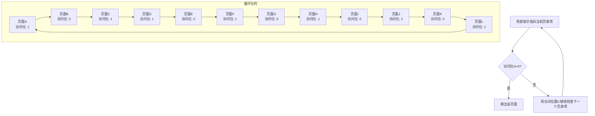

> [!INFO] 基本的Clock算法说明
> 每个页表项对应一个页面，页表项中包含一个访问位A，当发生缺页中断且需要页面换出时，检查指针指向的当前的页表项中访问位的信息，然后采取不同的操作：
> 1. A=0：该页面未被访问，可以直接换出该页面
> 2. A=1：该页面被访问过，重新置A为0并继续遍历检查下一个页表项

可以看出，基本的Clock算法其实就是在FIFO算法的基础上对页面做了区分，区分出来访问和未访问的页面。换出时优先考虑未访问的页面换出。然而在页面换出时还需要考虑该页面是否被修改过，如果该页面访问过程中被修改了换出时还需要将其回写到磁盘上以保证数据的一致性。如果未被修改则可以直接换出，无须再写回磁盘。为了提升页面换出的效率，顺着这个思路来考虑，访问的页面又可以根据是否被修改一分为二。在换出时明显为了减少写回磁盘的效率，可以优先换出未被访问同时未被修改的页面，然后考虑未被访问但修改了的页面。于是一种改进的Clock算法是在基础的Clock算法的基础上对页面增加了修改位这个标志位。假设访问位用A（Access）来表示、修改位用M（Modify）表示，则一个页面可以根据是否被访问、是否被修改分为四种类型。

- **未访问且未修改（A=0，M=0）**：表示页面最近既未被访问，同时也未被修改，换出时优先考虑。
- **未访问且修改（A=0，M=1）**：表示页面最近未被访问但之前访问时被修改了，在换出时需要写回磁盘。
- **访问且未修改（A=1，M=0）**：表示页面最近有被访问但未被修改，则该页面有可能再次被访问。
- **访问且修改（A=1，M=1）**：表示页面最近有被访问且被修改，则该页面有可能被再次访问。

改进后的Clock算法的置换过程如下。

**第1步**：遍历该页面链表并查找A=0，M=0类页面，如果找到则结束遍历，进行换出。
**第2步**：如果第1步未结束，需要找A=0，M=1类页面，找到则结束遍历并在写回磁盘后执行换出。同时，在跳过A=1的页面中将A置0。
**第3步**：如果第2步未结束，则继续按照第1步的逻辑执行。
**第4步**：如果第3步未结束，则继续按照第2步的逻辑执行。

改进的Clock算法的核心思想和基本的Clock算法的一致，只不过在页面换出时新增了一个检查逻辑（检查页面是否被修改）。页面换出时优先换出未被访问且未被修改的页面。通过这样的方式可以节约页面置换的时间。

> [!TIP] 页面置换算法的通用性
> 上述几种页面置换算法其实并不局限于页面置换中，在很多数据缓存的应用场景下同样适用。它们从本质上讲都是由于空间不够需要通过淘汰元素来释放部分空间，核心思路是从多个已缓存的元素中选择一个或几个元素进行淘汰。其核心原则是选择将来一段时间内最不可能被访问的或者性价比最低的元素。

### 请求分段内存管理

请求分段内存管理是基于基本的分段内存管理演变而来的。它在分段内存管理的基础上新增了请求换段和分段置换功能，形成了虚拟分段内存管理方式。该方式允许用户进程在载入部分段后即可运行，当运行过程中遇到缺段时，再将缺失的段换入内存，同时将暂时无用的段换出到外存。与请求分页内存管理类似，请求分段内存管理也需要软件和硬件的支持，包括分段段表、地址转换和缺段中断处理等。不过，与请求分页内存管理不同的是，分段内存管理中不同段的长度是不固定的，因此虚拟分段内存管理的实现难度更大一些。下面将从段表结构和地址转换两个方面对请求分段内存管理进行介绍。

#### 段表结构

请求分段内存管理同样需要段表来存储不同段在内存中的映射关系。除了段号、段起始地址和段长外，还新增了额外的字段，用于实现请求分段和分段置换功能。请求分段内存管理段表中段表项的结构如图3-18所示。

```mermaid
block-beta
  columns 10
  block:header:1
    columns 1
    "段号"
  end
  block:start:2
    "段起始地址"
  end
  block:len:1
    "段长"
  end
  block:access:1
    "存取方式"
  end
  block:visit:1
    "访问字段"
  end
  block:modify:1
    "修改位"
  end
  block:status:1
    "状态位"
  end
  block:append:1
    "增补位"
  end
  block:addr:1
    "外存地址"
  end
```

**图3-18 请求分段内存管理段表中段表项的结构**

- **段号**：指每个段的编号，主要用来根据段号定位段表项。
- **段起始地址**：指段存放在物理内存空间的起始地址。
- **段长**：指该段对应的长度，不同段的长度不同。
- **存取方式**：用来对段进行保护，如果该字段为两位的话，可以表示段的三种状态：可读、可写、可执行。
- **访问字段**：用来记录该段的访问信息，在段置换时供置换算法使用。
- **修改位**：用来记录该段是否被修改，当段需要被换出时结合该字段进行考虑，值为1表示被修改过，值为0表示未被修改过。如果该段被修改过，则需要在换出前先写回磁盘，否则可以直接换出。
- **状态位**：用来表示该段是否被调入内存中，值为1表示已在内存中，0表示不在内存中。如果在访问时发现不存在则需要执行段的换入逻辑。
- **增补位**：该字段是请求分段内存管理独有的一个字段，用来表示该段在运行过程中是否有发生过动态增长。
- **外存地址**：用来记录该段在外存中存储的起始地址。当发生缺段后，要换入该段的数据时需要根据该地址来读取外存中的段数据。

#### 地址转换过程

请求分段内存管理的地址转换和基本的分段内存管理的地址转换过程类似，唯一的区别是，在基本的分段内存管理中，该进程的所有段在初次启动前都已经载入到内存中。因此，在后续的执行过程中发生地址转换时不会出现段在内存中不存在的问题，处理方式比较简单。而在请求分段内存管理中，由于只有部分段在进程启动前被载入，因此在进程运行期间难免会出现访问不在内存中的段的情况。这时，需要先阻塞该进程，然后由系统发出一个缺段中断，将缺失的段信息换入。当换入段的操作完成后，该进程才能继续运行。图3-19所示为请求分段内存管理中逻辑地址到物理地址的转换过程。

请求分段系统地址转换的详细过程如下。

首先，当一个进程运行过程中访问到某个段时，CPU会形成一个逻辑地址，其中包含了段号和段内偏移量。接着将段号送入段表寄存器进行校验，如果段号超过了段表长度，则说明该段是非法的，系统会产生一个越界中断。若段号合法，根据段号在段表中找到对应的段表项，首先会根据段表项中的存取方式来做安全保护。当该段访问安全时，根据状态位来判断该段是否已经载入到内存中。状态位为1时，表明该段已在内存中，系统直接使用段的起始地址和段内偏移量构成物理地址访问数据，同时同步更新段表中的访问位和修改位（写操作时更新该字段）。如果状态位为0，则表明该段对应的数据不在内存中，此时系统会发出一个缺段中断。该中断和缺页中断执行的逻辑类似，通过中断处理程序换入需要的段。在这个过程中，可能会有两种情况。

**第一种情况**：如果当前进程的空间中存在足够的空闲区来容纳新换入的段，此时就不需要发生段置换的操作，直接换入新段即可。

**第二种情况**：如果没有足够的内存空闲空间来存放新换入的段，此时就需要按照前文介绍的置换算法选择一个或几个要换出的段，然后将其换出，腾出空间来存放新换入的段。换出段时同样需要考虑段是否被修改过，如果被修改过，则在换出时还需要写回磁盘。在新段换入后，同步更新段表中的段表项中相关字段（状态位、访问位）。换段完成后，唤醒该进程继续往下执行。上述过程就是当访问的段不存在时的请求换入段的逻辑。

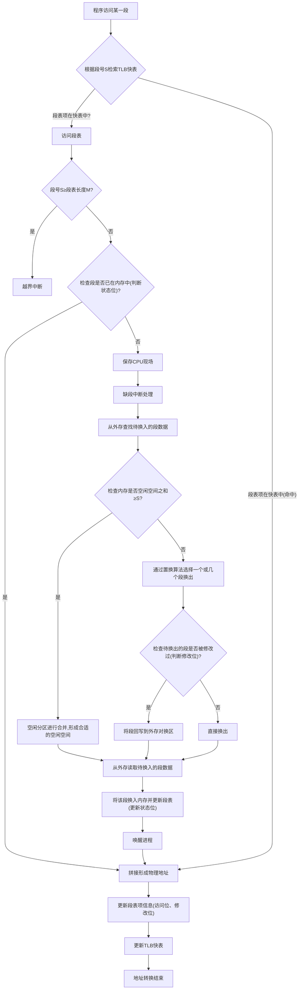

**图3-19 请求分段内存管理中的地址转换过程**

可以看到，请求分页内存管理和请求分段内存管理的中断处理类似，主要区别在于段是变长的而页是定长的。这也使得缺段处理的过程稍微复杂一些。

对于请求段页式内存管理，其处理逻辑和前面介绍的段页结合内存管理基本类似。由于篇幅限制，此部分内容不再展开介绍。

---

## 3.2 持久化内存

3.1节介绍的内存属于易失性存储介质，在断电后保存的数据会丢失，因此无法保证数据的持久性。然而，随着近些年云计算和大数据的发展，互联网对存储介质提出了新的要求，在这样的背景下产生了一种新型存储介质——**持久化内存（Persistent Memory，PMEM）**，也称为**非易失性内存（Non-volatile Memory，NVM）**或**存储级内存（Storage Class Memory，SCM）**。从该存储介质的名称可知，它至少具备两个特性：其一是名称中包含内存，那么它至少具备和内存一样的访问速度和特性；其二是名称中包括持久化关键字，那么它应该具备对存储的数据进行持久化保存的能力。

根据前面的介绍，通常的内存存储介质和持久化二者之间是矛盾的。那么持久化内存是如何解决这个矛盾的呢？接下来，希望读者带着这个问题来阅读本节内容。

本小节将从持久化内存的产生背景、持久化内存的分类以及持久化内存的工作模式几个方面循序渐进地介绍持久化内存的基本内容。希望读者在阅读完这部分内容后能对持久化内存有一个最基本的认识。

### 1. 持久化内存的产生背景

在云计算和大数据时代，全球产生的数据量不断增长。随着人工智能、推荐系统和物联网的迅速发展，个人数据和商业数据的规模也在不断扩大。如今，人们的日常生活离不开互联网提供的各种服务。

一方面，大量用户数据需要持久存储。根据数据存储时间的不同，存储分为三类：**永久存储**、**短期存储**和**临时存储**。

- **永久存储的数据**通常与用户的消费行为相关，例如购物记录、交通记录，以及推荐系统中的点赞、收藏、发布和互动信息。这些数据要求系统在用户账号的有效期内长期保存。
- **短期存储的数据**通常是为其他目的而存储，以推荐系统为例，系统会存储一些用户的特征和行为记录（如曝光和点击）。这些数据的有效期通常是有限的，可以是几小时到几个月。短期存储的数据通常用于数据分析和数据挖掘，以提供更精准、更符合用户偏好的推荐内容。
- **临时存储的数据**通常是为了提升用户体验，将用户经常访问的数据临时存储下来，以便在下次访问时能快速响应用户。

另一方面，随着互联网服务的普及，用户对网络服务的选择也越来越多。用户体验成为广大用户选择服务的重要指标之一。在可选择的情况下，用户往往更倾向于选择访问速度较快的互联网系统。

大量数据存储带来的直接问题是系统存储成本的增加。如果不考虑用户体验，成本的增加相对容易控制，因为普通磁盘容量大且成本较低。然而，普通磁盘的访问速度非常慢，通常比内存慢几个数量级。尽管存储架构在计算机发展过程中一直在不断演进，但外部存储的访问速度仍无法与CPU的运算速度匹配。这就意味着要实现可控的存储成本同时为用户提供更好的体验，对于许多系统来说是非常具有挑战性甚至是矛盾的。在计算机硬件条件的限制下，大多数企业和服务提供商最终会在成本上做出妥协，为用户提供更好的体验。

综上所述，在受限于计算机硬件内存和外部存储性能差距的条件下，面对大量持久存储需求，很难同时实现良好的用户体验和可控的系统成本。在这种情况下，计算机研究人员一直在探索解决这个问题的硬件方案。近年来，一种新型的存储介质——持久化内存的出现，使得从根本上解决这个难题成为可能。

持久化内存可以使用磁随机存储、相变存储、3D-XPoint等不同的介质构成。图3-1展示了持久化内存在存储介质中的位置。从硬件层面来看，持久化内存在内存和SSD之间，弥补了内存和SSD之间的性能差距。在某些场景下，持久化内存甚至可以扩充甚至代替内存的使用。基于持久化内存的特性，它可以有效降低系统的成本。

> [!INFO] SNIA对持久化内存的典型属性规定
> SNIA（Storage Networking Industry Association，存储网络工业协会）对持久化内存的典型属性进行了规定，包括**大**、**快**、**持久性**。
> - **大**：目前服务器单条内存容量一般为32GB/64GB，而单条持久化内存容量最大可达512GB。这意味着如果使用持久化内存，单台服务器的内存容量很容易达到TB级别。同时，从成本角度来看，持久化内存的成本要低于内存。
> - **快**：内存访问延时为10～100ns，SSD访问延时为10～100μs，而持久化内存的访问延时通常小于1μs。虽然持久化内存的访问延时比内存大，但比普通SSD快1～2个数量级。在许多磁盘I/O是瓶颈的情况下，持久化内存是一个非常好的选择。

# 3. 数据存储介质

## 持久化内存

### 持久化内存的特性

SNIA（存储网络工业协会）对持久化内存的典型属性进行了规定，包括**大、快、持久性**。

- **大**：目前服务器单条内存容量一般为32GB/64GB，而单条持久化内存容量最大可达到512GB。这意味着如果使用持久化内存，单台服务器的内存容量很容易达到TB级别。同时，从成本角度来看，持久化内存的成本要低于内存。
- **快**：内存访问延时为10～100ns，SSD 访问延时为10～100μs，而持久化内存的访问延时通常小于1μs。虽然持久化内存的访问延时比内存大，但比普通SSD快1～2个数量级。在许多磁盘I/O是瓶颈的情况下，持久化内存是一个非常好的选择。
- **持久性**：持久化内存具有接近内存的访问速度，同时具备常规外部存储介质的持久性特征。当计算机断电后，持久化内存中保存的数据不会丢失。这是持久化内存非常重要的一个特性。

> [!INFO] **持久化内存的核心优势**：兼具内存的低延迟（μs级）和磁盘的持久性，且单条容量远大于常规DRAM。

### 持久化内存的分类

目前，非易失性双列直插式内存模块（NVDIMM）是持久化内存的一种具体实现。NVDIMM通过DIMM（双列直插内存模块）进行封装，并兼容标准的DIMM卡槽，通过DDR总线进行通信。根据JEDEC标准，NVDIMM的实现可以进一步分为三类：NVDIMM-N、NVDIMM-F和NVDIMM-P。

#### （1）NVDIMM-N

NVDIMM-N内部将DRAM和NAND闪存放在同一个模块中，并配备了一个后备电源，通常采用超级电容。这种实现支持按字节寻址和块寻址。在正常情况下，CPU可以直接访问DRAM，因此访问延时和传统DRAM相同，为10～100ns级别。当机器断电后，通过后备电源供电，将数据从DRAM复制到NAND闪存中，以保证数据的持久性。当电力恢复后，再将数据重新加载到DRAM中。受限于工作方式，NVDIMM-N中的NAND闪存无法直接寻址访问，而在正常工作时，闪存起到备份的作用。由于NVDIMM-N采用了两种存储介质，成本会增加。然而，它为业界提供了持久化内存的概念。在市场上已经有许多商用的NVDIMM-N产品可供选择，容量范围为8～32GB。

#### （2）NVDIMM-F

NVDIMM-F采用DDR3或DDR4总线的NAND闪存，仅支持块寻址。在工作时，它需要通过SATA控制器和DRAM-SATA桥接器，将DDR总线接口传递的信息转换为符合SATA协议的信息，然后再将其转换为闪存的操作指令。NVDIMM-F的工作方式与SSD相似，延时为10～100μs。由于需要在多个协议之间进行转换，NVDIMM-F的性能受到了一些影响，但其优势在于容量很容易达到TB级别。

#### （3）NVDIMM-P

NVDIMM-P与DDR5标准一起发布，内部支持DDR5接口，与DDR4相比提供了双倍带宽。NVDIMM-P采用混合DRAM和NAND闪存作为存储介质，其中Flash（闪存）的容量远大于DRAM。在工作时，通过DRAM充当缓存来提高系统的读/写速度，并优化对Flash的读/写操作。与NVDIMM-F一样，NVDIMM-P的容量可轻松达到TB级别，访问延时保持在100ns级别。此外，NVDIMM-P既支持块寻址，又支持传统DRAM的字节寻址。通过将数据介质直接连接到内存总线，CPU可以直接访问数据，无须任何驱动程序或PCIe开销。NVDIMM-P在避免了前面两者缺点的基础上，提供了接近DRAM性能的持久化内存的实现。

英特尔公司在2018年5月发布了基于3D XPoint™技术的英特尔傲腾持久化内存（Intel® Optane™ DC Persistent Memory），可视为NVDIMM-P的一种实现。

### 持久化内存的工作模式

以英特尔傲腾持久化内存为例来说明持久化内存的工作模式。它支持**内存模式（Memory Mode）**和**直接访问（App Direct，AD）模式**两种工作模式。

#### （1）内存模式

在内存模式下，持久化内存可以被用作大容量的内存扩展，方便增加内存容量。需要注意的是，持久化内存在内存模式下无法利用其持久性特性，因此与普通内存相同，断电后数据会丢失。在内存模式下，内存和持久化内存构成了两级内存模式：普通内存也称为**近端内存**，持久化内存作为**远端内存**，近端内存充当远端内存的缓存。当读/写操作命中近端内存时，访问延时为DRAM级别的延时，通常为10ns级别；而如果访问未命中近端内存，从远端持久化内存获取数据将产生额外的访问延时，延时将接近μs级别。当内存缓存命中率较高时，CPU带宽取决于内存DRAM通道的利用率；而当内存缓存命中率较低时，则受限于持久化内存的带宽。内存模式下的数据读/写访问过程如图3-20所示。

> **图3-20 内存模式下的数据读/写访问过程**  
> CPU缓存（L1/L2/L3） → 内存控制器 → 传统内存（近端内存）和持久化内存（远端内存）。  
> - 缓存命中：从近端内存返回数据。  
> - 缓存未命中：从远端持久化内存返回数据，并将数据缓存到近端内存。

内存模式适用于以下情况：应用程序的热点数据工作集小于内存容量，但数据访问容量可能大于内存容量。根据局部性原理，热点数据会完全缓存在内存中，并且数据访问命中内存的概率较高。当访问冷数据时，持久化内存的访问延迟比SSD更低，基本接近内存的访问速度。这种应用场景可以充分利用持久化内存的优势。然而，如果程序的热点数据大于内存容量，并且程序需要访问较大的内存空间时，内存模式就不太合适了，它会对程序性能产生一定的影响。此时，可以考虑使用AD模式。

#### （2）AD模式

在AD模式下，持久化内存存储的数据是持久性的，断电后不会丢失，并且它按字节寻址。与内存模式相比，AD模式是一级内存模式，持久化内存充当持久化的存储设备。在这种模式下，持久化内存直接暴露给应用程序使用。应用程序通过持久化内存感知文件系统（PMEM Aware File System）将用户态的内存空间和持久化内存设备映射起来，从而可以直接进行读/写操作。这种方式也被称为**直接访问（DAX）**。为了方便开发者更便捷地使用持久化内存进行软件开发，英特尔提供了用于持久化内存编程的上层应用软件编程库PMDK。图3-21展示了传统磁盘访问和AD模式下持久化内存访问的过程。

> **图3-21 传统磁盘访问和AD模式下持久化内存访问的过程**  
> (a) 传统磁盘设备访问过程：CPU → 内存控制器 → 传统内存 → 缺页中断 → 磁盘设备。  
> (b) AD模式下持久化内存访问过程：CPU → 内存控制器 → 传统内存 → 持久化内存（DAX直接返回数据）。

在AD模式下，持久化内存具有较低的访问延迟，这可以大幅提升传统磁盘访问数据的性能。通常情况下，AD模式的使用场景主要有两个：一个是容量的优势可以将原本存放在内存中的数据部分转移到持久化内存中，以扩大容量；另一个是较低的访问延迟优势可以将传统磁盘上的部分数据转移到持久化内存中，将原本按块访问的数据转变为按字节的DAX方式。这样一来，在减少页缓存数据复制开销的同时，还可以直接受益于低延迟设备带来的性能优势。

## 磁盘

磁盘和前面介绍的内存、持久化内存不同，它作为早期数据持久化存储设备，在计算机中扮演了至关重要的角色。日常接触到的计算机上的文件都是存储在磁盘中的，比如可运行的程序、图片、音乐、视频、各种文档（文本文档、Word、Excel、PPT、PDF等）。虽然磁盘具有数据持久化的特性，但是它和内存相比是一种低速设备，访问效率较低，因此也导致它读/写性能较弱。然而随着技术的发展，对于数据持久化要求较高的需求无法避免，在硬件环境无法短期改善的情况下，诞生了基于磁盘存储用户数据的应用层软件，比如MySQL、Oracle等关系数据库。这些数据库主要适用于处理读多写少的场景，所有数据都存储在磁盘中供用户访问。除了关系数据库外，后来还出现了LevelDB、RocksDB等适用于写多读少场景的磁盘型存储引擎。这些应用层软件无一例外地都对低速的磁盘设备在上层软件开发层面做了很多优化，以提升系统性能。本节的内容围绕以下几个问题展开。

- 磁盘如何工作？
- 为什么磁盘的访问效率低？
- 针对磁盘型的存储组件，如何进行优化？

为了回答上述问题，本节将从磁盘的基本内容（磁盘在计算机中的位置、磁盘的内部结构、磁盘的访问过程等）、磁盘管理机制、加速磁盘访问的方案这三个方面介绍磁盘的相关内容。

### 磁盘的基本内容

磁盘设备通常也被称为外存或者外部设备。本小节首先从整体上介绍磁盘在计算机中所处的位置，在了解了磁盘的定位后再对磁盘的基本构成做一个详细的介绍，要了解磁盘的访问耗时就不得不了解磁盘的基本结构。此外，除了机械磁盘外还有一种使用广泛的外存——固态硬盘，也会对其进行简单介绍。

#### 1. 磁盘在计算机中的位置

磁盘设备本质上属于I/O设备，它和鼠标、键盘、显示器这些设备一样在计算机中是通过I/O总线连接到CPU和内存的。I/O总线和系统总线、内存总线相比有两个特点：第一个特点是I/O总线在设计时被设计成与CPU无关的，同时它可以连接各种各样的I/O设备；第二个特点是I/O总线的速度相对而言比较慢。磁盘在计算机中的位置如图3-22所示。

> **图3-22 磁盘在计算机中的位置**  
> CPU → 系统总线 → I/O桥接器 → I/O总线 → 主机总线适配器 → 磁盘（含磁盘控制器）。  
> 内存通过内存总线连接I/O桥接器。其他I/O设备包括图形适配器、USB控制器等。

主机总线适配器一端通常可以连接一个或者多个磁盘，然后另外一端再连接I/O总线，和CPU、内存交互。主机总线适配器通常使用特定的主机总线接口定义的通信协议。磁盘接口最主要的有SCSI（[[Small Computer System Interface]]，小型计算机系统接口）、SATA（[[Serial Advanced Technology Attachment]]，串行高级技术附件）两个。SCSI是一种广泛应用于小型机上的高速数据传输技术，它具有应用范围广、任务多、带宽大、CPU占用率低及热插拔等优点，但较高的价格使得它很难像SATA般普及，因此SCSI主要应用于中高端服务器和高档工作站中。此外，和SATA相比，SCSI可以支持多个磁盘驱动器，而SATA只能支持一个驱动器。

目前广泛使用的磁盘主要是机械磁盘，而这类磁盘的特点是成本低、容量大，同时读/写性能也比较低。于是又发展起来了一类比机械磁盘性能高的存储设备——固态硬盘。下面分别介绍这两种存储设备。

#### 2. 机械磁盘

机械磁盘属于一种电磁设备，安装在磁盘驱动器中，由磁头、磁臂、磁盘旋转的主轴、多个物理盘片构成。机械磁盘的结构如图3-23a所示。每个盘片一般分为一个或者两个盘面。每个盘面会划分成多个磁道，这些磁道属于同心圆，所有盘面上相同的磁道构成了柱面。磁道之间保留了一定的间隙，通常为了方便处理，每个磁道存储数据的数量是相同的。靠近内侧的磁道和靠近外侧的磁道相比，内侧磁道面积较小，这也就意味着内侧磁道存储数据的密度较大，越靠近内侧的磁道存储的数据密度越大。为了方便数据的读/写，每个磁道又被划分成多个扇区，扇区的大小通常是固定的（范围为512B～4KB）。相邻的扇区之间也保留了一定的间隙。扇区一般也被称为盘块或数据块，对磁盘读/写数据时以扇区为单位。磁盘盘片的结构如图3-23b所示。一般，机械磁盘的容量由盘面数、磁道数、扇区数、扇区大小这几个因子决定，同时磁盘地址的定位也是由盘面号、磁道号（柱面号）、扇区号这三部分确定。

> **图3-23 机械磁盘的组成结构**  
> (a) 磁盘驱动器：主轴、盘片、磁头、磁臂。  
> (b) 磁盘盘片：磁道、扇区、磁道间隙、扇区间隙。

磁盘的访问时间由三部分组成。

1. **寻道时间**：指磁头移动到目标磁道的时间。这部分时间主要由启动磁臂的时间和磁头移动的时间两部分构成。假设启动磁臂的时间为 $s$，移动磁头到达目标磁道需要穿过的磁道数为 $n$，则寻道时间为 $m \times n + s$。其中，$m$ 是与磁盘驱动器速度相关的常数，取值大约为0.2ms；启动磁臂的时间 $s$ 大约为2ms。
2. **旋转时间**：指扇区移动到磁头下面所需的时间，该时间和磁盘的旋转速度有关。假设磁盘的旋转速度为 $r$，则旋转时间为 $1/r$，平均旋转时间为 $1/(2r)$。通常软盘和硬盘的转速不同，软盘的转速一般为300～600r/min，而硬盘转速一般为7200～15000r/min。以硬盘转速15000r/min为例，转一周所需的时间为4ms，平均旋转时间为2ms。
3. **传输时间**：指从磁盘读取数据或者将数据写入磁盘所需要的时间。假设磁盘的旋转速度为 $r$，一条磁道上所能容纳的数据量为 $N$ 字节，则传输 $b$ 字节数据所需要的传输时间为 $b/(rN)$。

综上，对一次磁盘数据的访问而言，总的平均访问时间应该为寻道时间、旋转时间、传输时间三者的总和，即 \(T = (m \times n + s) + \frac{1}{2r} + \frac{b}{rN}\)。其中，寻道时间和旋转时间与传输的数据量大小无关。而且寻道时间由电动机驱动磁臂移动磁头，属于机械运动，相对比较耗时，占据了大部分的磁盘访问时间。所以，在磁盘访问过程中适当减少寻道时间可以有效提升磁盘访问的效率。磁盘的顺序写恰恰就是通过尽可能减少寻道时间来提升性能的，这也是磁盘的随机访问比顺序访问慢得多的根本原因。

此外，操作系统为了减少进程对磁盘的访问时间，提供了各种磁盘调度算法。这些磁盘调度算法的主要目标是使磁盘的平均寻道时间最小。目前，常用的调度算法有以下几个。

1. **FCFS（First Come First Served，先来先服务）算法**。FCFS算法是一种基于磁盘访问顺序进行调度的算法。它的优点是简单、公平，缺点是没有对寻道进行优化。因此，当有大量进程使用磁盘时，它的调度类似于随机调度，导致平均寻道时间较长。FCFS算法适用于少量进程访问磁盘且大部分请求访问的扇区比较密集的情况。

2. **SSTF（Shortest Seek Time First，最短寻道时间优先）算法**。SSTF算法属于贪心算法，其调度原则是每次选择距离磁头最近的磁道，这样可以保证每次的寻道时间最短。从局部来看，它是最优的，但实际上不能保证平均寻道时间最短。同时，这种调度算法也可能导致“饥饿”现象，即访问距离磁头较远的磁道长时间无法得到处理。

3. **Scan（扫描）算法**。SSTF算法存在“饥饿”现象的根本原因在于，它只考虑了磁道与磁头之间的距离。而扫描算法是在SSTF算法的基础上改进而来的一种算法。该算法不仅考虑了待访问磁道和磁头之间的距离，还考虑了磁头的移动方向。当磁头从里向外移动时，它选择的磁道是位于当前磁头所处磁道的外侧同时距离最短的磁道；当磁头移动到最外层时，它切换磁头移动方向，变为从外向里移动。从外向里移动时，它选择的磁道是位于当前磁头所在磁道的内侧同时距离磁头最近的磁道。通过这种方式，磁头不断来回运动，类似于电梯的调度策略。因此，该算法也被称为电梯调度算法。

4. **C-Scan（Circular Scan，循环扫描）算法**。Scan调度算法可以很好地减少平均寻道时间，并避免“饥饿”现象。该算法被广泛应用于大、中、小型的磁盘调度中。然而，它的问题在于当磁头从里向外移动经过某一磁道后，如果恰好有一个进程访问该磁道，则该进程需要等待，直到磁头从里向外移动完，并从外向里移动到该磁道后才能被处理。这种情况导致该进程等待的时间大大增加。为了解决这个问题，提出了C-Scan算法，该算法规定磁头只能单向移动，例如只能从里向外移动。当移动到最外层的磁道后，直接快速移动到最内层，然后继续从里向外移动。这样，最小磁道接着最大磁道构成了一个循环。因此，该算法被称为C-Scan算法。

#### 3. SSD

SSD（Solid State Disk，固态硬盘）是基于闪存（Flash）实现的一种存储设备，它具有比普通的机械磁盘更高的读/写性能，在一些场景中已经成为替代机械磁盘的可选方案。固态硬盘通过标准的USB或者SATA硬件接口接入I/O总线，使用时和普通磁盘一样。图3-24所示为SSD的基本组成结构。

> **图3-24 SSD的基本组成结构**  
> I/O总线 → 闪存翻译层 → 闪存芯片（内部有多个块，每个块有多个页，页0、页1...页n，块0...块n）。

SSD内部由闪存芯片和闪存翻译层两部分组成。

1. **闪存芯片**。闪存芯片在SSD中类似于机械磁盘中的磁盘驱动器。SSD中闪存芯片可以有一个或者多个。每个闪存芯片内部划分成多个块，每个块又由若干个页（32～128）组成，通常页的大小为512B～4KB，块的大小为16～512KB。数据是以页为单位进行读/写的。在首次数据读/写时需要提前对该页所属的块进行擦除再读/写。一个块在大约进行10万次重复写之后就会磨损，块坏掉后将无法再使用。

2. **闪存翻译层**。闪存翻译层是一个硬件设备，它在SSD中扮演的角色和机械磁盘中磁盘控制器是一样的。其主要功能是对逻辑块地址进行翻译，转换成对底层闪存芯片的访问。

和机械磁盘不同，SSD由半导体存储器构成，没有磁头、磁臂等机械设备。这使SSD具备了很多优点，比如随机访问要比机械磁盘快得多。SSD的缺点主要是在数据反复写的过程中，闪存块会磨损，这也导致SSD的使用寿命比机械磁盘短。考虑成本的话，通常SSD的容量会比机械磁盘小一些。不过随着技术的发展，SSD的使用场景越来越广泛，二者的成本差值也在不断减小。

#### 4. 磁盘的访问过程

结合前面的介绍可知，磁盘最终是通过I/O总线和CPU、内存连接的，数据访问磁盘时数据也是通过I/O总线传输的，进而到达内存。图3-25从宏观角度展示了从磁盘读取数据的过程。

从磁盘读取数据可以分为三步。

**第1步**：当一个进程访问磁盘数据时，由于数据在磁盘上还未加载到内存中，因此CPU会将该进程挂起等待，接着发起对该磁盘数据的读取操作，该操作主要包含的要素是从磁盘文件的哪个位置（逻辑块号）读取多少内容（数据长度）并放到内存中的什么位置（内存地址）。该指令通过系统总线传递到I/O总线，进而被磁盘控制器接收。该过程如图3-25a所示。

**第2步**：磁盘控制器根据传递进来的信息中的逻辑块号将其转换为底层磁盘对应的物理块号（盘面号、磁道号、扇区号），有了这三个要素就可以从物理磁盘上找到唯一确定的扇区并读取数据。当从磁盘读取到数据后数据会通过DMA（Direct Memory Access，直接内存访问）的方式传送到内存的指定地址。该过程并不需要CPU的参与，CPU可继续运行其他进程。该过程如图3-25b所示。

**第3步**：当DMA传送完数据后，磁盘控制器会给CPU发送一个中断信号来通知CPU。CPU收到中断信号后会暂停当前执行的任务转而处理该中断。CPU会将数据从内核态的内存地址中复制到用户态空间，并唤醒进程，让它继续运行。该过程如图3-25c所示。

> **图3-25 磁盘读取数据过程**  
> (a) CPU将命令、逻辑块号、目标内存地址写到磁盘相关联的内存映射地址，发起磁盘读操作。  
> (b) 磁盘控制器读取指定扇区中的内容，并通过DMA传输到内存地址中。  
> (c) DMA传输完成后，磁盘控制器通过中断方式通知CPU。

### 3.3.2 磁盘管理机制

在了解了磁盘的基本内容后，应该知道计算机中对磁盘的访问基本上都是以文件的方式访问的。那文件内部到底是如何工作的呢？写入文件中的数据在磁盘上是如何存储的呢？本小节将围绕这些问题介绍磁盘管理的相关内容。

磁盘的管理主要涉及磁盘的访问及空间的分配等。操作系统为了方便用户高效、便捷地使用磁盘空间，进而抽象出来了文件系统。文件系统中以文件为基本单元，文件是磁盘管理的一种具体形式，是以磁盘为存储载体的信息集合。文件结构分为文件逻辑结构和文件物理结构。其中，文件逻辑结构是针对用户而言的，文件为上层用户暴露了访问磁盘的公共接口，用户关心如何使用文件，比如如何命名、如何查询、如何操作等功能，而不关心具体文件是如何在磁盘上存储的，占用了磁盘上的哪些空间等细节。而文件物理结构则是从实现角度出发的，它是文件在磁盘上的存储形式。文件的物理结构和具体的磁盘设备有很大关系，而文件的逻辑结构则与存储设备无关。

#### 1. 文件逻辑结构

文件逻辑结构可以从文件内部结构和文件外部结构两个层面来看。对文件内部结构而言，最基本的要求是要方便检索和修改文件内容（增加、删除、更新记录等），此外，附加的要求就是要提高磁盘空间利用率，尽可能减少文件所占用存储空间的碎片。而从文件外部结构来看，则要求当使用一个文件时能从众多的文件集中快速找到待操作的文件。

##### （1）文件逻辑结构的分类

文件的逻辑结构根据是否有结构可以分为**无结构文件**和**有结构文件**。无结构文件是由字符流组成的文件，也将其称为流文件。而有结构文件则是由一个或者多个记录组成的文件，因此也将其称为记录文件。

1. **无结构文件**。无结构文件是以字节为单位的，数据按照顺序组织保存。这种文件管理简单，但是涉及数据检索时需要顺序检索。这种方式主要以二进制文件为主。

2. **有结构文件**。有结构文件中每条记录用于描述一个实体，每条记录的长度可以是定长的，也可以是变长的。定长记录能有效提高检索的速度和效率，同时能方便修改和处理。变长记录中每条记录的长度不固定，检索速度慢，同时不便于修改，但它很适合一些场景的需要。因此，目前这两种方式都有使用。根据文件内部记录的组织方式可以将有结构文件分为以下几类。

- **顺序文件**。顺序文件是指若干条记录按照某种顺序排列所形成的文件。通常的顺序有两种：一种是时间顺序，另一种是按照关键字排序。顺序文件比较适用于对存储的记录大批量存取的场景，同时对于磁带这种顺序存储设备也只能采用顺序文件才能正常工作。顺序文件的缺点是检索或者更新（增加、删除、修改）比较困难。

- **索引文件**。顺序文件中对变长记录的访问需要从头顺序查找，然后依次统计其长度，最后得到要查找的该记录的首地址后再进行访问。这种方式效率非常低。之所以需要顺序查找是由变长引起的，当记录是定长时访问某条记录，可以直接根据记录长度和记录编号计算出来该记录的地址，而变长则无法计算。为了解决这个问题，可以通过给变长记录建立一个索引表，索引表项中记录要查找的记录编号、该记录写入文件的位置、该记录的长度。索引表示意如图3-26所示。索引表项长度固定属于定长记录的顺序文件。通过这种方式可以实现较快的查找速度。

    > **图3-26 索引表示意**  
    > 索引表：记录编号（0,1,…,i,…）、长度（L0, L1, Li, …）、写入位置（p0, p1, pi, …）。  
    > 逻辑文件：R0, R1, …, Ri, …

- **索引顺序文件**。索引顺序文件是顺序文件和索引文件的结合。它既保留了顺序文件的特征又引入了索引表。通过索引表实现对索引顺序文件的随机访问。索引顺序文件的基本思想是将存储的所有记录划分为若干组，然后在索引表中为每一组的第一条记录一个索引项，索引项主要包括关键字和该记录写入的位置。索引顺序文件是最常见的一种逻辑文件形式。索引顺序文件示意如图3-27所示。在查找某条记录时首先在索引表中找到该记录所在组的第一条记录的表项，从而得到该组记录写入的起始位置，然后从起始位置往后开始顺序查找即可。

    > **图3-27 索引顺序文件示意**  
    > 索引表：关键字（An Long, Bo Bao, Chen Yun, …），逻辑地址（p0, p1, pi, …）。  
    > 逻辑文件：姓名（An Long, An Pao, Bo Bao, Bou Cao, …），其他属性。

- **直接文件或哈希文件**。该文件是根据待查找记录的键值或者通过哈希函数映射后的键值来得到该记录存储的地址。这种方式具有很高的存储效率，但特点是无序。而且哈希文件会有哈希冲突的问题（不同的关键字通过哈希函数得出相同的哈希值）。

##### （2）文件逻辑结构的管理（目录）

在计算机中通常有大量的文件存在，这些文件需要有合理的组织和管理才能为用户提供良好的服务。因此操作系统提出了目录这个概念，一个目录中可以包含多个文件。目录维护着多个文件的信息，供检索时使用。目录最基本的功能是实现根据文件名来存取文件。用户只需要提供访问文件的文件名，操作系统便可以准确地找到该文件在磁盘上的存储位置。

为了实现目录对文件的管理，操作系统为每个文件关联了一个数据结构——文件控制块（File Control Block，FCB），它用来描述和控制文件。在操作系统中目录也是通过文件来实现的，文件目录是一组FCB的有序集合，一个FCB就是一个文件目录项。

1. **文件控制块（FCB）**。文件控制块中定义了文件的基本信息、控制信息、使用信息这三类信息。

    - **基本信息**。基本信息包括文件名、文件物理位置、文件逻辑结构、文件物理结构等信息。文件名用来唯一地标识一个文件，用户通过文件名来对文件进行存取。文件物理位置是指文件在磁盘上的存储位置，包括存放文件的设备名、文件在磁盘上的起始盘块号、占用的盘块数、文件长度等信息。文件逻辑结构表示文件是流文件还是记录文件，文件是定长记录还是变长记录等。文件物理结构表示文件是顺序文件还是链接文件或者是索引文件等。
    - **控制信息**。控制信息包括文件主的存取权限、标准用户的存取权限，以及一般用户的存取权限。
    - **使用信息**。使用信息包括文件的创建日期和时间、上一次修改的日期和时间等信息。

2. **索引节点**。文件目录通常是存放在磁盘上的，当文件很多时文件目录需要占用大量的磁盘块。在检索目录文件时通常只会用到文件名，当根据文件名精准地找到一个目录项后才需要从该目录项中读取该文件的物理位置，在检索时并不会用到文件描述信息，这就意味着文件描述信息可以按需加载到内存中。因此，部分操作系统采用了将文件名和文件描述信息分离的方式。文件描述信息采用单独的一个结构来存储——索引节点，简称i节点。文件目录项由文件名和i节点的指针构成。通常索引节点存放在磁盘上，主要包含以下信息。

## 3. 数据存储介质

### 3.3.2 文件管理（续）

#### 2. 文件目录（续）

- **使用信息**。使用信息包括文件的创建日期和时间、上一次修改的日期和时间等信息。

- **索引节点**。文件目录通常是存放在磁盘上的，当文件很多时文件目录需要占用大量的磁盘块。在检索目录文件时通常只会用到文件名，当根据文件名精准地找到一个目录项后才需要从该目录项中读取该文件的物理位置，在检索时并不会用到文件描述信息，这就意味着文件描述信息可以按需加载到内存中。因此，部分操作系统采用了将文件名和文件描述信息分离的方式。文件描述信息采用单独的一个结构来存储——索引节点，简称 i 节点。文件目录项由文件名和 i 节点的指针构成。通常索引节点存放在磁盘上，主要包含以下信息。

- **文件类型**。文件类型用于标识该文件的类型，表示文件是目录文件还是常规文件或是特别文件等。

- **文件存取权限**。该项信息表示各类用户的存取权限。

- **文件物理地址**。每一个索引节点中含有 13 个地址项，iaddr(0)～iaddr(12)，它们以直接或者间接的方式给出数据文件所在的盘块编号。

- **文件长度**。文件长度是以字节为单位的。

- **文件存取时间**。文件存取时间包括该文件最近被进程存取的时间、最近被修改的时间、索引节点最近被修改的时间。

当文件打开后磁盘索引节点会被加载到内存中形成内存索引节点。内存索引节点比磁盘索引节点多了索引节点编号、状态、链接指针、访问计数等信息。

#### 3. 目录检索方式

在操作文件时，必须先显式地打开文件，打开文件时需要指定文件名，操作系统根据执行的文件名找到对应的目录项，然后从目录项中获取到该文件对应的索引节点信息，进而得到文件在磁盘上的物理位置，再通过磁盘驱动程序将该文件内容读入内存中。目前，目录的实现主要有线性检索法和 Hash 检索法两种，目录实现的本质就是查找。

- **线性检索法**。线性检索法是指目录表通过线性表维护，在创建文件或者删除文件时更新该目录表。查找时根据文件名在该表中查找。

- **Hash 检索法**。Hash 检索法是指建立一个 Hash 索引文件目录，当检索时将文件名通过 Hash 函数转换得到 Hash 值，再去目录表中查找。Hash 检索法的优点是增、删、改、查的复杂度非常低，但是需要一些额外的措施来避免和解决哈希冲突。

目录的检索是在磁盘上反复搜索完成的，因此需要不断地进行 I/O 操作。为了避免开销，减少 I/O 操作，会把当前所使用的文件目录加载到内存中，以后使用该文件时只需要在内存中检索即可，这样可以降低磁盘 I/O 操作次数提升系统性能。

### 2. 文件物理结构

和文件逻辑结构相对应的是文件物理结构。文件物理结构主要涉及给文件分配了哪些磁盘空间（磁盘块）、磁盘还有哪些空闲空间可用，这部分内容属于磁盘空间管理，下面将从磁盘空间分配和磁盘空闲空间管理这两个方面进行介绍。

#### （1）磁盘空间分配

以机械磁盘为例，分配磁盘空间时主要以磁盘块（扇区）为单位，磁盘空间分配的核心内容是将磁盘的哪些块分配给了某个文件。分配方式主要有：连续分配、链接分配、索引分配这三种方式。

##### 1）连续分配

连续分配是指在创建一个文件时给该文件分配一组连续的磁盘块。这些磁盘块由于是连续的，所以都位于同一磁道上，在数据读/写时不需要移动磁头。为了查找文件地址，可在目录项中的“文件物理地址”字段记录该文件第一个盘块号和文件长度（以盘块为单位）即可。连续分配方式主要的优点是存取速度快、实现简单；而缺点是分配空间时需要事先知道文件的长度，而且分配完空间后插入和删除记录需要移动盘块，反复的插入、删除操作会产生磁盘外部碎片。这种分配方式对于需要动态变化的文件不太友好。图 3-28 所示为连续分配方式示意。

```mermaid
graph TD
    subgraph 目录
        A["文件名: hello<br/>start: 0, length: 3"]
        B["文件名: video<br/>start: 10, length: 5"]
        C["文件名: list<br/>start: 21, length: 2"]
        D["文件名: mail<br/>start: 26, length: 1"]
    end

    subgraph 磁盘块
        E["块0<br/>hello数据"]
        F["块1<br/>hello数据"]
        G["块2<br/>hello数据"]
        H["块3<br/>(空闲)"]
        I["块4<br/>(空闲)"]
        J["块5<br/>(空闲)"]
        K["块6<br/>(空闲)"]
        L["块7<br/>(空闲)"]
        M["块8<br/>(空闲)"]
        N["块9<br/>(空闲)"]
        O["块10<br/>video数据"]
        P["块11<br/>video数据"]
        Q["块12<br/>video数据"]
        R["块13<br/>video数据"]
        S["块14<br/>video数据"]
        T["块15<br/>(空闲)"]
        U["块16<br/>(空闲)"]
        V["块17<br/>(空闲)"]
        W["块18<br/>(空闲)"]
        X["块19<br/>(空闲)"]
        Y["块20<br/>(空闲)"]
        Z["块21<br/>list数据"]
        AA["块22<br/>list数据"]
        AB["块23<br/>(空闲)"]
        AC["块24<br/>(空闲)"]
        AD["块25<br/>(空闲)"]
        AE["块26<br/>mail数据"]
        AF["块27<br/>(空闲)"]
        AG["块28<br/>(空闲)"]
        AH["块29<br/>(空闲)"]
        AI["块30<br/>(空闲)"]
        AJ["块31<br/>(空闲)"]
    end

    A -->|"start:0, length:3"| E
    B -->|"start:10, length:5"| O
    C -->|"start:21, length:2"| Z
    D -->|"start:26, length:1"| AE
```

**图 3-28 连续分配方式示意**

##### 2）链接分配

为了解决连续分配的问题，就出现了链接分配方式。链接分配方式不要求磁盘块是连续的，文件是分散装入多个磁盘块中的。通过在每个盘块上增加链接指针来实现将多个离散的磁盘块形成一个链表。因此这种方式形成的物理文件称为链接文件。这种分配方式的优点是消除了磁盘的外部碎片，提升了磁盘空间利用率，同时能很方便地进行插入、删除、更新等操作。在分配空间时，无须知道文件长度大小，这对于动态变化的文件非常友好。链接分配方式主要有隐式链接和显示链接两种方式。顾名思义，隐式链接是隐藏的，每个盘块内部除了维护文件数据外还会记录指向下一个盘块的指针（盘块号），在目录项中需要包含链接文件的第一个盘块指针和最后一个盘块指针。隐式链接分配示意如图 3-29a 所示。显式链接则是将链接各个盘块的指针从每个盘块中抽离出来，显式地存放一张链接表中，该表在整个磁盘中只有一张。链接表也称为 FAT（File Allocation Table，文件分配表），链接表中表项记录的内容是当前盘块指向的下一个盘块号。这种方式下在目录项中只需要记录第一个盘块号（起始块号），后续其他的盘块号可以通过 FAT 查找得到。显式链接分配示意如图 3-29b 所示。

```mermaid
graph TD
    subgraph 隐式链接分配
        direction LR
        A["目录项: hello<br/>start: 8, end: 24"]
        B["块8: 数据 + next=14"]
        C["块14: 数据 + next=24"]
        D["块24: 数据 + next=-1(结束)"]
        A --> B --> C --> D
    end

    subgraph 显式链接分配
        direction LR
        E["目录项: hello<br/>start: 3"]
        F["FAT表:<br/>0: -2(空闲)<br/>1: 4<br/>2: -1(结束)<br/>3: 5<br/>4: -1(结束)<br/>5: 2<br/>6: -1(结束)<br/>7: -2(空闲)"]
        G["块3"]
        H["块5"]
        I["块2"]
        E --> G
        G -->|FAT[3]=5| H
        H -->|FAT[5]=2| I
        I -->|FAT[2]=-1| J[结束]
    end
```

**图 3-29 链接分配示意**

##### 3）索引分配

链接分配虽然解决了碎片问题，但是又引入了新的问题。

- **不能高效地直接存取**。对于一个较大文件而言，需要在 FAT 中查找很多盘块号。

- **FAT 需要占用较大的内存空间**。一个文件所使用的磁盘块是随机分散在 FAT 中的，因此需要将整个 FAT 载入内存才能保证查到一个文件所需要的全部盘块号。实际上，在某个文件打开时只需要按需调入该文件占用的盘块号到内存中即可，无须将整个 FAT 调入。基于这样的思想出发就出现了索引分配。

索引分配方式为每个文件分配一个索引块，索引块中集中存放了该文件所有的盘块号。在目录项中只需要记录该文件对应的索引块号即可。在访问文件的某个盘块时分为两步：第一步先读取该文件的索引块；第二步再从索引块中找到对应的盘块号即可访问。索引分配示意如图 3-30a 所示。索引分配方式的优点是支持直接访问。但是它需要给每个文件都分配一个索引块，每个索引块可以存放数百个盘块号。此时要分情况讨论，中小型文件通常占用的盘块较少，这种方式下索引块的空间利用率是很低的。而对于大文件分配磁盘空间，如果一个索引块容纳不下所需要的盘块号，此时有两种解决方案：第一种是将多个索引块通过链接方式链接起来，形成一个索引块链表；第二种方案是采用多层索引。以图 3-30b 所示的二级索引为例，第一层索引块指向第二层的索引块，第二层的索引块则指向文件块。这种方式可以根据文件大小的上限进行扩展，扩展出三级索引或者四级索引等。

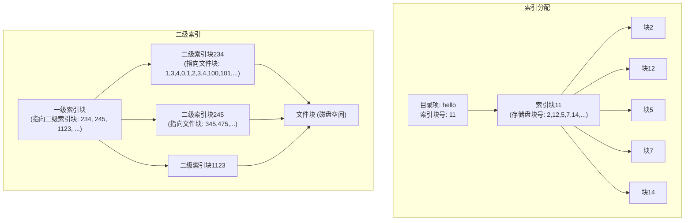

**图 3-30 索引分配示意**

通常为了能够较好地兼顾小、中、大及特大文件，文件物理结构可以采取多种组织方式。系统既采用直接地址方式，又采用一级索引分配方式或者二级索引分配方式。这种方式也称为混合索引分配方式。混合索引分配示意如图 3-31 所示。

以盘块大小为 4KB 为例，介绍混合索引分配中对文件进行空间分配的过程。

对于大小为 4～40KB 的小文件而言，最多会用到 10 个盘块存放数据。为了提高对小文件的访问效率，在索引节点中可设置 10 个直接地址项，即用 i.addr(0)～i.addr(9) 存放直接地址（盘块号）。这样，小文件就可以直接从索引节点中获取到该文件的所有盘块号。这种方式称为直接地址。

对于大小在 40KB～4MB 范围内的中等文件，采用直接地址是不可行的。因此可以采用单级索引的方式组织，利用索引节点中的地址项 i.addr(10) 来存放文件的索引块，该文件所占用的盘块号都存放在索引块中。为了获取文件的盘块号地址，首先需要从索引节点中获取其索引块信息，然后再从索引块中获取盘块地址，这种方式称为一次间接地址。

对于大型或者特大型文件（文件长度大于 4MB+40KB）时，一次间接地址和 10 个直接地址仍然存不下该文件的盘块信息，此时可以采用二级索引分配方式。用地址项 i.addr(11) 提供二级间接地址，实现二级索引分配方式。此时，系统在二级地址块中记录的是所有一次间接块的盘块号。采用二级索引分配时文件最大的长度可达 4GB。同理，对于更大的文件可以采用三级索引来完成。

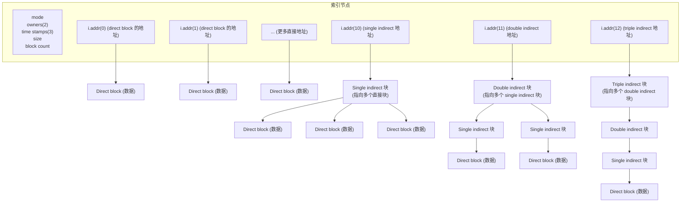

**图 3-31 混合索引分配示意**

综上，表 3-3 列出了连续分配、链接分配、索引分配三种分配方式的对比结果。

**表 3-3 磁盘空间三种分配方式对比**

| 磁盘空间分配 | 磁盘访问次数 | 优点 | 缺点 |
| :--- | :--- | :--- | :--- |
| 连续分配 | 访问第 n 条记录，需要访问磁盘 1 次 | 顺序存取非常高效，当记录定长时可以计算出任何一条记录的地址，支持随机访问 | 分配的连续存储空间会产生外部碎片，同时不适合文件动态增长 |
| 链接分配 | 对于隐式链接分配而言，访问第 n 条记录，需要访问磁盘 n 次 | 避免产生磁盘外部碎片，方便文件动态增长，磁盘空间利用率较高 | 需要额外空间存放链接指针信息，随机访问效率低 |
| 索引分配 | 访问第 n 条记录，在 m 级索引的情况下，需要访问磁盘 m+1 次 | 既方便文件扩展，又可以随机访问。结合了连续分配和链接分配的优点 | 需要额外的空间存储索引表信息。不同的索引表查找策略对文件系统效率影响较大 |

#### （2）磁盘空闲空间管理

在将磁盘空间分配给文件时，需要分配空闲的盘块。为了高效地进行盘块分配，需要通过一些方式来管理磁盘中的空闲盘块。根据采用的数据结构不同，磁盘空闲空间的管理方法主要有以下几种：空闲表法、空闲链表法、位示图法、成组链接法。

1）**空闲表法**。空闲表法是指系统为磁盘上的所有空闲区建立一个空闲表。空闲表项主要记录表序号、空闲区的第一个盘块号及空闲盘块数等信息。空闲表中的所有表项按照空闲盘块号依次递增排列。在为文件分配时，按照连续分配方式执行，类似于内存的动态分配。主要的分配策略有首次适应算法、循环首次适应算法等。在空间回收时，需要考虑相邻分区合并等细节。

2）**空闲链表法**。顾名思义，空闲链表法通过链表的方式将所有空闲区链接在一起。根据链接单位的不同，空闲链表法主要有两种：空闲盘块链和空闲盘区链。空闲盘块链是将所有空闲的盘块链接在一起，分配时从链头开始依次摘下需要的盘块分配给文件；在回收时，将回收的盘块依次链接到链尾。这种方式非常简单，但当需要分配的盘块数目较多时，需要重复多次分配操作。空闲盘区链则是以盘区为单位链接，一个盘区通常由若干个盘块组成。每个盘区上包含指向下一盘区的指针和当前盘区大小等信息。该分配方法同样可以采取首次适应等算法。

3）**位示图法**。位示图法是指用二进制位来表示磁盘中盘块的状态，例如有些系统以“0”表示该盘块空闲，以“1”表示盘块已分配。通常采用一个二维的位数组来维护所有盘块的状态。在分配空间时，需要找位示图中状态为“0”的盘块进行分配，分配后将该盘块对应的状态置“1”。而在回收时，则需要将待回收的盘块号转换为位数组中的下标，然后再将其下标对应的状态置“0”。

4）**成组链接法**。对于大型文件系统，空闲表法和空闲链表法通常不太适用，因为它们的长度较长。在 UNIX 系统中，采用的是成组链接法。这种方法结合了前面两者的优点，同时又避免了表太长的问题。该方法的思想是将文件区的所有空闲盘块划分成若干个组。假设总共有 10000 个盘块，以 100 个盘块为一组。将每一组的盘块总数和该组所有的盘块号记录在前一组的第一个盘块中，这样各组的第一个盘块即可构成一个链表。通常该方法与空闲盘块号栈一起配合工作。成组链接法示意如图 3-32 所示。

```mermaid
graph TD
    subgraph 空闲盘块号栈
        A["S.free[0]=201<br/>S.free[1]=202<br/>...<br/>S.free[98]=299<br/>S.free[99]=300<br/>N=100"]
    end

    subgraph 第一组(栈底块201)
        B["盘块201 内容:<br/>盘块总数=100<br/>盘块号: 301,302,...,399,400"]
    end

    subgraph 第二组(块301)
        C["盘块301 内容:<br/>盘块总数=100<br/>盘块号: 401,402,...,499,500"]
    end

    subgraph 第三组(块401)
        D["盘块401 内容:<br/>盘块总数=100<br/>盘块号: 501,502,...,599,600<br/>..."]
    end

    A -.->|"栈底块201<br/>指向第一组"| B
    B -.->|"下一个组指针<br/>块301"| C
    C -.->|"下一个组指针<br/>块401"| D
```

**图 3-32 成组链接法示意**

当需要为文件分配盘块时，首先会对盘块号栈进行加锁。加锁成功后，从栈顶取出一个空闲盘块号分配出去。当该盘块号已经到栈底时需要进行特殊处理。因为栈底的盘块号中记录的是下一组可用的盘块号信息，所以此时需要先从磁盘读取该盘块号对应的内容到栈中，读取完成后再将该盘块号分配出去。当回收空闲块时，系统将待回收的盘块号加入空闲盘块号栈顶，并执行空闲盘块数加一操作。当栈中的空闲盘块数达到分组的上限时，表示栈已满，此时将栈中的所有盘块号记录到新回收的盘块号中，再将盘块号作为新的栈底。

### 3.3.3 加速磁盘访问的方案

磁盘的性能表现在多个方面，但至关重要的一个指标就是磁盘文件的访问速度。目前磁盘访问速度还是远低于内存的访问速度。在采用磁盘作为主要存储介质的场景中，提升磁盘访问性能成为至关重要的一个话题。提升磁盘访问速度对于上层应用程序而言，最核心的出发点是尽可能通过各种手段减少对磁盘的访问。本小节将从加速磁盘读和加速磁盘写这两个方面展开介绍。

#### 1. 加速磁盘读

对于磁盘读的场景而言，最核心的思路是利用尽可能少的磁盘 I/O 获取到要访问的数据。顺着这个思路来看，加速磁盘读的主要有 Mmap、磁盘预读、数据缓存等方式。

##### （1）Mmap

Mmap 是一种内存映射技术，它将一个文件的磁盘空间和进程虚拟地址空间中的一段虚拟地址建立对应关系。通过映射关系进程就可以采用指针的方式对这一段内存空间进行读/写，当数据更新后，系统会自动回写脏数据到对应的文件磁盘上，用户可以通过这种方式完成对文件的读/写操作。采用 Mmap 方式读文件和用传统方式读文件相对比，减少了数据从内核空间到用户空间的复制过程，从而提升了读的效率。Mmap 加速读的案例有很多，比如 RocketMQ、BoltDB、Bitcask 等项目。

##### （2）磁盘预读

在操作系统读/写磁盘时通常是以扇区为单位的，而一个扇区的大小通常是 512B～4KB。即便应用程序每次只读取磁盘上一个字节的数据，在操作系统内部也是读取这一字节所在扇区的全部数据到内存中，然后返回时只返回一个字节。因此，部分系统通过巧妙地设计落到磁盘上的数据结构来提高磁盘读的性能，比如 RocketMQ 中消息的索引数据就是设计成定长结构，通过充分利用磁盘预读的特性来提升系统性能。

##### （3）数据缓存

对于频繁访问的磁盘上的数据，一方面操作系统会在内存中开辟一段空间（称为磁盘高速缓存）用作磁盘盘块的缓冲区，缓冲区会缓存从磁盘读取进来的数据。当要从磁盘读取数据时首先在磁盘高速缓存中查找，没找到后再启动磁盘 I/O 加载数据。值得注意的是，磁盘高速缓存空间有限，同样会面临需要数据置换处理。另一方面，应用程序也可以对频繁访问的数据进行应用层面的缓存，以此来减少对磁盘 I/O 的访问，提升系统读的性能。

#### 2. 加速磁盘写

对于写磁盘而言，要提升写磁盘的性能，最主要的两种方法是顺序批量写、异步延迟写。

##### （1）顺序批量写

对于磁盘 I/O 而言，随机写磁盘性能很低，主要原因是随机写时磁头的随机移动比较耗时。所以对于大量写并且数据保存在磁盘的场景下，最有效提升写性能的方案就是顺序写磁盘。在顺序写磁盘的同时尽可能以批量的方式写数据，这样性能会更佳。一般，数据库中持久化日志（WAL log）通常采用这种方式来设计实现。

##### （2）异步延迟写

异步延迟写是指对数据的写操作会短暂地暂存在内存中，当积累一定数量的数据后再集中将数据写到磁盘中。这种方式通常结合持久化日志一起使用。持久化日志保证数据的持久性，而异步延迟写保证写的性能。当异步延迟写操作完成后通常会调用刷盘操作，确保数据写入到磁盘块中。这种设计方式在 MySQL、Oracle 等关系数据库的存储引擎，以及其他磁盘型组件中应用非常广泛。

### 3.4 小结

本章围绕数据存储介质这一话题展开，按照计算机存储器介质依次介绍了内存、持久化内存、磁盘这三类存储介质。

3.1 节首先介绍了内存的基本概念及内存的访问过程，其次重点介绍了操作系统对物理内存的管理和虚拟内存的管理。3.2 节主要介绍了持久化的基础知识，包括持久化内存的分类和内部组成，其次重点介绍了在不同工作模式下的适用场景，在实际使用持久化内存时起到一些参考作用。3.3 节重点介绍了机械磁盘和固态硬盘的内部结构，并在此基础上介绍了访问磁盘的过程。这一节中最重要的内容是操作系统对文件的管理，主要包括文件的逻辑结构和物理结构。在掌握了文件的工作原理后，对理解后面要讨论的磁盘型存储引擎会非常有帮助。

本章的内容涉及很多操作系统的相关知识，如虚拟内存管理、磁盘管理、文件管理等内容。由于本章只是作为存储引擎中存储介质的基础知识介绍，上述内容旨在让读者更好地了解存储引擎内部是如何工作的，关于更多操作系统的内容，读者可以查阅其他相关书籍。

# 3. 数据存储介质

### 存储介质特性子图
- **H**（非易失性存储，I/O 命令，Block 粒度）→ **E**（NAND SSD）
- **I**（非易失性存储，加载/存储指令，Cache Line 粒度）→ **D**（Persist Memory）
- **J**（易失性存储，加载/存储指令，Cache Line 粒度）→ **C**（DDR DRAM）

### 维度子图
- **延时**：从上到下递增
- **成本（元/GB）**：从上到下递减？
- **容量**：从上到下递增

### 顺序关系
`A → B → C → D → E → F → G`

---

| 存储介质 | 延时 | 成本（元/GB） | 容量 | 特性 |
|---|---|---|---|---|
| CPU 寄存器 | 约0.1 ns | 高 | 很小 | 易失性，加载/存储指令，Cache Line 粒度 |
| CPU 缓存 (L1/L2/L3) | 1~10 ns | 较高 | 较小 | 易失性，加载/存储指令，Cache Line 粒度 |
| DDR DRAM (主存/内存) | 80~100 ns | 中等 | 中等 | 易失性，加载/存储指令，Cache Line 粒度 |
| Persist Memory (PMEM) | <1 μs | 较低 | 较大 | 非易失性，加载/存储指令，Cache Line 粒度 |
| NAND SSD | 10~100 μs | 低 | 大 | 非易失性，I/O 命令，Block 粒度 |
| HDD (机械硬盘) | 约10 ms | 很低 | 很大 | 非易失性，I/O 命令，Block 粒度 |
| Tape (磁带存储) | 约100 ms | 极低 | 极大 | 非易失性，I/O 命令，Block 粒度 |

> [!NOTE] 图片分析（page 113, image 2）
> 图片展示了主流存储介质（Tape、HDD、NAND SSD、Persist Memory、DDR DRAM、CPU缓存L1/L2/L3、CPU寄存器）在延时、成本（元/GB）和容量三个维度上的比较。延时从CPU寄存器的约0.1ns到磁带存储的约100ms不等，成本随性能提升而增加，容量则相反。非易失性存储（如Tape、HDD、SSD、PMEM）和易失性存储（DRAM、CPU缓存）被区分标注，并说明了各自的I/O粒度特性。

> [!NOTE] 图3-1（page 113, image 3）
> 图3-1展示了从CPU寄存器到磁带等主流存储介质在延时、成本和容量上的比较。延时从CPU寄存器约0.1ns到磁带约100ms依次增加，非易失性存储包括磁带、HDD、SSD和持久化内存，易失性存储包括DRAM、CPU缓存和寄存器。成本（元/GB）随性能提升而增加，容量则相反。