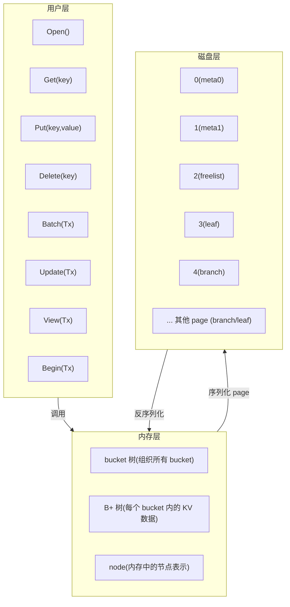
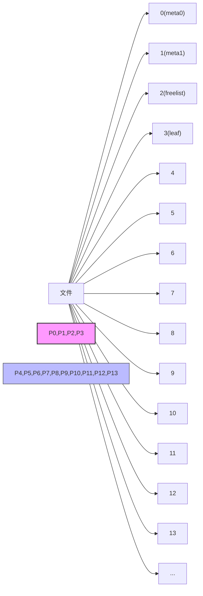
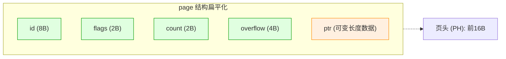
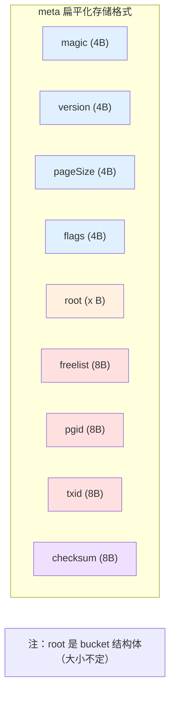
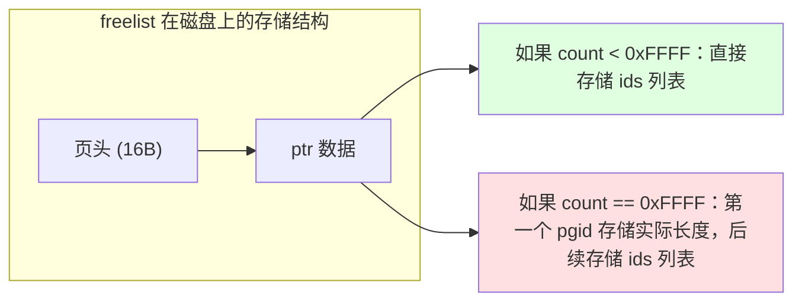

# 第6章 BoltDB 核心源码分析

本章以自底向上的方式分析BoltDB 的核心源码。之所以选择自底向上的方式，是因为笔者认为这种方式能更好地理解B+ 树存储引擎的内部原理。

## 6.1 BoltDB 整体结构

在研究一个开源项目前，熟悉其项目的目录结构是至关重要的。因此本节主要介绍BoltDB 项目结构、BoltDB 整体实现架构两部分内容。

### 6.1.1 BoltDB 项目结构

BoltDB 的目录非常简洁。下面对BoltDB 的项目结构做一个简单的介绍。

1. **cmd 目录**。cmd 的全称是command，该目录下主要是一些命令相关的程序。为了实现快速调试，BoltDB 提供了API 与命令行工具。该工具可以对数据库文件进行完整性校验，并且可以可视化查看BoltDB 内部的页信息和统计信息。如果想通过命令行来使用BoltDB，可以进入该目录下的bolt 目录，然后执行`go build` 编译，编译完成后就可以直接在本地使用了。

2. **bolt\_xxx.go**。这类文件主要定义了不同操作系统下的一些特性变量和特性方法。主要的特性变量有 `maxMapSize`（最大的 Map 大小）和 `maxAllocSize`（最大分配的数组空间大小）。主要的特性方法有文件锁 `flock()`、刷盘方法 `fdatasync()`、文件映射相关方法 `mmap()` 和 `munmap()` 等。当在不同的操作系统环境下，BoltDB 会自动选择对应的操作系统实现，而这些变量和方法在编译时会被加载。

3. **page.go**。该文件主要定义了页（page）相关的对象和方法。这也是对底层磁盘抽象最近的一层。关于 page 的内容将会在 6.2 节详细介绍。

4. **freelist.go**。该文件主要定义了空闲页（freelist）的实现。内部主要实现了空闲页的管理、查找可用新页等。相关内容将在 6.2.3 小节介绍。

5. **node.go**。该文件定义了 node 结构和实现。node 是磁盘上 page 在内存中的表现形式，关于 node 的内容会在 6.3 节展开介绍。

6. **cursor.go**。见名知意，该文件中主要定义了遍历相关的实现。前面提到 BoltDB 中对 KV 数据操作时，以 Bucket 为单位进行，因此遍历操作也是针对具体的某个 Bucket 对象的。其内部实现有前向遍历 `Prev()` 和后向遍历 `Next()` 两种。6.4 节会对 cursor 实现进行分析。

7. **bucket.go**。该文件主要定义了 BoltDB 中的 Bucket 对象实现。所有 BoltDB 的操作都是以 Bucket 作为基本单位执行的。其内部的核心方法主要分为两类：一类是和桶相关的，例如创建桶 `CreateBucket()`、删除桶 `DeleteBucket()` 等；另一类是和 KV 数据相关的，例如添加 KV 数据 `Put()`、获取 KV 数据 `Get()`、删除 KV 数据 `Delete()` 等。Bucket 的内容将会在 6.4 节展开介绍。

8. **tx.go**。该文件主要定义了 BoltDB 中事务相关的实现。事务通过 Tx 对象来封装，其内部核心方法有初始化事务对象 `init()`、提交事务 `Commit()`、回滚事务 `Rollback()` 等。这部分内容会在 6.5 节进行专门介绍。

9. **db.go**。该文件定义了 BoltDB 中的核心对象 DB，即使用 BoltDB 的入口。其中主要包括 DB 的创建 `Open()`、查询 `View()`、更新 `Update()`、批量操作 `Batch()` 等核心 API。将在 6.6 节介绍这部分内容。

10. **doc.go**。该文件是对项目的简单说明。

11. **errors.go**。该文件是对错误信息的统一定义，包括数据库没有打开、数据库无效、版本不匹配等。

下一节将从整体上介绍 BoltDB 的实现原理，了解上述模块在 BoltDB 中是如何串联起来的。

### 6.1.2 BoltDB 整体实现架构

图6-1 是笔者阅读完 BoltDB 源码后，结合自己的理解绘制的 BoltDB 整体实现架构。在梳理其架构时，将其划分成了三层结构来理解。这也是在研究存储引擎这块内容时笔者用得最多的一种思路。只要掌握了每层中数据是如何组织、存储，有哪些执行逻辑，那么整个系统就彻底掌握了。回到 BoltDB 整体实现架构来看，数据基于磁盘存储的 BoltDB 仍然可以划分为三层：用户层、内存层和磁盘层。



> [!INFO] **图6-1 说明**  
> 图中展示了 BoltDB 的三层架构：用户层提供 API（Open/Get/Put/Delete/Batch/Update/View/Begin），用户请求首先进入内存层。内存层通过 bucket 树和 B+ 树组织数据，所有操作基于 node 完成。最终需要持久化时，将 node 转换为 page 写入磁盘层（包括元数据页、空闲列表页、分支节点页、叶子节点页等）。磁盘层存储固定不动的 page（前 4 个固定，其余为分支/叶节点）。

#### 1. 用户层

用户层主要是暴露给 BoltDB 使用者的接口，其核心接口有 `Open()`、`Get(key)`、`Put(key,value)`、`Delete(key)`、`Batch(Tx)`、`Update(Tx)`、`View(Tx)`、`Begin(Tx)`。这些接口总体可以分为三大类。

1. 初始化 BoltDB 的接口，例如 `Open()`。
2. 简单的 KV 操作的接口，例如 `Get(key)`、`Put(key,value)`、`Delete(key)`、`Batch(Tx)` 等。
3. 和事务相关的接口，例如 `Update(Tx)`、`View(Tx)`、`Begin(Tx)` 等。

用户层主要接收用户请求的数据，这些接口也是用户日常开发用到的高频接口。

#### 2. 内存层

通过用户层接收到的数据，首先会暂存到内存中。在 BoltDB 中有两类树：
- 一类是内部组织 BoltDB 中 bucket 的树；
- 另一类是存储真实 KV 数据的 **B+ 树**。

在 BoltDB 中，对 KV 的操作都是基于 bucket 完成的，所有的 `Get(key)`、`Put(key,value)` 操作都是在获得 bucket 对象后再执行。此处，获取 bucket 是先从 bucket 树中检索实现。然后，每个 bucket 中的 KV 数据按照 B+ 树来组织。读/写 KV 时也是在该 B+ 树上进行操作。在内存中，上述这些树都是以 node（节点）来表示的，所有操作也是基于 node 完成的。

#### 3. 磁盘层

当在内存中完成了数据操作后，在响应用户之前，需要将这些 node 数据持久化到磁盘文件中。磁盘层主要是存储内存中有数据变动的 node 信息。在磁盘上存储 B+ 树时，需要做一点处理：将磁盘分割成大小相等的文件块（page）。每个 page 对应一份内存中的 node。在存储时只需要将 node 信息转换成 page，再写入磁盘文件中即可。

通过上面对 BoltDB 的介绍可以知道对 BoltDB 操作后数据的流转过程。这个流程会贯穿本章，后续进行每个模块源码分析时，读者能更容易了解其实现机制。

## 6.2 page 解析

本节主要介绍 BoltDB 中的第一个核心数据结构——**page**。page 是 BoltDB 数据在磁盘上存储时，依据操作系统读/写磁盘的特性而抽象出来的一个概念，中文称为**磁盘页**。page 的大小通常是操作系统页（一般为 4KB）的整数倍。直观来讲，如果将一个磁盘文件想象成一个空间无限大的连续区域，那么将这块区域按照固定大小进行划分，划分出来的区域称为 page。为了读/写方便和对其区分，一般每个 page 都会设置一个页号（pageNo）。

在 BoltDB 中，磁盘文件划分成多个 page 的简单示意如图 6-2 所示。在 BoltDB 中，page 是数据读/写磁盘时的基本单元，所有的数据最终都是封装成 page 写入磁盘的。BoltDB 根据存储数据的不同，总共有四种类型的 page：
- 元数据页（Meta Page）
- 空闲列表页（Freelist Page）
- 分支节点页（Branch Page）
- 叶子节点页（Leaf Page）

在 BoltDB 中，前四个 page 的功能是固定的：
- 第 0 个 page 和第 1 个 page 存储的是 BoltDB 的元数据信息。
- 第 2 个 page 存储的是 BoltDB 中的空闲页的信息。
- 第 3 个 page 存储的是 BoltDB 中的 Bucket 的相关信息，该 page 是所有 Bucket 的父节点。
- 其余 page 一般为分支节点页或者叶子节点页。

本节的后续内容会依次介绍每种 page 的格式及其对应的实现源码。



> [!TIP] **图6-2 说明**  
> 上图为 page 划分示意。文件被划分为固定大小的 page，前 4 个 page 功能固定：0 和 1 为元数据页，2 为空闲列表页，3 为叶子节点页（Bucket 的根页）。后续的 page 编号 4、5、6… 用于存储实际的 B+ 树节点（分支或叶子节点）。

### 6.2.1 page 基本结构

BoltDB 中所有的 page 都由两部分构成：**页头**、**页数据**。其中，页头是固定长度的，它主要描述了当前页的页号、页类型等基础信息；页数据则根据页的类型不同而不同。不同的数据在 BoltDB 中用不同的结构体表示。

page 的源码定义如下所示（位于 `page.go` 中）：

```go
// 16B
// ((*page)(nil)).ptr
const pageHeaderSize = int(unsafe.Offsetof(((*page)(nil)).ptr))

// 页号
type pgid uint64

// page 结构定义:一个页由页头信息和页数据(ptr) 构成
type page struct {
    // id 表示页号,8B
    id pgid
    // flags 表示页类型,可以是分支、叶子节点、元信息、空闲列表,2B
    flags uint16
    // count 表示个数,2B
    // 如果是空闲列表页,则表示存储的空闲页的个数
    // 如果是分支节点页,则表示存储的分支节点的个数
    // 如果是叶子节点页,则表示存储的叶子节点的个数
    count uint16
    // overflow 表示溢出页数,4B
    overflow uint32
    // ptr 是无类型指针,存储具体页的真实数据
    ptr uintptr
}
```

将上述 page 结构扁平化后如图 6-3 所示。其中前 16B 为**页头信息（Page Header，PH）**。后面是实际页上存储的数据，通常长度不固定，所以通过无类型指针 `ptr` 指定。通常，该字段中会存入任意结构体转换后的地址。



> [!INFO] **图6-3 说明**  
> page 的基本结构：前 16B 为页头（id 8B + flags 2B + count 2B + overflow 4B），其后为可变长度的页数据，由 `ptr` 指向。

BoltDB 中不同的页通过 `flags` 字段来区别。`flags` 的取值见表 6-1。

**表 6-1 page 中 flags 字段的取值**

| 页类型 | 类型定义 | 类型值 | 用途 |
|--------|----------|--------|------|
| 分支节点页 | `branchPageFlag` | 0x01 | 存储索引信息(页号、元素 key 值) |
| 叶子节点页 | `leafPageFlag` | 0x02 | 存储数据信息(页号、插入的 key 值、插入的 value 值) |
| 元数据页 | `metaPageFlag` | 0x04 | 存储数据库的元信息，例如空闲列表页号、放置桶的根页等 |
| 空闲列表页 | `freelistPageFlag` | 0x10 | 存储哪些页是空闲页，后续分配空间时，优先考虑分配 |

`flags` 字段的代码实现如下所示：

```go
const (
    // 分支节点页类型
    branchPageFlag   = 0x01
    // 叶子节点页类型
    leafPageFlag     = 0x02
    // 元数据页类型
    metaPageFlag     = 0x04
    // 空闲```go
// 返回页类型
func (p *page) typ() string {
    if (p.flags & branchPageFlag) != 0 {
        return "branch"
    } else if (p.flags & leafPageFlag) != 0 {
        return "leaf"
    } else if (p.flags & metaPageFlag) != 0 {
        return "meta"
    } else if (p.flags & freelistPageFlag) != 0 {
        return "freelist"
    }
    return fmt.Sprintf("unknown<%02x>", p.flags)
}
```

### 6.2.2 元数据页

本小节介绍元数据页的相关内容.每个 page 对象都有一个 `meta()` 方法,如果该页是元数据页的话,可以通过该方法来获取具体的(元数据)meta 信息.

```go
// meta() 函数返回元数据的指针
func (p *page) meta() *meta {
    // 将 p.ptr 转为元数据信息
    return (*meta)(unsafe.Pointer(&p.ptr))
}
```

详细的 meta 信息定义如下所示.meta 信息主要包含版本、page 大小、空闲列表页 id、最大的事务 id、元数据页 id(pgid)等信息.

```go
// 元数据定义
type meta struct {
    // 魔数
    magic uint32
    // 版本
    version uint32
    // page 的大小，该值和操作系统默认的页大小保持一致
    pageSize uint32
    // 保留值，目前还没用到
    flags uint32
    // 所有 bucket 的根
    root bucket
    // 空闲列表页 id
    freelist pgid
    // 元数据页 id
    pgid pgid
    // 最大的事务 id
    txid txid
    // 用作校验的校验和
    checksum uint64
}
```

图 6-4 所示为元数据信息在磁盘上的存储格式.



> [!TIP] **图6-4 说明**  
> 元数据信息在磁盘上连续存储,布局如上.`ptr(meta)` 指向该结构体的起始地址.各字段总长度可变(取决于 root bucket 结构体大小),通常为 56 字节左右.

下面来看一下元数据信息是如何写入 page 的,以及如何从 page 中读取元数据信息这两个关键逻辑的实现.

#### 1. 将元数据信息写入 page

下面代码是将元数据信息写入 page 的 `write()` 方法的具体实现.其中核心的方法是 `meta.copy()` 及 `page.meta()` 方法.`meta.copy()` 方法就是将 meta 对象指针所指向的数据复制给 page 对象中的 `ptr` 指针指向的位置.元数据信息写入 page 后,page 在图 6-3 所示的 `ptr` 字段的内容将会变成图 6-4 所示的内容.

```go
// 将元数据信息写入 page 中
func (m *meta) write(p *page) {
    // 非法校验
    // 指定页号和页类型
    p.id = pgid(m.txid % 2)
    p.flags |= metaPageFlag
    // 计算校验和
    m.checksum = m.sum64()
    // p.meta() 返回的是 p.ptr 的地址，因此复制之后，元数据信息就写入 page 中了
    m.copy(p.meta())
}

func (m *meta) copy(dest *meta) {
    *dest = *m
}
```

#### 2. 从 page 中读取元数据信息

当 page 的 `flags` 字段为 `metaPageFlag` 时,表示该 page 是 meta page.因此从该 page 中读取元数据信息时,只需要调用前文介绍的 `page.meta()` 方法即可将 page 中存储的具体的元数据转换成 `meta` 结构体对象.

通过上面的介绍了解了 BoltDB 中元数据信息的结构定义,以及元数据信息与 page 之间的转换关系.那何时会发生元数据信息的写入及元数据信息的读取呢?后面会逐步回答这两个问题.

### 6.2.3 空闲列表页

在 BoltDB 中,随着系统的长时间运行,会伴随着各种各样的读/写操作,在这个过程中会发生页的分裂和合并,而页的合并可能会导致出现一些空闲页.这些空闲页需要通过某种方式来进行管理,方便后续系统在运行过程中重新分配使用.

BoltDB 中的空闲列表页通过结构体 `freelist` 来定义描述,主要包含三个部分:
- 所有已经可以重新利用分配的空闲页列表 `ids`
- 将来很快能被释放的事务关联的页列表 `pending`
- 页 id 的缓存 `cache`

`freelist` 的详细定义在 `freelist.go` 文件中.下面代码展示了 `freelist` 的定义.

```go
// freelist 的定义
type freelist struct {
    // 已经可以分配的空闲页
    ids []pgid
    // 将来很快能被释放的空闲页，部分事务可能在执行读或者写操作
    pending map[txid][]pgid
    // 页 id 的缓存
    cache   map[pgid]bool
}

func newFreelist() *freelist {
    return &freelist{
        pending: make(map[txid][]pgid),
        cache:   make(map[pgid]bool),
    }
}

// 空闲列表页序列化后所占的大小
func (f *freelist) size() int {
    n := f.count()
    // 溢出
    // 2^16=64k
    if n >= 0xFFFF {
        n++
    }
    return pageHeaderSize + (int(unsafe.Sizeof(pgid(0))) * n)
}
```

提到空闲列表页需要关注三个重点逻辑:

1. `freelist` 结构体对象管理的空闲列表数据如何写入 `freelist page` 中?
2. `freelist page` 中的数据如何恢复 `freelist` 结构体对象?
3. 需要分配空闲页(有可能多个页)时,如何在 `freelist` 中找到符合条件的空闲页?

下面依次来介绍上述三个逻辑的源码实现.

#### 1. 将 freelist 写入 page

`freelist` 对象维护的数据是通过 `write()` 函数写入 `freelist page` 中的.该函数的主要实现如下所示.

```go
// 将空闲列表转换成页信息，写到磁盘中
func (f *freelist) write(p *page) error {
    p.flags |= freelistPageFlag
    lenids := f.count()
    if lenids == 0 {
        p.count = uint16(lenids)
    } else if lenids < 0xFFFF {
        p.count = uint16(lenids)
        // 复制到 page 的 ptr 中
        f.copyall(((*[maxAllocSize]pgid)(unsafe.Pointer(&p.ptr)))[:])
    } else {
        // 在有溢出的情况下，p.ptr 后面第一个元素放置 pgid 列表的长度，然后存放所有的 pgid 列表
        p.count = 0xFFFF
        ((*[maxAllocSize]pgid)(unsafe.Pointer(&p.ptr)))[0] = pgid(lenids)
        // 从第一个元素位置开始复制
        f.copyall(((*[maxAllocSize]pgid)(unsafe.Pointer(&p.ptr)))[1:])
    }
    return nil
}

func (f *freelist) copyall(dst []pgid) {
    // 首先把 pending 状态的页放到一个数组中，并使其有序
    m := make(pgids, 0, f.pending_count())
    for _, list := range f.pending {
        m = append(m, list...)
    }
    sort.Sort(m)
    // 合并两个有序的列表，最后结果输出到 dst 中
    mergepgids(dst, f.ids, m)
}
```

在将 `freelist` 写入 page 过程中需要注意一个问题:在 page 定义的时候,页头中的 `count` 字段是 `uint16` 类型,占两字节.该字段最大可以表示 2^16 即 65536,当空闲页的个数超过 65535 个时,需要将 `p.count` 设置为 `0xFFFF`.`p.ptr` 中的第一个字节用来存储空闲页的个数;在不超过的情况下,直接用 `count` 来表示空闲页的个数.将 `ids` 及 `pending` 所维护的 pageid 统计在一起,并排序后写入 page 的 `ptr` 字段中.写入完成后,freelist 在磁盘上的存储结构如图 6-5 所示.



> [!INFO] **图6-5 说明**  
> freelist 在磁盘上的存储结构:如果 freelist 中的 ids 个数超过了 0xFFFF,那么会用第一个字节来存实际的个数,同时 count 置为 0xFFFF;否则的话,将 ids 的个数存储在页头中的 count 字段中.`ptr` 中存储有序的 pgid 数组.

#### 2. 从 page 读取 freelist

从 page 读取 freelist 的过程是写入的逆过程.知道如何写入的逻辑后,读取就是一个比较简单的过程了.不过在常规读取完数据后,仍然需要保证 freelist 中的 `ids` 是有序的,同时要重新构建 `cache` 中的数据,这样才能在分配页时保证逻辑正确.下面的代码片段为读取的主要过程.

```go
// 从磁盘中加载空闲页信息，并转换为 freelist 结构。转换时需要注意，空闲页个数的判断逻辑：
// 当 p.count 为 0xFFFF 时，需要读取 p.ptr 中的第一个字节来计算空闲页的个数；
// 否则，直接读取 p.ptr 中的空闲页 ids 列表
func (f *freelist) read(p *page) {
    idx, count := 0, int(p.count)
    if count == 0xFFFF {
        idx = 1
        // 用第一个 uint64 来存储整个 count 的值
        count = int(((*[maxAllocSize]pgid)(unsafe.Pointer(&p.ptr)))[0])
    }
    if count == 0 {
        f.ids = nil
    } else {
        ids := ((*[maxAllocSize]pgid)(unsafe.Pointer(&p.ptr)))[idx:count]
        f.ids = make([]pgid, len(ids))
        copy(f.ids, ids)
        sort.Sort(pgids(f.ids))
    }
    f.reindex()
}

func (f *freelist) reindex() {
    f.cache = make(map[pgid]bool, len(f.ids))
    for _, id := range f.ids {
        f.cache[id] = true
    }
    for _, pendingIDs := range f.pending {
        for _, pendingID := range pendingIDs {
            f.cache[pendingID] = true
        }
    }
}
```

#### 3. freelist 分配空闲页

由前可知,freelist 中的 `ids` 维护的空闲列表页是有序的.那么,分配空闲页的问题就转化为:给定一个需要分配的页的个数,如何在有序的数组中找到满足页个数的连续页,并返回页的起始位置.BoltDB 中的实现思路如下所示.

```go
// [5,6,7,13,14,15,16,18,19,20,31,32]
// 开始分配一段连续的 n 个页。其中返回值为初始的页 id。如果无法分配，则返回 0 即可
func (f *freelist) allocate(n int) pgid {
    // ...
    var initial, previd pgid
    for i, id := range f.ids {
        // ...
        // 通过 id - previd != 1 来判断是否连续
        if previd == 0 || id-previd != 1 {
            // 第一次不连续时记录一下第一个位置
            initial = id
        }
        // 找到了连续的块，然后将其返回即可
        if (id-initial)+1 == pgid(n) {
            if (i + 1) == n {
                // 找到的是前 n 个连续的页
                f.ids = f.ids[i+1:]
            } else {
                copy(f.ids[i-n+1:], f.ids[i+1:])
                f.ids = f.ids[:len(f.ids)-n]
            }
            // 同时更新缓存
            for i := pgid(0); i < pgid(n); i++ {
                delete(f.cache, initial+i)
            }
            return initial
        }
        previd = id
    }
    return 0
}
```

在查找到符合条件的空闲页 id 起始位置后,就需要将找到的这几个连续的空闲页从 `ids` 和 `cache` 中移除,然后以返回值的方式返回找到的空闲页 id 起始位置.如果没有找到符合条件的空闲页,BoltDB 就会从磁盘文件中分配所需的空闲页.这部分实现会在后面介绍.

当事务回滚时,需要从 freelist 将该事务关联的页列表从 `pending` 队列中移除.其实现比较简单,限于篇幅,此处不展开介绍,读者可以阅读源码进行学习.

### 6.2.4 分支节点页

BoltDB 中的每条 KV 数据最终被组织成 B+ 树的格式存储.而提到 B+ 树,就会想到它由根节点、分支节点、叶子节点这几个要素构成.其实根节点也可以看成没有父节点的分支节点.本小节主要介绍 BoltDB 中分支节点在磁盘上存储的页结构—branch page.下一小节将介绍叶子节点在磁盘上存储的页结构—leaf page.

分支节点主要用来构建索引,以提升查询效率.下面从三个方面介绍 BoltDB 的 branch page 相关内容:磁盘分支节点结构、内存分支节点结构;将内存分支节点写入磁盘页;从磁盘页读取数据构建内存分支节点信息.

#### 1. 磁盘分支节点与内存分支节点结构的定义

在进行存储时,一个分支节点页会存储多个分支页元素(`branchPageElement`).这个信息可以理解为分支页元素元信息.元信息中定义了该元素的页号 `pgid`、该元素指向的页最小 key 的 `ksize`(值大小)、存储的位置距离当前的元信息的偏移量 `pos`.通过 `ksize` 和 `pos` 两个信息就可以得到具体 key 的数据.`branchPageElement` 的定义如下所示.

```go
// 分支节点
type branchPageElement struct {
  // 前两个元素定位key，pos~pos+ksize 即为key
  pos   uint32
  ksize uint32
  // 页号
  pgid  pgid
}

func (n *branchPageElement) key() []byte {
  buf := (*[maxAllocSize]byte)(unsafe.Pointer(n))
  // pos~ksize
  return (*[maxAllocSize]byte)(unsafe.Pointer(&buf[n.pos]))[:n.ksize]
}

// 返回指定index 的分支页元素
func (p *page) branchPageElement(index uint16) *branchPageElement {
  return &((*[0x7FFFFFF]branchPageElement)(unsafe.Pointer(&p.ptr)))[index]
}

// 返回所有的分支页元素列表
func (p *page) branchPageElements() []branchPageElement {
  if p.count == 0 {
    return nil
  }
  return ((*[0x7FFFFFF]branchPageElement)(unsafe.Pointer(&p.ptr)))[:]
}
```

在内存中分支节点页和叶子节点页统一用 `node` 结构描述,然后通过 `isLeaf` 字段来区分是分支节点页还是叶子节点页.换言之,一个磁盘上的分支/叶子节点页对应一个内存中的 `node` 对象,内存中的 B+ 树也就是多个 `node` 对象组成的一个结构.`node` 结构将在 6.3 节介绍.

#### 2. 将内存分支节点写入磁盘页

`node` 写入 `page` 是通过 `node` 的 `write()` 函数来实现的,整个写逻辑的源码实现如下所示.

```go
// 将node 转为page
func (n *node) write(p *page) {
  // 判断是叶子节点还是分支叶子节点
  if n.isLeaf {
    p.flags |= leafPageFlag
  } else {
    p.flags |= branchPageFlag
  }
  // 这里叶子节点不可能溢出，因为溢出时会分裂
  // 0xFFFF 表示的是page 中的count 的最大值
  p.count = uint16(len(n.inodes))
  …
  // b 指向的指针位于跳过所有item 头部的位置
  b:= (*[maxAllocSize]byte)(unsafe.Pointer(&p.ptr))[n.pageElementSize()*len(n.inodes):]
  for i, item := range n.inodes {
    // 写入叶子节点数据
    if n.isLeaf {
      elem := p.leafPageElement(uint16(i))
      elem.pos = uint32(uintptr(unsafe.Pointer(&b[0])) - uintptr(unsafe.Pointer(elem)))
      elem.flags = item.flags
      elem.ksize = uint32(len(item.key))
      elem.vsize = uint32(len(item.value))
    } else {
      // 写入分支节点数据
      elem := p.branchPageElement(uint16(i))
      elem.pos = uint32(uintptr(unsafe.Pointer(&b[0])) - uintptr(unsafe.Pointer(elem)))
      elem.ksize = uint32(len(item.key))
      elem.pgid = item.pgid
    }
    klen, vlen := len(item.key), len(item.value)
    …
    copy(b[0:], item.key)
    b = b[klen:]
    copy(b[0:], item.value)
    b = b[vlen:]
  }
}
```

由写入逻辑实现可以知道,不管是分支节点页还是叶子节点页,数据会分为两段:第一段为分支/叶子节点的元信息,也就是 `branchPageElement` 或者 `leafPageElement`(下一小节介绍);第二段为具体的 key 或者 KV 数据.每个元信息中维护的 `pos` 的含义为当前元信息存储的位置与真实数据写入的起始位置之间的距离.可以想一下,为什么 BoltDB 要按照这样的格式来写数据呢?答案在 6.3 节揭晓.最终内存分支节点写入磁盘页后如图 6-6 所示.

> **图6-6 内存分支节点写入磁盘页**
> 图中展示了分支节点页的布局:开头是多个 `branchPageElement` 元信息数组,每个元信息包含 `pos`、`ksize`、`pgid`;随后是实际的 key 数据(k1, k2, ..., kn),按顺序存储.`ptr(branch)` 指向 `page.go` 中的 `page.ptr`,`branchPageElement` 结构体定义在 `page.go` 中.
> (源图描述:kn ... k2 k1 等 key 数据与 branchPageElement 元信息分离存储.)

#### 3. 从磁盘页读取数据构建内存分支节点信息

在掌握了 `node` 如何写入 `page` 后,接下来理解从 `page` 中读取数据构建 `node` 就比较容易了.以下代码为基于 `page` 恢复 `node` 的实现过程.

```go
// 根据page 来初始化node
func (n *node) read(p *page) {
  n.pgid = p.id
  n.isLeaf = ((p.flags & leafPageFlag) != 0)
  // 一个inodes 对应一个xxxPageElement 对象
  n.inodes = make(inodes, int(p.count))
  for i := 0; i < int(p.count); i++ {
    inode := &n.inodes[i]
    if n.isLeaf {
      // 获取第i 个叶子节点
      elem := p.leafPageElement(uint16(i))
      inode.flags = elem.flags
      inode.key = elem.key()
      inode.value = elem.value()
    } else {
      // 分支节点
      elem := p.branchPageElement(uint16(i))
      inode.pgid = elem.pgid
      inode.key = elem.key()
    }
  }
  if len(n.inodes) > 0 {
    // 保存第1 个元素的值
    n.key = n.inodes[0].key
  } else {
    n.key = nil
  }
}
```

### 6.2.5 叶子节点页

由前文可知,不管是分支节点页还是叶子节点页,数据读/写节点页的过程是统一的.唯独二者在磁盘上定义存储时的结构有差异.本小节来看一下叶子节点页的结构定义.下面为 `leafPageElement` 的定义.

```go
// 叶子节点既存储key，也存储value
type leafPageElement struct {
  // 叶子节点类型: 可以是普通的KV 数据，也可以是Bucket
  flags uint32
  // pos~pos+ksize：key 的数据
  // pos+ksize~pos+ksize+vsize：value 的数据
  pos   uint32
  ksize uint32
  vsize uint32
}

func (p *page) leafPageElement(index uint16) *leafPageElement {
  n := &((*[0x7FFFFFF]leafPageElement)(unsafe.Pointer(&p.ptr)))[index]
  // 最原始的指针：unsafe.Pointer(&p.ptr)
  // 将该指针转为(*[0x7FFFFFF]leafPageElement)(unsafe.Pointer(&p.ptr))
  // 然后取第index 个元素 
  ((*[0x7FFFFFF]leafPageElement)(unsafe.Pointer(&p.ptr)))[index]
  // 最后返回该元素指针 
  &((*[0x7FFFFFF]leafPageElement)(unsafe.Pointer(&p.ptr)))[index]
  return n
}

func (p *page) leafPageElements() []leafPageElement {
  return ((*[0x7FFFFFF]leafPageElement)(unsafe.Pointer(&p.ptr)))[:]
}

// 叶子节点的key
func (n *leafPageElement) key() []byte {
  // 指针先指向当前叶子节点位置，然后从该位置偏移pos 个位置
  buf := (*[maxAllocSize]byte)(unsafe.Pointer(n))
  // pos~ksize
  return (*[maxAllocSize]byte)(unsafe.Pointer(&buf[n.pos]))[:n.ksize:n.ksize]
}

// 叶子节点的value
func (n *leafPageElement) value() []byte {
  buf := (*[maxAllocSize]byte)(unsafe.Pointer(n))
  // key 在buf 中存储的范围:pos~ksize
  // value 在buf 中存储的范围:pos+ksize ~ pos+ksize+vsize
  return (*[maxAllocSize]byte)(unsafe.Pointer(&buf[n.pos+n.ksize]))[:n.vsize:n.vsize]
}
```

叶子节点主要用来存储实际的数据,即 key 和 value.在 BoltDB 中,每一对 key-value 在存储时都有一份元素元信息,即 `leafPageElement`.`leafPageElement` 中定义了 key 的长度、value 的长度、存储的值距离元信息的偏移位置 `pos`.图 6-7 所示为叶子节点页在磁盘上的存储格式.

> **图6-7 叶子节点页在磁盘上的存储格式**
> 图中展示了叶子节点页的布局:开头是多个 `leafPageElement` 元信息数组,每个元信息包含 `flags`、`pos`、`ksize`、`vsize`;随后是实际的 KV 数据,按序存储(k1,v1;k2,v2;...;kn,vn).其中 `flags` 值为 0 表示普通 key-value,值为 1 表示子桶类型(内联存储桶的 pgid 和节点数据).`ptr(leaf)` 指向 `page.go` 中的 `page.ptr`,`leafPageElement` 结构体定义在 `page.go` 中.
> (源图描述:元信息与数据分离.)

本节重点分析了 BoltDB 中的核心数据结构(`page`、`freelist`、`meta`、`node`)及它们之间的相互转化.在底层磁盘上存储时,BoltDB 是以页为单位存储实际数据的,页的大小取自于它运行的操作系统的页大小.

### 6.3 node 解析

本节重点介绍 BoltDB 中的 `node` 结构.官方文档对 `node` 的定义是:`node` 表示内存中序列化后的 `page`.简单理解就是,BoltDB 采用 B+ 树来组织索引和数据,而 `node` 是 B+ 树中节点的抽象,它主要存在于内存中.而内存中的 B+ 树要落盘数据到磁盘时,每个 `node` 都是按照 `page` 格式存储的.磁盘上的 B+ 树是按照 `page` 为单元组织数据的.

#### 6.3.1 B+ 树结构概述

在 BoltDB 中,数据都是以变长的方式存储的,一个 `node` 对应一个 `page`.在图 6-8 所示的 B+ 树结构中,每个虚线框表示一个 `node`,虚线框内的数据分为两部分:分支/叶子项信息、原始数据.BoltDB 为了解决数据变长时无法快速二分定位的问题,采用了分支/叶子项信息和原始数据分离存储的思路.通过这种方式组织后,每个分支/叶子项中都存储的是原始数据的索引信息(原始信息存储的起始位置、数据长度等).每个分支/叶子项长度变成了固定的,长度固定后就可以很方便地通过索引下标来访问一个 `node` 内部的任何一个分支/叶子信息和其存储的数据.同时,定长后可以很方便地采用二分法来定位一条数据位于一个 `node` 中哪个分支项中或者该条数据在叶子节点中待插入的位置.

> **图6-8 BoltDB 中 B+ 树内部结构**
> 图中展示了一个三层 B+ 树:顶层是 parentNode(分支节点),包含多个 branch(branch1, branch2, ..., branchn),每个 branch 包含 key 索引(kldx)和 pgid;中间层是多个 branchNode(分支节点),同样包含 branch 项;底层是多个 leafNode(叶子节点),每个 leafNode 包含多个 leaf 项(leaf1, leaf2, ..., leafn),每个 leaf 项包含 key 索引(kvldx)以及对应的 key 和 value(k,v).注意每个 node 内部将元信息(branch/leaf element)与原始 key/value 数据分离存储.
> (源图描述:三层树,分支节点包含指向子节点的 pgid,叶子节点存储实际 KV 对.)

#### 6.3.2 node 结构分析

本小节内容在之前介绍分支节点页时已经提了一些.在 BoltDB 中有 `node` 和 `inode` 两个结构:`node` 是 `page` 的内存表现形式,同时它也是 B+ 树中每个节点的抽象;而 `inode` 则是 `node` 节点内部存储的数据的组织结构,`inode` 对应的是内存中的分支/叶子节点信息,在磁盘上序列化时,`inode` 会被转换成 `branchPageElement` 或 `leafPageElement`.关于 `branchPageElement` 和 `leafPageElement` 的定义可以查阅 6.2.4 小节和 6.2.5 小节源码的定义描述.`branchPageElement` 和 `leafPageElement` 其实就对应图 6-8 中的每个分支项/叶子项.此处为方便读者巩固和加深印象,再定义一下 `node` 的结构.`node` 的源码定义如下.

```go
type node struct {
  bucket     *Bucket // 关联一个桶
  isLeaf     bool
  unbalanced bool   // 值为true 的话，需要考虑页合并
  spilled    bool   // 值为true 的话，需要考虑页分裂
  key        []byte // 保留的是最小的key
  pgid       pgid   // 分支节点关联的页id
  parent     *node  // 该节点的父节点
  children   nodes  // 该节点的孩子节点
  inodes     inodes // 该节点上保存的索引数据
}

type nodes []*node
…
type inode struct {
  // 表示是子桶叶子节点还是普通叶子节点。如果flags 值为1 表示是子桶叶子节点，否则为普通叶子节点
  flags uint32
  // 当inode 为分支元素时，pgid 才有值；为叶子元素时，则没值
  pgid pgid
  key  []byte
  // 当inode 为分支元素时，value 为空；为叶子元素时，才有值
  value []byte
}

type inodes []inode
```

下面对分支节点和叶子节点做两点说明.

1. 叶子节点没有孩子节点,也没有 key 信息.若 `isLeaf` 字段为 true,则它存储的 key 和 value 都保存在 `inodes` 中.
2. 分支节点具有 key 信息,同时 `children` 字段也不一定为空.`isLeaf` 字段为 false,同时该节点上的数据保存在 `inodes` 中.

关于 `node` 如何转换成 `page`,以及如何从 `page` 中恢复 `node`,请参见 6.2.4 小节.

#### 6.3.3 node 的增删改查

在 BoltDB 中,数据会先写到 `node` 中,再从 `node` 写入 `page` 进行落盘.本小节重点介绍 `node` 的增删改查操作.下面代码为 `node` 的 `put` 方法的源码实现.

```go
// 如果put 的是一个key 和value 的话，则不需要指定pgid
// 如果put 的是一个分支节点，则需要指定pgid，不需要指定value
func (n *node) put(oldKey, newKey, value []byte, pgpgid, flags uint32) {
  // 省略校验逻辑
  // 找到key>=oldKey 的下标index
   index := sort.Search(len(n.inodes), func(i int) bool { return bytes.Compare
   (n.inodes[i].key, oldKey) != -1 })
   exact := (len(n.inodes) > 0 && index < len(n.inodes) && bytes.Equal
   (n.inodes[index].key, oldKey))
  // 插入一个新元素
  if !exact {
    n.inodes = append(n.inodes, inode{})
    copy(n.inodes[index+1:], n.inodes[index:])
  }
  // 赋值
  inode := &n.inodes[index]
  inode.flags = flags
  inode.key = newKey
  inode.value = value
  inode.pgid = pgid
}
```

由上面代码片段可以发现,其实在一个 `node` 中插入数据,就是在它的 `inodes` 中通过二分查找快速定位到待插入的位置,如果之前该条数据已存在,则直接修改其 value 即可,如果不存在则需要新添加一个 `inode` 对象.

从 `node` 中查询逻辑,在 BoltDB 中是通过 `Cursor` 对象来完成的.该对象主要实现对 B+ 树的遍历,具体内容将在第 6.4 节介绍.

同理,删除操作也是先通过二分查找定位到该条数据的所在位置,若待删除的数据存在,直接从 `inodes` 集合中移除该条数据对应的 `inode` 对象,删除后还需要设置该节点为 `unbalanced`,以便后续进行节点合并逻辑.删除的操作的代码如下所示.

```go
func (n *node) del(key []byte) {
   index := sort.Search(len(n.inodes), func(i int) bool { return bytes.Compare 
   (n.inodes[i].key, key) != -1 })
  if index >= len(n.inodes) || !bytes.Equal(n.inodes[index].key, key) {
    return
  }
  n.inodes = append(n.inodes[:index], n.inodes[index+1:]…)
  n.unbalanced = true
}
```

在 `node` 中完成数据的插入或者删除操作,势必会引起 B+ 树中相关 `node` 维护的数据增加或者减少.在将内存中数据变化的 `node` 转换成 `page` 刷盘时会出现:一个 `node` 的数据在一个 `page` 存储不下,或者存储数据太少的问题.下面继续来看对这两个问题的处理.

# 6. BoltDB 核心源码分析

## 6.3.4 node 分裂

node 分裂就是将一个存储的数据比较大(比如 inode 个数很多)的 node 通过一定的条件进行划分,分成两个或者多个存储数据量相对合适的 node.这里的划分条件一般需要结合 node 中存储的 inode 个数、node 转换成 page 的 page 大小、page 的填充度等几个因素综合决定.例如,一个 node 应该最少包含 n (n ≥ 3) 个 inode,同时它转换成 page 时所占空间不能大于该 page 的最大填充上限.

本小节将重点介绍 BoltDB 中 node 的分裂实现逻辑.

### 1. `spill()` 方法

下面代码片段稍微有点长,希望读者能耐心看完,然后再结合源码理解内部的实现机制.

```go
func (n *node) spill() error {
  var tx = n.bucket.tx
  …
  sort.Sort(n.children)
  for i := 0; i < len(n.children); i++ {
    if err := n.children[i].spill(); err != nil {
      return err
    }
  }
  n.children = nil
  // 将当前的 node 拆分成多个 node
  var nodes = n.split(tx.db.pageSize)
  for _, node := range nodes {
    if node.pgid > 0 {
      tx.db.freelist.free(tx.meta.txid, tx.page(node.pgid))
      node.pgid = 0
    }
    // 给 node 分配连续的空间
    p, err := tx.allocate((node.size() / tx.db.pageSize) + 1)
    …
    node.pgid = p.id
    node.write(p)
    // 已经拆分过了
    node.spilled = true
    if node.parent != nil {
      var key = node.key
      if key == nil {
        key = node.inodes[0].key
      }
      // 放入父亲节点中
      node.parent.put(key, node.inodes[0].key, nil, node.pgid, 0)
      node.key = node.inodes[0].key
    }
    tx.stats.Spill++
  }
  if n.parent != nil && n.parent.pgid == 0 {
    n.children = nil
    return n.parent.spill()
  }
  return nil
}
```

上面是关于 node 分裂的核心方法实现.该方法的实现大体可以分为三层:第一层是 node 的孩子节点的分裂;第二层是当前 node 的分裂;第三层是当前 node 的父节点的分裂.下面逐层进行分析.

**第一层 children 分裂**分为三步:
① 对 children 排序.
② 循环遍历孩子节点,对每个孩子节点调用 `spill()` 方法递归分裂.
③ 分裂完成后再解引用,将当前 node 的 children 置为 nil.

**第二层当前 node 的分裂**主要分为两步:
① 调用 `split()` 方法将当前 node 划分成多个 node,划分后的多个 node 通过返回值返回一个 node 数组来存放.关于 `split()` 的实现逻辑在本小节后面详细分析,这里知道它的功能即可.
② 遍历该 node 数组,依次处理其中的每个 node.处理的逻辑如下:判断当前循环到的 node 是不是旧的 node,如果是,则将该 node 绑定的 page 和当前的事务 txid 加入 freelist 的 pending 集合中.接下来给当前遍历到的 node 分配新的 page 来存储数据.具体的分配逻辑是由 `tx.allocate()` 方法完成的.内部主要是优先从 freelist 中找到空闲 page,如果找不到再从磁盘分配.分配新的 page 后,将当前循环到的 node 写入 page 中,具体写入逻辑则由第 6.2.4 小节介绍的 node 的 `write()` 方法来实现.写入 page 后,下一步就是将当前的 node 和它的父节点建立关联关系.具体的关联过程是将当前 node 作为孩子节点加入它的父节点中,由 `node.parent.put()` 方法实现.上述几步完成后,一个分裂 node 的逻辑就处理完成了,当整个 node 数组循环处理完后,当前 node 的分裂逻辑也就完成了.

**第三层**则是对当前 node 的父节点判断是否需要进行分裂.如果当前 node 的 parent 不为空同时为新创建的,则也需要进行分裂.这个逻辑由 `n.parent.spill()` 实现.

综上,node 分裂过程如图 6-9 所示.

> [!info] 图 6-9 node 分裂过程
> 1. 对 children 排序
> 2. 对每个 children 依次递归分裂
> 3. 释放掉当前 node 的 children 引用
> 4. 调用当前 node 的 `split(pageSize)` 方法分裂成多个 node
> 5. 遍历 node 数组中的每个 node:
>    - 该 node 是否为分裂的新 node?若是,则调用 `allocate(n)` 分配空闲页;否则,加入到 freelist 的 pending 中.
>    - 将该 node 写入 page 中
>    - 将该 node 加入 parent 节点中
> 6. 当前 node 的 parent 不为空同时为新创建的分裂 -> 递归调用 `spill()`

### 2. `split()` 方法

下面代码片段是 `split()` 方法的实现逻辑.

```go
func (n *node) split(pageSize int) []*node {
  var nodes []*node
  node := n
  for {
    a, b := node.splitTwo(pageSize)
    nodes = append(nodes, a)
    if b == nil {
      break
    }
    node = b
  }
  return nodes
}

func (n *node) splitTwo(pageSize int) (*node, *node) {
  // 如果太小，则不拆分
  if len(n.inodes) <= (minKeysPerPage*2) || n.sizeLessThan(pageSize) {
    return n, nil
  }
  var fillPercent = n.bucket.FillPercent
  …
  threshold := int(float64(pageSize) * fillPercent)
  // 根据阈值找到要分裂的位置
  splitIndex, _ := n.splitIndex(threshold)
  if n.parent == nil {
    n.parent = &node{bucket: n.bucket, children: []*node{n}}
  }
  // 拆分出一个新节点
  // 分裂时，一是要为该节点设置父节点，二是要设置父节点的孩子节点为当前的新节点
  next := &node{bucket: n.bucket, isLeaf: n.isLeaf, parent: n.parent}
  n.parent.children = append(n.parent.children, next)
  next.inodes = n.inodes[splitIndex:]
  n.inodes = n.inodes[:splitIndex]
  …
  return n, next
}

// 找到合适的 index
func (n *node) splitIndex(threshold int) (index, sz int) {
  sz = pageHeaderSize
  for i := 0; i < len(n.inodes)-minKeysPerPage; i++ {
    index = i
    inode := n.inodes[i]
    elsize := n.pageElementSize() + len(inode.key) + len(inode.value)
    if i >= minKeysPerPage && sz+elsize > threshold {
      break
    }
    sz += elsize
  }
  return
}

func (n *node) pageElementSize() int {
  if n.isLeaf {
    return leafPageElementSize
  }
  return branchPageElementSize
}

// 16B
// ((*page)(nil)).ptr
const pageHeaderSize = int(unsafe.Offsetof(((*page)(nil)).ptr))
const minKeysPerPage = 2
// 16B
const branchPageElementSize = int(unsafe.Sizeof(branchPageElement{}))
// 16B
const leafPageElementSize = int(unsafe.Sizeof(leafPageElement{}))

func (n *node) size() int {
  // 页头+页体
  sz, elsz := pageHeaderSize, n.pageElementSize()
  for i := 0; i < len(n.inodes); i++ {
    item := &n.inodes[i]
    // 一个页体长度为 elsz + len(key) + len(value)
    sz += elsz + len(item.key) + len(item.value)
  }
  return sz
}
```

node 的 `split()` 方法主要是根据传递进来的 `pageSize` 将一个 node 划分成多个 node,最后返回一个 node 数组.在其内部是通过一个循环,然后依次调用 `splitTwo()` 方法来划分的.`splitTwo()` 方法很好理解,其内部将一个 node 划分成两个 node.只要一个 node 还可以划分出两个 node,则返回的第二个 node 就不为空.当第二个 node 为空时,表示划分结束了.`split()` 方法也是依据此条件来结束循环的.

在 `splitTwo()` 方法内部划分时,具体逻辑如下:
1. 如果当前 node 的 inodes 个数不够两个 page 存储,或者当前 node 所占的空间足以用一个 page 存储时,那么就不用划分了.
2. 当上述条件不满足时,就需要将一个 node 划分成两个 node.划分的本质是将当前 node 的 inodes 找到一个合适的位置一分为二.BoltDB 是按照一个空间大小阈值 `threshold` 来划分的.该阈值根据参数传递进来的 `pageSize` 大小和填充图(`fillPercent`)的乘积来决定.通过计算得到 `threshold` 后,剩下的就是不断地循环遍历当前 node 的 inodes 数组,然后依次统计、累加每个 inode 所占空间大小.当超过这个阈值时,就会返回该 inode 的下标 `index`,以 `index` 来划分 inodes 数组.这也是 `splitIndex()` 方法的实现逻辑.
3. 在 `splitIndex()` 方法中,统计每个 inode 所占空间时,是按照两部分大小来计算的.第一部分是 `pageElementSize` 大小,主要取决于当前节点是分支节点还是叶子节点,它们的大小通过结构体 `branchPageElement` 或 `leafPageElement` 返回.第二部分是每个分支/叶子节点具体存储的 KV 数据大小,也就是 key 和 value 的大小.分支节点不存在 value,即 value 的长度为 0.所以 `splitIndex()` 方法在内部计算时,对于 key 和 value 并没有明显区分,而是直接用 `n.pageElementSize() + len(inode.key) + len(inode.value)` 来计算.
4. 当找到划分的 `index` 后,剩下就是如何构建出一个新的 node,即源码中的 `next` 节点.`next` 节点除了 inodes 信息和当前 node 不同外,其他信息都一样.创建好 `next` 节点后,最后根据 `index` 分别更新当前 node 和 `next` 的 inodes 范围:node 的 inodes 的范围是原先 inodes 的 `[0, index-1]`,而 `next` 的 inodes 范围则是原先 inodes 的 `[index, len(inodes)-1]`.

通过上述操作就完成了一个 node 一分为二的分裂过程.最终通过 `split()` 方法就将一个 node 合理地划分成了多个 node.

## 6.3.5 node 合并

通常情况下,插入新数据或者更新已有数据(新数据比原数据大)时可能会发生 node 分裂,而当发生删除操作或者部分更新操作(新数据比原数据小)时就有可能触发 node 合并.简单来说,node 合并就是将多个存储少量数据的 node 合并在一起变成一个新的 node.

那么,怎么判定一个 node 是否需要被合并呢?通常会根据该 node 本身存储所占空间的大小及存储的数据个数等信息来综合确定.以下代码是合并的实现逻辑.

```go
// 填充率太低或者没有足够的 key 时，进行合并
func (n *node) rebalance() {
  if !n.unbalanced {
    return
  }
  n.unbalanced = false
  n.bucket.tx.stats.Rebalance++
  …
  if n.parent == nil {
    // 如果根节点是一个分支节点，同时内部只有一个节点，则进行折叠
    …
    return
  }
  if n.numChildren() == 0 {
    n.parent.del(n.key)
    n.parent.removeChild(n)
    delete(n.bucket.nodes, n.pgid)
    n.free()
    n.parent.rebalance()
    return
  }
  var target *node
  // 判断当前 node 是不是父节点的第一个孩子节点：如果是，就要找它的下一个兄弟节点；否则，就找上一个兄弟节点
  var useNextSibling = (n.parent.childIndex(n) == 0)
  if useNextSibling {
    target = n.nextSibling()
  } else {
    target = n.prevSibling()
  }
  // 将 target（目标节点）合并到当前 node
  if useNextSibling {
    for _, inode := range target.inodes {
      if child, ok := n.bucket.nodes[inode.pgid]; ok {
        // 从之前的父亲节点移除该孩子节点
        child.parent.removeChild(child)
        // 重新指定父亲节点
        child.parent = n
        // 让父亲节点指向当前孩子节点
        child.parent.children = append(child.parent.children, child)
      }
    }
    n.inodes = append(n.inodes, target.inodes...)
    n.parent.del(target.key)
    n.parent.removeChild(target)
    delete(n.bucket.nodes, target.pgid)
    target.free()
  } else {
    // 将 node 合到 target
    for _, inode := range n.inodes {
      if child, ok := n.bucket.nodes[inode.pgid]; ok {
        child.parent.removeChild(child)
        child.parent = target
        child.parent.children = append(child.parent.children, child)
      }
    }
    target.inodes = append(target.inodes, n.inodes...)
    n.parent.del(n.key)
    n.parent.removeChild(n)
    delete(n.bucket.nodes, n.pgid)
    n.free()
  }
  n.parent.rebalance()
}
```

node 的合并逻辑可以整体分为如下 5 个步骤:
1. 判断 node 是否需要进行合并.
2. 合并时先判断该 node 是不是根节点且只有一个分支.
3. 若不满足步骤 2) 的条件,则继续判断该 node 是否没有孩子节点.
4. 若不满足步骤 2) 和步骤 3) 的条件,则继续查找该 node 待合并的 target(目标节点),确定 target 节点后,执行合并逻辑.
5. 对当前 node 的父节点进行递归合并.

在上述步骤中,步骤 1) 属于前置判断,步骤 2) 和步骤 3) 属于合并的边界条件的逻辑处理,步骤 4) 和步骤 5) 属于合并的主要处理流程.下面分别对上述步骤进行分析.

首先,当一个 node 调用该方法时,先根据合并的条件快速判断该 node 是否需要合并,具体的判断条件有两个:该 node 的存储空间大小、该 node 存储的孩子节点个数.只有存储空间大小 > `pageSize / 4`,且孩子节点个数大于(叶子节点 1,分支节点 2)最小的个数时,才不需要考虑合并;否则,都需要执行后面的合并步骤.

边界条件处理完后,剩下就是合并的主要流程了.合并时首先需要根据当前 node 在兄弟节点中所处的位置来决定待合并的 target.具体来说,如果当前 node 是其父节点的第一个孩子节点时,`target = n.nextSibling()`,需要将该 target 合并到当前 node 中;否则 `target = n.prevSibling()`,需要将当前的 node 合并到 target 中.

以 target 合并到 node 的这种情况为例介绍具体的合并逻辑.
- 首先,更新 target 的 inodes 中每个 inode 的父节点信息(旧的父节点删除该孩子,设置新的父节点,并给新的父节点添加该孩子).
- 其次,将 target 的 inodes 追加到 node 的 inodes 中,完成合并操作.
- 最后,再从当前 node 的父节点中将 target 移除,并释放 target(加入 freelist 中的 pending 集合中,事务提交后真正释放).

完成上述操作后,合并的主要逻辑就完成了,最后对当前 node 的父节点进行递归合并.

合并逻辑中最复杂的还是如何正确地设置父节点、当前节点、孩子节点这三层之间的相互关系.其中,合并最重要的一行是 `n.inodes = append(n.inodes, target.inodes...)`,而其他的很多行代码都是在设置相互之间的引用关系.例如,设置每个待合并进来的 inodes 的父节点,合并后从当前 node 的父节点中将合并完的节点进行删除等.

图 6-10 所示为 node 合并的主要流程.

> [!info] 图 6-10 node 合并的主要流程
> - 开始 -> rebalance()
> - 根据大小阈值和 inodes 个数判断不符合条件时结束.
> - 如果是根节点且> - 如果是根节点且是分支节点且只有一个分支,则进行折叠;否则继续.
> - 如果该 node 没有孩子节点(inodes 为空),则直接删除.
> - 否则,根据当前 node 在兄弟节点中的位置选择 target:
>   - 若为第一个孩子节点,target = n.nextSibling(),将 target 合并到当前 node.
>   - 否则,target = n.prevSibling(),将当前 node 合并到 target.
> - 合并后递归合并父节点 n.parent.rebalance().
> - 结束.

下面再简单介绍一下合并过程中涉及的几个主要方法,例如 `numChildren()`、`nextSibling()`、`prevSibling()`、`childIndex()`、`childAt()`.每个方法的命名都很明确,实现也很简单.下面代码清单式是上述几个方法的源码实现.

```go
func (n *node) numChildren() int {
  return len(n.inodes)
}

// 返回下一个兄弟节点
func (n *node) nextSibling() *node {
  …
  index := n.parent.childIndex(n)
  if index >= n.parent.numChildren()-1 {
    return nil
  }
  return n.parent.childAt(index + 1)
}

// 返回上一个兄弟节点
func (n *node) prevSibling() *node {
  …
  // 首先找下标
  index := n.parent.childIndex(n)
  if index == 0 {
    return nil
  }
  // 然后返回
  return n.parent.childAt(index - 1)
}
```

结合 6.2 节的内容,基于磁盘和基于内存的 B+ 树就已经可以构建完成了.

## 6.4 Bucket 解析

正常来说,有了磁盘上的 page、内存中的 node 这两大类结构,就已经可以实现一个简单的基于磁盘的 B+ 树存储引擎了,所有的数据都通过一个 B+ 树来组织,数据持久化到磁盘上.那为什么 BoltDB 中又会有一个新的结构 — Bucket 呢?此处仅以笔者个人见解来尝试回答这个问题.

如果一个 BoltDB 对象中维护一棵 B+ 树以存储所有的数据,在功能实现上当然是可以的,但系统的灵活性和扩展性就会稍弱一些.业务场景经常需要存储各种数据.如果底层的存储系统不能在功能上支持数据分类的话,就需要上层应用程序来显式地进行分类.那自然就变成了创建多个 BoltDB 对象来解决这个问题.如果本身底层存储能支持数据分类的功能的话,上层应用使用起来就会更加简单和便捷.而 BoltDB 中的 Bucket 正好能起到数据分类的功能,同一类数据可以放到一个 Bucket 中,每个 Bucket 对应一棵 B+ 树.这样一来,整个系统内部的结构就变成了一个 BoltDB 对象可以包含多个 Bucket 实例,所有的 Bucket 被 BoltDB 组织在一个专门的 page 中进行存储.每个 Bucket 实例对应一个 B+ 树,每个 Bucket 内部可以存储多条 KV 数据.BoltDB 整体的数据组织结构如图 6-11 所示.

本节内容主要包括 Bucket 结构分析、遍历利器 Cursor 的几个主要接口、如何对 KV 数据进行操作,以及 Bucket 的分裂与合并等.

### 6.4.1 Bucket 结构分析

了解了 Bucket 的主要功能后,可以猜到 Bucket 就是与一棵 B+ 树进行关联,然后方便后续对数据进行操作.下面来看看具体是如何关联的.Bucket 结构的代码片段如下所示.

```go
// 16B
const bucketHeaderSize = int(unsafe.Sizeof(bucket{}))
const DefaultFillPercent = 0.5

// 一组 key-value 的集合，即一个 B+ 树
type Bucket struct {
  *bucket
  tx       *Tx
  buckets  map[string]*Bucket
  page     *page              // 内联页引用
  rootNode *node              // 存放 B+ 树的根节点
  nodes    map[pgid]*node
  // 填充率
  FillPercent float64
}

// 代表一个 Bucket 在文件中的表示。它被存储为 Bucket key 的 value。
// 如果 Bucket 足够小，那么它的根页面可以直接存储在 value 中，位于 Bucket 头之后。
// inline Bucket（内联 Bucket）的 root 将为 0
type bucket struct {
  root     pgid
  sequence uint64
}
```

# 6. BoltDB核心源码分析

## 6.4.2 Bucket 遍历的 Cursor 核心结构分析

在介绍 Bucket 的增删改查接口前,先介绍对 Bucket 进行遍历的核心结构 `Cursor`.因为后面所有的操作都必须借助 `Cursor` 才能完成.每个 `Bucket` 对象都有一个 `Cursor()` 方法来获取遍历自身的 `Cursor` 对象,下面是该方法的定义.

```go
func (b *Bucket) Cursor() *Cursor {
    b.tx.stats.CursorCount++
    return &Cursor{
        bucket: b,
        stack:  make([]elemRef, 0),
    }
}
```

从上面 `Bucket` 获取 `Cursor` 的方法中可以清楚地看到,在获取一个 `Cursor` 对象时,会将当前的 `Bucket` 对象传进去,并初始化一个栈对象.`Cursor` 的源码实现如下所示.

```go
type Cursor struct {
    bucket *Bucket
    // 保存遍历搜索的路径
    stack []elemRef
}

// elemRef 代表一个 page 或者 node 的引用对象
type elemRef struct {
    page  *page
    node  *node
    index int
}

func (r *elemRef) isLeaf() bool {
    if r.node != nil {
        return r.node.isLeaf
    }
    return (r.page.flags & leafPageFlag) != 0
}
```

### 1. Cursor 对外的接口

在开始介绍 `Cursor` 前,可以思考一下遍历一棵树需要哪些接口呢?主体就三类:定位到某一个元素的位置、在当前位置从前往后找、在当前位置从后往前找.`Cursor` 提供了相应的接口.它对外暴露的接口有 `Seek()`、`Next()`、`Prev()`、`First()`、`Last()` 等.下面简单分析一下几个主要接口的内部实现.

### 2. Seek() 方法分析

`Seek()` 方法内部主要调用了 `Seek()` 私有方法,因此重点关注 `Seek()` 这个方法的实现.该方法有三个返回值:`key`、`value` 和叶子节点元素的类型.叶子节点元素的类型通过 `flags` 来区分.如果叶子节点元素为嵌套的子桶,则返回的 `flags` 为 1,即 `bucketLeafFlag` 的取值.

```go
// Seek() 方法用来定位指定的元素
func (c *Cursor) Seek(seek []byte) (key []byte, value []byte) {
    k, v, flags := c.seek(seek)
    //  下面这一段代码是必需的，因为在 seek() 方法中，如果 ref.index > ref.count()，则直接返回
    //  nil、nil、0
    // 这里需要返回下一个元素
    if ref := &c.stack[len(c.stack)-1]; ref.index >= ref.count() {
        k, v, flags = c.next()
    }
    if k == nil {
        return nil, nil
    // 子桶
    } else if (flags & uint32(bucketLeafFlag)) != 0 {
        return k, nil
    }
    return k, v
}

func (c *Cursor) seek(seek []byte) (key []byte, value []byte, flags uint32) {
    c.stack = c.stack[:0]
    // 开始根据 Seek() 方法的 key 值搜索 root
    c.search(seek, c.bucket.root)
    ref := &c.stack[len(c.stack)-1]
    // ...
    return c.keyValue()
}
```

`Seek()` 方法的核心就是调用 `search()` 方法.`search()` 方法中传入的就是要搜索的 key 值和该桶的 root 节点.`search()` 方法递归地层层往下搜索,其源码实现如下所示.

```go
// 从指定的 page、node 开始遍历
func (c *Cursor) search(key []byte, pgid pgid) {
    // 层层向下找 page，顺序为 bucket->tx->db->dataref
    p, n := c.bucket.pageNode(pgid)
    // ...
    // 入栈
    e := elemRef{page: p, node: n}
    c.stack = append(c.stack, e)
    // 如果是叶子节点，则需要找到具体的 inode
    if e.isLeaf() {
        c.nsearch(key)
        return
    }
    if n != nil {
        // 先搜索 node
        c.searchNode(key, n)
        return
    }
    // 再搜索 page
    c.searchPage(key, p)
}

func (c *Cursor) searchNode(key []byte, n *node) {
    var exact bool
    index := sort.Search(len(n.inodes), func(i int) bool {
        ret := bytes.Compare(n.inodes[i].key, key)
        if ret == 0 {
            exact = true
        }
        return ret != -1
    })
    if !exact && index > 0 {
        index--
    }
    // 设置当前栈顶元素的 index
    c.stack[len(c.stack)-1].index = index
    c.search(key, n.inodes[index].pgid)
}

func (c *Cursor) searchPage(key []byte, p *page) {
    inodes := p.branchPageElements()
    var exact bool
    index := sort.Search(int(p.count), func(i int) bool {
        ret := bytes.Compare(inodes[i].key(), key)
        if ret == 0 {
            exact = true
        }
        return ret != -1
    })
    if !exact && index > 0 {
        index--
    }
    // 设置当前栈顶元素的 index
    c.stack[len(c.stack)-1].index = index
    c.search(key, inodes[index].pgid)
}

// 搜索叶子页
func (c *Cursor) nsearch(key []byte) {
    e := &c.stack[len(c.stack)-1]
    p, n := e.page, e.node
    // 先搜索 node
    if n != nil {
        index := sort.Search(len(n.inodes), func(i int) bool {
            return bytes.Compare(n.inodes[i].key, key) != -1
        })
        e.index = index
        return
    }
    // 再搜索 page
    inodes := p.leafPageElements()
    index := sort.Search(int(p.count), func(i int) bool {
        return bytes.Compare(inodes[i].key(), key) != -1
    })
    e.index = index
}

func (c *Cursor) keyValue() ([]byte, []byte, uint32) {
    ref := &c.stack[len(c.stack)-1]
    if ref.count() == 0 || ref.index >= ref.count() {
        return nil, nil, 0
    }
    // 先从内存中查找
    if ref.node != nil {
        inode := &ref.node.inodes[ref.index]
        return inode.key, inode.value, inode.flags
    }
    // 如果 node 没找到，再从文件 page 中查找
    elem := ref.page.leafPageElement(uint16(ref.index))
    return elem.key(), elem.value(), elem.flags
}
```

`Seek()` 查找一个 key 也很简单,从根节点开始不断递归遍历每层节点,采用二分查找法来定位到具体的叶子节点.定位到叶子节点时,叶子节点内部存储的数据也是有序的,因此继续采用二分查找法来找到最终的下标.

> [!NOTE]
> 在遍历时有可能当前分支节点数据并没有在内存中,此时就需要从 page 中加载数据并遍历.所以在遍历时优先在 node 中找,如果 node 为空则在 page 中查找.遍历到的每层节点的信息都通过 `stack` 来维护,这些信息会被封装成 `elemRef` 对象,该对象记录当前的 node 在该层中的位置下标 `index`.最后,通过 `Cursor` 的 `keyValue()` 方法来获取具体的 KV 数据.

`Seek()` 方法是 `Cursor` 遍历中最常用的方法,下面再分析其他几个快捷遍历的方法.这些方法基本上都是在 `Seek()` 的基础上衍生出来的.

### 3. First() 方法分析

由前面介绍的定位到具体某个 key 的一个过程可知,在定位某一个桶中的第一个元素时,可以确定地是它一定是位于 B+ 树中最左侧的第一个叶子节点的第一个元素.同理,在定位到最后一个元素时,它一定是位于 B+ 树中最右侧的最后一个叶子节点的最后一个元素.理解这点后,代码实现也就不难了.下面以 `First()` 方法为例分析其内部的实现逻辑.

```go
func (c *Cursor) First() (key []byte, value []byte) {
    // 清空 stack
    c.stack = c.stack[:0]
    p, n := c.bucket.pageNode(c.bucket.root)
    // 一直找到第一个叶子节点，此处在添加 stack 时，一直置 index 为 0 即可
    ref := elemRef{page: p, node: n, index: 0}
    c.stack = append(c.stack, ref)
    c.first()
    // 若当前页为空，则查找下一个页节点
    if c.stack[len(c.stack)-1].count() == 0 {
        c.next()
    }
    k, v, flags := c.keyValue()
    // 如果当前节点的类型是 bucket，直接返回 bucket 的 key
    if (flags & uint32(bucketLeafFlag)) != 0 {
        return k, nil
    }
    return k, v
}

// 找到第一个非叶子节点的第一个叶子节点，即 index=0 的节点
func (c *Cursor) first() {
    for {
        var ref = &c.stack[len(c.stack)-1]
        if ref.isLeaf() {
            break
        }
        var pgid pgid
        if ref.node != nil {
            pgid = ref.node.inodes[ref.index].pgid
        } else {
            pgid = ref.page.branchPageElement(uint16(ref.index)).pgid
        }
        p, n := c.bucket.pageNode(pgid)
        // 下标设置为 0，即每次遍历每一层的第一个节点
        c.stack = append(c.stack, elemRef{page: p, node: n, index: 0})
    }
}
```

### 4. Next() 方法分析

除了定位一个桶中的第一个元素、最后一个元素外,还有两个操作比较常用,即从当前元素位置向前、向后遍历,这两个操作在全量遍历时用得较多.在实现这两个方法时需要注意一个问题:如果当前节点中所有元素已经遍历完了,那么此时需要回退到遍历路径的上一个节点继续查找.下面以 `Next()` 方法为例分析其内部的实现思路.

```go
func (c *Cursor) Next() (key []byte, value []byte) {
    k, v, flags := c.next()
    if (flags & uint32(bucketLeafFlag)) != 0 {
        return k, nil
    }
    return k, v
}

func (c *Cursor) next() (key []byte, value []byte, flags uint32) {
    for {
        var i int
        for i = len(c.stack) - 1; i >= 0; i-- {
            elem := &c.stack[i]
            if elem.index < elem.count()-1 {
                elem.index++
                break
            }
        }
        // 所有页都遍历完了
        if i == -1 {
            return nil, nil, 0
        }
        // 在剩余的节点中查找，跳过原先遍历过的节点
        c.stack = c.stack[:i+1]
        // 如果是叶子节点，first() 什么都不做，直接退出。返回 elem.index+1 的数据
        // 非叶子节点的话，需要移动到 stack 中最后一个路径的第一个元素
        c.first()
        // ...
        return c.keyValue()
    }
}
```

在向前或者向后遍历时,当同一层遍历完后,向后遍历要回退到上一层,去找到和它相邻的下一个节点,找到该节点的第一个叶子节点的值返回;向前遍历恰好反过来.读者如果觉得难理解,可以画一个图详细梳理其中的边界逻辑.

## 6.4.3 Bucket 的增删改查

`Bucket` 的接口主要有 `Bucket(name)`、`CreateBucket(name)`、`CreateBucketIfNotExists(name)` 和 `DeleteBucket(name)` 等.所有返回 `Bucket` 对象的接口都只在当前事务的生命周期内有效.下面简单介绍下这几个接口的含义.

- **`Bucket(name)`**:根据指定的 `name` 获取一个 `Bucket` 对象.当指定 `name` 对应的 `Bucket` 不存在时返回 `nil`.
- **`CreateBucket(name)`**:根据指定的 `name`,创建一个 `Bucket` 对象.如果指定的 `name` 对应的 `Bucket` 已存在则会报错.
- **`CreateBucketIfNotExists(name)`**:指定的 `name` 对应的 `Bucket` 对象不存在时,才会创建 `Bucket` 对象,存在时会直接返回.
- **`DeleteBucket(name)`**:删除指定 `name` 的 `Bucket` 对象,内部会删除该 `Bucket` 下的所有嵌套子桶.

下面为上述方法各自对应的源码实现.

```go
func (b *Bucket) Bucket(name []byte) *Bucket {
    if b.buckets != nil {
        if child := b.buckets[string(name)]; child != nil {
            return child
        }
    }
    // 根据 Cursor 查找 key
    c := b.Cursor()
    k, v, flags := c.seek(name)
    if !bytes.Equal(name, k) || (flags&bucketLeafFlag) == 0 {
        return nil
    }
    // 根据找到的 value 打开桶
    var child = b.openBucket(v)
    // b.buckets 的功能是缓存 bucket，加速查找
    if b.buckets != nil {
        b.buckets[string(name)] = child
    }
    return child
}

func (b *Bucket) openBucket(value []byte) *Bucket {
    var child = newBucket(b.tx)
    // ...
    if b.tx.writable && !unaligned {
        child.bucket = &bucket{}
        *child.bucket = *(*bucket)(unsafe.Pointer(&value[0]))
    } else {
        child.bucket = (*bucket)(unsafe.Pointer(&value[0]))
    }
    // 内联 Bucket，通过继承 Bucket 结构中的 root 对象来获取
    if child.root == 0 {
        //  内联桶时数据是内嵌在桶的 value 之后的，所以利用 bucketHeaderSize 之后的数据来恢复 page 信息
        child.page = (*page)(unsafe.Pointer(&value[bucketHeaderSize]))
    }
    return &child
}

func newBucket(tx *Tx) Bucket {
    var b = Bucket{tx: tx, FillPercent: DefaultFillPercent}
    if tx.writable {
        b.buckets = make(map[string]*Bucket)
        b.nodes = make(map[pgid]*node)
    }
    return b
}

func (b *Bucket) CreateBucket(key []byte) (*Bucket, error) {
    // ...
    // 获取 Cursor
    c := b.Cursor()
    // 开始遍历，找到插入 Bucket 合适的位置
    k, _, flags := c.seek(key)
    if bytes.Equal(key, k) {
        if (flags & bucketLeafFlag) != 0 {
            return nil, ErrBucketExists
        }
        // 不是 Bucket，但 key 已经存在了
        return nil, ErrIncompatibleValue
    }
    var bucket = Bucket{
        bucket:      &bucket{},
        rootNode:    &node{isLeaf: true},
        FillPercent: DefaultFillPercent,
    }
    // 得到 Bucket 对应的 value
    var value = bucket.write()
    key = cloneBytes(key)
    // 插入 inode 中
    // c.node() 方法会在内存中建立这棵树，并调用 n.read(page)
    c.node().put(key, key, value, 0, bucketLeafFlag)
    // ...
    return b.Bucket(key), nil
}

// 如果是内联桶，则 value 中 bucketHeaderSize 后面的内容为内联桶的 page 的数据
func (b *Bucket) write() []byte {
    var n = b.rootNode
    var value = make([]byte, bucketHeaderSize+n.size())
    var bucket = (*bucket)(unsafe.Pointer(&value[0]))
    *bucket = *b.bucket
    var p = (*page)(unsafe.Pointer(&value[bucketHeaderSize]))
    // 将该 Bucket 中的元素压缩存储在 value 中
    n.write(p)
    return value
}
```

上面几个接口的源码实现相对简单,其中有两个方法需要注意一下,即 `Bucket` 的 `write()` 方法和 `Bucket` 的 `openBucket()` 方法.细心对比的话会发现二者其实是互逆操作.`write()` 方法是将当前的 `Bucket` 对象转换成 `[]byte`,以便 BoltDB 存储该 Bucket;而 `openBucket()` 方法则是将 `Cursor` 查询到的 `Bucket` 的值(`[]byte`)转化成 `Bucket` 对象,然后再返回.所以 `write()` 方法有点像序列化的操作,而 `openBucket()` 则类似于反序列化的操作.

另外,在创建完 Bucket 并存储时涉及内嵌.一开始创建的 Bucket 所存储的数据可能不会太多,为了提升空间利用率,会将当前 Bucket 上存储数据的 B+ 树内嵌到该 Bucket 的 value 后面.当存储的数据所占空间增加后才会将 B+ 树单独存储.这也是 BoltDB 在提升空间利用率方面的一点优化.Bucket 数据内嵌的逻辑结构如图 6-12 所示.

```
多个桶数据
组织情况
ptr:(leaf)
当一个桶同时满足下面两个条件时，
就可以按照内联处理：
1. 当前的桶没有其他的嵌套子桶。
2. 当前桶内的元素所占的总字节数
   小于1/4页面大小。
单个桶数据
组织情况
ptr:(leaf)
b_val
bucketElm
b_key
val
page
vn
kn
v2
k2
v1
k1
leafElmn
leafElm2
bucketElm2
val1
val2
children_inline_page1
children_inline_page2
b_val1
b_val2
b_key1
b_key2
bucketElm1
leafElm1
PH
…
…
…
桶元素很少无
嵌套子桶时，
内联page
```

**图 6-12 Bucket 数据内嵌的逻辑结构**

删除 Bucket 的逻辑相对比较简单,通过 `Cursor` 来定位指定要删除的 key,定位后主要进行两个操作:一是遍历该桶下的所有嵌套子桶,然后依次删除;二是将当前的桶从 BoltDB 中删除,并释放占用的空间.具体源码如下所示.

```go
func (b *Bucket) DeleteBucket(key []byte) error {
    // ...
    c := b.Cursor()
    k, _, flags := c.seek(key)
    // ...
    child := b.Bucket(key)
    // 将该桶下面的所有子桶都删除
    err := child.ForEach(func(k, v []byte) error {
        if v == nil {
            if err := child.DeleteBucket(k); err != nil {
                return fmt.Errorf("delete bucket: %s", err)
            }
        }
        return nil
    })
    // ...
    delete(b.buckets, string(key))
    child.nodes = nil
    child.rootNode = nil
    child.free()
    c.node().del(key)
    return nil
}
```

## 6.4.4 KV 数据的增删改查

前面介绍了如何创建一个[[Bucket]],又介绍了如何在一个 Bucket 内部查找、定位数据.在调用 [[BoltDB]] 上层的接口添加或者删除 KV 数据后,BoltDB 内部到底怎么处理的呢?本小节重点来回答这个问题.

根据前面的介绍其实不难猜到它内部的处理流程,以插入为例,就是先根据 [[Cursor]] 的 `Seek()` 方法先定位,定位到数据后再将当前的 KV 数据调用当前叶子节点的 `put()` 方法进行插入,插入后 node 内部会新增一个 inode,用于存储传递进来的 KV 数据.这就是主要流程.关于 KV 数据增删改查的几个方法的源码实现如下所示.

> [!info] 常量定义
> ```go
> const (
>   MaxKeySize   = 32768
>   MaxValueSize = (1 << 31) - 2
> )
> ```

```go
func (b *Bucket) Get(key []byte) []byte {
  k, v, flags := b.Cursor().seek(key)
  // ...
  return v
}

func (b *Bucket) Put(key []byte, value []byte) error {
  // ...
  c := b.Cursor()
  k, _, flags := c.seek(key)
  // ...
  key = cloneBytes(key)
  c.node().put(key, key, value, 0, 0)
  return nil
}

func (c *Cursor) node() *node {
  if ref := &c.stack[len(c.stack)-1]; ref.node != nil && ref.isLeaf() {
    return ref.node
  }
  var n = c.stack[0].node
  if n == nil {
    n = c.bucket.node(c.stack[0].page.id, nil)
  }
  // 非叶子节点
  for _, ref := range c.stack[:len(c.stack)-1] {
    n = n.childAt(int(ref.index))
  }
  return n
}

func (b *Bucket) Delete(key []byte) error {
  // ...
  c := b.Cursor()
  _, _, flags := c.seek(key)
  // ...
  c.node().del(key)
  return nil
}

func (b *Bucket) ForEach(fn func(k, v []byte) error) error {
  // ...
  c := b.Cursor()
  // 遍历key-value 对
  for k, v := c.First(); k != nil; k, v = c.Next() {
    if err := fn(k, v); err != nil {
      return err
    }
  }
  return nil
}
```

`Get()`、`Put()`、`Delete()` 这几个方法比较好理解.这里重点介绍一下 `ForEach()` 方法.其实 BoltDB 也单独提供了遍历指定 Bucket 全量数据的接口,实现时用到了 6.4.2 小节介绍的两个方法:`First()`、`Next()`.`ForEach()` 方法其实是一种向后遍历的方法,也可以称为升序遍历方法.这种遍历类似于 MySQL 中 InnoDB 的全表扫描.当然,也可以基于 Cursor 的 `Last()` 和 `Prev()` 方法来实现全量数据的降序遍历.

> [!tip] BoltDB 全表扫描 vs InnoDB 全表扫描
> BoltDB 中的 B+ 树遍历是通过在 Cursor 中维护一个显式的栈来实现的,栈中维护遍历过的每个节点的信息,它的全表扫描是借助栈来实现的.而在 InnoDB 中对 B+ 树进行全表扫描时,由于底层的叶子节点之间存在双向链表的引用关系,所以只要定位到最底层的某个叶子节点中的某个元素,就可以双向快速遍历了,而不需要像 BoltDB 一样通过栈来回退实现.

## 6.4.5 Bucket 的分裂和合并

本小节对 Bucket 的分裂和合并做简单介绍.下面是 Bucket 分裂和合并的实现源码.

```go
func (b *Bucket) spill() error {
  for name, child := range b.buckets {
    var value []byte
    if child.inlineable() {
      child.free()
      // 重新更新Bucket 的val 值
      value = child.write()
    } else {
      if err := child.spill(); err != nil {
        return err
      }
      // 记录value
      value = make([]byte, unsafe.Sizeof(bucket{}))
      var bucket = (*bucket)(unsafe.Pointer(&value[0]))
      *bucket = *child.bucket
    }
    // ...
    var c = b.Cursor()
    k, _, flags := c.seek([]byte(name))
    // ...
    // 更新子桶的value
    c.node().put([]byte(name), []byte(name), value, 0, bucketLeafFlag)
  }
  // ...
  if err := b.rootNode.spill(); err != nil {
    return err
  }
  b.rootNode = b.rootNode.root()
  // ...
  b.root = b.rootNode.pgid
  return nil
}

func (b *Bucket) inlineable() bool {
  var n = b.rootNode
  if n == nil || !n.isLeaf {
    return false
  }
  var size = pageHeaderSize
  for _, inode := range n.inodes {
    size += leafPageElementSize + len(inode.key) + len(inode.value)
    if inode.flags&bucketLeafFlag != 0 {
      // 有子桶时，不能内联
      return false
    } else if size > b.maxInlineBucketSize() {
      // 如果长度大于1/4 页时，就不内联了
      return false
    }
  }
  return true
}

func (b *Bucket) maxInlineBucketSize() int {
  return b.tx.db.pageSize / 4
}

func (b *Bucket) rebalance() {
  for _, n := range b.nodes {
    n.rebalance()
  }
  for _, child := range b.buckets {
    child.rebalance()
  }
}
```

Bucket 的分裂逻辑相对复杂,主要因为 Bucket 也支持嵌套 subBucket.Bucket 的分裂分为两步.

> [!info] 分裂步骤
> 1. 对所有的它关联的 subBucket 进行递归分裂,在 subBucket 分裂过程中需要考虑 subBucket 是不是内嵌.(判断一个 Bucket 是否内嵌有两个条件:该 Bucket 是否包含 subBucket;该 Bucket 管理的数据是否超过了设定的最大内嵌阈值(`pageSize / 4`).上述两个条件都满足才能对该 Bucket 进行内嵌处理.)只有非内嵌的 subBucket 才会进行递归分裂.同时,不管 subBucket 是否内嵌都会重新计算该 subBucket 的 value,然后将新的 subBucket 对应的 value 写入 Cursor 定位到的 node 中.
> 2. 对该 Bucket 关联的 B+ 树根节点 `rootNode` 调用 `spill()` 方法进行分裂,该操作完成后更新该 Bucket 的 `rootNode` 和 `root` 信息.因为在分裂过程中可能会导致该 Bucket 关联的 B+ 树根节点信息发生变更.

相比之下,Bucket 的合并逻辑简单得多,也分两步:一是对 Bucket 关联的 B+ 树的 node 进行递归合并;二是对 Bucket 管理的 subBucket 进行递归合并.

至此,BoltDB 中的数据是如何存储、组织,以及内存和磁盘数据是如何转换映射的,都已经介绍完了.下面将介绍 BoltDB 中事务的实现.

# 6.5 Tx 解析

事务可以说是一个数据库必不可少的特性,对 BoltDB 而言也不例外.BoltDB 支持两类事务:读写事务、只读事务.同一时间有且只能有一个读写事务执行,但同一时间可以允许多个只读事务执行.每个事务都拥有自己的一套一致性视图.注意:在 BoltDB 中打开一个数据库时,有两个选项——只读模式、读写模式.BoltDB 在实现时根据不同的底层采用不同的锁([[Flock]]).只读模式对应共享锁,读写模式对应互斥锁.具体加/解锁的实现在 `bolt_unix.go` 和 `bolt_windows.go` 中.

本节将介绍事务 [[Tx]] 结构、事务提交的核心逻辑、事务回滚的逻辑.只要读者掌握了事务的提交和回滚是如何实现的,也就掌握了事务的核心原理.

## 6.5.1 Tx 结构分析

在 BoltDB 中,事务是抽象成了一个结构体 Tx 来描述的.Tx 中核心的结构有 meta(元数据信息)、Bucket 的根节点等.下面是 Tx 结构的定义.

```go
// Tx 主要封装了读事务和写事务。通过writable 参数的取值来区分是读事务还是写事务
type Tx struct {
  writable       bool
  managed        bool
  db             *DB
  meta           *meta
  root           Bucket
  pages          map[pgid]*page
  stats          TxStats
  // 提交时执行的动作
  commitHandlers []func()
  WriteFlag int
}

func (tx *Tx) init(db *DB) {
  tx.db = db
  tx.pages = nil
  // 复制元数据信息
  tx.meta = &meta{}
  db.meta().copy(tx.meta)
  // 复制根节点
  tx.root = newBucket(tx)
  tx.root.bucket = &bucket{}
  // meta.root=bucket{root:3}
  *tx.root.bucket = tx.meta.root
  if tx.writable {
    tx.pages = make(map[pgid]*page)
    tx.meta.txid += txid(1)
  }
}
```

在初始化一个 Tx 对象时,不管是读写事务还是只读事务,都会复制 Bucket 根节点和 meta 信息.如果是读写事务,还会分配事务编号 `txid` 和脏页缓存集合 `pages`.

## 6.5.2 Commit() 方法分析

事务中最核心的方法就是事务提交.BoltDB 中的事务提交是通过调用 `Commit()` 方法来实现的.下面是该方法的源码实现.

```go
func (tx *Tx) Commit() error {
  // ...
  // 如果该事务中包含删除操作，那么需要对树进行合并
  var startTime = time.Now()
  tx.root.rebalance()
  if tx.stats.Rebalance > 0 {
    tx.stats.RebalanceTime += time.Since(startTime)
  }
  // 在页分裂时，要先分裂node，否则数据会有溢出的风险
  startTime = time.Now()
  // spill() 方法内部会向缓存tx.pages 中加page
  if err := tx.root.spill(); err != nil {
    tx.rollback()
    return err
  }
  tx.stats.SpillTime += time.Since(startTime)
  tx.meta.root.root = tx.root.root
  opgid := tx.meta.pgid
  // 更新freelist 的page 信息
  // 分配新的页给freelist，然后将freelist 写入新的页
  tx.db.freelist.free(tx.meta.txid, tx.db.page(tx.meta.freelist))
  // freelist 可能会增加，因此需要重新分配页来存储freelist
  p, err := tx.allocate((tx.db.freelist.size() / tx.db.pageSize) + 1)
  if err != nil {
    tx.rollback()
    return err
  }
  // 将freelist 写入连续的新页中
  if err := tx.db.freelist.write(p); err != nil {
    tx.rollback()
    return err
  }
  // 更新meta 的页id
  tx.meta.freelist = p.id
  // 在allocate 中，meta.pgid 有可能被更改
  // ...
  // 脏页写磁盘
  startTime = time.Now()
  // 写数据
  if err := tx.write(); err != nil {
    tx.rollback()
    return err
  }
  // ...
  // 将meta 信息写入磁盘
  if err := tx.writeMeta(); err != nil {
    tx.rollback()
    return err
  }
  tx.stats.WriteTime += time.Since(startTime)
  tx.close()
  for _, fn := range tx.commitHandlers {
    fn()
  }
  return nil
}

// 分配一段连续的页
func (tx *Tx) allocate(count int) (*page, error) {
  p, err := tx.db.allocate(count)
  // ...
  tx.pages[p.id] = p
  tx.stats.PageCount++
  tx.stats.PageAlloc += count * tx.db.pageSize
  return p, nil
}

func (tx *Tx) write() error {
  // 保证写的页是有序的
  pages := make(pages, 0, len(tx.pages))
  for _, p := range tx.pages {
    pages = append(pages, p)
  }
  tx.pages = make(map[pgid]*page)
  sort.Sort(pages)
  for _, p := range pages {
    // 当前页的大小和偏移量
    size := (int(p.overflow) + 1) * tx.db.pageSize
    offset := int64(p.id) * int64(tx.db.pageSize)
    ptr := (*[maxAllocSize]byte)(unsafe.Pointer(p))
    // 循环写每一页
    for {
      sz := size
      // ...
      buf := ptr[:sz]
      if _, err := tx.db.ops.writeAt(buf, offset); err != nil {
        return err
      }
      tx.stats.Write++
      size -= sz
      if size == 0 {
        break
      }
      // 移动偏移量
      offset += int64(sz)
      // 指针也同时移动
      ptr = (*[maxAllocSize]byte)(unsafe.Pointer(&ptr[sz]))
    }
  }
  // 刷盘
  if !tx.db.NoSync || IgnoreNoSync {
    if err := fdatasync(tx.db); err != nil {
      return err
    }
  }
  // ...
  return nil
}

// 利用writeMeta() 写入meta 信息
func (tx *Tx) writeMeta() error {
  buf := make([]byte, tx.db.pageSize)
  p := tx.db.pageInBuffer(buf, 0)
  // 将事务的meta 信息写入页中
  tx.meta.write(p)
  if _, err := tx.db.ops.writeAt(buf, int64(p.id)*int64(tx.db.pageSize)); err != nil {
    return err
  }
  if !tx.db.NoSync || IgnoreNoSync {
    if err := fdatasync(tx.db); err != nil {
      return err
    }
  }
  // ...
  return nil
}
```

事务提交的 `Commit()` 方法虽然代码偏长,但整体的逻辑比较清晰.一次事务提交的流程如下:

> [!info] 事务提交流程
> 1. 先判定节点要不要合并或者分裂.
> 2. 为空闲列表重新分配新的空闲页,保证每次空闲页都能正常存储.
> 3. 将事务中涉及改动的页进行排序(尽可能地采用顺序 I/O),排序后循环将数据写入磁盘中,最后再刷盘.
> 4. 当数据写入成功后,将 meta 信息页写到磁盘中,刷盘以保证持久化.

在上述操作中但凡有失败,当前事务都会进行回滚.6.5.3 小节将介绍回滚的实现方法.

## 6.5.3 Rollback() 方法分析

BoltDB 中事务的回滚是通过调用 `Rollback()` 方法来实现的.相比事务提交的实现而言,回滚的实现逻辑简单得多.## 6.5.3 Rollback() 方法分析

BoltDB 中事务的回滚是通过调用 `Rollback()` 方法来实现的.相比事务提交的实现而言,回滚的实现逻辑简单得多.下面是事务回滚的具体实现.

```go
func (tx *Tx) Rollback() error {
  // ...
  tx.rollback()
  return nil
}

func (tx *Tx) rollback() {
  // ...
  if tx.writable {
    // 移除该事务关联的页
    tx.db.freelist.rollback(tx.meta.txid)
    // 重新从freelist 页中读取数据并构建空闲列表
    tx.db.freelist.reload(tx.db.page(tx.db.meta().freelist))
  }
  tx.close()
}

func (tx *Tx) close() {
  // ...
  if tx.writable {
    var freelistFreeN = tx.db.freelist.free_count()
    var freelistPendingN = tx.db.freelist.pending_count()
    var freelistAlloc = tx.db.freelist.size()
    tx.db.rwtx = nil
    tx.db.rwlock.Unlock()
    tx.db.statlock.Lock()
    tx.db.stats.FreePageN = freelistFreeN
    tx.db.stats.PendingPageN = freelistPendingN
    tx.db.stats.FreeAlloc = (freelistFreeN + freelistPendingN) * tx.db.pageSize
    tx.db.stats.FreelistInuse = freelistAlloc
    tx.db.stats.TxStats.add(&tx.stats)
    tx.db.statlock.Unlock()
  } else {
    // 只读事务
    tx.db.removeTx(tx)
  }
  tx.db = nil
  tx.meta = nil
  tx.root = Bucket{tx: tx}
  tx.pages = nil
}

func (db *DB) removeTx(tx *Tx) {
  db.mmaplock.RUnlock()
  db.metalock.Lock()
  for i, t := range db.txs {
    if t == tx {
      last := len(db.txs) - 1
      db.txs[i] = db.txs[last]
      db.txs[last] = nil
      db.txs = db.txs[:last]
      break
    }
  }
  n := len(db.txs)
  db.metalock.Unlock()
  db.statlock.Lock()
  db.stats.OpenTxN = n
  db.stats.TxStats.add(&tx.stats)
  db.statlock.Unlock()
}
```

> [!tip] 回滚区别
> 读写事务回滚时,首先会调用 `freelist` 中的 `rollback()` 方法进行回滚,然后调用 `reload()` 方法来重新恢复 `freelist`,因为读写事务中会修改 `freelist` 相关信息.而只读事务回滚时,只需要从 `db` 对象的 `txs` 事务列表中将当前事务移除即可.

其实在事务的四大特性中,事务的一致性是终极目标,而其他三个特性都是为了保证一致性的手段.在 MySQL 中,事务的原子性由 undo log 来保证,事务的持久性由 redo log 来保证,事务的隔离性由锁来保证.下面来总结一下 BoltDB 事务的处理逻辑.

> [!info] 事务特性实现总结
> * **持久性**:BoltDB 是一个文件数据库,所有的数据最终都保存在文件中.当事务结束(`Commit`)时,会将数据进行刷盘.同时,BoltDB 通过冗余一份元数据来进行容错处理.当事务提交时,如果写入到一半宕机了,此时数据会有问题.当 BoltDB 再次恢复时,会对元数据进行校验和修复,以保证事务的持久性.
> * **隔离性**:BoltDB 在上层支持多个进程,且多个进程可以以只读的方式打开数据库,而只有一个进程能以写的方式打开数据库.只读事务和读写事务在底层实现时,都是保留一整套完整的视图和元数据信息的,彼此相互隔离.因此,通过这两点就保证了隔离性.
> * **原子性**:在 BoltDB 中,数据先写内存,然后在提交时刷盘.如果其中有异常发生,事务就会回滚.同一时间只有一个进程可执行数据写入操作.所以该操作要么写成功提交,要么写失败回滚,从而保证了原子性.
> * **一致性**:通过以上几个设计,最终保证了事务的一致性.

# 6. BoltDB核心源码分析

## 6.6 DB 解析

熟悉了BoltDB 中各个零散的部件,接下来就通过DB 对象将它们组织在一起工作.本节主要介绍DB 对象相关的方法及其内部实现.

### 6.6.1 DB 结构分析

DB 在BoltDB 中是一个结构体,官方文档对DB 的定义是“DB 代表持久化在磁盘上的Bucket 集合”.它里面封装了很多属性.下面是DB 结构的定义.

```go
type DB struct {
  // 严格模式，一旦开启，在每次事务提交时都会进行一致性检查，如果检测到系统是非一致性状态，
  // 则会直接panic。该字段一般在Debug 模式下开启
  StrictMode bool
  // 是否刷盘（默认为否），建议在生产环境下不要设置该字段为true
  NoSync bool
  NoGrowSync bool
  MmapFlags int
  // 最大批大小
  MaxBatchSize int
  // 最大批处理延时
  MaxBatchDelay time.Duration
  AllocSize int
  // 文件存储路径
  path string
  // 真实存储数据的磁盘文件
  file *os.File
  // 文件锁
  lockfile *os.File // windows only
  // Mmap 映射后的引用
  dataref []byte 
  // 通过Mmap 映射进来的地址
  data *[maxMapSize]byte
  // 映射的空间大小
  datasz int
  // 文件大小
  filesz int 
  // 元数据
  meta0 *meta
  meta1 *meta
  // 空闲列表
  freelist *freelist
  // 页大小
  pageSize int
  opened   bool
  // 读写事务
  rwtx *Tx
  // 读事务数组
  txs []*Tx
  // page 池
  pagePool sync.Pool
  // 读写锁
  rwlock sync.Mutex
  // 元信息锁
  metalock sync.Mutex
  // Mmap 锁，在remapping 时使用
  mmaplock sync.RWMutex
  // 统计数据锁
  statlock sync.RWMutex
  // batch 处理锁
  batchMu sync.Mutex
  // batch 对象
  batch *batch
  ops struct {
    writeAt func(b []byte, off int64) (n int, err error)
  }
  // ...
  readOnly bool
}
```

在上面DB 的结构中,所有的字段整体可以分为以下四大类.

1. **DB 启动配置类属性**:`StrictMode`、`NoSync`、`NoGrowSync`、`path`、`file`、`lockfile`、`pageSize`、`opened`、`pagePool`、`statlock`、`ops`.
2. **DB 系统维护属性**:`meta`、`freelist`、`rwtx`、`txs`、`metalock`、`rwlock`.
3. **批量接口操作属性**:`MaxBatchSize`、`MaxBatchDelay`、`batch`、`batchMu`.
4. **Mmap 映射属性**:`MmapFlags`、`AllocSize`、`dataref`、`data`、`datasz`、`filesz`、`mmaplock`.

上述属性会在后面的各个核心接口实现部分做详细介绍.

### 6.6.2 Open() 方法分析

`Open()` 方法主要用于创建一个DB 对象,底层会执行新建或者打开存储数据的文件.当指定的文件不存在时,BoltDB 会新建一个数据文件;否则,直接加载指定的数据库文件内容.

```go
const maxMmapStep = 1 << 30 // 1GB
const version = 2
// 魔数
const magic uint32 = 0xED0CDAED
// ...
const (
  DefaultMaxBatchSize  int = 1000
  DefaultMaxBatchDelay = 10 * time.Millisecond
  // 16MB
  DefaultAllocSize = 16 * 1024 * 1024
)

func Open(path string, mode os.FileMode, options *Options) (*DB, error) {
  var db = &DB{opened: true}
  // options 设置
  // ...
  db.path = path
  var err error
  // 打开db 文件
  if db.file, err = os.OpenFile(db.path, flag|os.O_CREATE, mode); err != nil {
    _ = db.close()
    return nil, err
  }
  // 只读加共享锁，否则加互斥锁
  if err := flock(db, mode, !db.readOnly, options.Timeout); err != nil {
    _ = db.close()
    return nil, err
  }
  // ...
  if info, err := db.file.Stat(); err != nil {
    return nil, err
  } else if info.Size() == 0 {
    // 初始化新db 文件
    if err := db.init(); err != nil {
      return nil, err
    }
  } else {
    // 文件存在
    // 不是新文件，读取第一页元数据
    // 2^12，正好是4K
    var buf [0x1000]byte
    if _, err := db.file.ReadAt(buf[:], 0); err == nil {
      // 仅读取了pageSize
      m := db.pageInBuffer(buf[:], 0).meta()
      if err := m.validate(); err != nil {
        db.pageSize = os.Getpagesize()
      } else {
        db.pageSize = int(m.pageSize)
      }
    }
  }
  // ...
  // Mmap 映射db 文件数据到内存
  if err := db.mmap(options.InitialMmapSize); err != nil {
    _ = db.close()
    return nil, err
  }
  db.freelist = newFreelist()
  // db.meta().freelist=2
  // 读第二页的数据，然后构建freelist
  db.freelist.read(db.page(db.meta().freelist))
  return db, nil
}
```

BoltDB 会根据调用`Open()` 方法时传递进来的`options` 参数来判断到底加互斥锁还是共享锁.

- **新建时**:会调用`init()` 方法,`init()` 方法内部主要是新建一个文件.然后在第0 页、第1 页写入元数据信息;在第2 页写入freelist 信息;在第3 页写入bucket leaf 信息,并最终刷盘.
- **加载时**:会读取第0 页内容,即元数据信息,然后对元数据信息进行校验和校验.当校验通过后获取`pageSize` 值;否则,读取操作系统默认的`pageSize`(一般为4KB).

上述操作完成后,会通过Mmap 映射数据.最后,根据磁盘页中的freelist 数据初始化db 的freelist 字段.

`init()` 方法的实现如下所示.

```go
func (db *DB) init() error {
  db.pageSize = os.Getpagesize()
  // 第0 页、第1 页写入的是元数据信息
  buf := make([]byte, db.pageSize*4)
  for i := 0; i < 2; i++ {
    p := db.pageInBuffer(buf[:], pgid(i))
    p.id = pgid(i)
    // 第0 页和第1 页存放元数据
    p.flags = metaPageFlag
    m := p.meta()
    m.magic = magic
    m.version = version
    m.pageSize = uint32(db.pageSize)
    m.freelist = 2
    m.root = bucket{root: 3}
    m.pgid = 4
    m.txid = txid(i)
    m.checksum = m.sum64()
  }
  // 获取第2 页存放的freelist
  p := db.pageInBuffer(buf[:], pgid(2))
  p.id = pgid(2)
  p.flags = freelistPageFlag
  p.count = 0
  // 第3 页存放叶子节点的page，该页存放的是所有bucket 的根节点信息
  p = db.pageInBuffer(buf[:], pgid(3))
  p.id = pgid(3)
  p.flags = leafPageFlag
  p.count = 0
  // 将第3 页的数据写到磁盘
  if _, err := db.ops.writeAt(buf, 0); err != nil {
    return err
  }
  // 刷盘
  if err := fdatasync(db); err != nil {
    return err
  }
  return nil
}

func (db *DB) page(id pgid) *page {
  pos := id * pgid(db.pageSize)
  return (*page)(unsafe.Pointer(&db.data[pos]))
}

func (db *DB) pageInBuffer(b []byte, id pgid) *page {
  pos := id * pgid(db.pageSize)
  return (*page)(unsafe.Pointer(&b[pos]))
}

// 元数据信息
func (db *DB) meta() *meta {
  metaA := db.meta0
  metaB := db.meta1
  if db.meta1.txid > db.meta0.txid {
    metaA = db.meta1
    metaB = db.meta0
  }
  if err := metaA.validate(); err == nil {
    return metaA
  } else if err := metaB.validate(); err == nil {
    return metaB
  }
  // ...
}
```

BoltDB 中的Mmap 通过操作系统提供的功能来实现.具体而言,在BoltDB 应用时做了一些分配空间(例如空间按照页的整数倍对齐等)的优化.BoltDB 中`Mmap()` 的实现方法如下所示.(这不是本节的重点,但考虑到阅读源码的连贯性,也对这部分内容进行了整理.对这部分感兴趣的读者可以继续阅读,如果不感兴趣,则可以跳到下一小节学习.)

```go
func (db *DB) mmap(minsz int) error {
  db.mmaplock.Lock()
  defer db.mmaplock.Unlock()
  info, err := db.file.Stat()
  // ...
  var size = int(info.Size())
  if size < minsz {
    size = minsz
  }
  size, err = db.mmapSize(size)
  if err != nil {
    return err
  }
  if db.rwtx != nil {
    db.rwtx.root.dereference()
  }
  if err := db.munmap(); err != nil {
    return err
  }
  if err := mmap(db, size); err != nil {
    return err
  }
  // 获取元数据信息
  db.meta0 = db.page(0).meta()
  db.meta1 = db.page(1).meta()
  err0 := db.meta0.validate()
  err1 := db.meta1.validate()
  if err0 != nil && err1 != nil {
    return err0
  }
  return nil
}
```

### 6.6.3 Begin() 方法分析

6.5 节并没有介绍如何开启一个事务,因为在BoltDB 中事务的开启是关联在DB 对象上的,通过调用`Begin()` 方法来实现.所以,本小节介绍开启事务的内部实现.在开启事务时,读写事务和只读事务的处理逻辑不同,需要各自单独处理.

```go
func (db *DB) Begin(writable bool) (*Tx, error) {
  if writable {
    return db.beginRWTx()
  }
  return db.beginTx()
}

// 读写事务
func (db *DB) beginRWTx() (*Tx, error) {
  // ...
  db.rwlock.Lock()
  // ...
  db.metalock.Lock()
  defer db.metalock.Unlock()
  // ...
  t := &Tx{writable: true}
  t.init(db)
  db.rwtx = t
  var minid txid = 0xFFFFFFFFFFFFFFFF
  // 找到最小的事务id
  for _, t := range db.txs {
    if t.meta.txid < minid {
      minid = t.meta.txid
    }
  }
  if minid > 0 {
    // 将之前事务关联的页全部释放，在只读事务中，没法释放只读事务的页，因为当前的事务可能已经完成，
    // 但实际上其他的读事务还在用
    db.freelist.release(minid - 1)
  }
  return t, nil
}

// 只读事务
func (db *DB) beginTx() (*Tx, error) {
  // ...
  db.metalock.Lock()
  db.mmaplock.RLock()
  // ...
  t := &Tx{}
  t.init(db)
  db.txs = append(db.txs, t)
  n := len(db.txs)
  db.metalock.Unlock()
  // ...
  return t, nil
}
```

BoltDB 的事务分为两类,这两类根据传递的参数来区分执行逻辑.

- 在读写事务中开启事务时加锁,即执行 `db.rwlock.Lock()`.在事务提交或者回滚时才释放锁,即执行 `db.rwlock.UnLock()`.这也印证了同一时刻只能有一个读写事务在执行的设计思想.同时,在开启读写事务后,还需要在 `freelist` 中释放掉其他已经关闭的只读事务关联的页.
- 而只读事务则是被管理在 `txs` 这个事务列表中,同一时间可以开启多个只读事务.

不管是读写事务还是只读事务,最终在初始化时都是调用前面介绍的 `Tx` 的 `init()` 方法来实现的.

### 6.6.4 Update() 和 View() 方法分析

DB 对象对外暴露的数据读/写接口有两个:`Update()`、`View()`.`Update()` 处理读写事务,`View()` 处理只读事务.这两个方法内部已经封装了事务相关的操作(事务的开启、提交、回滚),并向外界用户屏蔽了处理细节.用户直接使用该接口操作数据即可.这两个方法实现比较简单,源码如下所示.

```go
func (db *DB) Update(fn func(*Tx) error) error {
  t, err := db.Begin(true)
  // ...
  defer func() {
    if t.db != nil {
      t.rollback()
    }
  }()
  t.managed = true
  err = fn(t)
  t.managed = false
  if err != nil {
    _ = t.Rollback()
    return err
  }
  return t.Commit()
}

func (db *DB) View(fn func(*Tx) error) error {
  t, err := db.Begin(false)
  // ...
  defer func() {
    if t.db != nil {
      t.rollback()
    }
  }()
  t.managed = true
  err = fn(t)
  t.managed = false
  if err != nil {
    _ = t.Rollback()
    return err
  }
  if err := t.Rollback(); err != nil {
    return err
  }
  return nil
}
```

在读写事务时,极有可能会导致B+ 树分裂和合并.之前的章节只介绍了会新分配空闲页,但没有具体介绍如何分配.因为这个具体分配逻辑是封装在DB 中的,此处对空闲页分配的逻辑进行补充介绍.

在分配空闲页时,BoltDB 做了一点特殊的优化:
- 如果分配的页数恰好是1 页,就不需要频繁地动态分配内存了,而是提前池化,进行预分配,以提升系统性能;
- 当分配的页数超过1 页时,就需要每次都动态分配内存了.

另外,为创建的新空间设置页的编号(`pageid`)时,BoltDB 会优先在 `freelist` 中查询是否存在可用的空闲页.如果找到了则直接设置页编号,然后返回;如果找不到,那就需要从磁盘上进行分配了.而在磁盘上分配时可能会导致新分配后的空间超出了原先已经Mmap 映射的地址范围,此时就需要重新进行Mmap 映射,保证Mmap 映射后的空间一直是覆盖所有页的范围的.具体分配的实现逻辑如下所示.

```go
func (db *DB) allocate(count int) (*page, error) {
  var buf []byte
  if count == 1 {
    buf = db.pagePool.Get().([]byte)
  } else {
    buf = make([]byte, count*db.pageSize)
  }
  // 转成*page
  p := (*page)(unsafe.Pointer(&buf[0]))
  p.overflow = uint32(count - 1)
  // 先从空闲列表中查找
  if p.id = db.freelist.allocate(count); p.id != 0 {
    return p, nil
  }
  // 如果找不到，则按照事务的pgid 来分配
  // 表示需要从文件内部扩大
  p.id = db.rwtx.meta.pgid
  // 需要判断目前所有的页数是否已经大于Mmap### 6.6.5 Batch() 方法分析

由6.1.1 小节可知，一个DB 对象拥有一个`batch` 对象，该对象是全局的。当使用`Batch()` 方法时，内部会将传递进去的`fn` 缓存在`calls` 方法中。该方法也调用了`Update()`，只不过在`Update()` 内部遍历之前缓存的`calls` 方法。

有两种情况会触发调用`Update()` 方法。

1. 当距离上次触发`Update()` 的间隔时间到达了`MaxBatchDelay` 时。
2. 当`len(db.batch.calls) >= db.MaxBatchSize`，即缓存的`calls` 个数大于或等于`MaxBatchSize` 时。

`Batch()` 方法实现的本质是将每次写、每次刷盘的操作转换为多次写、一次刷盘，从而提升性能。`Batch()` 方法的源码如下所示。

```go
func (db *DB) Batch(fn func(*Tx) error) error {
  errCh := make(chan error, 1)
  db.batchMu.Lock()
   if (db.batch == nil) || (db.batch != nil && len(db.batch.calls) >= db.MaxBatchSize) {
    db.batch = &batch{
      db: db,
    }
    db.batch.timer = time.AfterFunc(db.MaxBatchDelay, db.batch.trigger)
  }
  db.batch.calls = append(db.batch.calls, call{fn: fn, err: errCh})
  if len(db.batch.calls) >= db.MaxBatchSize {
    go db.batch.trigger()
  }
  db.batchMu.Unlock()
  err := <-errCh
  if err == trySolo {
    err = db.Update(fn)
  }
  return err
}

type call struct {
  fn  func(*Tx) error
  err chan<- error
}

type batch struct {
  db  *DB
  timer *time.Timer
  start sync.Once
  calls []call
}

func (b *batch) trigger() {
  b.start.Do(b.run)
}

func (b *batch) run() {
  b.db.batchMu.Lock()
  b.timer.Stop()
  if b.db.batch == b {
    b.db.batch = nil
  }
  b.db.batchMu.Unlock()
retry:
  for len(b.calls) > 0 {
    var failIdx = -1
    err := b.db.Update(func(tx *Tx) error {
      for i, c := range b.calls {
        if err := safelyCall(c.fn, tx); err != nil {
          failIdx = i
          return err
        }
      }
      return nil
    })
    if failIdx >= 0 {
      c := b.calls[failIdx]
      // 重试使calls 回到对应的位置,然后移除当前失败的fn 函数,并交由单独的Update() 来执行
       b.calls[failIdx], b.calls = b.calls[len(b.calls)-1], b.calls[:len(b.calls)-1]
      c.err <- trySolo
      continue retry
    }
    for _, c := range b.calls {
      c.err <- err
    }
    break retry
  }
}
```

其实有了前几小节的知识后，再来看这些接口的实现相对就比较简单了。因为它们无非就是对之前的`Tx`、`Bucket`、`node` 的一些封装，底层还是调用的之前介绍的那些方法。

至此，所有和BoltDB 相关的源码分析就告一段落了。

## 6.7 小结

本章以“自底向上”的方式分析了 [[BoltDB]] 的源码。首先从整体上介绍了 BoltDB 的项目架构及目录结构。依次从磁盘层、内存层、用户接口层这三层对该项目进行了剖析。最后，笔者将前文中出现的一些关键的图汇总在一起，方便读者从整体上回顾本章的所有内容。图6-13 展示了所有和 [[page]] 相关的内容。图6-14 展示了 [[Bucket]]、[[node]] 相关的核心内容。

> [!INFO] 本章图示汇总
> 以下列出本章出现的全部图像引用及其所在页面，供读者对照原书查阅。
> 
> - [Image 10877 on Page 184]
> - [Image 10928 on Page 185]
> - [Image 10988 on Page 186]
> - [Image 11058 on Page 187]
> - [Image 11131 on Page 188]
> - [Image 11191 on Page 189]
> - [Image 11245 on Page 190]
> - [Image 11302 on Page 191]
> - [Image 11367 on Page 192]
> - [Image 11421 on Page 193]
> - [Image 11482 on Page 194]
> - [Image 11539 on Page 195]
> - [Image 11603 on Page 196]
> - [Image 11657 on Page 197]
> - [Image 11731 on Page 198]
> - [Image 11784 on Page 199]
> - [Image 11837 on Page 200]
> - [Image 11903 on Page 201]
> - [Image 11960 on Page 202]
> - [Image 12006 on Page 203]
> - [Image 12059 on Page 204]
> - [Image 12106 on Page 205]
> - [Image 12159 on Page 206]
> - [Image 12209 on Page 207]
> - [Image 12255 on Page 208]
> - [Image 12309 on Page 209]
> - [Image 12372 on Page 210]
> - [Image 12423 on Page 211]
> - [Image 12483 on Page 212]
> - [Image 12540 on Page 213]
> - [Image 12578 on Page 214]
> - [Image 12638 on Page 215]
> - [Image 12639 on Page 215]
> - [Image 12693 on Page 216]
> - [Image 12761 on Page 217]
> - [Image 12826 on Page 218]
> - [Image 12873 on Page 219]
> - [Image 12929 on Page 220]
> - [Image 12983 on Page 221]
> - [Image 13047 on Page 222]
> - [Image 13048 on Page 222]
> - [Image 13089 on Page 223]
> - [Image 13151 on Page 224]
> - [Image 13208 on Page 225]
> - [Image 13249 on Page 226]
> - [Image 13286 on Page 227]
> - [Image 13339 on Page 228]
> - [Image 13389 on Page 229]
> - [Image 13451 on Page 230]
> - [Image 13508 on Page 231]
> - [Image 13562 on Page 232]
> - [Image 13619 on Page 233]
> - [Image 13657 on Page 234]
> - [Image 13710 on Page 235]
> - [Image 13760 on Page 236]
> - [Image 13813 on Page 237]
> - [Image 13870 on Page 238]
> - [Image 13920 on Page 239]
> - [Image 13982 on Page 240]