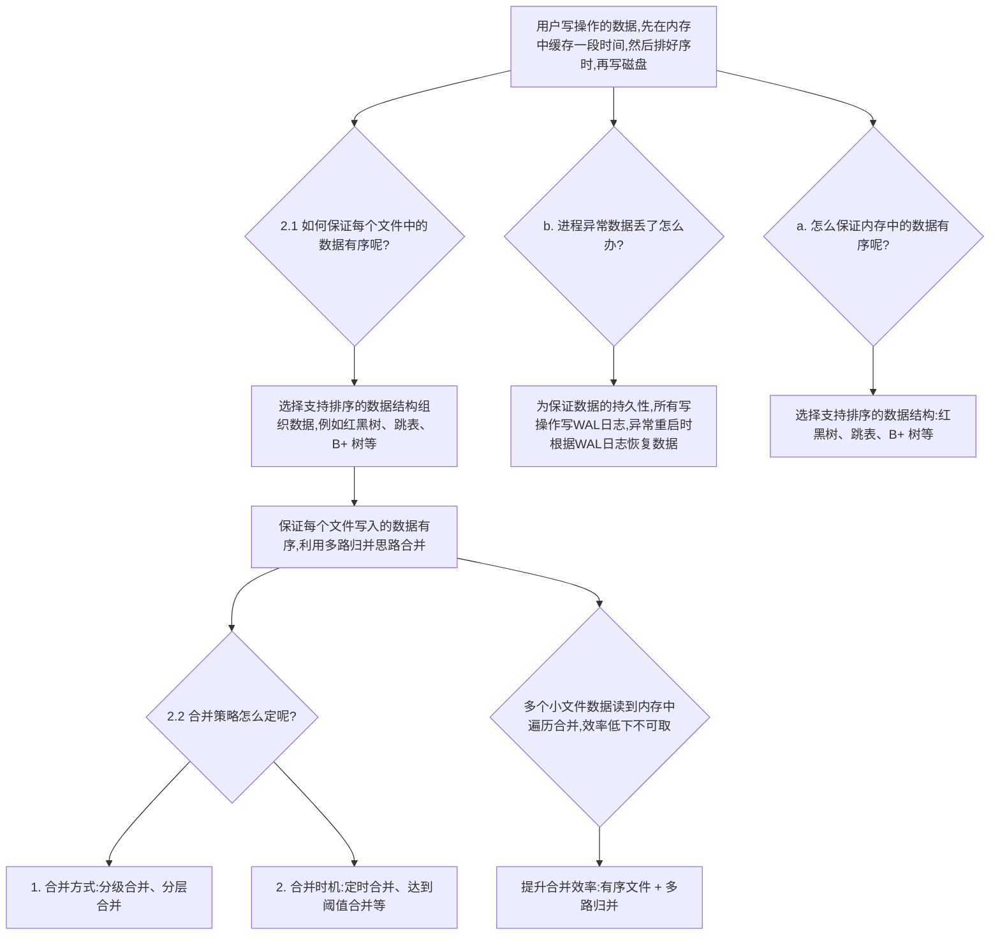
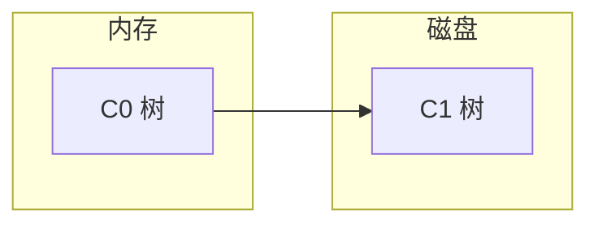
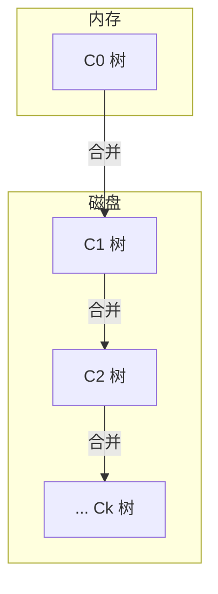

# 7. 深入理解LSM Tree 原理

目前大部分的读者平常接触到的关于 LSM Tree 的资料，主要是各个网络平台上的博客文章，以及为数不多的几本书籍和论文。绝大部分的文章和书籍基本上都是侧重于介绍 LSM Tree 包含哪些模块（例如 [[MemTable]]、[[SSTable]]、[[WAL]] log 等）、每个模块的功能是什么，很少有文章告诉读者 LSM Tree 为什么包含这些模块。笔者认为，理解一项技术非常重要的一点是理解它产生的缘由、演变过程及它解决面临问题的思路，这些才是最核心和最本质的东西。只要理解了核心的原理，不管技术如何变化都可以以不变应万变。

本章主要包含三部分内容：7.1 节和 7.2 节侧重于解释 LSM Tree 为什么要这样设计、为什么包含这些模块；7.3 节介绍 LSM Tree 结构的演进过程；7.4 节重点分析 LSM Tree 的数据压缩/合并、数据分区、读/写空间放大问题，以及写放大优化这几个核心问题。每个 LSM Tree 的实现都会涉及这些内容，掌握它们能够更好地理解 LSM Tree 的内部原理。

> [!TIP]  
> 建议将 7.2 节和第 4 章 [[B+树]] 存储引擎的推导内容结合到一起对比理解，相信会对单机的 KV 存储引擎的设计原理有更加清晰的认识。

---

## 7.1 LSM Tree 的发展背景

在互联网发展早期，大部分存储系统主要处理读多写少的场景。绝大部分的数据存储使用 MySQL、Oracle 等关系数据库。近些年，云计算/大数据应用场景会包含一些离线处理数据的场景，在该场景中，数据的写入量远远大于数据的读取量。除了少部分情况外，大部分这类系统对数据的实时性读取要求不高。在上述应用场景下，出现了日志/时序存储系统、信息推荐系统、物联网数据采集系统、数据分析系统等。

- **日志/时序存储系统**  
  目前大部分互联网公司所提供的软件服务都有大量的前台和后台应用程序，它们在线不间断地提供服务。这些服务每天会产生大量的日志信息。一部分日志信息包含系统运行过程中的中间信息，需要存储以便进行服务监控、服务调度、问题定位和链路追踪等操作。另一些日志信息则可能涉及用户操作行为等信息。通常，一些非隐私信息也会被存储，以用于数据挖掘和统计分析，以便更好地为用户提供服务。  
  除了日志信息外，对线上服务而言，时序信息也是非常重要的。这类信息主要是在程序运行的各个阶段进行打点上报，比如服务的耗时监控、流量监控和负载监控等。在现如今的微服务系统和分布式系统中，这些信息尤为重要，自动化运维更是借助这些信息来实现的。  
  上述这两类系统最显著的特点是都属于写密集型应用，数据的写入量会远远大于读取量。每天数据的写入量巨大。

- **信息推荐系统**  
  近些年，推荐系统的兴起使得现在每个 App 中基本上都会有一个推荐栏目。这些栏目中的推荐流程大体类似，都会实时收集用户的行为信息（例如点赞、收藏、评论、点击、观看时长等），并将这些信息实时存储。之后离线对用户和待推荐的内容打标签。这些行为和标签信息每时每刻需要进行写入或更新，以方便为用户提供更优质的推荐效果和提升商业价值。在推荐场景中，数据的写入量远大于读取量。因此，推荐系统也属于典型的写密集型应用。

- **物联网数据采集系统**  
  对物联网设备而言，往往需要收集各种各样的数据来进行统计分析。以车联网系统为例，它是利用车载设备收集车辆运行时产生的各项数据，通过网络实时传输到车联网数据平台，在平台上进行动态统计分析和汇总。车联网场景所面临的数据特点是每时每刻都有大量的车辆终端不间断地并发写入海量数据，这些数据规模可以达到 TB 级甚至 PB 级。而对动态统计分析而言，它要求尽可能低延时地响应查询请求。总体来说，车联网场景中数据的写请求量也远远大于读请求量。同理，其他物联网系统也具有类似的特点。

- **数据分析系统**  
  目前互联网上有各种各样的平台型产品，包括电商平台、资讯平台、交通平台、通信平台等。每个平台背后都有一套数据分析系统，主要用于根据用户的行为挖掘用户的潜在兴趣，以提升平台的价值。这些数据主要来自用户在交互过程中产生的记录。数据分析系统会同时存储同一用户的多个交互信息。以电商平台为例，用户对一个商品可能会产生多个交互信息，如点击、浏览、收藏、加入购物车等。每个交互行为都会产生对应的信息，需要被存储。类似的例子还有很多。总体而言，数据分析系统中数据的写入量是平台用户量级的常数倍，而数据分析大部分是离线或近实时的分析。在这些数据分析系统中，数据的写入量通常也远大于读取量。

上述这些应用场景的共同特点是数据写入量远大于读取量。这类问题最经典的一种解决方案就是本章要介绍的主角——[[LSM Tree]]。下面用一句话来总结 LSM Tree：

> [!QUOTE]  
> LSM Tree 是一种处理写多读少场景的解决方案，通常用于构建写多读少的存储引擎。

前面介绍了 LSM Tree 产生的背景和用途。下一节将重点介绍 LSM Tree 的内部原理，揭示基于 LSM Tree 的存储引擎是如何解决写多读少问题的。

---

## 7.2 从零推导 LSM Tree

要想理解 LSM Tree 存储引擎的内部原理，仍然需要搞明白它内部的数据存储在哪里（内存还是磁盘），以及内部的数据如何存储这两大问题。换言之，只要能回答清楚以下三个子问题即可：

- LSM Tree 内部维护的数据选择何种存储介质存储？
- LSM Tree 如何处理写请求？
- LSM Tree 如何处理读请求？

本节将采用问答的方式来阐述 LSM Tree 的原理，帮助读者一步一步理解 LSM Tree。

### 7.2.1 存储介质的选择

[[易失性存储]] 的典型代表是内存，当机器断电后数据就会丢失，但数据访问速度较快；[[非易失性存储]] 的典型代表是磁盘，它的特点是断电后数据不丢失，但数据访问相对慢一些。二者对比可参见图 1-4。

对存储海量数据、保证数据可靠性的系统而言，容量是必须考虑的一方面，成本是要考虑的另一方。通过这两方面的考虑，选择硬盘/磁盘存储数据。在 1.2 节中介绍存储引擎时，曾将存储引擎中对一次普通的用户请求流程进行了抽象，请参考图 1-5。

### 7.2.2 写请求的处理

对磁盘的写操作而言，为了尽可能提升写磁盘的性能，会采用数据批量写及顺序写。对顺序写磁盘而言，最常见的一种方式就是追加写。在写多读少的场景下，为了尽可能地利用顺序写磁盘，可以简单地将存储引擎收到的上述写操作（增加、删除、修改）的数据全部追加到单个文件中，像写日志一样记录下来，以实现高效写磁盘的目标。为了区分不同的写操作，只需为每个写操作记录一个操作类型：add、update 或 del。假设用户写入的数据已经按照 TLV(k,v,op_type) 的格式组织在内存中，那么每来一条数据就将其追加写入磁盘即可。单个文件数据存储如图 7-1 所示。

```mermaid
flowchart LR
    subgraph 磁盘
        File[单个文件]
    end
    subgraph 内存
        API[API set(k,v) del(k,v) get(k,v)]
        Encode[对KV数据进行编/解码]
    end
    API --> Encode --> File
```

*图 7-1 单个文件数据存储*  
**图 7-1 描述**：内存中通过 API 接收 set、del、get 请求，对 KV 数据进行编/解码，然后将数据追加写入磁盘的单个文件。文件中按顺序存储着操作记录，例如 (k1,v1,add)、(k2,v2,add)、(k1,v1',update)、(k1,v1'',update)、(k1,v1',del) 等。

通过这个例子发现需要解决以下几个问题。

#### 1. 如何处理读请求

按照上述方式追加每条写入操作的数据后，已经保证了数据的高效写入。但是，如何处理读取操作成了一个新的难题。

实际上，为了处理读请求，需要在追加每条写操作时维护每条数据的索引信息。在这种方式中，索引信息既可以维护在内存中，也可以考虑将索引信息持久化到磁盘文件。索引信息一般也是键值（kv）对，k 通常是标识该条数据的关键字，而 v 即索引信息。该索引只需要包括该条数据是否已被删除，对未删除的数据还需要记录数据写在磁盘上的位置及数据的长度信息。

在查询时，首先获取索引信息，然后根据索引信息获取磁盘上对应的数据即可。索引信息的维护通常可以采用第 2 章中介绍的各种数据结构。

#### 2. 数据存在空间浪费

在上述例子中，最后剩余的数据实际上只有 (k2,v2) 这条了。因为 k1 最后被删除了，但是和 k1 相关的四条记录仍然存储在磁盘上。很多无效的数据占据着空间，导致磁盘空间利用率不高。这种情景称为[[空间放大]]，即一条数据的多条操作记录信息（其中最后一条有效，其他多条无效）占据着磁盘空间。如果不解决这种情况，时间长了会明显影响系统的正常运行和效率，所以必须进行优化处理。

一种自然会想到的做法是对文件中存储的数据进行整理。例如，每隔一段时间清理一次数据文件，清理掉多条记录中相同的数据和无用的数据。这个清理过程称为压缩或合并。只要通过压缩解决了无效数据造成的空间放大问题，前面介绍的方案就是可行的。

#### 3. 如何对数据进行压缩

实际上，只需要从头开始读取磁盘中的数据，然后在内存中使用哈希表类型的数据结构判断每条记录是否需要保留。对同一条数据而言，只需保留最新有效的一条记录即可。经过一遍整理后，内存中维护的数据就是最新的，最后将内存中整理后的数据写回磁盘即可。

在解决上述两个问题后，一般情况下这样的方式就可以正常工作了。但是，在进行数据压缩时还会面临其他问题。按照上述压缩过程压缩时，一方面会出现压缩过程阻塞新的写入和读取操作；另一方面每次的压缩都需要读取整个文件并逐个遍历。在这个过程中，数据压缩的时间复杂度为 O(N)。当数据量较大时，压缩会比较耗时。

经过分析后发现，压缩过程会阻塞新的写入和读取操作的根本原因在于最初设定的存储数据的文件只有一个。因此，在执行数据压缩时就需要暂停写入和读取，当压缩过程完成后继续处理读/写请求。实际上，在这种情况下，数据文件属于一种临界资源。当压缩和写入/读取同时出现时，就会阻塞。要解决这个问题也比较容易，只需要将一个大的数据文件在物理上划分成多个小数据文件。将数据分成多个文件存储后，在同一时刻只会有一个文件处理写请求。每当一个文件写入的数据满足一定条件后就关闭，后续不再对其修改，然后重新打开一个新文件进行写入数据。在数据压缩时，只需要对之前已经关闭的若干数据文件执行压缩。这样，压缩阻塞读/写的问题就得到了解决，压缩过程和读/写过程可以同时进行。改进后的过程如图 7-2 所示。

```mermaid
flowchart LR
    subgraph 改进前[单个文件数据存储]
        F1[file1: (k1,v1,add), (k2,v2,add), (k1,v1',update), (k1,v1'',update), (k1,v1',del)]
    end
    subgraph 改进后[多个小文件分段存储]
        F2[file2: (k1,v1,add), (k3,v3,add), (k2,v2',update), (k3,v3',update), (k4,v4,add)]
        F3[file3: (k2,v2,add), (k1,v1',del), (k1,v1',update), (k1,v1'',update)]
    end
    F1 --> 改进后
```

*图 7-2 多个小文件分段存储*  
**图 7-2 描述**：从单个文件数据存储改进为多个小文件分段存储。改进后，文件 file2 和 file3 各存储一段连续写入的数据，不再修改已关闭的文件。

> [!NOTE] 注意  
> 压缩阻塞读/写问题的核心改进点是，将原先存储数据的单个文件转为采用多个小文件进行存储，一个小文件存储一段数据。因此称这个过程为数据分段存储。

这样在理论上是可行的，但是又出现了如何对数据进行分段的问题。

#### 4. 如何对数据进行分段

每个文件存储一段数据。为了实现这个目标，最简单的方式是给每个文件设定一个大小阈值。如果当前处理写请求的文件，存储的数据空间超过设定的阈值后就关闭，然后重新打开一个新文件继续处理写请求。因此，通过对文件设定阈值大小可以解决数据分段的问题。

这样改进后，之前介绍的压缩过程不变，只不过压缩对象变成了之前关闭后的多个小文件。具体的压缩逻辑大致如下：

1. 按照文件关闭先后顺序倒序依次读取多个文件内容到内存。
2. 在内存中保留最新的数据（越后写入的数据越新）。
3. 将合并的数据写入新文件。

分段虽然解决了阻塞问题，但是压缩过程中依旧存在压缩耗时的问题。因为目前的压缩过程实际上就是一个串行遍历全量数据的过程。当存储的数据量越大时，压缩耗时就会被无限放大，成为系统的瓶颈。下面考虑如何解决这个问题。

#### 5. 如何解决压缩耗时的问题

压缩数据的过程本质上是将多个数据文件中存储的记录按照 k 维度进行合并，合并过程中相同 k 的数据最多保留一条记录。现在数据压缩时输入的是多个数据文件，输出至少是一个数据文件。然而，由于文件中存储的数据是按照写入时间顺序存储的，因此数据本身是乱序的，这就必须全部遍历一遍才能完成压缩，这也是导致压缩速度慢的原因。

如果能在送入压缩时保证多个文件的数据有序，就可以使用[[归并排序]]来完成压缩。归并排序的主要思想是将无序的数据划分成小的数据集，并对其排序，然后将排好序的数据集两两合并，合并后的数据集也是有序的。重复这个过程，直到最后只剩下一个数据集即可，此时排序过程就完成了。归并排序最简单的是两路归并，通常也可以扩展为多路归并。

因此，如果假设压缩时每个数据文件存储的数据已经有序，并且一次压缩时会输入多个数据文件，那么就可以按照多路归并的方式来执行压缩。通过多路归并来压缩数据能够提高效率，比之前的全量遍历压缩更加高效。

#### 6. 如何保证压缩时每个文件中的数据有序

**方案1**：在数据写入文件时就已排好序，数据有序地存储在文件中。  
**方案2**：数据无序存储在文件中，在压缩前对每个文件的数据进行排序。

如果采用方案2，只能借助于有序的索引结构来实现。但如果采用方案1，数据写入文件时就已排好序，既能支持外部范围查询，又能提升读取效率。因此，最终选择方案1 来保证每个文件中的数据有序，进而保证压缩时文件中的数据有序。

#### 7. 如何在顺序写磁盘的前提下，保证写入文件的数据是有序的

要想写入磁盘上的数据有序，就不能每来一条数据就追加一条数据。需要在内存中，借助有序的数据结构缓存写请求进来的数据，并将其排好序。当缓存的若干条数据占据的内存空间达到之前提到的文件阈值后，再将这些数据一次性顺序写入磁盘中。这样既兼顾了顺序写磁盘，又保证了最终写入磁盘的数据是有序的。

这种做法是可行的，但同时又引出了下面两个子问题：

1. 在内存中应该选择何种数据结构来缓存数据？
2. 如果数据在内存中缓存一段时间，但在缓存期间还未来得及刷盘，系统发生了异常导致数据丢失，又该如何处理？

只要解决了上述两个子问题，就可以采用这种方式。下面来看如何解决上述问题。

#### 8. 在内存中选择哪种数据结构来缓存数据

此处需要选择一种支持排序的数据结构。为了兼顾排序和读/写的时间复杂度，可以选择以下数据结构：AVL 树、[[红黑树]]、[[B树]]、[[B+树]]、[[跳表]]等。

#### 9. 数据未刷盘，如何处理因程序异常导致的数据丢失

针对这个问题，可以在将数据缓存到内存之前先备份一份数据。通常的做法是采用 [[WAL]] 日志进行备份，借助 WAL 文件来确保数据的持久性。在将数据写入内存中缓存之前，先将数据写入 WAL 文件。当系统异常重启时，再根据 WAL 日志中的数据进行恢复。

至此，数据存储模型相比之前发生了一些变化。不仅引入了内存中数据缓存的结构，而且引入了保证数据持久性的 WAL 日志结构，同时还将原先无序存储在数据文件中的数据转变为有序数据。

到此为止，不仅可以正常处理读/写请求，还能高效地完成数据压缩。但是仍有两个与压缩相关的小#### 10. 应该按照什么样的策略对数据进行压缩

一种方式是按照**大小分级压缩**，将较新且较小的 SSTable 文件连续合并到较旧且较大的 SSTable 文件中。另一种方式是按照**数据分层压缩**，将数据按照 k 的范围分裂成多个小的 SSTable 文件，在合并过程中将旧的数据移动到较低的层级中。后面将会对压缩策略进行详细介绍。

#### 11. 何时进行数据压缩

压缩的时机可以有很多。例如，当磁盘文件个数达到一定数目时启动压缩；再如，在分层压缩实现中，可以为每一层设定一个阈值，当存储的数据达到或超过阈值时就触发压缩；等等。

前面通过一系列自问自答的方式展开介绍了写过程。实际上，上述过程串在一起就是 LSM Tree 的雏形。上面一步一步开始分析并最终得到了 LSM Tree 的基本结构。整个推导过程如图 7-3 所示。



*图 7-3 数据写过程推导总结（详见彩插）*  
**图 7-3 描述**：该图总结了从用户写操作到最终 LSM Tree 雏形的推导过程，涵盖了如何保证内存和文件数据有序、如何解决数据丢失、如何提升合并效率以及合并策略和时机的选择。

最后，总结一下 LSM Tree 处理写请求的过程。完整的写请求过程如图 7-4 所示。

```mermaid
flowchart LR
    subgraph 用户
        Write[write del(k) set(k,v)]
    end
    subgraph 内存
        Mem[MemTable]
        Imm[ImmuMemTable]
    end
    subgraph 磁盘
        WAL[日志数据 WAL log]
        SST[SSTable 磁盘数据]
    end
    Write -->|1. 记录日志| WAL
    Write -->|2. 写MemTable| Mem
    Mem -->|3. MemTable 达到阈值后转为ImmuMemTable,并打开新的MemTable 负责新的写操作| Imm
    Imm -->|4. 将ImmuMemTable 刷盘,变成SSTable| SST
```

*图 7-4 写请求过程*  
**图 7-4 描述**：当 LSM Tree 收到一次写请求时，内部首先会将该条数据记录到 WAL 日志文件中，以确保该条数据持久化。接着该条数据会写入 MemTable 中。当 WAL log 和 MemTable 都写成功后，本次写请求就完成了。当 MemTable 达到阈值后，转为 ImmuMemTable，并打开新的 MemTable 负责新的写操作，最后将 ImmuMemTable 刷盘成为 SSTable。

读者可以结合图 7-4 进一步理解写请求的完整过程。

### 7.2.3 读请求的处理

一个数据的流转顺序是先缓存在 MemTable 中，当 MemTable 满了以后再转变为 ImmuMemTable，ImmuMemTable 中的数据最终再被持久化到磁盘的 SSTable 文件中。这也就确定了数据新旧的一个规律：MemTable 数据最新、ImmuMemTable 数据次新、SSTable 数据最旧。如果是分层压缩的话，SSTable 数据又可以按照层级来划分，层级越大数据越旧。

而对读请求而言，它只需要访问获取最新的数据即可。因此，在 LSM Tree 中读取数据时始终遵循一个核心原则：数据是追加写入的，所以按照倒序的方式读取最新的数据，一旦读取到数据，则停止读取逻辑。一次读请求过程如图 7-5 所示。

```mermaid
flowchart LR
    subgraph 用户
        Read[read range(k1,k2) get(k)]
    end
    subgraph 内存
        Mem[MemTable]
        Imm[ImmuMemTable]
    end
    subgraph 磁盘
        WAL[日志数据 WAL log]
        SST[SSTable 磁盘数据]
    end
    Read -->|1. 先读MemTable| Mem
    Mem -->|2. MemTable 没读到,再读ImmuMemTable| Imm
    Imm -->|3. ImmuMemTable 没读到,再从SSTable 中读取| SST
```

*图 7-5 读请求过程*  
**图 7-5 描述**：读请求时，首先读取 MemTable；如果没读到，再读取 ImmuMemTable；如果仍然没读到，则从 SSTable 中读取。一旦读取到数据，则停止读取逻辑。

> [!NOTE]  
> 第 9 章将对读取过程进行详细介绍。比如 SSTable 中读取数据的逻辑设计到具体实现，又如 SSTable 的数据是按照大小分级组织还是按照分层关系组织。此外，当初选择在写入文件时数据就已经有序，因此关注点主要在读取 SSTable 时如何提高读取的效率。

考虑一种极端情况，假设要读取的数据根本就不存在，那么在读取非常多的 SSTable 文件后才能确定数据不存在。当 LSM Tree 中存储的数据量较大时，查找效率极低。为了优化这种边界条件下的读取性能，工程实现时，会采用[[布隆过滤器]]来加速读取。每个 SSTable 会维护一个布隆过滤器。当查找每个 SSTable 时，首先会根据布隆过滤器来拦截一次。如果布隆过滤器检测到当前读取的数据不存在，那么该条待读取的数据就一定不存在于当前的 SSTable 中。通过提前拦截一次来加快读取效率。注意：布隆过滤器存在误判的情况（例如判断某条数据存在，但实际上该条数据最后不存在），所以在实际使用时，需要合理设置布隆过滤器的几个关键参数以尽可能降低这种概率。

实际上，在搞清楚数据写入的逻辑后，读取就是相对简单的一个过程。其本质就是写入操作的逆过程。数据怎么写的就怎么读而已。

在此声明，本节内容是笔者接触和学习 LSM Tree 过程中所思所想的整理记录，通过步步推导的方式，帮助读者更好、更深入地理解 LSM Tree 原理。由于笔者水平有限，如果读者在阅读上述内容的过程中发现了问题或者错误之处，欢迎交流指正。下一节笔者将带领读者一起了解 LSM Tree 在实际环境中的架构演进。

---

## 7.3 LSM Tree 的架构演进

7.2 节从最基本的问题入手，逐步推导了一种解决写多读少场景的存储方案。实际上，对 LSM Tree 有所了解的读者可能会发现，最后推导出来的结果就是 LSM Tree。然而 LSM Tree 早被计算机研究人员正式提出了。因此，本节将从学术的角度重新认识 LSM Tree，以更全面的视角来理解它。

LSM Tree 的架构与计算机系统中的其他架构一样，旨在更好地解决工程问题，经过不断改进最终成熟。本节将从数据更新分类、LSM Tree 的架构演变及 LSM Tree 的核心问题三个方面展开介绍。

### 7.3.1 数据更新分类

在计算机中，通常将数据的更新策略按照是否采用覆盖的方式划分为两类：**原地更新（In-place Update）** 和 **非原地更新（Out-of-place Update）**。

- **原地更新**：是指对于同一条数据的更新，使用新数据来覆盖旧数据。在系统中，只会保存最新的一份数据。[[B+树]]存储引擎是原地更新的典型实现方式。原地更新可以看作为数据读取做了优化。在这类系统中，查询非常简单，只需要根据查询的关键字定位到该条数据，然后返回即可。但是其写入性能会比较低，因为需要涉及比较频繁的磁盘随机写入。原地更新的示意图如图 7-6a 所示。

- **非原地更新**：是指对于一条数据的更新，不是采用覆盖旧数据的方式实现，而是将其最新的数据保存下来，并同时更新索引指向当前最新的数据。LSM Tree 存储引擎是非原地更新的典型实现方式。在非原地更新中，数据的更新操作不需要事先查找之前的旧数据然后覆盖，因此写入操作非常快。但是，它带来的问题是系统中会分散存储着同一条数据的多个版本，这也使得在处理查询请求时，无法快速锁定待查询的数据在哪一个文件中。因此，往往需要按照存储数据新旧的次序逐步查找，从而导致查询性能相比于原地更新会低一些。非原地更新的示意图如图 7-6b 所示。

```mermaid
flowchart LR
    subgraph a[原地更新]
        direction LR
        A1[(k1,v1) (k2,v2) (k3,v3)] --> A2[(k1,v4) (k2,v2) (k3,v3)]
    end
    subgraph b[非原地更新]
        direction LR
        B1[(k1,v1) (k2,v2) (k3,v3)] --> B2[(k1,v1) (k2,v2) (k3,v3) (k1,v4)]
    end
```

*图 7-6 数据更新策略*  
**图 7-6 描述**：a) 原地更新：用新数据 (k1,v4) 覆盖旧数据 (k1,v1)；b) 非原地更新：将新数据 (k1,v4) 追加存储，保留旧数据 (k1,v1) 等多个版本。

非原地更新自 20 世纪 70 年代以来就不断地应用于数据库系统和操作系统中。最早的 diff 文件就是非原地更新的应用案例，在它的设计中所有的更新会写入一个 diff 文件中，然后该文件会和主文件进行定期的合并。

后来 PostgreSQL 数据库就大胆实践了日志结构存储，同时日志结构文件系统（LFS）也尝试了类似的思路，通过非原地更新的方式来利用磁盘的写入带宽，提升系统性能。

LSM Tree 本意是日志结构合并树。它是 Patrick O'Neil 和 Edward Cheng 在 1996 年发表的一篇论文 "The Log-Structured Merge-Tree (LSM-Tree)"（下面简称为论文1）中首次提出的。其名称取自于日志结构文件系统。从数据更新的层面来看，LSM Tree 是非原地更新的典型实现。

论文1 详细介绍了双组件 LSM Tree 结构和多组件 LSM Tree 结构。随着技术的不断发展，现如今的 LSM Tree 已经在多组件 LSM Tree 结构的基础上衍生出来了诸多版本，尤其是近些年较流行的 LevelDB/RocksDB 架构，基本上已经成了 LSM Tree 的代名词。下面将分别介绍这三种 LSM Tree 结构，以此说明 LSM Tree 的演进之路。

### 7.3.2 双组件 LSM Tree 结构

在论文1 最初提到的双组件 LSM Tree 结构中，包含 C0 和 C1 两个组件。C0 是内存组件，C1 是磁盘组件，它们都是类树的数据结构。每次写入数据时，都会先写入 WAL 日志文件，以确保数据的持久性，同时在记录完日志后将数据缓存在 C0 组件中。在将来的某个时间，数据会被转移到 C1 组件中。查询时首先在 C0 中查找，然后在 C1 中查找。这种双组件的结构如图 7-7 所示。C1 树一般具有类似于 B+ 树的目录结构，但是它对顺序写的磁盘访问进行了优化，所有节点数据都是 100% 满的。



*图 7-7 双组件 LSM Tree 结构*  
**图 7-7 描述**：双组件 LSM Tree 由内存中的 C0 树和磁盘上的 C1 树组成。

写入一条数据到 C0 组件中的开销非常小，但是将 C0 保存到内存中的成本比保存到磁盘中高太多，这也导致 C0 组件必须有大小限制。为了解决这个问题，引入了滚动合并机制。

当 C0 所占内存空间超过指定的阈值后，就会启动滚动合并过程，将 C0 组件中的一些连续数据合并到 C1 组件中。合并完成后，这些数据就可以从 C0 中删除，释放 C0 占用的空间。

C0 和 C1 采用类树的数据结构实现。在滚动合并之前，它们的结构如图 7-8a 所示。当往 C0 树中添加一条数据后触发了阈值限制时，就需要启动滚动合并。滚动合并的第一步是选择 C0 树中的子树，第二步是在 C1 上选择相应的子树。两棵子树都确定后，就对这两棵子树进行合并。由于选择的 C0 子树和 C1 子树都是有序的，因此在合并时，通过不断更新两个迭代器来实现，合并后产生的结果也是有序的。合并后的结果会组织成 C1 树的新子树，用来替换 C1 合并前的子树。最终，新子树会写入 C1 磁盘，同时合并前 C0 和 C1 选择的子树会被删除。滚动合并的过程如图 7-8b 所示。

```mermaid
flowchart TD
    subgraph a[滚动合并前]
        direction TB
        C0a[C0 树] -.- 内存标记
        C1a[C1 树] -.- 磁盘标记
    end
    subgraph b[滚动合并后]
        direction TB
        C0b[C0 树] -.- 内存标记2
        C1b[C1 树(新子树替换旧子树)] -.- 磁盘标记2
    end
    a -->|滚动合并| b
```

*图 7-8 双组件 LSM Tree 的滚动合并过程*  
**图 7-8 描述**：a) 滚动合并前：C0 树和 C1 树各自独立；b) 滚动合并后：C0 中的子树与 C1 中的对应子树合并，生成新子树替换 C1 中的旧子树，同时 C0 中的该子树被删除。

在合并过程中，有两个点需要保证：
1. C0 子树和 C1 子树在合并过程中都需要保证能够正常处理查询操作。
2. 在合并完成后，新子树的刷写磁盘、C0 子树和 C1 子树的删除这两个操作需要保证原子性。

在双层 LSM Tree 结构中，始终只有一个磁盘文件，因此对于数据查询而言效率更高，但它最大的问题是由 C0 组件触发的合并相对频繁，导致[[写放大]]问题比较严重。如果要减少合并的频率，则 C0 组件又会占据非常大的内存空间。因此，在成本和性能的权衡下，双组件 LSM Tree 结构演变成了多组件 LSM Tree 结构。

### 7.3.3 多组件 LSM Tree 结构

论文1 指出，在多组件 LSM Tree 结构中，内存组件仍然只有 C0 一个，但其磁盘组件设计为多个。对于由 K+1 个组件组成的 LSM Tree，它包含 C0, C1, C2, …, Ck–1, Ck 组件。它们是大小递增的索引树结构，每个组件都会设置一个阈值。在系统不断接收写操作的过程中，上述所有组件对之间均会发生异步滚动合并过程。每次当较小的 Ci–1 超过其阈值大小后，会将一部分数据从较小的组件转移到较大的组件中。通常把这种组件对之间的滚动合并过程称为**水平合并策略（Leveling Merge Policy）**。在这种结构中对于一条生命周期比较长的数据而言，它会首先存储在 C0 组件中，然后通过一系列的异步滚动合并操作，最终转移到 Ck 组件中。多组件 LSM Tree 结构如图 7-9 所示。



*图 7-9 多组件 LSM Tree 结构*  
**图 7-9 描述**：多组件 LSM Tree 由内存中的 C0 树和磁盘上的多级引入多组件 LSM Tree 是为了平衡双组件 LSM Tree 中的成本和性能开销。在论文1 中还提到，在稳定的工作负载下，层数保持不变时，当所有相邻组件之间的大小比 

|

# 7. 深入理解LSM Tree原理

这个原则影响了后来几乎所有LSM Tree的实现和改进。

在论文1中提到的这种多组件LSM Tree结构的滚动合并过程中，需要考虑的细节非常多，实现比较复杂。这也导致了基于论文中提出的这种结构在工程上落地的项目比较少。LSM Tree的实现更多是在此基础上进行的改进。下面来介绍目前采用最多的LSM Tree结构。

## 7.3.4 实际的LSM Tree结构

如今基于LSM Tree实现的项目非常多，它们无一例外都是在前面介绍的多组件LSM Tree结构的基础上改进实现的。它们之间的差异，一方面表现在磁盘组件的划分上，另一方面表现在数据的合并机制上。本小节将着重介绍第一个差异，关于数据的合并机制部分将会在7.4节中详细展开。

现在的LSM Tree结构由至少一个内存组件和多个磁盘组件组成。数据写入时也是先写入内存组件中，并同时记录日志数据以保证数据的可靠性。当内存组件所占用的内存空间达到设定的阈值时，需要对内存组件进行处理。通常的做法是，关闭当前的内存组件并重新创建一个新的内存组件来处理写操作。关闭的内存组件处于只读状态，某个时间点之后会将该内存组件中的全部数据异步写入磁盘上形成一个磁盘组件。这个过程在很多实现中被称为Minor压缩（Minor Compact）。对写操作非常频繁的系统而言，发生多次异步写入后，磁盘上会形成多个磁盘组件。随着时间的推移，文件个数会越来越多，这也为数据的读取带来了困难。为了缓解这个问题，如今的LSM Tree还会按照一定策略对多个磁盘上的组件进行周期性地合并压缩，以确保磁盘上的文件个数维持在相对稳定的数量。在压缩过程中，首先会选择几个磁盘组件，接着读取它们的内容并进行数据的合并处理，最后将合并后的数据写入新的磁盘文件中。当压缩合并过程完成后，旧的磁盘组件就可以删除了，以释放磁盘空间。磁盘组件之间的压缩合并过程在一些实现中也称为Major压缩（Major Compact）。实际的LSM Tree结构如图7-10所示。

> [!INFO] 图7-10 实际的LSM Tree结构  
> 图中展示了内存中的MemTable和WAL日志，以及磁盘上多层SSTable的存储结构，并通过Compaction过程进行数据合并与压缩。

在上述结构中，内存组件和磁盘组件分别称为MemTable（内存表）和SSTable（磁盘表）。

### 1. MemTable

MemTable主要指在内存中缓存写入的数据。同一时刻只会有一个MemTable处理写操作。通常它所选择的数据结构是跳表、B+树等。触发MemTable中的数据写入磁盘形成SSTable的条件通常有两个：一是当MemTable中存储的数据所占的内存空间达到指定的阈值后就触发；二是根据时间间隔定期触发。为了保证MemTable刷盘不会阻塞写操作，当达到触发条件后通常不会立即同步写磁盘，而是重新创建一个新的MemTable来正常接收新的写操作，并同步关闭旧的MemTable，以使其变成只读状态。这两个操作必须保证原子性执行。只读状态的MemTable也称为ImmuMemTable。在ImmuMemTable被完全写入磁盘之前，可以正常处理读取请求；在ImmuMemTable写入磁盘后，内存空间会被释放，同时这个ImmuMemTable被磁盘上的一个新的SSTable代替。在这个过程中需要注意的是，当ImmuMemTable写磁盘完成后，与之对应的WAL日志段也可以被释放掉了。

### 2. SSTable

SSTable通常会出现两种情况：第一种情况是由内存中的ImmuMemTable写入磁盘得到；另一种情况是为了维持SSTable数量而周期性地对旧的SSTable文件进行数据压缩合并，形成新的SSTable。虽然不同LSM Tree实现中的SSTable的格式有所不同，但可以确定的是，无论哪种方式形成的SSTable，SSTable文件中保存的数据始终是有序的。这样做的好处是：一方面可以高效地处理后续的查询请求（点查询和范围查询），另一方面也可以实现高效的数据压缩/合并。

实际的LSM Tree中各组件内部的数据扭转过程及各阶段对应的读/写状态，如图7-11所示。

> [!INFO] 图7-11 实际的LSM Tree中各组件内部的数据扭转过程及各阶段对应的读/写状态  
> 图中展示了写入请求经过WAL、MemTable、Immutable MemTable、Minor Compact生成Level 0 SSTable，再经过Major Compact合并到下层，以及读取请求从MemTable、Immutable MemTable到各级SSTable的查询路径。

## 7.4 LSM Tree的核心问题

在一些书籍或者文章中，也把数据压缩称为数据合并，本书统称为数据压缩/合并。实际上，在LSM Tree中，数据压缩/合并非常关键。在数据压缩/合并的过程中，非常消耗系统的CPU、内存、磁盘I/O等硬件资源。一旦处理不当，很容易成为系统的瓶颈。此外，频繁的数据压缩/合并必然会给系统的正常运行带来严重影响。本节将从数据压缩/合并、数据分区、放大问题（读放大、写放大、空间放大）及写放大优化这四个方面展开介绍，分析LSM Tree的核心问题。

### 7.4.1 数据压缩/合并

为了避免磁盘上的SSTable数量过多影响查询性能，LSM Tree引入了周期性对磁盘上的SSTable进行压缩合并的功能。为了保证系统正常、稳定运行，数据压缩/合并的过程需要非常精细化的设计。在论文“LSM-based Storage Techniques: A Survey”（下面简称为论文2）中提到，在LSM Tree的实现中，数据压缩/合并通常划分为两种策略：水平合并策略（Leveling Merge Policy）和分层合并策略（Tiering Merge Policy）。

#### 1. 水平合并策略

在水平合并策略中，每层只维护一个组件，每层的组件都会指定一个阈值。相邻的组件之间的大小比例为T。当Level L–1的组件超过其阈值大小后，它将会和Level L的组件进行合并。对于Level L的组件而言，这样的合并可能会发生多次，直到最后Level L的组件被填满。当填满以后，Level L的组件又会被合并到Level L+1中。例如，在图7-12a中，Level 0的组件与Level 1的组件发生了合并，从而导致Level 1的组件变得更大。

#### 2. 分层合并策略

在分层合并策略中，每层维护T个组件。当Level L的组件满时，它的T个组件会合并成一个组件并移动到Level L+1。如图7-12b所示，T为2，两个Level 0的组件合并在一起并移动到Level 1中，成为Level 1层的新组件。需要注意的是，如果发生合并的层数已经是最大层，那么此时合并后的组件仍然保留在该层。

在上述两种压缩/合并策略中，对于插入量等于删除量的应用场景，当层数保持不变时，一般来说，水平合并策略会优化查询的性能，因为在水平合并策略的LSM Tree中要查询的组件更少。而分层合并策略则更有利于写入的优化，因为它降低了数据压缩/合并的频率。

> [!INFO] 图7-12 数据压缩/合并策略  
> (a) 水平合并策略（每层一个SSTable文件）  
> (b) 分层合并策略（每层最多T个SSTable文件）  
> 两图展示了合并前和合并后的键范围变化。

### 7.4.2 数据分区

论文2中提到了与数据压缩/合并相对应的另一个功能——数据分区。数据分区通常用于优化数据压缩/合并和查询，是一个非常重要的手段。其本意是将LSM Tree中的磁盘组件按照范围划分为多个分区。这些分区通常是按固定大小划分。通过分区，可以将每一层上的大组件合理地拆分为多个小组件。在分区处理后：一方面可以有效减少压缩/合并过程中所消耗的时间，同时能充分利用磁盘空间创建新的合并后的组件；另一方面，可以通过只合并范围重叠的组件来优化写倾斜或者顺序键值写入的场景。在写倾斜的场景中，更新频率较低范围的组件对应的合并频率也会大幅降低。而在顺序键值写入的场景中，则可以避免压缩/合并操作，因为没有键的范围重叠。

在LSM Tree结构中，通常数据分区和数据压缩/合并策略是相互组合使用的，即水平合并策略和分层合并策略都可以结合数据分区的特性。在目前的工业级实现中，LevelDB/RocksDB是基于分区水平合并策略实现的。此外，一些论文也提出了各种分区分层合并策略以获得更好的写性能。

#### 1. 分区水平合并策略

在LevelDB采用的分区水平合并策略中，除了Level 0层外，它将每一层的大磁盘SSTable组件，按照键的范围划分成固定大小的多个小的磁盘SSTable组件。每个组件都会标注其存储的数据的范围，包括最小值、最大值等。Level 0层的磁盘组件是由内存组件ImmuMemTable直接写入磁盘形成的，因此它们之间数据是存在重叠范围的，所以没法对它们进行分区。如果要将Level T层的部分组件合并到Level T+1层时，只需要根据Level T层所要合并的磁盘组件所覆盖的范围来选择Level T+1层所有范围重叠的SSTable组件。然后将这两层选择出来的SSTable进行合并，合并后生成的新的SSTable写入Level T+1层即可。这种分区水平合并策略的过程如图7-13所示。Level 1中0～30的SSTable要合并到Level 2中，因此在Level 2中选择和0～30范围重叠的所有SSTable，发现只有0～15、16～32这两个。接着将这三个SSTable进行合并，合并后在Level 2中生成了范围分别是0～10、11～19、20～32的三个新的SSTable组件。合并操作完成后，合并前旧的SSTable集合会被删除。在LevelDB中，为了尽可能最小化写操作的开销，采用循环的策略来选择每个Level要合并的SSTable。当然，在其他的LSM Tree系统实现中也可以选择不同的策略来解决这个问题。

> [!INFO] 图7-13 分区水平合并策略  
> (a) 合并前 (b) 合并后  
> 图中展示了Level 1中0~30的SSTable与Level 2中0~15、16~32的SSTable合并，生成新的0~10、11~19、20~32的SSTable，并标明合并前选中的SSTable和合并后生成的SSTable。

#### 2. 分区分层合并策略

分区分层合并策略是指在分层合并策略的基础上，结合数据分区特性。在分层合并策略中，每一层都包含固定数量的SSTable，它们的键范围有可能重叠。因此，在结合数据分区后，同一层和不同层之间可能存在键范围重叠的情况。为了保证正确性，需要按照一定的方式组织并排序这些分区后的SSTable。在每一层上，有垂直分组和水平分组两种方案来组织分区后的SSTable。所有SSTable都按照这两种方案中的一种进行组织，以分组为单位。

##### （1）垂直分组

垂直分组是指将同一层中键范围重叠的SSTable组织在一个分组中，分组之间不存在键范围重叠。实际上，这种情况跟分区水平合并策略类似，只不过每一个分区从之前的一个SSTable变成了多个SSTable而已。垂直分组的过程如图7-14所示。垂直分组以后，在进行数据合并时，每次将同一个分组中的所有SSTable进行合并，合并后生成新的SSTable移动到下一个层中。在移动时需要按照下一层组中的键范围重叠情况对合并后新的SSTable进行处理，可能会存在拆分SSTable的情况。如在图7-14中，将Level 1第一个分组中的0～31和0～30两个SSTable进行合并，合并后生成键范围为0～31的SSTable，将它移动到Level 2中。而此时Level 2中并不存在一个键范围为0～31的分组，该范围横跨了两个分组，所以就需要将该SSTable进行拆分。拆分成0～12和17～31这两个SSTable，然后将它们分别依次加入Level 2的两个分组中。由合并过程可以发现合并前后SSTable之间的区别：在合并之前，如果有一个查询请求正在执行，那么就需要同时检查这两个SSTable；而合并后，则只需要检查其中一个SSTable即可。因为合并前的两个SSTable是存在键范围重叠的，而合并后的两个SSTable不存在键范围重叠。

> [!INFO] 图7-14 分区分层垂直分组  
> (a) 合并前 (b) 合并后  
> 图中展示了Level 1的第一个分组（0~31, 0~30）与Level 2的两个分组（0~15, 16~32；35~50, 51~70等）合并，生成新的分组和SSTable。

##### （2）水平分组

在水平分组中，每个SSTable按照键范围划分成多个固定大小的SSTable。这些SSTable作为一个组。因为在水平分组中，每一层会包含多个组，而每一层内会维护一个活跃组，该组接收来自上一层合并后的SSTable。合并操作是从上一层的多个组中选择出键范围重叠的所有SSTable，然后将它们合并，合并后形成的新的SSTable会写入下一层的活跃组中，在写入时同样要按照固定大小进行划分。水平分组的过程如图7-15所示。

> [!INFO] 图7-15 分区分层水平分组示意图  
> (a) 合并前 (b) 合并后  
> 图中展示了Level 1中34~70组和35~65组合并后移动到Level 2，并按固定大小拆分为34~55、57~70两个SSTable组。

在图7-15中，Level 1存在34～70组和35～65组，将这两个键范围重叠的SSTable合并后，生成新的键范围为34～70的SSTable，同时需要将该SSTable移动到Level 2层中。然而该SSTable的大小超过了固定大小，因此在移动过去后还需要按照大小将其划分为34～55、57～70这两个SSTable组。尽管SSTable是固定大小的，但实际上在同一层的不同组中，SSTable可能会存在键范围重叠的情况。因此，在处理查询请求时，在每一层可能都需要查询多个SSTable来确定查询结果。

### 7.4.3 读放大、写放大和空间放大

在数据存储领域中，经常会涉及三个话题：读放大、写放大和空间放大。

> [!NOTE] **读放大**：是指理论上查询操作所需的磁盘I/O次数与实际查询所用的磁盘I/O次数不相同。通常，实际值大于理论值。因此，这种情况称为读放大。实际值除以理论值就称为读放大的倍数。

> [!NOTE] **写放大**：是指理论上写入操作将某条数据写入磁盘所需的磁盘I/O次数跟实际上某条数据写入磁盘所用的磁盘I/O次数不相等。通常，实际值大于理论值。因此，这种情况称为写放大。实际值除以理论值就称为写放大的倍数。

> [!NOTE] **空间放大**：是指理论上存储某条数据所占的空间与实际上磁盘存储该条数据所占用空间不相同。同样，通常是实际值大于理论值，因此这种情况称为空间放大。实际值除以理论值就称为空间放大的倍数。

在LSM Tree中在LSM Tree中，读放大是由于一次查询操作可能需要读取多个磁盘上的SSTable文件而引起的。而空间放大是因为LSM Tree本身所采用的非原地更新的机制而引起的，即一条数据的多次变更操作会在磁盘上存储多条记录。那么，在LSM Tree中的写放大又是如何产生的呢？

在存储领域，有一种综合考虑了读取、更新、内存开销的非常流行的存储结构开销模型——RUM猜想。RUM猜想提出，在上述三个维度中，一旦减少了其中两个维度的开销，则将会导致另外一个维度开销的增加。也就是说，理论上不存在一种存储结构可以保证这三个维度的开销均最优。而这三个维度的开销其实可以看作读放大、写放大、空间放大的另一种表现。

B+树存储引擎是原地更新数据的，对于一条数据的多次写入，它都需要首先在磁盘上找到该条数据，然后再进行内存中的更新，最后写回磁盘中。这个过程可能会涉及多次更新磁盘页。同时，在每个磁盘页上还会提前预留一些空间，以备将来处理更新或者删除操作。而数据读取则非常简单，只需要在磁盘上找到对应数据返回即可。因此，在B+树存储引擎中，读放大较小，而写放大较大。因此，它可以看作针对读取优化的。

而LSM Tree存储引擎是非原地更新的，同一条写入的数据会在磁盘上存储多条记录，导致了同一条数据会占用超过其自身所需的额外的空间，从而产生空间放大。而在数据读取时，通常需要检测多个磁盘文件才能确定最终查找的结果。因此，读放大较为严重。虽然数据压缩/合并的引入在一定程度上缓解了读放大和空间放大，但又不可避免地带来了写放大。因此，目前很多研究都聚焦于如何优化LSM Tree的写放大问题。总体上来看，LSM Tree是针对写入优化的。这也是它适合处理写多读少场景的原因。

在Bradley C. Kuszmaul的论文“A Comparison of Fractal Trees to Log-Structured Merge (LSM) Trees”中，对B+树和LSM Tree的读放大、写放大、空间放大做了非常详细的定量计算。其中涉及的公式计算和推导比较复杂，也超出了本书的内容，这里不做展开。感兴趣的读者可以直接阅读该论文，进行深入了解。

### 7.4.4 写放大优化

目前，一些学者提出了关于优化LSM Tree中写放大的方案（例如“LSM-Tree优化写放大调研”（https://zhuanlan.zhihu.com/p/490963897）），其核心思路是减少数据压缩/合并。在这些研究中，最主要的两个技术方向是KV分离技术和延迟压缩技术。

#### 1. KV分离技术

KV分离技术能够降低写放大的主要原因在于存储介质的发展。早期的HDD顺序访问I/O和随机访问I/O差异非常大，这使得通过顺序I/O访问磁盘带来的读/写性能足以抵消写放大带来的开销。同时，HDD的使用寿命和对它的写入量并无直接关系。

随着SSD逐渐成为新一代存储介质，这种矛盾发生了转变。对SSD而言，它的顺序访问性能和随机访问性能相差不大，而SSD存储介质的使用寿命和对它的写入量直接相关，严重的写放大会大大降低SSD的使用寿命。因此，在以SSD作为存储介质的场景下，LSM Tree的写放大就显得尤为关键了。这也是KV分离技术能够有效降低写放大的最主要原因。

KV分离技术最早在Lanyue Lu的论文中被提出。论文中提到，WiscKey将Key和Value分离存储，Value用专门的vLog结构来存储，而LSM Tree结构中则保存Key和一个指向vLog中Value的指针。这样处理后，LSM Tree中存储的数据大大减少，同时在发生合并时Value也不会参与，有效降低了写放大。注意：vLog也需要定期进行数据合并，以释放空间。WiscKey是第一个采用KV分离技术来优化写放大的实现，带来了很多启示。Helen H. W. Chan等人在论文中提出的Hash KV也针对KV分离技术提出了一些新的尝试和改进。此外，目前工业界中实现的Titan、Badger、TerarkDB等也借鉴了KV分离的思路来优化写放大这一问题。关于WiscKey的详细内容将在第8章详细介绍。

#### 2. 延迟压缩技术

另一类改善写放大的技术是延迟压缩技术。这种技术的特点是所占用的磁盘空间较大，因此成本会增加。HyperLevelDB和PebblesDB是这种方案的主要实现代表。HyperLevelDB通过放弃SSTable的Level大小，寻找产生最小写放大的SSTable进行压缩，减少压缩频率。而PebblesDB则是在HyperLevelDB的基础上进一步改进，使用了FLSM Tree的磁盘数据结构，弱化数据的有序性，减少不必要的键范围重叠，从而在整体上减少数据参与压缩的次数，从而降低写放大。由于篇幅的限制，此处不再展开，感兴趣的读者可以进一步阅读相关资料。

## 7.5 小结

本章从三个方面简要介绍了LSM Tree的原理。首先从实际问题出发，通过层层推导的方式尝试还原LSM Tree的各个模块和组件。其次介绍了在学术界和工程界LSM Tree的架构演进。最后重点围绕LSM Tree中数据压缩/合并、数据分区、读/写/空间放大问题、写放大优化等几个核心问题进行了阐述。

那么，基于LSM Tree实现的项目有哪些？它们又是如何应用并改进LSM Tree的呢？除了LSM Tree以外还有其他的LSM模型和架构吗？这些问题将在第8章回答。