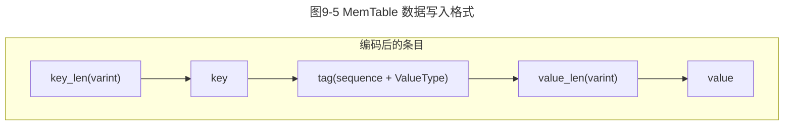
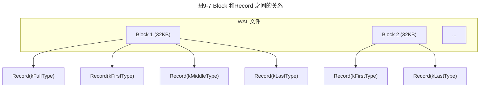

# 第9章 LevelDB 核心源码分析

第7、8 章花了大量的篇幅从理论层面介绍了LSM Tree 及LSM 派系存储引擎的基本原理。但存储引擎（不局限于KV 存储引擎）始终是一个侧重工程应用的计算机系统，因此掌握了理论知识后，最终还是要回归到工程应用上。

本章并没有从零开始编写一个简易版的LSM Tree 应用，理由有两点。
- 其一，虽然从零编写一个简易版的项目有助于理解原理，但也仅仅是帮助理解，因为这种项目没有经过生产环境的应用，一般在实际运行时会存在诸多问题。
- 其二，开源社区中有非常多基于LSM Tree 实现的项目，这些项目基本上都是真正在生产环境中经过考验的，功能上比较完备，正确性也有所保证。

因此，本书将以著名的开源项目LevelDB 为例，分析其核心机制。一方面，LevelDB 是基于C++ 实现的，整个项目的核心代码大约几千行，不算特别大，同时，它包含了LSM Tree 的核心功能；另一方面，基于LevelDB 实现的其他项目（如RocksDB 等）或者其他语言版本（Go-LevelDB），开源社区中也可以找到，因此本章内容对研究其他LSM Tree 项目的实现也有很大的帮助。

本章将结合前面所讲的理论，对LevelDB 的MemTable、SSTable、WAL 日志等组件的核心实现进行分析。

---

## 9.1 LevelDB 概述

本节首先简单介绍一下LevelDB 的整体架构，为后面源码分析做准备。然后，对LevelDB 项目的目录结构进行介绍，以便读者了解每个目录和文件的大体功能。

### 9.1.1 LevelDB 整体架构

图9-1 所示为LevelDB 的整体架构，它属于比较标准的LSM Tree 工程实现。内部的组件划分为内存组件（MemTable、ImmuMemTable）和磁盘组件（SSTable、WAL 日志）。除此之外，还有一些存储元信息的文件，例如Current、Manifest 等。下面分别对这些模块进行介绍。

```mermaid
graph TB
    subgraph 用户接口层
        A[Open() Put(k,v) Delete(k) Get(k)]
    end
    subgraph 内存层
        B[MemTable]
        C[ImmuMemTable]
        D[Write]
    end
    subgraph 磁盘层
        E[WAL 日志]
        F1[SSTable level0]
        F2[SSTable level1]
        F3[...]
        F4[SSTable levelN]
    end
    subgraph 元信息
        G[Current]
        H[Manifest]
    end
    A --> D
    D -->|1. 写WAL日志| E
    D -->|2. 写MemTable| B
    A -->|Read| B
    A -->|Read| C
    A -->|Read| F1
    A -->|Read| F2
    A -->|Read| F4
    B -->|Flush & Minor Compact| C
    C -->|Flush| F1
    F1 -->|Major Compact| F2
    F2 -->|Major Compact| F4
    F4 -->|Major Compact| ...
    linkStyle 0,1,2,3,4,5,6,7,8 stroke-width:2px,fill:none;
```

**图9-1 LevelDB 的整体架构（详见彩插）**

（1）**MemTable**
在LevelDB 中，MemTable 主要用于暂存数据，写请求传递进来的数据会先暂存到MemTable 中，后续经过一系列的处理最终落到磁盘上，LevelDB 选择跳表来实现。

（2）**ImmuMemTable**
当MemTable 所占的空间达到指定的阈值后，就会将它关闭并变成一个只读结构，该结构就是ImmuMemTable。它和MemTable 结构一模一样，唯一的区别是MemTable 可读可写，而ImmuMemTable 只可读。ImmuMemTable 会在后续被异步压缩/合并写入磁盘，形成一个SSTable。

（3）**WAL 日志**
WAL 日志（WAL Log）主要用来保证数据持久化和可靠性。LevelDB 在处理写请求时，先将写入的数据记录到WAL 日志中，然后将该数据写入MemTable。这两步完成后就可以直接返回了。当LevelDB 写入发生异常后，可以通过WAL 日志来恢复。通常WAL 日志的写操作是顺序写磁盘，因此写性能比较高。

（4）**SSTable**
LevelDB 中绝大部分的数据都是存储在磁盘上的，通过SSTable 来组织。LevelDB 对SSTable 的管理采用分区水平合并策略。SSTable 文件是分层存放的。第0 层的SSTable 是由ImmuMemTable 写入磁盘形成的，因而第0 层上的多个SSTable 之间有可能会出现数据范围重叠的情况。除了第0 层，其他每一层内的多个SSTable 是由旧的SSTable 合并而成的，同时每一层内的多个SSTable 之间不存在数据范围重叠的情况。关于LevelDB SSTable 管理这部分内容后面会详细介绍。

（5）**Manifest**
LevelDB 引入了版本（Version）的概念，每一个版本记录了所有层上的每个SSTable 的元数据，比如文件大小、该文件存储的数据范围中key 的最大值/最小值等。在处理查询请求时会用到该版本信息。此外，版本信息中还会存储一些压缩的相关信息，用来辅助压缩过程的执行。在每次完成压缩后LevelDB 都会生成新的版本。而新版本是由旧版本叠加版本变化信息生成的，用公式表示为：`VersionNew = VersionOld + VersionEdit`。Manifest 文件就是用来存储VersionEdit 信息的。VersionEdit 中主要记录了SSTable 的变更情况（新增、删除），以及其他一些压缩的相关信息。版本和Manifest 的相关内容，这里暂时大概了解一下，后面源码分析时会重点介绍。

（6）**Current**
Current 文件内容非常简单，它只维护LevelDB 中当前的Manifest 文件名。这是因为LevelDB 在每次初始化启动时都会生成新的Manifest 文件，这会导致系统可能存在多个Manifest 文件，所以需要通过Current 文件来记录当前生效的Manifest 文件是哪个。

在LevelDB 中核心的数据结构主要是MemTable、SSTable、WAL 日志，后面会分别对它们的内部结构和实现加以介绍。

### 9.1.2 LevelDB 项目结构

在开始阅读LevelDB 项目的源码前，可以通过GitHub 访问LevelDB 的代码仓库链接（<https://github.com/google/LevelDB.git>）来获取代码。按照项目的README.md 来下载代码到本地并编译。当项目下载到本地后，使用IDE（例如VS Code 等）打开后会看到如下目录。

1. **benchmarks/**。该目录下主要存放LevelDB 性能测试相关的代码，比如LevelDB 和SQLite3、TreeDB 的性能测试对比代码。
2. **include/LevelDB/**。该目录下定义了LevelDB 可供外部调用的接口、抽象接口、数据结构等，比如DB、Iterator、Cache 等。
   - `db.h`：该头文件定义了LevelDB 中DB 的Put(k,v)、Delete(k)、Get(k) 等抽象接口。
   - `options.h`：该头文件定义了LevelDB 的DB 配置，以及处理读/写操作时的配置参数。
   - `cache.h`：该头文件定义了缓存相关的接口，主要用来缓存SSTable。
   - `env.h`：该头文件定义了和操作系统环境相关的各种抽象接口。通过它来适配和移植不同的操作系统。
   - `iterator.h`：该头文件定义了迭代器相关的各个接口。通过它来遍历SkipList、MemTable、SSTable 等。
   - `table.h`：该头文件定义了SSTable 相关的函数。
   - `write_batch.h`：该头文件定义了WriteBatch 的核心接口。
   - `slice.h`：该头文件定义了Slice 这种新的数据类型，它以字节为存储单位。LevelDB 中的key 和value 均由Slice 来定义。
   - `status.h`：该头文件定义了错误处理的Status 类。
3. **db/**。该目录下包含了LevelDB 的核心接口的逻辑实现，例如MemTable、WAL 日志等。
   - `db_impl.h/db_impl.cc`：该文件定义了LevelDB 的DB 接口的实现类DBImpl，它也是LevelDB 的默认实现。
   - `db_iter.h/db_iter.cc`：该文件实现了DB 的迭代器。
   - `memtable.h/memtable.cc`：该文件实现了LevelDB 中的MemTable 结构。
   - `skiplist.h`：该文件实现了MemTable 内部用到的跳表。
   - `table_cache.h/table_cache.cc`：该文件实现了SSTable 的缓存逻辑，并使用了Cache 结构。
   - `log_writer.h/log_writer.cc`：该文件实现了WAL 日志的写入逻辑，在数据写入时调用。
   - `log_reader.h/log_reader.cc`：该文件实现了WAL 日志的读取逻辑，在恢复时调用。
   - `dbformat.h/dbformat.cc`：该文件定义了LevelDB 内部用到的一些数据结构，例如InternalKey、LookupKey、ParsedInternalKey、ValueType 等。
   - `version_edit.h/version_edit.cc`：该文件实现了LevelDB 版本变更过程中临时信息、元信息数据的存储。
   - `version_set.h/version_set.cc`：该文件定义了LevelDB 中多版本的实现逻辑。
4. **table/**。该目录下是SSTable 的核心实现代码。
   - `block.h/block.cc`：该文件定义了SSTable 中的Block 结构。
   - `block_builder.h/block_builder.cc`：该文件实现了在SSTable 中创建Block。
   - `filter_block.h/filter_block.cc`：该文件实现了SSTable 中Filter Block 的相关操作。
   - `format.h/format.cc`：该文件定义了SSTable 中Block 的格式，包括Block 的读/写和编/解码。
   - `merger.h/merger.cc`：该文件实现了SSTable 的合并。
   - `table_builder.cc`：该文件实现了生成SSTable。
   - `two_level_iterator.h/two_level_iterator.cc`：该文件实现了对SSTable 遍历的迭代器的核心逻辑。
5. **port/**。该目录下定义了通用的底层文件及基于各平台操作系统可移植的接口。
6. **third_party/**。该目录下主要是一些依赖的第三方库，比如性能测试、单元测试等。
7. **util/**。该目录下包含一些通用的工具类函数，比如布隆过滤器、内存分配、编码、缓存等。
8. **helpers/**。该目录下定义了LevelDB 中底层数据部分完全运行在内存的实现逻辑，主要用来测试或者模拟全内存场景。

可以看出，LevelDB 的目录结构还是非常清晰的。下面来探索LevelDB 不同模块的源码实现。

---

## 9.2 DB 核心接口分析

DB 是LevelDB 中抽象的一个结构，通过该结构，可以实现对LevelDB 的各种增删改查操作，其中封装了MemTable、SSTable 等结构。本节详细介绍DB 结构，并重点分析它的几个核心接口实现逻辑。

### 9.2.1 DB 结构

LevelDB 将存储引擎的核心功能抽象为DB 结构。DB 是一个抽象类，里面定义了LevelDB 的几个重要接口，例如Put(k,v)、Delete(k)、Get(k) 等。DB 接口的定义在`include/LevelDB/db.h` 文件中，具体代码如下所示。

```cpp
class LEVELDB_EXPORT DB {
  public:
  //  通过指定的文件名(name)打开一个DB 指针对象并存储到dbptr 中.通过返回值Status 来判断是否
  //  成功.当打开成功并完成功能后,需要手动释放该对象
   static Status Open(const Options& options, const std::string& name,
                     DB** dbptr);
  // 将<key,value> 加入LevelDB 中
  virtual Status Put(const WriteOptions& options, const Slice& key,
                     const Slice& value) = 0;
  // 从LevelDB 中删除key 对应的数据
  virtual Status Delete(const WriteOptions& options, const Slice& key) = 0;
  // 将updates batch 中的数据写入DB
  virtual Status Write(const WriteOptions& options, WriteBatch* updates) = 0;
  // 从LevelDB 中获取key 对应的数据,并存储到value 中
  virtual Status Get(const ReadOptions& options, const Slice& key,
                     std::string* value) = 0;
  // 迭代器接口
  virtual Iterator* NewIterator(const ReadOptions& options) = 0;
  // 获取快照接口
  virtual const Snapshot* GetSnapshot() = 0;
  // 释放快照接口
  virtual void ReleaseSnapshot(const Snapshot* snapshot) = 0;
}
```

LevelDB 通过`DBImpl` 类来实现DB 接口。`DBImpl` 位于`db/` 目录下的`db_impl.h/db_impl.cc` 文件中。一方面，该类实现了DB 接口中的所有虚函数；另一方面，它内部也包含了前面多次介绍的MemTable、SSTable、WAL 日志等结构。`DBImpl` 的结构定义如下所示。

```cpp
class DBImpl : public DB {
 public:
  // 构造函数和析构函数
  DBImpl(const Options& options, const std::string& dbname);
  ...
  //  DB 中重载的Put()、Delete()、Get()、NewIterator()、GetSnapshot()、ReleaseSnapshot()
  //  等接口
  Status Put(const WriteOptions&, const Slice& key,
             const Slice& value) override;
  Status Delete(const WriteOptions&, const Slice& key) override;
  // 这里省略其他重载接口
  // SSTable 缓存结构
  TableCache* const table_cache_;
  FileLock* db_lock_;
  // MemTable 结构
  MemTable* mem_;
  // ImmuMemTable 结构
  MemTable* imm_ GUARDED_BY(mutex_);  
  std::atomic<bool> has_imm_;         
  // WAL 日志结构
  WritableFile* logfile_;
  uint64_t logfile_number_ GUARDED_BY(mutex_);
  log::Writer* log_;
  uint32_t seed_ GUARDED_BY(mutex_);  
  // writer 队列
  std::deque<Writer*> writers_ GUARDED_BY(mutex_);
  WriteBatch* tmp_batch_ GUARDED_BY(mutex_);
  // 快照
  SnapshotList snapshots_ GUARDED_BY(mutex_);
  std::set<uint64_t> pending_outputs_ GUARDED_BY(mutex_);
  // 多版本结构
  VersionSet* const versions_ GUARDED_BY(mutex_);
  // 压缩信息统计
  CompactionStats stats_[config::kNumLevels] GUARDED_BY(mutex_);
};
```

在`DBImpl` 类中出现了非常熟悉的`MemTable`、`WritableFile` 等结构及对KV 操作的核心接口，要想调用这些接口就必须有DB 对象，因此下面先来看看如何创建一个### 9.2.2 Open(options, dbname, dbptr) 的实现

DB 对象的创建是通过一个静态方法 `Open()` 实现的。`Open()` 方法可以用来创建或打开一个数据库。该方法有 3 个参数：第一个参数指定了数据库创建或者打开时的行为，例如 `create_if_missing`、`error_if_exists` 等；第二个参数指定了数据库文件存放的路径和名称；第三个参数则是一个 `DB` 类型的指针，当数据库创建成功后，会将实际的指针赋值给该参数并返给调用者。`Open()` 方法的实现如下所示。

```cpp
Status DB::Open(const Options& options, const std::string& dbname, DB** dbptr) {
  *dbptr = nullptr;
  // 创建一个DBImpl 对象
  DBImpl* impl = new DBImpl(options, dbname);
  impl->mutex_.Lock();
  VersionEdit edit;
  bool save_manifest = false;
  // 恢复
  Status s = impl->Recover(&edit, &save_manifest);
  if (s.ok() && impl->mem_ == nullptr) {
    // 创建新的WAL 日志和MemTable
    uint64_t new_log_number = impl->versions_->NewFileNumber();
    WritableFile* lfile;
    s = options.env->NewWritableFile(LogFileName(dbname, new_log_number),
                                &lfile);
    if (s.ok()) {
      edit.SetLogNumber(new_log_number);
      // 初始化WAL 日志
      impl->logfile_ = lfile;
      impl->logfile_number_ = new_log_number;
      impl->log_ = new log::Writer(lfile);
      // 初始化MemTable
      impl->mem_ = new MemTable(impl->internal_comparator_);
      impl->mem_->Ref();
    }
  }
  if (s.ok() && save_manifest) {
    edit.SetPrevLogNumber(0);  
    edit.SetLogNumber(impl->logfile_number_);
    s = impl->versions_->LogAndApply(&edit, &impl->mutex_);
  }
  if (s.ok()) {
    // 清理掉无用的文件
    impl->RemoveObsoleteFiles();
    // 尝试压缩
    impl->MaybeScheduleCompaction();
  }
  impl->mutex_.Unlock();
  if (s.ok()) {
    assert(impl->mem_ != nullptr);
    *dbptr = impl;
  } else {
    delete impl;
  }
  return s;
}
```

在调用 `Open()` 方法时，会先根据传递进来的 `options` 参数和 `dbname` 参数创建一个 `DBImpl` 对象 `impl`。之后调用该对象的 `Recover()` 方法来恢复之前的数据。如果恢复成功，`impl` 的 `mem_`（MemTable 结构）对象为空，需要重新初始化 `mem_` 对象和 `log_` 对象；否则，判断是否需要保存 Manifest 信息，当需要保存时调用 `versions_` 对象的 `LogAndApply()` 方法进行保存。当上述操作都成功后，会清理掉无用的文件并尝试执行压缩操作。最后，所有操作都执行完后会将 `impl` 赋值给第三个参数 `dbptr` 供调用者使用。

## 9.2.3 Put(k,v) 和 Delete(k) 的实现

本小节将介绍 DB 结构的两个写操作 `Put(k,v)`、`Delete(k)` 的实现逻辑。`Put(k,v)` 对应于插入或者更新操作，当 k 对应的数据不存在时为插入，存在时为更新；而 `Delete(k)` 对应删除操作。LevelDB 的写处理逻辑与前面介绍过的 [[LSM Tree]] 的写处理逻辑基本一致。图9-2 所示为 LevelDB 的写操作处理过程。

在 LevelDB 中执行插入、更新、删除三种写操作的过程基本一致，共分为两步。

**第一步**，将写操作的数据写入 [[WAL]] 日志中，以保证数据的可靠性。

**第二步**，将写操作的数据写入 [[MemTable]] 中。

两步执行成功后就会响应上层应用程序了。注意：若当前 MemTable 存储的数据所占的空间大于设定的阈值，会将该 MemTable 转换为 `ImmuMemTable`（Immutable MemTable），并停止写入，然后创建一个新的 MemTable 继续处理写操作。当前的 `ImmuMemTable` 会被异步持久化到磁盘文件中，形成 [[SSTable]] 文件。当持久化完成后，`ImmuMemTable` 所占的内存空间及对应的 WAL 日志文件也就可以释放掉了。上述过程就是完整的写操作处理流程。下面一起来看看在 LevelDB 中具体是如何实现上述过程的，`Put(k,v)`、`Delete(k)` 对应的实现逻辑如下所示。

```cpp
// Put(k,v) 的实现
Status DBImpl::Put(const WriteOptions& o, const Slice& key, const Slice& val) 
{
  // 内部调用了DB 接口的默认实现
  return DB::Put(o, key, val);
}
// Delete(k,v) 的实现
Status DBImpl::Delete(const WriteOptions& options, const Slice& key) {
  return DB::Delete(options, key);
}
// DB 接口的默认实现
Status DB::Put(const WriteOptions& opt, const Slice& key, const Slice& value) 
{
  // 内部将KV 数据写入WriteBatch 对象中,然后执行Write() 方法将batch 数据写入DB 中
  WriteBatch batch;
  batch.Put(key, value);
  return Write(opt, &batch);
}
Status DB::Delete(const WriteOptions& opt, const Slice& key) {
  WriteBatch batch;
  batch.Delete(key);
  return Write(opt, &batch);
}
```

```
Delete(k)    Put(k,v)    Set(k,v)    Get(k)    Open()
用户接口层
    |
    v
内存层
    |
    Write --> WAL 日志 --> MemTable --> ImmuMemTable --> Flush & Minor Compact
    |                         |
    |                         v
    |                    SSTable (level0)
    |                         |
    |                         v
    |                    Major Compact --> level1 --> levelN
    |
磁盘层
    SSTable SSTable SSTable ... (各级别)
```

**图9-2 LevelDB 的写操作处理过程**

可以发现，`Put(k,v)`、`Delete(k)` 的实现都调用了 `Write(batch)` 方法。该方法也是一个抽象方法，它的具体实现在 `DBImpl` 中。`DBImpl::Write(batch)` 方法的代码如下所示。

```cpp
Status DBImpl::Write(const WriteOptions& options, WriteBatch* updates) {
// 创建一个Writer 对象w  
Writer w(&mutex_);
  w.batch = updates;
  w.sync = options.sync;
  w.done = false;
  // 加锁,并将w 加入队列writers 中  
  MutexLock l(&mutex_);
  writers_.push_back(&w);
  // 如果当前的w 没有完成,同时队列的首个元素不是当前的w,则持续阻塞等待
  while (!w.done && &w != writers_.front()) {
    w.cv.Wait();
  }
  // 执行到此处时有两个可能:一是w.done 为true,二是w.done 为false,
  // 同时w==writers_.front().w.done 为true 表明本次写入已经完成,直接返回状态即可
  if (w.done) {
    return w.status;
  }
  // 开始处理当前的写操作
  // 为当前的写操作预留空间
  Status status = MakeRoomForWrite(updates == nullptr);
  uint64_t last_sequence = versions_->LastSequence();
  Writer* last_writer = &w;
  if (status.ok() && updates != nullptr) {  
    // 将多个batch 拼接在一起,成组写入
    WriteBatch* write_batch = BuildBatchGroup(&last_writer);
    // 给batch 设置序号
    WriteBatchInternal::SetSequence(write_batch, last_sequence + 1);
    last_sequence += WriteBatchInternal::Count(write_batch);
    // 将write_batch 写入WAL 日志和MemTable 中
    {
      mutex_.Unlock();
      // 将write_batch 加入WAL 日志中
      status = log_->AddRecord(WriteBatchInternal::Contents(write_batch));
      bool sync_error = false;
      if (status.ok() && options.sync) {
        status = logfile_->Sync();
        ...
      }
      if (status.ok()) {
        // 插入MemTable 中
        status = WriteBatchInternal::InsertInto(write_batch, mem_);
      }
      mutex_.Lock();
      if (sync_error) {
        // 如果同步WAL 日志失败,则WAL 日志中数据写入成功与否是不确定的.因为当数据库重新打开时,
        // 刚添加的记录可能会存在,也可能不存在,所以会强制DB 进入一种所有写入都失败的模式
        RecordBackgroundError(status);
      }
    }
    if (write_batch == tmp_batch_) tmp_batch_->Clear();
    versions_->SetLastSequence(last_sequence);
  }
  // 上述写操作完成后,将writers_ 队列中已经写成功的writer 弹出,并同时尝试唤醒可能阻塞的其他
  // 写入的writer
  while (true) {
    Writer* ready = writers_.front();
    writers_.pop_front();
    if (ready != &w) {
      ready->status = status;
      ready->done = true;
      ready->cv.Signal();
    }
    if (ready == last_writer) break;
  }
  // 通知队列头部
  if (!writers_.empty()) {
    writers_.front()->cv.Signal();
  }
  return status;
}

// 要求必须持有mutex_ 锁 
// 当前线程必须处理writers_ 头部的writer
Status DBImpl::MakeRoomForWrite(bool force) {
  ...
  while (true) {
    if (!bg_error_.ok()) {
      s = bg_error_;
      break;
    } else if (allow_delay && versions_->NumLevelFiles(0) >=
                                  config::kL0_SlowdownWritesTrigger) {
      // 如果允许延迟,同时第0 层的文件个数≥配置中的kL0_SlowdownWritesTrigger
      // 当达到L0 层的文件个数限制时,不是延迟一个写操作几秒,而是开始延迟每一个单独的写
      // 操作1ms,以减小延迟方差.同时,如果它与写入线程共享相同的内核,则该延迟将一些CPU
      // 交给压缩线程
      mutex_.Unlock();
      env_->SleepForMicroseconds(1000);
      allow_delay = false;  
      mutex_.Lock();
    } else if (!force &&
               (mem_->ApproximateMemoryUsage() <= options_.write_buffer_size)) {
      // 若当前的MemTable 还有空间,可以直接写入
      break;
    } else if (imm_ != nullptr) {
      // 已经填满了当前的MemTable,而之前的ImmuMemTable 还在压缩中,所以需要等待
      Log(options_.info_log, "Current memtable full; waiting......\n");
      background_work_finished_signal_.Wait();
    } else if (versions_->NumLevelFiles(0) >= config::kL0_StopWritesTrigger) {
      // 第0 层的文件太多了,需要等待
      Log(options_.info_log, "Too many L0 files; waiting......\n");
      background_work_finished_signal_.Wait();
    } else {
      // 重新创建一个MemTable,并将之前的MemTable 转为ImmuMemTable
      assert(versions_->PrevLogNumber() == 0);
      uint64_t new_log_number = versions_->NewFileNumber();
      WritableFile* lfile = nullptr;
      s = env_->NewWritableFile(LogFileName(dbname_, new_log_number),&lfile);
      ...
      delete logfile_;
      logfile_ = lfile;
      logfile_number_ = new_log_number;
      log_ = new log::Writer(lfile);
      imm_ = mem_;
      has_imm_.store(true, std::memory_order_release);
      mem_ = new MemTable(internal_comparator_);
      mem_->Ref();
      force = false;  
      // 尝试触发压缩
      MaybeScheduleCompaction();
    }
  }
  return s;
}

// 要求: writers 队列非空,且第一个batch 必须非空
WriteBatch* DBImpl::BuildBatchGroup(Writer** last_writer) {
  ...
  Writer* first = writers_.front();
  WriteBatch* result = first->batch;
  ...
  size_t size = WriteBatchInternal::ByteSize(first->batch);
  // 这里省略对size 的处理
  *last_writer = first;
  std::deque<Writer*>::iterator iter = writers_.begin();
  ++iter;  
  for (; iter != writers_.end(); ++iter) {
    Writer* w = *iter;
    if (w->sync && !first->sync) {
      break;
    }
    if (w->batch != nullptr) {
      size += WriteBatchInternal::ByteSize(w->batch);
      if (size > max_size) {
        // group 太大了,退出
        break;
      }
      // 将当前w 的batch 数据追加到result 中
      if (result == first->batch) {
        result = tmp_batch_;
        assert(WriteBatchInternal::Count(result) == 0);
        WriteBatchInternal::Append(result, first->batch);
      }
      WriteBatchInternal::Append(result, w->batch);
    }
    *last_writer = w;
  }
  return result;
}
```

上面是 `Write(updates)` 方法的完整实现过程，主要分为 5 步。

> [!INFO] 写操作步骤
> **第1步**：根据 `Write(updates)` 传递进来的 `updates` 创建一个 `Writer` 对象，并将它加入 `writers_` 队列，然后等待队列前面的 writer 执行完。当等待结束后进入第2步。
> **第2步**：为当前 writer 数据的写入准备空间，即调用 `MakeRoomForWrite()` 方法。该方法主要对 L0 层的文件数目和其他配置参数进行判断。当命中一些条件（例如 L0 层文件数快达到硬性限制）时，延迟写入；而命中另一些条件（如 L0 层文件太多或者当前的 MemTable 已满且前一个 ImmuMemTable 还未压缩完）时，则等待写入；其他情况可以立即写入。在立即写入时会判定当前的 MemTable 空间是否足够，若空间不够，则进行 MemTable 的转换，并创建新的 MemTable 文件来处理写操作。当空间准备就绪后进入第3步。
> **第3步**：以当前的 w 开始，往后遍历 `writers_` 队列中的 writer，然后将满足条件的 writer 都追加到一个 result 中，形成一个 batch_group。
> **第4步**：将 batch_group 的 result 先写入 [[WAL]] 日志，写入成功后再写入 [[MemTable]] 中。两个写操作都执行完，再记录最新的序列号（即 sequence）。后面会详细介绍 WAL 日志和 MemTable 写操作的实现。
> **第5步**：将队列中已完成写入的 writer 移除并更新状态和唤醒。

以上就是 `Write(updates)` 的执行过程。

第3步调用了 `WriteBatchInternal::InsertInto(write_batch, mem_)` 方法，将 `write_batch` 的批量 KV 数据插入到了 MemTable 中。一个 [[WriteBatch]] 对象会存储多条 KV 数据。这些数据存储在 WriteBatch 对象的一个 `string` 类型的 `rep_` 变量中。

WriteBatch 中存储的数据格式如图9-3 所示。前8B 存储这批数据写入时的序列号，接着的4B 存储本次写入的 KV 数据的个数。这两部分数据也称为头信息，总共占12B。除了头信息外，其中还存储了原始的 KV 数据。每条数据包括三段：写入类型（插入/更新、删除）的1B 数据、key 数据和 value 数据。key 和 value 是采用 TLV 格式写入的，先记录长度，再记录数据。

```
| sequence (8B) | count (4B) | type (1B) | key_len (varint32) | key (key_len B) | value_len (varint32) | value (value_len B) | ...
```

**图9-3 WriteBatch 中存储的数据格式**

`WriteBatchInternal::InsertInto(batch, mem_)` 方法的代码实现如下所示。

```cpp
// 将WriteBatch 中的数据插入MemTable 中
Status WriteBatchInternal::InsertInto(const WriteBatch* b, MemTable* memtable) {
  MemTableInserter inserter;
  inserter.sequence_ = WriteBatchInternal::Sequence(b);
  inserter.m}
  return Status::OK();
}
```

可以发现，`WriteBatchInternal::InsertInto(batch, mem_)` 的实现很简单，就是遍历 WriteBatch 中存储的多条 KV 数据，然后依次调用 [[MemTable]] 的 `Add(k,v)` 方法把数据写进去。

---

### 9.2.4 Get(k) 的实现

本小节介绍读操作的实现。LevelDB 的读操作处理过程如图 9-4 所示。

```
Delete(k)    Put(k,v)    Set(k,v)    Get(k)    Open()
用户接口层
    |
    v
内存层
    WAL 日志
    MemTable
    ImmuMemTable
    Flush & Minor Compact
    1. 从MemTable 读取
    3. 从SSTable 读取
    2. 从ImmuMemTable 读取
    |
    v
SSTable (level0)
SSTable (level1)
SSTable (levelN)
    ...
    10N+1MB  100MB  10MB
    Major Compact (两次)
磁盘层
```

**图 9-4 LevelDB 的读操作处理过程**

LevelDB 执行 `Get(k)` 的整体思路是按照数据写入的先后顺序进行倒序查找。首先在内存的 [[MemTable]] 中查找，如果找到则结束查找，否则继续在 `ImmuMemTable` 中查找。同样，如果找到对应的值，则结束查找过程；反之，从磁盘上的 [[SSTable]] 中查找。磁盘上的查找过程是从低层级 L0 逐渐向高层级 L6 查找，当在任何一个层级中找到了数据时，就结束查找过程。上述就是 `Get(k)` 的执行过程。

在查找过程中，尤其是在磁盘 SSTable 上查找时需要注意，在 L0 层的多个文件中，数据之间是有可能重叠的，因此需要逐个查找，但凡查找到结果就会结束查找过程。SSTable 中的详细查找过程暂时不展开说明，在介绍 SSTable 时再重点讲解。`Get(k)` 的源码实现如下所示。

```cpp
// 从LevelDB 中查找key 对应的值,找到后保存到value 中
Status DBImpl::Get(const ReadOptions& options, const Slice& key,
               std::string* value) {
  Status s;
  MutexLock l(&mutex_);
  SequenceNumber snapshot;
  if (options.snapshot != nullptr) {
    // 判断是否指定快照,如果指定,则从给定的快照中查找
    snapshot = static_cast<const SnapshotImpl*>(options.snapshot)->sequence_number();
  } else {
    // 取最新的快照,并从中查找
    snapshot = versions_->LastSequence();
  }
  MemTable* mem = mem_;
  MemTable* imm = imm_;
  Version* current = versions_->current();
  // 省略对mem_ 和immu_ 加引用的逻辑
  bool have_stat_update = false;
  Version::GetStats stats;
  {
    mutex_.Unlock();
    // 根据key 和snapshot 构建查询的key:lkey
    LookupKey lkey(key, snapshot);
    // 先从MemTable 中查找数据
    if (mem->Get(lkey, value, &s)) {
      // 如果MemTable 中没找到,再从ImmuMemTable 中查找数据
    } else if (imm != nullptr && imm->Get(lkey, value, &s)) {
    } else {
      // 如果在ImmuMemTable 中也没找到,最后在SSTable 中查找
      s = current->Get(options, lkey, value, &stats);
      have_stat_update = true;
    }
    mutex_.Lock();
  }
  // 如果从SSTable 中读取,则需要更新统计信息,同时读取的统计信息可能会触发压缩条件,
  // 所以也需要尝试压缩
  if (have_stat_update && current->UpdateStats(stats)) {
    MaybeScheduleCompaction();
  }
  // 省略对mem_ 和immu_ 解引用的逻辑
  return s;
}
```

`Get(k)` 方法的实现非常清晰，通过 `if…else` 语句就完成了查找。

---

## 9.3 MemTable 的实现分析

在 LevelDB 中，[[MemTable]] 作为内存中的数据缓存中间结构，起着非常重要的作用：一方面，它可以非常高效地处理用户的大量写请求；另一方面，它又可以保证数据的有序存储。MemTable 的实现在 `db/` 目录下的 `memtable.h` / `memtable.cc` 文件中。本节将重点分析 MemTable 的源码实现。

## 9. LevelDB 核心源码分析

### 9.3.1 MemTable 结构

MemTable 抽象为一个类结构，对外暴露了 `Add(k,v)` 和 `Get(k)` 方法。在 MemTable 内部维护着一个跳表结构，所有的读/写操作最终在底层均映射为对跳表的操作。MemTable 结构的代码如下所示。

```cpp
class MemTable {
 public:
  explicit MemTable(const InternalKeyComparator& comparator);
  // 省略加引用、解引用的相关函数
  // 返回当前MemTable 占用内存的大小
  size_t ApproximateMemoryUsage();
  Iterator* NewIterator();
  // 向MemTable 中添加数据,当执行删除(type==kTypeDeletion.value) 时,value 为空
  void Add(SequenceNumber seq, ValueType type, const Slice& key,
           const Slice& value);
  // 若MemTable 中key 存在则返回值为true,如果key 对应的数据不是删除状态,则将其对应的值存储
  // 到value 中,如果是删除状态则更新s 为NotFound();若key 不存在则返回值为false
  bool Get(const LookupKey& key, std::string* value, Status* s);
  private:
  ...
  // 跳表结构
  typedef SkipList<const char*, KeyComparator> Table;
  KeyComparator comparator_;
  // 内存分配
  Arena arena_;
  // 采用跳表来存储数据
  Table table_;
};
```

在 MemTable 的定义中可以发现，它最核心的就是 `Add(k,v)` 和 `Get(k)` 两个方法。下面分别对这两个方法的实现加以介绍。

### 9.3.2 Add（k,v）和 Get（k）的实现

#### 1. Add（k,v）的实现

MemTable 中的 `Add(k,v)` 方法主要用于写入数据，插入、更新、删除操作均是调用该方法。该方法的具体实现如下所示。

```cpp
void MemTable::Add(SequenceNumber s, ValueType type, const Slice& key,
                const Slice& value) {
  // 格式:|key_size+8|key|tag|value_size|value
  size_t key_size = key.size();
  size_t val_size = value.size();
  size_t internal_key_size = key_size + 8;
  const size_t encoded_len = VarintLength(internal_key_size) +
                        internal_key_size + VarintLength(val_size) +
                        val_size;
  //  分配内存空间
  char* buf = arena_.Allocate(encoded_len);
  // varint 类型的长度
  char* p = EncodeVarint32(buf, internal_key_size);
  // 写入key 数据
  std::memcpy(p, key.data(), key_size);
  p += key_size;
  // 写入tag 数据,tag 由seq 和type 两部分组成
  EncodeFixed64(p, (s << 8) | type);
  p += 8;
  // 写入value 的长度
  p = EncodeVarint32(p, val_size);
  // 写入value 数据
  std::memcpy(p, value.data(), val_size);
  assert(p + val_size == buf + encoded_len);
  // 插入跳表中
  table_.Insert(buf);
}
```

`Add(k,v)` 方法的实现分为两步。

**第1步**，按照图9-5所示的格式对数据编码。其中 `tag` 用一个 `uint64` 的数字存储，它的值是 `sequence` 和 `ValueType` 两部分的组合，前7B存储 `sequence`，最后1B存储 `ValueType`。在编码过程中，key 和 value 均是变长数据，因此仍然采用TLV格式进行组织，只不过为了节约空间对 key 和 value 的长度均采用了 varint 编码。

**第2步**，将编码后的数据插入跳表中。



#### 2. Get（k）的实现

在 MemTable 的 `Get(k)` 方法中有一个参数 `LookupKey`，它是对查询 key 的一个简单封装，位于 `db/` 目录下的 `dbformat.h/dbformat.cc` 文件中。在介绍 `Get(k)` 方法的具体实现前先简单介绍下 `LookupKey` 结构，其定义如下所示。

```cpp
class LookupKey {
 public:
  LookupKey(const Slice& user_key, SequenceNumber sequence);
  ...
  // memtable_key 格式:|klength|key|tag(seq|value_type)
  Slice memtable_key() const { return Slice(start_, end_ - start_); }
  // internal_key 格式:|key|tag
  Slice internal_key() const { return Slice(kstart_, end_ - kstart_); }
  // user_key 格式:key
  Slice user_key() const { return Slice(kstart_, end_ - kstart_ - 8); }
 private:
  // |klength|key|tag
  const char* start_;
  const char* kstart_;
  const char* end_;
  char space_[200];  // 避免为短key 分配空间
};
```

根据前面 `Add(k,v)` 方法中数据编码的格式，不难理解 `LookupKey` 结构的定义。它的内部抽象出了3个 key ：`memtable_key`、`internal_key`、`user_key`。其中，`memtable_key` 指的是不包括 value 及 value 长度的所有数据；`internal_key` 指的是 `memtable_key` 中去掉 key 长度的部分；`user_key` 则单纯指 key 数据。

下面介绍 MemTable 中 `Get(k)` 的具体实现。

```cpp
// 从MemTable 中获取key 对应的数据
bool MemTable::Get(const LookupKey& key, std::string* value, Status* s) {
  // 根据LookupKey 获取MemTable 中查询的memkey 
  Slice memkey = key.memtable_key();
  // 构建跳表的迭代器
  Table::Iterator iter(&table_);
  iter.Seek(memkey.data());
  if (iter.Valid()) {
    // memtable 中value 的格式:|key_size+8|key|tag|value_size|value
    const char* entry = iter.key();
    // key_length=key_len+8
    uint32_t key_length;
    const char* key_ptr = GetVarint32Ptr(entry, entry + 5, &key_length);
    if (comparator_.comparator.user_comparator()->Compare(
            Slice(key_ptr, key_length - 8), key.user_key()) == 0) {
      // 找到了待查找的数据
      const uint64_t tag = DecodeFixed64(key_ptr + key_length - 8);
      switch (static_cast<ValueType>(tag & 0xff)) {
        case kTypeValue: {
          // 解析value
          Slice v = GetLengthPrefixedSlice(key_ptr + key_length);
          value->assign(v.data(), v.size());
          return true;
        }
        case kTypeDeletion:
         // 删除
          *s = Status::NotFound(Slice());
          return true;
      }
    }
  }
  return false;
}

static Slice GetLengthPrefixedSlice(const char* data) {
  uint32_t len;
  const char* p = data;
  // 获取value 的长度
  p = GetVarint32Ptr(p, p + 5, &len); 
  return Slice(p, len);
}
```

MemTable 中 `Get(k)` 的实现也非常简单，通过内部的跳表来初始化一个迭代器，然后开始在跳表中查找，找到数据后再根据写入的格式进行解码，最后根据数据的 tag 信息判断，如果数据是删除状态则返回不存在，否则返回具体数据。

> [!INFO] 关键点
> 对 MemTable 的操作在本质上就是对底层跳表的操作。接下来进一步介绍 LevelDB 中跳表的内部实现。

### 9.3.3 SkipList 结构

LevelDB 中的 MemTable 内部是采用“跳表”数据结构来构建的，主要是因为它具有如下优点：易实现和维护、存储的数据有序、平均读/写时间复杂度为 O(logN)。跳表在第2章已经详细介绍过，这里不再赘述。

下面从源码的角度介绍 LevelDB 中跳表是如何实现的。

#### 1. SkipList 结构的定义

跳表的定义和实现是在 `db/` 目录下的 `skiplist.h` 文件中，具体如下所示。

```cpp
template <typename Key, class Comparator>
class SkipList {
 private:
  struct Node;
 public:
  explicit SkipList(Comparator cmp, Arena* arena);
  // 插入数据
  void Insert(const Key& key);
  bool Contains(const Key& key) const;
  // 跳表的迭代器
  class Iterator {
   public:
    bool Valid() const;
    // 当Valid() 为true 时,通过该方法可以获取key
    const Key& key() const;
    // 移动到下一个元素
    void Next();
    // 移动到前一个元素
    void Prev();
    // 定位到第一个key ≥target 的位置
    void Seek(const Key& target);
    // 定位到跳表中的第一个元素
    void SeekToFirst();
    // 定位到跳表中的最后一个元素
    void SeekToLast();
   private:
    const SkipList* list_;
    Node* node_;
  };
 private:
  enum { kMaxHeight = 12 };
  inline int GetMaxHeight() const {
    return max_height_.load(std::memory_order_relaxed);
  }
  Node* NewNode(const Key& key, int height);
  int RandomHeight();
   // 返回大于或者等于当前key 的节点
  Node* FindGreaterOrEqual(const Key& key, Node** prev) const;
  ...
  Comparator const compare_;
  Arena* const arena_;  
  // 跳表中的头节点
  Node* const head_;
  std::atomic<int> max_height_;  
  Random rnd_;
};

// Node 结构的定义
template <typename Key, class Comparator>
struct SkipList<Key, Comparator>::Node {
  explicit Node(const Key& k) : key(k) {}
  Key const key;
  Node* Next(int n) {
    assert(n >= 0);
    return next_[n].load(std::memory_order_acquire);
  }
  void SetNext(int n, Node* x) {
    assert(n >= 0);
    next_[n].store(x, std::memory_order_release);
  }
  Node* NoBarrier_Next(int n) {
    assert(n >= 0);
    return next_[n].load(std::memory_order_relaxed);
  }
  void NoBarrier_SetNext(int n, Node* x) {
    assert(n >= 0);
    next_[n].store(x, std::memory_order_relaxed);
  }
 private:
  std::atomic<Node*> next_[1];
};

template <typename Key, class Comparator>
typename SkipList<Key, Comparator>::Node* SkipList<Key,Comparator>::NewNode(
  const Key& key, int height) {
    char* const node_memory = arena_->AllocateAligned(
      sizeof(Node) + sizeof(std::atomic<Node*>) * (height - 1));
    return new (node_memory) Node(key);
  }

// 创建一个跳表
template <typename Key, class Comparator>
SkipList<Key, Comparator>::SkipList(Comparator cmp, Arena* arena)
    : compare_(cmp),
      arena_(arena),
      // 初始化头节点
      head_(NewNode(0, kMaxHeight)),
      max_height_(1),
      rnd_(0xdeadbeef) {
        for (int i = 0; i < kMaxHeight; i++) {
          head_->SetNext(i, nullptr);
        }
      }
```

跳表结构中包含一个 `Node` 结构的头指针 `head_` 和最大高度，在初始化跳表时会根据高度来初始化 `head_`，后续所有的数据会存储在 `Node` 中。此外，跳表还定义了它所需要的迭代器，跳表中的插入、查找都是基于迭代器来定位的。下面结合跳表中的 `Insert(k)` 来看看它的处理过程。

#### 2. Insert（k）的实现

```cpp
template <typename Key, class Comparator>
void SkipList<Key, Comparator>::Insert(const Key& key) {
  Node* prev[kMaxHeight];
  // 第1 步:定位插入的位置
  Node* x = FindGreaterOrEqual(key, prev);
  ...
  // 第2 步:确定层高,生成随机高度
  int height = RandomHeight();
  if (height > GetMaxHeight()) {
    for (int i = GetMaxHeight(); i < height; i++) {
      prev[i] = head_;
    }
    // 更新最大高度
    max_height_.store(height, std::memory_order_relaxed);
  }
  // 第3 步:创建一个新的节点x 并将其插入跳表中
  x = NewNode(key, height);
  for (int i = 0; i < height; i++) {
    // 给当前的x 设置每一层的next 元素
    x->NoBarrier_SetNext(i, prev[i]->NoBarrier_Next(i));
    // 将当前的x 加入跳表中
    prev[i]->SetNext(i, x);
  }
}

template <typename Key, class Comparator>
typename SkipList<Key, Comparator>::Node*
SkipList<Key, Comparator>::FindGreaterOrEqual(const Key& key, Node** prev) const {
  Node* x = head_;
  int level = GetMaxHeight() - 1;
  while (true) {
    Node* next = x->Next(level);
    if (KeyIsAfterNode(key, next)) {
     // 层内搜索
      x = next;
    } else {
      if (prev != nullptr) prev[level] = x;
      if (level == 0) {
        return next;
      } else {
        //   return height;
}
```

上面是跳表的完整插入过程。插入过程分为定位（`FindGreaterOrEqual()`）、定层（`RandomHeight()`）、插入（`SetNext()`）这三步。整体来看，跳表的插入过程还是非常清晰的。

#### 3. Seek（k）的实现

在跳表中查找时主要用到了迭代器中的 `Seek(k)` 方法。`Seek(k)` 的代码实现如下所示。

```cpp
template <typename Key, class Comparator>
inline SkipList<Key, Comparator>::Iterator::Iterator(const SkipList* list) {
  list_ = list;
  node_ = nullptr;
}

// Seek(k) 定位过程
template <typename Key, class Comparator>
inline void SkipList<Key, Comparator>::Iterator::Seek(const Key& target) {
    // 仍然调用FindGreaterOrEqual() 方法
    node_ = list_->FindGreaterOrEqual(target, nullptr);
}

template <typename Key, class Comparator>
inline bool SkipList<Key, Comparator>::Iterator::Valid() const {
  return node_ != nullptr;
}

template <typename Key, class Comparator>
inline const Key& SkipList<Key, Comparator>::Iterator::key() const {
  return node_->key;
}

template <typename Key, class Comparator>
inline void SkipList<Key, Comparator>::Iterator::Next() {
  node_ = node_->Next(0);
}
...
```

跳表迭代器中的 `Seek(k)` 方法实际上也调用了 `FindGreaterOrEqual(k)` 方法，通过该方法获取到跳表中大于或等于 k 的位置。该位置即为待插入的位置或者已查找到的元素的存储位置。

将 MemTable 的 `Get(k)` 方法的查询框架抽取出来，代码如下所示。

```cpp
// 从MemTable 中获取key 对应的数据
bool MemTable::Get(const LookupKey& key, std::string* value, Status* s) {
  Slice memkey = key.memtable_key();
  // 构建跳表的迭代器
  Table::Iterator iter(&table_);
  iter.Seek(memkey.data());
  if (iter.Valid()) {
    ...
    const char* entry = iter.key();
    ...
  }
  return false;
}
```

不难发现，这个查找就是纯粹的对跳表的遍历。先通过跳表创建一个迭代器 `iter`，然后调用 `Seek(k)` 方法进行定位，定位后再将 `Valid()` 和 `key()` 这两个方法搭配在一起，获取找到的数据。

### 9.4 WAL 日志的实现分析

当系统突然宕机或者异常结束后，存储在 MemTable 中的数据会丢失，从而导致系统出现丢数据的问题。为了解决该问题，必须借助 WAL 日志来保证数据的持久性和可靠性。在系统出现前面的情况后，重新启动的过程中可以通过 WAL 日志来恢复内存中 MemTable 丢失的数据，重建 MemTable。本节将探究 LevelDB 中的 WAL 日志是如何实现的。

#### 9.4.1 WAL 日志的格式

在 LevelDB 的 WAL 日志文件中数据是按照 32KB 固定大小的 Block 来写入的。每次要写入该文件的数据称为 Record。Record 的存储格式如图 9-6 所示。

每次写入 WAL 日志文件的数据，写入前先编码成 Record 格式（遵循 TLV 格式）。Record 数据格式分两部分：头信息、原始数据。为了保证数据的完整性，会在头信息中用 4B 记录校验和（checksum）的值。每次写入前计算出校验和，然后每次读取时根据校验和校验数据的完整性。Record 数据是变长的，因此会在头信息中分配 2B 来记录其长度。

当遇到内容非常大的数据，或者当前的 Block 剩余空间不足以存储当前要存储的数据时，会先将该数据进行分段，然后组织成多条 Record 存入多个 Block 中。为了标识 Record 的类型引入了 `type`。Record 的 `type` 是一个枚举类型，有 4 种取值。

- **kFullType**：取值 1，表示该 Record 完整存储在当前 Block 中，未分段。
- **kFirstType**：取值 2，表示该 Record 为第一个分段的 Record。
- **kMiddleType**：取值 3，表示该 Record 为中间分段的 Record。
- **kLastType**：取值 4，表示该 Record 为最后一个分段的 Record。

图 9-7 展示了 Block 和 Record 之间的相互关系。用一句话来总结就是，一个 Block 中会存储至少一条 Record，而一次写入 WAL 日志的数据至少对应一条 Record。

WAL 日志对外暴露两个结构：Writer、Reader。Writer 用来追加写入数据，LevelDB 处理写请求时会调用。Reader 在 LevelDB 启动后调用，通过从 WAL 日志中读取数据来尝试恢复之前内存中可能丢失的数据。下面分别来看看 Writer 和 Reader 是如何实现的。



> [!info] Record 格式示意
> 
> | type (1B) | length (2B) | checksum (4B) | data (length B) |
> |-----------|-------------|---------------|------------------|
> 
> 头信息包含 type、length 和 checksum，原始数据紧随其后。

# 9. LevelDB核心源码分析

## 9.4.2 Writer的实现

WAL日志通过`Writer`结构对外提供写操作（`AddRecord(data)`）的接口。`Writer`一方面对要写入的数据进行Record格式的封装，另一方面要调用底层文件系统的接口来将数据写入磁盘文件中。

### 1. Writer的实现

`Writer`的实现位于`db/`目录下的`log_writer.h` / `log_writer.cc`文件中，具体如下所示。

```cpp
class Writer {
 public:
  explicit Writer(WritableFile* dest);
  ...
  // 将slice记录添加到WAL日志中
  Status AddRecord(const Slice& slice);
 private:
  Status EmitPhysicalRecord(RecordType type, const char* ptr, size_t length);
  // 顺序写文件接口
  WritableFile* dest_;
  int block_offset_;  
  uint32_t type_crc_[kMaxRecordType + 1];
};
```

`Writer`结构是一个类，它维护着`WritableFile`结构的`dest_`属性。该属性实际上就是WAL日志文件的标识，最终的数据都是通过该属性来写入磁盘文件中的。`Writer`中最重要的方法是`AddRecord(data)`，该方法的实现代码如下所示。

```cpp
// 将slice记录添加到WAL日志中
Status Writer::AddRecord(const Slice& slice) {
  const char* ptr = slice.data();
  size_t left = slice.size();
  // 如果要写入的slice过大,会进行分段
  Status s;
  bool begin = true;
  do {
    // block_offset_ 表示要在当前block中写入的位置
    const int leftover = kBlockSize - block_offset_;
    // 如果有剩余空间
    assert(leftover >= 0);
    // 如果剩余空间小于kHeaderSize
    if (leftover < kHeaderSize) {
      // 切换到新的Block
      if (leftover > 0) {
        static_assert(kHeaderSize == 7, "");
        // kHeaderSize小于7时,用\x00填充
        dest_->Append(Slice("\x00\x00\x00\x00\x00\x00", leftover));
      }
      block_offset_ = 0;
    }
    assert(kBlockSize - block_offset_ - kHeaderSize >= 0);
    const size_t avail = kBlockSize - block_offset_ - kHeaderSize;
    const size_t fragment_length = (left < avail) ? left : avail;
    RecordType type;
    // 如果当前段的长度与待写入的数据的剩余长度left相等,说明这是最后一个Record
    const bool end = (left == fragment_length);
    // 如果begin和end都为true,则说明该次写入的数据可以存储在一个Block内
    if (begin && end) {
      type = kFullType;
    } else if (begin) {
      // 如果只有begin为true,则说明该次写入的数据需要分段,且当前段是第一段
      type = kFirstType;
    } else if (end) {
      // 如果只有end为true,则说明该次写入的数据需要分段,且当前段是最后段
      type = kLastType;
    } else {
      // 排除上述几种情况,本次写入属于分段的中间的一段
      type = kMiddleType;
    }
    // 将ptr~ptr+fragment_length的数据写入日志中
    s = EmitPhysicalRecord(type, ptr, fragment_length);
    // 写成功后,更新ptr指针和剩余待写入的数据长度
    ptr += fragment_length;
    left -= fragment_length;
    begin = false;
  } while (s.ok() && left > 0);
  return s;
}

// 将本次的Record数据写到磁盘上
Status Writer::EmitPhysicalRecord(RecordType t, const char* ptr, size_t length) {
  ...
  // 格式化头信息
  char buf[kHeaderSize];
  // 4~5 记录长度
  buf[4] = static_cast<char>(length & 0xff);
  buf[5] = static_cast<char>(length >> 8);
  // 记录Record的类型
  buf[6] = static_cast<char>(t);
  // 计算CRC校验码
  uint32_t crc = crc32c::Extend(type_crc_[t], ptr, length);
  crc = crc32c::Mask(crc);  
  // 0~3 记录CRC校验码
  EncodeFixed32(buf, crc);
  // 追加写入头信息
  Status s = dest_->Append(Slice(buf, kHeaderSize));
  if (s.ok()) {
    // 追加写入record数据
    s = dest_->Append(Slice(ptr, length));
    if (s.ok()) {
      s = dest_->Flush();
    }
  }
  block_offset_ += kHeaderSize + length;
  return s;
}
```

> [!NOTE] 逻辑说明
> `AddRecord(data)`内部通过一个循环来不断地尝试对要写入的数据进行分段。不管分段与否，通过一次循环均可以确定当前Record的类型，以及它内部要存储的数据。接着将该Record的数据写入磁盘文件中（先写头信息，再写实际的数据）。具体的写入逻辑则是通过`EmitPhysicalRecord(type,ptr,length)`方法来完成的。该方法主要调用了`dest_`的`Append(data)`方法和`Flush()`方法。`dest_`是一个`WritableFile`对象。

### 2. WritableFile与PosixWritableFile的实现

`WritableFile`是顺序写文件的抽象结构，本身是一个抽象类，定义在`include/LevelDB/`目录下的`env.h`文件中。定义`WritableFile`结构的主要原因是不同的操作系统平台之间文件系统的接口有所差异，要通过一个抽象结构来屏蔽这些差异，以更好地支持跨平台的移植。除了`WritableFile`结构外，`RandomAccessFile`、`SequentialFile`这两个结构也是同样的设计思路，后面再逐一介绍。这里介绍`WritableFile`结构及它在POSIX平台的实现`PosixWritableFile`。二者的具体代码如下所示。

```cpp
// WritableFile是顺序写文件的抽象结构.调用者可能会写入多个小碎片到文件中,因此该结构的实现
// 必须提供缓冲区
class LevelDB_EXPORT WritableFile {
 public:
  // 省略构造函数和析构函数
  // 追加数据
  virtual Status Append(const Slice& data) = 0;
  virtual Status Close() = 0;
  virtual Status Flush() = 0;
  virtual Status Sync() = 0;
};

// PosixWritableFile是POSIX平台的WritableFile实现
class PosixWritableFile final : public WritableFile {
 public:
  PosixWritableFile(std::string filename, int fd)
      : pos_(0),
        fd_(fd),
        is_manifest_(IsManifest(filename)),
        filename_(std::move(filename)),
        dirname_(Dirname(filename_)) {}
  ...
  // 追加数据
  Status Append(const Slice& data) override {
    size_t write_size = data.size();
    const char* write_data = data.data();
    // 将数据写到缓冲区
    size_t copy_size = std::min(write_size, kWritableFileBufferSize - pos_);
    std::memcpy(buf_ + pos_, write_data, copy_size);
    write_data += copy_size;
    write_size -= copy_size;
    pos_ += copy_size;
    if (write_size == 0) {
      return Status::OK();
    }
    // 缓冲区写满时,从缓冲区刷到磁盘上,调用文件系统的write()方法写入磁盘
    Status status = FlushBuffer();
    ...
    // 小的写操作先写入缓冲区,大的写操作直接写入文件
    if (write_size < kWritableFileBufferSize) {
      std::memcpy(buf_, write_data, write_size);
      pos_ = write_size;
      return Status::OK();
    }
    return WriteUnbuffered(write_data, write_size);
  }
 private:
  // 刷新缓冲区的数据到磁盘
  Status FlushBuffer() {
    Status status = WriteUnbuffered(buf_, pos_);
    pos_ = 0;
    return status;
  }
  // 不带缓冲区的,直接调用write()方法写入
  Status WriteUnbuffered(const char* data, size_t size) {
    while (size > 0) {
      // 调用write()写入数据
      ssize_t write_result = ::write(fd_, data, size);
      // 省略异常处理
      data += write_result;
      size -= write_result;
    }
    return Status::OK();
  }
  // buf_[0, pos_ - 1]
  // 64KB缓冲区
  char buf_[kWritableFileBufferSize];
  size_t pos_;
  int fd_;
  const bool is_manifest_;  
  const std::string filename_;
  const std::string dirname_;  
};
```

从上面的源码实现可以看到，`PosixWritableFile`在初始化时会指定其对应的文件描述符`fd_`，同时在内部会开辟64KB的缓冲区。当调用`Append(data)`追加数据时，会默认追加到缓冲区中，当缓冲区写满后会对缓冲区中的数据调用`FlushBuffer()`方法。`FlushBuffer()`方法内部则是调用操作系统的系统调用函数`write()`来将缓冲区的数据写入磁盘。

> [!TIP] 写缓冲与同步
> 当调用`Append(data)`追加完数据以后，上层应用程序需要手动调用`Flush()`方法来触发缓冲区中的数据写入磁盘。同时LevelDB提供了处理写操作的`WriteOptions`参数，可选地设置参数`sync`的值。如果`sync`设置为`true`，那么写入WAL日志后还会同步调用`WritableFile`结构的`Sync()`方法确保数据一定写到磁盘上。因为系统默认数据会先写入操作系统的缓冲区，然后在将来的某个时刻，操作系统会将缓冲区中的数据刷到磁盘上。如果数据未刷到磁盘之前操作系统宕机了，那么数据仍然有丢失的风险。如果只是进程崩溃了，操作系统正常运行，则不会有风险。为了确保数据一定能写入磁盘，可以在调用LevelDB写入数据时将`WriteOptions`参数中的`sync`设置为`true`。

---

> [!INFO] 图9-7 Block和Record之间的关系（参考原始上下文）
> 图9-7位于原始文档第303页，展示了Block和Record之间的嵌套关系。每个Block（通常是32KB）由多个Record组成，Record包含7字节的头信息（checksum占4字节、length占2字节、type占1字节）和实际数据。Record类型包括`kFullType`、`kFirstType`、`kMiddleType`、`kLastType`，用于数据分段。图中文字描述已在前文（上下文重叠部分）给出。

# 9. LevelDB核心源码分析

## 9.4.3 Reader 的实现

本小节介绍LevelDB 中的WAL 日志的Reader 的内部实现。

### 1. Reader 的实现

Reader 的相关实现在`db/` 目录下的`log_reader.h`/`log_reader.cc` 文件中。Reader 结构的定义及实现如下所示。

```cpp
class Reader {
 public:
  // 构造函数,从file 中initial_offset 之后的位置开始读取Record
  Reader(SequentialFile* file, Reporter* reporter, bool checksum,
         uint64_t initial_offset);
  // 省略其他构造函数和析构函数
  // 读取Record 的核心方法
  bool ReadRecord(Slice* record, std::string* scratch);
  // 注意:返回上一条Record 的offset
  uint64_t LastRecordOffset();
 private:
  // 跳过initial_offset_ 之前的所有Block
  bool SkipToInitialBlock();
  unsigned int ReadPhysicalRecord(Slice* result);
  // 省略report 相关方法
  // 顺序读取的Log 文件(WAL 日志文件)
  SequentialFile* const file_;
  // 开辟一个Block 大小的缓冲区,在后面读取文件时使用
  char* const backing_store_;
  Slice buffer_;
  bool eof_; 
  // 返回上一条Record 的offset
  uint64_t last_record_offset_;
  uint64_t end_of_buffer_offset_;
  uint64_t const initial_offset_;
  bool resyncing_;
};
```

```cpp
Reader::Reader(SequentialFile* file, Reporter* reporter, bool checksum,
               uint64_t initial_offset)
    : file_(file),
      reporter_(reporter),
      checksum_(checksum),
      // 开辟一个Block 大小的空间
      backing_store_(new char[kBlockSize]),
      buffer_(),
      ...
```

Reader 最核心的方法是`ReadRecord(record)`，通过该方法读取一条Record 数据。LevelDB 也是通过该接口来恢复数据的。在Reader 内部，有一个很重要的属性`file_`，它是`SequentialFile` 结构的一个对象。`file_` 表示的正是Log 文件。Reader 实际上也是先从`file_` 中按照Block 来读取数据的，读取后再按照Record 格式解码。`ReadRecord(record)` 的实现如下所示。

```cpp
// 从WAL 日志中读取Record,读取的结果放在record 中,scratch 是一个中间的临时缓冲,用来临时存
// 放分段的Record 中的原始数据
bool Reader::ReadRecord(Slice* record, std::string* scratch) {
  // 跳到指定的初始化的Block 位置
  scratch->clear();
  record->clear();
  bool in_fragmented_record = false;
  uint64_t prospective_record_offset = 0;
  Slice fragment;
  while (true) {
    // 读取Record
    const unsigned int record_type = ReadPhysicalRecord(&fragment);
    // buffer_.size():当前buffer_ 剩余的数据长度
    uint64_t physical_record_offset =
        end_of_buffer_offset_ - buffer_.size() - kHeaderSize - fragment.size(); 
    // 省略resyncing 操作
    switch (record_type) {
      case kFullType:
        ...
        prospective_record_offset = physical_record_offset;
        scratch->clear();
        // 读取到一条完整的Record,直接赋值
        *record = fragment;
        last_record_offset_ = prospective_record_offset;
        return true;
      case kFirstType:
        ...
        prospective_record_offset = physical_record_offset;
        // 将fragment 记录到scrath 临时变量中
        scratch->assign(fragment.data(), fragment.size());
        in_fragmented_record = true;
        break;
      case kMiddleType:
        if (!in_fragmented_record) {
         ...
        } else {
          // 追加到临时变量中
          scratch->append(fragment.data(), fragment.size());
        }
        break;
      case kLastType:
        if (!in_fragmented_record) {
          ...
        } else {
          // 追加到临时变量中,此时临时变量scratch 的数据已经是完整的了,最后赋值给record
          scratch->append(fragment.data(), fragment.size());
          *record = Slice(*scratch);
          last_record_offset_ = prospective_record_offset;
          return true;
        }
        break;
      // 这里省略了kEof、kBadRecord、default 非主干实现
    }
  }
  return false;
}
```

```cpp
// 从磁盘上读取Record 并存放到result 中,然后返回值为Record 的类型
unsigned int Reader::ReadPhysicalRecord(Slice* result) {
  while (true) {
    if (buffer_.size() < kHeaderSize) {
      if (!eof_) {
        buffer_.clear();
        // 读取一个Block
        Status status = file_->Read(kBlockSize, &buffer_, backing_store_);
        end_of_buffer_offset_ += buffer_.size();
        // 这里省略异常的处理实现
        continue;
      } else{...}
    }
    // 解析头信息
    const char* header = buffer_.data();
    const uint32_t a = static_cast<uint32_t>(header[4]) & 0xff;
    const uint32_t b = static_cast<uint32_t>(header[5]) & 0xff;
    const unsigned int type = header[6];
    const uint32_t length = a | (b << 8);
    // 省略Record 的各种校验
    // 从buffer_ 中移除本条Record
    buffer_.remove_prefix(kHeaderSize + length);
    ...
    // 跳过了头信息,只返回实际的数据
    *result = Slice(header + kHeaderSize, length);
    return type;
  }
}
```

`ReadRecord(record)` 方法的实现整体上可以分为两步：
1. 从磁盘文件上以Block 为单位读取数据到缓冲区；
2. 解码Block 缓冲区中的Record 数据，重建写入前的数据。

对于未分段的Record 而言，其头信息后存储的数据就是实际的数据。分段存储的数据需要根据Record 类型将多个Record 数据拼接在一起，最后再返回。第一步从磁盘读取数据是通过`SequentialFile` 方法的`Read()` 完成的。下面来看看`SequentialFile` 和`PosixSequentialFile` 的实现。

### 2. SequentialFile 与PosixSequentialFile 的实现

`SequentialFile` 与前面介绍的`WritableFile` 结构一样，也是一个抽象类。其本质是为了屏蔽不同操作系统平台之间的差异性，方便移植。`SequentialFile` 结构是对顺序读文件功能的抽象，通过该结构可以顺序读取文件中的数据。同时，`SequentialFile` 也具有跳过某些数据继续读的能力。该接口的定义也是在`include/LevelDB/` 目录下的`env.h` 文件中。下面介绍它的定义及其在POSIX 平台的实现。

```cpp
// 顺序读文件的抽象类
class LevelDB_EXPORT SequentialFile {
  public:
  // 省略构造函数和析构函数
  // 读取n 个字节的数据并放入result 中返回
  virtual Status Read(size_t n, Slice* result, char* scratch) = 0;
  // 从该文件中跳过n 个字节 
  virtual Status Skip(uint64_t n) = 0;
};

//  PosixSequentialFile:POSIX 平台的SequentialFile 实现
class PosixSequentialFile final : public SequentialFile {
 public:
  PosixSequentialFile(std::string filename, int fd)
      : fd_(fd), filename_(std::move(filename)) {}
  // 从文件中读取n 字节数据,并存储到result 中
  Status Read(size_t n, Slice* result, char* scratch) override {
    Status status;
    while (true) {
      // 调用系统的read() 方法读取数据
      ::ssize_t read_size = ::read(fd_, scratch, n);
      // 省略错误处理
      *result = Slice(scratch, read_size);
      break;
    }
    return status;
  }
  // 在该文件中跳过n 字节
  Status Skip(uint64_t n) override {
    if (::lseek(fd_, n, SEEK_CUR) == static_cast<off_t>(-1)) {
      return PosixError(filename_, errno);
    }
    return Status::OK();
  }
private:
  const int fd_;
  const std::string filename_;
};
```

在POSIX 平台上`PosixSequentialFile` 实现了`SequentialFile`。它内部维护着文件名`filename_` 和文件描述符`fd_` 两个属性。在调用`Read(n,result,buf)` 方法时，该方法又调用了`read()` 系统函数从`fd_` 文件中读取数据，然后存储到`result` 中返回。而`Skip(n)` 方法则是调用操作系统函数`lseek()` 从当前位置跳过指定的`n` 字节数据。`PosixSequentialFile` 的实现位于`util/` 目录下的`env_posix.cc` 文件。

## 9.5 SSTable 的实现分析

SSTable 一般有两种方式生成：第一种是[[Minor 压缩]]（Minor Compact），将内存中的[[ImmuMemTable]] 持久化到磁盘生成SSTable ；第二种是[[Major 压缩]]（Major Compact），将磁盘上的多个SSTable 进行合并后形成新的SSTable。不管哪种方式生成的SSTable，都遵循两个原则：
- SSTable 文件是只读结构，一旦生成后不会发生改变；
- SSTable 文件写入的数据是有序的，后续查询时需要用到，因此它必须按照某种格式存储，以支持高效查询。

下面先介绍LevelDB 中SSTable 的数据组织方式及工程实现，然后再介绍生成SSTable 的两种压缩方式的内部实现。

### 9.5.1 SSTable 的数据格式

#### 1. SSTable 的结构

一个SSTable 由Data Block、Filter Block、Meta Index Block、Index Block、Footer 组成。SSTable 的结构如图9-8 所示。

> **图9-8 SSTable的结构示意图**
> - **Data Block**：主要存储KV 数据。
> - **Filter Block**：主要存储布隆过滤器相关的数据，用来加快查询请求。
> - **Meta Index Block**：主要存储Filter Block 的索引信息。
> - **Index Block**：主要存储Data Block 的索引信息。
> - **Footer**：主要存储Meta Index Block 和Index Block 的索引信息。

*（注：原图中各Block按顺序排列：Data Block 1, Data Block 2, ... , Data Block n, Filter Block, Meta Index Block, Index Block, Footer。此处以文字描述代替。）*

#### 2. Block 格式

每种Block 整体上的格式是统一的，如图9-9 所示。每个Block 默认的大小为4KB，由Data（数据）、CompressionType（压缩类型）、CRC（校验码）组成。LevelDB 默认采用Snappy 压缩算法。

> **图9-9 Block 的数据格式**
> 格式：`Data | CompressionType | CRC`
> 实际存储为多个Block连续，每个Block内部相同结构。

Block 之间的区别主要体现在Data 中存储的数据。下面分别介绍每种Block 的数据格式。

##### （1）Data Block

Data Block 内部主要存储的是写入LevelDB 的KV 数据。Data Block 的结构如图9-10 所示。Data Block 内部的数据分为四大部分：KV 数据、重启点数据、压缩类型、校验码。根据前面对Block 结构的介绍可知，KV 数据和重启点数据属于Data。下面重点介绍Data 部分的格式。

> **图9-10 Data Block 的结构**
> 内部结构（从左到右）：
> - KV 数据（包含kv 1, kv 2, ..., kv n）
> - 重启点数据（restart offset 1(4B), restart offset 2(4B), ..., restart offset m(4B), restart count(4B)）
> - 压缩类型（Type(1B)）
> - 校验码（CRC(4B)）

1）**KV 数据**。LevelDB 中存储的多条KV 数据的原始数据。在Data Block 中KV 数据的存储结构如图9-11 所示。乍一看这种格式会有些难理解。因为在之前介绍的内容中，读者可能已经建立了一种意识，对于KV 这种均是变长的数据，只需要按照TLV 格式组织即可。也就是说，先分别用固定大小的几字节存储K 和V 的长度，然后依次存储K 和V 的数据。而图9-11 所示的格式显然不是上面介绍的这种常规格式。

> **图9-11 KV 数据的存储结构**
> 字段（从左到右）：
> - `shared_key_len`：K 的共享长度
> - `unshared_key_len`：K 的未共享长度
> - `value_len`：V 的长度
> - `unshared key`：K 的未共享内容
> - `value`：V 的内容

但从本质上来说，图9-11 也是TLV 格式，只不过它在之前介绍的常规格式的基础上做了一些优化。LevelDB 中多条KV 数据之间是按照K 的顺序有序存储的，这也就意味着相邻的多条数据之间，K 的内容可能会存在相同的部分。因此，LevelDB 基于这个特点，在存储每条KV 数据时并不是直接按照前面介绍的方式存储，而是对K 的部分进行压缩。它将当前K 的数据分成了两部分：第一部分是当前的K 和前一条KV 数据的K 重复的部分，所以重复部分的数据当前的K 就没必要存储了；第二部分是不重复部分，这部分数据是需要存储的。对V 而言没有可以压缩的空间，因此还是按照前面介绍的方式存储。下面一起来看看它的设计方案。

- **K 的共享长度（shared_key_len）**：该字段表示当前加入的KV 数据中的K 和前一条KV 数据中K 的共同前缀的长度。
- **K 的未共享长度（unshared_key_len）**：该字段表示当前加入的KV 数据中的K 去掉共同前缀的长度。
- **V 的长度（value_len）**：该字段表示当前加入的KV 数据中的V 的长度。
- **K 的未共享内容（unshared key）**：该字段表示当前加入的KV 数据的K 去掉共同前缀部分的内容。
- **V 的内容（value）**：该字段表示的是当前加入的KV 数据中的V 的内容。

这样存储了以后，空间得到了优化，带来的问题则是在读取数据时过程稍微复杂了一些。要想获取一条完整的KV 数据，则需要对K 进行拼接，即将前一个部分重复的内容及不重复的内容拼接到一起。如果所有的KV 数据都按照这个方式存储，那么恢复K 的过程会非常长。LevelDB 也考虑到了这点，因此它引入了一个重启点的概念。它通过设定一个数据间隔，每隔几条数据就记录一个完整的K，然后基于该设计，K 再按照上述方式压缩存储。当达到间隔以后再记录一条完整的K，不断重复这个过程。

2）**重启点数据**。重启点数据由多个重启项和重启点个数两部分组成。它们的大小均为4B。每个重启项记录的是该条重启点的KV 数据写入Data Block 中的位置。通过该重启点就可以直接读取该条KV 数据的完整数据。位于两个重启点之间的数据在恢复时需要顺序遍历逐个恢复。而重启点个数记录的是当前的Data Block 总共存储了多少个重启点。通过重启点个数就能很容易确定重启点数据所占的空间并全部读取。重启点间隔通过参数来配置，默认值是16，即每存储16 条数据就需要保存一个重启点。对存储间隔而言，如果选得太小，重启点会过多，从而导致存储效率降低；但若存储间隔选得太大，会导致数据的读取效率降低。因此，需要进行折中设置。

##### （2）Index Block

一个SSTable 中有多个Data Block 存储KV 数据，当一个Data Block 写满后就需要重新打开一个新的Data Block 继续写数据。此时需要为当前已满的Data Block 记录一条索引信息，该索引信息采用专门的Block 来存储，称为Index Block。Index Block 的结构和Data Block 的结构完全一样，此处不再赘述。

对Data Block 而言，索引信息主要包含三个元素`<key, offset, length>`。`key` 表示当前Data Block 保存的所有KV 数据中K 的最大值，`offset` 和`length` 则表示该Data Block 写入SSTable 的位置及它的长度，通过这两项可以完整地读取Data Block 的数据。而存储`key` 可在读取时进行区间判定。下面来看看LevelDB 是如何存储索引信息的。

在LevelDB 中，索引信息也是按照KV 格式存储的。对Data Block 而言，它的索引信息的K 为当前Data Block 的K 的最大值（最后一个KV 数据的K）和下一个Data Block 的K 的最小值（第一个KV 数据的K）的最短分隔符。这种设计思想是为了减少索引占用的空间。下面举例说明。假设当前Data Block 的K 的最大值为`helloBlock`，而下一个Data Block 的K 的最小值为`helloTable`，则计算出来的K 为`helloC`。该值通过`util/` 目录下的`comparator.cc` 文件中的`FindShortestSeparator()` 方法来计算。而V 则是经过`BlockHandle` 结构编码后的内容。`BlockHandle` 结构内部实际上是封装了前面提到的`offset` 和`length`。`BlockHandle` 结构如下所示。

```cpp
// BlockHandle 是一个指向 Data Block 或者 Meta Block 的文件范围指针
class BlockHandle {
 public:
  // 定义的BlockHandle 最大的编码长度
  enum { kMaxEncodedLength = 10 + 10 };
  ...
  void EncodeTo(std::string* dst) const;
  Status DecodeFrom(Slice* input);
 private:
  //  偏移量
  uint64_t offset_;
  // 长度/ 大小
  uint64_t size_;
};

// 将BlockHandle 编码到dst 中
void BlockHandle::EncodeTo(std::string* dst) const {
  ...
  PutVarint64(dst, offset_);
  PutVarint64(dst, size_);
}

Status BlockHandle::DecodeFrom(Slice* input) {
  if (GetVarint64(input, &offset_) && GetVarint64(input, &size_)) {
    return Status::OK();
  } else {...}
}
```

##### （3）Filter Block

Filter Block 保存的是LevelDB 中布隆过滤器的数据。Filter Block 的结构和前面介绍的Data Block 的有所区别，其结构如图9-12 所示。

> **图9-12 Filter Block 的结构**
> 内部结构（从左到右）：
> - 过滤器内容（filter 1, filter 2, ..., filter n）
> - 过滤器偏移量（filter offset 1(4B), filter offset 2(4B), ..., filter offset n(4B)）
> - 过滤器元信息（filter data size(4B), filter base(1B)）
> - 压缩类型（Type(1B)）
> - 校验码（CRC(4B)）

Filter Block 主要由过滤器内容、过滤器偏移量、过滤器元信息、压缩类型、校验码五部分组成。在布隆过滤器中Filter Block 的压缩类型是不压缩（`kNoCompression`）。下面重点介绍一下过滤器内容、过滤器偏移量及过滤器元信息这三部分。

1）**过滤器内容**。对SSTable 而言，每2KB 的KV 数据就会生成一个布隆过滤器，布隆过滤器的相关数据会保存到filter 中。

2）**过滤器偏移量**。过滤器偏移量记录每个过滤器内容写入的位置。根据前后两个过滤器的偏移量就可以获取对应的过滤器的内容。每个偏移量采用4B 存储。

3）**过滤器元信息**。过滤器元信息主要包含过滤器内容大小和过滤器基数。过滤器内容大小用4B 存储，主要记录过滤器内容所占的大小。过滤器基数在LevelDB 中是一个常数11，它表示2 的11 次方（即2KB），即为每2KB 的KV 数据分配一个布隆过滤器。

关于LevelDB 中布隆过滤器的相关内容后面再详细介绍。

##### （4）Meta Index Block

当Filter Block 写完后也需要记录其索引信息。该索引信息在SSTable 中是采用Meta Index Block、以KV 数据存储的。Meta Index Block 的结构和Data Block 的一致。Filter Block 的索引信息中K 为`"filter."`再拼接上布隆过滤器的名称，最终的完整值为`filter.leveldb.BuiltinBloomFilter2`。而V 也是一个`BlockHandle` 结构，存储Filter Block 在SSTable 中写入的位置（`offset`）和长度（`length`）。通过该索引信息就可以获取Filter Block 的完整内容，然后根据Filter Block 内部存储的数据就可以得到布隆过滤器。

##### （5）Footer

SSTable 中最后一部分数据就是Footer，它占48B。Footer 的结构如图9-13 所示。在读取时，需要从文件末尾开始往前读取48B，以获取这部分数据。

> **图9-13 Footer 的结构**
> 内部结构（从左到右）：
> - Meta Index Block 的索引（BlockHandle，可变长编码，最多20B）
> - Index Block 的索引（BlockHandle，可变长编码，最多20B）
> - Padding 填充（补齐至40B）
> - Magic 魔数（8B）

Footer 中存储的数据总共分为两部分。第一部分是Meta Index Block 和Index Block 的索引信息，均是`BlockHandle` 结构。通过索引信息可以分别获取这两个Block 的数据。因为`BlockHandle` 在编码时采用的是变长编码，因此每个`BlockHandle` 最多可用20B。当索引信息编码后不够40B 时，会填充至40B。第二部分是最末尾8B 的魔数。它是固定数据`0xdb4775248b80fb57`，是字符串"一○"经SHA1 算法计算得到的前8B。

# 9. LevelDB核心源码分析

## 9.5.2 Block 的写入和读取

Block 的实现主要分为写入和读取两大功能。在 LevelDB 中，Filter Block 的结构和 Data Block、Index Block 的结构不同。对于 Filter Block 而言，它的写入是通过 `FilterBlockBuilder` 完成的，而读取则是通过 `FilterBlockReader` 完成的；其他 Block 的写入或者创建功能均是通过 `BlockBuilder` 结构来完成的，而读取是通过 `Block::Iter` 迭代器完成的。

### 1. BlockBuilder 结构和 FilterBlockBuilder 结构

#### （1）BlockBuilder 结构

`BlockBuilder` 结构的定义和实现在 `table/` 目录下的 `block_builder.h` 和 `block_builder.cc` 文件中。该结构的核心代码如下所示。

```cpp
class BlockBuilder {
 public:
  explicit BlockBuilder(const Options* options);
  ...
  // 往Block 中添加KV 数据
  void Add(const Slice& key, const Slice& value);

  // Finish() 方法用于构建一个Block,同时返回该Block 的内容.
  // 返回的Block 内容在该结构的生命周期里有效,或者直到调用Reset() 之后失效
  Slice Finish();

  // 返回当前估算的Block 未被压缩的大小
  size_t CurrentSizeEstimate() const;
  ...

 private:
  std::string buffer_;             // 存放数据的缓冲区
  std::vector<uint32_t> restarts_; // 重启点列表
  int counter_;                    // 重启点之后的entry 数目
  bool finished_;
  std::string last_key_;
};

// 构造函数,创建一个BlockBuilder
BlockBuilder::BlockBuilder(const Options* options)
    : options_(options), restarts_(), counter_(0), finished_(false) {
  restarts_.push_back(0);
}
```

上面介绍了 `BlockBuilder` 的结构，可以发现，它内部主要有两个方法：`Add(k, v)`、`Finish()` 方法。`Add(k, v)` 方法用于向 Block 中添加 KV 数据，而 `Finish()` 方法则主要用于生成一个 Block。此外该结构内部还维护了存储 Block 数据的 `buffer_` 和重启点列表 `restarts_` 等信息。下面重点介绍 `Add(k, v)` 和 `Finish()` 方法的实现。这两个方法的实现代码如下所示。

```cpp
// 往Block 中添加KV 数据
void BlockBuilder::Add(const Slice& key, const Slice& value) {
  Slice last_key_piece(last_key_);
  ...
  size_t shared = 0;

  // 如果 counter_ 比重启点的间隔小,那么就需要对 K 压缩
  if (counter_ < options_->block_restart_interval) {
    // 计算和前一条KV 数据中K 有多少数据是共享的
    const size_t min_length = std::min(last_key_piece.size(), key.size());
    while ((shared < min_length) && (last_key_piece[shared] == key[shared])) {
      shared++;
    }
  } else {
    // 记录一个新的重启点
    restarts_.push_back(buffer_.size());
    counter_ = 0;
  }

  const size_t non_shared = key.size() - shared;

  // 按照”<shared><non_shared><value_size>” 格式先添加长度到 buffer_ 中
  PutVarint32(&buffer_, shared);
  PutVarint32(&buffer_, non_shared);
  PutVarint32(&buffer_, value.size());

  // 继续添加K 的未共享内容和V 的内容到buffer_ 中
  buffer_.append(key.data() + shared, non_shared);
  buffer_.append(value.data(), value.size());

  // 更新统计信息
  last_key_.resize(shared);
  last_key_.append(key.data() + shared, non_shared);
  assert(Slice(last_key_) == key);
  counter_++;
}

// 通过调用Finish() 方法来创建一个Block,并返回该Block 的数据
Slice BlockBuilder::Finish() {
  // 向buffer_ 中追加重启点数据
  for (size_t i = 0; i < restarts_.size(); i++) {
    PutFixed32(&buffer_, restarts_[i]);
  }
  // 追加重启点个数
  PutFixed32(&buffer_, restarts_.size());
  finished_ = true;
  return Slice(buffer_);
}
```

> [!INFO]
> 观察上面 `Add(k, v)` 和 `Finish()` 方法的实现可以发现，它们的逻辑跟之前介绍的 Data Block 的原理是一致的，数据存储的格式是对应的。

下面再来看看 Filter Block 中的数据是如何写入的。

#### （2）FilterBlockBuilder 结构

`FilterBlockBuilder` 结构的实现在 `table/` 目录下的 `filter_block.h` 和 `filter_block.cc` 文件中，该结构主要用来完成对 SSTable 中的 Filter Block 数据的写入逻辑，下面是其代码实现。

```cpp
// FilterBlockBuilder 用来构建SSTable 中的Filter Block
class FilterBlockBuilder {
 public:
  explicit FilterBlockBuilder(const FilterPolicy*);
  ...
  void StartBlock(uint64_t block_offset);
  // 向Filter Block 中添加key
  void AddKey(const Slice& key);
  // 生成Filter Block 的数据
  Slice Finish();

 private:
  // 生成过滤器
  void GenerateFilter();

  const FilterPolicy* policy_;        // 过滤器的实现接口
  std::string keys_;                  // 扁平化存储的key 的列表
  std::vector<size_t> start_;        // 每个key 在keys_ 中的开始位置
  std::string result_;               // 过滤器的数据
  std::vector<Slice> tmp_keys_;
  std::vector<uint32_t> filter_offsets_; // 存储过滤器的每段数据的偏移量
};

static const size_t kFilterBaseLg = 11;
static const size_t kFilterBase = 1 << kFilterBaseLg;
...
void FilterBlockBuilder::StartBlock(uint64_t block_offset) {
  uint64_t filter_index = (block_offset / kFilterBase);
  assert(filter_index >= filter_offsets_.size());
  while (filter_index > filter_offsets_.size()) {
    GenerateFilter();
  }
}

void FilterBlockBuilder::AddKey(const Slice& key) {
  Slice k = key;
  start_.push_back(keys_.size());
  keys_.append(k.data(), k.size());
}

Slice FilterBlockBuilder::Finish() {
  if (!start_.empty()) {
    GenerateFilter();
  }

  const uint32_t array_offset = result_.size();
  // 将每个过滤器的偏移量追加到result_ 中
  for (size_t i = 0; i < filter_offsets_.size(); i++) {
    PutFixed32(&result_, filter_offsets_[i]);
  }
  // 存储过滤器的数据大小
  PutFixed32(&result_, array_offset);
  // 保存过滤器的基数
  result_.push_back(kFilterBaseLg);
  return Slice(result_);
}

// 生成过滤器
void FilterBlockBuilder::GenerateFilter() {
  const size_t num_keys = start_.size();
  if (num_keys == 0) {
    filter_offsets_.push_back(result_.size());
    return;
  }

  // 将keys_ 中扁平化存储的key 转换成vector
  start_.push_back(keys_.size());
  tmp_keys_.resize(num_keys);
  for (size_t i = 0; i < num_keys; i++) {
    const char* base = keys_.data() + start_[i];
    size_t length = start_[i + 1] - start_[i];
    tmp_keys_[i] = Slice(base, length);
  }

  // 创建布隆过滤器
  filter_offsets_.push_back(result_.size());
  policy_->CreateFilter(&tmp_keys_[0], static_cast<int>(num_keys), &result_);
  tmp_keys_.clear();
  keys_.clear();
  start_.clear();
}
```

上面就是通过 `FilterBlockBuilder` 生成 Filter Block 的逻辑。在向 SSTable 中添加数据时会同步调用 `FilterBlockBuilder` 的 `Add(key)` 方法在过滤器中添加 K。添加的 K 会扁平化地保存到 `keys_` 中，同时在 `starts_` 中存储索引信息。当一个 SSTable 写满后会调用 `Finish()` 生成一个 Data Block，此时也会同步调用 Filter 的 `Finish()` 方法将布隆过滤器的数据写入 Filter Block 中。另外，在 `FilterBlockBuilder` 中，每 2KB 数据就生成一个 Filter，是调用 `GenerateFilter()` 方法来实现的。而该方法内部则调用了布隆过滤器的 `CreateFilter()` 方法。

布隆过滤器的实现在 `util/` 目录下的 `bloom.cc` 文件中，具体实现代码如下所示。

```cpp
// 布隆过滤器的实现
class BloomFilterPolicy : public FilterPolicy {
 public:
  explicit BloomFilterPolicy(int bits_per_key) : bits_per_key_(bits_per_key) {
    // 粗略计算Hash 函数的个数
    k_ = static_cast<size_t>(bits_per_key * 0.69);  // 0.69 =~ ln(2)
    if (k_ < 1) k_ = 1;
    if (k_ > 30) k_ = 30;
  }

  const char* Name() const override { return "LevelDB.BuiltinBloomFilter2"; }

  // 创建布隆过滤器
  void CreateFilter(const Slice* keys, int n, std::string* dst) const override {
    // 根据存储的元素个数计算布隆过滤器的大小
    size_t bits = n * bits_per_key_;
    if (bits < 64) bits = 64;
    size_t bytes = (bits + 7) / 8;
    bits = bytes * 8;
    const size_t init_size = dst->size();
    dst->resize(init_size + bytes, 0);
    dst->push_back(static_cast<char>(k_));
    char* array = &(*dst)[init_size];

    for (int i = 0; i < n; i++) {
      // 使用双重Hash 生成Hash 值序列,参见Kirsch 和Mitzenmacher 于2006 年发表的论文
      // “Less Hashing, Same Performance: Building a Better Bloom Filter”中的分析
      uint32_t h = BloomHash(keys[i]);
      const uint32_t delta = (h >> 17) | (h << 15);
      // 计算K 个Hash 函数
      for (size_t j = 0; j < k_; j++) {
        const uint32_t bitpos = h % bits;
        array[bitpos / 8] |= (1 << (bitpos % 8));
        h += delta;
      }
    }
  }

  // Hash 函数
  static uint32_t BloomHash(const Slice& key) {
    return Hash(key.data(), key.size(), 0xbc9f1d34);
  }

  // 在布隆过滤器中判断key 是否存在,如果存在则返回true
  bool KeyMayMatch(const Slice& key, const Slice& bloom_filter) const override {
    const size_t len = bloom_filter.size();
    if (len < 2) return false;
    const char* array = bloom_filter.data();
    const size_t bits = (len - 1) * 8;
    const size_t k = array[len - 1];
    ...
    uint32_t h = BloomHash(key);
    const uint32_t delta = (h >> 17) | (h << 15);
    // 计算K 个Hash 函数
    for (size_t j = 0; j < k; j++) {
      const uint32_t bitpos = h % bits;
      if ((array[bitpos / 8] & (1 << (bitpos % 8))) == 0) return false;
      h += delta;
    }
    return true;
  }

 private:
  size_t bits_per_key_;
  size_t k_;
};

const FilterPolicy* NewBloomFilterPolicy(int bits_per_key) {
  return new BloomFilterPolicy(bits_per_key);
}
```

在 LevelDB 中实现的布隆过滤器主要就两个方法：创建过滤器的方法 `CreateFilter()`，以及判断数据是否存在的方法 `KeyMayMatch()`。在 `CreateFilter()` 方法中挨个遍历要添加的 key，然后计算 K 个 Hash 函数并将位数组 `array` 中对应的位置 1，最终布隆过滤器的数据通过参数 `dst` 返回。而在查询时会调用 `KeyMayMatch()` 方法，将待查询的 key 及布隆过滤器的数据通过输入参数传递进来。按照上述思路，计算 K 个 Hash 值并依次判断对应位是否为 1。一旦某一位不为 1，则表示待查询的数据在布隆过滤器中不存在，立即返回。

> [!TIP]
> [[FilterBlockBuilder]] 和 [[BlockBuilder]] 分别负责 Filter Block 和其他 Block 的构建，它们的设计体现了 LevelDB 对不同块类型的差异化处理。

### 2. Block 结构和 FilterBlockReader 结构

#### （1）Block 结构

SSTable 中的每个 Block 读取出来后通过 `Block` 结构来存储，而读取是通过 `Block::Iter` 迭代器实现的。Block 的实现在 `table/` 目录下的 `block.h` 和 `block.cc` 文件中```cpp
    const char* p = data_ + current_;
    const char* limit = data_ + restarts_;  
    if (p >= limit) {
      ...
      return false;
    }
    // 解析下一条Entry
    uint32_t shared, non_shared, value_length;
```

（后续代码省略）

> [!NOTE]
> `ParseNextKey()` 方法用于在 Block 内部顺序遍历所有 entry，解析出共享前缀、非共享后缀和 value 长度。完整实现中会调用 `DecodeEntry` 并构建 key_ 和 value_。

# 9. LevelDB核心源码分析

```cpp
p = DecodeEntry(p, limit, &shared, &non_shared, &value_length);
    if (p == nullptr || key_.size() < shared) {
     ...
    } else {
      key_.resize(shared);
      key_.append(p, non_shared);
      value_ = Slice(p + non_shared, value_length);
      while (restart_index_ + 1 < num_restarts_ &&
             GetRestartPoint(restart_index_ + 1) < current_) {
        ++restart_index_;
      }
      return true;
    }
  }
  ...
};
```

在 `Block` 中进行查找时，主要通过 `Block::Iter` 的 `Seek(target)` 方法来完成。以 `Data Block` 为例，首先在重启点列表中进行二分查找，定位到比 `target` 小的最近一个重启点，然后在该重启点开始顺序解析 Entry（KV 数据）进行查找比较，直到找到符合条件的 Entry 结束。

### （2）FilterBlockReader 结构

`FilterBlockReader` 结构用来实现 SSTable 中布隆过滤器的读取。它的定义及实现也是在 `table/` 目录下的 `filter_block.h` 和 `filter_block.cc` 文件中。该结构非常简单，其代码实现如下所示。

```cpp
// FilterBlockReader 用于实现布隆过滤器的读取
class FilterBlockReader {
 public:
  FilterBlockReader(const FilterPolicy* policy, const Slice& contents);
  bool KeyMayMatch(uint64_t block_offset, const Slice& key);
 private:
  // 过滤器的实现接口
  const FilterPolicy* policy_;
  // 布隆过滤器数据开始的位置
  const char* data_;    
  // 布隆过滤器的offset 数组的开始位置
  const char* offset_;  
  // 过滤器的个数
  size_t num_;          
  size_t base_lg_;     
};

FilterBlockReader::FilterBlockReader(const FilterPolicy* policy,
                                     const Slice& contents)
    : policy_(policy), data_(nullptr), offset_(nullptr), num_(0), base_lg_(0) {
  size_t n = contents.size();
  // 1B 是布隆过滤器的基数,4B 是布隆过滤器的offset 开始的位置
  if (n < 5) return;  
  base_lg_ = contents[n - 1];
  // 解析布隆过滤器数据的长度
  uint32_t last_word = DecodeFixed32(contents.data() + n - 5);
  if (last_word > n - 5) return;
  data_ = contents.data();
  // offset_ 是布隆过滤器offset 开始的位置
  offset_ = data_ + last_word;
  // offset 的个数
  num_ = (n - 5 - last_word) / 4;
}

// 判断在布隆过滤器中是否存在
bool FilterBlockReader::KeyMayMatch(uint64_t block_offset, const Slice& key) {
  uint64_t index = block_offset >> base_lg_;
  if (index < num_) {
    uint32_t start = DecodeFixed32(offset_ + index * 4);
    uint32_t limit = DecodeFixed32(offset_ + index * 4 + 4);
    if (start <= limit && limit <= static_cast<size_t>(offset_ - data_)) {
      Slice filter = Slice(data_ + start, limit - start);
      // 调用布隆过滤器的KeyMayMatch 函数判断
      return policy_->KeyMayMatch(key, filter);
    } else if (start == limit) {
      return false;
    }
  }
  return true; 
}
```

`FilterBlockReader` 中主要封装了对 Filter Block 中过滤器数据的查询逻辑。在对 SSTable 进行查询时，当定位到某个 Data Block 后，会首先通过 `FilterBlockReader` 的 `KeyMayMatch()` 方法在过滤器中先查询一下。如果查询后发现要查找的数据在过滤器中不存在，那就无须在 Data Block 中查询了。而如果过滤器返回的结果是存在的，那么就需要进一步在 Data Block 中查询。实际调用了布隆过滤器 `FilterBlockReader` 的 `KeyMayMatch()` 方法。

> [!NOTE] 布隆过滤器的误判率
> 布隆过滤器由于其本身的特性，会存在一定的误判率，这个可以通过设置参数来缓解。

# 9.5.3 SSTable 的写入和读取

SSTable 的写入及创建是由 `TableBuilder` 结构来完成的，而读取则是由 `Table` 结构中的迭代器来完成的。下面一起看看二者的核心实现。

## 1. TableBuilder 结构

`TableBuilder` 结构的主要逻辑实现在 `include/LevelDB/` 下的 `table_builder.h` 和 `table/` 下的 `table_builder.cc` 文件中。该结构主要用于完成 SSTable 的构建。下面是 `TableBuilder` 的核心逻辑代码。

```cpp
class LevelDB_EXPORT TableBuilder {
 public:
  TableBuilder(const Options& options, WritableFile* file);
  ...
  // 添加key 和value 到SSTable 中
  void Add(const Slice& key, const Slice& value);
  // 构建SSTable
  Status Finish();
      ...
 private:
   // 写Block
  void WriteBlock(BlockBuilder* block, BlockHandle* handle);
  void WriteRawBlock(const Slice& data, CompressionType, BlockHandle* handle);
  struct Rep;
  Rep* rep_;
};

struct TableBuilder::Rep {
  Rep(const Options& opt, WritableFile* f)
      :file(f),
       ...
        filter_block(opt.filter_policy == nullptr ? nullptr
                         : new FilterBlockBuilder(opt.filter_policy)),
        pending_index_entry(false) {
          index_block_options.block_restart_interval = 1;
        }
  ...
  // SSTable 文件
  WritableFile* file;
  uint64_t offset;
  // Data Block
  BlockBuilder data_block;
  // Index Block
  BlockBuilder index_block;
  // Filter Block
  FilterBlockBuilder* filter_block;
  // 省略pending_index_entry、last_key、num_entries
  // Index Block 的 BlockHandle
  BlockHandle pending_handle; 
};

TableBuilder::TableBuilder(const Options& options, WritableFile* file)
    : rep_(new Rep(options, file)) {
  if (rep_->filter_block != nullptr) {
    rep_->filter_block->StartBlock(0);
  }
}
```

在 `TableBuilder` 的定义中，有一个 `Rep` 类型的属性 `rep_`。该结构封装了前面介绍的 SSTable 中的每种 Block，如 `data_block`、`index_block`、`filter_block` 等。此外，它有两个重要的方法 `Add(k,v)` 和 `Finish()`。它们和之前介绍的 Block 中的方法含义几乎一样，`Add(k,v)` 用于向 SSTable 中添加数据，`Finish()` 方法用于生成一个 SSTable 文件。

`Add(k,v)` 方法的实现如下。

```cpp
// 往SSTable 中添加KV 数据
void TableBuilder::Add(const Slice& key, const Slice& value) {
  Rep* r = rep_;
  ...
  // 添加索引
  if (r->pending_index_entry) {
    assert(r->data_block.empty());
    // 找到当前key 和上一个key 的最小分隔符
    r->options.comparator->FindShortestSeparator(&r->last_key, key);
    std::string handle_encoding;
    r->pending_handle.EncodeTo(&handle_encoding);
    // 给index_block 中加入一项
    r->index_block.Add(r->last_key, Slice(handle_encoding));
    r->pending_index_entry = false;
  }
  // 如果有布隆过滤器,则向布隆过滤器中加入key
  if (r->filter_block != nullptr) {
    r->filter_block->AddKey(key);
  }
  r->last_key.assign(key.data(), key.size());
  r->num_entries++;
  // 向data_block 中添加key/value
  r->data_block.Add(key, value);
  const size_t estimated_block_size = r->data_block.CurrentSizeEstimate();
  // 如果当前的data_block 的大小大于配置的阈值,则将当前的data_block 写入文件
  if (estimated_block_size >= r->options.block_size) {
    Flush();
  }
}

// 将data_block 中的数据刷到磁盘上
void TableBuilder::Flush() {
  Rep* r = rep_;
  ...
  // 写data_block
  WriteBlock(&r->data_block, &r->pending_handle);
  if (ok()) {
    r->pending_index_entry = true;
    r->status = r->file->Flush();
  }
  if (r->filter_block != nullptr) {
    r->filter_block->StartBlock(r->offset);
  }
}

// 将Block 的数据写入文件
void TableBuilder::WriteBlock(BlockBuilder* block, BlockHandle* handle) {
  // 每个Block 的数据格式如下
  // data|type|crc
  Rep* r = rep_;
  // 读取当前Block 的数据
  Slice raw = block->Finish();
  // 判断是否需要压缩
  Slice block_contents;
  CompressionType type = r->options.compression;
    switch (type) {
      case kNoCompression:
      block_contents = raw;
      break;
      // snappy 压缩
      case kSnappyCompression: {
      std::string* compressed = &r->compressed_output;
      if (port::Snappy_Compress(raw.data(), raw.size(), compressed) &&
          compressed->size() < raw.size() - (raw.size() / 8u)) {
        block_contents = *compressed;
      } else {
        block_contents = raw;
        type = kNoCompression;
      }
      break;
    }
    // zstd 压缩
    case kZstdCompression: {
      std::string* compressed = &r->compressed_output;
      if (port::Zstd_Compress(raw.data(), raw.size(), compressed) &&
          compressed->size() < raw.size() - (raw.size() / 8u)) {
        block_contents = *compressed;
      } else {
        block_contents = raw;
        type = kNoCompression;
      }
      break;
    }
  }
  // 将最终的Block 数据写入文件
  WriteRawBlock(block_contents, type, handle);
  r->compressed_output.clear();
  block->Reset();
}

// 将最终的Block 数据写入文件
void TableBuilder::WriteRawBlock(const Slice& block_contents,
                                 CompressionType type, BlockHandle* handle) {
  Rep* r = rep_;
  // 记录当前Block 的offset 和长度
  handle->set_offset(r->offset);
  handle->set_size(block_contents.size());
  // 追加数据到文件
  r->status = r->file->Append(block_contents);
  if (r->status.ok()) {
    // 计算校验码
    char trailer[kBlockTrailerSize];
    trailer[0] = type;
    uint32_t crc = crc32c::Value(block_contents.data(),block_contents.size());
    crc = crc32c::Extend(crc, trailer, 1);  
    EncodeFixed32(trailer + 1, crc32c::Mask(crc));
    r->status = r->file->Append(Slice(trailer, kBlockTrailerSize));
    if (r->status.ok()) {
      // 更新offset
      r->offset += block_contents.size() + kBlockTrailerSize;
    }
  }
}
```

上面是 `SSTable` 的 `Add(k,v)` 方法的全部实现。虽然代码有些长，但是实现逻辑是非常清晰的。当调用 `SSTable` 的 `Add(k,v)` 方法添加一条 KV 数据时，首先会将该数据依次加入 Data Block 和 Filter Block 中，添加完成后再判定当前的 Data Block 大小是否已经大于设定的阈值了。如果大于阈值则会调用 `Flush()` 方法将当前的 Data Block 写入 `SSTable` 文件并清空（`block->reset()`）Data Block，同时将 `pending_index_entry` 的值设为 `true`。当下一条 KV 数据再进来时会命中该值为 `true` 的逻辑，然后往 Index Block 中追加一条索引信息，追加完成后再将其重新置回 `false`。以上就是 `SSTable` 添加数据的逻辑，其本质是组合调用了前面介绍的 Block 的 `Add(k,v)`。

下面再来看一下 `Finish()` 的实现。

```cpp
Status TableBuilder::Finish() {
  Rep* r = rep_;
  // 将data_block 的数据写入文件
  Flush();
  ...
  BlockHandle filter_block_handle, metaindex_block_handle, index_block_handle;
  // 写入Filter Block 数据
  if (ok() && r->filter_block != nullptr) {
    WriteRawBlock(r->filter_block->Finish(), kNoCompression,
                  &filter_block_handle);
  }
  // 写入Meta Index Block 数据
  if (ok()) {
    BlockBuilder meta_index_block(&r->options);
    if (r->filter_block != nullptr) {
      std::string key = "filter.";
      key.append(r->options.filter_policy->Name());
      std::string handle_encoding;
      filter_block_handle.EncodeTo(&handle_encoding);
      meta_index_block.Add(key, handle_encoding);
    }
     WriteBlock(&meta_index_block, &metaindex_block_handle);
  }
  // 写入Index Block 数据
  if (ok()) {
    if (r->pending_index_entry) {
      r->options.comparator->FindShortSuccessor(&r->last_key);
      std::string handle_encoding;
      r->pending_handle.EncodeTo(&handle_encoding);
      r->index_block.Add(r->last_key, Slice(handle_encoding));
      r->pending_index_entry = false;
    }
    WriteBlock(&r->index_block, &index_block_handle);
  }
  // 写入Footer 数据
  if (ok()) {
    Footer footer;
    footer.set_metaindex_handle(metaindex_block_handle);
    footer.set_index_handle(index_block_handle);
    std::string footer_encoding;
    // 编码Footer
    footer.EncodeTo(&footer_encoding);
    // 追加写入文件中
    r->status = r->file->Append(footer_encoding);
    if (r->status.ok()) {
      r->offset += footer_encoding.size();
    }
  }
  return r->status;
}

void Footer::EncodeTo(std::string* dst) const {
  const size_t original_size = dst->size();
  // 编码metaindex_handle_ 和index_handle_
  metaindex_handle_.EncodeTo(dst);
  index_handle_.EncodeTo(dst);
  dst->resize(2 * BlockHandle::kMaxEncodedLength);  // Padding
  // 编码魔数
  PutFixed32(dst, static_cast<uint32_t>(kTableMagicNumber & 0xffffffffu));
  PutFixed32(dst, static_cast<uint32_t>(kTableMagicNumber >> 32));
  assert(dst->size() == original_size + kEncodedLength);
  (void)original_size; 
}
```

观察 `Finish()` 方法的实现可以发现，它其实就是按照 SSTable 结构将每部分 Block 的数据依次追加写入文件。

下面来介绍 SSTable 是如何处理数据查找的。

## 2. Table 结构

读取 SSTable 的数据主要是由 `Table` 结构的 `Iter` 来完成的。`Table` 封装在 `include/leveldb/` 目录下的 `table.h` 和 `table/` 目录下的 `table.cc` 文件中。其核心实现逻辑如下所示。

```cpp
class LevelDB_EXPORT Table {
 public:
  // 打开一个SSTable
  static Status Open(const Options& options, RandomAccessFile* file,
                     uint64_t file_size, Table** table);
  ...
  // 创建一个迭代器
  Iterator* NewIterator(const ReadOptions&) const;
 private:
  struct Rep;
  // 读取Block
  static Iterator* BlockReader(void*, const ReadOptions&, const Slice&);
  // 内部查询
  Status InternalGet(const ReadOptions&, const Slice& key, void* arg,
     void (*handle_result)(void* arg, const Slice& k,const Slice& v));
  // 读取布隆过滤器索引
  void ReadMeta(const Footer& footer);
  // 读取布隆过滤器信息
  void ReadFilter(const Slice& filter_handle_value);
  Rep* const rep_;
};

struct Table::Rep {
  // 关联的SSTable 文件
  RandomAccessFile* file;
  uint64_t cache_id;
  FilterBlockReader* filter;
  const char* filter_data;
  BlockHandle metaindex_handle;
  // Index Block 结构  
  Block* index_block;
};

// 打开一个SSTable 文件
Status Table::Open(const Options& options, RandomAccessFile* file,
                   uint64_t size, Table** table) {
  *table = nullptr;
  ...
  char footer_space[Footer::kEncodedLength];
  Slice footer_input;
  // 先读取尾部的footer 数据
  Status s = file->Read(size - Footer::kEncodedLength, Footer::kEncodedLength,
                        &footer_input, footer_space);
  ...
  Footer footer;
  s = footer.DecodeFrom(&footer_input);
  ...
  // 读取Index Block 的数据
  BlockContents index_block_contents;
  ...
  s = ReadBlock(file, opt, footer.index_handle(), &index_block_contents);
  if (s.ok()) {
    Block* index_block = new```cpp
  if (s.ok()) {
    Block* index_block = new Block(index_block_contents);
    Rep* rep = new Table::Rep;
    rep->options = options;
    rep->file = file;
    rep->metaindex_handle = footer.metaindex_handle();
    rep->index_block = index_block;
    rep->cache_id = (options.block_cache ? options.block_cache->NewId() : 0);
    rep->filter_data = nullptr;
    rep->filter = nullptr;
    *table = new Table(rep);
    (*table)->ReadMeta(footer);
  }
  return s;
}

// 读取元信息
void Table::ReadMeta(const Footer& footer) {
  …
  BlockContents contents;
 // 读取Meta Index Block
 if (!ReadBlock(rep_->file, opt, footer.metaindex_handle(), &contents).ok()) 
  {
    …
  }
  Block* meta = new Block(contents);
  Iterator* iter = meta->NewIterator(BytewiseComparator());
  std::string key = "filter.";
  key.append(rep_->options.filter_policy->Name());
  iter->Seek(key);
  if (iter->Valid() && iter->key() == Slice(key)) {
    // 读取布隆过滤器数据
    ReadFilter(iter->value());
  }
  delete iter;
  delete meta;
}

// 读取布隆过滤器数据
void Table::ReadFilter(const Slice& filter_handle_value) {
  Slice v = filter_handle_value;
  // 解析布隆过滤器存储的索引信息
  BlockHandle filter_handle;
  if (!filter_handle.DecodeFrom(&v).ok()) {
    return;
  }
     …
  BlockContents block;
  // 读取布隆过滤器的数据
  if (!ReadBlock(rep_->file, opt, filter_handle, &block).ok()) {
    return;
  }
  if (block.heap_allocated) {
    rep_->filter_data = block.data.data();  
  }
  rep_->filter = new FilterBlockReader(rep_->options.filter_policy, block.data);
}

// 根据index_value 读取对应Block 的数据，返回迭代器
Iterator* Table::BlockReader(void* arg, const ReadOptions& options,
                             const Slice& index_value) {
  Table* table = reinterpret_cast<Table*>(arg);
  Cache* block_cache = table->rep_->options.block_cache;
  Block* block = nullptr;
  Cache::Handle* cache_handle = nullptr;
  BlockHandle handle;
  Slice input = index_value;
  Status s = handle.DecodeFrom(&input);
  if (s.ok()) {
    …
    } else {
      s = ReadBlock(table->rep_->file, options, handle, &contents);
      if (s.ok()) {
        block = new Block(contents);
      }
    }
  }
  Iterator* iter;
  if (block != nullptr) {
    // 创建一个迭代器
    iter = block->NewIterator(table->rep_->options.comparator);
     …
  } else {
    iter = NewErrorIterator(s);
  }
  return iter;
}

Iterator* Table::NewIterator(const ReadOptions& options) const {
  return NewTwoLevelIterator(
      //index_block 的迭代器
      rep_->index_block->NewIterator(rep_->options.comparator),
      // data block 的迭代器     
      &Table::BlockReader, const_cast<Table*>(this), options);
}

// InternalGet() 内部读取方法
```

# 9. LevelDB核心源码分析

```cpp
// InternalGet() 内部读取方法
Status Table::InternalGet(const ReadOptions& options, const Slice& k, void* 
arg,void (*handle_result)(void*, const Slice&,const Slice&)) {
  Status s;
  // 索引迭代器
  Iterator* iiter = rep_->index_block->NewIterator(rep_->options.comparator);
  // 先在索引Block 中查找
  iiter->Seek(k);
  if (iiter->Valid()) {
    // 某个Data Block 的索引信息
    Slice handle_value = iiter->value();
    FilterBlockReader* filter = rep_->filter;
    BlockHandle handle;
    if (filter != nullptr && handle.DecodeFrom(&handle_value).ok() &&
        !filter->KeyMayMatch(handle.offset(), k)) {
      // 没找到
    } else {
     // 再在Data Block 内部查找
      Iterator* block_iter = BlockReader(this, options, iiter->value());
      block_iter->Seek(k);
      if (block_iter->Valid()) {
      // 查找到，执行handle_result()
        (*handle_result)(arg, block_iter->key(), block_iter->value());
      }
      s = block_iter->status();
      delete block_iter;
    }
  }
  …
  return s;
}
```

> [!INFO] 查询流程总结
> 从 `Open()` 方法入口可以看到:首先读取 `Footer` 的数据,然后根据 Footer 中存储的 `Meta Index Block` 和 `Index Block` 的索引信息,依次调用 `ReadBlock()` 方法读取这两个 Block 的数据;读取索引信息后进一步调用 `ReadFilter()` 方法读取 `Filter Block` 中存储的布隆过滤器的数据.当这些数据都读取完后就可以处理查询请求了.

在查询时,[[SSTable]] 对外通过 `TwoLevelIterator` 迭代器来查找.该迭代器创建时需要传递两个迭代器:一个是 `Index Block` 的迭代器,另一个是 `Data Block` 的迭代器.这也是 `TwoLevelIterator` 名称的由来.而在 SSTable 内部,则通过 `InternalGet()` 方法来查找.查找思路前面已经介绍过,这里不再赘述.

# 9. LevelDB 核心源码分析

## 9.5.4 SSTable 的读取全过程

本小节介绍 `DBImpl::Get()` 方法在 SSTable 中查找数据的完整逻辑.查询的入口是 `Version::Get()`,其内部封装了对所有层 SSTable 文件的查找实现,具体如下所示.

```cpp
// 从当前版本中查找数据
Status Version::Get(const ReadOptions& options, const LookupKey& k,
        std::string* value, GetStats* stats) {
  …
  struct State {
    Saver saver;
    GetStats* stats;
    const ReadOptions* options;
    Slice ikey;
    FileMetaData* last_file_read;
    int last_file_read_level;
    VersionSet* vset;
    …
    // 从第level 层的第f 个文件开始判断是否匹配
    static bool Match(void* arg, int level, FileMetaData* f) {
      State* state = reinterpret_cast<State*>(arg);
      if (state->stats->seek_file == nullptr &&
          state->last_file_read != nullptr) {
        state->stats->seek_file = state->last_file_read;
        state->stats->seek_file_level = state->last_file_read_level;
      }
      state->last_file_read = f;
      state->last_file_read_level = level;
      // 从SSTable 的缓存中查找，其中SaveValue 是个方法
      state->s = state->vset->table_cache_->Get(*state->options, f->number,
          f->file_size, state->ikey,&state->saver, SaveValue);
      …
      switch (state->saver.state) {
        case kNotFound:
          return true;  // 如果没找到，继续遍历其他层文件
        case kFound:
          state->found = true;
          return false;
        case kDeleted:
          return false;
          …
      }
      return false;
    }
  };
  State state;
  …
  state.ikey = k.internal_key();
  state.vset = vset_;
  state.saver.state = kNotFound;
  state.saver.ucmp = vset_->icmp_.user_comparator();
  state.saver.user_key = k.user_key();
  state.saver.value = value;
  // 遍历所有层的SSTable
  ForEachOverlapping(state.saver.user_key, state.ikey, &state, &State::Match);
  return state.found ? state.s : Status::NotFound(Slice());
}

// SaveValue 方法记录K 和V 的数据
static void SaveValue(void* arg, const Slice& ikey, const Slice& v) {
  Saver* s = reinterpret_cast<Saver*>(arg);
  ParsedInternalKey parsed_key;
  if (!ParseInternalKey(ikey, &parsed_key)) {
    s->state = kCorrupt;
  } else {
    if (s->ucmp->Compare(parsed_key.user_key, s->user_key) == 0) {
      s->state = (parsed_key.type == kTypeValue) ? kFound : kDeleted;
      if (s->state == kFound) {
      // 记录value 到Save 中
        s->value->assign(v.data(), v.size());
      }
    }
  }
}

// 遍历所有层的SSTable
void Version::ForEachOverlapping(Slice user_key, Slice internal_key, void* 
  arg,bool (*func)(void*, int, FileMetaData*)) {
  const Comparator* ucmp = vset_->icmp_.user_comparator();
  // 开始搜索L0，按照从新到旧的顺序
  std::vector<FileMetaData*> tmp;
  tmp.reserve(files_[0].size());
  for (uint32_t i = 0; i < files_[0].size(); i++) {
    FileMetaData* f = files_[0][i];
    if (ucmp->Compare(user_key, f->smallest.user_key()) >= 0 &&
        ucmp->Compare(user_key, f->largest.user_key()) <= 0) {
      tmp.push_back(f);
    }
  }
  if (!tmp.empty()) {
   // 按照从新到旧排序NewestFirst，按照文件的编号排序
    std::sort(tmp.begin(), tmp.end(), NewestFirst);
    for (uint32_t i = 0; i < tmp.size(); i++) {
      if (!(*func)(arg, 0, tmp[i])) {
        return;
      }
    }
  }

  // 开始搜索L0 层之外的其他层
  for (int level = 1; level < config::kNumLevels; level++) {
    size_t num_files = files_[level].size();
    if (num_files == 0) continue;
    // 以二分方式查找SSTable 中第一个符合largest key >= internal_key 条件的索引
    uint32_t index = FindFile(vset_->icmp_, files_[level], internal_key);
    if (index < num_files) {
      FileMetaData* f = files_[level][index];
      if (ucmp->Compare(user_key, f->smallest.user_key()) < 0) {
        } else {
        if (!(*func)(arg, level, f)) {
          return;
        }
      }
    }
  }
}

// 在一个层的files 中通过二分查找定位到某个SSTable 文件
int FindFile(const InternalKeyComparator& icmp,
             const std::vector<FileMetaData*>& files, const Slice& key) {
  uint32_t left = 0;
  uint32_t right = files.size();
  while (left < right) {
    uint32_t mid = (left + right) / 2;
    const FileMetaData* f = files[mid];
    if (icmp.InternalKeyComparator::Compare(f->largest.Encode(), key) < 0) {
      left = mid + 1;
    } else {
      right = mid;
    }
  }
  return right;
}
```

> [!NOTE] 查找过程说明
> 在上述查找过程中,首先调用 `ForEachOverlapping()` 方法在所有层开始查找.具体过程是:
> 1. 首先在 level 0 层按照文件新旧的顺序逐个查找(因为 level 0 层的 SSTable 之间的数据有可能相互重叠),只要找到就结束查找.
> 2. 当 level 0 层没有找到时,在剩下的层开始逐层查找.
> 3. level 0 层之外的其他层的多个 SSTable 中的数据是不重叠的,因此待查找的 key 只会命中其中一个 SSTable 文件.这也是 `FindFile()` 中通过二分查找、利用每个 SSTable 文件保存的最大值来定位 SSTable 文件的逻辑.
> 4. 当找到该文件后,再在该文件中查找.单个 SSTable 的具体查找过程实际上是在 `Match()` 方法中完成的,其内部调用了 `TableCache::Get()` 方法.

下面再简单了解一下 `TableCache::Get()` 方法的内部实现.

```cpp
Status TableCache::Get(const ReadOptions& options, uint64_t file_number,
       uint64_t file_size, const Slice& k, void* arg,
       void (*handle_result)(void*, const Slice&,const Slice&)) {
  Cache::Handle* handle = nullptr;
  // 从缓存中找Table
  Status s = FindTable(file_number, file_size, &handle);
  if (s.ok()) {
    Table* t = reinterpret_cast<TableAndFile*>(cache_->Value(handle))->table;
    // 找到后调用SSTable 的InternalGet() 方法来查找
    s = t->InternalGet(options, k, arg, handle_result);
    cache_->Release(handle);
  }
  …
  return s;
}

// 从缓存中查找SSTable，以SSTable 的file_number 为键进行查找
Status TableCache::FindTable(uint64_t file_number, uint64_t file_size,
                             Cache::Handle** handle) {
  Status s;
  char buf[sizeof(file_number)];
  EncodeFixed64(buf, file_number);
  Slice key(buf, sizeof(buf));
  *handle = cache_->Lookup(key);
   // 在缓存中没找到
  if (*handle == nullptr) {
    std::string fname = TableFileName(dbname_, file_number);
    RandomAccessFile* file = nullptr;
    Table* table = nullptr;
    // 打开SSTable 文件
    s = env_->NewRandomAccessFile(fname, &file);
    …
    if (s.ok()) {
     // 调用SSTable 的Open() 方法，初始化SSTable
      s = Table::Open(options_, file, file_size, &table);
    }
    if (!s.ok()) {
      …
    } else {
      TableAndFile* tf = new TableAndFile;
      tf->file = file;
      tf->table = table;
       // 加入缓存中
      *handle = cache_->Insert(key, tf, 1, &DeleteEntry);
    }
  }
  return s;
}
```

> [!TIP] `TableCache` 缓存结构
> LevelDB 为 SSTable 添加了缓存结构 `TableCache`,以存放 `<file_number, TableAndFile>` 对.当在查找某个 SSTable 时,会先在 `TableCache` 中调用 `Get()` 方法来查找,如果缓存中没找到,则会调用 `NewRandomAccessFile()` 方法打开一个文件,并同时调用前面介绍的 SSTable 的 `Open()` 方法来初始化一个 `Table` 对象,并封装成 `TableAndFile` 对象.当上述操作完成后,会将该 `TableAndFile` 对象插入 `TableCache` 缓存中,当下次再查找时就会在缓存中找到了.而如果在缓存中找到了该 SSTable,就会调用 SSTable 的 `InternalGet()` 方法进行查找.该方法前面已经介绍过了,此处不再赘述.

---

## 9.6 Compact 的实现分析

至此,还留有一些谜题,例如:
- `MemTable` 是何时写入磁盘文件形成 SSTable 的?
- 多层之间的 SSTable 又是如何被压缩形成新的 SSTable 的?
- 压缩过程中又有那些策略?

下面带着这些疑问来看看 LevelDB 压缩机制的具体实现.

### 9.6.1 Compact 过程

LevelDB 中的压缩是通过异步线程调度执行的,具体的入口方法如下所示.

```cpp
// 尝试调度压缩
void DBImpl::MaybeScheduleCompaction() {
  mutex_.AssertHeld();
  if (background_compaction_scheduled_) {
  …
  } else {
    // 调度
    background_compaction_scheduled_ = true;
    env_->Schedule(&DBImpl::BGWork, this);
  }
}

// 后台工作
void DBImpl::BGWork(void* db) {
  reinterpret_cast<DBImpl*>(db)->BackgroundCall();
}

// 后台调用
void DBImpl::BackgroundCall() {
  MutexLock l(&mutex_);
  if (shutting_down_.load(std::memory_order_acquire)) {
  …
  } else {
    // 后台压缩
    BackgroundCompaction();
  }
  background_compaction_scheduled_ = false;
  …
  MaybeScheduleCompaction();
  background_work_finished_signal_.SignalAll();
}

// 后台执行的压缩过程
void DBImpl::BackgroundCompaction() {
  mutex_.AssertHeld();
  // 执行Minor Compact，将ImmuMemTable 写入SSTable
  if (imm_ != nullptr) {
    CompactMemTable();
    return;
  }
  // 执行Major Compact，压缩旧的SSTable 形成新的SSTable
  Compaction* c;
  bool is_manual = (manual_compaction_ != nullptr);
  InternalKey manual_end;
  // 如果存在手动压缩
  if (is_manual) {
    // 此处省略手动压缩的实现
  } else {
    // 否则自动压缩
    c = versions_->PickCompaction();
  }
  Status status;
  if (c == nullptr) {
  } else if (!is_manual && c->IsTrivialMove()) {
    // 直接移动到下一层
    FileMetaData* f = c->input(0, 0);
    c->edit()->RemoveFile(c->level(), f->number);
    c->edit()->AddFile(c->level() + 1, f->number, f->file_size, f->smallest,
                       f->largest);
    status = versions_->LogAndApply(c->edit(), &mutex_);
    if (!status.ok()) {
      RecordBackgroundError(status);
    }
    VersionSet::LevelSummaryStorage tmp;
    …
  } else {
    // 执行压缩过程
    CompactionState* compact = new CompactionState(c);
    status = DoCompactionWork(compact);
    …
    CleanupCompaction(compact);
    c->ReleaseInputs();
    RemoveObsoleteFiles();
  }
  delete c;
  …
}
```

> [!INFO] 压缩调度逻辑
> LevelDB 的压缩逻辑比较清晰,它通过异步调度后台线程去执行,在内部最终调用 `BackgroundCompaction()` 方法来完整压缩工作.压缩方式分为 **Minor Compact** 和 **Major Compact**:
> - **Minor Compact**:通过 `CompactMemTable()` 方法完成,将 `Immutable MemTable` 写入 SSTable.
> - **Major Compact**:通过 `PickCompaction()` 和 `DoCompactionWork()` 方法完成,压缩旧的 SSTable 形成新的 SSTable.

下面分别介绍它们的压缩执行流程.

### 9.6.2 Minor Compact

LevelDB 中的 **Minor Compact** 指的是对 Immutable MemTable 生成第 0 层 (level 0) SSTable 的过程.Minor Compact 的具体实现如下所示.

```cpp
// 压缩内存表 MemTable
void DBImpl::CompactMemTable() {
  // ...
  // 保存当前 Immutable MemTable 的内容到磁盘，形成新的 SSTable
  VersionEdit edit;
  Version* base = versions_->current();
  base->Ref();
  // 将 MemTable 写入第 level 0 层
  Status s = WriteLevel0Table(imm_, &edit, base);
  base->Unref();
  // ...
  // 生成新的版本
  if (s.ok()) {
    edit.SetPrevLogNumber(0);
    edit.SetLogNumber(logfile_number_);  
    s = versions_->LogAndApply(&edit, &mutex_);
  }
  if (s.ok()) {
    // 提交新的状态
    imm_->Unref();
    imm_ = nullptr;
    has_imm_.store(false, std::memory_order_release);
    RemoveObsoleteFiles();
  } else {
    RecordBackgroundError(s);
  }
}
```

```cpp
// 将 MemTable 写入 L0 层，形成 SSTable
Status DBImpl::WriteLevel0Table(MemTable* mem, VersionEdit* edit, Version* base) {
  const uint64_t start_micros = env_->NowMicros();
  FileMetaData meta;
  meta.number = versions_->NewFileNumber();
  pending_outputs_.insert(meta.number);
  // 生成一个迭代器
  Iterator* iter = mem->NewIterator();
  // 生成 SSTable
  {
    mutex_.Unlock();
    // 调用 BuildTable() 方法生成一个 SSTable
    s = BuildTable(dbname_, env_, options_, table_cache_, iter, &meta);
    mutex_.Lock();
  }
  // ...
  pending_outputs_.erase(meta.number);

  int level = 0;
  if (s.ok() && meta.file_size > 0) {
    const Slice min_user_key = meta.smallest.user_key();
    const Slice max_user_key = meta.largest.user_key();
    if (base != nullptr) {
      level = base->PickLevelForMemTableOutput(min_user_key, max_user_key);
    }
    // 添加到版本变更信息中
    edit->AddFile(level, meta.number, meta.file_size, meta.smallest, meta.largest);
  }

  CompactionStats stats;
  stats.micros = env_->NowMicros() - start_micros;
  stats.bytes_written = meta.file_size;
  stats_[level].Add(stats);
  return s;
}
```

Minor Compact 的执行分为两步:

1. **调用 `WriteLevel0Table()`** — 将 MemTable 中的内容写入磁盘文件,生成 SSTable 并记录 `version_edit` 信息.
2. **更新并生成新的版本信息** — 通过 `LogAndApply()` 提交变更.

其中,`WriteLevel0Table()` 主要调用 `BuildTable()` 方法来生成 SSTable.下面是该方法的代码实现:

```cpp
// 创建一个 SSTable
Status BuildTable(const std::string& dbname, Env* env, const Options& options,
                  TableCache* table_cache, Iterator* iter, FileMetaData* meta) 
{
  Status s;
  meta->file_size = 0;
  // 迭代器定位到第一条数据
  iter->SeekToFirst();
  // 生成文件名称
  std::string fname = TableFileName(dbname, meta->number);
  if (iter->Valid()) {
    WritableFile* file;
    // 打开一个顺序写文件
    s = env->NewWritableFile(fname, &file);
    // 创建一个 TableBuilder 对象
    TableBuilder* builder = new TableBuilder(options, file);
    // 更新元数据信息中的 smallest
    meta->smallest.DecodeFrom(iter->key());
    Slice key;
    // 遍历迭代器，将数据逐条写入 builder 中
    for (; iter->Valid(); iter->Next()) {
      key = iter->key();
      // 向 TableBuilder 中添加数据
      builder->Add(key, iter->value());
    }
    // 更新元数据信息中的 largest
    if (!key.empty()) {
      meta->largest.DecodeFrom(key);
    }
    // 向 SSTable 文件中写入数据
    s = builder->Finish();
    if (s.ok()) {
      meta->file_size = builder->FileSize();
      assert(meta->file_size > 0);
    }
    delete builder;
    // 执行刷盘操作
    if (s.ok()) {
      s = file->Sync();
    }
    // ...
  }
  // ...
  return s;
}
```

> [!NOTE] 核心逻辑
> `BuildTable()` 方法本质上是将 `TableBuilder` 的 `Add(k, v)` 方法与 `Finish()` 方法组合使用:  
> 1. 通过 `MemTable` 的迭代器依次调用 `Add(k, v)` 将每条数据添加到 `TableBuilder` 中.  
> 2. 然后通过 `Finish()` 方法,按照 SSTable 的数据格式(包括各个 Block 和 Footer)将数据写入磁盘文件,形成 SSTable.  
> 3. 最后调用 `Sync()` 进行刷盘,确保数据完全持久化到文件中.

以上就是 Immutable MemTable 持久化到 SSTable 的 **Minor Compact** 过程.

# 9.6.3 Major Compact

> [!INFO] 背景说明
> 在 LevelDB 中,Major Compact 的处理逻辑最为复杂.通过 Major Compact 可以有效减少每一层的 SSTable 个数,同时减小读放大和空间放大.本小节一起来看看 Major Compact 的实现过程.在执行 Major Compact 时主要借助两个函数:`PickCompaction()`、`DoCompactionWork()`.下面分别介绍它们的内部实现.

## 1. `PickCompaction()` 的实现

`PickCompaction()` 方法主要用于挑选出要进行压缩的 SSTable 文件.该方法的具体实现代码如下所示.

```cpp
// 挑选待压缩的SSTable 文件
Compaction* VersionSet::PickCompaction() {
  Compaction* c;
  int level;
  // 由于某个层级中的数据过多而触发的压缩，而不是由于查找而触发的压缩
  const bool size_compaction = (current_->compaction_score_ >= 1);
  const bool seek_compaction = (current_->file_to_compact_ != nullptr);
  // 数据大小触发
  if (size_compaction) {
    level = current_->compaction_level_;
    …
    c = new Compaction(options_, level);
    // 记录第一个compact_pointer_[level] 后的文件
    for (size_t i = 0; i < current_->files_[level].size(); i++) {
      FileMetaData* f = current_->files_[level][i];
      if (compact_pointer_[level].empty() ||
          icmp_.Compare(f->largest.Encode(), compact_pointer_[level]) > 0) {
        c->inputs_[0].push_back(f);
        break;
      }
    }
    if (c->inputs_[0].empty()) {
          c->inputs_[0].push_back(current_->files_[level][0]);
    }
  // 查找触发
  } else if (seek_compaction) {
    level = current_->file_to_compact_level_;
    c = new Compaction(options_, level);
    c->inputs_[0].push_back(current_->file_to_compact_);
  } else {
    return nullptr;
  }
  c->input_version_ = current_;
  c->input_version_->Ref();
  // L0 层特殊处理，因为L0 层文件之间的数据是有重叠的
  if (level == 0) {
    InternalKey smallest, largest;
    GetRange(c->inputs_[0], &smallest, &largest);
    // 获取重叠的SSTable 文件，并全部存放到c->inputs_[0] 中
    current_->GetOverlappingInputs(0, &smallest, &largest, &c->inputs_[0]);
  }
  // 选择第i+1 层的待压缩文件
  SetupOtherInputs(c);
  return c;
}

// 获取某一层的SSTable 文件的最大值和最小值
void VersionSet::GetRange(const std::vector<FileMetaData*>& inputs,
                          InternalKey* smallest, InternalKey* largest) {
  smallest->Clear();
  largest->Clear();
  for (size_t i = 0; i < inputs.size(); i++) {
    FileMetaData* f = inputs[i];
    if (i == 0) {
      *smallest = f->smallest;
      *largest = f->largest;
    } else {
      if (icmp_.Compare(f->smallest, *smallest) < 0) {
        *smallest = f->smallest;
      }
      if (icmp_.Compare(f->largest, *largest) > 0) {
        *largest = f->largest;
      }
    }
  }
}

void VersionSet::GetRange2(const std::vector<FileMetaData*>& inputs1,
                           const std::vector<FileMetaData*>& inputs2,
                           InternalKey* smallest, InternalKey* largest) {
  std::vector<FileMetaData*> all = inputs1;
  all.insert(all.end(), inputs2.begin(), inputs2.end());
  GetRange(all, smallest, largest);
}

// 存储level 层中范围在[begin,end] 内的所有SSTable 文件到inputs 中
void Version::GetOverlappingInputs(int level, const InternalKey* begin,
                                   const InternalKey* end,
                                   std::vector<FileMetaData*>* inputs) {
  …
  inputs->clear();
  Slice user_begin, user_end;
  if (begin != nullptr) {
    user_begin = begin->user_key();
  }
  if (end != nullptr) {
    user_end = end->user_key();
  }
  const Comparator* user_cmp = vset_->icmp_.user_comparator();
  // 遍历第level 层的所有文件
  for (size_t i = 0; i < files_[level].size();) {
    FileMetaData* f = files_[level][i++];
    const Slice file_start = f->smallest.user_key();
    const Slice file_limit = f->largest.user_key();
    if (begin != nullptr && user_cmp->Compare(file_limit, user_begin) < 0) {
      // file_start  <file_limit < user_begin<user_end
      // 跳过
    } else if (end != nullptr && user_cmp->Compare(file_start, user_end) > 0) {
       //   user_begin<user_end < file_start  <file_limit
    } else {
      // 有重叠
      inputs->push_back(f);
      if (level == 0) {
        // 如果L0 层满足以下条件，则重新搜索。因为L0 中文件可能会重叠，所以需要检查新添加的
        // 文件是否扩展了范围，如果是，则需要重新搜索
        if (begin != nullptr && user_cmp->Compare(file_start, user_begin) < 0) {
          user_begin = file_start;
          inputs->clear();
          i = 0;
        } else if (end != nullptr && user_cmp->Compare(file_limit, user_end) > 0) {
          user_end = file_limit;
          inputs->clear();
          i = 0;
        }
      }
    }
  }
}
```

### 关键逻辑说明

- `PickCompaction()` 方法会准备相邻两层的待压缩的 SSTable 文件,并存储在 `Compaction` 对象的 `input_` 属性中.该属性是一个二维数组,外层表示层数,而内层是一个 `vector`,里面存储 SSTable 文件的元数据信息.
- 在上面的实现中,前半段判断触发压缩的原因是**数据大小超过阈值**还是**查找过程触发**.当确定了压缩策略后假设该层为第 `level` 层,会先挑选第 `level` 层的待压缩 SSTable 文件,并记录到 `input_[0]` 中.这个过程中还会对第 0 层特殊处理,因为第 0 层的多个 SSTable 文件之间的数据有可能是重叠的.
- 当第 `level` 层的数据准备就绪后,调用 `SetupOtherInputs()` 方法准备第 `level+1` 层的待压缩 SSTable 文件.下面是该方法的具体实现.

## 2. `SetupOtherInputs()` 的实现

```cpp
// 设置下一层的压缩文件
void VersionSet::SetupOtherInputs(Compaction* c) {
  const int level = c->level();
  InternalKey smallest, largest;
  AddBoundaryInputs(icmp_, current_->files_[level], &c->inputs_[0]);
  // 获取第level 层的最小值和最大值
  GetRange(c->inputs_[0], &smallest, &largest);
  // 获取第leve+1 层的重叠文件
  current_->GetOverlappingInputs(level + 1, &smallest, &largest,
                                 &c->inputs_[1]);
  AddBoundaryInputs(icmp_, current_->files_[level + 1], &c->inputs_[1]);
  InternalKey all_start, all_limit;
  // 获取整个压缩文件的范围
  GetRange2(c->inputs_[0], c->inputs_[1], &all_start, &all_limit);
  // 看看能否在不改变“level+1”文件数量的情况下增加level 中的输入数量
  if (!c->inputs_[1].empty()) {
    std::vector<FileMetaData*> expanded0;
    // 根据all_start 和all_limit 获取第level 层的重叠的SSTable
    current_->GetOverlappingInputs(level, &all_start, &all_limit, &expanded0);
    AddBoundaryInputs(icmp_, current_->files_[level], &expanded0);
    const int64_t inputs0_size = TotalFileSize(c->inputs_[0]);
    const int64_t inputs1_size = TotalFileSize(c->inputs_[1]);
    const int64_t expanded0_size = TotalFileSize(expanded0);
    if (expanded0.size() > c->inputs_[0].size() &&
        inputs1_size + expanded0_size < ExpandedCompactionByteSizeLimit(options_)) {
      InternalKey new_start, new_limit;
      GetRange(expanded0, &new_start, &new_limit);
      std::vector<FileMetaData*> expanded1;
      current_->GetOverlappingInputs(level + 1, &new_start, &new_limit, &expanded1);
      AddBoundaryInputs(icmp_, current_->files_[level + 1], &expanded1);
      if (expanded1.size() == c->inputs_[1].size()) {
        smallest = new_start;
        largest = new_limit;
        c->inputs_[0] = expanded0;
        c->inputs_[1] = expanded1;
        GetRange2(c->inputs_[0], c->inputs_[1], &all_start, &all_limit);
      }
    }
  }
  // (parent == level+1; grandparent == level+2)
  // 统计grandparent == level+2 的重叠的SSTable
  if (level + 2 < config::kNumLevels) {
    current_->GetOverlappingInputs(level + 2, &all_start, &all_limit,
                                   &c->grandparents_);
  }
  // 记录下一次要压缩的位置，这里立即更新而不是等待VersionEdit 应用。因为如果压缩失败，
  // 将在下一次尝试不同键的范围
  // 更新第level 层的压缩位置
  compact_pointer_[level] = largest.Encode().ToString();
  c->edit_.SetCompactPointer(level, largest);
}
```

### 关键逻辑说明

- `SetupOtherInputs()` 方法主要准备了 `level+1` 层待压缩的 SSTable.
- 首先更新 `level` 层的范围,然后通过 `GetOverlappingInputs()` 方法获取 `level+1` 层的 SSTable,并存放到 `input_[1]` 中.
- 当 `level+1` 层的 SSTable 准备就绪后,计算出两层待压缩文件的范围 `(all_start, all_limit)`.
- 在不改变 `level+1` 层文件数量的情况下,根据该范围尝试增加 `level` 层中的 SSTable 输入数量,并将新获取的 `level` 层的待压缩文件存放到 `expanded0` 中.
- 通过不断修正,最终得到 `level` 层和 `level+1` 层的待压缩的 SSTable 文件,它们均存放在 `input_` 列表中.
- 下一步就是对这两层的 SSTable 文件执行压缩过程.这一阶段对应的是 `DoCompactionWork()` 的实现.

## 3. `DoCompactionWork()` 的实现

Major Compact 中 `DoCompactionWork()` 方法的内部实现如下所示.

```cpp
// 执行Major Compact 压缩过程
Status DBImpl::DoCompactionWork(CompactionState* compact) { 
  …
  if (snapshots_.empty()) {
    compact->smallest_snapshot = versions_->LastSequence();
  } else {
    compact->smallest_snapshot = snapshots_.oldest()->sequence_number();
  }
  // 创建要合并的迭代器
  Iterator* input = versions_->MakeInputIterator(compact->compaction);
  mutex_.Unlock();
  input->SeekToFirst();
  …
  ParsedInternalKey ikey;
  SequenceNumber last_sequence_for_key = kMaxSequenceNumber;
  // 开始遍历所有的数据
  while (input->Valid() && !shutting_down_.load(std::memory_order_acquire)) {
    …
    Slice key = input->key();
    if (compact->compaction->ShouldStopBefore(key) &&
        compact->builder != nullptr) {
        // 完成当前压缩的输出文件
        status = FinishCompactionOutputFile(compact, input);
        …
    }
    bool drop = false;
    if (!ParseInternalKey(key, &ikey)) {
      current_user_key.clear();
      has_current_user_key = false;
      last_sequence_for_key = kMaxSequenceNumber;
    } else {
      …
      // 根据一些条件判断是否要去掉当前这条KV 数据
    }
    if (!drop) {
      if (compact->builder == nullptr) {
       // 打开一个压缩的输出文件
        status = OpenCompactionOutputFile(compact);
        …
      }
      if (compact->builder->NumEntries() == 0) {
        compact->current_output()->smallest.DecodeFrom(key);
      }
      compact->current_output()->largest.DecodeFrom(key);
      // 将当前KV 写入SSTable 中
      compact->builder->Add(key, input->value());
      // 如果当前的压缩文件大小大于设置的阈值，则执行关闭操作
      if (compact->builder->FileSize() >=
          compact->compaction->MaxOutputFileSize()) {
          // 将压缩数据写入文件
          status = FinishCompactionOutputFile(compact, input);
          …
      }
    }
    // 取下一条数据
    input->Next();
  }
  …
  // 将剩余的SSTable 数据也写入文件
  if (status.ok() && compact->builder != nullptr) {
    status = FinishCompactionOutputFile(compact, input);
  }
  …
  // 更新统计信息
  stats_[compact->compaction->level() + 1].Add(stats);
  if (status.ok()) {
    // 安装压缩结果，实际上就是生成一个新的版本
    status = InstallCompactionResults(compact);
  }
  …
}

// 打开一个新的压缩输出文件
Status DBImpl::OpenCompactionOutputFile(CompactionState* compact) {
  …
  {
    mutex_.Lock();
    file_number = versions_->NewFileNumber();
    pending_outputs_.insert(file_number);
    CompactionState::Output out;
    out.number = file_number;
    out.smallest.Clear();
    out.largest.Clear();
    compact->outputs.push_back(out);
    mutex_.Unlock();
```cpp
  // 打开一个顺序写的文件
  std::string fname = TableFileName(dbname_, file_number);
  Status s = env_->NewWritableFile(fname, &compact->outfile);
  if (s.ok()) {
    // 初始化TableBuilder
    compact->builder = new TableBuilder(options_, compact->outfile);
  }
  return s;
}

// 完成当前压缩的output 文件
Status DBImpl::FinishCompactionOutputFile(CompactionState* compact,
                                          Iterator* input) {
  ...
  const uint64_t output_number = compact->current_output()->number;
  Status s = input->status();
  const uint64_t current_entries = compact->builder->NumEntries();
  if (s.ok()) {
    // 调用builder 的Finish() 方法向SSTable 写入所有数据
    s = compact->builder->Finish();
  } else {
    compact->builder->Abandon();
  }
  ...
  if (s.ok()) {
    s = compact->outfile->Sync();
  }
  if (s.ok()) {
    s = compact->outfile->Close();
  }
  ...
}

// 安装压缩结果:记录压缩的结果,并更新版本
Status DBImpl::InstallCompactionResults(CompactionState* compact) {
  ...
  // 添加压缩过程中的变更记录
  compact->compaction->AddInputDeletions(compact->compaction->edit());
  const int level = compact->compaction->level();
  for (size_t i = 0; i < compact->outputs.size(); i++) {
    const CompactionState::Output& out = compact->outputs[i];
    compact->compaction->edit()->AddFile(level + 1, out.number,
```

# 9. LevelDB核心源码分析

```cpp
ompact->compaction->AddInputDeletions(compact->compaction->edit());
const int level = compact->compaction->level();
for (size_t i = 0; i < compact->outputs.size(); i++) {
    const CompactionState::Output& out = compact->outputs[i];
    compact->compaction->edit()->AddFile(level + 1, out.number,
                                           out.file_size, out.smallest, out.largest);
}
```

> [!NOTE] 上述代码片段是上一部分 `DoCompactionWork()` 方法的延续，此处将 `compact->outputs` 中的新文件添加到 compaction 的编辑中。

```cpp
// 应用并生成新的版本
return versions_->LogAndApply(compact->compaction->edit(), &mutex_);
}
```

## MakeInputIterator() 方法

```cpp
// 根据之前挑选的待压缩的 SSTable 集合创建一个迭代器
Iterator* VersionSet::MakeInputIterator(Compaction* c) {
  //...
  const int space = (c->level() == 0 ? c->inputs_[0].size() + 1 : 2);
  Iterator** list = new Iterator*[space];
  int num = 0;
  for (int which = 0; which < 2; which++) {
    if (!c->inputs_[which].empty()) {
      if (c->level() + which == 0) {
        const std::vector<FileMetaData*>& files = c->inputs_[which];
        // 为每一个 SSTable 文件创建一个迭代器
        for (size_t i = 0; i < files.size(); i++) {
          list[num++] = table_cache_->NewIterator(options, files[i]->number,
                                                  files[i]->file_size);
        }
      } else {
        // 如果不是第 0 层,则创建一个连接迭代器
        list[num++] = NewTwoLevelIterator(
            new Version::LevelFileNumIterator(icmp_, &c->inputs_[which]),
            &GetFileIterator, table_cache_, options);
      }
    }
  }
  // 根据上面的迭代器列表创建一个新的合并的迭代器
  Iterator* result = NewMergingIterator(&icmp_, list, num);
  delete[] list;
  return result;
}
```

**DoCompactionWork() 方法的整体流程**：
1. 对之前挑选出的待压缩的 SSTable 文件集合，调用 `MakeInputIterator()` 方法创建一个迭代器。
2. 开始不断遍历数据，同时将数据逐条添加到新的 SSTable 中。
3. 当新的 SSTable 中的数据所占的空间超过指定的阈值后将其关闭，打开一个新的 SSTable 记录压缩后的数据。
4. 当所有的数据都压缩完成后，调用 `InstallCompactionResults()` 方法记录并应用压缩过程中的 SSTable 文件的变更信息，生成一个新的版本。

`MakeInputIterator()` 方法是根据创建的多个迭代器集合，调用 `NewMergingIterator()` 方法创建了一个专门用于合并的迭代器。

## NewMergingIterator() 方法

```cpp
Iterator* NewMergingIterator(const Comparator* comparator, Iterator** children, int n) {
  if (n == 0) {
    return NewEmptyIterator();
  } else if (n == 1) {
    return children[0];
  } else {
    return new MergingIterator(comparator, children, n);
  }
}
```

## MergingIterator 类

```cpp
// 专门用于合并的迭代器
class MergingIterator : public Iterator {
 public:
  MergingIterator(const Comparator* comparator, Iterator** children, int n)
      : comparator_(comparator),
        children_(new IteratorWrapper[n]),
        n_(n),
        current_(nullptr),
        direction_(kForward) {
    for (int i = 0; i < n; i++) {
      children_[i].Set(children[i]);
    }
  }

  const Comparator* comparator_;
  IteratorWrapper* children_;
  int n_;
  IteratorWrapper* current_;
  Direction direction_;
};

// 定位到第一条数据
void SeekToFirst() override {
    for (int i = 0; i < n_; i++) {
      children_[i].SeekToFirst();
    }
    FindSmallest();
    direction_ = kForward;
}

// 从 n 个迭代器中找到最小的一个值
void MergingIterator::FindSmallest() {
  IteratorWrapper* smallest = nullptr;
  for (int i = 0; i < n_; i++) {
    IteratorWrapper* child = &children_[i];
    if (child->Valid()) {
      if (smallest == nullptr) {
        smallest = child;
      } else if (comparator_->Compare(child->key(), smallest->key()) < 0) {
        smallest = child;
      }
    }
  }
  // 当前的迭代器指向最小值
  current_ = smallest;
}

void Next() override {
    // 确保所有子节点都位于 key() 之后.如果向前移动,对于所有非 current_ 子节点,这已经是正确的,
    // 因为 current_ 是最小的子节点,而且 key() == current_->key();否则,需要显式地定位
    // 非 current_ 子节点
    if (direction_ != kForward) {
      for (int i = 0; i < n_; i++) {
        IteratorWrapper* child = &children_[i];
        if (child != current_) {
          child->Seek(key());
          if (child->Valid() &&
              comparator_->Compare(key(), child->key()) == 0) {
            child->Next();
          }
        }
      }
      direction_ = kForward;
    }
    current_->Next();
    FindSmallest();
}
```

### MergingIterator 实现原理

在 [[MergingIterator]] 迭代器的实现中维护了一个 `IteratorWrapper` 结构的数组，它其实是对一个迭代器的简单包装，本质上和迭代器一样。当每次调用 `Next()` 或者 `Seek()` 方法时，`MergingIterator` 都会调用 `FindSmallest()` 方法从多个迭代器的值中选出最小的一个，然后赋值给 `current_` 属性。这样在每次获取值时取到的就是最小值了。该迭代器实际上采用了多路归并的实现逻辑。

---

以上就是 LevelDB 中的 Major Compact 的全部实现过程。它的实现还是非常巧妙的，通过合理地抽象和组合将复杂的过程用简洁的代码实现。

# 9.7 多版本的实现分析

多版本是LevelDB 一个非常重要的特性，它一直伴随着LevelDB 的读/写过程。当每次因为压缩操作导致SSTable 文件增加、减少时都会触发版本更新。在读取时，用户可以指定快照来读取，而快照的功能就是根据序列号及多版本来实现的。本节中将介绍 `Version`、`VersionEdit`、`VersionSet` 这三个与版本有关的结构，同时分析LevelDB 中多版本的实现机制。

## 9.7.1 Version 和 VersionEdit 结构

本小节分别介绍 `Version` 和 `VersionEdit` 的实现。

### 1. Version 结构

`Version` 表示LevelDB 中的一个版本，它内部会保存每一层上SSTable 的文件信息，以及前面介绍的压缩策略的相关信息。`Version` 结构的实现位于 `db/` 目录下的 `version_set.h` 和 `version_set.cc` 文件中。`Version` 结构的代码实现如下所示。

```cpp
// 版本信息
class Version {
 public:
  // 从Version 中查找数据
  Status Get(const ReadOptions&, const LookupKey& key, std::string* val,
             GetStats* stats);
  ...
  void GetOverlappingInputs(int level,const InternalKey* begin,  
      const InternalKey* end,std::vector<FileMetaData*>* inputs);
  ...
    int NumFiles(int level) const { return files_[level].size(); }
 private:
    ...
    explicit Version(VersionSet* vset)
      : vset_(vset),
        ...
        compaction_level_(-1) {}
      ...
  // 遍历重叠的文件并执行方法func(arg, level, f)
  void ForEachOverlapping(Slice user_key, Slice internal_key, void* arg,
                          bool (*func)(void*, int, FileMetaData*));
  VersionSet* vset_;  
  Version* next_;     
  Version* prev_;     
  int refs_;          
  // 每一层的文件信息
  std::vector<FileMetaData*> files_[config::kNumLevels];
  // 根据查找统计信息,记录要压缩的文件和层级
  FileMetaData* file_to_compact_;
  int file_to_compact_level_;
  // 记录的要压缩的分数和层级
  double compaction_score_;
  int compaction_level_;
};

// FileMetaData 描述了一个SSTable 文件的元数据信息
struct FileMetaData {
  FileMetaData() : refs(0), allowed_seeks(1 << 30), file_size(0) {}
  int refs;
  // 统计允许seek 操作失败的次数
  int allowed_seeks;   
  // SSTable 文件的序号
  uint64_t number;
  // 文件大小
  uint64_t file_size;   
  // 该SSTable 文件中的存储范围为[smallest,largest]
  InternalKey smallest;  
  InternalKey largest;    
};
```

`Version` 通过 `files_[config::kNumLevels]` 属性来存储每一层的SSTable 信息。每一个SSTable 文件对应一个 `FileMetaData` 指针，内部记录了该文件的编号、大小及存储的数据范围等信息。此外，`Version` 中还维护了和压缩策略相关的属性。其中，`file_to_compact_` 和 `file_to_compact_level_` 这两个属性用于标识下一次要压缩的层级和文件，这两个值是按照查找失败的次数来维护的；而 `compaction_score_` 和 `compaction_level_` 这两个属性则是按照文件个数和大小维度统计的。除此之外，`Version` 还有一个非常重要的 `Get()` 方法，表示从当前版本中查找数据。第9.5.4 小节介绍了 `Version::Get()` 的实现，此处不再赘述。

### 2. VersionEdit 结构

`VersionEdit` 结构是用来保存压缩过程中的变更信息（增加文件、删除文件）和元数据信息。该结构的实现位于 `db/` 目录下的 `version_edit.h` 和 `version_edit.cc` 文件中。该结构的定义及实现如下所示。

```cpp
// 版本变更信息
class VersionEdit {
 public:
  // 省略Setxxx() 方法
  // 添加文件
  void AddFile(int level, uint64_t file, uint64_t file_size,
               const InternalKey& smallest, const InternalKey& largest) {
    FileMetaData f;
    f.number = file;
    f.file_size = file_size;
    f.smallest = smallest;
    f.largest = largest;
    new_files_.push_back(std::make_pair(level, f));
  }
  // 删除文件
  void RemoveFile(int level, uint64_t file) {
    deleted_files_.insert(std::make_pair(level, file));
  }
  // 编码方法
  void EncodeTo(std::string* dst) const;
  // 解码方法
  Status DecodeFrom(const Slice& src);
 private:
  typedef std::set<std::pair<int, uint64_t>> DeletedFileSet;
  // 省略comparator_、log_number_、prev_log_number_、next_file_number_、
  // last_sequence_ 等属性定义
  // 每一层的压缩指针,下一次压缩时从记录的位置开始
  std::vector<std::pair<int, InternalKey>> compact_pointers_;
  // 删除的文件列表
  DeletedFileSet deleted_files_;
  // 新增的文件列表
  std::vector<std::pair<int, FileMetaData>> new_files_;
};
```

`VersionEdit` 中通过 `new_files_` 和 `deleted_files_` 两个属性分别记录增加和删除的SSTable 文件信息，同时通过 `compact_pointers_` 属性来存储每一层下一次要开始压缩的位置。对于每一层而言，压缩是循环进行的。`VersionEdit` 除了有添加、删除文件的方法外，还有比较重要的编码方法 `EncodeTo()` 和解码方法 `DecodeFrom()`。下面是这两个方法的实现。

```cpp
enum Tag {
  kComparator = 1,
  kLogNumber = 2,
  kNextFileNumber = 3,
  kLastSequence = 4,
  kCompactPointer = 5,
  kDeletedFile = 6,
  kNewFile = 7,
  // 8 的取值被大V 引用所适用
  kPrevLogNumber = 9
};

// 对VersionEdit 编码
void VersionEdit::EncodeTo(std::string* dst) const {
  if (has_comparator_) {
    PutVarint32(dst, kComparator);
    PutLengthPrefixedSlice(dst, comparator_);
  }
  if (has_log_number_) {
    PutVarint32(dst, kLogNumber);
    PutVarint64(dst, log_number_);
  }
  ...
}

// 对VersionEdit 解码
Status VersionEdit::DecodeFrom(const Slice& src) {
  Clear();
  Slice input = src;
  ...
  while (msg == nullptr && GetVarint32(&input, &tag)) {
    switch (tag) {
      case kComparator:
        if (GetLengthPrefixedSlice(&input, &str)) {
          comparator_ = str.ToString();
          has_comparator_ = true;
        } else {
          msg = "comparator name";
        }
        break;
      case kLogNumber:
        if (GetVarint64(&input, &log_number_)) {
          has_log_number_ = true;
        } else {
          msg = "log number";
        }
        break;
      case kPrevLogNumber:
        ...
      ...
      default:
      ...
    }
  }
}
```

`VersionEdit` 的编码方法 `EncodeTo()` 将 `VersionEdit` 的各个信息编码成一个字符串。在编码时，LevelDB 采用了一种很巧妙的方式，即给每个属性定义了一个类型，然后编码时首先记录类型，再编码对应属性的值，这样做，可以选择性地对 `VersionEdit` 中的属性进行编码，而解码时先解析对应的类型，再解码对应的属性值。

> [!INFO] 编码/解码的巧妙之处
> 通过 `Tag` 枚举为每个属性分配唯一类型标识，编码时按 **类型+值** 的格式写入，解码时按类型解析。这种方式使得 `VersionEdit` 可以灵活地只包含部分属性，而无需固定结构。

# 9. LevelDB 核心源码分析

## 9.7.2 VersionSet 结构

LevelDB 通过 `VersionSet` 结构来维护版本集合，其实现是一个双向链表。`VersionSet` 的定义及实现如下所示。

```cpp
class VersionSet {
 public:
  VersionSet(const std::string& dbname, const Options* options,
             TableCache* table_cache, const InternalKeyComparator*);
  // 对当前版本应用*edit,以形成一个新的描述符,该描述符将作为新的当前版本来安装
  Status LogAndApply(VersionEdit* edit, port::Mutex* mu)
      EXCLUSIVE_LOCKS_REQUIRED(mu);
  // 挑选压缩的层级和压缩的SSTable 文件集合
  Compaction* PickCompaction();
  // 压缩范围
  Compaction* CompactRange(int level, const InternalKey* begin,
                           const InternalKey* end);
  Iterator* MakeInputIterator(Compaction* c);
  ...
 private:
  ...
  void SetupOtherInputs(Compaction* c);
  Status WriteSnapshot(log::Writer* log);
  void AppendVersion(Version* v);
  ...
  TableCache* const table_cache_;
  const InternalKeyComparator icmp_;
  // 省略next_file_number_、manifest_file_number_、last_sequence_、log_number_、
  // prev_log_number_ 的定义
  // 记录Manifest 清单数据
  WritableFile* descriptor_file_;
  log::Writer* descriptor_log_;
  // 链表头节点
  Version dummy_versions_;  
  // 当前的版本信息
  Version* current_;    
  // 每个层级的键,用于指示该层级下一次压缩应该从哪个位置开始.可以是空字符串,也可以是一个有效的
  // InternalKey
  std::string compact_pointer_[config::kNumLevels];
};
```

上述 `VersionSet` 结构的定义中有很多眼熟的方法，比如 `PickCompaction()`、`MakeInputIterator()`、`SetupOtherInputs()` 等，这些方法在 9.6 节已介绍过。除此之外，在该结构内部还有 `descriptor_file_` 和 `descriptor_log_` 属性，它们将 `VersionEdit` 数据记录到 [[Manifest]] 文件。下面重点介绍一个非常重要的方法 `LogAndApply()`。该方法的代码实现如下所示。

```cpp
// 将变更信息应用到当前的版本中,并生成一个新的版本
Status VersionSet::LogAndApply(VersionEdit* edit, port::Mutex* mu) {
  ...
  edit->SetNextFile(next_file_number_);
  edit->SetLastSequence(last_sequence_);
  // 创建一个新的版本版本v
  Version* v = new Version(this);
  {
    Builder builder(this, current_);
    // 应用变更信息
    builder.Apply(edit);
    // 将变更保存到版本v 中
    builder.SaveTo(v);
  }
  Finalize(v);
  // 如果需要,则创建一个包含当前版本快照的临时文件,初始化新的描述符日志文件
  std::string new_manifest_file;
  Status s;
  if (descriptor_log_ == nullptr) {
    // 创建一个顺序写的文件
    new_manifest_file = DescriptorFileName(dbname_, manifest_file_number_);
    s = env_->NewWritableFile(new_manifest_file, &descriptor_file_);
    if (s.ok()) {
      descriptor_log_ = new log::Writer(descriptor_file_);
      // 写入当前的快照信息
      s = WriteSnapshot(descriptor_log_);
    }
  }
  {
    mu->Unlock();
    // 将VersionEdit 的数据编码后写入Manifest 文件中
    if (s.ok()) {
      std::string record;
      edit->EncodeTo(&record);
      s = descriptor_log_->AddRecord(record);
      if (s.ok()) {
        s = descriptor_file_->Sync();
      }
      ...
    }
    // 如果刚创建了一个新的MANIFEST 文件,那么将它写入CURRENT 文件中
    if (s.ok() && !new_manifest_file.empty()) {
      s = SetCurrentFile(env_, dbname_, manifest_file_number_);
    }
    mu->Lock();
  }
  // 记录新的版本
  if (s.ok()) {
    AppendVersion(v);
    log_number_ = edit->log_number_;
    prev_log_number_ = edit->prev_log_number_;
  } else {
    ...
  }
  return s;
}

// 写入版本的快照到日志文件中
Status VersionSet::WriteSnapshot(log::Writer* log) {
  // 保存元数据信息
  VersionEdit edit;
  edit.SetComparatorName(icmp_.user_comparator()->Name());
  // 保存压缩指针
  for (int level = 0; level < config::kNumLevels; level++) {
    if (!compact_pointer_[level].empty()) {
      InternalKey key;
      key.DecodeFrom(compact_pointer_[level]);
      edit.SetCompactPointer(level, key);
    }
  }
  // 保存每一层的SSTable 文件信息
  for (int level = 0; level < config::kNumLevels; level++) {
    const std::vector<FileMetaData*>& files = current_->files_[level];
    for (size_t i = 0; i < files.size(); i++) {
      const FileMetaData* f = files[i];
      edit.AddFile(level, f->number, f->file_size, f->smallest, f->largest);
    }
  }
  std::string record;
  edit.EncodeTo(&record);
  return log->AddRecord(record);
}

// 追加版本
void VersionSet::AppendVersion(Version* v) {
  ...
  current_ = v;
  v->Ref();
  // 将v 加入链表中,dummy_versions_ 是循环链表的头节点
  v->prev_ = dummy_versions_.prev_;
  v->next_ = &dummy_versions_;
  v->prev_->next_ = v;
  v->next_->prev_ = v;
}
```

> [!NOTE]
> `VersionSet::LogAndApply()` 方法的实现主要分为三步：
> 1. 根据当前的版本 `current_` 创建一个新的版本 `v`，然后将当前 `VersionEdit` 中保存的数据通过 `VersionSet::Builder` 对象写进去，并应用与保存到版本 `v` 中。
> 2. 在 Manifest 清单文件中记录 `VersionEdit` 的数据。
> 3. 调用 `AppendVersion()` 方法将 `v` 加入 `VersionSet` 中，其实内部就是通过链表操作将它加入环形双向链表中，并将 `v` 置为当前版本。

那么，`VersionSet::Builder` 具体是如何实现的？该结构的实现代码如下所示。

```cpp
class VersionSet::Builder {
 private:
 ...
  typedef std::set<FileMetaData*, BySmallestKey> FileSet;
  struct LevelState {
    std::set<uint64_t> deleted_files;
    FileSet* added_files;
  };
  VersionSet* vset_;
  Version* base_;
  LevelState levels_[config::kNumLevels];
 public:
  Builder(VersionSet* vset, Version* base) : vset_(vset), base_(base) {
    base_->Ref();
    BySmallestKey cmp;
    cmp.internal_comparator = &vset_->icmp_;
    for (int level = 0; level < config::kNumLevels; level++) {
      levels_[level].added_files = new FileSet(cmp);
    }
  }
  // 应用edit 中的信息到当前的状态中
  void Apply(const VersionEdit* edit) {
    // 更新压缩指针
    for (size_t i = 0; i < edit->compact_pointers_.size(); i++) {
      const int level = edit->compact_pointers_[i].first;
      vset_->compact_pointer_[level] =
          edit->compact_pointers_[i].second.Encode().ToString();
    }
    // 删除的SSTable 文件
    for (const auto& deleted_file_set_kvp : edit->deleted_files_) {
      const int level = deleted_file_set_kvp.first;
      const uint64_t number = deleted_file_set_kvp.second;
      levels_[level].deleted_files.insert(number);
    }
    // 新添加的SSTable
    for (size_t i = 0; i < edit->new_files_.size(); i++) {
      const int level = edit->new_files_[i].first;
      FileMetaData* f = new FileMetaData(edit->new_files_[i].second);
      f->refs = 1;
      // 安排在一定数量的寻道之后自动压缩该文件.假设:
      // (1) 一次seek 花费10ms
      // (2) 读/ 写1MB 需要10ms (100MB/s)
      // (3) 压缩1MB 需要25MB 的I/O:
      // 从当前层读取1MB,从下一层读取10-12MB( 边界可能不对齐),然后再写入10-12MB 到下一层.
      // 这意味着,25 次的seek 搜索代价与压缩1MB 的数据代价相同.也就是说,一次寻道的代价大约与
      // 压缩40KB 的数据相同.保守估计,大约允许每16KB 的数据进行一次寻道后触发一次压缩
      f->allowed_seeks = static_cast<int>((f->file_size / 16384U));
      if (f->allowed_seeks < 100) f->allowed_seeks = 100;
      levels_[level].deleted_files.erase(f->number);
      levels_[level].added_files->insert(f);
    }
  }
  // 保存当前的状态到v 中
  void SaveTo(Version* v) {
    BySmallestKey cmp;
    cmp.internal_comparator = &vset_->icmp_;
    for (int level = 0; level < config::kNumLevels; level++) {
      // 将添加的文件集与已存在的文件集合并,删除已删除的文件,将结果存储在*v 中
      const std::vector<FileMetaData*>& base_files = base_->files_[level];
      std::vector<FileMetaData*>::const_iterator base_iter = base_files.begin();
      std::vector<FileMetaData*>::const_iterator base_end = base_files.end();
      const FileSet* added_files = levels_[level].added_files;
      v->files_[level].reserve(base_files.size() + added_files->size());
      for (const auto& added_file : *added_files) {
        for (std::vector<FileMetaData*>::const_iterator bpos =
                 std::upper_bound(base_iter, base_end, added_file, cmp);
             base_iter != bpos; ++base_iter) {
          MaybeAddFile(v, level, *base_iter);
        }
        MaybeAddFile(v, level, added_file);
      }
      for (; base_iter != base_end; ++base_iter) {
        MaybeAddFile(v, level, *base_iter);
      }
    }
  }
  void MaybeAddFile(Version* v, int level, FileMetaData* f) {
   // 如果添加的文件被删除了,不用做任何操作
    if (levels_[level].deleted_files.count(f->number) > 0) {
      // 文件被删除,不用处理
    } else {
      std::vector<FileMetaData*>* files = &v->files_[level];
      if (level > 0 && !files->empty()) {
        assert(vset_->icmp_.Compare((*files)[files->size() - 1]->largest,
                                    f->smallest) < 0);
      }
      f->refs++;
      // 加入该文件
      files->push_back(f);
    }
  }
};
```

`VersionSet::Builder` 中主要有两个方法：`Apply(edit)`、`SaveTo(v)`。其中，`Apply(edit)` 方法用于将 `VersionEdit` 的数据保存到 Builder 中，然后在调用 `SaveTo(v)` 方法时，将保存的 `VersionEdit` 数据合并到版本信息 `v` 中。`Apply(edit)` 方法的合并逻辑也很简单，就是将新增的 SSTable 文件加入版本 `v` 中，而删除的文件则不用添加，而在添加时要保证加入的 SSTable 之间的顺序。当执行完 `SaveTo(v)` 方法后，一个新的版本就生成了。

## 9.8 小结

本章主要对 LevelDB 的核心源码进行了详细分析。首先从整体上对 LevelDB 对外的 DB 接口及其实现类 `DBImpl` 的核心方法进行了源码分析，包括 `Open()`、`Get()`、`Put()` 等方法。接着分别对 LevelDB 中的 [[MemTable]]、WAL 日志、[[SSTable]] 三个核心模块的内部实现进行了分析。最后，介绍了 LevelDB 压缩与多版本实现机制，其实这部分内容并不属于 LSM Tree 的核心内容，但是它和第 5 章介绍的多版本的实现方案——基于时间戳（逻辑时钟）的并发控制原理类似，读者可以通过对这部分内容的阅读来加深对第 5 章介绍的多版本实现方案的理解。