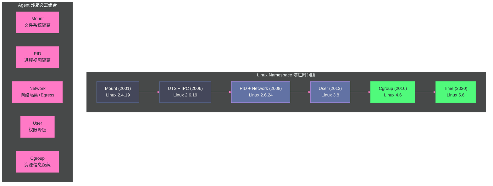
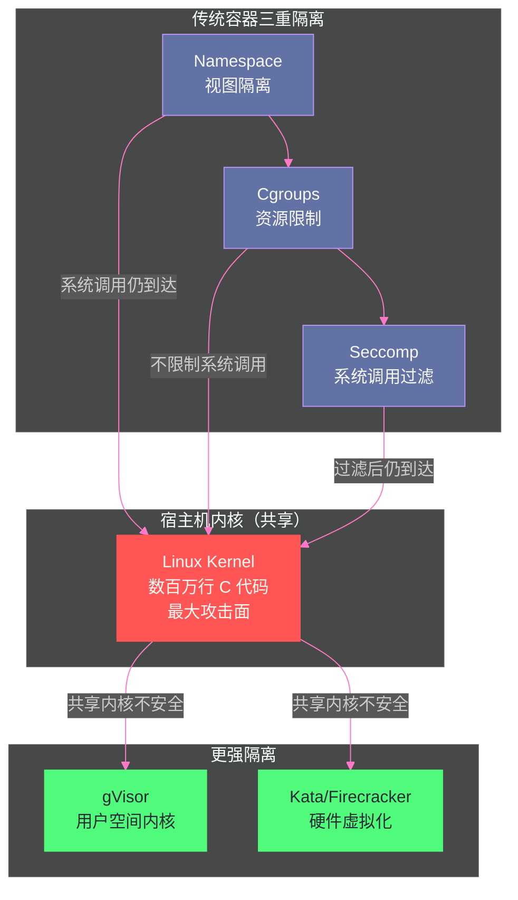

# 02 Linux namespaces——资源隔离的基石

> [!abstract] 摘要
> [[01 Agent 沙箱全景——为什么代码执行 Agent 需要隔离|上一篇]]梳理了从 chroot 到 Firecracker 的隔离演进史，指出 Linux 容器的隔离依赖 namespace + cgroup + seccomp 三种内核机制。本文深入第一种——namespaces。Linux namespace 是容器技术的基石——它不是 Docker 发明的，不是 Kubernetes 发明的，而是 Linux 内核从 2002 年到 2020 年逐步引入的 8 种隔离原语。文章逐一拆解 8 种 namespace（Mount/UTS/IPC/PID/Network/User/Cgroup/Time）的隔离资源、引入版本、使用场景和"不这样会怎样"的反例；深入 user namespace 的"无特权创建"特性与它引发的安全争议（Ubuntu 24.04 限制无特权 user namespace 的三次绕过）；剖析 namespace 的三个操作系统调用（clone/unshare/setns）如何操纵命名空间成员关系；解释"namespace 只是 inode 数字"的内核实现本质；最后讨论为什么 namespace 单独不足以构成沙箱——共享内核、缺少资源限制、缺少系统调用过滤。核心认知：namespace 解决的是"视图隔离"——让进程"以为"自己独占资源，但不解决"限制隔离"——不限制进程能使用多少资源，也不阻止进程通过内核漏洞访问真实资源。

---

## 第 1 章 namespace 的本质——"视图隔离"

### 1.1 什么是 namespace

Linux namespace 的核心思想极其简洁：**把一个全局内核资源包装起来，让一个进程以为它有自己私有的副本**。

考虑一个简单的例子——PID namespace。在没有 PID namespace 的系统中，所有进程共享同一个 PID 空间——进程的 PID 是全局唯一的。但当你把一个进程放入新的 PID namespace 时，这个进程看到的 PID 空间是全新的——它自己是 PID 1，它的子进程是 PID 2、3、4……它看不到外部世界的进程（PID 100、200、300 对它不可见）。

这不是"隐藏"——从内核视角看，外部进程仍然存在，仍然在同一个内核上运行。但从**这个进程的视角**看，它"以为"整个系统只有它和它的子进程。这就是"视图隔离"——改变进程对资源的视图，而非改变资源本身。

> [!info] 核心概念：namespace 只是 inode 数字
> 在内核实现层面，namespace 极其朴素——它只是一个 inode 数字。每个进程在 `/proc/[pid]/ns/` 目录下有一组符号链接，每条链接指向一个 namespace 对象，链接名后面的方括号中是 inode 数字。两个进程的 `/proc/[pid]/ns/net` 如果指向相同的 inode，它们就共享同一个网络 namespace；如果 inode 不同，它们在不同的网络 namespace 中。内核通过比较 inode 数字来判断"这两个进程是否在同一个 namespace 中"——没有更复杂的机制，就是数字比较。这种极简实现是 namespace 轻量的根本原因——创建一个新 namespace 几乎没有内存开销（只是分配一个新的 inode），这也是容器启动速度达到毫秒级的基础。

### 1.2 三个系统调用

namespace 的操纵通过三个系统调用完成：

**clone(flags)**：创建新进程，同时可选地创建新 namespace。`flags` 参数中可以指定 `CLONE_NEW*` 标志来创建对应类型的新 namespace。这是 Docker `run` 底层使用的——Docker 调用 `clone()` 并传入 `CLONE_NEWPID | CLONE_NEWNET | CLONE_NEWNS | ...` 来一次性创建所有需要的 namespace。

**unshare(flags)**：不创建新进程，但把**当前进程**移入新的 namespace。这在"已有进程想进入隔离环境"的场景中使用——如 `unshare --net /bin/bash` 让当前 shell 进入新的网络 namespace。

**setns(fd, nstype)**：把当前进程加入一个**已存在的** namespace。`fd` 是指向目标 namespace 的文件描述符（通过打开 `/proc/[pid]/ns/xxx` 获得）。这是 Docker `exec` 底层使用的——Docker 调用 `setns()` 让新进程加入容器的已有 namespace。

```c
// 三个系统调用的关系
clone(CLONE_NEWNET | CLONE_NEWPID, ...)  // 创建新进程 + 新网络namespace + 新PID namespace
unshare(CLONE_NEWNET)                    // 当前进程进入新网络namespace（不创建新进程）
setns(fd_net, CLONE_NEWNET)              // 当前进程加入fd指向的网络namespace
```

> [!note] 设计哲学：clone/unshare/setns 的"正交设计"
> 三个系统调用覆盖了 namespace 操纵的三个维度：clone 是"创建新进程 + 新空间"，unshare 是"已有进程 + 新空间"，setns 是"已有进程 + 已有空间"。这种正交设计让 namespace 可以灵活组合——你可以创建新进程进新空间（容器启动），让已有进程进新空间（运行时隔离），或让已有进程加入已有空间（docker exec 进入运行中的容器）。这种灵活性是容器运行时能够实现"启动→执行→进入"完整工作流的基础。

### 1.3 创建 namespace 需要什么权限

大多数 namespace 的创建需要 `CAP_SYS_ADMIN` 能力——因为在新 namespace 中，创建者将拥有改变全局资源的权力，这些改变可能影响后续加入该 namespace 的进程。

**例外：user namespace**。自 Linux 3.8（2013 年）起，创建 user namespace **不需要任何特权**——无特权用户也可以创建 user namespace。这个"无特权创建"特性是 rootless 容器（无根容器）的基础，但也引发了严重的安全争议（本章第 4 节深入讨论）。

---

## 第 2 章 8 种 namespace 逐一拆解

### 2.1 Mount Namespace（CLONE_NEWNS，Linux 2.4.19，2001）

**隔离资源**：挂载点视图——每个 mount namespace 有自己的挂载表。进程在一个 mount namespace 中 mount/umount 文件系统，不影响其他 mount namespace 中的进程看到的挂载视图。

**引入背景**：Mount namespace 是 Linux 的**第一个** namespace——2001 年在 Linux 2.4.19 中引入。它是最自然的隔离维度——"让进程看到不同的文件系统视图"。

**容器中的角色**：Docker 用 mount namespace 让容器看到自己的文件系统层次——容器的根文件系统（image layer 通过 OverlayFS 合并）只对容器内的进程可见，宿主机上其他进程看不到这个挂载视图。

**不这样会怎样**：如果没有 mount namespace，所有进程共享同一个挂载表——你给容器 mount 一个 overlay 文件系统，宿主机上所有进程都能看到这个挂载。这意味着容器的文件系统隔离完全不存在——任何进程都能访问容器的文件。

> [!warning] 生产避坑：mount namespace 的"传播性"陷阱
> mount namespace 有一个容易踩的坑——挂载传播性（mount propagation）。默认情况下，一个 mount namespace 中的挂载**可能**传播到其他 namespace（取决于挂载点的传播类型：MS_PRIVATE/MS_SHARED/MS_SLAVE/MS_UNBINDABLE）。如果容器的根挂载点没有正确设置为 MS_PRIVATE，容器内的 mount 操作可能"泄漏"到宿主机的挂载表中。Docker/Podman 在创建容器时会显式设置传播类型为 MS_PRIVATE 来防止这种泄漏，但如果你自己用 unshare/clone 做 namespace 隔离，必须手动设置传播类型——否则可能出现"容器 mount 了东西，宿主机也看到了"的诡异现象。

### 2.2 UTS Namespace（CLONE_NEWUTS，Linux 2.6.19，2006）

**隔离资源**：主机名（hostname）和 NIS 域名——两个 `uname` 系统调用返回的字符串。

**名字来源**：UTS = UNIX Timesharing System，来自 `struct utsname`——这是一个历史悠久的 Unix 数据结构，存储系统标识信息。

**容器中的角色**：让每个容器有自己的 hostname——如 `hostname` 命令在容器中返回容器名而非宿主机名。这对需要 hostname 做服务发现的应用很重要。

**不这样会怎样**：如果没有 UTS namespace，所有进程共享同一个 hostname——容器中的 `hostname` 命令返回宿主机的 hostname。这可能导致依赖 hostname 的应用行为异常（如某些中间件用 hostname 做节点标识）。

**为什么是最简单的 namespace**：UTS namespace 只隔离两个字符串——hostname 和 domainname。没有复杂的数据结构，没有资源管理，只是"让进程看到不同的系统名"。它是理解 namespace 概念的最好起点——如果 UTS namespace 的概念你理解了（"让进程看到不同的 hostname"），其他 namespace 只是"让进程看到不同的 X"的变体。

### 2.3 IPC Namespace（CLONE_NEWIPC，Linux 2.6.19，2006）

**隔离资源**：System V IPC 和 POSIX 消息队列——包括共享内存段（`shmget`）、信号量集（`semget`）、消息队列（`msgget`）。

**容器中的角色**：让容器有自己的 IPC 资源空间——容器 A 创建的共享内存段不会被容器 B 看到。

**不这样会怎样**：如果没有 IPC namespace，所有进程共享同一个 IPC 资源空间——容器 A 和容器 B 可能因为使用了相同的 IPC key 而产生冲突（一个容器创建的共享内存段被另一个容器意外访问）。

**实际影响较小**：在现代应用中，System V IPC 的使用频率远低于 POSIX IPC 和其他消息传递机制（如 Redis、RabbitMQ）。很多容器化应用甚至不使用 System V IPC，因此 IPC namespace 的实际影响较小——但它仍然是容器隔离的一个维度。

### 2.4 PID Namespace（CLONE_NEWPID，Linux 2.6.24，2008）

**隔离资源**：进程 ID 空间——每个 PID namespace 有自己的 PID 编号空间。在新 PID namespace 中创建的第一个进程是 PID 1。

**容器中的角色**：让容器中的进程看到自己的 PID 树——容器的入口进程是 PID 1，其子进程是 PID 2、3、4……容器内进程看不到宿主机上的其他进程。

**PID 1 的特殊职责**：在 PID namespace 中，PID 1 有特殊职责——它是"init 进程"，负责回收孤儿进程（reaping zombies）和处理信号。如果 PID 1 退出，该 namespace 中的所有进程都会被 SIGKILL。这就是为什么 Docker 容器需要"init 进程"（如 `tini`）——如果你的应用不是为做 PID 1 设计的（不回收僵尸进程），可能导致进程泄漏。

**不这样会怎样**：如果没有 PID namespace，容器中的进程可以看到宿主机上的所有进程——`ps aux` 在容器中会列出宿主机的所有进程。这不仅泄露了宿主机的进程信息（安全风险），还可能导致依赖 PID 的应用行为异常。

> [!warning] 生产避坑：PID namespace 的 `/proc` 陷阱
> PID namespace 有一个容易踩的坑——创建了新的 PID namespace 后，`ps` 命令仍然可能显示宿主机的进程！原因是 `ps` 从 `/proc` 文件系统读取进程信息，而 `/proc` 是 mount namespace 管辖的。如果你只创建了 PID namespace 但没有同时创建 mount namespace 并重新挂载 `/proc`，`ps` 读取的仍然是宿主机的 `/proc`——显示的是宿主机的进程列表。Docker 在创建容器时同时创建 PID namespace 和 mount namespace，并在新 mount namespace 中重新挂载 `/proc`——这样 `ps` 才能正确显示容器内的进程。这个"陷阱"说明 namespace 之间需要组合使用——单一 namespace 往往不够。

### 2.5 Network Namespace（CLONE_NEWNET，Linux 2.6.24，2008）

**隔离资源**：网络栈——包括网络设备（网卡）、IP 地址、路由表、端口号、防火墙规则、`/proc/net`、`/sys/class/net`。

**容器中的角色**：让容器有独立的网络栈——容器可以有自己 IP 地址、自己的端口绑定（两个容器都可以绑定 80 端口而不冲突）、自己的路由表。

**不这样会怎样**：如果没有 network namespace，所有进程共享同一个网络栈——两个容器不能同时绑定 80 端口；容器可以看到宿主机的路由表和防火墙规则；容器的网络流量直接走宿主机的网络设备。

**网络 namespace 的连接**：独立的 network namespace 是隔离的——默认无法与外部通信。容器网络（如 Docker bridge、Kubernetes CNI）通过虚拟以太网对（veth pair）连接不同的 network namespace——一端在容器 namespace 中，另一端在宿主机 namespace 中，数据在两端之间传递。

**对 Agent 沙箱的特殊意义**：Network namespace 是 Agent 沙箱 Egress 过滤的基础——通过把 Agent 放入独立的 network namespace，可以对其网络流量做独立控制（iptables/eBPF 规则只作用于该 namespace）。本专栏第 10 篇将深入讨论 Egress 过滤的实现。

### 2.6 User Namespace（CLONE_NEWUSER，Linux 3.8，2013）

**隔离资源**：用户 ID 和组 ID——在 user namespace 内，uid/gid 可以与外部不同。一个在宿主机上是 uid 1000 的用户，在某个 user namespace 内可以是 uid 0（root）。

**UID/GID 映射**：user namespace 通过 `/proc/[pid]/uid_map` 和 `/proc/[pid]/gid_map` 文件定义映射关系。如 `0 1000 65536` 表示"namespace 内的 uid 0-65535 映射到宿主机的 uid 1000-65535"。

**无特权创建**：user namespace 是唯一一个不需要 `CAP_SYS_ADMIN` 就能创建的 namespace。这意味着非 root 用户可以创建 user namespace，在其中"成为 root"——但这个"root"只在 namespace 内有效，映射到宿主机上是一个非特权用户。

**rootless 容器的基础**：Podman 和 Docker 的 rootless 模式依赖 user namespace——不需要宿主机 root 权限就能运行容器。容器内的 root（uid 0）在宿主机上映射为一个非特权用户——即使容器内的进程"逃逸"到宿主机，它也只有非特权用户的权限。

**安全争议**：user namespace 的"无特权创建"特性是一把双刃剑——它让 rootless 容器成为可能，但也让无特权用户可以进入"有 CAP_SYS_ADMIN 的环境"，从而触及内核中需要 CAP_SYS_ADMIN 的代码路径——这些路径中可能存在未被充分审计的漏洞。CVE-2024-1086（nf_tables use-after-free）就是典型案例——无特权用户通过 user namespace 获得了访问 `nf_tables` 子系统的能力，进而利用漏洞获得 root 权限。

> [!warning] 生产避坑：Ubuntu 24.04 限制无特权 user namespace 的三次绕过
> Ubuntu 24.04 默认启用了 `kernel.apparmor_restrict_unprivileged_userns`——限制无特权 user namespace 的创建（允许创建但拒绝在 namespace 内获得额外能力）。但 Qualys 研究团队发现了三种绕过方式：1）使用 `aa-exec` 切换到允许创建完整 user namespace 的 AppArmor profile（如 chrome/flatpak profile）；2）通过 busybox shell 绕过；3）第三种绕过方式（细节见 Qualys 报告）。这证明"限制无特权 user namespace"在实践中很难做到无缝——总有一些预配置的 profile 留有后门。这个争议揭示了 user namespace 的根本矛盾——"让非特权用户做需要特权的事"与"防止非特权用户滥用特权代码路径"之间的张力。

### 2.7 Cgroup Namespace（CLONE_NEWCGROUP，Linux 4.6，2016）

**隔离资源**：cgroup 根目录视图——在 cgroup namespace 内，进程看到的 cgroup 层次结构以它所在的 cgroup 为根，而非宿主机的完整 cgroup 层次。

**容器中的角色**：让容器内的进程看到"自己的 cgroup 是根"——而非看到宿主机的完整 cgroup 层次。这防止容器内的进程通过读取 `/proc/self/cgroup` 获知宿主机的 cgroup 结构信息。

**不这样会怎样**：如果没有 cgroup namespace，容器内的进程可以通过 `/proc/self/cgroup` 看到它在宿主机 cgroup 层次中的完整路径——如 `/docker/<container_id>`——这泄露了宿主机的 cgroup 组织信息。

### 2.8 Time Namespace（CLONE_NEWTIME，Linux 5.6，2020）

**隔离资源**：单调时钟（monotonic clock）和启动时间（boot time）——在 time namespace 内，可以偏移单调时钟的起点和启动时间。

**容器中的角色**：让容器可以有自己的"时间起点"——如一个容器 checkpoint/restore 后，它的单调时钟可以从 checkpoint 时刻继续，而非从宿主机启动时刻开始。

**不这样会怎样**：如果没有 time namespace，所有进程共享同一个时钟——容器 checkpoint/restore 后，单调时钟会跳跃（从 checkpoint 时的值跳到 restore 时的值），可能导致依赖时间间隔的应用行为异常。

**Agent 沙箱的价值**：对于需要 checkpoint/restore 的 Agent 沙箱（如 GKE Agent Sandbox 的 Pod Snapshots），time namespace 让恢复后的 Agent 看到连续的时间流逝而非时间跳跃——这对测量执行时间、设置超时等场景很重要。

### 2.9 8 种 namespace 全景表

| Namespace | Flag | 内核版本 | 隔离资源 | 创建需特权 | Agent 沙箱价值 |
| :--- | :--- | :--- | :--- | :--- | :--- |
| **Mount** | CLONE_NEWNS | 2.4.19 (2001) | 挂载点视图 | CAP_SYS_ADMIN | 文件系统隔离 |
| **UTS** | CLONE_NEWUTS | 2.6.19 (2006) | 主机名/域名 | CAP_SYS_ADMIN | 标识隔离 |
| **IPC** | CLONE_NEWIPC | 2.6.19 (2006) | System V IPC | CAP_SYS_ADMIN | IPC 资源隔离 |
| **PID** | CLONE_NEWPID | 2.6.24 (2008) | 进程 ID | CAP_SYS_ADMIN | 进程视图隔离 |
| **Network** | CLONE_NEWNET | 2.6.24 (2008) | 网络栈 | CAP_SYS_ADMIN | 网络隔离+Egress 控制基础 |
| **User** | CLONE_NEWUSER | 3.8 (2013) | 用户/组 ID | **不需要** | rootless 容器+权限降级 |
| **Cgroup** | CLONE_NEWCGROUP | 4.6 (2016) | cgroup 视图 | CAP_SYS_ADMIN | cgroup 信息隐藏 |
| **Time** | CLONE_NEWTIME | 5.6 (2020) | 单调时钟 | CAP_SYS_ADMIN | checkpoint/restore 时间连续性 |



---

## 第 3 章 namespace 的组合使用

### 3.1 单一 namespace 不够

从第 2 章的逐个分析中可以清楚看到——单一 namespace 几乎都不足以构成有意义的隔离：

- 只有 mount namespace？进程还能看到外部进程（PID 共享）、使用宿主机网络（网络共享）
- 只有 PID namespace？`ps` 还是显示宿主机进程（因为 `/proc` 还是宿主机的）
- 只有 network namespace？文件系统、进程、用户都还共享

有意义的隔离需要**组合使用多种 namespace**——这正是容器运行时（Docker/runc）做的事。

### 3.2 容器的标准 namespace 组合

Docker 创建一个容器时，默认创建以下 namespace 组合：

| Namespace | 为什么需要 |
| :--- | :--- |
| **Mount** | 隔离文件系统视图——容器看到自己的 overlayfs 根 |
| **PID** | 隔离进程视图——容器只看到自己的进程 |
| **Network** | 隔离网络栈——容器有自己的 IP 和端口 |
| **IPC** | 隔离 IPC 资源——容器的共享内存不被其他容器看到 |
| **UTS** | 隔离 hostname——容器有自己的主机名 |
| **Cgroup** | 隔离 cgroup 视图——容器不知道宿主机的 cgroup 结构 |

**User namespace 默认不启用**——传统 Docker 容器内的 root 就是宿主机的 root（这是容器逃逸风险高的核心原因）。rootless 模式（Podman / Docker rootless）才启用 user namespace，把容器内的 root 映射为宿主机的非特权用户。

**Time namespace 默认不启用**——只在 checkpoint/restore 场景（如 CRIU）中使用。

### 3.3 Agent 沙箱的 namespace 需求

Agent 沙箱对 namespace 的需求与容器类似，但有一个额外强调：

**Network namespace 是必须的**——Agent 沙箱必须做 Egress 网络过滤（防止数据外泄），而 Egress 过滤的前提是 Agent 在独立的 network namespace 中——这样才能对该 namespace 的网络流量做独立控制。

**User namespace 强烈推荐**——Agent 代码是不可信的，如果它在容器内获得了 root 权限并通过内核漏洞逃逸到宿主机，后果严重。User namespace 把容器内的 root 映射为宿主机的非特权用户——即使逃逸，也只有非特权权限。

> [!info] 核心概念：runc 官方推荐 user namespace 作为容器逃逸防御
> 2025 年 11 月的 runc CVE 披露中，官方明确推荐："Use containers with user namespaces (with the host root user not mapped into the container's user namespace). This will block most of the most serious aspects of these attacks."——使用 user namespace（且不把宿主机 root 映射进容器的 user namespace），可以阻止这些攻击中最严重的部分。原因是这些攻击利用的 `/proc` 文件受 Unix DAC 权限保护——user namespace 内的用户没有权限访问相关文件。这说明 user namespace 不只是"让 rootless 容器成为可能"的便利特性，而是"对抗容器逃逸"的关键防御层。

---

## 第 4 章 User Namespace 的安全争议

### 4.1 矛盾的核心

User namespace 的核心矛盾：

**正面**：让非特权用户可以创建隔离环境——rootless 容器、沙箱、应用沙箱化（如 Chrome 的渲染进程用 user namespace 隔离）。这降低了容器使用的门槛，也让更多应用可以用 namespace 做隔离。

**负面**：让非特权用户可以进入"有 CAP_SYS_ADMIN/CAP_NET_ADMIN 等特权的环境"——虽然这些特权只在 namespace 内有效，但它们让进程可以触及内核中需要这些特权的代码路径。这些代码路径中可能存在未被充分审计的漏洞——因为历史上只有 root 才能到达这些路径，审计强度不如"任何人都能到达"的路径。

### 4.2 CVE-2024-1086——user namespace 成为漏洞的"门"

CVE-2024-1086 是 netfilter `nf_tables` 子系统的一个 use-after-free 漏洞（CVSS 7.8）。正常情况下，配置防火墙（`nf_tables`）需要 root 权限——无特权用户无法触及这个代码路径。但通过 user namespace，无特权用户可以创建一个自己在其中是 root 的 namespace，获得 `CAP_NET_ADMIN`，从而可以配置 `nf_tables`——把漏洞的代码路径置于无特权用户的触达范围内。

研究者 Notselwyn 在 2024 年 3 月发布了高度可靠的漏洞利用代码，覆盖内核 5.14 到 6.6——一个"可靠的无特权本地提权漏洞"是极其危险的武器。

**争论**：这个漏洞应该归咎于 `nf_tables` 子系统（代码有 bug）还是 user namespace（让无特权用户能到达有 bug 的代码）？两种观点都有支持者——内核开发者倾向于"nf_tables 应该更安全"，安全研究者倾向于"user namespace 不应该让无特权用户到达这里"。

### 4.3 Ubuntu 24.04 的限制与三次绕过

Ubuntu 24.04 默认启用了 `kernel.apparmor_restrict_unprivileged_userns`——试图限制无特权 user namespace 的创建。策略是"允许创建但拒绝在 namespace 内获得额外能力"——让 rootless 容器仍能工作（只需要基本隔离），但阻止利用 user namespace 触达特权代码路径。

但 Qualys 发现了三种绕过方式：
1. **aa-exec 绕过**：使用 `aa-exec` 切换到预配置的允许完整 user namespace 的 AppArmor profile（如 Chrome、Flatpak 的 profile）
2. **busybox 绕过**：通过 busybox shell 绕过限制
3. **第三种绕过**：详见 Qualys 报告

这证明"在操作系统层面限制 user namespace 的能力"在实践中很难做到无缝——系统中总有预配置的 profile 留有"合法使用 user namespace"的通道，攻击者可以利用这些通道。

> [!note] 设计哲学：user namespace 的"民主化隔离"悖论
> User namespace 的设计初衷是"民主化隔离"——让非特权用户也能创建隔离环境，不依赖 root。这个初衷是好的——它让 rootless 容器、应用沙箱化成为可能。但"民主化"也意味着"更多人能触达更多内核代码路径"——包括那些有漏洞的路径。这是一个经典的"安全民主化悖论"——降低使用门槛让更多人受益于安全特性，但同时也扩大了攻击面。Ubuntu 的限制尝试和三次绕过证明，这个悖论没有简单的解决方案——你很难在"让合法用户用"和"阻止攻击者用"之间做出完美区分。

---

## 第 5 章 为什么 namespace 单独不足以构成沙箱

### 5.1 三个根本不足

尽管 8 种 namespace 组合使用提供了相当全面的视图隔离，但 namespace 单独仍然不足以构成沙箱——有三个根本性的不足：

**不足一：共享宿主内核**

这是最致命的不足。无论你创建了多全面的 namespace 组合，容器进程的系统调用仍然由**宿主机内核**处理。namespace 改变的是进程对资源的"视图"，而非资源本身的"处理者"。

```
容器进程 → syscall → 宿主机内核（同一个内核！）→ 处理 → 返回
```

一个内核漏洞（如 Dirty Pipe CVE-2022-0847）可以让容器进程绕过所有 namespace 隔离——因为漏洞在内核层面，namespace 在内核层面，绕过 namespace 的内核漏洞直接访问真实资源。

这就是为什么 [[01 Agent 沙箱全景——为什么代码执行 Agent 需要隔离|第 1 篇]]讨论的 gVisor 和 Kata/Firecracker 要把信任边界从"共享内核"移开——它们不依赖 namespace 的视图隔离，而是用用户空间内核或硬件虚拟化提供真正的"独立内核"。

**不足二：缺少资源限制**

Namespace 不限制进程能使用多少资源——一个进程在新 namespace 中仍然可以耗尽宿主机的 CPU、内存、磁盘 I/O。资源限制是 cgroups 的职责——namespace 管"能看到什么"，cgroups 管"能用多少"。

一个 Agent 沙箱必须同时做视图隔离（namespace）和资源限制（cgroups）——只做 namespace 不做 cgroups，Agent 执行的代码可能通过 `while(true){}` 循环耗尽宿主机 CPU，或通过 `malloc` 无限分配耗尽宿主机内存。

**不足三：缺少系统调用过滤**

Namespace 不限制进程能调用哪些系统调用——一个进程在新 namespace 中仍然可以调用所有系统调用（如 `ptrace`、`mount`、`reboot`）。系统调用过滤是 seccomp 的职责。

一个 Agent 沙箱应该用 seccomp 限制容器进程能调用的系统调用——如禁止 `ptrace`（防止调试其他进程）、禁止 `mount`（防止修改挂载表）、禁止 `reboot`（防止重启系统）。

### 5.2 namespace + cgroups + seccomp 的三重组合

真正的容器隔离是三种机制的组合：

| 机制 | 解决什么 | 本专栏对应篇 |
| :--- | :--- | :--- |
| **namespaces** | 视图隔离——进程能看到什么 | 本文（第 2 篇） |
| **cgroups** | 资源限制——进程能用多少 | 第 3 篇 |
| **seccomp + capabilities** | 系统调用过滤——进程能做什么 | 第 4 篇 |

三者的关系是"叠加防御"——namespace 是第一层（视图隔离），cgroups 是第二层（资源限制），seccomp 是第三层（系统调用过滤）。任何一层被突破，其他层仍然提供保护。但如果三层都被突破（如一个内核漏洞同时绕过 namespace 和 seccomp），进程就逃逸了——这就是为什么对"不可信代码"还需要 gVisor/Kata/Firecracker 的更强隔离。



> [!info] 核心概念：namespace 是"必要但不充分"的隔离
> Namespace 是容器隔离的"必要"组件——没有 namespace，容器进程和宿主机进程共享所有资源视图，谈不上隔离。但 namespace 不是"充分"的——它只解决视图隔离，不解决资源限制和系统调用过滤。对于运行可信代码的传统容器，namespace + cgroups + seccomp 的三重组合通常够用。但对于运行 AI 生成的不可信代码的 Agent 沙箱，三重组合仍然不够——因为它们都共享宿主内核，一个内核漏洞就能突破所有三层。Agent 沙箱需要把信任边界进一步移开——到用户空间内核（gVisor）或硬件虚拟化（Kata/Firecracker）。namespace 是沙箱的"第一层"，但不是"唯一层"。

---

## 第 6 章 总结与下一篇导读

### 6.1 本文核心要点

1. **namespace 的本质是"视图隔离"**：让进程"以为"自己有独占的资源副本，但不改变资源本身——进程的系统调用仍然到达共享的宿主内核
2. **8 种 namespace 逐步引入**：Mount(2001) → UTS+IPC(2006) → PID+Network(2008) → User(2013) → Cgroup(2016) → Time(2020)，每种隔离一个维度
3. **三个系统调用操纵 namespace**：clone（创建新进程+新空间）、unshare（已有进程+新空间）、setns（已有进程+已有空间）——正交设计覆盖所有操纵维度
4. **namespace 是 inode 数字**：内核通过比较 `/proc/[pid]/ns/` 下的 inode 数字判断进程是否在同一 namespace——极简实现，几乎零内存开销
5. **单一 namespace 不足**：PID namespace 需要 mount namespace 配合才能让 `ps` 正确工作——namespace 之间需要组合
6. **user namespace 的双刃剑**：无特权创建让 rootless 容器成为可能，但也让无特权用户能触达特权代码路径——CVE-2024-1086 证明了这条路径的危险
7. **namespace 单独不构成沙箱**：缺少资源限制（需要 cgroups）、缺少系统调用过滤（需要 seccomp）、共享宿主内核（需要 gVisor/Kata/Firecracker）

### 6.2 下一篇导读

本文深入了 namespace——容器隔离的"视图隔离"层。下一篇 [[03 cgroups v2——资源限制的统一层级]] 将深入 cgroups——容器隔离的"资源限制"层。cgroups v2 相比 v1 做了什么根本性改进？统一层级结构解决了 v1 的什么问题？PSI（Pressure Stall Information）如何帮助 Agent 沙箱监控资源压力？cgroup v2 在 containerd/CRI-O 中的采用现状如何？

> [!info] 专栏导航
> 本文是 [[00 专栏导览|Agent 沙箱与隔离技术专栏]] 的第 2 篇。上一篇 [[01 Agent 沙箱全景——为什么代码执行 Agent 需要隔离|Agent 沙箱全景]] 建立了从 chroot 到 MicroVM 的演进地图；本文深入了其中的 namespace 基石；接下来第 3-4 篇将完成 cgroups 和 seccomp/capabilities 的讨论，构成"传统容器三重隔离"的完整图景。

---

## 参考文献

1. Linux man pages. "namespaces(7)." https://www.man7.org/linux/man-pages/man7/namespaces.7.html
2. Linux man pages. "clone(2)." https://man7.org/linux/man-pages/man2/clone.2.html
3. Linux man pages. "setns(2)." https://man7.org/linux/man-pages/man2/setns.2.html
4. "Linux Namespaces Explained: All 7 Types with /proc Evidence." https://rootcause.hashnode.dev/what-is-a-linux-namespace-really-all-7-explained
5. "Linux Namespaces and Cgroups — The Foundation of Containerization." https://systeminternals.dev/linux/namespaces/
6. Qualys. "Three bypasses of Ubuntu's unprivileged user namespace restrictions." 2025. https://www.qualys.com/2025/three-bypasses-of-Ubuntu-unprivileged-user-namespace-restrictions.txt
7. "The Linux firewall bug your users can reach because you gave them a private root." https://patchdayalert.com/blog/linux-cve-2024-1086-nf-tables-user-namespaces/
8. runc CVE-2025-31133 Advisory. https://github.com/advisories/GHSA-9493-h29p-rfm2
9. "OCI Fixes Container Escape Vulnerabilities in runc." https://securityonline.info/oci-fixes-container-escape-vulnerabilities-in-runc-cve-2025-31133-cve-2025-52565-cve-2025-52881/

---

## 思考题

1. **PID namespace 有"PID 1 特殊职责"——回收僵尸进程和处理信号。如果一个 Agent 沙箱的入口进程不是为做 PID 1 设计的（如 `python agent.py`），它可能不回收僵尸进程。这会导致什么问题？如何解决？** 提示：考虑"僵尸进程泄漏"——子进程退出后如果父进程不调用 `wait()`，子进程的 PCB（进程控制块）不会被释放，长期运行后可能耗尽 PID 空间。解决方案是使用 init 进程（如 `tini`）做 PID 1，由它回收僵尸进程。

2. **Ubuntu 24.04 限制无特权 user namespace 的策略被 Qualys 发现了三种绕过方式。这是否说明"限制无特权 user namespace"这条路走不通？如果走不通，应该怎么应对 user namespace 的安全风险？** 提示：考虑两种替代方向——1）不限制创建，但加强内核中特权代码路径的审计和加固（让有漏洞的代码路径变少）；2）用 seccomp 限制 user namespace 内进程能调用的系统调用（如禁止 `nf_tables` 相关调用）。两种方向各有优劣——前者是"根治"但工作量大，后者是"缓解"但可能影响合法使用。

3. **namespace 只做"视图隔离"——进程的系统调用仍然到达共享的宿主内核。但 gVisor 的 Sentry 也是"在用户空间处理系统调用"——从某种角度看，gVisor 不就是"让每个容器有自己的系统调用视图"吗？gVisor 与 namespace 的本质区别是什么？** 提示：namespace 改变的是"进程看到什么资源"——但系统调用的处理逻辑仍在宿主内核。gVisor 改变的是"谁处理系统调用"——Sentry 在用户空间重新实现了系统调用处理逻辑，宿主内核根本不看到容器进程的原始系统调用。这是"视图层"与"处理层"的根本区别。
